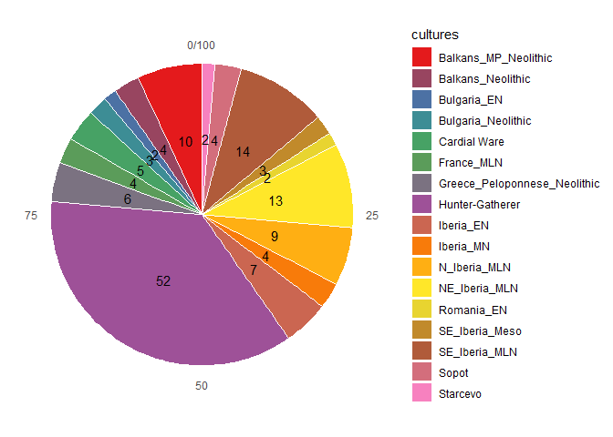
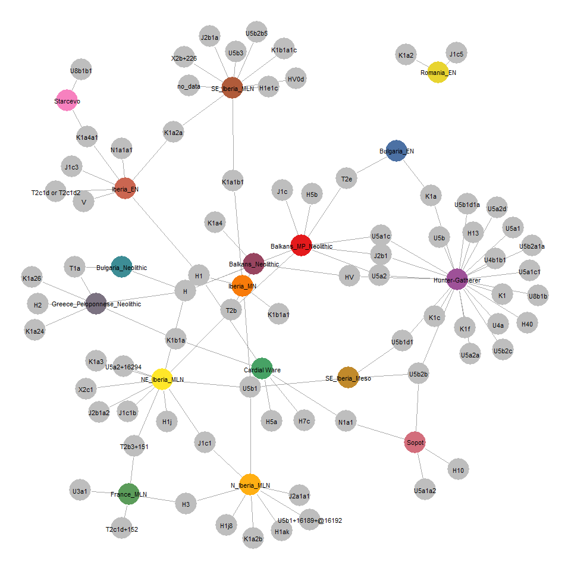
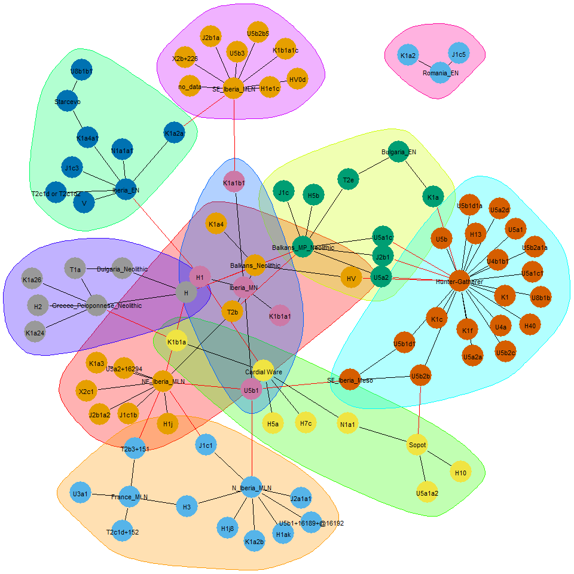
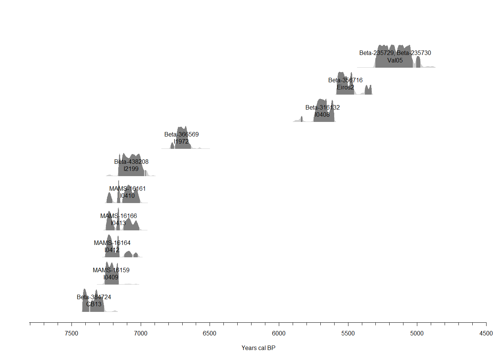
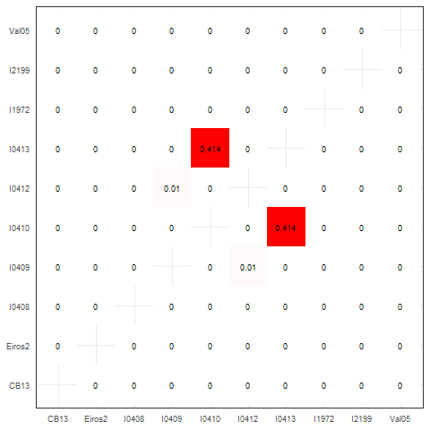

<style>
.html-widget {
margin: auto;
}
.leaflet .legend {
text-align:left;
line-height: 12px;
font-size: 12px;
}
</style>


Gene-culture coevolution (GC-coev) is one of the main challenge of evolutionary archaeology. It requires the cross study of aDNA (['***Who ?***'](https://github.com/zoometh/thomashuet/blob/main/README.md#who)) and the different aspects of the culture (['***What ?***'](https://github.com/zoometh/thomashuet/blob/main/README.md#what)). 

This doc is a HTML presentation host on [GitHub](https://github.com/zoometh/aDNA), which brings together R + Leaflet coding showing how to reuse mtDNA data and perform cross-analysis between gene, culture and radiocarbon dates. This overview focus on the the transition between hunter-gatherers (HG) and early farmers (EF) in the Central and West Europe

# The AmtDB dataset

The mitochondrial DNA (mtDNA) makes it possible to trace the maternal line. It passes from the mother to her children (of both sexes). Published mitochondrial sequences coming from the ancient DNA samples (aDNA) can be download from the [Ancient mtDNA database (AmtDB)](amtdb). This database gathers . The whole dataset is composed by the [data](#mt.data) and the [metadata](#mt.meta)


## data {#mt.data}

The data file [mtdb_1511.fasta](mtdb_1511.fasta) is downloaded from the AmtDB. The current metadata format is .fasta, a text-based format for representing either nucleotide sequences or peptide sequences, in which base pairs or amino acids are represented using single-letter codes. FASTA formats can be read with the [phylotools](https://github.com/helixcn/phylotools) package. A sequence in FASTA format begins with a single-line description, followed by lines of sequence data:


```r
fasta <- read.fasta("mtdb_1511.fasta")
fasta$seq.name[1]
```

```
## [1] "RISE509"
```

```r
substr(fasta$seq.text[1], 1, 250)
```

```
## [1] "GATCACAGGTCTATCACCCTATTAACCACTCACGGGAGCTCTCCATGCATTTGGTATTTTCGTCTGGGGGGTGTGCACGCGATAGCATTGCGAGACGCTGGAGCCGGAGCACCCTATGTCGCAGTATCTGTCTTTGATTCCTGCCTCATCCTATTATTTATCGCACCTACGTTCAATATTACAGGCGAACATACTTACTAAAGTGTGTTAATTAATTAATGCTTGTAGGACATAATAATAACAATTGAAT"
```
Each of these identifiers is a unique key for a sample. The data file counts <span style='color:grey'>1511</span> different identifiers. These identifiers which allow to join the second dataset, [metadata](#mt.meta) for cross-analysis

## metadata {#mt.meta}

The metadata file [metadata](mtdb_metadata.csv) is a .csv file recording the site name, culture, epoch, geographical coordinates, etc.: 

<table class="table" style="font-size: 11px; width: auto !important; margin-left: auto; margin-right: auto;">
<caption style="font-size: initial !important;">(\#tab:meta1)Sample of mtDNA metatadata</caption>
 <thead>
  <tr>
   <th style="text-align:left;"> identifier </th>
   <th style="text-align:left;"> alternative_identifiers </th>
   <th style="text-align:left;"> country </th>
   <th style="text-align:left;"> continent </th>
   <th style="text-align:left;"> region </th>
   <th style="text-align:left;"> culture </th>
   <th style="text-align:left;"> epoch </th>
   <th style="text-align:left;"> group </th>
   <th style="text-align:left;"> comment </th>
   <th style="text-align:right;"> latitude </th>
   <th style="text-align:right;"> longitude </th>
   <th style="text-align:left;"> sex </th>
   <th style="text-align:left;"> site </th>
   <th style="text-align:left;"> site_detail </th>
   <th style="text-align:left;"> mt_hg </th>
   <th style="text-align:left;"> ychr_hg </th>
   <th style="text-align:right;"> year_from </th>
   <th style="text-align:right;"> year_to </th>
   <th style="text-align:left;"> date_detail </th>
   <th style="text-align:left;"> bp </th>
   <th style="text-align:left;"> c14_lab_code </th>
   <th style="text-align:left;"> reference_names </th>
   <th style="text-align:left;"> reference_links </th>
   <th style="text-align:left;"> reference_data_links </th>
   <th style="text-align:right;"> c14_sample_tag </th>
   <th style="text-align:right;"> c14_layer_tag </th>
   <th style="text-align:right;"> avg_coverage </th>
   <th style="text-align:left;"> sequence_source </th>
   <th style="text-align:left;"> ychr_snps </th>
  </tr>
 </thead>
<tbody>
  <tr>
   <td style="text-align:left;"> I8155 </td>
   <td style="text-align:left;"> 11832 </td>
   <td style="text-align:left;"> Spain </td>
   <td style="text-align:left;"> Europe </td>
   <td style="text-align:left;"> Iberia </td>
   <td style="text-align:left;"> SE_Iberia_CA </td>
   <td style="text-align:left;"> Copper Age </td>
   <td style="text-align:left;"> CAIB </td>
   <td style="text-align:left;">  </td>
   <td style="text-align:right;"> 37.2400 </td>
   <td style="text-align:right;"> -4.24000 </td>
   <td style="text-align:left;"> F </td>
   <td style="text-align:left;"> Sima del Ángel, Lucena, Córdoba, Andalusia </td>
   <td style="text-align:left;">  </td>
   <td style="text-align:left;"> H4a1a </td>
   <td style="text-align:left;">  </td>
   <td style="text-align:right;"> -2900 </td>
   <td style="text-align:right;"> -2500 </td>
   <td style="text-align:left;"> 2900–2500 BCE </td>
   <td style="text-align:left;">  </td>
   <td style="text-align:left;">  </td>
   <td style="text-align:left;"> Olalde et al. 2019 </td>
   <td style="text-align:left;"> https://doi.org/10.1126/science.aav4040 </td>
   <td style="text-align:left;"> https://www.ebi.ac.uk/ena/browser/view/PRJEB30874 </td>
   <td style="text-align:right;"> 0 </td>
   <td style="text-align:right;"> 0 </td>
   <td style="text-align:right;"> 6.37 </td>
   <td style="text-align:left;"> bam </td>
   <td style="text-align:left;">  </td>
  </tr>
  <tr>
   <td style="text-align:left;"> I7646 </td>
   <td style="text-align:left;"> LL7 </td>
   <td style="text-align:left;"> Spain </td>
   <td style="text-align:left;"> Europe </td>
   <td style="text-align:left;"> Iberia </td>
   <td style="text-align:left;"> SE_Iberia_MLN </td>
   <td style="text-align:left;"> Neolithic </td>
   <td style="text-align:left;"> NEIB </td>
   <td style="text-align:left;"> Middle-Late Neolithic </td>
   <td style="text-align:right;"> 38.7025 </td>
   <td style="text-align:right;"> -0.48631 </td>
   <td style="text-align:left;"> F </td>
   <td style="text-align:left;"> Les Llometes, Alcoi, Alacant/Alicante, Valencian Community </td>
   <td style="text-align:left;">  </td>
   <td style="text-align:left;"> H1e1c </td>
   <td style="text-align:left;">  </td>
   <td style="text-align:right;"> -3710 </td>
   <td style="text-align:right;"> -3630 </td>
   <td style="text-align:left;"> 3710–3630 cal BCE (4880±28 BP, MAMS-16339) </td>
   <td style="text-align:left;"> 4880±28 </td>
   <td style="text-align:left;">  </td>
   <td style="text-align:left;"> Olalde et al. 2019 </td>
   <td style="text-align:left;"> https://doi.org/10.1126/science.aav4040 </td>
   <td style="text-align:left;"> https://www.ebi.ac.uk/ena/browser/view/PRJEB30874 </td>
   <td style="text-align:right;"> 1 </td>
   <td style="text-align:right;"> 0 </td>
   <td style="text-align:right;"> 21.20 </td>
   <td style="text-align:left;"> bam </td>
   <td style="text-align:left;">  </td>
  </tr>
  <tr>
   <td style="text-align:left;"> RISE175 </td>
   <td style="text-align:left;"> barrow I grave 14:1 </td>
   <td style="text-align:left;"> Sweden </td>
   <td style="text-align:left;"> Europe </td>
   <td style="text-align:left;"> Scandinavia </td>
   <td style="text-align:left;"> Nordic_BA </td>
   <td style="text-align:left;"> Bronze Age </td>
   <td style="text-align:left;"> BASC </td>
   <td style="text-align:left;">  </td>
   <td style="text-align:right;"> 55.4000 </td>
   <td style="text-align:right;"> 13.60000 </td>
   <td style="text-align:left;"> M </td>
   <td style="text-align:left;"> Abekås </td>
   <td style="text-align:left;"> Site I </td>
   <td style="text-align:left;"> T1a1 </td>
   <td style="text-align:left;"> I </td>
   <td style="text-align:right;"> -1395 </td>
   <td style="text-align:right;"> -1132 </td>
   <td style="text-align:left;"> 1395-1132 calBCE (3025±30 BP, OxA-28998) </td>
   <td style="text-align:left;"> 3025±30 </td>
   <td style="text-align:left;"> OxA-28998 </td>
   <td style="text-align:left;"> Allentoft et al. 2015 </td>
   <td style="text-align:left;"> https://dx.doi.org/10.1038/nature14507 </td>
   <td style="text-align:left;"> https://www.ebi.ac.uk/ena/data/view/PRJEB9021 </td>
   <td style="text-align:right;"> 1 </td>
   <td style="text-align:right;"> 0 </td>
   <td style="text-align:right;"> 0.00 </td>
   <td style="text-align:left;"> &lt;NA&gt; </td>
   <td style="text-align:left;"> I:CTS7502:17511797A-&gt;G,I:CTS10941:22845794A-&gt;G,I:CTS1301:7321418C-&gt;T </td>
  </tr>
</tbody>
</table>

It counts <span style='color:grey'>2426</span> samples and <span style='color:grey'>29</span> columns. 

# mtDNA *and* culture tag {#cross.mt.DNA.culture}

Within the AmtDB database, one (1) field concerns the mtDNA hg ('mt_hg') and two (2) other fields give insights on the cultural membership of the sample:

1. 'culture' counts <span style='color:grey'>252</span> distinct values
2. 'epoch' is more generic and counts <span style='color:grey'>14</span> distinct values 

To illustrate GC-coev, we will focus on the culture tags (i.e., 'culture' column) of the Mesolithic/Neolithic transition (i.e., 'epoch' == 'Mesolithic' or 'Neolithic'). Our region of interest is the Central and Western Mediterranean (i.e., from Greece to Spain). Samples with empty values in 'mt_hg' are removed. To have an easily visibly of the dataset we remove also the little represented cultures  (Freq == 1)


```r
df.MesoNeo <- df %>% 
  filter(mt_hg != "" & !is.na(mt_hg)) %>%
  filter(epoch == 'Mesolithic' | epoch == 'Neolithic') %>%
  filter(latitude < 46 & latitude > 35) %>%
  filter(longitude > -6 & longitude < 28)
df.MesoNeo <- df.MesoNeo %>%  
  group_by(culture) %>%
  filter(n() > 1)
MNcultures <- as.data.frame(table(df.MesoNeo$culture),
                            stringsAsFactors = F)
```

After processing, the new dataset counts <span style='color:grey'>144</span> samples and <span style='color:grey'>17</span> distinct cultures:

<div class="figure" style="text-align: center">

<p class="caption">(\#fig:piechart)Counts of mtDNA samples for the main cultures</p>
</div>

The selected mtDNA samples can be mapped . R and leaflet allow to create an interactive web map and to manage its layout of the map (colors, hyperlinks, etc.): mtDNA samples have the same color as the pie chart (Figure \@ref(fig:piechart)). Inside their popup (column 'lbl'), the hg appears always colored in <span style="color: red;">red</span>, culture color depends on the culture, the mtDNA identifier and the bibliographical reference are hyperlinks 


```r
df.MesoNeo.a <- df.MesoNeo
df.MesoNeo.a <- merge(df.MesoNeo.a, df.colors, by.x="culture", by.y="Var1", all.x=T)
df.MesoNeo.a$lbl <- paste0("<b>", df.MesoNeo.a$site, "</b> <br>",
                           "hg: <b> <span style='color:red'>",
                           df.MesoNeo.a$mt_hg, "</span> </b>, ",
                           'identifier: <a href=', 
                           shQuote(paste0(amtdb,df.MesoNeo.a[,'identifier'])),
                           "\ target=\"_blank\"", ">",
                           df.MesoNeo.a[,'identifier'], "</a> <br>",
                           "culture: <span style='color:",df.MesoNeo.a$color,";'>",
                           df.MesoNeo.a$culture, "</span> <i>",
                           df.MesoNeo.a$epoch, "</i><br>",
                           'ref: <a href=',
                           shQuote(paste0(df.MesoNeo.a[,'reference_links'])),
                           "\ target=\"_blank\"",
                           ">", df.MesoNeo.a[,'reference_names'], "</a>")
leaflet(data = df.MesoNeo.a, width = "90%", height = "500px") %>%
  addTiles(group = 'OSM') %>%
  addCircleMarkers(layerId = ~identifier, 
                   lng = ~longitude,
                   lat = ~latitude,
                   weight = 1,
                   radius = 3,
                   popup = ~lbl,
                   color = ~color,
                   opacity = 0.7,
                   fillOpacity = 0.7) %>%
  addLegend("bottomleft", 
            colors = unique(df.MesoNeo.a$color),
            labels= unique(df.MesoNeo.a$culture),
            title = "cultures",
            opacity = 1)
```

<div class="figure" style="text-align: center">
<!--html_preserve--><div id="htmlwidget-f8254b0ef6e8fdb2f9f2" style="width:90%;height:500px;" class="leaflet html-widget"></div>
<script type="application/json" data-for="htmlwidget-f8254b0ef6e8fdb2f9f2">{"x":{"options":{"crs":{"crsClass":"L.CRS.EPSG3857","code":null,"proj4def":null,"projectedBounds":null,"options":{}}},"calls":[{"method":"addTiles","args":["//{s}.tile.openstreetmap.org/{z}/{x}/{y}.png",null,"OSM",{"minZoom":0,"maxZoom":18,"tileSize":256,"subdomains":"abc","errorTileUrl":"","tms":false,"noWrap":false,"zoomOffset":0,"zoomReverse":false,"opacity":1,"zIndex":1,"detectRetina":false,"attribution":"&copy; <a href=\"http://openstreetmap.org\">OpenStreetMap<\/a> contributors, <a href=\"http://creativecommons.org/licenses/by-sa/2.0/\">CC-BY-SA<\/a>"}]},{"method":"addCircleMarkers","args":[[43.98,43.98,43.98,43.98,43.98,43.98,43.98,43.98,43.98,43.98,44.9,44.9,44.9,43.16,43.37,43.14,42.1,43.16,42.1,44.82,44.82,43.59,43.59,43.59,43.34,43.457,43.457,43.457,36.64,36.64,36.64,36.64,36.64,37.42,43.26,42.97,44.53,42.91,44.64,44.64,44.6,44.6,44.6,44.6,44.52,44.6,44.6,44.6,44.6,44.6,44.52,44.6,44.6,44.53,44.53,44.53,44.53,44.53,44.63,44.63,44.53,44.53,44.55,44.55,44.53,44.53,44.63,44.53,44.53,44.53,44.53,44.53,44.64,44.53,39.682491,44.53,44.64,44.64,44.55,44.55,44.64,39.682491,44.6,44.63,44.52,44.6,41.37,42.5,42.5,42.6282,42.6282,42.5,42.5,41.25,41.25,41.25,41.25,43.0866,43.0866,43.085823,43.085823,43.0866,43.085823,43.085823,43.0866,43.085823,41.4391,41.4391,41.4391,41.4391,41.4391,41.4391,41.4391,41.4391,41.4391,41.4391,41.4391,41.4391,41.4391,44.26,45.48,40.41819566,37.439437,39.79,38.7025,38.7025,38.7025,38.7025,38.7025,38.7025,38.7025,38.7025,38.7025,38.7025,38.762271,38.762271,38.7025,38.7025,45.32,45.76,45.76,45.32,45.76,44.49],[26.4,26.4,26.4,26.4,26.4,26.4,26.4,26.4,26.4,26.4,19.75,19.75,19.75,25.88,23.73,25.6,25.75,25.88,25.75,13.64,13.64,16.65,16.65,16.65,5.06,5.863,5.863,5.863,22.38,22.38,22.38,22.38,22.38,23.13,-3.45,16.71,22.05,-5.38,22.3,22.3,22.01,22.01,22.01,22.01,22.72,22.01,22.01,22.01,22.01,22.01,22.72,22.01,22.01,22.05,22.05,22.05,22.05,22.05,22.61,22.61,22.05,22.05,22.03,22.03,22.05,22.05,22.61,22.05,22.05,22.05,22.05,22.05,22.3,22.05,21.68191,22.05,22.3,22.3,22.03,22.03,22.3,21.68191,22.01,22.61,22.72,22.01,1.89,0.5,0.5,-3.11649,-3.11649,0.5,0.5,-2.33,-2.33,-2.33,-2.33,-2.2154,-2.2154,-2.251197,-2.251197,-2.2154,-2.251197,-2.251197,-2.2154,-2.251197,1.5733,1.5733,1.5733,1.5733,1.5733,1.5733,1.5733,1.5733,1.5733,1.5733,1.5733,1.5733,1.5733,23.9,27,-0.11675,-3.437567,-1.033333,-0.48631,-0.48631,-0.48631,-0.48631,-0.48631,-0.48631,-0.48631,-0.48631,-0.48631,-0.48631,-0.586981,-0.586981,-0.48631,-0.48631,18.39,18.57,18.57,18.39,18.57,21.08],3,["I0700","I1113","I1297","I2216","I1108","I1109","I3879","I2215","I1295","I1296","I0634","I1131","I0633","I0704","I1298","I2526","I0698","I2521","I2529","I5072","I5071","I3433","I3947","I3948","I4308","I4304","I4305","I4303","I3920","I3708","I5427","I3709","I2937","I2318","ElMiron","I1875","I4878","I0585","I4916","I4917","I5240","I5241","I5242","I5244","I4582","I5232","I5233","I5234","I5235","I5236","I4081","I5238","I5239","I4872","I4873","I4874","I4875","I4876","I4607","I4655","I4657","I4660","I4665","I4666","I4870","I4871","I5436","I5771","I5772","I5773","I4881","I4877","I5402","I4880","Theo5","I4882","I4914","I4915","I5405","I5407","I5401","Theo1","I5237","I5411","I5408","I5409","CB13","I0413","I0409","I1972","I2199","I0410","I0412","I0408","I0406","I0405","I0407","I11300","I11248","I7603","I7606","I11249","I7605","I7604","I11301","I7602","I10284","I10277","I10286","I11303","I10278","I10285","I10283","I10282","I10280","I11304","I11305","I10287","I11306","I2533","I2532","I3209","I10899","I8130","I7598","I7595","I7597","I7642","I7594","I7601","I7645","I7646","I7643","I7644","I8567","I8568","I7647","I7600","I5077","I4168","I4167","I5078","I3498","I4918"],null,{"interactive":true,"className":"","stroke":true,"color":["#E41A1C","#E41A1C","#E41A1C","#E41A1C","#E41A1C","#E41A1C","#E41A1C","#E41A1C","#E41A1C","#E41A1C","#984560","#984560","#984560","#984560","#4C71A4","#4C71A4","#3D8D95","#3D8D95","#3D8D95","#47A265","#47A265","#47A265","#47A265","#47A265","#5B9C5A","#5B9C5A","#5B9C5A","#5B9C5A","#7B7281","#7B7281","#7B7281","#7B7281","#7B7281","#7B7281","#9E5198","#9E5198","#9E5198","#9E5198","#9E5198","#9E5198","#9E5198","#9E5198","#9E5198","#9E5198","#9E5198","#9E5198","#9E5198","#9E5198","#9E5198","#9E5198","#9E5198","#9E5198","#9E5198","#9E5198","#9E5198","#9E5198","#9E5198","#9E5198","#9E5198","#9E5198","#9E5198","#9E5198","#9E5198","#9E5198","#9E5198","#9E5198","#9E5198","#9E5198","#9E5198","#9E5198","#9E5198","#9E5198","#9E5198","#9E5198","#9E5198","#9E5198","#9E5198","#9E5198","#9E5198","#9E5198","#9E5198","#9E5198","#9E5198","#9E5198","#9E5198","#9E5198","#CB6651","#CB6651","#CB6651","#CB6651","#CB6651","#CB6651","#CB6651","#F87B0A","#F87B0A","#F87B0A","#F87B0A","#FFAF13","#FFAF13","#FFAF13","#FFAF13","#FFAF13","#FFAF13","#FFAF13","#FFAF13","#FFAF13","#FFE729","#FFE729","#FFE729","#FFE729","#FFE729","#FFE729","#FFE729","#FFE729","#FFE729","#FFE729","#FFE729","#FFE729","#FFE729","#E8D430","#E8D430","#C18A2B","#C18A2B","#C18A2B","#B05B3A","#B05B3A","#B05B3A","#B05B3A","#B05B3A","#B05B3A","#B05B3A","#B05B3A","#B05B3A","#B05B3A","#B05B3A","#B05B3A","#B05B3A","#B05B3A","#D36E7C","#D36E7C","#D36E7C","#D36E7C","#F781BF","#F781BF"],"weight":1,"opacity":0.7,"fill":true,"fillColor":["#E41A1C","#E41A1C","#E41A1C","#E41A1C","#E41A1C","#E41A1C","#E41A1C","#E41A1C","#E41A1C","#E41A1C","#984560","#984560","#984560","#984560","#4C71A4","#4C71A4","#3D8D95","#3D8D95","#3D8D95","#47A265","#47A265","#47A265","#47A265","#47A265","#5B9C5A","#5B9C5A","#5B9C5A","#5B9C5A","#7B7281","#7B7281","#7B7281","#7B7281","#7B7281","#7B7281","#9E5198","#9E5198","#9E5198","#9E5198","#9E5198","#9E5198","#9E5198","#9E5198","#9E5198","#9E5198","#9E5198","#9E5198","#9E5198","#9E5198","#9E5198","#9E5198","#9E5198","#9E5198","#9E5198","#9E5198","#9E5198","#9E5198","#9E5198","#9E5198","#9E5198","#9E5198","#9E5198","#9E5198","#9E5198","#9E5198","#9E5198","#9E5198","#9E5198","#9E5198","#9E5198","#9E5198","#9E5198","#9E5198","#9E5198","#9E5198","#9E5198","#9E5198","#9E5198","#9E5198","#9E5198","#9E5198","#9E5198","#9E5198","#9E5198","#9E5198","#9E5198","#9E5198","#CB6651","#CB6651","#CB6651","#CB6651","#CB6651","#CB6651","#CB6651","#F87B0A","#F87B0A","#F87B0A","#F87B0A","#FFAF13","#FFAF13","#FFAF13","#FFAF13","#FFAF13","#FFAF13","#FFAF13","#FFAF13","#FFAF13","#FFE729","#FFE729","#FFE729","#FFE729","#FFE729","#FFE729","#FFE729","#FFE729","#FFE729","#FFE729","#FFE729","#FFE729","#FFE729","#E8D430","#E8D430","#C18A2B","#C18A2B","#C18A2B","#B05B3A","#B05B3A","#B05B3A","#B05B3A","#B05B3A","#B05B3A","#B05B3A","#B05B3A","#B05B3A","#B05B3A","#B05B3A","#B05B3A","#B05B3A","#B05B3A","#D36E7C","#D36E7C","#D36E7C","#D36E7C","#F781BF","#F781BF"],"fillOpacity":0.7},null,null,["<b>Malak Preslavets<\/b> <br>hg: <b> <span style='color:red'>T2e<\/span> <\/b>, identifier: <a href=\"https://amtdb.org/records/I0700\" target=\"_blank\">I0700<\/a> <br>culture: <span style='color:#E41A1C;'>Balkans_MP_Neolithic<\/span> <i>Neolithic<\/i><br>ref: <a href=\"https://dx.doi.org/10.1038/nature25778\" target=\"_blank\">Mathieson et al. 2018<\/a>","<b>Malak Preslavets<\/b> <br>hg: <b> <span style='color:red'>U5a1c<\/span> <\/b>, identifier: <a href=\"https://amtdb.org/records/I1113\" target=\"_blank\">I1113<\/a> <br>culture: <span style='color:#E41A1C;'>Balkans_MP_Neolithic<\/span> <i>Neolithic<\/i><br>ref: <a href=\"https://dx.doi.org/10.1038/nature25778\" target=\"_blank\">Mathieson et al. 2018<\/a>","<b>Malak Preslavets<\/b> <br>hg: <b> <span style='color:red'>H5b<\/span> <\/b>, identifier: <a href=\"https://amtdb.org/records/I1297\" target=\"_blank\">I1297<\/a> <br>culture: <span style='color:#E41A1C;'>Balkans_MP_Neolithic<\/span> <i>Neolithic<\/i><br>ref: <a href=\"https://dx.doi.org/10.1038/nature25778\" target=\"_blank\">Mathieson et al. 2018<\/a>","<b>Malak Preslavets<\/b> <br>hg: <b> <span style='color:red'>J2b1<\/span> <\/b>, identifier: <a href=\"https://amtdb.org/records/I2216\" target=\"_blank\">I2216<\/a> <br>culture: <span style='color:#E41A1C;'>Balkans_MP_Neolithic<\/span> <i>Neolithic<\/i><br>ref: <a href=\"https://dx.doi.org/10.1038/nature25778\" target=\"_blank\">Mathieson et al. 2018<\/a>","<b>Malak Preslavets<\/b> <br>hg: <b> <span style='color:red'>T2e<\/span> <\/b>, identifier: <a href=\"https://amtdb.org/records/I1108\" target=\"_blank\">I1108<\/a> <br>culture: <span style='color:#E41A1C;'>Balkans_MP_Neolithic<\/span> <i>Neolithic<\/i><br>ref: <a href=\"https://dx.doi.org/10.1038/nature25778\" target=\"_blank\">Mathieson et al. 2018<\/a>","<b>Malak Preslavets<\/b> <br>hg: <b> <span style='color:red'>J2b1<\/span> <\/b>, identifier: <a href=\"https://amtdb.org/records/I1109\" target=\"_blank\">I1109<\/a> <br>culture: <span style='color:#E41A1C;'>Balkans_MP_Neolithic<\/span> <i>Neolithic<\/i><br>ref: <a href=\"https://dx.doi.org/10.1038/nature25778\" target=\"_blank\">Mathieson et al. 2018<\/a>","<b>Malak Preslavets<\/b> <br>hg: <b> <span style='color:red'>H<\/span> <\/b>, identifier: <a href=\"https://amtdb.org/records/I3879\" target=\"_blank\">I3879<\/a> <br>culture: <span style='color:#E41A1C;'>Balkans_MP_Neolithic<\/span> <i>Neolithic<\/i><br>ref: <a href=\"https://dx.doi.org/10.1038/nature25778\" target=\"_blank\">Mathieson et al. 2018<\/a>","<b>Malak Preslavets<\/b> <br>hg: <b> <span style='color:red'>T2b<\/span> <\/b>, identifier: <a href=\"https://amtdb.org/records/I2215\" target=\"_blank\">I2215<\/a> <br>culture: <span style='color:#E41A1C;'>Balkans_MP_Neolithic<\/span> <i>Neolithic<\/i><br>ref: <a href=\"https://dx.doi.org/10.1038/nature25778\" target=\"_blank\">Mathieson et al. 2018<\/a>","<b>Malak Preslavets<\/b> <br>hg: <b> <span style='color:red'>J1c<\/span> <\/b>, identifier: <a href=\"https://amtdb.org/records/I1295\" target=\"_blank\">I1295<\/a> <br>culture: <span style='color:#E41A1C;'>Balkans_MP_Neolithic<\/span> <i>Neolithic<\/i><br>ref: <a href=\"https://dx.doi.org/10.1038/nature25778\" target=\"_blank\">Mathieson et al. 2018<\/a>","<b>Malak Preslavets<\/b> <br>hg: <b> <span style='color:red'>U5a2<\/span> <\/b>, identifier: <a href=\"https://amtdb.org/records/I1296\" target=\"_blank\">I1296<\/a> <br>culture: <span style='color:#E41A1C;'>Balkans_MP_Neolithic<\/span> <i>Neolithic<\/i><br>ref: <a href=\"https://dx.doi.org/10.1038/nature25778\" target=\"_blank\">Mathieson et al. 2018<\/a>","<b>Gomolava, Hrtkovci, Vojvodina<\/b> <br>hg: <b> <span style='color:red'>K1a4<\/span> <\/b>, identifier: <a href=\"https://amtdb.org/records/I0634\" target=\"_blank\">I0634<\/a> <br>culture: <span style='color:#984560;'>Balkans_Neolithic<\/span> <i>Neolithic<\/i><br>ref: <a href=\"https://dx.doi.org/10.1038/nature25778\" target=\"_blank\">Mathieson et al. 2018<\/a>","<b>Gomolava, Hrtkovci, Vojvodina<\/b> <br>hg: <b> <span style='color:red'>H<\/span> <\/b>, identifier: <a href=\"https://amtdb.org/records/I1131\" target=\"_blank\">I1131<\/a> <br>culture: <span style='color:#984560;'>Balkans_Neolithic<\/span> <i>Neolithic<\/i><br>ref: <a href=\"https://dx.doi.org/10.1038/nature25778\" target=\"_blank\">Mathieson et al. 2018<\/a>","<b>Gomolava, Hrtkovci, Vojvodina<\/b> <br>hg: <b> <span style='color:red'>HV<\/span> <\/b>, identifier: <a href=\"https://amtdb.org/records/I0633\" target=\"_blank\">I0633<\/a> <br>culture: <span style='color:#984560;'>Balkans_Neolithic<\/span> <i>Neolithic<\/i><br>ref: <a href=\"https://dx.doi.org/10.1038/nature25778\" target=\"_blank\">Mathieson et al. 2018<\/a>","<b>Dzhulyunitsa<\/b> <br>hg: <b> <span style='color:red'>T2b<\/span> <\/b>, identifier: <a href=\"https://amtdb.org/records/I0704\" target=\"_blank\">I0704<\/a> <br>culture: <span style='color:#984560;'>Balkans_Neolithic<\/span> <i>Neolithic<\/i><br>ref: <a href=\"https://dx.doi.org/10.1038/nature25778\" target=\"_blank\">Mathieson et al. 2018<\/a>","<b>Ohoden<\/b> <br>hg: <b> <span style='color:red'>K1a<\/span> <\/b>, identifier: <a href=\"https://amtdb.org/records/I1298\" target=\"_blank\">I1298<\/a> <br>culture: <span style='color:#4C71A4;'>Bulgaria_EN<\/span> <i>Neolithic<\/i><br>ref: <a href=\"https://dx.doi.org/10.1038/nature25778\" target=\"_blank\">Mathieson et al. 2018<\/a>","<b>Samovodene<\/b> <br>hg: <b> <span style='color:red'>T2e<\/span> <\/b>, identifier: <a href=\"https://amtdb.org/records/I2526\" target=\"_blank\">I2526<\/a> <br>culture: <span style='color:#4C71A4;'>Bulgaria_EN<\/span> <i>Neolithic<\/i><br>ref: <a href=\"https://dx.doi.org/10.1038/nature25778\" target=\"_blank\">Mathieson et al. 2018<\/a>","<b>Yabalkovo<\/b> <br>hg: <b> <span style='color:red'>H<\/span> <\/b>, identifier: <a href=\"https://amtdb.org/records/I0698\" target=\"_blank\">I0698<\/a> <br>culture: <span style='color:#3D8D95;'>Bulgaria_Neolithic<\/span> <i>Neolithic<\/i><br>ref: <a href=\"https://dx.doi.org/10.1038/nature25778\" target=\"_blank\">Mathieson et al. 2018<\/a>","<b>Dzhulyunitsa<\/b> <br>hg: <b> <span style='color:red'>H<\/span> <\/b>, identifier: <a href=\"https://amtdb.org/records/I2521\" target=\"_blank\">I2521<\/a> <br>culture: <span style='color:#3D8D95;'>Bulgaria_Neolithic<\/span> <i>Neolithic<\/i><br>ref: <a href=\"https://dx.doi.org/10.1038/nature25778\" target=\"_blank\">Mathieson et al. 2018<\/a>","<b>Yabalkovo<\/b> <br>hg: <b> <span style='color:red'>T1a<\/span> <\/b>, identifier: <a href=\"https://amtdb.org/records/I2529\" target=\"_blank\">I2529<\/a> <br>culture: <span style='color:#3D8D95;'>Bulgaria_Neolithic<\/span> <i>Neolithic<\/i><br>ref: <a href=\"https://dx.doi.org/10.1038/nature25778\" target=\"_blank\">Mathieson et al. 2018<\/a>","<b>Kargadur<\/b> <br>hg: <b> <span style='color:red'>H7c<\/span> <\/b>, identifier: <a href=\"https://amtdb.org/records/I5072\" target=\"_blank\">I5072<\/a> <br>culture: <span style='color:#47A265;'>Cardial Ware<\/span> <i>Neolithic<\/i><br>ref: <a href=\"https://dx.doi.org/10.1038/nature25778\" target=\"_blank\">Mathieson et al. 2018<\/a>","<b>Kargadur<\/b> <br>hg: <b> <span style='color:red'>H5a<\/span> <\/b>, identifier: <a href=\"https://amtdb.org/records/I5071\" target=\"_blank\">I5071<\/a> <br>culture: <span style='color:#47A265;'>Cardial Ware<\/span> <i>Neolithic<\/i><br>ref: <a href=\"https://dx.doi.org/10.1038/nature25778\" target=\"_blank\">Mathieson et al. 2018<\/a>","<b>Zemunica Cave<\/b> <br>hg: <b> <span style='color:red'>H1<\/span> <\/b>, identifier: <a href=\"https://amtdb.org/records/I3433\" target=\"_blank\">I3433<\/a> <br>culture: <span style='color:#47A265;'>Cardial Ware<\/span> <i>Neolithic<\/i><br>ref: <a href=\"https://dx.doi.org/10.1038/nature25778\" target=\"_blank\">Mathieson et al. 2018<\/a>","<b>Zemunica Cave<\/b> <br>hg: <b> <span style='color:red'>K1b1a<\/span> <\/b>, identifier: <a href=\"https://amtdb.org/records/I3947\" target=\"_blank\">I3947<\/a> <br>culture: <span style='color:#47A265;'>Cardial Ware<\/span> <i>Neolithic<\/i><br>ref: <a href=\"https://dx.doi.org/10.1038/nature25778\" target=\"_blank\">Mathieson et al. 2018<\/a>","<b>Zemunica Cave<\/b> <br>hg: <b> <span style='color:red'>N1a1<\/span> <\/b>, identifier: <a href=\"https://amtdb.org/records/I3948\" target=\"_blank\">I3948<\/a> <br>culture: <span style='color:#47A265;'>Cardial Ware<\/span> <i>Neolithic<\/i><br>ref: <a href=\"https://dx.doi.org/10.1038/nature25778\" target=\"_blank\">Mathieson et al. 2018<\/a>","<b>Collet Redon, La Couronne-Martigues<\/b> <br>hg: <b> <span style='color:red'>U3a1<\/span> <\/b>, identifier: <a href=\"https://amtdb.org/records/I4308\" target=\"_blank\">I4308<\/a> <br>culture: <span style='color:#5B9C5A;'>France_MLN<\/span> <i>Neolithic<\/i><br>ref: <a href=\"https://dx.doi.org/10.1038/nature25738\" target=\"_blank\">Olalde et al. 2018<\/a>","<b>Clos de Roque, Saint Maximin-la-Sainte-Baume<\/b> <br>hg: <b> <span style='color:red'>T2c1d+152<\/span> <\/b>, identifier: <a href=\"https://amtdb.org/records/I4304\" target=\"_blank\">I4304<\/a> <br>culture: <span style='color:#5B9C5A;'>France_MLN<\/span> <i>Neolithic<\/i><br>ref: <a href=\"https://dx.doi.org/10.1038/nature25738\" target=\"_blank\">Olalde et al. 2018<\/a>","<b>Clos de Roque, Saint Maximin-la-Sainte-Baume<\/b> <br>hg: <b> <span style='color:red'>T2b3+151<\/span> <\/b>, identifier: <a href=\"https://amtdb.org/records/I4305\" target=\"_blank\">I4305<\/a> <br>culture: <span style='color:#5B9C5A;'>France_MLN<\/span> <i>Neolithic<\/i><br>ref: <a href=\"https://dx.doi.org/10.1038/nature25738\" target=\"_blank\">Olalde et al. 2018<\/a>","<b>Clos de Roque, Saint Maximin-la-Sainte-Baume<\/b> <br>hg: <b> <span style='color:red'>H3<\/span> <\/b>, identifier: <a href=\"https://amtdb.org/records/I4303\" target=\"_blank\">I4303<\/a> <br>culture: <span style='color:#5B9C5A;'>France_MLN<\/span> <i>Neolithic<\/i><br>ref: <a href=\"https://dx.doi.org/10.1038/nature25738\" target=\"_blank\">Olalde et al. 2018<\/a>","<b>Diros, Alepotrypa Cave<\/b> <br>hg: <b> <span style='color:red'>H<\/span> <\/b>, identifier: <a href=\"https://amtdb.org/records/I3920\" target=\"_blank\">I3920<\/a> <br>culture: <span style='color:#7B7281;'>Greece_Peloponnese_Neolithic<\/span> <i>Neolithic<\/i><br>ref: <a href=\"https://dx.doi.org/10.1038/nature25778\" target=\"_blank\">Mathieson et al. 2018<\/a>","<b>Diros, Alepotrypa Cave<\/b> <br>hg: <b> <span style='color:red'>T1a<\/span> <\/b>, identifier: <a href=\"https://amtdb.org/records/I3708\" target=\"_blank\">I3708<\/a> <br>culture: <span style='color:#7B7281;'>Greece_Peloponnese_Neolithic<\/span> <i>Neolithic<\/i><br>ref: <a href=\"https://dx.doi.org/10.1038/nature25778\" target=\"_blank\">Mathieson et al. 2018<\/a>","<b>Diros, Alepotrypa Cave<\/b> <br>hg: <b> <span style='color:red'>K1a24<\/span> <\/b>, identifier: <a href=\"https://amtdb.org/records/I5427\" target=\"_blank\">I5427<\/a> <br>culture: <span style='color:#7B7281;'>Greece_Peloponnese_Neolithic<\/span> <i>Neolithic<\/i><br>ref: <a href=\"https://dx.doi.org/10.1038/nature25778\" target=\"_blank\">Mathieson et al. 2018<\/a>","<b>Diros, Alepotrypa Cave<\/b> <br>hg: <b> <span style='color:red'>K1b1a<\/span> <\/b>, identifier: <a href=\"https://amtdb.org/records/I3709\" target=\"_blank\">I3709<\/a> <br>culture: <span style='color:#7B7281;'>Greece_Peloponnese_Neolithic<\/span> <i>Neolithic<\/i><br>ref: <a href=\"https://dx.doi.org/10.1038/nature25778\" target=\"_blank\">Mathieson et al. 2018<\/a>","<b>Diros, Alepotrypa Cave<\/b> <br>hg: <b> <span style='color:red'>K1a26<\/span> <\/b>, identifier: <a href=\"https://amtdb.org/records/I2937\" target=\"_blank\">I2937<\/a> <br>culture: <span style='color:#7B7281;'>Greece_Peloponnese_Neolithic<\/span> <i>Neolithic<\/i><br>ref: <a href=\"https://dx.doi.org/10.1038/nature23310\" target=\"_blank\">Lazaridis et al. 2017<\/a>","<b>Franchthi Cave<\/b> <br>hg: <b> <span style='color:red'>H2<\/span> <\/b>, identifier: <a href=\"https://amtdb.org/records/I2318\" target=\"_blank\">I2318<\/a> <br>culture: <span style='color:#7B7281;'>Greece_Peloponnese_Neolithic<\/span> <i>Neolithic<\/i><br>ref: <a href=\"https://dx.doi.org/10.1038/nature25778\" target=\"_blank\">Mathieson et al. 2018<\/a>","<b>El Miron<\/b> <br>hg: <b> <span style='color:red'>U5b<\/span> <\/b>, identifier: <a href=\"https://amtdb.org/records/ElMiron\" target=\"_blank\">ElMiron<\/a> <br>culture: <span style='color:#9E5198;'>Hunter-Gatherer<\/span> <i>Mesolithic<\/i><br>ref: <a href=\"https://dx.doi.org/10.1038/nature17993\" target=\"_blank\">Fu et al. 2016<\/a>","<b>Vela Spila<\/b> <br>hg: <b> <span style='color:red'>U5b2b<\/span> <\/b>, identifier: <a href=\"https://amtdb.org/records/I1875\" target=\"_blank\">I1875<\/a> <br>culture: <span style='color:#9E5198;'>Hunter-Gatherer<\/span> <i>Mesolithic<\/i><br>ref: <a href=\"https://dx.doi.org/10.1038/nature25778\" target=\"_blank\">Mathieson et al. 2018<\/a>","<b>Vlasac<\/b> <br>hg: <b> <span style='color:red'>U4a<\/span> <\/b>, identifier: <a href=\"https://amtdb.org/records/I4878\" target=\"_blank\">I4878<\/a> <br>culture: <span style='color:#9E5198;'>Hunter-Gatherer<\/span> <i>Mesolithic<\/i><br>ref: <a href=\"https://dx.doi.org/10.1038/nature25778\" target=\"_blank\">Mathieson et al. 2018<\/a>","<b>La Brana-Arintero, Leon<\/b> <br>hg: <b> <span style='color:red'>U5b2c<\/span> <\/b>, identifier: <a href=\"https://amtdb.org/records/I0585\" target=\"_blank\">I0585<\/a> <br>culture: <span style='color:#9E5198;'>Hunter-Gatherer<\/span> <i>Mesolithic<\/i><br>ref: <a href=\"https://dx.doi.org/10.1038/nature12960\" target=\"_blank\">Olalde et al. 2014<\/a>","<b>Hadučka Vodenica<\/b> <br>hg: <b> <span style='color:red'>U5b2b<\/span> <\/b>, identifier: <a href=\"https://amtdb.org/records/I4916\" target=\"_blank\">I4916<\/a> <br>culture: <span style='color:#9E5198;'>Hunter-Gatherer<\/span> <i>Mesolithic<\/i><br>ref: <a href=\"https://dx.doi.org/10.1038/nature25778\" target=\"_blank\">Mathieson et al. 2018<\/a>","<b>Hadučka Vodenica<\/b> <br>hg: <b> <span style='color:red'>U5a1c<\/span> <\/b>, identifier: <a href=\"https://amtdb.org/records/I4917\" target=\"_blank\">I4917<\/a> <br>culture: <span style='color:#9E5198;'>Hunter-Gatherer<\/span> <i>Mesolithic<\/i><br>ref: <a href=\"https://dx.doi.org/10.1038/nature25778\" target=\"_blank\">Mathieson et al. 2018<\/a>","<b>Padina<\/b> <br>hg: <b> <span style='color:red'>U5a1c<\/span> <\/b>, identifier: <a href=\"https://amtdb.org/records/I5240\" target=\"_blank\">I5240<\/a> <br>culture: <span style='color:#9E5198;'>Hunter-Gatherer<\/span> <i>Mesolithic<\/i><br>ref: <a href=\"https://dx.doi.org/10.1038/nature25778\" target=\"_blank\">Mathieson et al. 2018<\/a>","<b>Padina<\/b> <br>hg: <b> <span style='color:red'>U5a2a<\/span> <\/b>, identifier: <a href=\"https://amtdb.org/records/I5241\" target=\"_blank\">I5241<\/a> <br>culture: <span style='color:#9E5198;'>Hunter-Gatherer<\/span> <i>Mesolithic<\/i><br>ref: <a href=\"https://dx.doi.org/10.1038/nature25778\" target=\"_blank\">Mathieson et al. 2018<\/a>","<b>Padina<\/b> <br>hg: <b> <span style='color:red'>U5a1<\/span> <\/b>, identifier: <a href=\"https://amtdb.org/records/I5242\" target=\"_blank\">I5242<\/a> <br>culture: <span style='color:#9E5198;'>Hunter-Gatherer<\/span> <i>Mesolithic<\/i><br>ref: <a href=\"https://dx.doi.org/10.1038/nature25778\" target=\"_blank\">Mathieson et al. 2018<\/a>","<b>Padina<\/b> <br>hg: <b> <span style='color:red'>K1f<\/span> <\/b>, identifier: <a href=\"https://amtdb.org/records/I5244\" target=\"_blank\">I5244<\/a> <br>culture: <span style='color:#9E5198;'>Hunter-Gatherer<\/span> <i>Mesolithic<\/i><br>ref: <a href=\"https://dx.doi.org/10.1038/nature25778\" target=\"_blank\">Mathieson et al. 2018<\/a>","<b>Ostrovul Corbului<\/b> <br>hg: <b> <span style='color:red'>K1<\/span> <\/b>, identifier: <a href=\"https://amtdb.org/records/I4582\" target=\"_blank\">I4582<\/a> <br>culture: <span style='color:#9E5198;'>Hunter-Gatherer<\/span> <i>Mesolithic<\/i><br>ref: <a href=\"https://dx.doi.org/10.1038/nature25778\" target=\"_blank\">Mathieson et al. 2018<\/a>","<b>Padina<\/b> <br>hg: <b> <span style='color:red'>K1a<\/span> <\/b>, identifier: <a href=\"https://amtdb.org/records/I5232\" target=\"_blank\">I5232<\/a> <br>culture: <span style='color:#9E5198;'>Hunter-Gatherer<\/span> <i>Mesolithic<\/i><br>ref: <a href=\"https://dx.doi.org/10.1038/nature25778\" target=\"_blank\">Mathieson et al. 2018<\/a>","<b>Padina<\/b> <br>hg: <b> <span style='color:red'>U5b1d1<\/span> <\/b>, identifier: <a href=\"https://amtdb.org/records/I5233\" target=\"_blank\">I5233<\/a> <br>culture: <span style='color:#9E5198;'>Hunter-Gatherer<\/span> <i>Mesolithic<\/i><br>ref: <a href=\"https://dx.doi.org/10.1038/nature25778\" target=\"_blank\">Mathieson et al. 2018<\/a>","<b>Padina<\/b> <br>hg: <b> <span style='color:red'>U4a<\/span> <\/b>, identifier: <a href=\"https://amtdb.org/records/I5234\" target=\"_blank\">I5234<\/a> <br>culture: <span style='color:#9E5198;'>Hunter-Gatherer<\/span> <i>Mesolithic<\/i><br>ref: <a href=\"https://dx.doi.org/10.1038/nature25778\" target=\"_blank\">Mathieson et al. 2018<\/a>","<b>Padina<\/b> <br>hg: <b> <span style='color:red'>U5b2c<\/span> <\/b>, identifier: <a href=\"https://amtdb.org/records/I5235\" target=\"_blank\">I5235<\/a> <br>culture: <span style='color:#9E5198;'>Hunter-Gatherer<\/span> <i>Mesolithic<\/i><br>ref: <a href=\"https://dx.doi.org/10.1038/nature25778\" target=\"_blank\">Mathieson et al. 2018<\/a>","<b>Padina<\/b> <br>hg: <b> <span style='color:red'>U5a2d<\/span> <\/b>, identifier: <a href=\"https://amtdb.org/records/I5236\" target=\"_blank\">I5236<\/a> <br>culture: <span style='color:#9E5198;'>Hunter-Gatherer<\/span> <i>Mesolithic<\/i><br>ref: <a href=\"https://dx.doi.org/10.1038/nature25778\" target=\"_blank\">Mathieson et al. 2018<\/a>","<b>Ostrovul Corbului<\/b> <br>hg: <b> <span style='color:red'>H13<\/span> <\/b>, identifier: <a href=\"https://amtdb.org/records/I4081\" target=\"_blank\">I4081<\/a> <br>culture: <span style='color:#9E5198;'>Hunter-Gatherer<\/span> <i>Mesolithic<\/i><br>ref: <a href=\"https://dx.doi.org/10.1038/nature25778\" target=\"_blank\">Mathieson et al. 2018<\/a>","<b>Padina<\/b> <br>hg: <b> <span style='color:red'>K1c<\/span> <\/b>, identifier: <a href=\"https://amtdb.org/records/I5238\" target=\"_blank\">I5238<\/a> <br>culture: <span style='color:#9E5198;'>Hunter-Gatherer<\/span> <i>Mesolithic<\/i><br>ref: <a href=\"https://dx.doi.org/10.1038/nature25778\" target=\"_blank\">Mathieson et al. 2018<\/a>","<b>Padina<\/b> <br>hg: <b> <span style='color:red'>U5a2d<\/span> <\/b>, identifier: <a href=\"https://amtdb.org/records/I5239\" target=\"_blank\">I5239<\/a> <br>culture: <span style='color:#9E5198;'>Hunter-Gatherer<\/span> <i>Mesolithic<\/i><br>ref: <a href=\"https://dx.doi.org/10.1038/nature25778\" target=\"_blank\">Mathieson et al. 2018<\/a>","<b>Vlasac<\/b> <br>hg: <b> <span style='color:red'>U5a1c<\/span> <\/b>, identifier: <a href=\"https://amtdb.org/records/I4872\" target=\"_blank\">I4872<\/a> <br>culture: <span style='color:#9E5198;'>Hunter-Gatherer<\/span> <i>Mesolithic<\/i><br>ref: <a href=\"https://dx.doi.org/10.1038/nature25778\" target=\"_blank\">Mathieson et al. 2018<\/a>","<b>Vlasac<\/b> <br>hg: <b> <span style='color:red'>U5a2a<\/span> <\/b>, identifier: <a href=\"https://amtdb.org/records/I4873\" target=\"_blank\">I4873<\/a> <br>culture: <span style='color:#9E5198;'>Hunter-Gatherer<\/span> <i>Mesolithic<\/i><br>ref: <a href=\"https://dx.doi.org/10.1038/nature25778\" target=\"_blank\">Mathieson et al. 2018<\/a>","<b>Vlasac<\/b> <br>hg: <b> <span style='color:red'>U5b2a1a<\/span> <\/b>, identifier: <a href=\"https://amtdb.org/records/I4874\" target=\"_blank\">I4874<\/a> <br>culture: <span style='color:#9E5198;'>Hunter-Gatherer<\/span> <i>Mesolithic<\/i><br>ref: <a href=\"https://dx.doi.org/10.1038/nature25778\" target=\"_blank\">Mathieson et al. 2018<\/a>","<b>Vlasac<\/b> <br>hg: <b> <span style='color:red'>U5b1d1a<\/span> <\/b>, identifier: <a href=\"https://amtdb.org/records/I4875\" target=\"_blank\">I4875<\/a> <br>culture: <span style='color:#9E5198;'>Hunter-Gatherer<\/span> <i>Mesolithic<\/i><br>ref: <a href=\"https://dx.doi.org/10.1038/nature25778\" target=\"_blank\">Mathieson et al. 2018<\/a>","<b>Vlasac<\/b> <br>hg: <b> <span style='color:red'>U5a2d<\/span> <\/b>, identifier: <a href=\"https://amtdb.org/records/I4876\" target=\"_blank\">I4876<\/a> <br>culture: <span style='color:#9E5198;'>Hunter-Gatherer<\/span> <i>Mesolithic<\/i><br>ref: <a href=\"https://dx.doi.org/10.1038/nature25778\" target=\"_blank\">Mathieson et al. 2018<\/a>","<b>Schela Cladovei<\/b> <br>hg: <b> <span style='color:red'>U5a2<\/span> <\/b>, identifier: <a href=\"https://amtdb.org/records/I4607\" target=\"_blank\">I4607<\/a> <br>culture: <span style='color:#9E5198;'>Hunter-Gatherer<\/span> <i>Mesolithic<\/i><br>ref: <a href=\"https://dx.doi.org/10.1038/nature25778\" target=\"_blank\">Mathieson et al. 2018<\/a>","<b>Schela Cladovei<\/b> <br>hg: <b> <span style='color:red'>K1<\/span> <\/b>, identifier: <a href=\"https://amtdb.org/records/I4655\" target=\"_blank\">I4655<\/a> <br>culture: <span style='color:#9E5198;'>Hunter-Gatherer<\/span> <i>Mesolithic<\/i><br>ref: <a href=\"https://dx.doi.org/10.1038/nature25778\" target=\"_blank\">Mathieson et al. 2018<\/a>","<b>Vlasac<\/b> <br>hg: <b> <span style='color:red'>K1c<\/span> <\/b>, identifier: <a href=\"https://amtdb.org/records/I4657\" target=\"_blank\">I4657<\/a> <br>culture: <span style='color:#9E5198;'>Hunter-Gatherer<\/span> <i>Mesolithic<\/i><br>ref: <a href=\"https://dx.doi.org/10.1038/nature25778\" target=\"_blank\">Mathieson et al. 2018<\/a>","<b>Vlasac<\/b> <br>hg: <b> <span style='color:red'>U8b1b<\/span> <\/b>, identifier: <a href=\"https://amtdb.org/records/I4660\" target=\"_blank\">I4660<\/a> <br>culture: <span style='color:#9E5198;'>Hunter-Gatherer<\/span> <i>Mesolithic<\/i><br>ref: <a href=\"https://dx.doi.org/10.1038/nature25778\" target=\"_blank\">Mathieson et al. 2018<\/a>","<b>Lepenski Vir<\/b> <br>hg: <b> <span style='color:red'>J2b1<\/span> <\/b>, identifier: <a href=\"https://amtdb.org/records/I4665\" target=\"_blank\">I4665<\/a> <br>culture: <span style='color:#9E5198;'>Hunter-Gatherer<\/span> <i>Mesolithic<\/i><br>ref: <a href=\"https://dx.doi.org/10.1038/nature25778\" target=\"_blank\">Mathieson et al. 2018<\/a>","<b>Lepenski Vir<\/b> <br>hg: <b> <span style='color:red'>H40<\/span> <\/b>, identifier: <a href=\"https://amtdb.org/records/I4666\" target=\"_blank\">I4666<\/a> <br>culture: <span style='color:#9E5198;'>Hunter-Gatherer<\/span> <i>Mesolithic<\/i><br>ref: <a href=\"https://dx.doi.org/10.1038/nature25778\" target=\"_blank\">Mathieson et al. 2018<\/a>","<b>Vlasac<\/b> <br>hg: <b> <span style='color:red'>K1c<\/span> <\/b>, identifier: <a href=\"https://amtdb.org/records/I4870\" target=\"_blank\">I4870<\/a> <br>culture: <span style='color:#9E5198;'>Hunter-Gatherer<\/span> <i>Mesolithic<\/i><br>ref: <a href=\"https://dx.doi.org/10.1038/nature25778\" target=\"_blank\">Mathieson et al. 2018<\/a>","<b>Vlasac<\/b> <br>hg: <b> <span style='color:red'>U5b2a1a<\/span> <\/b>, identifier: <a href=\"https://amtdb.org/records/I4871\" target=\"_blank\">I4871<\/a> <br>culture: <span style='color:#9E5198;'>Hunter-Gatherer<\/span> <i>Mesolithic<\/i><br>ref: <a href=\"https://dx.doi.org/10.1038/nature25778\" target=\"_blank\">Mathieson et al. 2018<\/a>","<b>Schela Cladovei<\/b> <br>hg: <b> <span style='color:red'>U5a2<\/span> <\/b>, identifier: <a href=\"https://amtdb.org/records/I5436\" target=\"_blank\">I5436<\/a> <br>culture: <span style='color:#9E5198;'>Hunter-Gatherer<\/span> <i>Mesolithic<\/i><br>ref: <a href=\"https://dx.doi.org/10.1038/nature25778\" target=\"_blank\">Mathieson et al. 2018<\/a>","<b>Vlasac<\/b> <br>hg: <b> <span style='color:red'>U5a1c1<\/span> <\/b>, identifier: <a href=\"https://amtdb.org/records/I5771\" target=\"_blank\">I5771<\/a> <br>culture: <span style='color:#9E5198;'>Hunter-Gatherer<\/span> <i>Mesolithic<\/i><br>ref: <a href=\"https://dx.doi.org/10.1038/nature25778\" target=\"_blank\">Mathieson et al. 2018<\/a>","<b>Vlasac<\/b> <br>hg: <b> <span style='color:red'>U5a2a<\/span> <\/b>, identifier: <a href=\"https://amtdb.org/records/I5772\" target=\"_blank\">I5772<\/a> <br>culture: <span style='color:#9E5198;'>Hunter-Gatherer<\/span> <i>Mesolithic<\/i><br>ref: <a href=\"https://dx.doi.org/10.1038/nature25778\" target=\"_blank\">Mathieson et al. 2018<\/a>","<b>Vlasac<\/b> <br>hg: <b> <span style='color:red'>U4a<\/span> <\/b>, identifier: <a href=\"https://amtdb.org/records/I5773\" target=\"_blank\">I5773<\/a> <br>culture: <span style='color:#9E5198;'>Hunter-Gatherer<\/span> <i>Mesolithic<\/i><br>ref: <a href=\"https://dx.doi.org/10.1038/nature25778\" target=\"_blank\">Mathieson et al. 2018<\/a>","<b>Vlasac<\/b> <br>hg: <b> <span style='color:red'>U4b1b1<\/span> <\/b>, identifier: <a href=\"https://amtdb.org/records/I4881\" target=\"_blank\">I4881<\/a> <br>culture: <span style='color:#9E5198;'>Hunter-Gatherer<\/span> <i>Mesolithic<\/i><br>ref: <a href=\"https://dx.doi.org/10.1038/nature25778\" target=\"_blank\">Mathieson et al. 2018<\/a>","<b>Vlasac<\/b> <br>hg: <b> <span style='color:red'>U5b1d1<\/span> <\/b>, identifier: <a href=\"https://amtdb.org/records/I4877\" target=\"_blank\">I4877<\/a> <br>culture: <span style='color:#9E5198;'>Hunter-Gatherer<\/span> <i>Mesolithic<\/i><br>ref: <a href=\"https://dx.doi.org/10.1038/nature25778\" target=\"_blank\">Mathieson et al. 2018<\/a>","<b>Hadučka Vodenica<\/b> <br>hg: <b> <span style='color:red'>U5a1c1<\/span> <\/b>, identifier: <a href=\"https://amtdb.org/records/I5402\" target=\"_blank\">I5402<\/a> <br>culture: <span style='color:#9E5198;'>Hunter-Gatherer<\/span> <i>Mesolithic<\/i><br>ref: <a href=\"https://dx.doi.org/10.1038/nature25778\" target=\"_blank\">Mathieson et al. 2018<\/a>","<b>Vlasac<\/b> <br>hg: <b> <span style='color:red'>U4b1b1<\/span> <\/b>, identifier: <a href=\"https://amtdb.org/records/I4880\" target=\"_blank\">I4880<\/a> <br>culture: <span style='color:#9E5198;'>Hunter-Gatherer<\/span> <i>Mesolithic<\/i><br>ref: <a href=\"https://dx.doi.org/10.1038/nature25778\" target=\"_blank\">Mathieson et al. 2018<\/a>","<b>Theopetra<\/b> <br>hg: <b> <span style='color:red'>K1c<\/span> <\/b>, identifier: <a href=\"https://amtdb.org/records/Theo5\" target=\"_blank\">Theo5<\/a> <br>culture: <span style='color:#9E5198;'>Hunter-Gatherer<\/span> <i>Mesolithic<\/i><br>ref: <a href=\"https://doi.org/10.1073/pnas.1523951113\" target=\"_blank\">Hofmanova et al. 2016<\/a>","<b>Vlasac<\/b> <br>hg: <b> <span style='color:red'>U4b1b1<\/span> <\/b>, identifier: <a href=\"https://amtdb.org/records/I4882\" target=\"_blank\">I4882<\/a> <br>culture: <span style='color:#9E5198;'>Hunter-Gatherer<\/span> <i>Mesolithic<\/i><br>ref: <a href=\"https://dx.doi.org/10.1038/nature25778\" target=\"_blank\">Mathieson et al. 2018<\/a>","<b>Hadučka Vodenica<\/b> <br>hg: <b> <span style='color:red'>U5a1c1<\/span> <\/b>, identifier: <a href=\"https://amtdb.org/records/I4914\" target=\"_blank\">I4914<\/a> <br>culture: <span style='color:#9E5198;'>Hunter-Gatherer<\/span> <i>Mesolithic<\/i><br>ref: <a href=\"https://dx.doi.org/10.1038/nature25778\" target=\"_blank\">Mathieson et al. 2018<\/a>","<b>Hadučka Vodenica<\/b> <br>hg: <b> <span style='color:red'>U5b2b<\/span> <\/b>, identifier: <a href=\"https://amtdb.org/records/I4915\" target=\"_blank\">I4915<\/a> <br>culture: <span style='color:#9E5198;'>Hunter-Gatherer<\/span> <i>Mesolithic<\/i><br>ref: <a href=\"https://dx.doi.org/10.1038/nature25778\" target=\"_blank\">Mathieson et al. 2018<\/a>","<b>Lepenski Vir<\/b> <br>hg: <b> <span style='color:red'>HV<\/span> <\/b>, identifier: <a href=\"https://amtdb.org/records/I5405\" target=\"_blank\">I5405<\/a> <br>culture: <span style='color:#9E5198;'>Hunter-Gatherer<\/span> <i>Mesolithic<\/i><br>ref: <a href=\"https://dx.doi.org/10.1038/nature25778\" target=\"_blank\">Mathieson et al. 2018<\/a>","<b>Lepenski Vir<\/b> <br>hg: <b> <span style='color:red'>H13<\/span> <\/b>, identifier: <a href=\"https://amtdb.org/records/I5407\" target=\"_blank\">I5407<\/a> <br>culture: <span style='color:#9E5198;'>Hunter-Gatherer<\/span> <i>Mesolithic<\/i><br>ref: <a href=\"https://dx.doi.org/10.1038/nature25778\" target=\"_blank\">Mathieson et al. 2018<\/a>","<b>Hadučka Vodenica<\/b> <br>hg: <b> <span style='color:red'>U5a1<\/span> <\/b>, identifier: <a href=\"https://amtdb.org/records/I5401\" target=\"_blank\">I5401<\/a> <br>culture: <span style='color:#9E5198;'>Hunter-Gatherer<\/span> <i>Mesolithic<\/i><br>ref: <a href=\"https://dx.doi.org/10.1038/nature25778\" target=\"_blank\">Mathieson et al. 2018<\/a>","<b>Theopetra<\/b> <br>hg: <b> <span style='color:red'>K1c<\/span> <\/b>, identifier: <a href=\"https://amtdb.org/records/Theo1\" target=\"_blank\">Theo1<\/a> <br>culture: <span style='color:#9E5198;'>Hunter-Gatherer<\/span> <i>Mesolithic<\/i><br>ref: <a href=\"https://doi.org/10.1073/pnas.1523951113\" target=\"_blank\">Hofmanova et al. 2016<\/a>","<b>Padina<\/b> <br>hg: <b> <span style='color:red'>U5a2a<\/span> <\/b>, identifier: <a href=\"https://amtdb.org/records/I5237\" target=\"_blank\">I5237<\/a> <br>culture: <span style='color:#9E5198;'>Hunter-Gatherer<\/span> <i>Mesolithic<\/i><br>ref: <a href=\"https://dx.doi.org/10.1038/nature25778\" target=\"_blank\">Mathieson et al. 2018<\/a>","<b>Schela Cladovei<\/b> <br>hg: <b> <span style='color:red'>U5a1c1<\/span> <\/b>, identifier: <a href=\"https://amtdb.org/records/I5411\" target=\"_blank\">I5411<\/a> <br>culture: <span style='color:#9E5198;'>Hunter-Gatherer<\/span> <i>Mesolithic<\/i><br>ref: <a href=\"https://dx.doi.org/10.1038/nature25778\" target=\"_blank\">Mathieson et al. 2018<\/a>","<b>Ostrovul Corbului<\/b> <br>hg: <b> <span style='color:red'>K1c<\/span> <\/b>, identifier: <a href=\"https://amtdb.org/records/I5408\" target=\"_blank\">I5408<\/a> <br>culture: <span style='color:#9E5198;'>Hunter-Gatherer<\/span> <i>Mesolithic<\/i><br>ref: <a href=\"https://dx.doi.org/10.1038/nature25778\" target=\"_blank\">Mathieson et al. 2018<\/a>","<b>Padina<\/b> <br>hg: <b> <span style='color:red'>U5a1c<\/span> <\/b>, identifier: <a href=\"https://amtdb.org/records/I5409\" target=\"_blank\">I5409<\/a> <br>culture: <span style='color:#9E5198;'>Hunter-Gatherer<\/span> <i>Mesolithic<\/i><br>ref: <a href=\"https://dx.doi.org/10.1038/nature25778\" target=\"_blank\">Mathieson et al. 2018<\/a>","<b>Cova Bonica, Vallirana, Barcelona<\/b> <br>hg: <b> <span style='color:red'>K1a2a<\/span> <\/b>, identifier: <a href=\"https://amtdb.org/records/CB13\" target=\"_blank\">CB13<\/a> <br>culture: <span style='color:#CB6651;'>Iberia_EN<\/span> <i>Neolithic<\/i><br>ref: <a href=\"https://doi.org/10.1093/molbev/msv181\" target=\"_blank\">Olalde et al. 2015<\/a>","<b>Els Trocs<\/b> <br>hg: <b> <span style='color:red'>V<\/span> <\/b>, identifier: <a href=\"https://amtdb.org/records/I0413\" target=\"_blank\">I0413<\/a> <br>culture: <span style='color:#CB6651;'>Iberia_EN<\/span> <i>Neolithic<\/i><br>ref: <a href=\"https://dx.doi.org/10.1038/nature14317\" target=\"_blank\">Haak et al. 2015<\/a>","<b>Els Trocs<\/b> <br>hg: <b> <span style='color:red'>J1c3<\/span> <\/b>, identifier: <a href=\"https://amtdb.org/records/I0409\" target=\"_blank\">I0409<\/a> <br>culture: <span style='color:#CB6651;'>Iberia_EN<\/span> <i>Neolithic<\/i><br>ref: <a href=\"https://dx.doi.org/10.1038/nature14317\" target=\"_blank\">Haak et al. 2015<\/a>","<b>El Prado de Pancorbo, Burgos<\/b> <br>hg: <b> <span style='color:red'>K1a4a1<\/span> <\/b>, identifier: <a href=\"https://amtdb.org/records/I1972\" target=\"_blank\">I1972<\/a> <br>culture: <span style='color:#CB6651;'>Iberia_EN<\/span> <i>Neolithic<\/i><br>ref: <a href=\"https://dx.doi.org/10.1038/nature24476\" target=\"_blank\">Lipson et al. 2017<\/a>","<b>El Prado de Pancorbo, Burgos<\/b> <br>hg: <b> <span style='color:red'>H1<\/span> <\/b>, identifier: <a href=\"https://amtdb.org/records/I2199\" target=\"_blank\">I2199<\/a> <br>culture: <span style='color:#CB6651;'>Iberia_EN<\/span> <i>Neolithic<\/i><br>ref: <a href=\"https://dx.doi.org/10.1038/nature24476\" target=\"_blank\">Lipson et al. 2017<\/a>","<b>Els Trocs<\/b> <br>hg: <b> <span style='color:red'>T2c1d or T2c1d2<\/span> <\/b>, identifier: <a href=\"https://amtdb.org/records/I0410\" target=\"_blank\">I0410<\/a> <br>culture: <span style='color:#CB6651;'>Iberia_EN<\/span> <i>Neolithic<\/i><br>ref: <a href=\"https://dx.doi.org/10.1038/nature14317\" target=\"_blank\">Haak et al. 2015<\/a>","<b>Els Trocs<\/b> <br>hg: <b> <span style='color:red'>N1a1a1<\/span> <\/b>, identifier: <a href=\"https://amtdb.org/records/I0412\" target=\"_blank\">I0412<\/a> <br>culture: <span style='color:#CB6651;'>Iberia_EN<\/span> <i>Neolithic<\/i><br>ref: <a href=\"https://dx.doi.org/10.1038/nature14317\" target=\"_blank\">Haak et al. 2015<\/a>","<b>La Mina<\/b> <br>hg: <b> <span style='color:red'>U5b1<\/span> <\/b>, identifier: <a href=\"https://amtdb.org/records/I0408\" target=\"_blank\">I0408<\/a> <br>culture: <span style='color:#F87B0A;'>Iberia_MN<\/span> <i>Neolithic<\/i><br>ref: <a href=\"https://dx.doi.org/10.1038/nature14317\" target=\"_blank\">Haak et al. 2015<\/a>","<b>La Mina<\/b> <br>hg: <b> <span style='color:red'>H1<\/span> <\/b>, identifier: <a href=\"https://amtdb.org/records/I0406\" target=\"_blank\">I0406<\/a> <br>culture: <span style='color:#F87B0A;'>Iberia_MN<\/span> <i>Neolithic<\/i><br>ref: <a href=\"https://dx.doi.org/10.1038/nature14317\" target=\"_blank\">Haak et al. 2015<\/a>","<b>La Mina<\/b> <br>hg: <b> <span style='color:red'>K1a1b1<\/span> <\/b>, identifier: <a href=\"https://amtdb.org/records/I0405\" target=\"_blank\">I0405<\/a> <br>culture: <span style='color:#F87B0A;'>Iberia_MN<\/span> <i>Neolithic<\/i><br>ref: <a href=\"https://dx.doi.org/10.1038/nature14317\" target=\"_blank\">Haak et al. 2015<\/a>","<b>La Mina<\/b> <br>hg: <b> <span style='color:red'>K1b1a1<\/span> <\/b>, identifier: <a href=\"https://amtdb.org/records/I0407\" target=\"_blank\">I0407<\/a> <br>culture: <span style='color:#F87B0A;'>Iberia_MN<\/span> <i>Neolithic<\/i><br>ref: <a href=\"https://dx.doi.org/10.1038/nature14317\" target=\"_blank\">Haak et al. 2015<\/a>","<b>Jentillarri, Enirio-Aralar, Gipuzkoa, Basque Country<\/b> <br>hg: <b> <span style='color:red'>J2a1a1<\/span> <\/b>, identifier: <a href=\"https://amtdb.org/records/I11300\" target=\"_blank\">I11300<\/a> <br>culture: <span style='color:#FFAF13;'>N_Iberia_MLN<\/span> <i>Neolithic<\/i><br>ref: <a href=\"https://doi.org/10.1126/science.aav4040\" target=\"_blank\">Olalde et al. 2019<\/a>","<b>Jentillarri, Enirio-Aralar, Gipuzkoa, Basque Country<\/b> <br>hg: <b> <span style='color:red'>J2a1a1<\/span> <\/b>, identifier: <a href=\"https://amtdb.org/records/I11248\" target=\"_blank\">I11248<\/a> <br>culture: <span style='color:#FFAF13;'>N_Iberia_MLN<\/span> <i>Neolithic<\/i><br>ref: <a href=\"https://doi.org/10.1126/science.aav4040\" target=\"_blank\">Olalde et al. 2019<\/a>","<b>Mandubi Zelaia, Ezkio-Itsaso, Gipuzkoa, Basque Country<\/b> <br>hg: <b> <span style='color:red'>K1a2b<\/span> <\/b>, identifier: <a href=\"https://amtdb.org/records/I7603\" target=\"_blank\">I7603<\/a> <br>culture: <span style='color:#FFAF13;'>N_Iberia_MLN<\/span> <i>Neolithic<\/i><br>ref: <a href=\"https://doi.org/10.1126/science.aav4040\" target=\"_blank\">Olalde et al. 2019<\/a>","<b>Mandubi Zelaia, Ezkio-Itsaso, Gipuzkoa, Basque Country<\/b> <br>hg: <b> <span style='color:red'>U5b1+16189+@16192<\/span> <\/b>, identifier: <a href=\"https://amtdb.org/records/I7606\" target=\"_blank\">I7606<\/a> <br>culture: <span style='color:#FFAF13;'>N_Iberia_MLN<\/span> <i>Neolithic<\/i><br>ref: <a href=\"https://doi.org/10.1126/science.aav4040\" target=\"_blank\">Olalde et al. 2019<\/a>","<b>Jentillarri, Enirio-Aralar, Gipuzkoa, Basque Country<\/b> <br>hg: <b> <span style='color:red'>U5b1<\/span> <\/b>, identifier: <a href=\"https://amtdb.org/records/I11249\" target=\"_blank\">I11249<\/a> <br>culture: <span style='color:#FFAF13;'>N_Iberia_MLN<\/span> <i>Neolithic<\/i><br>ref: <a href=\"https://doi.org/10.1126/science.aav4040\" target=\"_blank\">Olalde et al. 2019<\/a>","<b>Mandubi Zelaia, Ezkio-Itsaso, Gipuzkoa, Basque Country<\/b> <br>hg: <b> <span style='color:red'>H3<\/span> <\/b>, identifier: <a href=\"https://amtdb.org/records/I7605\" target=\"_blank\">I7605<\/a> <br>culture: <span style='color:#FFAF13;'>N_Iberia_MLN<\/span> <i>Neolithic<\/i><br>ref: <a href=\"https://doi.org/10.1126/science.aav4040\" target=\"_blank\">Olalde et al. 2019<\/a>","<b>Mandubi Zelaia, Ezkio-Itsaso, Gipuzkoa, Basque Country<\/b> <br>hg: <b> <span style='color:red'>H1ak<\/span> <\/b>, identifier: <a href=\"https://amtdb.org/records/I7604\" target=\"_blank\">I7604<\/a> <br>culture: <span style='color:#FFAF13;'>N_Iberia_MLN<\/span> <i>Neolithic<\/i><br>ref: <a href=\"https://doi.org/10.1126/science.aav4040\" target=\"_blank\">Olalde et al. 2019<\/a>","<b>Jentillarri, Enirio-Aralar, Gipuzkoa, Basque Country<\/b> <br>hg: <b> <span style='color:red'>H1j8<\/span> <\/b>, identifier: <a href=\"https://amtdb.org/records/I11301\" target=\"_blank\">I11301<\/a> <br>culture: <span style='color:#FFAF13;'>N_Iberia_MLN<\/span> <i>Neolithic<\/i><br>ref: <a href=\"https://doi.org/10.1126/science.aav4040\" target=\"_blank\">Olalde et al. 2019<\/a>","<b>Mandubi Zelaia, Ezkio-Itsaso, Gipuzkoa, Basque Country<\/b> <br>hg: <b> <span style='color:red'>J1c1<\/span> <\/b>, identifier: <a href=\"https://amtdb.org/records/I7602\" target=\"_blank\">I7602<\/a> <br>culture: <span style='color:#FFAF13;'>N_Iberia_MLN<\/span> <i>Neolithic<\/i><br>ref: <a href=\"https://doi.org/10.1126/science.aav4040\" target=\"_blank\">Olalde et al. 2019<\/a>","<b>Cova de la Guineu, Font-rubí, Barcelona, Catalonia<\/b> <br>hg: <b> <span style='color:red'>U5b1<\/span> <\/b>, identifier: <a href=\"https://amtdb.org/records/I10284\" target=\"_blank\">I10284<\/a> <br>culture: <span style='color:#FFE729;'>NE_Iberia_MLN<\/span> <i>Neolithic<\/i><br>ref: <a href=\"https://doi.org/10.1126/science.aav4040\" target=\"_blank\">Olalde et al. 2019<\/a>","<b>Cova de la Guineu, Font-rubí, Barcelona, Catalonia<\/b> <br>hg: <b> <span style='color:red'>X2c1<\/span> <\/b>, identifier: <a href=\"https://amtdb.org/records/I10277\" target=\"_blank\">I10277<\/a> <br>culture: <span style='color:#FFE729;'>NE_Iberia_MLN<\/span> <i>Neolithic<\/i><br>ref: <a href=\"https://doi.org/10.1126/science.aav4040\" target=\"_blank\">Olalde et al. 2019<\/a>","<b>Cova de la Guineu, Font-rubí, Barcelona, Catalonia<\/b> <br>hg: <b> <span style='color:red'>U5b1<\/span> <\/b>, identifier: <a href=\"https://amtdb.org/records/I10286\" target=\"_blank\">I10286<\/a> <br>culture: <span style='color:#FFE729;'>NE_Iberia_MLN<\/span> <i>Neolithic<\/i><br>ref: <a href=\"https://doi.org/10.1126/science.aav4040\" target=\"_blank\">Olalde et al. 2019<\/a>","<b>Cova de la Guineu, Font-rubí, Barcelona, Catalonia<\/b> <br>hg: <b> <span style='color:red'>H1j<\/span> <\/b>, identifier: <a href=\"https://amtdb.org/records/I11303\" target=\"_blank\">I11303<\/a> <br>culture: <span style='color:#FFE729;'>NE_Iberia_MLN<\/span> <i>Neolithic<\/i><br>ref: <a href=\"https://doi.org/10.1126/science.aav4040\" target=\"_blank\">Olalde et al. 2019<\/a>","<b>Cova de la Guineu, Font-rubí, Barcelona, Catalonia<\/b> <br>hg: <b> <span style='color:red'>U5b1<\/span> <\/b>, identifier: <a href=\"https://amtdb.org/records/I10278\" target=\"_blank\">I10278<\/a> <br>culture: <span style='color:#FFE729;'>NE_Iberia_MLN<\/span> <i>Neolithic<\/i><br>ref: <a href=\"https://doi.org/10.1126/science.aav4040\" target=\"_blank\">Olalde et al. 2019<\/a>","<b>Cova de la Guineu, Font-rubí, Barcelona, Catalonia<\/b> <br>hg: <b> <span style='color:red'>T2b<\/span> <\/b>, identifier: <a href=\"https://amtdb.org/records/I10285\" target=\"_blank\">I10285<\/a> <br>culture: <span style='color:#FFE729;'>NE_Iberia_MLN<\/span> <i>Neolithic<\/i><br>ref: <a href=\"https://doi.org/10.1126/science.aav4040\" target=\"_blank\">Olalde et al. 2019<\/a>","<b>Cova de la Guineu, Font-rubí, Barcelona, Catalonia<\/b> <br>hg: <b> <span style='color:red'>H<\/span> <\/b>, identifier: <a href=\"https://amtdb.org/records/I10283\" target=\"_blank\">I10283<\/a> <br>culture: <span style='color:#FFE729;'>NE_Iberia_MLN<\/span> <i>Neolithic<\/i><br>ref: <a href=\"https://doi.org/10.1126/science.aav4040\" target=\"_blank\">Olalde et al. 2019<\/a>","<b>Cova de la Guineu, Font-rubí, Barcelona, Catalonia<\/b> <br>hg: <b> <span style='color:red'>K1a3<\/span> <\/b>, identifier: <a href=\"https://amtdb.org/records/I10282\" target=\"_blank\">I10282<\/a> <br>culture: <span style='color:#FFE729;'>NE_Iberia_MLN<\/span> <i>Neolithic<\/i><br>ref: <a href=\"https://doi.org/10.1126/science.aav4040\" target=\"_blank\">Olalde et al. 2019<\/a>","<b>Cova de la Guineu, Font-rubí, Barcelona, Catalonia<\/b> <br>hg: <b> <span style='color:red'>J1c1<\/span> <\/b>, identifier: <a href=\"https://amtdb.org/records/I10280\" target=\"_blank\">I10280<\/a> <br>culture: <span style='color:#FFE729;'>NE_Iberia_MLN<\/span> <i>Neolithic<\/i><br>ref: <a href=\"https://doi.org/10.1126/science.aav4040\" target=\"_blank\">Olalde et al. 2019<\/a>","<b>Cova de la Guineu, Font-rubí, Barcelona, Catalonia<\/b> <br>hg: <b> <span style='color:red'>U5a2+16294<\/span> <\/b>, identifier: <a href=\"https://amtdb.org/records/I11304\" target=\"_blank\">I11304<\/a> <br>culture: <span style='color:#FFE729;'>NE_Iberia_MLN<\/span> <i>Neolithic<\/i><br>ref: <a href=\"https://doi.org/10.1126/science.aav4040\" target=\"_blank\">Olalde et al. 2019<\/a>","<b>Cova de la Guineu, Font-rubí, Barcelona, Catalonia<\/b> <br>hg: <b> <span style='color:red'>J1c1b<\/span> <\/b>, identifier: <a href=\"https://amtdb.org/records/I11305\" target=\"_blank\">I11305<\/a> <br>culture: <span style='color:#FFE729;'>NE_Iberia_MLN<\/span> <i>Neolithic<\/i><br>ref: <a href=\"https://doi.org/10.1126/science.aav4040\" target=\"_blank\">Olalde et al. 2019<\/a>","<b>Cova de la Guineu, Font-rubí, Barcelona, Catalonia<\/b> <br>hg: <b> <span style='color:red'>T2b3+151<\/span> <\/b>, identifier: <a href=\"https://amtdb.org/records/I10287\" target=\"_blank\">I10287<\/a> <br>culture: <span style='color:#FFE729;'>NE_Iberia_MLN<\/span> <i>Neolithic<\/i><br>ref: <a href=\"https://doi.org/10.1126/science.aav4040\" target=\"_blank\">Olalde et al. 2019<\/a>","<b>Cova de la Guineu, Font-rubí, Barcelona, Catalonia<\/b> <br>hg: <b> <span style='color:red'>J2b1a2<\/span> <\/b>, identifier: <a href=\"https://amtdb.org/records/I11306\" target=\"_blank\">I11306<\/a> <br>culture: <span style='color:#FFE729;'>NE_Iberia_MLN<\/span> <i>Neolithic<\/i><br>ref: <a href=\"https://doi.org/10.1126/science.aav4040\" target=\"_blank\">Olalde et al. 2019<\/a>","<b>Carcea<\/b> <br>hg: <b> <span style='color:red'>J1c5<\/span> <\/b>, identifier: <a href=\"https://amtdb.org/records/I2533\" target=\"_blank\">I2533<\/a> <br>culture: <span style='color:#E8D430;'>Romania_EN<\/span> <i>Neolithic<\/i><br>ref: <a href=\"https://dx.doi.org/10.1038/nature25778\" target=\"_blank\">Mathieson et al. 2018<\/a>","<b>Coțatcu<\/b> <br>hg: <b> <span style='color:red'>K1a2<\/span> <\/b>, identifier: <a href=\"https://amtdb.org/records/I2532\" target=\"_blank\">I2532<\/a> <br>culture: <span style='color:#E8D430;'>Romania_EN<\/span> <i>Neolithic<\/i><br>ref: <a href=\"https://dx.doi.org/10.1038/nature25778\" target=\"_blank\">Mathieson et al. 2018<\/a>","<b>Cingle del Mas Nou, Ares del Maestre, Castelló/Castellón, Valencian Community<\/b> <br>hg: <b> <span style='color:red'>U5b1d1<\/span> <\/b>, identifier: <a href=\"https://amtdb.org/records/I3209\" target=\"_blank\">I3209<\/a> <br>culture: <span style='color:#C18A2B;'>SE_Iberia_Meso<\/span> <i>Mesolithic<\/i><br>ref: <a href=\"https://doi.org/10.1126/science.aav4040\" target=\"_blank\">Olalde et al. 2019<\/a>","<b>Cueva de la Carigüela, Piñar, Granada, Andalusia<\/b> <br>hg: <b> <span style='color:red'>U5b1<\/span> <\/b>, identifier: <a href=\"https://amtdb.org/records/I10899\" target=\"_blank\">I10899<\/a> <br>culture: <span style='color:#C18A2B;'>SE_Iberia_Meso<\/span> <i>Mesolithic<\/i><br>ref: <a href=\"https://doi.org/10.1126/science.aav4040\" target=\"_blank\">Olalde et al. 2019<\/a>","<b>Cueva de la Cocina, Dos Aguas, València/Valencia, Valencian Community<\/b> <br>hg: <b> <span style='color:red'>U5b2b<\/span> <\/b>, identifier: <a href=\"https://amtdb.org/records/I8130\" target=\"_blank\">I8130<\/a> <br>culture: <span style='color:#C18A2B;'>SE_Iberia_Meso<\/span> <i>Mesolithic<\/i><br>ref: <a href=\"https://doi.org/10.1126/science.aav4040\" target=\"_blank\">Olalde et al. 2019<\/a>","<b>Les Llometes, Alcoi, Alacant/Alicante, Valencian Community<\/b> <br>hg: <b> <span style='color:red'>U5b3<\/span> <\/b>, identifier: <a href=\"https://amtdb.org/records/I7598\" target=\"_blank\">I7598<\/a> <br>culture: <span style='color:#B05B3A;'>SE_Iberia_MLN<\/span> <i>Neolithic<\/i><br>ref: <a href=\"https://doi.org/10.1126/science.aav4040\" target=\"_blank\">Olalde et al. 2019<\/a>","<b>Les Llometes, Alcoi, Alacant/Alicante, Valencian Community<\/b> <br>hg: <b> <span style='color:red'>U5b2b5<\/span> <\/b>, identifier: <a href=\"https://amtdb.org/records/I7595\" target=\"_blank\">I7595<\/a> <br>culture: <span style='color:#B05B3A;'>SE_Iberia_MLN<\/span> <i>Neolithic<\/i><br>ref: <a href=\"https://doi.org/10.1126/science.aav4040\" target=\"_blank\">Olalde et al. 2019<\/a>","<b>Les Llometes, Alcoi, Alacant/Alicante, Valencian Community<\/b> <br>hg: <b> <span style='color:red'>J2b1a<\/span> <\/b>, identifier: <a href=\"https://amtdb.org/records/I7597\" target=\"_blank\">I7597<\/a> <br>culture: <span style='color:#B05B3A;'>SE_Iberia_MLN<\/span> <i>Neolithic<\/i><br>ref: <a href=\"https://doi.org/10.1126/science.aav4040\" target=\"_blank\">Olalde et al. 2019<\/a>","<b>Les Llometes, Alcoi, Alacant/Alicante, Valencian Community<\/b> <br>hg: <b> <span style='color:red'>J2b1a<\/span> <\/b>, identifier: <a href=\"https://amtdb.org/records/I7642\" target=\"_blank\">I7642<\/a> <br>culture: <span style='color:#B05B3A;'>SE_Iberia_MLN<\/span> <i>Neolithic<\/i><br>ref: <a href=\"https://doi.org/10.1126/science.aav4040\" target=\"_blank\">Olalde et al. 2019<\/a>","<b>Les Llometes, Alcoi, Alacant/Alicante, Valencian Community<\/b> <br>hg: <b> <span style='color:red'>U5b2b5<\/span> <\/b>, identifier: <a href=\"https://amtdb.org/records/I7594\" target=\"_blank\">I7594<\/a> <br>culture: <span style='color:#B05B3A;'>SE_Iberia_MLN<\/span> <i>Neolithic<\/i><br>ref: <a href=\"https://doi.org/10.1126/science.aav4040\" target=\"_blank\">Olalde et al. 2019<\/a>","<b>Les Llometes, Alcoi, Alacant/Alicante, Valencian Community<\/b> <br>hg: <b> <span style='color:red'>X2b+226<\/span> <\/b>, identifier: <a href=\"https://amtdb.org/records/I7601\" target=\"_blank\">I7601<\/a> <br>culture: <span style='color:#B05B3A;'>SE_Iberia_MLN<\/span> <i>Neolithic<\/i><br>ref: <a href=\"https://doi.org/10.1126/science.aav4040\" target=\"_blank\">Olalde et al. 2019<\/a>","<b>Les Llometes, Alcoi, Alacant/Alicante, Valencian Community<\/b> <br>hg: <b> <span style='color:red'>HV0d<\/span> <\/b>, identifier: <a href=\"https://amtdb.org/records/I7645\" target=\"_blank\">I7645<\/a> <br>culture: <span style='color:#B05B3A;'>SE_Iberia_MLN<\/span> <i>Neolithic<\/i><br>ref: <a href=\"https://doi.org/10.1126/science.aav4040\" target=\"_blank\">Olalde et al. 2019<\/a>","<b>Les Llometes, Alcoi, Alacant/Alicante, Valencian Community<\/b> <br>hg: <b> <span style='color:red'>H1e1c<\/span> <\/b>, identifier: <a href=\"https://amtdb.org/records/I7646\" target=\"_blank\">I7646<\/a> <br>culture: <span style='color:#B05B3A;'>SE_Iberia_MLN<\/span> <i>Neolithic<\/i><br>ref: <a href=\"https://doi.org/10.1126/science.aav4040\" target=\"_blank\">Olalde et al. 2019<\/a>","<b>Les Llometes, Alcoi, Alacant/Alicante, Valencian Community<\/b> <br>hg: <b> <span style='color:red'>K1a1b1<\/span> <\/b>, identifier: <a href=\"https://amtdb.org/records/I7643\" target=\"_blank\">I7643<\/a> <br>culture: <span style='color:#B05B3A;'>SE_Iberia_MLN<\/span> <i>Neolithic<\/i><br>ref: <a href=\"https://doi.org/10.1126/science.aav4040\" target=\"_blank\">Olalde et al. 2019<\/a>","<b>Les Llometes, Alcoi, Alacant/Alicante, Valencian Community<\/b> <br>hg: <b> <span style='color:red'>no_data<\/span> <\/b>, identifier: <a href=\"https://amtdb.org/records/I7644\" target=\"_blank\">I7644<\/a> <br>culture: <span style='color:#B05B3A;'>SE_Iberia_MLN<\/span> <i>Neolithic<\/i><br>ref: <a href=\"https://doi.org/10.1126/science.aav4040\" target=\"_blank\">Olalde et al. 2019<\/a>","<b>La Coveta Emparetà, Bocairent, València/Valencia, Valencian Community<\/b> <br>hg: <b> <span style='color:red'>X2b+226<\/span> <\/b>, identifier: <a href=\"https://amtdb.org/records/I8567\" target=\"_blank\">I8567<\/a> <br>culture: <span style='color:#B05B3A;'>SE_Iberia_MLN<\/span> <i>Neolithic<\/i><br>ref: <a href=\"https://doi.org/10.1126/science.aav4040\" target=\"_blank\">Olalde et al. 2019<\/a>","<b>La Coveta Emparetà, Bocairent, València/Valencia, Valencian Community<\/b> <br>hg: <b> <span style='color:red'>X2b+226<\/span> <\/b>, identifier: <a href=\"https://amtdb.org/records/I8568\" target=\"_blank\">I8568<\/a> <br>culture: <span style='color:#B05B3A;'>SE_Iberia_MLN<\/span> <i>Neolithic<\/i><br>ref: <a href=\"https://doi.org/10.1126/science.aav4040\" target=\"_blank\">Olalde et al. 2019<\/a>","<b>Les Llometes, Alcoi, Alacant/Alicante, Valencian Community<\/b> <br>hg: <b> <span style='color:red'>K1b1a1c<\/span> <\/b>, identifier: <a href=\"https://amtdb.org/records/I7647\" target=\"_blank\">I7647<\/a> <br>culture: <span style='color:#B05B3A;'>SE_Iberia_MLN<\/span> <i>Neolithic<\/i><br>ref: <a href=\"https://doi.org/10.1126/science.aav4040\" target=\"_blank\">Olalde et al. 2019<\/a>","<b>Les Llometes, Alcoi, Alacant/Alicante, Valencian Community<\/b> <br>hg: <b> <span style='color:red'>K1a2a<\/span> <\/b>, identifier: <a href=\"https://amtdb.org/records/I7600\" target=\"_blank\">I7600<\/a> <br>culture: <span style='color:#B05B3A;'>SE_Iberia_MLN<\/span> <i>Neolithic<\/i><br>ref: <a href=\"https://doi.org/10.1126/science.aav4040\" target=\"_blank\">Olalde et al. 2019<\/a>","<b>Osijek<\/b> <br>hg: <b> <span style='color:red'>U5a1a2<\/span> <\/b>, identifier: <a href=\"https://amtdb.org/records/I5077\" target=\"_blank\">I5077<\/a> <br>culture: <span style='color:#D36E7C;'>Sopot<\/span> <i>Neolithic<\/i><br>ref: <a href=\"https://dx.doi.org/10.1038/nature25778\" target=\"_blank\">Mathieson et al. 2018<\/a>","<b>Beli Manastir-Popova zemlja<\/b> <br>hg: <b> <span style='color:red'>N1a1<\/span> <\/b>, identifier: <a href=\"https://amtdb.org/records/I4168\" target=\"_blank\">I4168<\/a> <br>culture: <span style='color:#D36E7C;'>Sopot<\/span> <i>Neolithic<\/i><br>ref: <a href=\"https://dx.doi.org/10.1038/nature25778\" target=\"_blank\">Mathieson et al. 2018<\/a>","<b>Beli Manastir-Popova zemlja<\/b> <br>hg: <b> <span style='color:red'>U5b2b<\/span> <\/b>, identifier: <a href=\"https://amtdb.org/records/I4167\" target=\"_blank\">I4167<\/a> <br>culture: <span style='color:#D36E7C;'>Sopot<\/span> <i>Neolithic<\/i><br>ref: <a href=\"https://dx.doi.org/10.1038/nature25778\" target=\"_blank\">Mathieson et al. 2018<\/a>","<b>Osijek<\/b> <br>hg: <b> <span style='color:red'>H10<\/span> <\/b>, identifier: <a href=\"https://amtdb.org/records/I5078\" target=\"_blank\">I5078<\/a> <br>culture: <span style='color:#D36E7C;'>Sopot<\/span> <i>Neolithic<\/i><br>ref: <a href=\"https://dx.doi.org/10.1038/nature25778\" target=\"_blank\">Mathieson et al. 2018<\/a>","<b>Beli Manastir-Popova zemlja<\/b> <br>hg: <b> <span style='color:red'>U8b1b1<\/span> <\/b>, identifier: <a href=\"https://amtdb.org/records/I3498\" target=\"_blank\">I3498<\/a> <br>culture: <span style='color:#F781BF;'>Starcevo<\/span> <i>Neolithic<\/i><br>ref: <a href=\"https://dx.doi.org/10.1038/nature25778\" target=\"_blank\">Mathieson et al. 2018<\/a>","<b>Saraorci-Jezava<\/b> <br>hg: <b> <span style='color:red'>K1a4a1<\/span> <\/b>, identifier: <a href=\"https://amtdb.org/records/I4918\" target=\"_blank\">I4918<\/a> <br>culture: <span style='color:#F781BF;'>Starcevo<\/span> <i>Neolithic<\/i><br>ref: <a href=\"https://dx.doi.org/10.1038/nature25778\" target=\"_blank\">Mathieson et al. 2018<\/a>"],null,null,{"interactive":false,"permanent":false,"direction":"auto","opacity":1,"offset":[0,0],"textsize":"10px","textOnly":false,"className":"","sticky":true},null]},{"method":"addLegend","args":[{"colors":["#E41A1C","#984560","#4C71A4","#3D8D95","#47A265","#5B9C5A","#7B7281","#9E5198","#CB6651","#F87B0A","#FFAF13","#FFE729","#E8D430","#C18A2B","#B05B3A","#D36E7C","#F781BF"],"labels":["Balkans_MP_Neolithic","Balkans_Neolithic","Bulgaria_EN","Bulgaria_Neolithic","Cardial Ware","France_MLN","Greece_Peloponnese_Neolithic","Hunter-Gatherer","Iberia_EN","Iberia_MN","N_Iberia_MLN","NE_Iberia_MLN","Romania_EN","SE_Iberia_Meso","SE_Iberia_MLN","Sopot","Starcevo"],"na_color":null,"na_label":"NA","opacity":1,"position":"bottomleft","type":"unknown","title":"cultures","extra":null,"layerId":null,"className":"info legend","group":null}]}],"limits":{"lat":[36.64,45.76],"lng":[-5.38,27]}},"evals":[],"jsHooks":[]}</script><!--/html_preserve-->
<p class="caption">(\#fig:cldd)Sample and cleaned dataset</p>
</div>

A simple manner to model GC-coev is to create a co-occurences' graph of hg and cultures ('mt_hg' and 'culture' fields). The create graph will be a bipartite one (i.e, 2-mode graph, two classes of vertices). It could be created with the  [igraph](https://cran.r-project.org/web/packages/igraph/index.html) package. Graph drawing is a well-known heuristic, the default layout is a force-directed algorithm (e.g. Fruchterman-Reingold layout) allowing to bring  closer or move away vertices depending on the edges they share. It allows to manipulate easily the graphs. Here, graph vertices are either cultures or hg. There is a link between a culture and a hg  when an entity of the culture refers to a hg. 

<!-- -->

A first reading of the graph shows that:

1. U5 hg characterize the HG group [@Bramanti09]
2. N1a hg characterize the EF group [@Brandt13]
3. H hg characterize the Late Neolithic groups [@Brandt13]

The dataset variability can be reduced with agglomeration techniques like the the [community detection algorithm](#com.det)

## Community detection {#com.det}

To to detect communities of each vertex, one can uses the 'fast greedy' algorithm  ([fastgreedy.community](https://www.rdocumentation.org/packages/igraph/versions/0.4.1/topics/fastgreedy.community) from the igraph package. This algorithm is a hierarchical ranking algorithm where initially each vertex belongs to a distinct community, and the communities are merged iteratively, so that each merge is locally optimal. The algorithm stops when it is no longer possible to increase the modularity, it will be thus gives a grouping as well as a dendrogram. This algorithm is close to the agglomeration of Ward used in hierarchical clustering (HC)

<!-- -->

A first reading of the clusters show a clear separation (i.e. edge distance) between three groups:

1. Hunter-Gatherers (Hunter-Gatherer)
2. Spain Early Neolithic (Iberia_EN)
3. Spain and France Middle/Late Neolithic (NE_Iberia_MLN and France_MLN) 

Surely, this GC-coev attempt needs to be refined. The cultural membership of mtDNA sample can be discussed upstream specifying the cultures they belong to, or downstream, choosing a different [community detection algorithm](#com.det), etc.

# mtDNA *and* radiocarbon dates

With their unique LabCode, the  dates associated with mtDNA samples can be easily be connected to existing [databases](https://neolithic.shinyapps.io/AbsoluteDating/#Databases). We will use the metadata .csv file [mtdb_metadata.csv](mtdb_metadata.csv) to join the sample identifiers with the radiocarbon dates. These latter have a unique laboratory number ([LabCode](https://zoometh.github.io/C14/neonet/#mf.labcode)). This permit to associate the mtDNA sample with the radiocarbon date.

The dataset needs to be cleaned keeping interesting fields and removing samples with typo errors (like longitude < - 90). For this training, the selected samples are those associated to radiocarbon dates: empty radiocarbon values and empty LabCode are removed. The radiocarbon field 'bp' is not strictly formatted, a text edition has to be done with regular expressions (*regex*) by splitting the values from 'bp' field (split on '±') to copy them in two: columns BP and SD. Finally, the analysis will still focus on Neolithic in Spain


```r
selected.fields <- c("identifier", "site", "country", "culture", "epoch", "mt_hg", "c14_lab_code", "bp", "longitude", "latitude", "reference_names", "reference_links")
df <- read.csv(metadata, encoding = "UTF-8")
df <- df[, selected.fields]
df <- df %>% 
  filter(mt_hg != "" & !is.na(mt_hg)) %>%
  filter(bp != "" & !is.na(bp))  %>%
  filter(c14_lab_code != "" & !is.na(c14_lab_code))  %>%
  filter(str_detect(bp, "±"))  %>%
  filter(!str_detect(bp, "BP|and")) %>%
  filter(country == "Spain") %>%
  filter(epoch == 'Neolithic')
bps <- unlist(sapply(df$bp,
                     function(x) strsplit(x, "±")),
              use.names = FALSE)
mat <- matrix(bps, ncol=2, byrow=TRUE)
df$c14bp <- as.integer(mat[, 1])
df$c14sd <- as.integer(mat[, 2])
df$bp <- NULL
```

Now the new dataset has <span style="color: grey;">10</span> samples and <span style="color: grey;">13</span> columns:

<table class="table" style="font-size: 11px; width: auto !important; margin-left: auto; margin-right: auto;">
<caption style="font-size: initial !important;">(\#tab:c14)aDNA metadata sample</caption>
 <thead>
  <tr>
   <th style="text-align:left;"> identifier </th>
   <th style="text-align:left;"> site </th>
   <th style="text-align:left;"> country </th>
   <th style="text-align:left;"> culture </th>
   <th style="text-align:left;"> epoch </th>
   <th style="text-align:left;"> mt_hg </th>
   <th style="text-align:left;"> c14_lab_code </th>
   <th style="text-align:right;"> longitude </th>
   <th style="text-align:right;"> latitude </th>
   <th style="text-align:left;"> reference_names </th>
   <th style="text-align:left;"> reference_links </th>
   <th style="text-align:right;"> c14bp </th>
   <th style="text-align:right;"> c14sd </th>
  </tr>
 </thead>
<tbody>
  <tr>
   <td style="text-align:left;"> I0410 </td>
   <td style="text-align:left;"> Els Trocs </td>
   <td style="text-align:left;"> Spain </td>
   <td style="text-align:left;"> Iberia_EN </td>
   <td style="text-align:left;"> Neolithic </td>
   <td style="text-align:left;"> T2c1d or T2c1d2 </td>
   <td style="text-align:left;"> MAMS-16161 </td>
   <td style="text-align:right;"> 0.500000 </td>
   <td style="text-align:right;"> 42.5000 </td>
   <td style="text-align:left;"> Haak et al. 2015 </td>
   <td style="text-align:left;"> https://dx.doi.org/10.1038/nature14317 </td>
   <td style="text-align:right;"> 6217 </td>
   <td style="text-align:right;"> 25 </td>
  </tr>
  <tr>
   <td style="text-align:left;"> CB13 </td>
   <td style="text-align:left;"> Cova Bonica, Vallirana, Barcelona </td>
   <td style="text-align:left;"> Spain </td>
   <td style="text-align:left;"> Iberia_EN </td>
   <td style="text-align:left;"> Neolithic </td>
   <td style="text-align:left;"> K1a2a </td>
   <td style="text-align:left;"> Beta-384724 </td>
   <td style="text-align:right;"> 1.890000 </td>
   <td style="text-align:right;"> 41.3700 </td>
   <td style="text-align:left;"> Olalde et al. 2015 </td>
   <td style="text-align:left;"> https://doi.org/10.1093/molbev/msv181 </td>
   <td style="text-align:right;"> 6410 </td>
   <td style="text-align:right;"> 30 </td>
  </tr>
  <tr>
   <td style="text-align:left;"> I0412 </td>
   <td style="text-align:left;"> Els Trocs </td>
   <td style="text-align:left;"> Spain </td>
   <td style="text-align:left;"> Iberia_EN </td>
   <td style="text-align:left;"> Neolithic </td>
   <td style="text-align:left;"> N1a1a1 </td>
   <td style="text-align:left;"> MAMS-16164 </td>
   <td style="text-align:right;"> 0.500000 </td>
   <td style="text-align:right;"> 42.5000 </td>
   <td style="text-align:left;"> Haak et al. 2015 </td>
   <td style="text-align:left;"> https://dx.doi.org/10.1038/nature14317 </td>
   <td style="text-align:right;"> 6249 </td>
   <td style="text-align:right;"> 28 </td>
  </tr>
  <tr>
   <td style="text-align:left;"> I0413 </td>
   <td style="text-align:left;"> Els Trocs </td>
   <td style="text-align:left;"> Spain </td>
   <td style="text-align:left;"> Iberia_EN </td>
   <td style="text-align:left;"> Neolithic </td>
   <td style="text-align:left;"> V </td>
   <td style="text-align:left;"> MAMS-16166 </td>
   <td style="text-align:right;"> 0.500000 </td>
   <td style="text-align:right;"> 42.5000 </td>
   <td style="text-align:left;"> Haak et al. 2015 </td>
   <td style="text-align:left;"> https://dx.doi.org/10.1038/nature14317 </td>
   <td style="text-align:right;"> 6234 </td>
   <td style="text-align:right;"> 28 </td>
  </tr>
  <tr>
   <td style="text-align:left;"> I1972 </td>
   <td style="text-align:left;"> El Prado de Pancorbo, Burgos </td>
   <td style="text-align:left;"> Spain </td>
   <td style="text-align:left;"> Iberia_EN </td>
   <td style="text-align:left;"> Neolithic </td>
   <td style="text-align:left;"> K1a4a1 </td>
   <td style="text-align:left;"> Beta-366569 </td>
   <td style="text-align:right;"> -3.116490 </td>
   <td style="text-align:right;"> 42.6282 </td>
   <td style="text-align:left;"> Lipson et al. 2017 </td>
   <td style="text-align:left;"> https://dx.doi.org/10.1038/nature24476 </td>
   <td style="text-align:right;"> 5880 </td>
   <td style="text-align:right;"> 30 </td>
  </tr>
  <tr>
   <td style="text-align:left;"> Val05 </td>
   <td style="text-align:left;"> Valdavara 1, Becerrea, Lugo </td>
   <td style="text-align:left;"> Spain </td>
   <td style="text-align:left;"> Iberian_MN </td>
   <td style="text-align:left;"> Neolithic </td>
   <td style="text-align:left;"> H1ay </td>
   <td style="text-align:left;"> Beta-235729, Beta-235730 </td>
   <td style="text-align:right;"> -7.231459 </td>
   <td style="text-align:right;"> 42.8571 </td>
   <td style="text-align:left;"> Gonzalez-Fortes et al. 2019 </td>
   <td style="text-align:left;"> https://doi.org/10.1098/rspb.2018.2288 </td>
   <td style="text-align:right;"> 4490 </td>
   <td style="text-align:right;"> 40 </td>
  </tr>
</tbody>
</table>

The dataset can be spatialized

<div class="figure" style="text-align: center">
<!--html_preserve--><div id="htmlwidget-ae793733c5ea37cc643d" style="width:60%;height:400px;" class="leaflet html-widget"></div>
<script type="application/json" data-for="htmlwidget-ae793733c5ea37cc643d">{"x":{"options":{"crs":{"crsClass":"L.CRS.EPSG3857","code":null,"proj4def":null,"projectedBounds":null,"options":{}}},"calls":[{"method":"addTiles","args":["//{s}.tile.openstreetmap.org/{z}/{x}/{y}.png",null,"OSM",{"minZoom":0,"maxZoom":18,"tileSize":256,"subdomains":"abc","errorTileUrl":"","tms":false,"noWrap":false,"zoomOffset":0,"zoomReverse":false,"opacity":1,"zIndex":1,"detectRetina":false,"attribution":"&copy; <a href=\"http://openstreetmap.org\">OpenStreetMap<\/a> contributors, <a href=\"http://creativecommons.org/licenses/by-sa/2.0/\">CC-BY-SA<\/a>"}]},{"method":"addCircleMarkers","args":[[41.37,42.5,42.5,42.5,42.5,42.6282,42.6282,41.25,42.7679965,42.8570953],[1.89,0.5,0.5,0.5,0.5,-3.11649,-3.11649,-2.33,-7.2133946,-7.2314595],3,["CB13","I0412","I0413","I0409","I0410","I1972","I2199","I0408","Eiros2","Val05"],null,{"interactive":true,"className":"","stroke":true,"color":["#E41A1C","#E41A1C","#E41A1C","#E41A1C","#E41A1C","#E41A1C","#E41A1C","#658E67","#FFD422","#F781BF"],"weight":1,"opacity":0.7,"fill":true,"fillColor":["#E41A1C","#E41A1C","#E41A1C","#E41A1C","#E41A1C","#E41A1C","#E41A1C","#658E67","#FFD422","#F781BF"],"fillOpacity":0.7},null,null,["<b>Cova Bonica, Vallirana, Barcelona<\/b> <br>hg: <b> <span style='color:red'>K1a2a<\/span> <\/b>, identifier: <a href=\"https://amtdb.org/records/CB13\" target=\"_blank\">CB13<\/a> <br>culture: <span style='color:#E41A1C;'>Iberia_EN<\/span> <i>Neolithic<\/i><br>c14: 6410 ± 30 BP [Beta-384724]<br>ref: <a href=\"https://doi.org/10.1093/molbev/msv181\" target=\"_blank\">Olalde et al. 2015<\/a>","<b>Els Trocs<\/b> <br>hg: <b> <span style='color:red'>N1a1a1<\/span> <\/b>, identifier: <a href=\"https://amtdb.org/records/I0412\" target=\"_blank\">I0412<\/a> <br>culture: <span style='color:#E41A1C;'>Iberia_EN<\/span> <i>Neolithic<\/i><br>c14: 6249 ± 28 BP [MAMS-16164]<br>ref: <a href=\"https://dx.doi.org/10.1038/nature14317\" target=\"_blank\">Haak et al. 2015<\/a>","<b>Els Trocs<\/b> <br>hg: <b> <span style='color:red'>V<\/span> <\/b>, identifier: <a href=\"https://amtdb.org/records/I0413\" target=\"_blank\">I0413<\/a> <br>culture: <span style='color:#E41A1C;'>Iberia_EN<\/span> <i>Neolithic<\/i><br>c14: 6234 ± 28 BP [MAMS-16166]<br>ref: <a href=\"https://dx.doi.org/10.1038/nature14317\" target=\"_blank\">Haak et al. 2015<\/a>","<b>Els Trocs<\/b> <br>hg: <b> <span style='color:red'>J1c3<\/span> <\/b>, identifier: <a href=\"https://amtdb.org/records/I0409\" target=\"_blank\">I0409<\/a> <br>culture: <span style='color:#E41A1C;'>Iberia_EN<\/span> <i>Neolithic<\/i><br>c14: 6280 ± 25 BP [MAMS-16159]<br>ref: <a href=\"https://dx.doi.org/10.1038/nature14317\" target=\"_blank\">Haak et al. 2015<\/a>","<b>Els Trocs<\/b> <br>hg: <b> <span style='color:red'>T2c1d or T2c1d2<\/span> <\/b>, identifier: <a href=\"https://amtdb.org/records/I0410\" target=\"_blank\">I0410<\/a> <br>culture: <span style='color:#E41A1C;'>Iberia_EN<\/span> <i>Neolithic<\/i><br>c14: 6217 ± 25 BP [MAMS-16161]<br>ref: <a href=\"https://dx.doi.org/10.1038/nature14317\" target=\"_blank\">Haak et al. 2015<\/a>","<b>El Prado de Pancorbo, Burgos<\/b> <br>hg: <b> <span style='color:red'>K1a4a1<\/span> <\/b>, identifier: <a href=\"https://amtdb.org/records/I1972\" target=\"_blank\">I1972<\/a> <br>culture: <span style='color:#E41A1C;'>Iberia_EN<\/span> <i>Neolithic<\/i><br>c14: 5880 ± 30 BP [Beta-366569]<br>ref: <a href=\"https://dx.doi.org/10.1038/nature24476\" target=\"_blank\">Lipson et al. 2017<\/a>","<b>El Prado de Pancorbo, Burgos<\/b> <br>hg: <b> <span style='color:red'>H1<\/span> <\/b>, identifier: <a href=\"https://amtdb.org/records/I2199\" target=\"_blank\">I2199<\/a> <br>culture: <span style='color:#E41A1C;'>Iberia_EN<\/span> <i>Neolithic<\/i><br>c14: 6170 ± 30 BP [Beta-438208]<br>ref: <a href=\"https://dx.doi.org/10.1038/nature24476\" target=\"_blank\">Lipson et al. 2017<\/a>","<b>La Mina<\/b> <br>hg: <b> <span style='color:red'>U5b1<\/span> <\/b>, identifier: <a href=\"https://amtdb.org/records/I0408\" target=\"_blank\">I0408<\/a> <br>culture: <span style='color:#658E67;'>Iberia_MN<\/span> <i>Neolithic<\/i><br>c14: 4970 ± 30 BP [Beta-316132]<br>ref: <a href=\"https://dx.doi.org/10.1038/nature14317\" target=\"_blank\">Haak et al. 2015<\/a>","<b>Eiros, Triacastela, Lugo<\/b> <br>hg: <b> <span style='color:red'>U5b3<\/span> <\/b>, identifier: <a href=\"https://amtdb.org/records/Eiros2\" target=\"_blank\">Eiros2<\/a> <br>culture: <span style='color:#FFD422;'>Iberia_MN/CA<\/span> <i>Neolithic<\/i><br>c14: 4750 ± 30 BP [Beta-356716]<br>ref: <a href=\"https://doi.org/10.1098/rspb.2018.2288\" target=\"_blank\">Gonzalez-Fortes et al. 2019<\/a>","<b>Valdavara 1, Becerrea, Lugo<\/b> <br>hg: <b> <span style='color:red'>H1ay<\/span> <\/b>, identifier: <a href=\"https://amtdb.org/records/Val05\" target=\"_blank\">Val05<\/a> <br>culture: <span style='color:#F781BF;'>Iberian_MN<\/span> <i>Neolithic<\/i><br>c14: 4490 ± 40 BP [Beta-235729, Beta-235730]<br>ref: <a href=\"https://doi.org/10.1098/rspb.2018.2288\" target=\"_blank\">Gonzalez-Fortes et al. 2019<\/a>"],null,null,{"interactive":false,"permanent":false,"direction":"auto","opacity":1,"offset":[0,0],"textsize":"10px","textOnly":false,"className":"","sticky":true},null]},{"method":"addLegend","args":[{"colors":["#E41A1C","#658E67","#FFD422","#F781BF"],"labels":["Iberia_EN","Iberia_MN","Iberia_MN/CA","Iberian_MN"],"na_color":null,"na_label":"NA","opacity":1,"position":"bottomleft","type":"unknown","title":"cultures","extra":null,"layerId":null,"className":"info legend","group":null}]}],"limits":{"lat":[41.25,42.8570953],"lng":[-7.2314595,1.89]}},"evals":[],"jsHooks":[]}</script><!--/html_preserve-->
<p class="caption">(\#fig:map_ok)mtDNA samples for the Neolithic of Spain</p>
</div>

R offers packages to calibrate dates like [Bchron](https://cran.r-project.org/web/packages/Bchron/index.html) or [rcarbon](https://cran.r-project.org/web/packages/rcarbon/index.html). Using this latter, we plot the dates and add the identifiers of mtDNA samples for each summed probability distributions


```r
idfs <- paste0(df.MesoNeo.b$c14_lab_code,"\n",df.MesoNeo.b$identifier)
c14dates <- calibrate(x=df.MesoNeo.b$c14bp,
                      errors=df.MesoNeo.b$c14sd,
                      calCurves='intcal20',
                      ids=idfs,
                      verbose = FALSE)
multiplot(c14dates,decreasing=TRUE,rescale=TRUE,HPD=TRUE)
```

<div class="figure" style="text-align: center">

<p class="caption">(\#fig:calib.sel)Calibration of radiocarbon dates associated with mtDNA data for the Neolithic of Spain</p>
</div>

### Comtemporaneity

If one wants to study contemporaneous mtDNA samples, a statistical test has be performed, like a Mann-Whitney (function [wilcox.test](https://www.rdocumentation.org/packages/stats/versions/3.6.2/topics/wilcox.test)) on the ageGrid (results of the function [BchronCalibrate](https://rdrr.io/cran/Bchron/man/BchronCalibrate.html)) for each radiocarbon date pairwise. When for a pairwise the p-value is superior to 0.05 (95%), the two dates are considered contemporaneous 


```r
l <- list()
for(i in 1:nrow(df.MesoNeo.b)){
  ids <- df.MesoNeo.b[i, "identifier"]
  a.date <- BchronCalibrate(ages=df.MesoNeo.b[i, "c14bp"],
                            ageSds=df.MesoNeo.b[i, "c14sd"],
                            calCurves='intcal20',
                            ids=df.MesoNeo.b[i, "identifier"])
  lst <- list(eval(parse(text=paste0("a.date$",ids,"$ageGrid"))))
  names(lst) <- ids
  l[length(l)+1] <- lst
}
n.obs <- sapply(l, length)
seq.max <- seq_len(max(n.obs))
mat <- t(sapply(l, "[", i = seq.max))
rownames(mat) <- df.MesoNeo.b[, "identifier"]
mat.t <- t(mat)
n.col <- 1:length(rownames(mat))
lcompar <- t(combn(n.col, 2))
df.test <- data.frame(a = character(0),
                      b = character(0),
                      pval = integer(0))
for(i in 1:nrow(lcompar)){
  p1 <- lcompar[i, 1]
  p2 <- lcompar[i, 2]
  a <- colnames(mat.t)[p1]
  b <- colnames(mat.t)[p2]
  pval <- round(wilcox.test(mat.t[, p1], mat.t[, p2])$p.value, 3)
  df.test <- rbind(df.test, c(a, b, pval))
  df.test <- rbind(df.test, c(b, a, pval))
}
colnames(df.test) <- c("Var1", "Var2", "value")
df.test$value <- as.numeric(df.test$value)
ggplot(data = df.test, aes(x=Var1, y=Var2, fill=value)) +
  geom_tile(na.rm = T) +
  scale_fill_gradient2(low = "yellow", high = "red", space = "Lab",
                       na.value = 'white')+
  geom_text(aes(Var1, Var2, label = value),
            color = "black", size = 2.5)+
  theme_minimal()+
  theme_bw()+
  theme(axis.title = element_blank())+
  theme(axis.text=element_text(size=7))+
  theme(axis.ticks = element_blank())+
  theme(axis.ticks.length=unit(.1, "cm"))+
  theme(legend.position = "none")
```

<div class="figure" style="text-align: center">

<p class="caption">(\#fig:wilcox)Mann-Whitney test results on grid ages extents of all dates pairwise</p>
</div>

Only two mtDNA/radiocarbon dates have homogenized grid ages extents and can be considerated has contemporaneous, I0413 and I0410 from the Els Trocs cave (Huesca, Spain)

<table class="table" style="font-size: 11px; width: auto !important; margin-left: auto; margin-right: auto;">
<caption style="font-size: initial !important;">(\#tab:c14.contemp)Contemporaneus mtDNA samples</caption>
 <thead>
  <tr>
   <th style="text-align:left;"> site </th>
   <th style="text-align:left;"> country </th>
   <th style="text-align:left;"> culture </th>
   <th style="text-align:left;"> identifier </th>
   <th style="text-align:left;"> mt_hg </th>
   <th style="text-align:left;"> c14_lab_code </th>
   <th style="text-align:right;"> c14bp </th>
   <th style="text-align:right;"> c14sd </th>
   <th style="text-align:left;"> reference_names </th>
   <th style="text-align:left;"> reference_links </th>
  </tr>
 </thead>
<tbody>
  <tr>
   <td style="text-align:left;"> Els Trocs </td>
   <td style="text-align:left;"> Spain </td>
   <td style="text-align:left;"> Iberia_EN </td>
   <td style="text-align:left;"> I0413 </td>
   <td style="text-align:left;"> V </td>
   <td style="text-align:left;"> MAMS-16166 </td>
   <td style="text-align:right;"> 6234 </td>
   <td style="text-align:right;"> 28 </td>
   <td style="text-align:left;"> Haak et al. 2015 </td>
   <td style="text-align:left;"> https://dx.doi.org/10.1038/nature14317 </td>
  </tr>
  <tr>
   <td style="text-align:left;"> Els Trocs </td>
   <td style="text-align:left;"> Spain </td>
   <td style="text-align:left;"> Iberia_EN </td>
   <td style="text-align:left;"> I0410 </td>
   <td style="text-align:left;"> T2c1d or T2c1d2 </td>
   <td style="text-align:left;"> MAMS-16161 </td>
   <td style="text-align:right;"> 6217 </td>
   <td style="text-align:right;"> 25 </td>
   <td style="text-align:left;"> Haak et al. 2015 </td>
   <td style="text-align:left;"> https://dx.doi.org/10.1038/nature14317 </td>
  </tr>
</tbody>
</table>


### Spread of Neolithic

The time period covered by the Late Mesolithic-Early Neolithic transition to the Late Neolithic represents three major demic diffusions: 

1. the arrival of Anatolian early farmers during the Early Neolithic [@Bentley]
2. the arrival of North-Pontic populations into the Corded-Ware complex (CWC) area during the Late Neolithic [@Brandt13]
3. the spread of the Bell-Beaker complex (BBC) at the very end of Late Neolithic [@Olalde]

Between these major population diffusions, smaller demic changes occurred. Final Mesolithic societies (ca. 7000-6000 BC) are considered
to form the background of the early farmers arrivals. They are collectors-gatherers with a low net reproduction rate [@Diamond],
generally a semi-sedentary residence (i.e. foragers), living in small groups with few storage capacities [@Binford] and long-distance
exchanges are sparse [@Karamitrou]. Direct contacts between these last Mesolithics and first farmers, or close settlements, are very few. In Eastern and Northern Europe, despite various material exchanges, few admixtures between early farmers farmers and indigenous hunter-gatherers have been observed: the [hg U5](https://sites.google.com/view/haplotree-info/home/mtdna-u5) is typical of last hunter-gatherers/Mesolithics and the [hg N1a](https://sites.google.com/view/haplotree-info/home/y-dna-n) is typical of early farmers. Mesolithics could have backed up to West Europe, the westernmost part of the Eurasian continent, and admixture could be more frequent in the West. In the middle Rhine valley, last hunter-gatherers populations have probably played a role in the Michelsberg cultural
affirmation [@Beau] and such interrogations also exist for the development of Megalithism along the Atlantic shore [@Ard18].

Indeed, during this period and from Greece to Spain, we observed an absence of occupations (the so-called \"hiatus\" or \"gap\"). This
\"hiatus\" is maybe due to a major mobility at the end of the 7^th^ millenium BC linked to a major climatic event (8.2 Ky BP event) with
drying and cooling in Europe [@Guilaine]. The earliest Neolithic culture in Europe concerns the South-eastern part of the continent occupied by
the PPC, ca 6500-6000 BC. After PPC diffusion in Greece, Thrace and the Balkan peninsula, a first stop in the progression is observed on its
western and northern frontiers, respectively in western Greece with the PPC/ICC transition, and in the western Hungarian with the PPC/LBK
transition.

1. The former frontier, near the archaeological site of Sidari (Corfu, Greece), seems to depend on a renewal of the Neolithic culture
[@Guilaine1]
2. The second frontier (PPC/LBK transition) is linked to the Central European-Balkanic agro-ecological barrier and may result in the
adaption of the agro-pastoral way of living to a new environment. For example, the development of farming and breeding in northern parts of
Europe needs the development of a day length non-response gene (PPD-H1) for the barley [@Jones]. 

After that, the two main currents for the beginning of farming in Central and Western Europe are the ICC (ca 5800-4900 BC) in the Mediterranean area, and the LBK (ca 5600-4900 BC) in the continent area. These currents where relatively fast even if other delays can also be observed in the diffusion of farming [@Guilaine1].

ICC current of farming is the fastest but shows spatial discontinuities
(leapfrog movements) [@Binder17]. The first phase of ICC, Impressa
pioneer front, is short (ca 5800-5600 BC). The material culture of
Impressa (e.g. lithics, subsistence system) shows significant
differences with the Mesolithic indigenous. But contacts between
Mesolithics and Early Neolithics exist: Impressa layers of Arene Candide
(Finale Ligure, Liguria) show flints coming from a region controlled by
late Mesolithic groups (Monti Lessini in Appenins)[@Binder01]. The second
phase of ICC, Cardial (ca 5600-5000 BC), shows more connections and
admixture with the Mesolithic way of living with, for example, a part of
the hunting in the subsistence system and adoption of lithic tools. This
latter phase could be interpreted as an acculturation phase between
Neolithics and Mesolithics.

LBK current of neolithisation shows a homogeneous culture (settlement,
ceramic and lithic productions, subsistence system) recognized for a
long time by archaeologists thanks to a favorable taphonomy of the
settlements. As said, its diffusion seems to correspond to the IDD model
where the demic factor is the most important one. Few genetic admixture
has been recognized between Recent LBK farmers and latest
hunter-gatherers even in Western Europe [@Rivollat2016].

In Western Europe, first evidence of contacts between Recent LBK and
Late Cardial (ca. 5200-4700 BC) takes place on both sides of an almost
East-West middle-ground, extended from the middle part of the Rhone
valley to the north of the Aquitaine basin. The Middle Neolithic
(4500-3500 BC), except for the margins of Europe, is the achievement
period of the farming diffusion process. This is a period of relative
homogeneity and long-distance trades (green-stones, obsidian, bedoulian
flint, etc.). It is not clear if this networks of distance trades were
also the place of significant demic diffusion or if they were only
traits exchanges. Megalithism starts as a response to a demographic
stress [@Hamon18]. The mining phenomena also starts (e.g. in Chassean
and Michelsberg contexts). Mining activities were probably the most
complex activities of the period, they requires a complex organization
all along the CO. At the westernmost part of the continent, the English
Channel between the agro-pastoral continent and the British Islands, is
crosses around 4000 BC by early farmers [@Collard].


# References
> [download in bibtex format](https://github.com/zoometh/aDNA/blob/main/refer_3.bib)

