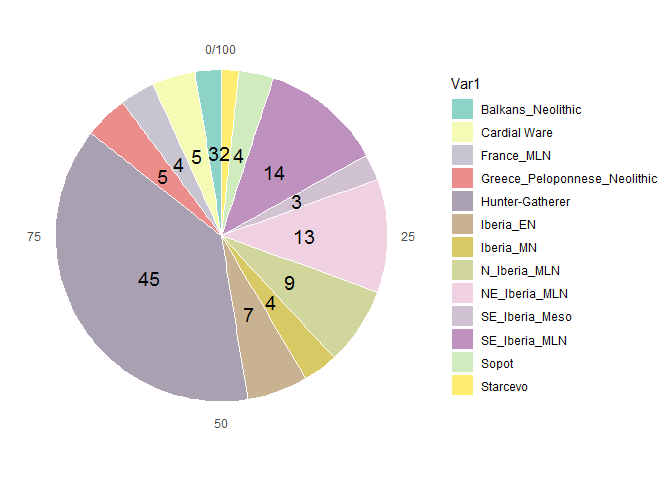
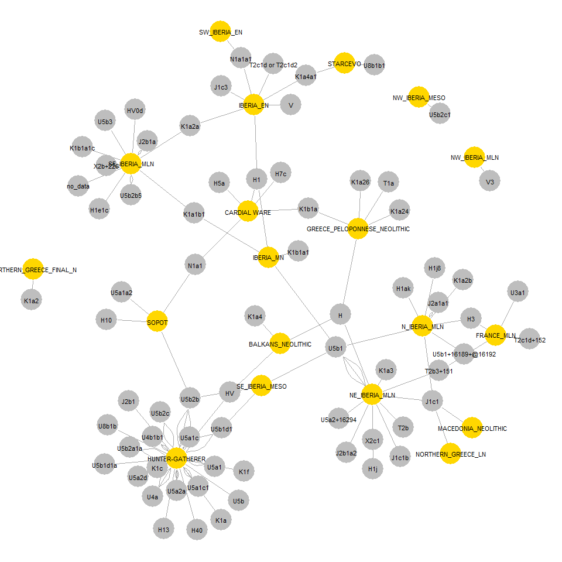
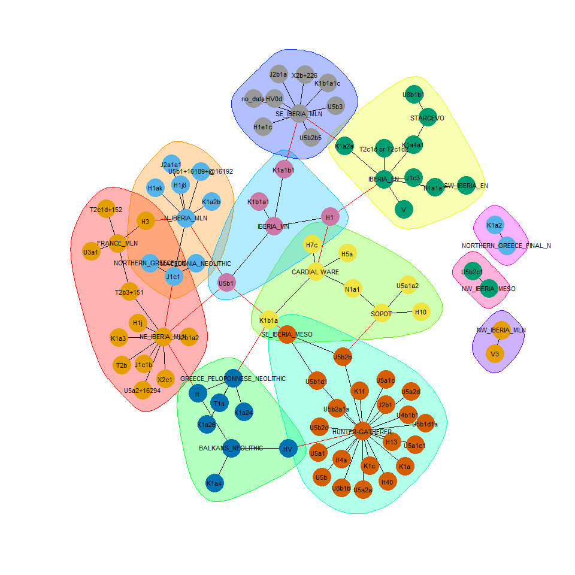

Gene-culture coevolution (GC-coev) is one of the main challenge of evolutionnary archaeology. Study of aDNA will permit to respond to the question: ['***Who ?***'](https://github.com/zoometh/thomashuet/blob/main/README.md#statements). It will permit to define the genetic identity of the social groups.This doc is a HTML presentation host on [GitHub](https://github.com/zoometh/aDNA), which brings together R + Leaflet coding showing how to download data from the Ancient mtDNA database (AmtDB) and we conduct and overview of GC-coev issues concerning the transition between hunter-gatherers (HG) and early farmers (EF) in the Central and West Mediterranean.

# aDNA analysis

Genetic analysis permit to evaluate populations (dis)similarities. The neutral hypothesis (H~0~) is that there is a
population continuity with few random genetic drifts. Single-nucleotide polymorphisms (SNPs) are stable and good proxys to evaluate the (dis)similarities between populations. On the base of their study, H~0~ can be rejected (H~1~ accepted) and factors like mutation, selection and migration can be supposed. At the time scale we investigate (Recent Prehistory), only the migration factor could explain observed changes in the genetic of Europeans. There exist various methods to measure differences between populations and to distinguish groups of populations. Proximities among
pairwise groups can be evaluated by the comparison of their genetic distance (F~ST~ matrix) [@Hervella]. The determination of groups (e.g. indigenous, immigrants) is mostly based on the study of the SNPs or
discrete hg frequencies [@Bramanti09]. Similarities will be computed with Analysis of Molecular Variance (AMOVA), genetic mapping (e.g. phylogenetic trees, haplotype network, median-joining network) and cluster analysis (multidimensional scaling, dendrogram, etc.). All the data will be proceed with [ape](https://cran.r-project.org/web/packages/ape/index.html), [pegas](https://cran.r-project.org/web/packages/pegas/index.html), or any appropriate R
packages.

# Example of application

To illustrate the use of R and polythetic analysis GC-coev analysis, mitochondrial DNA (mtDNA) can be download from the [Ancient mtDNA database (AmtDB)](https://amtdb.org/records/). This database gathers published mitochondrial sequences coming from the ancient DNA samples (aDNA). There is mtDNA datasets:  [data](#mt.data) and [metadata](#mt.meta)

## mtDNA data {#mt.data}

FASTA format is a text-based format for representing either nucleotide sequences or peptide sequences, in which base pairs or amino acids are represented using single-letter codes. A sequence in FASTA format begins with a single-line description, followed by lines of sequence data. FASTA formats can be read with the [phylotools](https://github.com/helixcn/phylotools) package. First identifiers are:


```r
fasta.names <- phylotools::get.fasta.name("mtdb_1511.fasta")
cat(head(fasta.names, 10), sep = "\n")
```

```
## RISE509
## RISE510
## RISE511
## RISE507
## RISE508
## I0707
## I0708
## I0709
## I0736
## I0744
```
Each of these identifiers is a unique key for a sample. The data file counts <span style='color:grey'>1511</span> different identifiers. These identifiers which allow to join the second dataset, [metadata](#mt.meta)

## mtDNA metadata {#mt.meta}

The mtDNA makes it possible to trace the maternal line. It passes from the mother to her children (of both sexes). The metadata file [mtdb_metadata.csv](mtdb_metadata.csv) is downloaded from the AmtDB. The current metadata format from the AmtDB is .csv

<table class="table" style="font-size: 11px; width: auto !important; margin-left: auto; margin-right: auto;">
<caption style="font-size: initial !important;">(\#tab:meta1)aDNA metadata sample</caption>
 <thead>
  <tr>
   <th style="text-align:left;"> identifier </th>
   <th style="text-align:left;"> alternative_identifiers </th>
   <th style="text-align:left;"> country </th>
   <th style="text-align:left;"> continent </th>
   <th style="text-align:left;"> region </th>
   <th style="text-align:left;"> culture </th>
   <th style="text-align:left;"> epoch </th>
   <th style="text-align:left;"> group </th>
   <th style="text-align:left;"> comment </th>
   <th style="text-align:right;"> latitude </th>
   <th style="text-align:right;"> longitude </th>
   <th style="text-align:left;"> sex </th>
   <th style="text-align:left;"> site </th>
   <th style="text-align:left;"> site_detail </th>
   <th style="text-align:left;"> mt_hg </th>
   <th style="text-align:left;"> ychr_hg </th>
   <th style="text-align:right;"> year_from </th>
   <th style="text-align:right;"> year_to </th>
   <th style="text-align:left;"> date_detail </th>
   <th style="text-align:left;"> bp </th>
   <th style="text-align:left;"> c14_lab_code </th>
   <th style="text-align:left;"> reference_names </th>
   <th style="text-align:left;"> reference_links </th>
   <th style="text-align:left;"> reference_data_links </th>
   <th style="text-align:right;"> c14_sample_tag </th>
   <th style="text-align:right;"> c14_layer_tag </th>
   <th style="text-align:right;"> avg_coverage </th>
   <th style="text-align:left;"> sequence_source </th>
   <th style="text-align:left;"> ychr_snps </th>
  </tr>
 </thead>
<tbody>
  <tr>
   <td style="text-align:left;"> I3948 </td>
   <td style="text-align:left;"> ZC3,PZ103-35,103-35 </td>
   <td style="text-align:left;"> Croatia </td>
   <td style="text-align:left;"> Europe </td>
   <td style="text-align:left;"> Balkans </td>
   <td style="text-align:left;"> Cardial Ware </td>
   <td style="text-align:left;"> Neolithic </td>
   <td style="text-align:left;"> NEBA </td>
   <td style="text-align:left;">  </td>
   <td style="text-align:right;"> 43.59 </td>
   <td style="text-align:right;"> 16.65 </td>
   <td style="text-align:left;"> M </td>
   <td style="text-align:left;"> Zemunica Cave </td>
   <td style="text-align:left;">  </td>
   <td style="text-align:left;"> N1a1 </td>
   <td style="text-align:left;"> E1b1b1a1b1 </td>
   <td style="text-align:right;"> -6005 </td>
   <td style="text-align:right;"> -5814 </td>
   <td style="text-align:left;"> 6005-5814 calBCE (7030±40 BP, PSUAMS-2224) </td>
   <td style="text-align:left;"> 7030±40 </td>
   <td style="text-align:left;"> PSUAMS-2224 </td>
   <td style="text-align:left;"> Mathieson et al. 2018 </td>
   <td style="text-align:left;"> https://dx.doi.org/10.1038/nature25778 </td>
   <td style="text-align:left;"> https://www.ebi.ac.uk/ena/data/view/PRJEB22652 </td>
   <td style="text-align:right;"> 1 </td>
   <td style="text-align:right;"> 0 </td>
   <td style="text-align:right;"> 0 </td>
   <td style="text-align:left;"> bam </td>
   <td style="text-align:left;"> E1b1b1a1b1:CTS3287:14801129A-&gt;G,E1b1b1a1b1:CTS5291:16189080T-&gt;G,E1b1b1a1b1:CTS5527:16345952A-&gt;G,E1b1b1a1b1:CTS7273:17396160C-&gt;T,E1b1b1a1b1:L618:15339697T-&gt;C,E1b1b1a1b1:PF2215:8262442A-&gt;G,E1b1b1a1b1:PF2246:22073053G-&gt;A,E1b1b1a:CTS8899:18538216C-&gt;A,E1b1b1a:L546:17516070C-&gt;T,E1b1b1a:PF2108:7804308C-&gt;T,E1b1b1a:PF2114:8232450C-&gt;A,E1b1b1a:PF2173:21036413C-&gt;T,E1b1b1a:PF2178:21583211C-&gt;A,E1b1b1a:PF2188:22080316G-&gt;A,E1b1b1:CTS2216:14221285G-&gt;T,E1b1b1:CTS3637:15089380A-&gt;G,E1b1b1:CTS6298:16808859A-&gt;G,E1b1b1:CTS6834:17138251A-&gt;G,E1b1b1:CTS7154:17325559G-&gt;T,E1b1b1:CTS9956:19170454C-&gt;T,E1b1b1:CTS10184:19316389A-&gt;T,E1b1b1:L796:21358197T-&gt;C,E1b1b1:M5041:21491115A-&gt;G,E1b1b1:M5047:21977569C-&gt;T,E1b1b1:M5078:7721674G-&gt;A,E1b1b1:M5108:8880108G-&gt;A,E1b1b1:M5322:22181731G-&gt;A,E1b1b1:M5360:23618826C-&gt;T,E1b1b1:PF1575:9389773T-&gt;G,E1b1b1:PF1619:13848122T-&gt;C,E1b1b:CTS225:2827409C-&gt;T,E1b1b:CTS8479.1:18045601C-&gt;T,E1b1b:CTS9049:18637397C-&gt;G,E1b1b:CTS10513:19503700T-&gt;C,E1b1b:CTS10679:22700429G-&gt;A,E1b1b:CTS11223:23021729G-&gt;A,E1b1b:L336:21903853G-&gt;A,E1b1b:M5082:7905833C-&gt;T,E1b1b:M5083:7906010A-&gt;G,E1b1b:M5101:8692771C-&gt;T,E1b1b:M5305:21658631G-&gt;C,E1b1:P2:21610831G-&gt;A,E1:CTS955:7104553C-&gt;T,E1:CTS5913:16550700G-&gt;A,E1:CTS9083:18662674G-&gt;A,E1:CTS9753:19058376G-&gt;A,E:CTS860:7052802A-&gt;T,E:CTS2893:14545105G-&gt;A,E:CTS3199:14718400A-&gt;G,E:CTS4685:15768559C-&gt;T,E:CTS4994:15945309G-&gt;A,E:CTS5316:16203354A-&gt;G,E:CTS6755:17092499G-&gt;T,E:CTS8631:18118658C-&gt;G,E:CTS10296:19379113T-&gt;C,E:CTS10344:19414935G-&gt;T,E:CTS10894:22823374A-&gt;C,E:CTS11504:23142339C-&gt;G,E:L339:6931856C-&gt;Thet,E:L504:21385724C-&gt;G,E:L507:22688731G-&gt;C,E:L614:23249378C-&gt;T,E:M40:2663943C-&gt;T,E:M5382:6631743C-&gt;A,E:M5406:7913358G-&gt;A,E:M5416:8469322C-&gt;T,E:M5417:8532844C-&gt;T,E:M5418:8612630C-&gt;G,E:M5422:8703052T-&gt;G,E:M5425:8799243T-&gt;C,E:M5431:9394763A-&gt;T,E:M5527:21256219G-&gt;A,E:M5529:21314704T-&gt;C,E:M5533:21408046G-&gt;C,E:M5545:21747107T-&gt;C,E:M5569:24399592C-&gt;T,E:M5571:24437979C-&gt;T,E:P154:19500107G-&gt;T,E:P169:22918577C-&gt;T,E:P171:23443971G-&gt;T,E:P172:6965215C-&gt;T,E:P174:15809326G-&gt;A,E:PF1608:13559017G-&gt;T,E:PF1620:13883812C-&gt;A,E:PF1843:22270345G-&gt;A,E:PF1844:22270687T-&gt;G,E:PF1864:22469799A-&gt;C,E:Z15669:13424256G-&gt;T,E:Z15670:13470384C-&gt;G,E:Z15673:13828327G-&gt;A,E:Z15674:13841166G-&gt;A,E:Z15681:22271529A-&gt;C </td>
  </tr>
  <tr>
   <td style="text-align:left;"> I4630 </td>
   <td style="text-align:left;"> ZVEJ30 </td>
   <td style="text-align:left;"> Latvia </td>
   <td style="text-align:left;"> Europe </td>
   <td style="text-align:left;"> Baltic </td>
   <td style="text-align:left;"> Hunter-Gatherer </td>
   <td style="text-align:left;"> Mesolithic </td>
   <td style="text-align:left;"> HGE </td>
   <td style="text-align:left;">  </td>
   <td style="text-align:right;"> 56.28 </td>
   <td style="text-align:right;"> 25.13 </td>
   <td style="text-align:left;"> M </td>
   <td style="text-align:left;"> Zvejnieki </td>
   <td style="text-align:left;">  </td>
   <td style="text-align:left;"> U5a2c </td>
   <td style="text-align:left;"> R1b1a1a(xR1b1a1a2) </td>
   <td style="text-align:right;"> -7465 </td>
   <td style="text-align:right;"> -7078 </td>
   <td style="text-align:left;"> 7465-7078 calBCE (8240±70 BP) </td>
   <td style="text-align:left;"> 8240±70 </td>
   <td style="text-align:left;">  </td>
   <td style="text-align:left;"> Mathieson et al. 2018 </td>
   <td style="text-align:left;"> https://dx.doi.org/10.1038/nature25778 </td>
   <td style="text-align:left;"> https://www.ebi.ac.uk/ena/data/view/PRJEB22652 </td>
   <td style="text-align:right;"> 1 </td>
   <td style="text-align:right;"> 0 </td>
   <td style="text-align:right;"> 0 </td>
   <td style="text-align:left;"> bam </td>
   <td style="text-align:left;"> R:CTS3622:15078469C-&gt;G,R:L1347:22818334C-&gt;T,R1:CTS2565:14366723C-&gt;T,R1:CTS2908:14556851C-&gt;T,R1:CTS5611:16394489T-&gt;G,R1:L875:16742224A-&gt;G,R1:P286:17716251C-&gt;T,R:CTS207:2810583A-&gt;G,R:CTS8311:17930099C-&gt;A,R:F82:7548900G-&gt;A,R1b1a:CTS4244:15510064T-&gt;G,R1b1:PF6272:23992762C-&gt;A,R:L747:16615413G-&gt;T,R:P224:17285993C-&gt;T,R1:CTS3321:14829196C-&gt;T,R1:CTS997:7132713G-&gt;A,R1:P233:21166358T-&gt;G,R1:P236:17782178C-&gt;G,R1:P238:7771131G-&gt;A,R1:P294:7570822G-&gt;C,R:CTS6417:16882568T-&gt;C,R:CTS7876:17722802G-&gt;A,R:CTS7880:17723850C-&gt;T,R:F63:7177189G-&gt;A,R:F295:15594523A-&gt;G,R:F652:23631629C-&gt;A,R:FGC1168:15667208G-&gt;C,R:L1225:22733758C-&gt;G,R:M734:18066156C-&gt;T,R:P227:21409706G-&gt;C,R:CTS2913:14561760A-&gt;G,R:CTS10663:22687547A-&gt;T,R:F370:16856357T-&gt;C,R1b1a1a:CTS3876:15239181G-&gt;C,R1b1a1a:CTS7904:17732408T-&gt;C,R1b1a:L1068:21528257T-&gt;C,R1b1a:PF6271:23984056G-&gt;A,R1b1:L278:18914441C-&gt;T,R1b:M343:2887824C-&gt;A,R1:P225:15590342G-&gt;T,R1b1a1a:CTS5577:16376495A-&gt;C,R1b1a1a:CTS9018:18617596C-&gt;T,R1b1a1a:CTS11985:23403749G-&gt;A,R1b1a1a:FGC57:7759944G-&gt;A,R1b1a1a:PF6463:16183412C-&gt;A,R1b1a:A702:10038192G-&gt;A,R1b1a:CTS7585:17545608G-&gt;T,R1b1:CTS2134:14193384G-&gt;A,R1b1:L822:7960019G-&gt;A,R1b1:M415:9170545C-&gt;A,R1b1:CTS2229:14226692T-&gt;A,R1b1a1a:PF6524:23452965T-&gt;C,R1b1a:CTS8436:18026855G-&gt;A,R1b1a:FGC41:7900883C-&gt;A,R1b1a:L1345:21558298G-&gt;T,R1b1a1a:PF6459:15286480G-&gt;C,R1b1a:FGC35:18407611C-&gt;T,R1:CTS4075:15377120A-&gt;G,R1:CTS7085:17275703G-&gt;A,R1b1a1:L388:17400785G-&gt;A,R1b1:PF6250:8439542G-&gt;A,R1b1a1a:PF6475:17986687C-&gt;A </td>
  </tr>
  <tr>
   <td style="text-align:left;"> JK2130 </td>
   <td style="text-align:left;"> 1547 </td>
   <td style="text-align:left;"> Egypt </td>
   <td style="text-align:left;"> Africa </td>
   <td style="text-align:left;"> Near East </td>
   <td style="text-align:left;"> Roman Period </td>
   <td style="text-align:left;"> Classical Age </td>
   <td style="text-align:left;"> CLNE </td>
   <td style="text-align:left;">  </td>
   <td style="text-align:right;"> 29.90 </td>
   <td style="text-align:right;"> 31.20 </td>
   <td style="text-align:left;"> F </td>
   <td style="text-align:left;"> Abusir el-Meleq </td>
   <td style="text-align:left;">  </td>
   <td style="text-align:left;"> M1a1 </td>
   <td style="text-align:left;">  </td>
   <td style="text-align:right;"> 91 </td>
   <td style="text-align:right;"> 212 </td>
   <td style="text-align:left;"> cal AD 91-212 </td>
   <td style="text-align:left;">  </td>
   <td style="text-align:left;">  </td>
   <td style="text-align:left;"> Schuenemann et al. 2017 </td>
   <td style="text-align:left;"> https://doi.org/10.1038/ncomms15694 </td>
   <td style="text-align:left;"> https://www.ebi.ac.uk/ena/data/view/PRJEB15464 </td>
   <td style="text-align:right;"> 1 </td>
   <td style="text-align:right;"> 0 </td>
   <td style="text-align:right;"> 0 </td>
   <td style="text-align:left;"> bam </td>
   <td style="text-align:left;">  </td>
  </tr>
</tbody>
</table>

It counts <span style='color:grey'>2426</span> samples and <span style='color:grey'>29</span> columns. 

# Cross analysis

A challenge is to cross analysis of mtDNA haplogroup (hg), cultures and radiocarbon dates to respond respectively to the questions ['Who', 'What', 'When'](https://github.com/zoometh/thomashuet/blob/main/README.md#statements)

## mtDNA *and* culture {#cross.mt.DNA.culture}

Within the AmtDB database, two (2) fields give direct insights on the cultural membership of the skeleton:

1. 'culture' counts <span style='color:grey'>252</span> distinct cultures
2. 'epoch' is more generic and counts <span style='color:grey'>14</span> distinct epoch. 

To illustrate GC-coev, we will focus on the Central and Western Mediterranean (ie, Italy to Spain) during the Mesolithic/Neolithic transition. We also avoid *unicum* in cultures(Freq > 2)


```r
df.MesoNeo <- df %>% 
  filter(epoch == 'Mesolithic' | epoch == 'Neolithic') %>%
  filter(latitude < 46 & latitude > 36) %>%
  filter(longitude > -6 & longitude < 22.5)
MNcultures <- as.data.frame(table(df.MesoNeo$culture),
                            stringsAsFactors = F)
MNcultures <- MNcultures %>% 
  filter(Freq > 1)
unicums <- MNcultures %>% filter(Freq == 1) # get unicums
```

After processing, the new dataset counts 124 samples and 19 distinct cultures:

<!-- -->
The selected sample of the dataset can be mapped. On their popup, the hg appears colored in <span style="color: red;">red</span> and the culture is colored in <span style='color:orange'>orange</span>  


<div class="figure" style="text-align: center">
<!--html_preserve--><div id="htmlwidget-f7588a4a0b00e7ca2931" style="width:60%;height:400px;" class="leaflet html-widget"></div>
<script type="application/json" data-for="htmlwidget-f7588a4a0b00e7ca2931">{"x":{"options":{"crs":{"crsClass":"L.CRS.EPSG3857","code":null,"proj4def":null,"projectedBounds":null,"options":{}}},"calls":[{"method":"addTiles","args":["//{s}.tile.openstreetmap.org/{z}/{x}/{y}.png",null,"OSM",{"minZoom":0,"maxZoom":18,"tileSize":256,"subdomains":"abc","errorTileUrl":"","tms":false,"noWrap":false,"zoomOffset":0,"zoomReverse":false,"opacity":1,"zIndex":1,"detectRetina":false,"attribution":"&copy; <a href=\"http://openstreetmap.org\">OpenStreetMap<\/a> contributors, <a href=\"http://creativecommons.org/licenses/by-sa/2.0/\">CC-BY-SA<\/a>"}]},{"method":"addCircleMarkers","args":[[41.37,43.26,41.25,41.25,41.25,41.25,42.5,42.5,42.5,42.5,42.91,44.9,44.9,41.9,42.911,41.4391,41.4391,41.4391,41.4391,41.4391,41.4391,41.4391,41.4391,41.4391,37.439437,36.132004,43.0866,43.0866,43.0866,43.0866,41.4391,41.4391,41.4391,41.4391,44.9,42.97,42.6282,42.6282,36.64,40.41819566,43.41022,43.59,45.76,36.64,36.64,36.64,43.59,43.59,45.76,45.76,43.457,43.457,43.457,43.34,44.53,44.53,44.55,44.55,44.53,44.53,44.53,44.53,44.53,44.53,44.53,44.53,44.53,44.53,44.53,44.53,44.64,44.64,44.64,44.64,44.49,44.82,44.82,45.32,45.32,44.6,44.6,44.6,44.6,44.6,44.6,44.6,44.6,44.6,44.6,44.6,44.6,44.64,44.64,44.55,44.55,44.6,36.64,44.53,44.53,44.53,38.7025,38.7025,38.7025,38.7025,38.7025,38.7025,43.085823,43.085823,43.085823,43.085823,43.085823,38.7025,38.7025,38.7025,38.7025,38.7025,38.7025,39.79,38.762271,38.762271,40.43,40.48,39.682491,39.682491],[1.89,-3.45,-2.33,-2.33,-2.33,-2.33,0.5,0.5,0.5,0.5,-5.38,19.75,19.75,21.35,-5.3778,1.5733,1.5733,1.5733,1.5733,1.5733,1.5733,1.5733,1.5733,1.5733,-3.437567,-5.343773,-2.2154,-2.2154,-2.2154,-2.2154,1.5733,1.5733,1.5733,1.5733,19.75,16.71,-3.11649,-3.11649,22.38,-0.11675,-5.98496,16.65,18.57,22.38,22.38,22.38,16.65,16.65,18.57,18.57,5.863,5.863,5.863,5.06,22.05,22.05,22.03,22.03,22.05,22.05,22.05,22.05,22.05,22.05,22.05,22.05,22.05,22.05,22.05,22.05,22.3,22.3,22.3,22.3,21.08,13.64,13.64,18.39,18.39,22.01,22.01,22.01,22.01,22.01,22.01,22.01,22.01,22.01,22.01,22.01,22.01,22.3,22.3,22.03,22.03,22.01,22.38,22.05,22.05,22.05,-0.48631,-0.48631,-0.48631,-0.48631,-0.48631,-0.48631,-2.251197,-2.251197,-2.251197,-2.251197,-2.251197,-0.48631,-0.48631,-0.48631,-0.48631,-0.48631,-0.48631,-1.033333,-0.586981,-0.586981,21.86,22.48,21.68191,21.68191],3,["CB13","ElMiron","I0405","I0406","I0407","I0408","I0409","I0410","I0412","I0413","I0585","I0633","I0634","I0676","I0843","I10277","I10278","I10280","I10282","I10283","I10284","I10285","I10286","I10287","I10899","I10942","I11248","I11249","I11300","I11301","I11303","I11304","I11305","I11306","I1131","I1875","I1972","I2199","I2937","I3209","I3214","I3433","I3498","I3708","I3709","I3920","I3947","I3948","I4167","I4168","I4303","I4304","I4305","I4308","I4657","I4660","I4665","I4666","I4870","I4871","I4872","I4873","I4874","I4875","I4876","I4877","I4878","I4880","I4881","I4882","I4914","I4915","I4916","I4917","I4918","I5071","I5072","I5077","I5078","I5232","I5233","I5234","I5235","I5236","I5237","I5238","I5239","I5240","I5241","I5242","I5244","I5401","I5402","I5405","I5407","I5409","I5427","I5771","I5772","I5773","I7594","I7595","I7597","I7598","I7600","I7601","I7602","I7603","I7604","I7605","I7606","I7642","I7643","I7644","I7645","I7646","I7647","I8130","I8567","I8568","Klei10","Pal7","Theo1","Theo5"],null,{"interactive":true,"className":"","stroke":true,"color":"#03F","weight":1,"opacity":0.7,"fill":true,"fillColor":"#03F","fillOpacity":0.7},null,null,["<b>Cova Bonica, Vallirana, Barcelona<\/b> <span style='color:red'>K1a2a<\/span> <br>culture: <span style='color:orange'>Iberia_EN<\/span> <i>Neolithic<\/i><br><br> ref: <a href=\"https://doi.org/10.1093/molbev/msv181\" target=\"_blank\">Olalde et al. 2015<\/a>","<b>El Miron<\/b> <span style='color:red'>U5b<\/span> <br>culture: <span style='color:orange'>Hunter-Gatherer<\/span> <i>Mesolithic<\/i><br><br> ref: <a href=\"https://dx.doi.org/10.1038/nature17993\" target=\"_blank\">Fu et al. 2016<\/a>","<b>La Mina<\/b> <span style='color:red'>K1a1b1<\/span> <br>culture: <span style='color:orange'>Iberia_MN<\/span> <i>Neolithic<\/i><br><br> ref: <a href=\"https://dx.doi.org/10.1038/nature14317\" target=\"_blank\">Haak et al. 2015<\/a>","<b>La Mina<\/b> <span style='color:red'>H1<\/span> <br>culture: <span style='color:orange'>Iberia_MN<\/span> <i>Neolithic<\/i><br><br> ref: <a href=\"https://dx.doi.org/10.1038/nature14317\" target=\"_blank\">Haak et al. 2015<\/a>","<b>La Mina<\/b> <span style='color:red'>K1b1a1<\/span> <br>culture: <span style='color:orange'>Iberia_MN<\/span> <i>Neolithic<\/i><br><br> ref: <a href=\"https://dx.doi.org/10.1038/nature14317\" target=\"_blank\">Haak et al. 2015<\/a>","<b>La Mina<\/b> <span style='color:red'>U5b1<\/span> <br>culture: <span style='color:orange'>Iberia_MN<\/span> <i>Neolithic<\/i><br><br> ref: <a href=\"https://dx.doi.org/10.1038/nature14317\" target=\"_blank\">Haak et al. 2015<\/a>","<b>Els Trocs<\/b> <span style='color:red'>J1c3<\/span> <br>culture: <span style='color:orange'>Iberia_EN<\/span> <i>Neolithic<\/i><br><br> ref: <a href=\"https://dx.doi.org/10.1038/nature14317\" target=\"_blank\">Haak et al. 2015<\/a>","<b>Els Trocs<\/b> <span style='color:red'>T2c1d or T2c1d2<\/span> <br>culture: <span style='color:orange'>Iberia_EN<\/span> <i>Neolithic<\/i><br><br> ref: <a href=\"https://dx.doi.org/10.1038/nature14317\" target=\"_blank\">Haak et al. 2015<\/a>","<b>Els Trocs<\/b> <span style='color:red'>N1a1a1<\/span> <br>culture: <span style='color:orange'>Iberia_EN<\/span> <i>Neolithic<\/i><br><br> ref: <a href=\"https://dx.doi.org/10.1038/nature14317\" target=\"_blank\">Haak et al. 2015<\/a>","<b>Els Trocs<\/b> <span style='color:red'>V<\/span> <br>culture: <span style='color:orange'>Iberia_EN<\/span> <i>Neolithic<\/i><br><br> ref: <a href=\"https://dx.doi.org/10.1038/nature14317\" target=\"_blank\">Haak et al. 2015<\/a>","<b>La Brana-Arintero, Leon<\/b> <span style='color:red'>U5b2c<\/span> <br>culture: <span style='color:orange'>Hunter-Gatherer<\/span> <i>Mesolithic<\/i><br><br> ref: <a href=\"https://dx.doi.org/10.1038/nature12960\" target=\"_blank\">Olalde et al. 2014<\/a>","<b>Gomolava, Hrtkovci, Vojvodina<\/b> <span style='color:red'>HV<\/span> <br>culture: <span style='color:orange'>Balkans_Neolithic<\/span> <i>Neolithic<\/i><br><br> ref: <a href=\"https://dx.doi.org/10.1038/nature25778\" target=\"_blank\">Mathieson et al. 2018<\/a>","<b>Gomolava, Hrtkovci, Vojvodina<\/b> <span style='color:red'>K1a4<\/span> <br>culture: <span style='color:orange'>Balkans_Neolithic<\/span> <i>Neolithic<\/i><br><br> ref: <a href=\"https://dx.doi.org/10.1038/nature25778\" target=\"_blank\">Mathieson et al. 2018<\/a>","<b>Govrlevo, Sopi_te, Skopje<\/b> <span style='color:red'>J1c1<\/span> <br>culture: <span style='color:orange'>Macedonia_Neolithic<\/span> <i>Neolithic<\/i><br><br> ref: <a href=\"https://dx.doi.org/10.1038/nature25778\" target=\"_blank\">Mathieson et al. 2018<\/a>","<b>La Braña-Arintero, León, Castilla y León<\/b> <span style='color:red'>U5b2c1<\/span> <br>culture: <span style='color:orange'>NW_Iberia_Meso<\/span> <i>Mesolithic<\/i><br><br> ref: <a href=\"https://doi.org/10.1126/science.aav4040\" target=\"_blank\">Olalde et al. 2019<\/a>","<b>Cova de la Guineu, Font-rubí, Barcelona, Catalonia<\/b> <span style='color:red'>X2c1<\/span> <br>culture: <span style='color:orange'>NE_Iberia_MLN<\/span> <i>Neolithic<\/i><br><br> ref: <a href=\"https://doi.org/10.1126/science.aav4040\" target=\"_blank\">Olalde et al. 2019<\/a>","<b>Cova de la Guineu, Font-rubí, Barcelona, Catalonia<\/b> <span style='color:red'>U5b1<\/span> <br>culture: <span style='color:orange'>NE_Iberia_MLN<\/span> <i>Neolithic<\/i><br><br> ref: <a href=\"https://doi.org/10.1126/science.aav4040\" target=\"_blank\">Olalde et al. 2019<\/a>","<b>Cova de la Guineu, Font-rubí, Barcelona, Catalonia<\/b> <span style='color:red'>J1c1<\/span> <br>culture: <span style='color:orange'>NE_Iberia_MLN<\/span> <i>Neolithic<\/i><br><br> ref: <a href=\"https://doi.org/10.1126/science.aav4040\" target=\"_blank\">Olalde et al. 2019<\/a>","<b>Cova de la Guineu, Font-rubí, Barcelona, Catalonia<\/b> <span style='color:red'>K1a3<\/span> <br>culture: <span style='color:orange'>NE_Iberia_MLN<\/span> <i>Neolithic<\/i><br><br> ref: <a href=\"https://doi.org/10.1126/science.aav4040\" target=\"_blank\">Olalde et al. 2019<\/a>","<b>Cova de la Guineu, Font-rubí, Barcelona, Catalonia<\/b> <span style='color:red'>H<\/span> <br>culture: <span style='color:orange'>NE_Iberia_MLN<\/span> <i>Neolithic<\/i><br><br> ref: <a href=\"https://doi.org/10.1126/science.aav4040\" target=\"_blank\">Olalde et al. 2019<\/a>","<b>Cova de la Guineu, Font-rubí, Barcelona, Catalonia<\/b> <span style='color:red'>U5b1<\/span> <br>culture: <span style='color:orange'>NE_Iberia_MLN<\/span> <i>Neolithic<\/i><br><br> ref: <a href=\"https://doi.org/10.1126/science.aav4040\" target=\"_blank\">Olalde et al. 2019<\/a>","<b>Cova de la Guineu, Font-rubí, Barcelona, Catalonia<\/b> <span style='color:red'>T2b<\/span> <br>culture: <span style='color:orange'>NE_Iberia_MLN<\/span> <i>Neolithic<\/i><br><br> ref: <a href=\"https://doi.org/10.1126/science.aav4040\" target=\"_blank\">Olalde et al. 2019<\/a>","<b>Cova de la Guineu, Font-rubí, Barcelona, Catalonia<\/b> <span style='color:red'>U5b1<\/span> <br>culture: <span style='color:orange'>NE_Iberia_MLN<\/span> <i>Neolithic<\/i><br><br> ref: <a href=\"https://doi.org/10.1126/science.aav4040\" target=\"_blank\">Olalde et al. 2019<\/a>","<b>Cova de la Guineu, Font-rubí, Barcelona, Catalonia<\/b> <span style='color:red'>T2b3+151<\/span> <br>culture: <span style='color:orange'>NE_Iberia_MLN<\/span> <i>Neolithic<\/i><br><br> ref: <a href=\"https://doi.org/10.1126/science.aav4040\" target=\"_blank\">Olalde et al. 2019<\/a>","<b>Cueva de la Carigüela, Piñar, Granada, Andalusia<\/b> <span style='color:red'>U5b1<\/span> <br>culture: <span style='color:orange'>SE_Iberia_Meso<\/span> <i>Mesolithic<\/i><br><br> ref: <a href=\"https://doi.org/10.1126/science.aav4040\" target=\"_blank\">Olalde et al. 2019<\/a>","<b>Europa 1, Gibraltar<\/b> <span style='color:red'>N1a1a1<\/span> <br>culture: <span style='color:orange'>SW_Iberia_EN<\/span> <i>Neolithic<\/i><br><br> ref: <a href=\"https://doi.org/10.1126/science.aav4040\" target=\"_blank\">Olalde et al. 2019<\/a>","<b>Jentillarri, Enirio-Aralar, Gipuzkoa, Basque Country<\/b> <span style='color:red'>J2a1a1<\/span> <br>culture: <span style='color:orange'>N_Iberia_MLN<\/span> <i>Neolithic<\/i><br><br> ref: <a href=\"https://doi.org/10.1126/science.aav4040\" target=\"_blank\">Olalde et al. 2019<\/a>","<b>Jentillarri, Enirio-Aralar, Gipuzkoa, Basque Country<\/b> <span style='color:red'>U5b1<\/span> <br>culture: <span style='color:orange'>N_Iberia_MLN<\/span> <i>Neolithic<\/i><br><br> ref: <a href=\"https://doi.org/10.1126/science.aav4040\" target=\"_blank\">Olalde et al. 2019<\/a>","<b>Jentillarri, Enirio-Aralar, Gipuzkoa, Basque Country<\/b> <span style='color:red'>J2a1a1<\/span> <br>culture: <span style='color:orange'>N_Iberia_MLN<\/span> <i>Neolithic<\/i><br><br> ref: <a href=\"https://doi.org/10.1126/science.aav4040\" target=\"_blank\">Olalde et al. 2019<\/a>","<b>Jentillarri, Enirio-Aralar, Gipuzkoa, Basque Country<\/b> <span style='color:red'>H1j8<\/span> <br>culture: <span style='color:orange'>N_Iberia_MLN<\/span> <i>Neolithic<\/i><br><br> ref: <a href=\"https://doi.org/10.1126/science.aav4040\" target=\"_blank\">Olalde et al. 2019<\/a>","<b>Cova de la Guineu, Font-rubí, Barcelona, Catalonia<\/b> <span style='color:red'>H1j<\/span> <br>culture: <span style='color:orange'>NE_Iberia_MLN<\/span> <i>Neolithic<\/i><br><br> ref: <a href=\"https://doi.org/10.1126/science.aav4040\" target=\"_blank\">Olalde et al. 2019<\/a>","<b>Cova de la Guineu, Font-rubí, Barcelona, Catalonia<\/b> <span style='color:red'>U5a2+16294<\/span> <br>culture: <span style='color:orange'>NE_Iberia_MLN<\/span> <i>Neolithic<\/i><br><br> ref: <a href=\"https://doi.org/10.1126/science.aav4040\" target=\"_blank\">Olalde et al. 2019<\/a>","<b>Cova de la Guineu, Font-rubí, Barcelona, Catalonia<\/b> <span style='color:red'>J1c1b<\/span> <br>culture: <span style='color:orange'>NE_Iberia_MLN<\/span> <i>Neolithic<\/i><br><br> ref: <a href=\"https://doi.org/10.1126/science.aav4040\" target=\"_blank\">Olalde et al. 2019<\/a>","<b>Cova de la Guineu, Font-rubí, Barcelona, Catalonia<\/b> <span style='color:red'>J2b1a2<\/span> <br>culture: <span style='color:orange'>NE_Iberia_MLN<\/span> <i>Neolithic<\/i><br><br> ref: <a href=\"https://doi.org/10.1126/science.aav4040\" target=\"_blank\">Olalde et al. 2019<\/a>","<b>Gomolava, Hrtkovci, Vojvodina<\/b> <span style='color:red'>H<\/span> <br>culture: <span style='color:orange'>Balkans_Neolithic<\/span> <i>Neolithic<\/i><br><br> ref: <a href=\"https://dx.doi.org/10.1038/nature25778\" target=\"_blank\">Mathieson et al. 2018<\/a>","<b>Vela Spila<\/b> <span style='color:red'>U5b2b<\/span> <br>culture: <span style='color:orange'>Hunter-Gatherer<\/span> <i>Mesolithic<\/i><br><br> ref: <a href=\"https://dx.doi.org/10.1038/nature25778\" target=\"_blank\">Mathieson et al. 2018<\/a>","<b>El Prado de Pancorbo, Burgos<\/b> <span style='color:red'>K1a4a1<\/span> <br>culture: <span style='color:orange'>Iberia_EN<\/span> <i>Neolithic<\/i><br><br> ref: <a href=\"https://dx.doi.org/10.1038/nature24476\" target=\"_blank\">Lipson et al. 2017<\/a>","<b>El Prado de Pancorbo, Burgos<\/b> <span style='color:red'>H1<\/span> <br>culture: <span style='color:orange'>Iberia_EN<\/span> <i>Neolithic<\/i><br><br> ref: <a href=\"https://dx.doi.org/10.1038/nature24476\" target=\"_blank\">Lipson et al. 2017<\/a>","<b>Diros, Alepotrypa Cave<\/b> <span style='color:red'>K1a26<\/span> <br>culture: <span style='color:orange'>Greece_Peloponnese_Neolithic<\/span> <i>Neolithic<\/i><br><br> ref: <a href=\"https://dx.doi.org/10.1038/nature23310\" target=\"_blank\">Lazaridis et al. 2017<\/a>","<b>Cingle del Mas Nou, Ares del Maestre, Castelló/Castellón, Valencian Community<\/b> <span style='color:red'>U5b1d1<\/span> <br>culture: <span style='color:orange'>SE_Iberia_Meso<\/span> <i>Mesolithic<\/i><br><br> ref: <a href=\"https://doi.org/10.1126/science.aav4040\" target=\"_blank\">Olalde et al. 2019<\/a>","<b>Cueva de la Paloma, Soto de las Regueras, Asturias<\/b> <span style='color:red'>V3<\/span> <br>culture: <span style='color:orange'>NW_Iberia_MLN<\/span> <i>Neolithic<\/i><br><br> ref: <a href=\"https://doi.org/10.1126/science.aav4040\" target=\"_blank\">Olalde et al. 2019<\/a>","<b>Zemunica Cave<\/b> <span style='color:red'>H1<\/span> <br>culture: <span style='color:orange'>Cardial Ware<\/span> <i>Neolithic<\/i><br><br> ref: <a href=\"https://dx.doi.org/10.1038/nature25778\" target=\"_blank\">Mathieson et al. 2018<\/a>","<b>Beli Manastir-Popova zemlja<\/b> <span style='color:red'>U8b1b1<\/span> <br>culture: <span style='color:orange'>Starcevo<\/span> <i>Neolithic<\/i><br><br> ref: <a href=\"https://dx.doi.org/10.1038/nature25778\" target=\"_blank\">Mathieson et al. 2018<\/a>","<b>Diros, Alepotrypa Cave<\/b> <span style='color:red'>T1a<\/span> <br>culture: <span style='color:orange'>Greece_Peloponnese_Neolithic<\/span> <i>Neolithic<\/i><br><br> ref: <a href=\"https://dx.doi.org/10.1038/nature25778\" target=\"_blank\">Mathieson et al. 2018<\/a>","<b>Diros, Alepotrypa Cave<\/b> <span style='color:red'>K1b1a<\/span> <br>culture: <span style='color:orange'>Greece_Peloponnese_Neolithic<\/span> <i>Neolithic<\/i><br><br> ref: <a href=\"https://dx.doi.org/10.1038/nature25778\" target=\"_blank\">Mathieson et al. 2018<\/a>","<b>Diros, Alepotrypa Cave<\/b> <span style='color:red'>H<\/span> <br>culture: <span style='color:orange'>Greece_Peloponnese_Neolithic<\/span> <i>Neolithic<\/i><br><br> ref: <a href=\"https://dx.doi.org/10.1038/nature25778\" target=\"_blank\">Mathieson et al. 2018<\/a>","<b>Zemunica Cave<\/b> <span style='color:red'>K1b1a<\/span> <br>culture: <span style='color:orange'>Cardial Ware<\/span> <i>Neolithic<\/i><br><br> ref: <a href=\"https://dx.doi.org/10.1038/nature25778\" target=\"_blank\">Mathieson et al. 2018<\/a>","<b>Zemunica Cave<\/b> <span style='color:red'>N1a1<\/span> <br>culture: <span style='color:orange'>Cardial Ware<\/span> <i>Neolithic<\/i><br><br> ref: <a href=\"https://dx.doi.org/10.1038/nature25778\" target=\"_blank\">Mathieson et al. 2018<\/a>","<b>Beli Manastir-Popova zemlja<\/b> <span style='color:red'>U5b2b<\/span> <br>culture: <span style='color:orange'>Sopot<\/span> <i>Neolithic<\/i><br><br> ref: <a href=\"https://dx.doi.org/10.1038/nature25778\" target=\"_blank\">Mathieson et al. 2018<\/a>","<b>Beli Manastir-Popova zemlja<\/b> <span style='color:red'>N1a1<\/span> <br>culture: <span style='color:orange'>Sopot<\/span> <i>Neolithic<\/i><br><br> ref: <a href=\"https://dx.doi.org/10.1038/nature25778\" target=\"_blank\">Mathieson et al. 2018<\/a>","<b>Clos de Roque, Saint Maximin-la-Sainte-Baume<\/b> <span style='color:red'>H3<\/span> <br>culture: <span style='color:orange'>France_MLN<\/span> <i>Neolithic<\/i><br><br> ref: <a href=\"https://dx.doi.org/10.1038/nature25738\" target=\"_blank\">Olalde et al. 2018<\/a>","<b>Clos de Roque, Saint Maximin-la-Sainte-Baume<\/b> <span style='color:red'>T2c1d+152<\/span> <br>culture: <span style='color:orange'>France_MLN<\/span> <i>Neolithic<\/i><br><br> ref: <a href=\"https://dx.doi.org/10.1038/nature25738\" target=\"_blank\">Olalde et al. 2018<\/a>","<b>Clos de Roque, Saint Maximin-la-Sainte-Baume<\/b> <span style='color:red'>T2b3+151<\/span> <br>culture: <span style='color:orange'>France_MLN<\/span> <i>Neolithic<\/i><br><br> ref: <a href=\"https://dx.doi.org/10.1038/nature25738\" target=\"_blank\">Olalde et al. 2018<\/a>","<b>Collet Redon, La Couronne-Martigues<\/b> <span style='color:red'>U3a1<\/span> <br>culture: <span style='color:orange'>France_MLN<\/span> <i>Neolithic<\/i><br><br> ref: <a href=\"https://dx.doi.org/10.1038/nature25738\" target=\"_blank\">Olalde et al. 2018<\/a>","<b>Vlasac<\/b> <span style='color:red'>K1c<\/span> <br>culture: <span style='color:orange'>Hunter-Gatherer<\/span> <i>Mesolithic<\/i><br><br> ref: <a href=\"https://dx.doi.org/10.1038/nature25778\" target=\"_blank\">Mathieson et al. 2018<\/a>","<b>Vlasac<\/b> <span style='color:red'>U8b1b<\/span> <br>culture: <span style='color:orange'>Hunter-Gatherer<\/span> <i>Mesolithic<\/i><br><br> ref: <a href=\"https://dx.doi.org/10.1038/nature25778\" target=\"_blank\">Mathieson et al. 2018<\/a>","<b>Lepenski Vir<\/b> <span style='color:red'>J2b1<\/span> <br>culture: <span style='color:orange'>Hunter-Gatherer<\/span> <i>Mesolithic<\/i><br><br> ref: <a href=\"https://dx.doi.org/10.1038/nature25778\" target=\"_blank\">Mathieson et al. 2018<\/a>","<b>Lepenski Vir<\/b> <span style='color:red'>H40<\/span> <br>culture: <span style='color:orange'>Hunter-Gatherer<\/span> <i>Mesolithic<\/i><br><br> ref: <a href=\"https://dx.doi.org/10.1038/nature25778\" target=\"_blank\">Mathieson et al. 2018<\/a>","<b>Vlasac<\/b> <span style='color:red'>K1c<\/span> <br>culture: <span style='color:orange'>Hunter-Gatherer<\/span> <i>Mesolithic<\/i><br><br> ref: <a href=\"https://dx.doi.org/10.1038/nature25778\" target=\"_blank\">Mathieson et al. 2018<\/a>","<b>Vlasac<\/b> <span style='color:red'>U5b2a1a<\/span> <br>culture: <span style='color:orange'>Hunter-Gatherer<\/span> <i>Mesolithic<\/i><br><br> ref: <a href=\"https://dx.doi.org/10.1038/nature25778\" target=\"_blank\">Mathieson et al. 2018<\/a>","<b>Vlasac<\/b> <span style='color:red'>U5a1c<\/span> <br>culture: <span style='color:orange'>Hunter-Gatherer<\/span> <i>Mesolithic<\/i><br><br> ref: <a href=\"https://dx.doi.org/10.1038/nature25778\" target=\"_blank\">Mathieson et al. 2018<\/a>","<b>Vlasac<\/b> <span style='color:red'>U5a2a<\/span> <br>culture: <span style='color:orange'>Hunter-Gatherer<\/span> <i>Mesolithic<\/i><br><br> ref: <a href=\"https://dx.doi.org/10.1038/nature25778\" target=\"_blank\">Mathieson et al. 2018<\/a>","<b>Vlasac<\/b> <span style='color:red'>U5b2a1a<\/span> <br>culture: <span style='color:orange'>Hunter-Gatherer<\/span> <i>Mesolithic<\/i><br><br> ref: <a href=\"https://dx.doi.org/10.1038/nature25778\" target=\"_blank\">Mathieson et al. 2018<\/a>","<b>Vlasac<\/b> <span style='color:red'>U5b1d1a<\/span> <br>culture: <span style='color:orange'>Hunter-Gatherer<\/span> <i>Mesolithic<\/i><br><br> ref: <a href=\"https://dx.doi.org/10.1038/nature25778\" target=\"_blank\">Mathieson et al. 2018<\/a>","<b>Vlasac<\/b> <span style='color:red'>U5a2d<\/span> <br>culture: <span style='color:orange'>Hunter-Gatherer<\/span> <i>Mesolithic<\/i><br><br> ref: <a href=\"https://dx.doi.org/10.1038/nature25778\" target=\"_blank\">Mathieson et al. 2018<\/a>","<b>Vlasac<\/b> <span style='color:red'>U5b1d1<\/span> <br>culture: <span style='color:orange'>Hunter-Gatherer<\/span> <i>Mesolithic<\/i><br><br> ref: <a href=\"https://dx.doi.org/10.1038/nature25778\" target=\"_blank\">Mathieson et al. 2018<\/a>","<b>Vlasac<\/b> <span style='color:red'>U4a<\/span> <br>culture: <span style='color:orange'>Hunter-Gatherer<\/span> <i>Mesolithic<\/i><br><br> ref: <a href=\"https://dx.doi.org/10.1038/nature25778\" target=\"_blank\">Mathieson et al. 2018<\/a>","<b>Vlasac<\/b> <span style='color:red'>U4b1b1<\/span> <br>culture: <span style='color:orange'>Hunter-Gatherer<\/span> <i>Mesolithic<\/i><br><br> ref: <a href=\"https://dx.doi.org/10.1038/nature25778\" target=\"_blank\">Mathieson et al. 2018<\/a>","<b>Vlasac<\/b> <span style='color:red'>U4b1b1<\/span> <br>culture: <span style='color:orange'>Hunter-Gatherer<\/span> <i>Mesolithic<\/i><br><br> ref: <a href=\"https://dx.doi.org/10.1038/nature25778\" target=\"_blank\">Mathieson et al. 2018<\/a>","<b>Vlasac<\/b> <span style='color:red'>U4b1b1<\/span> <br>culture: <span style='color:orange'>Hunter-Gatherer<\/span> <i>Mesolithic<\/i><br><br> ref: <a href=\"https://dx.doi.org/10.1038/nature25778\" target=\"_blank\">Mathieson et al. 2018<\/a>","<b>Hadučka Vodenica<\/b> <span style='color:red'>U5a1c1<\/span> <br>culture: <span style='color:orange'>Hunter-Gatherer<\/span> <i>Mesolithic<\/i><br><br> ref: <a href=\"https://dx.doi.org/10.1038/nature25778\" target=\"_blank\">Mathieson et al. 2018<\/a>","<b>Hadučka Vodenica<\/b> <span style='color:red'>U5b2b<\/span> <br>culture: <span style='color:orange'>Hunter-Gatherer<\/span> <i>Mesolithic<\/i><br><br> ref: <a href=\"https://dx.doi.org/10.1038/nature25778\" target=\"_blank\">Mathieson et al. 2018<\/a>","<b>Hadučka Vodenica<\/b> <span style='color:red'>U5b2b<\/span> <br>culture: <span style='color:orange'>Hunter-Gatherer<\/span> <i>Mesolithic<\/i><br><br> ref: <a href=\"https://dx.doi.org/10.1038/nature25778\" target=\"_blank\">Mathieson et al. 2018<\/a>","<b>Hadučka Vodenica<\/b> <span style='color:red'>U5a1c<\/span> <br>culture: <span style='color:orange'>Hunter-Gatherer<\/span> <i>Mesolithic<\/i><br><br> ref: <a href=\"https://dx.doi.org/10.1038/nature25778\" target=\"_blank\">Mathieson et al. 2018<\/a>","<b>Saraorci-Jezava<\/b> <span style='color:red'>K1a4a1<\/span> <br>culture: <span style='color:orange'>Starcevo<\/span> <i>Neolithic<\/i><br><br> ref: <a href=\"https://dx.doi.org/10.1038/nature25778\" target=\"_blank\">Mathieson et al. 2018<\/a>","<b>Kargadur<\/b> <span style='color:red'>H5a<\/span> <br>culture: <span style='color:orange'>Cardial Ware<\/span> <i>Neolithic<\/i><br><br> ref: <a href=\"https://dx.doi.org/10.1038/nature25778\" target=\"_blank\">Mathieson et al. 2018<\/a>","<b>Kargadur<\/b> <span style='color:red'>H7c<\/span> <br>culture: <span style='color:orange'>Cardial Ware<\/span> <i>Neolithic<\/i><br><br> ref: <a href=\"https://dx.doi.org/10.1038/nature25778\" target=\"_blank\">Mathieson et al. 2018<\/a>","<b>Osijek<\/b> <span style='color:red'>U5a1a2<\/span> <br>culture: <span style='color:orange'>Sopot<\/span> <i>Neolithic<\/i><br><br> ref: <a href=\"https://dx.doi.org/10.1038/nature25778\" target=\"_blank\">Mathieson et al. 2018<\/a>","<b>Osijek<\/b> <span style='color:red'>H10<\/span> <br>culture: <span style='color:orange'>Sopot<\/span> <i>Neolithic<\/i><br><br> ref: <a href=\"https://dx.doi.org/10.1038/nature25778\" target=\"_blank\">Mathieson et al. 2018<\/a>","<b>Padina<\/b> <span style='color:red'>K1a<\/span> <br>culture: <span style='color:orange'>Hunter-Gatherer<\/span> <i>Mesolithic<\/i><br><br> ref: <a href=\"https://dx.doi.org/10.1038/nature25778\" target=\"_blank\">Mathieson et al. 2018<\/a>","<b>Padina<\/b> <span style='color:red'>U5b1d1<\/span> <br>culture: <span style='color:orange'>Hunter-Gatherer<\/span> <i>Mesolithic<\/i><br><br> ref: <a href=\"https://dx.doi.org/10.1038/nature25778\" target=\"_blank\">Mathieson et al. 2018<\/a>","<b>Padina<\/b> <span style='color:red'>U4a<\/span> <br>culture: <span style='color:orange'>Hunter-Gatherer<\/span> <i>Mesolithic<\/i><br><br> ref: <a href=\"https://dx.doi.org/10.1038/nature25778\" target=\"_blank\">Mathieson et al. 2018<\/a>","<b>Padina<\/b> <span style='color:red'>U5b2c<\/span> <br>culture: <span style='color:orange'>Hunter-Gatherer<\/span> <i>Mesolithic<\/i><br><br> ref: <a href=\"https://dx.doi.org/10.1038/nature25778\" target=\"_blank\">Mathieson et al. 2018<\/a>","<b>Padina<\/b> <span style='color:red'>U5a2d<\/span> <br>culture: <span style='color:orange'>Hunter-Gatherer<\/span> <i>Mesolithic<\/i><br><br> ref: <a href=\"https://dx.doi.org/10.1038/nature25778\" target=\"_blank\">Mathieson et al. 2018<\/a>","<b>Padina<\/b> <span style='color:red'>U5a2a<\/span> <br>culture: <span style='color:orange'>Hunter-Gatherer<\/span> <i>Mesolithic<\/i><br><br> ref: <a href=\"https://dx.doi.org/10.1038/nature25778\" target=\"_blank\">Mathieson et al. 2018<\/a>","<b>Padina<\/b> <span style='color:red'>K1c<\/span> <br>culture: <span style='color:orange'>Hunter-Gatherer<\/span> <i>Mesolithic<\/i><br><br> ref: <a href=\"https://dx.doi.org/10.1038/nature25778\" target=\"_blank\">Mathieson et al. 2018<\/a>","<b>Padina<\/b> <span style='color:red'>U5a2d<\/span> <br>culture: <span style='color:orange'>Hunter-Gatherer<\/span> <i>Mesolithic<\/i><br><br> ref: <a href=\"https://dx.doi.org/10.1038/nature25778\" target=\"_blank\">Mathieson et al. 2018<\/a>","<b>Padina<\/b> <span style='color:red'>U5a1c<\/span> <br>culture: <span style='color:orange'>Hunter-Gatherer<\/span> <i>Mesolithic<\/i><br><br> ref: <a href=\"https://dx.doi.org/10.1038/nature25778\" target=\"_blank\">Mathieson et al. 2018<\/a>","<b>Padina<\/b> <span style='color:red'>U5a2a<\/span> <br>culture: <span style='color:orange'>Hunter-Gatherer<\/span> <i>Mesolithic<\/i><br><br> ref: <a href=\"https://dx.doi.org/10.1038/nature25778\" target=\"_blank\">Mathieson et al. 2018<\/a>","<b>Padina<\/b> <span style='color:red'>U5a1<\/span> <br>culture: <span style='color:orange'>Hunter-Gatherer<\/span> <i>Mesolithic<\/i><br><br> ref: <a href=\"https://dx.doi.org/10.1038/nature25778\" target=\"_blank\">Mathieson et al. 2018<\/a>","<b>Padina<\/b> <span style='color:red'>K1f<\/span> <br>culture: <span style='color:orange'>Hunter-Gatherer<\/span> <i>Mesolithic<\/i><br><br> ref: <a href=\"https://dx.doi.org/10.1038/nature25778\" target=\"_blank\">Mathieson et al. 2018<\/a>","<b>Hadučka Vodenica<\/b> <span style='color:red'>U5a1<\/span> <br>culture: <span style='color:orange'>Hunter-Gatherer<\/span> <i>Mesolithic<\/i><br><br> ref: <a href=\"https://dx.doi.org/10.1038/nature25778\" target=\"_blank\">Mathieson et al. 2018<\/a>","<b>Hadučka Vodenica<\/b> <span style='color:red'>U5a1c1<\/span> <br>culture: <span style='color:orange'>Hunter-Gatherer<\/span> <i>Mesolithic<\/i><br><br> ref: <a href=\"https://dx.doi.org/10.1038/nature25778\" target=\"_blank\">Mathieson et al. 2018<\/a>","<b>Lepenski Vir<\/b> <span style='color:red'>HV<\/span> <br>culture: <span style='color:orange'>Hunter-Gatherer<\/span> <i>Mesolithic<\/i><br><br> ref: <a href=\"https://dx.doi.org/10.1038/nature25778\" target=\"_blank\">Mathieson et al. 2018<\/a>","<b>Lepenski Vir<\/b> <span style='color:red'>H13<\/span> <br>culture: <span style='color:orange'>Hunter-Gatherer<\/span> <i>Mesolithic<\/i><br><br> ref: <a href=\"https://dx.doi.org/10.1038/nature25778\" target=\"_blank\">Mathieson et al. 2018<\/a>","<b>Padina<\/b> <span style='color:red'>U5a1c<\/span> <br>culture: <span style='color:orange'>Hunter-Gatherer<\/span> <i>Mesolithic<\/i><br><br> ref: <a href=\"https://dx.doi.org/10.1038/nature25778\" target=\"_blank\">Mathieson et al. 2018<\/a>","<b>Diros, Alepotrypa Cave<\/b> <span style='color:red'>K1a24<\/span> <br>culture: <span style='color:orange'>Greece_Peloponnese_Neolithic<\/span> <i>Neolithic<\/i><br><br> ref: <a href=\"https://dx.doi.org/10.1038/nature25778\" target=\"_blank\">Mathieson et al. 2018<\/a>","<b>Vlasac<\/b> <span style='color:red'>U5a1c1<\/span> <br>culture: <span style='color:orange'>Hunter-Gatherer<\/span> <i>Mesolithic<\/i><br><br> ref: <a href=\"https://dx.doi.org/10.1038/nature25778\" target=\"_blank\">Mathieson et al. 2018<\/a>","<b>Vlasac<\/b> <span style='color:red'>U5a2a<\/span> <br>culture: <span style='color:orange'>Hunter-Gatherer<\/span> <i>Mesolithic<\/i><br><br> ref: <a href=\"https://dx.doi.org/10.1038/nature25778\" target=\"_blank\">Mathieson et al. 2018<\/a>","<b>Vlasac<\/b> <span style='color:red'>U4a<\/span> <br>culture: <span style='color:orange'>Hunter-Gatherer<\/span> <i>Mesolithic<\/i><br><br> ref: <a href=\"https://dx.doi.org/10.1038/nature25778\" target=\"_blank\">Mathieson et al. 2018<\/a>","<b>Les Llometes, Alcoi, Alacant/Alicante, Valencian Community<\/b> <span style='color:red'>U5b2b5<\/span> <br>culture: <span style='color:orange'>SE_Iberia_MLN<\/span> <i>Neolithic<\/i><br><br> ref: <a href=\"https://doi.org/10.1126/science.aav4040\" target=\"_blank\">Olalde et al. 2019<\/a>","<b>Les Llometes, Alcoi, Alacant/Alicante, Valencian Community<\/b> <span style='color:red'>U5b2b5<\/span> <br>culture: <span style='color:orange'>SE_Iberia_MLN<\/span> <i>Neolithic<\/i><br><br> ref: <a href=\"https://doi.org/10.1126/science.aav4040\" target=\"_blank\">Olalde et al. 2019<\/a>","<b>Les Llometes, Alcoi, Alacant/Alicante, Valencian Community<\/b> <span style='color:red'>J2b1a<\/span> <br>culture: <span style='color:orange'>SE_Iberia_MLN<\/span> <i>Neolithic<\/i><br><br> ref: <a href=\"https://doi.org/10.1126/science.aav4040\" target=\"_blank\">Olalde et al. 2019<\/a>","<b>Les Llometes, Alcoi, Alacant/Alicante, Valencian Community<\/b> <span style='color:red'>U5b3<\/span> <br>culture: <span style='color:orange'>SE_Iberia_MLN<\/span> <i>Neolithic<\/i><br><br> ref: <a href=\"https://doi.org/10.1126/science.aav4040\" target=\"_blank\">Olalde et al. 2019<\/a>","<b>Les Llometes, Alcoi, Alacant/Alicante, Valencian Community<\/b> <span style='color:red'>K1a2a<\/span> <br>culture: <span style='color:orange'>SE_Iberia_MLN<\/span> <i>Neolithic<\/i><br><br> ref: <a href=\"https://doi.org/10.1126/science.aav4040\" target=\"_blank\">Olalde et al. 2019<\/a>","<b>Les Llometes, Alcoi, Alacant/Alicante, Valencian Community<\/b> <span style='color:red'>X2b+226<\/span> <br>culture: <span style='color:orange'>SE_Iberia_MLN<\/span> <i>Neolithic<\/i><br><br> ref: <a href=\"https://doi.org/10.1126/science.aav4040\" target=\"_blank\">Olalde et al. 2019<\/a>","<b>Mandubi Zelaia, Ezkio-Itsaso, Gipuzkoa, Basque Country<\/b> <span style='color:red'>J1c1<\/span> <br>culture: <span style='color:orange'>N_Iberia_MLN<\/span> <i>Neolithic<\/i><br><br> ref: <a href=\"https://doi.org/10.1126/science.aav4040\" target=\"_blank\">Olalde et al. 2019<\/a>","<b>Mandubi Zelaia, Ezkio-Itsaso, Gipuzkoa, Basque Country<\/b> <span style='color:red'>K1a2b<\/span> <br>culture: <span style='color:orange'>N_Iberia_MLN<\/span> <i>Neolithic<\/i><br><br> ref: <a href=\"https://doi.org/10.1126/science.aav4040\" target=\"_blank\">Olalde et al. 2019<\/a>","<b>Mandubi Zelaia, Ezkio-Itsaso, Gipuzkoa, Basque Country<\/b> <span style='color:red'>H1ak<\/span> <br>culture: <span style='color:orange'>N_Iberia_MLN<\/span> <i>Neolithic<\/i><br><br> ref: <a href=\"https://doi.org/10.1126/science.aav4040\" target=\"_blank\">Olalde et al. 2019<\/a>","<b>Mandubi Zelaia, Ezkio-Itsaso, Gipuzkoa, Basque Country<\/b> <span style='color:red'>H3<\/span> <br>culture: <span style='color:orange'>N_Iberia_MLN<\/span> <i>Neolithic<\/i><br><br> ref: <a href=\"https://doi.org/10.1126/science.aav4040\" target=\"_blank\">Olalde et al. 2019<\/a>","<b>Mandubi Zelaia, Ezkio-Itsaso, Gipuzkoa, Basque Country<\/b> <span style='color:red'>U5b1+16189+@16192<\/span> <br>culture: <span style='color:orange'>N_Iberia_MLN<\/span> <i>Neolithic<\/i><br><br> ref: <a href=\"https://doi.org/10.1126/science.aav4040\" target=\"_blank\">Olalde et al. 2019<\/a>","<b>Les Llometes, Alcoi, Alacant/Alicante, Valencian Community<\/b> <span style='color:red'>J2b1a<\/span> <br>culture: <span style='color:orange'>SE_Iberia_MLN<\/span> <i>Neolithic<\/i><br><br> ref: <a href=\"https://doi.org/10.1126/science.aav4040\" target=\"_blank\">Olalde et al. 2019<\/a>","<b>Les Llometes, Alcoi, Alacant/Alicante, Valencian Community<\/b> <span style='color:red'>K1a1b1<\/span> <br>culture: <span style='color:orange'>SE_Iberia_MLN<\/span> <i>Neolithic<\/i><br><br> ref: <a href=\"https://doi.org/10.1126/science.aav4040\" target=\"_blank\">Olalde et al. 2019<\/a>","<b>Les Llometes, Alcoi, Alacant/Alicante, Valencian Community<\/b> <span style='color:red'>no_data<\/span> <br>culture: <span style='color:orange'>SE_Iberia_MLN<\/span> <i>Neolithic<\/i><br><br> ref: <a href=\"https://doi.org/10.1126/science.aav4040\" target=\"_blank\">Olalde et al. 2019<\/a>","<b>Les Llometes, Alcoi, Alacant/Alicante, Valencian Community<\/b> <span style='color:red'>HV0d<\/span> <br>culture: <span style='color:orange'>SE_Iberia_MLN<\/span> <i>Neolithic<\/i><br><br> ref: <a href=\"https://doi.org/10.1126/science.aav4040\" target=\"_blank\">Olalde et al. 2019<\/a>","<b>Les Llometes, Alcoi, Alacant/Alicante, Valencian Community<\/b> <span style='color:red'>H1e1c<\/span> <br>culture: <span style='color:orange'>SE_Iberia_MLN<\/span> <i>Neolithic<\/i><br><br> ref: <a href=\"https://doi.org/10.1126/science.aav4040\" target=\"_blank\">Olalde et al. 2019<\/a>","<b>Les Llometes, Alcoi, Alacant/Alicante, Valencian Community<\/b> <span style='color:red'>K1b1a1c<\/span> <br>culture: <span style='color:orange'>SE_Iberia_MLN<\/span> <i>Neolithic<\/i><br><br> ref: <a href=\"https://doi.org/10.1126/science.aav4040\" target=\"_blank\">Olalde et al. 2019<\/a>","<b>Cueva de la Cocina, Dos Aguas, València/Valencia, Valencian Community<\/b> <span style='color:red'>U5b2b<\/span> <br>culture: <span style='color:orange'>SE_Iberia_Meso<\/span> <i>Mesolithic<\/i><br><br> ref: <a href=\"https://doi.org/10.1126/science.aav4040\" target=\"_blank\">Olalde et al. 2019<\/a>","<b>La Coveta Emparetà, Bocairent, València/Valencia, Valencian Community<\/b> <span style='color:red'>X2b+226<\/span> <br>culture: <span style='color:orange'>SE_Iberia_MLN<\/span> <i>Neolithic<\/i><br><br> ref: <a href=\"https://doi.org/10.1126/science.aav4040\" target=\"_blank\">Olalde et al. 2019<\/a>","<b>La Coveta Emparetà, Bocairent, València/Valencia, Valencian Community<\/b> <span style='color:red'>X2b+226<\/span> <br>culture: <span style='color:orange'>SE_Iberia_MLN<\/span> <i>Neolithic<\/i><br><br> ref: <a href=\"https://doi.org/10.1126/science.aav4040\" target=\"_blank\">Olalde et al. 2019<\/a>","<b>Kletios<\/b> <span style='color:red'>K1a2<\/span> <br>culture: <span style='color:orange'>Northern_Greece_Final_N<\/span> <i>Neolithic<\/i><br><br> ref: <a href=\"https://doi.org/10.1073/pnas.1523951113\" target=\"_blank\">Hofmanova et al. 2016<\/a>","<b>Paliambela<\/b> <span style='color:red'>J1c1<\/span> <br>culture: <span style='color:orange'>Northern_Greece_LN<\/span> <i>Neolithic<\/i><br><br> ref: <a href=\"https://doi.org/10.1073/pnas.1523951113\" target=\"_blank\">Hofmanova et al. 2016<\/a>","<b>Theopetra<\/b> <span style='color:red'>K1c<\/span> <br>culture: <span style='color:orange'>Hunter-Gatherer<\/span> <i>Mesolithic<\/i><br><br> ref: <a href=\"https://doi.org/10.1073/pnas.1523951113\" target=\"_blank\">Hofmanova et al. 2016<\/a>","<b>Theopetra<\/b> <span style='color:red'>K1c<\/span> <br>culture: <span style='color:orange'>Hunter-Gatherer<\/span> <i>Mesolithic<\/i><br><br> ref: <a href=\"https://doi.org/10.1073/pnas.1523951113\" target=\"_blank\">Hofmanova et al. 2016<\/a>"],null,null,{"interactive":false,"permanent":false,"direction":"auto","opacity":1,"offset":[0,0],"textsize":"10px","textOnly":false,"className":"","sticky":true},null]}],"limits":{"lat":[36.132004,45.76],"lng":[-5.98496,22.48]}},"evals":[],"jsHooks":[]}</script><!--/html_preserve-->
<p class="caption">(\#fig:cldd)Cleaned [Ancient mtDNA database](https://amtdb.org/records/) using RShiny and Leaflet in R</p>
</div>

A simple manner to model GC-coev is to create a co-occurences' graph of hg and cultures ('mt_hg' and 'culture' fields). The create graph will be a bipartite one (i.e, 2-mode graph, two class of vertices). It could be created with the  [igraph](https://cran.r-project.org/web/packages/igraph/index.html) package. Graph drawing is a well-known heuristic, the default layout is a force-directed algorithm (e.g. Fruchterman-Reingold layout) allowing to bring  closer or move away vertices depending on the edges they share. It allows to manipulate easily the graphs. Here, graph vertices are either cultures or hg. There is a link between a culture and a hg  when an entity of the culture refers to a hg. 

<!-- -->

A first reading of the graph shows that:

1. U5 hg characterize the HG group [@Bramanti09]
2. N1a hg characterize the EF group [@Brandt13]
3. H hg characterize the Late Neolithic groups [@Brandt13]

The dataset variability can be reduced with agglomeration techniques like the the [community detection algorithm](#com.det)

### Community detection {#com.det}

To to detect communities of each vertice, we employ the 'fast greedy' algorithm  ([fastgreedy.community](https://www.rdocumentation.org/packages/igraph/versions/0.4.1/topics/fastgreedy.community) from the igraph package. This algorithm is a hierarchical ranking algorithm where initially each vertex belongs to a distinct community, and the communities are merged iteratively, so that each merge is locally optimal. The algorithm stops when it is no longer possible to increase the modularity, it will be thus gives a grouping as well as a dendrogram. This algorithm is close to the agglomeration of Ward (CAH)

<!-- -->

A first reading of the clusters show a clear separation (i.e. edge distance) between NE Spain and France Middle/Late Neolithic (NE_IBERIA_MLN and FRANCE_MLN) with the earlier groups of HG (HUNTER-GATHERER and SE_IBERIA_MESO)

### Resume

GC-coev needs to be refined. Here, as stated, data come from two distinct periods: Mesolithic and Neolithic. To study each contemporaneous samples they can be subsetted and regroup when they share 95% of their radiocarbon probability densities. Maybe the cultural membership of mtDNA sample can be discussed upstream specifying the cultures they belong to, or downstream, choosing a different [community detection algorithm](#com.det), etc.

## mtDNA *and* radiocarbon dates

We will use the metadata .csv file [mtdb_metadata.csv](mtdb_metadata.csv) to join the sample identifiers with the radiocarbon dates. These latter have a unique laboratory number [LabCode](https://zoometh.github.io/C14/neonet/#mf.labcode). This premit to associate the mtDNA sample with the radiocarbon date. To be easier to reuse for gene-date analysis, the dataset needs to be cleaned keeping interesting fields and removing samples with typo errors (like `df$longitude > 90`)


```r
selected.fields <- c("identifier", "mt_hg", "site", "culture", "epoch", "bp", "c14_lab_code", "longitude", "latitude", "reference_names", "reference_links")
n.samples <- nrow(df)
df <- df %>% 
  select(selected.fields) %>%
  filter(longitude >= -90 & longitude <= 90) %>%
  filter(latitude >= -90 & latitude <= 90)
```

The dataset has 2337 samples (-89 samples have coordinates errors). There's 11 columns. The dataset can be spacialized with Leaflet

<div class="figure" style="text-align: center">
<!--html_preserve--><div id="htmlwidget-da93dfcb379fe893bf37" style="width:60%;height:400px;" class="leaflet html-widget"></div>
<script type="application/json" data-for="htmlwidget-da93dfcb379fe893bf37">{"x":{"options":{"crs":{"crsClass":"L.CRS.EPSG3857","code":null,"proj4def":null,"projectedBounds":null,"options":{}}},"calls":[{"method":"addTiles","args":["//{s}.tile.openstreetmap.org/{z}/{x}/{y}.png",null,"OSM",{"minZoom":0,"maxZoom":18,"tileSize":256,"subdomains":"abc","errorTileUrl":"","tms":false,"noWrap":false,"zoomOffset":0,"zoomReverse":false,"opacity":1,"zIndex":1,"detectRetina":false,"attribution":"&copy; <a href=\"http://openstreetmap.org\">OpenStreetMap<\/a> contributors, <a href=\"http://creativecommons.org/licenses/by-sa/2.0/\">CC-BY-SA<\/a>"}]},{"method":"addCircleMarkers","args":[[29.9,37.666667,37.666667,37.666667,37.666667,37.666667,37.666667,37.666667,37.666667,37.666667,37.666667,48.2924,48.2924,48.2924,48.2924,48.2924,48.2924,48.2924,48.2924,48.2924,48.2924,48.9167,34.18,34.18,34.18,49.283333,49.283333,49.283333,49.283333,49.283333,49.283333,49.283333,49.283333,50.2,50.2,50.2,49.5541,49.5541,49.5541,49.5541,48.259125,43.21,43.21,43.21,43.21,43.21,59.1,59.1,40.87,40.72,40.2,40.2,40.14,39.79,40.15,40.15,40.15,40.15,40.87,40.15,40.32,40.16,40.32,40.39,40.35,40.35,40.32,40.15,40.87,40.15,40.15,40.15,40.15,40.15,40.15,40.55,40.16,40.1,40.14,39.58,39.58,40.41,40.29,40.41,40.41,40.29,40.29,40.2,40.29,39.74,40.1,40.1,42.3525,42.3525,42.3525,46.788216,46.788216,49.816667,49.816667,49.816667,54.54222222,40.3,40.3,49.333333,49.333333,49.333333,49.333333,49.333333,49.333333,49.333333,49.333333,49.333333,49.24,47.1,49.011423,49.011423,37.75,37.75,37.75,37.75,50.8,50.8,50.2,50.2,42.43,42.43,42.43,42.43,28.71605,41.37,49.24,45.083333,45.083333,45.083333,45.083333,45.083333,45.083333,45.083333,45.083333,45.083333,45.083333,45.083333,45.083333,45.083333,45.083333,45.083333,45.083333,45.083333,45.083333,45.083333,45.083333,45.083333,45.083333,45.083333,45.083333,37.4148533,37.4148533,49.8,49.1288888889,42.156667,42.159444,42.156944,42.156944,42.074722,50.8883333333,50.5099972,50.5099972,42.074444,42.074444,42.074444,49.0777777778,42.7330555556,42.7330555556,43.3711111111,42.5930555556,43.385,42.9905555556,43.5244444444,43.14,49.060646,43.3686111111,47.293449,47.28429,47.293449,49.12309,47.28429,47.282396,47.292254,47.293449,47.282396,42.861705,48.48221,48.48834,42.861705,42.826264,43.217051,43.327555,51.08368,55.743786,52.0158333333,49.0436111111,51.7105555556,50.114471,50.476192,51.2686111111,50.476192,47.5594444444,46.3444444444,46.3444444444,46.3444444444,46.3444444444,47.5569444444,51.6397222222,43.2222222222,46.0397222222,43.2025,43.2025,43.2025,42.9019444444,42.9019444444,42.9019444444,43.2222222222,43.1822222222,43.2025,43.2222222222,42.8291666667,43.0686111111,43.2222222222,42.8291666667,42.4597222222,52.6925,43.2025,52.4908333333,43.958649,52.1811111111,52.836944,46.9972222222,46.9972222222,51.695,40.5202777778,40.5202777778,41.5013888889,41.4280555556,41.4280555556,41.4280555556,41.4280555556,41.4280555556,41.4280555556,41.4280555556,41.4280555556,41.4280555556,41.4280555556,41.4997222222,41.4997222222,41.4997222222,41.5013888889,41.5013888889,41.5013888889,41.5013888889,41.5013888889,41.5013888889,41.5013888889,41.5013888889,41.5013888889,41.5013888889,41.615,41.615,41.615,42.076111,52.6430555556,53.5972222222,52.1738888889,52.5047222222,52.5047222222,52.6180555556,42.156944,42.159444,42.067222,51.397395,55.808,55.808,55.808,55.808,48.53,48.32,48.32,48.33,48.32,48.33,48.33,42.419214,42.419214,42.7679965,42.7679965,43.26,33.55993,33.55993,33.55993,33.55993,33.55993,37.004537,48.06,48.148467,58.173611,58.173611,58.173611,58.173611,50.26,55.918,46.6851190763454,48.330408,48.330408,48.330408,48.330408,48.330408,48.330408,48.330408,48.330408,48.330408,58.54,58.54,58.54,58.54,58.54,58.535,58.54,48.78,48.78,48.78,48.78,48.78,48.78,48.78,48.78,48.78,51.9,51.9,51.9,51.42,51.42,51.66,51.89,51.9,51.82,51.45,61.65,35.08,35.08,35.08,35.08,51.9,51.9,51.87,51.9,51.42,51.42,51.42,51.45,51.45,51.79,51.79,51.42,51.42,51.42,51.42,51.45,52.22,53.4,53.31,51.67,51.66,51.79,51.66,51.9,51.82,51.42,46.21,46.2,46.4,61.65,52.42,48.1,53.14,53.14,53.45,52.43,41.49194444,41.49194444,41.49194444,41.49194444,41.49194444,41.49194444,53.03,53.38,53.03,53.03,53.03,53.03,51.27,53.34,49.97,41.25,41.25,41.25,41.25,42.5,42.5,42.5,42.5,53.45,53.45,53.08,52.54,52.54,53.12,53.38,53.38,53.08,53.08,53.66,52.22,52.22,53.38,53.38,53.38,52.3,53.38,53.31,38.1,38.1,38.1,38.1,42.4,42.4,42.4,42.4,42.4,52.21725278,52.21725278,52.21725278,51.28,51.53,51.520005,51.53,51.78333333,51.78333333,51.78333333,51.79,51.79,42.33333333,42.91,44.9,44.9,32.977109,51.9,41.9,42.02,42.1,43.98,43.16,43.16,40.3,40.3,40.3,40.26,40.26,40.26,40.26,40.26,40.3,40.3,40.3,40.3,42.23,42.23,51.28,51.28305556,51.28,51.53305556,51.53305556,51.53305556,51.53305556,51.17,51.17,51.79,51.79,51.42,51.89583333,51.9,41.49194444,41.49194444,41.49194444,39.5,39.5,42.911,40.3,32.65,31.79,41.4391,41.4391,41.4391,41.4391,41.4391,41.4391,41.4391,41.4391,41.4391,32.65,32.65,42.0507,42.0507,42.0507,42.0507,42.1333,42.1333,42.0507,42.0507,42.0507,37.439437,36.132004,36.132004,36.132004,36.132004,40.3,40.3,40.3,40.3,40.3,40.3,40.3,40.3,43.98,43.98,43.98,43.0866,43.0866,43.0866,43.0866,41.4391,41.4391,41.4391,41.4391,44.9,32.977109,32.977109,32.977109,39.083333,39.110833,32.977109,39.110833,39.233333,39.233333,39.083333,32.977109,32.977109,32.977109,32.977109,32.977109,32.977109,32.977109,32.977109,32.977109,32.977109,32.977109,32.977109,32.977109,32.977109,32.977109,32.977109,32.977109,42.01656,42.01656,42.01656,42.01656,42.01656,42.01656,42.01656,42.01656,42.01656,37.51833,37.51833,41.4584,41.4584,41.3616,39.9333,39.9333,40.4703,37.51833,37.51833,41.5373,41.5373,41.5373,41.5373,39.4697,39.4697,39.4697,39.4697,39.4697,39.4697,39.4697,42.33,42.33,42.33,42.33,42.33,38.5781,42.33,42.33,42.33,38.5781,41.3616,41.3616,41.3324,34.45,35.59,43.98,43.98,43.98,43.37,42.33,42.33,41.5373,41.5373,41.5373,41.5373,42.33,48.3,49.153,49.153,45.46,47.65,47.65,47.96,47.56,39.73,39.73,31.99,31.99,31.99,47.17,47.17,47.17,47.52,48.52,47.17,47.17,47.82,47.88,47.88,47.93,47.32,51.45,51.42,51.42,51.42,51.42,51.42,51.42,51.42,51.42,51.42,51.82,51.82,51.9,41.49194444,40.3,40.3,40.3,40.3,40.3,40.3,39.73,39.73,40.65,39.73,40.65,40.377222,40.382958,34.5,34.5,34.5,34.5,34.5,34.5,31.99,32.65,32.65,32.65,31.99,31.99,31.99,31.99,31.988,31.988,31.99,31.99,31.99,31.99,31.988,48.3,48.3,48.3,48.3,48.3,48.3,48.3,54.522812,54.522812,54.201949,53.33,48.3,41.223,42.63,42.57,42.63,42.57,42.57,42.57,42.97,48.99,48.47,34.45,34.45,34.45,34.45,38.875,42.6282,42.57,42.57,42.57,42.57,44.8,42.57,42.9933,51.89583333,51.89583333,51.89583333,51.89583333,51.89583333,51.89583333,51.89583333,51.89583333,51.89583333,51.89583333,51.89583333,51.89583333,51.89583333,51.89583333,48.22,48.47,48.47,37.93,42.13,42.13,43.06,43.06,43.06,42.6282,43.98,43.98,52.85,37.42,47.59916,47.59916,47.62094,47.62094,47.62094,47.31875,52.85,52.85,52.85,51.16,51.16,51.16,54.883,43.06,43.06,43.06,43.06,43.06,43.06,43.1,52.85,52.85,52.85,52.85,52.85,51.79568333,51.79568333,51.79568333,51.79568333,51.68,52.15,52.67,52.34,52.34,51.16,51.16,51.16,51.16,51.13,51.33,51.33,51.15,42.57,42.57,42.57,42.57,42.57,42.57,44.8,44.8,37.92,37.92,43.16,43.16,43.16,43.16,43.16,43.14,42.1,45.48,44.26,44.02,51.16,51.16,55.97,55.97,55.99,55.98,53.33,43.9655,51.16,51.16,51.16,51.13,51.33,51.33,51.15,51.49275,51.49275,54.979,54.97,54.883,55.058,58.74,58.74,59.23,58.53,58.54,58.53,59.35,59.35,51.16,59.35,59.35,55.98,55.98,58.23,55.97,56.42,56.41,56.41,37.92,56.41,47.383224,46.78469,46.78469,46.78469,46.78469,46.665765,47.684976,47.383224,47.383224,47.189141,47.189141,47.189141,47.189141,45.34,59.3101,52.85,52.85,57.72,57.721,57.721,58.74,58.74,58.74,58.74,36.64,58.74,58.74,58.74,59.3101,59.281,55.4,56.4,53.079803,50.919204,58.74,57.72,57.721,56.4033333,56.4033333,56.4033333,56.4033333,56.4033333,56.4033333,48.22,48.47,40.41819566,43.41022,43.41022,43.41022,43.41022,52.17,52.17,42.63,42.63,42.63,42.57,42.57,42.57,42.57,43.89,40.138,40.138,40.5067,42.006615,42.006615,42.006615,42.006615,38.387,43.59,38.5781,38.5781,38.6314,38.6314,38.6314,41.7412,41.6565,40.8586,40.8586,38.8494,41.4966,45.76,45.76,47.62094,47.62094,37.3244444,37.3244444,37.3244444,37.3244444,37.3244444,37.3244444,37.3244444,37.3244444,37.3244444,36.9572222,36.9572222,48.8833,48.8833,48.8833,48.8833,48.8833,48.8833,48.8833,48.8833,48.8833,48.8833,48.8833,48.8833,48.8833,48.6639,48.6639,36.64,36.64,47.95,47.95,47.95,47.95,47.95,48.91,48.91,48.91,38.5781,42.565,42.565,42.565,41.981377,41.981377,41.981377,41.981377,36.9508333,36.9508333,36.9508333,36.9508333,41.981377,44.476,44.476,43.98,36.64,43.59,43.59,37.1775,37.1775,37.1775,37.1775,39.526799,37.1775,37.1775,52.733563,52.733563,52.733563,52.733563,52.733563,52.733563,52.733563,52.733563,52.733563,44.52,47.73,47.73,48.91,48.91,48.91,48.91,48.33,45.76,45.76,45.34,47.383224,39.09,40.426,40.439,40.426,48.841,48.841,48.841,50.649,50.649,50.649,43.457,43.457,43.457,43.34,43.19,43.19,56.28,56.28,56.28,56.28,56.28,56.28,56.28,56.28,56.28,56.28,56.28,56.28,56.28,56.28,41.372858,41.2916,41.2916,41.2916,41.2916,41.2916,41.2916,41.2916,44.52,56.28,56.28,44.63,56.28,56.28,56.28,56.28,56.28,56.28,44.63,44.53,44.53,44.55,44.55,44.53,44.53,44.53,44.53,44.53,44.53,44.53,44.53,44.53,44.53,44.53,44.53,50.1217475,50.1217475,50.1217475,50.1217475,50.1217475,50.1217475,50.1217475,50.1217475,50.1217475,50.1217475,50.1217475,50.0504153,50.0504153,44.64,44.64,44.64,44.64,44.49,37.73497,37.73497,37.73497,50.1217475,50.0504153,50.0504153,51.444969,51.289876,51.24,48.711,47.59916,48.33,48.6639,48.663,48.691,48.691,48.691,50.118,50.118,50.166667,48.801944,48.801944,48.801944,48.801944,48.67,48.67,48.58,44.82,44.82,37.196772,45.32,45.32,45.44,47.809892,47.809892,47.809892,47.809892,48.58,48.58,48.58,48.58,48.58,44.6,44.6,44.6,44.6,44.6,44.6,44.6,44.6,44.6,44.6,44.6,44.6,53.058706,51.451447,51.537627,50.860219,56.680948,56.414567,56.414567,53.079803,51.279,51.474176,51.471197,50.919204,54.522812,54.155105,58.364762,44.64,44.64,44.55,44.55,44.52,44.6,44.63,36.64,39.624062,38.387,44.63,50.426084,55.974074,55.974074,55.947339,55.621272,51.24,51.22,50.0504153,56.062,56.192656,48.33,48.33,48.33,48.33,48.663,48.663,48.663,48.663,48.711,48.691,48.705913,48.705913,48.841,48.841,48.841,48.841,48.841,48.841,48.841,48.841,42.72503,50.274015,52.733563,52.733563,46.231707,46.231707,46.231707,43.16,44.53,44.53,44.53,48.841,48.841,48.841,49.652887,42.33333333,47.95,47.95,47.95,47.95,47.95,48.91,48.91,48.91,48.91,48.91,48.91,48.91,48.91,48.91,48.91,48.91,48.91,48.91,48.91,48.91,48.91,47.95,47.95,38.875,38.875,50.166667,42.725112,40.49033,40.49033,40.49033,50.509507,50.166667,48.705913,48.705913,41.274,41.274,41.274,50.23,50.09,50.09,50.11,50.91,40.22,40.439,40.439,49.71,51.04,50.87,50.09,50.09,50.96,40.22,40.22,40.22,40.22,40.22,48.841,48.841,40.22,39.09,40.439,40.439,40.439,40.439,40.439,40.439,40.439,40.22,40.22,40.439,40.439,48.841,40.439,40.22,40.22,40.22,55.309983,55.309983,51.0528,51.0528,54.0744391,50.828981,51.56105,50.862516,51.121284,51.147052,51.147052,47.429954,47.429954,47.429954,47.429954,47.429954,47.429954,41.274,36.445,36.391401,50.0504153,50.0504153,50.0504153,50.0504153,50.0504153,50.0504153,50.0504153,50.0504153,50.0504153,50.410265,50.410265,50.410265,50.410265,50.410265,50.410265,50.19,50.19,50.19,50.19,50.19,50.19,50.19,50.19,50.19,50.19,50.19,50.19,50.044984,50.410265,50.410265,50.410265,50.410265,50.410265,50.410265,50.410265,36.9508333,36.9508333,36.9508333,36.9508333,37.1825306,37.0010611,37.0010611,37.8071083,37.8071083,37.8071083,36.7,36.445,36.445,36.445,58.986516,52.34,52.696301,52.696301,52.34,52.34,52.310608,52.17839,52.122402,52.122402,52.122402,52.122402,52.122402,52.122402,37.24,37.24,38.7025,38.7025,38.7025,38.7025,38.7025,38.7025,43.085823,43.085823,43.085823,43.085823,43.085823,52.122402,52.122402,52.122402,53.726187,54.522812,51.405327,52.276938,52.17839,38.7025,38.7025,38.7025,38.7025,38.7025,38.7025,41.981377,41.981377,41.981377,41.981377,41.981377,36.445,40.08694,40.08694,39.6686,39.6686,39.6686,38.1988,37.005,39.79,38.9777,38.9777,36.445,37.7263,37.1366,37.005,37.005,37.7263,37.1461,37.1461,37.1461,37.24,37.24,37.24,37.24,37.24,37.24,37.24,37.24,37.24,37.24,37.24,37.24,42.1333,42.1333,42.1333,42.1333,42.1333,42.1333,42.1333,42.1333,42.1333,42.1333,42.1333,42.1333,42.1333,42.1333,42.1333,42.1333,42.1333,42.1333,42.1333,42.1333,37.24,37.24,42.1333,42.1333,38.824511,38.762271,38.762271,40.302777,40.1391,40.1391,35.08,35.05,35.05,35.05,35.05,35.05,44.29,44.29,46.77,49.56,49.56,49.56,50.3,50.3,50.3,49.766667,49.766667,49.766667,49.766667,49.766667,49.766667,49.766667,51.844592,29.9,29.9,29.9,29.9,29.9,29.9,29.9,29.9,29.9,29.9,29.9,29.9,29.9,29.9,29.9,29.9,29.9,29.9,29.9,29.9,29.9,29.9,29.9,29.9,29.9,29.9,29.9,29.9,29.9,29.9,29.9,29.9,29.9,29.9,29.9,29.9,29.9,29.9,29.9,29.9,29.9,29.9,29.9,29.9,29.9,29.9,29.9,29.9,29.9,29.9,29.9,29.9,29.9,29.9,29.9,29.9,29.9,29.9,29.9,29.9,29.9,29.9,29.9,29.9,29.9,29.9,29.9,29.9,29.9,29.9,29.9,29.9,29.9,29.9,29.9,29.9,29.9,29.9,29.9,29.9,29.9,29.9,29.9,29.9,29.9,29.9,29.9,29.9,29.9,49.416667,48.327874,48.327874,48.327874,48.327874,48.327874,48.327874,48.327874,48.327874,48.327874,48.327874,48.327874,48.327874,48.327874,48.327874,48.327874,48.327874,48.327874,48.327874,48.327874,48.327874,48.327874,48.327874,48.327874,48.327874,48.327874,48.327874,48.327874,48.327874,48.327874,48.327874,48.327874,48.327874,48.327874,48.327874,48.327874,48.327874,48.327874,48.327874,48.327874,48.327874,48.327874,48.327874,48.327874,48.327874,48.327874,48.327874,48.327874,48.327874,48.327874,48.327874,48.327874,48.327874,48.327874,48.327874,48.327874,48.327874,48.327874,48.327874,48.327874,48.327874,48.327874,48.327874,48.327874,48.327874,48.327874,48.327874,48.327874,48.327874,48.327874,48.327874,48.327874,48.327874,48.327874,48.327874,48.327874,48.327874,48.327874,48.327874,48.19816,48.19816,48.19816,48.19816,48.19816,48.19816,48.19816,48.19816,48.19816,48.19816,45.350744,58.435833,58.272,56.852,56.852,56.852,56.852,56.852,56.852,56.852,56.852,56.852,56.852,42.28,40.43,50.261285,51.616667,51.616667,51.616667,51.616667,51.23,55.26,55.26,55.26,55.26,59.45,59.45,59.45,39.95,39.95,58.5925,58.5925,52.739966,52.739966,52.739966,52.739966,52.739966,48.78,41.8861933,41.8861933,41.8861933,47.619999,47.619999,47.619999,47.619999,47.619999,47.619999,47.619999,47.619999,47.619999,47.619999,46.788216,46.788216,46.788216,46.788216,46.788216,46.788216,46.788216,46.788216,46.788216,46.788216,46.788216,46.788216,46.788216,46.788216,46.788216,46.788216,46.788216,46.788216,46.788216,46.788216,46.788216,46.788216,46.788216,46.788216,46.788216,46.788216,46.788216,46.788216,46.788216,46.788216,46.788216,46.788216,46.788216,46.788216,46.788216,46.788216,46.788216,46.788216,46.788216,46.788216,46.788216,46.788216,46.788216,46.788216,46.788216,46.788216,40.819275,40.819275,40.819275,40.819275,40.819275,40.819275,40.819275,40.819275,40.819275,40.819275,40.819275,40.819275,40.819275,40.819275,40.819275,45.078879,45.078879,45.078879,45.078879,45.078879,45.078879,45.078879,45.078879,45.078879,45.078879,45.078879,45.078879,45.078879,45.078879,45.078879,45.078879,45.078879,45.078879,45.078879,45.078879,45.078879,45.078879,45.078879,45.078879,45.078879,45.078879,45.078879,45.078879,45.078879,45.078879,45.078879,45.078879,45.078879,45.078879,45.078879,45.078879,45.496287,45.496287,45.496287,45.496287,45.496287,45.496287,45.496287,45.496287,45.496287,45.496287,49.81,48.895867,48.895867,48.895867,48.895867,48.895867,48.895867,48.895867,48.895867,48.895867,48.895867,40.832837,40.832837,40.832837,40.832837,40.832837,40.832837,40.832837,40.832837,40.832837,40.832837,40.832837,40.832837,40.832837,40.832837,40.832837,40.832837,40.832837,40.832837,40.832837,40.832837,40.832837,40.832837,40.832837,40.832837,40.832837,40.832837,40.832837,40.832837,40.832837,40.832837,37.4148533,37.4148533,28.829869,28.829869,28.829869,47.01666,42.3525,49.316667,49.316667,6.8,58.535,38.726546,38.90714,38.90714,38.961,38.90714,38.90714,38.90714,38.90714,58.233333,50.065722,46.802668,46.802668,46.802668,46.802668,46.802668,46.802668,46.802668,46.802668,46.802668,46.802668,46.745602,46.745602,46.745602,46.745602,46.745602,46.64703,46.64703,46.64703,46.64703,46.64703,45.072866,45.072866,45.072866,44.266667,44.266667,44.266667,44.266667,48.9891,48.9891,48.266518,48.266518,48.266518,48.266518,48.266518,48.266518,48.266518,48.266518,48.266518,48.266518,48.266518,48.266518,48.266518,48.266518,48.266518,48.266518,48.266518,48.266518,48.266518,48.266518,48.266518,48.266518,48.266518,61.658,46.56777,40.48,52.59,52.59,52.59,52.59,52.59,52.59,52.59,52.59,52.59,52.59,52.59,52.59,52.59,52.59,52.59,52.59,52.59,52.59,52.59,52.59,52.59,52.59,52.59,52.59,52.59,52.59,52.59,52.59,52.59,52.59,52.59,52.59,52.59,52.59,52.59,52.59,52.59,52.59,52.59,52.59,52.59,55.41,55.41,61.264,48.307928,48.307928,48.307928,48.307928,48.307928,48.307928,48.307928,48.307928,48.307928,48.307928,48.307928,48.307928,48.307928,48.307928,48.307928,48.307928,48.307928,48.307928,48.307928,48.307928,48.307928,48.307928,48.241667,48.241667,48.240833,48.389444,48.389444,48.389444,48.389444,48.198056,48.198056,48.198056,48.198056,48.198056,50.446944,50.446944,50.446944,49.496136,49.496136,50.399167,50.399167,50.399167,50.399167,49.95,49.95,48.389444,52.066667,52.066667,52.066667,52.066667,52.066667,52.066667,52.066667,52.066667,52.066667,52.066667,52.066667,42.465237,42.465237,52.056064,55.292132,55.292132,55.292132,42.5590247,40.32,59.41,52.29,50.98,50.1775,50.1775,50.1775,50.1775,50.1775,50.1775,50.1775,50.1775,50.1775,50.1775,50.1775,50.1775,50.1775,50.1775,50.1775,50.796,50.913,50.92,50.95,55.545,55.4,55.4,55.997,55.55,56,46.58,47.33,47.33,55.91,46.36,46.22,46.22,46.22,52.45,50.59,53.88,52.45,52.64,39.25,39.25,40.15,40.15,40.38,40.15,40.15,55.657,40.15,52.14,48.93,48.93,48.93,50.01,56.97,48.17,47.34,47.34,47.34,47.34,45.26,45.26,45.26,51.909,53.46,51.909,53.46,53.456,53.46,51.5,51.5,53.46,53.043,53.043,53.043,46.54,46.54,46.54,46.56,46.62,48.72,48.33,48.33,48.66,48.691,48.691,50.12,50.19,50.19,50.16,48.8,54.358,55.7,56.68,56.03,55.56,55.38,47.21,29.219789,29.219789,29.219789,29.219789,50.641037,42.38,55.845,49.050278,49.050278,44.951944,47.375556,47.375556,47.375556,48.980556,48.5333,46.67,46.67,46.67,46.67,46.67,46.67,46.67,46.67,46.67,46.67,46.67,59.417222,55.768,55.768,55.768,48.873277,48.873277,48.873277,48.873277,48.873277,48.873277,48.873277,48.873277,48.873277,48.873277,48.873277,48.873277,48.873277,48.873277,48.873277,48.873277,48.873277,46.788216,46.788216,46.788216,46.788216,46.788216,46.788216,46.788216,46.788216,46.788216,46.788216,46.788216,46.788216,46.788216,46.788216,46.788216,46.788216,46.788216,46.788216,46.788216,46.788216,46.788216,46.788216,46.788216,46.788216,46.788216,46.788216,46.788216,46.788216,46.788216,46.788216,46.788216,46.788216,46.788216,46.788216,46.788216,46.788216,46.788216,46.583333,46.583333,49.283333,57.505,57.505,38.17,38.17,38.17,38.17,39.682491,39.682491,54.362,54.362,54.362,54.362,49.683333,49.683333,49.683333,49.683333,49.683333,49.683333,48.316547,48.316547,48.316547,48.316547,48.316547,48.316547,48.316547,48.316547,48.316547,48.316547,48.316547,48.317441,48.317442,48.317446,48.317443,48.317444,48.317445,48.317447,57.7,62.046,42.44,42.44,42.44,42.44,42.44,42.8570953,42.8570953,42.8570953,42.8570953,42.8570953,58.202,46.15,44.732981,49.383333,34.058611,48.349,48.349,48.349,48.349,48.349,48.349,48.349,48.349,48.349,48.349,48.349,50.2,50.2,50.2,50.2,50.2,50.2,50.2,50.2],[31.2,32.828056,32.828056,32.828056,32.828056,32.828056,32.828056,32.828056,32.828056,32.828056,32.828056,11.9053,11.9053,11.9053,11.9053,11.9053,11.9053,11.9053,11.9053,11.9053,11.9053,12.2,48.17,48.17,48.17,87.533333,87.533333,87.533333,87.533333,87.533333,87.533333,87.533333,87.533333,87.7,87.7,87.7,10.5083,10.5083,10.5083,10.5083,10.873849,27.86,27.86,27.86,27.86,27.86,25.366667,25.366667,43.75,43.82,45.86,45.86,44.11,46.85,45.25,45.25,45.25,45.25,43.75,45.25,45.22,45.74,45.22,44.53,45.17,45.17,45.22,45.25,43.75,45.25,45.25,45.25,45.25,45.25,45.25,44.96,45.74,44.29,44.11,45.92,45.92,44.57,44.32,44.57,44.57,44.32,44.32,45.86,44.32,46.77,44.29,44.29,-3.518333333,-3.518333333,-3.518333333,17.842776,17.842776,89.133333,89.133333,89.133333,-5.956666667,29.56666667,29.56666667,86.2,86.2,86.2,86.2,86.2,86.2,86.2,86.2,86.2,3.54,6.87,12.159494,12.159494,32.86,32.86,32.86,32.86,86,86,87.7,87.7,25.9,25.9,25.9,25.9,83.515428,1.89,3.46,7.583333,7.583333,7.583333,7.583333,7.583333,7.583333,7.583333,7.583333,7.583333,7.583333,7.583333,7.583333,7.583333,7.583333,7.583333,7.583333,7.583333,7.583333,7.583333,7.583333,7.583333,7.583333,7.583333,7.583333,-4.514046213,-4.514046213,89.366667,72.9133333333,77.405556,77.406389,77.405556,77.405556,76.963889,73.8802777778,14.05,14.05,76.961111,76.966667,76.966667,20.3172222222,68.3405555556,68.3244444444,77.4388888889,68.0505555556,77.5411111111,79.3691666667,77.7583333333,76.2252777778,75.5032,77.4266666667,39.54598,39.533315,39.54598,75.18855,39.533315,39.541034,39.543076,39.54598,39.541034,44.185108,74.42368,74.42547,44.185108,44.115811,44.53845,44.178391,75.42763,24.228036,77.1861111111,73.6211111111,74.8841666667,38.300882,36.982805,78.0738888889,36.982805,20.7080555556,20.1625,20.1625,20.1625,20.1625,21.0152777778,74.6719444444,77.8472222222,53.4422222222,76.9816666667,76.9816666667,76.9816666667,68.2488888889,68.2488888889,68.2488888889,77.8472222222,76.4130555556,76.9816666667,77.8472222222,68.325,68.2488888889,77.8472222222,68.325,69.6997222222,62.6472222222,76.9816666667,76.8394444444,42.587303,64.5394444444,62.893611,66.2858333333,66.2858333333,65.6713888889,44.9308333333,44.9308333333,75.7947222222,75.3297222222,75.3297222222,75.3297222222,75.3297222222,75.3297222222,75.3297222222,75.3297222222,75.3297222222,75.3297222222,75.3297222222,75.8041666667,75.8041666667,75.8041666667,75.7947222222,75.7947222222,75.7947222222,75.7947222222,75.7947222222,75.7947222222,75.7947222222,75.7947222222,75.7947222222,75.7947222222,74.9858333333,74.9858333333,74.9858333333,76.965556,76.7105555556,75.2086111111,77.0397222222,76.6147222222,76.6147222222,76.7494444444,77.405556,77.406389,76.962778,84.676497,22.422,22.422,22.422,22.422,16.39,10.89,10.89,10.9,10.89,10.9,10.9,-3.484745,-3.484745,-7.2133946,-7.2133946,-3.45,35.37564,35.37564,35.37564,35.37564,35.37564,45.458657,9.04,11.404667,13.4075,13.4075,13.4075,13.4075,4.28,24.913,19.0669278260733,10.899122,10.899122,10.899122,10.899122,10.899122,10.899122,10.899122,10.899122,10.899122,15.05,15.05,15.05,15.05,15.05,15.046,15.05,9.18,9.18,9.18,9.18,9.18,9.18,9.18,9.18,9.18,11.05,11.05,11.05,11.68,11.68,11.53,11.04,11.05,10.91,11.54,35.65,25.83,25.83,25.83,25.83,11.05,11.05,10.9,11.05,11.68,11.68,11.68,11.54,11.54,11.14,11.14,11.68,11.68,11.68,11.68,11.63,48.1,50.4,51.15,11.53,11.53,11.14,11.53,11.05,10.91,11.68,18.7,18.7,18.74,35.65,48.24,54.44,50.01,50.01,50.45,51.16,2.138888889,2.138888889,2.138888889,2.138888889,2.138888889,2.138888889,50.39,50.39,50.39,50.39,50.39,50.39,58.18,50.34,44.67,-2.33,-2.33,-2.33,-2.33,0.5,0.5,0.5,0.5,50.45,50.45,50.36,50.5,50.5,48.37,50.39,50.39,50.36,50.36,50.67,48.1,48.1,50.38,50.39,50.39,52.05,50.39,51.15,-1.85,-1.85,-1.85,-1.85,-3.75,-3.75,-3.75,-3.75,-3.75,-0.940216667,-0.940216667,-0.940216667,11.65,11.83,11.852407,11.8,11.13333333,11.13333333,11.13333333,11.14,11.14,-3.5,-5.38,19.75,19.75,35.337564,11.05,21.35,25.6,25.75,26.4,25.88,25.88,29.57,29.57,29.57,29.65,29.65,29.65,29.65,29.65,29.57,29.57,29.57,29.57,24.26,24.26,11.65,11.65,11.65,11.83305556,11.83305556,11.83305556,11.83305556,11.85,11.85,11.14,11.14,11.68,11.04666667,11.05,2.138888889,2.138888889,2.138888889,-8.616666667,-8.616666667,-5.3778,29.56666667,35.067,35.17,1.5733,1.5733,1.5733,1.5733,1.5733,1.5733,1.5733,1.5733,1.5733,35.067,35.067,2.867,2.867,2.867,2.867,3.1083,3.1083,2.867,2.867,2.867,-3.437567,-5.343773,-5.343773,-5.343773,-5.343773,29.57,29.57,29.57,29.57,29.57,29.57,29.57,29.57,26.4,26.4,26.4,-2.2154,-2.2154,-2.2154,-2.2154,1.5733,1.5733,1.5733,1.5733,19.75,35.337564,35.337564,35.337564,9.266667,-8.663583,35.337564,-8.663583,-9.3,-9.3,9.266667,35.337564,35.337564,35.337564,35.337564,35.337564,35.337564,35.337564,35.337564,35.337564,35.337564,35.337564,35.337564,35.337564,35.337564,35.337564,35.337564,35.337564,2.814897,2.814897,2.814897,2.814897,2.814897,2.814897,2.814897,2.814897,2.814897,-5.97833,-5.97833,-5.2872,-5.2872,1.6694,-0.2,-0.2,0.4756,-5.97833,-5.97833,2.1329,2.1329,2.1329,2.1329,-0.3774,-0.3774,-0.3774,-0.3774,-0.3774,-0.3774,-0.3774,-3.5,-3.5,-3.5,-3.5,-3.5,-2.8417,-3.5,-3.5,-3.5,-2.8417,1.6694,1.6694,1.5943,48.12,53.5,26.4,26.4,26.4,23.73,-3.5,-3.5,2.1329,2.1329,2.1329,2.1329,-3.5,35.14,6.102,6.102,6.213,7.45,7.45,7.3,7.52,45.2,45.2,35.98,35.98,35.98,19.83,19.83,19.83,21.59,21.17,20.83,20.83,19.95,21.19,21.19,21.2,21.53,11.54,11.68,11.68,11.68,11.68,11.68,11.68,11.68,11.68,11.68,10.91,10.91,11.05,2.138888889,29.57,29.57,29.57,29.57,29.56666667,29.57,45.2,45.2,45.1167,45.2,45.1167,43.938333,43.873663,47.96,47.96,47.96,47.96,47.96,47.96,35.98,35.067,35.067,35.067,35.98,35.98,35.98,35.98,35.976,35.976,35.98,35.98,35.98,35.98,35.976,35.14,35.14,35.14,35.14,35.14,35.14,35.14,-1.308134,-1.308134,-0.434355,-3.84,35.14,1.77416,-2.7,-2.62,-2.7,-2.57,-2.57,-2.57,16.71,33.95,25.53,48.12,48.12,48.12,48.116,-9.075,-3.11649,-2.55,-2.62,-2.62,-2.57,10.333333,-2.57,-2.11339,11.04666667,11.04666667,11.04666667,11.04666667,11.04666667,11.04666667,11.04666667,11.04666667,11.04666667,11.04666667,11.04666667,11.04666667,11.04666667,11.04666667,37.15,25.53,25.53,12.33,25.49,25.49,26.98,26.98,26.98,-3.11649,26.4,26.4,17.88,23.13,19.05456,19.05456,19.04494,19.04494,19.04494,19.16692,17.88,17.88,17.88,-1.77,-1.77,-1.77,-1.452,26.98,26.98,26.77,26.77,26.77,26.98,26.72,17.88,17.88,17.88,17.88,17.88,-1.319891667,-1.319891667,-1.319891667,-1.319891667,-1.297,-0.38,-0.35,0.03,0.03,-1.77,-1.77,-1.77,-1.77,-1.69,1.36,1.36,-1.75,-2.62,-2.62,-2.62,-2.62,-2.62,-2.62,10.333333,10.333333,30.71,30.71,25.88,25.88,25.88,25.88,25.88,25.6,25.75,27,23.9,25.4,-1.77,-1.77,-2.444,-2.444,-2.537,-2.896,-3.78,5.8126,-1.77,-1.77,-1.77,-1.69,1.36,1.36,-1.36,-0.665402,-0.665402,-2.123,-1.73,-1.452,-2.147,-2.916,-2.916,-2.568,-3.603,-3.598,-3.603,-2.873,-2.873,-1.77,-2.873,-2.873,-2.896,-2.896,-6.935,-2.896,-5.472,-5.471,-5.471,30.71,-5.471,19.020252,17.731714,17.731714,17.731714,17.731714,17.270774,19.918434,19.020252,19.020252,20.004795,20.004795,20.004795,20.004795,19.06,-2.940715,17.88,17.88,-3.388,-3.3881,-3.3881,-2.916,-2.916,-2.916,-2.916,22.38,-2.916,-2.916,-2.916,-2.940715,-2.425,-5.2,-5.478,-1.640942,-2.015441,-2.916,-3.388,-3.3881,-5.478056,-5.478056,-5.478056,-5.478056,-5.478056,-5.478056,37.15,25.53,-0.11675,-5.98496,-5.98496,-5.98496,-5.98496,0.1,0.1,-2.7,-2.7,-2.7,-2.55,-2.55,-2.57,-2.57,15.98,-0.07,-0.07,0.4314,3.078667,3.078667,3.078667,3.078667,-7.55,16.65,-2.8417,-2.8417,-0.8615,-0.8615,-0.8615,-3.8744,-4.6695,-5.3518,-5.3518,-0.87138,2.14694,18.57,18.57,19.04494,19.04494,-4.0058333,-4.0058333,-4.0058333,-4.0058333,-4.0058333,-4.0058333,-4.0058333,-4.0058333,-4.0058333,-4.12,-4.12,12.5332,12.5332,12.5332,12.5332,12.5332,12.5332,12.5332,12.5332,12.5332,12.5332,12.5332,12.5332,12.5332,13.0736,13.0736,22.38,22.38,35.39,35.39,35.39,35.39,35.39,33.76,33.76,33.76,-2.8417,-2.58635,-2.58635,-2.58635,2.309824,2.309824,2.309824,2.309824,-3.5472222,-3.5472222,-3.5472222,-3.5472222,2.309824,6.369,6.369,26.4,22.38,16.65,16.65,-3.6091667,-3.6091667,-3.6091667,-3.6091667,-0.509749,-3.6091667,-3.6091667,5.096183,5.096183,5.096183,5.096183,5.096183,5.096183,5.096183,5.096183,5.096183,22.72,22.44,22.44,33.76,33.76,33.76,33.76,10.9,18.57,18.57,19.06,19.020252,-9.25,-3.535,-3.501,-3.535,12.75,12.75,12.75,21.656,21.656,21.656,5.863,5.863,5.863,5.06,17.34,17.34,25.13,25.13,25.13,25.13,25.13,25.13,25.13,25.13,25.13,25.13,25.13,25.13,25.13,25.13,1.771534,1.0638,1.0638,1.0638,1.0638,1.0638,1.0638,1.0638,22.72,25.13,25.13,22.61,25.13,25.13,25.13,25.13,25.13,25.13,22.61,22.05,22.05,22.03,22.03,22.05,22.05,22.05,22.05,22.05,22.05,22.05,22.05,22.05,22.05,22.05,22.05,14.4569508,14.4569508,14.4569508,14.4569508,14.4569508,14.4569508,14.4569508,14.4569508,14.4569508,14.4569508,14.4569508,14.3667267,14.3667267,22.3,22.3,22.3,22.3,21.08,12.9619,12.9619,12.9619,14.4569508,14.3667267,14.3667267,-1.852606,-1.807234,-1.76,11.453,19.05456,10.9,13.0736,12.707,13.016,13.016,13.016,14.258,14.258,14.316667,17.023333,17.023333,17.023333,17.023333,16.58,16.58,16.47,13.64,13.64,-8.588546,18.39,18.39,17.56,20.889267,20.889267,20.889267,20.889267,16.47,16.47,16.47,16.47,16.47,22.01,22.01,22.01,22.01,22.01,22.01,22.01,22.01,22.01,22.01,22.01,22.01,-3.245086,-3.307873,-4.211801,-0.383284,-6.45982,-5.469178,-5.469178,-1.640942,-2.743324,-0.309898,-0.266408,-2.015441,-1.308134,-2.472049,-3.403508,22.3,22.3,22.03,22.03,22.72,22.01,22.61,22.38,-9.047189,-7.55,22.61,-3.580537,-3.176073,-3.176073,-2.47072,-3.619659,-1.76,-1.77,14.3667267,-3.419178,-4.057702,10.895,10.895,10.895,10.895,12.707,12.707,12.707,12.707,11.453,13.016,11.325375,11.325375,12.75,12.75,12.75,12.75,12.75,12.75,12.75,12.75,-3.844537,15.81387,5.096183,5.096183,7.351237,7.351237,7.351237,25.88,22.05,22.05,22.05,12.75,12.75,12.75,8.327682,-3.5,35.39,35.39,35.39,35.39,35.39,33.76,33.76,33.76,33.76,33.76,33.76,33.76,33.76,33.76,33.76,33.76,33.76,33.76,33.76,33.76,33.76,35.39,35.39,-9.075,-9.075,14.316667,3.84239,-3.373888,-3.373888,-3.373888,14.04452,14.316667,11.325375,11.325375,1.178,1.178,1.178,18.22,18.1,18.1,18.21,16.79,-3.76,-3.501,-3.501,37.58,17.07,16.86,18.1,18.1,17.02,-3.76,-3.76,-3.76,-3.76,-3.76,12.75,12.75,-3.76,-9.29,-3.501,-3.501,-3.501,-3.501,-3.501,-3.501,-3.501,-3.76,-3.76,-3.501,-3.501,12.75,-3.501,-3.76,-3.76,-3.76,-1.553328,-1.553328,-1.4338,-1.4338,-2.2872841,-0.112825,-1.445923,-0.121506,-3.075648,-1.812529,-1.812529,19.051966,19.051966,19.051966,19.051966,19.051966,19.051966,1.178,-6.21,-6.168503,14.3667267,14.3667267,14.3667267,14.3667267,14.3667267,14.3667267,14.3667267,14.3667267,14.3667267,14.074597,14.074597,14.074597,14.074597,14.074597,14.074597,14.158,14.158,14.158,14.158,14.158,14.158,14.158,14.158,14.158,14.158,14.158,14.158,14.339296,14.074597,14.074597,14.074597,14.074597,14.074597,14.074597,14.074597,-3.5472222,-3.5472222,-3.5472222,-3.5472222,-3.5922917,-3.9930305,-3.9930305,-2.5430417,-2.5430417,-2.5430417,-3.4833333,-6.21,-6.21,-6.21,-3.249,0.03,-0.34,-0.34,0.03,0.03,0.386227,0.122544,-0.511365,-0.511365,-0.511365,-0.511365,-0.511365,-0.511365,-4.24,-4.24,-0.48631,-0.48631,-0.48631,-0.48631,-0.48631,-0.48631,-2.251197,-2.251197,-2.251197,-2.251197,-2.251197,-0.511365,-0.511365,-0.511365,-0.529641,-1.308134,-1.150767,0.461902,0.122544,-0.48631,-0.48631,-0.48631,-0.48631,-0.48631,-0.48631,2.309824,2.309824,2.309824,2.309824,2.309824,-6.21,-8.5166,-8.5166,-8.1303,-8.1303,-8.1303,-8.71,-3.8947,-1.033333,-0.16037,-0.16037,-6.21,-2.5141,-3.5483,-3.8947,-3.8947,-2.5141,-3.5913,-3.5913,-3.5913,-4.24,-4.24,-4.24,-4.24,-4.24,-4.24,-4.24,-4.24,-4.24,-4.24,-4.24,-4.24,3.1083,3.1083,3.1083,3.1083,3.1083,3.1083,3.1083,3.1083,3.1083,3.1083,3.1083,3.1083,3.1083,3.1083,3.1083,3.1083,3.1083,3.1083,3.1083,3.1083,-4.24,-4.24,3.1083,3.1083,-0.864165,-0.586981,-0.586981,0.2797,0.1054,0.1054,25.83,24.81,24.81,24.81,24.81,24.81,4.46,4.46,10.83,27.69,27.69,27.69,81.433333,81.433333,81.433333,89.3,89.3,89.3,89.3,89.3,89.3,89.3,20.055508,31.2,31.2,31.2,31.2,31.2,31.2,31.2,31.2,31.2,31.2,31.2,31.2,31.2,31.2,31.2,31.2,31.2,31.2,31.2,31.2,31.2,31.2,31.2,31.2,31.2,31.2,31.2,31.2,31.2,31.2,31.2,31.2,31.2,31.2,31.2,31.2,31.2,31.2,31.2,31.2,31.2,31.2,31.2,31.2,31.2,31.2,31.2,31.2,31.2,31.2,31.2,31.2,31.2,31.2,31.2,31.2,31.2,31.2,31.2,31.2,31.2,31.2,31.2,31.2,31.2,31.2,31.2,31.2,31.2,31.2,31.2,31.2,31.2,31.2,31.2,31.2,31.2,31.2,31.2,31.2,31.2,31.2,31.2,31.2,31.2,31.2,31.2,31.2,31.2,87.583333,21.719835,21.719835,21.719835,21.719835,21.719835,21.719835,21.719835,21.719835,21.719835,21.719835,21.719835,21.719835,21.719835,21.719835,21.719835,21.719835,21.719835,21.719835,21.719835,21.719835,21.719835,21.719835,21.719835,21.719835,21.719835,21.719835,21.719835,21.719835,21.719835,21.719835,21.719835,21.719835,21.719835,21.719835,21.719835,21.719835,21.719835,21.719835,21.719835,21.719835,21.719835,21.719835,21.719835,21.719835,21.719835,21.719835,21.719835,21.719835,21.719835,21.719835,21.719835,21.719835,21.719835,21.719835,21.719835,21.719835,21.719835,21.719835,21.719835,21.719835,21.719835,21.719835,21.719835,21.719835,21.719835,21.719835,21.719835,21.719835,21.719835,21.719835,21.719835,21.719835,21.719835,21.719835,21.719835,21.719835,21.719835,21.719835,21.52948,21.52948,21.52948,21.52948,21.52948,21.52948,21.52948,21.52948,21.52948,21.52948,36.468426,26.086944,26.052,24.272,24.272,24.272,24.272,24.272,24.272,24.272,24.272,24.272,24.272,43.28,21.86,20.536066,39.183333,39.183333,39.183333,39.183333,39.3,26.098,26.098,26.098,26.098,28.083333,28.083333,28.083333,26.2,26.2,26.341667,26.341667,18.253056,18.253056,18.253056,18.253056,18.253056,9.18,-7.2036768,-7.2036768,-7.2036768,16.801452,16.801452,16.801452,16.801452,16.801452,16.801452,16.801452,16.801452,16.801452,16.801452,17.842776,17.842776,17.842776,17.842776,17.842776,17.842776,17.842776,17.842776,17.842776,17.842776,17.842776,17.842776,17.842776,17.842776,17.842776,17.842776,17.842776,17.842776,17.842776,17.842776,17.842776,17.842776,17.842776,17.842776,17.842776,17.842776,17.842776,17.842776,17.842776,17.842776,17.842776,17.842776,17.842776,17.842776,17.842776,17.842776,17.842776,17.842776,17.842776,17.842776,17.842776,17.842776,17.842776,17.842776,17.842776,17.842776,16.398099,16.398099,16.398099,16.398099,16.398099,16.398099,16.398099,16.398099,16.398099,16.398099,16.398099,16.398099,16.398099,16.398099,16.398099,7.56636,7.56636,7.56636,7.56636,7.56636,7.56636,7.56636,7.56636,7.56636,7.56636,7.56636,7.56636,7.56636,7.56636,7.56636,7.56636,7.56636,7.56636,7.56636,7.56636,7.56636,7.56636,7.56636,7.56636,7.56636,7.56636,7.56636,7.56636,7.56636,7.56636,7.56636,7.56636,7.56636,7.56636,7.56636,7.56636,9.749456,9.749456,9.749456,9.749456,9.749456,9.749456,9.749456,9.749456,9.749456,9.749456,6.4,16.599806,16.599806,16.599806,16.599806,16.599806,16.599806,16.599806,16.599806,16.599806,16.599806,16.2745,16.2745,16.2745,16.2745,16.2745,16.2745,16.2745,16.2745,16.2745,16.2745,16.2745,16.2745,16.2745,16.2745,16.2745,16.2745,16.2745,16.2745,16.2745,16.2745,16.2745,16.2745,16.2745,16.2745,16.2745,16.2745,16.2745,16.2745,16.2745,16.2745,-4.514046213,-4.514046213,83.889964,83.889964,83.889964,21.55,-3.518333333,87.583333,87.583333,38.21,15.046,1.445782,1.4295,1.4295,1.312,1.4295,1.4295,1.4295,1.4295,22.216667,20.104998,17.750989,17.750989,17.750989,17.750989,17.750989,17.750989,17.750989,17.750989,17.750989,17.750989,17.550898,17.550898,17.550898,17.550898,17.550898,17.68791,17.68791,17.68791,17.68791,17.68791,7.687975,7.687975,7.687975,43.633333,43.633333,43.633333,43.633333,12.1407,12.1407,10.878157,10.878157,10.878157,10.878157,10.878157,10.878157,10.878157,10.878157,10.878157,10.878157,10.878157,10.878157,10.878157,10.878157,10.878157,10.878157,10.878157,10.878157,10.878157,10.878157,10.878157,10.878157,10.878157,17.004,20.64277,22.48,16.78,16.78,16.78,16.78,16.78,16.78,16.78,16.78,16.78,16.78,16.78,16.78,16.78,16.78,16.78,16.78,16.78,16.78,16.78,16.78,16.78,16.78,16.78,16.78,16.78,16.78,16.78,16.78,16.78,16.78,16.78,16.78,16.78,16.78,16.78,16.78,16.78,16.78,16.78,16.78,16.78,23.647,23.647,38.905,10.893831,10.893831,10.893831,10.893831,10.893831,10.893831,10.893831,10.893831,10.893831,10.893831,10.893831,10.893831,10.893831,10.893831,10.893831,10.893831,10.893831,10.893831,10.893831,10.893831,10.893831,10.893831,28.476389,28.476389,28.322778,28.406389,28.406389,28.406389,28.406389,28.443611,28.443611,28.443611,28.443611,28.443611,23.701667,23.701667,23.701667,17.127538,17.127538,21.06,21.06,21.06,21.06,20.31666,20.31666,28.406389,53.933333,53.933333,53.933333,53.933333,53.933333,53.933333,53.933333,53.933333,53.933333,53.933333,53.933333,-7.0350598,-7.0350598,16.704982,-6.191685,-6.191685,-6.191685,-8.1351629,22.58,27.03,17.54,17.07,20.513056,20.513056,20.513056,20.513056,20.513056,20.513056,20.513056,20.513056,20.513056,20.513056,20.513056,20.513056,20.513056,20.513056,20.513056,17.094,17.177,16.96,16.94,13.098,13.6,13.6,14.104,12.209,14.1,43.68,18.96,18.96,11.57,20.99,20.2,20.2,20.2,55.16,56.83,59.08,55.16,59.54,46.35,46.35,45.86,45.86,45.18,45.25,45.25,12.148,45.25,16.54,12.26,12.26,12.26,10.18,9.55,10.81,18.9,18.9,18.9,18.9,10.38,10.38,10.38,88.574,85.45,88.574,85.45,85.447,85.45,85.97,85.97,85.45,57.066,57.066,57.066,43.7,43.7,43.7,43.68,43.33,44.5,10.9,10.9,12.71,13.016,13.016,14.26,14.16,14.16,14.31,17.02,23.302,11.86,10.03,14.23,13.06,13.45,6.45,84.022289,84.022289,84.022289,84.022289,21.650992,42.59,12.969,33.241944,33.241944,34.102222,33.375,33.375,33.375,30.178611,28.75,29.81,29.81,29.81,29.81,29.81,29.81,29.81,29.81,29.81,29.81,29.81,27.061667,22.417,22.417,22.417,12.553183,12.553183,12.553183,12.553183,12.553183,12.553183,12.553183,12.553183,12.553183,12.553183,12.553183,12.553183,12.553183,12.553183,12.553183,12.553183,12.553183,17.842776,17.842776,17.842776,17.842776,17.842776,17.842776,17.842776,17.842776,17.842776,17.842776,17.842776,17.842776,17.842776,17.842776,17.842776,17.842776,17.842776,17.842776,17.842776,17.842776,17.842776,17.842776,17.842776,17.842776,17.842776,17.842776,17.842776,17.842776,17.842776,17.842776,17.842776,17.842776,17.842776,17.842776,17.842776,17.842776,17.842776,20.233333,20.233333,86.316667,26.584,26.584,34.49,34.49,34.49,34.49,21.68191,21.68191,23.333,23.333,23.333,23.333,89.1,89.1,89.1,89.1,89.1,89.1,10.891151,10.891151,10.891151,10.891151,10.891151,10.891151,10.891151,10.891151,10.891151,10.891151,10.891151,10.89086,10.890861,10.890865,10.890862,10.890863,10.890864,10.890866,71.1,35.364,-2.8867,-2.8867,-2.8867,-2.8867,-2.8867,-7.2314595,-7.2314595,-7.2314595,-7.2314595,-7.2314595,26.465,12.21,21.230549,87.566667,46.647778,10.898,10.898,10.898,10.898,10.898,10.898,10.898,10.898,10.898,10.898,10.898,81.816667,81.816667,81.816667,81.816667,81.816667,81.816667,81.816667,81.816667],3,["1622BM","19159","19727","20036","20351","20374","20810","20832","20850","21981","30900","AED_106","AED_1108","AED_1119","AED_1135","AED_125","AED_204","AED_249","AED_432","AED_513","AED_92","AEH_I","AH1","AH2","AH4","Ak1_1","Ak4_1","Ak5_1","Ak5_4","Ak5_5","Ak5_6","Ak5_7","Ak5_8","Ala_1","Ala_2","Ala_4","Alh_1","Alh_10","Alh_2","Alh_3","Ampack_1","ANI152","ANI153","ANI159","ANI160","ANI163","Ardu1","Ardu2","arm1","arm10","arm11","arm12","arm13","arm14","arm15","arm16","arm18","arm19","arm2","arm20","arm21","arm22","arm23","arm24","arm26","arm27","arm28","arm29","arm3","arm30","arm31","arm32","arm33","arm34","arm35","arm36","arm37","arm39","arm4","arm40","arm42","arm43","arm44","arm45","arm46","arm48","arm49","arm5","arm51","arm52","arm7","arm9","ATP16","ATP2","ATP9","AV1","AV2","B1_1","B1_2","B3_1","bally","Bar31","Bar8","Be_11","Be_12","Be_14","Be_2","Be_3","Be_4","Be_6","Be_8","Be_9","BerryAuBac1","Bichon","BIM_33","BIM_37","Bon001","Bon002","Bon004","Bon005","BS_1","BS_2","Bt_1","Bt_2","Bul10","Bul4","Bul6","Bul8","C1","CB13","Chaudardes1","CL102","CL110","CL121","CL145","CL146","CL151","CL23","CL25","CL30","CL31","CL36","CL38","CL47","CL49","CL53","CL57","CL63","CL83","CL84","CL87","CL92","CL93","CL94","CL97","COV20125","COV20126","D_1","DA10","DA100","DA101","DA104","DA105","DA106","DA11","DA111","DA112","DA116","DA117","DA118","DA119","DA121","DA123","DA124","DA125","DA126","DA127","DA128","DA129","DA13","DA130","DA134","DA136","DA139","DA14","DA141","DA142","DA143","DA144","DA145","DA146","DA15","DA16","DA160","DA161","DA162","DA164","DA17","DA171","DA177","DA179","DA18","DA188","DA189","DA19","DA190","DA191","DA194","DA195","DA197","DA198","DA199","DA20","DA201","DA202","DA203","DA204","DA205","DA206","DA207","DA208","DA220","DA221","DA222","DA223","DA224","DA226","DA227","DA228","DA229","DA23","DA230","DA231","DA243","DA26","DA27","DA28","DA29","DA30","DA31","DA35","DA385","DA47","DA48","DA49","DA50","DA51","DA52","DA53","DA54","DA55","DA56","DA57","DA58","DA59","DA65","DA66","DA68","DA69","DA70","DA71","DA72","DA73","DA74","DA80","DA81","DA82","DA85","DA86","DA87","DA89","DA92","DA93","DA94","DA95","DA96","DA98","DA99","Denisova3","Donkalnis1","Donkalnis4","Donkalnis6","Donkalnis7","DV16","E09537_d","E09538","E09568_d","E09569","E09613_d","E09614_d","EHU001","EHU002","Eiros1","Eiros2","ElMiron","ERS1790729","ERS1790730","ERS1790731","ERS1790732","ERS1790733","F38","Falkenstein","FN_2","GOK2","GOK4","GOK5","GOK7","GoyetQ116-1","Gyvakarai1","Harta-Freifelt/10/anc25","HUGO_167","HUGO_168","HUGO_169sk1","HUGO_169sk2","HUGO_170","HUGO_171","HUGO_180sk","HUGO_180sk2","HUGO_190","I0011","I0012","I0013","I0014","I0015","I0016","I0017","I0019","I0020","I0021","I0022","I0023","I0024","I0025","I0026","I0027","I0046","I0047","I0048","I0049","I0050","I0054","I0056","I0057","I0059","I0060","I0061","I0070","I0071","I0073","I0074","I0099","I0100","I0101","I0102","I0103","I0104","I0106","I0108","I0111","I0112","I0113","I0114","I0115","I0116","I0117","I0118","I0122","I0124","I0126","I0162","I0163","I0164","I0165","I0166","I0171","I0172","I0174","I0175","I0176","I0211","I0231","I0232","I0234","I0235","I0246","I0247","I0257","I0258","I0260","I0261","I0262","I0263","I0354","I0357","I0358","I0359","I0360","I0361","I0370","I0371","I0374","I0405","I0406","I0407","I0408","I0409","I0410","I0412","I0413","I0418","I0419","I0421","I0422","I0423","I0424","I0428","I0429","I0430","I0431","I0432","I0433","I0434","I0438","I0439","I0440","I0441","I0443","I0444","I0453","I0455","I0456","I0457","I0458","I0459","I0460","I0461","I0462","I0518","I0519","I0520","I0550","I0551","I0552","I0554","I0556","I0557","I0558","I0559","I0560","I0581","I0585","I0633","I0634","I0644","I0659","I0676","I0679","I0698","I0700","I0704","I0706","I0707","I0708","I0709","I0723","I0724","I0725","I0726","I0727","I0736","I0744","I0745","I0746","I0781","I0785","I0795","I0796","I0797","I0798","I0799","I0800","I0802","I0803","I0804","I0805","I0806","I0807","I0820","I0821","I0823","I0825","I0826","I0839","I0840","I0843","I0854","I0861","I0867","I10277","I10278","I10280","I10282","I10283","I10284","I10285","I10286","I10287","I1069","I1072","I10851","I10852","I10853","I10854","I10865","I10866","I10892","I10895","I10897","I10899","I10939","I10940","I10941","I10942","I1096","I1097","I1098","I1099","I1100","I1101","I1102","I1103","I1108","I1109","I1113","I11248","I11249","I11300","I11301","I11303","I11304","I11305","I11306","I1131","I1152","I1154","I1155","I11592","I11599","I1160","I11601","I11604","I11605","I11614","I1164","I1165","I1166","I1168","I1169","I1170","I1171","I1172","I1177","I1178","I1179","I1180","I1181","I1182","I1183","I1184","I1187","I12029","I12030","I12031","I12032","I12033","I12034","I12162","I12163","I12164","I12171","I12173","I12208","I12209","I12410","I12514","I12515","I12516","I12560","I12561","I12640","I12641","I12642","I12643","I12644","I12645","I12646","I12647","I12648","I12649","I12650","I1271","I1272","I1276","I1277","I1280","I12809","I1281","I1282","I1284","I12855","I12877","I12878","I12879","I1290","I1293","I1295","I1296","I1297","I1298","I1300","I1303","I1310","I1311","I1312_d","I1313_d","I1314","I1378","I1381","I1382","I1388","I1389","I1390","I1391","I1392","I1407","I1409","I1414","I1415","I1416","I1495","I1496","I1497","I1498","I1499","I1500","I1502","I1504","I1505","I1506","I1507","I1508","I1530","I1532","I1534","I1536","I1538","I1539","I1540","I1541","I1542","I1544","I1546","I1549","I1550","I1553","I1579","I1580","I1581","I1583","I1584","I1585","I1631","I1632","I1633","I1634","I1635","I1656","I1658","I1661","I1662","I1665","I1670","I1671","I1674","I1679","I1685","I1687","I1690","I1699","I1700","I1701","I1704","I1705","I1706","I1707","I1709","I1710","I1727","I1730","I1732","I1733","I1734","I1736","I1737","I1738","I1763","I1765","I1767","I1770","I1775","I1819","I1836","I1838","I1840","I1842","I1843","I1845","I1846","I1875","I1917","I1926","I1944","I1945","I1949","I1951","I1970","I1972","I1975","I1976","I1977","I1978","I1979","I1981","I1982","I2008","I2014","I2016","I2017","I2020","I2021","I2022","I2026","I2029","I2030","I2032","I2036","I2037","I2038","I2105","I2110","I2111","I2158","I2163","I2165","I2175","I2176","I2181","I2199","I2215","I2216","I2301","I2318","I2364","I2365","I2366","I2367","I2369","I2371","I2403","I2405","I2407","I2416","I2417","I2418","I2421","I2423","I2424","I2425","I2426","I2427","I2430","I2431","I2433","I2434","I2435","I2440","I2441","I2443","I2445","I2446","I2447","I2450","I2452","I2453","I2454","I2455","I2457","I2458","I2459","I2460","I2461","I2462","I2463","I2464","I2467","I2469","I2470","I2471","I2472","I2473","I2477","I2478","I2495","I2499","I2509","I2510","I2519","I2520","I2521","I2526","I2529","I2532","I2533","I2534","I2565","I2566","I2567","I2568","I2569","I2573","I2574","I2575","I2596","I2597","I2598","I2600","I2601","I2602","I2604","I2605","I2606","I2609","I2610","I2612","I2618","I2629","I2630","I2631","I2633","I2634","I2635","I2636","I2637","I2639","I2650","I2651","I2653","I2654","I2655","I2656","I2657","I2659","I2660","I2683","I2691","I2741","I2752","I2753","I2754","I2755","I2763","I2785","I2786","I2787","I2788","I2789","I2790","I2791","I2792","I2796","I2801","I2803","I2859","I2860","I2861","I2932","I2933","I2934","I2935","I2937","I2977","I2978","I2979","I2980","I2981","I2988","I3041","I3068","I3082","I3085","I3130","I3132","I3133","I3134","I3135","I3136","I3137","I3138","I3141","I3151","I3209","I3214","I3238","I3239","I3243","I3255","I3256","I3269","I3270","I3271","I3272","I3273","I3276","I3277","I3313","I3320","I3321","I3322","I3323","I3324","I3326","I3327","I3432","I3433","I3484","I3485","I3486","I3487","I3488","I3490","I3491","I3492","I3493","I3494","I3496","I3498","I3499","I3528","I3529","I3574","I3575","I3576","I3577","I3578","I3579","I3581","I3582","I3583","I3584","I3585","I3587","I3588","I3589","I3590","I3592","I3593","I3594","I3596","I3597","I3599","I3600","I3601","I3602","I3604","I3607","I3708","I3709","I3712","I3713","I3714","I3715","I3716","I3717","I3718","I3719","I3756","I3757","I3758","I3759","I3775","I3776","I3777","I3778","I3807","I3808","I3809","I3810","I3866","I3874","I3875","I3879","I3920","I3947","I3948","I3980","I3981","I3982","I3983","I3997","I4054","I4055","I4067","I4068","I4069","I4070","I4071","I4073","I4074","I4075","I4076","I4081","I4088","I4089","I4110","I4111","I4112","I4114","I4132","I4167","I4168","I4175","I4178","I4229","I4245","I4246","I4247","I4248","I4249","I4250","I4251","I4252","I4253","I4303","I4304","I4305","I4308","I4331","I4332","I4432","I4434","I4435","I4436","I4437","I4438","I4439","I4440","I4441","I4550","I4551","I4552","I4553","I4554","I4556","I4558","I4559","I4560","I4561","I4562","I4563","I4565","I4582","I4595","I4596","I4607","I4626","I4627","I4628","I4629","I4630","I4632","I4655","I4657","I4660","I4665","I4666","I4870","I4871","I4872","I4873","I4874","I4875","I4876","I4877","I4878","I4880","I4881","I4882","I4884","I4885","I4886","I4887","I4888","I4889","I4890","I4891","I4892","I4893","I4894","I4895","I4896","I4914","I4915","I4916","I4917","I4918","I4930","I4933","I4936","I4945","I4946","I4947","I4949","I4950","I4951","I5014","I5015","I5017","I5019","I5020","I5021","I5022","I5023","I5024","I5025","I5035","I5037","I5042","I5043","I5044","I5068","I5069","I5070","I5071","I5072","I5076","I5077","I5078","I5079","I5116","I5117","I5118","I5119","I5204","I5205","I5206","I5207","I5208","I5232","I5233","I5234","I5235","I5236","I5237","I5238","I5239","I5240","I5241","I5242","I5244","I5358","I5359","I5364","I5366","I5367","I5370","I5371","I5373","I5374","I5376","I5377","I5379","I5382","I5383","I5385","I5401","I5402","I5405","I5407","I5408","I5409","I5411","I5427","I5428","I5429","I5436","I5441","I5469","I5470","I5471","I5473","I5512","I5513","I5514","I5515","I5516","I5519","I5520","I5521","I5522","I5523","I5524","I5525","I5526","I5527","I5529","I5530","I5531","I5655","I5656","I5657","I5658","I5659","I5660","I5661","I5663","I5665","I5666","I5748","I5750","I5755","I5757","I5759","I5769","I5771","I5772","I5773","I5833","I5834","I5835","I5836","I5838","I5868","I5869","I5870","I5872","I5873","I5875","I5876","I5878","I5879","I5881","I5882","I5883","I5884","I5885","I5886","I5888","I5889","I5890","I5891","I5892","I5893","I5957","I6133","I6466","I6467","I6468","I6470","I6471","I6472","I6475","I6476","I6480","I6481","I6482","I6490","I6491","I6492","I6531","I6534","I6535","I6537","I6538","I6539","I6542","I6543","I6561","I6579","I6580","I6581","I6582","I6583","I6584","I6585","I6587","I6588","I6589","I6590","I6591","I6596","I6601","I6604","I6605","I6608","I6609","I6610","I6612","I6613","I6617","I6618","I6622","I6623","I6624","I6626","I6628","I6629","I6630","I6679","I6680","I6750","I6751","I6759","I6761","I6762","I6774","I6775","I6777","I6778","I7040","I7041","I7042","I7043","I7044","I7045","I7158","I7160","I7162","I7195","I7196","I7197","I7198","I7199","I7200","I7201","I7202","I7203","I7205","I7210","I7211","I7212","I7213","I7214","I7249","I7250","I7251","I7269","I7270","I7271","I7272","I7275","I7276","I7278","I7279","I7280","I7281","I7282","I7283","I7286","I7287","I7288","I7289","I7290","I7423","I7424","I7425","I7426","I7427","I7457","I7458","I7497","I7498","I7499","I7500","I7547","I7549","I7550","I7554","I7568","I7569","I7570","I7571","I7572","I7573","I7574","I7575","I7576","I7577","I7578","I7579","I7580","I7587","I7588","I7594","I7595","I7597","I7598","I7600","I7601","I7602","I7603","I7604","I7605","I7606","I7626","I7627","I7628","I7630","I7635","I7638","I7639","I7640","I7642","I7643","I7644","I7645","I7646","I7647","I7672","I7673","I7674","I7675","I7676","I7679","I7687","I7688","I7689","I7691","I7692","I8045","I8048","I8130","I8131","I8132","I8134","I8136","I8140_d","I8141","I8142","I8144","I8145","I8146","I8147","I8148","I8149","I8150","I8153","I8154","I8155","I8156","I8157","I8158","I8197","I8198","I8199","I8202","I8203","I8204","I8205","I8206","I8208","I8209","I8210","I8211","I8212","I8213","I8214","I8215","I8216","I8338","I8339","I8340","I8341","I8343","I8344","I8364","I8365","I8474","I8475","I8566","I8567","I8568","I8569","I8570","I8571","I9005","I9127","I9128","I9129","I9130","I9131","Iboussieres25-1","Iboussieres31-2","Iceman","ILK001","ILK002","ILK003","Is_1","Is_2","Is_4","J12_1","J12_3","J12_6","J12_7","J12_8","J12_9","J22_1","Jan1","JK2127","JK2128","JK2130","JK2131","JK2132","JK2133","JK2134","JK2135","JK2136","JK2137","JK2139","JK2141","JK2142","JK2143","JK2150","JK2153","JK2155","JK2158","JK2165","JK2169","JK2866","JK2870","JK2872","JK2873","JK2874","JK2875","JK2876","JK2878","JK2879","JK2880","JK2881","JK2883","JK2884","JK2885","JK2886","JK2887","JK2888","JK2889","JK2890","JK2893","JK2895","JK2896","JK2899","JK2900","JK2902","JK2903","JK2904","JK2907","JK2911","JK2913","JK2914","JK2916","JK2918","JK2919","JK2920","JK2921","JK2922","JK2923","JK2925","JK2950","JK2951","JK2952","JK2953","JK2955","JK2956","JK2957","JK2958","JK2959","JK2960","JK2961","JK2962","JK2963","JK2965","JK2966","JK2970","JK2972","JK2973","JK2974","JK2975","JK2977","JK2978","JK2979","JK2980","JK2981","JK2982","JK2984","JK2985","JK2986","JK2987","K_1","Karos1/1","Karos1/10","Karos1/12","Karos1/13","Karos1/1438","Karos1/2","Karos1/3","Karos1/3285","Karos1/3286","Karos1/5","Karos1/7","Karos2/1","Karos2/10","Karos2/11","Karos2/12","Karos2/13","Karos2/14","Karos2/15","Karos2/16","Karos2/17","Karos2/18","Karos2/19","Karos2/2","Karos2/20","Karos2/21","Karos2/22","Karos2/23","Karos2/25","Karos2/26","Karos2/27","Karos2/29","Karos2/30","Karos2/31","Karos2/32","Karos2/33","Karos2/36","Karos2/37","Karos2/41","Karos2/44","Karos2/47","Karos2/48","Karos2/50","Karos2/51","Karos2/52","Karos2/53","Karos2/54","Karos2/56","Karos2/57","Karos2/58","Karos2/6","Karos2/60","Karos2/61","Karos2/67","Karos2/68","Karos2/70","Karos2/71","Karos2/72","Karos2/73","Karos2/8","Karos2/9","Karos3/1","Karos3/10","Karos3/11","Karos3/12","Karos3/13","Karos3/14","Karos3/15","Karos3/16","Karos3/17","Karos3/18","Karos3/19","Karos3/3","Karos3/4","Karos3/5","Karos3/6","Karos3/7","Karos3/8","Karos3/9","Kenezlo-Fazekaszug1/1036","Kenezlo-Fazekaszug1/10939","Kenezlo-Fazekaszug2/1025","Kenezlo-Fazekaszug2/1027","Kenezlo-Fazekaszug2/1031","Kenezlo-Fazekaszug2/1041","Kenezlo-Fazekaszug2/1042","Kenezlo-Fazekaszug2/1044","Kenezlo-Fazekaszug2/1045","Kenezlo-Fazekaszug2/10936","KER_1","Kivisaare","Kivisaare3","Kivutkalns153","Kivutkalns164","Kivutkalns19","Kivutkalns194","Kivutkalns207","Kivutkalns209","Kivutkalns215","Kivutkalns222","Kivutkalns25","Kivutkalns42","KK1","Klei10","KM1","KOL_1","KOL_2","KOL_3","KOL_5","Kostenki14","Kretuonas1","Kretuonas2","Kretuonas4","Kretuonas5","Kudruküla1","Kudruküla2","Kudruküla3","kum4","kum6","Kunila1","Kunila2","KZ1","KZ2","KZ3","KZ4","KZ6","LBK380","LD1174","LD270","LD903","LHHEG11","LHHEG12","LHHEG18","LHHEG2","LHHEG3","LHHEG30","LHHEG31B","LHHEG60","LHHEG61","LHHEG71","LHSZ10","LHSZ11","LHSZ12","LHSZ13","LHSZ14","LHSZ15","LHSZ16","LHSZ17","LHSZ18","LHSZ19","LHSZ2","LHSZ20","LHSZ21","LHSZ22B","LHSZ23","LHSZ24","LHSZ25","LHSZ26","LHSZ27A1","LHSZ27A2","LHSZ27B","LHSZ28","LHSZ29","LHSZ3","LHSZ30","LHSZ31","LHSZ32","LHSZ33","LHSZ34","LHSZ35","LHSZ36","LHSZ37","LHSZ38","LHSZ39","LHSZ4","LHSZ40","LHSZ41","LHSZ42","LHSZ43","LHSZ44","LHSZ45","LHSZ5","LHSZ6","LHSZ7","LHSZ8","LHSZ9","LIAV_11","LIAV_12","LIAV_20","LIAV_29","LIAV_31","LIAV_32","LIAV_33","LIAV_37","LIAV_38","LIAV_4","LIAV_40","LIAV_43","LIAV_45","LIAV_7","LIAV_8","LICOL1","LICOL102","LICOL110","LICOL121","LICOL13","LICOL145","LICOL146","LICOL147","LICOL151","LICOL23","LICOL24","LICOL25","LICOL30","LICOL31","LICOL36","LICOL38","LICOL4","LICOL40","LICOL47","LICOL48","LICOL49","LICOL53","LICOL57","LICOL61","LICOL63","LICOL65","LICOL70","LICOL83","LICOL84","LICOL86","LICOL87","LICOL90","LICOL92","LICOL93","LICOL94","LICOL97","LIFART1-31A","LIFART107-23A","LIFART35-13A","LIFART38-35B","LIFART40-25B","LIFART45-45C","LIFART60-30A","LIFART72-40C","LIFART82-8B","LIFART87-34A","Loschbour","LRCMUS62","LRCMUS63","LRCMUS65","LRCMUS66","LRCMUS68","LRCMUS69","LRCMUS71","LRCMUS72","LRCMUS73A","LRCMUS73B","LRV_101","LRV_102","LRV_103","LRV_104","LRV_105","LRV_110","LRV_112","LRV_114","LRV_118","LRV_119","LRV_122","LRV_128","LRV_135","LRV_137","LRV_138","LRV_143","LRV_146","LRV_148","LRV_149","LRV_151","LRV_152","LRV_153","LRV_154","LRV_156","LRV_76","LRV_77","LRV_92","LRV_93","LRV_95","LRV_97","LU339","LU657","M240","M344","M63","Magyarhomorog/120/anc2","Matojo","Mo_1","Mo_2","mota","Motala1913","MS10589","MS10612","MS10613","MS10614","MS10617","MS10619","MS10620","MS10622","Naakamäe","NHP1","NLHBAL112A","NLHBAL113A","NLHBAL143C","NLHBAL144C","NLHBAL148C","NLHBAL149-B25","NLHBAL150C","NLHBAL267B","NLHBAL268C","NLHBAL269C","NLHFON316","NLHFON336","NLHFON444","NLHFON468","NLHFON469","NLHHACS  13","NLHHACS 15","NLHHACS 18","NLHHACS 5","NLHHACS1","NLIAR13","NLIAR14","NLIAR3","NOV_10","NOV_5","NOV_7","NOV_9","NW_255","NW_54","OBKR_117","OBKR_2","OBKR_26","OBKR_47","OBKR_5","OBKR_50","OBKR_6","OBKR_66","OBKR_67","OBKR_73","OBKR_76","OBKR_79","OBKR_80","OBKR_81","OBKR_82","OBKR_84","OBKR_85","OBKR_86","OBKR_93","OBKR_95","OBKR_96","OBKR_9A","OBKR_9B","Olsund","Oroshaza-Gorbicstanya/2/anc3","Pal7","PCA0001","PCA0002","PCA0003","PCA0004","PCA0006","PCA0007","PCA0013","PCA0015","PCA0018","PCA0026","PCA0027","PCA0028","PCA0029","PCA0030","PCA0031","PCA0032","PCA0034","PCA0035","PCA0036","PCA0037","PCA0038","PCA0040","PCA0041","PCA0044","PCA0045","PCA0046","PCA0047","PCA0049","PCA0050","PCA0051","PCA0052","PCA0053","PCA0054","PCA0056","PCA0057","PCA0059","PCA0060","PCA0061","PCA0062","PCA0063","PCA0066","Plinkaigalis241","Plinkaigalis242","Popovo2","POST_1","POST_111","POST_12","POST_131","POST_137","POST_140","POST_16","POST_2","POST_21","POST_24","POST_28","POST_3","POST_32","POST_35","POST_38","POST_44","POST_47","POST_50","POST_6","POST_84","POST_85","POST_99","poz090","poz094","poz208","poz211","poz212","poz213","poz214","poz220","poz221","poz222","poz224","poz225","poz232","poz234","poz235","poz256","poz257","poz279","poz280","poz281","poz282","poz286","poz287","poz356","Pr1","Pr10","Pr11","Pr13","Pr3","Pr4","Pr5","Pr6","Pr7","Pr8","Pr9","Pv517","Pxevi","R18_1","rath1","rath2","rath3","Rebolal","Rev5","RISE00","RISE1","RISE109","RISE1159","RISE1160","RISE1161","RISE1162","RISE1163","RISE1164","RISE1165","RISE1166","RISE1167","RISE1168","RISE1169","RISE1170","RISE1171","RISE1172","RISE1173","RISE139","RISE145","RISE150","RISE154","RISE174","RISE175","RISE179","RISE207","RISE21","RISE210","RISE240","RISE247","RISE254","RISE276","RISE349","RISE371","RISE373","RISE374","RISE386","RISE391","RISE392","RISE394","RISE395","RISE396","RISE397","RISE407","RISE408","RISE412","RISE413","RISE416","RISE42","RISE423","RISE431","RISE434","RISE435","RISE436","RISE446","RISE47","RISE471","RISE479","RISE480","RISE483","RISE484","RISE486","RISE487","RISE489","RISE499","RISE500","RISE502","RISE503","RISE504","RISE505","RISE507","RISE508","RISE512","RISE523","RISE524","RISE525","RISE546","RISE547","RISE548","RISE550","RISE552","RISE555","RISE559","RISE560","RISE562","RISE563","RISE564","RISE566","RISE568","RISE569","RISE577","RISE586","RISE598","RISE61","RISE71","RISE94","RISE97","RISE98","Rochedane","S10","S35","S40","S41","Sam1","SATP","Saxtorp5164","SCY001","SCY002","SCY005","SCY006","SCY009","SCY010","SCY011","SCY012","SCY192","SCY193","SCY196","SCY197","SCY300","SCY303","SCY305","SCY308","SCY311","SCY332","SCY334","Sope","Spiginas1","Spiginas2","Spiginas4","STR_220","STR_228","STR_241","STR_248","STR_266","STR_300","STR_310","STR_316","STR_328","STR_355","STR_360","STR_393","STR_480","STR_486","STR_491","STR_502","STR_535","SZ1","SZ11","SZ12","SZ13","SZ14","SZ15","SZ16","SZ18","SZ19","SZ2","SZ20","SZ22","SZ23","SZ24","SZ25","SZ27B","SZ28","SZ3","SZ30","SZ31","SZ32","SZ35","SZ36","SZ37","SZ38","SZ4","SZ40","SZ41","SZ42","SZ43","SZ44","SZ45","SZ5","SZ6","SZ7","SZ8","SZ9","Szegvar-Oromdulo/412/anc5","Szegvar-Oromdulo/593/anc6","Ta_1","Tamula1","Tamula3","Tep002","Tep003","Tep004","Tep006","Theo1","Theo5","Turlojiske1","Turlojiske1932","Turlojiske3","Turlojiske5","U1_1","U1_2","U2_1","U2_2","U4_1","U4_4","UNTA58-62_146","UNTA58-62_147","UNTA58-62_148","UNTA58-62_149","UNTA58-62_150","UNTA58-62_151","UNTA58-62_152","UNTA58-62_153","UNTA58-62_67","UNTA58-62_68Sk1","UNTA58-62_68Sk2","UNTA85_110","UNTA85_113","UNTA85_1163","UNTA85_1334","UNTA85_1336","UNTA85_1343","UNTA85_1412","Ust_Ishim","UzOO77","VAD001","VAD002","VAD003","VAD004","VAD005","Val05","Val107","Val145","Val146","Val3.99","Veibri4","Villabruna","Vim_2","VK1_1","WC1","WEHR_1192SkA","WEHR_1192SkB","WEHR_1193","WEHR_1375","WEHR_1380","WEHR_1414","WEHR_1415adult","WEHR_1415child","WEHR_1474","WEHR_1564","WEHR_1586","Ze_2","Ze_3","Ze_4","Ze_5","Ze_6","Ze_7","Ze_8","Ze_9"],null,{"interactive":true,"className":"","stroke":true,"color":"#03F","weight":1,"opacity":0.7,"fill":true,"fillColor":"#03F","fillOpacity":0.7},null,null,["<b>Abusir el-Meleq<\/b> <span style='color:red'>R0a2f<\/span> <br>culture: Pre-Ptolemaic Period <i>Classical Age<\/i><br>c14: [<span style='color:green'><\/span>]<br> ref: <a href=\"https://doi.org/10.1038/ncomms15694\" target=\"_blank\">Schuenemann et al. 2017<\/a>","<b>Çatalhöyük<\/b> <span style='color:red'>N<\/span> <br>culture: Çatalhöyük <i>Neolithic<\/i><br>c14: [<span style='color:green'><\/span>]<br> ref: <a href=\"http://dx.doi.org/10.3390/genes10030207\" target=\"_blank\">Chyleński et al. 2019<\/a>","<b>Çatalhöyük<\/b> <span style='color:red'>K<\/span> <br>culture: Çatalhöyük <i>Neolithic<\/i><br>c14: [<span style='color:green'><\/span>]<br> ref: <a href=\"http://dx.doi.org/10.3390/genes10030207\" target=\"_blank\">Chyleński et al. 2019<\/a>","<b>Çatalhöyük<\/b> <span style='color:red'>U3b<\/span> <br>culture: Çatalhöyük <i>Neolithic<\/i><br>c14: [<span style='color:green'><\/span>]<br> ref: <a href=\"http://dx.doi.org/10.3390/genes10030207\" target=\"_blank\">Chyleński et al. 2019<\/a>","<b>Çatalhöyük<\/b> <span style='color:red'>U5b2<\/span> <br>culture: Çatalhöyük <i>Neolithic<\/i><br>c14: [<span style='color:green'><\/span>]<br> ref: <a href=\"http://dx.doi.org/10.3390/genes10030207\" target=\"_blank\">Chyleński et al. 2019<\/a>","<b>Çatalhöyük<\/b> <span style='color:red'>X2b4<\/span> <br>culture: Çatalhöyük <i>Neolithic<\/i><br>c14: [<span style='color:green'><\/span>]<br> ref: <a href=\"http://dx.doi.org/10.3390/genes10030207\" target=\"_blank\">Chyleński et al. 2019<\/a>","<b>Çatalhöyük<\/b> <span style='color:red'>W1c<\/span> <br>culture: Çatalhöyük <i>Neolithic<\/i><br>c14: [<span style='color:green'><\/span>]<br> ref: <a href=\"http://dx.doi.org/10.3390/genes10030207\" target=\"_blank\">Chyleński et al. 2019<\/a>","<b>Çatalhöyük<\/b> <span style='color:red'>H+73<\/span> <br>culture: Çatalhöyük <i>Neolithic<\/i><br>c14: [<span style='color:green'><\/span>]<br> ref: <a href=\"http://dx.doi.org/10.3390/genes10030207\" target=\"_blank\">Chyleński et al. 2019<\/a>","<b>Çatalhöyük<\/b> <span style='color:red'>H<\/span> <br>culture: Çatalhöyük <i>Neolithic<\/i><br>c14: [<span style='color:green'><\/span>]<br> ref: <a href=\"http://dx.doi.org/10.3390/genes10030207\" target=\"_blank\">Chyleński et al. 2019<\/a>","<b>Çatalhöyük<\/b> <span style='color:red'>K1a17<\/span> <br>culture: Çatalhöyük <i>Neolithic<\/i><br>c14: [<span style='color:green'><\/span>]<br> ref: <a href=\"http://dx.doi.org/10.3390/genes10030207\" target=\"_blank\">Chyleński et al. 2019<\/a>","<b>Çatalhöyük<\/b> <span style='color:red'>U<\/span> <br>culture: Çatalhöyük <i>Neolithic<\/i><br>c14: [<span style='color:green'><\/span>]<br> ref: <a href=\"http://dx.doi.org/10.3390/genes10030207\" target=\"_blank\">Chyleński et al. 2019<\/a>","<b>Altenerding - Klettham<\/b> <span style='color:red'>V3<\/span> <br>culture: Germany_EMA <i>Middle Ages<\/i><br>c14: [<span style='color:green'><\/span>]<br> ref: <a href=\"https://doi.org/10.1073/pnas.1719880115\" target=\"_blank\">Veeramah et al. 2018<\/a>","<b>Altenerding - Klettham<\/b> <span style='color:red'>U4a2a<\/span> <br>culture: Thuringian <i>Middle Ages<\/i><br>c14: 1601±19[<span style='color:green'><\/span>]<br> ref: <a href=\"https://doi.org/10.1073/pnas.1719880115\" target=\"_blank\">Veeramah et al. 2018<\/a>","<b>Altenerding - Klettham<\/b> <span style='color:red'>W1e1a<\/span> <br>culture: Alamannic-Frankish <i>Middle Ages<\/i><br>c14: [<span style='color:green'><\/span>]<br> ref: <a href=\"https://doi.org/10.1073/pnas.1719880115\" target=\"_blank\">Veeramah et al. 2018<\/a>","<b>Altenerding - Klettham<\/b> <span style='color:red'>H60a<\/span> <br>culture: Germany_EMA <i>Middle Ages<\/i><br>c14: [<span style='color:green'><\/span>]<br> ref: <a href=\"https://doi.org/10.1073/pnas.1719880115\" target=\"_blank\">Veeramah et al. 2018<\/a>","<b>Altenerding - Klettham<\/b> <span style='color:red'>K1a<\/span> <br>culture: Germany_EMA <i>Middle Ages<\/i><br>c14: 1636±20[<span style='color:green'><\/span>]<br> ref: <a href=\"https://doi.org/10.1073/pnas.1719880115\" target=\"_blank\">Veeramah et al. 2018<\/a>","<b>Altenerding - Klettham<\/b> <span style='color:red'>X2b<\/span> <br>culture: Germany_EMA <i>Middle Ages<\/i><br>c14: [<span style='color:green'><\/span>]<br> ref: <a href=\"https://doi.org/10.1073/pnas.1719880115\" target=\"_blank\">Veeramah et al. 2018<\/a>","<b>Altenerding - Klettham<\/b> <span style='color:red'>T2c1d1a<\/span> <br>culture: Germany_EMA <i>Middle Ages<\/i><br>c14: [<span style='color:green'><\/span>]<br> ref: <a href=\"https://doi.org/10.1073/pnas.1719880115\" target=\"_blank\">Veeramah et al. 2018<\/a>","<b>Altenerding - Klettham<\/b> <span style='color:red'>H1h1<\/span> <br>culture: Germany_EMA <i>Middle Ages<\/i><br>c14: [<span style='color:green'><\/span>]<br> ref: <a href=\"https://doi.org/10.1073/pnas.1719880115\" target=\"_blank\">Veeramah et al. 2018<\/a>","<b>Altenerding - Klettham<\/b> <span style='color:red'>H7a<\/span> <br>culture: Germany_EMA <i>Middle Ages<\/i><br>c14: 1649±23[<span style='color:green'><\/span>]<br> ref: <a href=\"https://doi.org/10.1073/pnas.1719880115\" target=\"_blank\">Veeramah et al. 2018<\/a>","<b>Altenerding - Klettham<\/b> <span style='color:red'>Ua4<\/span> <br>culture: Germany_EMA <i>Middle Ages<\/i><br>c14: [<span style='color:green'><\/span>]<br> ref: <a href=\"https://doi.org/10.1073/pnas.1719880115\" target=\"_blank\">Veeramah et al. 2018<\/a>","<b>Alteglofsheim<\/b> <span style='color:red'>H5<\/span> <br>culture: Ostrogothic <i>Middle Ages<\/i><br>c14: 1639±20[<span style='color:green'><\/span>]<br> ref: <a href=\"https://doi.org/10.1073/pnas.1719880115\" target=\"_blank\">Veeramah et al. 2018<\/a>","<b>Tepe Abdul Hosein, Central Zagros<\/b> <span style='color:red'>R2<\/span> <br>culture: Iran_N <i>Neolithic<\/i><br>c14: [<span style='color:green'><\/span>]<br> ref: <a href=\"https://dx.doi.org/10.1126/science.aaf7943\" target=\"_blank\">Broushaki et al. 2016<\/a>","<b>Tepe Abdul Hosein, Central Zagros<\/b> <span style='color:red'>R2<\/span> <br>culture: Iran_N <i>Neolithic<\/i><br>c14: 8833±41[<span style='color:green'>MAMS-25472<\/span>]<br> ref: <a href=\"https://dx.doi.org/10.1126/science.aaf7943\" target=\"_blank\">Broushaki et al. 2016<\/a>","<b>Tepe Abdul Hosein, Central Zagros<\/b> <span style='color:red'>T2c<\/span> <br>culture: Iran_N <i>Neolithic<\/i><br>c14: 8832±41[<span style='color:green'>MAMS-25473<\/span>]<br> ref: <a href=\"https://dx.doi.org/10.1126/science.aaf7943\" target=\"_blank\">Broushaki et al. 2016<\/a>","<b>Ak Alakha 1<\/b> <span style='color:red'>C4a1+16129<\/span> <br>culture: Pazyryk <i>Iron Age<\/i><br>c14: [<span style='color:green'><\/span>]<br> ref: <a href=\"https://doi.org/10.1038/ncomms14615\" target=\"_blank\">Unterländer et al. 2017<\/a>","<b>Ak Alakha 4<\/b> <span style='color:red'>A<\/span> <br>culture: Pazyryk <i>Iron Age<\/i><br>c14: [<span style='color:green'><\/span>]<br> ref: <a href=\"https://doi.org/10.1038/ncomms14615\" target=\"_blank\">Unterländer et al. 2017<\/a>","<b>Ak Alakha 5<\/b> <span style='color:red'>C4<\/span> <br>culture: Pazyryk <i>Iron Age<\/i><br>c14: [<span style='color:green'><\/span>]<br> ref: <a href=\"https://doi.org/10.1038/ncomms14615\" target=\"_blank\">Unterländer et al. 2017<\/a>","<b>Ak Alakha 5<\/b> <span style='color:red'>D4b1<\/span> <br>culture: Pazyryk <i>Iron Age<\/i><br>c14: [<span style='color:green'><\/span>]<br> ref: <a href=\"https://doi.org/10.1038/ncomms14615\" target=\"_blank\">Unterländer et al. 2017<\/a>","<b>Ak Alakha 5<\/b> <span style='color:red'>U2e1a<\/span> <br>culture: Pazyryk <i>Iron Age<\/i><br>c14: [<span style='color:green'><\/span>]<br> ref: <a href=\"https://doi.org/10.1038/ncomms14615\" target=\"_blank\">Unterländer et al. 2017<\/a>","<b>Ak Alakha 5<\/b> <span style='color:red'>U2e1a<\/span> <br>culture: Pazyryk <i>Iron Age<\/i><br>c14: [<span style='color:green'><\/span>]<br> ref: <a href=\"https://doi.org/10.1038/ncomms14615\" target=\"_blank\">Unterländer et al. 2017<\/a>","<b>Ak Alakha 5<\/b> <span style='color:red'>C4a1+16129<\/span> <br>culture: Pazyryk <i>Iron Age<\/i><br>c14: [<span style='color:green'><\/span>]<br> ref: <a href=\"https://doi.org/10.1038/ncomms14615\" target=\"_blank\">Unterländer et al. 2017<\/a>","<b>Ak Alakha 5<\/b> <span style='color:red'>A<\/span> <br>culture: Pazyryk <i>Iron Age<\/i><br>c14: [<span style='color:green'><\/span>]<br> ref: <a href=\"https://doi.org/10.1038/ncomms14615\" target=\"_blank\">Unterländer et al. 2017<\/a>","<b>Alagail 2<\/b> <span style='color:red'>C4a1+16129<\/span> <br>culture: Pazyryk <i>Iron Age<\/i><br>c14: [<span style='color:green'><\/span>]<br> ref: <a href=\"https://doi.org/10.1038/ncomms14615\" target=\"_blank\">Unterländer et al. 2017<\/a>","<b>Alagail 2<\/b> <span style='color:red'>C4<\/span> <br>culture: Pazyryk <i>Iron Age<\/i><br>c14: [<span style='color:green'><\/span>]<br> ref: <a href=\"https://doi.org/10.1038/ncomms14615\" target=\"_blank\">Unterländer et al. 2017<\/a>","<b>Alagail 2<\/b> <span style='color:red'>T<\/span> <br>culture: Pazyryk <i>Iron Age<\/i><br>c14: [<span style='color:green'><\/span>]<br> ref: <a href=\"https://doi.org/10.1038/ncomms14615\" target=\"_blank\">Unterländer et al. 2017<\/a>","<b>Altheim<\/b> <span style='color:red'>J2a2b<\/span> <br>culture: Germany_EMA <i>Middle Ages<\/i><br>c14: [<span style='color:green'><\/span>]<br> ref: <a href=\"https://doi.org/10.1073/pnas.1719880115\" target=\"_blank\">Veeramah et al. 2018<\/a>","<b>Altheim<\/b> <span style='color:red'>I1<\/span> <br>culture: Germany_EMA <i>Middle Ages<\/i><br>c14: 1619±22[<span style='color:green'><\/span>]<br> ref: <a href=\"https://doi.org/10.1073/pnas.1719880115\" target=\"_blank\">Veeramah et al. 2018<\/a>","<b>Altheim<\/b> <span style='color:red'>H2a2a1<\/span> <br>culture: Germany_EMA <i>Middle Ages<\/i><br>c14: 1651±40[<span style='color:green'><\/span>]<br> ref: <a href=\"https://doi.org/10.1073/pnas.1719880115\" target=\"_blank\">Veeramah et al. 2018<\/a>","<b>Altheim<\/b> <span style='color:red'>H2a2b<\/span> <br>culture: Germany_EMA <i>Middle Ages<\/i><br>c14: 1631±19[<span style='color:green'><\/span>]<br> ref: <a href=\"https://doi.org/10.1073/pnas.1719880115\" target=\"_blank\">Veeramah et al. 2018<\/a>","<b>Königsbrunn, Ampack<\/b> <span style='color:red'>T2b33<\/span> <br>culture: Bell Beaker <i>Bronze Age<\/i><br>c14: 3924±23[<span style='color:green'>MAMS-18887<\/span>]<br> ref: <a href=\"https://doi.org/10.1073/pnas.1706355114\" target=\"_blank\">Knipper et al. 2017<\/a>","<b>Varna<\/b> <span style='color:red'>U2<\/span> <br>culture: Bulgaria_Varna_Eneolithic1 <i>Copper Age<\/i><br>c14: 5720±29[<span style='color:green'>OxA-13685<\/span>]<br> ref: <a href=\"https://dx.doi.org/10.1038/nature25778\" target=\"_blank\">Mathieson et al. 2018<\/a>","<b>Varna<\/b> <span style='color:red'>U4<\/span> <br>culture: Bulgaria_Varna_Eneolithic1 <i>Copper Age<\/i><br>c14: 5657±30[<span style='color:green'>OxA-13692<\/span>]<br> ref: <a href=\"https://dx.doi.org/10.1038/nature25778\" target=\"_blank\">Mathieson et al. 2018<\/a>","<b>Varna<\/b> <span style='color:red'>T2b2b<\/span> <br>culture: Bulgaria_Varna_Eneolithic2 <i>Copper Age<\/i><br>c14: 5766±36[<span style='color:green'><\/span>]<br> ref: <a href=\"https://dx.doi.org/10.1038/nature25778\" target=\"_blank\">Mathieson et al. 2018<\/a>","<b>Varna<\/b> <span style='color:red'>H1ag<\/span> <br>culture: Bulgaria_Varna_Eneolithic2 <i>Copper Age<\/i><br>c14: 5735±31[<span style='color:green'>OxA-24041<\/span>]<br> ref: <a href=\"https://dx.doi.org/10.1038/nature25778\" target=\"_blank\">Mathieson et al. 2018<\/a>","<b>Varna<\/b> <span style='color:red'>H7a1<\/span> <br>culture: Bulgaria_Varna_Eneolithic3 <i>Copper Age<\/i><br>c14: 5787±30[<span style='color:green'>OxA-13688<\/span>]<br> ref: <a href=\"https://dx.doi.org/10.1038/nature25778\" target=\"_blank\">Mathieson et al. 2018<\/a>","<b>Ardu, Harju county<\/b> <span style='color:red'>T2a1a<\/span> <br>culture: Corded Ware <i>Late Neolithic<\/i><br>c14: 4110±40[<span style='color:green'>Poz-10824<\/span>]<br> ref: <a href=\"https://doi.org/10.1016/j.cub.2017.06.022\" target=\"_blank\">Saag et al. 2017<\/a>","<b>Ardu, Harju county<\/b> <span style='color:red'>U5b2c<\/span> <br>culture: Corded Ware <i>Late Neolithic<\/i><br>c14: 4110±40[<span style='color:green'><\/span>]<br> ref: <a href=\"https://doi.org/10.1016/j.cub.2017.06.022\" target=\"_blank\">Saag et al. 2017<\/a>","<b>Kaps<\/b> <span style='color:red'>K3<\/span> <br>culture: Kura-Araxes <i>Bronze Age<\/i><br>c14: [<span style='color:green'><\/span>]<br> ref: <a href=\"https://doi.org/10.1016/j.cub.2017.05.087\" target=\"_blank\">Margaryan et al. 2017<\/a>","<b>Azatan<\/b> <span style='color:red'>H13a1a2<\/span> <br>culture: Armenian <i>Classical Age<\/i><br>c14: 2475±26[<span style='color:green'><\/span>]<br> ref: <a href=\"https://doi.org/10.1016/j.cub.2017.05.087\" target=\"_blank\">Margaryan et al. 2017<\/a>","<b>Sotk 1<\/b> <span style='color:red'>U3b<\/span> <br>culture: Lchashen-Metsamor <i>Bronze Age<\/i><br>c14: [<span style='color:green'><\/span>]<br> ref: <a href=\"https://doi.org/10.1016/j.cub.2017.05.087\" target=\"_blank\">Margaryan et al. 2017<\/a>","<b>Sotk 1<\/b> <span style='color:red'>J1d6<\/span> <br>culture: Armenian <i>Middle Ages<\/i><br>c14: 1242±39[<span style='color:green'><\/span>]<br> ref: <a href=\"https://doi.org/10.1016/j.cub.2017.05.087\" target=\"_blank\">Margaryan et al. 2017<\/a>","<b>Metsamor<\/b> <span style='color:red'>U2e2a1<\/span> <br>culture: Lchashen-Metsamor <i>Iron Age<\/i><br>c14: [<span style='color:green'><\/span>]<br> ref: <a href=\"https://doi.org/10.1016/j.cub.2017.05.087\" target=\"_blank\">Margaryan et al. 2017<\/a>","<b>Karkar<\/b> <span style='color:red'>U1a1a<\/span> <br>culture: Armenian <i>Middle Ages<\/i><br>c14: [<span style='color:green'><\/span>]<br> ref: <a href=\"https://doi.org/10.1016/j.cub.2017.05.087\" target=\"_blank\">Margaryan et al. 2017<\/a>","<b>Nerqin Getashen<\/b> <span style='color:red'>H15a1a1<\/span> <br>culture: Lchashen-Metsamor <i>Bronze Age<\/i><br>c14: [<span style='color:green'><\/span>]<br> ref: <a href=\"https://doi.org/10.1016/j.cub.2017.05.087\" target=\"_blank\">Margaryan et al. 2017<\/a>","<b>Nerqin Getashen<\/b> <span style='color:red'>K1a12a<\/span> <br>culture: Lchashen-Metsamor <i>Bronze Age<\/i><br>c14: [<span style='color:green'><\/span>]<br> ref: <a href=\"https://doi.org/10.1016/j.cub.2017.05.087\" target=\"_blank\">Margaryan et al. 2017<\/a>","<b>Nerqin Getashen<\/b> <span style='color:red'>H15a1a1<\/span> <br>culture: Lchashen-Metsamor <i>Bronze Age<\/i><br>c14: [<span style='color:green'><\/span>]<br> ref: <a href=\"https://doi.org/10.1016/j.cub.2017.05.087\" target=\"_blank\">Margaryan et al. 2017<\/a>","<b>Nerqin Getashen<\/b> <span style='color:red'>K1a1b1e<\/span> <br>culture: Lchashen-Metsamor <i>Bronze Age<\/i><br>c14: [<span style='color:green'><\/span>]<br> ref: <a href=\"https://doi.org/10.1016/j.cub.2017.05.087\" target=\"_blank\">Margaryan et al. 2017<\/a>","<b>Kaps<\/b> <span style='color:red'>R1a1<\/span> <br>culture: Kura-Araxes <i>Bronze Age<\/i><br>c14: [<span style='color:green'><\/span>]<br> ref: <a href=\"https://doi.org/10.1016/j.cub.2017.05.087\" target=\"_blank\">Margaryan et al. 2017<\/a>","<b>Nerqin Getashen<\/b> <span style='color:red'>H8a1<\/span> <br>culture: Lchashen-Metsamor <i>Bronze Age<\/i><br>c14: 3107±28[<span style='color:green'><\/span>]<br> ref: <a href=\"https://doi.org/10.1016/j.cub.2017.05.087\" target=\"_blank\">Margaryan et al. 2017<\/a>","<b>Kanagegh<\/b> <span style='color:red'>HV12b1<\/span> <br>culture: Lchashen-Metsamor <i>Iron Age<\/i><br>c14: [<span style='color:green'><\/span>]<br> ref: <a href=\"https://doi.org/10.1016/j.cub.2017.05.087\" target=\"_blank\">Margaryan et al. 2017<\/a>","<b>Akunk<\/b> <span style='color:red'>H2a<\/span> <br>culture: Lchashen-Metsamor <i>Iron Age<\/i><br>c14: [<span style='color:green'><\/span>]<br> ref: <a href=\"https://doi.org/10.1016/j.cub.2017.05.087\" target=\"_blank\">Margaryan et al. 2017<\/a>","<b>Kanagegh<\/b> <span style='color:red'>R1a1a<\/span> <br>culture: Lchashen-Metsamor <i>Bronze Age<\/i><br>c14: [<span style='color:green'><\/span>]<br> ref: <a href=\"https://doi.org/10.1016/j.cub.2017.05.087\" target=\"_blank\">Margaryan et al. 2017<\/a>","<b>Dari Glukh<\/b> <span style='color:red'>U5a1b<\/span> <br>culture: Lchashen-Metsamor <i>Iron Age<\/i><br>c14: [<span style='color:green'><\/span>]<br> ref: <a href=\"https://doi.org/10.1016/j.cub.2017.05.087\" target=\"_blank\">Margaryan et al. 2017<\/a>","<b>Artsvaqar<\/b> <span style='color:red'>J1d1b1<\/span> <br>culture: Lchashen-Metsamor <i>Iron Age<\/i><br>c14: [<span style='color:green'><\/span>]<br> ref: <a href=\"https://doi.org/10.1016/j.cub.2017.05.087\" target=\"_blank\">Margaryan et al. 2017<\/a>","<b>Artsvaqar<\/b> <span style='color:red'>HV<\/span> <br>culture: Lchashen-Metsamor <i>Iron Age<\/i><br>c14: 2987±26[<span style='color:green'><\/span>]<br> ref: <a href=\"https://doi.org/10.1016/j.cub.2017.05.087\" target=\"_blank\">Margaryan et al. 2017<\/a>","<b>Kanagegh<\/b> <span style='color:red'>K1a4c1<\/span> <br>culture: Lchashen-Metsamor <i>Bronze Age<\/i><br>c14: [<span style='color:green'><\/span>]<br> ref: <a href=\"https://doi.org/10.1016/j.cub.2017.05.087\" target=\"_blank\">Margaryan et al. 2017<\/a>","<b>Nerqin Getashen<\/b> <span style='color:red'>R1b1<\/span> <br>culture: Lchashen-Metsamor <i>Bronze Age<\/i><br>c14: [<span style='color:green'><\/span>]<br> ref: <a href=\"https://doi.org/10.1016/j.cub.2017.05.087\" target=\"_blank\">Margaryan et al. 2017<\/a>","<b>Kaps<\/b> <span style='color:red'>K3<\/span> <br>culture: Kura-Araxes <i>Bronze Age<\/i><br>c14: 4383±28[<span style='color:green'><\/span>]<br> ref: <a href=\"https://doi.org/10.1016/j.cub.2017.05.087\" target=\"_blank\">Margaryan et al. 2017<\/a>","<b>Nerqin Getashen<\/b> <span style='color:red'>U8b1a2b<\/span> <br>culture: Lchashen-Metsamor <i>Bronze Age<\/i><br>c14: [<span style='color:green'><\/span>]<br> ref: <a href=\"https://doi.org/10.1016/j.cub.2017.05.087\" target=\"_blank\">Margaryan et al. 2017<\/a>","<b>Nerqin Getashen<\/b> <span style='color:red'>T1a9<\/span> <br>culture: Lchashen-Metsamor <i>Bronze Age<\/i><br>c14: [<span style='color:green'><\/span>]<br> ref: <a href=\"https://doi.org/10.1016/j.cub.2017.05.087\" target=\"_blank\">Margaryan et al. 2017<\/a>","<b>Nerqin Getashen<\/b> <span style='color:red'>HV1a2<\/span> <br>culture: Lchashen-Metsamor <i>Bronze Age<\/i><br>c14: [<span style='color:green'><\/span>]<br> ref: <a href=\"https://doi.org/10.1016/j.cub.2017.05.087\" target=\"_blank\">Margaryan et al. 2017<\/a>","<b>Nerqin Getashen<\/b> <span style='color:red'>W3b<\/span> <br>culture: Lchashen-Metsamor <i>Bronze Age<\/i><br>c14: [<span style='color:green'><\/span>]<br> ref: <a href=\"https://doi.org/10.1016/j.cub.2017.05.087\" target=\"_blank\">Margaryan et al. 2017<\/a>","<b>Nerqin Getashen<\/b> <span style='color:red'>U3b<\/span> <br>culture: Lchashen-Metsamor <i>Bronze Age<\/i><br>c14: 3049±29[<span style='color:green'><\/span>]<br> ref: <a href=\"https://doi.org/10.1016/j.cub.2017.05.087\" target=\"_blank\">Margaryan et al. 2017<\/a>","<b>Nerqin Getashen<\/b> <span style='color:red'>U3b<\/span> <br>culture: Trialeti-Vanadzor 2 <i>Bronze Age<\/i><br>c14: [<span style='color:green'><\/span>]<br> ref: <a href=\"https://doi.org/10.1016/j.cub.2017.05.087\" target=\"_blank\">Margaryan et al. 2017<\/a>","<b>Sevan<\/b> <span style='color:red'>U2e1e<\/span> <br>culture: Lchashen-Metsamor <i>Bronze Age<\/i><br>c14: [<span style='color:green'><\/span>]<br> ref: <a href=\"https://doi.org/10.1016/j.cub.2017.05.087\" target=\"_blank\">Margaryan et al. 2017<\/a>","<b>Akunk<\/b> <span style='color:red'>H<\/span> <br>culture: Lchashen-Metsamor <i>Iron Age<\/i><br>c14: [<span style='color:green'><\/span>]<br> ref: <a href=\"https://doi.org/10.1016/j.cub.2017.05.087\" target=\"_blank\">Margaryan et al. 2017<\/a>","<b>Aknashen<\/b> <span style='color:red'>I1<\/span> <br>culture: Neolithic <i>Neolithic<\/i><br>c14: 6976±29[<span style='color:green'><\/span>]<br> ref: <a href=\"https://doi.org/10.1016/j.cub.2017.05.087\" target=\"_blank\">Margaryan et al. 2017<\/a>","<b>Metsamor<\/b> <span style='color:red'>J1d1b1<\/span> <br>culture: Armenian <i>Classical Age<\/i><br>c14: [<span style='color:green'><\/span>]<br> ref: <a href=\"https://doi.org/10.1016/j.cub.2017.05.087\" target=\"_blank\">Margaryan et al. 2017<\/a>","<b>Godedzor<\/b> <span style='color:red'>H14b2<\/span> <br>culture: Kura-Araxes <i>Bronze Age<\/i><br>c14: 4600±27[<span style='color:green'><\/span>]<br> ref: <a href=\"https://doi.org/10.1016/j.cub.2017.05.087\" target=\"_blank\">Margaryan et al. 2017<\/a>","<b>Godedzor<\/b> <span style='color:red'>T1<\/span> <br>culture: Kura-Araxes <i>Bronze Age<\/i><br>c14: [<span style='color:green'><\/span>]<br> ref: <a href=\"https://doi.org/10.1016/j.cub.2017.05.087\" target=\"_blank\">Margaryan et al. 2017<\/a>","<b>Karashamb<\/b> <span style='color:red'>U4a<\/span> <br>culture: Trialeti-Vanadzor 2 <i>Bronze Age<\/i><br>c14: [<span style='color:green'><\/span>]<br> ref: <a href=\"https://doi.org/10.1016/j.cub.2017.05.087\" target=\"_blank\">Margaryan et al. 2017<\/a>","<b>Nerqin Naver<\/b> <span style='color:red'>U3b3<\/span> <br>culture: Urartian <i>Iron Age<\/i><br>c14: 2518±29[<span style='color:green'><\/span>]<br> ref: <a href=\"https://doi.org/10.1016/j.cub.2017.05.087\" target=\"_blank\">Margaryan et al. 2017<\/a>","<b>Karashamb<\/b> <span style='color:red'>T<\/span> <br>culture: Trialeti-Vanadzor 2 <i>Bronze Age<\/i><br>c14: [<span style='color:green'><\/span>]<br> ref: <a href=\"https://doi.org/10.1016/j.cub.2017.05.087\" target=\"_blank\">Margaryan et al. 2017<\/a>","<b>Karashamb<\/b> <span style='color:red'>HV1a1<\/span> <br>culture: Trialeti-Vanadzor 2 <i>Bronze Age<\/i><br>c14: [<span style='color:green'><\/span>]<br> ref: <a href=\"https://doi.org/10.1016/j.cub.2017.05.087\" target=\"_blank\">Margaryan et al. 2017<\/a>","<b>Nerqin Naver<\/b> <span style='color:red'>I4<\/span> <br>culture: Urartian <i>Iron Age<\/i><br>c14: [<span style='color:green'><\/span>]<br> ref: <a href=\"https://doi.org/10.1016/j.cub.2017.05.087\" target=\"_blank\">Margaryan et al. 2017<\/a>","<b>Nerqin Naver<\/b> <span style='color:red'>I4<\/span> <br>culture: Urartian <i>Iron Age<\/i><br>c14: [<span style='color:green'><\/span>]<br> ref: <a href=\"https://doi.org/10.1016/j.cub.2017.05.087\" target=\"_blank\">Margaryan et al. 2017<\/a>","<b>Sotk 2<\/b> <span style='color:red'>J1b1b1<\/span> <br>culture: Kura-Araxes <i>Bronze Age<\/i><br>c14: [<span style='color:green'><\/span>]<br> ref: <a href=\"https://doi.org/10.1016/j.cub.2017.05.087\" target=\"_blank\">Margaryan et al. 2017<\/a>","<b>Nerqin Naver<\/b> <span style='color:red'>U3b3<\/span> <br>culture: Urartian <i>Iron Age<\/i><br>c14: [<span style='color:green'><\/span>]<br> ref: <a href=\"https://doi.org/10.1016/j.cub.2017.05.087\" target=\"_blank\">Margaryan et al. 2017<\/a>","<b>Karintak<\/b> <span style='color:red'>U8b1a1<\/span> <br>culture: Chalcolithic <i>Copper Age<\/i><br>c14: 5635±29[<span style='color:green'><\/span>]<br> ref: <a href=\"https://doi.org/10.1016/j.cub.2017.05.087\" target=\"_blank\">Margaryan et al. 2017<\/a>","<b>Aknashen<\/b> <span style='color:red'>H2+152<\/span> <br>culture: Neolithic <i>Neolithic<\/i><br>c14: [<span style='color:green'><\/span>]<br> ref: <a href=\"https://doi.org/10.1016/j.cub.2017.05.087\" target=\"_blank\">Margaryan et al. 2017<\/a>","<b>Aknashen<\/b> <span style='color:red'>H15a1<\/span> <br>culture: Neolithic <i>Neolithic<\/i><br>c14: [<span style='color:green'><\/span>]<br> ref: <a href=\"https://doi.org/10.1016/j.cub.2017.05.087\" target=\"_blank\">Margaryan et al. 2017<\/a>","<b>El Portalon Cave, Sierra de Atapuerca<\/b> <span style='color:red'>X2c<\/span> <br>culture: C_Iberia_CA <i>Copper Age<\/i><br>c14: 4400±30[<span style='color:green'>Beta-368289<\/span>]<br> ref: <a href=\"https://doi.org/10.1073/pnas.1509851112\" target=\"_blank\">Günther et al. 2015<\/a>","<b>El Portalon Cave, Sierra de Atapuerca<\/b> <span style='color:red'>U5b3<\/span> <br>culture: C_Iberia_CA <i>Copper Age<\/i><br>c14: 4210±30[<span style='color:green'>Beta-386394<\/span>]<br> ref: <a href=\"https://doi.org/10.1073/pnas.1509851112\" target=\"_blank\">Günther et al. 2015<\/a>","<b>El Portalon Cave, Sierra de Atapuerca<\/b> <span style='color:red'>U5b1b<\/span> <br>culture: C_Iberia_BA <i>Bronze Age<\/i><br>c14: 3390±30[<span style='color:green'>Beta-386395<\/span>]<br> ref: <a href=\"https://doi.org/10.1073/pnas.1509851112\" target=\"_blank\">Günther et al. 2015<\/a>","<b>Szólád<\/b> <span style='color:red'>X2m'n<\/span> <br>culture: Avars <i>Middle Ages<\/i><br>c14: 1487±26[<span style='color:green'><\/span>]<br> ref: <a href=\"https://doi.org/10.1038/s41467-018-06024-4\" target=\"_blank\">Amorim et al. 2018<\/a>","<b>Szólád<\/b> <span style='color:red'>X2m'n<\/span> <br>culture: Avars <i>Middle Ages<\/i><br>c14: 1472±27[<span style='color:green'><\/span>]<br> ref: <a href=\"https://doi.org/10.1038/s41467-018-06024-4\" target=\"_blank\">Amorim et al. 2018<\/a>","<b>Barburgazy 1<\/b> <span style='color:red'>G<\/span> <br>culture: Pazyryk <i>Iron Age<\/i><br>c14: [<span style='color:green'><\/span>]<br> ref: <a href=\"https://doi.org/10.1038/ncomms14615\" target=\"_blank\">Unterländer et al. 2017<\/a>","<b>Barburgazy 1<\/b> <span style='color:red'>D4m2<\/span> <br>culture: Pazyryk <i>Iron Age<\/i><br>c14: [<span style='color:green'><\/span>]<br> ref: <a href=\"https://doi.org/10.1038/ncomms14615\" target=\"_blank\">Unterländer et al. 2017<\/a>","<b>Barburgazy 3<\/b> <span style='color:red'>T1a1b<\/span> <br>culture: Pazyryk <i>Iron Age<\/i><br>c14: [<span style='color:green'><\/span>]<br> ref: <a href=\"https://doi.org/10.1038/ncomms14615\" target=\"_blank\">Unterländer et al. 2017<\/a>","<b>Ballynahatty, County Down<\/b> <span style='color:red'>HV0 +195<\/span> <br>culture: Ireland_MN <i>Neolithic<\/i><br>c14: 4465±38[<span style='color:green'>UBA-7059<\/span>]<br> ref: <a href=\"https://doi.org/10.1073/pnas.1518445113\" target=\"_blank\">Cassidy et al. 2016<\/a>","<b>Barcın, Marmara Region, Northwest Anatolia<\/b> <span style='color:red'>X2m<\/span> <br>culture: Anatolia_Neolithic <i>Neolithic<\/i><br>c14: 7457±44[<span style='color:green'>UBA-29838<\/span>]<br> ref: <a href=\"https://doi.org/10.1073/pnas.1523951113\" target=\"_blank\">Hofmanova et al. 2016<\/a>","<b>Barcın, Marmara Region, Northwest Anatolia<\/b> <span style='color:red'>K1a2<\/span> <br>culture: Anatolia_Neolithic <i>Neolithic<\/i><br>c14: 7238±38[<span style='color:green'>UBA-29837<\/span>]<br> ref: <a href=\"https://doi.org/10.1073/pnas.1523951113\" target=\"_blank\">Hofmanova et al. 2016<\/a>","<b>Berel´<\/b> <span style='color:red'>C4a1+16129<\/span> <br>culture: Pazyryk <i>Iron Age<\/i><br>c14: [<span style='color:green'><\/span>]<br> ref: <a href=\"https://doi.org/10.1038/ncomms14615\" target=\"_blank\">Unterländer et al. 2017<\/a>","<b>Berel´<\/b> <span style='color:red'>HV2<\/span> <br>culture: Pazyryk <i>Iron Age<\/i><br>c14: [<span style='color:green'><\/span>]<br> ref: <a href=\"https://doi.org/10.1038/ncomms14615\" target=\"_blank\">Unterländer et al. 2017<\/a>","<b>Berel´<\/b> <span style='color:red'>A6<\/span> <br>culture: Pazyryk <i>Iron Age<\/i><br>c14: [<span style='color:green'><\/span>]<br> ref: <a href=\"https://doi.org/10.1038/ncomms14615\" target=\"_blank\">Unterländer et al. 2017<\/a>","<b>Berel´<\/b> <span style='color:red'>D4<\/span> <br>culture: Pazyryk <i>Iron Age<\/i><br>c14: [<span style='color:green'><\/span>]<br> ref: <a href=\"https://doi.org/10.1038/ncomms14615\" target=\"_blank\">Unterländer et al. 2017<\/a>","<b>Berel´<\/b> <span style='color:red'>H-CRS<\/span> <br>culture: Pazyryk <i>Iron Age<\/i><br>c14: [<span style='color:green'><\/span>]<br> ref: <a href=\"https://doi.org/10.1038/ncomms14615\" target=\"_blank\">Unterländer et al. 2017<\/a>","<b>Berel´<\/b> <span style='color:red'>A<\/span> <br>culture: Pazyryk <i>Iron Age<\/i><br>c14: [<span style='color:green'><\/span>]<br> ref: <a href=\"https://doi.org/10.1038/ncomms14615\" target=\"_blank\">Unterländer et al. 2017<\/a>","<b>Berel´<\/b> <span style='color:red'>A6<\/span> <br>culture: Pazyryk <i>Iron Age<\/i><br>c14: [<span style='color:green'><\/span>]<br> ref: <a href=\"https://doi.org/10.1038/ncomms14615\" target=\"_blank\">Unterländer et al. 2017<\/a>","<b>Berel´<\/b> <span style='color:red'>D4<\/span> <br>culture: Pazyryk <i>Iron Age<\/i><br>c14: [<span style='color:green'><\/span>]<br> ref: <a href=\"https://doi.org/10.1038/ncomms14615\" target=\"_blank\">Unterländer et al. 2017<\/a>","<b>Berel´<\/b> <span style='color:red'>A4f<\/span> <br>culture: Pazyryk <i>Iron Age<\/i><br>c14: [<span style='color:green'><\/span>]<br> ref: <a href=\"https://doi.org/10.1038/ncomms14615\" target=\"_blank\">Unterländer et al. 2017<\/a>","<b>Berry au bac<\/b> <span style='color:red'>U5b1a<\/span> <br>culture: Hunter-Gatherer <i>Mesolithic<\/i><br>c14: 6325±35[<span style='color:green'>SacA-5455<\/span>]<br> ref: <a href=\"https://dx.doi.org/10.1038/nature17993\" target=\"_blank\">Fu et al. 2016<\/a>","<b>Grotte du Bichon<\/b> <span style='color:red'>U5b1h<\/span> <br>culture: Hunter-Gatherer <i>Mesolithic<\/i><br>c14: 11855±50[<span style='color:green'>OxA-27763<\/span>]<br> ref: <a href=\"https://dx.doi.org/10.1038/ncomms9912\" target=\"_blank\">Jones et al. 2015<\/a>","<b>Barbing-Irlmauth<\/b> <span style='color:red'>U5b1b<\/span> <br>culture: Germany_EMA <i>Middle Ages<\/i><br>c14: 1616±23[<span style='color:green'><\/span>]<br> ref: <a href=\"https://doi.org/10.1073/pnas.1719880115\" target=\"_blank\">Veeramah et al. 2018<\/a>","<b>Barbing-Irlmauth<\/b> <span style='color:red'>T2b16<\/span> <br>culture: Germany_EMA <i>Middle Ages<\/i><br>c14: [<span style='color:green'><\/span>]<br> ref: <a href=\"https://doi.org/10.1073/pnas.1719880115\" target=\"_blank\">Veeramah et al. 2018<\/a>","<b>Boncuklu<\/b> <span style='color:red'>U3<\/span> <br>culture: Anatolia_Neolithic <i>Neolithic<\/i><br>c14: [<span style='color:green'>Ba-120539<\/span>]<br> ref: <a href=\"https://doi.org/10.1016/j.cub.2016.07.057\" target=\"_blank\">Kilinc et al. 2016<\/a>","<b>Boncuklu<\/b> <span style='color:red'>K1a<\/span> <br>culture: Anatolia_Neolithic <i>Neolithic<\/i><br>c14: [<span style='color:green'>Wk-29763<\/span>]<br> ref: <a href=\"https://doi.org/10.1016/j.cub.2016.07.057\" target=\"_blank\">Kilinc et al. 2016<\/a>","<b>Boncuklu<\/b> <span style='color:red'>N1a1a1<\/span> <br>culture: Anatolia_Neolithic <i>Neolithic<\/i><br>c14: [<span style='color:green'><\/span>]<br> ref: <a href=\"https://doi.org/10.1016/j.cub.2016.07.057\" target=\"_blank\">Kilinc et al. 2016<\/a>","<b>Boncuklu<\/b> <span style='color:red'>N1a1a1<\/span> <br>culture: Anatolia_Neolithic <i>Neolithic<\/i><br>c14: [<span style='color:green'>Wk-43898<\/span>]<br> ref: <a href=\"https://doi.org/10.1016/j.cub.2016.07.057\" target=\"_blank\">Kilinc et al. 2016<\/a>","<b>Balik Sook<\/b> <span style='color:red'>X2b<\/span> <br>culture: Pazyryk <i>Iron Age<\/i><br>c14: [<span style='color:green'><\/span>]<br> ref: <a href=\"https://doi.org/10.1038/ncomms14615\" target=\"_blank\">Unterländer et al. 2017<\/a>","<b>Balik Sook<\/b> <span style='color:red'>U4b1a4<\/span> <br>culture: Pazyryk <i>Iron Age<\/i><br>c14: [<span style='color:green'><\/span>]<br> ref: <a href=\"https://doi.org/10.1038/ncomms14615\" target=\"_blank\">Unterländer et al. 2017<\/a>","<b>Borotal 2<\/b> <span style='color:red'>T2b+@16296<\/span> <br>culture: Pazyryk <i>Iron Age<\/i><br>c14: [<span style='color:green'><\/span>]<br> ref: <a href=\"https://doi.org/10.1038/ncomms14615\" target=\"_blank\">Unterländer et al. 2017<\/a>","<b>Borotal 2<\/b> <span style='color:red'>U2e2a<\/span> <br>culture: Pazyryk <i>Iron Age<\/i><br>c14: [<span style='color:green'><\/span>]<br> ref: <a href=\"https://doi.org/10.1038/ncomms14615\" target=\"_blank\">Unterländer et al. 2017<\/a>","<b>Sabrano<\/b> <span style='color:red'><\/span> <br>culture: Bulgaria_Ezero_EBA <i>Bronze Age<\/i><br>c14: 4396±20[<span style='color:green'>MAMS-26835<\/span>]<br> ref: <a href=\"https://dx.doi.org/10.1038/nature25778\" target=\"_blank\">Mathieson et al. 2018<\/a>","<b>Mednikarovo<\/b> <span style='color:red'><\/span> <br>culture: Yamnaya <i>Bronze Age<\/i><br>c14: 4333±20[<span style='color:green'>MAMS-26834<\/span>]<br> ref: <a href=\"https://dx.doi.org/10.1038/nature25778\" target=\"_blank\">Mathieson et al. 2018<\/a>","<b>Beli Breyag<\/b> <span style='color:red'><\/span> <br>culture: Bulgaria_Beli_Breyag_EBA <i>Bronze Age<\/i><br>c14: [<span style='color:green'><\/span>]<br> ref: <a href=\"https://dx.doi.org/10.1038/nature25778\" target=\"_blank\">Mathieson et al. 2018<\/a>","<b>Beli Breyag<\/b> <span style='color:red'><\/span> <br>culture: Bulgaria_Beli_Breyag_EBA <i>Bronze Age<\/i><br>c14: [<span style='color:green'><\/span>]<br> ref: <a href=\"https://dx.doi.org/10.1038/nature25778\" target=\"_blank\">Mathieson et al. 2018<\/a>","<b>Chokopani<\/b> <span style='color:red'>D4j1b<\/span> <br>culture: Nepal_IA <i>Iron Age<\/i><br>c14: [<span style='color:green'><\/span>]<br> ref: <a href=\"https://doi.org/10.1073/pnas.1520844113\" target=\"_blank\">Jeong et al. 2016<\/a>","<b>Cova Bonica, Vallirana, Barcelona<\/b> <span style='color:red'>K1a2a<\/span> <br>culture: Iberia_EN <i>Neolithic<\/i><br>c14: 6410±30[<span style='color:green'>Beta-384724<\/span>]<br> ref: <a href=\"https://doi.org/10.1093/molbev/msv181\" target=\"_blank\">Olalde et al. 2015<\/a>","<b>Chaudardes<\/b> <span style='color:red'>U5b1b<\/span> <br>culture: Hunter-Gatherer <i>Mesolithic<\/i><br>c14: 7400±60[<span style='color:green'>GrA-28268<\/span>]<br> ref: <a href=\"https://dx.doi.org/10.1038/nature17993\" target=\"_blank\">Fu et al. 2016<\/a>","<b>Collegno<\/b> <span style='color:red'>H1i2<\/span> <br>culture: Longobards <i>Middle Ages<\/i><br>c14: [<span style='color:green'><\/span>]<br> ref: <a href=\"https://doi.org/10.1038/s41467-018-06024-4\" target=\"_blank\">Amorim et al. 2018<\/a>","<b>Collegno<\/b> <span style='color:red'><\/span> <br>culture: Longobards <i>Middle Ages<\/i><br>c14: [<span style='color:green'><\/span>]<br> ref: <a href=\"https://doi.org/10.1038/s41467-018-06024-4\" target=\"_blank\">Amorim et al. 2018<\/a>","<b>Collegno<\/b> <span style='color:red'>T2b<\/span> <br>culture: Longobards <i>Middle Ages<\/i><br>c14: [<span style='color:green'><\/span>]<br> ref: <a href=\"https://doi.org/10.1038/s41467-018-06024-4\" target=\"_blank\">Amorim et al. 2018<\/a>","<b>Collegno<\/b> <span style='color:red'>T2b<\/span> <br>culture: Longobards <i>Middle Ages<\/i><br>c14: [<span style='color:green'><\/span>]<br> ref: <a href=\"https://doi.org/10.1038/s41467-018-06024-4\" target=\"_blank\">Amorim et al. 2018<\/a>","<b>Collegno<\/b> <span style='color:red'>T2b3<\/span> <br>culture: Longobards <i>Middle Ages<\/i><br>c14: [<span style='color:green'><\/span>]<br> ref: <a href=\"https://doi.org/10.1038/s41467-018-06024-4\" target=\"_blank\">Amorim et al. 2018<\/a>","<b>Collegno<\/b> <span style='color:red'>T2b<\/span> <br>culture: Longobards <i>Middle Ages<\/i><br>c14: [<span style='color:green'><\/span>]<br> ref: <a href=\"https://doi.org/10.1038/s41467-018-06024-4\" target=\"_blank\">Amorim et al. 2018<\/a>","<b>Collegno<\/b> <span style='color:red'>H<\/span> <br>culture: Longobards <i>Middle Ages<\/i><br>c14: [<span style='color:green'><\/span>]<br> ref: <a href=\"https://doi.org/10.1038/s41467-018-06024-4\" target=\"_blank\">Amorim et al. 2018<\/a>","<b>Collegno<\/b> <span style='color:red'>H<\/span> <br>culture: Longobards <i>Middle Ages<\/i><br>c14: [<span style='color:green'><\/span>]<br> ref: <a href=\"https://doi.org/10.1038/s41467-018-06024-4\" target=\"_blank\">Amorim et al. 2018<\/a>","<b>Collegno<\/b> <span style='color:red'>I1b<\/span> <br>culture: Longobards <i>Middle Ages<\/i><br>c14: [<span style='color:green'><\/span>]<br> ref: <a href=\"https://doi.org/10.1038/s41467-018-06024-4\" target=\"_blank\">Amorim et al. 2018<\/a>","<b>Collegno<\/b> <span style='color:red'>H18<\/span> <br>culture: Longobards <i>Middle Ages<\/i><br>c14: [<span style='color:green'><\/span>]<br> ref: <a href=\"https://doi.org/10.1038/s41467-018-06024-4\" target=\"_blank\">Amorim et al. 2018<\/a>","<b>Collegno<\/b> <span style='color:red'>X2b<\/span> <br>culture: Longobards <i>Middle Ages<\/i><br>c14: [<span style='color:green'><\/span>]<br> ref: <a href=\"https://doi.org/10.1038/s41467-018-06024-4\" target=\"_blank\">Amorim et al. 2018<\/a>","<b>Collegno<\/b> <span style='color:red'>X2<\/span> <br>culture: Longobards <i>Middle Ages<\/i><br>c14: [<span style='color:green'><\/span>]<br> ref: <a href=\"https://doi.org/10.1038/s41467-018-06024-4\" target=\"_blank\">Amorim et al. 2018<\/a>","<b>Collegno<\/b> <span style='color:red'>H11a<\/span> <br>culture: Longobards <i>Middle Ages<\/i><br>c14: [<span style='color:green'><\/span>]<br> ref: <a href=\"https://doi.org/10.1038/s41467-018-06024-4\" target=\"_blank\">Amorim et al. 2018<\/a>","<b>Collegno<\/b> <span style='color:red'><\/span> <br>culture: Longobards <i>Middle Ages<\/i><br>c14: [<span style='color:green'><\/span>]<br> ref: <a href=\"https://doi.org/10.1038/s41467-018-06024-4\" target=\"_blank\">Amorim et al. 2018<\/a>","<b>Collegno<\/b> <span style='color:red'>H11a<\/span> <br>culture: Longobards <i>Middle Ages<\/i><br>c14: [<span style='color:green'><\/span>]<br> ref: <a href=\"https://doi.org/10.1038/s41467-018-06024-4\" target=\"_blank\">Amorim et al. 2018<\/a>","<b>Collegno<\/b> <span style='color:red'>H24a<\/span> <br>culture: Longobards <i>Middle Ages<\/i><br>c14: [<span style='color:green'><\/span>]<br> ref: <a href=\"https://doi.org/10.1038/s41467-018-06024-4\" target=\"_blank\">Amorim et al. 2018<\/a>","<b>Collegno<\/b> <span style='color:red'>H<\/span> <br>culture: Longobards <i>Middle Ages<\/i><br>c14: [<span style='color:green'><\/span>]<br> ref: <a href=\"https://doi.org/10.1038/s41467-018-06024-4\" target=\"_blank\">Amorim et al. 2018<\/a>","<b>Collegno<\/b> <span style='color:red'>H1<\/span> <br>culture: Longobards <i>Middle Ages<\/i><br>c14: [<span style='color:green'><\/span>]<br> ref: <a href=\"https://doi.org/10.1038/s41467-018-06024-4\" target=\"_blank\">Amorim et al. 2018<\/a>","<b>Collegno<\/b> <span style='color:red'>H1t<\/span> <br>culture: Longobards <i>Middle Ages<\/i><br>c14: [<span style='color:green'><\/span>]<br> ref: <a href=\"https://doi.org/10.1038/s41467-018-06024-4\" target=\"_blank\">Amorim et al. 2018<\/a>","<b>Collegno<\/b> <span style='color:red'>H1<\/span> <br>culture: Longobards <i>Middle Ages<\/i><br>c14: [<span style='color:green'><\/span>]<br> ref: <a href=\"https://doi.org/10.1038/s41467-018-06024-4\" target=\"_blank\">Amorim et al. 2018<\/a>","<b>Collegno<\/b> <span style='color:red'>H<\/span> <br>culture: Longobards <i>Middle Ages<\/i><br>c14: [<span style='color:green'><\/span>]<br> ref: <a href=\"https://doi.org/10.1038/s41467-018-06024-4\" target=\"_blank\">Amorim et al. 2018<\/a>","<b>Collegno<\/b> <span style='color:red'>J2b1a<\/span> <br>culture: Longobards <i>Middle Ages<\/i><br>c14: [<span style='color:green'><\/span>]<br> ref: <a href=\"https://doi.org/10.1038/s41467-018-06024-4\" target=\"_blank\">Amorim et al. 2018<\/a>","<b>Collegno<\/b> <span style='color:red'>K1c1<\/span> <br>culture: Longobards <i>Middle Ages<\/i><br>c14: [<span style='color:green'><\/span>]<br> ref: <a href=\"https://doi.org/10.1038/s41467-018-06024-4\" target=\"_blank\">Amorim et al. 2018<\/a>","<b>Collegno<\/b> <span style='color:red'><\/span> <br>culture: Longobards <i>Middle Ages<\/i><br>c14: [<span style='color:green'><\/span>]<br> ref: <a href=\"https://doi.org/10.1038/s41467-018-06024-4\" target=\"_blank\">Amorim et al. 2018<\/a>","<b>Covacha, Cordoba<\/b> <span style='color:red'>U2e1<\/span> <br>culture: Iberia_BA <i>Bronze Age<\/i><br>c14: 3485±26[<span style='color:green'>MAMS28612<\/span>]<br> ref: <a href=\"https://doi.org/10.1098/rspb.2018.2288\" target=\"_blank\">Gonzalez-Fortes et al. 2019<\/a>","<b>Covacha, Cordoba<\/b> <span style='color:red'>L2a1<\/span> <br>culture: Iberian_BA <i>Bronze Age<\/i><br>c14: 3395±26[<span style='color:green'>MAMS28613<\/span>]<br> ref: <a href=\"https://doi.org/10.1098/rspb.2018.2288\" target=\"_blank\">Gonzalez-Fortes et al. 2019<\/a>","<b>Dcholin 2<\/b> <span style='color:red'>T1a1b<\/span> <br>culture: Pazyryk <i>Iron Age<\/i><br>c14: [<span style='color:green'><\/span>]<br> ref: <a href=\"https://doi.org/10.1038/ncomms14615\" target=\"_blank\">Unterländer et al. 2017<\/a>","<b>Karaganda, Kurgan Sjartas, Shetskiy<\/b> <span style='color:red'>C4a1a<\/span> <br>culture: Saka <i>Iron Age<\/i><br>c14: [<span style='color:green'><\/span>]<br> ref: <a href=\"https://doi.org/10.1038/s41586-018-0094-2\" target=\"_blank\">de Barros Damgaard et al. 2018<\/a>","<b>Kurgan nr. 8, Uch-Kurbu<\/b> <span style='color:red'>C4b1<\/span> <br>culture: Hun <i>Iron Age<\/i><br>c14: 1719±48[<span style='color:green'>UBA-31213<\/span>]<br> ref: <a href=\"https://doi.org/10.1038/s41586-018-0094-2\" target=\"_blank\">de Barros Damgaard et al. 2018<\/a>","<b>Kurgan nr. 14, Uch-Kurbu<\/b> <span style='color:red'>U5a1b1e<\/span> <br>culture: Hun <i>Iron Age<\/i><br>c14: 1783±29[<span style='color:green'>UBA-31214<\/span>]<br> ref: <a href=\"https://doi.org/10.1038/s41586-018-0094-2\" target=\"_blank\">de Barros Damgaard et al. 2018<\/a>","<b>Kurgan nr. 1 / 2 (grav 2), Uch-Kurbu<\/b> <span style='color:red'>F1b1+@152<\/span> <br>culture: Hun <i>Iron Age<\/i><br>c14: [<span style='color:green'><\/span>]<br> ref: <a href=\"https://doi.org/10.1038/s41586-018-0094-2\" target=\"_blank\">de Barros Damgaard et al. 2018<\/a>","<b>Kurgan 1 / 4 (grav 4.), Uch-Kurbu<\/b> <span style='color:red'>F1b1+@152<\/span> <br>culture: Hun <i>Iron Age<\/i><br>c14: 1833±32[<span style='color:green'>UBA-31217<\/span>]<br> ref: <a href=\"https://doi.org/10.1038/s41586-018-0094-2\" target=\"_blank\">de Barros Damgaard et al. 2018<\/a>","<b>Kurgan nr. 28,Boz-Adyr<\/b> <span style='color:red'>C4b1a<\/span> <br>culture: Nomad_MA <i>Middle Ages<\/i><br>c14: 833±34[<span style='color:green'>UBA-31218<\/span>]<br> ref: <a href=\"https://doi.org/10.1038/s41586-018-0094-2\" target=\"_blank\">de Barros Damgaard et al. 2018<\/a>","<b>Kurgan Borli, Osakarovskij<\/b> <span style='color:red'>F1b1+@152<\/span> <br>culture: Saka <i>Iron Age<\/i><br>c14: 2489±39[<span style='color:green'>UBA-31137<\/span>]<br> ref: <a href=\"https://doi.org/10.1038/s41586-018-0094-2\" target=\"_blank\">de Barros Damgaard et al. 2018<\/a>","<b>Lovosice 2, 16<\/b> <span style='color:red'>H6a1a<\/span> <br>culture: Hallstatt <i>Iron Age<\/i><br>c14: 2630±48[<span style='color:green'>UBA-31219<\/span>]<br> ref: <a href=\"https://doi.org/10.1038/s41586-018-0094-2\" target=\"_blank\">de Barros Damgaard et al. 2018<\/a>","<b>Lovosice 2, 28<\/b> <span style='color:red'>HV0+195<\/span> <br>culture: Hallstatt <i>Iron Age<\/i><br>c14: 2430±40[<span style='color:green'>UBA-31220<\/span>]<br> ref: <a href=\"https://doi.org/10.1038/s41586-018-0094-2\" target=\"_blank\">de Barros Damgaard et al. 2018<\/a>","<b>Kurgan nr. 36, Boz-Adyr<\/b> <span style='color:red'>G2a+152<\/span> <br>culture: Nomad_MA <i>Middle Ages<\/i><br>c14: 856±35[<span style='color:green'>UBA-31221<\/span>]<br> ref: <a href=\"https://doi.org/10.1038/s41586-018-0094-2\" target=\"_blank\">de Barros Damgaard et al. 2018<\/a>","<b>Kurgan nr. 31, Boz-Adyr<\/b> <span style='color:red'>H6a1b<\/span> <br>culture: Nomad_ME <i>Modern Era<\/i><br>c14: 143±27[<span style='color:green'>UBA-31222<\/span>]<br> ref: <a href=\"https://doi.org/10.1038/s41586-018-0094-2\" target=\"_blank\">de Barros Damgaard et al. 2018<\/a>","<b>Kurgan nr. 38, Boz-Adyr<\/b> <span style='color:red'>F2g<\/span> <br>culture: Nomad_MA <i>Middle Ages<\/i><br>c14: 950±27[<span style='color:green'>UBA-31223<\/span>]<br> ref: <a href=\"https://doi.org/10.1038/s41586-018-0094-2\" target=\"_blank\">de Barros Damgaard et al. 2018<\/a>","<b>Poprad-Matejovce<\/b> <span style='color:red'>U4b3<\/span> <br>culture: central_Europe_IA <i>Iron Age<\/i><br>c14: [<span style='color:green'>KIA-29443<\/span>]<br> ref: <a href=\"https://doi.org/10.1038/s41586-018-0094-2\" target=\"_blank\">de Barros Damgaard et al. 2018<\/a>","<b>Kok-Mardan, Kurgan7, Object 7, Issyk, Tian Shan<\/b> <span style='color:red'>H6a1a<\/span> <br>culture: Kangju <i>Iron Age<\/i><br>c14: 1687±37[<span style='color:green'>UBA-31224<\/span>]<br> ref: <a href=\"https://doi.org/10.1038/s41586-018-0094-2\" target=\"_blank\">de Barros Damgaard et al. 2018<\/a>","<b>Kok-Mardan, Kurgan 7, Object 2, Issyk, Tian Shan<\/b> <span style='color:red'>C4a1<\/span> <br>culture: Kangju <i>Middle Ages<\/i><br>c14: [<span style='color:green'><\/span>]<br> ref: <a href=\"https://doi.org/10.1038/s41586-018-0094-2\" target=\"_blank\">de Barros Damgaard et al. 2018<\/a>","<b>Issyk City, Tian Shan<\/b> <span style='color:red'>HV19<\/span> <br>culture: Nomad_MA <i>Middle Ages<\/i><br>c14: 1332±32[<span style='color:green'>UBA-31226<\/span>]<br> ref: <a href=\"https://doi.org/10.1038/s41586-018-0094-2\" target=\"_blank\">de Barros Damgaard et al. 2018<\/a>","<b>Kok-Mardan, Issyk, Tian Shan<\/b> <span style='color:red'>U2e2a1<\/span> <br>culture: Kangju <i>Iron Age<\/i><br>c14: 1804±28[<span style='color:green'>UBA-31227<\/span>]<br> ref: <a href=\"https://doi.org/10.1038/s41586-018-0094-2\" target=\"_blank\">de Barros Damgaard et al. 2018<\/a>","<b>Almaly, Kurgan 1, Object 1, Issyk, Tian Shan<\/b> <span style='color:red'>F2c1<\/span> <br>culture: Nomad_MA <i>Middle Ages<\/i><br>c14: 1078±37[<span style='color:green'>UBA-31228<\/span>]<br> ref: <a href=\"https://doi.org/10.1038/s41586-018-0094-2\" target=\"_blank\">de Barros Damgaard et al. 2018<\/a>","<b>Aktas, Issyk, Tian Shan<\/b> <span style='color:red'>D4b1a2a1<\/span> <br>culture: Hun <i>Iron Age<\/i><br>c14: 1722±55[<span style='color:green'>UBA-31229<\/span>]<br> ref: <a href=\"https://doi.org/10.1038/s41586-018-0094-2\" target=\"_blank\">de Barros Damgaard et al. 2018<\/a>","<b>Janaturmus, Object 1, Issyk, Tian Shan<\/b> <span style='color:red'>D4o2a<\/span> <br>culture: Nomad_MA <i>Middle Ages<\/i><br>c14: 761±28[<span style='color:green'>UBA-31230<\/span>]<br> ref: <a href=\"https://doi.org/10.1038/s41586-018-0094-2\" target=\"_blank\">de Barros Damgaard et al. 2018<\/a>","<b>Kyzylasker, Object 1, Issyk Tian Shan<\/b> <span style='color:red'>W3b<\/span> <br>culture: Nomad_IA <i>Iron Age<\/i><br>c14: 2324±42[<span style='color:green'>UBA-31231<\/span>]<br> ref: <a href=\"https://doi.org/10.1038/s41586-018-0094-2\" target=\"_blank\">de Barros Damgaard et al. 2018<\/a>","<b>Taldy 2, Kurgan 5, Karkarali<\/b> <span style='color:red'>A+152+16362+16189<\/span> <br>culture: Saka <i>Iron Age<\/i><br>c14: 2471±31[<span style='color:green'>UBA-31138<\/span>]<br> ref: <a href=\"https://doi.org/10.1038/s41586-018-0094-2\" target=\"_blank\">de Barros Damgaard et al. 2018<\/a>","<b>Ornek, Object 1, Kurgan 2, Issyk Tian Shan<\/b> <span style='color:red'>G2a1<\/span> <br>culture: Saka <i>Iron Age<\/i><br>c14: 2199±32[<span style='color:green'>UBA-31232<\/span>]<br> ref: <a href=\"https://doi.org/10.1038/s41586-018-0094-2\" target=\"_blank\">de Barros Damgaard et al. 2018<\/a>","<b>Sarmatian1, Chebotarev V<\/b> <span style='color:red'>I1<\/span> <br>culture: Sarmatian <i>Iron Age<\/i><br>c14: [<span style='color:green'><\/span>]<br> ref: <a href=\"https://doi.org/10.1038/s41586-018-0094-2\" target=\"_blank\">de Barros Damgaard et al. 2018<\/a>","<b>Sarmatian9, Nesvetay II<\/b> <span style='color:red'>A+152+16362<\/span> <br>culture: Sarmatian <i>Iron Age<\/i><br>c14: [<span style='color:green'><\/span>]<br> ref: <a href=\"https://doi.org/10.1038/s41586-018-0094-2\" target=\"_blank\">de Barros Damgaard et al. 2018<\/a>","<b>Sarmatian7, Chebotarev V<\/b> <span style='color:red'>U2e1h<\/span> <br>culture: Sarmatian <i>Iron Age<\/i><br>c14: [<span style='color:green'><\/span>]<br> ref: <a href=\"https://doi.org/10.1038/s41586-018-0094-2\" target=\"_blank\">de Barros Damgaard et al. 2018<\/a>","<b>Karasjoky 1, Kurgan 8, Karkarali<\/b> <span style='color:red'>H101<\/span> <br>culture: Saka <i>Iron Age<\/i><br>c14: 2468±39[<span style='color:green'>UBA-31139<\/span>]<br> ref: <a href=\"https://doi.org/10.1038/s41586-018-0094-2\" target=\"_blank\">de Barros Damgaard et al. 2018<\/a>","<b>Sarmatian3, Nesvetay II<\/b> <span style='color:red'>A+152+16362<\/span> <br>culture: Sarmatian <i>Iron Age<\/i><br>c14: [<span style='color:green'><\/span>]<br> ref: <a href=\"https://doi.org/10.1038/s41586-018-0094-2\" target=\"_blank\">de Barros Damgaard et al. 2018<\/a>","<b>Nomad13, Kamyshevahsky X<\/b> <span style='color:red'>J1c5a1<\/span> <br>culture: Nomad_MA <i>Middle Ages<\/i><br>c14: [<span style='color:green'><\/span>]<br> ref: <a href=\"https://doi.org/10.1038/s41586-018-0094-2\" target=\"_blank\">de Barros Damgaard et al. 2018<\/a>","<b>Sarmatian5, Nesvetay IV<\/b> <span style='color:red'>U4b1a4<\/span> <br>culture: Sarmatian <i>Iron Age<\/i><br>c14: [<span style='color:green'><\/span>]<br> ref: <a href=\"https://doi.org/10.1038/s41586-018-0094-2\" target=\"_blank\">de Barros Damgaard et al. 2018<\/a>","<b>Sarmatian6, Chebotarev V<\/b> <span style='color:red'>H28<\/span> <br>culture: Sarmatian <i>Iron Age<\/i><br>c14: [<span style='color:green'><\/span>]<br> ref: <a href=\"https://doi.org/10.1038/s41586-018-0094-2\" target=\"_blank\">de Barros Damgaard et al. 2018<\/a>","<b>Sarmatian4, Kamyshevahsky X<\/b> <span style='color:red'>U2e1h<\/span> <br>culture: Sarmatian <i>Iron Age<\/i><br>c14: [<span style='color:green'><\/span>]<br> ref: <a href=\"https://doi.org/10.1038/s41586-018-0094-2\" target=\"_blank\">de Barros Damgaard et al. 2018<\/a>","<b>North Ossetia-Alania<\/b> <span style='color:red'>HV2a1<\/span> <br>culture: Alan <i>Iron Age<\/i><br>c14: [<span style='color:green'><\/span>]<br> ref: <a href=\"https://doi.org/10.1038/s41586-018-0094-2\" target=\"_blank\">de Barros Damgaard et al. 2018<\/a>","<b>Karasjoky 6, Kurgan 1, Karkarali<\/b> <span style='color:red'>C4d<\/span> <br>culture: Saka <i>Iron Age<\/i><br>c14: 2470±43[<span style='color:green'>UBA-31140<\/span>]<br> ref: <a href=\"https://doi.org/10.1038/s41586-018-0094-2\" target=\"_blank\">de Barros Damgaard et al. 2018<\/a>","<b>Nazar 2, Kurgan 1, Karkarali<\/b> <span style='color:red'>U2e1'2'3<\/span> <br>culture: Saka <i>Iron Age<\/i><br>c14: 2459±28[<span style='color:green'>UBA-31141<\/span>]<br> ref: <a href=\"https://doi.org/10.1038/s41586-018-0094-2\" target=\"_blank\">de Barros Damgaard et al. 2018<\/a>","<b>North Ossetia-Alania<\/b> <span style='color:red'>U4d3<\/span> <br>culture: Alan <i>Iron Age<\/i><br>c14: [<span style='color:green'><\/span>]<br> ref: <a href=\"https://doi.org/10.1038/s41586-018-0094-2\" target=\"_blank\">de Barros Damgaard et al. 2018<\/a>","<b>North Ossetia-Alania<\/b> <span style='color:red'>X2f<\/span> <br>culture: Alan <i>Iron Age<\/i><br>c14: [<span style='color:green'><\/span>]<br> ref: <a href=\"https://doi.org/10.1038/s41586-018-0094-2\" target=\"_blank\">de Barros Damgaard et al. 2018<\/a>","<b>North Ossetia-Alania<\/b> <span style='color:red'>H13a2c<\/span> <br>culture: Alan <i>Iron Age<\/i><br>c14: [<span style='color:green'><\/span>]<br> ref: <a href=\"https://doi.org/10.1038/s41586-018-0094-2\" target=\"_blank\">de Barros Damgaard et al. 2018<\/a>","<b>North Ossetia-Alania<\/b> <span style='color:red'>H5<\/span> <br>culture: Alan <i>Iron Age<\/i><br>c14: [<span style='color:green'><\/span>]<br> ref: <a href=\"https://doi.org/10.1038/s41586-018-0094-2\" target=\"_blank\">de Barros Damgaard et al. 2018<\/a>","<b>Birlik, Kurgan 12, Bajanaul<\/b> <span style='color:red'>H10<\/span> <br>culture: Saka <i>Iron Age<\/i><br>c14: 2577±30[<span style='color:green'>UBA-31142<\/span>]<br> ref: <a href=\"https://doi.org/10.1038/s41586-018-0094-2\" target=\"_blank\">de Barros Damgaard et al. 2018<\/a>","<b>Berčiūnai<\/b> <span style='color:red'>H2a1<\/span> <br>culture: NLithuania <i>Iron Age<\/i><br>c14: [<span style='color:green'><\/span>]<br> ref: <a href=\"https://doi.org/10.1038/s41586-018-0094-2\" target=\"_blank\">de Barros Damgaard et al. 2018<\/a>","<b>Komaricyno<\/b> <span style='color:red'>D4j1b<\/span> <br>culture: Nomad_HP <i>Iron Age<\/i><br>c14: [<span style='color:green'><\/span>]<br> ref: <a href=\"https://doi.org/10.1038/s41586-018-0094-2\" target=\"_blank\">de Barros Damgaard et al. 2018<\/a>","<b>Nurataldy 2, kurgan 2<\/b> <span style='color:red'>D4<\/span> <br>culture: Kipchak <i>Middle Ages<\/i><br>c14: [<span style='color:green'><\/span>]<br> ref: <a href=\"https://doi.org/10.1038/s41586-018-0094-2\" target=\"_blank\">de Barros Damgaard et al. 2018<\/a>","<b>Sjigerkinskoje 2, Burial 1, Sjiderte, Pavlodar<\/b> <span style='color:red'>U5b1c2<\/span> <br>culture: Nomad_IA <i>Iron Age<\/i><br>c14: 2463±45[<span style='color:green'>UBA-31143<\/span>]<br> ref: <a href=\"https://doi.org/10.1038/s41586-018-0094-2\" target=\"_blank\">de Barros Damgaard et al. 2018<\/a>","<b>Belgorod region<\/b> <span style='color:red'>I<\/span> <br>culture: SaltovoMayaki <i>Middle Ages<\/i><br>c14: 1187±31[<span style='color:green'>UBA-31236<\/span>]<br> ref: <a href=\"https://doi.org/10.1038/s41586-018-0094-2\" target=\"_blank\">de Barros Damgaard et al. 2018<\/a>","<b>Belgorod region<\/b> <span style='color:red'>J1b4<\/span> <br>culture: SaltovoMayaki <i>Middle Ages<\/i><br>c14: [<span style='color:green'><\/span>]<br> ref: <a href=\"https://doi.org/10.1038/s41586-018-0094-2\" target=\"_blank\">de Barros Damgaard et al. 2018<\/a>","<b>Karaterekh, Burial 1, Maiskij rajon<\/b> <span style='color:red'>U7a4<\/span> <br>culture: Saka <i>Iron Age<\/i><br>c14: 2555±46[<span style='color:green'>UBA-31144<\/span>]<br> ref: <a href=\"https://doi.org/10.1038/s41586-018-0094-2\" target=\"_blank\">de Barros Damgaard et al. 2018<\/a>","<b>Belgorod region<\/b> <span style='color:red'>U1a1c1<\/span> <br>culture: SaltovoMayaki <i>Middle Ages<\/i><br>c14: 1351±32[<span style='color:green'>UBA-31237<\/span>]<br> ref: <a href=\"https://doi.org/10.1038/s41586-018-0094-2\" target=\"_blank\">de Barros Damgaard et al. 2018<\/a>","<b>Tiszaszolos- Czalanyszeg 4 19 3123<\/b> <span style='color:red'>H2a2<\/span> <br>culture: Scythian <i>Iron Age<\/i><br>c14: 2409±37[<span style='color:green'>UBA-33595<\/span>]<br> ref: <a href=\"https://doi.org/10.1038/s41586-018-0094-2\" target=\"_blank\">de Barros Damgaard et al. 2018<\/a>","<b>Sandorfalva‚ Äì Eperjes 11 118 9423<\/b> <span style='color:red'>H2a2a1<\/span> <br>culture: Scythian <i>Iron Age<\/i><br>c14: 2322±36[<span style='color:green'>UBA-33596<\/span>]<br> ref: <a href=\"https://doi.org/10.1038/s41586-018-0094-2\" target=\"_blank\">de Barros Damgaard et al. 2018<\/a>","<b>Sandorfalva‚ Äì Eperjes 10 125 9430<\/b> <span style='color:red'>H+16311<\/span> <br>culture: Scythian <i>Iron Age<\/i><br>c14: 2479±35[<span style='color:green'>UBA-33597<\/span>]<br> ref: <a href=\"https://doi.org/10.1038/s41586-018-0094-2\" target=\"_blank\">de Barros Damgaard et al. 2018<\/a>","<b>Sandorfalva‚ Äì Eperjes 8 168 9466<\/b> <span style='color:red'>H2a2a<\/span> <br>culture: Scythian <i>Iron Age<\/i><br>c14: 2378±35[<span style='color:green'>UBA-33600<\/span>]<br> ref: <a href=\"https://doi.org/10.1038/s41586-018-0094-2\" target=\"_blank\">de Barros Damgaard et al. 2018<\/a>","<b>Sandorfalva‚ Äì Eperjes 2 143 9447<\/b> <span style='color:red'>H7a1<\/span> <br>culture: Scythian <i>Iron Age<\/i><br>c14: 2388±36[<span style='color:green'>UBA-33598<\/span>]<br> ref: <a href=\"https://doi.org/10.1038/s41586-018-0094-2\" target=\"_blank\">de Barros Damgaard et al. 2018<\/a>","<b>Arkus‚ Äì Koveshalom 5 4 4664<\/b> <span style='color:red'>H1ba<\/span> <br>culture: Hungarian_MA <i>Middle Ages<\/i><br>c14: 788±30[<span style='color:green'>UBA-33601<\/span>]<br> ref: <a href=\"https://doi.org/10.1038/s41586-018-0094-2\" target=\"_blank\">de Barros Damgaard et al. 2018<\/a>","<b>Kurgan Sjiderti 17, Burial 1, Sjiderte, Pavlodar<\/b> <span style='color:red'>C4a1a+195<\/span> <br>culture: Hun <i>Iron Age<\/i><br>c14: 2203±27[<span style='color:green'>UBA-31145<\/span>]<br> ref: <a href=\"https://doi.org/10.1038/s41586-018-0094-2\" target=\"_blank\">de Barros Damgaard et al. 2018<\/a>","<b>Cemetery Turgen 2, Kurgan 10, grave 2<\/b> <span style='color:red'>C4a1a+195<\/span> <br>culture: Wusun <i>Iron Age<\/i><br>c14: 2099±38[<span style='color:green'>UBA-33594<\/span>]<br> ref: <a href=\"https://doi.org/10.1038/s41586-018-0094-2\" target=\"_blank\">de Barros Damgaard et al. 2018<\/a>","<b>Cemetery Tengyz, grave 2<\/b> <span style='color:red'>U5a1<\/span> <br>culture: Sarmatian <i>Iron Age<\/i><br>c14: 2384±71[<span style='color:green'>UBA-33608<\/span>]<br> ref: <a href=\"https://doi.org/10.1038/s41586-018-0094-2\" target=\"_blank\">de Barros Damgaard et al. 2018<\/a>","<b>Cemetery Butakty 1, grave 25<\/b> <span style='color:red'>G2a2<\/span> <br>culture: Karakhanid <i>Middle Ages<\/i><br>c14: [<span style='color:green'><\/span>]<br> ref: <a href=\"https://doi.org/10.1038/s41586-018-0094-2\" target=\"_blank\">de Barros Damgaard et al. 2018<\/a>","<b>Butakty 1, grave 34<\/b> <span style='color:red'>A+152+16362+16189<\/span> <br>culture: Karakhanid <i>Middle Ages<\/i><br>c14: 1089±38[<span style='color:green'>UBA-33607<\/span>]<br> ref: <a href=\"https://doi.org/10.1038/s41586-018-0094-2\" target=\"_blank\">de Barros Damgaard et al. 2018<\/a>","<b>Butakty 1, grave 32<\/b> <span style='color:red'>J1c<\/span> <br>culture: Karakhanid <i>Middle Ages<\/i><br>c14: [<span style='color:green'><\/span>]<br> ref: <a href=\"https://doi.org/10.1038/s41586-018-0094-2\" target=\"_blank\">de Barros Damgaard et al. 2018<\/a>","<b>Konyrtobe burial site, kurgan 1, grave 19<\/b> <span style='color:red'>HV13b<\/span> <br>culture: Kangju <i>Iron Age<\/i><br>c14: 1805±49[<span style='color:green'>UBA-33606<\/span>]<br> ref: <a href=\"https://doi.org/10.1038/s41586-018-0094-2\" target=\"_blank\">de Barros Damgaard et al. 2018<\/a>","<b>Konyrtebe settlement, Skeleton 3<\/b> <span style='color:red'>H2a<\/span> <br>culture: Kazakh <i>Modern Era<\/i><br>c14: [<span style='color:green'><\/span>]<br> ref: <a href=\"https://doi.org/10.1038/s41586-018-0094-2\" target=\"_blank\">de Barros Damgaard et al. 2018<\/a>","<b>Konyrtebe settlement, Skeleton 2<\/b> <span style='color:red'>H1<\/span> <br>culture: Kazakh <i>Modern Era<\/i><br>c14: [<span style='color:green'><\/span>]<br> ref: <a href=\"https://doi.org/10.1038/s41586-018-0094-2\" target=\"_blank\">de Barros Damgaard et al. 2018<\/a>","<b>Turgen 2 burial site<\/b> <span style='color:red'>HV6<\/span> <br>culture: Wusun <i>Iron Age<\/i><br>c14: [<span style='color:green'><\/span>]<br> ref: <a href=\"https://doi.org/10.1038/s41586-018-0094-2\" target=\"_blank\">de Barros Damgaard et al. 2018<\/a>","<b>Karagaly 1 burial site, grave 9<\/b> <span style='color:red'>J1b1a1<\/span> <br>culture: Nomad_IA <i>Iron Age<\/i><br>c14: 2526±40[<span style='color:green'>UBA-33605<\/span>]<br> ref: <a href=\"https://doi.org/10.1038/s41586-018-0094-2\" target=\"_blank\">de Barros Damgaard et al. 2018<\/a>","<b>Butakty 1 settlement<\/b> <span style='color:red'>A+152+16362<\/span> <br>culture: Karluk <i>Middle Ages<\/i><br>c14: [<span style='color:green'><\/span>]<br> ref: <a href=\"https://doi.org/10.1038/s41586-018-0094-2\" target=\"_blank\">de Barros Damgaard et al. 2018<\/a>","<b>Turgen 2 burial site<\/b> <span style='color:red'>J1c5a<\/span> <br>culture: Wusun <i>Iron Age<\/i><br>c14: 2310±31[<span style='color:green'>UBA-33604<\/span>]<br> ref: <a href=\"https://doi.org/10.1038/s41586-018-0094-2\" target=\"_blank\">de Barros Damgaard et al. 2018<\/a>","<b>Besynshitobe, excavation 1, layer 3, grave 3 with knife<\/b> <span style='color:red'>H<\/span> <br>culture: OutTurk <i>Middle Ages<\/i><br>c14: 1685±39[<span style='color:green'>UBA-33603<\/span>]<br> ref: <a href=\"https://doi.org/10.1038/s41586-018-0094-2\" target=\"_blank\">de Barros Damgaard et al. 2018<\/a>","<b>Konyrtobe burial site, kurgan 1, grave 15<\/b> <span style='color:red'>U2e1h<\/span> <br>culture: Kangju <i>Iron Age<\/i><br>c14: [<span style='color:green'><\/span>]<br> ref: <a href=\"https://doi.org/10.1038/s41586-018-0094-2\" target=\"_blank\">de Barros Damgaard et al. 2018<\/a>","<b>Turgen 2 burial site<\/b> <span style='color:red'>U5b2c<\/span> <br>culture: Wusun <i>Iron Age<\/i><br>c14: [<span style='color:green'><\/span>]<br> ref: <a href=\"https://doi.org/10.1038/s41586-018-0094-2\" target=\"_blank\">de Barros Damgaard et al. 2018<\/a>","<b>Bt, 2015, area 1, element 1, layer 3, skeleton 6<\/b> <span style='color:red'>A15c<\/span> <br>culture: Turk <i>Middle Ages<\/i><br>c14: [<span style='color:green'><\/span>]<br> ref: <a href=\"https://doi.org/10.1038/s41586-018-0094-2\" target=\"_blank\">de Barros Damgaard et al. 2018<\/a>","<b>Kaynar Bulak 2 burial site, mound 11, skeleton 2<\/b> <span style='color:red'>A8a1<\/span> <br>culture: Kangju <i>Iron Age<\/i><br>c14: [<span style='color:green'><\/span>]<br> ref: <a href=\"https://doi.org/10.1038/s41586-018-0094-2\" target=\"_blank\">de Barros Damgaard et al. 2018<\/a>","<b>Lisakovsk I, Kipchak<\/b> <span style='color:red'>F1b1b<\/span> <br>culture: Kipchak <i>Middle Ages<\/i><br>c14: 920±25[<span style='color:green'>UBA-31146<\/span>]<br> ref: <a href=\"https://doi.org/10.1038/s41586-018-0094-2\" target=\"_blank\">de Barros Damgaard et al. 2018<\/a>","<b>Butakty 1 settlement<\/b> <span style='color:red'>F1b1e<\/span> <br>culture: Karluk <i>Middle Ages<\/i><br>c14: [<span style='color:green'><\/span>]<br> ref: <a href=\"https://doi.org/10.1038/s41586-018-0094-2\" target=\"_blank\">de Barros Damgaard et al. 2018<\/a>","<b>Mitjurino, 24th april 1989<\/b> <span style='color:red'>U2e1h<\/span> <br>culture: Andronovo <i>Bronze Age<\/i><br>c14: 3225±43[<span style='color:green'>UBA-33602<\/span>]<br> ref: <a href=\"https://doi.org/10.1038/s41586-018-0094-2\" target=\"_blank\">de Barros Damgaard et al. 2018<\/a>","<b>Alan 51<\/b> <span style='color:red'>W1<\/span> <br>culture: Alan <i>Iron Age<\/i><br>c14: [<span style='color:green'><\/span>]<br> ref: <a href=\"https://doi.org/10.1038/s41586-018-0094-2\" target=\"_blank\">de Barros Damgaard et al. 2018<\/a>","<b>Bestamak 138, Kostanay<\/b> <span style='color:red'>U4a2<\/span> <br>culture: Sarmatian <i>Iron Age<\/i><br>c14: [<span style='color:green'><\/span>]<br> ref: <a href=\"https://doi.org/10.1038/s41586-018-0094-2\" target=\"_blank\">de Barros Damgaard et al. 2018<\/a>","<b>Halvay, Kurgan 3, 3A, Kostanay<\/b> <span style='color:red'>C4b1<\/span> <br>culture: Hun <i>Iron Age<\/i><br>c14: 1641±33[<span style='color:green'>UBA-31149<\/span>]<br> ref: <a href=\"https://doi.org/10.1038/s41586-018-0094-2\" target=\"_blank\">de Barros Damgaard et al. 2018<\/a>","<b>Karasuyr, Burial 2, Bedpakdala, Karasuyr<\/b> <span style='color:red'>D4m2<\/span> <br>culture: Golden Horde <i>Middle Ages<\/i><br>c14: [<span style='color:green'><\/span>]<br> ref: <a href=\"https://doi.org/10.1038/s41586-018-0094-2\" target=\"_blank\">de Barros Damgaard et al. 2018<\/a>","<b>Karasuyr, Burial 5, Bedpakdala, Karasuyr<\/b> <span style='color:red'>I1b<\/span> <br>culture: Golden Horde <i>Middle Ages<\/i><br>c14: [<span style='color:green'><\/span>]<br> ref: <a href=\"https://doi.org/10.1038/s41586-018-0094-2\" target=\"_blank\">de Barros Damgaard et al. 2018<\/a>","<b>Naurzum, Kurgan (3), Naurzumskijzapobednik<\/b> <span style='color:red'>U4a2<\/span> <br>culture: Sarmatian <i>Iron Age<\/i><br>c14: 2013±32[<span style='color:green'>UBA-31152<\/span>]<br> ref: <a href=\"https://doi.org/10.1038/s41586-018-0094-2\" target=\"_blank\">de Barros Damgaard et al. 2018<\/a>","<b>Lchascehn t 199_16<\/b> <span style='color:red'>HV0a<\/span> <br>culture: LchashenMetsamor <i>Iron Age<\/i><br>c14: [<span style='color:green'><\/span>]<br> ref: <a href=\"https://doi.org/10.1038/s41586-018-0094-2\" target=\"_blank\">de Barros Damgaard et al. 2018<\/a>","<b>Lchascehn t 211_46<\/b> <span style='color:red'>J1b1a1+146<\/span> <br>culture: LchashenMetsamor <i>Iron Age<\/i><br>c14: 3050±42[<span style='color:green'>UBA-33655<\/span>]<br> ref: <a href=\"https://doi.org/10.1038/s41586-018-0094-2\" target=\"_blank\">de Barros Damgaard et al. 2018<\/a>","<b>Kurgan nr. 1, Baskya 2<\/b> <span style='color:red'>H13a2a<\/span> <br>culture: Hun <i>Iron Age<\/i><br>c14: 1577±42[<span style='color:green'>UBA-31173<\/span>]<br> ref: <a href=\"https://doi.org/10.1038/s41586-018-0094-2\" target=\"_blank\">de Barros Damgaard et al. 2018<\/a>","<b>Kurgan nr. K9 (individ. nr. 1), Keden<\/b> <span style='color:red'>C4<\/span> <br>culture: Saka <i>Iron Age<\/i><br>c14: 2093±43[<span style='color:green'>UBA-31157<\/span>]<br> ref: <a href=\"https://doi.org/10.1038/s41586-018-0094-2\" target=\"_blank\">de Barros Damgaard et al. 2018<\/a>","<b>Kurgan nr. K9 (individ. nr. 2), Keden<\/b> <span style='color:red'>H4d<\/span> <br>culture: Saka <i>Iron Age<\/i><br>c14: [<span style='color:green'><\/span>]<br> ref: <a href=\"https://doi.org/10.1038/s41586-018-0094-2\" target=\"_blank\">de Barros Damgaard et al. 2018<\/a>","<b>Kurgan nr. K45, Keden<\/b> <span style='color:red'>T2a1<\/span> <br>culture: Saka <i>Iron Age<\/i><br>c14: 2186±35[<span style='color:green'>UBA-31158<\/span>]<br> ref: <a href=\"https://doi.org/10.1038/s41586-018-0094-2\" target=\"_blank\">de Barros Damgaard et al. 2018<\/a>","<b>Kurgan nr. K50, Keden<\/b> <span style='color:red'>U5a1d2b<\/span> <br>culture: Saka <i>Iron Age<\/i><br>c14: [<span style='color:green'><\/span>]<br> ref: <a href=\"https://doi.org/10.1038/s41586-018-0094-2\" target=\"_blank\">de Barros Damgaard et al. 2018<\/a>","<b>Kurgan nr. K53, Keden<\/b> <span style='color:red'>H2a1<\/span> <br>culture: Saka <i>Iron Age<\/i><br>c14: 2220±37[<span style='color:green'>UBA-31160<\/span>]<br> ref: <a href=\"https://doi.org/10.1038/s41586-018-0094-2\" target=\"_blank\">de Barros Damgaard et al. 2018<\/a>","<b>Kurgan nr. K60, Keden<\/b> <span style='color:red'>G2a1d2<\/span> <br>culture: Hun <i>Iron Age<\/i><br>c14: 1606±33[<span style='color:green'>UBA-31161<\/span>]<br> ref: <a href=\"https://doi.org/10.1038/s41586-018-0094-2\" target=\"_blank\">de Barros Damgaard et al. 2018<\/a>","<b>Kurgan nr. K71, Keden<\/b> <span style='color:red'>U5a1a1<\/span> <br>culture: Saka <i>Iron Age<\/i><br>c14: 2344±34[<span style='color:green'>UBA-31162<\/span>]<br> ref: <a href=\"https://doi.org/10.1038/s41586-018-0094-2\" target=\"_blank\">de Barros Damgaard et al. 2018<\/a>","<b>Kurgan nr. K70, Keden<\/b> <span style='color:red'>C4+152+16093<\/span> <br>culture: Hun <i>Iron Age<\/i><br>c14: 1693±31[<span style='color:green'>UBA-31163<\/span>]<br> ref: <a href=\"https://doi.org/10.1038/s41586-018-0094-2\" target=\"_blank\">de Barros Damgaard et al. 2018<\/a>","<b>Kurgan nr. K65, Keden<\/b> <span style='color:red'>HV6<\/span> <br>culture: Saka <i>Iron Age<\/i><br>c14: 2034±32[<span style='color:green'>UBA-31164<\/span>]<br> ref: <a href=\"https://doi.org/10.1038/s41586-018-0094-2\" target=\"_blank\">de Barros Damgaard et al. 2018<\/a>","<b>Kurgan nr. K63, Keden<\/b> <span style='color:red'>HV6<\/span> <br>culture: Saka <i>Iron Age<\/i><br>c14: 2079±34[<span style='color:green'>UBA-31165<\/span>]<br> ref: <a href=\"https://doi.org/10.1038/s41586-018-0094-2\" target=\"_blank\">de Barros Damgaard et al. 2018<\/a>","<b>Kurgan nr. 7, Baskya 1<\/b> <span style='color:red'>D4j8<\/span> <br>culture: Saka <i>Iron Age<\/i><br>c14: 2099±32[<span style='color:green'>UBA-31166<\/span>]<br> ref: <a href=\"https://doi.org/10.1038/s41586-018-0094-2\" target=\"_blank\">de Barros Damgaard et al. 2018<\/a>","<b>Kurgan nr. 3, Baskya 1<\/b> <span style='color:red'>W1c<\/span> <br>culture: Saka <i>Iron Age<\/i><br>c14: 2094±33[<span style='color:green'>UBA-31167<\/span>]<br> ref: <a href=\"https://doi.org/10.1038/s41586-018-0094-2\" target=\"_blank\">de Barros Damgaard et al. 2018<\/a>","<b>Kurgan nr. 4, Baskya 1<\/b> <span style='color:red'>D4j8<\/span> <br>culture: Saka <i>Iron Age<\/i><br>c14: 2148±32[<span style='color:green'>UBA-31168<\/span>]<br> ref: <a href=\"https://doi.org/10.1038/s41586-018-0094-2\" target=\"_blank\">de Barros Damgaard et al. 2018<\/a>","<b>Kurgan nr. 19, Baskya 2<\/b> <span style='color:red'>N9a9<\/span> <br>culture: Hun <i>Iron Age<\/i><br>c14: 1629±40[<span style='color:green'>UBA-31191<\/span>]<br> ref: <a href=\"https://doi.org/10.1038/s41586-018-0094-2\" target=\"_blank\">de Barros Damgaard et al. 2018<\/a>","<b>Kurgan nr. 10 , Baskya 2<\/b> <span style='color:red'>H6b2<\/span> <br>culture: Hun <i>Iron Age<\/i><br>c14: 1546±33[<span style='color:green'>UBA-31192<\/span>]<br> ref: <a href=\"https://doi.org/10.1038/s41586-018-0094-2\" target=\"_blank\">de Barros Damgaard et al. 2018<\/a>","<b>Kurgan nr. 21, Baskya 2<\/b> <span style='color:red'>M11a<\/span> <br>culture: Hun <i>Iron Age<\/i><br>c14: 1479±31[<span style='color:green'>UBA-31193<\/span>]<br> ref: <a href=\"https://doi.org/10.1038/s41586-018-0094-2\" target=\"_blank\">de Barros Damgaard et al. 2018<\/a>","<b>Kurgan nr. 25, Baskya 2<\/b> <span style='color:red'>U5b2a1a2<\/span> <br>culture: Hun <i>Iron Age<\/i><br>c14: 1642±31[<span style='color:green'>UBA-31194<\/span>]<br> ref: <a href=\"https://doi.org/10.1038/s41586-018-0094-2\" target=\"_blank\">de Barros Damgaard et al. 2018<\/a>","<b>Kurgan nr. 18 (child), Baskya 2<\/b> <span style='color:red'>C4a1a+195<\/span> <br>culture: Hun <i>Iron Age<\/i><br>c14: 1891±44[<span style='color:green'>UBA-31195<\/span>]<br> ref: <a href=\"https://doi.org/10.1038/s41586-018-0094-2\" target=\"_blank\">de Barros Damgaard et al. 2018<\/a>","<b>Kurgan nr. 20, Baskya 2<\/b> <span style='color:red'>A16<\/span> <br>culture: Hun <i>Iron Age<\/i><br>c14: 1734±32[<span style='color:green'>UBA-31196<\/span>]<br> ref: <a href=\"https://doi.org/10.1038/s41586-018-0094-2\" target=\"_blank\">de Barros Damgaard et al. 2018<\/a>","<b>Kurgan nr. 7, Baskya 2<\/b> <span style='color:red'>M10a1+16129<\/span> <br>culture: Hun <i>Iron Age<\/i><br>c14: 1679±44[<span style='color:green'>UBA-31197<\/span>]<br> ref: <a href=\"https://doi.org/10.1038/s41586-018-0094-2\" target=\"_blank\">de Barros Damgaard et al. 2018<\/a>","<b>Kurgan nr. 2, Baskya 2<\/b> <span style='color:red'>G2a1<\/span> <br>culture: Hun <i>Iron Age<\/i><br>c14: 1723±48[<span style='color:green'>UBA-31198<\/span>]<br> ref: <a href=\"https://doi.org/10.1038/s41586-018-0094-2\" target=\"_blank\">de Barros Damgaard et al. 2018<\/a>","<b>Kurgan nr. 30, Baskya 2<\/b> <span style='color:red'>H7b<\/span> <br>culture: Hun <i>Iron Age<\/i><br>c14: 1624±46[<span style='color:green'>UBA-31199<\/span>]<br> ref: <a href=\"https://doi.org/10.1038/s41586-018-0094-2\" target=\"_blank\">de Barros Damgaard et al. 2018<\/a>","<b>Kurgan nr. 5, Baskya 2<\/b> <span style='color:red'>A1a<\/span> <br>culture: Hun <i>Iron Age<\/i><br>c14: 1704±52[<span style='color:green'>UBA-31200<\/span>]<br> ref: <a href=\"https://doi.org/10.1038/s41586-018-0094-2\" target=\"_blank\">de Barros Damgaard et al. 2018<\/a>","<b>Kurgan nr. 50, Japyryk<\/b> <span style='color:red'>A16<\/span> <br>culture: Hun <i>Iron Age<\/i><br>c14: 1770±50[<span style='color:green'>UBA-31201<\/span>]<br> ref: <a href=\"https://doi.org/10.1038/s41586-018-0094-2\" target=\"_blank\">de Barros Damgaard et al. 2018<\/a>","<b>Kurgan nr. 4, Japyryk<\/b> <span style='color:red'>K2a5<\/span> <br>culture: Hun <i>Iron Age<\/i><br>c14: 1867±46[<span style='color:green'>UBA-31202<\/span>]<br> ref: <a href=\"https://doi.org/10.1038/s41586-018-0094-2\" target=\"_blank\">de Barros Damgaard et al. 2018<\/a>","<b>Kurgan nr. 2, Japyryk<\/b> <span style='color:red'>U4a2<\/span> <br>culture: Hun <i>Iron Age<\/i><br>c14: 1781±46[<span style='color:green'>UBA-31203<\/span>]<br> ref: <a href=\"https://doi.org/10.1038/s41586-018-0094-2\" target=\"_blank\">de Barros Damgaard et al. 2018<\/a>","<b>Kurgan nr. 16, Boz-Adyr<\/b> <span style='color:red'>C4b1<\/span> <br>culture: Turk <i>Middle Ages<\/i><br>c14: 1582±42[<span style='color:green'>UBA-31204<\/span>]<br> ref: <a href=\"https://doi.org/10.1038/s41586-018-0094-2\" target=\"_blank\">de Barros Damgaard et al. 2018<\/a>","<b>Grigorjevka 4, Burial 1, Pavlodar<\/b> <span style='color:red'>A+152+16362<\/span> <br>culture: Kimak <i>Middle Ages<\/i><br>c14: 1352±45[<span style='color:green'>UBA-31205<\/span>]<br> ref: <a href=\"https://doi.org/10.1038/s41586-018-0094-2\" target=\"_blank\">de Barros Damgaard et al. 2018<\/a>","<b>Berygavoya, 1991, Pavlodar<\/b> <span style='color:red'>A14<\/span> <br>culture: Turk <i>Middle Ages<\/i><br>c14: 1315±45[<span style='color:green'>UBA-31206<\/span>]<br> ref: <a href=\"https://doi.org/10.1038/s41586-018-0094-2\" target=\"_blank\">de Barros Damgaard et al. 2018<\/a>","<b>Kenjekol, Karjer, Pavlodar<\/b> <span style='color:red'>J1b1a1+146<\/span> <br>culture: Nomad_IA <i>Iron Age<\/i><br>c14: 1972±47[<span style='color:green'>UBA-31207<\/span>]<br> ref: <a href=\"https://doi.org/10.1038/s41586-018-0094-2\" target=\"_blank\">de Barros Damgaard et al. 2018<\/a>","<b>Spartak, kurgan 1, burial 4, Pavlodar<\/b> <span style='color:red'>D4j8<\/span> <br>culture: Nomad_MA <i>Middle Ages<\/i><br>c14: 1203±50[<span style='color:green'>UBA-31208<\/span>]<br> ref: <a href=\"https://doi.org/10.1038/s41586-018-0094-2\" target=\"_blank\">de Barros Damgaard et al. 2018<\/a>","<b>Spartak, kurgan 1, burial 5, Pavlodar<\/b> <span style='color:red'>Z1a1<\/span> <br>culture: Nomad_MA <i>Middle Ages<\/i><br>c14: [<span style='color:green'><\/span>]<br> ref: <a href=\"https://doi.org/10.1038/s41586-018-0094-2\" target=\"_blank\">de Barros Damgaard et al. 2018<\/a>","<b>Gregorievka, Pavlodar<\/b> <span style='color:red'>D4b1<\/span> <br>culture: Nomad_IA <i>Iron Age<\/i><br>c14: 1697±45[<span style='color:green'>UBA-31209<\/span>]<br> ref: <a href=\"https://doi.org/10.1038/s41586-018-0094-2\" target=\"_blank\">de Barros Damgaard et al. 2018<\/a>","<b>Kurgan nr. 9, Uch-Kurbu<\/b> <span style='color:red'>D4j5<\/span> <br>culture: Hun <i>Iron Age<\/i><br>c14: 1709±34[<span style='color:green'>UBA-31210<\/span>]<br> ref: <a href=\"https://doi.org/10.1038/s41586-018-0094-2\" target=\"_blank\">de Barros Damgaard et al. 2018<\/a>","<b>Kurgan nr. 14, Uch-Kurbu<\/b> <span style='color:red'>J1d6<\/span> <br>culture: Hun <i>Iron Age<\/i><br>c14: 1890±46[<span style='color:green'>UBA-31211<\/span>]<br> ref: <a href=\"https://doi.org/10.1038/s41586-018-0094-2\" target=\"_blank\">de Barros Damgaard et al. 2018<\/a>","<b>Kurgan nr. 2, Kyzyl-Too<\/b> <span style='color:red'>C4a2c<\/span> <br>culture: Nomad_MA <i>Middle Ages<\/i><br>c14: 841±50[<span style='color:green'>UBA-31212<\/span>]<br> ref: <a href=\"https://doi.org/10.1038/s41586-018-0094-2\" target=\"_blank\">de Barros Damgaard et al. 2018<\/a>","<b>Denisova cave<\/b> <span style='color:red'>L<\/span> <br>culture: Hunter-Gatherer <i>Upper Paleolithic<\/i><br>c14: 37235±0[<span style='color:green'>SOAN-2504<\/span>]<br> ref: <a href=\"https://dx.doi.org/10.1038/nature08976\" target=\"_blank\">Krause et al. 2010<\/a>","<b>Donkalnis, Lithuania<\/b> <span style='color:red'>U5b1<\/span> <br>culture: Kunda <i>Mesolithic<\/i><br>c14: [<span style='color:green'><\/span>]<br> ref: <a href=\"https://doi.org/10.1038/s41467-018-02825-9\" target=\"_blank\">Mittnik et al. 2018<\/a>","<b>Donkalnis, Lithuania<\/b> <span style='color:red'>U5b2c1<\/span> <br>culture: Kunda <i>Mesolithic<\/i><br>c14: 6995±65[<span style='color:green'>OxA-5924<\/span>]<br> ref: <a href=\"https://doi.org/10.1038/s41467-018-02825-9\" target=\"_blank\">Mittnik et al. 2018<\/a>","<b>Donkalnis, Lithuania<\/b> <span style='color:red'>U5a2e<\/span> <br>culture: Narva <i>Mesolithic<\/i><br>c14: 5770±40[<span style='color:green'>Poz-61574<\/span>]<br> ref: <a href=\"https://doi.org/10.1038/s41467-018-02825-9\" target=\"_blank\">Mittnik et al. 2018<\/a>","<b>Donkalnis, Lithuania<\/b> <span style='color:red'>U5a2d1<\/span> <br>culture: Narva <i>Mesolithic<\/i><br>c14: 6220±90[<span style='color:green'>Poz-61576<\/span>]<br> ref: <a href=\"https://doi.org/10.1038/s41467-018-02825-9\" target=\"_blank\">Mittnik et al. 2018<\/a>","<b>Dolní Věstonice<\/b> <span style='color:red'>U5<\/span> <br>culture: Hunter-Gatherer <i>Gravettian<\/i><br>c14: [<span style='color:green'><\/span>]<br> ref: <a href=\"https://dx.doi.org/10.1038/nature17993\" target=\"_blank\">Fu et al. 2016<\/a>","<b>Unterer Talweg 58-62, Augsburg, Bavaria<\/b> <span style='color:red'>K1a<\/span> <br>culture: Bell Beaker <i>Copper Age<\/i><br>c14: 3909±29[<span style='color:green'>MAMS-29074<\/span>]<br> ref: <a href=\"https://dx.doi.org/10.1038/nature25738\" target=\"_blank\">Olalde et al. 2018<\/a>","<b>Unterer Talweg 58-62, Augsburg, Bavaria<\/b> <span style='color:red'>J1c<\/span> <br>culture: Bell Beaker <i>Copper Age<\/i><br>c14: 3870±30[<span style='color:green'>MAMS-29075<\/span>]<br> ref: <a href=\"https://dx.doi.org/10.1038/nature25738\" target=\"_blank\">Olalde et al. 2018<\/a>","<b>Hugo-Eckener-Straße, Augsburg, Bavaria<\/b> <span style='color:red'>U5b2b<\/span> <br>culture: Bell Beaker <i>Copper Age<\/i><br>c14: 3860±25[<span style='color:green'>MAMS-18918<\/span>]<br> ref: <a href=\"https://dx.doi.org/10.1038/nature25738\" target=\"_blank\">Olalde et al. 2018<\/a>","<b>Unterer Talweg 85, Augsburg, Bavaria<\/b> <span style='color:red'>J1c2<\/span> <br>culture: Bell Beaker <i>Copper Age<\/i><br>c14: 3819±24[<span style='color:green'>MAMS-18949<\/span>]<br> ref: <a href=\"https://dx.doi.org/10.1038/nature25738\" target=\"_blank\">Olalde et al. 2018<\/a>","<b>Hugo-Eckener-Straße, Augsburg, Bavaria<\/b> <span style='color:red'>H1<\/span> <br>culture: Bell Beaker <i>Copper Age<\/i><br>c14: 3788±23[<span style='color:green'>MAMS-18913<\/span>]<br> ref: <a href=\"https://dx.doi.org/10.1038/nature25738\" target=\"_blank\">Olalde et al. 2018<\/a>","<b>Hugo-Eckener-Straße, Augsburg, Bavaria<\/b> <span style='color:red'>J1c3<\/span> <br>culture: Bell Beaker <i>Copper Age<\/i><br>c14: 3748±19[<span style='color:green'>MAMS-18921<\/span>]<br> ref: <a href=\"https://dx.doi.org/10.1038/nature25738\" target=\"_blank\">Olalde et al. 2018<\/a>","<b>El Hundido, Monasterio de Rodilla, Burgos, Castilla y León<\/b> <span style='color:red'>U5a1b1<\/span> <br>culture: C_Iberia_CA_Stp <i>Copper Age<\/i><br>c14: 3760±30[<span style='color:green'><\/span>]<br> ref: <a href=\"https://doi.org/10.1126/science.aav4040\" target=\"_blank\">Olalde et al. 2019<\/a>","<b>El Hundido, Monasterio de Rodilla, Burgos, Castilla y León<\/b> <span style='color:red'>K1a4a1<\/span> <br>culture: C_Iberia_CA_Stp <i>Copper Age<\/i><br>c14: 3933±32[<span style='color:green'><\/span>]<br> ref: <a href=\"https://doi.org/10.1126/science.aav4040\" target=\"_blank\">Olalde et al. 2019<\/a>","<b>Eiros, Triacastela, Lugo<\/b> <span style='color:red'>V<\/span> <br>culture: Iberian_BA <i>Bronze Age<\/i><br>c14: 3151±31[<span style='color:green'>Ua-38121<\/span>]<br> ref: <a href=\"https://doi.org/10.1098/rspb.2018.2288\" target=\"_blank\">Gonzalez-Fortes et al. 2019<\/a>","<b>Eiros, Triacastela, Lugo<\/b> <span style='color:red'>U5b3<\/span> <br>culture: Iberia_MN/CA <i>Neolithic<\/i><br>c14: 4750±30[<span style='color:green'>Beta-356716<\/span>]<br> ref: <a href=\"https://doi.org/10.1098/rspb.2018.2288\" target=\"_blank\">Gonzalez-Fortes et al. 2019<\/a>","<b>El Miron<\/b> <span style='color:red'>U5b<\/span> <br>culture: Hunter-Gatherer <i>Mesolithic<\/i><br>c14: 15460±40[<span style='color:green'>MAMS-14585<\/span>]<br> ref: <a href=\"https://dx.doi.org/10.1038/nature17993\" target=\"_blank\">Fu et al. 2016<\/a>","<b>Sidon<\/b> <span style='color:red'>H1bc<\/span> <br>culture: Canaanite <i>Bronze Age<\/i><br>c14: [<span style='color:green'><\/span>]<br> ref: <a href=\"https://doi.org/10.1016/j.ajhg.2017.06.013\" target=\"_blank\">Haber et al. 2017<\/a>","<b>Sidon<\/b> <span style='color:red'>K1a2<\/span> <br>culture: Canaanite <i>Bronze Age<\/i><br>c14: [<span style='color:green'><\/span>]<br> ref: <a href=\"https://doi.org/10.1016/j.ajhg.2017.06.013\" target=\"_blank\">Haber et al. 2017<\/a>","<b>Sidon<\/b> <span style='color:red'>R2<\/span> <br>culture: Canaanite <i>Bronze Age<\/i><br>c14: [<span style='color:green'><\/span>]<br> ref: <a href=\"https://doi.org/10.1016/j.ajhg.2017.06.013\" target=\"_blank\">Haber et al. 2017<\/a>","<b>Sidon<\/b> <span style='color:red'>HV1b1<\/span> <br>culture: Canaanite <i>Bronze Age<\/i><br>c14: [<span style='color:green'><\/span>]<br> ref: <a href=\"https://doi.org/10.1016/j.ajhg.2017.06.013\" target=\"_blank\">Haber et al. 2017<\/a>","<b>Sidon<\/b> <span style='color:red'>N1a3a<\/span> <br>culture: Canaanite <i>Bronze Age<\/i><br>c14: [<span style='color:green'><\/span>]<br> ref: <a href=\"https://doi.org/10.1016/j.ajhg.2017.06.013\" target=\"_blank\">Haber et al. 2017<\/a>","<b>Tepe Hasanlu, Northen Zagros<\/b> <span style='color:red'>N1a3a<\/span> <br>culture: Iran_IA <i>Iron Age<\/i><br>c14: 2753±21[<span style='color:green'>MAMS-22352<\/span>]<br> ref: <a href=\"https://dx.doi.org/10.1126/science.aaf7943\" target=\"_blank\">Broushaki et al. 2016<\/a>","<b>Falkenstein-Höhle, Swabian Jura, Baden-Württemberg, <\/b> <span style='color:red'>U5a2c<\/span> <br>culture: Hunter-Gatherer <i>Mesolithic<\/i><br>c14: 8185±80[<span style='color:green'>ETH-7615<\/span>]<br> ref: <a href=\"https://dx.doi.org/10.1038/nature17993\" target=\"_blank\">Fu et al. 2016<\/a>","<b>Freiham-Nord, Munich<\/b> <span style='color:red'>H3<\/span> <br>culture: Roman <i>Middle Ages<\/i><br>c14: [<span style='color:green'><\/span>]<br> ref: <a href=\"https://doi.org/10.1073/pnas.1719880115\" target=\"_blank\">Veeramah et al. 2018<\/a>","<b>Gökhem, Vastergotland<\/b> <span style='color:red'><\/span> <br>culture: Sweden_MN <i>Neolithic<\/i><br>c14: 4368±27[<span style='color:green'>UBA-14087<\/span>]<br> ref: <a href=\"https://dx.doi.org/10.1126/science.1253448\" target=\"_blank\">Skoglund et al. 2014<\/a>","<b>Gökhem, Vastergotland<\/b> <span style='color:red'><\/span> <br>culture: Sweden_MN <i>Neolithic<\/i><br>c14: 4341±44[<span style='color:green'>AAR-10235<\/span>]<br> ref: <a href=\"https://dx.doi.org/10.1126/science.1253448\" target=\"_blank\">Skoglund et al. 2014<\/a>","<b>Gökhem, Vastergotland<\/b> <span style='color:red'><\/span> <br>culture: Sweden_MN <i>Neolithic<\/i><br>c14: 4440±30[<span style='color:green'>Beta-368294<\/span>]<br> ref: <a href=\"https://dx.doi.org/10.1126/science.1253448\" target=\"_blank\">Skoglund et al. 2014<\/a>","<b>Gökhem, Vastergotland<\/b> <span style='color:red'><\/span> <br>culture: Sweden_MN <i>Neolithic<\/i><br>c14: 4232±48[<span style='color:green'>AAR-10236<\/span>]<br> ref: <a href=\"https://dx.doi.org/10.1126/science.1253448\" target=\"_blank\">Skoglund et al. 2014<\/a>","<b>Goyet<\/b> <span style='color:red'>M<\/span> <br>culture: Hunter-Gatherer <i>Aurignacian<\/i><br>c14: 30880+170-160[<span style='color:green'>GrA-46175<\/span>]<br> ref: <a href=\"https://dx.doi.org/10.1038/nature17993\" target=\"_blank\">Fu et al. 2016<\/a>","<b>Gyvakarai, Lithuania<\/b> <span style='color:red'>K1b2a<\/span> <br>culture: Corded Ware/Battle Axe <i>Neolithic<\/i><br>c14: 4030±30[<span style='color:green'>Poz-61584<\/span>]<br> ref: <a href=\"https://doi.org/10.1038/s41467-018-02825-9\" target=\"_blank\">Mittnik et al. 2018<\/a>","<b>Harta-Freifelt<\/b> <span style='color:red'>H5e1a<\/span> <br>culture: Hungarian Conqueror <i>Middle Ages<\/i><br>c14: [<span style='color:green'><\/span>]<br> ref: <a href=\"https://doi.org/10.1371/journal.pone.0205920\" target=\"_blank\">Neparáczki et al. 2018<\/a>","<b>Augsburg, Hugo-Eckener-Straße<\/b> <span style='color:red'>U5b2b3a<\/span> <br>culture: Bell Beaker <i>Bronze Age<\/i><br>c14: 3741±24[<span style='color:green'>MAMS-18912<\/span>]<br> ref: <a href=\"https://doi.org/10.1073/pnas.1706355114\" target=\"_blank\">Knipper et al. 2017<\/a>","<b>Augsburg, Hugo-Eckener-Straße<\/b> <span style='color:red'>H1<\/span> <br>culture: Bell Beaker <i>Bronze Age<\/i><br>c14: 3788±23[<span style='color:green'>MAMS-18913<\/span>]<br> ref: <a href=\"https://doi.org/10.1073/pnas.1706355114\" target=\"_blank\">Knipper et al. 2017<\/a>","<b>Augsburg, Hugo-Eckener-Straße<\/b> <span style='color:red'>U5a2b3<\/span> <br>culture: Bell Beaker <i>Bronze Age<\/i><br>c14: 3942±25[<span style='color:green'>MAMS-18914<\/span>]<br> ref: <a href=\"https://doi.org/10.1073/pnas.1706355114\" target=\"_blank\">Knipper et al. 2017<\/a>","<b>Augsburg, Hugo-Eckener-Straße<\/b> <span style='color:red'>U5a2b3<\/span> <br>culture: Bell Beaker <i>Bronze Age<\/i><br>c14: 3863±25[<span style='color:green'>MAMS-18915<\/span>]<br> ref: <a href=\"https://doi.org/10.1073/pnas.1706355114\" target=\"_blank\">Knipper et al. 2017<\/a>","<b>Augsburg, Hugo-Eckener-Straße<\/b> <span style='color:red'>U4d3<\/span> <br>culture: Bell Beaker <i>Bronze Age<\/i><br>c14: 3774±24[<span style='color:green'>MAMS-18916<\/span>]<br> ref: <a href=\"https://doi.org/10.1073/pnas.1706355114\" target=\"_blank\">Knipper et al. 2017<\/a>","<b>Augsburg, Hugo-Eckener-Straße<\/b> <span style='color:red'>U5a1a1<\/span> <br>culture: Bell Beaker <i>Bronze Age<\/i><br>c14: 3815±25[<span style='color:green'>MAMS-18917<\/span>]<br> ref: <a href=\"https://doi.org/10.1073/pnas.1706355114\" target=\"_blank\">Knipper et al. 2017<\/a>","<b>Augsburg, Hugo-Eckener-Straße<\/b> <span style='color:red'>U5b2b4<\/span> <br>culture: Bell Beaker <i>Bronze Age<\/i><br>c14: 3860±25[<span style='color:green'>MAMS-18918<\/span>]<br> ref: <a href=\"https://doi.org/10.1073/pnas.1706355114\" target=\"_blank\">Knipper et al. 2017<\/a>","<b>Augsburg, Hugo-Eckener-Straße<\/b> <span style='color:red'>U5b2b4<\/span> <br>culture: Bell Beaker <i>Bronze Age<\/i><br>c14: 3871±25[<span style='color:green'>MAMS-18919<\/span>]<br> ref: <a href=\"https://doi.org/10.1073/pnas.1706355114\" target=\"_blank\">Knipper et al. 2017<\/a>","<b>Augsburg, Hugo-Eckener-Straße<\/b> <span style='color:red'>J1c3g<\/span> <br>culture: Bell Beaker <i>Bronze Age<\/i><br>c14: 3748±19[<span style='color:green'>MAMS-18921<\/span>]<br> ref: <a href=\"https://doi.org/10.1073/pnas.1706355114\" target=\"_blank\">Knipper et al. 2017<\/a>","<b>Motala, Kanaljorden<\/b> <span style='color:red'>U5a1<\/span> <br>culture: Motala_HG <i>Mesolithic<\/i><br>c14: 6701±64[<span style='color:green'>Ua-42116<\/span>]<br> ref: <a href=\"https://dx.doi.org/10.1038/nature14317\" target=\"_blank\">Haak et al. 2015<\/a>","<b>Motala, Kanaljorden<\/b> <span style='color:red'>U2e1<\/span> <br>culture: Motala_HG <i>Mesolithic<\/i><br>c14: 6734±30[<span style='color:green'>Ua-51722<\/span>]<br> ref: <a href=\"https://dx.doi.org/10.1038/nature14317\" target=\"_blank\">Haak et al. 2015<\/a>","<b>Motala, Kanaljorden<\/b> <span style='color:red'>U5a1<\/span> <br>culture: Motala_HG <i>Mesolithic<\/i><br>c14: 6877±69[<span style='color:green'>Ua-42117<\/span>]<br> ref: <a href=\"https://dx.doi.org/10.1038/nature14317\" target=\"_blank\">Haak et al. 2015<\/a>","<b>Motala, Kanaljorden<\/b> <span style='color:red'>U5a2d<\/span> <br>culture: Motala_HG <i>Mesolithic<\/i><br>c14: 6842±68[<span style='color:green'>Ua-42118<\/span>]<br> ref: <a href=\"https://dx.doi.org/10.1038/nature14317\" target=\"_blank\">Haak et al. 2015<\/a>","<b>Motala, Kanaljorden<\/b> <span style='color:red'>U5a2d<\/span> <br>culture: Motala_HG <i>Mesolithic<\/i><br>c14: 6863±75[<span style='color:green'>Ua-42120<\/span>]<br> ref: <a href=\"https://dx.doi.org/10.1038/nature14317\" target=\"_blank\">Haak et al. 2015<\/a>","<b>Motala<\/b> <span style='color:red'>U5a2<\/span> <br>culture: Hunter-Gatherer <i>Mesolithic<\/i><br>c14: [<span style='color:green'><\/span>]<br> ref: <a href=\"https://dx.doi.org/10.1038/nature14317\" target=\"_blank\">Haak et al. 2015<\/a>","<b>Motala, Kanaljorden<\/b> <span style='color:red'>U2e1<\/span> <br>culture: Motala_HG <i>Mesolithic<\/i><br>c14: 6773±30[<span style='color:green'>Ua-51723<\/span>]<br> ref: <a href=\"https://dx.doi.org/10.1038/nature14317\" target=\"_blank\">Haak et al. 2015<\/a>","<b>Viesenhäuser Hof, Stuttgart-Mühlhausen<\/b> <span style='color:red'>HV6'17<\/span> <br>culture: Linear Pottery <i>Neolithic<\/i><br>c14: [<span style='color:green'><\/span>]<br> ref: <a href=\"https://dx.doi.org/10.1038/nature14317\" target=\"_blank\">Haak et al. 2015<\/a>","<b>Viesenhäuser Hof, Stuttgart-Mühlhausen<\/b> <span style='color:red'>T2e<\/span> <br>culture: Linear Pottery <i>Neolithic<\/i><br>c14: [<span style='color:green'><\/span>]<br> ref: <a href=\"https://dx.doi.org/10.1038/nature14317\" target=\"_blank\">Haak et al. 2015<\/a>","<b>Viesenhäuser Hof, Stuttgart-Mühlhausen<\/b> <span style='color:red'>T2b<\/span> <br>culture: Linear Pottery <i>Neolithic<\/i><br>c14: [<span style='color:green'><\/span>]<br> ref: <a href=\"https://dx.doi.org/10.1038/nature14317\" target=\"_blank\">Haak et al. 2015<\/a>","<b>Viesenhaeuser Hof, Stuttgart-Muehlhausen<\/b> <span style='color:red'>T2e<\/span> <br>culture: Linear Pottery <i>Neolithic<\/i><br>c14: [<span style='color:green'><\/span>]<br> ref: <a href=\"https://dx.doi.org/10.1038/nature14317\" target=\"_blank\">Haak et al. 2015<\/a>","<b>Viesenhäuser Hof, Stuttgart-Mühlhausen<\/b> <span style='color:red'>H<\/span> <br>culture: Linear Pottery <i>Neolithic<\/i><br>c14: [<span style='color:green'><\/span>]<br> ref: <a href=\"https://dx.doi.org/10.1038/nature14317\" target=\"_blank\">Haak et al. 2015<\/a>","<b>Viesenhäuser Hof, Stuttgart-Mühlhausen<\/b> <span style='color:red'>W1c'i<\/span> <br>culture: Linear Pottery <i>Neolithic<\/i><br>c14: [<span style='color:green'><\/span>]<br> ref: <a href=\"https://dx.doi.org/10.1038/nature14317\" target=\"_blank\">Haak et al. 2015<\/a>","<b>Viesenhaeuser Hof, Stuttgart-Muehlhausen<\/b> <span style='color:red'>T2b<\/span> <br>culture: Linear Pottery <i>Neolithic<\/i><br>c14: [<span style='color:green'><\/span>]<br> ref: <a href=\"https://dx.doi.org/10.1038/nature14317\" target=\"_blank\">Haak et al. 2015<\/a>","<b>Viesenhaeuser Hof, Stuttgart-Muehlhausen<\/b> <span style='color:red'>T2b<\/span> <br>culture: Linear Pottery <i>Neolithic<\/i><br>c14: [<span style='color:green'><\/span>]<br> ref: <a href=\"https://dx.doi.org/10.1038/nature14317\" target=\"_blank\">Haak et al. 2015<\/a>","<b>Viesenhäuser Hof, Stuttgart-Mühlhausen<\/b> <span style='color:red'>H40<\/span> <br>culture: Linear Pottery <i>Neolithic<\/i><br>c14: [<span style='color:green'><\/span>]<br> ref: <a href=\"https://dx.doi.org/10.1038/nature14317\" target=\"_blank\">Haak et al. 2015<\/a>","<b>Halberstadt-Sonntagsfeld<\/b> <span style='color:red'>T2c<\/span> <br>culture: Linear Pottery <i>Neolithic<\/i><br>c14: 6136±34[<span style='color:green'>MAMS-21479<\/span>]<br> ref: <a href=\"https://dx.doi.org/10.1038/nature24476\" target=\"_blank\">Lipson et al. 2017<\/a>","<b>Halberstadt-Sonntagsfeld<\/b> <span style='color:red'>V9<\/span> <br>culture: Únětice <i>Bronze Age<\/i><br>c14: 3612±30[<span style='color:green'>MAMS-21481<\/span>]<br> ref: <a href=\"https://dx.doi.org/10.1038/nature24476\" target=\"_blank\">Lipson et al. 2017<\/a>","<b>Halberstadt-Sonntagsfeld<\/b> <span style='color:red'>K1a26<\/span> <br>culture: Linear Pottery <i>Neolithic<\/i><br>c14: 6153±33[<span style='color:green'>MAMS-21482<\/span>]<br> ref: <a href=\"https://dx.doi.org/10.1038/nature24476\" target=\"_blank\">Lipson et al. 2017<\/a>","<b>Esperstedt<\/b> <span style='color:red'>X2b4<\/span> <br>culture: Corded Ware <i>Neolithic<\/i><br>c14: 3867±35[<span style='color:green'>MAMS-21489<\/span>]<br> ref: <a href=\"https://dx.doi.org/10.1038/nature14317\" target=\"_blank\">Haak et al. 2015<\/a>","<b>Esperstedt<\/b> <span style='color:red'>U5a2d<\/span> <br>culture: Corded Ware <i>Neolithic<\/i><br>c14: [<span style='color:green'><\/span>]<br> ref: <a href=\"https://dx.doi.org/10.1038/nature14317\" target=\"_blank\">Haak et al. 2015<\/a>","<b>Unterwiederstedt<\/b> <span style='color:red'>J1c17<\/span> <br>culture: Linear Pottery <i>Neolithic<\/i><br>c14: 6180±34[<span style='color:green'>MAMS-21485<\/span>]<br> ref: <a href=\"https://dx.doi.org/10.1038/nature14317\" target=\"_blank\">Haak et al. 2015<\/a>","<b>Halberstadt-Sonntagsfeld<\/b> <span style='color:red'>T2b<\/span> <br>culture: Linear Pottery <i>Neolithic<\/i><br>c14: [<span style='color:green'><\/span>]<br> ref: <a href=\"https://dx.doi.org/10.1038/nature14317\" target=\"_blank\">Haak et al. 2015<\/a>","<b>Halberstadt-Sonntagsfeld<\/b> <span style='color:red'>N1a1<\/span> <br>culture: Linear Pottery <i>Neolithic<\/i><br>c14: 6173±34[<span style='color:green'>MAMS-21483<\/span>]<br> ref: <a href=\"https://dx.doi.org/10.1038/nature24476\" target=\"_blank\">Lipson et al. 2017<\/a>","<b>Benzingerode-Heimburg<\/b> <span style='color:red'>H1<\/span> <br>culture: Bell Beaker <i>Neolithic<\/i><br>c14: 3796±30[<span style='color:green'>MAMS-21486<\/span>]<br> ref: <a href=\"https://dx.doi.org/10.1038/nature14317\" target=\"_blank\">Haak et al. 2015<\/a>","<b>Rothenschirmbach<\/b> <span style='color:red'>K1a2c<\/span> <br>culture: Bell Beaker <i>Copper Age<\/i><br>c14: 3822±25[<span style='color:green'>MAMS-22819<\/span>]<br> ref: <a href=\"https://dx.doi.org/10.1038/nature14317\" target=\"_blank\">Haak et al. 2015<\/a>","<b>Yuzhnyy Oleni Ostrov, Karelia<\/b> <span style='color:red'>C1<\/span> <br>culture: Hunter-Gatherer <i>Mesolithic<\/i><br>c14: [<span style='color:green'><\/span>]<br> ref: <a href=\"https://dx.doi.org/10.1038/nature14317\" target=\"_blank\">Haak et al. 2015<\/a>","<b>Lassithi, Crete<\/b> <span style='color:red'>H13a1a<\/span> <br>culture: Minoan <i>Bronze Age<\/i><br>c14: [<span style='color:green'><\/span>]<br> ref: <a href=\"https://dx.doi.org/10.1038/nature23310\" target=\"_blank\">Lazaridis et al. 2017<\/a>","<b>Lassithi, Crete<\/b> <span style='color:red'>U5a1<\/span> <br>culture: Minoan <i>Bronze Age<\/i><br>c14: [<span style='color:green'><\/span>]<br> ref: <a href=\"https://dx.doi.org/10.1038/nature23310\" target=\"_blank\">Lazaridis et al. 2017<\/a>","<b>Lassithi, Crete<\/b> <span style='color:red'>H1bm<\/span> <br>culture: Minoan <i>Bronze Age<\/i><br>c14: [<span style='color:green'><\/span>]<br> ref: <a href=\"https://dx.doi.org/10.1038/nature23310\" target=\"_blank\">Lazaridis et al. 2017<\/a>","<b>Lassithi, Crete<\/b> <span style='color:red'>H5<\/span> <br>culture: Minoan <i>Bronze Age<\/i><br>c14: [<span style='color:green'><\/span>]<br> ref: <a href=\"https://dx.doi.org/10.1038/nature23310\" target=\"_blank\">Lazaridis et al. 2017<\/a>","<b>Halberstadt-Sonntagsfeld<\/b> <span style='color:red'>H23<\/span> <br>culture: Urnfield <i>Bronze Age<\/i><br>c14: 2889±30[<span style='color:green'>MAMS-21484<\/span>]<br> ref: <a href=\"https://dx.doi.org/10.1038/nature24476\" target=\"_blank\">Lipson et al. 2017<\/a>","<b>Halberstadt-Sonntagsfeld<\/b> <span style='color:red'>N1a1a1a<\/span> <br>culture: Linear Pottery <i>Neolithic<\/i><br>c14: 6080±32[<span style='color:green'>KIA-40341<\/span>]<br> ref: <a href=\"https://dx.doi.org/10.1038/nature24476\" target=\"_blank\">Lipson et al. 2017<\/a>","<b>Derenburg-Meerenstieg II<\/b> <span style='color:red'>U5a1a<\/span> <br>culture: Linear Pottery <i>Neolithic<\/i><br>c14: [<span style='color:green'><\/span>]<br> ref: <a href=\"https://dx.doi.org/10.1038/nature14317\" target=\"_blank\">Haak et al. 2015<\/a>","<b>Halberstadt-Sonntagsfeld<\/b> <span style='color:red'>N1a1a1a3<\/span> <br>culture: Linear Pottery <i>Neolithic<\/i><br>c14: [<span style='color:green'><\/span>]<br> ref: <a href=\"https://dx.doi.org/10.1038/nature14317\" target=\"_blank\">Haak et al. 2015<\/a>","<b>Esperstedt<\/b> <span style='color:red'>W6a<\/span> <br>culture: Corded Ware <i>Neolithic<\/i><br>c14: 4000±31[<span style='color:green'>MAMS-21488<\/span>]<br> ref: <a href=\"https://dx.doi.org/10.1038/nature14317\" target=\"_blank\">Haak et al. 2015<\/a>","<b>Esperstedt<\/b> <span style='color:red'>U4b1a1a1<\/span> <br>culture: Corded Ware <i>Neolithic<\/i><br>c14: 3927±37[<span style='color:green'>MAMS-21487<\/span>]<br> ref: <a href=\"https://dx.doi.org/10.1038/nature14317\" target=\"_blank\">Haak et al. 2015<\/a>","<b>Esperstedt<\/b> <span style='color:red'>T2a1b1<\/span> <br>culture: Corded Ware <i>Neolithic<\/i><br>c14: 3867±32[<span style='color:green'>MAMS-21490<\/span>]<br> ref: <a href=\"https://dx.doi.org/10.1038/nature14317\" target=\"_blank\">Haak et al. 2015<\/a>","<b>Rothenschirmbach<\/b> <span style='color:red'>H5a3<\/span> <br>culture: Bell Beaker <i>Copper Age<\/i><br>c14: 3953±47[<span style='color:green'>Erl-8710<\/span>]<br> ref: <a href=\"https://dx.doi.org/10.1038/nature14317\" target=\"_blank\">Haak et al. 2015<\/a>","<b>Rothenschirmbach<\/b> <span style='color:red'>H3ao<\/span> <br>culture: Bell Beaker <i>Copper Age<\/i><br>c14: 3881±50[<span style='color:green'>Erl-8712<\/span>]<br> ref: <a href=\"https://dx.doi.org/10.1038/nature14317\" target=\"_blank\">Haak et al. 2015<\/a>","<b>Quedlinburg<\/b> <span style='color:red'>H13a1a2<\/span> <br>culture: Bell Beaker <i>Copper Age<\/i><br>c14: 3820±42[<span style='color:green'>Erl-7038<\/span>]<br> ref: <a href=\"https://dx.doi.org/10.1038/nature14317\" target=\"_blank\">Haak et al. 2015<\/a>","<b>Quedlinburg<\/b> <span style='color:red'>J1c5<\/span> <br>culture: Bell Beaker <i>Copper Age<\/i><br>c14: 3773±47[<span style='color:green'>Erl-7283<\/span>]<br> ref: <a href=\"https://dx.doi.org/10.1038/nature14317\" target=\"_blank\">Haak et al. 2015<\/a>","<b>Esperstedt<\/b> <span style='color:red'>I3a<\/span> <br>culture: Corded Ware <i>Neolithic<\/i><br>c14: [<span style='color:green'><\/span>]<br> ref: <a href=\"https://dx.doi.org/10.1038/nature14317\" target=\"_blank\">Haak et al. 2015<\/a>","<b>Esperstedt<\/b> <span style='color:red'>U5a1i<\/span> <br>culture: Únětice <i>Bronze Age<\/i><br>c14: 3540±31[<span style='color:green'>MAMS-21494<\/span>]<br> ref: <a href=\"https://dx.doi.org/10.1038/nature14317\" target=\"_blank\">Haak et al. 2015<\/a>","<b>Esperstedt<\/b> <span style='color:red'>W3a1<\/span> <br>culture: Únětice <i>Bronze Age<\/i><br>c14: 3650±32[<span style='color:green'>MAMS-21495<\/span>]<br> ref: <a href=\"https://dx.doi.org/10.1038/nature14317\" target=\"_blank\">Haak et al. 2015<\/a>","<b>Esperstedt<\/b> <span style='color:red'>I3a<\/span> <br>culture: Únětice <i>Bronze Age<\/i><br>c14: 3743±25[<span style='color:green'>MAMS-21496<\/span>]<br> ref: <a href=\"https://dx.doi.org/10.1038/nature14317\" target=\"_blank\">Haak et al. 2015<\/a>","<b>Alberstedt<\/b> <span style='color:red'>HV<\/span> <br>culture: LN <i>Neolithic<\/i><br>c14: 3892±32[<span style='color:green'>MAMS-21492<\/span>]<br> ref: <a href=\"https://dx.doi.org/10.1038/nature14317\" target=\"_blank\">Haak et al. 2015<\/a>","<b>Khvalynsk, Volga River, Samara<\/b> <span style='color:red'>H2a1<\/span> <br>culture: Samara_Eneolithic <i>Bronze Age<\/i><br>c14: [<span style='color:green'><\/span>]<br> ref: <a href=\"https://dx.doi.org/10.1038/nature16152\" target=\"_blank\">Mathieson et al. 2015<\/a>","<b>Lebyanzhinka, Sok River, Samara<\/b> <span style='color:red'>U5a1d<\/span> <br>culture: Hunter-Gatherer <i>Mesolithic<\/i><br>c14: 6680±30[<span style='color:green'>Beta-392490<\/span>]<br> ref: <a href=\"https://dx.doi.org/10.1038/nature14317\" target=\"_blank\">Haak et al. 2015<\/a>","<b>Kutuluk, Kutuluk River, Samara<\/b> <span style='color:red'>H6a2<\/span> <br>culture: Poltavka <i>Bronze Age<\/i><br>c14: 4081±54[<span style='color:green'>AA-53803<\/span>]<br> ref: <a href=\"https://dx.doi.org/10.1038/nature16152\" target=\"_blank\">Mathieson et al. 2015<\/a>","<b>Oberwiederstedt 3, Schrammhöhe<\/b> <span style='color:red'>H16a'c'd<\/span> <br>culture: Rössen <i>Neolithic<\/i><br>c14: [<span style='color:green'><\/span>]<br> ref: <a href=\"https://dx.doi.org/10.1038/nature14317\" target=\"_blank\">Haak et al. 2015<\/a>","<b>Oberwiederstedt 3, Schrammhöhe<\/b> <span style='color:red'>H5b<\/span> <br>culture: Rössen <i>Neolithic<\/i><br>c14: [<span style='color:green'><\/span>]<br> ref: <a href=\"https://dx.doi.org/10.1038/nature14317\" target=\"_blank\">Haak et al. 2015<\/a>","<b>Quedlinburg<\/b> <span style='color:red'>U5b2a1b<\/span> <br>culture: Únětice <i>Bronze Age<\/i><br>c14: 3599±25[<span style='color:green'>MAMS-21497<\/span>]<br> ref: <a href=\"https://dx.doi.org/10.1038/nature14317\" target=\"_blank\">Haak et al. 2015<\/a>","<b>Oberwiederstedt 3, Schrammhöhe<\/b> <span style='color:red'>U5b1b<\/span> <br>culture: Rössen <i>Neolithic<\/i><br>c14: [<span style='color:green'><\/span>]<br> ref: <a href=\"https://dx.doi.org/10.1038/nature14317\" target=\"_blank\">Haak et al. 2015<\/a>","<b>Halberstadt-Sonntagsfeld<\/b> <span style='color:red'>V1a<\/span> <br>culture: Rössen <i>Neolithic<\/i><br>c14: [<span style='color:green'><\/span>]<br> ref: <a href=\"https://dx.doi.org/10.1038/nature14317\" target=\"_blank\">Haak et al. 2015<\/a>","<b>Benzingerode-Heimburg<\/b> <span style='color:red'>U5a1a2a<\/span> <br>culture: BenzigerodeHeimburg_LN <i>Neolithic<\/i><br>c14: 3758±33[<span style='color:green'>KIA-27952<\/span>]<br> ref: <a href=\"https://dx.doi.org/10.1038/nature14317\" target=\"_blank\">Haak et al. 2015<\/a>","<b>Esperstedt<\/b> <span style='color:red'>T2b<\/span> <br>culture: Bernburg <i>Neolithic<\/i><br>c14: 4502±48[<span style='color:green'>Erl-8699<\/span>]<br> ref: <a href=\"https://dx.doi.org/10.1038/nature14317\" target=\"_blank\">Haak et al. 2015<\/a>","<b>Alsonyek-Bataszek<\/b> <span style='color:red'>N1a1a1<\/span> <br>culture: Starcevo <i>Neolithic<\/i><br>c14: 6695±40[<span style='color:green'>MAMS-11939<\/span>]<br> ref: <a href=\"https://dx.doi.org/10.1038/nature14317\" target=\"_blank\">Haak et al. 2015<\/a>","<b>Bátaszék-Lajvérpuszta<\/b> <span style='color:red'>N1a1a1<\/span> <br>culture: Lengyel <i>Neolithic<\/i><br>c14: [<span style='color:green'><\/span>]<br> ref: <a href=\"https://dx.doi.org/10.1038/nature14317\" target=\"_blank\">Haak et al. 2015<\/a>","<b>Szemely-Hegyes<\/b> <span style='color:red'>N1a1a1a3<\/span> <br>culture: LBK in Transdanubia <i>Neolithic<\/i><br>c14: 6110±30[<span style='color:green'>Beta-310038<\/span>]<br> ref: <a href=\"https://dx.doi.org/10.1038/nature14317\" target=\"_blank\">Haak et al. 2015<\/a>","<b>Yuzhnyy Oleni Ostrov, Karelia<\/b> <span style='color:red'>U4a<\/span> <br>culture: Hunter-Gatherer <i>Mesolithic<\/i><br>c14: [<span style='color:green'><\/span>]<br> ref: <a href=\"https://dx.doi.org/10.1038/nature16152\" target=\"_blank\">Mathieson et al. 2015<\/a>","<b>Ekaterinovka, Southern Steppe, Samara<\/b> <span style='color:red'>U4a1a or U4a1d<\/span> <br>culture: Yamnaya <i>Bronze Age<\/i><br>c14: 4260±30[<span style='color:green'>Beta-392487<\/span>]<br> ref: <a href=\"https://dx.doi.org/10.1038/nature14317\" target=\"_blank\">Haak et al. 2015<\/a>","<b>Novoselki, Northern Forest, Samara<\/b> <span style='color:red'>U5a1f2<\/span> <br>culture: Srubnaya <i>Bronze Age<\/i><br>c14: [<span style='color:green'><\/span>]<br> ref: <a href=\"https://dx.doi.org/10.1038/nature16152\" target=\"_blank\">Mathieson et al. 2015<\/a>","<b>Rozhdestveno, Samara Steppes, Samara<\/b> <span style='color:red'>I1a1<\/span> <br>culture: Srubnaya <i>Bronze Age<\/i><br>c14: [<span style='color:green'><\/span>]<br> ref: <a href=\"https://dx.doi.org/10.1038/nature16152\" target=\"_blank\">Mathieson et al. 2015<\/a>","<b>Rozhdestveno, Samara Steppes, Samara<\/b> <span style='color:red'>K1b2a<\/span> <br>culture: Srubnaya <i>Bronze Age<\/i><br>c14: [<span style='color:green'><\/span>]<br> ref: <a href=\"https://dx.doi.org/10.1038/nature16152\" target=\"_blank\">Mathieson et al. 2015<\/a>","<b>Utyevka, Samara River, Samara<\/b> <span style='color:red'>C1<\/span> <br>culture: Potapovka <i>Bronze Age<\/i><br>c14: 3760±100[<span style='color:green'>AA-12568<\/span>]<br> ref: <a href=\"https://dx.doi.org/10.1038/nature16152\" target=\"_blank\">Mathieson et al. 2015<\/a>","<b>Nadezhdinka, Volga Steppes, Samara<\/b> <span style='color:red'>G2a4<\/span> <br>culture: Scythian <i>Iron Age<\/i><br>c14: 2220±30[<span style='color:green'>Beta-392493<\/span>]<br> ref: <a href=\"https://dx.doi.org/10.1038/nature16152\" target=\"_blank\">Mathieson et al. 2015<\/a>","<b>Paris Street, Cerdanyola, Barcelona<\/b> <span style='color:red'>H1ax<\/span> <br>culture: Bell Beaker <i>Copper Age<\/i><br>c14: 3965±29[<span style='color:green'>MAMS-25937<\/span>]<br> ref: <a href=\"https://dx.doi.org/10.1038/nature25738\" target=\"_blank\">Olalde et al. 2018<\/a>","<b>Paris Street, Cerdanyola, Barcelona<\/b> <span style='color:red'>H1q<\/span> <br>culture: Bell Beaker <i>Copper Age<\/i><br>c14: [<span style='color:green'><\/span>]<br> ref: <a href=\"https://dx.doi.org/10.1038/nature25738\" target=\"_blank\">Olalde et al. 2018<\/a>","<b>Paris Street, Cerdanyola, Barcelona<\/b> <span style='color:red'>K1a2a<\/span> <br>culture: Bell Beaker <i>Copper Age<\/i><br>c14: [<span style='color:green'><\/span>]<br> ref: <a href=\"https://dx.doi.org/10.1038/nature25738\" target=\"_blank\">Olalde et al. 2018<\/a>","<b>Paris Street, Cerdanyola, Barcelona<\/b> <span style='color:red'>U5b1i<\/span> <br>culture: Bell Beaker <i>Copper Age<\/i><br>c14: [<span style='color:green'><\/span>]<br> ref: <a href=\"https://dx.doi.org/10.1038/nature25738\" target=\"_blank\">Olalde et al. 2018<\/a>","<b>Paris Street, Cerdanyola, Barcelona<\/b> <span style='color:red'>U5b3<\/span> <br>culture: Bell Beaker <i>Copper Age<\/i><br>c14: [<span style='color:green'><\/span>]<br> ref: <a href=\"https://dx.doi.org/10.1038/nature25738\" target=\"_blank\">Olalde et al. 2018<\/a>","<b>Paris Street, Cerdanyola, Barcelona<\/b> <span style='color:red'>X2b+226<\/span> <br>culture: Bell Beaker <i>Copper Age<\/i><br>c14: [<span style='color:green'><\/span>]<br> ref: <a href=\"https://dx.doi.org/10.1038/nature25738\" target=\"_blank\">Olalde et al. 2018<\/a>","<b>Spiridonovka IV, Samara River, Samara<\/b> <span style='color:red'>U5a1<\/span> <br>culture: Srubnaya <i>Bronze Age<\/i><br>c14: 3517±56[<span style='color:green'>AA-47809<\/span>]<br> ref: <a href=\"https://dx.doi.org/10.1038/nature16152\" target=\"_blank\">Mathieson et al. 2015<\/a>","<b>Lopatino, Sok River, Samara<\/b> <span style='color:red'>W6c<\/span> <br>culture: Yamnaya <i>Bronze Age<\/i><br>c14: 4380±30[<span style='color:green'>Beta-392489<\/span>]<br> ref: <a href=\"https://dx.doi.org/10.1038/nature14317\" target=\"_blank\">Haak et al. 2015<\/a>","<b>Spiridonovka IV, Samara River, Samara<\/b> <span style='color:red'>H6a1a<\/span> <br>culture: Srubnaya <i>Bronze Age<\/i><br>c14: 3455±56[<span style='color:green'>AA-47808<\/span>]<br> ref: <a href=\"https://dx.doi.org/10.1038/nature16152\" target=\"_blank\">Mathieson et al. 2015<\/a>","<b>Spiridonovka IV, Samara River, Samara<\/b> <span style='color:red'>U5a2a1<\/span> <br>culture: Srubnaya <i>Bronze Age<\/i><br>c14: [<span style='color:green'><\/span>]<br> ref: <a href=\"https://dx.doi.org/10.1038/nature16152\" target=\"_blank\">Mathieson et al. 2015<\/a>","<b>Spiridonovka IV, Samara River, Samara<\/b> <span style='color:red'>U5a1<\/span> <br>culture: Srubnaya <i>Bronze Age<\/i><br>c14: [<span style='color:green'><\/span>]<br> ref: <a href=\"https://dx.doi.org/10.1038/nature16152\" target=\"_blank\">Mathieson et al. 2015<\/a>","<b>Spiridonovka IV, Samara River, Samara<\/b> <span style='color:red'>H5b<\/span> <br>culture: Srubnaya <i>Bronze Age<\/i><br>c14: [<span style='color:green'><\/span>]<br> ref: <a href=\"https://dx.doi.org/10.1038/nature16152\" target=\"_blank\">Mathieson et al. 2015<\/a>","<b>Ishkinovka, Eastern Orenburg, Pre-Ural steppe, Samara<\/b> <span style='color:red'>H13a1a1<\/span> <br>culture: Yamnaya <i>Bronze Age<\/i><br>c14: [<span style='color:green'><\/span>]<br> ref: <a href=\"https://dx.doi.org/10.1038/nature14317\" target=\"_blank\">Haak et al. 2015<\/a>","<b>Grachevka, Sok River, Samara<\/b> <span style='color:red'>U2d2<\/span> <br>culture: Poltavka <i>Bronze Age<\/i><br>c14: 4130±30[<span style='color:green'>Beta-392488<\/span>]<br> ref: <a href=\"https://dx.doi.org/10.1038/nature16152\" target=\"_blank\">Mathieson et al. 2015<\/a>","<b>Nikolaevka III, Samara River, Samara<\/b> <span style='color:red'>H13a1a<\/span> <br>culture: Poltavka <i>Bronze Age<\/i><br>c14: [<span style='color:green'><\/span>]<br> ref: <a href=\"https://dx.doi.org/10.1038/nature16152\" target=\"_blank\">Mathieson et al. 2015<\/a>","<b>La Mina<\/b> <span style='color:red'>K1a1b1<\/span> <br>culture: Iberia_MN <i>Neolithic<\/i><br>c14: [<span style='color:green'><\/span>]<br> ref: <a href=\"https://dx.doi.org/10.1038/nature14317\" target=\"_blank\">Haak et al. 2015<\/a>","<b>La Mina<\/b> <span style='color:red'>H1<\/span> <br>culture: Iberia_MN <i>Neolithic<\/i><br>c14: [<span style='color:green'><\/span>]<br> ref: <a href=\"https://dx.doi.org/10.1038/nature14317\" target=\"_blank\">Haak et al. 2015<\/a>","<b>La Mina<\/b> <span style='color:red'>K1b1a1<\/span> <br>culture: Iberia_MN <i>Neolithic<\/i><br>c14: [<span style='color:green'><\/span>]<br> ref: <a href=\"https://dx.doi.org/10.1038/nature14317\" target=\"_blank\">Haak et al. 2015<\/a>","<b>La Mina<\/b> <span style='color:red'>U5b1<\/span> <br>culture: Iberia_MN <i>Neolithic<\/i><br>c14: 4970±30[<span style='color:green'>Beta-316132<\/span>]<br> ref: <a href=\"https://dx.doi.org/10.1038/nature14317\" target=\"_blank\">Haak et al. 2015<\/a>","<b>Els Trocs<\/b> <span style='color:red'>J1c3<\/span> <br>culture: Iberia_EN <i>Neolithic<\/i><br>c14: 6280±25[<span style='color:green'>MAMS-16159<\/span>]<br> ref: <a href=\"https://dx.doi.org/10.1038/nature14317\" target=\"_blank\">Haak et al. 2015<\/a>","<b>Els Trocs<\/b> <span style='color:red'>T2c1d or T2c1d2<\/span> <br>culture: Iberia_EN <i>Neolithic<\/i><br>c14: 6217±25[<span style='color:green'>MAMS-16161<\/span>]<br> ref: <a href=\"https://dx.doi.org/10.1038/nature14317\" target=\"_blank\">Haak et al. 2015<\/a>","<b>Els Trocs<\/b> <span style='color:red'>N1a1a1<\/span> <br>culture: Iberia_EN <i>Neolithic<\/i><br>c14: 6249±28[<span style='color:green'>MAMS-16164<\/span>]<br> ref: <a href=\"https://dx.doi.org/10.1038/nature14317\" target=\"_blank\">Haak et al. 2015<\/a>","<b>Els Trocs<\/b> <span style='color:red'>V<\/span> <br>culture: Iberia_EN <i>Neolithic<\/i><br>c14: 6234±28[<span style='color:green'>MAMS-16166<\/span>]<br> ref: <a href=\"https://dx.doi.org/10.1038/nature14317\" target=\"_blank\">Haak et al. 2015<\/a>","<b>Utyevka, Samara River, Samara<\/b> <span style='color:red'>T1a1<\/span> <br>culture: Potapovka <i>Bronze Age<\/i><br>c14: 3583±52[<span style='color:green'>AA-53802<\/span>]<br> ref: <a href=\"https://dx.doi.org/10.1038/nature16152\" target=\"_blank\">Mathieson et al. 2015<\/a>","<b>Utyevka, Samara River, Samara<\/b> <span style='color:red'>U2e1h<\/span> <br>culture: Potapovka <i>Bronze Age<\/i><br>c14: [<span style='color:green'><\/span>]<br> ref: <a href=\"https://dx.doi.org/10.1038/nature16152\" target=\"_blank\">Mathieson et al. 2015<\/a>","<b>Spiridonovka II, Samara River, Samara<\/b> <span style='color:red'>H3g<\/span> <br>culture: Srubnaya <i>Bronze Age<\/i><br>c14: [<span style='color:green'><\/span>]<br> ref: <a href=\"https://dx.doi.org/10.1038/nature16152\" target=\"_blank\">Mathieson et al. 2015<\/a>","<b>Barinovka, Samara River, Samara<\/b> <span style='color:red'>T1a1<\/span> <br>culture: Srubnaya <i>Bronze Age<\/i><br>c14: [<span style='color:green'><\/span>]<br> ref: <a href=\"https://dx.doi.org/10.1038/nature16152\" target=\"_blank\">Mathieson et al. 2015<\/a>","<b>Barinovka, Samara River, Samara<\/b> <span style='color:red'>J2b1a2a<\/span> <br>culture: Srubnaya <i>Bronze Age<\/i><br>c14: [<span style='color:green'><\/span>]<br> ref: <a href=\"https://dx.doi.org/10.1038/nature16152\" target=\"_blank\">Mathieson et al. 2015<\/a>","<b>Uvarovka, Samara River, Samara<\/b> <span style='color:red'>T2b4<\/span> <br>culture: Srubnaya <i>Bronze Age<\/i><br>c14: [<span style='color:green'><\/span>]<br> ref: <a href=\"https://dx.doi.org/10.1038/nature16152\" target=\"_blank\">Mathieson et al. 2015<\/a>","<b>Lopatino I, Sok River, Samara<\/b> <span style='color:red'>W6c<\/span> <br>culture: Yamnaya <i>Bronze Age<\/i><br>c14: [<span style='color:green'><\/span>]<br> ref: <a href=\"https://dx.doi.org/10.1038/nature14317\" target=\"_blank\">Haak et al. 2015<\/a>","<b>Lopatino, Sok River, Samara<\/b> <span style='color:red'>T2c1a2<\/span> <br>culture: Yamnaya <i>Bronze Age<\/i><br>c14: 4432±66[<span style='color:green'>AA-47804<\/span>]<br> ref: <a href=\"https://dx.doi.org/10.1038/nature14317\" target=\"_blank\">Haak et al. 2015<\/a>","<b>Spiridonovka II, Samara River, Samara<\/b> <span style='color:red'>H3g<\/span> <br>culture: Srubnaya <i>Bronze Age<\/i><br>c14: [<span style='color:green'><\/span>]<br> ref: <a href=\"https://dx.doi.org/10.1038/nature16152\" target=\"_blank\">Mathieson et al. 2015<\/a>","<b>Spiridonovka II, Samara River, Samara<\/b> <span style='color:red'>H2b<\/span> <br>culture: Srubnaya <i>Bronze Age<\/i><br>c14: [<span style='color:green'><\/span>]<br> ref: <a href=\"https://dx.doi.org/10.1038/nature16152\" target=\"_blank\">Mathieson et al. 2015<\/a>","<b>Sok River, Samara<\/b> <span style='color:red'>U5a1c<\/span> <br>culture: Poltavka <i>Bronze Age<\/i><br>c14: 4180±84[<span style='color:green'>AA-12569<\/span>]<br> ref: <a href=\"https://dx.doi.org/10.1038/nature16152\" target=\"_blank\">Mathieson et al. 2015<\/a>","<b>Khvalynsk, Volga River, Samara<\/b> <span style='color:red'>U5a1i<\/span> <br>culture: Samara_Eneolithic <i>Bronze Age<\/i><br>c14: [<span style='color:green'><\/span>]<br> ref: <a href=\"https://dx.doi.org/10.1038/nature16152\" target=\"_blank\">Mathieson et al. 2015<\/a>","<b>Khvalynsk, Volga River, Samara<\/b> <span style='color:red'>U4a2 or U4d<\/span> <br>culture: Samara_Eneolithic <i>Bronze Age<\/i><br>c14: [<span style='color:green'><\/span>]<br> ref: <a href=\"https://dx.doi.org/10.1038/nature16152\" target=\"_blank\">Mathieson et al. 2015<\/a>","<b>Luzkhi, Samara River, Samara<\/b> <span style='color:red'>U5a1a1<\/span> <br>culture: Yamnaya <i>Bronze Age<\/i><br>c14: 4254±61[<span style='color:green'>AA-47807<\/span>]<br> ref: <a href=\"https://dx.doi.org/10.1038/nature14317\" target=\"_blank\">Haak et al. 2015<\/a>","<b>Lopatino, Sok River, Samara<\/b> <span style='color:red'>U5a1a1<\/span> <br>culture: Yamnaya <i>Bronze Age<\/i><br>c14: 4420±30[<span style='color:green'>Beta-392491<\/span>]<br> ref: <a href=\"https://dx.doi.org/10.1038/nature14317\" target=\"_blank\">Haak et al. 2015<\/a>","<b>Lopatino, Sok River, Samara<\/b> <span style='color:red'>I3a<\/span> <br>culture: Poltavka <i>Bronze Age<\/i><br>c14: 4180±30[<span style='color:green'>Beta-392492<\/span>]<br> ref: <a href=\"https://dx.doi.org/10.1038/nature16152\" target=\"_blank\">Mathieson et al. 2015<\/a>","<b>Kurmanaevka III, Buzuluk, Samara<\/b> <span style='color:red'>H2b<\/span> <br>culture: Yamnaya <i>Bronze Age<\/i><br>c14: 4234±60[<span style='color:green'>AA-47805<\/span>]<br> ref: <a href=\"https://dx.doi.org/10.1038/nature14317\" target=\"_blank\">Haak et al. 2015<\/a>","<b>Lopatino, Sok River, Samara<\/b> <span style='color:red'>W3a1a<\/span> <br>culture: Yamnaya <i>Bronze Age<\/i><br>c14: [<span style='color:green'><\/span>]<br> ref: <a href=\"https://dx.doi.org/10.1038/nature14317\" target=\"_blank\">Haak et al. 2015<\/a>","<b>Kutuluk, Kutuluk River, Samara<\/b> <span style='color:red'>H6a1b<\/span> <br>culture: Yamnaya <i>Bronze Age<\/i><br>c14: 4370±75[<span style='color:green'>AA-12570<\/span>]<br> ref: <a href=\"https://dx.doi.org/10.1038/nature14317\" target=\"_blank\">Haak et al. 2015<\/a>","<b>Camino del Molino, Caravaca, Murcia<\/b> <span style='color:red'>V<\/span> <br>culture: SE_Iberia_CA <i>Copper Age<\/i><br>c14: 3830±40[<span style='color:green'>Beta-261524<\/span>]<br> ref: <a href=\"https://dx.doi.org/10.1038/nature25738\" target=\"_blank\">Olalde et al. 2018<\/a>","<b>Camino del Molino, Caravaca, Murcia<\/b> <span style='color:red'>H1<\/span> <br>culture: SE_Iberia_CA <i>Copper Age<\/i><br>c14: 4210±40[<span style='color:green'>Beta-261529<\/span>]<br> ref: <a href=\"https://dx.doi.org/10.1038/nature25738\" target=\"_blank\">Olalde et al. 2018<\/a>","<b>Camino del Molino, Caravaca, Murcia<\/b> <span style='color:red'>U5b2a1a<\/span> <br>culture: SE_Iberia_CA <i>Copper Age<\/i><br>c14: [<span style='color:green'><\/span>]<br> ref: <a href=\"https://dx.doi.org/10.1038/nature25738\" target=\"_blank\">Olalde et al. 2018<\/a>","<b>Camino del Molino, Caravaca, Murcia<\/b> <span style='color:red'>J1c1<\/span> <br>culture: SE_Iberia_CA <i>Copper Age<\/i><br>c14: [<span style='color:green'><\/span>]<br> ref: <a href=\"https://dx.doi.org/10.1038/nature25738\" target=\"_blank\">Olalde et al. 2018<\/a>","<b>Arroyal I, Burgos<\/b> <span style='color:red'>K1a1b1<\/span> <br>culture: Bell Beaker <i>Copper Age<\/i><br>c14: 3850±30[<span style='color:green'>UGA-15904<\/span>]<br> ref: <a href=\"https://dx.doi.org/10.1038/nature25738\" target=\"_blank\">Olalde et al. 2018<\/a>","<b>Arroyal I, Burgos<\/b> <span style='color:red'>U5b2b<\/span> <br>culture: Bell Beaker <i>Copper Age<\/i><br>c14: [<span style='color:green'><\/span>]<br> ref: <a href=\"https://dx.doi.org/10.1038/nature25738\" target=\"_blank\">Olalde et al. 2018<\/a>","<b>Arroyal I, Burgos<\/b> <span style='color:red'>H45<\/span> <br>culture: Bell Beaker <i>Copper Age<\/i><br>c14: 3860±30[<span style='color:green'>UGA-15905<\/span>]<br> ref: <a href=\"https://dx.doi.org/10.1038/nature25738\" target=\"_blank\">Olalde et al. 2018<\/a>","<b>Arroyal I, Burgos<\/b> <span style='color:red'>K1a1b1<\/span> <br>culture: Bell Beaker <i>Copper Age<\/i><br>c14: 3837±25[<span style='color:green'>MAMS-14857<\/span>]<br> ref: <a href=\"https://dx.doi.org/10.1038/nature25738\" target=\"_blank\">Olalde et al. 2018<\/a>","<b>Arroyal I, Burgos<\/b> <span style='color:red'>K1a+195<\/span> <br>culture: Bell Beaker <i>Copper Age<\/i><br>c14: 3950±26[<span style='color:green'>MAMS-25936<\/span>]<br> ref: <a href=\"https://dx.doi.org/10.1038/nature25738\" target=\"_blank\">Olalde et al. 2018<\/a>","<b>Banbury Lane, Northamptonshire, England<\/b> <span style='color:red'>K1a3a1<\/span> <br>culture: England_N <i>Neolithic<\/i><br>c14: [<span style='color:green'><\/span>]<br> ref: <a href=\"https://dx.doi.org/10.1038/nature25738\" target=\"_blank\">Olalde et al. 2018<\/a>","<b>Banbury Lane, Northamptonshire, England<\/b> <span style='color:red'>X2b+226<\/span> <br>culture: England_N <i>Neolithic<\/i><br>c14: [<span style='color:green'><\/span>]<br> ref: <a href=\"https://dx.doi.org/10.1038/nature25738\" target=\"_blank\">Olalde et al. 2018<\/a>","<b>Banbury Lane, Northamptonshire, England<\/b> <span style='color:red'>U5a2c<\/span> <br>culture: England_N <i>Neolithic<\/i><br>c14: [<span style='color:green'><\/span>]<br> ref: <a href=\"https://dx.doi.org/10.1038/nature25738\" target=\"_blank\">Olalde et al. 2018<\/a>","<b>Karsdorf<\/b> <span style='color:red'>T1a1<\/span> <br>culture: Corded Ware <i>Neolithic<\/i><br>c14: 3993±21[<span style='color:green'>MAMS-23344<\/span>]<br> ref: <a href=\"https://dx.doi.org/10.1038/nature14317\" target=\"_blank\">Haak et al. 2015<\/a>","<b>Salzmünde-Schiebzig<\/b> <span style='color:red'>U3a1<\/span> <br>culture: Salzmünde <i>Neolithic<\/i><br>c14: [<span style='color:green'><\/span>]<br> ref: <a href=\"https://dx.doi.org/10.1038/nature16152\" target=\"_blank\">Mathieson et al. 2015<\/a>","<b>Salzmünde-Schiebzig<\/b> <span style='color:red'>H5<\/span> <br>culture: Salzmünde <i>Neolithic<\/i><br>c14: [<span style='color:green'><\/span>]<br> ref: <a href=\"https://dx.doi.org/10.1038/nature14317\" target=\"_blank\">Haak et al. 2015<\/a>","<b>Salzmünde-Schiebzig<\/b> <span style='color:red'>J1c<\/span> <br>culture: Salzmünde <i>Neolithic<\/i><br>c14: [<span style='color:green'><\/span>]<br> ref: <a href=\"https://dx.doi.org/10.1038/nature14317\" target=\"_blank\">Haak et al. 2015<\/a>","<b>Quedlinburg VII 2<\/b> <span style='color:red'>U8a1<\/span> <br>culture: Baalberge <i>Neolithic<\/i><br>c14: [<span style='color:green'><\/span>]<br> ref: <a href=\"https://dx.doi.org/10.1038/nature14317\" target=\"_blank\">Haak et al. 2015<\/a>","<b>Quedlinburg VII 2<\/b> <span style='color:red'>U5b2a2<\/span> <br>culture: Baalberge <i>Neolithic<\/i><br>c14: [<span style='color:green'><\/span>]<br> ref: <a href=\"https://dx.doi.org/10.1038/nature14317\" target=\"_blank\">Haak et al. 2015<\/a>","<b>Quedlinburg VII 2<\/b> <span style='color:red'><\/span> <br>culture: Baalberge <i>Neolithic<\/i><br>c14: [<span style='color:green'><\/span>]<br> ref: <a href=\"https://dx.doi.org/10.1038/nature14317\" target=\"_blank\">Haak et al. 2015<\/a>","<b>Quedlinburg<\/b> <span style='color:red'>HV<\/span> <br>culture: Baalberge <i>Neolithic<\/i><br>c14: 4815±26[<span style='color:green'>MAMS-22818<\/span>]<br> ref: <a href=\"https://dx.doi.org/10.1038/nature14317\" target=\"_blank\">Haak et al. 2015<\/a>","<b>Quedlinburg<\/b> <span style='color:red'>T2e1<\/span> <br>culture: Baalberge <i>Neolithic<\/i><br>c14: 4745±52[<span style='color:green'>Erl-7856<\/span>]<br> ref: <a href=\"https://dx.doi.org/10.1038/nature14317\" target=\"_blank\">Haak et al. 2015<\/a>","<b>El Mirador Cave, Atapuerca, Burgos<\/b> <span style='color:red'>X2b<\/span> <br>culture: C_Iberia_CA <i>Copper Age<\/i><br>c14: 4210±30[<span style='color:green'>Beta-416455<\/span>]<br> ref: <a href=\"https://dx.doi.org/10.1038/nature16152\" target=\"_blank\">Mathieson et al. 2015<\/a>","<b>La Brana-Arintero, Leon<\/b> <span style='color:red'>U5b2c<\/span> <br>culture: Hunter-Gatherer <i>Mesolithic<\/i><br>c14: 6980±50[<span style='color:green'>Beta-226472<\/span>]<br> ref: <a href=\"https://dx.doi.org/10.1038/nature12960\" target=\"_blank\">Olalde et al. 2014<\/a>","<b>Gomolava, Hrtkovci, Vojvodina<\/b> <span style='color:red'>HV<\/span> <br>culture: Balkans_Neolithic <i>Neolithic<\/i><br>c14: 6520±40[<span style='color:green'>Poz-82186<\/span>]<br> ref: <a href=\"https://dx.doi.org/10.1038/nature25778\" target=\"_blank\">Mathieson et al. 2018<\/a>","<b>Gomolava, Hrtkovci, Vojvodina<\/b> <span style='color:red'>K1a4<\/span> <br>culture: Balkans_Neolithic <i>Neolithic<\/i><br>c14: 5760±40[<span style='color:green'>Poz-82185<\/span>]<br> ref: <a href=\"https://dx.doi.org/10.1038/nature25778\" target=\"_blank\">Mathieson et al. 2018<\/a>","<b>Peqi'in Cave<\/b> <span style='color:red'>H4<\/span> <br>culture: Levant_ChL <i>Copper Age<\/i><br>c14: [<span style='color:green'><\/span>]<br> ref: <a href=\"https://doi.org/10.1038/s41467-018-05649-9\" target=\"_blank\">Harney et al. 2018<\/a>","<b>Halberstadt-Sonntagsfeld<\/b> <span style='color:red'>N1a1a2<\/span> <br>culture: Linear Pottery <i>Neolithic<\/i><br>c14: 6130±40[<span style='color:green'>KIA-40350<\/span>]<br> ref: <a href=\"https://dx.doi.org/10.1038/nature24476\" target=\"_blank\">Lipson et al. 2017<\/a>","<b>Govrlevo, Sopi_te, Skopje<\/b> <span style='color:red'>J1c1<\/span> <br>culture: Macedonia_Neolithic <i>Neolithic<\/i><br>c14: 6960±50[<span style='color:green'>Poz-82188<\/span>]<br> ref: <a href=\"https://dx.doi.org/10.1038/nature25778\" target=\"_blank\">Mathieson et al. 2018<\/a>","<b>Krepost<\/b> <span style='color:red'>H5<\/span> <br>culture: Balkans_Krepost_Neolithic <i>Neolithic<\/i><br>c14: 6760±33[<span style='color:green'>OxA-31444<\/span>]<br> ref: <a href=\"https://dx.doi.org/10.1038/nature25778\" target=\"_blank\">Mathieson et al. 2018<\/a>","<b>Yabalkovo<\/b> <span style='color:red'>H<\/span> <br>culture: Bulgaria_Neolithic <i>Neolithic<\/i><br>c14: [<span style='color:green'><\/span>]<br> ref: <a href=\"https://dx.doi.org/10.1038/nature25778\" target=\"_blank\">Mathieson et al. 2018<\/a>","<b>Malak Preslavets<\/b> <span style='color:red'>T2e<\/span> <br>culture: Balkans_MP_Neolithic <i>Neolithic<\/i><br>c14: [<span style='color:green'><\/span>]<br> ref: <a href=\"https://dx.doi.org/10.1038/nature25778\" target=\"_blank\">Mathieson et al. 2018<\/a>","<b>Dzhulyunitsa<\/b> <span style='color:red'>T2b<\/span> <br>culture: Balkans_Neolithic <i>Neolithic<\/i><br>c14: 7070±50[<span style='color:green'>Poz-81119<\/span>]<br> ref: <a href=\"https://dx.doi.org/10.1038/nature25778\" target=\"_blank\">Mathieson et al. 2018<\/a>","<b>Dzhulyunitsa<\/b> <span style='color:red'>K1a4b<\/span> <br>culture: Balkans_Dzhulyunitsa_Neolithic <i>Neolithic<\/i><br>c14: 7075±37[<span style='color:green'>OxA-32777<\/span>]<br> ref: <a href=\"https://dx.doi.org/10.1038/nature25778\" target=\"_blank\">Mathieson et al. 2018<\/a>","<b>Barcın, Marmara Region, Northwest Anatolia<\/b> <span style='color:red'>K1a4<\/span> <br>culture: Anatolia_Neolithic <i>Neolithic<\/i><br>c14: [<span style='color:green'><\/span>]<br> ref: <a href=\"https://dx.doi.org/10.1038/nature16152\" target=\"_blank\">Mathieson et al. 2015<\/a>","<b>Barcın, Marmara Region, Northwest Anatolia<\/b> <span style='color:red'>N1b1a<\/span> <br>culture: Anatolia_Neolithic <i>Neolithic<\/i><br>c14: [<span style='color:green'><\/span>]<br> ref: <a href=\"https://dx.doi.org/10.1038/nature16152\" target=\"_blank\">Mathieson et al. 2015<\/a>","<b>Barcın, Marmara Region, Northwest Anatolia<\/b> <span style='color:red'>U3<\/span> <br>culture: Anatolia_Neolithic <i>Neolithic<\/i><br>c14: [<span style='color:green'><\/span>]<br> ref: <a href=\"https://dx.doi.org/10.1038/nature16152\" target=\"_blank\">Mathieson et al. 2015<\/a>","<b>Mentese<\/b> <span style='color:red'>X2m2<\/span> <br>culture: Anatolia_Neolithic <i>Neolithic<\/i><br>c14: [<span style='color:green'><\/span>]<br> ref: <a href=\"https://dx.doi.org/10.1038/nature16152\" target=\"_blank\">Mathieson et al. 2015<\/a>","<b>Mentese<\/b> <span style='color:red'>K1a4<\/span> <br>culture: Anatolia_Neolithic <i>Neolithic<\/i><br>c14: [<span style='color:green'><\/span>]<br> ref: <a href=\"https://dx.doi.org/10.1038/nature16152\" target=\"_blank\">Mathieson et al. 2015<\/a>","<b>Mentese<\/b> <span style='color:red'>N1a1a1<\/span> <br>culture: Anatolia_Neolithic <i>Neolithic<\/i><br>c14: [<span style='color:green'><\/span>]<br> ref: <a href=\"https://dx.doi.org/10.1038/nature16152\" target=\"_blank\">Mathieson et al. 2015<\/a>","<b>Mentese<\/b> <span style='color:red'>H or H5-C16192T<\/span> <br>culture: Anatolia_Neolithic <i>Neolithic<\/i><br>c14: [<span style='color:green'><\/span>]<br> ref: <a href=\"https://dx.doi.org/10.1038/nature16152\" target=\"_blank\">Mathieson et al. 2015<\/a>","<b>Mentese<\/b> <span style='color:red'>K1a2<\/span> <br>culture: Anatolia_Neolithic <i>Neolithic<\/i><br>c14: [<span style='color:green'><\/span>]<br> ref: <a href=\"https://dx.doi.org/10.1038/nature16152\" target=\"_blank\">Mathieson et al. 2015<\/a>","<b>Barcın, Marmara Region, Northwest Anatolia<\/b> <span style='color:red'>N1a1a1a<\/span> <br>culture: Anatolia_Neolithic <i>Neolithic<\/i><br>c14: [<span style='color:green'><\/span>]<br> ref: <a href=\"https://dx.doi.org/10.1038/nature16152\" target=\"_blank\">Mathieson et al. 2015<\/a>","<b>Barcın, Marmara Region, Northwest Anatolia<\/b> <span style='color:red'>J1c11<\/span> <br>culture: Anatolia_Neolithic <i>Neolithic<\/i><br>c14: [<span style='color:green'><\/span>]<br> ref: <a href=\"https://dx.doi.org/10.1038/nature16152\" target=\"_blank\">Mathieson et al. 2015<\/a>","<b>Barcın, Marmara Region, Northwest Anatolia<\/b> <span style='color:red'>U8b1b1<\/span> <br>culture: Anatolia_Neolithic <i>Neolithic<\/i><br>c14: [<span style='color:green'><\/span>]<br> ref: <a href=\"https://dx.doi.org/10.1038/nature16152\" target=\"_blank\">Mathieson et al. 2015<\/a>","<b>Barcın, Marmara Region, Northwest Anatolia<\/b> <span style='color:red'>K1a or K1a1<\/span> <br>culture: Anatolia_Neolithic <i>Neolithic<\/i><br>c14: 7110±50[<span style='color:green'>Poz-82177<\/span>]<br> ref: <a href=\"https://dx.doi.org/10.1038/nature16152\" target=\"_blank\">Mathieson et al. 2015<\/a>","<b>Yunatsite<\/b> <span style='color:red'>K1a<\/span> <br>culture: Balkans_Chalcolithic <i>Copper Age<\/i><br>c14: 5632±24[<span style='color:green'>MAMS-28134<\/span>]<br> ref: <a href=\"https://dx.doi.org/10.1038/nature25778\" target=\"_blank\">Mathieson et al. 2018<\/a>","<b>Yunatsite<\/b> <span style='color:red'>H7<\/span> <br>culture: Balkans_Chalcolithic <i>Copper Age<\/i><br>c14: 5578±23[<span style='color:green'>MAMS-28135<\/span>]<br> ref: <a href=\"https://dx.doi.org/10.1038/nature25778\" target=\"_blank\">Mathieson et al. 2018<\/a>","<b>Karsdorf<\/b> <span style='color:red'>H1 or H1au1b<\/span> <br>culture: Linear Pottery <i>Neolithic<\/i><br>c14: 6174±29[<span style='color:green'>MAMS-22823<\/span>]<br> ref: <a href=\"https://dx.doi.org/10.1038/nature14317\" target=\"_blank\">Haak et al. 2015<\/a>","<b>Karsdorf<\/b> <span style='color:red'>H<\/span> <br>culture: Linear Pottery <i>Neolithic<\/i><br>c14: [<span style='color:green'><\/span>]<br> ref: <a href=\"https://dx.doi.org/10.1038/nature14317\" target=\"_blank\">Haak et al. 2015<\/a>","<b>Karsdorf<\/b> <span style='color:red'>H46b<\/span> <br>culture: Linear Pottery <i>Neolithic<\/i><br>c14: [<span style='color:green'><\/span>]<br> ref: <a href=\"https://dx.doi.org/10.1038/nature16152\" target=\"_blank\">Mathieson et al. 2015<\/a>","<b>Salzmünde-Schiebzig<\/b> <span style='color:red'>H10e'f'g<\/span> <br>culture: Schöningen <i>Neolithic<\/i><br>c14: [<span style='color:green'><\/span>]<br> ref: <a href=\"https://dx.doi.org/10.1038/nature14317\" target=\"_blank\">Haak et al. 2015<\/a>","<b>Salzmünde-Schiebzig<\/b> <span style='color:red'>H1e<\/span> <br>culture: Schöningen <i>Neolithic<\/i><br>c14: [<span style='color:green'><\/span>]<br> ref: <a href=\"https://dx.doi.org/10.1038/nature14317\" target=\"_blank\">Haak et al. 2015<\/a>","<b>Salzmünde-Schiebzig<\/b> <span style='color:red'>H3<\/span> <br>culture: Salzmünde <i>Neolithic<\/i><br>c14: [<span style='color:green'><\/span>]<br> ref: <a href=\"https://dx.doi.org/10.1038/nature14317\" target=\"_blank\">Haak et al. 2015<\/a>","<b>Salzmünde-Schiebzig<\/b> <span style='color:red'>H3<\/span> <br>culture: Salzmünde <i>Neolithic<\/i><br>c14: [<span style='color:green'><\/span>]<br> ref: <a href=\"https://dx.doi.org/10.1038/nature14317\" target=\"_blank\">Haak et al. 2015<\/a>","<b>Eulau<\/b> <span style='color:red'>H4a1a1a<\/span> <br>culture: Únětice <i>Bronze Age<\/i><br>c14: 3650±26[<span style='color:green'>MAMS-22822<\/span>]<br> ref: <a href=\"https://dx.doi.org/10.1038/nature14317\" target=\"_blank\">Haak et al. 2015<\/a>","<b>Eulau<\/b> <span style='color:red'>H3<\/span> <br>culture: Únětice <i>Bronze Age<\/i><br>c14: 3671±26[<span style='color:green'>MAMS-22821<\/span>]<br> ref: <a href=\"https://dx.doi.org/10.1038/nature14317\" target=\"_blank\">Haak et al. 2015<\/a>","<b>Quedlinburg<\/b> <span style='color:red'>H1<\/span> <br>culture: Bell Beaker <i>Copper Age<\/i><br>c14: 3839±55[<span style='color:green'>Erl-8558<\/span>]<br> ref: <a href=\"https://dx.doi.org/10.1038/nature16152\" target=\"_blank\">Mathieson et al. 2015<\/a>","<b>Quedlinburg<\/b> <span style='color:red'>H1<\/span> <br>culture: Bell Beaker <i>Copper Age<\/i><br>c14: 3824±25[<span style='color:green'>MAMS-22820<\/span>]<br> ref: <a href=\"https://dx.doi.org/10.1038/nature14317\" target=\"_blank\">Haak et al. 2015<\/a>","<b>Esperstedt<\/b> <span style='color:red'>H1e1a<\/span> <br>culture: Baalberge <i>Neolithic<\/i><br>c14: 5061±62[<span style='color:green'>Erl-7784<\/span>]<br> ref: <a href=\"https://dx.doi.org/10.1038/nature14317\" target=\"_blank\">Haak et al. 2015<\/a>","<b>Halberstadt-Sonntagsfeld<\/b> <span style='color:red'>W1c'i<\/span> <br>culture: Linear Pottery <i>Neolithic<\/i><br>c14: [<span style='color:green'><\/span>]<br> ref: <a href=\"https://dx.doi.org/10.1038/nature14317\" target=\"_blank\">Haak et al. 2015<\/a>","<b>Halberstadt-Sonntagsfeld<\/b> <span style='color:red'>X2d1<\/span> <br>culture: Linear Pottery <i>Neolithic<\/i><br>c14: 6076±34[<span style='color:green'>KIA-40348<\/span>]<br> ref: <a href=\"https://dx.doi.org/10.1038/nature24476\" target=\"_blank\">Lipson et al. 2017<\/a>","<b>Paris Street, Cerdanyola, Barcelona<\/b> <span style='color:red'>H1<\/span> <br>culture: Bell Beaker <i>Copper Age<\/i><br>c14: [<span style='color:green'><\/span>]<br> ref: <a href=\"https://dx.doi.org/10.1038/nature25738\" target=\"_blank\">Olalde et al. 2018<\/a>","<b>Paris Street, Cerdanyola, Barcelona<\/b> <span style='color:red'>K1a4a1<\/span> <br>culture: Bell Beaker <i>Copper Age<\/i><br>c14: 3915±29[<span style='color:green'>MAMS-25939<\/span>]<br> ref: <a href=\"https://dx.doi.org/10.1038/nature25738\" target=\"_blank\">Olalde et al. 2018<\/a>","<b>Paris Street, Cerdanyola, Barcelona<\/b> <span style='color:red'>H1t<\/span> <br>culture: Bell Beaker <i>Copper Age<\/i><br>c14: 4051±28[<span style='color:green'>MAMS-25940<\/span>]<br> ref: <a href=\"https://dx.doi.org/10.1038/nature25738\" target=\"_blank\">Olalde et al. 2018<\/a>","<b>Galeria da Cisterna, Almonda<\/b> <span style='color:red'>-<\/span> <br>culture: Bell Beaker <i>Copper Age<\/i><br>c14: 3847±29[<span style='color:green'>OxA-28859<\/span>]<br> ref: <a href=\"https://dx.doi.org/10.1038/nature25738\" target=\"_blank\">Olalde et al. 2018<\/a>","<b>Galeria da Cisterna, Almonda<\/b> <span style='color:red'>U5b1i<\/span> <br>culture: Bell Beaker <i>Copper Age<\/i><br>c14: 3836±29[<span style='color:green'>OxA-28857<\/span>]<br> ref: <a href=\"https://dx.doi.org/10.1038/nature25738\" target=\"_blank\">Olalde et al. 2018<\/a>","<b>La Braña-Arintero, León, Castilla y León<\/b> <span style='color:red'>U5b2c1<\/span> <br>culture: NW_Iberia_Meso <i>Mesolithic<\/i><br>c14: 7030±50[<span style='color:green'><\/span>]<br> ref: <a href=\"https://doi.org/10.1126/science.aav4040\" target=\"_blank\">Olalde et al. 2019<\/a>","<b>Barcın, Marmara Region, Northwest Anatolia<\/b> <span style='color:red'>N1a1a1a<\/span> <br>culture: Anatolia_Neolithic <i>Neolithic<\/i><br>c14: [<span style='color:green'><\/span>]<br> ref: <a href=\"https://dx.doi.org/10.1038/nature16152\" target=\"_blank\">Mathieson et al. 2015<\/a>","<b>Raqefet Cave<\/b> <span style='color:red'><\/span> <br>culture: Natufian <i>Epipaleolithic<\/i><br>c14: [<span style='color:green'><\/span>]<br> ref: <a href=\"https://dx.doi.org/10.1038/nature19310\" target=\"_blank\">Lazaridis et al. 2016<\/a>","<b>Motza<\/b> <span style='color:red'>K1a4b<\/span> <br>culture: PPNB <i>Neolithic<\/i><br>c14: [<span style='color:green'><\/span>]<br> ref: <a href=\"https://dx.doi.org/10.1038/nature19310\" target=\"_blank\">Lazaridis et al. 2016<\/a>","<b>Cova de la Guineu, Font-rubí, Barcelona, Catalonia<\/b> <span style='color:red'>X2c1<\/span> <br>culture: NE_Iberia_MLN <i>Neolithic<\/i><br>c14: [<span style='color:green'><\/span>]<br> ref: <a href=\"https://doi.org/10.1126/science.aav4040\" target=\"_blank\">Olalde et al. 2019<\/a>","<b>Cova de la Guineu, Font-rubí, Barcelona, Catalonia<\/b> <span style='color:red'>U5b1<\/span> <br>culture: NE_Iberia_MLN <i>Neolithic<\/i><br>c14: [<span style='color:green'><\/span>]<br> ref: <a href=\"https://doi.org/10.1126/science.aav4040\" target=\"_blank\">Olalde et al. 2019<\/a>","<b>Cova de la Guineu, Font-rubí, Barcelona, Catalonia<\/b> <span style='color:red'>J1c1<\/span> <br>culture: NE_Iberia_MLN <i>Neolithic<\/i><br>c14: [<span style='color:green'><\/span>]<br> ref: <a href=\"https://doi.org/10.1126/science.aav4040\" target=\"_blank\">Olalde et al. 2019<\/a>","<b>Cova de la Guineu, Font-rubí, Barcelona, Catalonia<\/b> <span style='color:red'>K1a3<\/span> <br>culture: NE_Iberia_MLN <i>Neolithic<\/i><br>c14: [<span style='color:green'><\/span>]<br> ref: <a href=\"https://doi.org/10.1126/science.aav4040\" target=\"_blank\">Olalde et al. 2019<\/a>","<b>Cova de la Guineu, Font-rubí, Barcelona, Catalonia<\/b> <span style='color:red'>H<\/span> <br>culture: NE_Iberia_MLN <i>Neolithic<\/i><br>c14: [<span style='color:green'><\/span>]<br> ref: <a href=\"https://doi.org/10.1126/science.aav4040\" target=\"_blank\">Olalde et al. 2019<\/a>","<b>Cova de la Guineu, Font-rubí, Barcelona, Catalonia<\/b> <span style='color:red'>U5b1<\/span> <br>culture: NE_Iberia_MLN <i>Neolithic<\/i><br>c14: [<span style='color:green'><\/span>]<br> ref: <a href=\"https://doi.org/10.1126/science.aav4040\" target=\"_blank\">Olalde et al. 2019<\/a>","<b>Cova de la Guineu, Font-rubí, Barcelona, Catalonia<\/b> <span style='color:red'>T2b<\/span> <br>culture: NE_Iberia_MLN <i>Neolithic<\/i><br>c14: [<span style='color:green'><\/span>]<br> ref: <a href=\"https://doi.org/10.1126/science.aav4040\" target=\"_blank\">Olalde et al. 2019<\/a>","<b>Cova de la Guineu, Font-rubí, Barcelona, Catalonia<\/b> <span style='color:red'>U5b1<\/span> <br>culture: NE_Iberia_MLN <i>Neolithic<\/i><br>c14: [<span style='color:green'><\/span>]<br> ref: <a href=\"https://doi.org/10.1126/science.aav4040\" target=\"_blank\">Olalde et al. 2019<\/a>","<b>Cova de la Guineu, Font-rubí, Barcelona, Catalonia<\/b> <span style='color:red'>T2b3+151<\/span> <br>culture: NE_Iberia_MLN <i>Neolithic<\/i><br>c14: [<span style='color:green'><\/span>]<br> ref: <a href=\"https://doi.org/10.1126/science.aav4040\" target=\"_blank\">Olalde et al. 2019<\/a>","<b>Raqefet Cave<\/b> <span style='color:red'><\/span> <br>culture: Natufian <i>Epipaleolithic<\/i><br>c14: [<span style='color:green'><\/span>]<br> ref: <a href=\"https://dx.doi.org/10.1038/nature19310\" target=\"_blank\">Lazaridis et al. 2016<\/a>","<b>Raqefet Cave<\/b> <span style='color:red'>N1b<\/span> <br>culture: Natufian <i>Epipaleolithic<\/i><br>c14: [<span style='color:green'><\/span>]<br> ref: <a href=\"https://dx.doi.org/10.1038/nature19310\" target=\"_blank\">Lazaridis et al. 2016<\/a>","<b>Sant Julià de Ramis, Girona, Catalonia<\/b> <span style='color:red'>H3<\/span> <br>culture: Muslim <i>Middle Ages<\/i><br>c14: 1100±30[<span style='color:green'><\/span>]<br> ref: <a href=\"https://doi.org/10.1126/science.aav4040\" target=\"_blank\">Olalde et al. 2019<\/a>","<b>Sant Julià de Ramis, Girona, Catalonia<\/b> <span style='color:red'>H6c<\/span> <br>culture: Muslim <i>Middle Ages<\/i><br>c14: 1010±30[<span style='color:green'><\/span>]<br> ref: <a href=\"https://doi.org/10.1126/science.aav4040\" target=\"_blank\">Olalde et al. 2019<\/a>","<b>Sant Julià de Ramis, Girona, Catalonia<\/b> <span style='color:red'>U4a1<\/span> <br>culture: Muslim <i>Middle Ages<\/i><br>c14: 990±30[<span style='color:green'><\/span>]<br> ref: <a href=\"https://doi.org/10.1126/science.aav4040\" target=\"_blank\">Olalde et al. 2019<\/a>","<b>Sant Julià de Ramis, Girona, Catalonia<\/b> <span style='color:red'>H1n+146<\/span> <br>culture: Muslim <i>Middle Ages<\/i><br>c14: 1010±30[<span style='color:green'><\/span>]<br> ref: <a href=\"https://doi.org/10.1126/science.aav4040\" target=\"_blank\">Olalde et al. 2019<\/a>","<b>Empúries, Girona, Catalonia<\/b> <span style='color:red'>U5a1a1<\/span> <br>culture: Roman <i>Classical Age<\/i><br>c14: [<span style='color:green'><\/span>]<br> ref: <a href=\"https://doi.org/10.1126/science.aav4040\" target=\"_blank\">Olalde et al. 2019<\/a>","<b>Empúries, Girona, Catalonia<\/b> <span style='color:red'>K1b2a<\/span> <br>culture: Roman <i>Classical Age<\/i><br>c14: 2005±15[<span style='color:green'><\/span>]<br> ref: <a href=\"https://doi.org/10.1126/science.aav4040\" target=\"_blank\">Olalde et al. 2019<\/a>","<b>Sant Julià de Ramis, Girona, Catalonia<\/b> <span style='color:red'>H1e1a3<\/span> <br>culture: Muslim <i>Middle Ages<\/i><br>c14: [<span style='color:green'><\/span>]<br> ref: <a href=\"https://doi.org/10.1126/science.aav4040\" target=\"_blank\">Olalde et al. 2019<\/a>","<b>Sant Julià de Ramis, Girona, Catalonia<\/b> <span style='color:red'>H1ap1<\/span> <br>culture: Muslim <i>Middle Ages<\/i><br>c14: 1140±30[<span style='color:green'><\/span>]<br> ref: <a href=\"https://doi.org/10.1126/science.aav4040\" target=\"_blank\">Olalde et al. 2019<\/a>","<b>Sant Julià de Ramis, Girona, Catalonia<\/b> <span style='color:red'>I1c<\/span> <br>culture: Muslim <i>Middle Ages<\/i><br>c14: 910±30[<span style='color:green'><\/span>]<br> ref: <a href=\"https://doi.org/10.1126/science.aav4040\" target=\"_blank\">Olalde et al. 2019<\/a>","<b>Cueva de la Carigüela, Piñar, Granada, Andalusia<\/b> <span style='color:red'>U5b1<\/span> <br>culture: SE_Iberia_Meso <i>Mesolithic<\/i><br>c14: [<span style='color:green'><\/span>]<br> ref: <a href=\"https://doi.org/10.1126/science.aav4040\" target=\"_blank\">Olalde et al. 2019<\/a>","<b>Bray Cave, Gibraltar<\/b> <span style='color:red'>K1a3a<\/span> <br>culture: SW_Iberia_BA <i>Bronze Age<\/i><br>c14: [<span style='color:green'><\/span>]<br> ref: <a href=\"https://doi.org/10.1126/science.aav4040\" target=\"_blank\">Olalde et al. 2019<\/a>","<b>Bray Cave, Gibraltar<\/b> <span style='color:red'>H1e1a<\/span> <br>culture: SW_Iberia_BA <i>Bronze Age<\/i><br>c14: [<span style='color:green'><\/span>]<br> ref: <a href=\"https://doi.org/10.1126/science.aav4040\" target=\"_blank\">Olalde et al. 2019<\/a>","<b>Bray Cave, Gibraltar<\/b> <span style='color:red'>T2e1<\/span> <br>culture: SW_Iberia_BA <i>Bronze Age<\/i><br>c14: [<span style='color:green'><\/span>]<br> ref: <a href=\"https://doi.org/10.1126/science.aav4040\" target=\"_blank\">Olalde et al. 2019<\/a>","<b>Europa 1, Gibraltar<\/b> <span style='color:red'>N1a1a1<\/span> <br>culture: SW_Iberia_EN <i>Neolithic<\/i><br>c14: [<span style='color:green'><\/span>]<br> ref: <a href=\"https://doi.org/10.1126/science.aav4040\" target=\"_blank\">Olalde et al. 2019<\/a>","<b>Barcın, Marmara Region, Northwest Anatolia<\/b> <span style='color:red'>N1a1a1<\/span> <br>culture: Anatolia_Neolithic <i>Neolithic<\/i><br>c14: [<span style='color:green'><\/span>]<br> ref: <a href=\"https://dx.doi.org/10.1038/nature16152\" target=\"_blank\">Mathieson et al. 2015<\/a>","<b>Barcın, Marmara Region, Northwest Anatolia<\/b> <span style='color:red'>W1-T119C<\/span> <br>culture: Anatolia_Neolithic <i>Neolithic<\/i><br>c14: [<span style='color:green'><\/span>]<br> ref: <a href=\"https://dx.doi.org/10.1038/nature16152\" target=\"_blank\">Mathieson et al. 2015<\/a>","<b>Barcın, Marmara Region, Northwest Anatolia<\/b> <span style='color:red'>X2d2<\/span> <br>culture: Anatolia_Neolithic <i>Neolithic<\/i><br>c14: [<span style='color:green'><\/span>]<br> ref: <a href=\"https://dx.doi.org/10.1038/nature16152\" target=\"_blank\">Mathieson et al. 2015<\/a>","<b>Barcın, Marmara Region, Northwest Anatolia<\/b> <span style='color:red'>T2b<\/span> <br>culture: Anatolia_Neolithic <i>Neolithic<\/i><br>c14: [<span style='color:green'><\/span>]<br> ref: <a href=\"https://dx.doi.org/10.1038/nature16152\" target=\"_blank\">Mathieson et al. 2015<\/a>","<b>Barcın, Marmara Region, Northwest Anatolia<\/b> <span style='color:red'>K1a or K1a6<\/span> <br>culture: Anatolia_Neolithic <i>Neolithic<\/i><br>c14: [<span style='color:green'><\/span>]<br> ref: <a href=\"https://dx.doi.org/10.1038/nature16152\" target=\"_blank\">Mathieson et al. 2015<\/a>","<b>Barcın, Marmara Region, Northwest Anatolia<\/b> <span style='color:red'>T2b<\/span> <br>culture: Anatolia_Neolithic <i>Neolithic<\/i><br>c14: [<span style='color:green'><\/span>]<br> ref: <a href=\"https://dx.doi.org/10.1038/nature16152\" target=\"_blank\">Mathieson et al. 2015<\/a>","<b>Barcın, Marmara Region, Northwest Anatolia<\/b> <span style='color:red'>K1a3a<\/span> <br>culture: Anatolia_Neolithic <i>Neolithic<\/i><br>c14: [<span style='color:green'><\/span>]<br> ref: <a href=\"https://dx.doi.org/10.1038/nature16152\" target=\"_blank\">Mathieson et al. 2015<\/a>","<b>Barcın, Marmara Region, Northwest Anatolia<\/b> <span style='color:red'>K1b1b1<\/span> <br>culture: Anatolia_Neolithic <i>Neolithic<\/i><br>c14: [<span style='color:green'><\/span>]<br> ref: <a href=\"https://dx.doi.org/10.1038/nature16152\" target=\"_blank\">Mathieson et al. 2015<\/a>","<b>Malak Preslavets<\/b> <span style='color:red'>T2e<\/span> <br>culture: Balkans_MP_Neolithic <i>Neolithic<\/i><br>c14: [<span style='color:green'><\/span>]<br> ref: <a href=\"https://dx.doi.org/10.1038/nature25778\" target=\"_blank\">Mathieson et al. 2018<\/a>","<b>Malak Preslavets<\/b> <span style='color:red'>J2b1<\/span> <br>culture: Balkans_MP_Neolithic <i>Neolithic<\/i><br>c14: [<span style='color:green'><\/span>]<br> ref: <a href=\"https://dx.doi.org/10.1038/nature25778\" target=\"_blank\">Mathieson et al. 2018<\/a>","<b>Malak Preslavets<\/b> <span style='color:red'>U5a1c<\/span> <br>culture: Balkans_MP_Neolithic <i>Neolithic<\/i><br>c14: [<span style='color:green'><\/span>]<br> ref: <a href=\"https://dx.doi.org/10.1038/nature25778\" target=\"_blank\">Mathieson et al. 2018<\/a>","<b>Jentillarri, Enirio-Aralar, Gipuzkoa, Basque Country<\/b> <span style='color:red'>J2a1a1<\/span> <br>culture: N_Iberia_MLN <i>Neolithic<\/i><br>c14: [<span style='color:green'><\/span>]<br> ref: <a href=\"https://doi.org/10.1126/science.aav4040\" target=\"_blank\">Olalde et al. 2019<\/a>","<b>Jentillarri, Enirio-Aralar, Gipuzkoa, Basque Country<\/b> <span style='color:red'>U5b1<\/span> <br>culture: N_Iberia_MLN <i>Neolithic<\/i><br>c14: [<span style='color:green'><\/span>]<br> ref: <a href=\"https://doi.org/10.1126/science.aav4040\" target=\"_blank\">Olalde et al. 2019<\/a>","<b>Jentillarri, Enirio-Aralar, Gipuzkoa, Basque Country<\/b> <span style='color:red'>J2a1a1<\/span> <br>culture: N_Iberia_MLN <i>Neolithic<\/i><br>c14: [<span style='color:green'><\/span>]<br> ref: <a href=\"https://doi.org/10.1126/science.aav4040\" target=\"_blank\">Olalde et al. 2019<\/a>","<b>Jentillarri, Enirio-Aralar, Gipuzkoa, Basque Country<\/b> <span style='color:red'>H1j8<\/span> <br>culture: N_Iberia_MLN <i>Neolithic<\/i><br>c14: 4480±30[<span style='color:green'><\/span>]<br> ref: <a href=\"https://doi.org/10.1126/science.aav4040\" target=\"_blank\">Olalde et al. 2019<\/a>","<b>Cova de la Guineu, Font-rubí, Barcelona, Catalonia<\/b> <span style='color:red'>H1j<\/span> <br>culture: NE_Iberia_MLN <i>Neolithic<\/i><br>c14: [<span style='color:green'><\/span>]<br> ref: <a href=\"https://doi.org/10.1126/science.aav4040\" target=\"_blank\">Olalde et al. 2019<\/a>","<b>Cova de la Guineu, Font-rubí, Barcelona, Catalonia<\/b> <span style='color:red'>U5a2+16294<\/span> <br>culture: NE_Iberia_MLN <i>Neolithic<\/i><br>c14: [<span style='color:green'><\/span>]<br> ref: <a href=\"https://doi.org/10.1126/science.aav4040\" target=\"_blank\">Olalde et al. 2019<\/a>","<b>Cova de la Guineu, Font-rubí, Barcelona, Catalonia<\/b> <span style='color:red'>J1c1b<\/span> <br>culture: NE_Iberia_MLN <i>Neolithic<\/i><br>c14: [<span style='color:green'><\/span>]<br> ref: <a href=\"https://doi.org/10.1126/science.aav4040\" target=\"_blank\">Olalde et al. 2019<\/a>","<b>Cova de la Guineu, Font-rubí, Barcelona, Catalonia<\/b> <span style='color:red'>J2b1a2<\/span> <br>culture: NE_Iberia_MLN <i>Neolithic<\/i><br>c14: [<span style='color:green'><\/span>]<br> ref: <a href=\"https://doi.org/10.1126/science.aav4040\" target=\"_blank\">Olalde et al. 2019<\/a>","<b>Gomolava, Hrtkovci, Vojvodina<\/b> <span style='color:red'>H<\/span> <br>culture: Balkans_Neolithic <i>Neolithic<\/i><br>c14: 5700±30[<span style='color:green'>Beta-432798<\/span>]<br> ref: <a href=\"https://dx.doi.org/10.1038/nature25778\" target=\"_blank\">Mathieson et al. 2018<\/a>","<b>Peqi'in Cave<\/b> <span style='color:red'>J2a2d<\/span> <br>culture: Levant_ChL <i>Copper Age<\/i><br>c14: [<span style='color:green'><\/span>]<br> ref: <a href=\"https://doi.org/10.1038/s41467-018-05649-9\" target=\"_blank\">Harney et al. 2018<\/a>","<b>Peqi'in Cave<\/b> <span style='color:red'>T2g1a<\/span> <br>culture: Levant_ChL <i>Copper Age<\/i><br>c14: [<span style='color:green'><\/span>]<br> ref: <a href=\"https://doi.org/10.1038/s41467-018-05649-9\" target=\"_blank\">Harney et al. 2018<\/a>","<b>Peqi'in Cave<\/b> <span style='color:red'>K1a<\/span> <br>culture: Levant_ChL <i>Copper Age<\/i><br>c14: [<span style='color:green'><\/span>]<br> ref: <a href=\"https://doi.org/10.1038/s41467-018-05649-9\" target=\"_blank\">Harney et al. 2018<\/a>","<b>Bolores, Torres Vedras, Lisboa<\/b> <span style='color:red'>U5b2b<\/span> <br>culture: SW_Iberia_CA <i>Copper Age<\/i><br>c14: [<span style='color:green'><\/span>]<br> ref: <a href=\"https://doi.org/10.1126/science.aav4040\" target=\"_blank\">Olalde et al. 2019<\/a>","<b>Cabeço da Arruda I, Torres Vedras, Lisboa<\/b> <span style='color:red'>J2b1a2<\/span> <br>culture: SW_Iberia_CA <i>Copper Age<\/i><br>c14: [<span style='color:green'><\/span>]<br> ref: <a href=\"https://doi.org/10.1126/science.aav4040\" target=\"_blank\">Olalde et al. 2019<\/a>","<b>Peqi'in Cave<\/b> <span style='color:red'>N1a1b<\/span> <br>culture: Levant_ChL <i>Copper Age<\/i><br>c14: [<span style='color:green'><\/span>]<br> ref: <a href=\"https://doi.org/10.1038/s41467-018-05649-9\" target=\"_blank\">Harney et al. 2018<\/a>","<b>Cabeço da Arruda I, Torres Vedras, Lisboa<\/b> <span style='color:red'>V<\/span> <br>culture: SW_Iberia_CA <i>Copper Age<\/i><br>c14: [<span style='color:green'><\/span>]<br> ref: <a href=\"https://doi.org/10.1126/science.aav4040\" target=\"_blank\">Olalde et al. 2019<\/a>","<b>Tholos of Paimogo I , Lourinhã, Lisboa<\/b> <span style='color:red'>K1a1<\/span> <br>culture: SW_Iberia_CA <i>Copper Age<\/i><br>c14: [<span style='color:green'><\/span>]<br> ref: <a href=\"https://doi.org/10.1126/science.aav4040\" target=\"_blank\">Olalde et al. 2019<\/a>","<b>Tholos of Paimogo I , Lourinhã, Lisboa<\/b> <span style='color:red'>HV0d<\/span> <br>culture: SW_Iberia_CA <i>Copper Age<\/i><br>c14: [<span style='color:green'><\/span>]<br> ref: <a href=\"https://doi.org/10.1126/science.aav4040\" target=\"_blank\">Olalde et al. 2019<\/a>","<b>Bolores, Torres Vedras, Lisboa<\/b> <span style='color:red'>H4a1a<\/span> <br>culture: SW_Iberia_CA <i>Copper Age<\/i><br>c14: [<span style='color:green'><\/span>]<br> ref: <a href=\"https://doi.org/10.1126/science.aav4040\" target=\"_blank\">Olalde et al. 2019<\/a>","<b>Peqi'in Cave<\/b> <span style='color:red'>J2a2d<\/span> <br>culture: Levant_ChL <i>Copper Age<\/i><br>c14: [<span style='color:green'><\/span>]<br> ref: <a href=\"https://doi.org/10.1038/s41467-018-05649-9\" target=\"_blank\">Harney et al. 2018<\/a>","<b>Peqi'in Cave<\/b> <span style='color:red'>HV1a’b’c’<\/span> <br>culture: Levant_ChL <i>Copper Age<\/i><br>c14: [<span style='color:green'><\/span>]<br> ref: <a href=\"https://doi.org/10.1038/s41467-018-05649-9\" target=\"_blank\">Harney et al. 2018<\/a>","<b>Peqi'in Cave<\/b> <span style='color:red'>H<\/span> <br>culture: Levant_ChL <i>Copper Age<\/i><br>c14: [<span style='color:green'><\/span>]<br> ref: <a href=\"https://doi.org/10.1038/s41467-018-05649-9\" target=\"_blank\">Harney et al. 2018<\/a>","<b>Peqi'in Cave<\/b> <span style='color:red'>T2+150<\/span> <br>culture: Levant_ChL <i>Copper Age<\/i><br>c14: [<span style='color:green'><\/span>]<br> ref: <a href=\"https://doi.org/10.1038/s41467-018-05649-9\" target=\"_blank\">Harney et al. 2018<\/a>","<b>Peqi'in Cave<\/b> <span style='color:red'>J2a2d<\/span> <br>culture: Levant_ChL <i>Copper Age<\/i><br>c14: [<span style='color:green'><\/span>]<br> ref: <a href=\"https://doi.org/10.1038/s41467-018-05649-9\" target=\"_blank\">Harney et al. 2018<\/a>","<b>Peqi'in Cave<\/b> <span style='color:red'>T1a2<\/span> <br>culture: Levant_ChL <i>Copper Age<\/i><br>c14: [<span style='color:green'><\/span>]<br> ref: <a href=\"https://doi.org/10.1038/s41467-018-05649-9\" target=\"_blank\">Harney et al. 2018<\/a>","<b>Peqi'in Cave<\/b> <span style='color:red'>K<\/span> <br>culture: Levant_ChL <i>Copper Age<\/i><br>c14: [<span style='color:green'><\/span>]<br> ref: <a href=\"https://doi.org/10.1038/s41467-018-05649-9\" target=\"_blank\">Harney et al. 2018<\/a>","<b>Peqi'in Cave<\/b> <span style='color:red'>K1a<\/span> <br>culture: Levant_ChL <i>Copper Age<\/i><br>c14: [<span style='color:green'><\/span>]<br> ref: <a href=\"https://doi.org/10.1038/s41467-018-05649-9\" target=\"_blank\">Harney et al. 2018<\/a>","<b>Peqi'in Cave<\/b> <span style='color:red'>N1b1<\/span> <br>culture: Levant_ChL <i>Copper Age<\/i><br>c14: [<span style='color:green'><\/span>]<br> ref: <a href=\"https://doi.org/10.1038/s41467-018-05649-9\" target=\"_blank\">Harney et al. 2018<\/a>","<b>Peqi'in Cave<\/b> <span style='color:red'>16<\/span> <br>culture: Levant_ChL <i>Copper Age<\/i><br>c14: [<span style='color:green'><\/span>]<br> ref: <a href=\"https://doi.org/10.1038/s41467-018-05649-9\" target=\"_blank\">Harney et al. 2018<\/a>","<b>Peqi'in Cave<\/b> <span style='color:red'>T2<\/span> <br>culture: Levant_ChL <i>Copper Age<\/i><br>c14: [<span style='color:green'><\/span>]<br> ref: <a href=\"https://doi.org/10.1038/s41467-018-05649-9\" target=\"_blank\">Harney et al. 2018<\/a>","<b>Peqi'in Cave<\/b> <span style='color:red'>T<\/span> <br>culture: Levant_ChL <i>Copper Age<\/i><br>c14: [<span style='color:green'><\/span>]<br> ref: <a href=\"https://doi.org/10.1038/s41467-018-05649-9\" target=\"_blank\">Harney et al. 2018<\/a>","<b>Peqi'in Cave<\/b> <span style='color:red'>T2<\/span> <br>culture: Levant_ChL <i>Copper Age<\/i><br>c14: [<span style='color:green'><\/span>]<br> ref: <a href=\"https://doi.org/10.1038/s41467-018-05649-9\" target=\"_blank\">Harney et al. 2018<\/a>","<b>Peqi'in Cave<\/b> <span style='color:red'>T1a+152<\/span> <br>culture: Levant_ChL <i>Copper Age<\/i><br>c14: [<span style='color:green'><\/span>]<br> ref: <a href=\"https://doi.org/10.1038/s41467-018-05649-9\" target=\"_blank\">Harney et al. 2018<\/a>","<b>Peqi'in Cave<\/b> <span style='color:red'>R0a<\/span> <br>culture: Levant_ChL <i>Copper Age<\/i><br>c14: [<span style='color:green'><\/span>]<br> ref: <a href=\"https://doi.org/10.1038/s41467-018-05649-9\" target=\"_blank\">Harney et al. 2018<\/a>","<b>Peqi'in Cave<\/b> <span style='color:red'>T1a+152<\/span> <br>culture: Levant_ChL <i>Copper Age<\/i><br>c14: [<span style='color:green'><\/span>]<br> ref: <a href=\"https://doi.org/10.1038/s41467-018-05649-9\" target=\"_blank\">Harney et al. 2018<\/a>","<b>Peqi'in Cave<\/b> <span style='color:red'>U6d<\/span> <br>culture: Levant_ChL <i>Copper Age<\/i><br>c14: [<span style='color:green'><\/span>]<br> ref: <a href=\"https://doi.org/10.1038/s41467-018-05649-9\" target=\"_blank\">Harney et al. 2018<\/a>","<b>Pla de l'Horta, Sarrià de Ter, Girona, Catalonia<\/b> <span style='color:red'>U5a1a1d<\/span> <br>culture: Visigoth <i>Middle Ages<\/i><br>c14: [<span style='color:green'><\/span>]<br> ref: <a href=\"https://doi.org/10.1126/science.aav4040\" target=\"_blank\">Olalde et al. 2019<\/a>","<b>Pla de l'Horta, Sarrià de Ter, Girona, Catalonia<\/b> <span style='color:red'>J1c3g<\/span> <br>culture: Visigoth <i>Middle Ages<\/i><br>c14: [<span style='color:green'><\/span>]<br> ref: <a href=\"https://doi.org/10.1126/science.aav4040\" target=\"_blank\">Olalde et al. 2019<\/a>","<b>Pla de l'Horta, Sarrià de Ter, Girona, Catalonia<\/b> <span style='color:red'>H1e2<\/span> <br>culture: Visigoth <i>Middle Ages<\/i><br>c14: [<span style='color:green'><\/span>]<br> ref: <a href=\"https://doi.org/10.1126/science.aav4040\" target=\"_blank\">Olalde et al. 2019<\/a>","<b>Pla de l'Horta, Sarrià de Ter, Girona, Catalonia<\/b> <span style='color:red'>C4a1a+195<\/span> <br>culture: Visigoth <i>Middle Ages<\/i><br>c14: [<span style='color:green'><\/span>]<br> ref: <a href=\"https://doi.org/10.1126/science.aav4040\" target=\"_blank\">Olalde et al. 2019<\/a>","<b>Pla de l'Horta, Sarrià de Ter, Girona, Catalonia<\/b> <span style='color:red'>V<\/span> <br>culture: Visigoth <i>Middle Ages<\/i><br>c14: [<span style='color:green'><\/span>]<br> ref: <a href=\"https://doi.org/10.1126/science.aav4040\" target=\"_blank\">Olalde et al. 2019<\/a>","<b>Pla de l'Horta, Sarrià de Ter, Girona, Catalonia<\/b> <span style='color:red'>W6a<\/span> <br>culture: Visigoth <i>Middle Ages<\/i><br>c14: [<span style='color:green'><\/span>]<br> ref: <a href=\"https://doi.org/10.1126/science.aav4040\" target=\"_blank\">Olalde et al. 2019<\/a>","<b>Pla de l'Horta, Sarrià de Ter, Girona, Catalonia<\/b> <span style='color:red'>U5b1b1d<\/span> <br>culture: Visigoth <i>Middle Ages<\/i><br>c14: [<span style='color:green'><\/span>]<br> ref: <a href=\"https://doi.org/10.1126/science.aav4040\" target=\"_blank\">Olalde et al. 2019<\/a>","<b>Pla de l'Horta, Sarrià de Ter, Girona, Catalonia<\/b> <span style='color:red'>J2b1a+16311<\/span> <br>culture: Visigoth <i>Middle Ages<\/i><br>c14: [<span style='color:green'><\/span>]<br> ref: <a href=\"https://doi.org/10.1126/science.aav4040\" target=\"_blank\">Olalde et al. 2019<\/a>","<b>Pla de l'Horta, Sarrià de Ter, Girona, Catalonia<\/b> <span style='color:red'>C4a1a+195<\/span> <br>culture: Visigoth <i>Middle Ages<\/i><br>c14: [<span style='color:green'><\/span>]<br> ref: <a href=\"https://doi.org/10.1126/science.aav4040\" target=\"_blank\">Olalde et al. 2019<\/a>","<b>La Angorrilla, Alcalá del Río, Sevilla, Andalusia<\/b> <span style='color:red'>J1c1b<\/span> <br>culture: Tartessian <i>Iron Age<\/i><br>c14: [<span style='color:green'><\/span>]<br> ref: <a href=\"https://doi.org/10.1126/science.aav4040\" target=\"_blank\">Olalde et al. 2019<\/a>","<b>La Angorrilla, Alcalá del Río, Sevilla, Andalusia<\/b> <span style='color:red'>T2b+16297<\/span> <br>culture: Tartessian <i>Iron Age<\/i><br>c14: [<span style='color:green'><\/span>]<br> ref: <a href=\"https://doi.org/10.1126/science.aav4040\" target=\"_blank\">Olalde et al. 2019<\/a>","<b>La Requejada, San Román de Hornija, Valladolid, Castilla y León<\/b> <span style='color:red'>K1a1b1<\/span> <br>culture: Cogotas I <i>Bronze Age<\/i><br>c14: [<span style='color:green'><\/span>]<br> ref: <a href=\"https://doi.org/10.1126/science.aav4040\" target=\"_blank\">Olalde et al. 2019<\/a>","<b>La Requejada, San Román de Hornija, Valladolid, Castilla y León<\/b> <span style='color:red'>H1ah<\/span> <br>culture: Cogotas I <i>Bronze Age<\/i><br>c14: [<span style='color:green'><\/span>]<br> ref: <a href=\"https://doi.org/10.1126/science.aav4040\" target=\"_blank\">Olalde et al. 2019<\/a>","<b>Mas d'en Boixos-1, Pacs del Penedès, Barcelona, Catalonia<\/b> <span style='color:red'>H<\/span> <br>culture: Iberian culture <i>Iron Age<\/i><br>c14: 2350±30[<span style='color:green'><\/span>]<br> ref: <a href=\"https://doi.org/10.1126/science.aav4040\" target=\"_blank\">Olalde et al. 2019<\/a>","<b>Palau Castell de Betxí, Betxí, Castelló/Castellón, Valencian Community<\/b> <span style='color:red'>HV0+195<\/span> <br>culture: Muslim <i>Middle Ages<\/i><br>c14: 960±30[<span style='color:green'><\/span>]<br> ref: <a href=\"https://doi.org/10.1126/science.aav4040\" target=\"_blank\">Olalde et al. 2019<\/a>","<b>Palau Castell de Betxí, Betxí, Castelló/Castellón, Valencian Community<\/b> <span style='color:red'>H3<\/span> <br>culture: Muslim <i>Middle Ages<\/i><br>c14: [<span style='color:green'><\/span>]<br> ref: <a href=\"https://doi.org/10.1126/science.aav4040\" target=\"_blank\">Olalde et al. 2019<\/a>","<b>Plaza Parroquial, Vinaròs, Castelló/Castellón, Valencian Community<\/b> <span style='color:red'>U5b2b2<\/span> <br>culture: Muslim <i>Middle Ages<\/i><br>c14: 1030±30[<span style='color:green'><\/span>]<br> ref: <a href=\"https://doi.org/10.1126/science.aav4040\" target=\"_blank\">Olalde et al. 2019<\/a>","<b>La Angorrilla, Alcalá del Río, Sevilla, Andalusia<\/b> <span style='color:red'>H4a1<\/span> <br>culture: Tartessian <i>Iron Age<\/i><br>c14: [<span style='color:green'><\/span>]<br> ref: <a href=\"https://doi.org/10.1126/science.aav4040\" target=\"_blank\">Olalde et al. 2019<\/a>","<b>La Angorrilla, Alcalá del Río, Sevilla, Andalusia<\/b> <span style='color:red'>H1<\/span> <br>culture: Tartessian <i>Iron Age<\/i><br>c14: [<span style='color:green'><\/span>]<br> ref: <a href=\"https://doi.org/10.1126/science.aav4040\" target=\"_blank\">Olalde et al. 2019<\/a>","<b>Can Roqueta-Can Revella, Sabadell, Barcelona, Catalonia<\/b> <span style='color:red'>H1t<\/span> <br>culture: Iberian culture <i>Iron Age<\/i><br>c14: [<span style='color:green'><\/span>]<br> ref: <a href=\"https://doi.org/10.1126/science.aav4040\" target=\"_blank\">Olalde et al. 2019<\/a>","<b>Can Roqueta-Can Revella, Sabadell, Barcelona, Catalonia<\/b> <span style='color:red'>HV0d<\/span> <br>culture: Iberian culture <i>Iron Age<\/i><br>c14: 2510±30[<span style='color:green'><\/span>]<br> ref: <a href=\"https://doi.org/10.1126/science.aav4040\" target=\"_blank\">Olalde et al. 2019<\/a>","<b>Can Roqueta II, Sabadell, Barcelona, Catalonia<\/b> <span style='color:red'>H<\/span> <br>culture: Iberian culture <i>Iron Age<\/i><br>c14: 2400±30[<span style='color:green'><\/span>]<br> ref: <a href=\"https://doi.org/10.1126/science.aav4040\" target=\"_blank\">Olalde et al. 2019<\/a>","<b>Can Roqueta II, Sabadell, Barcelona, Catalonia<\/b> <span style='color:red'>J2a1a1c<\/span> <br>culture: Iberian culture <i>Iron Age<\/i><br>c14: 2460±30[<span style='color:green'><\/span>]<br> ref: <a href=\"https://doi.org/10.1126/science.aav4040\" target=\"_blank\">Olalde et al. 2019<\/a>","<b>Carrer Sagunto 49, València, València/Valencia, Valencian Community<\/b> <span style='color:red'>U4a2<\/span> <br>culture: Muslim <i>Middle Ages<\/i><br>c14: [<span style='color:green'><\/span>]<br> ref: <a href=\"https://doi.org/10.1126/science.aav4040\" target=\"_blank\">Olalde et al. 2019<\/a>","<b>Carrer Sagunto 49, València, València/Valencia, Valencian Community<\/b> <span style='color:red'>U5b1f1a<\/span> <br>culture: Muslim <i>Middle Ages<\/i><br>c14: [<span style='color:green'><\/span>]<br> ref: <a href=\"https://doi.org/10.1126/science.aav4040\" target=\"_blank\">Olalde et al. 2019<\/a>","<b>Carrer Sagunto 49, València, València/Valencia, Valencian Community<\/b> <span style='color:red'>K2b1a1<\/span> <br>culture: Muslim <i>Middle Ages<\/i><br>c14: [<span style='color:green'><\/span>]<br> ref: <a href=\"https://doi.org/10.1126/science.aav4040\" target=\"_blank\">Olalde et al. 2019<\/a>","<b>Carrer Sagunto 49, València, València/Valencia, Valencian Community<\/b> <span style='color:red'>H1ak1<\/span> <br>culture: Muslim <i>Middle Ages<\/i><br>c14: [<span style='color:green'><\/span>]<br> ref: <a href=\"https://doi.org/10.1126/science.aav4040\" target=\"_blank\">Olalde et al. 2019<\/a>","<b>Carrer Sagunto 49, València, València/Valencia, Valencian Community<\/b> <span style='color:red'>H1<\/span> <br>culture: Muslim <i>Middle Ages<\/i><br>c14: [<span style='color:green'><\/span>]<br> ref: <a href=\"https://doi.org/10.1126/science.aav4040\" target=\"_blank\">Olalde et al. 2019<\/a>","<b>Carrer Sagunto 49, València, València/Valencia, Valencian Community<\/b> <span style='color:red'>H13a1a<\/span> <br>culture: Muslim <i>Middle Ages<\/i><br>c14: [<span style='color:green'><\/span>]<br> ref: <a href=\"https://doi.org/10.1126/science.aav4040\" target=\"_blank\">Olalde et al. 2019<\/a>","<b>Carrer Sagunto 49, València, València/Valencia, Valencian Community<\/b> <span style='color:red'>H1e1a<\/span> <br>culture: Muslim <i>Middle Ages<\/i><br>c14: [<span style='color:green'><\/span>]<br> ref: <a href=\"https://doi.org/10.1126/science.aav4040\" target=\"_blank\">Olalde et al. 2019<\/a>","<b>El Mirador Cave, Atapuerca, Burgos<\/b> <span style='color:red'>K1a<\/span> <br>culture: Iberia_Chalcolithic <i>Copper Age<\/i><br>c14: [<span style='color:green'><\/span>]<br> ref: <a href=\"https://dx.doi.org/10.1038/nature16152\" target=\"_blank\">Mathieson et al. 2015<\/a>","<b>El Mirador Cave, Atapuerca, Burgos<\/b> <span style='color:red'>K1b1a1<\/span> <br>culture: Iberia_Chalcolithic <i>Copper Age<\/i><br>c14: 4080±30[<span style='color:green'>Beta-416456<\/span>]<br> ref: <a href=\"https://dx.doi.org/10.1038/nature16152\" target=\"_blank\">Mathieson et al. 2015<\/a>","<b>El Mirador Cave, Atapuerca, Burgos<\/b> <span style='color:red'>H3c3<\/span> <br>culture: Iberia_Chalcolithic <i>Copper Age<\/i><br>c14: [<span style='color:green'><\/span>]<br> ref: <a href=\"https://dx.doi.org/10.1038/nature16152\" target=\"_blank\">Mathieson et al. 2015<\/a>","<b>El Mirador Cave, Atapuerca, Burgos<\/b> <span style='color:red'>H3<\/span> <br>culture: Iberia_Chalcolithic <i>Copper Age<\/i><br>c14: 3950±30[<span style='color:green'>Beta-416457<\/span>]<br> ref: <a href=\"https://dx.doi.org/10.1038/nature16152\" target=\"_blank\">Mathieson et al. 2015<\/a>","<b>El Mirador Cave, Atapuerca, Burgos<\/b> <span style='color:red'>J1c1<\/span> <br>culture: Iberia_Chalcolithic <i>Copper Age<\/i><br>c14: [<span style='color:green'><\/span>]<br> ref: <a href=\"https://dx.doi.org/10.1038/nature16152\" target=\"_blank\">Mathieson et al. 2015<\/a>","<b>Castillejo del Bonete, Terrinches, Ciudad Real, Castilla-La Mancha<\/b> <span style='color:red'>H1j<\/span> <br>culture: C_Iberia_BA <i>Bronze Age<\/i><br>c14: [<span style='color:green'><\/span>]<br> ref: <a href=\"https://doi.org/10.1126/science.aav4040\" target=\"_blank\">Olalde et al. 2019<\/a>","<b>El Mirador Cave, Atapuerca, Burgos<\/b> <span style='color:red'>H1t<\/span> <br>culture: Iberia_Chalcolithic <i>Copper Age<\/i><br>c14: 4110±30[<span style='color:green'>Beta-416458<\/span>]<br> ref: <a href=\"https://dx.doi.org/10.1038/nature16152\" target=\"_blank\">Mathieson et al. 2015<\/a>","<b>El Mirador Cave, Atapuerca, Burgos<\/b> <span style='color:red'>H3<\/span> <br>culture: Iberia_Chalcolithic <i>Copper Age<\/i><br>c14: [<span style='color:green'><\/span>]<br> ref: <a href=\"https://dx.doi.org/10.1038/nature16152\" target=\"_blank\">Mathieson et al. 2015<\/a>","<b>El Mirador Cave, Atapuerca, Burgos<\/b> <span style='color:red'>H3<\/span> <br>culture: Iberia_Chalcolithic <i>Copper Age<\/i><br>c14: [<span style='color:green'><\/span>]<br> ref: <a href=\"https://dx.doi.org/10.1038/nature16152\" target=\"_blank\">Mathieson et al. 2015<\/a>","<b>Castillejo del Bonete, Terrinches, Ciudad Real, Castilla-La Mancha<\/b> <span style='color:red'>K1a+195<\/span> <br>culture: C_Iberia_BA <i>Bronze Age<\/i><br>c14: [<span style='color:green'><\/span>]<br> ref: <a href=\"https://doi.org/10.1126/science.aav4040\" target=\"_blank\">Olalde et al. 2019<\/a>","<b>Mas d'en Boixos-1, Pacs del Penedès, Barcelona, Catalonia<\/b> <span style='color:red'>J1c1<\/span> <br>culture: Iberian culture <i>Iron Age<\/i><br>c14: [<span style='color:green'><\/span>]<br> ref: <a href=\"https://doi.org/10.1126/science.aav4040\" target=\"_blank\">Olalde et al. 2019<\/a>","<b>Mas d'en Boixos-1, Pacs del Penedès, Barcelona, Catalonia<\/b> <span style='color:red'>H3<\/span> <br>culture: Iberian culture <i>Iron Age<\/i><br>c14: 2340±30[<span style='color:green'><\/span>]<br> ref: <a href=\"https://doi.org/10.1126/science.aav4040\" target=\"_blank\">Olalde et al. 2019<\/a>","<b>Hort d'en Grimau, Castellví de la Marca, Barcelona, Catalonia<\/b> <span style='color:red'>HV0+195<\/span> <br>culture: Iberian culture <i>Iron Age<\/i><br>c14: 2390±30[<span style='color:green'><\/span>]<br> ref: <a href=\"https://doi.org/10.1126/science.aav4040\" target=\"_blank\">Olalde et al. 2019<\/a>","<b>Ganj Dareh<\/b> <span style='color:red'>X2<\/span> <br>culture: Ganj_Dareh_Iran_Neolithic <i>Neolithic<\/i><br>c14: 8780±50[<span style='color:green'>Poz-81100<\/span>]<br> ref: <a href=\"https://dx.doi.org/10.1038/nature19310\" target=\"_blank\">Lazaridis et al. 2016<\/a>","<b>Alborz Mountains, near Behshahr<\/b> <span style='color:red'><\/span> <br>culture: Hunter-Gatherer <i>Mesolithic<\/i><br>c14: [<span style='color:green'><\/span>]<br> ref: <a href=\"https://dx.doi.org/10.1038/nature19310\" target=\"_blank\">Lazaridis et al. 2016<\/a>","<b>Malak Preslavets<\/b> <span style='color:red'>J1c<\/span> <br>culture: Balkans_MP_Neolithic <i>Neolithic<\/i><br>c14: [<span style='color:green'><\/span>]<br> ref: <a href=\"https://dx.doi.org/10.1038/nature25778\" target=\"_blank\">Mathieson et al. 2018<\/a>","<b>Malak Preslavets<\/b> <span style='color:red'>U5a2<\/span> <br>culture: Balkans_MP_Neolithic <i>Neolithic<\/i><br>c14: [<span style='color:green'><\/span>]<br> ref: <a href=\"https://dx.doi.org/10.1038/nature25778\" target=\"_blank\">Mathieson et al. 2018<\/a>","<b>Malak Preslavets<\/b> <span style='color:red'>H5b<\/span> <br>culture: Balkans_MP_Neolithic <i>Neolithic<\/i><br>c14: [<span style='color:green'><\/span>]<br> ref: <a href=\"https://dx.doi.org/10.1038/nature25778\" target=\"_blank\">Mathieson et al. 2018<\/a>","<b>Ohoden<\/b> <span style='color:red'>K1a<\/span> <br>culture: Bulgaria_EN <i>Neolithic<\/i><br>c14: 7060±50[<span style='color:green'>Poz-81112<\/span>]<br> ref: <a href=\"https://dx.doi.org/10.1038/nature25778\" target=\"_blank\">Mathieson et al. 2018<\/a>","<b>El Mirador Cave, Atapuerca, Burgos<\/b> <span style='color:red'>K1a2a<\/span> <br>culture: Iberia_Chalcolithic <i>Copper Age<\/i><br>c14: [<span style='color:green'><\/span>]<br> ref: <a href=\"https://dx.doi.org/10.1038/nature16152\" target=\"_blank\">Mathieson et al. 2015<\/a>","<b>El Mirador Cave, Atapuerca, Burgos<\/b> <span style='color:red'>U3a1<\/span> <br>culture: Iberia_Chalcolithic <i>Copper Age<\/i><br>c14: [<span style='color:green'><\/span>]<br> ref: <a href=\"https://dx.doi.org/10.1038/nature16152\" target=\"_blank\">Mathieson et al. 2015<\/a>","<b>Can Roqueta II, Sabadell, Barcelona, Catalonia<\/b> <span style='color:red'>U5b1c<\/span> <br>culture: NE_Iberia_BA <i>Bronze Age<\/i><br>c14: 3465±60[<span style='color:green'><\/span>]<br> ref: <a href=\"https://doi.org/10.1126/science.aav4040\" target=\"_blank\">Olalde et al. 2019<\/a>","<b>Can Roqueta II, Sabadell, Barcelona, Catalonia<\/b> <span style='color:red'>J2b1a<\/span> <br>culture: NE_Iberia_BA <i>Bronze Age<\/i><br>c14: 3465±60[<span style='color:green'><\/span>]<br> ref: <a href=\"https://doi.org/10.1126/science.aav4040\" target=\"_blank\">Olalde et al. 2019<\/a>","<b>Can Roqueta II, Sabadell, Barcelona, Catalonia<\/b> <span style='color:red'>HV0+195<\/span> <br>culture: NE_Iberia_BA <i>Bronze Age<\/i><br>c14: 3465±60[<span style='color:green'><\/span>]<br> ref: <a href=\"https://doi.org/10.1126/science.aav4040\" target=\"_blank\">Olalde et al. 2019<\/a>","<b>Can Roqueta II, Sabadell, Barcelona, Catalonia<\/b> <span style='color:red'>V<\/span> <br>culture: NE_Iberia_BA <i>Bronze Age<\/i><br>c14: 3465±60[<span style='color:green'><\/span>]<br> ref: <a href=\"https://doi.org/10.1126/science.aav4040\" target=\"_blank\">Olalde et al. 2019<\/a>","<b>El Mirador Cave, Atapuerca, Burgos<\/b> <span style='color:red'>J2a1a1<\/span> <br>culture: Iberia_Chalcolithic <i>Copper Age<\/i><br>c14: [<span style='color:green'><\/span>]<br> ref: <a href=\"https://dx.doi.org/10.1038/nature16152\" target=\"_blank\">Mathieson et al. 2015<\/a>","<b>Vovnigi<\/b> <span style='color:red'>U4b<\/span> <br>culture: Ukraine_Neolithic <i>Neolithic<\/i><br>c14: 5590±50[<span style='color:green'>Poz-83446<\/span>]<br> ref: <a href=\"https://doi.org/10.1016/j.cub.2016.12.060\" target=\"_blank\">Jones et al. 2017<\/a>","<b>Mondelange, PAC de la Sente, Moselle<\/b> <span style='color:red'>H<\/span> <br>culture: Bell Beaker <i>Copper Age<\/i><br>c14: [<span style='color:green'><\/span>]<br> ref: <a href=\"https://dx.doi.org/10.1038/nature25738\" target=\"_blank\">Olalde et al. 2018<\/a>","<b>Mondelange, PAC de la Sente, Moselle<\/b> <span style='color:red'>U5a2c3a<\/span> <br>culture: Bell Beaker <i>Copper Age<\/i><br>c14: 3805±35[<span style='color:green'>GrA-4468<\/span>]<br> ref: <a href=\"https://dx.doi.org/10.1038/nature25738\" target=\"_blank\">Olalde et al. 2018<\/a>","<b>Marlens, Sur les Barmes, Haute-Savoie<\/b> <span style='color:red'>H<\/span> <br>culture: Bell Beaker <i>Copper Age<\/i><br>c14: 3805±40[<span style='color:green'>Ly-3099<\/span>]<br> ref: <a href=\"https://dx.doi.org/10.1038/nature25738\" target=\"_blank\">Olalde et al. 2018<\/a>","<b>Sierentz, Les Villas d'Aurele, Haut-Rhin<\/b> <span style='color:red'>X2b4a<\/span> <br>culture: Bell Beaker <i>Copper Age<\/i><br>c14: 3935±35[<span style='color:green'>Poz-41229<\/span>]<br> ref: <a href=\"https://dx.doi.org/10.1038/nature25738\" target=\"_blank\">Olalde et al. 2018<\/a>","<b>Sierentz, Les Villas d'Aurele, Haut-Rhin<\/b> <span style='color:red'>X2b4a<\/span> <br>culture: Bell Beaker <i>Copper Age<\/i><br>c14: 3910±35[<span style='color:green'>Poz-41227<\/span>]<br> ref: <a href=\"https://dx.doi.org/10.1038/nature25738\" target=\"_blank\">Olalde et al. 2018<\/a>","<b>Rouffach, Haut-Rhin<\/b> <span style='color:red'>J1c4<\/span> <br>culture: Bell Beaker <i>Copper Age<\/i><br>c14: 3795±35[<span style='color:green'>Poz-68164<\/span>]<br> ref: <a href=\"https://dx.doi.org/10.1038/nature25738\" target=\"_blank\">Olalde et al. 2018<\/a>","<b>Hégenheim Necropole, Haut-Rhin<\/b> <span style='color:red'>H1+152<\/span> <br>culture: Bell Beaker <i>Copper Age<\/i><br>c14: 4047±29[<span style='color:green'>MAMS-25935<\/span>]<br> ref: <a href=\"https://dx.doi.org/10.1038/nature25738\" target=\"_blank\">Olalde et al. 2018<\/a>","<b>Areni<\/b> <span style='color:red'>H<\/span> <br>culture: Armenia_Chalcolithic <i>Copper Age<\/i><br>c14: [<span style='color:green'><\/span>]<br> ref: <a href=\"https://dx.doi.org/10.1038/nature19310\" target=\"_blank\">Lazaridis et al. 2016<\/a>","<b>Areni<\/b> <span style='color:red'>U4a<\/span> <br>culture: Armenia_Chalcolithic <i>Copper Age<\/i><br>c14: 5260±30[<span style='color:green'>Poz-81110<\/span>]<br> ref: <a href=\"https://dx.doi.org/10.1038/nature19310\" target=\"_blank\">Lazaridis et al. 2016<\/a>","<b>'Ain Ghazal<\/b> <span style='color:red'>K1a18<\/span> <br>culture: PPNB <i>Neolithic<\/i><br>c14: [<span style='color:green'><\/span>]<br> ref: <a href=\"https://dx.doi.org/10.1038/nature19310\" target=\"_blank\">Lazaridis et al. 2016<\/a>","<b>'Ain Ghazal<\/b> <span style='color:red'><\/span> <br>culture: PPNB <i>Neolithic<\/i><br>c14: 8790±50[<span style='color:green'>Poz-81101,<\/span>]<br> ref: <a href=\"https://dx.doi.org/10.1038/nature19310\" target=\"_blank\">Lazaridis et al. 2016<\/a>","<b>'Ain Ghazal<\/b> <span style='color:red'><\/span> <br>culture: PPNB <i>Neolithic<\/i><br>c14: [<span style='color:green'><\/span>]<br> ref: <a href=\"https://dx.doi.org/10.1038/nature19310\" target=\"_blank\">Lazaridis et al. 2016<\/a>","<b>Apc-Berekalya<\/b> <span style='color:red'>N1a1a1a<\/span> <br>culture: Lengyel <i>Neolithic<\/i><br>c14: 5598±32[<span style='color:green'>MAMS-14819<\/span>]<br> ref: <a href=\"https://dx.doi.org/10.1038/ncomms6257\" target=\"_blank\">Gamba et al. 2014<\/a>","<b>Apc-Berekalya<\/b> <span style='color:red'>K1a3a3<\/span> <br>culture: Linear Pottery <i>Neolithic<\/i><br>c14: 6135±33[<span style='color:green'>MAMS-14821<\/span>]<br> ref: <a href=\"https://dx.doi.org/10.1038/ncomms6257\" target=\"_blank\">Gamba et al. 2014<\/a>","<b>Apc-Berekalya<\/b> <span style='color:red'>H<\/span> <br>culture: Baden <i>Copper Age<\/i><br>c14: 4421±27[<span style='color:green'>MAMS-14825<\/span>]<br> ref: <a href=\"https://dx.doi.org/10.1038/ncomms6257\" target=\"_blank\">Gamba et al. 2014<\/a>","<b>Debrecen Tocopart Erdoalja<\/b> <span style='color:red'>H<\/span> <br>culture: Linear Pottery <i>Neolithic<\/i><br>c14: 6207±30[<span style='color:green'>OxA-27858<\/span>]<br> ref: <a href=\"https://dx.doi.org/10.1038/ncomms6257\" target=\"_blank\">Gamba et al. 2014<\/a>","<b>Garadna<\/b> <span style='color:red'>X2b-T226C<\/span> <br>culture: Bükk <i>Neolithic<\/i><br>c14: 6185±34[<span style='color:green'>OxA-27732<\/span>]<br> ref: <a href=\"https://dx.doi.org/10.1038/ncomms6257\" target=\"_blank\">Gamba et al. 2014<\/a>","<b>Kompolt-Kigyoser<\/b> <span style='color:red'>J1c1<\/span> <br>culture: Linear Pottery <i>Neolithic<\/i><br>c14: 6164±64[<span style='color:green'>OxA-23763<\/span>]<br> ref: <a href=\"https://dx.doi.org/10.1038/ncomms6257\" target=\"_blank\">Gamba et al. 2014<\/a>","<b>Kompolt-Kigyoser<\/b> <span style='color:red'>K1c1<\/span> <br>culture: Makó <i>Bronze Age<\/i><br>c14: 3686±28[<span style='color:green'>OxA-23799<\/span>]<br> ref: <a href=\"https://dx.doi.org/10.1038/ncomms6257\" target=\"_blank\">Gamba et al. 2014<\/a>","<b>Ludas-Varju-Dulo<\/b> <span style='color:red'>K1a1a<\/span> <br>culture: Kyjatice <i>Bronze Age<\/i><br>c14: 2769±24[<span style='color:green'>OxA-27859<\/span>]<br> ref: <a href=\"https://dx.doi.org/10.1038/ncomms6257\" target=\"_blank\">Gamba et al. 2014<\/a>","<b>Polgar Ferenci hat<\/b> <span style='color:red'>J1c5<\/span> <br>culture: Linear Pottery <i>Neolithic<\/i><br>c14: 6153±33[<span style='color:green'>OxA-28020<\/span>]<br> ref: <a href=\"https://dx.doi.org/10.1038/ncomms6257\" target=\"_blank\">Gamba et al. 2014<\/a>","<b>Polgar Ferenci hat<\/b> <span style='color:red'>U5b2c<\/span> <br>culture: Linear Pottery <i>Neolithic<\/i><br>c14: 6237±32[<span style='color:green'>OxA-27861<\/span>]<br> ref: <a href=\"https://dx.doi.org/10.1038/ncomms6257\" target=\"_blank\">Gamba et al. 2014<\/a>","<b>Tiszaszolos-Domahaza<\/b> <span style='color:red'>R1b1<\/span> <br>culture: Körös <i>Neolithic<\/i><br>c14: 6835±34[<span style='color:green'>OxA-23757<\/span>]<br> ref: <a href=\"https://dx.doi.org/10.1038/ncomms6257\" target=\"_blank\">Gamba et al. 2014<\/a>","<b>Berettyóújfalu-Morotva-Liget<\/b> <span style='color:red'>K1a<\/span> <br>culture: Körös <i>Neolithic<\/i><br>c14: 6726±35[<span style='color:green'>OxA-28101<\/span>]<br> ref: <a href=\"https://dx.doi.org/10.1038/ncomms6257\" target=\"_blank\">Gamba et al. 2014<\/a>","<b>Rothenschirmbach<\/b> <span style='color:red'>H3ao<\/span> <br>culture: Bell Beaker <i>Copper Age<\/i><br>c14: 3818±48[<span style='color:green'>Er-8715<\/span>]<br> ref: <a href=\"https://dx.doi.org/10.1038/nature16152\" target=\"_blank\">Mathieson et al. 2015<\/a>","<b>Esperstedt<\/b> <span style='color:red'>J1c2e<\/span> <br>culture: Corded Ware <i>Neolithic<\/i><br>c14: [<span style='color:green'><\/span>]<br> ref: <a href=\"https://dx.doi.org/10.1038/nature16152\" target=\"_blank\">Mathieson et al. 2015<\/a>","<b>Esperstedt<\/b> <span style='color:red'>K1a1b2a<\/span> <br>culture: Corded Ware <i>Neolithic<\/i><br>c14: [<span style='color:green'><\/span>]<br> ref: <a href=\"https://dx.doi.org/10.1038/nature16152\" target=\"_blank\">Mathieson et al. 2015<\/a>","<b>Esperstedt<\/b> <span style='color:red'>U5a1g<\/span> <br>culture: Corded Ware <i>Neolithic<\/i><br>c14: [<span style='color:green'><\/span>]<br> ref: <a href=\"https://dx.doi.org/10.1038/nature16152\" target=\"_blank\">Mathieson et al. 2015<\/a>","<b>Esperstedt<\/b> <span style='color:red'>J1c5<\/span> <br>culture: Corded Ware <i>Neolithic<\/i><br>c14: [<span style='color:green'><\/span>]<br> ref: <a href=\"https://dx.doi.org/10.1038/nature16152\" target=\"_blank\">Mathieson et al. 2015<\/a>","<b>Esperstedt<\/b> <span style='color:red'>J1c1b1a<\/span> <br>culture: Corded Ware <i>Neolithic<\/i><br>c14: 3967±57[<span style='color:green'>Er-7779<\/span>]<br> ref: <a href=\"https://dx.doi.org/10.1038/nature16152\" target=\"_blank\">Mathieson et al. 2015<\/a>","<b>Esperstedt<\/b> <span style='color:red'>J1c5<\/span> <br>culture: Corded Ware <i>Neolithic<\/i><br>c14: [<span style='color:green'><\/span>]<br> ref: <a href=\"https://dx.doi.org/10.1038/nature16152\" target=\"_blank\">Mathieson et al. 2015<\/a>","<b>Esperstedt<\/b> <span style='color:red'>U2e1a1<\/span> <br>culture: Corded Ware <i>Neolithic<\/i><br>c14: [<span style='color:green'><\/span>]<br> ref: <a href=\"https://dx.doi.org/10.1038/nature16152\" target=\"_blank\">Mathieson et al. 2015<\/a>","<b>Esperstedt<\/b> <span style='color:red'>J2a2a<\/span> <br>culture: Corded Ware <i>Neolithic<\/i><br>c14: [<span style='color:green'><\/span>]<br> ref: <a href=\"https://dx.doi.org/10.1038/nature16152\" target=\"_blank\">Mathieson et al. 2015<\/a>","<b>Esperstedt<\/b> <span style='color:red'>K2b2<\/span> <br>culture: Corded Ware <i>Neolithic<\/i><br>c14: [<span style='color:green'><\/span>]<br> ref: <a href=\"https://dx.doi.org/10.1038/nature16152\" target=\"_blank\">Mathieson et al. 2015<\/a>","<b>Benzingerode-Heimburg<\/b> <span style='color:red'>U5a1b1<\/span> <br>culture: Bell Beaker <i>Copper Age<\/i><br>c14: [<span style='color:green'><\/span>]<br> ref: <a href=\"https://dx.doi.org/10.1038/nature16152\" target=\"_blank\">Mathieson et al. 2015<\/a>","<b>Benzingerode-Heimburg<\/b> <span style='color:red'>W1c1<\/span> <br>culture: Bell Beaker <i>Copper Age<\/i><br>c14: [<span style='color:green'><\/span>]<br> ref: <a href=\"https://dx.doi.org/10.1038/nature16152\" target=\"_blank\">Mathieson et al. 2015<\/a>","<b>Halberstadt-Sonntagsfeld<\/b> <span style='color:red'>K1a2<\/span> <br>culture: Linear Pottery <i>Neolithic<\/i><br>c14: [<span style='color:green'><\/span>]<br> ref: <a href=\"https://dx.doi.org/10.1038/nature24476\" target=\"_blank\">Lipson et al. 2017<\/a>","<b>Paris Street, Cerdanyola, Barcelona<\/b> <span style='color:red'>pre-H103<\/span> <br>culture: Bell Beaker <i>Copper Age<\/i><br>c14: [<span style='color:green'><\/span>]<br> ref: <a href=\"https://dx.doi.org/10.1038/nature25738\" target=\"_blank\">Olalde et al. 2018<\/a>","<b>Barcın, Marmara Region, Northwest Anatolia<\/b> <span style='color:red'>K1a-C150T<\/span> <br>culture: Anatolia_Neolithic <i>Neolithic<\/i><br>c14: [<span style='color:green'><\/span>]<br> ref: <a href=\"https://dx.doi.org/10.1038/nature16152\" target=\"_blank\">Mathieson et al. 2015<\/a>","<b>Barcın, Marmara Region, Northwest Anatolia<\/b> <span style='color:red'>H5<\/span> <br>culture: Anatolia_Neolithic <i>Neolithic<\/i><br>c14: [<span style='color:green'><\/span>]<br> ref: <a href=\"https://dx.doi.org/10.1038/nature16152\" target=\"_blank\">Mathieson et al. 2015<\/a>","<b>Barcın, Marmara Region, Northwest Anatolia<\/b> <span style='color:red'>U3<\/span> <br>culture: Anatolia_Neolithic <i>Neolithic<\/i><br>c14: [<span style='color:green'><\/span>]<br> ref: <a href=\"https://dx.doi.org/10.1038/nature16152\" target=\"_blank\">Mathieson et al. 2015<\/a>","<b>Barcın, Marmara Region, Northwest Anatolia<\/b> <span style='color:red'>K1a2<\/span> <br>culture: Anatolia_Neolithic <i>Neolithic<\/i><br>c14: 7460±50[<span style='color:green'>Poz-82231<\/span>]<br> ref: <a href=\"https://dx.doi.org/10.1038/nature16152\" target=\"_blank\">Mathieson et al. 2015<\/a>","<b>Barcın, Marmara Region, Northwest Anatolia<\/b> <span style='color:red'>K1a17<\/span> <br>culture: Anatolia_Chalcolithic <i>Copper Age<\/i><br>c14: 5016±31[<span style='color:green'>OxA-32776<\/span>]<br> ref: <a href=\"https://dx.doi.org/10.1038/nature19310\" target=\"_blank\">Lazaridis et al. 2016<\/a>","<b>Barcın, Marmara Region, Northwest Anatolia<\/b> <span style='color:red'>J1 or J1c<\/span> <br>culture: Anatolia_Neolithic <i>Neolithic<\/i><br>c14: [<span style='color:green'><\/span>]<br> ref: <a href=\"https://dx.doi.org/10.1038/nature16152\" target=\"_blank\">Mathieson et al. 2015<\/a>","<b>Areni<\/b> <span style='color:red'>K1a8<\/span> <br>culture: Armenia_Chalcolithic <i>Copper Age<\/i><br>c14: 5323±30[<span style='color:green'>OxA-19332<\/span>]<br> ref: <a href=\"https://dx.doi.org/10.1038/nature19310\" target=\"_blank\">Lazaridis et al. 2016<\/a>","<b>Areni<\/b> <span style='color:red'>K1a8<\/span> <br>culture: Armenia_Chalcolithic <i>Copper Age<\/i><br>c14: 5285±29[<span style='color:green'>OxA-18599<\/span>]<br> ref: <a href=\"https://dx.doi.org/10.1038/nature19310\" target=\"_blank\">Lazaridis et al. 2016<\/a>","<b>Kalavan<\/b> <span style='color:red'>H1u<\/span> <br>culture: Armenia_EBA <i>Bronze Age<\/i><br>c14: 3990±35[<span style='color:green'>Poz-22234<\/span>]<br> ref: <a href=\"https://dx.doi.org/10.1038/nature19310\" target=\"_blank\">Lazaridis et al. 2016<\/a>","<b>Areni<\/b> <span style='color:red'>H2a1<\/span> <br>culture: Armenia_Chalcolithic <i>Copper Age<\/i><br>c14: 5366±31[<span style='color:green'>OxA-19331<\/span>]<br> ref: <a href=\"https://dx.doi.org/10.1038/nature19310\" target=\"_blank\">Lazaridis et al. 2016<\/a>","<b>Kalavan<\/b> <span style='color:red'>X2f<\/span> <br>culture: Armenia_EBA <i>Bronze Age<\/i><br>c14: 4005±35[<span style='color:green'>Poz-81102<\/span>]<br> ref: <a href=\"https://dx.doi.org/10.1038/nature19310\" target=\"_blank\">Lazaridis et al. 2016<\/a>","<b>Katnaghbiur<\/b> <span style='color:red'>T1a1'3<\/span> <br>culture: Armenia_MLBA <i>Bronze Age<\/i><br>c14: 3168±27[<span style='color:green'>OxA-31674<\/span>]<br> ref: <a href=\"https://dx.doi.org/10.1038/nature19310\" target=\"_blank\">Lazaridis et al. 2016<\/a>","<b>Talin<\/b> <span style='color:red'>U3a2<\/span> <br>culture: Armenia_EBA <i>Bronze Age<\/i><br>c14: 4492±29[<span style='color:green'>OxA-31874<\/span>]<br> ref: <a href=\"https://dx.doi.org/10.1038/nature19310\" target=\"_blank\">Lazaridis et al. 2016<\/a>","<b>Seh Gabi<\/b> <span style='color:red'>H29<\/span> <br>culture: Iran_Chalcolithic <i>Copper Age<\/i><br>c14: 5740±40[<span style='color:green'>Poz-81104<\/span>]<br> ref: <a href=\"https://dx.doi.org/10.1038/nature19310\" target=\"_blank\">Lazaridis et al. 2016<\/a>","<b>Seh Gabi<\/b> <span style='color:red'>K1a12a<\/span> <br>culture: Iran_Chalcolithic <i>Copper Age<\/i><br>c14: 5860±40[<span style='color:green'>Poz-81105<\/span>]<br> ref: <a href=\"https://dx.doi.org/10.1038/nature19310\" target=\"_blank\">Lazaridis et al. 2016<\/a>","<b>Seh Gabi<\/b> <span style='color:red'>U7a<\/span> <br>culture: Iran_Chalcolithic <i>Copper Age<\/i><br>c14: 5070±30[<span style='color:green'>Poz-81106<\/span>]<br> ref: <a href=\"https://dx.doi.org/10.1038/nature19310\" target=\"_blank\">Lazaridis et al. 2016<\/a>","<b>Seh Gabi<\/b> <span style='color:red'>U3a'c<\/span> <br>culture: Iran_Chalcolithic <i>Copper Age<\/i><br>c14: 5870±40[<span style='color:green'>Poz-81107<\/span>]<br> ref: <a href=\"https://dx.doi.org/10.1038/nature19310\" target=\"_blank\">Lazaridis et al. 2016<\/a>","<b>Seh Gabi<\/b> <span style='color:red'>K1a12a<\/span> <br>culture: Iran_Late_Neolithic <i>Neolithic<\/i><br>c14: 6850±50[<span style='color:green'>OxA-33168<\/span>]<br> ref: <a href=\"https://dx.doi.org/10.1038/nature19310\" target=\"_blank\">Lazaridis et al. 2016<\/a>","<b>Seh Gabi<\/b> <span style='color:red'>I1c<\/span> <br>culture: Iran_Chalcolithic <i>Copper Age<\/i><br>c14: 5105±35[<span style='color:green'>Poz-81108<\/span>]<br> ref: <a href=\"https://dx.doi.org/10.1038/nature19310\" target=\"_blank\">Lazaridis et al. 2016<\/a>","<b>'Ain Ghazal<\/b> <span style='color:red'>I<\/span> <br>culture: PPNC <i>Neolithic<\/i><br>c14: [<span style='color:green'><\/span>]<br> ref: <a href=\"https://dx.doi.org/10.1038/nature19310\" target=\"_blank\">Lazaridis et al. 2016<\/a>","<b>Raqefet Cave<\/b> <span style='color:red'><\/span> <br>culture: Natufian <i>Epipaleolithic<\/i><br>c14: [<span style='color:green'><\/span>]<br> ref: <a href=\"https://dx.doi.org/10.1038/nature19310\" target=\"_blank\">Lazaridis et al. 2016<\/a>","<b>Raqefet Cave<\/b> <span style='color:red'><\/span> <br>culture: Natufian <i>Epipaleolithic<\/i><br>c14: 11405±120[<span style='color:green'>RTK-6607<\/span>]<br> ref: <a href=\"https://dx.doi.org/10.1038/nature19310\" target=\"_blank\">Lazaridis et al. 2016<\/a>","<b>Raqefet Cave<\/b> <span style='color:red'><\/span> <br>culture: Natufian <i>Epipaleolithic<\/i><br>c14: [<span style='color:green'><\/span>]<br> ref: <a href=\"https://dx.doi.org/10.1038/nature19310\" target=\"_blank\">Lazaridis et al. 2016<\/a>","<b>'Ain Ghazal<\/b> <span style='color:red'>R0a2<\/span> <br>culture: PPNC <i>Neolithic<\/i><br>c14: [<span style='color:green'><\/span>]<br> ref: <a href=\"https://dx.doi.org/10.1038/nature19310\" target=\"_blank\">Lazaridis et al. 2016<\/a>","<b>'Ain Ghazal<\/b> <span style='color:red'>T1a2<\/span> <br>culture: PPNB <i>Neolithic<\/i><br>c14: [<span style='color:green'><\/span>]<br> ref: <a href=\"https://dx.doi.org/10.1038/nature19310\" target=\"_blank\">Lazaridis et al. 2016<\/a>","<b>'Ain Ghazal<\/b> <span style='color:red'>K1a18<\/span> <br>culture: PPNB <i>Neolithic<\/i><br>c14: 8620±50[<span style='color:green'>Poz-81094<\/span>]<br> ref: <a href=\"https://dx.doi.org/10.1038/nature19310\" target=\"_blank\">Lazaridis et al. 2016<\/a>","<b>'Ain Ghazal<\/b> <span style='color:red'>T1a<\/span> <br>culture: PPNB <i>Neolithic<\/i><br>c14: 8190±60[<span style='color:green'>Poz-81095,<\/span>]<br> ref: <a href=\"https://dx.doi.org/10.1038/nature19310\" target=\"_blank\">Lazaridis et al. 2016<\/a>","<b>'Ain Ghazal<\/b> <span style='color:red'>H14a<\/span> <br>culture: Levant_BA <i>Bronze Age<\/i><br>c14: 3690±35[<span style='color:green'>Poz-81096<\/span>]<br> ref: <a href=\"https://dx.doi.org/10.1038/nature19310\" target=\"_blank\">Lazaridis et al. 2016<\/a>","<b>'Ain Ghazal<\/b> <span style='color:red'>X2m<\/span> <br>culture: Levant_BA <i>Bronze Age<\/i><br>c14: [<span style='color:green'><\/span>]<br> ref: <a href=\"https://dx.doi.org/10.1038/nature19310\" target=\"_blank\">Lazaridis et al. 2016<\/a>","<b>'Ain Ghazal<\/b> <span style='color:red'>R0a<\/span> <br>culture: PPNB <i>Neolithic<\/i><br>c14: 8590±50[<span style='color:green'>Poz-81097<\/span>]<br> ref: <a href=\"https://dx.doi.org/10.1038/nature19310\" target=\"_blank\">Lazaridis et al. 2016<\/a>","<b>'Ain Ghazal<\/b> <span style='color:red'>U8b1a<\/span> <br>culture: PPNB <i>Neolithic<\/i><br>c14: [<span style='color:green'><\/span>]<br> ref: <a href=\"https://dx.doi.org/10.1038/nature19310\" target=\"_blank\">Lazaridis et al. 2016<\/a>","<b>'Ain Ghazal<\/b> <span style='color:red'>T1a2<\/span> <br>culture: PPNB <i>Neolithic<\/i><br>c14: 8580±60[<span style='color:green'>Poz-81098<\/span>]<br> ref: <a href=\"https://dx.doi.org/10.1038/nature19310\" target=\"_blank\">Lazaridis et al. 2016<\/a>","<b>'Ain Ghazal<\/b> <span style='color:red'>T1a2<\/span> <br>culture: PPNB <i>Neolithic<\/i><br>c14: [<span style='color:green'><\/span>]<br> ref: <a href=\"https://dx.doi.org/10.1038/nature19310\" target=\"_blank\">Lazaridis et al. 2016<\/a>","<b>'Ain Ghazal<\/b> <span style='color:red'>R0a1a<\/span> <br>culture: Levant_BA <i>Bronze Age<\/i><br>c14: 3925±31[<span style='color:green'>OxA-32775<\/span>]<br> ref: <a href=\"https://dx.doi.org/10.1038/nature19310\" target=\"_blank\">Lazaridis et al. 2016<\/a>","<b>Vovnigi<\/b> <span style='color:red'>U4b<\/span> <br>culture: Ukraine_Neolithic <i>Neolithic<\/i><br>c14: 6300±40[<span style='color:green'>Poz-81130<\/span>]<br> ref: <a href=\"https://dx.doi.org/10.1038/nature25778\" target=\"_blank\">Mathieson et al. 2018<\/a>","<b>Vasil'evka<\/b> <span style='color:red'>U4b<\/span> <br>culture: Ukraine_Mesolithic <i>Mesolithic<\/i><br>c14: [<span style='color:green'><\/span>]<br> ref: <a href=\"https://dx.doi.org/10.1038/nature25778\" target=\"_blank\">Mathieson et al. 2018<\/a>","<b>Vasil'evka<\/b> <span style='color:red'>U5b2<\/span> <br>culture: Ukraine_Mesolithic <i>Mesolithic<\/i><br>c14: 8190±60[<span style='color:green'>Poz-81129,<\/span>]<br> ref: <a href=\"https://dx.doi.org/10.1038/nature25778\" target=\"_blank\">Mathieson et al. 2018<\/a>","<b>Vasil'evka<\/b> <span style='color:red'>U5b2b1<\/span> <br>culture: Ukraine_Neolithic <i>Neolithic<\/i><br>c14: 7320±40[<span style='color:green'>Poz-81154<\/span>]<br> ref: <a href=\"https://dx.doi.org/10.1038/nature25778\" target=\"_blank\">Mathieson et al. 2018<\/a>","<b>Vasil'evka<\/b> <span style='color:red'>U5a2<\/span> <br>culture: Ukraine_Mesolithic <i>Mesolithic<\/i><br>c14: 9200±35[<span style='color:green'>PSUAMS-2394<\/span>]<br> ref: <a href=\"https://dx.doi.org/10.1038/nature25778\" target=\"_blank\">Mathieson et al. 2018<\/a>","<b>Vovnigi<\/b> <span style='color:red'>U5a2<\/span> <br>culture: Ukraine_Neolithic <i>Neolithic<\/i><br>c14: 6420±40[<span style='color:green'>Poz-81153<\/span>]<br> ref: <a href=\"https://dx.doi.org/10.1038/nature25778\" target=\"_blank\">Mathieson et al. 2018<\/a>","<b>Vasil'evka<\/b> <span style='color:red'>U5b2<\/span> <br>culture: Ukraine_Mesolithic <i>Mesolithic<\/i><br>c14: 8960±50[<span style='color:green'>Poz-81127<\/span>]<br> ref: <a href=\"https://dx.doi.org/10.1038/nature25778\" target=\"_blank\">Mathieson et al. 2018<\/a>","<b>Windmill Fields, Stockton-on-Tees, North Yorkshire, England<\/b> <span style='color:red'>N1a1a1a2<\/span> <br>culture: Bell Beaker <i>Bronze Age<\/i><br>c14: 3780±40[<span style='color:green'>OxA-8729<\/span>]<br> ref: <a href=\"https://dx.doi.org/10.1038/nature25738\" target=\"_blank\">Olalde et al. 2018<\/a>","<b>Windmill Fields, Stockton-on-Tees, North Yorkshire, England<\/b> <span style='color:red'>U5a1a1<\/span> <br>culture: Bell Beaker <i>Bronze Age<\/i><br>c14: 3705±35[<span style='color:green'>OxA-8651<\/span>]<br> ref: <a href=\"https://dx.doi.org/10.1038/nature25738\" target=\"_blank\">Olalde et al. 2018<\/a>","<b>Staxton Beacon, Staxton, England<\/b> <span style='color:red'>U5b1d2<\/span> <br>culture: Bell Beaker <i>Bronze Age<\/i><br>c14: [<span style='color:green'><\/span>]<br> ref: <a href=\"https://dx.doi.org/10.1038/nature25738\" target=\"_blank\">Olalde et al. 2018<\/a>","<b>Great Orme Mines, Llandudno, North Wales<\/b> <span style='color:red'>I3<\/span> <br>culture: Wales_CA_EBA <i>Bronze Age<\/i><br>c14: 3344±27[<span style='color:green'>OxA-14308<\/span>]<br> ref: <a href=\"https://dx.doi.org/10.1038/nature25738\" target=\"_blank\">Olalde et al. 2018<\/a>","<b>Vasil'evka<\/b> <span style='color:red'>U5b2<\/span> <br>culture: Ukraine_Mesolithic <i>Mesolithic<\/i><br>c14: 9420±50[<span style='color:green'>Poz-81128<\/span>]<br> ref: <a href=\"https://doi.org/10.1016/j.cub.2016.12.060\" target=\"_blank\">Jones et al. 2017<\/a>","<b>Cova del Gegant, Sitges, Barcelona, Catalonia<\/b> <span style='color:red'>U5a2b3<\/span> <br>culture: NE_Iberia_BA <i>Bronze Age<\/i><br>c14: 3310±35[<span style='color:green'><\/span>]<br> ref: <a href=\"https://doi.org/10.1126/science.aav4040\" target=\"_blank\">Olalde et al. 2019<\/a>","<b>Las Yurdinas, Alava, Basque Country<\/b> <span style='color:red'>J1c3<\/span> <br>culture: N_Iberia_CA <i>Copper Age<\/i><br>c14: 4470±50[<span style='color:green'>Poz-83429<\/span>]<br> ref: <a href=\"https://dx.doi.org/10.1038/nature24476\" target=\"_blank\">Lipson et al. 2017<\/a>","<b>El Sotillo, Laguardia, Araba/Álava, Basque Country<\/b> <span style='color:red'>H3ap<\/span> <br>culture: N_Iberia_BA <i>Bronze Age<\/i><br>c14: 3260±30[<span style='color:green'><\/span>]<br> ref: <a href=\"https://doi.org/10.1126/science.aav4040\" target=\"_blank\">Olalde et al. 2019<\/a>","<b>Las Yurdinas II, Peñacerrada-Urizaharra, Araba/Álava, Basque Country<\/b> <span style='color:red'>H1e1a<\/span> <br>culture: N_Iberia_CA <i>Copper Age<\/i><br>c14: 4290±40[<span style='color:green'><\/span>]<br> ref: <a href=\"https://doi.org/10.1126/science.aav4040\" target=\"_blank\">Olalde et al. 2019<\/a>","<b>Alto de la Huesera, Alava, Basque country<\/b> <span style='color:red'>U5b1<\/span> <br>culture: N_Iberia_CA <i>Copper Age<\/i><br>c14: 4390±30[<span style='color:green'>Beta-301225<\/span>]<br> ref: <a href=\"https://dx.doi.org/10.1038/nature24476\" target=\"_blank\">Lipson et al. 2017<\/a>","<b>Alto de la Huesera, Laguardia, Araba/Álava, Basque Country<\/b> <span style='color:red'>K1a2c<\/span> <br>culture: N_Iberia_CA <i>Copper Age<\/i><br>c14: 4290±30[<span style='color:green'><\/span>]<br> ref: <a href=\"https://doi.org/10.1126/science.aav4040\" target=\"_blank\">Olalde et al. 2019<\/a>","<b>Alto de la Huesera, Laguardia, Araba/Álava, Basque Country<\/b> <span style='color:red'>T2b3d<\/span> <br>culture: N_Iberia_CA <i>Copper Age<\/i><br>c14: 4290±30[<span style='color:green'><\/span>]<br> ref: <a href=\"https://doi.org/10.1126/science.aav4040\" target=\"_blank\">Olalde et al. 2019<\/a>","<b>Vela Spila<\/b> <span style='color:red'>U5b2b<\/span> <br>culture: Hunter-Gatherer <i>Mesolithic<\/i><br>c14: 8110±50[<span style='color:green'>Poz-90130<\/span>]<br> ref: <a href=\"https://dx.doi.org/10.1038/nature25778\" target=\"_blank\">Mathieson et al. 2018<\/a>","<b>Ozera<\/b> <span style='color:red'>R0a1<\/span> <br>culture: Yamnaya <i>Bronze Age<\/i><br>c14: 4390±30[<span style='color:green'>Beta-432809<\/span>]<br> ref: <a href=\"https://dx.doi.org/10.1038/nature25778\" target=\"_blank\">Mathieson et al. 2018<\/a>","<b>Verteba Cave<\/b> <span style='color:red'>H5a<\/span> <br>culture: Trypillia <i>Neolithic<\/i><br>c14: 4985±30[<span style='color:green'>OxA-25991<\/span>]<br> ref: <a href=\"https://dx.doi.org/10.1038/nature25778\" target=\"_blank\">Mathieson et al. 2018<\/a>","<b>Ganj Dareh<\/b> <span style='color:red'>R2<\/span> <br>culture: Ganj_Dareh_Iran_Neolithic <i>Neolithic<\/i><br>c14: [<span style='color:green'><\/span>]<br> ref: <a href=\"https://dx.doi.org/10.1038/nature19310\" target=\"_blank\">Lazaridis et al. 2016<\/a>","<b>Ganj Dareh<\/b> <span style='color:red'>J1c10<\/span> <br>culture: Ganj_Dareh_Iran_Neolithic <i>Neolithic<\/i><br>c14: [<span style='color:green'><\/span>]<br> ref: <a href=\"https://dx.doi.org/10.1038/nature19310\" target=\"_blank\">Lazaridis et al. 2016<\/a>","<b>Ganj Dareh<\/b> <span style='color:red'><\/span> <br>culture: Ganj_Dareh_Iran_Neolithic <i>Neolithic<\/i><br>c14: 8915±40[<span style='color:green'>PSUAMS-2261<\/span>]<br> ref: <a href=\"https://dx.doi.org/10.1038/nature19310\" target=\"_blank\">Lazaridis et al. 2016<\/a>","<b>Ganj Dareh<\/b> <span style='color:red'><\/span> <br>culture: Iran_N <i>Neolithic<\/i><br>c14: 8800±50[<span style='color:green'>Poz-81109<\/span>]<br> ref: <a href=\"https://dx.doi.org/10.1038/nature19310\" target=\"_blank\">Lazaridis et al. 2016<\/a>","<b>Verdelha dos Ruivos, District of Lisbon<\/b> <span style='color:red'>X2b+226<\/span> <br>culture: Bell Beaker <i>Copper Age<\/i><br>c14: [<span style='color:green'><\/span>]<br> ref: <a href=\"https://dx.doi.org/10.1038/nature25738\" target=\"_blank\">Olalde et al. 2018<\/a>","<b>El Prado de Pancorbo, Burgos<\/b> <span style='color:red'>K1a4a1<\/span> <br>culture: Iberia_EN <i>Neolithic<\/i><br>c14: 5880±30[<span style='color:green'>Beta-366569<\/span>]<br> ref: <a href=\"https://dx.doi.org/10.1038/nature24476\" target=\"_blank\">Lipson et al. 2017<\/a>","<b>La Chabola de la Hechicera, Alava, Basque country<\/b> <span style='color:red'>J1c1<\/span> <br>culture: N_Iberia_CA <i>Copper Age<\/i><br>c14: 4350±40[<span style='color:green'>Beta-288937<\/span>]<br> ref: <a href=\"https://dx.doi.org/10.1038/nature24476\" target=\"_blank\">Lipson et al. 2017<\/a>","<b>El Sotillo, Alava, Basque Country<\/b> <span style='color:red'>H3<\/span> <br>culture: N_Iberia_CA <i>Copper Age<\/i><br>c14: 3960±30[<span style='color:green'>Beta-299306<\/span>]<br> ref: <a href=\"https://dx.doi.org/10.1038/nature24476\" target=\"_blank\">Lipson et al. 2017<\/a>","<b>El Sotillo, Laguardia, Araba/Álava, Basque Country<\/b> <span style='color:red'>U5b1+16189+@16192<\/span> <br>culture: N_Iberia_BA <i>Bronze Age<\/i><br>c14: 3260±30[<span style='color:green'><\/span>]<br> ref: <a href=\"https://doi.org/10.1126/science.aav4040\" target=\"_blank\">Olalde et al. 2019<\/a>","<b>Alto de la Huesera, Laguardia, Araba/Álava, Basque Country<\/b> <span style='color:red'>K1a4a1<\/span> <br>culture: N_Iberia_CA <i>Copper Age<\/i><br>c14: 4290±30[<span style='color:green'><\/span>]<br> ref: <a href=\"https://doi.org/10.1126/science.aav4040\" target=\"_blank\">Olalde et al. 2019<\/a>","<b>Via Guidorossi, Parma, Emilia Romagna<\/b> <span style='color:red'>T2b3<\/span> <br>culture: Bell Beaker <i>Copper Age<\/i><br>c14: [<span style='color:green'><\/span>]<br> ref: <a href=\"https://dx.doi.org/10.1038/nature25738\" target=\"_blank\">Olalde et al. 2018<\/a>","<b>Alto de la Huesera, Alava, Basque country<\/b> <span style='color:red'>J1c1<\/span> <br>culture: N_Iberia_CA <i>Copper Age<\/i><br>c14: 4320±30[<span style='color:green'>Beta-301223<\/span>]<br> ref: <a href=\"https://dx.doi.org/10.1038/nature24476\" target=\"_blank\">Lipson et al. 2017<\/a>","<b>Ondarre, Aralar, Gipuzkoa, Basque Country<\/b> <span style='color:red'>X2b<\/span> <br>culture: N_Iberia_BA <i>Bronze Age<\/i><br>c14: 3340±30[<span style='color:green'><\/span>]<br> ref: <a href=\"https://doi.org/10.1126/science.aav4040\" target=\"_blank\">Olalde et al. 2019<\/a>","<b>Halberstadt-Sonntagsfeld<\/b> <span style='color:red'>N1a1a1<\/span> <br>culture: Linear Pottery <i>Neolithic<\/i><br>c14: 6137±35[<span style='color:green'>KIA-40342<\/span>]<br> ref: <a href=\"https://dx.doi.org/10.1038/nature24476\" target=\"_blank\">Lipson et al. 2017<\/a>","<b>Halberstadt-Sonntagsfeld<\/b> <span style='color:red'>N1a1a1a3<\/span> <br>culture: Linear Pottery <i>Neolithic<\/i><br>c14: 6081±30[<span style='color:green'>KIA-40344<\/span>]<br> ref: <a href=\"https://dx.doi.org/10.1038/nature24476\" target=\"_blank\">Lipson et al. 2017<\/a>","<b>Halberstadt-Sonntagsfeld<\/b> <span style='color:red'>V1<\/span> <br>culture: Linear Pottery <i>Neolithic<\/i><br>c14: [<span style='color:green'><\/span>]<br> ref: <a href=\"https://dx.doi.org/10.1038/nature24476\" target=\"_blank\">Lipson et al. 2017<\/a>","<b>Halberstadt-Sonntagsfeld<\/b> <span style='color:red'>K2a<\/span> <br>culture: Linear Pottery <i>Neolithic<\/i><br>c14: [<span style='color:green'><\/span>]<br> ref: <a href=\"https://dx.doi.org/10.1038/nature24476\" target=\"_blank\">Lipson et al. 2017<\/a>","<b>Halberstadt-Sonntagsfeld<\/b> <span style='color:red'>K1a2<\/span> <br>culture: Linear Pottery <i>Neolithic<\/i><br>c14: [<span style='color:green'><\/span>]<br> ref: <a href=\"https://dx.doi.org/10.1038/nature24476\" target=\"_blank\">Lipson et al. 2017<\/a>","<b>Halberstadt-Sonntagsfeld<\/b> <span style='color:red'>T2b<\/span> <br>culture: Linear Pottery <i>Neolithic<\/i><br>c14: [<span style='color:green'><\/span>]<br> ref: <a href=\"https://dx.doi.org/10.1038/nature24476\" target=\"_blank\">Lipson et al. 2017<\/a>","<b>Halberstadt-Sonntagsfeld<\/b> <span style='color:red'>T2b<\/span> <br>culture: Linear Pottery <i>Neolithic<\/i><br>c14: [<span style='color:green'><\/span>]<br> ref: <a href=\"https://dx.doi.org/10.1038/nature24476\" target=\"_blank\">Lipson et al. 2017<\/a>","<b>Halberstadt-Sonntagsfeld<\/b> <span style='color:red'>N1a1a1a3<\/span> <br>culture: Linear Pottery <i>Neolithic<\/i><br>c14: [<span style='color:green'><\/span>]<br> ref: <a href=\"https://dx.doi.org/10.1038/nature24476\" target=\"_blank\">Lipson et al. 2017<\/a>","<b>Halberstadt-Sonntagsfeld<\/b> <span style='color:red'>K1<\/span> <br>culture: Linear Pottery <i>Neolithic<\/i><br>c14: 6211±32[<span style='color:green'>KIA-40349<\/span>]<br> ref: <a href=\"https://dx.doi.org/10.1038/nature24476\" target=\"_blank\">Lipson et al. 2017<\/a>","<b>Halberstadt-Sonntagsfeld<\/b> <span style='color:red'>H26<\/span> <br>culture: Linear Pottery <i>Neolithic<\/i><br>c14: [<span style='color:green'><\/span>]<br> ref: <a href=\"https://dx.doi.org/10.1038/nature24476\" target=\"_blank\">Lipson et al. 2017<\/a>","<b>Halberstadt-Sonntagsfeld<\/b> <span style='color:red'>J1c<\/span> <br>culture: Linear Pottery <i>Neolithic<\/i><br>c14: [<span style='color:green'><\/span>]<br> ref: <a href=\"https://dx.doi.org/10.1038/nature24476\" target=\"_blank\">Lipson et al. 2017<\/a>","<b>Halberstadt-Sonntagsfeld<\/b> <span style='color:red'>V1<\/span> <br>culture: Linear Pottery <i>Neolithic<\/i><br>c14: [<span style='color:green'><\/span>]<br> ref: <a href=\"https://dx.doi.org/10.1038/nature24476\" target=\"_blank\">Lipson et al. 2017<\/a>","<b>Halberstadt-Sonntagsfeld<\/b> <span style='color:red'>H1e<\/span> <br>culture: Linear Pottery <i>Neolithic<\/i><br>c14: 6144±32[<span style='color:green'>KIA-40343<\/span>]<br> ref: <a href=\"https://dx.doi.org/10.1038/nature24476\" target=\"_blank\">Lipson et al. 2017<\/a>","<b>Halberstadt-Sonntagsfeld<\/b> <span style='color:red'>T2b<\/span> <br>culture: Linear Pottery <i>Neolithic<\/i><br>c14: [<span style='color:green'><\/span>]<br> ref: <a href=\"https://dx.doi.org/10.1038/nature24476\" target=\"_blank\">Lipson et al. 2017<\/a>","<b>Shevchenko<\/b> <span style='color:red'>T1a1<\/span> <br>culture: Yamnaya <i>Bronze Age<\/i><br>c14: [<span style='color:green'><\/span>]<br> ref: <a href=\"https://dx.doi.org/10.1038/nature25778\" target=\"_blank\">Mathieson et al. 2018<\/a>","<b>Verteba Cave<\/b> <span style='color:red'>T2b<\/span> <br>culture: Trypillia <i>Neolithic<\/i><br>c14: 4976±33[<span style='color:green'>OxA-26203<\/span>]<br> ref: <a href=\"https://dx.doi.org/10.1038/nature25778\" target=\"_blank\">Mathieson et al. 2018<\/a>","<b>Verteba Cave<\/b> <span style='color:red'>HV<\/span> <br>culture: Trypillia <i>Neolithic<\/i><br>c14: 4888±32[<span style='color:green'>OxA-26204<\/span>]<br> ref: <a href=\"https://dx.doi.org/10.1038/nature25778\" target=\"_blank\">Mathieson et al. 2018<\/a>","<b>Grotta d’Oriente, Favignana Island, Egadi islands, Sicily<\/b> <span style='color:red'>U2'3'4'7'8'9<\/span> <br>culture: Hunter-Gatherer <i>Epigravettian<\/i><br>c14: [<span style='color:green'><\/span>]<br> ref: <a href=\"https://dx.doi.org/10.1038/nature25778\" target=\"_blank\">Mathieson et al. 2018<\/a>","<b>Merichleri, Kairyaka necropolis<\/b> <span style='color:red'>U5a2<\/span> <br>culture: Bulgaria_MLBA <i>Bronze Age<\/i><br>c14: 3400±30[<span style='color:green'>Beta-432796<\/span>]<br> ref: <a href=\"https://dx.doi.org/10.1038/nature25778\" target=\"_blank\">Mathieson et al. 2018<\/a>","<b>Merichleri, Kairyaka necropolis<\/b> <span style='color:red'>T2f<\/span> <br>culture: Bulgaria_EBA <i>Bronze Age<\/i><br>c14: 4340±30[<span style='color:green'>Beta-432797<\/span>]<br> ref: <a href=\"https://dx.doi.org/10.1038/nature25778\" target=\"_blank\">Mathieson et al. 2018<\/a>","<b>Smyadovo<\/b> <span style='color:red'>K1c1<\/span> <br>culture: Bulgaria_EBA <i>Bronze Age<\/i><br>c14: 4445±35[<span style='color:green'>Ly-5515<\/span>]<br> ref: <a href=\"https://dx.doi.org/10.1038/nature25778\" target=\"_blank\">Mathieson et al. 2018<\/a>","<b>Smyadovo<\/b> <span style='color:red'>U1a1<\/span> <br>culture: Bulgaria_EBA <i>Bronze Age<\/i><br>c14: 4470±30[<span style='color:green'>Ly-5516<\/span>]<br> ref: <a href=\"https://dx.doi.org/10.1038/nature25778\" target=\"_blank\">Mathieson et al. 2018<\/a>","<b>Smyadovo<\/b> <span style='color:red'>HV15<\/span> <br>culture: Bulgaria_Late_Chalcolithic1 <i>Copper Age<\/i><br>c14: 5680±30[<span style='color:green'>Beta-432803<\/span>]<br> ref: <a href=\"https://dx.doi.org/10.1038/nature25778\" target=\"_blank\">Mathieson et al. 2018<\/a>","<b>El Prado de Pancorbo, Burgos<\/b> <span style='color:red'>H1<\/span> <br>culture: Iberia_EN <i>Neolithic<\/i><br>c14: 6170±30[<span style='color:green'>Beta-438208<\/span>]<br> ref: <a href=\"https://dx.doi.org/10.1038/nature24476\" target=\"_blank\">Lipson et al. 2017<\/a>","<b>Malak Preslavets<\/b> <span style='color:red'>T2b<\/span> <br>culture: Balkans_MP_Neolithic <i>Neolithic<\/i><br>c14: [<span style='color:green'><\/span>]<br> ref: <a href=\"https://dx.doi.org/10.1038/nature25778\" target=\"_blank\">Mathieson et al. 2018<\/a>","<b>Malak Preslavets<\/b> <span style='color:red'>J2b1<\/span> <br>culture: Balkans_MP_Neolithic <i>Neolithic<\/i><br>c14: [<span style='color:green'><\/span>]<br> ref: <a href=\"https://dx.doi.org/10.1038/nature25778\" target=\"_blank\">Mathieson et al. 2018<\/a>","<b>Kierzkowo,Znin, Kujavia-Pommern<\/b> <span style='color:red'>H1b<\/span> <br>culture: Globular Amphora <i>Neolithic<\/i><br>c14: [<span style='color:green'><\/span>]<br> ref: <a href=\"https://doi.org/10.1098/rspb.2017.1540\" target=\"_blank\">Tassi et al. 2017<\/a>","<b>Franchthi Cave<\/b> <span style='color:red'>H2<\/span> <br>culture: Greece_Peloponnese_Neolithic <i>Neolithic<\/i><br>c14: 5170±30[<span style='color:green'>Poz-81125<\/span>]<br> ref: <a href=\"https://dx.doi.org/10.1038/nature25778\" target=\"_blank\">Mathieson et al. 2018<\/a>","<b>Budapest-Békásmegyer<\/b> <span style='color:red'>U5a2b<\/span> <br>culture: Bell Beaker <i>Copper Age<\/i><br>c14: 3883±29[<span style='color:green'>DeA-7216<\/span>]<br> ref: <a href=\"https://dx.doi.org/10.1038/nature25738\" target=\"_blank\">Olalde et al. 2018<\/a>","<b>Budapest-Békásmegyer<\/b> <span style='color:red'>V3<\/span> <br>culture: Bell Beaker <i>Copper Age<\/i><br>c14: 3871±29[<span style='color:green'>DeA-7220<\/span>]<br> ref: <a href=\"https://dx.doi.org/10.1038/nature25738\" target=\"_blank\">Olalde et al. 2018<\/a>","<b>Budakalász<\/b> <span style='color:red'>H26a<\/span> <br>culture: Hungary_LCA <i>Copper Age<\/i><br>c14: [<span style='color:green'><\/span>]<br> ref: <a href=\"https://dx.doi.org/10.1038/nature24476\" target=\"_blank\">Lipson et al. 2017<\/a>","<b>Budakalász<\/b> <span style='color:red'>HV<\/span> <br>culture: Hungary_LCA <i>Copper Age<\/i><br>c14: [<span style='color:green'><\/span>]<br> ref: <a href=\"https://dx.doi.org/10.1038/nature24476\" target=\"_blank\">Lipson et al. 2017<\/a>","<b>Budakalász<\/b> <span style='color:red'>J2a1a1<\/span> <br>culture: Hungary_LCA <i>Copper Age<\/i><br>c14: 4545±35[<span style='color:green'>Poz-83634<\/span>]<br> ref: <a href=\"https://dx.doi.org/10.1038/nature24476\" target=\"_blank\">Lipson et al. 2017<\/a>","<b>Alsonemedi<\/b> <span style='color:red'>U5b3f<\/span> <br>culture: Hungary_LCA <i>Copper Age<\/i><br>c14: 4520±35[<span style='color:green'>Poz-83635<\/span>]<br> ref: <a href=\"https://dx.doi.org/10.1038/nature24476\" target=\"_blank\">Lipson et al. 2017<\/a>","<b>Kierzkowo<\/b> <span style='color:red'>U5b2b1<\/span> <br>culture: Globular Amphora <i>Bronze Age<\/i><br>c14: 4120±30[<span style='color:green'>Beta-430712<\/span>]<br> ref: <a href=\"https://dx.doi.org/10.1038/nature25778,https://doi.org/10.1098/rspb.2017.1540\" target=\"_blank\">Mathieson et al. 2018,Tassi et al. 2017<\/a>","<b>Kierzkowo<\/b> <span style='color:red'>W5<\/span> <br>culture: Globular Amphora <i>Bronze Age<\/i><br>c14: 4460±30[<span style='color:green'>Beta-430713<\/span>]<br> ref: <a href=\"https://dx.doi.org/10.1038/nature25778,https://doi.org/10.1098/rspb.2017.1540\" target=\"_blank\">Mathieson et al. 2018,Tassi et al. 2017<\/a>","<b>Kierzkowo<\/b> <span style='color:red'>H28a<\/span> <br>culture: Globular Amphora <i>Bronze Age<\/i><br>c14: 4390±30[<span style='color:green'>Beta-430714<\/span>]<br> ref: <a href=\"https://dx.doi.org/10.1038/nature25778,https://doi.org/10.1098/rspb.2017.1540\" target=\"_blank\">Mathieson et al. 2018,Tassi et al. 2017<\/a>","<b>Amesbury Down, Wiltshire, England<\/b> <span style='color:red'>K1b1a1<\/span> <br>culture: Bell Beaker <i>Bronze Age<\/i><br>c14: 3845±27[<span style='color:green'>OxA-13624<\/span>]<br> ref: <a href=\"https://dx.doi.org/10.1038/nature25738\" target=\"_blank\">Olalde et al. 2018<\/a>","<b>Amesbury Down, Wiltshire, England<\/b> <span style='color:red'>J1c<\/span> <br>culture: Bell Beaker <i>Bronze Age<\/i><br>c14: [<span style='color:green'><\/span>]<br> ref: <a href=\"https://dx.doi.org/10.1038/nature25738\" target=\"_blank\">Olalde et al. 2018<\/a>","<b>Amesbury Down, Wiltshire, England<\/b> <span style='color:red'>K1a4a1<\/span> <br>culture: Bell Beaker <i>Bronze Age<\/i><br>c14: 3836±25[<span style='color:green'>NZA-32788<\/span>]<br> ref: <a href=\"https://dx.doi.org/10.1038/nature25738\" target=\"_blank\">Olalde et al. 2018<\/a>","<b>Hasting Hill, Sunderland, Tyne and Wear, England<\/b> <span style='color:red'>U5a1a2a<\/span> <br>culture: England_CA_EBA <i>Bronze Age<\/i><br>c14: 3524±28[<span style='color:green'>OxA-26256<\/span>]<br> ref: <a href=\"https://dx.doi.org/10.1038/nature25738\" target=\"_blank\">Olalde et al. 2018<\/a>","<b>Smyadovo<\/b> <span style='color:red'>H<\/span> <br>culture: Bulgaria_Late_Chalcolithic <i>Copper Age<\/i><br>c14: 5610±40[<span style='color:green'>Poz-83493<\/span>]<br> ref: <a href=\"https://dx.doi.org/10.1038/nature25778\" target=\"_blank\">Mathieson et al. 2018<\/a>","<b>Smyadovo<\/b> <span style='color:red'>U4a<\/span> <br>culture: Bulgaria_Late_Chalcolithic <i>Copper Age<\/i><br>c14: 5490±40[<span style='color:green'>Poz-93494<\/span>]<br> ref: <a href=\"https://dx.doi.org/10.1038/nature25778\" target=\"_blank\">Mathieson et al. 2018<\/a>","<b>Sushina<\/b> <span style='color:red'>T2c1b<\/span> <br>culture: Bulgaria_Late_Chalcolithic <i>Copper Age<\/i><br>c14: 5690±40[<span style='color:green'>Poz-83662<\/span>]<br> ref: <a href=\"https://dx.doi.org/10.1038/nature25778\" target=\"_blank\">Mathieson et al. 2018<\/a>","<b>Sushina<\/b> <span style='color:red'>K1<\/span> <br>culture: Bulgaria_Late_Chalcolithic2 <i>Copper Age<\/i><br>c14: 5500±40[<span style='color:green'>Poz-83501<\/span>]<br> ref: <a href=\"https://dx.doi.org/10.1038/nature25778\" target=\"_blank\">Mathieson et al. 2018<\/a>","<b>Sushina<\/b> <span style='color:red'>H1j<\/span> <br>culture: Bulgaria_Late_Chalcolithic <i>Copper Age<\/i><br>c14: 5520±30[<span style='color:green'>Beta-432805<\/span>]<br> ref: <a href=\"https://dx.doi.org/10.1038/nature25778\" target=\"_blank\">Mathieson et al. 2018<\/a>","<b>Smyadovo<\/b> <span style='color:red'>K1a26<\/span> <br>culture: Bulgaria_Late_Chalcolithic <i>Copper Age<\/i><br>c14: 5670±30[<span style='color:green'>Beta-432806<\/span>]<br> ref: <a href=\"https://dx.doi.org/10.1038/nature25778\" target=\"_blank\">Mathieson et al. 2018<\/a>","<b>Ivanovo<\/b> <span style='color:red'>N1b2<\/span> <br>culture: Bulgaria_Middle_Chalcolithic <i>Copper Age<\/i><br>c14: 5820±30[<span style='color:green'>Beta-432807<\/span>]<br> ref: <a href=\"https://dx.doi.org/10.1038/nature25778\" target=\"_blank\">Mathieson et al. 2018<\/a>","<b>Kierzkowo<\/b> <span style='color:red'>H28<\/span> <br>culture: Globular Amphora <i>Bronze Age<\/i><br>c14: [<span style='color:green'><\/span>]<br> ref: <a href=\"https://dx.doi.org/10.1038/nature25778,https://doi.org/10.1098/rspb.2017.1540\" target=\"_blank\">Mathieson et al. 2018,Tassi et al. 2017<\/a>","<b>Kierzkowo<\/b> <span style='color:red'>U5b1d1<\/span> <br>culture: Globular Amphora <i>Bronze Age<\/i><br>c14: [<span style='color:green'><\/span>]<br> ref: <a href=\"https://dx.doi.org/10.1038/nature25778,https://doi.org/10.1098/rspb.2017.1540\" target=\"_blank\">Mathieson et al. 2018,Tassi et al. 2017<\/a>","<b>Kierzkowo<\/b> <span style='color:red'>H28<\/span> <br>culture: Globular Amphora <i>Bronze Age<\/i><br>c14: [<span style='color:green'><\/span>]<br> ref: <a href=\"https://dx.doi.org/10.1038/nature25778,https://doi.org/10.1098/rspb.2017.1540\" target=\"_blank\">Mathieson et al. 2018,Tassi et al. 2017<\/a>","<b>Kierzkowo<\/b> <span style='color:red'>H1b<\/span> <br>culture: Globular Amphora <i>Bronze Age<\/i><br>c14: [<span style='color:green'><\/span>]<br> ref: <a href=\"https://dx.doi.org/10.1038/nature25778,https://doi.org/10.1098/rspb.2017.1540\" target=\"_blank\">Mathieson et al. 2018,Tassi et al. 2017<\/a>","<b>Kierzkowo<\/b> <span style='color:red'>K1b1a1<\/span> <br>culture: Globular Amphora <i>Bronze Age<\/i><br>c14: [<span style='color:green'><\/span>]<br> ref: <a href=\"https://dx.doi.org/10.1038/nature25778,https://doi.org/10.1098/rspb.2017.1540\" target=\"_blank\">Mathieson et al. 2018,Tassi et al. 2017<\/a>","<b>Yarnton, Oxfordshire, England<\/b> <span style='color:red'>T2c1d+152<\/span> <br>culture: Bell Beaker <i>Bronze Age<\/i><br>c14: 3740±40[<span style='color:green'>OxA-8868<\/span>]<br> ref: <a href=\"https://dx.doi.org/10.1038/nature25738\" target=\"_blank\">Olalde et al. 2018<\/a>","<b>Yarnton, Oxfordshire, England<\/b> <span style='color:red'>X2b6<\/span> <br>culture: Bell Beaker <i>Bronze Age<\/i><br>c14: 3785±40[<span style='color:green'>OxA-8806<\/span>]<br> ref: <a href=\"https://dx.doi.org/10.1038/nature25738\" target=\"_blank\">Olalde et al. 2018<\/a>","<b>Yarnton, Oxfordshire, England<\/b> <span style='color:red'>K1b1a1<\/span> <br>culture: Bell Beaker <i>Bronze Age<\/i><br>c14: 3815±40[<span style='color:green'>OxA-8807<\/span>]<br> ref: <a href=\"https://dx.doi.org/10.1038/nature25738\" target=\"_blank\">Olalde et al. 2018<\/a>","<b>Yarnton, Oxfordshire, England<\/b> <span style='color:red'>K1a26<\/span> <br>culture: Bell Beaker <i>Bronze Age<\/i><br>c14: 3625±25[<span style='color:green'>PSUAMS-2336<\/span>]<br> ref: <a href=\"https://dx.doi.org/10.1038/nature25738\" target=\"_blank\">Olalde et al. 2018<\/a>","<b>Abingdon Spring Road cemetery, Oxfordshire, England<\/b> <span style='color:red'>K1a1b1g<\/span> <br>culture: Bell Beaker <i>Bronze Age<\/i><br>c14: 3834±45[<span style='color:green'>NZA-15866<\/span>]<br> ref: <a href=\"https://dx.doi.org/10.1038/nature25738\" target=\"_blank\">Olalde et al. 2018<\/a>","<b>Dairy Farm, Willington, England<\/b> <span style='color:red'>H1e1a<\/span> <br>culture: Bell Beaker <i>Bronze Age<\/i><br>c14: 3735±35[<span style='color:green'>Poz-83405<\/span>]<br> ref: <a href=\"https://dx.doi.org/10.1038/nature25738\" target=\"_blank\">Olalde et al. 2018<\/a>","<b>West Deeping, Lincolnshire, England<\/b> <span style='color:red'>K2a<\/span> <br>culture: Bell Beaker <i>Bronze Age<\/i><br>c14: 3760±35[<span style='color:green'>Poz-83404<\/span>]<br> ref: <a href=\"https://dx.doi.org/10.1038/nature25738\" target=\"_blank\">Olalde et al. 2018<\/a>","<b>Over Narrows, Needingworth Quarry, England<\/b> <span style='color:red'>R1a1a<\/span> <br>culture: Bell Beaker <i>Bronze Age<\/i><br>c14: 3703±28[<span style='color:green'>OxA-24595<\/span>]<br> ref: <a href=\"https://dx.doi.org/10.1038/nature25738\" target=\"_blank\">Olalde et al. 2018<\/a>","<b>Over Narrows, Needingworth Quarry, England<\/b> <span style='color:red'>U5a2c3a<\/span> <br>culture: Bell Beaker <i>Bronze Age<\/i><br>c14: 3631±28[<span style='color:green'>OxA-24594<\/span>]<br> ref: <a href=\"https://dx.doi.org/10.1038/nature25738\" target=\"_blank\">Olalde et al. 2018<\/a>","<b>Amesbury Down, Wiltshire, England<\/b> <span style='color:red'>I4a<\/span> <br>culture: England_CA_EBA <i>Bronze Age<\/i><br>c14: 3890±30[<span style='color:green'>SUERC-36210<\/span>]<br> ref: <a href=\"https://dx.doi.org/10.1038/nature25738\" target=\"_blank\">Olalde et al. 2018<\/a>","<b>Amesbury Down, Wiltshire, England<\/b> <span style='color:red'>U5b3<\/span> <br>culture: England_MBA <i>Bronze Age<\/i><br>c14: 3122±34[<span style='color:green'>SUERC-49182<\/span>]<br> ref: <a href=\"https://dx.doi.org/10.1038/nature25738\" target=\"_blank\">Olalde et al. 2018<\/a>","<b>Amesbury Down, Wiltshire, England<\/b> <span style='color:red'>T2a1a<\/span> <br>culture: Bell Beaker <i>Bronze Age<\/i><br>c14: 3829±30[<span style='color:green'>SUERC-54823<\/span>]<br> ref: <a href=\"https://dx.doi.org/10.1038/nature25738\" target=\"_blank\">Olalde et al. 2018<\/a>","<b>Amesbury Down, Wiltshire, England<\/b> <span style='color:red'>T2a1a<\/span> <br>culture: England_CA_EBA <i>Bronze Age<\/i><br>c14: 3575±27[<span style='color:green'>SUERC-53041<\/span>]<br> ref: <a href=\"https://dx.doi.org/10.1038/nature25738\" target=\"_blank\">Olalde et al. 2018<\/a>","<b>Porton Down, Wiltshire, England<\/b> <span style='color:red'>H5c<\/span> <br>culture: England_CA_EBA <i>Bronze Age<\/i><br>c14: [<span style='color:green'><\/span>]<br> ref: <a href=\"https://dx.doi.org/10.1038/nature25738\" target=\"_blank\">Olalde et al. 2018<\/a>","<b>East Kent Access (Phase II), Thanet, Kent, England<\/b> <span style='color:red'>U5a1d2a<\/span> <br>culture: England_CA_EBA <i>Bronze Age<\/i><br>c14: 3625±35[<span style='color:green'>SUERC-40718<\/span>]<br> ref: <a href=\"https://dx.doi.org/10.1038/nature25738\" target=\"_blank\">Olalde et al. 2018<\/a>","<b>East Kent Access (Phase II), Thanet, Kent, England<\/b> <span style='color:red'>J1c3+189<\/span> <br>culture: England_CA_EBA <i>Bronze Age<\/i><br>c14: 3505±35[<span style='color:green'>SUERC-40721<\/span>]<br> ref: <a href=\"https://dx.doi.org/10.1038/nature25738\" target=\"_blank\">Olalde et al. 2018<\/a>","<b>Boscombe Airfield, Wiltshire, England<\/b> <span style='color:red'>I2<\/span> <br>culture: England_CA_EBA <i>Bronze Age<\/i><br>c14: 3379±30[<span style='color:green'>NZA-28700<\/span>]<br> ref: <a href=\"https://dx.doi.org/10.1038/nature25738\" target=\"_blank\">Olalde et al. 2018<\/a>","<b>El Sotillo, Alava, Basque Country<\/b> <span style='color:red'>X2b<\/span> <br>culture: N_Iberia_CA <i>Copper Age<\/i><br>c14: 3900±40[<span style='color:green'>Beta-299300<\/span>]<br> ref: <a href=\"https://dx.doi.org/10.1038/nature24476\" target=\"_blank\">Lipson et al. 2017<\/a>","<b>El Sotillo, Laguardia, Araba/Álava, Basque Country<\/b> <span style='color:red'>H3an<\/span> <br>culture: N_Iberia_BA <i>Bronze Age<\/i><br>c14: 2740±30[<span style='color:green'><\/span>]<br> ref: <a href=\"https://doi.org/10.1126/science.aav4040\" target=\"_blank\">Olalde et al. 2019<\/a>","<b>El Sotillo, Laguardia, Araba/Álava, Basque Country<\/b> <span style='color:red'>J2a1a1<\/span> <br>culture: N_Iberia_BA <i>Bronze Age<\/i><br>c14: 3060±30[<span style='color:green'><\/span>]<br> ref: <a href=\"https://doi.org/10.1126/science.aav4040\" target=\"_blank\">Olalde et al. 2019<\/a>","<b>El Sotillo, Laguardia, Araba/Álava, Basque Country<\/b> <span style='color:red'>K1b1a<\/span> <br>culture: N_Iberia_BA <i>Bronze Age<\/i><br>c14: 3280±30[<span style='color:green'><\/span>]<br> ref: <a href=\"https://doi.org/10.1126/science.aav4040\" target=\"_blank\">Olalde et al. 2019<\/a>","<b>El Sotillo, Laguardia, Araba/Álava, Basque Country<\/b> <span style='color:red'>K1a+195<\/span> <br>culture: N_Iberia_BA <i>Bronze Age<\/i><br>c14: 3220±30[<span style='color:green'><\/span>]<br> ref: <a href=\"https://doi.org/10.1126/science.aav4040\" target=\"_blank\">Olalde et al. 2019<\/a>","<b>El Sotillo, Alava, Basque Country<\/b> <span style='color:red'>H3<\/span> <br>culture: N_Iberia_CA <i>Copper Age<\/i><br>c14: 4250±30[<span style='color:green'>Beta-299305<\/span>]<br> ref: <a href=\"https://dx.doi.org/10.1038/nature24476\" target=\"_blank\">Lipson et al. 2017<\/a>","<b>Via Guidorossi, Parma, Emilia Romagna<\/b> <span style='color:red'>T2b3+151<\/span> <br>culture: Bell Beaker <i>Copper Age<\/i><br>c14: [<span style='color:green'><\/span>]<br> ref: <a href=\"https://dx.doi.org/10.1038/nature25738\" target=\"_blank\">Olalde et al. 2018<\/a>","<b>Via Guidorossi, Parma, Emilia Romagna<\/b> <span style='color:red'>K1a2a<\/span> <br>culture: Bell Beaker <i>Copper Age<\/i><br>c14: 3671±40[<span style='color:green'>LTL-5035A<\/span>]<br> ref: <a href=\"https://dx.doi.org/10.1038/nature25738\" target=\"_blank\">Olalde et al. 2018<\/a>","<b>Harmanoren-Gondurle Hoyuk, Isparta Province, Western Turkey<\/b> <span style='color:red'>H<\/span> <br>culture: Anatolia_BA <i>Bronze Age<\/i><br>c14: 3925±35[<span style='color:green'>Poz-81111<\/span>]<br> ref: <a href=\"https://dx.doi.org/10.1038/nature23310\" target=\"_blank\">Lazaridis et al. 2017<\/a>","<b>Harmanoren-Gondurle Hoyuk, Isparta Province, Western Turkey<\/b> <span style='color:red'>K1a<\/span> <br>culture: Anatolia_BA <i>Bronze Age<\/i><br>c14: 4040±35[<span style='color:green'>Poz-82213<\/span>]<br> ref: <a href=\"https://dx.doi.org/10.1038/nature23310\" target=\"_blank\">Lazaridis et al. 2017<\/a>","<b>Dzhulyunitsa<\/b> <span style='color:red'>K1a2<\/span> <br>culture: Bulgaria_BA <i>Bronze Age<\/i><br>c14: 5565±25[<span style='color:green'>PSUAMS-1812<\/span>]<br> ref: <a href=\"https://dx.doi.org/10.1038/nature25778\" target=\"_blank\">Mathieson et al. 2018<\/a>","<b>Dzhulyunitsa<\/b> <span style='color:red'>H4a1<\/span> <br>culture: Bulgaria_BA <i>Bronze Age<\/i><br>c14: 4235±25[<span style='color:green'>PSUAMS-1815<\/span>]<br> ref: <a href=\"https://dx.doi.org/10.1038/nature25778\" target=\"_blank\">Mathieson et al. 2018<\/a>","<b>Dzhulyunitsa<\/b> <span style='color:red'>U5b2a1a<\/span> <br>culture: Bulgaria_Chalcolithic <i>Copper Age<\/i><br>c14: 5425±25[<span style='color:green'>PSUAMS-1813<\/span>]<br> ref: <a href=\"https://dx.doi.org/10.1038/nature25778\" target=\"_blank\">Mathieson et al. 2018<\/a>","<b>Dzhulyunitsa<\/b> <span style='color:red'>H<\/span> <br>culture: Bulgaria_BA <i>Bronze Age<\/i><br>c14: 4470±25[<span style='color:green'>PSUAMS-1814<\/span>]<br> ref: <a href=\"https://dx.doi.org/10.1038/nature25778\" target=\"_blank\">Mathieson et al. 2018<\/a>","<b>Dzhulyunitsa<\/b> <span style='color:red'>H<\/span> <br>culture: Bulgaria_Neolithic <i>Neolithic<\/i><br>c14: 6615±30[<span style='color:green'>PSUAMS-1836<\/span>]<br> ref: <a href=\"https://dx.doi.org/10.1038/nature25778\" target=\"_blank\">Mathieson et al. 2018<\/a>","<b>Samovodene<\/b> <span style='color:red'>T2e<\/span> <br>culture: Bulgaria_EN <i>Neolithic<\/i><br>c14: 6370±25[<span style='color:green'>PSUAMS-2342<\/span>]<br> ref: <a href=\"https://dx.doi.org/10.1038/nature25778\" target=\"_blank\">Mathieson et al. 2018<\/a>","<b>Yabalkovo<\/b> <span style='color:red'>T1a<\/span> <br>culture: Bulgaria_Neolithic <i>Neolithic<\/i><br>c14: 6750±40[<span style='color:green'>Poz-81117<\/span>]<br> ref: <a href=\"https://dx.doi.org/10.1038/nature25778\" target=\"_blank\">Mathieson et al. 2018<\/a>","<b>Coțatcu<\/b> <span style='color:red'>K1a2<\/span> <br>culture: Romania_EN <i>Neolithic<\/i><br>c14: 6755±30[<span style='color:green'>PSUAMS-1747<\/span>]<br> ref: <a href=\"https://dx.doi.org/10.1038/nature25778\" target=\"_blank\">Mathieson et al. 2018<\/a>","<b>Carcea<\/b> <span style='color:red'>J1c5<\/span> <br>culture: Romania_EN <i>Neolithic<\/i><br>c14: 6470±30[<span style='color:green'>PSUAMS-1748<\/span>]<br> ref: <a href=\"https://dx.doi.org/10.1038/nature25778\" target=\"_blank\">Mathieson et al. 2018<\/a>","<b>Măgura Buduiasca<\/b> <span style='color:red'>K1<\/span> <br>culture: Romania_Neolithic_Mesolithic <i>Neolithic<\/i><br>c14: 7140±25[<span style='color:green'>PSUAMS-2334<\/span>]<br> ref: <a href=\"https://dx.doi.org/10.1038/nature25778\" target=\"_blank\">Mathieson et al. 2018<\/a>","<b>Amesbury Down, Wiltshire, England<\/b> <span style='color:red'>W1+119<\/span> <br>culture: Bell Beaker <i>Bronze Age<\/i><br>c14: 3829±38[<span style='color:green'>OxA-13562<\/span>]<br> ref: <a href=\"https://dx.doi.org/10.1038/nature25738\" target=\"_blank\">Olalde et al. 2018<\/a>","<b>Amesbury Down, Wiltshire, England<\/b> <span style='color:red'>K1b1a1<\/span> <br>culture: Bell Beaker <i>Bronze Age<\/i><br>c14: 3734±25[<span style='color:green'>NZA-32490<\/span>]<br> ref: <a href=\"https://dx.doi.org/10.1038/nature25738\" target=\"_blank\">Olalde et al. 2018<\/a>","<b>Dryburn Bridge, East Lothian, Scotland<\/b> <span style='color:red'>U4a1a<\/span> <br>culture: Scotland_CA_EBA <i>Bronze Age<\/i><br>c14: 3615±40[<span style='color:green'>SUERC-4072<\/span>]<br> ref: <a href=\"https://dx.doi.org/10.1038/nature25738\" target=\"_blank\">Olalde et al. 2018<\/a>","<b>Dryburn Bridge, East Lothian, Scotland<\/b> <span style='color:red'>U5a1b1g<\/span> <br>culture: Bell Beaker <i>Bronze Age<\/i><br>c14: 3755±35[<span style='color:green'>SUERC-4078<\/span>]<br> ref: <a href=\"https://dx.doi.org/10.1038/nature25738\" target=\"_blank\">Olalde et al. 2018<\/a>","<b>Eweford Cottages, East Lothian, Scotland<\/b> <span style='color:red'>K1a3a<\/span> <br>culture: Scotland_CA_EBA <i>Bronze Age<\/i><br>c14: 3650±40[<span style='color:green'>SUERC-5318<\/span>]<br> ref: <a href=\"https://dx.doi.org/10.1038/nature25738\" target=\"_blank\">Olalde et al. 2018<\/a>","<b>Longniddry, Evergreen House, Coast Road, East Lothian, Scotland<\/b> <span style='color:red'>H3+16311<\/span> <br>culture: Scotland_MBA <i>Bronze Age<\/i><br>c14: 3144±37[<span style='color:green'>OxA-16486<\/span>]<br> ref: <a href=\"https://dx.doi.org/10.1038/nature25738\" target=\"_blank\">Olalde et al. 2018<\/a>","<b>North Face Cave, Llandudno, North Wales<\/b> <span style='color:red'>U5a1a2b<\/span> <br>culture: Wales_MBA <i>Bronze Age<\/i><br>c14: 3065±36[<span style='color:green'>SUERC-62072<\/span>]<br> ref: <a href=\"https://dx.doi.org/10.1038/nature25738\" target=\"_blank\">Olalde et al. 2018<\/a>","<b>La Fare, Forcalquier<\/b> <span style='color:red'>K1c1<\/span> <br>culture: Bell Beaker <i>Copper Age<\/i><br>c14: 3895±40[<span style='color:green'>GrA-22988<\/span>]<br> ref: <a href=\"https://dx.doi.org/10.1038/nature25738\" target=\"_blank\">Olalde et al. 2018<\/a>","<b>Amesbury Down, Wiltshire, England<\/b> <span style='color:red'>J1c1<\/span> <br>culture: England_CA_EBA <i>Bronze Age<\/i><br>c14: 3739±30[<span style='color:green'>NZA-32484<\/span>]<br> ref: <a href=\"https://dx.doi.org/10.1038/nature25738\" target=\"_blank\">Olalde et al. 2018<\/a>","<b>Amesbury Down, Wiltshire, England<\/b> <span style='color:red'>U5a2c3a<\/span> <br>culture: England_CA_EBA <i>Bronze Age<\/i><br>c14: 3735±30[<span style='color:green'>SUERC-34539<\/span>]<br> ref: <a href=\"https://dx.doi.org/10.1038/nature25738\" target=\"_blank\">Olalde et al. 2018<\/a>","<b>Amesbury Down, Wiltshire, England<\/b> <span style='color:red'>H<\/span> <br>culture: Bell Beaker <i>Bronze Age<\/i><br>c14: 3664±30[<span style='color:green'>NZA-32494<\/span>]<br> ref: <a href=\"https://dx.doi.org/10.1038/nature25738\" target=\"_blank\">Olalde et al. 2018<\/a>","<b>Porton Down, Wiltshire, England<\/b> <span style='color:red'>U5b1+16189<\/span> <br>culture: England_CA_EBA <i>Bronze Age<\/i><br>c14: 3646±27[<span style='color:green'>SUERC-43374<\/span>]<br> ref: <a href=\"https://dx.doi.org/10.1038/nature25738\" target=\"_blank\">Olalde et al. 2018<\/a>","<b>East Kent Access (Phase II), Thanet, Kent, England<\/b> <span style='color:red'>U5a1b1a<\/span> <br>culture: England_CA_EBA <i>Bronze Age<\/i><br>c14: 3535±35[<span style='color:green'>SUERC-40713<\/span>]<br> ref: <a href=\"https://dx.doi.org/10.1038/nature25738\" target=\"_blank\">Olalde et al. 2018<\/a>","<b>East Kent Access (Phase II), Thanet, Kent, England<\/b> <span style='color:red'>U5b2b<\/span> <br>culture: England_CA_EBA <i>Bronze Age<\/i><br>c14: 3490±30[<span style='color:green'>SUERC-40290<\/span>]<br> ref: <a href=\"https://dx.doi.org/10.1038/nature25738\" target=\"_blank\">Olalde et al. 2018<\/a>","<b>Barton Stacey, Hampshire, England<\/b> <span style='color:red'>H2a3<\/span> <br>culture: England_CA_EBA <i>Bronze Age<\/i><br>c14: 3730±30[<span style='color:green'>SUERC-26241<\/span>]<br> ref: <a href=\"https://dx.doi.org/10.1038/nature25738\" target=\"_blank\">Olalde et al. 2018<\/a>","<b>Eton Rowing Course, Buckinghamshire, England<\/b> <span style='color:red'>J1c6<\/span> <br>culture: England_N <i>Neolithic<\/i><br>c14: 4710±35[<span style='color:green'>Poz-83483<\/span>]<br> ref: <a href=\"https://dx.doi.org/10.1038/nature25738\" target=\"_blank\">Olalde et al. 2018<\/a>","<b>Eton Rowing Course, Buckinghamshire, England<\/b> <span style='color:red'>K1a+195<\/span> <br>culture: England_N <i>Neolithic<\/i><br>c14: [<span style='color:green'><\/span>]<br> ref: <a href=\"https://dx.doi.org/10.1038/nature25738\" target=\"_blank\">Olalde et al. 2018<\/a>","<b>Hexham Golf Course, Northumberland, England<\/b> <span style='color:red'>K2a<\/span> <br>culture: England_CA_EBA <i>Bronze Age<\/i><br>c14: 3560±40[<span style='color:green'>Poz-83423<\/span>]<br> ref: <a href=\"https://dx.doi.org/10.1038/nature25738\" target=\"_blank\">Olalde et al. 2018<\/a>","<b>Summerhill, Blaydon, Tyne and Wear, England<\/b> <span style='color:red'>U2e1b<\/span> <br>culture: England_CA_EBA <i>Bronze Age<\/i><br>c14: 3515±35[<span style='color:green'>Poz-83498<\/span>]<br> ref: <a href=\"https://dx.doi.org/10.1038/nature25738\" target=\"_blank\">Olalde et al. 2018<\/a>","<b>Hasting Hill, Sunderland, Tyne and Wear, England<\/b> <span style='color:red'>U5b2b2<\/span> <br>culture: England_CA_EBA <i>Bronze Age<\/i><br>c14: 3865±35[<span style='color:green'>Poz-83492<\/span>]<br> ref: <a href=\"https://dx.doi.org/10.1038/nature25738\" target=\"_blank\">Olalde et al. 2018<\/a>","<b>Reaverhill, Barrasford, Northumberland, England<\/b> <span style='color:red'>H1bs<\/span> <br>culture: England_CA_EBA <i>Bronze Age<\/i><br>c14: 3660±28[<span style='color:green'>OxA-26254<\/span>]<br> ref: <a href=\"https://dx.doi.org/10.1038/nature25738\" target=\"_blank\">Olalde et al. 2018<\/a>","<b>Isbister, Orkney, Scotland<\/b> <span style='color:red'>J1c1b<\/span> <br>culture: Scotland_N <i>Neolithic<\/i><br>c14: [<span style='color:green'><\/span>]<br> ref: <a href=\"https://dx.doi.org/10.1038/nature25738\" target=\"_blank\">Olalde et al. 2018<\/a>","<b>Isbister, Orkney, Scotland<\/b> <span style='color:red'>K1a4<\/span> <br>culture: Scotland_N <i>Neolithic<\/i><br>c14: 3999±32[<span style='color:green'>SUERC-68632<\/span>]<br> ref: <a href=\"https://dx.doi.org/10.1038/nature25738\" target=\"_blank\">Olalde et al. 2018<\/a>","<b>Quoyness, Orkney, Scotland<\/b> <span style='color:red'>H5<\/span> <br>culture: Scotland_N <i>Neolithic<\/i><br>c14: 4384±36[<span style='color:green'>SUERC-68633<\/span>]<br> ref: <a href=\"https://dx.doi.org/10.1038/nature25738\" target=\"_blank\">Olalde et al. 2018<\/a>","<b>Tulloch of Assery B, Highland, Scotland<\/b> <span style='color:red'>T2e1<\/span> <br>culture: Scotland_N <i>Neolithic<\/i><br>c14: 4911±32[<span style='color:green'>SUERC-68634<\/span>]<br> ref: <a href=\"https://dx.doi.org/10.1038/nature25738\" target=\"_blank\">Olalde et al. 2018<\/a>","<b>Tulach an t'Sionnach, Highland, Scotland<\/b> <span style='color:red'>U2+152<\/span> <br>culture: Scotland_N <i>Neolithic<\/i><br>c14: 4851±34[<span style='color:green'>SUERC-68638<\/span>]<br> ref: <a href=\"https://dx.doi.org/10.1038/nature25738\" target=\"_blank\">Olalde et al. 2018<\/a>","<b>Tulloch of Assery A, Highland, Scotland<\/b> <span style='color:red'>U5b1+16189+16192<\/span> <br>culture: Scotland_N <i>Neolithic<\/i><br>c14: 4796±37[<span style='color:green'>SUERC-68639<\/span>]<br> ref: <a href=\"https://dx.doi.org/10.1038/nature25738\" target=\"_blank\">Olalde et al. 2018<\/a>","<b>Holm of Papa Westray North, Orkney, Scotland<\/b> <span style='color:red'>V<\/span> <br>culture: Scotland_N <i>Neolithic<\/i><br>c14: 4651±33[<span style='color:green'>SUERC-68640<\/span>]<br> ref: <a href=\"https://dx.doi.org/10.1038/nature25738\" target=\"_blank\">Olalde et al. 2018<\/a>","<b>Holm of Papa Westray North, Orkney, Scotland<\/b> <span style='color:red'>K1b1a1<\/span> <br>culture: Scotland_N <i>Neolithic<\/i><br>c14: 4697±33[<span style='color:green'>SUERC-68641<\/span>]<br> ref: <a href=\"https://dx.doi.org/10.1038/nature25738\" target=\"_blank\">Olalde et al. 2018<\/a>","<b>Amesbury Down, Wiltshire, England<\/b> <span style='color:red'>T2e1a<\/span> <br>culture: England_MBA <i>Bronze Age<\/i><br>c14: 3225±25[<span style='color:green'>NZA-32497<\/span>]<br> ref: <a href=\"https://dx.doi.org/10.1038/nature25738\" target=\"_blank\">Olalde et al. 2018<\/a>","<b>Holm of Papa Westray North, Orkney, Scotland<\/b> <span style='color:red'>T2c1d1<\/span> <br>culture: Scotland_N <i>Neolithic<\/i><br>c14: 4754±36[<span style='color:green'>SUERC-68642<\/span>]<br> ref: <a href=\"https://dx.doi.org/10.1038/nature25738\" target=\"_blank\">Olalde et al. 2018<\/a>","<b>Holm of Papa Westray North, Orkney, Scotland<\/b> <span style='color:red'>K1a1b1<\/span> <br>culture: Scotland_N <i>Neolithic<\/i><br>c14: 4525±36[<span style='color:green'>SUERC-68643<\/span>]<br> ref: <a href=\"https://dx.doi.org/10.1038/nature25738\" target=\"_blank\">Olalde et al. 2018<\/a>","<b>Longniddry, Evergreen House, Coast Road, East Lothian, Scotland<\/b> <span style='color:red'>H2a1a<\/span> <br>culture: Scotland_MBA <i>Bronze Age<\/i><br>c14: [<span style='color:green'><\/span>]<br> ref: <a href=\"https://dx.doi.org/10.1038/nature25738\" target=\"_blank\">Olalde et al. 2018<\/a>","<b>Longniddry, Evergreen House, Coast Road, East Lothian, Scotland<\/b> <span style='color:red'>U5b3<\/span> <br>culture: Scotland_MBA <i>Bronze Age<\/i><br>c14: [<span style='color:green'><\/span>]<br> ref: <a href=\"https://dx.doi.org/10.1038/nature25738\" target=\"_blank\">Olalde et al. 2018<\/a>","<b>Pabay Mor, Lewis, Western Isles, Scotland<\/b> <span style='color:red'>H6a1b2<\/span> <br>culture: Scotland_MBA <i>Bronze Age<\/i><br>c14: 3105±35[<span style='color:green'>SUERC-9172<\/span>]<br> ref: <a href=\"https://dx.doi.org/10.1038/nature25738\" target=\"_blank\">Olalde et al. 2018<\/a>","<b>Longniddry, Grainfoot, East Lothian, Scotland<\/b> <span style='color:red'>H2a2a2<\/span> <br>culture: Scotland_LBA <i>Bronze Age<\/i><br>c14: 2930±50[<span style='color:green'>GU-2762<\/span>]<br> ref: <a href=\"https://dx.doi.org/10.1038/nature25738\" target=\"_blank\">Olalde et al. 2018<\/a>","<b>Macarthur Cave, Oban, Argyll and Bute, Scotland<\/b> <span style='color:red'>W1+119<\/span> <br>culture: Scotland_N <i>Neolithic<\/i><br>c14: 5052±30[<span style='color:green'>SUERC-68701<\/span>]<br> ref: <a href=\"https://dx.doi.org/10.1038/nature25738\" target=\"_blank\">Olalde et al. 2018<\/a>","<b>Distillery Cave, Oban, Argyll and Bute, Scotland<\/b> <span style='color:red'>H1c<\/span> <br>culture: Scotland_N <i>Neolithic<\/i><br>c14: 4914±27[<span style='color:green'>SUERC-68702<\/span>]<br> ref: <a href=\"https://dx.doi.org/10.1038/nature25738\" target=\"_blank\">Olalde et al. 2018<\/a>","<b>Distillery Cave, Oban, Argyll and Bute, Scotland<\/b> <span style='color:red'>U5a2+16194<\/span> <br>culture: Scotland_N <i>Neolithic<\/i><br>c14: 4631±29[<span style='color:green'>SUERC-68703<\/span>]<br> ref: <a href=\"https://dx.doi.org/10.1038/nature25738\" target=\"_blank\">Olalde et al. 2018<\/a>","<b>Harmanoren-Gondurle Hoyuk, Isparta Province, Western Turkey<\/b> <span style='color:red'>T2b<\/span> <br>culture: Anatolia_BA <i>Bronze Age<\/i><br>c14: 4015±30[<span style='color:green'>PSUAMS-1988<\/span>]<br> ref: <a href=\"https://dx.doi.org/10.1038/nature23310\" target=\"_blank\">Lazaridis et al. 2017<\/a>","<b>Distillery Cave, Oban, Argyll and Bute, Scotland<\/b> <span style='color:red'>J1c1<\/span> <br>culture: Scotland_N <i>Neolithic<\/i><br>c14: 4881±25[<span style='color:green'>SUERC-68704<\/span>]<br> ref: <a href=\"https://dx.doi.org/10.1038/nature25738\" target=\"_blank\">Olalde et al. 2018<\/a>","<b>Szigetszentmiklós,Felső Ürge-hegyi dűlő<\/b> <span style='color:red'>H1+16189<\/span> <br>culture: Bell Beaker <i>Copper Age<\/i><br>c14: 3835±35[<span style='color:green'>Poz-83641<\/span>]<br> ref: <a href=\"https://dx.doi.org/10.1038/nature25738\" target=\"_blank\">Olalde et al. 2018<\/a>","<b>Balatonlelle<\/b> <span style='color:red'>K1a1<\/span> <br>culture: Hungary_LCA <i>Copper Age<\/i><br>c14: [<span style='color:green'><\/span>]<br> ref: <a href=\"https://dx.doi.org/10.1038/nature24476\" target=\"_blank\">Lipson et al. 2017<\/a>","<b>Balatonlelle<\/b> <span style='color:red'>U5a1<\/span> <br>culture: Hungary_LCA <i>Copper Age<\/i><br>c14: 4440±35[<span style='color:green'>Poz-88231<\/span>]<br> ref: <a href=\"https://dx.doi.org/10.1038/nature24476\" target=\"_blank\">Lipson et al. 2017<\/a>","<b>Balatonlelle<\/b> <span style='color:red'>J1c<\/span> <br>culture: Hungary_LCA <i>Copper Age<\/i><br>c14: 4465±30[<span style='color:green'>Poz-83637<\/span>]<br> ref: <a href=\"https://dx.doi.org/10.1038/nature24476\" target=\"_blank\">Lipson et al. 2017<\/a>","<b>Balatonlelle<\/b> <span style='color:red'>U8b1a1<\/span> <br>culture: Hungary_LCA <i>Copper Age<\/i><br>c14: [<span style='color:green'><\/span>]<br> ref: <a href=\"https://dx.doi.org/10.1038/nature24476\" target=\"_blank\">Lipson et al. 2017<\/a>","<b>Vörs<\/b> <span style='color:red'>T2f<\/span> <br>culture: Hungary_LCA <i>Copper Age<\/i><br>c14: [<span style='color:green'><\/span>]<br> ref: <a href=\"https://dx.doi.org/10.1038/nature24476\" target=\"_blank\">Lipson et al. 2017<\/a>","<b>Vámosgyörk <\/b> <span style='color:red'>T2c2<\/span> <br>culture: Hungary_LCA <i>Copper Age<\/i><br>c14: [<span style='color:green'><\/span>]<br> ref: <a href=\"https://dx.doi.org/10.1038/nature24476\" target=\"_blank\">Lipson et al. 2017<\/a>","<b>Szigetszentmiklós,Felső Ürge-hegyi dűlő<\/b> <span style='color:red'>I1<\/span> <br>culture: Bell Beaker <i>Copper Age<\/i><br>c14: 3850±35[<span style='color:green'>Poz-83639<\/span>]<br> ref: <a href=\"https://dx.doi.org/10.1038/nature25738\" target=\"_blank\">Olalde et al. 2018<\/a>","<b>Szigetszentmiklós,Felső Ürge-hegyi dűlő<\/b> <span style='color:red'>T2b<\/span> <br>culture: Bell Beaker <i>Copper Age<\/i><br>c14: 3840±35[<span style='color:green'>Poz-83640<\/span>]<br> ref: <a href=\"https://dx.doi.org/10.1038/nature25738\" target=\"_blank\">Olalde et al. 2018<\/a>","<b>Abony<\/b> <span style='color:red'>H<\/span> <br>culture: Hungary_LCA <i>Copper Age<\/i><br>c14: 4960±40[<span style='color:green'>VERA-5402<\/span>]<br> ref: <a href=\"https://dx.doi.org/10.1038/nature24476\" target=\"_blank\">Lipson et al. 2017<\/a>","<b>Abony<\/b> <span style='color:red'>J1c3b<\/span> <br>culture: Hungary_LCA <i>Copper Age<\/i><br>c14: [<span style='color:green'><\/span>]<br> ref: <a href=\"https://dx.doi.org/10.1038/nature24476\" target=\"_blank\">Lipson et al. 2017<\/a>","<b>Abony<\/b> <span style='color:red'>N1a1a3<\/span> <br>culture: Hungary_LCA <i>Copper Age<\/i><br>c14: 4890±35[<span style='color:green'>Poz-82205<\/span>]<br> ref: <a href=\"https://dx.doi.org/10.1038/nature24476\" target=\"_blank\">Lipson et al. 2017<\/a>","<b>Abony<\/b> <span style='color:red'>U5a1c1<\/span> <br>culture: Hungary_LCA <i>Copper Age<\/i><br>c14: 4800±40[<span style='color:green'>Poz-82206<\/span>]<br> ref: <a href=\"https://dx.doi.org/10.1038/nature24476\" target=\"_blank\">Lipson et al. 2017<\/a>","<b>Vucedol Tell<\/b> <span style='color:red'>T2c2<\/span> <br>culture: Croatia_Vucedol <i>Copper Age<\/i><br>c14: 4130±35[<span style='color:green'>Poz-90126<\/span>]<br> ref: <a href=\"https://dx.doi.org/10.1038/nature25778\" target=\"_blank\">Mathieson et al. 2018<\/a>","<b>Point of Cott, Orkney, Scotland<\/b> <span style='color:red'>H3<\/span> <br>culture: Scotland_N <i>Neolithic<\/i><br>c14: 4856±33[<span style='color:green'>SUERC-69074<\/span>]<br> ref: <a href=\"https://dx.doi.org/10.1038/nature25738\" target=\"_blank\">Olalde et al. 2018<\/a>","<b>Kierzkowo,Znin, Kujavia-Pommern<\/b> <span style='color:red'>H1b<\/span> <br>culture: Globular Amphora <i>Neolithic<\/i><br>c14: [<span style='color:green'><\/span>]<br> ref: <a href=\"https://doi.org/10.1098/rspb.2017.1540\" target=\"_blank\">Tassi et al. 2017<\/a>","<b>Kierzkowo,Znin, Kujavia-Pommern<\/b> <span style='color:red'>H<\/span> <br>culture: Globular Amphora <i>Neolithic<\/i><br>c14: [<span style='color:green'><\/span>]<br> ref: <a href=\"https://doi.org/10.1098/rspb.2017.1540\" target=\"_blank\">Tassi et al. 2017<\/a>","<b>Covesea Caves, Moray, Scotland<\/b> <span style='color:red'>K1a2c<\/span> <br>culture: Scotland_LBA <i>Bronze Age<\/i><br>c14: 2714±29[<span style='color:green'>SUERC-68714<\/span>]<br> ref: <a href=\"https://dx.doi.org/10.1038/nature25738\" target=\"_blank\">Olalde et al. 2018<\/a>","<b>Covesea Cave 2, Moray, Scotland<\/b> <span style='color:red'>H5a1<\/span> <br>culture: Scotland_LBA <i>Bronze Age<\/i><br>c14: 2738±29[<span style='color:green'>SUERC-68715<\/span>]<br> ref: <a href=\"https://dx.doi.org/10.1038/nature25738\" target=\"_blank\">Olalde et al. 2018<\/a>","<b>Covesea Cave 2, Moray, Scotland<\/b> <span style='color:red'>I2a1<\/span> <br>culture: Scotland_LBA <i>Bronze Age<\/i><br>c14: 2757±29[<span style='color:green'>SUERC-68716<\/span>]<br> ref: <a href=\"https://dx.doi.org/10.1038/nature25738\" target=\"_blank\">Olalde et al. 2018<\/a>","<b>Isbister, Orkney, Scotland<\/b> <span style='color:red'>H5<\/span> <br>culture: Scotland_N <i>Neolithic<\/i><br>c14: 3962±29[<span style='color:green'>SUERC-68721<\/span>]<br> ref: <a href=\"https://dx.doi.org/10.1038/nature25738\" target=\"_blank\">Olalde et al. 2018<\/a>","<b>Isbister, Orkney, Scotland<\/b> <span style='color:red'>J1c2<\/span> <br>culture: Scotland_N <i>Neolithic<\/i><br>c14: 4309±29[<span style='color:green'>SUERC-68722<\/span>]<br> ref: <a href=\"https://dx.doi.org/10.1038/nature25738\" target=\"_blank\">Olalde et al. 2018<\/a>","<b>Isbister, Orkney, Scotland<\/b> <span style='color:red'>U5a2c3<\/span> <br>culture: Scotland_N <i>Neolithic<\/i><br>c14: 4466±33[<span style='color:green'>SUERC-69071<\/span>]<br> ref: <a href=\"https://dx.doi.org/10.1038/nature25738\" target=\"_blank\">Olalde et al. 2018<\/a>","<b>Isbister, Orkney, Scotland<\/b> <span style='color:red'>U8b1b<\/span> <br>culture: Scotland_N <i>Neolithic<\/i><br>c14: 4451±29[<span style='color:green'>SUERC-68723<\/span>]<br> ref: <a href=\"https://dx.doi.org/10.1038/nature25738\" target=\"_blank\">Olalde et al. 2018<\/a>","<b>Diros, Alepotrypa Cave<\/b> <span style='color:red'>K1a26<\/span> <br>culture: Greece_Peloponnese_Neolithic <i>Neolithic<\/i><br>c14: 6441±38[<span style='color:green'>OxA-22012<\/span>]<br> ref: <a href=\"https://dx.doi.org/10.1038/nature23310\" target=\"_blank\">Lazaridis et al. 2017<\/a>","<b>Isbister, Orkney, Scotland<\/b> <span style='color:red'>H1<\/span> <br>culture: Scotland_N <i>Neolithic<\/i><br>c14: 4275±33[<span style='color:green'>SUERC-69072<\/span>]<br> ref: <a href=\"https://dx.doi.org/10.1038/nature25738\" target=\"_blank\">Olalde et al. 2018<\/a>","<b>Isbister, Orkney, Scotland<\/b> <span style='color:red'>K1b1a1<\/span> <br>culture: Scotland_N <i>Neolithic<\/i><br>c14: 4464±29[<span style='color:green'>SUERC-68725<\/span>]<br> ref: <a href=\"https://dx.doi.org/10.1038/nature25738\" target=\"_blank\">Olalde et al. 2018<\/a>","<b>Isbister, Orkney, Scotland<\/b> <span style='color:red'>K1a+195<\/span> <br>culture: Scotland_N <i>Neolithic<\/i><br>c14: 4447±29[<span style='color:green'>SUERC-68726<\/span>]<br> ref: <a href=\"https://dx.doi.org/10.1038/nature25738\" target=\"_blank\">Olalde et al. 2018<\/a>","<b>Point of Cott, Orkney, Scotland<\/b> <span style='color:red'>H1<\/span> <br>culture: Scotland_N <i>Neolithic<\/i><br>c14: 4530±33[<span style='color:green'>SUERC-69073<\/span>]<br> ref: <a href=\"https://dx.doi.org/10.1038/nature25738\" target=\"_blank\">Olalde et al. 2018<\/a>","<b>Stenchme, Lop Ness, Orkney, Scotland<\/b> <span style='color:red'>T2a1b1a<\/span> <br>culture: Scotland_CA_EBA <i>Bronze Age<\/i><br>c14: 3520±40[<span style='color:green'>AA-43651<\/span>]<br> ref: <a href=\"https://dx.doi.org/10.1038/nature25738\" target=\"_blank\">Olalde et al. 2018<\/a>","<b>Clachaig, Arran, North Ayrshire, Scotland<\/b> <span style='color:red'>U5b2a3<\/span> <br>culture: Scotland_N <i>Neolithic<\/i><br>c14: 4645±29[<span style='color:green'>SUERC-68711<\/span>]<br> ref: <a href=\"https://dx.doi.org/10.1038/nature25738\" target=\"_blank\">Olalde et al. 2018<\/a>","<b>Raschoille Cave, Oban, Argyll and Bute, Scotland<\/b> <span style='color:red'>K1a3a<\/span> <br>culture: Scotland_N <i>Neolithic<\/i><br>c14: [<span style='color:green'><\/span>]<br> ref: <a href=\"https://dx.doi.org/10.1038/nature25738\" target=\"_blank\">Olalde et al. 2018<\/a>","<b>Carsington Pasture Cave, Brassington, Derbyshire, England<\/b> <span style='color:red'>T2c1d1<\/span> <br>culture: England_N <i>Neolithic<\/i><br>c14: 4820±34[<span style='color:green'>UBA-29003<\/span>]<br> ref: <a href=\"https://dx.doi.org/10.1038/nature25738\" target=\"_blank\">Olalde et al. 2018<\/a>","<b>Canada Farm, Sixpenny Handley, Dorset, England<\/b> <span style='color:red'>H1an1a<\/span> <br>culture: England_MBA <i>Bronze Age<\/i><br>c14: 3157±25[<span style='color:green'>NZA-34643<\/span>]<br> ref: <a href=\"https://dx.doi.org/10.1038/nature25738\" target=\"_blank\">Olalde et al. 2018<\/a>","<b>Isbister, Orkney, Scotland<\/b> <span style='color:red'>K1a+195<\/span> <br>culture: Scotland_N <i>Neolithic<\/i><br>c14: 4471±29[<span style='color:green'>SUERC-68724<\/span>]<br> ref: <a href=\"https://dx.doi.org/10.1038/nature25738\" target=\"_blank\">Olalde et al. 2018<\/a>","<b>Covesea Caves, Moray, Scotland<\/b> <span style='color:red'>U5a1c<\/span> <br>culture: Scotland_LBA <i>Bronze Age<\/i><br>c14: 2758±29[<span style='color:green'>SUERC-68713<\/span>]<br> ref: <a href=\"https://dx.doi.org/10.1038/nature25738\" target=\"_blank\">Olalde et al. 2018<\/a>","<b>Covesea Cave 2, Moray, Scotland<\/b> <span style='color:red'>T2a1b1a<\/span> <br>culture: Scotland_CA_EBA <i>Bronze Age<\/i><br>c14: 3614±33[<span style='color:green'>SUERC-69070<\/span>]<br> ref: <a href=\"https://dx.doi.org/10.1038/nature25738\" target=\"_blank\">Olalde et al. 2018<\/a>","<b>Raschoille Cave, Oban, Argyll and Bute, Scotland<\/b> <span style='color:red'>K1a+195<\/span> <br>culture: Scotland_N <i>Neolithic<\/i><br>c14: 4725±20[<span style='color:green'>PSUAMS-2154<\/span>]<br> ref: <a href=\"https://dx.doi.org/10.1038/nature25738\" target=\"_blank\">Olalde et al. 2018<\/a>","<b>Raschoille Cave, Oban, Argyll and Bute, Scotland<\/b> <span style='color:red'>T2f4<\/span> <br>culture: Scotland_N <i>Neolithic<\/i><br>c14: 4730±25[<span style='color:green'>PSUAMS-2155<\/span>]<br> ref: <a href=\"https://dx.doi.org/10.1038/nature25738\" target=\"_blank\">Olalde et al. 2018<\/a>","<b>Raschoille Cave, Oban, Argyll and Bute, Scotland<\/b> <span style='color:red'>U5b2a<\/span> <br>culture: Scotland_N <i>Neolithic<\/i><br>c14: 4770±30[<span style='color:green'>PSUAMS-2068<\/span>]<br> ref: <a href=\"https://dx.doi.org/10.1038/nature25738\" target=\"_blank\">Olalde et al. 2018<\/a>","<b>Raschoille Cave, Oban, Argyll and Bute, Scotland<\/b> <span style='color:red'>H1+16189<\/span> <br>culture: Scotland_N <i>Neolithic<\/i><br>c14: 4665±30[<span style='color:green'>PSUAMS-2069<\/span>]<br> ref: <a href=\"https://dx.doi.org/10.1038/nature25738\" target=\"_blank\">Olalde et al. 2018<\/a>","<b>Raschoille Cave, Oban, Argyll and Bute, Scotland<\/b> <span style='color:red'>HV0+195<\/span> <br>culture: Scotland_N <i>Neolithic<\/i><br>c14: [<span style='color:green'><\/span>]<br> ref: <a href=\"https://dx.doi.org/10.1038/nature25738\" target=\"_blank\">Olalde et al. 2018<\/a>","<b>Raschoille Cave, Oban, Argyll and Bute, Scotland<\/b> <span style='color:red'>K1a4a1<\/span> <br>culture: Scotland_N <i>Neolithic<\/i><br>c14: 4415±25[<span style='color:green'>PSUAMS-2156<\/span>]<br> ref: <a href=\"https://dx.doi.org/10.1038/nature25738\" target=\"_blank\">Olalde et al. 2018<\/a>","<b>Shevchenko<\/b> <span style='color:red'>H15b1<\/span> <br>culture: Yamnaya <i>Bronze Age<\/i><br>c14: [<span style='color:green'><\/span>]<br> ref: <a href=\"https://dx.doi.org/10.1038/nature25778\" target=\"_blank\">Mathieson et al. 2018<\/a>","<b>Verteba Cave<\/b> <span style='color:red'>U8b1b<\/span> <br>culture: Trypillia <i>Neolithic<\/i><br>c14: [<span style='color:green'><\/span>]<br> ref: <a href=\"https://dx.doi.org/10.1038/nature25778\" target=\"_blank\">Mathieson et al. 2018<\/a>","<b>Cingle del Mas Nou, Ares del Maestre, Castelló/Castellón, Valencian Community<\/b> <span style='color:red'>U5b1d1<\/span> <br>culture: SE_Iberia_Meso <i>Mesolithic<\/i><br>c14: 6980±25[<span style='color:green'><\/span>]<br> ref: <a href=\"https://doi.org/10.1126/science.aav4040\" target=\"_blank\">Olalde et al. 2019<\/a>","<b>Cueva de la Paloma, Soto de las Regueras, Asturias<\/b> <span style='color:red'>V3<\/span> <br>culture: NW_Iberia_MLN <i>Neolithic<\/i><br>c14: [<span style='color:green'><\/span>]<br> ref: <a href=\"https://doi.org/10.1126/science.aav4040\" target=\"_blank\">Olalde et al. 2019<\/a>","<b>Cueva de la Paloma, Soto de las Regueras, Asturias<\/b> <span style='color:red'>H3+152<\/span> <br>culture: NW_Iberia_CA_Stp <i>Copper Age<\/i><br>c14: [<span style='color:green'><\/span>]<br> ref: <a href=\"https://doi.org/10.1126/science.aav4040\" target=\"_blank\">Olalde et al. 2019<\/a>","<b>Cueva de la Paloma, Soto de las Regueras, Asturias<\/b> <span style='color:red'>U5b1<\/span> <br>culture: NW_Iberia_CA_Stp <i>Copper Age<\/i><br>c14: [<span style='color:green'><\/span>]<br> ref: <a href=\"https://doi.org/10.1126/science.aav4040\" target=\"_blank\">Olalde et al. 2019<\/a>","<b>Cueva de la Paloma, Soto de las Regueras, Asturias<\/b> <span style='color:red'>U5a1a2b<\/span> <br>culture: NW_Iberia_CA_Stp <i>Copper Age<\/i><br>c14: [<span style='color:green'><\/span>]<br> ref: <a href=\"https://doi.org/10.1126/science.aav4040\" target=\"_blank\">Olalde et al. 2019<\/a>","<b>Trumpington Meadows, Cambridge, England<\/b> <span style='color:red'>T2b<\/span> <br>culture: Bell Beaker <i>Bronze Age<\/i><br>c14: 3661±31[<span style='color:green'>SUERC-49482<\/span>]<br> ref: <a href=\"https://dx.doi.org/10.1038/nature25738\" target=\"_blank\">Olalde et al. 2018<\/a>","<b>Trumpington Meadows, Cambridge, England<\/b> <span style='color:red'>T2b<\/span> <br>culture: Bell Beaker <i>Bronze Age<\/i><br>c14: 3722±31[<span style='color:green'>SUERC-49483<\/span>]<br> ref: <a href=\"https://dx.doi.org/10.1038/nature25738\" target=\"_blank\">Olalde et al. 2018<\/a>","<b>Las Yurdinas, Alava, Basque Country<\/b> <span style='color:red'>U5b2b3a<\/span> <br>culture: N_Iberia_CA <i>Copper Age<\/i><br>c14: [<span style='color:green'><\/span>]<br> ref: <a href=\"https://dx.doi.org/10.1038/nature24476\" target=\"_blank\">Lipson et al. 2017<\/a>","<b>Las Yurdinas, Alava, Basque Country<\/b> <span style='color:red'>J2a1a1<\/span> <br>culture: N_Iberia_CA <i>Copper Age<\/i><br>c14: [<span style='color:green'><\/span>]<br> ref: <a href=\"https://dx.doi.org/10.1038/nature24476\" target=\"_blank\">Lipson et al. 2017<\/a>","<b>Las Yurdinas, Alava, Basque Country<\/b> <span style='color:red'>K1a4a1a<\/span> <br>culture: N_Iberia_CA <i>Copper Age<\/i><br>c14: [<span style='color:green'><\/span>]<br> ref: <a href=\"https://dx.doi.org/10.1038/nature24476\" target=\"_blank\">Lipson et al. 2017<\/a>","<b>La Chabola de la Hechicera, Alava, Basque country<\/b> <span style='color:red'>X2b<\/span> <br>culture: N_Iberia_CA <i>Copper Age<\/i><br>c14: 4380±40[<span style='color:green'>Beta-288933<\/span>]<br> ref: <a href=\"https://dx.doi.org/10.1038/nature24476\" target=\"_blank\">Lipson et al. 2017<\/a>","<b>La Chabola de la Hechicera, Alava, Basque country<\/b> <span style='color:red'>J2a1a1<\/span> <br>culture: N_Iberia_CA <i>Copper Age<\/i><br>c14: 4670±40[<span style='color:green'>Beta-288935<\/span>]<br> ref: <a href=\"https://dx.doi.org/10.1038/nature24476\" target=\"_blank\">Lipson et al. 2017<\/a>","<b>Alto de la Huesera, Alava, Basque country<\/b> <span style='color:red'>V<\/span> <br>culture: N_Iberia_CA <i>Copper Age<\/i><br>c14: 4390±30[<span style='color:green'>Beta-301225<\/span>]<br> ref: <a href=\"https://dx.doi.org/10.1038/nature24476\" target=\"_blank\">Lipson et al. 2017<\/a>","<b>Alto de la Huesera, Alava, Basque country<\/b> <span style='color:red'>U5b2b<\/span> <br>culture: N_Iberia_CA <i>Copper Age<\/i><br>c14: [<span style='color:green'><\/span>]<br> ref: <a href=\"https://dx.doi.org/10.1038/nature24476\" target=\"_blank\">Lipson et al. 2017<\/a>","<b>Jazinka Cave<\/b> <span style='color:red'>HV0e<\/span> <br>culture: Croatia_LBA <i>Bronze Age<\/i><br>c14: 2570±20[<span style='color:green'>PSUAMS-1831<\/span>]<br> ref: <a href=\"https://dx.doi.org/10.1038/nature25778\" target=\"_blank\">Mathieson et al. 2018<\/a>","<b>Els Estrets de la Rata, Vilafamés, Castelló/Castellón, Valencian Community<\/b> <span style='color:red'>I1<\/span> <br>culture: Iberian culture <i>Iron Age<\/i><br>c14: [<span style='color:green'><\/span>]<br> ref: <a href=\"https://doi.org/10.1126/science.aav4040\" target=\"_blank\">Olalde et al. 2019<\/a>","<b>Els Estrets de la Rata, Vilafamés, Castelló/Castellón, Valencian Community<\/b> <span style='color:red'>U3a1<\/span> <br>culture: Iberian culture <i>Iron Age<\/i><br>c14: [<span style='color:green'><\/span>]<br> ref: <a href=\"https://doi.org/10.1126/science.aav4040\" target=\"_blank\">Olalde et al. 2019<\/a>","<b>Puig de la Misericordia, Vinaròs, Castelló/Castellón, Valencian Community<\/b> <span style='color:red'>H1t<\/span> <br>culture: Iberian culture <i>Iron Age<\/i><br>c14: [<span style='color:green'><\/span>]<br> ref: <a href=\"https://doi.org/10.1126/science.aav4040\" target=\"_blank\">Olalde et al. 2019<\/a>","<b>Puig de Sant Andreu, Ullastret, Girona, Catalonia<\/b> <span style='color:red'>X2b<\/span> <br>culture: Iberian culture <i>Iron Age<\/i><br>c14: 2215±20[<span style='color:green'><\/span>]<br> ref: <a href=\"https://doi.org/10.1126/science.aav4040\" target=\"_blank\">Olalde et al. 2019<\/a>","<b>Puig de Sant Andreu, Ullastret, Girona, Catalonia<\/b> <span style='color:red'>H1<\/span> <br>culture: Iberian culture <i>Iron Age<\/i><br>c14: 2190±20[<span style='color:green'><\/span>]<br> ref: <a href=\"https://doi.org/10.1126/science.aav4040\" target=\"_blank\">Olalde et al. 2019<\/a>","<b>Puig de Sant Andreu, Ullastret, Girona, Catalonia<\/b> <span style='color:red'>J1c<\/span> <br>culture: Iberian culture <i>Iron Age<\/i><br>c14: [<span style='color:green'><\/span>]<br> ref: <a href=\"https://doi.org/10.1126/science.aav4040\" target=\"_blank\">Olalde et al. 2019<\/a>","<b>Puig de Sant Andreu, Ullastret, Girona, Catalonia<\/b> <span style='color:red'>J2b1a<\/span> <br>culture: Iberian culture <i>Iron Age<\/i><br>c14: [<span style='color:green'><\/span>]<br> ref: <a href=\"https://doi.org/10.1126/science.aav4040\" target=\"_blank\">Olalde et al. 2019<\/a>","<b>Perdigões, Reguengos de Monsaraz, Évora<\/b> <span style='color:red'>U5b2b3<\/span> <br>culture: SW_Iberia_CA <i>Copper Age<\/i><br>c14: 4365±25[<span style='color:green'><\/span>]<br> ref: <a href=\"https://doi.org/10.1126/science.aav4040\" target=\"_blank\">Olalde et al. 2019<\/a>","<b>Zemunica Cave<\/b> <span style='color:red'>H1<\/span> <br>culture: Cardial Ware <i>Neolithic<\/i><br>c14: 6970±35[<span style='color:green'>PSUAMS-2259<\/span>]<br> ref: <a href=\"https://dx.doi.org/10.1038/nature25778\" target=\"_blank\">Mathieson et al. 2018<\/a>","<b>Castillejo del Bonete, Terrinches, Ciudad Real, Castilla-La Mancha<\/b> <span style='color:red'>J1c1<\/span> <br>culture: C_Iberia_CA_Stp <i>Copper Age<\/i><br>c14: 3720±70[<span style='color:green'><\/span>]<br> ref: <a href=\"https://doi.org/10.1126/science.aav4040\" target=\"_blank\">Olalde et al. 2019<\/a>","<b>Castillejo del Bonete, Terrinches, Ciudad Real, Castilla-La Mancha<\/b> <span style='color:red'>K1a4a1<\/span> <br>culture: C_Iberia_CA <i>Copper Age<\/i><br>c14: [<span style='color:green'><\/span>]<br> ref: <a href=\"https://doi.org/10.1126/science.aav4040\" target=\"_blank\">Olalde et al. 2019<\/a>","<b>Cabezo Redondo, Villena, Alacant/Alicante, Valencian Community<\/b> <span style='color:red'>H1q<\/span> <br>culture: SE_Iberia_BA <i>Bronze Age<\/i><br>c14: [<span style='color:green'><\/span>]<br> ref: <a href=\"https://doi.org/10.1126/science.aav4040\" target=\"_blank\">Olalde et al. 2019<\/a>","<b>Cabezo Redondo, Villena, Alacant/Alicante, Valencian Community<\/b> <span style='color:red'>H1e1a<\/span> <br>culture: SE_Iberia_BA <i>Bronze Age<\/i><br>c14: 3365±20[<span style='color:green'><\/span>]<br> ref: <a href=\"https://doi.org/10.1126/science.aav4040\" target=\"_blank\">Olalde et al. 2019<\/a>","<b>Cabezo Redondo, Villena, Alacant/Alicante, Valencian Community<\/b> <span style='color:red'>HV0+195<\/span> <br>culture: SE_Iberia_BA <i>Bronze Age<\/i><br>c14: [<span style='color:green'><\/span>]<br> ref: <a href=\"https://doi.org/10.1126/science.aav4040\" target=\"_blank\">Olalde et al. 2019<\/a>","<b>El Cerro, La Horra, Burgos, Castilla y León<\/b> <span style='color:red'>HV0b<\/span> <br>culture: Cogotas I <i>Bronze Age<\/i><br>c14: [<span style='color:green'><\/span>]<br> ref: <a href=\"https://doi.org/10.1126/science.aav4040\" target=\"_blank\">Olalde et al. 2019<\/a>","<b>Fuente la Mora, Valladolid, Castilla y León<\/b> <span style='color:red'>T2b<\/span> <br>culture: Cogotas I <i>Bronze Age<\/i><br>c14: [<span style='color:green'><\/span>]<br> ref: <a href=\"https://doi.org/10.1126/science.aav4040\" target=\"_blank\">Olalde et al. 2019<\/a>","<b>Tordillos, Aldeaseca de la Frontera, Salamanca, Castilla y León<\/b> <span style='color:red'>U5b1+16189+@16192<\/span> <br>culture: Cogotas I <i>Bronze Age<\/i><br>c14: [<span style='color:green'><\/span>]<br> ref: <a href=\"https://doi.org/10.1126/science.aav4040\" target=\"_blank\">Olalde et al. 2019<\/a>","<b>Tordillos, Aldeaseca de la Frontera, Salamanca, Castilla y León<\/b> <span style='color:red'>H1<\/span> <br>culture: Cogotas I <i>Bronze Age<\/i><br>c14: 3090±25[<span style='color:green'><\/span>]<br> ref: <a href=\"https://doi.org/10.1126/science.aav4040\" target=\"_blank\">Olalde et al. 2019<\/a>","<b>Coveta del Frare, La Font de la Figuera, València/Valencia, Valencian Community<\/b> <span style='color:red'>J1c1b<\/span> <br>culture: SE_Iberia_BA <i>Bronze Age<\/i><br>c14: 3515±30[<span style='color:green'><\/span>]<br> ref: <a href=\"https://doi.org/10.1126/science.aav4040\" target=\"_blank\">Olalde et al. 2019<\/a>","<b>Turó de Ca n’Oliver, Cerdanyola, Barcelona, Catalonia<\/b> <span style='color:red'>H1e1a<\/span> <br>culture: Iberian culture <i>Iron Age<\/i><br>c14: [<span style='color:green'><\/span>]<br> ref: <a href=\"https://doi.org/10.1126/science.aav4040\" target=\"_blank\">Olalde et al. 2019<\/a>","<b>Beli Manastir-Popova zemlja<\/b> <span style='color:red'>U8b1b1<\/span> <br>culture: Starcevo <i>Neolithic<\/i><br>c14: 6850±40[<span style='color:green'>Poz-90129<\/span>]<br> ref: <a href=\"https://dx.doi.org/10.1038/nature25778\" target=\"_blank\">Mathieson et al. 2018<\/a>","<b>Beli Manastir-Popova zemlja<\/b> <span style='color:red'>T2e<\/span> <br>culture: Croatia_Vucedol <i>Copper Age<\/i><br>c14: 4176±28[<span style='color:green'>BRAMS-1304<\/span>]<br> ref: <a href=\"https://dx.doi.org/10.1038/nature25778\" target=\"_blank\">Mathieson et al. 2018<\/a>","<b>Budakalász, Csajerszke (M0 Site 12) <\/b> <span style='color:red'>HV4a1+16291<\/span> <br>culture: Bell Beaker <i>Copper Age<\/i><br>c14: 3931±31[<span style='color:green'>DeA-11507<\/span>]<br> ref: <a href=\"https://dx.doi.org/10.1038/nature25738\" target=\"_blank\">Olalde et al. 2018<\/a>","<b>Budakalász, Csajerszke (M0 Site 12) <\/b> <span style='color:red'>I3a<\/span> <br>culture: Bell Beaker <i>Copper Age<\/i><br>c14: [<span style='color:green'><\/span>]<br> ref: <a href=\"https://dx.doi.org/10.1038/nature25738\" target=\"_blank\">Olalde et al. 2018<\/a>","<b>El Castillón, Montefrío, Granada, Andalusia<\/b> <span style='color:red'>U5b1+16189+@16192<\/span> <br>culture: Iberia_EarlyMA <i>Middle Ages<\/i><br>c14: [<span style='color:green'><\/span>]<br> ref: <a href=\"https://doi.org/10.1126/science.aav4040\" target=\"_blank\">Olalde et al. 2019<\/a>","<b>El Castillón, Montefrío, Granada, Andalusia<\/b> <span style='color:red'>U5b1+16189+@16192<\/span> <br>culture: Iberia_EarlyMA <i>Middle Ages<\/i><br>c14: [<span style='color:green'><\/span>]<br> ref: <a href=\"https://doi.org/10.1126/science.aav4040\" target=\"_blank\">Olalde et al. 2019<\/a>","<b>El Castillón, Montefrío, Granada, Andalusia<\/b> <span style='color:red'>T2c1a2<\/span> <br>culture: Iberia_EarlyMA <i>Middle Ages<\/i><br>c14: 1660±25[<span style='color:green'><\/span>]<br> ref: <a href=\"https://doi.org/10.1126/science.aav4040\" target=\"_blank\">Olalde et al. 2019<\/a>","<b>El Castillón, Montefrío, Granada, Andalusia<\/b> <span style='color:red'>H5b<\/span> <br>culture: Iberia_EarlyMA <i>Middle Ages<\/i><br>c14: [<span style='color:green'><\/span>]<br> ref: <a href=\"https://doi.org/10.1126/science.aav4040\" target=\"_blank\">Olalde et al. 2019<\/a>","<b>El Castillón, Montefrío, Granada, Andalusia<\/b> <span style='color:red'>HV0f<\/span> <br>culture: Iberia_EarlyMA <i>Middle Ages<\/i><br>c14: [<span style='color:green'><\/span>]<br> ref: <a href=\"https://doi.org/10.1126/science.aav4040\" target=\"_blank\">Olalde et al. 2019<\/a>","<b>El Castillón, Montefrío, Granada, Andalusia<\/b> <span style='color:red'>H1e1a6<\/span> <br>culture: Iberia_EarlyMA <i>Middle Ages<\/i><br>c14: [<span style='color:green'><\/span>]<br> ref: <a href=\"https://doi.org/10.1126/science.aav4040\" target=\"_blank\">Olalde et al. 2019<\/a>","<b>El Castillón, Montefrío, Granada, Andalusia<\/b> <span style='color:red'>H3<\/span> <br>culture: Iberia_EarlyMA <i>Middle Ages<\/i><br>c14: [<span style='color:green'><\/span>]<br> ref: <a href=\"https://doi.org/10.1126/science.aav4040\" target=\"_blank\">Olalde et al. 2019<\/a>","<b>El Castillón, Montefrío, Granada, Andalusia<\/b> <span style='color:red'>K1b1a<\/span> <br>culture: Iberia_EarlyMA <i>Middle Ages<\/i><br>c14: [<span style='color:green'><\/span>]<br> ref: <a href=\"https://doi.org/10.1126/science.aav4040\" target=\"_blank\">Olalde et al. 2019<\/a>","<b>El Castillón, Montefrío, Granada, Andalusia<\/b> <span style='color:red'>HV0f<\/span> <br>culture: Iberia_EarlyMA <i>Middle Ages<\/i><br>c14: [<span style='color:green'><\/span>]<br> ref: <a href=\"https://doi.org/10.1126/science.aav4040\" target=\"_blank\">Olalde et al. 2019<\/a>","<b>Necrópolis de las Delicias, Ventas de Zafarraya, Granada, Andalusia<\/b> <span style='color:red'>H<\/span> <br>culture: Iberia_EarlyMA <i>Middle Ages<\/i><br>c14: [<span style='color:green'><\/span>]<br> ref: <a href=\"https://doi.org/10.1126/science.aav4040\" target=\"_blank\">Olalde et al. 2019<\/a>","<b>Necrópolis de las Delicias, Ventas de Zafarraya, Granada, Andalusia<\/b> <span style='color:red'>H1<\/span> <br>culture: Iberia_EarlyMA <i>Middle Ages<\/i><br>c14: 1250±25[<span style='color:green'><\/span>]<br> ref: <a href=\"https://doi.org/10.1126/science.aav4040\" target=\"_blank\">Olalde et al. 2019<\/a>","<b>Alburg-Lerchenhaid, Spedition Häring, Stkr. Straubing, Bavaria<\/b> <span style='color:red'>H1e1a<\/span> <br>culture: Bell Beaker <i>Copper Age<\/i><br>c14: [<span style='color:green'><\/span>]<br> ref: <a href=\"https://dx.doi.org/10.1038/nature25738\" target=\"_blank\">Olalde et al. 2018<\/a>","<b>Alburg-Lerchenhaid, Spedition Häring, Stkr. Straubing, Bavaria<\/b> <span style='color:red'>H1e1a<\/span> <br>culture: Bell Beaker <i>Copper Age<\/i><br>c14: [<span style='color:green'><\/span>]<br> ref: <a href=\"https://dx.doi.org/10.1038/nature25738\" target=\"_blank\">Olalde et al. 2018<\/a>","<b>Alburg-Lerchenhaid, Spedition Häring, Stkr. Straubing, Bavaria<\/b> <span style='color:red'>U4d1<\/span> <br>culture: Bell Beaker <i>Copper Age<\/i><br>c14: [<span style='color:green'><\/span>]<br> ref: <a href=\"https://dx.doi.org/10.1038/nature25738\" target=\"_blank\">Olalde et al. 2018<\/a>","<b>Alburg-Lerchenhaid, Spedition Häring, Stkr. Straubing, Bavaria<\/b> <span style='color:red'>H1<\/span> <br>culture: Bell Beaker <i>Copper Age<\/i><br>c14: 3802±26[<span style='color:green'>BRAMS-1217<\/span>]<br> ref: <a href=\"https://dx.doi.org/10.1038/nature25738\" target=\"_blank\">Olalde et al. 2018<\/a>","<b>Alburg-Lerchenhaid, Spedition Häring, Stkr. Straubing, Bavaria<\/b> <span style='color:red'>H+16129<\/span> <br>culture: Bell Beaker <i>Copper Age<\/i><br>c14: 3844±33[<span style='color:green'>BRAMS-1218<\/span>]<br> ref: <a href=\"https://dx.doi.org/10.1038/nature25738\" target=\"_blank\">Olalde et al. 2018<\/a>","<b>Alburg-Lerchenhaid, Spedition Häring, Stkr. Straubing, Bavaria<\/b> <span style='color:red'>H1<\/span> <br>culture: Bell Beaker <i>Copper Age<\/i><br>c14: 3817±26[<span style='color:green'>BRAMS-1215<\/span>]<br> ref: <a href=\"https://dx.doi.org/10.1038/nature25738\" target=\"_blank\">Olalde et al. 2018<\/a>","<b>Alburg-Lerchenhaid, Spedition Häring, Stkr. Straubing, Bavaria<\/b> <span style='color:red'>T2f<\/span> <br>culture: Bell Beaker <i>Copper Age<\/i><br>c14: [<span style='color:green'><\/span>]<br> ref: <a href=\"https://dx.doi.org/10.1038/nature25738\" target=\"_blank\">Olalde et al. 2018<\/a>","<b>Alburg-Lerchenhaid, Spedition Häring, Stkr. Straubing, Bavaria<\/b> <span style='color:red'>H+16129<\/span> <br>culture: Bell Beaker <i>Copper Age<\/i><br>c14: [<span style='color:green'><\/span>]<br> ref: <a href=\"https://dx.doi.org/10.1038/nature25738\" target=\"_blank\">Olalde et al. 2018<\/a>","<b>Alburg-Lerchenhaid, Spedition Häring, Stkr. Straubing, Bavaria<\/b> <span style='color:red'>T2f<\/span> <br>culture: Bell Beaker <i>Copper Age<\/i><br>c14: [<span style='color:green'><\/span>]<br> ref: <a href=\"https://dx.doi.org/10.1038/nature25738\" target=\"_blank\">Olalde et al. 2018<\/a>","<b>Alburg-Lerchenhaid, Spedition Häring, Stkr. Straubing, Bavaria<\/b> <span style='color:red'>H1e1a<\/span> <br>culture: Bell Beaker <i>Copper Age<\/i><br>c14: [<span style='color:green'><\/span>]<br> ref: <a href=\"https://dx.doi.org/10.1038/nature25738\" target=\"_blank\">Olalde et al. 2018<\/a>","<b>Alburg-Lerchenhaid, Spedition Häring, Stkr. Straubing, Bavaria<\/b> <span style='color:red'>U5b3<\/span> <br>culture: Bell Beaker <i>Copper Age<\/i><br>c14: [<span style='color:green'><\/span>]<br> ref: <a href=\"https://dx.doi.org/10.1038/nature25738\" target=\"_blank\">Olalde et al. 2018<\/a>","<b>Alburg-Lerchenhaid, Spedition Häring, Stkr. Straubing, Bavaria<\/b> <span style='color:red'>H10e<\/span> <br>culture: Bell Beaker <i>Copper Age<\/i><br>c14: [<span style='color:green'><\/span>]<br> ref: <a href=\"https://dx.doi.org/10.1038/nature25738\" target=\"_blank\">Olalde et al. 2018<\/a>","<b>Alburg-Lerchenhaid, Spedition Häring, Stkr. Straubing, Bavaria<\/b> <span style='color:red'>I3a<\/span> <br>culture: Bell Beaker <i>Copper Age<\/i><br>c14: [<span style='color:green'><\/span>]<br> ref: <a href=\"https://dx.doi.org/10.1038/nature25738\" target=\"_blank\">Olalde et al. 2018<\/a>","<b>Künzing-Bruck, Lkr. Deggendorf, Bavaria<\/b> <span style='color:red'>HV9<\/span> <br>culture: Bell Beaker <i>Copper Age<\/i><br>c14: [<span style='color:green'><\/span>]<br> ref: <a href=\"https://dx.doi.org/10.1038/nature25738\" target=\"_blank\">Olalde et al. 2018<\/a>","<b>Künzing-Bruck, Lkr. Deggendorf, Bavaria<\/b> <span style='color:red'>W3a1<\/span> <br>culture: Bell Beaker <i>Copper Age<\/i><br>c14: [<span style='color:green'><\/span>]<br> ref: <a href=\"https://dx.doi.org/10.1038/nature25738\" target=\"_blank\">Olalde et al. 2018<\/a>","<b>Diros, Alepotrypa Cave<\/b> <span style='color:red'>T1a<\/span> <br>culture: Greece_Peloponnese_Neolithic <i>Neolithic<\/i><br>c14: [<span style='color:green'><\/span>]<br> ref: <a href=\"https://dx.doi.org/10.1038/nature25778\" target=\"_blank\">Mathieson et al. 2018<\/a>","<b>Diros, Alepotrypa Cave<\/b> <span style='color:red'>K1b1a<\/span> <br>culture: Greece_Peloponnese_Neolithic <i>Neolithic<\/i><br>c14: 5130±30[<span style='color:green'>UCIAMS-186358<\/span>]<br> ref: <a href=\"https://dx.doi.org/10.1038/nature25778\" target=\"_blank\">Mathieson et al. 2018<\/a>","<b>Volniensky, Vilnianka<\/b> <span style='color:red'>U4b1a<\/span> <br>culture: Ukraine_Neolithic <i>Neolithic<\/i><br>c14: 6490±25[<span style='color:green'>PSUAMS-2300<\/span>]<br> ref: <a href=\"https://dx.doi.org/10.1038/nature25778\" target=\"_blank\">Mathieson et al. 2018<\/a>","<b>Volniensky, Vilnianka<\/b> <span style='color:red'>U4b1a<\/span> <br>culture: Ukraine_Neolithic <i>Neolithic<\/i><br>c14: 6080±25[<span style='color:green'>PSUAMS-2301<\/span>]<br> ref: <a href=\"https://dx.doi.org/10.1038/nature25778\" target=\"_blank\">Mathieson et al. 2018<\/a>","<b>Volniensky, Vilnianka<\/b> <span style='color:red'>U4d<\/span> <br>culture: Ukraine_Neolithic <i>Neolithic<\/i><br>c14: [<span style='color:green'><\/span>]<br> ref: <a href=\"https://dx.doi.org/10.1038/nature25778\" target=\"_blank\">Mathieson et al. 2018<\/a>","<b>Volniensky, Vilnianka<\/b> <span style='color:red'>U2e1<\/span> <br>culture: Ukraine_Neolithic <i>Neolithic<\/i><br>c14: 6655±35[<span style='color:green'>PSUAMS-1907<\/span>]<br> ref: <a href=\"https://dx.doi.org/10.1038/nature25778\" target=\"_blank\">Mathieson et al. 2018<\/a>","<b>Volniensky, Vilnianka<\/b> <span style='color:red'>U5b2a1a<\/span> <br>culture: Ukraine_Neolithic <i>Neolithic<\/i><br>c14: 6410±25[<span style='color:green'>PSUAMS-2302<\/span>]<br> ref: <a href=\"https://dx.doi.org/10.1038/nature25778\" target=\"_blank\">Mathieson et al. 2018<\/a>","<b>Dereivka<\/b> <span style='color:red'>U5a2a<\/span> <br>culture: Ukraine_Neolithic <i>Neolithic<\/i><br>c14: 6330±35[<span style='color:green'>PSUAMS-1908<\/span>]<br> ref: <a href=\"https://dx.doi.org/10.1038/nature25778\" target=\"_blank\">Mathieson et al. 2018<\/a>","<b>Dereivka<\/b> <span style='color:red'>U5a1b<\/span> <br>culture: Ukraine_Neolithic <i>Neolithic<\/i><br>c14: 6300±35[<span style='color:green'>PSUAMS-1909<\/span>]<br> ref: <a href=\"https://dx.doi.org/10.1038/nature25778\" target=\"_blank\">Mathieson et al. 2018<\/a>","<b>Dereivka<\/b> <span style='color:red'>H1<\/span> <br>culture: Ukraine_Neolithic <i>Neolithic<\/i><br>c14: 5995±25[<span style='color:green'>PSUAMS-2303<\/span>]<br> ref: <a href=\"https://dx.doi.org/10.1038/nature25778\" target=\"_blank\">Mathieson et al. 2018<\/a>","<b>Castillejo del Bonete, Terrinches, Ciudad Real, Castilla-La Mancha<\/b> <span style='color:red'>H1<\/span> <br>culture: C_Iberia_BA <i>Bronze Age<\/i><br>c14: 3565±25[<span style='color:green'><\/span>]<br> ref: <a href=\"https://doi.org/10.1126/science.aav4040\" target=\"_blank\">Olalde et al. 2019<\/a>","<b>La Hoya, Laguardia, Araba/Álava, Basque Country<\/b> <span style='color:red'>J1c1<\/span> <br>culture: Celtiberian <i>Iron Age<\/i><br>c14: [<span style='color:green'><\/span>]<br> ref: <a href=\"https://doi.org/10.1126/science.aav4040\" target=\"_blank\">Olalde et al. 2019<\/a>","<b>La Hoya, Laguardia, Araba/Álava, Basque Country<\/b> <span style='color:red'>U5b1+16189+@16192<\/span> <br>culture: Celtiberian <i>Iron Age<\/i><br>c14: 2215±20[<span style='color:green'><\/span>]<br> ref: <a href=\"https://doi.org/10.1126/science.aav4040\" target=\"_blank\">Olalde et al. 2019<\/a>","<b>La Hoya, Laguardia, Araba/Álava, Basque Country<\/b> <span style='color:red'>H1<\/span> <br>culture: Celtiberian <i>Iron Age<\/i><br>c14: 2195±25[<span style='color:green'><\/span>]<br> ref: <a href=\"https://doi.org/10.1126/science.aav4040\" target=\"_blank\">Olalde et al. 2019<\/a>","<b>L'Esquerda, Roda de Ter, Barcelona, Catalonia<\/b> <span style='color:red'>H3t<\/span> <br>culture: Carolingian <i>Middle Ages<\/i><br>c14: [<span style='color:green'><\/span>]<br> ref: <a href=\"https://doi.org/10.1126/science.aav4040\" target=\"_blank\">Olalde et al. 2019<\/a>","<b>L'Esquerda, Roda de Ter, Barcelona, Catalonia<\/b> <span style='color:red'>U5a1i1<\/span> <br>culture: Carolingian <i>Middle Ages<\/i><br>c14: [<span style='color:green'><\/span>]<br> ref: <a href=\"https://doi.org/10.1126/science.aav4040\" target=\"_blank\">Olalde et al. 2019<\/a>","<b>L'Esquerda, Roda de Ter, Barcelona, Catalonia<\/b> <span style='color:red'>V17<\/span> <br>culture: Carolingian <i>Middle Ages<\/i><br>c14: [<span style='color:green'><\/span>]<br> ref: <a href=\"https://doi.org/10.1126/science.aav4040\" target=\"_blank\">Olalde et al. 2019<\/a>","<b>L'Esquerda, Roda de Ter, Barcelona, Catalonia<\/b> <span style='color:red'>H4a1<\/span> <br>culture: Carolingian <i>Middle Ages<\/i><br>c14: [<span style='color:green'><\/span>]<br> ref: <a href=\"https://doi.org/10.1126/science.aav4040\" target=\"_blank\">Olalde et al. 2019<\/a>","<b>Nécropolis de Torna Alta, Mondújar (Lecrín), Granada, Andalusia<\/b> <span style='color:red'>U6a2<\/span> <br>culture: Muslim (Morisco) <i>Middle Ages<\/i><br>c14: [<span style='color:green'><\/span>]<br> ref: <a href=\"https://doi.org/10.1126/science.aav4040\" target=\"_blank\">Olalde et al. 2019<\/a>","<b>Nécropolis de Torna Alta, Mondújar (Lecrín), Granada, Andalusia<\/b> <span style='color:red'>H1<\/span> <br>culture: Muslim (Morisco) <i>Middle Ages<\/i><br>c14: [<span style='color:green'><\/span>]<br> ref: <a href=\"https://doi.org/10.1126/science.aav4040\" target=\"_blank\">Olalde et al. 2019<\/a>","<b>Nécropolis de Torna Alta, Mondújar (Lecrín), Granada, Andalusia<\/b> <span style='color:red'>U6a3b<\/span> <br>culture: Muslim (Morisco) <i>Middle Ages<\/i><br>c14: [<span style='color:green'><\/span>]<br> ref: <a href=\"https://doi.org/10.1126/science.aav4040\" target=\"_blank\">Olalde et al. 2019<\/a>","<b>Nécropolis de Torna Alta, Mondújar (Lecrín), Granada, Andalusia<\/b> <span style='color:red'>L2e1<\/span> <br>culture: Muslim (Morisco) <i>Middle Ages<\/i><br>c14: [<span style='color:green'><\/span>]<br> ref: <a href=\"https://doi.org/10.1126/science.aav4040\" target=\"_blank\">Olalde et al. 2019<\/a>","<b>L'Esquerda, Roda de Ter, Barcelona, Catalonia<\/b> <span style='color:red'>U5a1b1<\/span> <br>culture: Carolingian <i>Middle Ages<\/i><br>c14: [<span style='color:green'><\/span>]<br> ref: <a href=\"https://doi.org/10.1126/science.aav4040\" target=\"_blank\">Olalde et al. 2019<\/a>","<b>Villard, Lauzet-Ubaye<\/b> <span style='color:red'>T2b3<\/span> <br>culture: Bell Beaker <i>Copper Age<\/i><br>c14: 3725±25[<span style='color:green'>PSUAMS-1835<\/span>]<br> ref: <a href=\"https://dx.doi.org/10.1038/nature25738\" target=\"_blank\">Olalde et al. 2018<\/a>","<b>Villard, Lauzet-Ubaye<\/b> <span style='color:red'>H1e<\/span> <br>culture: Bell Beaker <i>Copper Age<\/i><br>c14: 3655±25[<span style='color:green'>PSUAMS-1834<\/span>]<br> ref: <a href=\"https://dx.doi.org/10.1038/nature25738\" target=\"_blank\">Olalde et al. 2018<\/a>","<b>Malak Preslavets<\/b> <span style='color:red'>H<\/span> <br>culture: Balkans_MP_Neolithic <i>Neolithic<\/i><br>c14: [<span style='color:green'><\/span>]<br> ref: <a href=\"https://dx.doi.org/10.1038/nature25778\" target=\"_blank\">Mathieson et al. 2018<\/a>","<b>Diros, Alepotrypa Cave<\/b> <span style='color:red'>H<\/span> <br>culture: Greece_Peloponnese_Neolithic <i>Neolithic<\/i><br>c14: 5000±25[<span style='color:green'>UCIAMS-186359<\/span>]<br> ref: <a href=\"https://dx.doi.org/10.1038/nature25778\" target=\"_blank\">Mathieson et al. 2018<\/a>","<b>Zemunica Cave<\/b> <span style='color:red'>K1b1a<\/span> <br>culture: Cardial Ware <i>Neolithic<\/i><br>c14: 7000±40[<span style='color:green'>PSUAMS-2223<\/span>]<br> ref: <a href=\"https://dx.doi.org/10.1038/nature25778\" target=\"_blank\">Mathieson et al. 2018<\/a>","<b>Zemunica Cave<\/b> <span style='color:red'>N1a1<\/span> <br>culture: Cardial Ware <i>Neolithic<\/i><br>c14: 7030±40[<span style='color:green'>PSUAMS-2224<\/span>]<br> ref: <a href=\"https://dx.doi.org/10.1038/nature25778\" target=\"_blank\">Mathieson et al. 2018<\/a>","<b>Paseíllos universitarios-Fuentenueva, Granada, Andalusia<\/b> <span style='color:red'>H1e1c<\/span> <br>culture: Roman <i>Classical Age<\/i><br>c14: 1520±20[<span style='color:green'><\/span>]<br> ref: <a href=\"https://doi.org/10.1126/science.aav4040\" target=\"_blank\">Olalde et al. 2019<\/a>","<b>Paseíllos universitarios-Fuentenueva, Granada, Andalusia<\/b> <span style='color:red'>T2b32<\/span> <br>culture: Roman <i>Classical Age<\/i><br>c14: [<span style='color:green'><\/span>]<br> ref: <a href=\"https://doi.org/10.1126/science.aav4040\" target=\"_blank\">Olalde et al. 2019<\/a>","<b>Plaza Einstein, Granada, Andalusia<\/b> <span style='color:red'>HV0+195<\/span> <br>culture: Roman <i>Classical Age<\/i><br>c14: [<span style='color:green'><\/span>]<br> ref: <a href=\"https://doi.org/10.1126/science.aav4040\" target=\"_blank\">Olalde et al. 2019<\/a>","<b>Plaza Einstein, Granada, Andalusia<\/b> <span style='color:red'>H4a1c2<\/span> <br>culture: Roman <i>Classical Age<\/i><br>c14: 1660±25[<span style='color:green'><\/span>]<br> ref: <a href=\"https://doi.org/10.1126/science.aav4040\" target=\"_blank\">Olalde et al. 2019<\/a>","<b>Lloma de Betxí, Paterna, València/Valencia, Valencian Community<\/b> <span style='color:red'>K1a2b<\/span> <br>culture: SE_Iberia_BA <i>Bronze Age<\/i><br>c14: 3400±40[<span style='color:green'><\/span>]<br> ref: <a href=\"https://doi.org/10.1126/science.aav4040\" target=\"_blank\">Olalde et al. 2019<\/a>","<b>Plaza Einstein, Granada, Andalusia<\/b> <span style='color:red'>H4a1c2<\/span> <br>culture: Roman <i>Classical Age<\/i><br>c14: [<span style='color:green'><\/span>]<br> ref: <a href=\"https://doi.org/10.1126/science.aav4040\" target=\"_blank\">Olalde et al. 2019<\/a>","<b>Plaza Einstein, Granada, Andalusia<\/b> <span style='color:red'>U3a1<\/span> <br>culture: Roman <i>Classical Age<\/i><br>c14: [<span style='color:green'><\/span>]<br> ref: <a href=\"https://doi.org/10.1126/science.aav4040\" target=\"_blank\">Olalde et al. 2019<\/a>","<b>De Tuithoorn, Oostwoud, Noord-Holland<\/b> <span style='color:red'>R1b1<\/span> <br>culture: Bell Beaker <i>Copper Age<\/i><br>c14: 3500±50[<span style='color:green'>GrA-15602<\/span>]<br> ref: <a href=\"https://dx.doi.org/10.1038/nature25738\" target=\"_blank\">Olalde et al. 2018<\/a>","<b>De Tuithoorn, Oostwoud, Noord-Holland<\/b> <span style='color:red'>U5a2a1<\/span> <br>culture: Bell Beaker <i>Copper Age<\/i><br>c14: 3655±20[<span style='color:green'>PSUAMS-2318<\/span>]<br> ref: <a href=\"https://dx.doi.org/10.1038/nature25738\" target=\"_blank\">Olalde et al. 2018<\/a>","<b>De Tuithoorn, Oostwoud, Noord-Holland<\/b> <span style='color:red'>U5a1a1<\/span> <br>culture: Bell Beaker <i>Copper Age<\/i><br>c14: 3640±50[<span style='color:green'>GrA-6477<\/span>]<br> ref: <a href=\"https://dx.doi.org/10.1038/nature25738\" target=\"_blank\">Olalde et al. 2018<\/a>","<b>De Tuithoorn, Oostwoud, Noord-Holland<\/b> <span style='color:red'>U5a1b1a<\/span> <br>culture: Netherlands_BA <i>Bronze Age<\/i><br>c14: 3440±40[<span style='color:green'>GrA-17225<\/span>]<br> ref: <a href=\"https://dx.doi.org/10.1038/nature25738\" target=\"_blank\">Olalde et al. 2018<\/a>","<b>De Tuithoorn, Oostwoud, Noord-Holland<\/b> <span style='color:red'>H6a1a<\/span> <br>culture: Netherlands_BA <i>Bronze Age<\/i><br>c14: 3450±40[<span style='color:green'>GrA-17226<\/span>]<br> ref: <a href=\"https://dx.doi.org/10.1038/nature25738\" target=\"_blank\">Olalde et al. 2018<\/a>","<b>De Tuithoorn, Oostwoud, Noord-Holland<\/b> <span style='color:red'>U5a2b3<\/span> <br>culture: Bell Beaker <i>Copper Age<\/i><br>c14: 3660±50[<span style='color:green'>GrA-15598<\/span>]<br> ref: <a href=\"https://dx.doi.org/10.1038/nature25738\" target=\"_blank\">Olalde et al. 2018<\/a>","<b>De Tuithoorn, Oostwoud, Noord-Holland<\/b> <span style='color:red'>H<\/span> <br>culture: Bell Beaker <i>Copper Age<\/i><br>c14: 3690±60[<span style='color:green'>GrA-15597<\/span>]<br> ref: <a href=\"https://dx.doi.org/10.1038/nature25738\" target=\"_blank\">Olalde et al. 2018<\/a>","<b>De Tuithoorn, Oostwoud, Noord-Holland<\/b> <span style='color:red'>H5a1<\/span> <br>culture: Bell Beaker <i>Copper Age<\/i><br>c14: 3635±20[<span style='color:green'>PSUAMS-2337<\/span>]<br> ref: <a href=\"https://dx.doi.org/10.1038/nature25738\" target=\"_blank\">Olalde et al. 2018<\/a>","<b>De Tuithoorn, Oostwoud, Noord-Holland<\/b> <span style='color:red'>K1d<\/span> <br>culture: Bell Beaker <i>Copper Age<\/i><br>c14: 3490±20[<span style='color:green'>PSUAMS-2319<\/span>]<br> ref: <a href=\"https://dx.doi.org/10.1038/nature25738\" target=\"_blank\">Olalde et al. 2018<\/a>","<b>Ostrovul Corbului<\/b> <span style='color:red'>H13<\/span> <br>culture: Hunter-Gatherer <i>Mesolithic<\/i><br>c14: 8369±73[<span style='color:green'>OxA-31595<\/span>]<br> ref: <a href=\"https://dx.doi.org/10.1038/nature25778\" target=\"_blank\">Mathieson et al. 2018<\/a>","<b>Urziceni<\/b> <span style='color:red'>K2a<\/span> <br>culture: Romania_Chalcolithic <i>Copper Age<\/i><br>c14: 5380±25[<span style='color:green'>PSUAMS-1832<\/span>]<br> ref: <a href=\"https://dx.doi.org/10.1038/nature25778\" target=\"_blank\">Mathieson et al. 2018<\/a>","<b>Urziceni<\/b> <span style='color:red'>J1c<\/span> <br>culture: Romania_Chalcolithic <i>Copper Age<\/i><br>c14: 4915±25[<span style='color:green'>PSUAMS-1746<\/span>]<br> ref: <a href=\"https://dx.doi.org/10.1038/nature25778\" target=\"_blank\">Mathieson et al. 2018<\/a>","<b>Dereivka<\/b> <span style='color:red'>J2b1<\/span> <br>culture: Ukraine_Eneolithic <i>Neolithic<\/i><br>c14: 4725±25[<span style='color:green'>UCIAMS-186349<\/span>]<br> ref: <a href=\"https://dx.doi.org/10.1038/nature25778\" target=\"_blank\">Mathieson et al. 2018<\/a>","<b>Dereivka<\/b> <span style='color:red'>U4d<\/span> <br>culture: Ukraine_Neolithic <i>Neolithic<\/i><br>c14: 5795±35[<span style='color:green'>PSUAMS-1910<\/span>]<br> ref: <a href=\"https://dx.doi.org/10.1038/nature25778\" target=\"_blank\">Mathieson et al. 2018<\/a>","<b>Dereivka<\/b> <span style='color:red'>U5a2a<\/span> <br>culture: Ukraine_Neolithic <i>Neolithic<\/i><br>c14: [<span style='color:green'><\/span>]<br> ref: <a href=\"https://dx.doi.org/10.1038/nature25778\" target=\"_blank\">Mathieson et al. 2018<\/a>","<b>Dereivka<\/b> <span style='color:red'>U5a1<\/span> <br>culture: Ukraine_Neolithic <i>Neolithic<\/i><br>c14: 6420±35[<span style='color:green'>PSUAMS-1911<\/span>]<br> ref: <a href=\"https://dx.doi.org/10.1038/nature25778\" target=\"_blank\">Mathieson et al. 2018<\/a>","<b>Augsburg Sportgelände, Augsburg, Bavaria<\/b> <span style='color:red'>U5a1a1<\/span> <br>culture: Bell Beaker <i>Copper Age<\/i><br>c14: [<span style='color:green'><\/span>]<br> ref: <a href=\"https://dx.doi.org/10.1038/nature14507\" target=\"_blank\">Allentoft et al. 2015<\/a>","<b>Beli Manastir-Popova zemlja<\/b> <span style='color:red'>U5b2b<\/span> <br>culture: Sopot <i>Neolithic<\/i><br>c14: 5830±40[<span style='color:green'>Poz-90127<\/span>]<br> ref: <a href=\"https://dx.doi.org/10.1038/nature25778\" target=\"_blank\">Mathieson et al. 2018<\/a>","<b>Beli Manastir-Popova zemlja<\/b> <span style='color:red'>N1a1<\/span> <br>culture: Sopot <i>Neolithic<\/i><br>c14: 5790±40[<span style='color:green'>Poz-90128<\/span>]<br> ref: <a href=\"https://dx.doi.org/10.1038/nature25778\" target=\"_blank\">Mathieson et al. 2018<\/a>","<b>Vucedol Tell<\/b> <span style='color:red'>U4a<\/span> <br>culture: Croatia_Vucedol <i>Copper Age<\/i><br>c14: [<span style='color:green'><\/span>]<br> ref: <a href=\"https://dx.doi.org/10.1038/nature25778\" target=\"_blank\">Mathieson et al. 2018<\/a>","<b>Szigetszentmiklós,Felső Ürge-hegyi dűlő<\/b> <span style='color:red'>J1c1b1a<\/span> <br>culture: Bell Beaker <i>Copper Age<\/i><br>c14: [<span style='color:green'><\/span>]<br> ref: <a href=\"https://dx.doi.org/10.1038/nature25738\" target=\"_blank\">Olalde et al. 2018<\/a>","<b>Cova da Moura, Torres Vedras<\/b> <span style='color:red'>U5a2+16362<\/span> <br>culture: Bell Beaker <i>Copper Age<\/i><br>c14: 3775±25[<span style='color:green'>PSUAMS-1750<\/span>]<br> ref: <a href=\"https://dx.doi.org/10.1038/nature25738\" target=\"_blank\">Olalde et al. 2018<\/a>","<b>Camino de las Yeseras, Madrid<\/b> <span style='color:red'>L1b1a<\/span> <br>culture: Bell Beaker <i>Copper Age<\/i><br>c14: 3875±20[<span style='color:green'>PSUAMS-2320<\/span>]<br> ref: <a href=\"https://dx.doi.org/10.1038/nature25738\" target=\"_blank\">Olalde et al. 2018<\/a>","<b>Camino de las Yeseras, San Fernando de Henares, Community of Madrid<\/b> <span style='color:red'>M1a1b1<\/span> <br>culture: Bell Beaker <i>Copper Age<\/i><br>c14: 3910±30[<span style='color:green'><\/span>]<br> ref: <a href=\"https://doi.org/10.1126/science.aav4040\" target=\"_blank\">Olalde et al. 2019<\/a>","<b>Camino de las Yeseras, Madrid<\/b> <span style='color:red'>T2b3<\/span> <br>culture: Bell Beaker <i>Copper Age<\/i><br>c14: 3870±30[<span style='color:green'>PSUAMS-2120<\/span>]<br> ref: <a href=\"https://dx.doi.org/10.1038/nature25738\" target=\"_blank\">Olalde et al. 2018<\/a>","<b>Irlbach, County of Straubing-Bogen, Bavaria<\/b> <span style='color:red'>T2b+152<\/span> <br>culture: Bell Beaker <i>Copper Age<\/i><br>c14: [<span style='color:green'><\/span>]<br> ref: <a href=\"https://dx.doi.org/10.1038/nature25738\" target=\"_blank\">Olalde et al. 2018<\/a>","<b>Irlbach, County of Straubing-Bogen, Bavaria<\/b> <span style='color:red'>H5a1<\/span> <br>culture: Bell Beaker <i>Copper Age<\/i><br>c14: [<span style='color:green'><\/span>]<br> ref: <a href=\"https://dx.doi.org/10.1038/nature25738\" target=\"_blank\">Olalde et al. 2018<\/a>","<b>Irlbach, County of Straubing-Bogen, Bavaria<\/b> <span style='color:red'>U5a1a2b<\/span> <br>culture: Bell Beaker <i>Copper Age<\/i><br>c14: 3825±26[<span style='color:green'>BRAMS-1219<\/span>]<br> ref: <a href=\"https://dx.doi.org/10.1038/nature25738\" target=\"_blank\">Olalde et al. 2018<\/a>","<b>Samborzec, Little Poland<\/b> <span style='color:red'>H1<\/span> <br>culture: Bell Beaker <i>Copper Age<\/i><br>c14: 3825±25[<span style='color:green'>PSUAMS-2321<\/span>]<br> ref: <a href=\"https://dx.doi.org/10.1038/nature25738\" target=\"_blank\">Olalde et al. 2018<\/a>","<b>Samborzec, Little Poland<\/b> <span style='color:red'>U5a1a1<\/span> <br>culture: Bell Beaker <i>Copper Age<\/i><br>c14: 3780±20[<span style='color:green'>PSUAMS-2338<\/span>]<br> ref: <a href=\"https://dx.doi.org/10.1038/nature25738\" target=\"_blank\">Olalde et al. 2018<\/a>","<b>Samborzec, Little Poland<\/b> <span style='color:red'>U5a2c<\/span> <br>culture: Bell Beaker <i>Copper Age<\/i><br>c14: 3850±20[<span style='color:green'>PSUAMS-2339<\/span>]<br> ref: <a href=\"https://dx.doi.org/10.1038/nature25738\" target=\"_blank\">Olalde et al. 2018<\/a>","<b>Clos de Roque, Saint Maximin-la-Sainte-Baume<\/b> <span style='color:red'>H3<\/span> <br>culture: France_MLN <i>Neolithic<\/i><br>c14: 5820±30[<span style='color:green'>PSUAMS-2260<\/span>]<br> ref: <a href=\"https://dx.doi.org/10.1038/nature25738\" target=\"_blank\">Olalde et al. 2018<\/a>","<b>Clos de Roque, Saint Maximin-la-Sainte-Baume<\/b> <span style='color:red'>T2c1d+152<\/span> <br>culture: France_MLN <i>Neolithic<\/i><br>c14: 5830±35[<span style='color:green'>PSUAMS-2226<\/span>]<br> ref: <a href=\"https://dx.doi.org/10.1038/nature25738\" target=\"_blank\">Olalde et al. 2018<\/a>","<b>Clos de Roque, Saint Maximin-la-Sainte-Baume<\/b> <span style='color:red'>T2b3+151<\/span> <br>culture: France_MLN <i>Neolithic<\/i><br>c14: 5860±35[<span style='color:green'>PSUAMS-2225<\/span>]<br> ref: <a href=\"https://dx.doi.org/10.1038/nature25738\" target=\"_blank\">Olalde et al. 2018<\/a>","<b>Collet Redon, La Couronne-Martigues<\/b> <span style='color:red'>U3a1<\/span> <br>culture: France_MLN <i>Neolithic<\/i><br>c14: [<span style='color:green'><\/span>]<br> ref: <a href=\"https://dx.doi.org/10.1038/nature25738\" target=\"_blank\">Olalde et al. 2018<\/a>","<b>Veliki Vanik<\/b> <span style='color:red'>I1a1<\/span> <br>culture: Croatia_EMBA <i>Bronze Age<\/i><br>c14: 3305±20[<span style='color:green'>PSUAMS-2257<\/span>]<br> ref: <a href=\"https://dx.doi.org/10.1038/nature25778\" target=\"_blank\">Mathieson et al. 2018<\/a>","<b>Veliki Vanik<\/b> <span style='color:red'>W3a1<\/span> <br>culture: Croatia_EMBA <i>Bronze Age<\/i><br>c14: 3290±20[<span style='color:green'>PSUAMS-2258<\/span>]<br> ref: <a href=\"https://dx.doi.org/10.1038/nature25778\" target=\"_blank\">Mathieson et al. 2018<\/a>","<b>Zvejnieki<\/b> <span style='color:red'>U5a2c<\/span> <br>culture: Hunter-Gatherer <i>Mesolithic<\/i><br>c14: 7140±40[<span style='color:green'>PSUAMS-2230<\/span>]<br> ref: <a href=\"https://dx.doi.org/10.1038/nature25778\" target=\"_blank\">Mathieson et al. 2018<\/a>","<b>Zvejnieki<\/b> <span style='color:red'>U5a2d<\/span> <br>culture: Hunter-Gatherer <i>Mesolithic<\/i><br>c14: 6530±35[<span style='color:green'>PSUAMS-2231<\/span>]<br> ref: <a href=\"https://dx.doi.org/10.1038/nature25778\" target=\"_blank\">Mathieson et al. 2018<\/a>","<b>Zvejnieki<\/b> <span style='color:red'>U4a1<\/span> <br>culture: Latvia_MN <i>Neolithic<\/i><br>c14: 5210±30[<span style='color:green'>PSUAMS-2232<\/span>]<br> ref: <a href=\"https://dx.doi.org/10.1038/nature25778\" target=\"_blank\">Mathieson et al. 2018<\/a>","<b>Zvejnieki<\/b> <span style='color:red'>U4a1<\/span> <br>culture: Hunter-Gatherer <i>Mesolithic<\/i><br>c14: 5335±30[<span style='color:green'>PSUAMS-2233<\/span>]<br> ref: <a href=\"https://dx.doi.org/10.1038/nature25778\" target=\"_blank\">Mathieson et al. 2018<\/a>","<b>Zvejnieki<\/b> <span style='color:red'>U5a1d2<\/span> <br>culture: Hunter-Gatherer <i>Mesolithic<\/i><br>c14: 5370±30[<span style='color:green'>PSUAMS-2234<\/span>]<br> ref: <a href=\"https://dx.doi.org/10.1038/nature25778\" target=\"_blank\">Mathieson et al. 2018<\/a>","<b>Zvejnieki<\/b> <span style='color:red'>U4b1a2<\/span> <br>culture: Hunter-Gatherer <i>Mesolithic<\/i><br>c14: 6335±35[<span style='color:green'>PSUAMS-2235<\/span>]<br> ref: <a href=\"https://dx.doi.org/10.1038/nature25778\" target=\"_blank\">Mathieson et al. 2018<\/a>","<b>Zvejnieki<\/b> <span style='color:red'>U5b1d1<\/span> <br>culture: Hunter-Gatherer <i>Mesolithic<\/i><br>c14: 6815±40[<span style='color:green'>PSUAMS-2236<\/span>]<br> ref: <a href=\"https://dx.doi.org/10.1038/nature25778\" target=\"_blank\">Mathieson et al. 2018<\/a>","<b>Zvejnieki<\/b> <span style='color:red'>U4a1<\/span> <br>culture: Hunter-Gatherer <i>Mesolithic<\/i><br>c14: 6180±30[<span style='color:green'>PSUAMS-2264<\/span>]<br> ref: <a href=\"https://dx.doi.org/10.1038/nature25778\" target=\"_blank\">Mathieson et al. 2018<\/a>","<b>Zvejnieki<\/b> <span style='color:red'>U5a1c<\/span> <br>culture: Hunter-Gatherer <i>Mesolithic<\/i><br>c14: 5900±30[<span style='color:green'>PSUAMS-2265<\/span>]<br> ref: <a href=\"https://dx.doi.org/10.1038/nature25778\" target=\"_blank\">Mathieson et al. 2018<\/a>","<b>Zvejnieki<\/b> <span style='color:red'>U5b2a1a<\/span> <br>culture: Hunter-Gatherer <i>Mesolithic<\/i><br>c14: 7715±25[<span style='color:green'>PSUAMS-2835<\/span>]<br> ref: <a href=\"https://dx.doi.org/10.1038/nature25778\" target=\"_blank\">Mathieson et al. 2018<\/a>","<b>Zvejnieki<\/b> <span style='color:red'>U5a2c3<\/span> <br>culture: Hunter-Gatherer <i>Mesolithic<\/i><br>c14: 6845±25[<span style='color:green'>PSUAMS-2836<\/span>]<br> ref: <a href=\"https://dx.doi.org/10.1038/nature25778\" target=\"_blank\">Mathieson et al. 2018<\/a>","<b>Zvejnieki<\/b> <span style='color:red'>U5a1d<\/span> <br>culture: Hunter-Gatherer <i>Mesolithic<\/i><br>c14: 6460±25[<span style='color:green'>PSUAMS-2837<\/span>]<br> ref: <a href=\"https://dx.doi.org/10.1038/nature25778\" target=\"_blank\">Mathieson et al. 2018<\/a>","<b>Zvejnieki<\/b> <span style='color:red'>U5a1c<\/span> <br>culture: Hunter-Gatherer <i>Mesolithic<\/i><br>c14: 6470±25[<span style='color:green'>PSUAMS-2838<\/span>]<br> ref: <a href=\"https://dx.doi.org/10.1038/nature25778\" target=\"_blank\">Mathieson et al. 2018<\/a>","<b>Zvejnieki<\/b> <span style='color:red'>U4d1<\/span> <br>culture: Hunter-Gatherer <i>Mesolithic<\/i><br>c14: 5180±30[<span style='color:green'>PSUAMS-2237<\/span>]<br> ref: <a href=\"https://dx.doi.org/10.1038/nature25778\" target=\"_blank\">Mathieson et al. 2018<\/a>","<b>Font de la Canya, Avinyonet del Penedés, Barcelona, Catalonia<\/b> <span style='color:red'>K1a12a<\/span> <br>culture: Pre-Iberian culture <i>Iron Age<\/i><br>c14: [<span style='color:green'><\/span>]<br> ref: <a href=\"https://doi.org/10.1126/science.aav4040\" target=\"_blank\">Olalde et al. 2019<\/a>","<b>Galls Carboners, Mont-ral, Tarragona, Catalonia<\/b> <span style='color:red'>K1a3a<\/span> <br>culture: NE_Iberia_BA <i>Bronze Age<\/i><br>c14: [<span style='color:green'><\/span>]<br> ref: <a href=\"https://doi.org/10.1126/science.aav4040\" target=\"_blank\">Olalde et al. 2019<\/a>","<b>Galls Carboners, Mont-ral, Tarragona, Catalonia<\/b> <span style='color:red'>J1c1<\/span> <br>culture: NE_Iberia_BA <i>Bronze Age<\/i><br>c14: [<span style='color:green'><\/span>]<br> ref: <a href=\"https://doi.org/10.1126/science.aav4040\" target=\"_blank\">Olalde et al. 2019<\/a>","<b>Galls Carboners, Mont-ral, Tarragona, Catalonia<\/b> <span style='color:red'>K1a3a<\/span> <br>culture: NE_Iberia_BA <i>Bronze Age<\/i><br>c14: [<span style='color:green'><\/span>]<br> ref: <a href=\"https://doi.org/10.1126/science.aav4040\" target=\"_blank\">Olalde et al. 2019<\/a>","<b>Galls Carboners, Mont-ral, Tarragona, Catalonia<\/b> <span style='color:red'>H1/H84<\/span> <br>culture: NE_Iberia_BA <i>Bronze Age<\/i><br>c14: [<span style='color:green'><\/span>]<br> ref: <a href=\"https://doi.org/10.1126/science.aav4040\" target=\"_blank\">Olalde et al. 2019<\/a>","<b>Galls Carboners, Mont-ral, Tarragona, Catalonia<\/b> <span style='color:red'>H1<\/span> <br>culture: NE_Iberia_BA <i>Bronze Age<\/i><br>c14: 3375±20[<span style='color:green'><\/span>]<br> ref: <a href=\"https://doi.org/10.1126/science.aav4040\" target=\"_blank\">Olalde et al. 2019<\/a>","<b>Galls Carboners, Mont-ral, Tarragona, Catalonia<\/b> <span style='color:red'>H1/H84<\/span> <br>culture: NE_Iberia_BA <i>Bronze Age<\/i><br>c14: [<span style='color:green'><\/span>]<br> ref: <a href=\"https://doi.org/10.1126/science.aav4040\" target=\"_blank\">Olalde et al. 2019<\/a>","<b>Galls Carboners, Mont-ral, Tarragona, Catalonia<\/b> <span style='color:red'>H5<\/span> <br>culture: NE_Iberia_CA <i>Copper Age<\/i><br>c14: 4355±20[<span style='color:green'><\/span>]<br> ref: <a href=\"https://doi.org/10.1126/science.aav4040\" target=\"_blank\">Olalde et al. 2019<\/a>","<b>Ostrovul Corbului<\/b> <span style='color:red'>K1<\/span> <br>culture: Hunter-Gatherer <i>Mesolithic<\/i><br>c14: corrected[<span style='color:green'>OxA-31598<\/span>]<br> ref: <a href=\"https://dx.doi.org/10.1038/nature25778\" target=\"_blank\">Mathieson et al. 2018<\/a>","<b>Zvejnieki<\/b> <span style='color:red'>U2e1<\/span> <br>culture: Hunter-Gatherer <i>Mesolithic<\/i><br>c14: 6800±25[<span style='color:green'>PSUAMS-2683<\/span>]<br> ref: <a href=\"https://dx.doi.org/10.1038/nature25778\" target=\"_blank\">Mathieson et al. 2018<\/a>","<b>Zvejnieki<\/b> <span style='color:red'>U5a2d<\/span> <br>culture: Hunter-Gatherer <i>Mesolithic<\/i><br>c14: 7150±25[<span style='color:green'>PSUAMS-2839<\/span>]<br> ref: <a href=\"https://dx.doi.org/10.1038/nature25778\" target=\"_blank\">Mathieson et al. 2018<\/a>","<b>Schela Cladovei<\/b> <span style='color:red'>U5a2<\/span> <br>culture: Hunter-Gatherer <i>Mesolithic<\/i><br>c14: 8047±122[<span style='color:green'>OxA-4380<\/span>]<br> ref: <a href=\"https://dx.doi.org/10.1038/nature25778\" target=\"_blank\">Mathieson et al. 2018<\/a>","<b>Zvejnieki<\/b> <span style='color:red'>U2e1<\/span> <br>culture: Latvia_EN <i>Neolithic<\/i><br>c14: 6840±55[<span style='color:green'>Hela-1212<\/span>]<br> ref: <a href=\"https://doi.org/10.1016/j.cub.2016.12.060\" target=\"_blank\">Jones et al. 2017<\/a>","<b>Zvejnieki<\/b> <span style='color:red'>U4a1<\/span> <br>culture: Latvia_MN <i>Neolithic<\/i><br>c14: 5280±55[<span style='color:green'>Ua-3639<\/span>]<br> ref: <a href=\"https://doi.org/10.1016/j.cub.2016.12.060\" target=\"_blank\">Jones et al. 2017<\/a>","<b>Zvejnieki<\/b> <span style='color:red'>U5a2d<\/span> <br>culture: Latvia_EN <i>Neolithic<\/i><br>c14: 6145±80[<span style='color:green'>Ua-19883<\/span>]<br> ref: <a href=\"https://doi.org/10.1016/j.cub.2016.12.060\" target=\"_blank\">Jones et al. 2017<\/a>","<b>Zvejnieki<\/b> <span style='color:red'>U5a1b<\/span> <br>culture: Corded Ware <i>Neolithic<\/i><br>c14: 4280±60[<span style='color:green'>Ua-19811<\/span>]<br> ref: <a href=\"https://doi.org/10.1016/j.cub.2016.12.060\" target=\"_blank\">Jones et al. 2017<\/a>","<b>Zvejnieki<\/b> <span style='color:red'>U5a2c<\/span> <br>culture: Hunter-Gatherer <i>Mesolithic<\/i><br>c14: 8240±70[<span style='color:green'><\/span>]<br> ref: <a href=\"https://dx.doi.org/10.1038/nature25778\" target=\"_blank\">Mathieson et al. 2018<\/a>","<b>Zvejnieki<\/b> <span style='color:red'>U5a1c<\/span> <br>culture: Hunter-Gatherer <i>Mesolithic<\/i><br>c14: 7525±60[<span style='color:green'>LuS-8220<\/span>]<br> ref: <a href=\"https://doi.org/10.1016/j.cub.2016.12.060\" target=\"_blank\">Jones et al. 2017<\/a>","<b>Schela Cladovei<\/b> <span style='color:red'>K1<\/span> <br>culture: Hunter-Gatherer <i>Mesolithic<\/i><br>c14: 7904±93[<span style='color:green'>OxA-8581<\/span>]<br> ref: <a href=\"https://dx.doi.org/10.1038/nature25778\" target=\"_blank\">Mathieson et al. 2018<\/a>","<b>Vlasac<\/b> <span style='color:red'>K1c<\/span> <br>culture: Hunter-Gatherer <i>Mesolithic<\/i><br>c14: 9942±66[<span style='color:green'>PSUAMS-2294,<\/span>]<br> ref: <a href=\"https://dx.doi.org/10.1038/nature25778\" target=\"_blank\">Mathieson et al. 2018<\/a>","<b>Vlasac<\/b> <span style='color:red'>U8b1b<\/span> <br>culture: Hunter-Gatherer <i>Mesolithic<\/i><br>c14: 8676±58[<span style='color:green'>PSUAMS-2296,<\/span>]<br> ref: <a href=\"https://dx.doi.org/10.1038/nature25778\" target=\"_blank\">Mathieson et al. 2018<\/a>","<b>Lepenski Vir<\/b> <span style='color:red'>J2b1<\/span> <br>culture: Hunter-Gatherer <i>Mesolithic<\/i><br>c14: 7155±54[<span style='color:green'>OxA-25210,<\/span>]<br> ref: <a href=\"https://dx.doi.org/10.1038/nature25778\" target=\"_blank\">Mathieson et al. 2018<\/a>","<b>Lepenski Vir<\/b> <span style='color:red'>H40<\/span> <br>culture: Hunter-Gatherer <i>Mesolithic<\/i><br>c14: 7179±73[<span style='color:green'>OxA-25211,<\/span>]<br> ref: <a href=\"https://dx.doi.org/10.1038/nature25778\" target=\"_blank\">Mathieson et al. 2018<\/a>","<b>Vlasac<\/b> <span style='color:red'>K1c<\/span> <br>culture: Hunter-Gatherer <i>Mesolithic<\/i><br>c14: 7870±78[<span style='color:green'>PSUAMS-2295,<\/span>]<br> ref: <a href=\"https://dx.doi.org/10.1038/nature25778\" target=\"_blank\">Mathieson et al. 2018<\/a>","<b>Vlasac<\/b> <span style='color:red'>U5b2a1a<\/span> <br>culture: Hunter-Gatherer <i>Mesolithic<\/i><br>c14: [<span style='color:green'><\/span>]<br> ref: <a href=\"https://dx.doi.org/10.1038/nature25778\" target=\"_blank\">Mathieson et al. 2018<\/a>","<b>Vlasac<\/b> <span style='color:red'>U5a1c<\/span> <br>culture: Hunter-Gatherer <i>Mesolithic<\/i><br>c14: [<span style='color:green'><\/span>]<br> ref: <a href=\"https://dx.doi.org/10.1038/nature25778\" target=\"_blank\">Mathieson et al. 2018<\/a>","<b>Vlasac<\/b> <span style='color:red'>U5a2a<\/span> <br>culture: Hunter-Gatherer <i>Mesolithic<\/i><br>c14: 7035±40[<span style='color:green'>OxA-16544<\/span>]<br> ref: <a href=\"https://dx.doi.org/10.1038/nature25778\" target=\"_blank\">Mathieson et al. 2018<\/a>","<b>Vlasac<\/b> <span style='color:red'>U5b2a1a<\/span> <br>culture: Hunter-Gatherer <i>Mesolithic<\/i><br>c14: 7725±40[<span style='color:green'>OxA-20702<\/span>]<br> ref: <a href=\"https://dx.doi.org/10.1038/nature25778\" target=\"_blank\">Mathieson et al. 2018<\/a>","<b>Vlasac<\/b> <span style='color:red'>U5b1d1a<\/span> <br>culture: Hunter-Gatherer <i>Mesolithic<\/i><br>c14: 7643±63[<span style='color:green'>PSUAMS-2380,<\/span>]<br> ref: <a href=\"https://dx.doi.org/10.1038/nature25778\" target=\"_blank\">Mathieson et al. 2018<\/a>","<b>Vlasac<\/b> <span style='color:red'>U5a2d<\/span> <br>culture: Hunter-Gatherer <i>Mesolithic<\/i><br>c14: 7625±71[<span style='color:green'>PSUAMS-2381,<\/span>]<br> ref: <a href=\"https://dx.doi.org/10.1038/nature25778\" target=\"_blank\">Mathieson et al. 2018<\/a>","<b>Vlasac<\/b> <span style='color:red'>U5b1d1<\/span> <br>culture: Hunter-Gatherer <i>Mesolithic<\/i><br>c14: 7728±51[<span style='color:green'>PSUAMS-2382,<\/span>]<br> ref: <a href=\"https://dx.doi.org/10.1038/nature25778\" target=\"_blank\">Mathieson et al. 2018<\/a>","<b>Vlasac<\/b> <span style='color:red'>U4a<\/span> <br>culture: Hunter-Gatherer <i>Mesolithic<\/i><br>c14: 6955±76[<span style='color:green'>PSUAMS-2383,<\/span>]<br> ref: <a href=\"https://dx.doi.org/10.1038/nature25778\" target=\"_blank\">Mathieson et al. 2018<\/a>","<b>Vlasac<\/b> <span style='color:red'>U4b1b1<\/span> <br>culture: Hunter-Gatherer <i>Mesolithic<\/i><br>c14: 6979±75[<span style='color:green'>PSUAMS-2384,<\/span>]<br> ref: <a href=\"https://dx.doi.org/10.1038/nature25778\" target=\"_blank\">Mathieson et al. 2018<\/a>","<b>Vlasac<\/b> <span style='color:red'>U4b1b1<\/span> <br>culture: Hunter-Gatherer <i>Mesolithic<\/i><br>c14: 7570±63[<span style='color:green'>PSUAMS-2385,<\/span>]<br> ref: <a href=\"https://dx.doi.org/10.1038/nature25778\" target=\"_blank\">Mathieson et al. 2018<\/a>","<b>Vlasac<\/b> <span style='color:red'>U4b1b1<\/span> <br>culture: Hunter-Gatherer <i>Mesolithic<\/i><br>c14: [<span style='color:green'><\/span>]<br> ref: <a href=\"https://dx.doi.org/10.1038/nature25778\" target=\"_blank\">Mathieson et al. 2018<\/a>","<b>Prague 8, Kobylisy, Ke Stírce Street<\/b> <span style='color:red'>H4a1a1a<\/span> <br>culture: Czech_EBA <i>Bronze Age<\/i><br>c14: 3480±20[<span style='color:green'>PSUAMS-2842<\/span>]<br> ref: <a href=\"https://dx.doi.org/10.1038/nature25738\" target=\"_blank\">Olalde et al. 2018<\/a>","<b>Prague 8, Kobylisy, Ke Stírce Street<\/b> <span style='color:red'>U5a1i<\/span> <br>culture: Bell Beaker <i>Copper Age<\/i><br>c14: 3790±20[<span style='color:green'>PSUAMS-2843<\/span>]<br> ref: <a href=\"https://dx.doi.org/10.1038/nature25738\" target=\"_blank\">Olalde et al. 2018<\/a>","<b>Prague 8, Kobylisy, Ke Stírce Street<\/b> <span style='color:red'>H6a<\/span> <br>culture: Bell Beaker <i>Copper Age<\/i><br>c14: 3740±20[<span style='color:green'>PSUAMS-2844<\/span>]<br> ref: <a href=\"https://dx.doi.org/10.1038/nature25738\" target=\"_blank\">Olalde et al. 2018<\/a>","<b>Prague 8, Kobylisy, Ke Stírce Street<\/b> <span style='color:red'>K1a2c<\/span> <br>culture: Bell Beaker <i>Copper Age<\/i><br>c14: 3730±20[<span style='color:green'>PSUAMS-2845<\/span>]<br> ref: <a href=\"https://dx.doi.org/10.1038/nature25738\" target=\"_blank\">Olalde et al. 2018<\/a>","<b>Prague 8, Kobylisy, Ke Stírce Street<\/b> <span style='color:red'>K1a2c<\/span> <br>culture: Bell Beaker <i>Copper Age<\/i><br>c14: 3700±20[<span style='color:green'>PSUAMS-2846<\/span>]<br> ref: <a href=\"https://dx.doi.org/10.1038/nature25738\" target=\"_blank\">Olalde et al. 2018<\/a>","<b>Prague 8, Kobylisy, Ke Stírce Street<\/b> <span style='color:red'>U4a2<\/span> <br>culture: Bell Beaker <i>Copper Age<\/i><br>c14: 3765±20[<span style='color:green'>PSUAMS-2847<\/span>]<br> ref: <a href=\"https://dx.doi.org/10.1038/nature25738\" target=\"_blank\">Olalde et al. 2018<\/a>","<b>Prague 8, Kobylisy, Ke Stírce Street<\/b> <span style='color:red'>H<\/span> <br>culture: Bell Beaker <i>Copper Age<\/i><br>c14: [<span style='color:green'><\/span>]<br> ref: <a href=\"https://dx.doi.org/10.1038/nature25738\" target=\"_blank\">Olalde et al. 2018<\/a>","<b>Prague 8, Kobylisy, Ke Stírce Street<\/b> <span style='color:red'>J2a1a2<\/span> <br>culture: Bell Beaker <i>Copper Age<\/i><br>c14: 3765±20[<span style='color:green'>PSUAMS-2848<\/span>]<br> ref: <a href=\"https://dx.doi.org/10.1038/nature25738\" target=\"_blank\">Olalde et al. 2018<\/a>","<b>Prague 8, Kobylisy, Ke Stírce Street<\/b> <span style='color:red'>T1a1<\/span> <br>culture: Czech_EBA <i>Bronze Age<\/i><br>c14: 3475±20[<span style='color:green'>PSUAMS-2849<\/span>]<br> ref: <a href=\"https://dx.doi.org/10.1038/nature25738\" target=\"_blank\">Olalde et al. 2018<\/a>","<b>Prague 8, Kobylisy, Ke Stírce Street<\/b> <span style='color:red'>U5b1b1<\/span> <br>culture: Czech_MN <i>Neolithic<\/i><br>c14: 5550±20[<span style='color:green'>PSUAMS-2850<\/span>]<br> ref: <a href=\"https://dx.doi.org/10.1038/nature25738\" target=\"_blank\">Olalde et al. 2018<\/a>","<b>Prague 8, Kobylisy, Ke Stírce Street<\/b> <span style='color:red'>U8b1b1<\/span> <br>culture: Czech_MN <i>Neolithic<\/i><br>c14: 5610±20[<span style='color:green'>PSUAMS-2851<\/span>]<br> ref: <a href=\"https://dx.doi.org/10.1038/nature25738\" target=\"_blank\">Olalde et al. 2018<\/a>","<b>Prague 5, Jinonice, Butovická Street<\/b> <span style='color:red'>H1+16189<\/span> <br>culture: Bell Beaker <i>Copper Age<\/i><br>c14: 3750±20[<span style='color:green'>PSUAMS-2852<\/span>]<br> ref: <a href=\"https://dx.doi.org/10.1038/nature25738\" target=\"_blank\">Olalde et al. 2018<\/a>","<b>Prague 5, Jinonice, Butovická Street<\/b> <span style='color:red'>U5a2+16294<\/span> <br>culture: Bell Beaker <i>Copper Age<\/i><br>c14: 3785±20[<span style='color:green'>PSUAMS-2853<\/span>]<br> ref: <a href=\"https://dx.doi.org/10.1038/nature25738\" target=\"_blank\">Olalde et al. 2018<\/a>","<b>Hadučka Vodenica<\/b> <span style='color:red'>U5a1c1<\/span> <br>culture: Hunter-Gatherer <i>Mesolithic<\/i><br>c14: 7264±80[<span style='color:green'>OxA-16941,<\/span>]<br> ref: <a href=\"https://dx.doi.org/10.1038/nature25778\" target=\"_blank\">Mathieson et al. 2018<\/a>","<b>Hadučka Vodenica<\/b> <span style='color:red'>U5b2b<\/span> <br>culture: Hunter-Gatherer <i>Mesolithic<\/i><br>c14: 7260±76[<span style='color:green'>PSUAMS-2360,<\/span>]<br> ref: <a href=\"https://dx.doi.org/10.1038/nature25778\" target=\"_blank\">Mathieson et al. 2018<\/a>","<b>Hadučka Vodenica<\/b> <span style='color:red'>U5b2b<\/span> <br>culture: Hunter-Gatherer <i>Mesolithic<\/i><br>c14: 7874±72[<span style='color:green'>PSUAMS-2369,<\/span>]<br> ref: <a href=\"https://dx.doi.org/10.1038/nature25778\" target=\"_blank\">Mathieson et al. 2018<\/a>","<b>Hadučka Vodenica<\/b> <span style='color:red'>U5a1c<\/span> <br>culture: Hunter-Gatherer <i>Mesolithic<\/i><br>c14: 7209±57[<span style='color:green'>PSUAMS-2374,<\/span>]<br> ref: <a href=\"https://dx.doi.org/10.1038/nature25778\" target=\"_blank\">Mathieson et al. 2018<\/a>","<b>Saraorci-Jezava<\/b> <span style='color:red'>K1a4a1<\/span> <br>culture: Starcevo <i>Neolithic<\/i><br>c14: [<span style='color:green'><\/span>]<br> ref: <a href=\"https://dx.doi.org/10.1038/nature25778\" target=\"_blank\">Mathieson et al. 2018<\/a>","<b>Pergole 2, Partanna, Sicily<\/b> <span style='color:red'>H1e<\/span> <br>culture: Bell Beaker <i>Copper Age<\/i><br>c14: [<span style='color:green'><\/span>]<br> ref: <a href=\"https://dx.doi.org/10.1038/nature25738\" target=\"_blank\">Olalde et al. 2018<\/a>","<b>Pergole 2, Partanna, Sicily<\/b> <span style='color:red'>R0a<\/span> <br>culture: Bell Beaker <i>Copper Age<\/i><br>c14: [<span style='color:green'><\/span>]<br> ref: <a href=\"https://dx.doi.org/10.1038/nature25738\" target=\"_blank\">Olalde et al. 2018<\/a>","<b>Pergole 2, Partanna, Sicily<\/b> <span style='color:red'>K1a<\/span> <br>culture: Bell Beaker <i>Copper Age<\/i><br>c14: [<span style='color:green'><\/span>]<br> ref: <a href=\"https://dx.doi.org/10.1038/nature25738\" target=\"_blank\">Olalde et al. 2018<\/a>","<b>Prague 8, Kobylisy, Ke Stírce Street<\/b> <span style='color:red'>H4a1c<\/span> <br>culture: Bell Beaker <i>Copper Age<\/i><br>c14: 3795±20[<span style='color:green'>PSUAMS-2854<\/span>]<br> ref: <a href=\"https://dx.doi.org/10.1038/nature25738\" target=\"_blank\">Olalde et al. 2018<\/a>","<b>Prague 5, Jinonice, Butovická Street<\/b> <span style='color:red'>I4a<\/span> <br>culture: Bell Beaker <i>Copper Age<\/i><br>c14: 3805±20[<span style='color:green'>PSUAMS-2801<\/span>]<br> ref: <a href=\"https://dx.doi.org/10.1038/nature25738\" target=\"_blank\">Olalde et al. 2018<\/a>","<b>Prague 5, Jinonice, Butovická Street<\/b> <span style='color:red'>H17a<\/span> <br>culture: Bell Beaker <i>Copper Age<\/i><br>c14: [<span style='color:green'><\/span>]<br> ref: <a href=\"https://dx.doi.org/10.1038/nature25738\" target=\"_blank\">Olalde et al. 2018<\/a>","<b>Nr. Millbarrow, Winterbourne Monkton, Wiltshire, England<\/b> <span style='color:red'>T2b<\/span> <br>culture: England_N <i>Neolithic<\/i><br>c14: 4715±20[<span style='color:green'>PSUAMS-2513<\/span>]<br> ref: <a href=\"https://dx.doi.org/10.1038/nature25738\" target=\"_blank\">Olalde et al. 2018<\/a>","<b>Central Flying School, Upavon, Wiltshire, England<\/b> <span style='color:red'>U5a2d1<\/span> <br>culture: Bell Beaker <i>Bronze Age<\/i><br>c14: [<span style='color:green'><\/span>]<br> ref: <a href=\"https://dx.doi.org/10.1038/nature25738\" target=\"_blank\">Olalde et al. 2018<\/a>","<b>Flying School, Netheravon, Wiltshire, England<\/b> <span style='color:red'>K1b1a1<\/span> <br>culture: Bell Beaker <i>Bronze Age<\/i><br>c14: [<span style='color:green'><\/span>]<br> ref: <a href=\"https://dx.doi.org/10.1038/nature25738\" target=\"_blank\">Olalde et al. 2018<\/a>","<b>Manching-Oberstimm, Bavaria<\/b> <span style='color:red'>V<\/span> <br>culture: Bell Beaker <i>Copper Age<\/i><br>c14: [<span style='color:green'><\/span>]<br> ref: <a href=\"https://dx.doi.org/10.1038/nature25738\" target=\"_blank\">Olalde et al. 2018<\/a>","<b>Budapest-Békásmegyer<\/b> <span style='color:red'>H1aj<\/span> <br>culture: Bell Beaker <i>Copper Age<\/i><br>c14: 3874±33[<span style='color:green'>DeA-2877<\/span>]<br> ref: <a href=\"https://dx.doi.org/10.1038/nature25738\" target=\"_blank\">Olalde et al. 2018<\/a>","<b>Augsburg Sportgelände, Augsburg, Bavaria<\/b> <span style='color:red'>H46<\/span> <br>culture: Bell Beaker <i>Copper Age<\/i><br>c14: 3855±35[<span style='color:green'>Poz-84458<\/span>]<br> ref: <a href=\"https://dx.doi.org/10.1038/nature14507\" target=\"_blank\">Allentoft et al. 2015<\/a>","<b>Künzing-Bruck, Lkr. Deggendorf, Bavaria<\/b> <span style='color:red'>K1b1a1<\/span> <br>culture: Bell Beaker <i>Copper Age<\/i><br>c14: [<span style='color:green'><\/span>]<br> ref: <a href=\"https://dx.doi.org/10.1038/nature25738\" target=\"_blank\">Olalde et al. 2018<\/a>","<b>Landau an der Isar, Bavaria<\/b> <span style='color:red'>H2a1e<\/span> <br>culture: Bell Beaker <i>Copper Age<\/i><br>c14: 3848±34[<span style='color:green'>Hd-19835<\/span>]<br> ref: <a href=\"https://dx.doi.org/10.1038/nature14507\" target=\"_blank\">Allentoft et al. 2015<\/a>","<b>Osterhofen-Altenmarkt, Bavaria<\/b> <span style='color:red'>K1c1<\/span> <br>culture: Bell Beaker <i>Copper Age<\/i><br>c14: 3955±35[<span style='color:green'>Poz-84553<\/span>]<br> ref: <a href=\"https://dx.doi.org/10.1038/nature14507\" target=\"_blank\">Allentoft et al. 2015<\/a>","<b>Osterhofen-Altenmarkt, Bavaria<\/b> <span style='color:red'>HV+16311<\/span> <br>culture: Bell Beaker <i>Copper Age<\/i><br>c14: [<span style='color:green'><\/span>]<br> ref: <a href=\"https://dx.doi.org/10.1038/nature14507\" target=\"_blank\">Allentoft et al. 2015<\/a>","<b>Osterhofen-Altenmarkt, Bavaria<\/b> <span style='color:red'>U2e1a1<\/span> <br>culture: Bell Beaker <i>Copper Age<\/i><br>c14: [<span style='color:green'><\/span>]<br> ref: <a href=\"https://dx.doi.org/10.1038/nature25738\" target=\"_blank\">Olalde et al. 2018<\/a>","<b>Kněževes<\/b> <span style='color:red'>H3<\/span> <br>culture: Bell Beaker <i>Copper Age<\/i><br>c14: 3740±35[<span style='color:green'>Poz-84460<\/span>]<br> ref: <a href=\"https://dx.doi.org/10.1038/nature14507\" target=\"_blank\">Allentoft et al. 2015<\/a>","<b>Kněževes<\/b> <span style='color:red'>U5b2c<\/span> <br>culture: Bell Beaker <i>Copper Age<\/i><br>c14: [<span style='color:green'><\/span>]<br> ref: <a href=\"https://dx.doi.org/10.1038/nature14507\" target=\"_blank\">Allentoft et al. 2015<\/a>","<b>Velké Přílepy<\/b> <span style='color:red'>T2b<\/span> <br>culture: Czech_EBA <i>Bronze Age<\/i><br>c14: [<span style='color:green'><\/span>]<br> ref: <a href=\"https://dx.doi.org/10.1038/nature14507\" target=\"_blank\">Allentoft et al. 2015<\/a>","<b>Moravska Nova Vés<\/b> <span style='color:red'>K1a+150<\/span> <br>culture: Czech_EBA <i>Bronze Age<\/i><br>c14: [<span style='color:green'><\/span>]<br> ref: <a href=\"https://dx.doi.org/10.1038/nature25738\" target=\"_blank\">Olalde et al. 2018<\/a>","<b>Moravska Nova Vés<\/b> <span style='color:red'>I4a<\/span> <br>culture: Czech_EBA <i>Bronze Age<\/i><br>c14: [<span style='color:green'><\/span>]<br> ref: <a href=\"https://dx.doi.org/10.1038/nature25738\" target=\"_blank\">Olalde et al. 2018<\/a>","<b>Moravska Nova Vés<\/b> <span style='color:red'>U4c1a<\/span> <br>culture: Czech_EBA <i>Bronze Age<\/i><br>c14: [<span style='color:green'><\/span>]<br> ref: <a href=\"https://dx.doi.org/10.1038/nature25738\" target=\"_blank\">Olalde et al. 2018<\/a>","<b>Moravska Nova Vés<\/b> <span style='color:red'>K1b1a<\/span> <br>culture: Czech_EBA <i>Bronze Age<\/i><br>c14: [<span style='color:green'><\/span>]<br> ref: <a href=\"https://dx.doi.org/10.1038/nature14507\" target=\"_blank\">Allentoft et al. 2015<\/a>","<b>Kleinhadersdorf Flur Marchleiten<\/b> <span style='color:red'>T2b23<\/span> <br>culture: Linear Pottery <i>Neolithic<\/i><br>c14: [<span style='color:green'><\/span>]<br> ref: <a href=\"https://dx.doi.org/10.1038/nature25778\" target=\"_blank\">Mathieson et al. 2018<\/a>","<b>Kleinhadersdorf Flur Marchleiten<\/b> <span style='color:red'>N1a1<\/span> <br>culture: Linear Pottery <i>Neolithic<\/i><br>c14: [<span style='color:green'><\/span>]<br> ref: <a href=\"https://dx.doi.org/10.1038/nature25778\" target=\"_blank\">Mathieson et al. 2018<\/a>","<b>Schletz<\/b> <span style='color:red'>K1a1a<\/span> <br>culture: Linear Pottery <i>Neolithic<\/i><br>c14: [<span style='color:green'><\/span>]<br> ref: <a href=\"https://dx.doi.org/10.1038/nature25778\" target=\"_blank\">Mathieson et al. 2018<\/a>","<b>Kargadur<\/b> <span style='color:red'>H5a<\/span> <br>culture: Cardial Ware <i>Neolithic<\/i><br>c14: 6720±20[<span style='color:green'>UCIAMS-174934<\/span>]<br> ref: <a href=\"https://dx.doi.org/10.1038/nature25778\" target=\"_blank\">Mathieson et al. 2018<\/a>","<b>Kargadur<\/b> <span style='color:red'>H7c<\/span> <br>culture: Cardial Ware <i>Neolithic<\/i><br>c14: 6685±20[<span style='color:green'>UCIAMS-174935<\/span>]<br> ref: <a href=\"https://dx.doi.org/10.1038/nature25778\" target=\"_blank\">Mathieson et al. 2018<\/a>","<b>Monte Canelas 1, Alcalar, Faro<\/b> <span style='color:red'>H1<\/span> <br>culture: SW_Iberia_CA <i>Copper Age<\/i><br>c14: 4465±25[<span style='color:green'><\/span>]<br> ref: <a href=\"https://doi.org/10.1126/science.aav4040\" target=\"_blank\">Olalde et al. 2019<\/a>","<b>Osijek<\/b> <span style='color:red'>U5a1a2<\/span> <br>culture: Sopot <i>Neolithic<\/i><br>c14: 6110±25[<span style='color:green'>PSUAMS-2691<\/span>]<br> ref: <a href=\"https://dx.doi.org/10.1038/nature25778\" target=\"_blank\">Mathieson et al. 2018<\/a>","<b>Osijek<\/b> <span style='color:red'>H10<\/span> <br>culture: Sopot <i>Neolithic<\/i><br>c14: 5770±25[<span style='color:green'>PSUAMS-2615<\/span>]<br> ref: <a href=\"https://dx.doi.org/10.1038/nature25778\" target=\"_blank\">Mathieson et al. 2018<\/a>","<b>Radovanci<\/b> <span style='color:red'>J1c2<\/span> <br>culture: Croatia_Eneolithic <i>Copper Age<\/i><br>c14: 4700±90[<span style='color:green'>Beta-187421<\/span>]<br> ref: <a href=\"https://dx.doi.org/10.1038/nature25778\" target=\"_blank\">Mathieson et al. 2018<\/a>","<b>Mezőcsát-Hörcsögös<\/b> <span style='color:red'>W<\/span> <br>culture: Hungary_LCA <i>Copper Age<\/i><br>c14: [<span style='color:green'><\/span>]<br> ref: <a href=\"https://dx.doi.org/10.1038/nature25738\" target=\"_blank\">Olalde et al. 2018<\/a>","<b>Mezőcsát-Hörcsögös<\/b> <span style='color:red'>K1a2<\/span> <br>culture: Hungary_LCA <i>Copper Age<\/i><br>c14: [<span style='color:green'><\/span>]<br> ref: <a href=\"https://dx.doi.org/10.1038/nature25738\" target=\"_blank\">Olalde et al. 2018<\/a>","<b>Mezőcsát-Hörcsögös<\/b> <span style='color:red'>H+16129<\/span> <br>culture: Hungary_LCA <i>Copper Age<\/i><br>c14: [<span style='color:green'><\/span>]<br> ref: <a href=\"https://dx.doi.org/10.1038/nature25738\" target=\"_blank\">Olalde et al. 2018<\/a>","<b>Mezőcsát-Hörcsögös<\/b> <span style='color:red'>J1c2<\/span> <br>culture: Hungary_LCA <i>Copper Age<\/i><br>c14: [<span style='color:green'><\/span>]<br> ref: <a href=\"https://dx.doi.org/10.1038/nature25738\" target=\"_blank\">Olalde et al. 2018<\/a>","<b>Schletz<\/b> <span style='color:red'>J1c2<\/span> <br>culture: Linear Pottery <i>Neolithic<\/i><br>c14: [<span style='color:green'><\/span>]<br> ref: <a href=\"https://dx.doi.org/10.1038/nature25778\" target=\"_blank\">Mathieson et al. 2018<\/a>","<b>Schletz<\/b> <span style='color:red'>H<\/span> <br>culture: Linear Pottery <i>Neolithic<\/i><br>c14: [<span style='color:green'><\/span>]<br> ref: <a href=\"https://dx.doi.org/10.1038/nature25778\" target=\"_blank\">Mathieson et al. 2018<\/a>","<b>Schletz<\/b> <span style='color:red'>T2b<\/span> <br>culture: Linear Pottery <i>Neolithic<\/i><br>c14: [<span style='color:green'><\/span>]<br> ref: <a href=\"https://dx.doi.org/10.1038/nature25778\" target=\"_blank\">Mathieson et al. 2018<\/a>","<b>Schletz<\/b> <span style='color:red'>H67<\/span> <br>culture: Linear Pottery <i>Neolithic<\/i><br>c14: [<span style='color:green'><\/span>]<br> ref: <a href=\"https://dx.doi.org/10.1038/nature25778\" target=\"_blank\">Mathieson et al. 2018<\/a>","<b>Schletz<\/b> <span style='color:red'>K1b1a<\/span> <br>culture: Linear Pottery <i>Neolithic<\/i><br>c14: [<span style='color:green'><\/span>]<br> ref: <a href=\"https://dx.doi.org/10.1038/nature25778\" target=\"_blank\">Mathieson et al. 2018<\/a>","<b>Padina<\/b> <span style='color:red'>K1a<\/span> <br>culture: Hunter-Gatherer <i>Mesolithic<\/i><br>c14: 7078±85[<span style='color:green'>AA-57769,<\/span>]<br> ref: <a href=\"https://dx.doi.org/10.1038/nature25778\" target=\"_blank\">Mathieson et al. 2018<\/a>","<b>Padina<\/b> <span style='color:red'>U5b1d1<\/span> <br>culture: Hunter-Gatherer <i>Mesolithic<\/i><br>c14: 7158±85[<span style='color:green'>AA-57770,<\/span>]<br> ref: <a href=\"https://dx.doi.org/10.1038/nature25778\" target=\"_blank\">Mathieson et al. 2018<\/a>","<b>Padina<\/b> <span style='color:red'>U4a<\/span> <br>culture: Hunter-Gatherer <i>Mesolithic<\/i><br>c14: [<span style='color:green'><\/span>]<br> ref: <a href=\"https://dx.doi.org/10.1038/nature25778\" target=\"_blank\">Mathieson et al. 2018<\/a>","<b>Padina<\/b> <span style='color:red'>U5b2c<\/span> <br>culture: Hunter-Gatherer <i>Mesolithic<\/i><br>c14: 9480±110[<span style='color:green'>AA-57771,<\/span>]<br> ref: <a href=\"https://dx.doi.org/10.1038/nature25778\" target=\"_blank\">Mathieson et al. 2018<\/a>","<b>Padina<\/b> <span style='color:red'>U5a2d<\/span> <br>culture: Hunter-Gatherer <i>Mesolithic<\/i><br>c14: 8943±77[<span style='color:green'>BM-1146<\/span>]<br> ref: <a href=\"https://dx.doi.org/10.1038/nature25778\" target=\"_blank\">Mathieson et al. 2018<\/a>","<b>Padina<\/b> <span style='color:red'>U5a2a<\/span> <br>culture: Hunter-Gatherer <i>Mesolithic<\/i><br>c14: [<span style='color:green'><\/span>]<br> ref: <a href=\"https://dx.doi.org/10.1038/nature25778\" target=\"_blank\">Mathieson et al. 2018<\/a>","<b>Padina<\/b> <span style='color:red'>K1c<\/span> <br>culture: Hunter-Gatherer <i>Mesolithic<\/i><br>c14: 8907±66[<span style='color:green'>PSUAMS-2407,<\/span>]<br> ref: <a href=\"https://dx.doi.org/10.1038/nature25778\" target=\"_blank\">Mathieson et al. 2018<\/a>","<b>Padina<\/b> <span style='color:red'>U5a2d<\/span> <br>culture: Hunter-Gatherer <i>Mesolithic<\/i><br>c14: 9105±62[<span style='color:green'>PSUAMS-2375,<\/span>]<br> ref: <a href=\"https://dx.doi.org/10.1038/nature25778\" target=\"_blank\">Mathieson et al. 2018<\/a>","<b>Padina<\/b> <span style='color:red'>U5a1c<\/span> <br>culture: Hunter-Gatherer <i>Mesolithic<\/i><br>c14: 9469±70[<span style='color:green'>PSUAMS-2377,<\/span>]<br> ref: <a href=\"https://dx.doi.org/10.1038/nature25778\" target=\"_blank\">Mathieson et al. 2018<\/a>","<b>Padina<\/b> <span style='color:red'>U5a2a<\/span> <br>culture: Hunter-Gatherer <i>Mesolithic<\/i><br>c14: 9765±40[<span style='color:green'>PSUAMS-2378<\/span>]<br> ref: <a href=\"https://dx.doi.org/10.1038/nature25778\" target=\"_blank\">Mathieson et al. 2018<\/a>","<b>Padina<\/b> <span style='color:red'>U5a1<\/span> <br>culture: Hunter-Gatherer <i>Mesolithic<\/i><br>c14: 9363±64[<span style='color:green'>PSUAMS-2408,<\/span>]<br> ref: <a href=\"https://dx.doi.org/10.1038/nature25778\" target=\"_blank\">Mathieson et al. 2018<\/a>","<b>Padina<\/b> <span style='color:red'>K1f<\/span> <br>culture: Hunter-Gatherer <i>Mesolithic<\/i><br>c14: 9424±55[<span style='color:green'>PSUAMS-2376,<\/span>]<br> ref: <a href=\"https://dx.doi.org/10.1038/nature25778\" target=\"_blank\">Mathieson et al. 2018<\/a>","<b>Rhos Ddigre, Llanarmon-yn-Iâl, Denbighshire, Wales<\/b> <span style='color:red'>K1a1<\/span> <br>culture: Wales_N <i>Neolithic<\/i><br>c14: 4334±27[<span style='color:green'>OxA-17563<\/span>]<br> ref: <a href=\"https://dx.doi.org/10.1038/nature25738\" target=\"_blank\">Olalde et al. 2018<\/a>","<b>Tinkinswood, Cardiff, Glamorgan, Wales<\/b> <span style='color:red'>H5<\/span> <br>culture: Wales_N <i>Neolithic<\/i><br>c14: [<span style='color:green'><\/span>]<br> ref: <a href=\"https://dx.doi.org/10.1038/nature25738\" target=\"_blank\">Olalde et al. 2018<\/a>","<b>Culver Hole Cave, Port Eynon, West Glamorgan, Wales<\/b> <span style='color:red'>H5c<\/span> <br>culture: Wales_MBA <i>Bronze Age<\/i><br>c14: [<span style='color:green'><\/span>]<br> ref: <a href=\"https://dx.doi.org/10.1038/nature25738\" target=\"_blank\">Olalde et al. 2018<\/a>","<b>Cissbury Flint Mine, Worthing, West Sussex, England<\/b> <span style='color:red'>X2b+226<\/span> <br>culture: England_N <i>Neolithic<\/i><br>c14: 4775±34[<span style='color:green'>OxA-34470<\/span>]<br> ref: <a href=\"https://dx.doi.org/10.1038/nature25738\" target=\"_blank\">Olalde et al. 2018<\/a>","<b>Sorisdale, Coll, Argyll and Bute, Scotland<\/b> <span style='color:red'>V10<\/span> <br>culture: Bell Beaker <i>Bronze Age<\/i><br>c14: 3879±32[<span style='color:green'>OxA-14722<\/span>]<br> ref: <a href=\"https://dx.doi.org/10.1038/nature25738\" target=\"_blank\">Olalde et al. 2018<\/a>","<b>Raschoille Cave, Oban, Argyll and Bute, Scotland<\/b> <span style='color:red'>K1a+195<\/span> <br>culture: Scotland_N <i>Neolithic<\/i><br>c14: [<span style='color:green'><\/span>]<br> ref: <a href=\"https://dx.doi.org/10.1038/nature25738\" target=\"_blank\">Olalde et al. 2018<\/a>","<b>Raschoille Cave, Oban, Argyll and Bute, Scotland<\/b> <span style='color:red'>H4a1a2a<\/span> <br>culture: Scotland_N <i>Neolithic<\/i><br>c14: [<span style='color:green'><\/span>]<br> ref: <a href=\"https://dx.doi.org/10.1038/nature25738\" target=\"_blank\">Olalde et al. 2018<\/a>","<b>Carsington Pasture Cave, Brassington, Derbyshire, England<\/b> <span style='color:red'>X2b+226<\/span> <br>culture: England_CA_EBA <i>Bronze Age<\/i><br>c14: 3694±25[<span style='color:green'>BRAMS-1230<\/span>]<br> ref: <a href=\"https://dx.doi.org/10.1038/nature25738\" target=\"_blank\">Olalde et al. 2018<\/a>","<b>Totty Pot, Cheddar, Somerset, England<\/b> <span style='color:red'>H1c<\/span> <br>culture: England_N <i>Neolithic<\/i><br>c14: 4008±39[<span style='color:green'>OxA-16460<\/span>]<br> ref: <a href=\"https://dx.doi.org/10.1038/nature25738\" target=\"_blank\">Olalde et al. 2018<\/a>","<b>River Thames Skulls, Syon Reach, London, England<\/b> <span style='color:red'>H6a1b<\/span> <br>culture: Bell Beaker <i>Bronze Age<\/i><br>c14: 3819±33[<span style='color:green'>OxA-14728<\/span>]<br> ref: <a href=\"https://dx.doi.org/10.1038/nature25738\" target=\"_blank\">Olalde et al. 2018<\/a>","<b>River Thames Skulls, Mortlake, London, England<\/b> <span style='color:red'>T2b<\/span> <br>culture: England_CA_EBA <i>Bronze Age<\/i><br>c14: 3485±33[<span style='color:green'>OxA-14731<\/span>]<br> ref: <a href=\"https://dx.doi.org/10.1038/nature25738\" target=\"_blank\">Olalde et al. 2018<\/a>","<b>Canada Farm, Sixpenny Handley, Dorset, England<\/b> <span style='color:red'>HV0+195<\/span> <br>culture: Bell Beaker <i>Bronze Age<\/i><br>c14: 3900±30[<span style='color:green'>SUERC-32210<\/span>]<br> ref: <a href=\"https://dx.doi.org/10.1038/nature25738\" target=\"_blank\">Olalde et al. 2018<\/a>","<b>Windmill Fields, Stockton-on-Tees, North Yorkshire, England<\/b> <span style='color:red'>T2b<\/span> <br>culture: Bell Beaker <i>Bronze Age<\/i><br>c14: 3725±40[<span style='color:green'>OxA-8728<\/span>]<br> ref: <a href=\"https://dx.doi.org/10.1038/nature25738\" target=\"_blank\">Olalde et al. 2018<\/a>","<b>Raven Scar Cave, Ingleton, North Yorkshire, England<\/b> <span style='color:red'>J1c5f<\/span> <br>culture: England_LBA <i>Bronze Age<\/i><br>c14: [<span style='color:green'><\/span>]<br> ref: <a href=\"https://dx.doi.org/10.1038/nature25738\" target=\"_blank\">Olalde et al. 2018<\/a>","<b>Achavanich, Wick, Highland, Scotland<\/b> <span style='color:red'>H5<\/span> <br>culture: Bell Beaker <i>Bronze Age<\/i><br>c14: 3827±33[<span style='color:green'>SUERC-71005<\/span>]<br> ref: <a href=\"https://dx.doi.org/10.1038/nature25738\" target=\"_blank\">Olalde et al. 2018<\/a>","<b>Hadučka Vodenica<\/b> <span style='color:red'>U5a1<\/span> <br>culture: Hunter-Gatherer <i>Mesolithic<\/i><br>c14: 8016±58[<span style='color:green'>OxA-13613,<\/span>]<br> ref: <a href=\"https://dx.doi.org/10.1038/nature25778\" target=\"_blank\">Mathieson et al. 2018<\/a>","<b>Hadučka Vodenica<\/b> <span style='color:red'>U5a1c1<\/span> <br>culture: Hunter-Gatherer <i>Mesolithic<\/i><br>c14: 7315±63[<span style='color:green'>OxA-16942,<\/span>]<br> ref: <a href=\"https://dx.doi.org/10.1038/nature25778\" target=\"_blank\">Mathieson et al. 2018<\/a>","<b>Lepenski Vir<\/b> <span style='color:red'>HV<\/span> <br>culture: Hunter-Gatherer <i>Mesolithic<\/i><br>c14: 6829±53[<span style='color:green'>AA-58320,<\/span>]<br> ref: <a href=\"https://dx.doi.org/10.1038/nature25778\" target=\"_blank\">Mathieson et al. 2018<\/a>","<b>Lepenski Vir<\/b> <span style='color:red'>H13<\/span> <br>culture: Hunter-Gatherer <i>Mesolithic<\/i><br>c14: [<span style='color:green'><\/span>]<br> ref: <a href=\"https://dx.doi.org/10.1038/nature25778\" target=\"_blank\">Mathieson et al. 2018<\/a>","<b>Ostrovul Corbului<\/b> <span style='color:red'>K1c<\/span> <br>culture: Hunter-Gatherer <i>Mesolithic<\/i><br>c14: [<span style='color:green'><\/span>]<br> ref: <a href=\"https://dx.doi.org/10.1038/nature25778\" target=\"_blank\">Mathieson et al. 2018<\/a>","<b>Padina<\/b> <span style='color:red'>U5a1c<\/span> <br>culture: Hunter-Gatherer <i>Mesolithic<\/i><br>c14: [<span style='color:green'><\/span>]<br> ref: <a href=\"https://dx.doi.org/10.1038/nature25778\" target=\"_blank\">Mathieson et al. 2018<\/a>","<b>Schela Cladovei<\/b> <span style='color:red'>U5a1c1<\/span> <br>culture: Hunter-Gatherer <i>Mesolithic<\/i><br>c14: [<span style='color:green'><\/span>]<br> ref: <a href=\"https://dx.doi.org/10.1038/nature25778\" target=\"_blank\">Mathieson et al. 2018<\/a>","<b>Diros, Alepotrypa Cave<\/b> <span style='color:red'>K1a24<\/span> <br>culture: Greece_Peloponnese_Neolithic <i>Neolithic<\/i><br>c14: 7050±30[<span style='color:green'>PSUAMS-2682<\/span>]<br> ref: <a href=\"https://dx.doi.org/10.1038/nature25778\" target=\"_blank\">Mathieson et al. 2018<\/a>","<b>Cova das Lapas, Alcobaça, Leiria<\/b> <span style='color:red'>U5b1+16189+@16192<\/span> <br>culture: SW_Iberia_CA <i>Copper Age<\/i><br>c14: [<span style='color:green'><\/span>]<br> ref: <a href=\"https://doi.org/10.1126/science.aav4040\" target=\"_blank\">Olalde et al. 2019<\/a>","<b>Perdigões, Reguengos de Monsaraz, Évora<\/b> <span style='color:red'>J2b1a3<\/span> <br>culture: SW_Iberia_CA <i>Copper Age<\/i><br>c14: 4310±20[<span style='color:green'><\/span>]<br> ref: <a href=\"https://doi.org/10.1126/science.aav4040\" target=\"_blank\">Olalde et al. 2019<\/a>","<b>Schela Cladovei<\/b> <span style='color:red'>U5a2<\/span> <br>culture: Hunter-Gatherer <i>Mesolithic<\/i><br>c14: [<span style='color:green'><\/span>]<br> ref: <a href=\"https://dx.doi.org/10.1038/nature25778\" target=\"_blank\">Mathieson et al. 2018<\/a>","<b>Neale's Cave, Paington, Devon, England<\/b> <span style='color:red'>H1+16239<\/span> <br>culture: England_CA_EBA <i>Bronze Age<\/i><br>c14: 3512±37[<span style='color:green'>OxA-16522<\/span>]<br> ref: <a href=\"https://dx.doi.org/10.1038/nature25738\" target=\"_blank\">Olalde et al. 2018<\/a>","<b>Leith, Merrilees Close, City of Edinburgh, Scotland<\/b> <span style='color:red'>H5'36<\/span> <br>culture: Scotland_CA_EBA <i>Bronze Age<\/i><br>c14: 3300±30[<span style='color:green'>SUERC-2867<\/span>]<br> ref: <a href=\"https://dx.doi.org/10.1038/nature25738\" target=\"_blank\">Olalde et al. 2018<\/a>","<b>Leith, Merrilees Close, City of Edinburgh, Scotland<\/b> <span style='color:red'>H15a1<\/span> <br>culture: Scotland_CA_EBA <i>Bronze Age<\/i><br>c14: 3260±35[<span style='color:green'>SUERC-2868<\/span>]<br> ref: <a href=\"https://dx.doi.org/10.1038/nature25738\" target=\"_blank\">Olalde et al. 2018<\/a>","<b>Thurston Mains, Innerwick, East Lothian, Scotland<\/b> <span style='color:red'>H1c3a<\/span> <br>culture: Bell Beaker <i>Bronze Age<\/i><br>c14: 3721±33[<span style='color:green'>OxA-13097<\/span>]<br> ref: <a href=\"https://dx.doi.org/10.1038/nature25738\" target=\"_blank\">Olalde et al. 2018<\/a>","<b>Boatbridge Quarry, Thankerton, South Lanarkshire, Scotland<\/b> <span style='color:red'>U5b<\/span> <br>culture: Scotland_CA_EBA <i>Bronze Age<\/i><br>c14: [<span style='color:green'><\/span>]<br> ref: <a href=\"https://dx.doi.org/10.1038/nature25738\" target=\"_blank\">Olalde et al. 2018<\/a>","<b>Flying School, Netheravon, Wiltshire, England<\/b> <span style='color:red'>J1c<\/span> <br>culture: Bell Beaker <i>Bronze Age<\/i><br>c14: [<span style='color:green'><\/span>]<br> ref: <a href=\"https://dx.doi.org/10.1038/nature25738\" target=\"_blank\">Olalde et al. 2018<\/a>","<b>Nr. Ablington, Figheldean, England<\/b> <span style='color:red'>V<\/span> <br>culture: Bell Beaker <i>Bronze Age<\/i><br>c14: [<span style='color:green'><\/span>]<br> ref: <a href=\"https://dx.doi.org/10.1038/nature25738\" target=\"_blank\">Olalde et al. 2018<\/a>","<b>Prague 5, Jinonice, Butovická Street<\/b> <span style='color:red'>T2b+152<\/span> <br>culture: Bell Beaker <i>Copper Age<\/i><br>c14: [<span style='color:green'><\/span>]<br> ref: <a href=\"https://dx.doi.org/10.1038/nature25738\" target=\"_blank\">Olalde et al. 2018<\/a>","<b>Aberdour Road, Dunfermline, Fife, Scotland<\/b> <span style='color:red'>H3+16311<\/span> <br>culture: Scotland_CA_EBA <i>Bronze Age<\/i><br>c14: 3581±40[<span style='color:green'>SRR-292<\/span>]<br> ref: <a href=\"https://dx.doi.org/10.1038/nature25738\" target=\"_blank\">Olalde et al. 2018<\/a>","<b>Doune, Perth and Kinross, Scotland<\/b> <span style='color:red'>T2a1b1a1b<\/span> <br>culture: Scotland_CA_EBA <i>Bronze Age<\/i><br>c14: 3400±35[<span style='color:green'>SUERC-2869<\/span>]<br> ref: <a href=\"https://dx.doi.org/10.1038/nature25738\" target=\"_blank\">Olalde et al. 2018<\/a>","<b>Augsburg Sportgelände, Augsburg, Bavaria<\/b> <span style='color:red'>I4a<\/span> <br>culture: Bell Beaker <i>Copper Age<\/i><br>c14: [<span style='color:green'><\/span>]<br> ref: <a href=\"https://dx.doi.org/10.1038/nature25738\" target=\"_blank\">Olalde et al. 2018<\/a>","<b>Augsburg Sportgelände, Augsburg, Bavaria<\/b> <span style='color:red'>K1b2a<\/span> <br>culture: Bell Beaker <i>Copper Age<\/i><br>c14: [<span style='color:green'><\/span>]<br> ref: <a href=\"https://dx.doi.org/10.1038/nature25738\" target=\"_blank\">Olalde et al. 2018<\/a>","<b>Augsburg Sportgelände, Augsburg, Bavaria<\/b> <span style='color:red'>J1b1a1<\/span> <br>culture: Bell Beaker <i>Copper Age<\/i><br>c14: [<span style='color:green'><\/span>]<br> ref: <a href=\"https://dx.doi.org/10.1038/nature25738\" target=\"_blank\">Olalde et al. 2018<\/a>","<b>Augsburg Sportgelände, Augsburg, Bavaria<\/b> <span style='color:red'>J1b1a1<\/span> <br>culture: Bell Beaker <i>Copper Age<\/i><br>c14: [<span style='color:green'><\/span>]<br> ref: <a href=\"https://dx.doi.org/10.1038/nature25738\" target=\"_blank\">Olalde et al. 2018<\/a>","<b>Landau an der Isar, Bavaria<\/b> <span style='color:red'>K1b1a1+199<\/span> <br>culture: Bell Beaker <i>Copper Age<\/i><br>c14: [<span style='color:green'><\/span>]<br> ref: <a href=\"https://dx.doi.org/10.1038/nature25738\" target=\"_blank\">Olalde et al. 2018<\/a>","<b>Landau an der Isar, Bavaria<\/b> <span style='color:red'>H72<\/span> <br>culture: Bell Beaker <i>Copper Age<\/i><br>c14: [<span style='color:green'><\/span>]<br> ref: <a href=\"https://dx.doi.org/10.1038/nature25738\" target=\"_blank\">Olalde et al. 2018<\/a>","<b>Landau an der Isar, Bavaria<\/b> <span style='color:red'>U4b1b2<\/span> <br>culture: Bell Beaker <i>Copper Age<\/i><br>c14: [<span style='color:green'><\/span>]<br> ref: <a href=\"https://dx.doi.org/10.1038/nature25738\" target=\"_blank\">Olalde et al. 2018<\/a>","<b>Landau an der Isar, Bavaria<\/b> <span style='color:red'>H72<\/span> <br>culture: Bell Beaker <i>Copper Age<\/i><br>c14: [<span style='color:green'><\/span>]<br> ref: <a href=\"https://dx.doi.org/10.1038/nature25738\" target=\"_blank\">Olalde et al. 2018<\/a>","<b>Manching-Oberstimm, Bavaria<\/b> <span style='color:red'>K2b1a1<\/span> <br>culture: Bell Beaker <i>Copper Age<\/i><br>c14: [<span style='color:green'><\/span>]<br> ref: <a href=\"https://dx.doi.org/10.1038/nature25738\" target=\"_blank\">Olalde et al. 2018<\/a>","<b>Osterhofen-Altenmarkt, Bavaria<\/b> <span style='color:red'>HV15<\/span> <br>culture: Bell Beaker <i>Copper Age<\/i><br>c14: [<span style='color:green'><\/span>]<br> ref: <a href=\"https://dx.doi.org/10.1038/nature25738\" target=\"_blank\">Olalde et al. 2018<\/a>","<b>Weichering, Bavaria<\/b> <span style='color:red'>K1b1a1<\/span> <br>culture: Bell Beaker <i>Copper Age<\/i><br>c14: [<span style='color:green'><\/span>]<br> ref: <a href=\"https://dx.doi.org/10.1038/nature25738\" target=\"_blank\">Olalde et al. 2018<\/a>","<b>Weichering, Bavaria<\/b> <span style='color:red'>T2b<\/span> <br>culture: Bell Beaker <i>Copper Age<\/i><br>c14: [<span style='color:green'><\/span>]<br> ref: <a href=\"https://dx.doi.org/10.1038/nature25738\" target=\"_blank\">Olalde et al. 2018<\/a>","<b>Irlbach, County of Straubing-Bogen, Bavaria<\/b> <span style='color:red'>H5a1<\/span> <br>culture: Bell Beaker <i>Copper Age<\/i><br>c14: [<span style='color:green'><\/span>]<br> ref: <a href=\"https://dx.doi.org/10.1038/nature25738\" target=\"_blank\">Olalde et al. 2018<\/a>","<b>Irlbach, County of Straubing-Bogen, Bavaria<\/b> <span style='color:red'>T2g2<\/span> <br>culture: Bell Beaker <i>Copper Age<\/i><br>c14: [<span style='color:green'><\/span>]<br> ref: <a href=\"https://dx.doi.org/10.1038/nature25738\" target=\"_blank\">Olalde et al. 2018<\/a>","<b>Irlbach, County of Straubing-Bogen, Bavaria<\/b> <span style='color:red'>T2b+152<\/span> <br>culture: Bell Beaker <i>Copper Age<\/i><br>c14: [<span style='color:green'><\/span>]<br> ref: <a href=\"https://dx.doi.org/10.1038/nature25738\" target=\"_blank\">Olalde et al. 2018<\/a>","<b>Irlbach, County of Straubing-Bogen, Bavaria<\/b> <span style='color:red'>T2b+152<\/span> <br>culture: Bell Beaker <i>Copper Age<\/i><br>c14: [<span style='color:green'><\/span>]<br> ref: <a href=\"https://dx.doi.org/10.1038/nature25738\" target=\"_blank\">Olalde et al. 2018<\/a>","<b>Irlbach, County of Straubing-Bogen, Bavaria<\/b> <span style='color:red'>K1a4b<\/span> <br>culture: Bell Beaker <i>Copper Age<\/i><br>c14: [<span style='color:green'><\/span>]<br> ref: <a href=\"https://dx.doi.org/10.1038/nature25738\" target=\"_blank\">Olalde et al. 2018<\/a>","<b>Irlbach, County of Straubing-Bogen, Bavaria<\/b> <span style='color:red'>T1a1<\/span> <br>culture: Bell Beaker <i>Copper Age<\/i><br>c14: [<span style='color:green'><\/span>]<br> ref: <a href=\"https://dx.doi.org/10.1038/nature25738\" target=\"_blank\">Olalde et al. 2018<\/a>","<b>Irlbach, County of Straubing-Bogen, Bavaria<\/b> <span style='color:red'>K1b1b1<\/span> <br>culture: Bell Beaker <i>Copper Age<\/i><br>c14: [<span style='color:green'><\/span>]<br> ref: <a href=\"https://dx.doi.org/10.1038/nature25738\" target=\"_blank\">Olalde et al. 2018<\/a>","<b>Irlbach, County of Straubing-Bogen, Bavaria<\/b> <span style='color:red'>U5a2+16294<\/span> <br>culture: Bell Beaker <i>Copper Age<\/i><br>c14: [<span style='color:green'><\/span>]<br> ref: <a href=\"https://dx.doi.org/10.1038/nature25738\" target=\"_blank\">Olalde et al. 2018<\/a>","<b>Virgazal, Tablada de Rudrón, Burgos<\/b> <span style='color:red'>K1a24a<\/span> <br>culture: Bell Beaker <i>Copper Age<\/i><br>c14: 3730±40[<span style='color:green'>Poz-49174<\/span>]<br> ref: <a href=\"https://dx.doi.org/10.1038/nature25738\" target=\"_blank\">Olalde et al. 2018<\/a>","<b>Lochenice<\/b> <span style='color:red'>U4a2c<\/span> <br>culture: Bell Beaker <i>Copper Age<\/i><br>c14: [<span style='color:green'><\/span>]<br> ref: <a href=\"https://dx.doi.org/10.1038/nature25738\" target=\"_blank\">Olalde et al. 2018<\/a>","<b>De Tuithoorn, Oostwoud, Noord-Holland<\/b> <span style='color:red'>X2b4<\/span> <br>culture: Bell Beaker <i>Copper Age<\/i><br>c14: 3945±55[<span style='color:green'>GrN-6650C<\/span>]<br> ref: <a href=\"https://dx.doi.org/10.1038/nature25738\" target=\"_blank\">Olalde et al. 2018<\/a>","<b>De Tuithoorn, Oostwoud, Noord-Holland<\/b> <span style='color:red'>K1b1a1+199<\/span> <br>culture: Bell Beaker <i>Copper Age<\/i><br>c14: [<span style='color:green'><\/span>]<br> ref: <a href=\"https://dx.doi.org/10.1038/nature25738\" target=\"_blank\">Olalde et al. 2018<\/a>","<b>Sion-Petit-Chasseur, Dolmen XI<\/b> <span style='color:red'>K2b1a<\/span> <br>culture: Bell Beaker <i>Copper Age<\/i><br>c14: [<span style='color:green'><\/span>]<br> ref: <a href=\"https://dx.doi.org/10.1038/nature25738\" target=\"_blank\">Olalde et al. 2018<\/a>","<b>Sion-Petit-Chasseur, Dolmen XI<\/b> <span style='color:red'>H3af<\/span> <br>culture: Bell Beaker <i>Copper Age<\/i><br>c14: [<span style='color:green'><\/span>]<br> ref: <a href=\"https://dx.doi.org/10.1038/nature25738\" target=\"_blank\">Olalde et al. 2018<\/a>","<b>Sion-Petit-Chasseur, Dolmen XI<\/b> <span style='color:red'>U2e1c1<\/span> <br>culture: Bell Beaker <i>Copper Age<\/i><br>c14: [<span style='color:green'><\/span>]<br> ref: <a href=\"https://dx.doi.org/10.1038/nature25738\" target=\"_blank\">Olalde et al. 2018<\/a>","<b>Dzhulyunitsa<\/b> <span style='color:red'>H<\/span> <br>culture: Bulgaria_IA <i>Iron Age<\/i><br>c14: [<span style='color:green'><\/span>]<br> ref: <a href=\"https://dx.doi.org/10.1038/nature25778\" target=\"_blank\">Mathieson et al. 2018<\/a>","<b>Vlasac<\/b> <span style='color:red'>U5a1c1<\/span> <br>culture: Hunter-Gatherer <i>Mesolithic<\/i><br>c14: [<span style='color:green'><\/span>]<br> ref: <a href=\"https://dx.doi.org/10.1038/nature25778\" target=\"_blank\">Mathieson et al. 2018<\/a>","<b>Vlasac<\/b> <span style='color:red'>U5a2a<\/span> <br>culture: Hunter-Gatherer <i>Mesolithic<\/i><br>c14: [<span style='color:green'><\/span>]<br> ref: <a href=\"https://dx.doi.org/10.1038/nature25778\" target=\"_blank\">Mathieson et al. 2018<\/a>","<b>Vlasac<\/b> <span style='color:red'>U4a<\/span> <br>culture: Hunter-Gatherer <i>Mesolithic<\/i><br>c14: [<span style='color:green'><\/span>]<br> ref: <a href=\"https://dx.doi.org/10.1038/nature25778\" target=\"_blank\">Mathieson et al. 2018<\/a>","<b>Irlbach, County of Straubing-Bogen, Bavaria<\/b> <span style='color:red'>J1c<\/span> <br>culture: Bell Beaker <i>Copper Age<\/i><br>c14: [<span style='color:green'><\/span>]<br> ref: <a href=\"https://dx.doi.org/10.1038/nature25738\" target=\"_blank\">Olalde et al. 2018<\/a>","<b>Irlbach, County of Straubing-Bogen, Bavaria<\/b> <span style='color:red'>W5<\/span> <br>culture: Bell Beaker <i>Copper Age<\/i><br>c14: [<span style='color:green'><\/span>]<br> ref: <a href=\"https://dx.doi.org/10.1038/nature25738\" target=\"_blank\">Olalde et al. 2018<\/a>","<b>Irlbach, County of Straubing-Bogen, Bavaria<\/b> <span style='color:red'>J1c<\/span> <br>culture: Bell Beaker <i>Copper Age<\/i><br>c14: [<span style='color:green'><\/span>]<br> ref: <a href=\"https://dx.doi.org/10.1038/nature25738\" target=\"_blank\">Olalde et al. 2018<\/a>","<b>Worms-Herrnsheim, Rhineland-Palatinate<\/b> <span style='color:red'>H1b1+16362<\/span> <br>culture: Bell Beaker <i>Copper Age<\/i><br>c14: [<span style='color:green'><\/span>]<br> ref: <a href=\"https://dx.doi.org/10.1038/nature25738\" target=\"_blank\">Olalde et al. 2018<\/a>","<b>El Mirador Cave, Atapuerca, Burgos<\/b> <span style='color:red'>K1a26<\/span> <br>culture: C_Iberia_CA <i>Copper Age<\/i><br>c14: [<span style='color:green'><\/span>]<br> ref: <a href=\"https://dx.doi.org/10.1038/nature24476\" target=\"_blank\">Lipson et al. 2017<\/a>","<b>Volniensky, Vilnianka<\/b> <span style='color:red'>U4d<\/span> <br>culture: Ukraine_Neolithic <i>Neolithic<\/i><br>c14: 6385±25[<span style='color:green'>PSUAMS-2807<\/span>]<br> ref: <a href=\"https://dx.doi.org/10.1038/nature25778\" target=\"_blank\">Mathieson et al. 2018<\/a>","<b>Volniensky, Vilnianka<\/b> <span style='color:red'>U4b1b1<\/span> <br>culture: Ukraine_Neolithic <i>Neolithic<\/i><br>c14: [<span style='color:green'><\/span>]<br> ref: <a href=\"https://dx.doi.org/10.1038/nature25778\" target=\"_blank\">Mathieson et al. 2018<\/a>","<b>Volniensky, Vilnianka<\/b> <span style='color:red'>U4b1b1<\/span> <br>culture: Ukraine_Neolithic <i>Neolithic<\/i><br>c14: 6430±25[<span style='color:green'>PSUAMS-2684<\/span>]<br> ref: <a href=\"https://dx.doi.org/10.1038/nature25778\" target=\"_blank\">Mathieson et al. 2018<\/a>","<b>Volniensky, Vilnianka<\/b> <span style='color:red'>U5a2a<\/span> <br>culture: Ukraine_Neolithic <i>Neolithic<\/i><br>c14: 6485±25[<span style='color:green'>PSUAMS-2808<\/span>]<br> ref: <a href=\"https://dx.doi.org/10.1038/nature25778\" target=\"_blank\">Mathieson et al. 2018<\/a>","<b>Volniensky, Vilnianka<\/b> <span style='color:red'>U4b<\/span> <br>culture: Ukraine_Neolithic <i>Neolithic<\/i><br>c14: 6400±25[<span style='color:green'>PSUAMS-2809<\/span>]<br> ref: <a href=\"https://dx.doi.org/10.1038/nature25778\" target=\"_blank\">Mathieson et al. 2018<\/a>","<b>Dereivka<\/b> <span style='color:red'>U4a1<\/span> <br>culture: Ukraine_Neolithic <i>Neolithic<\/i><br>c14: 6210±25[<span style='color:green'>PSUAMS-2810<\/span>]<br> ref: <a href=\"https://dx.doi.org/10.1038/nature25778\" target=\"_blank\">Mathieson et al. 2018<\/a>","<b>Dereivka<\/b> <span style='color:red'>U5a2a<\/span> <br>culture: Ukraine_Mesolithic <i>Mesolithic<\/i><br>c14: 7960±30[<span style='color:green'>PSUAMS-2811<\/span>]<br> ref: <a href=\"https://dx.doi.org/10.1038/nature25778\" target=\"_blank\">Mathieson et al. 2018<\/a>","<b>Dereivka<\/b> <span style='color:red'>U4b1a1a<\/span> <br>culture: Ukraine_Neolithic <i>Neolithic<\/i><br>c14: 6230±20[<span style='color:green'>PSUAMS-2831<\/span>]<br> ref: <a href=\"https://dx.doi.org/10.1038/nature25778\" target=\"_blank\">Mathieson et al. 2018<\/a>","<b>Dereivka<\/b> <span style='color:red'>U5a1b<\/span> <br>culture: Ukraine_Neolithic <i>Neolithic<\/i><br>c14: [<span style='color:green'><\/span>]<br> ref: <a href=\"https://dx.doi.org/10.1038/nature25778\" target=\"_blank\">Mathieson et al. 2018<\/a>","<b>Dereivka<\/b> <span style='color:red'>U5a1b<\/span> <br>culture: Ukraine_Neolithic <i>Neolithic<\/i><br>c14: 6190±20BP,[<span style='color:green'><\/span>]<br> ref: <a href=\"https://dx.doi.org/10.1038/nature25778\" target=\"_blank\">Mathieson et al. 2018<\/a>","<b>Dereivka<\/b> <span style='color:red'>U5a2a<\/span> <br>culture: Ukraine_Eneolithic <i>Neolithic<\/i><br>c14: 4420±20[<span style='color:green'>PSUAMS-2826<\/span>]<br> ref: <a href=\"https://dx.doi.org/10.1038/nature25778\" target=\"_blank\">Mathieson et al. 2018<\/a>","<b>Dereivka<\/b> <span style='color:red'>U4a<\/span> <br>culture: Ukraine_Neolithic <i>Neolithic<\/i><br>c14: 6140±25[<span style='color:green'>PSUAMS-2827<\/span>]<br> ref: <a href=\"https://dx.doi.org/10.1038/nature25778\" target=\"_blank\">Mathieson et al. 2018<\/a>","<b>Dereivka<\/b> <span style='color:red'>U5a2b<\/span> <br>culture: Ukraine_Eneolithic <i>Neolithic<\/i><br>c14: 4195±20[<span style='color:green'>PSUAMS-2828<\/span>]<br> ref: <a href=\"https://dx.doi.org/10.1038/nature25778\" target=\"_blank\">Mathieson et al. 2018<\/a>","<b>Dereivka<\/b> <span style='color:red'>U5b2b<\/span> <br>culture: Ukraine_Neolithic <i>Neolithic<\/i><br>c14: 7270±110[<span style='color:green'>OxA-6161<\/span>]<br> ref: <a href=\"https://dx.doi.org/10.1038/nature25778\" target=\"_blank\">Mathieson et al. 2018<\/a>","<b>Dereivka<\/b> <span style='color:red'>U4a<\/span> <br>culture: Ukraine_Neolithic <i>Neolithic<\/i><br>c14: 6290±25[<span style='color:green'>PSUAMS-2829<\/span>]<br> ref: <a href=\"https://dx.doi.org/10.1038/nature25778\" target=\"_blank\">Mathieson et al. 2018<\/a>","<b>Dereivka<\/b> <span style='color:red'>U5b2b1<\/span> <br>culture: Ukraine_Neolithic <i>Neolithic<\/i><br>c14: [<span style='color:green'><\/span>]<br> ref: <a href=\"https://dx.doi.org/10.1038/nature25778\" target=\"_blank\">Mathieson et al. 2018<\/a>","<b>Dereivka<\/b> <span style='color:red'>U5a2a<\/span> <br>culture: Ukraine_Neolithic <i>Neolithic<\/i><br>c14: 6110±120[<span style='color:green'>OxA-5031<\/span>]<br> ref: <a href=\"https://dx.doi.org/10.1038/nature25778\" target=\"_blank\">Mathieson et al. 2018<\/a>","<b>Dereivka<\/b> <span style='color:red'>U5a1b<\/span> <br>culture: Ukraine_Neolithic <i>Neolithic<\/i><br>c14: 6210±20[<span style='color:green'>PSUAMS-2830<\/span>]<br> ref: <a href=\"https://dx.doi.org/10.1038/nature25778\" target=\"_blank\">Mathieson et al. 2018<\/a>","<b>Dereivka<\/b> <span style='color:red'>U4d<\/span> <br>culture: Ukraine_Neolithic <i>Neolithic<\/i><br>c14: 6375±20[<span style='color:green'>PSUAMS-2687<\/span>]<br> ref: <a href=\"https://dx.doi.org/10.1038/nature25778\" target=\"_blank\">Mathieson et al. 2018<\/a>","<b>Dereivka<\/b> <span style='color:red'>U4a1<\/span> <br>culture: Ukraine_Neolithic <i>Neolithic<\/i><br>c14: 6175±60[<span style='color:green'>OxA-6162<\/span>]<br> ref: <a href=\"https://dx.doi.org/10.1038/nature25778\" target=\"_blank\">Mathieson et al. 2018<\/a>","<b>Dereivka<\/b> <span style='color:red'>U5a2a<\/span> <br>culture: Ukraine_Neolithic <i>Neolithic<\/i><br>c14: 6340±25[<span style='color:green'>PSUAMS-2688<\/span>]<br> ref: <a href=\"https://dx.doi.org/10.1038/nature25778\" target=\"_blank\">Mathieson et al. 2018<\/a>","<b>Volniensky, Vilnianka<\/b> <span style='color:red'>T2<\/span> <br>culture: Ukraine_Neolithic <i>Neolithic<\/i><br>c14: [<span style='color:green'><\/span>]<br> ref: <a href=\"https://dx.doi.org/10.1038/nature25778\" target=\"_blank\">Mathieson et al. 2018<\/a>","<b>Volniensky, Vilnianka<\/b> <span style='color:red'>U5b2a1a<\/span> <br>culture: Ukraine_Neolithic <i>Neolithic<\/i><br>c14: [<span style='color:green'><\/span>]<br> ref: <a href=\"https://dx.doi.org/10.1038/nature25778\" target=\"_blank\">Mathieson et al. 2018<\/a>","<b>Verdelha dos Ruivos, District of Lisbon<\/b> <span style='color:red'>K1b1a1<\/span> <br>culture: Bell Beaker <i>Copper Age<\/i><br>c14: [<span style='color:green'><\/span>]<br> ref: <a href=\"https://dx.doi.org/10.1038/nature25738\" target=\"_blank\">Olalde et al. 2018<\/a>","<b>Verdelha dos Ruivos, District of Lisbon<\/b> <span style='color:red'>K1a4a1<\/span> <br>culture: Bell Beaker <i>Copper Age<\/i><br>c14: [<span style='color:green'><\/span>]<br> ref: <a href=\"https://dx.doi.org/10.1038/nature25738\" target=\"_blank\">Olalde et al. 2018<\/a>","<b>Velké Přílepy<\/b> <span style='color:red'>K2b1<\/span> <br>culture: Bell Beaker <i>Copper Age<\/i><br>c14: [<span style='color:green'><\/span>]<br> ref: <a href=\"https://dx.doi.org/10.1038/nature25738\" target=\"_blank\">Olalde et al. 2018<\/a>","<b>Virgazal, Tablada de Rudrón, Burgos, Castilla y León<\/b> <span style='color:red'>J1c1<\/span> <br>culture: C_Iberia_BA <i>Bronze Age<\/i><br>c14: 3375±35[<span style='color:green'><\/span>]<br> ref: <a href=\"https://doi.org/10.1126/science.aav4040\" target=\"_blank\">Olalde et al. 2019<\/a>","<b>La Magdalena, Madrid<\/b> <span style='color:red'>U5b1c1<\/span> <br>culture: Bell Beaker <i>Copper Age<\/i><br>c14: [<span style='color:green'><\/span>]<br> ref: <a href=\"https://dx.doi.org/10.1038/nature25738\" target=\"_blank\">Olalde et al. 2018<\/a>","<b>La Magdalena, Madrid<\/b> <span style='color:red'>HV0b<\/span> <br>culture: Bell Beaker <i>Copper Age<\/i><br>c14: [<span style='color:green'><\/span>]<br> ref: <a href=\"https://dx.doi.org/10.1038/nature25738\" target=\"_blank\">Olalde et al. 2018<\/a>","<b>La Magdalena, Madrid<\/b> <span style='color:red'>U5b3<\/span> <br>culture: Bell Beaker <i>Copper Age<\/i><br>c14: [<span style='color:green'><\/span>]<br> ref: <a href=\"https://dx.doi.org/10.1038/nature25738\" target=\"_blank\">Olalde et al. 2018<\/a>","<b>Lovosice II<\/b> <span style='color:red'>U5a1b1<\/span> <br>culture: Bell Beaker <i>Copper Age<\/i><br>c14: [<span style='color:green'><\/span>]<br> ref: <a href=\"https://dx.doi.org/10.1038/nature25738\" target=\"_blank\">Olalde et al. 2018<\/a>","<b>Velké Přílepy<\/b> <span style='color:red'>U4a2<\/span> <br>culture: Bell Beaker <i>Copper Age<\/i><br>c14: [<span style='color:green'><\/span>]<br> ref: <a href=\"https://dx.doi.org/10.1038/nature25738\" target=\"_blank\">Olalde et al. 2018<\/a>","<b>Weichering, Bavaria<\/b> <span style='color:red'>U5a1a1<\/span> <br>culture: Bell Beaker <i>Copper Age<\/i><br>c14: [<span style='color:green'><\/span>]<br> ref: <a href=\"https://dx.doi.org/10.1038/nature25738\" target=\"_blank\">Olalde et al. 2018<\/a>","<b>Weichering, Bavaria<\/b> <span style='color:red'>U4d2<\/span> <br>culture: Bell Beaker <i>Copper Age<\/i><br>c14: [<span style='color:green'><\/span>]<br> ref: <a href=\"https://dx.doi.org/10.1038/nature25738\" target=\"_blank\">Olalde et al. 2018<\/a>","<b>Mas Gassol, Alcover, Tarragona, Catalonia<\/b> <span style='color:red'>K1c2<\/span> <br>culture: Roman <i>Classical Age<\/i><br>c14: [<span style='color:green'><\/span>]<br> ref: <a href=\"https://doi.org/10.1126/science.aav4040\" target=\"_blank\">Olalde et al. 2019<\/a>","<b>Mas Gassol, Alcover, Tarragona, Catalonia<\/b> <span style='color:red'>H4a1a<\/span> <br>culture: Roman <i>Classical Age<\/i><br>c14: [<span style='color:green'><\/span>]<br> ref: <a href=\"https://doi.org/10.1126/science.aav4040\" target=\"_blank\">Olalde et al. 2019<\/a>","<b>Mas Gassol, Alcover, Tarragona, Catalonia<\/b> <span style='color:red'>T2b11<\/span> <br>culture: Roman <i>Classical Age<\/i><br>c14: [<span style='color:green'><\/span>]<br> ref: <a href=\"https://doi.org/10.1126/science.aav4040\" target=\"_blank\">Olalde et al. 2019<\/a>","<b>Dzielnica<\/b> <span style='color:red'>U5b2b1a1<\/span> <br>culture: Poland_BA <i>Bronze Age<\/i><br>c14: 3755±35[<span style='color:green'>Poz-86947<\/span>]<br> ref: <a href=\"https://dx.doi.org/10.1038/nature25738\" target=\"_blank\">Olalde et al. 2018<\/a>","<b>Kornice<\/b> <span style='color:red'>T2e1<\/span> <br>culture: Bell Beaker <i>Copper Age<\/i><br>c14: 3830±35[<span style='color:green'>Poz-75936<\/span>]<br> ref: <a href=\"https://dx.doi.org/10.1038/nature25738\" target=\"_blank\">Olalde et al. 2018<\/a>","<b>Kornice<\/b> <span style='color:red'>U5a2b<\/span> <br>culture: Bell Beaker <i>Copper Age<\/i><br>c14: 3860±40[<span style='color:green'>Poz-66259<\/span>]<br> ref: <a href=\"https://dx.doi.org/10.1038/nature25738\" target=\"_blank\">Olalde et al. 2018<\/a>","<b>Racibórz-Stara Wieś<\/b> <span style='color:red'>I1a1<\/span> <br>culture: Poland_BA <i>Bronze Age<\/i><br>c14: 3765±35[<span style='color:green'>Poz-54136<\/span>]<br> ref: <a href=\"https://dx.doi.org/10.1038/nature25738\" target=\"_blank\">Olalde et al. 2018<\/a>","<b>Strachów<\/b> <span style='color:red'>H40<\/span> <br>culture: Bell Beaker <i>Copper Age<\/i><br>c14: 3545±35[<span style='color:green'>Poz-86950<\/span>]<br> ref: <a href=\"https://dx.doi.org/10.1038/nature25738\" target=\"_blank\">Olalde et al. 2018<\/a>","<b>Humanejos, Madrid<\/b> <span style='color:red'>T2b3+151<\/span> <br>culture: Bell Beaker <i>Copper Age<\/i><br>c14: [<span style='color:green'><\/span>]<br> ref: <a href=\"https://dx.doi.org/10.1038/nature25738\" target=\"_blank\">Olalde et al. 2018<\/a>","<b>Camino de las Yeseras, Madrid<\/b> <span style='color:red'>U5b1i<\/span> <br>culture: Bell Beaker <i>Copper Age<\/i><br>c14: [<span style='color:green'><\/span>]<br> ref: <a href=\"https://dx.doi.org/10.1038/nature25738\" target=\"_blank\">Olalde et al. 2018<\/a>","<b>Camino de las Yeseras, Madrid<\/b> <span style='color:red'>H1<\/span> <br>culture: C_Iberia_CA <i>Copper Age<\/i><br>c14: [<span style='color:green'><\/span>]<br> ref: <a href=\"https://dx.doi.org/10.1038/nature25738\" target=\"_blank\">Olalde et al. 2018<\/a>","<b>Alexandria<\/b> <span style='color:red'>H2a1a<\/span> <br>culture: Ukraine_Eneolithic <i>Neolithic<\/i><br>c14: 5215±20[<span style='color:green'>PSUAMS-2832<\/span>]<br> ref: <a href=\"https://dx.doi.org/10.1038/nature25778\" target=\"_blank\">Mathieson et al. 2018<\/a>","<b>Iwiny<\/b> <span style='color:red'>K1a4a1g<\/span> <br>culture: Poland_BA <i>Bronze Age<\/i><br>c14: 3780±35[<span style='color:green'>Poz-75954<\/span>]<br> ref: <a href=\"https://dx.doi.org/10.1038/nature25738\" target=\"_blank\">Olalde et al. 2018<\/a>","<b>Jordanów Śląski<\/b> <span style='color:red'>K1a1b2b<\/span> <br>culture: Bell Beaker <i>Copper Age<\/i><br>c14: [<span style='color:green'><\/span>]<br> ref: <a href=\"https://dx.doi.org/10.1038/nature25738\" target=\"_blank\">Olalde et al. 2018<\/a>","<b>Kornice<\/b> <span style='color:red'>H6a1a<\/span> <br>culture: Bell Beaker <i>Copper Age<\/i><br>c14: 3825±35[<span style='color:green'>Poz-66185<\/span>]<br> ref: <a href=\"https://dx.doi.org/10.1038/nature25738\" target=\"_blank\">Olalde et al. 2018<\/a>","<b>Kornice<\/b> <span style='color:red'>U5a2b<\/span> <br>culture: Bell Beaker <i>Copper Age<\/i><br>c14: 3790±35[<span style='color:green'>Poz-75951<\/span>]<br> ref: <a href=\"https://dx.doi.org/10.1038/nature25738\" target=\"_blank\">Olalde et al. 2018<\/a>","<b>Żerniki Wielkie<\/b> <span style='color:red'>U5b1c2<\/span> <br>culture: Bell Beaker <i>Copper Age<\/i><br>c14: 3770±30[<span style='color:green'>Poz-65207<\/span>]<br> ref: <a href=\"https://dx.doi.org/10.1038/nature25738\" target=\"_blank\">Olalde et al. 2018<\/a>","<b>Humanejos, Madrid<\/b> <span style='color:red'>H4a1a+195<\/span> <br>culture: Bell Beaker <i>Copper Age<\/i><br>c14: [<span style='color:green'><\/span>]<br> ref: <a href=\"https://dx.doi.org/10.1038/nature25738\" target=\"_blank\">Olalde et al. 2018<\/a>","<b>Humanejos, Madrid<\/b> <span style='color:red'>K1a4a1<\/span> <br>culture: Bell Beaker <i>Copper Age<\/i><br>c14: 3797±32[<span style='color:green'>Ua-43525<\/span>]<br> ref: <a href=\"https://dx.doi.org/10.1038/nature25738\" target=\"_blank\">Olalde et al. 2018<\/a>","<b>Humanejos, Madrid<\/b> <span style='color:red'>K1a1b1<\/span> <br>culture: Bell Beaker <i>Copper Age<\/i><br>c14: [<span style='color:green'><\/span>]<br> ref: <a href=\"https://dx.doi.org/10.1038/nature25738\" target=\"_blank\">Olalde et al. 2018<\/a>","<b>Humanejos, Madrid<\/b> <span style='color:red'>U5b2b3<\/span> <br>culture: Bell Beaker <i>Copper Age<\/i><br>c14: [<span style='color:green'><\/span>]<br> ref: <a href=\"https://dx.doi.org/10.1038/nature25738\" target=\"_blank\">Olalde et al. 2018<\/a>","<b>Humanejos, Madrid<\/b> <span style='color:red'>K1a1b1<\/span> <br>culture: Bell Beaker <i>Copper Age<\/i><br>c14: [<span style='color:green'><\/span>]<br> ref: <a href=\"https://dx.doi.org/10.1038/nature25738\" target=\"_blank\">Olalde et al. 2018<\/a>","<b>Irlbach, County of Straubing-Bogen, Bavaria<\/b> <span style='color:red'>X2c1<\/span> <br>culture: Bell Beaker <i>Copper Age<\/i><br>c14: [<span style='color:green'><\/span>]<br> ref: <a href=\"https://dx.doi.org/10.1038/nature25738\" target=\"_blank\">Olalde et al. 2018<\/a>","<b>Irlbach, County of Straubing-Bogen, Bavaria<\/b> <span style='color:red'>U5b2c<\/span> <br>culture: Bell Beaker <i>Copper Age<\/i><br>c14: [<span style='color:green'><\/span>]<br> ref: <a href=\"https://dx.doi.org/10.1038/nature25738\" target=\"_blank\">Olalde et al. 2018<\/a>","<b>Humanejos, Madrid<\/b> <span style='color:red'>H3<\/span> <br>culture: C_Iberia_CA <i>Copper Age<\/i><br>c14: [<span style='color:green'><\/span>]<br> ref: <a href=\"https://dx.doi.org/10.1038/nature25738\" target=\"_blank\">Olalde et al. 2018<\/a>","<b>Bolores, Estremadura<\/b> <span style='color:red'>H1e2<\/span> <br>culture: SW_Iberia_CA <i>Copper Age<\/i><br>c14: [<span style='color:green'><\/span>]<br> ref: <a href=\"https://dx.doi.org/10.1038/nature25738\" target=\"_blank\">Olalde et al. 2018<\/a>","<b>Camino de las Yeseras, Madrid<\/b> <span style='color:red'>U5b1c<\/span> <br>culture: C_Iberia_CA <i>Copper Age<\/i><br>c14: 3630±30[<span style='color:green'>Ua-35012<\/span>]<br> ref: <a href=\"https://dx.doi.org/10.1038/nature25738\" target=\"_blank\">Olalde et al. 2018<\/a>","<b>Camino de las Yeseras, Madrid<\/b> <span style='color:red'>H1t<\/span> <br>culture: C_Iberia_CA <i>Copper Age<\/i><br>c14: 3905±35[<span style='color:green'>Ua-35013<\/span>]<br> ref: <a href=\"https://dx.doi.org/10.1038/nature25738\" target=\"_blank\">Olalde et al. 2018<\/a>","<b>Camino de las Yeseras, Madrid<\/b> <span style='color:red'>J1c1<\/span> <br>culture: C_Iberia_CA <i>Copper Age<\/i><br>c14: 3555±40[<span style='color:green'>Ua-35022<\/span>]<br> ref: <a href=\"https://dx.doi.org/10.1038/nature25738\" target=\"_blank\">Olalde et al. 2018<\/a>","<b>Camino de las Yeseras, Madrid<\/b> <span style='color:red'>U5b1e<\/span> <br>culture: C_Iberia_CA <i>Copper Age<\/i><br>c14: [<span style='color:green'><\/span>]<br> ref: <a href=\"https://dx.doi.org/10.1038/nature25738\" target=\"_blank\">Olalde et al. 2018<\/a>","<b>Camino de las Yeseras, Madrid<\/b> <span style='color:red'>K1a+195<\/span> <br>culture: C_Iberia_CA <i>Copper Age<\/i><br>c14: 3530±40[<span style='color:green'>Ua-35014<\/span>]<br> ref: <a href=\"https://dx.doi.org/10.1038/nature25738\" target=\"_blank\">Olalde et al. 2018<\/a>","<b>Camino de las Yeseras, Madrid<\/b> <span style='color:red'>J1c3<\/span> <br>culture: C_Iberia_CA <i>Copper Age<\/i><br>c14: [<span style='color:green'><\/span>]<br> ref: <a href=\"https://dx.doi.org/10.1038/nature25738\" target=\"_blank\">Olalde et al. 2018<\/a>","<b>Camino de las Yeseras, Madrid<\/b> <span style='color:red'>U5b1<\/span> <br>culture: C_Iberia_CA <i>Copper Age<\/i><br>c14: [<span style='color:green'><\/span>]<br> ref: <a href=\"https://dx.doi.org/10.1038/nature25738\" target=\"_blank\">Olalde et al. 2018<\/a>","<b>Humanejos, Madrid<\/b> <span style='color:red'>H1+16189<\/span> <br>culture: C_Iberia_CA <i>Copper Age<\/i><br>c14: [<span style='color:green'><\/span>]<br> ref: <a href=\"https://dx.doi.org/10.1038/nature25738\" target=\"_blank\">Olalde et al. 2018<\/a>","<b>Humanejos, Parla, Community of Madrid<\/b> <span style='color:red'>U5b3<\/span> <br>culture: C_Iberia_BA <i>Bronze Age<\/i><br>c14: 3458±24[<span style='color:green'><\/span>]<br> ref: <a href=\"https://doi.org/10.1126/science.aav4040\" target=\"_blank\">Olalde et al. 2019<\/a>","<b>Camino de las Yeseras, Madrid<\/b> <span style='color:red'>U5b1i<\/span> <br>culture: Bell Beaker <i>Copper Age<\/i><br>c14: [<span style='color:green'><\/span>]<br> ref: <a href=\"https://dx.doi.org/10.1038/nature25738\" target=\"_blank\">Olalde et al. 2018<\/a>","<b>Camino de las Yeseras, Madrid<\/b> <span style='color:red'>U5b1f1a<\/span> <br>culture: Bell Beaker <i>Copper Age<\/i><br>c14: 3525±40[<span style='color:green'>Ua-35021<\/span>]<br> ref: <a href=\"https://dx.doi.org/10.1038/nature25738\" target=\"_blank\">Olalde et al. 2018<\/a>","<b>Irlbach, County of Straubing-Bogen, Bavaria<\/b> <span style='color:red'>T1a1<\/span> <br>culture: Bell Beaker <i>Copper Age<\/i><br>c14: [<span style='color:green'><\/span>]<br> ref: <a href=\"https://dx.doi.org/10.1038/nature25738\" target=\"_blank\">Olalde et al. 2018<\/a>","<b>Camino de las Yeseras, Madrid<\/b> <span style='color:red'>H1<\/span> <br>culture: Bell Beaker <i>Copper Age<\/i><br>c14: [<span style='color:green'><\/span>]<br> ref: <a href=\"https://dx.doi.org/10.1038/nature25738\" target=\"_blank\">Olalde et al. 2018<\/a>","<b>Humanejos, Madrid<\/b> <span style='color:red'>H1<\/span> <br>culture: C_Iberia_CA <i>Copper Age<\/i><br>c14: [<span style='color:green'><\/span>]<br> ref: <a href=\"https://dx.doi.org/10.1038/nature25738\" target=\"_blank\">Olalde et al. 2018<\/a>","<b>Humanejos, Madrid<\/b> <span style='color:red'>T2b<\/span> <br>culture: C_Iberia_CA <i>Copper Age<\/i><br>c14: [<span style='color:green'><\/span>]<br> ref: <a href=\"https://dx.doi.org/10.1038/nature25738\" target=\"_blank\">Olalde et al. 2018<\/a>","<b>Humanejos, Madrid<\/b> <span style='color:red'>J2a1a1<\/span> <br>culture: C_Iberia_CA <i>Copper Age<\/i><br>c14: [<span style='color:green'><\/span>]<br> ref: <a href=\"https://dx.doi.org/10.1038/nature25738\" target=\"_blank\">Olalde et al. 2018<\/a>","<b>Low Hauxley, Northumberland, England<\/b> <span style='color:red'>J1c1b1<\/span> <br>culture: Bell Beaker <i>Bronze Age<\/i><br>c14: 3621±34[<span style='color:green'>OxA-5553/4<\/span>]<br> ref: <a href=\"https://dx.doi.org/10.1038/nature25738\" target=\"_blank\">Olalde et al. 2018<\/a>","<b>Low Hauxley, Northumberland, England<\/b> <span style='color:red'>H1+16189<\/span> <br>culture: England_CA_EBA <i>Bronze Age<\/i><br>c14: 3420±38[<span style='color:green'>OxA-5555/6<\/span>]<br> ref: <a href=\"https://dx.doi.org/10.1038/nature25738\" target=\"_blank\">Olalde et al. 2018<\/a>","<b>Fussell's Lodge, Salisbury, Wiltshire, England<\/b> <span style='color:red'>K1a+195<\/span> <br>culture: England_N <i>Neolithic<\/i><br>c14: [<span style='color:green'><\/span>]<br> ref: <a href=\"https://dx.doi.org/10.1038/nature25738\" target=\"_blank\">Olalde et al. 2018<\/a>","<b>Fussell's Lodge, Salisbury, Wiltshire, England<\/b> <span style='color:red'>U5b1+16189+@16192<\/span> <br>culture: England_N <i>Neolithic<\/i><br>c14: [<span style='color:green'><\/span>]<br> ref: <a href=\"https://dx.doi.org/10.1038/nature25738\" target=\"_blank\">Olalde et al. 2018<\/a>","<b>Lesser Kelco Cave, Giggleswick Scar, North Yorkshire, England<\/b> <span style='color:red'>J1c1<\/span> <br>culture: England_N <i>Neolithic<\/i><br>c14: [<span style='color:green'><\/span>]<br> ref: <a href=\"https://dx.doi.org/10.1038/nature25738\" target=\"_blank\">Olalde et al. 2018<\/a>","<b>Whitehawk, Brighton, Sussex, England<\/b> <span style='color:red'>K1a+195<\/span> <br>culture: England_N <i>Neolithic<\/i><br>c14: [<span style='color:green'><\/span>]<br> ref: <a href=\"https://dx.doi.org/10.1038/nature25738\" target=\"_blank\">Olalde et al. 2018<\/a>","<b>Upper Swell, Chipping Norton, Gloucestershire, England<\/b> <span style='color:red'>K1a1b1<\/span> <br>culture: England_N <i>Neolithic<\/i><br>c14: [<span style='color:green'><\/span>]<br> ref: <a href=\"https://dx.doi.org/10.1038/nature25738\" target=\"_blank\">Olalde et al. 2018<\/a>","<b>Ditchling Road, Brighton, Sussex, England<\/b> <span style='color:red'>H4a1a1a<\/span> <br>culture: Bell Beaker <i>Bronze Age<\/i><br>c14: 3760±30[<span style='color:green'>SUERC-74755<\/span>]<br> ref: <a href=\"https://dx.doi.org/10.1038/nature25738\" target=\"_blank\">Olalde et al. 2018<\/a>","<b>Wick Barrow, Stogursey, Somerset, England<\/b> <span style='color:red'>H1<\/span> <br>culture: Bell Beaker <i>Bronze Age<\/i><br>c14: [<span style='color:green'><\/span>]<br> ref: <a href=\"https://dx.doi.org/10.1038/nature25738\" target=\"_blank\">Olalde et al. 2018<\/a>","<b>Wilsford Down, Wilsford-cum-Lake G.54<\/b> <span style='color:red'>U4b1b2<\/span> <br>culture: Bell Beaker <i>Bronze Age<\/i><br>c14: [<span style='color:green'><\/span>]<br> ref: <a href=\"https://dx.doi.org/10.1038/nature25738\" target=\"_blank\">Olalde et al. 2018<\/a>","<b>Wilsford Down, Wilsford-cum-Lake G.52<\/b> <span style='color:red'>K1a26<\/span> <br>culture: Bell Beaker <i>Bronze Age<\/i><br>c14: [<span style='color:green'><\/span>]<br> ref: <a href=\"https://dx.doi.org/10.1038/nature25738\" target=\"_blank\">Olalde et al. 2018<\/a>","<b>Szigetszentmiklós-Üdülősor<\/b> <span style='color:red'>K1a4b<\/span> <br>culture: Hungary_BA <i>Bronze Age<\/i><br>c14: [<span style='color:green'><\/span>]<br> ref: <a href=\"https://dx.doi.org/10.1038/nature25738\" target=\"_blank\">Olalde et al. 2018<\/a>","<b>Szigetszentmiklós-Üdülősor<\/b> <span style='color:red'>H1b1<\/span> <br>culture: Hungary_BA <i>Bronze Age<\/i><br>c14: [<span style='color:green'><\/span>]<br> ref: <a href=\"https://dx.doi.org/10.1038/nature25738\" target=\"_blank\">Olalde et al. 2018<\/a>","<b>Szigetszentmiklós-Üdülősor<\/b> <span style='color:red'>H<\/span> <br>culture: Hungary_BA <i>Bronze Age<\/i><br>c14: [<span style='color:green'><\/span>]<br> ref: <a href=\"https://dx.doi.org/10.1038/nature25738\" target=\"_blank\">Olalde et al. 2018<\/a>","<b>Szigetszentmiklós-Üdülősor<\/b> <span style='color:red'>H1b1<\/span> <br>culture: Hungary_BA <i>Bronze Age<\/i><br>c14: [<span style='color:green'><\/span>]<br> ref: <a href=\"https://dx.doi.org/10.1038/nature25738\" target=\"_blank\">Olalde et al. 2018<\/a>","<b>Szigetszentmiklós-Üdülősor<\/b> <span style='color:red'>U5b1d1b<\/span> <br>culture: Bell Beaker <i>Copper Age<\/i><br>c14: [<span style='color:green'><\/span>]<br> ref: <a href=\"https://dx.doi.org/10.1038/nature25738\" target=\"_blank\">Olalde et al. 2018<\/a>","<b>Szigetszentmiklós-Üdülősor<\/b> <span style='color:red'>T2c1d+152<\/span> <br>culture: Bell Beaker <i>Copper Age<\/i><br>c14: [<span style='color:green'><\/span>]<br> ref: <a href=\"https://dx.doi.org/10.1038/nature25738\" target=\"_blank\">Olalde et al. 2018<\/a>","<b>Mas Gassol, Alcover, Tarragona, Catalonia<\/b> <span style='color:red'>T2b11<\/span> <br>culture: Roman <i>Classical Age<\/i><br>c14: [<span style='color:green'><\/span>]<br> ref: <a href=\"https://doi.org/10.1126/science.aav4040\" target=\"_blank\">Olalde et al. 2019<\/a>","<b>Campo de Hockey, San Fernando, Cádiz, Andalusia<\/b> <span style='color:red'>T2c1d<\/span> <br>culture: SW_Iberia_MLN <i>Neolithic<\/i><br>c14: 5140±35[<span style='color:green'><\/span>]<br> ref: <a href=\"https://doi.org/10.1126/science.aav4040\" target=\"_blank\">Olalde et al. 2019<\/a>","<b>Loma del Puerco, Chiclana de la Frontera, Cádiz, Andalusia<\/b> <span style='color:red'>T2e<\/span> <br>culture: SW_Iberia_BA_Afr <i>Bronze Age<\/i><br>c14: 3524±30[<span style='color:green'><\/span>]<br> ref: <a href=\"https://doi.org/10.1126/science.aav4040\" target=\"_blank\">Olalde et al. 2019<\/a>","<b>Prague 5, Jinonice, Zahradnictví<\/b> <span style='color:red'>H3v+16093<\/span> <br>culture: Czech_EBA <i>Bronze Age<\/i><br>c14: [<span style='color:green'><\/span>]<br> ref: <a href=\"https://dx.doi.org/10.1038/nature25738\" target=\"_blank\">Olalde et al. 2018<\/a>","<b>Prague 5, Jinonice, Zahradnictví<\/b> <span style='color:red'>K1a+195<\/span> <br>culture: Czech_EBA <i>Bronze Age<\/i><br>c14: [<span style='color:green'><\/span>]<br> ref: <a href=\"https://dx.doi.org/10.1038/nature25738\" target=\"_blank\">Olalde et al. 2018<\/a>","<b>Prague 5, Jinonice, Zahradnictví<\/b> <span style='color:red'>X2b6<\/span> <br>culture: Czech_EBA <i>Bronze Age<\/i><br>c14: [<span style='color:green'><\/span>]<br> ref: <a href=\"https://dx.doi.org/10.1038/nature25738\" target=\"_blank\">Olalde et al. 2018<\/a>","<b>Prague 5, Jinonice, Zahradnictví<\/b> <span style='color:red'>U5b2c<\/span> <br>culture: Czech_EBA <i>Bronze Age<\/i><br>c14: [<span style='color:green'><\/span>]<br> ref: <a href=\"https://dx.doi.org/10.1038/nature25738\" target=\"_blank\">Olalde et al. 2018<\/a>","<b>Prague 5, Jinonice, Zahradnictví<\/b> <span style='color:red'>J1c3a<\/span> <br>culture: Czech_EBA <i>Bronze Age<\/i><br>c14: [<span style='color:green'><\/span>]<br> ref: <a href=\"https://dx.doi.org/10.1038/nature25738\" target=\"_blank\">Olalde et al. 2018<\/a>","<b>Prague 5, Jinonice, Zahradnictví<\/b> <span style='color:red'>R1b1<\/span> <br>culture: Czech_EBA <i>Bronze Age<\/i><br>c14: [<span style='color:green'><\/span>]<br> ref: <a href=\"https://dx.doi.org/10.1038/nature25738\" target=\"_blank\">Olalde et al. 2018<\/a>","<b>Prague 5, Jinonice, Zahradnictví<\/b> <span style='color:red'>U5a1a2b<\/span> <br>culture: Czech_EBA <i>Bronze Age<\/i><br>c14: [<span style='color:green'><\/span>]<br> ref: <a href=\"https://dx.doi.org/10.1038/nature25738\" target=\"_blank\">Olalde et al. 2018<\/a>","<b>Prague 5, Jinonice, Zahradnictví<\/b> <span style='color:red'>U5a1a2b<\/span> <br>culture: Czech_EBA <i>Bronze Age<\/i><br>c14: [<span style='color:green'><\/span>]<br> ref: <a href=\"https://dx.doi.org/10.1038/nature25738\" target=\"_blank\">Olalde et al. 2018<\/a>","<b>Prague 5, Jinonice, Zahradnictví<\/b> <span style='color:red'>H1<\/span> <br>culture: Czech_EBA <i>Bronze Age<\/i><br>c14: [<span style='color:green'><\/span>]<br> ref: <a href=\"https://dx.doi.org/10.1038/nature25738\" target=\"_blank\">Olalde et al. 2018<\/a>","<b>Radovesice<\/b> <span style='color:red'>H10+(16093)<\/span> <br>culture: Bell Beaker <i>Copper Age<\/i><br>c14: [<span style='color:green'><\/span>]<br> ref: <a href=\"https://dx.doi.org/10.1038/nature25738\" target=\"_blank\">Olalde et al. 2018<\/a>","<b>Radovesice<\/b> <span style='color:red'>H6a1b4<\/span> <br>culture: Bell Beaker <i>Copper Age<\/i><br>c14: [<span style='color:green'><\/span>]<br> ref: <a href=\"https://dx.doi.org/10.1038/nature25738\" target=\"_blank\">Olalde et al. 2018<\/a>","<b>Radovesice<\/b> <span style='color:red'>U5b3<\/span> <br>culture: Bell Beaker <i>Copper Age<\/i><br>c14: [<span style='color:green'><\/span>]<br> ref: <a href=\"https://dx.doi.org/10.1038/nature25738\" target=\"_blank\">Olalde et al. 2018<\/a>","<b>Radovesice<\/b> <span style='color:red'>K1b1a1+199<\/span> <br>culture: Bell Beaker <i>Copper Age<\/i><br>c14: [<span style='color:green'><\/span>]<br> ref: <a href=\"https://dx.doi.org/10.1038/nature25738\" target=\"_blank\">Olalde et al. 2018<\/a>","<b>Radovesice<\/b> <span style='color:red'>HV+16311<\/span> <br>culture: Bell Beaker <i>Copper Age<\/i><br>c14: [<span style='color:green'><\/span>]<br> ref: <a href=\"https://dx.doi.org/10.1038/nature25738\" target=\"_blank\">Olalde et al. 2018<\/a>","<b>Radovesice<\/b> <span style='color:red'>U8b1b1<\/span> <br>culture: Bell Beaker <i>Copper Age<\/i><br>c14: [<span style='color:green'><\/span>]<br> ref: <a href=\"https://dx.doi.org/10.1038/nature25738\" target=\"_blank\">Olalde et al. 2018<\/a>","<b>Brandýsek<\/b> <span style='color:red'>I2<\/span> <br>culture: Bell Beaker <i>Copper Age<\/i><br>c14: [<span style='color:green'><\/span>]<br> ref: <a href=\"https://dx.doi.org/10.1038/nature25738\" target=\"_blank\">Olalde et al. 2018<\/a>","<b>Brandýsek<\/b> <span style='color:red'>R1a1a<\/span> <br>culture: Bell Beaker <i>Copper Age<\/i><br>c14: [<span style='color:green'><\/span>]<br> ref: <a href=\"https://dx.doi.org/10.1038/nature25738\" target=\"_blank\">Olalde et al. 2018<\/a>","<b>Brandýsek<\/b> <span style='color:red'>U2e1<\/span> <br>culture: Bell Beaker <i>Copper Age<\/i><br>c14: [<span style='color:green'><\/span>]<br> ref: <a href=\"https://dx.doi.org/10.1038/nature25738\" target=\"_blank\">Olalde et al. 2018<\/a>","<b>Brandýsek<\/b> <span style='color:red'>T2e<\/span> <br>culture: Bell Beaker <i>Copper Age<\/i><br>c14: [<span style='color:green'><\/span>]<br> ref: <a href=\"https://dx.doi.org/10.1038/nature25738\" target=\"_blank\">Olalde et al. 2018<\/a>","<b>Brandýsek<\/b> <span style='color:red'>K1a2c<\/span> <br>culture: Bell Beaker <i>Copper Age<\/i><br>c14: [<span style='color:green'><\/span>]<br> ref: <a href=\"https://dx.doi.org/10.1038/nature25738\" target=\"_blank\">Olalde et al. 2018<\/a>","<b>Brandýsek<\/b> <span style='color:red'>U4a2<\/span> <br>culture: Bell Beaker <i>Copper Age<\/i><br>c14: [<span style='color:green'><\/span>]<br> ref: <a href=\"https://dx.doi.org/10.1038/nature25738\" target=\"_blank\">Olalde et al. 2018<\/a>","<b>Brandýsek<\/b> <span style='color:red'>K2a5<\/span> <br>culture: Corded Ware <i>Neolithic<\/i><br>c14: [<span style='color:green'><\/span>]<br> ref: <a href=\"https://dx.doi.org/10.1038/nature25738\" target=\"_blank\">Olalde et al. 2018<\/a>","<b>Brandýsek<\/b> <span style='color:red'>U5b2c<\/span> <br>culture: Bell Beaker <i>Copper Age<\/i><br>c14: [<span style='color:green'><\/span>]<br> ref: <a href=\"https://dx.doi.org/10.1038/nature25738\" target=\"_blank\">Olalde et al. 2018<\/a>","<b>Brandýsek<\/b> <span style='color:red'>H5b<\/span> <br>culture: Bell Beaker <i>Copper Age<\/i><br>c14: [<span style='color:green'><\/span>]<br> ref: <a href=\"https://dx.doi.org/10.1038/nature25738\" target=\"_blank\">Olalde et al. 2018<\/a>","<b>Brandýsek<\/b> <span style='color:red'>U4a2<\/span> <br>culture: Bell Beaker <i>Copper Age<\/i><br>c14: [<span style='color:green'><\/span>]<br> ref: <a href=\"https://dx.doi.org/10.1038/nature25738\" target=\"_blank\">Olalde et al. 2018<\/a>","<b>Brandýsek<\/b> <span style='color:red'>H7d<\/span> <br>culture: Corded Ware <i>Neolithic<\/i><br>c14: [<span style='color:green'><\/span>]<br> ref: <a href=\"https://dx.doi.org/10.1038/nature25738\" target=\"_blank\">Olalde et al. 2018<\/a>","<b>Brandýsek<\/b> <span style='color:red'>W5a<\/span> <br>culture: Corded Ware <i>Neolithic<\/i><br>c14: [<span style='color:green'><\/span>]<br> ref: <a href=\"https://dx.doi.org/10.1038/nature25738\" target=\"_blank\">Olalde et al. 2018<\/a>","<b>Prague 5, Malá Ohrada<\/b> <span style='color:red'>H5a1g<\/span> <br>culture: Bell Beaker <i>Copper Age<\/i><br>c14: [<span style='color:green'><\/span>]<br> ref: <a href=\"https://dx.doi.org/10.1038/nature25738\" target=\"_blank\">Olalde et al. 2018<\/a>","<b>Radovesice<\/b> <span style='color:red'>K1a3a3<\/span> <br>culture: Bell Beaker <i>Copper Age<\/i><br>c14: [<span style='color:green'><\/span>]<br> ref: <a href=\"https://dx.doi.org/10.1038/nature25738\" target=\"_blank\">Olalde et al. 2018<\/a>","<b>Radovesice<\/b> <span style='color:red'>K1a3a3<\/span> <br>culture: Bell Beaker <i>Copper Age<\/i><br>c14: [<span style='color:green'><\/span>]<br> ref: <a href=\"https://dx.doi.org/10.1038/nature25738\" target=\"_blank\">Olalde et al. 2018<\/a>","<b>Radovesice<\/b> <span style='color:red'>I4a<\/span> <br>culture: Bell Beaker <i>Copper Age<\/i><br>c14: [<span style='color:green'><\/span>]<br> ref: <a href=\"https://dx.doi.org/10.1038/nature25738\" target=\"_blank\">Olalde et al. 2018<\/a>","<b>Radovesice<\/b> <span style='color:red'>K1a4a1<\/span> <br>culture: Bell Beaker <i>Copper Age<\/i><br>c14: [<span style='color:green'><\/span>]<br> ref: <a href=\"https://dx.doi.org/10.1038/nature25738\" target=\"_blank\">Olalde et al. 2018<\/a>","<b>Radovesice<\/b> <span style='color:red'>H1m<\/span> <br>culture: Bell Beaker <i>Copper Age<\/i><br>c14: [<span style='color:green'><\/span>]<br> ref: <a href=\"https://dx.doi.org/10.1038/nature25738\" target=\"_blank\">Olalde et al. 2018<\/a>","<b>Radovesice<\/b> <span style='color:red'>U8b1b1<\/span> <br>culture: Bell Beaker <i>Copper Age<\/i><br>c14: [<span style='color:green'><\/span>]<br> ref: <a href=\"https://dx.doi.org/10.1038/nature25738\" target=\"_blank\">Olalde et al. 2018<\/a>","<b>Radovesice<\/b> <span style='color:red'>V3<\/span> <br>culture: Bell Beaker <i>Copper Age<\/i><br>c14: [<span style='color:green'><\/span>]<br> ref: <a href=\"https://dx.doi.org/10.1038/nature25738\" target=\"_blank\">Olalde et al. 2018<\/a>","<b>Nécropolis de Torna Alta, Mondújar (Lecrín), Granada, Andalusia<\/b> <span style='color:red'>H20c<\/span> <br>culture: Muslim (Morisco) <i>Middle Ages<\/i><br>c14: [<span style='color:green'><\/span>]<br> ref: <a href=\"https://doi.org/10.1126/science.aav4040\" target=\"_blank\">Olalde et al. 2019<\/a>","<b>Nécropolis de Torna Alta, Mondújar (Lecrín), Granada, Andalusia<\/b> <span style='color:red'>U5b1+16189+@16192<\/span> <br>culture: Muslim (Morisco) <i>Middle Ages<\/i><br>c14: [<span style='color:green'><\/span>]<br> ref: <a href=\"https://doi.org/10.1126/science.aav4040\" target=\"_blank\">Olalde et al. 2019<\/a>","<b>Nécropolis de Torna Alta, Mondújar (Lecrín), Granada, Andalusia<\/b> <span style='color:red'>W6a<\/span> <br>culture: Muslim (Morisco) <i>Middle Ages<\/i><br>c14: [<span style='color:green'><\/span>]<br> ref: <a href=\"https://doi.org/10.1126/science.aav4040\" target=\"_blank\">Olalde et al. 2019<\/a>","<b>Nécropolis de Torna Alta, Mondújar (Lecrín), Granada, Andalusia<\/b> <span style='color:red'>H<\/span> <br>culture: Muslim (Morisco) <i>Middle Ages<\/i><br>c14: [<span style='color:green'><\/span>]<br> ref: <a href=\"https://doi.org/10.1126/science.aav4040\" target=\"_blank\">Olalde et al. 2019<\/a>","<b>Calle Panaderos 21-23, Granada, Andalusia<\/b> <span style='color:red'>H1+16189<\/span> <br>culture: Muslim <i>Middle Ages<\/i><br>c14: [<span style='color:green'><\/span>]<br> ref: <a href=\"https://doi.org/10.1126/science.aav4040\" target=\"_blank\">Olalde et al. 2019<\/a>","<b>Casa Cuartel Guardia Civil, Alhama de Granada, Granada, Andalusia<\/b> <span style='color:red'>H3+152<\/span> <br>culture: Muslim <i>Middle Ages<\/i><br>c14: [<span style='color:green'><\/span>]<br> ref: <a href=\"https://doi.org/10.1126/science.aav4040\" target=\"_blank\">Olalde et al. 2019<\/a>","<b>Casa Cuartel Guardia Civil, Alhama de Granada, Granada, Andalusia<\/b> <span style='color:red'>H3ap<\/span> <br>culture: Muslim <i>Middle Ages<\/i><br>c14: [<span style='color:green'><\/span>]<br> ref: <a href=\"https://doi.org/10.1126/science.aav4040\" target=\"_blank\">Olalde et al. 2019<\/a>","<b>Cueva Romero, Huéscar, Granada, Andalusia<\/b> <span style='color:red'>H20a<\/span> <br>culture: Muslim <i>Middle Ages<\/i><br>c14: [<span style='color:green'><\/span>]<br> ref: <a href=\"https://doi.org/10.1126/science.aav4040\" target=\"_blank\">Olalde et al. 2019<\/a>","<b>Cueva Romero, Huéscar, Granada, Andalusia<\/b> <span style='color:red'>H3a1<\/span> <br>culture: Muslim <i>Middle Ages<\/i><br>c14: [<span style='color:green'><\/span>]<br> ref: <a href=\"https://doi.org/10.1126/science.aav4040\" target=\"_blank\">Olalde et al. 2019<\/a>","<b>Cueva Romero, Huéscar, Granada, Andalusia<\/b> <span style='color:red'>H5<\/span> <br>culture: Muslim <i>Middle Ages<\/i><br>c14: [<span style='color:green'><\/span>]<br> ref: <a href=\"https://doi.org/10.1126/science.aav4040\" target=\"_blank\">Olalde et al. 2019<\/a>","<b>El Maraute, Torrenueva, Granada, Andalusia<\/b> <span style='color:red'>M1b1a<\/span> <br>culture: Muslim <i>Middle Ages<\/i><br>c14: [<span style='color:green'><\/span>]<br> ref: <a href=\"https://doi.org/10.1126/science.aav4040\" target=\"_blank\">Olalde et al. 2019<\/a>","<b>Campo de Hockey, San Fernando, Cádiz, Andalusia<\/b> <span style='color:red'>K1a+195<\/span> <br>culture: SW_Iberia_MLN <i>Neolithic<\/i><br>c14: [<span style='color:green'><\/span>]<br> ref: <a href=\"https://doi.org/10.1126/science.aav4040\" target=\"_blank\">Olalde et al. 2019<\/a>","<b>Campo de Hockey, San Fernando, Cádiz, Andalusia<\/b> <span style='color:red'>K1a4a1<\/span> <br>culture: SW_Iberia_MLN <i>Neolithic<\/i><br>c14: [<span style='color:green'><\/span>]<br> ref: <a href=\"https://doi.org/10.1126/science.aav4040\" target=\"_blank\">Olalde et al. 2019<\/a>","<b>Campo de Hockey, San Fernando, Cádiz, Andalusia<\/b> <span style='color:red'>K1b1a<\/span> <br>culture: SW_Iberia_MLN <i>Neolithic<\/i><br>c14: [<span style='color:green'><\/span>]<br> ref: <a href=\"https://doi.org/10.1126/science.aav4040\" target=\"_blank\">Olalde et al. 2019<\/a>","<b>Unstan, Orkney, Scotland<\/b> <span style='color:red'>J1c9<\/span> <br>culture: Scotland_N <i>Neolithic<\/i><br>c14: 4541±32[<span style='color:green'>SUERC-73433<\/span>]<br> ref: <a href=\"https://dx.doi.org/10.1038/nature25738\" target=\"_blank\">Olalde et al. 2018<\/a>","<b>Over Narrows, Needingworth Quarry, England<\/b> <span style='color:red'>W1+119<\/span> <br>culture: England_MBA <i>Bronze Age<\/i><br>c14: [<span style='color:green'><\/span>]<br> ref: <a href=\"https://dx.doi.org/10.1038/nature25738\" target=\"_blank\">Olalde et al. 2018<\/a>","<b>Baston and Langtoft, South Lincolnshire, England<\/b> <span style='color:red'>K1a1b1<\/span> <br>culture: England_MBA <i>Bronze Age<\/i><br>c14: 3266±30[<span style='color:green'>SUERC-74472<\/span>]<br> ref: <a href=\"https://dx.doi.org/10.1038/nature25738\" target=\"_blank\">Olalde et al. 2018<\/a>","<b>Baston and Langtoft, South Lincolnshire, England<\/b> <span style='color:red'>T2b4+152<\/span> <br>culture: England_MBA <i>Bronze Age<\/i><br>c14: 3347±30[<span style='color:green'>SUERC-74471<\/span>]<br> ref: <a href=\"https://dx.doi.org/10.1038/nature25738\" target=\"_blank\">Olalde et al. 2018<\/a>","<b>Over Narrows, Needingworth Quarry, England<\/b> <span style='color:red'>J1c1<\/span> <br>culture: England_MBA <i>Bronze Age<\/i><br>c14: 3100±40[<span style='color:green'>SUERC-28364<\/span>]<br> ref: <a href=\"https://dx.doi.org/10.1038/nature25738\" target=\"_blank\">Olalde et al. 2018<\/a>","<b>Over Narrows, Needingworth Quarry, England<\/b> <span style='color:red'>H13a1a<\/span> <br>culture: England_MBA <i>Bronze Age<\/i><br>c14: 3160±40[<span style='color:green'>SUERC-28365<\/span>]<br> ref: <a href=\"https://dx.doi.org/10.1038/nature25738\" target=\"_blank\">Olalde et al. 2018<\/a>","<b>Turners Yard, Fordham, Cambridgeshire, England<\/b> <span style='color:red'>H1<\/span> <br>culture: England_MBA <i>Bronze Age<\/i><br>c14: 3306±27[<span style='color:green'>SUERC-44496<\/span>]<br> ref: <a href=\"https://dx.doi.org/10.1038/nature25738\" target=\"_blank\">Olalde et al. 2018<\/a>","<b>Clay Farm, Cambridgeshire, England<\/b> <span style='color:red'>H1a3<\/span> <br>culture: England_MBA <i>Bronze Age<\/i><br>c14: 3055±30[<span style='color:green'>SUERC-38250<\/span>]<br> ref: <a href=\"https://dx.doi.org/10.1038/nature25738\" target=\"_blank\">Olalde et al. 2018<\/a>","<b>Biddenham Loop, Bedfordshire, England<\/b> <span style='color:red'>U5a1d1<\/span> <br>culture: England_MBA <i>Bronze Age<\/i><br>c14: 2950±35[<span style='color:green'>SUERC-25498<\/span>]<br> ref: <a href=\"https://dx.doi.org/10.1038/nature25738\" target=\"_blank\">Olalde et al. 2018<\/a>","<b>Biddenham Loop, Bedfordshire, England<\/b> <span style='color:red'>J1c2<\/span> <br>culture: England_MBA <i>Bronze Age<\/i><br>c14: 2900±30[<span style='color:green'>SUERC-26285<\/span>]<br> ref: <a href=\"https://dx.doi.org/10.1038/nature25738\" target=\"_blank\">Olalde et al. 2018<\/a>","<b>Biddenham Loop, Bedfordshire, England<\/b> <span style='color:red'>U5a1a1<\/span> <br>culture: England_MBA <i>Bronze Age<\/i><br>c14: 3005±35[<span style='color:green'>SUERC-25499<\/span>]<br> ref: <a href=\"https://dx.doi.org/10.1038/nature25738\" target=\"_blank\">Olalde et al. 2018<\/a>","<b>Biddenham Loop, Bedfordshire, England<\/b> <span style='color:red'>U5a2c<\/span> <br>culture: England_MBA <i>Bronze Age<\/i><br>c14: 2930±35[<span style='color:green'>SUERC-25497<\/span>]<br> ref: <a href=\"https://dx.doi.org/10.1038/nature25738\" target=\"_blank\">Olalde et al. 2018<\/a>","<b>Biddenham Loop, Bedfordshire, England<\/b> <span style='color:red'>U5b2a1a<\/span> <br>culture: England_MBA <i>Bronze Age<\/i><br>c14: 3135±35[<span style='color:green'>SUERC-25532<\/span>]<br> ref: <a href=\"https://dx.doi.org/10.1038/nature25738\" target=\"_blank\">Olalde et al. 2018<\/a>","<b>Biddenham Loop, Bedfordshire, England<\/b> <span style='color:red'>U5b2a1a<\/span> <br>culture: England_MBA <i>Bronze Age<\/i><br>c14: 2935±35[<span style='color:green'>SUERC-25537<\/span>]<br> ref: <a href=\"https://dx.doi.org/10.1038/nature25738\" target=\"_blank\">Olalde et al. 2018<\/a>","<b>Sima del Ángel, Lucena, Córdoba, Andalusia<\/b> <span style='color:red'>T2b3+151<\/span> <br>culture: SE_Iberia_CA <i>Copper Age<\/i><br>c14: [<span style='color:green'><\/span>]<br> ref: <a href=\"https://doi.org/10.1126/science.aav4040\" target=\"_blank\">Olalde et al. 2019<\/a>","<b>Sima del Ángel, Lucena, Córdoba, Andalusia<\/b> <span style='color:red'>J1c1b<\/span> <br>culture: SE_Iberia_CA <i>Copper Age<\/i><br>c14: [<span style='color:green'><\/span>]<br> ref: <a href=\"https://doi.org/10.1126/science.aav4040\" target=\"_blank\">Olalde et al. 2019<\/a>","<b>Les Llometes, Alcoi, Alacant/Alicante, Valencian Community<\/b> <span style='color:red'>U5b2b5<\/span> <br>culture: SE_Iberia_MLN <i>Neolithic<\/i><br>c14: 4670±22[<span style='color:green'><\/span>]<br> ref: <a href=\"https://doi.org/10.1126/science.aav4040\" target=\"_blank\">Olalde et al. 2019<\/a>","<b>Les Llometes, Alcoi, Alacant/Alicante, Valencian Community<\/b> <span style='color:red'>U5b2b5<\/span> <br>culture: SE_Iberia_MLN <i>Neolithic<\/i><br>c14: 4670±23[<span style='color:green'><\/span>]<br> ref: <a href=\"https://doi.org/10.1126/science.aav4040\" target=\"_blank\">Olalde et al. 2019<\/a>","<b>Les Llometes, Alcoi, Alacant/Alicante, Valencian Community<\/b> <span style='color:red'>J2b1a<\/span> <br>culture: SE_Iberia_MLN <i>Neolithic<\/i><br>c14: [<span style='color:green'><\/span>]<br> ref: <a href=\"https://doi.org/10.1126/science.aav4040\" target=\"_blank\">Olalde et al. 2019<\/a>","<b>Les Llometes, Alcoi, Alacant/Alicante, Valencian Community<\/b> <span style='color:red'>U5b3<\/span> <br>culture: SE_Iberia_MLN <i>Neolithic<\/i><br>c14: 4710±22[<span style='color:green'><\/span>]<br> ref: <a href=\"https://doi.org/10.1126/science.aav4040\" target=\"_blank\">Olalde et al. 2019<\/a>","<b>Les Llometes, Alcoi, Alacant/Alicante, Valencian Community<\/b> <span style='color:red'>K1a2a<\/span> <br>culture: SE_Iberia_MLN <i>Neolithic<\/i><br>c14: [<span style='color:green'><\/span>]<br> ref: <a href=\"https://doi.org/10.1126/science.aav4040\" target=\"_blank\">Olalde et al. 2019<\/a>","<b>Les Llometes, Alcoi, Alacant/Alicante, Valencian Community<\/b> <span style='color:red'>X2b+226<\/span> <br>culture: SE_Iberia_MLN <i>Neolithic<\/i><br>c14: 4810±22[<span style='color:green'><\/span>]<br> ref: <a href=\"https://doi.org/10.1126/science.aav4040\" target=\"_blank\">Olalde et al. 2019<\/a>","<b>Mandubi Zelaia, Ezkio-Itsaso, Gipuzkoa, Basque Country<\/b> <span style='color:red'>J1c1<\/span> <br>culture: N_Iberia_MLN <i>Neolithic<\/i><br>c14: [<span style='color:green'><\/span>]<br> ref: <a href=\"https://doi.org/10.1126/science.aav4040\" target=\"_blank\">Olalde et al. 2019<\/a>","<b>Mandubi Zelaia, Ezkio-Itsaso, Gipuzkoa, Basque Country<\/b> <span style='color:red'>K1a2b<\/span> <br>culture: N_Iberia_MLN <i>Neolithic<\/i><br>c14: [<span style='color:green'><\/span>]<br> ref: <a href=\"https://doi.org/10.1126/science.aav4040\" target=\"_blank\">Olalde et al. 2019<\/a>","<b>Mandubi Zelaia, Ezkio-Itsaso, Gipuzkoa, Basque Country<\/b> <span style='color:red'>H1ak<\/span> <br>culture: N_Iberia_MLN <i>Neolithic<\/i><br>c14: [<span style='color:green'><\/span>]<br> ref: <a href=\"https://doi.org/10.1126/science.aav4040\" target=\"_blank\">Olalde et al. 2019<\/a>","<b>Mandubi Zelaia, Ezkio-Itsaso, Gipuzkoa, Basque Country<\/b> <span style='color:red'>H3<\/span> <br>culture: N_Iberia_MLN <i>Neolithic<\/i><br>c14: [<span style='color:green'><\/span>]<br> ref: <a href=\"https://doi.org/10.1126/science.aav4040\" target=\"_blank\">Olalde et al. 2019<\/a>","<b>Mandubi Zelaia, Ezkio-Itsaso, Gipuzkoa, Basque Country<\/b> <span style='color:red'>U5b1+16189+@16192<\/span> <br>culture: N_Iberia_MLN <i>Neolithic<\/i><br>c14: [<span style='color:green'><\/span>]<br> ref: <a href=\"https://doi.org/10.1126/science.aav4040\" target=\"_blank\">Olalde et al. 2019<\/a>","<b>Biddenham Loop, Bedfordshire, England<\/b> <span style='color:red'>T2b<\/span> <br>culture: England_MBA <i>Bronze Age<\/i><br>c14: 3025±35[<span style='color:green'>SUERC-25533<\/span>]<br> ref: <a href=\"https://dx.doi.org/10.1038/nature25738\" target=\"_blank\">Olalde et al. 2018<\/a>","<b>Biddenham Loop, Bedfordshire, England<\/b> <span style='color:red'>U4a2<\/span> <br>culture: England_MBA <i>Bronze Age<\/i><br>c14: 3055±35[<span style='color:green'>SUERC-25538<\/span>]<br> ref: <a href=\"https://dx.doi.org/10.1038/nature25738\" target=\"_blank\">Olalde et al. 2018<\/a>","<b>Biddenham Loop, Bedfordshire, England<\/b> <span style='color:red'>T1a1<\/span> <br>culture: England_MBA <i>Bronze Age<\/i><br>c14: 2895±35[<span style='color:green'>SUERC-25541<\/span>]<br> ref: <a href=\"https://dx.doi.org/10.1038/nature25738\" target=\"_blank\">Olalde et al. 2018<\/a>","<b>Melton Quarry, North Ferriby, East Riding of Yorkshire, England<\/b> <span style='color:red'>U5a<\/span> <br>culture: England_CA_EBA <i>Bronze Age<\/i><br>c14: 3458±27[<span style='color:green'>SUERC-72661<\/span>]<br> ref: <a href=\"https://dx.doi.org/10.1038/nature25738\" target=\"_blank\">Olalde et al. 2018<\/a>","<b>Windmill Fields, Stockton-on-Tees, North Yorkshire, England<\/b> <span style='color:red'>H1c<\/span> <br>culture: England_CA_EBA <i>Bronze Age<\/i><br>c14: 3690±27[<span style='color:green'>BRAMS-1286<\/span>]<br> ref: <a href=\"https://dx.doi.org/10.1038/nature25738\" target=\"_blank\">Olalde et al. 2018<\/a>","<b>Barrow Hills, Radley, Oxfordshire, England<\/b> <span style='color:red'>V10b<\/span> <br>culture: England_CA_EBA <i>Bronze Age<\/i><br>c14: 3660±80[<span style='color:green'>OxA-4357<\/span>]<br> ref: <a href=\"https://dx.doi.org/10.1038/nature25738\" target=\"_blank\">Olalde et al. 2018<\/a>","<b>Waterhall Farm, Chippenham, Cambridgeshire, England<\/b> <span style='color:red'>U5a1<\/span> <br>culture: England_CA_EBA <i>Bronze Age<\/i><br>c14: 3520±70[<span style='color:green'>HAR-3880<\/span>]<br> ref: <a href=\"https://dx.doi.org/10.1038/nature25738\" target=\"_blank\">Olalde et al. 2018<\/a>","<b>Clay Farm, Cambridgeshire, England<\/b> <span style='color:red'>U5a2c2<\/span> <br>culture: England_MBA <i>Bronze Age<\/i><br>c14: 3100±30[<span style='color:green'>SUERC-28349<\/span>]<br> ref: <a href=\"https://dx.doi.org/10.1038/nature25738\" target=\"_blank\">Olalde et al. 2018<\/a>","<b>Les Llometes, Alcoi, Alacant/Alicante, Valencian Community<\/b> <span style='color:red'>J2b1a<\/span> <br>culture: SE_Iberia_MLN <i>Neolithic<\/i><br>c14: 4240±23[<span style='color:green'><\/span>]<br> ref: <a href=\"https://doi.org/10.1126/science.aav4040\" target=\"_blank\">Olalde et al. 2019<\/a>","<b>Les Llometes, Alcoi, Alacant/Alicante, Valencian Community<\/b> <span style='color:red'>K1a1b1<\/span> <br>culture: SE_Iberia_MLN <i>Neolithic<\/i><br>c14: 5040±33[<span style='color:green'><\/span>]<br> ref: <a href=\"https://doi.org/10.1126/science.aav4040\" target=\"_blank\">Olalde et al. 2019<\/a>","<b>Les Llometes, Alcoi, Alacant/Alicante, Valencian Community<\/b> <span style='color:red'>no_data<\/span> <br>culture: SE_Iberia_MLN <i>Neolithic<\/i><br>c14: 4760±22[<span style='color:green'><\/span>]<br> ref: <a href=\"https://doi.org/10.1126/science.aav4040\" target=\"_blank\">Olalde et al. 2019<\/a>","<b>Les Llometes, Alcoi, Alacant/Alicante, Valencian Community<\/b> <span style='color:red'>HV0d<\/span> <br>culture: SE_Iberia_MLN <i>Neolithic<\/i><br>c14: 5120±25[<span style='color:green'><\/span>]<br> ref: <a href=\"https://doi.org/10.1126/science.aav4040\" target=\"_blank\">Olalde et al. 2019<\/a>","<b>Les Llometes, Alcoi, Alacant/Alicante, Valencian Community<\/b> <span style='color:red'>H1e1c<\/span> <br>culture: SE_Iberia_MLN <i>Neolithic<\/i><br>c14: 4880±28[<span style='color:green'><\/span>]<br> ref: <a href=\"https://doi.org/10.1126/science.aav4040\" target=\"_blank\">Olalde et al. 2019<\/a>","<b>Les Llometes, Alcoi, Alacant/Alicante, Valencian Community<\/b> <span style='color:red'>K1b1a1c<\/span> <br>culture: SE_Iberia_MLN <i>Neolithic<\/i><br>c14: 5180±24[<span style='color:green'><\/span>]<br> ref: <a href=\"https://doi.org/10.1126/science.aav4040\" target=\"_blank\">Olalde et al. 2019<\/a>","<b>L'Esquerda, Roda de Ter, Barcelona, Catalonia<\/b> <span style='color:red'>T2h<\/span> <br>culture: Carolingian <i>Middle Ages<\/i><br>c14: [<span style='color:green'><\/span>]<br> ref: <a href=\"https://doi.org/10.1126/science.aav4040\" target=\"_blank\">Olalde et al. 2019<\/a>","<b>L'Esquerda, Roda de Ter, Barcelona, Catalonia<\/b> <span style='color:red'>W1+119<\/span> <br>culture: Carolingian <i>Middle Ages<\/i><br>c14: [<span style='color:green'><\/span>]<br> ref: <a href=\"https://doi.org/10.1126/science.aav4040\" target=\"_blank\">Olalde et al. 2019<\/a>","<b>L'Esquerda, Roda de Ter, Barcelona, Catalonia<\/b> <span style='color:red'>H42<\/span> <br>culture: Carolingian <i>Middle Ages<\/i><br>c14: [<span style='color:green'><\/span>]<br> ref: <a href=\"https://doi.org/10.1126/science.aav4040\" target=\"_blank\">Olalde et al. 2019<\/a>","<b>L'Esquerda, Roda de Ter, Barcelona, Catalonia<\/b> <span style='color:red'>U3a1<\/span> <br>culture: Carolingian <i>Middle Ages<\/i><br>c14: [<span style='color:green'><\/span>]<br> ref: <a href=\"https://doi.org/10.1126/science.aav4040\" target=\"_blank\">Olalde et al. 2019<\/a>","<b>L'Esquerda, Roda de Ter, Barcelona, Catalonia<\/b> <span style='color:red'>U5a1c<\/span> <br>culture: Carolingian <i>Middle Ages<\/i><br>c14: [<span style='color:green'><\/span>]<br> ref: <a href=\"https://doi.org/10.1126/science.aav4040\" target=\"_blank\">Olalde et al. 2019<\/a>","<b>Campo de Hockey, San Fernando, Cádiz, Andalusia<\/b> <span style='color:red'>H<\/span> <br>culture: SW_Iberia_MLN <i>Neolithic<\/i><br>c14: [<span style='color:green'><\/span>]<br> ref: <a href=\"https://doi.org/10.1126/science.aav4040\" target=\"_blank\">Olalde et al. 2019<\/a>","<b>Gruta do Medronhal, Arrifana, Coimbra<\/b> <span style='color:red'>V<\/span> <br>culture: SW_Iberia_BA <i>Bronze Age<\/i><br>c14: [<span style='color:green'><\/span>]<br> ref: <a href=\"https://doi.org/10.1126/science.aav4040\" target=\"_blank\">Olalde et al. 2019<\/a>","<b>Gruta do Medronhal, Arrifana, Coimbra<\/b> <span style='color:red'>H3ap<\/span> <br>culture: SW_Iberia_BA <i>Bronze Age<\/i><br>c14: [<span style='color:green'><\/span>]<br> ref: <a href=\"https://doi.org/10.1126/science.aav4040\" target=\"_blank\">Olalde et al. 2019<\/a>","<b>Monte da Cabida 3, São Manços, Évora<\/b> <span style='color:red'>H1+16311<\/span> <br>culture: SW_Iberia_BA <i>Bronze Age<\/i><br>c14: [<span style='color:green'><\/span>]<br> ref: <a href=\"https://doi.org/10.1126/science.aav4040\" target=\"_blank\">Olalde et al. 2019<\/a>","<b>Monte da Cabida 3, São Manços, Évora<\/b> <span style='color:red'>J1c1<\/span> <br>culture: SW_Iberia_BA <i>Bronze Age<\/i><br>c14: [<span style='color:green'><\/span>]<br> ref: <a href=\"https://doi.org/10.1126/science.aav4040\" target=\"_blank\">Olalde et al. 2019<\/a>","<b>Monte da Cabida 3, São Manços, Évora<\/b> <span style='color:red'>U5b1+16189+@16192<\/span> <br>culture: SW_Iberia_BA <i>Bronze Age<\/i><br>c14: [<span style='color:green'><\/span>]<br> ref: <a href=\"https://doi.org/10.1126/science.aav4040\" target=\"_blank\">Olalde et al. 2019<\/a>","<b>Casas Velhas, Melides, Setúbal<\/b> <span style='color:red'>U5b<\/span> <br>culture: SW_Iberia_BA <i>Bronze Age<\/i><br>c14: [<span style='color:green'><\/span>]<br> ref: <a href=\"https://doi.org/10.1126/science.aav4040\" target=\"_blank\">Olalde et al. 2019<\/a>","<b>La Navilla, Arenas del Rey, Granada, Andalusia<\/b> <span style='color:red'>U5b1<\/span> <br>culture: SE_Iberia_CA <i>Copper Age<\/i><br>c14: [<span style='color:green'><\/span>]<br> ref: <a href=\"https://doi.org/10.1126/science.aav4040\" target=\"_blank\">Olalde et al. 2019<\/a>","<b>Cueva de la Cocina, Dos Aguas, València/Valencia, Valencian Community<\/b> <span style='color:red'>U5b2b<\/span> <br>culture: SE_Iberia_Meso <i>Mesolithic<\/i><br>c14: 7135±25[<span style='color:green'><\/span>]<br> ref: <a href=\"https://doi.org/10.1126/science.aav4040\" target=\"_blank\">Olalde et al. 2019<\/a>","<b>La Vital, Gandia, València/Valencia, Valencian Community<\/b> <span style='color:red'>J2b1<\/span> <br>culture: SE_Iberia_CA <i>Copper Age<\/i><br>c14: 3980±30[<span style='color:green'><\/span>]<br> ref: <a href=\"https://doi.org/10.1126/science.aav4040\" target=\"_blank\">Olalde et al. 2019<\/a>","<b>La Vital, Gandia, València/Valencia, Valencian Community<\/b> <span style='color:red'>H1aq<\/span> <br>culture: SE_Iberia_CA <i>Copper Age<\/i><br>c14: [<span style='color:green'><\/span>]<br> ref: <a href=\"https://doi.org/10.1126/science.aav4040\" target=\"_blank\">Olalde et al. 2019<\/a>","<b>Campo de Hockey, San Fernando, Cádiz, Andalusia<\/b> <span style='color:red'>U5b3<\/span> <br>culture: SW_Iberia_MLN <i>Neolithic<\/i><br>c14: [<span style='color:green'><\/span>]<br> ref: <a href=\"https://doi.org/10.1126/science.aav4040\" target=\"_blank\">Olalde et al. 2019<\/a>","<b>Cerro de la Virgen, Orce, Granada, Andalusia<\/b> <span style='color:red'>K1b1a1<\/span> <br>culture: SE_Iberia_BA <i>Bronze Age<\/i><br>c14: 3216±33[<span style='color:green'><\/span>]<br> ref: <a href=\"https://doi.org/10.1126/science.aav4040\" target=\"_blank\">Olalde et al. 2019<\/a>","<b>Cerro de la Encina, Monachil, Granada, Andalusia<\/b> <span style='color:red'>K1a+195<\/span> <br>culture: SE_Iberia_CA <i>Copper Age<\/i><br>c14: 3590±40[<span style='color:green'><\/span>]<br> ref: <a href=\"https://doi.org/10.1126/science.aav4040\" target=\"_blank\">Olalde et al. 2019<\/a>","<b>La Navilla, Arenas del Rey, Granada, Andalusia<\/b> <span style='color:red'>K1a1b1<\/span> <br>culture: SE_Iberia_CA <i>Copper Age<\/i><br>c14: [<span style='color:green'><\/span>]<br> ref: <a href=\"https://doi.org/10.1126/science.aav4040\" target=\"_blank\">Olalde et al. 2019<\/a>","<b>La Navilla, Arenas del Rey, Granada, Andalusia<\/b> <span style='color:red'>U5b1i<\/span> <br>culture: SE_Iberia_CA <i>Copper Age<\/i><br>c14: [<span style='color:green'><\/span>]<br> ref: <a href=\"https://doi.org/10.1126/science.aav4040\" target=\"_blank\">Olalde et al. 2019<\/a>","<b>Cerro de la Virgen, Orce, Granada, Andalusia<\/b> <span style='color:red'>U5b3f<\/span> <br>culture: SE_Iberia_BA <i>Bronze Age<\/i><br>c14: 3426±34[<span style='color:green'><\/span>]<br> ref: <a href=\"https://doi.org/10.1126/science.aav4040\" target=\"_blank\">Olalde et al. 2019<\/a>","<b>Necrópolis de Cobertizo Viejo, La Zubia, Granada, Andalusia<\/b> <span style='color:red'>H<\/span> <br>culture: Muslim <i>Middle Ages<\/i><br>c14: [<span style='color:green'><\/span>]<br> ref: <a href=\"https://doi.org/10.1126/science.aav4040\" target=\"_blank\">Olalde et al. 2019<\/a>","<b>Necrópolis de Cobertizo Viejo, La Zubia, Granada, Andalusia<\/b> <span style='color:red'>H3a1<\/span> <br>culture: Muslim <i>Middle Ages<\/i><br>c14: [<span style='color:green'><\/span>]<br> ref: <a href=\"https://doi.org/10.1126/science.aav4040\" target=\"_blank\">Olalde et al. 2019<\/a>","<b>Necrópolis de Cobertizo Viejo, La Zubia, Granada, Andalusia<\/b> <span style='color:red'>H1<\/span> <br>culture: Muslim <i>Middle Ages<\/i><br>c14: [<span style='color:green'><\/span>]<br> ref: <a href=\"https://doi.org/10.1126/science.aav4040\" target=\"_blank\">Olalde et al. 2019<\/a>","<b>Sima del Ángel, Lucena, Córdoba, Andalusia<\/b> <span style='color:red'>T2b3+151<\/span> <br>culture: SE_Iberia_CA <i>Copper Age<\/i><br>c14: [<span style='color:green'><\/span>]<br> ref: <a href=\"https://doi.org/10.1126/science.aav4040\" target=\"_blank\">Olalde et al. 2019<\/a>","<b>Sima del Ángel, Lucena, Córdoba, Andalusia<\/b> <span style='color:red'>T2b3+151<\/span> <br>culture: SE_Iberia_CA <i>Copper Age<\/i><br>c14: [<span style='color:green'><\/span>]<br> ref: <a href=\"https://doi.org/10.1126/science.aav4040\" target=\"_blank\">Olalde et al. 2019<\/a>","<b>Sima del Ángel, Lucena, Córdoba, Andalusia<\/b> <span style='color:red'>J1c3<\/span> <br>culture: SE_Iberia_CA <i>Copper Age<\/i><br>c14: [<span style='color:green'><\/span>]<br> ref: <a href=\"https://doi.org/10.1126/science.aav4040\" target=\"_blank\">Olalde et al. 2019<\/a>","<b>Sima del Ángel, Lucena, Córdoba, Andalusia<\/b> <span style='color:red'>J2b1a1<\/span> <br>culture: SE_Iberia_CA <i>Copper Age<\/i><br>c14: [<span style='color:green'><\/span>]<br> ref: <a href=\"https://doi.org/10.1126/science.aav4040\" target=\"_blank\">Olalde et al. 2019<\/a>","<b>Sima del Ángel, Lucena, Córdoba, Andalusia<\/b> <span style='color:red'>U5b1<\/span> <br>culture: SE_Iberia_CA <i>Copper Age<\/i><br>c14: [<span style='color:green'><\/span>]<br> ref: <a href=\"https://doi.org/10.1126/science.aav4040\" target=\"_blank\">Olalde et al. 2019<\/a>","<b>Sima del Ángel, Lucena, Córdoba, Andalusia<\/b> <span style='color:red'>H4a1a<\/span> <br>culture: SE_Iberia_CA <i>Copper Age<\/i><br>c14: [<span style='color:green'><\/span>]<br> ref: <a href=\"https://doi.org/10.1126/science.aav4040\" target=\"_blank\">Olalde et al. 2019<\/a>","<b>Sima del Ángel, Lucena, Córdoba, Andalusia<\/b> <span style='color:red'>K1a4a1<\/span> <br>culture: SE_Iberia_CA <i>Copper Age<\/i><br>c14: [<span style='color:green'><\/span>]<br> ref: <a href=\"https://doi.org/10.1126/science.aav4040\" target=\"_blank\">Olalde et al. 2019<\/a>","<b>Sima del Ángel, Lucena, Córdoba, Andalusia<\/b> <span style='color:red'>HV0+195<\/span> <br>culture: SE_Iberia_CA <i>Copper Age<\/i><br>c14: [<span style='color:green'><\/span>]<br> ref: <a href=\"https://doi.org/10.1126/science.aav4040\" target=\"_blank\">Olalde et al. 2019<\/a>","<b>Sima del Ángel, Lucena, Córdoba, Andalusia<\/b> <span style='color:red'>H1ah<\/span> <br>culture: SE_Iberia_CA <i>Copper Age<\/i><br>c14: [<span style='color:green'><\/span>]<br> ref: <a href=\"https://doi.org/10.1126/science.aav4040\" target=\"_blank\">Olalde et al. 2019<\/a>","<b>Sima del Ángel, Lucena, Córdoba, Andalusia<\/b> <span style='color:red'>H4a1<\/span> <br>culture: SE_Iberia_CA <i>Copper Age<\/i><br>c14: [<span style='color:green'><\/span>]<br> ref: <a href=\"https://doi.org/10.1126/science.aav4040\" target=\"_blank\">Olalde et al. 2019<\/a>","<b>Sima del Ángel, Lucena, Córdoba, Andalusia<\/b> <span style='color:red'>J2b1a<\/span> <br>culture: SE_Iberia_CA <i>Copper Age<\/i><br>c14: [<span style='color:green'><\/span>]<br> ref: <a href=\"https://doi.org/10.1126/science.aav4040\" target=\"_blank\">Olalde et al. 2019<\/a>","<b>Sima del Ángel, Lucena, Córdoba, Andalusia<\/b> <span style='color:red'>U5b1+16189+@16192<\/span> <br>culture: SE_Iberia_CA <i>Copper Age<\/i><br>c14: [<span style='color:green'><\/span>]<br> ref: <a href=\"https://doi.org/10.1126/science.aav4040\" target=\"_blank\">Olalde et al. 2019<\/a>","<b>Empúries, Girona, Catalonia<\/b> <span style='color:red'>K2b1<\/span> <br>culture: Roman <i>Classical Age<\/i><br>c14: [<span style='color:green'><\/span>]<br> ref: <a href=\"https://doi.org/10.1126/science.aav4040\" target=\"_blank\">Olalde et al. 2019<\/a>","<b>Empúries, Girona, Catalonia<\/b> <span style='color:red'>H13a1a1<\/span> <br>culture: Hellenistic <i>Classical Age<\/i><br>c14: [<span style='color:green'><\/span>]<br> ref: <a href=\"https://doi.org/10.1126/science.aav4040\" target=\"_blank\">Olalde et al. 2019<\/a>","<b>Empúries, Girona, Catalonia<\/b> <span style='color:red'>H1e<\/span> <br>culture: Hellenistic <i>Classical Age<\/i><br>c14: [<span style='color:green'><\/span>]<br> ref: <a href=\"https://doi.org/10.1126/science.aav4040\" target=\"_blank\">Olalde et al. 2019<\/a>","<b>Empúries, Girona, Catalonia<\/b> <span style='color:red'>H14a2c<\/span> <br>culture: Hellenistic <i>Classical Age<\/i><br>c14: [<span style='color:green'><\/span>]<br> ref: <a href=\"https://doi.org/10.1126/science.aav4040\" target=\"_blank\">Olalde et al. 2019<\/a>","<b>Empúries, Girona, Catalonia<\/b> <span style='color:red'>H7a1<\/span> <br>culture: Hellenistic <i>Classical Age<\/i><br>c14: [<span style='color:green'><\/span>]<br> ref: <a href=\"https://doi.org/10.1126/science.aav4040\" target=\"_blank\">Olalde et al. 2019<\/a>","<b>Empúries, Girona, Catalonia<\/b> <span style='color:red'>H33<\/span> <br>culture: Hellenistic <i>Classical Age<\/i><br>c14: 2220±20[<span style='color:green'><\/span>]<br> ref: <a href=\"https://doi.org/10.1126/science.aav4040\" target=\"_blank\">Olalde et al. 2019<\/a>","<b>Empúries, Girona, Catalonia<\/b> <span style='color:red'>U1a1a<\/span> <br>culture: Greek <i>Classical Age<\/i><br>c14: [<span style='color:green'><\/span>]<br> ref: <a href=\"https://doi.org/10.1126/science.aav4040\" target=\"_blank\">Olalde et al. 2019<\/a>","<b>Empúries, Girona, Catalonia<\/b> <span style='color:red'>U5b3<\/span> <br>culture: Greek <i>Classical Age<\/i><br>c14: [<span style='color:green'><\/span>]<br> ref: <a href=\"https://doi.org/10.1126/science.aav4040\" target=\"_blank\">Olalde et al. 2019<\/a>","<b>Empúries, Girona, Catalonia<\/b> <span style='color:red'>HV0+195<\/span> <br>culture: Greek <i>Classical Age<\/i><br>c14: [<span style='color:green'><\/span>]<br> ref: <a href=\"https://doi.org/10.1126/science.aav4040\" target=\"_blank\">Olalde et al. 2019<\/a>","<b>Empúries, Girona, Catalonia<\/b> <span style='color:red'>H27+16093<\/span> <br>culture: Greek <i>Classical Age<\/i><br>c14: [<span style='color:green'><\/span>]<br> ref: <a href=\"https://doi.org/10.1126/science.aav4040\" target=\"_blank\">Olalde et al. 2019<\/a>","<b>Empúries, Girona, Catalonia<\/b> <span style='color:red'>K2a<\/span> <br>culture: Greek <i>Classical Age<\/i><br>c14: [<span style='color:green'><\/span>]<br> ref: <a href=\"https://doi.org/10.1126/science.aav4040\" target=\"_blank\">Olalde et al. 2019<\/a>","<b>Empúries, Girona, Catalonia<\/b> <span style='color:red'>H3+152<\/span> <br>culture: Greek <i>Classical Age<\/i><br>c14: [<span style='color:green'><\/span>]<br> ref: <a href=\"https://doi.org/10.1126/science.aav4040\" target=\"_blank\">Olalde et al. 2019<\/a>","<b>Empúries, Girona, Catalonia<\/b> <span style='color:red'>HV11<\/span> <br>culture: Greek <i>Classical Age<\/i><br>c14: [<span style='color:green'><\/span>]<br> ref: <a href=\"https://doi.org/10.1126/science.aav4040\" target=\"_blank\">Olalde et al. 2019<\/a>","<b>Empúries, Girona, Catalonia<\/b> <span style='color:red'>H1<\/span> <br>culture: Roman <i>Classical Age<\/i><br>c14: 1895±20[<span style='color:green'><\/span>]<br> ref: <a href=\"https://doi.org/10.1126/science.aav4040\" target=\"_blank\">Olalde et al. 2019<\/a>","<b>Empúries, Girona, Catalonia<\/b> <span style='color:red'>HV0+195<\/span> <br>culture: Roman <i>Classical Age<\/i><br>c14: [<span style='color:green'><\/span>]<br> ref: <a href=\"https://doi.org/10.1126/science.aav4040\" target=\"_blank\">Olalde et al. 2019<\/a>","<b>Empúries, Girona, Catalonia<\/b> <span style='color:red'>K1a+195<\/span> <br>culture: Roman <i>Classical Age<\/i><br>c14: [<span style='color:green'><\/span>]<br> ref: <a href=\"https://doi.org/10.1126/science.aav4040\" target=\"_blank\">Olalde et al. 2019<\/a>","<b>Empúries, Girona, Catalonia<\/b> <span style='color:red'>K1a+195<\/span> <br>culture: Greek <i>Classical Age<\/i><br>c14: [<span style='color:green'><\/span>]<br> ref: <a href=\"https://doi.org/10.1126/science.aav4040\" target=\"_blank\">Olalde et al. 2019<\/a>","<b>Empúries, Girona, Catalonia<\/b> <span style='color:red'>H1<\/span> <br>culture: Greek <i>Classical Age<\/i><br>c14: [<span style='color:green'><\/span>]<br> ref: <a href=\"https://doi.org/10.1126/science.aav4040\" target=\"_blank\">Olalde et al. 2019<\/a>","<b>Empúries, Girona, Catalonia<\/b> <span style='color:red'>J1c2c2<\/span> <br>culture: Roman <i>Classical Age<\/i><br>c14: [<span style='color:green'><\/span>]<br> ref: <a href=\"https://doi.org/10.1126/science.aav4040\" target=\"_blank\">Olalde et al. 2019<\/a>","<b>Empúries, Girona, Catalonia<\/b> <span style='color:red'>H3<\/span> <br>culture: Greek <i>Classical Age<\/i><br>c14: [<span style='color:green'><\/span>]<br> ref: <a href=\"https://doi.org/10.1126/science.aav4040\" target=\"_blank\">Olalde et al. 2019<\/a>","<b>Sima del Ángel, Lucena, Córdoba, Andalusia<\/b> <span style='color:red'>J2b1a2a<\/span> <br>culture: SE_Iberia_CA <i>Copper Age<\/i><br>c14: [<span style='color:green'><\/span>]<br> ref: <a href=\"https://doi.org/10.1126/science.aav4040\" target=\"_blank\">Olalde et al. 2019<\/a>","<b>Sima del Ángel, Lucena, Córdoba, Andalusia<\/b> <span style='color:red'>H<\/span> <br>culture: SE_Iberia_CA <i>Copper Age<\/i><br>c14: [<span style='color:green'><\/span>]<br> ref: <a href=\"https://doi.org/10.1126/science.aav4040\" target=\"_blank\">Olalde et al. 2019<\/a>","<b>Empúries, Girona, Catalonia<\/b> <span style='color:red'>U5a1a2b<\/span> <br>culture: Roman <i>Classical Age<\/i><br>c14: [<span style='color:green'><\/span>]<br> ref: <a href=\"https://doi.org/10.1126/science.aav4040\" target=\"_blank\">Olalde et al. 2019<\/a>","<b>Empúries, Girona, Catalonia<\/b> <span style='color:red'>T2b<\/span> <br>culture: Roman <i>Classical Age<\/i><br>c14: [<span style='color:green'><\/span>]<br> ref: <a href=\"https://doi.org/10.1126/science.aav4040\" target=\"_blank\">Olalde et al. 2019<\/a>","<b>Cova de Sant Gomengo, La Font de la Figuera, València/Valencia, Valencian Community<\/b> <span style='color:red'>J2b1a<\/span> <br>culture: SE_Iberia_CA <i>Copper Age<\/i><br>c14: [<span style='color:green'><\/span>]<br> ref: <a href=\"https://doi.org/10.1126/science.aav4040\" target=\"_blank\">Olalde et al. 2019<\/a>","<b>La Coveta Emparetà, Bocairent, València/Valencia, Valencian Community<\/b> <span style='color:red'>X2b+226<\/span> <br>culture: SE_Iberia_MLN <i>Neolithic<\/i><br>c14: [<span style='color:green'><\/span>]<br> ref: <a href=\"https://doi.org/10.1126/science.aav4040\" target=\"_blank\">Olalde et al. 2019<\/a>","<b>La Coveta Emparetà, Bocairent, València/Valencia, Valencian Community<\/b> <span style='color:red'>X2b+226<\/span> <br>culture: SE_Iberia_MLN <i>Neolithic<\/i><br>c14: 4615±20[<span style='color:green'><\/span>]<br> ref: <a href=\"https://doi.org/10.1126/science.aav4040\" target=\"_blank\">Olalde et al. 2019<\/a>","<b>Cova dels Diablets, Alcalá de Xivert, Castelló/Castellón, Valencian Community<\/b> <span style='color:red'>H1ah<\/span> <br>culture: SE_Iberia_CA <i>Copper Age<\/i><br>c14: 4141±21[<span style='color:green'><\/span>]<br> ref: <a href=\"https://doi.org/10.1126/science.aav4040\" target=\"_blank\">Olalde et al. 2019<\/a>","<b>Túmulo Mortorum, Cabanes, Castelló/Castellón, Valencian Community<\/b> <span style='color:red'>J1c3<\/span> <br>culture: SE_Iberia_BA <i>Bronze Age<\/i><br>c14: [<span style='color:green'><\/span>]<br> ref: <a href=\"https://doi.org/10.1126/science.aav4040\" target=\"_blank\">Olalde et al. 2019<\/a>","<b>Túmulo Mortorum, Cabanes, Castelló/Castellón, Valencian Community<\/b> <span style='color:red'>K1a2c<\/span> <br>culture: SE_Iberia_BA <i>Bronze Age<\/i><br>c14: [<span style='color:green'><\/span>]<br> ref: <a href=\"https://doi.org/10.1126/science.aav4040\" target=\"_blank\">Olalde et al. 2019<\/a>","<b>Lassithi, Crete<\/b> <span style='color:red'>H<\/span> <br>culture: Minoan <i>Bronze Age<\/i><br>c14: [<span style='color:green'><\/span>]<br> ref: <a href=\"https://dx.doi.org/10.1038/nature23310\" target=\"_blank\">Lazaridis et al. 2017<\/a>","<b>Phaestos, South-western Crete<\/b> <span style='color:red'>J2b1a1<\/span> <br>culture: Minoan <i>Bronze Age<\/i><br>c14: [<span style='color:green'><\/span>]<br> ref: <a href=\"https://dx.doi.org/10.1038/nature23310\" target=\"_blank\">Lazaridis et al. 2017<\/a>","<b>Phaestos, South-western Crete<\/b> <span style='color:red'>I5<\/span> <br>culture: Minoan <i>Bronze Age<\/i><br>c14: [<span style='color:green'><\/span>]<br> ref: <a href=\"https://dx.doi.org/10.1038/nature23310\" target=\"_blank\">Lazaridis et al. 2017<\/a>","<b>Phaestos, South-western Crete<\/b> <span style='color:red'>H+163<\/span> <br>culture: Minoan <i>Bronze Age<\/i><br>c14: [<span style='color:green'><\/span>]<br> ref: <a href=\"https://dx.doi.org/10.1038/nature23310\" target=\"_blank\">Lazaridis et al. 2017<\/a>","<b>Phaestos, South-western Crete<\/b> <span style='color:red'>U3b3<\/span> <br>culture: Minoan <i>Bronze Age<\/i><br>c14: [<span style='color:green'><\/span>]<br> ref: <a href=\"https://dx.doi.org/10.1038/nature23310\" target=\"_blank\">Lazaridis et al. 2017<\/a>","<b>Phaestos, South-western Crete<\/b> <span style='color:red'>K1a2<\/span> <br>culture: Minoan <i>Bronze Age<\/i><br>c14: [<span style='color:green'><\/span>]<br> ref: <a href=\"https://dx.doi.org/10.1038/nature23310\" target=\"_blank\">Lazaridis et al. 2017<\/a>","<b>Aven des Iboussières à Malataverne, Rhône-Alpes<\/b> <span style='color:red'>U5b2a<\/span> <br>culture: Hunter-Gatherer <i>Epipaleolithic<\/i><br>c14: [<span style='color:green'><\/span>]<br> ref: <a href=\"https://dx.doi.org/10.1038/nature25778\" target=\"_blank\">Mathieson et al. 2018<\/a>","<b>Aven des Iboussières à Malataverne, Rhône-Alpes<\/b> <span style='color:red'>U5b1<\/span> <br>culture: Hunter-Gatherer <i>Epipaleolithic<\/i><br>c14: [<span style='color:green'><\/span>]<br> ref: <a href=\"https://dx.doi.org/10.1038/nature25778\" target=\"_blank\">Mathieson et al. 2018<\/a>","<b>Ötz valley, Tyrol<\/b> <span style='color:red'>K1<\/span> <br>culture: Iceman_MN <i>Copper Age<\/i><br>c14: 4555±34[<span style='color:green'>ETH-8345.1-2<\/span>]<br> ref: <a href=\"https://dx.doi.org/10.1038/ncomms1701\" target=\"_blank\">Keller et al. 2012<\/a>","<b>Ilyatka<\/b> <span style='color:red'>J1c3<\/span> <br>culture: Globular Amphora <i>Bronze Age<\/i><br>c14: 4221±22[<span style='color:green'>MAMS-30072<\/span>]<br> ref: <a href=\"https://dx.doi.org/10.1038/nature25778\" target=\"_blank\">Mathieson et al. 2018<\/a>","<b>Ilyatka<\/b> <span style='color:red'>T2b<\/span> <br>culture: Globular Amphora <i>Bronze Age<\/i><br>c14: 4192±22[<span style='color:green'>MAMS-30073<\/span>]<br> ref: <a href=\"https://dx.doi.org/10.1038/nature25778\" target=\"_blank\">Mathieson et al. 2018<\/a>","<b>Ilyatka<\/b> <span style='color:red'>J1c<\/span> <br>culture: Globular Amphora <i>Bronze Age<\/i><br>c14: 4225±22[<span style='color:green'>MAMS-30074<\/span>]<br> ref: <a href=\"https://dx.doi.org/10.1038/nature25778\" target=\"_blank\">Mathieson et al. 2018<\/a>","<b>Ismailovo<\/b> <span style='color:red'>D4h1<\/span> <br>culture: Zevakino-Chilikta <i>Iron Age<\/i><br>c14: [<span style='color:green'><\/span>]<br> ref: <a href=\"https://doi.org/10.1038/ncomms14615\" target=\"_blank\">Unterländer et al. 2017<\/a>","<b>Ismailovo<\/b> <span style='color:red'>HV-CRS<\/span> <br>culture: Zevakino-Chilikta <i>Iron Age<\/i><br>c14: [<span style='color:green'><\/span>]<br> ref: <a href=\"https://doi.org/10.1038/ncomms14615\" target=\"_blank\">Unterländer et al. 2017<\/a>","<b>Ismailovo<\/b> <span style='color:red'>H2a1<\/span> <br>culture: Zevakino-Chilikta <i>Iron Age<\/i><br>c14: [<span style='color:green'><\/span>]<br> ref: <a href=\"https://doi.org/10.1038/ncomms14615\" target=\"_blank\">Unterländer et al. 2017<\/a>","<b>Justyd 12<\/b> <span style='color:red'>T2b+@16296<\/span> <br>culture: Pazyryk <i>Iron Age<\/i><br>c14: [<span style='color:green'><\/span>]<br> ref: <a href=\"https://doi.org/10.1038/ncomms14615\" target=\"_blank\">Unterländer et al. 2017<\/a>","<b>Justyd 12<\/b> <span style='color:red'>U7<\/span> <br>culture: Pazyryk <i>Iron Age<\/i><br>c14: [<span style='color:green'><\/span>]<br> ref: <a href=\"https://doi.org/10.1038/ncomms14615\" target=\"_blank\">Unterländer et al. 2017<\/a>","<b>Justyd 12<\/b> <span style='color:red'>Z<\/span> <br>culture: Pazyryk <i>Iron Age<\/i><br>c14: [<span style='color:green'><\/span>]<br> ref: <a href=\"https://doi.org/10.1038/ncomms14615\" target=\"_blank\">Unterländer et al. 2017<\/a>","<b>Justyd 12<\/b> <span style='color:red'>T2b+@16296<\/span> <br>culture: Pazyryk <i>Iron Age<\/i><br>c14: [<span style='color:green'><\/span>]<br> ref: <a href=\"https://doi.org/10.1038/ncomms14615\" target=\"_blank\">Unterländer et al. 2017<\/a>","<b>Justyd 12<\/b> <span style='color:red'>A8<\/span> <br>culture: Pazyryk <i>Iron Age<\/i><br>c14: [<span style='color:green'><\/span>]<br> ref: <a href=\"https://doi.org/10.1038/ncomms14615\" target=\"_blank\">Unterländer et al. 2017<\/a>","<b>Justyd 12<\/b> <span style='color:red'>G1a1<\/span> <br>culture: Pazyryk <i>Iron Age<\/i><br>c14: [<span style='color:green'><\/span>]<br> ref: <a href=\"https://doi.org/10.1038/ncomms14615\" target=\"_blank\">Unterländer et al. 2017<\/a>","<b>Justyd 22<\/b> <span style='color:red'>T2b+@16296<\/span> <br>culture: Pazyryk <i>Iron Age<\/i><br>c14: [<span style='color:green'><\/span>]<br> ref: <a href=\"https://doi.org/10.1038/ncomms14615\" target=\"_blank\">Unterländer et al. 2017<\/a>","<b>Janisławice, Kuyavia<\/b> <span style='color:red'>U5b1b1<\/span> <br>culture: Hunter-Gatherer <i>Mesolithic<\/i><br>c14: [<span style='color:green'><\/span>]<br> ref: <a href=\"https://doi.org/10.1186/s12862-017-0924-0\" target=\"_blank\">Chyleński et al. 2017<\/a>","<b>Abusir el-Meleq<\/b> <span style='color:red'>W6<\/span> <br>culture: Ptolemaic Period <i>Classical Age<\/i><br>c14: [<span style='color:green'><\/span>]<br> ref: <a href=\"https://doi.org/10.1038/ncomms15694\" target=\"_blank\">Schuenemann et al. 2017<\/a>","<b>Abusir el-Meleq<\/b> <span style='color:red'>HV21<\/span> <br>culture: Ptolemaic Period <i>Classical Age<\/i><br>c14: [<span style='color:green'><\/span>]<br> ref: <a href=\"https://doi.org/10.1038/ncomms15694\" target=\"_blank\">Schuenemann et al. 2017<\/a>","<b>Abusir el-Meleq<\/b> <span style='color:red'>M1a1<\/span> <br>culture: Roman Period <i>Classical Age<\/i><br>c14: [<span style='color:green'><\/span>]<br> ref: <a href=\"https://doi.org/10.1038/ncomms15694\" target=\"_blank\">Schuenemann et al. 2017<\/a>","<b>Abusir el-Meleq<\/b> <span style='color:red'>U3b<\/span> <br>culture: Pre-Ptolemaic Period <i>Classical Age<\/i><br>c14: [<span style='color:green'><\/span>]<br> ref: <a href=\"https://doi.org/10.1038/ncomms15694\" target=\"_blank\">Schuenemann et al. 2017<\/a>","<b>Abusir el-Meleq<\/b> <span style='color:red'>T<\/span> <br>culture: Roman Period <i>Classical Age<\/i><br>c14: [<span style='color:green'><\/span>]<br> ref: <a href=\"https://doi.org/10.1038/ncomms15694\" target=\"_blank\">Schuenemann et al. 2017<\/a>","<b>Abusir el-Meleq<\/b> <span style='color:red'>X<\/span> <br>culture: Pre-Ptolemaic Period <i>Classical Age<\/i><br>c14: [<span style='color:green'><\/span>]<br> ref: <a href=\"https://doi.org/10.1038/ncomms15694\" target=\"_blank\">Schuenemann et al. 2017<\/a>","<b>Abusir el-Meleq<\/b> <span style='color:red'>J1d<\/span> <br>culture: Pre-Ptolemaic Period <i>Classical Age<\/i><br>c14: [<span style='color:green'><\/span>]<br> ref: <a href=\"https://doi.org/10.1038/ncomms15694\" target=\"_blank\">Schuenemann et al. 2017<\/a>","<b>Abusir el-Meleq<\/b> <span style='color:red'>M1a2a<\/span> <br>culture: Pre-Ptolemaic Period <i>Classical Age<\/i><br>c14: [<span style='color:green'><\/span>]<br> ref: <a href=\"https://doi.org/10.1038/ncomms15694\" target=\"_blank\">Schuenemann et al. 2017<\/a>","<b>Abusir el-Meleq<\/b> <span style='color:red'>R0a2<\/span> <br>culture: Pre-Ptolemaic Period <i>Classical Age<\/i><br>c14: [<span style='color:green'><\/span>]<br> ref: <a href=\"https://doi.org/10.1038/ncomms15694\" target=\"_blank\">Schuenemann et al. 2017<\/a>","<b>Abusir el-Meleq<\/b> <span style='color:red'>J2a2b<\/span> <br>culture: Ptolemaic Period <i>Classical Age<\/i><br>c14: [<span style='color:green'><\/span>]<br> ref: <a href=\"https://doi.org/10.1038/ncomms15694\" target=\"_blank\">Schuenemann et al. 2017<\/a>","<b>Abusir el-Meleq<\/b> <span style='color:red'>K1a<\/span> <br>culture: Roman Period <i>Classical Age<\/i><br>c14: [<span style='color:green'><\/span>]<br> ref: <a href=\"https://doi.org/10.1038/ncomms15694\" target=\"_blank\">Schuenemann et al. 2017<\/a>","<b>Abusir el-Meleq<\/b> <span style='color:red'>J2a2e<\/span> <br>culture: Ptolemaic Period <i>Classical Age<\/i><br>c14: [<span style='color:green'><\/span>]<br> ref: <a href=\"https://doi.org/10.1038/ncomms15694\" target=\"_blank\">Schuenemann et al. 2017<\/a>","<b>Abusir el-Meleq<\/b> <span style='color:red'>U6a<\/span> <br>culture: Ptolemaic Period <i>Classical Age<\/i><br>c14: [<span style='color:green'><\/span>]<br> ref: <a href=\"https://doi.org/10.1038/ncomms15694\" target=\"_blank\">Schuenemann et al. 2017<\/a>","<b>Abusir el-Meleq<\/b> <span style='color:red'>T1a7<\/span> <br>culture: Pre-Ptolemaic Period <i>Classical Age<\/i><br>c14: [<span style='color:green'><\/span>]<br> ref: <a href=\"https://doi.org/10.1038/ncomms15694\" target=\"_blank\">Schuenemann et al. 2017<\/a>","<b>Abusir el-Meleq<\/b> <span style='color:red'>K1a4<\/span> <br>culture: Pre-Ptolemaic Period <i>Classical Age<\/i><br>c14: [<span style='color:green'><\/span>]<br> ref: <a href=\"https://doi.org/10.1038/ncomms15694\" target=\"_blank\">Schuenemann et al. 2017<\/a>","<b>Abusir el-Meleq<\/b> <span style='color:red'>R0a1a<\/span> <br>culture: Ptolemaic Period <i>Classical Age<\/i><br>c14: [<span style='color:green'><\/span>]<br> ref: <a href=\"https://doi.org/10.1038/ncomms15694\" target=\"_blank\">Schuenemann et al. 2017<\/a>","<b>Abusir el-Meleq<\/b> <span style='color:red'>T<\/span> <br>culture: Roman Period <i>Classical Age<\/i><br>c14: [<span style='color:green'><\/span>]<br> ref: <a href=\"https://doi.org/10.1038/ncomms15694\" target=\"_blank\">Schuenemann et al. 2017<\/a>","<b>Abusir el-Meleq<\/b> <span style='color:red'>X1c<\/span> <br>culture: Roman Period <i>Classical Age<\/i><br>c14: [<span style='color:green'><\/span>]<br> ref: <a href=\"https://doi.org/10.1038/ncomms15694\" target=\"_blank\">Schuenemann et al. 2017<\/a>","<b>Abusir el-Meleq<\/b> <span style='color:red'>W3a1<\/span> <br>culture: Ptolemaic Period <i>Classical Age<\/i><br>c14: [<span style='color:green'><\/span>]<br> ref: <a href=\"https://doi.org/10.1038/ncomms15694\" target=\"_blank\">Schuenemann et al. 2017<\/a>","<b>Abusir el-Meleq<\/b> <span style='color:red'>W8<\/span> <br>culture: Ptolemaic Period <i>Classical Age<\/i><br>c14: [<span style='color:green'><\/span>]<br> ref: <a href=\"https://doi.org/10.1038/ncomms15694\" target=\"_blank\">Schuenemann et al. 2017<\/a>","<b>Abusir el-Meleq<\/b> <span style='color:red'>R0a2<\/span> <br>culture: Ptolemaic Period <i>Classical Age<\/i><br>c14: [<span style='color:green'><\/span>]<br> ref: <a href=\"https://doi.org/10.1038/ncomms15694\" target=\"_blank\">Schuenemann et al. 2017<\/a>","<b>Abusir el-Meleq<\/b> <span style='color:red'>R0a<\/span> <br>culture: Pre-Ptolemaic Period <i>Classical Age<\/i><br>c14: [<span style='color:green'><\/span>]<br> ref: <a href=\"https://doi.org/10.1038/ncomms15694\" target=\"_blank\">Schuenemann et al. 2017<\/a>","<b>Abusir el-Meleq<\/b> <span style='color:red'>HV1a2a<\/span> <br>culture: Roman Period <i>Classical Age<\/i><br>c14: [<span style='color:green'><\/span>]<br> ref: <a href=\"https://doi.org/10.1038/ncomms15694\" target=\"_blank\">Schuenemann et al. 2017<\/a>","<b>Abusir el-Meleq<\/b> <span style='color:red'>T2<\/span> <br>culture: Pre-Ptolemaic Period <i>Classical Age<\/i><br>c14: [<span style='color:green'><\/span>]<br> ref: <a href=\"https://doi.org/10.1038/ncomms15694\" target=\"_blank\">Schuenemann et al. 2017<\/a>","<b>Abusir el-Meleq<\/b> <span style='color:red'>U<\/span> <br>culture: Ptolemaic Period <i>Classical Age<\/i><br>c14: [<span style='color:green'><\/span>]<br> ref: <a href=\"https://doi.org/10.1038/ncomms15694\" target=\"_blank\">Schuenemann et al. 2017<\/a>","<b>Abusir el-Meleq<\/b> <span style='color:red'>N<\/span> <br>culture: Roman Period <i>Classical Age<\/i><br>c14: [<span style='color:green'><\/span>]<br> ref: <a href=\"https://doi.org/10.1038/ncomms15694\" target=\"_blank\">Schuenemann et al. 2017<\/a>","<b>Abusir el-Meleq<\/b> <span style='color:red'>T1a8a<\/span> <br>culture: Ptolemaic Period <i>Classical Age<\/i><br>c14: [<span style='color:green'><\/span>]<br> ref: <a href=\"https://doi.org/10.1038/ncomms15694\" target=\"_blank\">Schuenemann et al. 2017<\/a>","<b>Abusir el-Meleq<\/b> <span style='color:red'>T1a7<\/span> <br>culture: Ptolemaic Period <i>Classical Age<\/i><br>c14: [<span style='color:green'><\/span>]<br> ref: <a href=\"https://doi.org/10.1038/ncomms15694\" target=\"_blank\">Schuenemann et al. 2017<\/a>","<b>Abusir el-Meleq<\/b> <span style='color:red'>U3b<\/span> <br>culture: Roman Period <i>Classical Age<\/i><br>c14: [<span style='color:green'><\/span>]<br> ref: <a href=\"https://doi.org/10.1038/ncomms15694\" target=\"_blank\">Schuenemann et al. 2017<\/a>","<b>Abusir el-Meleq<\/b> <span style='color:red'>T1a2<\/span> <br>culture: Pre-Ptolemaic Period <i>Classical Age<\/i><br>c14: [<span style='color:green'><\/span>]<br> ref: <a href=\"https://doi.org/10.1038/ncomms15694\" target=\"_blank\">Schuenemann et al. 2017<\/a>","<b>Abusir el-Meleq<\/b> <span style='color:red'>T2c1<\/span> <br>culture: Ptolemaic Period <i>Classical Age<\/i><br>c14: [<span style='color:green'><\/span>]<br> ref: <a href=\"https://doi.org/10.1038/ncomms15694\" target=\"_blank\">Schuenemann et al. 2017<\/a>","<b>Abusir el-Meleq<\/b> <span style='color:red'>T1a<\/span> <br>culture: Pre-Ptolemaic Period <i>Classical Age<\/i><br>c14: [<span style='color:green'><\/span>]<br> ref: <a href=\"https://doi.org/10.1038/ncomms15694\" target=\"_blank\">Schuenemann et al. 2017<\/a>","<b>Abusir el-Meleq<\/b> <span style='color:red'>T1a5<\/span> <br>culture: Ptolemaic Period <i>Classical Age<\/i><br>c14: [<span style='color:green'><\/span>]<br> ref: <a href=\"https://doi.org/10.1038/ncomms15694\" target=\"_blank\">Schuenemann et al. 2017<\/a>","<b>Abusir el-Meleq<\/b> <span style='color:red'>R2'JT<\/span> <br>culture: Pre-Ptolemaic Period <i>Classical Age<\/i><br>c14: [<span style='color:green'><\/span>]<br> ref: <a href=\"https://doi.org/10.1038/ncomms15694\" target=\"_blank\">Schuenemann et al. 2017<\/a>","<b>Abusir el-Meleq<\/b> <span style='color:red'>T1a7<\/span> <br>culture: Pre-Ptolemaic Period <i>Classical Age<\/i><br>c14: [<span style='color:green'><\/span>]<br> ref: <a href=\"https://doi.org/10.1038/ncomms15694\" target=\"_blank\">Schuenemann et al. 2017<\/a>","<b>Abusir el-Meleq<\/b> <span style='color:red'>J2a1a1<\/span> <br>culture: Pre-Ptolemaic Period <i>Classical Age<\/i><br>c14: [<span style='color:green'><\/span>]<br> ref: <a href=\"https://doi.org/10.1038/ncomms15694\" target=\"_blank\">Schuenemann et al. 2017<\/a>","<b>Abusir el-Meleq<\/b> <span style='color:red'>U6a2<\/span> <br>culture: Ptolemaic Period <i>Classical Age<\/i><br>c14: [<span style='color:green'><\/span>]<br> ref: <a href=\"https://doi.org/10.1038/ncomms15694\" target=\"_blank\">Schuenemann et al. 2017<\/a>","<b>Abusir el-Meleq<\/b> <span style='color:red'>U7<\/span> <br>culture: Pre-Ptolemaic Period <i>Classical Age<\/i><br>c14: [<span style='color:green'><\/span>]<br> ref: <a href=\"https://doi.org/10.1038/ncomms15694\" target=\"_blank\">Schuenemann et al. 2017<\/a>","<b>Abusir el-Meleq<\/b> <span style='color:red'>I<\/span> <br>culture: Pre-Ptolemaic Period <i>Classical Age<\/i><br>c14: [<span style='color:green'><\/span>]<br> ref: <a href=\"https://doi.org/10.1038/ncomms15694\" target=\"_blank\">Schuenemann et al. 2017<\/a>","<b>Abusir el-Meleq<\/b> <span style='color:red'>H5<\/span> <br>culture: Pre-Ptolemaic Period <i>Classical Age<\/i><br>c14: [<span style='color:green'><\/span>]<br> ref: <a href=\"https://doi.org/10.1038/ncomms15694\" target=\"_blank\">Schuenemann et al. 2017<\/a>","<b>Abusir el-Meleq<\/b> <span style='color:red'>K 16T<\/span> <br>culture: Roman Period <i>Classical Age<\/i><br>c14: [<span style='color:green'><\/span>]<br> ref: <a href=\"https://doi.org/10.1038/ncomms15694\" target=\"_blank\">Schuenemann et al. 2017<\/a>","<b>Abusir el-Meleq<\/b> <span style='color:red'>HV1b2<\/span> <br>culture: Ptolemaic Period <i>Classical Age<\/i><br>c14: [<span style='color:green'><\/span>]<br> ref: <a href=\"https://doi.org/10.1038/ncomms15694\" target=\"_blank\">Schuenemann et al. 2017<\/a>","<b>Abusir el-Meleq<\/b> <span style='color:red'>T1a7<\/span> <br>culture: Pre-Ptolemaic Period <i>Classical Age<\/i><br>c14: [<span style='color:green'><\/span>]<br> ref: <a href=\"https://doi.org/10.1038/ncomms15694\" target=\"_blank\">Schuenemann et al. 2017<\/a>","<b>Abusir el-Meleq<\/b> <span style='color:red'>HV<\/span> <br>culture: Pre-Ptolemaic Period <i>Classical Age<\/i><br>c14: [<span style='color:green'><\/span>]<br> ref: <a href=\"https://doi.org/10.1038/ncomms15694\" target=\"_blank\">Schuenemann et al. 2017<\/a>","<b>Abusir el-Meleq<\/b> <span style='color:red'>I<\/span> <br>culture: Pre-Ptolemaic Period <i>Classical Age<\/i><br>c14: [<span style='color:green'><\/span>]<br> ref: <a href=\"https://doi.org/10.1038/ncomms15694\" target=\"_blank\">Schuenemann et al. 2017<\/a>","<b>Abusir el-Meleq<\/b> <span style='color:red'>U5a<\/span> <br>culture: Ptolemaic Period <i>Classical Age<\/i><br>c14: [<span style='color:green'><\/span>]<br> ref: <a href=\"https://doi.org/10.1038/ncomms15694\" target=\"_blank\">Schuenemann et al. 2017<\/a>","<b>Abusir el-Meleq<\/b> <span style='color:red'>R0a1a<\/span> <br>culture: Ptolemaic Period <i>Classical Age<\/i><br>c14: [<span style='color:green'><\/span>]<br> ref: <a href=\"https://doi.org/10.1038/ncomms15694\" target=\"_blank\">Schuenemann et al. 2017<\/a>","<b>Abusir el-Meleq<\/b> <span style='color:red'>HV1a'b'c<\/span> <br>culture: Roman Period <i>Classical Age<\/i><br>c14: [<span style='color:green'><\/span>]<br> ref: <a href=\"https://doi.org/10.1038/ncomms15694\" target=\"_blank\">Schuenemann et al. 2017<\/a>","<b>Abusir el-Meleq<\/b> <span style='color:red'>M1a1<\/span> <br>culture: Pre-Ptolemaic Period <i>Classical Age<\/i><br>c14: [<span style='color:green'><\/span>]<br> ref: <a href=\"https://doi.org/10.1038/ncomms15694\" target=\"_blank\">Schuenemann et al. 2017<\/a>","<b>Abusir el-Meleq<\/b> <span style='color:red'>X1<\/span> <br>culture: Pre-Ptolemaic Period <i>Classical Age<\/i><br>c14: [<span style='color:green'><\/span>]<br> ref: <a href=\"https://doi.org/10.1038/ncomms15694\" target=\"_blank\">Schuenemann et al. 2017<\/a>","<b>Abusir el-Meleq<\/b> <span style='color:red'>T2<\/span> <br>culture: Pre-Ptolemaic Period <i>Classical Age<\/i><br>c14: [<span style='color:green'><\/span>]<br> ref: <a href=\"https://doi.org/10.1038/ncomms15694\" target=\"_blank\">Schuenemann et al. 2017<\/a>","<b>Abusir el-Meleq<\/b> <span style='color:red'>R0<\/span> <br>culture: Pre-Ptolemaic Period <i>Classical Age<\/i><br>c14: [<span style='color:green'><\/span>]<br> ref: <a href=\"https://doi.org/10.1038/ncomms15694\" target=\"_blank\">Schuenemann et al. 2017<\/a>","<b>Abusir el-Meleq<\/b> <span style='color:red'>J2a2e<\/span> <br>culture: Roman Period <i>Classical Age<\/i><br>c14: [<span style='color:green'><\/span>]<br> ref: <a href=\"https://doi.org/10.1038/ncomms15694\" target=\"_blank\">Schuenemann et al. 2017<\/a>","<b>Abusir el-Meleq<\/b> <span style='color:red'>J2a2c<\/span> <br>culture: Pre-Ptolemaic Period <i>Classical Age<\/i><br>c14: [<span style='color:green'><\/span>]<br> ref: <a href=\"https://doi.org/10.1038/ncomms15694\" target=\"_blank\">Schuenemann et al. 2017<\/a>","<b>Abusir el-Meleq<\/b> <span style='color:red'>U8b1a1<\/span> <br>culture: Pre-Ptolemaic Period <i>Classical Age<\/i><br>c14: [<span style='color:green'><\/span>]<br> ref: <a href=\"https://doi.org/10.1038/ncomms15694\" target=\"_blank\">Schuenemann et al. 2017<\/a>","<b>Abusir el-Meleq<\/b> <span style='color:red'>R0a1<\/span> <br>culture: Roman Period <i>Classical Age<\/i><br>c14: [<span style='color:green'><\/span>]<br> ref: <a href=\"https://doi.org/10.1038/ncomms15694\" target=\"_blank\">Schuenemann et al. 2017<\/a>","<b>Abusir el-Meleq<\/b> <span style='color:red'>R<\/span> <br>culture: Ptolemaic Period <i>Classical Age<\/i><br>c14: [<span style='color:green'><\/span>]<br> ref: <a href=\"https://doi.org/10.1038/ncomms15694\" target=\"_blank\">Schuenemann et al. 2017<\/a>","<b>Abusir el-Meleq<\/b> <span style='color:red'>U8b1a1<\/span> <br>culture: Pre-Ptolemaic Period <i>Classical Age<\/i><br>c14: [<span style='color:green'><\/span>]<br> ref: <a href=\"https://doi.org/10.1038/ncomms15694\" target=\"_blank\">Schuenemann et al. 2017<\/a>","<b>Abusir el-Meleq<\/b> <span style='color:red'>U7<\/span> <br>culture: Roman Period <i>Classical Age<\/i><br>c14: [<span style='color:green'><\/span>]<br> ref: <a href=\"https://doi.org/10.1038/ncomms15694\" target=\"_blank\">Schuenemann et al. 2017<\/a>","<b>Abusir el-Meleq<\/b> <span style='color:red'>H6b<\/span> <br>culture: Ptolemaic Period <i>Classical Age<\/i><br>c14: [<span style='color:green'><\/span>]<br> ref: <a href=\"https://doi.org/10.1038/ncomms15694\" target=\"_blank\">Schuenemann et al. 2017<\/a>","<b>Abusir el-Meleq<\/b> <span style='color:red'>U8b1b1<\/span> <br>culture: Ptolemaic Period <i>Classical Age<\/i><br>c14: [<span style='color:green'><\/span>]<br> ref: <a href=\"https://doi.org/10.1038/ncomms15694\" target=\"_blank\">Schuenemann et al. 2017<\/a>","<b>Abusir el-Meleq<\/b> <span style='color:red'>J2a2c<\/span> <br>culture: Pre-Ptolemaic Period <i>Classical Age<\/i><br>c14: [<span style='color:green'><\/span>]<br> ref: <a href=\"https://doi.org/10.1038/ncomms15694\" target=\"_blank\">Schuenemann et al. 2017<\/a>","<b>Abusir el-Meleq<\/b> <span style='color:red'>M1a1<\/span> <br>culture: Ptolemaic Period <i>Classical Age<\/i><br>c14: [<span style='color:green'><\/span>]<br> ref: <a href=\"https://doi.org/10.1038/ncomms15694\" target=\"_blank\">Schuenemann et al. 2017<\/a>","<b>Abusir el-Meleq<\/b> <span style='color:red'>L3<\/span> <br>culture: Ptolemaic Period <i>Classical Age<\/i><br>c14: [<span style='color:green'><\/span>]<br> ref: <a href=\"https://doi.org/10.1038/ncomms15694\" target=\"_blank\">Schuenemann et al. 2017<\/a>","<b>Abusir el-Meleq<\/b> <span style='color:red'>U1a1a3<\/span> <br>culture: Pre-Ptolemaic Period <i>Classical Age<\/i><br>c14: [<span style='color:green'><\/span>]<br> ref: <a href=\"https://doi.org/10.1038/ncomms15694\" target=\"_blank\">Schuenemann et al. 2017<\/a>","<b>Abusir el-Meleq<\/b> <span style='color:red'>J2a2c<\/span> <br>culture: Pre-Ptolemaic Period <i>Classical Age<\/i><br>c14: [<span style='color:green'><\/span>]<br> ref: <a href=\"https://doi.org/10.1038/ncomms15694\" target=\"_blank\">Schuenemann et al. 2017<\/a>","<b>Abusir el-Meleq<\/b> <span style='color:red'>I<\/span> <br>culture: Roman Period <i>Classical Age<\/i><br>c14: [<span style='color:green'><\/span>]<br> ref: <a href=\"https://doi.org/10.1038/ncomms15694\" target=\"_blank\">Schuenemann et al. 2017<\/a>","<b>Abusir el-Meleq<\/b> <span style='color:red'>T1a<\/span> <br>culture: Roman Period <i>Classical Age<\/i><br>c14: [<span style='color:green'><\/span>]<br> ref: <a href=\"https://doi.org/10.1038/ncomms15694\" target=\"_blank\">Schuenemann et al. 2017<\/a>","<b>Abusir el-Meleq<\/b> <span style='color:red'>N1'5<\/span> <br>culture: Roman Period <i>Classical Age<\/i><br>c14: [<span style='color:green'><\/span>]<br> ref: <a href=\"https://doi.org/10.1038/ncomms15694\" target=\"_blank\">Schuenemann et al. 2017<\/a>","<b>Abusir el-Meleq<\/b> <span style='color:red'>T1a7<\/span> <br>culture: Ptolemaic Period <i>Classical Age<\/i><br>c14: [<span style='color:green'><\/span>]<br> ref: <a href=\"https://doi.org/10.1038/ncomms15694\" target=\"_blank\">Schuenemann et al. 2017<\/a>","<b>Abusir el-Meleq<\/b> <span style='color:red'>H13c1<\/span> <br>culture: Pre-Ptolemaic Period <i>Classical Age<\/i><br>c14: [<span style='color:green'><\/span>]<br> ref: <a href=\"https://doi.org/10.1038/ncomms15694\" target=\"_blank\">Schuenemann et al. 2017<\/a>","<b>Abusir el-Meleq<\/b> <span style='color:red'>M1a1i<\/span> <br>culture: Pre-Ptolemaic Period <i>Classical Age<\/i><br>c14: [<span style='color:green'><\/span>]<br> ref: <a href=\"https://doi.org/10.1038/ncomms15694\" target=\"_blank\">Schuenemann et al. 2017<\/a>","<b>Abusir el-Meleq<\/b> <span style='color:red'>T2c1c<\/span> <br>culture: Pre-Ptolemaic Period <i>Classical Age<\/i><br>c14: [<span style='color:green'><\/span>]<br> ref: <a href=\"https://doi.org/10.1038/ncomms15694\" target=\"_blank\">Schuenemann et al. 2017<\/a>","<b>Abusir el-Meleq<\/b> <span style='color:red'>T1a7<\/span> <br>culture: Ptolemaic Period <i>Classical Age<\/i><br>c14: [<span style='color:green'><\/span>]<br> ref: <a href=\"https://doi.org/10.1038/ncomms15694\" target=\"_blank\">Schuenemann et al. 2017<\/a>","<b>Abusir el-Meleq<\/b> <span style='color:red'>U1a1<\/span> <br>culture: Ptolemaic Period <i>Classical Age<\/i><br>c14: [<span style='color:green'><\/span>]<br> ref: <a href=\"https://doi.org/10.1038/ncomms15694\" target=\"_blank\">Schuenemann et al. 2017<\/a>","<b>Abusir el-Meleq<\/b> <span style='color:red'>T1a5<\/span> <br>culture: Ptolemaic Period <i>Classical Age<\/i><br>c14: [<span style='color:green'><\/span>]<br> ref: <a href=\"https://doi.org/10.1038/ncomms15694\" target=\"_blank\">Schuenemann et al. 2017<\/a>","<b>Abusir el-Meleq<\/b> <span style='color:red'>U6a3<\/span> <br>culture: Ptolemaic Period <i>Classical Age<\/i><br>c14: [<span style='color:green'><\/span>]<br> ref: <a href=\"https://doi.org/10.1038/ncomms15694\" target=\"_blank\">Schuenemann et al. 2017<\/a>","<b>Abusir el-Meleq<\/b> <span style='color:red'>H<\/span> <br>culture: Pre-Ptolemaic Period <i>Classical Age<\/i><br>c14: [<span style='color:green'><\/span>]<br> ref: <a href=\"https://doi.org/10.1038/ncomms15694\" target=\"_blank\">Schuenemann et al. 2017<\/a>","<b>Abusir el-Meleq<\/b> <span style='color:red'>R<\/span> <br>culture: Roman Period <i>Classical Age<\/i><br>c14: [<span style='color:green'><\/span>]<br> ref: <a href=\"https://doi.org/10.1038/ncomms15694\" target=\"_blank\">Schuenemann et al. 2017<\/a>","<b>Abusir el-Meleq<\/b> <span style='color:red'>T2e<\/span> <br>culture: Ptolemaic Period <i>Classical Age<\/i><br>c14: [<span style='color:green'><\/span>]<br> ref: <a href=\"https://doi.org/10.1038/ncomms15694\" target=\"_blank\">Schuenemann et al. 2017<\/a>","<b>Abusir el-Meleq<\/b> <span style='color:red'>N1a1a2<\/span> <br>culture: Pre-Ptolemaic Period <i>Classical Age<\/i><br>c14: [<span style='color:green'><\/span>]<br> ref: <a href=\"https://doi.org/10.1038/ncomms15694\" target=\"_blank\">Schuenemann et al. 2017<\/a>","<b>Abusir el-Meleq<\/b> <span style='color:red'>HV1a2a<\/span> <br>culture: Ptolemaic Period <i>Classical Age<\/i><br>c14: [<span style='color:green'><\/span>]<br> ref: <a href=\"https://doi.org/10.1038/ncomms15694\" target=\"_blank\">Schuenemann et al. 2017<\/a>","<b>Abusir el-Meleq<\/b> <span style='color:red'>I<\/span> <br>culture: Ptolemaic Period <i>Classical Age<\/i><br>c14: [<span style='color:green'><\/span>]<br> ref: <a href=\"https://doi.org/10.1038/ncomms15694\" target=\"_blank\">Schuenemann et al. 2017<\/a>","<b>Abusir el-Meleq<\/b> <span style='color:red'>M1a1e<\/span> <br>culture: Pre-Ptolemaic Period <i>Classical Age<\/i><br>c14: [<span style='color:green'><\/span>]<br> ref: <a href=\"https://doi.org/10.1038/ncomms15694\" target=\"_blank\">Schuenemann et al. 2017<\/a>","<b>Abusir el-Meleq<\/b> <span style='color:red'>T1a5<\/span> <br>culture: Ptolemaic Period <i>Classical Age<\/i><br>c14: [<span style='color:green'><\/span>]<br> ref: <a href=\"https://doi.org/10.1038/ncomms15694\" target=\"_blank\">Schuenemann et al. 2017<\/a>","<b>Abusir el-Meleq<\/b> <span style='color:red'>U7<\/span> <br>culture: Roman Period <i>Classical Age<\/i><br>c14: [<span style='color:green'><\/span>]<br> ref: <a href=\"https://doi.org/10.1038/ncomms15694\" target=\"_blank\">Schuenemann et al. 2017<\/a>","<b>Abusir el-Meleq<\/b> <span style='color:red'>HV1a'b'c<\/span> <br>culture: Ptolemaic Period <i>Classical Age<\/i><br>c14: [<span style='color:green'><\/span>]<br> ref: <a href=\"https://doi.org/10.1038/ncomms15694\" target=\"_blank\">Schuenemann et al. 2017<\/a>","<b>Abusir el-Meleq<\/b> <span style='color:red'>HV<\/span> <br>culture: Pre-Ptolemaic Period <i>Classical Age<\/i><br>c14: [<span style='color:green'><\/span>]<br> ref: <a href=\"https://doi.org/10.1038/ncomms15694\" target=\"_blank\">Schuenemann et al. 2017<\/a>","<b>Abusir el-Meleq<\/b> <span style='color:red'>HV1a'b'c<\/span> <br>culture: Ptolemaic Period <i>Classical Age<\/i><br>c14: [<span style='color:green'><\/span>]<br> ref: <a href=\"https://doi.org/10.1038/ncomms15694\" target=\"_blank\">Schuenemann et al. 2017<\/a>","<b>Kuturguntas 1<\/b> <span style='color:red'>H-CRS<\/span> <br>culture: Pazyryk <i>Iron Age<\/i><br>c14: [<span style='color:green'><\/span>]<br> ref: <a href=\"https://doi.org/10.1038/ncomms14615\" target=\"_blank\">Unterländer et al. 2017<\/a>","<b>Karos-Eperjesszög<\/b> <span style='color:red'>H1b2<\/span> <br>culture: Hungarian Conqueror <i>Middle Ages<\/i><br>c14: [<span style='color:green'><\/span>]<br> ref: <a href=\"https://doi.org/10.1371/journal.pone.0205920\" target=\"_blank\">Neparáczki et al. 2018<\/a>","<b>Karos-Eperjesszög<\/b> <span style='color:red'>U3b1b<\/span> <br>culture: Hungarian Conqueror <i>Middle Ages<\/i><br>c14: [<span style='color:green'><\/span>]<br> ref: <a href=\"https://doi.org/10.1371/journal.pone.0205920\" target=\"_blank\">Neparáczki et al. 2018<\/a>","<b>Karos-Eperjesszög<\/b> <span style='color:red'>U2e1b1<\/span> <br>culture: Hungarian Conqueror <i>Middle Ages<\/i><br>c14: [<span style='color:green'><\/span>]<br> ref: <a href=\"https://doi.org/10.1371/journal.pone.0205920\" target=\"_blank\">Neparáczki et al. 2018<\/a>","<b>Karos-Eperjesszög<\/b> <span style='color:red'>U5b2b3<\/span> <br>culture: Hungarian Conqueror <i>Middle Ages<\/i><br>c14: [<span style='color:green'><\/span>]<br> ref: <a href=\"https://doi.org/10.1371/journal.pone.0205920\" target=\"_blank\">Neparáczki et al. 2018<\/a>","<b>Karos-Eperjesszög<\/b> <span style='color:red'>U3b1b<\/span> <br>culture: Hungarian Conqueror <i>Middle Ages<\/i><br>c14: [<span style='color:green'><\/span>]<br> ref: <a href=\"https://doi.org/10.1371/journal.pone.0205920\" target=\"_blank\">Neparáczki et al. 2018<\/a>","<b>Karos-Eperjesszög<\/b> <span style='color:red'>H1b2<\/span> <br>culture: Hungarian Conqueror <i>Middle Ages<\/i><br>c14: [<span style='color:green'><\/span>]<br> ref: <a href=\"https://doi.org/10.1371/journal.pone.0205920\" target=\"_blank\">Neparáczki et al. 2018<\/a>","<b>Karos-Eperjesszög<\/b> <span style='color:red'>D4j12<\/span> <br>culture: Hungarian Conqueror <i>Middle Ages<\/i><br>c14: [<span style='color:green'><\/span>]<br> ref: <a href=\"https://doi.org/10.1371/journal.pone.0205920\" target=\"_blank\">Neparáczki et al. 2018<\/a>","<b>Karos-Eperjesszög<\/b> <span style='color:red'>K1c1<\/span> <br>culture: Hungarian Conqueror <i>Middle Ages<\/i><br>c14: [<span style='color:green'><\/span>]<br> ref: <a href=\"https://doi.org/10.1371/journal.pone.0205920\" target=\"_blank\">Neparáczki et al. 2018<\/a>","<b>Karos-Eperjesszög<\/b> <span style='color:red'>T2b4h<\/span> <br>culture: Hungarian Conqueror <i>Middle Ages<\/i><br>c14: [<span style='color:green'><\/span>]<br> ref: <a href=\"https://doi.org/10.1371/journal.pone.0205920\" target=\"_blank\">Neparáczki et al. 2018<\/a>","<b>Karos-Eperjesszög<\/b> <span style='color:red'>D4j12<\/span> <br>culture: Hungarian Conqueror <i>Middle Ages<\/i><br>c14: [<span style='color:green'><\/span>]<br> ref: <a href=\"https://doi.org/10.1371/journal.pone.0205920\" target=\"_blank\">Neparáczki et al. 2018<\/a>","<b>Karos-Eperjesszög<\/b> <span style='color:red'>Y1a1<\/span> <br>culture: Hungarian Conqueror <i>Middle Ages<\/i><br>c14: [<span style='color:green'><\/span>]<br> ref: <a href=\"https://doi.org/10.1371/journal.pone.0205920\" target=\"_blank\">Neparáczki et al. 2018<\/a>","<b>Karos-Eperjesszög<\/b> <span style='color:red'>D4c2a<\/span> <br>culture: Hungarian Conqueror <i>Middle Ages<\/i><br>c14: [<span style='color:green'><\/span>]<br> ref: <a href=\"https://doi.org/10.1371/journal.pone.0205920\" target=\"_blank\">Neparáczki et al. 2018<\/a>","<b>Karos-Eperjesszög<\/b> <span style='color:red'>U5a1a1h<\/span> <br>culture: Hungarian Conqueror <i>Middle Ages<\/i><br>c14: [<span style='color:green'><\/span>]<br> ref: <a href=\"https://doi.org/10.1371/journal.pone.0205920\" target=\"_blank\">Neparáczki et al. 2018<\/a>","<b>Karos-Eperjesszög<\/b> <span style='color:red'>D2<\/span> <br>culture: Hungarian Conqueror <i>Middle Ages<\/i><br>c14: [<span style='color:green'><\/span>]<br> ref: <a href=\"https://doi.org/10.1371/journal.pone.0205920\" target=\"_blank\">Neparáczki et al. 2018<\/a>","<b>Karos-Eperjesszög<\/b> <span style='color:red'>U3b2<\/span> <br>culture: Hungarian Conqueror <i>Middle Ages<\/i><br>c14: [<span style='color:green'><\/span>]<br> ref: <a href=\"https://doi.org/10.1371/journal.pone.0205920\" target=\"_blank\">Neparáczki et al. 2018<\/a>","<b>Karos-Eperjesszög<\/b> <span style='color:red'>T1a1<\/span> <br>culture: Hungarian Conqueror <i>Middle Ages<\/i><br>c14: [<span style='color:green'><\/span>]<br> ref: <a href=\"https://doi.org/10.1371/journal.pone.0205920\" target=\"_blank\">Neparáczki et al. 2018<\/a>","<b>Karos-Eperjesszög<\/b> <span style='color:red'>F2a<\/span> <br>culture: Hungarian Conqueror <i>Middle Ages<\/i><br>c14: [<span style='color:green'><\/span>]<br> ref: <a href=\"https://doi.org/10.1371/journal.pone.0205920\" target=\"_blank\">Neparáczki et al. 2018<\/a>","<b>Karos-Eperjesszög<\/b> <span style='color:red'>U4d2<\/span> <br>culture: Hungarian Conqueror <i>Middle Ages<\/i><br>c14: [<span style='color:green'><\/span>]<br> ref: <a href=\"https://doi.org/10.1371/journal.pone.0205920\" target=\"_blank\">Neparáczki et al. 2018<\/a>","<b>Karos-Eperjesszög<\/b> <span style='color:red'>X2l<\/span> <br>culture: Hungarian Conqueror <i>Middle Ages<\/i><br>c14: [<span style='color:green'><\/span>]<br> ref: <a href=\"https://doi.org/10.1371/journal.pone.0205920\" target=\"_blank\">Neparáczki et al. 2018<\/a>","<b>Karos-Eperjesszög<\/b> <span style='color:red'>J1c2<\/span> <br>culture: Hungarian Conqueror <i>Middle Ages<\/i><br>c14: [<span style='color:green'><\/span>]<br> ref: <a href=\"https://doi.org/10.1371/journal.pone.0205920\" target=\"_blank\">Neparáczki et al. 2018<\/a>","<b>Karos-Eperjesszög<\/b> <span style='color:red'>T1a1<\/span> <br>culture: Hungarian Conqueror <i>Middle Ages<\/i><br>c14: [<span style='color:green'><\/span>]<br> ref: <a href=\"https://doi.org/10.1371/journal.pone.0205920\" target=\"_blank\">Neparáczki et al. 2018<\/a>","<b>Karos-Eperjesszög<\/b> <span style='color:red'>J1b1a1e<\/span> <br>culture: Hungarian Conqueror <i>Middle Ages<\/i><br>c14: [<span style='color:green'><\/span>]<br> ref: <a href=\"https://doi.org/10.1371/journal.pone.0205920\" target=\"_blank\">Neparáczki et al. 2018<\/a>","<b>Karos-Eperjesszög<\/b> <span style='color:red'>H5v<\/span> <br>culture: Hungarian Conqueror <i>Middle Ages<\/i><br>c14: [<span style='color:green'><\/span>]<br> ref: <a href=\"https://doi.org/10.1371/journal.pone.0205920\" target=\"_blank\">Neparáczki et al. 2018<\/a>","<b>Karos-Eperjesszög<\/b> <span style='color:red'>C4b<\/span> <br>culture: Hungarian Conqueror <i>Middle Ages<\/i><br>c14: [<span style='color:green'><\/span>]<br> ref: <a href=\"https://doi.org/10.1371/journal.pone.0205920\" target=\"_blank\">Neparáczki et al. 2018<\/a>","<b>Karos-Eperjesszög<\/b> <span style='color:red'>H2a1n<\/span> <br>culture: Hungarian Conqueror <i>Middle Ages<\/i><br>c14: [<span style='color:green'><\/span>]<br> ref: <a href=\"https://doi.org/10.1371/journal.pone.0205920\" target=\"_blank\">Neparáczki et al. 2018<\/a>","<b>Karos-Eperjesszög<\/b> <span style='color:red'>H2a1n<\/span> <br>culture: Hungarian Conqueror <i>Middle Ages<\/i><br>c14: [<span style='color:green'><\/span>]<br> ref: <a href=\"https://doi.org/10.1371/journal.pone.0205920\" target=\"_blank\">Neparáczki et al. 2018<\/a>","<b>Karos-Eperjesszög<\/b> <span style='color:red'>T1a1<\/span> <br>culture: Hungarian Conqueror <i>Middle Ages<\/i><br>c14: [<span style='color:green'><\/span>]<br> ref: <a href=\"https://doi.org/10.1371/journal.pone.0205920\" target=\"_blank\">Neparáczki et al. 2018<\/a>","<b>Karos-Eperjesszög<\/b> <span style='color:red'>F1a2<\/span> <br>culture: Hungarian Conqueror <i>Middle Ages<\/i><br>c14: [<span style='color:green'><\/span>]<br> ref: <a href=\"https://doi.org/10.1371/journal.pone.0205920\" target=\"_blank\">Neparáczki et al. 2018<\/a>","<b>Karos-Eperjesszög<\/b> <span style='color:red'>T1a1<\/span> <br>culture: Hungarian Conqueror <i>Middle Ages<\/i><br>c14: [<span style='color:green'><\/span>]<br> ref: <a href=\"https://doi.org/10.1371/journal.pone.0205920\" target=\"_blank\">Neparáczki et al. 2018<\/a>","<b>Karos-Eperjesszög<\/b> <span style='color:red'>H15b1<\/span> <br>culture: Hungarian Conqueror <i>Middle Ages<\/i><br>c14: [<span style='color:green'><\/span>]<br> ref: <a href=\"https://doi.org/10.1371/journal.pone.0205920\" target=\"_blank\">Neparáczki et al. 2018<\/a>","<b>Karos-Eperjesszög<\/b> <span style='color:red'>J1b1a1e<\/span> <br>culture: Hungarian Conqueror <i>Middle Ages<\/i><br>c14: [<span style='color:green'><\/span>]<br> ref: <a href=\"https://doi.org/10.1371/journal.pone.0205920\" target=\"_blank\">Neparáczki et al. 2018<\/a>","<b>Karos-Eperjesszög<\/b> <span style='color:red'>K1f<\/span> <br>culture: Hungarian Conqueror <i>Middle Ages<\/i><br>c14: [<span style='color:green'><\/span>]<br> ref: <a href=\"https://doi.org/10.1371/journal.pone.0205920\" target=\"_blank\">Neparáczki et al. 2018<\/a>","<b>Karos-Eperjesszög<\/b> <span style='color:red'>N1a1a1a1<\/span> <br>culture: Hungarian Conqueror <i>Middle Ages<\/i><br>c14: [<span style='color:green'><\/span>]<br> ref: <a href=\"https://doi.org/10.1371/journal.pone.0205920\" target=\"_blank\">Neparáczki et al. 2018<\/a>","<b>Karos-Eperjesszög<\/b> <span style='color:red'>T1a1<\/span> <br>culture: Hungarian Conqueror <i>Middle Ages<\/i><br>c14: [<span style='color:green'><\/span>]<br> ref: <a href=\"https://doi.org/10.1371/journal.pone.0205920\" target=\"_blank\">Neparáczki et al. 2018<\/a>","<b>Karos-Eperjesszög<\/b> <span style='color:red'>U4a1b1<\/span> <br>culture: Hungarian Conqueror <i>Middle Ages<\/i><br>c14: [<span style='color:green'><\/span>]<br> ref: <a href=\"https://doi.org/10.1371/journal.pone.0205920\" target=\"_blank\">Neparáczki et al. 2018<\/a>","<b>Karos-Eperjesszög<\/b> <span style='color:red'>D4i2<\/span> <br>culture: Hungarian Conqueror <i>Middle Ages<\/i><br>c14: [<span style='color:green'><\/span>]<br> ref: <a href=\"https://doi.org/10.1371/journal.pone.0205920\" target=\"_blank\">Neparáczki et al. 2018<\/a>","<b>Karos-Eperjesszög<\/b> <span style='color:red'>G2a1d2<\/span> <br>culture: Hungarian Conqueror <i>Middle Ages<\/i><br>c14: [<span style='color:green'><\/span>]<br> ref: <a href=\"https://doi.org/10.1371/journal.pone.0205920\" target=\"_blank\">Neparáczki et al. 2018<\/a>","<b>Karos-Eperjesszög<\/b> <span style='color:red'>H35<\/span> <br>culture: Hungarian Conqueror <i>Middle Ages<\/i><br>c14: [<span style='color:green'><\/span>]<br> ref: <a href=\"https://doi.org/10.1371/journal.pone.0205920\" target=\"_blank\">Neparáczki et al. 2018<\/a>","<b>Karos-Eperjesszög<\/b> <span style='color:red'>H2a1n<\/span> <br>culture: Hungarian Conqueror <i>Middle Ages<\/i><br>c14: [<span style='color:green'><\/span>]<br> ref: <a href=\"https://doi.org/10.1371/journal.pone.0205920\" target=\"_blank\">Neparáczki et al. 2018<\/a>","<b>Karos-Eperjesszög<\/b> <span style='color:red'>U4a1b1<\/span> <br>culture: Hungarian Conqueror <i>Middle Ages<\/i><br>c14: [<span style='color:green'><\/span>]<br> ref: <a href=\"https://doi.org/10.1371/journal.pone.0205920\" target=\"_blank\">Neparáczki et al. 2018<\/a>","<b>Karos-Eperjesszög<\/b> <span style='color:red'>K1c1<\/span> <br>culture: Hungarian Conqueror <i>Middle Ages<\/i><br>c14: [<span style='color:green'><\/span>]<br> ref: <a href=\"https://doi.org/10.1371/journal.pone.0205920\" target=\"_blank\">Neparáczki et al. 2018<\/a>","<b>Karos-Eperjesszög<\/b> <span style='color:red'>U5a2a2a<\/span> <br>culture: Hungarian Conqueror <i>Middle Ages<\/i><br>c14: [<span style='color:green'><\/span>]<br> ref: <a href=\"https://doi.org/10.1371/journal.pone.0205920\" target=\"_blank\">Neparáczki et al. 2018<\/a>","<b>Karos-Eperjesszög<\/b> <span style='color:red'>U4d2<\/span> <br>culture: Hungarian Conqueror <i>Middle Ages<\/i><br>c14: [<span style='color:green'><\/span>]<br> ref: <a href=\"https://doi.org/10.1371/journal.pone.0205920\" target=\"_blank\">Neparáczki et al. 2018<\/a>","<b>Karos-Eperjesszög<\/b> <span style='color:red'>X2f<\/span> <br>culture: Hungarian Conqueror <i>Middle Ages<\/i><br>c14: [<span style='color:green'><\/span>]<br> ref: <a href=\"https://doi.org/10.1371/journal.pone.0205920\" target=\"_blank\">Neparáczki et al. 2018<\/a>","<b>Karos-Eperjesszög<\/b> <span style='color:red'>H2a1c<\/span> <br>culture: Hungarian Conqueror <i>Middle Ages<\/i><br>c14: [<span style='color:green'><\/span>]<br> ref: <a href=\"https://doi.org/10.1371/journal.pone.0205920\" target=\"_blank\">Neparáczki et al. 2018<\/a>","<b>Karos-Eperjesszög<\/b> <span style='color:red'>X2l<\/span> <br>culture: Hungarian Conqueror <i>Middle Ages<\/i><br>c14: [<span style='color:green'><\/span>]<br> ref: <a href=\"https://doi.org/10.1371/journal.pone.0205920\" target=\"_blank\">Neparáczki et al. 2018<\/a>","<b>Karos-Eperjesszög<\/b> <span style='color:red'>D4i2<\/span> <br>culture: Hungarian Conqueror <i>Middle Ages<\/i><br>c14: [<span style='color:green'><\/span>]<br> ref: <a href=\"https://doi.org/10.1371/journal.pone.0205920\" target=\"_blank\">Neparáczki et al. 2018<\/a>","<b>Karos-Eperjesszög<\/b> <span style='color:red'>T2b<\/span> <br>culture: Hungarian Conqueror <i>Middle Ages<\/i><br>c14: [<span style='color:green'><\/span>]<br> ref: <a href=\"https://doi.org/10.1371/journal.pone.0205920\" target=\"_blank\">Neparáczki et al. 2018<\/a>","<b>Karos-Eperjesszög<\/b> <span style='color:red'>U5a2b1<\/span> <br>culture: Hungarian Conqueror <i>Middle Ages<\/i><br>c14: [<span style='color:green'><\/span>]<br> ref: <a href=\"https://doi.org/10.1371/journal.pone.0205920\" target=\"_blank\">Neparáczki et al. 2018<\/a>","<b>Karos-Eperjesszög<\/b> <span style='color:red'>H5v<\/span> <br>culture: Hungarian Conqueror <i>Middle Ages<\/i><br>c14: [<span style='color:green'><\/span>]<br> ref: <a href=\"https://doi.org/10.1371/journal.pone.0205920\" target=\"_blank\">Neparáczki et al. 2018<\/a>","<b>Karos-Eperjesszög<\/b> <span style='color:red'>N1a1a1a1a<\/span> <br>culture: Hungarian Conqueror <i>Middle Ages<\/i><br>c14: [<span style='color:green'><\/span>]<br> ref: <a href=\"https://doi.org/10.1371/journal.pone.0205920\" target=\"_blank\">Neparáczki et al. 2018<\/a>","<b>Karos-Eperjesszög<\/b> <span style='color:red'>U4d2<\/span> <br>culture: Hungarian Conqueror <i>Middle Ages<\/i><br>c14: [<span style='color:green'><\/span>]<br> ref: <a href=\"https://doi.org/10.1371/journal.pone.0205920\" target=\"_blank\">Neparáczki et al. 2018<\/a>","<b>Karos-Eperjesszög<\/b> <span style='color:red'>V3<\/span> <br>culture: Hungarian Conqueror <i>Middle Ages<\/i><br>c14: [<span style='color:green'><\/span>]<br> ref: <a href=\"https://doi.org/10.1371/journal.pone.0205920\" target=\"_blank\">Neparáczki et al. 2018<\/a>","<b>Karos-Eperjesszög<\/b> <span style='color:red'>U2e2a1a2<\/span> <br>culture: Hungarian Conqueror <i>Middle Ages<\/i><br>c14: [<span style='color:green'><\/span>]<br> ref: <a href=\"https://doi.org/10.1371/journal.pone.0205920\" target=\"_blank\">Neparáczki et al. 2018<\/a>","<b>Karos-Eperjesszög<\/b> <span style='color:red'>X2c1<\/span> <br>culture: Hungarian Conqueror <i>Middle Ages<\/i><br>c14: [<span style='color:green'><\/span>]<br> ref: <a href=\"https://doi.org/10.1371/journal.pone.0205920\" target=\"_blank\">Neparáczki et al. 2018<\/a>","<b>Karos-Eperjesszög<\/b> <span style='color:red'>H11a1<\/span> <br>culture: Hungarian Conqueror <i>Middle Ages<\/i><br>c14: [<span style='color:green'><\/span>]<br> ref: <a href=\"https://doi.org/10.1371/journal.pone.0205920\" target=\"_blank\">Neparáczki et al. 2018<\/a>","<b>Karos-Eperjesszög<\/b> <span style='color:red'>H1b1<\/span> <br>culture: Hungarian Conqueror <i>Middle Ages<\/i><br>c14: [<span style='color:green'><\/span>]<br> ref: <a href=\"https://doi.org/10.1371/journal.pone.0205920\" target=\"_blank\">Neparáczki et al. 2018<\/a>","<b>Karos-Eperjesszög<\/b> <span style='color:red'>D4b2a<\/span> <br>culture: Hungarian Conqueror <i>Middle Ages<\/i><br>c14: [<span style='color:green'><\/span>]<br> ref: <a href=\"https://doi.org/10.1371/journal.pone.0205920\" target=\"_blank\">Neparáczki et al. 2018<\/a>","<b>Karos-Eperjesszög<\/b> <span style='color:red'>K1c1e<\/span> <br>culture: Hungarian Conqueror <i>Middle Ages<\/i><br>c14: [<span style='color:green'><\/span>]<br> ref: <a href=\"https://doi.org/10.1371/journal.pone.0205920\" target=\"_blank\">Neparáczki et al. 2018<\/a>","<b>Karos-Eperjesszög<\/b> <span style='color:red'>N1a1a1a1a<\/span> <br>culture: Hungarian Conqueror <i>Middle Ages<\/i><br>c14: [<span style='color:green'><\/span>]<br> ref: <a href=\"https://doi.org/10.1371/journal.pone.0205920\" target=\"_blank\">Neparáczki et al. 2018<\/a>","<b>Karos-Eperjesszög<\/b> <span style='color:red'>B4d1<\/span> <br>culture: Hungarian Conqueror <i>Middle Ages<\/i><br>c14: [<span style='color:green'><\/span>]<br> ref: <a href=\"https://doi.org/10.1371/journal.pone.0205920\" target=\"_blank\">Neparáczki et al. 2018<\/a>","<b>Karos-Eperjesszög<\/b> <span style='color:red'>H5e1<\/span> <br>culture: Hungarian Conqueror <i>Middle Ages<\/i><br>c14: [<span style='color:green'><\/span>]<br> ref: <a href=\"https://doi.org/10.1371/journal.pone.0205920\" target=\"_blank\">Neparáczki et al. 2018<\/a>","<b>Karos-Eperjesszög<\/b> <span style='color:red'>X2f<\/span> <br>culture: Hungarian Conqueror <i>Middle Ages<\/i><br>c14: [<span style='color:green'><\/span>]<br> ref: <a href=\"https://doi.org/10.1371/journal.pone.0205920\" target=\"_blank\">Neparáczki et al. 2018<\/a>","<b>Karos-Eperjesszög<\/b> <span style='color:red'>A12<\/span> <br>culture: Hungarian Conqueror <i>Middle Ages<\/i><br>c14: [<span style='color:green'><\/span>]<br> ref: <a href=\"https://doi.org/10.1371/journal.pone.0205920\" target=\"_blank\">Neparáczki et al. 2018<\/a>","<b>Karos-Eperjesszög<\/b> <span style='color:red'>B4d1<\/span> <br>culture: Hungarian Conqueror <i>Middle Ages<\/i><br>c14: [<span style='color:green'><\/span>]<br> ref: <a href=\"https://doi.org/10.1371/journal.pone.0205920\" target=\"_blank\">Neparáczki et al. 2018<\/a>","<b>Karos-Eperjesszög<\/b> <span style='color:red'>T1a1b<\/span> <br>culture: Hungarian Conqueror <i>Middle Ages<\/i><br>c14: [<span style='color:green'><\/span>]<br> ref: <a href=\"https://doi.org/10.1371/journal.pone.0205920\" target=\"_blank\">Neparáczki et al. 2018<\/a>","<b>Karos-Eperjesszög<\/b> <span style='color:red'>J2a1<\/span> <br>culture: Hungarian Conqueror <i>Middle Ages<\/i><br>c14: [<span style='color:green'><\/span>]<br> ref: <a href=\"https://doi.org/10.1371/journal.pone.0205920\" target=\"_blank\">Neparáczki et al. 2018<\/a>","<b>Karos-Eperjesszög<\/b> <span style='color:red'>U5a1a2a<\/span> <br>culture: Hungarian Conqueror <i>Middle Ages<\/i><br>c14: [<span style='color:green'><\/span>]<br> ref: <a href=\"https://doi.org/10.1371/journal.pone.0205920\" target=\"_blank\">Neparáczki et al. 2018<\/a>","<b>Karos-Eperjesszög<\/b> <span style='color:red'>H6a1a<\/span> <br>culture: Hungarian Conqueror <i>Middle Ages<\/i><br>c14: [<span style='color:green'><\/span>]<br> ref: <a href=\"https://doi.org/10.1371/journal.pone.0205920\" target=\"_blank\">Neparáczki et al. 2018<\/a>","<b>Karos-Eperjesszög<\/b> <span style='color:red'>T1a10a<\/span> <br>culture: Hungarian Conqueror <i>Middle Ages<\/i><br>c14: [<span style='color:green'><\/span>]<br> ref: <a href=\"https://doi.org/10.1371/journal.pone.0205920\" target=\"_blank\">Neparáczki et al. 2018<\/a>","<b>Karos-Eperjesszög<\/b> <span style='color:red'>T1a10a<\/span> <br>culture: Hungarian Conqueror <i>Middle Ages<\/i><br>c14: [<span style='color:green'><\/span>]<br> ref: <a href=\"https://doi.org/10.1371/journal.pone.0205920\" target=\"_blank\">Neparáczki et al. 2018<\/a>","<b>Karos-Eperjesszög<\/b> <span style='color:red'>H6a1b<\/span> <br>culture: Hungarian Conqueror <i>Middle Ages<\/i><br>c14: [<span style='color:green'><\/span>]<br> ref: <a href=\"https://doi.org/10.1371/journal.pone.0205920\" target=\"_blank\">Neparáczki et al. 2018<\/a>","<b>Karos-Eperjesszög<\/b> <span style='color:red'>J1c7a<\/span> <br>culture: Hungarian Conqueror <i>Middle Ages<\/i><br>c14: [<span style='color:green'><\/span>]<br> ref: <a href=\"https://doi.org/10.1371/journal.pone.0205920\" target=\"_blank\">Neparáczki et al. 2018<\/a>","<b>Karos-Eperjesszög<\/b> <span style='color:red'>B4d1<\/span> <br>culture: Hungarian Conqueror <i>Middle Ages<\/i><br>c14: [<span style='color:green'><\/span>]<br> ref: <a href=\"https://doi.org/10.1371/journal.pone.0205920\" target=\"_blank\">Neparáczki et al. 2018<\/a>","<b>Karos-Eperjesszög<\/b> <span style='color:red'>B4d1<\/span> <br>culture: Hungarian Conqueror <i>Middle Ages<\/i><br>c14: [<span style='color:green'><\/span>]<br> ref: <a href=\"https://doi.org/10.1371/journal.pone.0205920\" target=\"_blank\">Neparáczki et al. 2018<\/a>","<b>Karos-Eperjesszög<\/b> <span style='color:red'>U2e1b<\/span> <br>culture: Hungarian Conqueror <i>Middle Ages<\/i><br>c14: [<span style='color:green'><\/span>]<br> ref: <a href=\"https://doi.org/10.1371/journal.pone.0205920\" target=\"_blank\">Neparáczki et al. 2018<\/a>","<b>Karos-Eperjesszög<\/b> <span style='color:red'>U2e1b<\/span> <br>culture: Hungarian Conqueror <i>Middle Ages<\/i><br>c14: [<span style='color:green'><\/span>]<br> ref: <a href=\"https://doi.org/10.1371/journal.pone.0205920\" target=\"_blank\">Neparáczki et al. 2018<\/a>","<b>Karos-Eperjesszög<\/b> <span style='color:red'>U2e1b<\/span> <br>culture: Hungarian Conqueror <i>Middle Ages<\/i><br>c14: [<span style='color:green'><\/span>]<br> ref: <a href=\"https://doi.org/10.1371/journal.pone.0205920\" target=\"_blank\">Neparáczki et al. 2018<\/a>","<b>Kenezlo-Fazekaszug<\/b> <span style='color:red'>H6a1b<\/span> <br>culture: Hungarian Conqueror <i>Middle Ages<\/i><br>c14: [<span style='color:green'><\/span>]<br> ref: <a href=\"https://doi.org/10.1371/journal.pone.0205920\" target=\"_blank\">Neparáczki et al. 2018<\/a>","<b>Kenezlo-Fazekaszug<\/b> <span style='color:red'>N1a1a1a1a<\/span> <br>culture: Hungarian Conqueror <i>Middle Ages<\/i><br>c14: [<span style='color:green'><\/span>]<br> ref: <a href=\"https://doi.org/10.1371/journal.pone.0205920\" target=\"_blank\">Neparáczki et al. 2018<\/a>","<b>Kenezlo-Fazekaszug<\/b> <span style='color:red'>G2a1<\/span> <br>culture: Hungarian Conqueror <i>Middle Ages<\/i><br>c14: [<span style='color:green'><\/span>]<br> ref: <a href=\"https://doi.org/10.1371/journal.pone.0205920\" target=\"_blank\">Neparáczki et al. 2018<\/a>","<b>Kenezlo-Fazekaszug<\/b> <span style='color:red'>N1a1a1a1a<\/span> <br>culture: Hungarian Conqueror <i>Middle Ages<\/i><br>c14: [<span style='color:green'><\/span>]<br> ref: <a href=\"https://doi.org/10.1371/journal.pone.0205920\" target=\"_blank\">Neparáczki et al. 2018<\/a>","<b>Kenezlo-Fazekaszug<\/b> <span style='color:red'>T1a1<\/span> <br>culture: Hungarian Conqueror <i>Middle Ages<\/i><br>c14: [<span style='color:green'><\/span>]<br> ref: <a href=\"https://doi.org/10.1371/journal.pone.0205920\" target=\"_blank\">Neparáczki et al. 2018<\/a>","<b>Kenezlo-Fazekaszug<\/b> <span style='color:red'>N1a1a1a1a<\/span> <br>culture: Hungarian Conqueror <i>Middle Ages<\/i><br>c14: [<span style='color:green'><\/span>]<br> ref: <a href=\"https://doi.org/10.1371/journal.pone.0205920\" target=\"_blank\">Neparáczki et al. 2018<\/a>","<b>Kenezlo-Fazekaszug<\/b> <span style='color:red'>H7<\/span> <br>culture: Hungarian Conqueror <i>Middle Ages<\/i><br>c14: [<span style='color:green'><\/span>]<br> ref: <a href=\"https://doi.org/10.1371/journal.pone.0205920\" target=\"_blank\">Neparáczki et al. 2018<\/a>","<b>Kenezlo-Fazekaszug<\/b> <span style='color:red'>U5a1i<\/span> <br>culture: Hungarian Conqueror <i>Middle Ages<\/i><br>c14: [<span style='color:green'><\/span>]<br> ref: <a href=\"https://doi.org/10.1371/journal.pone.0205920\" target=\"_blank\">Neparáczki et al. 2018<\/a>","<b>Kenezlo-Fazekaszug<\/b> <span style='color:red'>N1a1a1a1a<\/span> <br>culture: Hungarian Conqueror <i>Middle Ages<\/i><br>c14: [<span style='color:green'><\/span>]<br> ref: <a href=\"https://doi.org/10.1371/journal.pone.0205920\" target=\"_blank\">Neparáczki et al. 2018<\/a>","<b>Kenezlo-Fazekaszug<\/b> <span style='color:red'>C4b<\/span> <br>culture: Hungarian Conqueror <i>Middle Ages<\/i><br>c14: [<span style='color:green'><\/span>]<br> ref: <a href=\"https://doi.org/10.1371/journal.pone.0205920\" target=\"_blank\">Neparáczki et al. 2018<\/a>","<b>Kerch, Crimea<\/b> <span style='color:red'>HV9a<\/span> <br>culture: Ostrogothic <i>Middle Ages<\/i><br>c14: 1709±23[<span style='color:green'><\/span>]<br> ref: <a href=\"https://doi.org/10.1073/pnas.1719880115\" target=\"_blank\">Veeramah et al. 2018<\/a>","<b>Meleski, Viljandy county<\/b> <span style='color:red'>U5a2d<\/span> <br>culture: Narva <i>Neolithic<\/i><br>c14: 5450±40[<span style='color:green'>Poz-10840<\/span>]<br> ref: <a href=\"https://doi.org/10.1016/j.cub.2017.06.022\" target=\"_blank\">Saag et al. 2017<\/a>","<b>Kivisaare, Estonia<\/b> <span style='color:red'>U4a1<\/span> <br>culture: Narva <i>Neolithic<\/i><br>c14: 5796±37[<span style='color:green'>UBA-25993<\/span>]<br> ref: <a href=\"https://doi.org/10.1038/s41467-018-02825-9\" target=\"_blank\">Mittnik et al. 2018<\/a>","<b>Kivutkalns, Latvia<\/b> <span style='color:red'>U5a1a1<\/span> <br>culture: Late Bronze Age <i>Bronze Age<\/i><br>c14: 2542±29[<span style='color:green'>Hela-3744<\/span>]<br> ref: <a href=\"https://doi.org/10.1038/s41467-018-02825-9\" target=\"_blank\">Mittnik et al. 2018<\/a>","<b>Kivutkalns, Latvia<\/b> <span style='color:red'>U5a2a1<\/span> <br>culture: Late Bronze Age <i>Bronze Age<\/i><br>c14: 2385±30[<span style='color:green'>Hela-3739<\/span>]<br> ref: <a href=\"https://doi.org/10.1038/s41467-018-02825-9\" target=\"_blank\">Mittnik et al. 2018<\/a>","<b>Kivutkalns, Latvia<\/b> <span style='color:red'>H10a<\/span> <br>culture: Late Bronze Age <i>Bronze Age<\/i><br>c14: 2403±24[<span style='color:green'>Hela-3746<\/span>]<br> ref: <a href=\"https://doi.org/10.1038/s41467-018-02825-9\" target=\"_blank\">Mittnik et al. 2018<\/a>","<b>Kivutkalns, Latvia<\/b> <span style='color:red'>T1a1b<\/span> <br>culture: Late Bronze Age <i>Bronze Age<\/i><br>c14: 2298±28[<span style='color:green'>Hela-3737<\/span>]<br> ref: <a href=\"https://doi.org/10.1038/s41467-018-02825-9\" target=\"_blank\">Mittnik et al. 2018<\/a>","<b>Kivutkalns, Latvia<\/b> <span style='color:red'>H1b2<\/span> <br>culture: Late Bronze Age <i>Bronze Age<\/i><br>c14: 2511±30[<span style='color:green'>Hela-3743<\/span>]<br> ref: <a href=\"https://doi.org/10.1038/s41467-018-02825-9\" target=\"_blank\">Mittnik et al. 2018<\/a>","<b>Kivutkalns, Latvia<\/b> <span style='color:red'>J1b1a1<\/span> <br>culture: Late Bronze Age <i>Bronze Age<\/i><br>c14: 2497±30 and 2556±30[<span style='color:green'>Hela-3741, 3742<\/span>]<br> ref: <a href=\"https://doi.org/10.1038/s41467-018-02825-9\" target=\"_blank\">Mittnik et al. 2018<\/a>","<b>Kivutkalns, Latvia<\/b> <span style='color:red'>H1c<\/span> <br>culture: Late Bronze Age <i>Bronze Age<\/i><br>c14: 2462±27[<span style='color:green'>Hela-3745<\/span>]<br> ref: <a href=\"https://doi.org/10.1038/s41467-018-02825-9\" target=\"_blank\">Mittnik et al. 2018<\/a>","<b>Kivutkalns, Latvia<\/b> <span style='color:red'>U5a1c1<\/span> <br>culture: Late Bronze Age <i>Bronze Age<\/i><br>c14: 2423±26[<span style='color:green'>Hela-3736<\/span>]<br> ref: <a href=\"https://doi.org/10.1038/s41467-018-02825-9\" target=\"_blank\">Mittnik et al. 2018<\/a>","<b>Kivutkalns, Latvia<\/b> <span style='color:red'>H28a<\/span> <br>culture: Late Bronze Age <i>Bronze Age<\/i><br>c14: 2545±30[<span style='color:green'>Hela-3738<\/span>]<br> ref: <a href=\"https://doi.org/10.1038/s41467-018-02825-9\" target=\"_blank\">Mittnik et al. 2018<\/a>","<b>Kivutkalns, Latvia<\/b> <span style='color:red'>H1b1<\/span> <br>culture: Late Bronze Age <i>Bronze Age<\/i><br>c14: 2573±30[<span style='color:green'>Hela-3740<\/span>]<br> ref: <a href=\"https://doi.org/10.1038/s41467-018-02825-9\" target=\"_blank\">Mittnik et al. 2018<\/a>","<b>Kotias Klde<\/b> <span style='color:red'>H13c<\/span> <br>culture: Hunter-Gatherer <i>Mesolithic<\/i><br>c14: 8665±65[<span style='color:green'>RTT-5246<\/span>]<br> ref: <a href=\"https://dx.doi.org/10.1038/ncomms9912\" target=\"_blank\">Jones et al. 2015<\/a>","<b>Kletios<\/b> <span style='color:red'>K1a2<\/span> <br>culture: Northern_Greece_Final_N <i>Neolithic<\/i><br>c14: 5559±22[<span style='color:green'>MAMS-23038<\/span>]<br> ref: <a href=\"https://doi.org/10.1073/pnas.1523951113\" target=\"_blank\">Hofmanova et al. 2016<\/a>","<b>Kazimierza Mała, Little Poland<\/b> <span style='color:red'>U5b1b<\/span> <br>culture: Lengyel <i>Neolithic<\/i><br>c14: [<span style='color:green'><\/span>]<br> ref: <a href=\"https://doi.org/10.1186/s12862-017-0924-0\" target=\"_blank\">Chyleński et al. 2017<\/a>","<b>Kolbino 1<\/b> <span style='color:red'>X4<\/span> <br>culture: classic Scythian <i>Iron Age<\/i><br>c14: [<span style='color:green'><\/span>]<br> ref: <a href=\"https://doi.org/10.1038/ncomms14615\" target=\"_blank\">Unterländer et al. 2017<\/a>","<b>Kolbino 1<\/b> <span style='color:red'>H8c<\/span> <br>culture: classic Scythian <i>Iron Age<\/i><br>c14: [<span style='color:green'><\/span>]<br> ref: <a href=\"https://doi.org/10.1038/ncomms14615\" target=\"_blank\">Unterländer et al. 2017<\/a>","<b>Kolbino 1<\/b> <span style='color:red'>U4<\/span> <br>culture: Early Sarmatian <i>Iron Age<\/i><br>c14: [<span style='color:green'><\/span>]<br> ref: <a href=\"https://doi.org/10.1038/ncomms14615\" target=\"_blank\">Unterländer et al. 2017<\/a>","<b>Kolbino 1<\/b> <span style='color:red'>J1b1a<\/span> <br>culture: Early Sarmatian <i>Iron Age<\/i><br>c14: [<span style='color:green'><\/span>]<br> ref: <a href=\"https://doi.org/10.1038/ncomms14615\" target=\"_blank\">Unterländer et al. 2017<\/a>","<b>Kostenki<\/b> <span style='color:red'><\/span> <br>culture: Hunter-Gatherer <i>Mesolithic<\/i><br>c14: 33250±500[<span style='color:green'>OxA-X-2395-15<\/span>]<br> ref: <a href=\"https://dx.doi.org/10.1038/nature17993\" target=\"_blank\">Fu et al. 2016<\/a>","<b>Kretuonas 1B, Lithuania<\/b> <span style='color:red'>U5b1<\/span> <br>culture: Narva <i>Neolithic<\/i><br>c14: 5350±130[<span style='color:green'>OxA-5935<\/span>]<br> ref: <a href=\"https://doi.org/10.1038/s41467-018-02825-9\" target=\"_blank\">Mittnik et al. 2018<\/a>","<b>Kretuonas 1B, Lithuania<\/b> <span style='color:red'>U5b2b<\/span> <br>culture: Narva <i>Neolithic<\/i><br>c14: [<span style='color:green'><\/span>]<br> ref: <a href=\"https://doi.org/10.1038/s41467-018-02825-9\" target=\"_blank\">Mittnik et al. 2018<\/a>","<b>Kretuonas 1B, Lithuania<\/b> <span style='color:red'>U5b1b1a<\/span> <br>culture: Narva <i>Neolithic<\/i><br>c14: [<span style='color:green'><\/span>]<br> ref: <a href=\"https://doi.org/10.1038/s41467-018-02825-9\" target=\"_blank\">Mittnik et al. 2018<\/a>","<b>Kretuonas 1B, Lithuania<\/b> <span style='color:red'>U5b2b<\/span> <br>culture: Narva <i>Neolithic<\/i><br>c14: 5540±35[<span style='color:green'>Poz-64677<\/span>]<br> ref: <a href=\"https://doi.org/10.1038/s41467-018-02825-9\" target=\"_blank\">Mittnik et al. 2018<\/a>","<b>Kudruküla, Ida-Viru county<\/b> <span style='color:red'>U5b1d1<\/span> <br>culture: Comb Ceramic <i>Mesolithic<\/i><br>c14: 4770±60[<span style='color:green'>CAMS-6266<\/span>]<br> ref: <a href=\"https://doi.org/10.1016/j.cub.2017.06.022\" target=\"_blank\">Saag et al. 2017<\/a>","<b>Kudruküla, Ida-Viru county<\/b> <span style='color:red'>U4a<\/span> <br>culture: Comb Ceramic <i>Mesolithic<\/i><br>c14: 4770±60[<span style='color:green'>CAMS-6265<\/span>]<br> ref: <a href=\"https://doi.org/10.1016/j.cub.2017.06.022\" target=\"_blank\">Saag et al. 2017<\/a>","<b>Kudruküla, Ida-Viru county<\/b> <span style='color:red'>U2e1<\/span> <br>culture: Comb Ceramic <i>Mesolithic<\/i><br>c14: 4770±60[<span style='color:green'><\/span>]<br> ref: <a href=\"https://doi.org/10.1016/j.cub.2017.06.022\" target=\"_blank\">Saag et al. 2017<\/a>","<b>Kumtepe<\/b> <span style='color:red'><\/span> <br>culture: Anatolia_Neolithic <i>Neolithic<\/i><br>c14: [<span style='color:green'><\/span>]<br> ref: <a href=\"http://dx.doi.org/10.1016/j.cub.2015.12.019\" target=\"_blank\">Omrak et al. 2016<\/a>","<b>Kumtepe<\/b> <span style='color:red'><\/span> <br>culture: Anatolia_Neolithic <i>Neolithic<\/i><br>c14: 4880±41[<span style='color:green'><\/span>]<br> ref: <a href=\"http://dx.doi.org/10.1016/j.cub.2015.12.019\" target=\"_blank\">Omrak et al. 2016<\/a>","<b>Kursi, Jõgeva county<\/b> <span style='color:red'>U5b1b<\/span> <br>culture: Corded Ware <i>Late Neolithic<\/i><br>c14: 3960±40[<span style='color:green'><\/span>]<br> ref: <a href=\"https://doi.org/10.1016/j.cub.2017.06.022\" target=\"_blank\">Saag et al. 2017<\/a>","<b>Kursi, Jõgeva county<\/b> <span style='color:red'>J1c3<\/span> <br>culture: Corded Ware <i>Late Neolithic<\/i><br>c14: 3960±40[<span style='color:green'>Poz-10825<\/span>]<br> ref: <a href=\"https://doi.org/10.1038/s41467-018-02825-9,https://doi.org/10.1016/j.cub.2017.06.022\" target=\"_blank\">Mittnik et al. 2018,Saag et al. 2017<\/a>","<b>Krusza Zamkowa 3<\/b> <span style='color:red'>U5b2a1a<\/span> <br>culture: Lengyel <i>Neolithic<\/i><br>c14: 5375±35[<span style='color:green'><\/span>]<br> ref: <a href=\"https://doi.org/10.1016/j.fsigen.2016.10.008\" target=\"_blank\">Juras et al. 2017a<\/a>","<b>Krusza Zamkowa 3<\/b> <span style='color:red'>K1c<\/span> <br>culture: Lengyel <i>Neolithic<\/i><br>c14: 5370±40[<span style='color:green'><\/span>]<br> ref: <a href=\"https://doi.org/10.1016/j.fsigen.2016.10.008\" target=\"_blank\">Juras et al. 2017a<\/a>","<b>Krusza Zamkowa 3<\/b> <span style='color:red'>H3d<\/span> <br>culture: Lengyel <i>Neolithic<\/i><br>c14: [<span style='color:green'><\/span>]<br> ref: <a href=\"https://doi.org/10.1016/j.fsigen.2016.10.008\" target=\"_blank\">Juras et al. 2017a<\/a>","<b>Krusza Zamkowa 3<\/b> <span style='color:red'>K1a4<\/span> <br>culture: Lengyel <i>Neolithic<\/i><br>c14: 5330±65[<span style='color:green'><\/span>]<br> ref: <a href=\"https://doi.org/10.1016/j.fsigen.2016.10.008\" target=\"_blank\">Juras et al. 2017a<\/a>","<b>Krusza Zamkowa, Kuyavia<\/b> <span style='color:red'>N1a1a1a3<\/span> <br>culture: Lengyel <i>Neolithic<\/i><br>c14: [<span style='color:green'><\/span>]<br> ref: <a href=\"https://doi.org/10.1186/s12862-017-0924-0\" target=\"_blank\">Chyleński et al. 2017<\/a>","<b>Viesenhaeuser Hof, Stuttgart-Muehlhausen<\/b> <span style='color:red'>T2c1b<\/span> <br>culture: Linear Pottery <i>Neolithic<\/i><br>c14: 6246±30[<span style='color:green'>MAMS-24635<\/span>]<br> ref: <a href=\"https://dx.doi.org/10.1038/nature13673\" target=\"_blank\">Lazaridis et al. 2014<\/a>","<b>Longa de Dine<\/b> <span style='color:red'>U5b2<\/span> <br>culture: Iberia_CA <i>Copper Age<\/i><br>c14: 3980±30[<span style='color:green'>Beta-441391<\/span>]<br> ref: <a href=\"https://doi.org/10.1098/rspb.2018.2288\" target=\"_blank\">Gonzalez-Fortes et al. 2019<\/a>","<b>Longa de Dine<\/b> <span style='color:red'>U8a<\/span> <br>culture: Iberia_CA <i>Copper Age<\/i><br>c14: 3940±30[<span style='color:green'>Beta-441387<\/span>]<br> ref: <a href=\"https://doi.org/10.1098/rspb.2018.2288\" target=\"_blank\">Gonzalez-Fortes et al. 2019<\/a>","<b>Longa de Dine<\/b> <span style='color:red'>U3a1<\/span> <br>culture: Iberia_BA <i>Bronze Age<\/i><br>c14: 3610±40[<span style='color:green'>ICA-17T/0449<\/span>]<br> ref: <a href=\"https://doi.org/10.1098/rspb.2018.2288\" target=\"_blank\">Gonzalez-Fortes et al. 2019<\/a>","<b>Hegykő<\/b> <span style='color:red'>T2+16189<\/span> <br>culture: Longobards <i>Middle Ages<\/i><br>c14: [<span style='color:green'><\/span>]<br> ref: <a href=\"https://doi.org/10.1038/s41431-018-0319-8\" target=\"_blank\">Vai et al. 2019<\/a>","<b>Hegykő<\/b> <span style='color:red'>U8a1a2<\/span> <br>culture: Longobards <i>Middle Ages<\/i><br>c14: [<span style='color:green'><\/span>]<br> ref: <a href=\"https://doi.org/10.1038/s41431-018-0319-8\" target=\"_blank\">Vai et al. 2019<\/a>","<b>Hegykő<\/b> <span style='color:red'>U5b1b1+@16192<\/span> <br>culture: Longobards <i>Middle Ages<\/i><br>c14: [<span style='color:green'><\/span>]<br> ref: <a href=\"https://doi.org/10.1038/s41431-018-0319-8\" target=\"_blank\">Vai et al. 2019<\/a>","<b>Hegykő<\/b> <span style='color:red'>HV1a2<\/span> <br>culture: Longobards <i>Middle Ages<\/i><br>c14: [<span style='color:green'><\/span>]<br> ref: <a href=\"https://doi.org/10.1038/s41431-018-0319-8\" target=\"_blank\">Vai et al. 2019<\/a>","<b>Hegykő<\/b> <span style='color:red'>H87<\/span> <br>culture: Longobards <i>Middle Ages<\/i><br>c14: [<span style='color:green'><\/span>]<br> ref: <a href=\"https://doi.org/10.1038/s41431-018-0319-8\" target=\"_blank\">Vai et al. 2019<\/a>","<b>Hegykő<\/b> <span style='color:red'>U8a1a2<\/span> <br>culture: Longobards <i>Middle Ages<\/i><br>c14: [<span style='color:green'><\/span>]<br> ref: <a href=\"https://doi.org/10.1038/s41431-018-0319-8\" target=\"_blank\">Vai et al. 2019<\/a>","<b>Hegykő<\/b> <span style='color:red'><\/span> <br>culture: Longobards <i>Middle Ages<\/i><br>c14: [<span style='color:green'><\/span>]<br> ref: <a href=\"https://doi.org/10.1038/s41431-018-0319-8\" target=\"_blank\">Vai et al. 2019<\/a>","<b>Hegykő<\/b> <span style='color:red'>U5a1b<\/span> <br>culture: Longobards <i>Middle Ages<\/i><br>c14: [<span style='color:green'><\/span>]<br> ref: <a href=\"https://doi.org/10.1038/s41431-018-0319-8\" target=\"_blank\">Vai et al. 2019<\/a>","<b>Hegykő<\/b> <span style='color:red'>T<\/span> <br>culture: Longobards <i>Middle Ages<\/i><br>c14: [<span style='color:green'><\/span>]<br> ref: <a href=\"https://doi.org/10.1038/s41431-018-0319-8\" target=\"_blank\">Vai et al. 2019<\/a>","<b>Hegykő<\/b> <span style='color:red'><\/span> <br>culture: Longobards <i>Middle Ages<\/i><br>c14: [<span style='color:green'><\/span>]<br> ref: <a href=\"https://doi.org/10.1038/s41431-018-0319-8\" target=\"_blank\">Vai et al. 2019<\/a>","<b>Szólád<\/b> <span style='color:red'>T1a1<\/span> <br>culture: Longobards <i>Middle Ages<\/i><br>c14: [<span style='color:green'><\/span>]<br> ref: <a href=\"https://doi.org/10.1038/s41431-018-0319-8\" target=\"_blank\">Vai et al. 2019<\/a>","<b>Szólád<\/b> <span style='color:red'>K2a3a<\/span> <br>culture: Longobards <i>Middle Ages<\/i><br>c14: [<span style='color:green'><\/span>]<br> ref: <a href=\"https://doi.org/10.1038/s41431-018-0319-8\" target=\"_blank\">Vai et al. 2019<\/a>","<b>Szólád<\/b> <span style='color:red'>W6<\/span> <br>culture: Longobards <i>Middle Ages<\/i><br>c14: [<span style='color:green'><\/span>]<br> ref: <a href=\"https://doi.org/10.1038/s41431-018-0319-8\" target=\"_blank\">Vai et al. 2019<\/a>","<b>Szólád<\/b> <span style='color:red'>N1b1b1<\/span> <br>culture: Longobards <i>Middle Ages<\/i><br>c14: [<span style='color:green'><\/span>]<br> ref: <a href=\"https://doi.org/10.1038/s41431-018-0319-8\" target=\"_blank\">Vai et al. 2019<\/a>","<b>Szólád<\/b> <span style='color:red'>I3<\/span> <br>culture: Longobards <i>Middle Ages<\/i><br>c14: [<span style='color:green'><\/span>]<br> ref: <a href=\"https://doi.org/10.1038/s41431-018-0319-8\" target=\"_blank\">Vai et al. 2019<\/a>","<b>Szólád<\/b> <span style='color:red'>H1c1<\/span> <br>culture: Longobards <i>Middle Ages<\/i><br>c14: [<span style='color:green'><\/span>]<br> ref: <a href=\"https://doi.org/10.1038/s41431-018-0319-8\" target=\"_blank\">Vai et al. 2019<\/a>","<b>Szólád<\/b> <span style='color:red'>U4b1b1<\/span> <br>culture: Longobards <i>Middle Ages<\/i><br>c14: [<span style='color:green'><\/span>]<br> ref: <a href=\"https://doi.org/10.1038/s41431-018-0319-8\" target=\"_blank\">Vai et al. 2019<\/a>","<b>Szólád<\/b> <span style='color:red'>U5b2a1a1<\/span> <br>culture: Longobards <i>Middle Ages<\/i><br>c14: [<span style='color:green'><\/span>]<br> ref: <a href=\"https://doi.org/10.1038/s41431-018-0319-8\" target=\"_blank\">Vai et al. 2019<\/a>","<b>Szólád<\/b> <span style='color:red'>H13a1a2<\/span> <br>culture: Longobards <i>Middle Ages<\/i><br>c14: [<span style='color:green'><\/span>]<br> ref: <a href=\"https://doi.org/10.1038/s41431-018-0319-8\" target=\"_blank\">Vai et al. 2019<\/a>","<b>Szólád<\/b> <span style='color:red'>HV<\/span> <br>culture: Longobards <i>Middle Ages<\/i><br>c14: [<span style='color:green'><\/span>]<br> ref: <a href=\"https://doi.org/10.1038/s41431-018-0319-8\" target=\"_blank\">Vai et al. 2019<\/a>","<b>Szólád<\/b> <span style='color:red'>T1a1<\/span> <br>culture: Longobards <i>Middle Ages<\/i><br>c14: [<span style='color:green'><\/span>]<br> ref: <a href=\"https://doi.org/10.1038/s41431-018-0319-8\" target=\"_blank\">Vai et al. 2019<\/a>","<b>Szólád<\/b> <span style='color:red'><\/span> <br>culture: Longobards <i>Middle Ages<\/i><br>c14: [<span style='color:green'><\/span>]<br> ref: <a href=\"https://doi.org/10.1038/s41431-018-0319-8\" target=\"_blank\">Vai et al. 2019<\/a>","<b>Szólád<\/b> <span style='color:red'><\/span> <br>culture: Longobards <i>Middle Ages<\/i><br>c14: [<span style='color:green'><\/span>]<br> ref: <a href=\"https://doi.org/10.1038/s41431-018-0319-8\" target=\"_blank\">Vai et al. 2019<\/a>","<b>Szólád<\/b> <span style='color:red'><\/span> <br>culture: Longobards <i>Middle Ages<\/i><br>c14: [<span style='color:green'><\/span>]<br> ref: <a href=\"https://doi.org/10.1038/s41431-018-0319-8\" target=\"_blank\">Vai et al. 2019<\/a>","<b>Szólád<\/b> <span style='color:red'>H13a1a2<\/span> <br>culture: Longobards <i>Middle Ages<\/i><br>c14: [<span style='color:green'><\/span>]<br> ref: <a href=\"https://doi.org/10.1038/s41431-018-0319-8\" target=\"_blank\">Vai et al. 2019<\/a>","<b>Szólád<\/b> <span style='color:red'>U4b1a1a1<\/span> <br>culture: Longobards <i>Middle Ages<\/i><br>c14: [<span style='color:green'><\/span>]<br> ref: <a href=\"https://doi.org/10.1038/s41431-018-0319-8\" target=\"_blank\">Vai et al. 2019<\/a>","<b>Szólád<\/b> <span style='color:red'>J1c2k<\/span> <br>culture: Longobards <i>Middle Ages<\/i><br>c14: [<span style='color:green'><\/span>]<br> ref: <a href=\"https://doi.org/10.1038/s41431-018-0319-8\" target=\"_blank\">Vai et al. 2019<\/a>","<b>Szólád<\/b> <span style='color:red'>H6a1a<\/span> <br>culture: Longobards <i>Middle Ages<\/i><br>c14: [<span style='color:green'><\/span>]<br> ref: <a href=\"https://doi.org/10.1038/s41431-018-0319-8\" target=\"_blank\">Vai et al. 2019<\/a>","<b>Szólád<\/b> <span style='color:red'>X2+225<\/span> <br>culture: Longobards <i>Middle Ages<\/i><br>c14: [<span style='color:green'><\/span>]<br> ref: <a href=\"https://doi.org/10.1038/s41431-018-0319-8\" target=\"_blank\">Vai et al. 2019<\/a>","<b>Szólád<\/b> <span style='color:red'>X2+225<\/span> <br>culture: Longobards <i>Middle Ages<\/i><br>c14: [<span style='color:green'><\/span>]<br> ref: <a href=\"https://doi.org/10.1038/s41431-018-0319-8\" target=\"_blank\">Vai et al. 2019<\/a>","<b>Szólád<\/b> <span style='color:red'>N1a1a1a1<\/span> <br>culture: Longobards <i>Middle Ages<\/i><br>c14: [<span style='color:green'><\/span>]<br> ref: <a href=\"https://doi.org/10.1038/s41431-018-0319-8\" target=\"_blank\">Vai et al. 2019<\/a>","<b>Szólád<\/b> <span style='color:red'>H3b5<\/span> <br>culture: Longobards <i>Middle Ages<\/i><br>c14: [<span style='color:green'><\/span>]<br> ref: <a href=\"https://doi.org/10.1038/s41431-018-0319-8\" target=\"_blank\">Vai et al. 2019<\/a>","<b>Szólád<\/b> <span style='color:red'><\/span> <br>culture: Longobards <i>Middle Ages<\/i><br>c14: [<span style='color:green'><\/span>]<br> ref: <a href=\"https://doi.org/10.1038/s41431-018-0319-8\" target=\"_blank\">Vai et al. 2019<\/a>","<b>Szólád<\/b> <span style='color:red'>H2+16291<\/span> <br>culture: Longobards <i>Middle Ages<\/i><br>c14: [<span style='color:green'><\/span>]<br> ref: <a href=\"https://doi.org/10.1038/s41431-018-0319-8\" target=\"_blank\">Vai et al. 2019<\/a>","<b>Szólád<\/b> <span style='color:red'>H13a1a4<\/span> <br>culture: Longobards <i>Middle Ages<\/i><br>c14: [<span style='color:green'><\/span>]<br> ref: <a href=\"https://doi.org/10.1038/s41431-018-0319-8\" target=\"_blank\">Vai et al. 2019<\/a>","<b>Szólád<\/b> <span style='color:red'>K1a<\/span> <br>culture: Longobards <i>Middle Ages<\/i><br>c14: [<span style='color:green'><\/span>]<br> ref: <a href=\"https://doi.org/10.1038/s41431-018-0319-8\" target=\"_blank\">Vai et al. 2019<\/a>","<b>Szólád<\/b> <span style='color:red'>H74<\/span> <br>culture: Longobards <i>Middle Ages<\/i><br>c14: [<span style='color:green'><\/span>]<br> ref: <a href=\"https://doi.org/10.1038/s41431-018-0319-8\" target=\"_blank\">Vai et al. 2019<\/a>","<b>Szólád<\/b> <span style='color:red'>H5a1j<\/span> <br>culture: Longobards <i>Middle Ages<\/i><br>c14: [<span style='color:green'><\/span>]<br> ref: <a href=\"https://doi.org/10.1038/s41431-018-0319-8\" target=\"_blank\">Vai et al. 2019<\/a>","<b>Szólád<\/b> <span style='color:red'><\/span> <br>culture: Longobards <i>Middle Ages<\/i><br>c14: [<span style='color:green'><\/span>]<br> ref: <a href=\"https://doi.org/10.1038/s41431-018-0319-8\" target=\"_blank\">Vai et al. 2019<\/a>","<b>Szólád<\/b> <span style='color:red'>U5b3b<\/span> <br>culture: Longobards <i>Middle Ages<\/i><br>c14: [<span style='color:green'><\/span>]<br> ref: <a href=\"https://doi.org/10.1038/s41431-018-0319-8\" target=\"_blank\">Vai et al. 2019<\/a>","<b>Szólád<\/b> <span style='color:red'>U4c2a<\/span> <br>culture: Longobards <i>Middle Ages<\/i><br>c14: [<span style='color:green'><\/span>]<br> ref: <a href=\"https://doi.org/10.1038/s41431-018-0319-8\" target=\"_blank\">Vai et al. 2019<\/a>","<b>Szólád<\/b> <span style='color:red'>H66a<\/span> <br>culture: Longobards <i>Middle Ages<\/i><br>c14: [<span style='color:green'><\/span>]<br> ref: <a href=\"https://doi.org/10.1038/s41431-018-0319-8\" target=\"_blank\">Vai et al. 2019<\/a>","<b>Szólád<\/b> <span style='color:red'>HV0+195<\/span> <br>culture: Longobards <i>Middle Ages<\/i><br>c14: [<span style='color:green'><\/span>]<br> ref: <a href=\"https://doi.org/10.1038/s41431-018-0319-8\" target=\"_blank\">Vai et al. 2019<\/a>","<b>Szólád<\/b> <span style='color:red'>H<\/span> <br>culture: Longobards <i>Middle Ages<\/i><br>c14: [<span style='color:green'><\/span>]<br> ref: <a href=\"https://doi.org/10.1038/s41431-018-0319-8\" target=\"_blank\">Vai et al. 2019<\/a>","<b>Szólád<\/b> <span style='color:red'><\/span> <br>culture: Longobards <i>Middle Ages<\/i><br>c14: [<span style='color:green'><\/span>]<br> ref: <a href=\"https://doi.org/10.1038/s41431-018-0319-8\" target=\"_blank\">Vai et al. 2019<\/a>","<b>Szólád<\/b> <span style='color:red'>T2<\/span> <br>culture: Longobards <i>Middle Ages<\/i><br>c14: [<span style='color:green'><\/span>]<br> ref: <a href=\"https://doi.org/10.1038/s41431-018-0319-8\" target=\"_blank\">Vai et al. 2019<\/a>","<b>Szólád<\/b> <span style='color:red'>U4a<\/span> <br>culture: Longobards <i>Middle Ages<\/i><br>c14: [<span style='color:green'><\/span>]<br> ref: <a href=\"https://doi.org/10.1038/s41431-018-0319-8\" target=\"_blank\">Vai et al. 2019<\/a>","<b>Szólád<\/b> <span style='color:red'><\/span> <br>culture: Longobards <i>Middle Ages<\/i><br>c14: [<span style='color:green'><\/span>]<br> ref: <a href=\"https://doi.org/10.1038/s41431-018-0319-8\" target=\"_blank\">Vai et al. 2019<\/a>","<b>Szólád<\/b> <span style='color:red'>H1e<\/span> <br>culture: Longobards <i>Middle Ages<\/i><br>c14: [<span style='color:green'><\/span>]<br> ref: <a href=\"https://doi.org/10.1038/s41431-018-0319-8\" target=\"_blank\">Vai et al. 2019<\/a>","<b>Szólád<\/b> <span style='color:red'>H1a3b<\/span> <br>culture: Longobards <i>Middle Ages<\/i><br>c14: [<span style='color:green'><\/span>]<br> ref: <a href=\"https://doi.org/10.1038/s41431-018-0319-8\" target=\"_blank\">Vai et al. 2019<\/a>","<b>Szólád<\/b> <span style='color:red'>J1c<\/span> <br>culture: Longobards <i>Middle Ages<\/i><br>c14: [<span style='color:green'><\/span>]<br> ref: <a href=\"https://doi.org/10.1038/s41431-018-0319-8\" target=\"_blank\">Vai et al. 2019<\/a>","<b>Szólád<\/b> <span style='color:red'>J2b1<\/span> <br>culture: Longobards <i>Middle Ages<\/i><br>c14: [<span style='color:green'><\/span>]<br> ref: <a href=\"https://doi.org/10.1038/s41431-018-0319-8\" target=\"_blank\">Vai et al. 2019<\/a>","<b>Szólád<\/b> <span style='color:red'>I3<\/span> <br>culture: Longobards <i>Middle Ages<\/i><br>c14: [<span style='color:green'><\/span>]<br> ref: <a href=\"https://doi.org/10.1038/s41431-018-0319-8\" target=\"_blank\">Vai et al. 2019<\/a>","<b>Szólád<\/b> <span style='color:red'>T2e1<\/span> <br>culture: Longobards <i>Middle Ages<\/i><br>c14: [<span style='color:green'><\/span>]<br> ref: <a href=\"https://doi.org/10.1038/s41431-018-0319-8\" target=\"_blank\">Vai et al. 2019<\/a>","<b>Szólád<\/b> <span style='color:red'>I3<\/span> <br>culture: Longobards <i>Middle Ages<\/i><br>c14: [<span style='color:green'><\/span>]<br> ref: <a href=\"https://doi.org/10.1038/s41431-018-0319-8\" target=\"_blank\">Vai et al. 2019<\/a>","<b>Szólád<\/b> <span style='color:red'>J1b1a1d<\/span> <br>culture: Longobards <i>Middle Ages<\/i><br>c14: [<span style='color:green'><\/span>]<br> ref: <a href=\"https://doi.org/10.1038/s41431-018-0319-8\" target=\"_blank\">Vai et al. 2019<\/a>","<b>Botromagno<\/b> <span style='color:red'>H6a1a<\/span> <br>culture: pre-Roman <i>Iron Age<\/i><br>c14: [<span style='color:green'><\/span>]<br> ref: <a href=\"https://doi.org/10.1016/j.jasrep.2018.04.036\" target=\"_blank\">Emery et al. 2018<\/a>","<b>Botromagno<\/b> <span style='color:red'>J2b1a2<\/span> <br>culture: pre-Roman <i>Iron Age<\/i><br>c14: [<span style='color:green'><\/span>]<br> ref: <a href=\"https://doi.org/10.1016/j.jasrep.2018.04.036\" target=\"_blank\">Emery et al. 2018<\/a>","<b>Botromagno<\/b> <span style='color:red'>U5b2c<\/span> <br>culture: pre-Roman <i>Iron Age<\/i><br>c14: [<span style='color:green'><\/span>]<br> ref: <a href=\"https://doi.org/10.1016/j.jasrep.2018.04.036\" target=\"_blank\">Emery et al. 2018<\/a>","<b>Botromagno<\/b> <span style='color:red'>H5'36<\/span> <br>culture: pre-Roman <i>Iron Age<\/i><br>c14: [<span style='color:green'><\/span>]<br> ref: <a href=\"https://doi.org/10.1016/j.jasrep.2018.04.036\" target=\"_blank\">Emery et al. 2018<\/a>","<b>Botromagno<\/b> <span style='color:red'>U5a1<\/span> <br>culture: pre-Roman <i>Iron Age<\/i><br>c14: [<span style='color:green'><\/span>]<br> ref: <a href=\"https://doi.org/10.1016/j.jasrep.2018.04.036\" target=\"_blank\">Emery et al. 2018<\/a>","<b>Botromagno<\/b> <span style='color:red'>H<\/span> <br>culture: pre-Roman <i>Iron Age<\/i><br>c14: [<span style='color:green'><\/span>]<br> ref: <a href=\"https://doi.org/10.1016/j.jasrep.2018.04.036\" target=\"_blank\">Emery et al. 2018<\/a>","<b>Botromagno<\/b> <span style='color:red'>H<\/span> <br>culture: pre-Roman <i>Iron Age<\/i><br>c14: [<span style='color:green'><\/span>]<br> ref: <a href=\"https://doi.org/10.1016/j.jasrep.2018.04.036\" target=\"_blank\">Emery et al. 2018<\/a>","<b>Botromagno<\/b> <span style='color:red'>U3b1b<\/span> <br>culture: pre-Roman <i>Iron Age<\/i><br>c14: [<span style='color:green'><\/span>]<br> ref: <a href=\"https://doi.org/10.1016/j.jasrep.2018.04.036\" target=\"_blank\">Emery et al. 2018<\/a>","<b>Botromagno<\/b> <span style='color:red'>U4a1<\/span> <br>culture: pre-Roman <i>Iron Age<\/i><br>c14: [<span style='color:green'><\/span>]<br> ref: <a href=\"https://doi.org/10.1016/j.jasrep.2018.04.036\" target=\"_blank\">Emery et al. 2018<\/a>","<b>Botromagno<\/b> <span style='color:red'>U4b1a1a1<\/span> <br>culture: pre-Roman <i>Iron Age<\/i><br>c14: [<span style='color:green'><\/span>]<br> ref: <a href=\"https://doi.org/10.1016/j.jasrep.2018.04.036\" target=\"_blank\">Emery et al. 2018<\/a>","<b>Botromagno<\/b> <span style='color:red'>H<\/span> <br>culture: pre-Roman <i>Iron Age<\/i><br>c14: [<span style='color:green'><\/span>]<br> ref: <a href=\"https://doi.org/10.1016/j.jasrep.2018.04.036\" target=\"_blank\">Emery et al. 2018<\/a>","<b>Botromagno<\/b> <span style='color:red'>U2e3<\/span> <br>culture: pre-Roman <i>Iron Age<\/i><br>c14: [<span style='color:green'><\/span>]<br> ref: <a href=\"https://doi.org/10.1016/j.jasrep.2018.04.036\" target=\"_blank\">Emery et al. 2018<\/a>","<b>Botromagno<\/b> <span style='color:red'>H2<\/span> <br>culture: pre-Roman <i>Iron Age<\/i><br>c14: [<span style='color:green'><\/span>]<br> ref: <a href=\"https://doi.org/10.1016/j.jasrep.2018.04.036\" target=\"_blank\">Emery et al. 2018<\/a>","<b>Botromagno<\/b> <span style='color:red'>V18<\/span> <br>culture: pre-Roman <i>Iron Age<\/i><br>c14: [<span style='color:green'><\/span>]<br> ref: <a href=\"https://doi.org/10.1016/j.jasrep.2018.04.036\" target=\"_blank\">Emery et al. 2018<\/a>","<b>Botromagno<\/b> <span style='color:red'>H1<\/span> <br>culture: pre-Roman <i>Iron Age<\/i><br>c14: [<span style='color:green'><\/span>]<br> ref: <a href=\"https://doi.org/10.1016/j.jasrep.2018.04.036\" target=\"_blank\">Emery et al. 2018<\/a>","<b>Collegno<\/b> <span style='color:red'><\/span> <br>culture: Longobards <i>Middle Ages<\/i><br>c14: [<span style='color:green'><\/span>]<br> ref: <a href=\"https://doi.org/10.1038/s41431-018-0319-8\" target=\"_blank\">Vai et al. 2019<\/a>","<b>Collegno<\/b> <span style='color:red'>H1<\/span> <br>culture: Longobards <i>Middle Ages<\/i><br>c14: [<span style='color:green'><\/span>]<br> ref: <a href=\"https://doi.org/10.1038/s41431-018-0319-8\" target=\"_blank\">Vai et al. 2019<\/a>","<b>Collegno<\/b> <span style='color:red'><\/span> <br>culture: Longobards <i>Middle Ages<\/i><br>c14: [<span style='color:green'><\/span>]<br> ref: <a href=\"https://doi.org/10.1038/s41431-018-0319-8\" target=\"_blank\">Vai et al. 2019<\/a>","<b>Collegno<\/b> <span style='color:red'>T2b<\/span> <br>culture: Longobards <i>Middle Ages<\/i><br>c14: [<span style='color:green'><\/span>]<br> ref: <a href=\"https://doi.org/10.1038/s41431-018-0319-8\" target=\"_blank\">Vai et al. 2019<\/a>","<b>Collegno<\/b> <span style='color:red'><\/span> <br>culture: Longobards <i>Middle Ages<\/i><br>c14: [<span style='color:green'><\/span>]<br> ref: <a href=\"https://doi.org/10.1038/s41431-018-0319-8\" target=\"_blank\">Vai et al. 2019<\/a>","<b>Collegno<\/b> <span style='color:red'>T2b<\/span> <br>culture: Longobards <i>Middle Ages<\/i><br>c14: [<span style='color:green'><\/span>]<br> ref: <a href=\"https://doi.org/10.1038/s41431-018-0319-8\" target=\"_blank\">Vai et al. 2019<\/a>","<b>Collegno<\/b> <span style='color:red'><\/span> <br>culture: Longobards <i>Middle Ages<\/i><br>c14: [<span style='color:green'><\/span>]<br> ref: <a href=\"https://doi.org/10.1038/s41431-018-0319-8\" target=\"_blank\">Vai et al. 2019<\/a>","<b>Collegno<\/b> <span style='color:red'><\/span> <br>culture: Longobards <i>Middle Ages<\/i><br>c14: [<span style='color:green'><\/span>]<br> ref: <a href=\"https://doi.org/10.1038/s41431-018-0319-8\" target=\"_blank\">Vai et al. 2019<\/a>","<b>Collegno<\/b> <span style='color:red'>T2b<\/span> <br>culture: Longobards <i>Middle Ages<\/i><br>c14: [<span style='color:green'><\/span>]<br> ref: <a href=\"https://doi.org/10.1038/s41431-018-0319-8\" target=\"_blank\">Vai et al. 2019<\/a>","<b>Collegno<\/b> <span style='color:red'>H2+152<\/span> <br>culture: Longobards <i>Middle Ages<\/i><br>c14: [<span style='color:green'><\/span>]<br> ref: <a href=\"https://doi.org/10.1038/s41431-018-0319-8\" target=\"_blank\">Vai et al. 2019<\/a>","<b>Collegno<\/b> <span style='color:red'><\/span> <br>culture: Longobards <i>Middle Ages<\/i><br>c14: [<span style='color:green'><\/span>]<br> ref: <a href=\"https://doi.org/10.1038/s41431-018-0319-8\" target=\"_blank\">Vai et al. 2019<\/a>","<b>Collegno<\/b> <span style='color:red'>H<\/span> <br>culture: Longobards <i>Middle Ages<\/i><br>c14: [<span style='color:green'><\/span>]<br> ref: <a href=\"https://doi.org/10.1038/s41431-018-0319-8\" target=\"_blank\">Vai et al. 2019<\/a>","<b>Collegno<\/b> <span style='color:red'>I1b<\/span> <br>culture: Longobards <i>Middle Ages<\/i><br>c14: [<span style='color:green'><\/span>]<br> ref: <a href=\"https://doi.org/10.1038/s41431-018-0319-8\" target=\"_blank\">Vai et al. 2019<\/a>","<b>Collegno<\/b> <span style='color:red'>H<\/span> <br>culture: Longobards <i>Middle Ages<\/i><br>c14: [<span style='color:green'><\/span>]<br> ref: <a href=\"https://doi.org/10.1038/s41431-018-0319-8\" target=\"_blank\">Vai et al. 2019<\/a>","<b>Collegno<\/b> <span style='color:red'>X2b+226<\/span> <br>culture: Longobards <i>Middle Ages<\/i><br>c14: [<span style='color:green'><\/span>]<br> ref: <a href=\"https://doi.org/10.1038/s41431-018-0319-8\" target=\"_blank\">Vai et al. 2019<\/a>","<b>Collegno<\/b> <span style='color:red'>X2<\/span> <br>culture: Longobards <i>Middle Ages<\/i><br>c14: [<span style='color:green'><\/span>]<br> ref: <a href=\"https://doi.org/10.1038/s41431-018-0319-8\" target=\"_blank\">Vai et al. 2019<\/a>","<b>Collegno<\/b> <span style='color:red'><\/span> <br>culture: Longobards <i>Middle Ages<\/i><br>c14: [<span style='color:green'><\/span>]<br> ref: <a href=\"https://doi.org/10.1038/s41431-018-0319-8\" target=\"_blank\">Vai et al. 2019<\/a>","<b>Collegno<\/b> <span style='color:red'><\/span> <br>culture: Longobards <i>Middle Ages<\/i><br>c14: [<span style='color:green'><\/span>]<br> ref: <a href=\"https://doi.org/10.1038/s41431-018-0319-8\" target=\"_blank\">Vai et al. 2019<\/a>","<b>Collegno<\/b> <span style='color:red'>H11a<\/span> <br>culture: Longobards <i>Middle Ages<\/i><br>c14: [<span style='color:green'><\/span>]<br> ref: <a href=\"https://doi.org/10.1038/s41431-018-0319-8\" target=\"_blank\">Vai et al. 2019<\/a>","<b>Collegno<\/b> <span style='color:red'><\/span> <br>culture: Longobards <i>Middle Ages<\/i><br>c14: [<span style='color:green'><\/span>]<br> ref: <a href=\"https://doi.org/10.1038/s41431-018-0319-8\" target=\"_blank\">Vai et al. 2019<\/a>","<b>Collegno<\/b> <span style='color:red'>T2b<\/span> <br>culture: Longobards <i>Middle Ages<\/i><br>c14: [<span style='color:green'><\/span>]<br> ref: <a href=\"https://doi.org/10.1038/s41431-018-0319-8\" target=\"_blank\">Vai et al. 2019<\/a>","<b>Collegno<\/b> <span style='color:red'>H11a<\/span> <br>culture: Longobards <i>Middle Ages<\/i><br>c14: [<span style='color:green'><\/span>]<br> ref: <a href=\"https://doi.org/10.1038/s41431-018-0319-8\" target=\"_blank\">Vai et al. 2019<\/a>","<b>Collegno<\/b> <span style='color:red'>H24a<\/span> <br>culture: Longobards <i>Middle Ages<\/i><br>c14: [<span style='color:green'><\/span>]<br> ref: <a href=\"https://doi.org/10.1038/s41431-018-0319-8\" target=\"_blank\">Vai et al. 2019<\/a>","<b>Collegno<\/b> <span style='color:red'><\/span> <br>culture: Longobards <i>Middle Ages<\/i><br>c14: [<span style='color:green'><\/span>]<br> ref: <a href=\"https://doi.org/10.1038/s41431-018-0319-8\" target=\"_blank\">Vai et al. 2019<\/a>","<b>Collegno<\/b> <span style='color:red'>H2+152<\/span> <br>culture: Longobards <i>Middle Ages<\/i><br>c14: [<span style='color:green'><\/span>]<br> ref: <a href=\"https://doi.org/10.1038/s41431-018-0319-8\" target=\"_blank\">Vai et al. 2019<\/a>","<b>Collegno<\/b> <span style='color:red'><\/span> <br>culture: Longobards <i>Middle Ages<\/i><br>c14: [<span style='color:green'><\/span>]<br> ref: <a href=\"https://doi.org/10.1038/s41431-018-0319-8\" target=\"_blank\">Vai et al. 2019<\/a>","<b>Collegno<\/b> <span style='color:red'>H11a<\/span> <br>culture: Longobards <i>Middle Ages<\/i><br>c14: [<span style='color:green'><\/span>]<br> ref: <a href=\"https://doi.org/10.1038/s41431-018-0319-8\" target=\"_blank\">Vai et al. 2019<\/a>","<b>Collegno<\/b> <span style='color:red'>H1<\/span> <br>culture: Longobards <i>Middle Ages<\/i><br>c14: [<span style='color:green'><\/span>]<br> ref: <a href=\"https://doi.org/10.1038/s41431-018-0319-8\" target=\"_blank\">Vai et al. 2019<\/a>","<b>Collegno<\/b> <span style='color:red'>H1<\/span> <br>culture: Longobards <i>Middle Ages<\/i><br>c14: [<span style='color:green'><\/span>]<br> ref: <a href=\"https://doi.org/10.1038/s41431-018-0319-8\" target=\"_blank\">Vai et al. 2019<\/a>","<b>Collegno<\/b> <span style='color:red'><\/span> <br>culture: Longobards <i>Middle Ages<\/i><br>c14: [<span style='color:green'><\/span>]<br> ref: <a href=\"https://doi.org/10.1038/s41431-018-0319-8\" target=\"_blank\">Vai et al. 2019<\/a>","<b>Collegno<\/b> <span style='color:red'>H1<\/span> <br>culture: Longobards <i>Middle Ages<\/i><br>c14: [<span style='color:green'><\/span>]<br> ref: <a href=\"https://doi.org/10.1038/s41431-018-0319-8\" target=\"_blank\">Vai et al. 2019<\/a>","<b>Collegno<\/b> <span style='color:red'><\/span> <br>culture: Longobards <i>Middle Ages<\/i><br>c14: [<span style='color:green'><\/span>]<br> ref: <a href=\"https://doi.org/10.1038/s41431-018-0319-8\" target=\"_blank\">Vai et al. 2019<\/a>","<b>Collegno<\/b> <span style='color:red'>H35<\/span> <br>culture: Longobards <i>Middle Ages<\/i><br>c14: [<span style='color:green'><\/span>]<br> ref: <a href=\"https://doi.org/10.1038/s41431-018-0319-8\" target=\"_blank\">Vai et al. 2019<\/a>","<b>Collegno<\/b> <span style='color:red'>J2b1a1<\/span> <br>culture: Longobards <i>Middle Ages<\/i><br>c14: [<span style='color:green'><\/span>]<br> ref: <a href=\"https://doi.org/10.1038/s41431-018-0319-8\" target=\"_blank\">Vai et al. 2019<\/a>","<b>Collegno<\/b> <span style='color:red'>K1c1<\/span> <br>culture: Longobards <i>Middle Ages<\/i><br>c14: [<span style='color:green'><\/span>]<br> ref: <a href=\"https://doi.org/10.1038/s41431-018-0319-8\" target=\"_blank\">Vai et al. 2019<\/a>","<b>Collegno<\/b> <span style='color:red'>H2a2b1<\/span> <br>culture: Longobards <i>Middle Ages<\/i><br>c14: [<span style='color:green'><\/span>]<br> ref: <a href=\"https://doi.org/10.1038/s41431-018-0319-8\" target=\"_blank\">Vai et al. 2019<\/a>","<b>Fara Olivana<\/b> <span style='color:red'><\/span> <br>culture: Longobards <i>Middle Ages<\/i><br>c14: [<span style='color:green'><\/span>]<br> ref: <a href=\"https://doi.org/10.1038/s41431-018-0319-8\" target=\"_blank\">Vai et al. 2019<\/a>","<b>Fara Olivana<\/b> <span style='color:red'><\/span> <br>culture: Longobards <i>Middle Ages<\/i><br>c14: [<span style='color:green'><\/span>]<br> ref: <a href=\"https://doi.org/10.1038/s41431-018-0319-8\" target=\"_blank\">Vai et al. 2019<\/a>","<b>Fara Olivana<\/b> <span style='color:red'><\/span> <br>culture: Longobards <i>Middle Ages<\/i><br>c14: [<span style='color:green'><\/span>]<br> ref: <a href=\"https://doi.org/10.1038/s41431-018-0319-8\" target=\"_blank\">Vai et al. 2019<\/a>","<b>Fara Olivana<\/b> <span style='color:red'>V<\/span> <br>culture: Longobards <i>Middle Ages<\/i><br>c14: [<span style='color:green'><\/span>]<br> ref: <a href=\"https://doi.org/10.1038/s41431-018-0319-8\" target=\"_blank\">Vai et al. 2019<\/a>","<b>Fara Olivana<\/b> <span style='color:red'><\/span> <br>culture: Longobards <i>Middle Ages<\/i><br>c14: [<span style='color:green'><\/span>]<br> ref: <a href=\"https://doi.org/10.1038/s41431-018-0319-8\" target=\"_blank\">Vai et al. 2019<\/a>","<b>Fara Olivana<\/b> <span style='color:red'><\/span> <br>culture: Longobards <i>Middle Ages<\/i><br>c14: [<span style='color:green'><\/span>]<br> ref: <a href=\"https://doi.org/10.1038/s41431-018-0319-8\" target=\"_blank\">Vai et al. 2019<\/a>","<b>Fara Olivana<\/b> <span style='color:red'><\/span> <br>culture: Longobards <i>Middle Ages<\/i><br>c14: [<span style='color:green'><\/span>]<br> ref: <a href=\"https://doi.org/10.1038/s41431-018-0319-8\" target=\"_blank\">Vai et al. 2019<\/a>","<b>Fara Olivana<\/b> <span style='color:red'><\/span> <br>culture: Longobards <i>Middle Ages<\/i><br>c14: [<span style='color:green'><\/span>]<br> ref: <a href=\"https://doi.org/10.1038/s41431-018-0319-8\" target=\"_blank\">Vai et al. 2019<\/a>","<b>Fara Olivana<\/b> <span style='color:red'><\/span> <br>culture: Longobards <i>Middle Ages<\/i><br>c14: [<span style='color:green'><\/span>]<br> ref: <a href=\"https://doi.org/10.1038/s41431-018-0319-8\" target=\"_blank\">Vai et al. 2019<\/a>","<b>Fara Olivana<\/b> <span style='color:red'><\/span> <br>culture: Longobards <i>Middle Ages<\/i><br>c14: [<span style='color:green'><\/span>]<br> ref: <a href=\"https://doi.org/10.1038/s41431-018-0319-8\" target=\"_blank\">Vai et al. 2019<\/a>","<b>Echternach<\/b> <span style='color:red'>U5b1a<\/span> <br>culture: Hunter-Gatherer <i>Mesolithic<\/i><br>c14: [<span style='color:green'><\/span>]<br> ref: <a href=\"https://dx.doi.org/10.1038/nature13673\" target=\"_blank\">Lazaridis et al. 2014<\/a>","<b>Mušov-Roviny<\/b> <span style='color:red'><\/span> <br>culture: Longobards <i>Middle Ages<\/i><br>c14: [<span style='color:green'><\/span>]<br> ref: <a href=\"https://doi.org/10.1038/s41431-018-0319-8\" target=\"_blank\">Vai et al. 2019<\/a>","<b>Mušov-Roviny<\/b> <span style='color:red'><\/span> <br>culture: Longobards <i>Middle Ages<\/i><br>c14: [<span style='color:green'><\/span>]<br> ref: <a href=\"https://doi.org/10.1038/s41431-018-0319-8\" target=\"_blank\">Vai et al. 2019<\/a>","<b>Mušov-Roviny<\/b> <span style='color:red'>T2e<\/span> <br>culture: Longobards <i>Middle Ages<\/i><br>c14: [<span style='color:green'><\/span>]<br> ref: <a href=\"https://doi.org/10.1038/s41431-018-0319-8\" target=\"_blank\">Vai et al. 2019<\/a>","<b>Mušov-Roviny<\/b> <span style='color:red'>T2e<\/span> <br>culture: Longobards <i>Middle Ages<\/i><br>c14: [<span style='color:green'><\/span>]<br> ref: <a href=\"https://doi.org/10.1038/s41431-018-0319-8\" target=\"_blank\">Vai et al. 2019<\/a>","<b>Mušov-Roviny<\/b> <span style='color:red'>V11<\/span> <br>culture: Longobards <i>Middle Ages<\/i><br>c14: [<span style='color:green'><\/span>]<br> ref: <a href=\"https://doi.org/10.1038/s41431-018-0319-8\" target=\"_blank\">Vai et al. 2019<\/a>","<b>Mušov-Roviny<\/b> <span style='color:red'>N1b1b1<\/span> <br>culture: Longobards <i>Middle Ages<\/i><br>c14: [<span style='color:green'><\/span>]<br> ref: <a href=\"https://doi.org/10.1038/s41431-018-0319-8\" target=\"_blank\">Vai et al. 2019<\/a>","<b>Mušov-Roviny<\/b> <span style='color:red'>H1c1<\/span> <br>culture: Longobards <i>Middle Ages<\/i><br>c14: [<span style='color:green'><\/span>]<br> ref: <a href=\"https://doi.org/10.1038/s41431-018-0319-8\" target=\"_blank\">Vai et al. 2019<\/a>","<b>Mušov-Roviny<\/b> <span style='color:red'><\/span> <br>culture: Longobards <i>Middle Ages<\/i><br>c14: [<span style='color:green'><\/span>]<br> ref: <a href=\"https://doi.org/10.1038/s41431-018-0319-8\" target=\"_blank\">Vai et al. 2019<\/a>","<b>Mušov-Roviny<\/b> <span style='color:red'>T2e<\/span> <br>culture: Longobards <i>Middle Ages<\/i><br>c14: [<span style='color:green'><\/span>]<br> ref: <a href=\"https://doi.org/10.1038/s41431-018-0319-8\" target=\"_blank\">Vai et al. 2019<\/a>","<b>Mušov-Roviny<\/b> <span style='color:red'>H1c1<\/span> <br>culture: Longobards <i>Middle Ages<\/i><br>c14: [<span style='color:green'><\/span>]<br> ref: <a href=\"https://doi.org/10.1038/s41431-018-0319-8\" target=\"_blank\">Vai et al. 2019<\/a>","<b>Vagnari<\/b> <span style='color:red'>H1t<\/span> <br>culture: Roman <i>Classical Age<\/i><br>c14: [<span style='color:green'><\/span>]<br> ref: <a href=\"https://doi.org/10.1016/j.jasrep.2018.04.036\" target=\"_blank\">Emery et al. 2018<\/a>","<b>Vagnari<\/b> <span style='color:red'>J1b1a1 + 146<\/span> <br>culture: Roman <i>Classical Age<\/i><br>c14: [<span style='color:green'><\/span>]<br> ref: <a href=\"https://doi.org/10.1016/j.jasrep.2018.04.036\" target=\"_blank\">Emery et al. 2018<\/a>","<b>Vagnari<\/b> <span style='color:red'>H16d<\/span> <br>culture: Roman <i>Classical Age<\/i><br>c14: [<span style='color:green'><\/span>]<br> ref: <a href=\"https://doi.org/10.1016/j.jasrep.2018.04.036\" target=\"_blank\">Emery et al. 2018<\/a>","<b>Vagnari<\/b> <span style='color:red'>J1b4<\/span> <br>culture: Roman <i>Classical Age<\/i><br>c14: [<span style='color:green'><\/span>]<br> ref: <a href=\"https://doi.org/10.1016/j.jasrep.2018.04.036\" target=\"_blank\">Emery et al. 2018<\/a>","<b>Vagnari<\/b> <span style='color:red'>K2a9<\/span> <br>culture: Roman <i>Classical Age<\/i><br>c14: [<span style='color:green'><\/span>]<br> ref: <a href=\"https://doi.org/10.1016/j.jasrep.2018.04.036\" target=\"_blank\">Emery et al. 2018<\/a>","<b>Vagnari<\/b> <span style='color:red'>N1b1a2<\/span> <br>culture: Roman <i>Classical Age<\/i><br>c14: [<span style='color:green'><\/span>]<br> ref: <a href=\"https://doi.org/10.1016/j.jasrep.2018.04.036\" target=\"_blank\">Emery et al. 2018<\/a>","<b>Vagnari<\/b> <span style='color:red'>H50<\/span> <br>culture: Roman <i>Classical Age<\/i><br>c14: [<span style='color:green'><\/span>]<br> ref: <a href=\"https://doi.org/10.1016/j.jasrep.2018.04.036\" target=\"_blank\">Emery et al. 2018<\/a>","<b>Vagnari<\/b> <span style='color:red'>I5a2<\/span> <br>culture: Roman <i>Classical Age<\/i><br>c14: [<span style='color:green'><\/span>]<br> ref: <a href=\"https://doi.org/10.1016/j.jasrep.2018.04.036\" target=\"_blank\">Emery et al. 2018<\/a>","<b>Vagnari<\/b> <span style='color:red'>HV<\/span> <br>culture: Roman <i>Classical Age<\/i><br>c14: [<span style='color:green'><\/span>]<br> ref: <a href=\"https://doi.org/10.1016/j.jasrep.2018.04.036\" target=\"_blank\">Emery et al. 2018<\/a>","<b>Vagnari<\/b> <span style='color:red'>H5′36<\/span> <br>culture: Roman <i>Classical Age<\/i><br>c14: [<span style='color:green'><\/span>]<br> ref: <a href=\"https://doi.org/10.1016/j.jasrep.2018.04.036\" target=\"_blank\">Emery et al. 2018<\/a>","<b>Vagnari<\/b> <span style='color:red'>K1a12a1a<\/span> <br>culture: Roman <i>Classical Age<\/i><br>c14: [<span style='color:green'><\/span>]<br> ref: <a href=\"https://doi.org/10.1016/j.jasrep.2018.04.036\" target=\"_blank\">Emery et al. 2018<\/a>","<b>Vagnari<\/b> <span style='color:red'>H<\/span> <br>culture: Roman <i>Classical Age<\/i><br>c14: [<span style='color:green'><\/span>]<br> ref: <a href=\"https://doi.org/10.1016/j.jasrep.2018.04.036\" target=\"_blank\">Emery et al. 2018<\/a>","<b>Vagnari<\/b> <span style='color:red'>H47<\/span> <br>culture: Roman <i>Classical Age<\/i><br>c14: [<span style='color:green'><\/span>]<br> ref: <a href=\"https://doi.org/10.1016/j.jasrep.2018.04.036\" target=\"_blank\">Emery et al. 2018<\/a>","<b>Vagnari<\/b> <span style='color:red'>T2a1b1<\/span> <br>culture: Roman <i>Classical Age<\/i><br>c14: [<span style='color:green'><\/span>]<br> ref: <a href=\"https://doi.org/10.1016/j.jasrep.2018.04.036\" target=\"_blank\">Emery et al. 2018<\/a>","<b>Vagnari<\/b> <span style='color:red'>N1a1a1a<\/span> <br>culture: Roman <i>Classical Age<\/i><br>c14: [<span style='color:green'><\/span>]<br> ref: <a href=\"https://doi.org/10.1016/j.jasrep.2018.04.036\" target=\"_blank\">Emery et al. 2018<\/a>","<b>Vagnari<\/b> <span style='color:red'>H2<\/span> <br>culture: Roman <i>Classical Age<\/i><br>c14: [<span style='color:green'><\/span>]<br> ref: <a href=\"https://doi.org/10.1016/j.jasrep.2018.04.036\" target=\"_blank\">Emery et al. 2018<\/a>","<b>Vagnari<\/b> <span style='color:red'>H + 73<\/span> <br>culture: Roman <i>Classical Age<\/i><br>c14: [<span style='color:green'><\/span>]<br> ref: <a href=\"https://doi.org/10.1016/j.jasrep.2018.04.036\" target=\"_blank\">Emery et al. 2018<\/a>","<b>Vagnari<\/b> <span style='color:red'>X2 + 225<\/span> <br>culture: Roman <i>Classical Age<\/i><br>c14: [<span style='color:green'><\/span>]<br> ref: <a href=\"https://doi.org/10.1016/j.jasrep.2018.04.036\" target=\"_blank\">Emery et al. 2018<\/a>","<b>Vagnari<\/b> <span style='color:red'>H5b<\/span> <br>culture: Roman <i>Classical Age<\/i><br>c14: [<span style='color:green'><\/span>]<br> ref: <a href=\"https://doi.org/10.1016/j.jasrep.2018.04.036\" target=\"_blank\">Emery et al. 2018<\/a>","<b>Vagnari<\/b> <span style='color:red'>T2 + 16,189<\/span> <br>culture: Roman <i>Classical Age<\/i><br>c14: [<span style='color:green'><\/span>]<br> ref: <a href=\"https://doi.org/10.1016/j.jasrep.2018.04.036\" target=\"_blank\">Emery et al. 2018<\/a>","<b>Vagnari<\/b> <span style='color:red'>H5a3a<\/span> <br>culture: Roman <i>Classical Age<\/i><br>c14: [<span style='color:green'><\/span>]<br> ref: <a href=\"https://doi.org/10.1016/j.jasrep.2018.04.036\" target=\"_blank\">Emery et al. 2018<\/a>","<b>Vagnari<\/b> <span style='color:red'>H2a1b<\/span> <br>culture: Roman <i>Classical Age<\/i><br>c14: [<span style='color:green'><\/span>]<br> ref: <a href=\"https://doi.org/10.1016/j.jasrep.2018.04.036\" target=\"_blank\">Emery et al. 2018<\/a>","<b>Vagnari<\/b> <span style='color:red'>T2g<\/span> <br>culture: Roman <i>Classical Age<\/i><br>c14: [<span style='color:green'><\/span>]<br> ref: <a href=\"https://doi.org/10.1016/j.jasrep.2018.04.036\" target=\"_blank\">Emery et al. 2018<\/a>","<b>Vagnari<\/b> <span style='color:red'>H15a<\/span> <br>culture: Roman <i>Classical Age<\/i><br>c14: [<span style='color:green'><\/span>]<br> ref: <a href=\"https://doi.org/10.1016/j.jasrep.2018.04.036\" target=\"_blank\">Emery et al. 2018<\/a>","<b>Vagnari<\/b> <span style='color:red'>D4b1c<\/span> <br>culture: Roman <i>Classical Age<\/i><br>c14: [<span style='color:green'><\/span>]<br> ref: <a href=\"https://doi.org/10.1016/j.jasrep.2018.04.036\" target=\"_blank\">Emery et al. 2018<\/a>","<b>Vagnari<\/b> <span style='color:red'>D4b1c<\/span> <br>culture: Roman <i>Classical Age<\/i><br>c14: [<span style='color:green'><\/span>]<br> ref: <a href=\"https://doi.org/10.1016/j.jasrep.2018.04.036\" target=\"_blank\">Emery et al. 2018<\/a>","<b>Vagnari<\/b> <span style='color:red'>T2j1<\/span> <br>culture: Roman <i>Classical Age<\/i><br>c14: [<span style='color:green'><\/span>]<br> ref: <a href=\"https://doi.org/10.1016/j.jasrep.2018.04.036\" target=\"_blank\">Emery et al. 2018<\/a>","<b>Vagnari<\/b> <span style='color:red'>X2e2a<\/span> <br>culture: Roman <i>Classical Age<\/i><br>c14: [<span style='color:green'><\/span>]<br> ref: <a href=\"https://doi.org/10.1016/j.jasrep.2018.04.036\" target=\"_blank\">Emery et al. 2018<\/a>","<b>Vagnari<\/b> <span style='color:red'>T2j1<\/span> <br>culture: Roman <i>Classical Age<\/i><br>c14: [<span style='color:green'><\/span>]<br> ref: <a href=\"https://doi.org/10.1016/j.jasrep.2018.04.036\" target=\"_blank\">Emery et al. 2018<\/a>","<b>Vagnari<\/b> <span style='color:red'>N1a1a1a<\/span> <br>culture: Roman <i>Classical Age<\/i><br>c14: [<span style='color:green'><\/span>]<br> ref: <a href=\"https://doi.org/10.1016/j.jasrep.2018.04.036\" target=\"_blank\">Emery et al. 2018<\/a>","<b>Lucena, Cordoba<\/b> <span style='color:red'>H<\/span> <br>culture: Iberia_CA <i>Copper Age<\/i><br>c14: 4280±30[<span style='color:green'>Beta-441386<\/span>]<br> ref: <a href=\"https://doi.org/10.1098/rspb.2018.2288\" target=\"_blank\">Gonzalez-Fortes et al. 2019<\/a>","<b>Lucena, Cordoba<\/b> <span style='color:red'>U5b1<\/span> <br>culture: Iberia_CA <i>Copper Age<\/i><br>c14: [<span style='color:green'><\/span>]<br> ref: <a href=\"https://doi.org/10.1098/rspb.2018.2288\" target=\"_blank\">Gonzalez-Fortes et al. 2019<\/a>","<b>Mebrak<\/b> <span style='color:red'>M9a1a2<\/span> <br>culture: Nepal_BA <i>Bronze Age<\/i><br>c14: [<span style='color:green'><\/span>]<br> ref: <a href=\"https://doi.org/10.1073/pnas.1520844113\" target=\"_blank\">Jeong et al. 2016<\/a>","<b>Mebrak<\/b> <span style='color:red'>Z3a1a<\/span> <br>culture: Nepal_BA <i>Bronze Age<\/i><br>c14: [<span style='color:green'><\/span>]<br> ref: <a href=\"https://doi.org/10.1073/pnas.1520844113\" target=\"_blank\">Jeong et al. 2016<\/a>","<b>Mebrak<\/b> <span style='color:red'>M9a1a1c1b1a<\/span> <br>culture: Nepal_BA <i>Bronze Age<\/i><br>c14: [<span style='color:green'><\/span>]<br> ref: <a href=\"https://doi.org/10.1073/pnas.1520844113\" target=\"_blank\">Jeong et al. 2016<\/a>","<b>Magyarhomorog<\/b> <span style='color:red'>H<\/span> <br>culture: Hungarian Conqueror <i>Middle Ages<\/i><br>c14: [<span style='color:green'><\/span>]<br> ref: <a href=\"https://doi.org/10.1371/journal.pone.0205920\" target=\"_blank\">Neparáczki et al. 2018<\/a>","<b>El Portalon Cave, Sierra de Atapuerca<\/b> <span style='color:red'>H3c3<\/span> <br>culture: C_Iberia_CA <i>Copper Age<\/i><br>c14: 4300±30[<span style='color:green'>Beta-368295<\/span>]<br> ref: <a href=\"https://doi.org/10.1073/pnas.1509851112\" target=\"_blank\">Günther et al. 2015<\/a>","<b>Moinak 2<\/b> <span style='color:red'>D4b1a2a1<\/span> <br>culture: Pazyryk <i>Iron Age<\/i><br>c14: [<span style='color:green'><\/span>]<br> ref: <a href=\"https://doi.org/10.1038/ncomms14615\" target=\"_blank\">Unterländer et al. 2017<\/a>","<b>Moinak 2<\/b> <span style='color:red'>D4h4a<\/span> <br>culture: Pazyryk <i>Iron Age<\/i><br>c14: [<span style='color:green'><\/span>]<br> ref: <a href=\"https://doi.org/10.1038/ncomms14615\" target=\"_blank\">Unterländer et al. 2017<\/a>","<b>Mota Cave, Gamo Highlands<\/b> <span style='color:red'>L3x2a<\/span> <br>culture: Mota <i>Bronze Age<\/i><br>c14: 3997±29[<span style='color:green'>OxA-29631<\/span>]<br> ref: <a href=\"https://dx.doi.org/10.1126/science.aad2879\" target=\"_blank\">Llorente et al. 2015<\/a>","<b>Kanaljorden, Motala, Sweden<\/b> <span style='color:red'>U5a2d<\/span> <br>culture: Scandinavian/Mesolithic Hunter-Gatherers <i>Mesolithic<\/i><br>c14: 6735±44[<span style='color:green'>Ua-42645<\/span>]<br> ref: <a href=\"https://doi.org/10.1038/s41467-018-02825-9\" target=\"_blank\">Mittnik et al. 2018<\/a>","<b>Ca na Costa, Formentera<\/b> <span style='color:red'>K1a1b1<\/span> <br>culture: pre-Phoenician <i>Copper Age<\/i><br>c14: [<span style='color:green'><\/span>]<br> ref: <a href=\"https://doi.org/10.1038/s41598-018-35667-y\" target=\"_blank\">Zalloua et al. 2018<\/a>","<b>Puig des Molins, Ibiza<\/b> <span style='color:red'>H3+152<\/span> <br>culture: Phoenician <i>Iron Age<\/i><br>c14: [<span style='color:green'><\/span>]<br> ref: <a href=\"https://doi.org/10.1038/s41598-018-35667-y\" target=\"_blank\">Zalloua et al. 2018<\/a>","<b>Puig des Molins, Ibiza<\/b> <span style='color:red'>U4a<\/span> <br>culture: Phoenician <i>Iron Age<\/i><br>c14: [<span style='color:green'><\/span>]<br> ref: <a href=\"https://doi.org/10.1038/s41598-018-35667-y\" target=\"_blank\">Zalloua et al. 2018<\/a>","<b>Ca’s Moli, Ibiza<\/b> <span style='color:red'>T2b<\/span> <br>culture: Phoenician <i>Iron Age<\/i><br>c14: 2310-2127 cal BP[<span style='color:green'><\/span>]<br> ref: <a href=\"https://doi.org/10.1038/s41598-018-35667-y\" target=\"_blank\">Zalloua et al. 2018<\/a>","<b>Puig des Molins, Ibiza<\/b> <span style='color:red'>U5b3<\/span> <br>culture: Phoenician <i>Iron Age<\/i><br>c14: [<span style='color:green'><\/span>]<br> ref: <a href=\"https://doi.org/10.1038/s41598-018-35667-y\" target=\"_blank\">Zalloua et al. 2018<\/a>","<b>Puig des Molins, Ibiza<\/b> <span style='color:red'>H1c<\/span> <br>culture: Phoenician <i>Iron Age<\/i><br>c14: [<span style='color:green'><\/span>]<br> ref: <a href=\"https://doi.org/10.1038/s41598-018-35667-y\" target=\"_blank\">Zalloua et al. 2018<\/a>","<b>Puig des Molins, Ibiza<\/b> <span style='color:red'>J1c3g<\/span> <br>culture: Phoenician <i>Iron Age<\/i><br>c14: [<span style='color:green'><\/span>]<br> ref: <a href=\"https://doi.org/10.1038/s41598-018-35667-y\" target=\"_blank\">Zalloua et al. 2018<\/a>","<b>Puig des Molins, Ibiza<\/b> <span style='color:red'>H3<\/span> <br>culture: Phoenician <i>Iron Age<\/i><br>c14: [<span style='color:green'><\/span>]<br> ref: <a href=\"https://doi.org/10.1038/s41598-018-35667-y\" target=\"_blank\">Zalloua et al. 2018<\/a>","<b>Hirmuste, Saare county<\/b> <span style='color:red'><\/span> <br>culture: Comb Ceramic <i>Mesolithic<\/i><br>c14: 4125±85[<span style='color:green'>Ua-4822<\/span>]<br> ref: <a href=\"https://doi.org/10.1016/j.cub.2017.06.022\" target=\"_blank\">Saag et al. 2017<\/a>","<b>Kraków Nowa Huta Pleszów, Little Poland<\/b> <span style='color:red'>H5<\/span> <br>culture: Lengyel <i>Neolithic<\/i><br>c14: [<span style='color:green'><\/span>]<br> ref: <a href=\"https://doi.org/10.1186/s12862-017-0924-0\" target=\"_blank\">Chyleński et al. 2017<\/a>","<b>Balantoszemes-Szemesi Berek<\/b> <span style='color:red'><\/span> <br>culture: Hungary_MA <i>Middle Ages<\/i><br>c14: [<span style='color:green'><\/span>]<br> ref: <a href=\"https://doi.org/10.1038/s41431-018-0319-8\" target=\"_blank\">Vai et al. 2019<\/a>","<b>Balantoszemes-Szemesi Berek<\/b> <span style='color:red'><\/span> <br>culture: Hungary_MA <i>Middle Ages<\/i><br>c14: [<span style='color:green'><\/span>]<br> ref: <a href=\"https://doi.org/10.1038/s41431-018-0319-8\" target=\"_blank\">Vai et al. 2019<\/a>","<b>Balantoszemes-Szemesi Berek<\/b> <span style='color:red'><\/span> <br>culture: Hungary_MA <i>Middle Ages<\/i><br>c14: [<span style='color:green'><\/span>]<br> ref: <a href=\"https://doi.org/10.1038/s41431-018-0319-8\" target=\"_blank\">Vai et al. 2019<\/a>","<b>Balantoszemes-Szemesi Berek<\/b> <span style='color:red'>K1a4<\/span> <br>culture: Hungary_MA <i>Middle Ages<\/i><br>c14: [<span style='color:green'><\/span>]<br> ref: <a href=\"https://doi.org/10.1038/s41431-018-0319-8\" target=\"_blank\">Vai et al. 2019<\/a>","<b>Balantoszemes-Szemesi Berek<\/b> <span style='color:red'>R<\/span> <br>culture: Hungary_MA <i>Middle Ages<\/i><br>c14: [<span style='color:green'><\/span>]<br> ref: <a href=\"https://doi.org/10.1038/s41431-018-0319-8\" target=\"_blank\">Vai et al. 2019<\/a>","<b>Balantoszemes-Szemesi Berek<\/b> <span style='color:red'><\/span> <br>culture: Hungary_MA <i>Middle Ages<\/i><br>c14: [<span style='color:green'><\/span>]<br> ref: <a href=\"https://doi.org/10.1038/s41431-018-0319-8\" target=\"_blank\">Vai et al. 2019<\/a>","<b>Balantoszemes-Szemesi Berek<\/b> <span style='color:red'><\/span> <br>culture: Hungary_MA <i>Middle Ages<\/i><br>c14: [<span style='color:green'><\/span>]<br> ref: <a href=\"https://doi.org/10.1038/s41431-018-0319-8\" target=\"_blank\">Vai et al. 2019<\/a>","<b>Balantoszemes-Szemesi Berek<\/b> <span style='color:red'><\/span> <br>culture: Hungary_MA <i>Middle Ages<\/i><br>c14: [<span style='color:green'><\/span>]<br> ref: <a href=\"https://doi.org/10.1038/s41431-018-0319-8\" target=\"_blank\">Vai et al. 2019<\/a>","<b>Balantoszemes-Szemesi Berek<\/b> <span style='color:red'><\/span> <br>culture: Hungary_MA <i>Middle Ages<\/i><br>c14: [<span style='color:green'><\/span>]<br> ref: <a href=\"https://doi.org/10.1038/s41431-018-0319-8\" target=\"_blank\">Vai et al. 2019<\/a>","<b>Balantoszemes-Szemesi Berek<\/b> <span style='color:red'><\/span> <br>culture: Hungary_MA <i>Middle Ages<\/i><br>c14: [<span style='color:green'><\/span>]<br> ref: <a href=\"https://doi.org/10.1038/s41431-018-0319-8\" target=\"_blank\">Vai et al. 2019<\/a>","<b>Fonyód<\/b> <span style='color:red'><\/span> <br>culture: Hungary_MA <i>Middle Ages<\/i><br>c14: [<span style='color:green'><\/span>]<br> ref: <a href=\"https://doi.org/10.1038/s41431-018-0319-8\" target=\"_blank\">Vai et al. 2019<\/a>","<b>Fonyód<\/b> <span style='color:red'><\/span> <br>culture: Hungary_MA <i>Middle Ages<\/i><br>c14: [<span style='color:green'><\/span>]<br> ref: <a href=\"https://doi.org/10.1038/s41431-018-0319-8\" target=\"_blank\">Vai et al. 2019<\/a>","<b>Fonyód<\/b> <span style='color:red'>H7<\/span> <br>culture: Hungary_MA <i>Middle Ages<\/i><br>c14: [<span style='color:green'><\/span>]<br> ref: <a href=\"https://doi.org/10.1038/s41431-018-0319-8\" target=\"_blank\">Vai et al. 2019<\/a>","<b>Fonyód<\/b> <span style='color:red'>J2a1a1a<\/span> <br>culture: Hungary_MA <i>Middle Ages<\/i><br>c14: [<span style='color:green'><\/span>]<br> ref: <a href=\"https://doi.org/10.1038/s41431-018-0319-8\" target=\"_blank\">Vai et al. 2019<\/a>","<b>Fonyód<\/b> <span style='color:red'>T2c1c<\/span> <br>culture: Hungary_MA <i>Middle Ages<\/i><br>c14: [<span style='color:green'><\/span>]<br> ref: <a href=\"https://doi.org/10.1038/s41431-018-0319-8\" target=\"_blank\">Vai et al. 2019<\/a>","<b>Hács-Béndekpuszta<\/b> <span style='color:red'><\/span> <br>culture: Hungary_MA <i>Middle Ages<\/i><br>c14: [<span style='color:green'><\/span>]<br> ref: <a href=\"https://doi.org/10.1038/s41431-018-0319-8\" target=\"_blank\">Vai et al. 2019<\/a>","<b>Hács-Béndekpuszta<\/b> <span style='color:red'>U5a1c2a<\/span> <br>culture: Hungary_MA <i>Middle Ages<\/i><br>c14: [<span style='color:green'><\/span>]<br> ref: <a href=\"https://doi.org/10.1038/s41431-018-0319-8\" target=\"_blank\">Vai et al. 2019<\/a>","<b>Hács-Béndekpuszta<\/b> <span style='color:red'>H39<\/span> <br>culture: Hungary_MA <i>Middle Ages<\/i><br>c14: [<span style='color:green'><\/span>]<br> ref: <a href=\"https://doi.org/10.1038/s41431-018-0319-8\" target=\"_blank\">Vai et al. 2019<\/a>","<b>Hács-Béndekpuszta<\/b> <span style='color:red'>H1bh<\/span> <br>culture: Hungary_MA <i>Middle Ages<\/i><br>c14: [<span style='color:green'><\/span>]<br> ref: <a href=\"https://doi.org/10.1038/s41431-018-0319-8\" target=\"_blank\">Vai et al. 2019<\/a>","<b>Hács-Béndekpuszta<\/b> <span style='color:red'><\/span> <br>culture: Hungary_MA <i>Middle Ages<\/i><br>c14: [<span style='color:green'><\/span>]<br> ref: <a href=\"https://doi.org/10.1038/s41431-018-0319-8\" target=\"_blank\">Vai et al. 2019<\/a>","<b>Torino-Giardini Reali<\/b> <span style='color:red'>U5a1b1<\/span> <br>culture: Italy_EMA <i>Middle Ages<\/i><br>c14: [<span style='color:green'><\/span>]<br> ref: <a href=\"https://doi.org/10.1038/s41431-018-0319-8\" target=\"_blank\">Vai et al. 2019<\/a>","<b>Torino-Giardini Reali<\/b> <span style='color:red'><\/span> <br>culture: Italy_EMA <i>Middle Ages<\/i><br>c14: [<span style='color:green'><\/span>]<br> ref: <a href=\"https://doi.org/10.1038/s41431-018-0319-8\" target=\"_blank\">Vai et al. 2019<\/a>","<b>Torino-Giardini Reali<\/b> <span style='color:red'><\/span> <br>culture: Italy_EMA <i>Middle Ages<\/i><br>c14: [<span style='color:green'><\/span>]<br> ref: <a href=\"https://doi.org/10.1038/s41431-018-0319-8\" target=\"_blank\">Vai et al. 2019<\/a>","<b>Novozavedennoe 2<\/b> <span style='color:red'>X2b<\/span> <br>culture: initial Scythian <i>Iron Age<\/i><br>c14: [<span style='color:green'><\/span>]<br> ref: <a href=\"https://doi.org/10.1038/ncomms14615\" target=\"_blank\">Unterländer et al. 2017<\/a>","<b>Novozavedennoe 2<\/b> <span style='color:red'>H-CRS<\/span> <br>culture: initial Scythian <i>Iron Age<\/i><br>c14: [<span style='color:green'><\/span>]<br> ref: <a href=\"https://doi.org/10.1038/ncomms14615\" target=\"_blank\">Unterländer et al. 2017<\/a>","<b>Novozavedennoe 2<\/b> <span style='color:red'>H1c<\/span> <br>culture: initial Scythian <i>Iron Age<\/i><br>c14: [<span style='color:green'><\/span>]<br> ref: <a href=\"https://doi.org/10.1038/ncomms14615\" target=\"_blank\">Unterländer et al. 2017<\/a>","<b>Novozavedennoe 2<\/b> <span style='color:red'>T2g1<\/span> <br>culture: initial Scythian <i>Iron Age<\/i><br>c14: [<span style='color:green'><\/span>]<br> ref: <a href=\"https://doi.org/10.1038/ncomms14615\" target=\"_blank\">Unterländer et al. 2017<\/a>","<b>Burgweinting – Nord-West II<\/b> <span style='color:red'>H18b<\/span> <br>culture: Alamannic-Frankish <i>Middle Ages<\/i><br>c14: 1594±23[<span style='color:green'><\/span>]<br> ref: <a href=\"https://doi.org/10.1073/pnas.1719880115\" target=\"_blank\">Veeramah et al. 2018<\/a>","<b>Burgweinting – Nord-West II<\/b> <span style='color:red'>C4a1a<\/span> <br>culture: Germany_EMA <i>Middle Ages<\/i><br>c14: 1624±20[<span style='color:green'><\/span>]<br> ref: <a href=\"https://doi.org/10.1073/pnas.1719880115\" target=\"_blank\">Veeramah et al. 2018<\/a>","<b>Königsbrunn, Obere Kreuzstraße<\/b> <span style='color:red'>U4a1b<\/span> <br>culture: Early Bronze Age <i>Bronze Age<\/i><br>c14: 3581±23[<span style='color:green'>MAMS-18911<\/span>]<br> ref: <a href=\"https://doi.org/10.1073/pnas.1706355114\" target=\"_blank\">Knipper et al. 2017<\/a>","<b>Königsbrunn, Obere Kreuzstraße<\/b> <span style='color:red'>K1a4a1<\/span> <br>culture: Early Bronze Age <i>Bronze Age<\/i><br>c14: 3599±22[<span style='color:green'>MAMS-18888<\/span>]<br> ref: <a href=\"https://doi.org/10.1073/pnas.1706355114\" target=\"_blank\">Knipper et al. 2017<\/a>","<b>Königsbrunn, Obere Kreuzstraße<\/b> <span style='color:red'>HV<\/span> <br>culture: Early Bronze Age <i>Bronze Age<\/i><br>c14: 3618±22[<span style='color:green'>MAMS-18893<\/span>]<br> ref: <a href=\"https://doi.org/10.1073/pnas.1706355114\" target=\"_blank\">Knipper et al. 2017<\/a>","<b>Königsbrunn, Obere Kreuzstraße<\/b> <span style='color:red'>J2b1a<\/span> <br>culture: Early Bronze Age <i>Bronze Age<\/i><br>c14: 3671±22[<span style='color:green'>MAMS-18894<\/span>]<br> ref: <a href=\"https://doi.org/10.1073/pnas.1706355114\" target=\"_blank\">Knipper et al. 2017<\/a>","<b>Königsbrunn, Obere Kreuzstraße<\/b> <span style='color:red'>V7<\/span> <br>culture: Early Bronze Age <i>Bronze Age<\/i><br>c14: 3626±22[<span style='color:green'>MAMS-18889<\/span>]<br> ref: <a href=\"https://doi.org/10.1073/pnas.1706355114\" target=\"_blank\">Knipper et al. 2017<\/a>","<b>Königsbrunn, Obere Kreuzstraße<\/b> <span style='color:red'>HV0<\/span> <br>culture: Early Bronze Age <i>Bronze Age<\/i><br>c14: 3623±23[<span style='color:green'>MAMS-18895<\/span>]<br> ref: <a href=\"https://doi.org/10.1073/pnas.1706355114\" target=\"_blank\">Knipper et al. 2017<\/a>","<b>Königsbrunn, Obere Kreuzstraße<\/b> <span style='color:red'>V7<\/span> <br>culture: Early Bronze Age <i>Bronze Age<\/i><br>c14: 3611±23[<span style='color:green'>MAMS-18890<\/span>]<br> ref: <a href=\"https://doi.org/10.1073/pnas.1706355114\" target=\"_blank\">Knipper et al. 2017<\/a>","<b>Königsbrunn, Obere Kreuzstraße<\/b> <span style='color:red'>U4a<\/span> <br>culture: Early Bronze Age <i>Bronze Age<\/i><br>c14: 3609±22[<span style='color:green'>MAMS-18896<\/span>]<br> ref: <a href=\"https://doi.org/10.1073/pnas.1706355114\" target=\"_blank\">Knipper et al. 2017<\/a>","<b>Königsbrunn, Obere Kreuzstraße<\/b> <span style='color:red'>K2a5<\/span> <br>culture: Early Bronze Age <i>Bronze Age<\/i><br>c14: 3599±22[<span style='color:green'>MAMS-18897<\/span>]<br> ref: <a href=\"https://doi.org/10.1073/pnas.1706355114\" target=\"_blank\">Knipper et al. 2017<\/a>","<b>Königsbrunn, Obere Kreuzstraße<\/b> <span style='color:red'>U5b2a1a1<\/span> <br>culture: Early Bronze Age <i>Bronze Age<\/i><br>c14: 3603±23[<span style='color:green'>MAMS-18898<\/span>]<br> ref: <a href=\"https://doi.org/10.1073/pnas.1706355114\" target=\"_blank\">Knipper et al. 2017<\/a>","<b>Königsbrunn, Obere Kreuzstraße<\/b> <span style='color:red'>K1a<\/span> <br>culture: Early Bronze Age <i>Bronze Age<\/i><br>c14: 3567±23[<span style='color:green'>MAMS-18899<\/span>]<br> ref: <a href=\"https://doi.org/10.1073/pnas.1706355114\" target=\"_blank\">Knipper et al. 2017<\/a>","<b>Königsbrunn, Obere Kreuzstraße<\/b> <span style='color:red'>H1ba<\/span> <br>culture: Early Bronze Age <i>Bronze Age<\/i><br>c14: 3581±23[<span style='color:green'>MAMS-18900<\/span>]<br> ref: <a href=\"https://doi.org/10.1073/pnas.1706355114\" target=\"_blank\">Knipper et al. 2017<\/a>","<b>Königsbrunn, Obere Kreuzstraße<\/b> <span style='color:red'>K1a3<\/span> <br>culture: Early Bronze Age <i>Bronze Age<\/i><br>c14: 3664±24[<span style='color:green'>MAMS-18901<\/span>]<br> ref: <a href=\"https://doi.org/10.1073/pnas.1706355114\" target=\"_blank\">Knipper et al. 2017<\/a>","<b>Königsbrunn, Obere Kreuzstraße<\/b> <span style='color:red'>X2b<\/span> <br>culture: Early Bronze Age <i>Bronze Age<\/i><br>c14: 3602±24[<span style='color:green'>MAMS-18902<\/span>]<br> ref: <a href=\"https://doi.org/10.1073/pnas.1706355114\" target=\"_blank\">Knipper et al. 2017<\/a>","<b>Königsbrunn, Obere Kreuzstraße<\/b> <span style='color:red'>X2b<\/span> <br>culture: Early Bronze Age <i>Bronze Age<\/i><br>c14: 3600±24[<span style='color:green'>MAMS-18903<\/span>]<br> ref: <a href=\"https://doi.org/10.1073/pnas.1706355114\" target=\"_blank\">Knipper et al. 2017<\/a>","<b>Königsbrunn, Obere Kreuzstraße<\/b> <span style='color:red'>V7<\/span> <br>culture: Early Bronze Age <i>Bronze Age<\/i><br>c14: 3575±25[<span style='color:green'>MAMS-18905<\/span>]<br> ref: <a href=\"https://doi.org/10.1073/pnas.1706355114\" target=\"_blank\">Knipper et al. 2017<\/a>","<b>Königsbrunn, Obere Kreuzstraße<\/b> <span style='color:red'>H27<\/span> <br>culture: Early Bronze Age <i>Bronze Age<\/i><br>c14: 3625±23[<span style='color:green'>MAMS-18906<\/span>]<br> ref: <a href=\"https://doi.org/10.1073/pnas.1706355114\" target=\"_blank\">Knipper et al. 2017<\/a>","<b>Königsbrunn, Obere Kreuzstraße<\/b> <span style='color:red'>K1a3<\/span> <br>culture: Early Bronze Age <i>Bronze Age<\/i><br>c14: 3615±24[<span style='color:green'>MAMS-18907<\/span>]<br> ref: <a href=\"https://doi.org/10.1073/pnas.1706355114\" target=\"_blank\">Knipper et al. 2017<\/a>","<b>Königsbrunn, Obere Kreuzstraße<\/b> <span style='color:red'>K1a4a1<\/span> <br>culture: Early Bronze Age <i>Bronze Age<\/i><br>c14: 3621±23[<span style='color:green'>MAMS-18908<\/span>]<br> ref: <a href=\"https://doi.org/10.1073/pnas.1706355114\" target=\"_blank\">Knipper et al. 2017<\/a>","<b>Königsbrunn, Obere Kreuzstraße<\/b> <span style='color:red'>V1a<\/span> <br>culture: Early Bronze Age <i>Bronze Age<\/i><br>c14: 3608±23[<span style='color:green'>MAMS-18909<\/span>]<br> ref: <a href=\"https://doi.org/10.1073/pnas.1706355114\" target=\"_blank\">Knipper et al. 2017<\/a>","<b>Königsbrunn, Obere Kreuzstraße<\/b> <span style='color:red'>H1j2<\/span> <br>culture: Early Bronze Age <i>Bronze Age<\/i><br>c14: 3567±23[<span style='color:green'>MAMS-18910<\/span>]<br> ref: <a href=\"https://doi.org/10.1073/pnas.1706355114\" target=\"_blank\">Knipper et al. 2017<\/a>","<b>Königsbrunn, Obere Kreuzstraße<\/b> <span style='color:red'>K1a2a<\/span> <br>culture: Early Bronze Age <i>Bronze Age<\/i><br>c14: 3596±22[<span style='color:green'>MAMS-18891<\/span>]<br> ref: <a href=\"https://doi.org/10.1073/pnas.1706355114\" target=\"_blank\">Knipper et al. 2017<\/a>","<b>Königsbrunn, Obere Kreuzstraße<\/b> <span style='color:red'>U5a1i1<\/span> <br>culture: Early Bronze Age <i>Bronze Age<\/i><br>c14: 3616±23[<span style='color:green'>MAMS-18892<\/span>]<br> ref: <a href=\"https://doi.org/10.1073/pnas.1706355114\" target=\"_blank\">Knipper et al. 2017<\/a>","<b>Ölsund, Hälsingland, Sweden<\/b> <span style='color:red'>U4c2a<\/span> <br>culture: Late Neolithic/Early Bronze Age <i>Neolithic<\/i><br>c14: 3890±80[<span style='color:green'>Ua-2138<\/span>]<br> ref: <a href=\"https://doi.org/10.1038/s41467-018-02825-9\" target=\"_blank\">Mittnik et al. 2018<\/a>","<b>Oroshaza-Gorbicstanya<\/b> <span style='color:red'>N1a1a1a1a<\/span> <br>culture: Hungarian Conqueror <i>Middle Ages<\/i><br>c14: [<span style='color:green'><\/span>]<br> ref: <a href=\"https://doi.org/10.1371/journal.pone.0205920\" target=\"_blank\">Neparáczki et al. 2018<\/a>","<b>Paliambela<\/b> <span style='color:red'>J1c1<\/span> <br>culture: Northern_Greece_LN <i>Neolithic<\/i><br>c14: 5559±29[<span style='color:green'>MAMS-23037<\/span>]<br> ref: <a href=\"https://doi.org/10.1073/pnas.1523951113\" target=\"_blank\">Hofmanova et al. 2016<\/a>","<b>Kowalewko, Greater Poland<\/b> <span style='color:red'>W<\/span> <br>culture: Wielbark <i>Middle Ages<\/i><br>c14: [<span style='color:green'><\/span>]<br> ref: <a href=\"https://doi.org/10.1038/s41598-018-20705-6\" target=\"_blank\">Stolarek et al. 2018<\/a>","<b>Kowalewko, Greater Poland<\/b> <span style='color:red'>H28a1<\/span> <br>culture: Wielbark <i>Middle Ages<\/i><br>c14: [<span style='color:green'><\/span>]<br> ref: <a href=\"https://doi.org/10.1038/s41598-018-20705-6\" target=\"_blank\">Stolarek et al. 2018<\/a>","<b>Kowalewko, Greater Poland<\/b> <span style='color:red'>H5a1<\/span> <br>culture: Wielbark <i>Middle Ages<\/i><br>c14: [<span style='color:green'><\/span>]<br> ref: <a href=\"https://doi.org/10.1038/s41598-018-20705-6\" target=\"_blank\">Stolarek et al. 2018<\/a>","<b>Kowalewko, Greater Poland<\/b> <span style='color:red'>U3a1a1<\/span> <br>culture: Wielbark <i>Middle Ages<\/i><br>c14: [<span style='color:green'><\/span>]<br> ref: <a href=\"https://doi.org/10.1038/s41598-018-20705-6\" target=\"_blank\">Stolarek et al. 2018<\/a>","<b>Kowalewko, Greater Poland<\/b> <span style='color:red'>U5a1d1<\/span> <br>culture: Wielbark <i>Middle Ages<\/i><br>c14: [<span style='color:green'><\/span>]<br> ref: <a href=\"https://doi.org/10.1038/s41598-018-20705-6\" target=\"_blank\">Stolarek et al. 2018<\/a>","<b>Kowalewko, Greater Poland<\/b> <span style='color:red'>W1<\/span> <br>culture: Wielbark <i>Middle Ages<\/i><br>c14: [<span style='color:green'><\/span>]<br> ref: <a href=\"https://doi.org/10.1038/s41598-018-20705-6\" target=\"_blank\">Stolarek et al. 2018<\/a>","<b>Kowalewko, Greater Poland<\/b> <span style='color:red'>J1c3<\/span> <br>culture: Wielbark <i>Middle Ages<\/i><br>c14: [<span style='color:green'><\/span>]<br> ref: <a href=\"https://doi.org/10.1038/s41598-018-20705-6\" target=\"_blank\">Stolarek et al. 2018<\/a>","<b>Kowalewko, Greater Poland<\/b> <span style='color:red'>H1f1a<\/span> <br>culture: Wielbark <i>Middle Ages<\/i><br>c14: [<span style='color:green'><\/span>]<br> ref: <a href=\"https://doi.org/10.1038/s41598-018-20705-6\" target=\"_blank\">Stolarek et al. 2018<\/a>","<b>Kowalewko, Greater Poland<\/b> <span style='color:red'>HV18<\/span> <br>culture: Wielbark <i>Middle Ages<\/i><br>c14: [<span style='color:green'><\/span>]<br> ref: <a href=\"https://doi.org/10.1038/s41598-018-20705-6\" target=\"_blank\">Stolarek et al. 2018<\/a>","<b>Kowalewko, Greater Poland<\/b> <span style='color:red'>T2b16<\/span> <br>culture: Wielbark <i>Middle Ages<\/i><br>c14: [<span style='color:green'><\/span>]<br> ref: <a href=\"https://doi.org/10.1038/s41598-018-20705-6\" target=\"_blank\">Stolarek et al. 2018<\/a>","<b>Kowalewko, Greater Poland<\/b> <span style='color:red'>H1a<\/span> <br>culture: Wielbark <i>Middle Ages<\/i><br>c14: [<span style='color:green'><\/span>]<br> ref: <a href=\"https://doi.org/10.1038/s41598-018-20705-6\" target=\"_blank\">Stolarek et al. 2018<\/a>","<b>Kowalewko, Greater Poland<\/b> <span style='color:red'>U3a1a<\/span> <br>culture: Wielbark <i>Middle Ages<\/i><br>c14: [<span style='color:green'><\/span>]<br> ref: <a href=\"https://doi.org/10.1038/s41598-018-20705-6\" target=\"_blank\">Stolarek et al. 2018<\/a>","<b>Kowalewko, Greater Poland<\/b> <span style='color:red'>X2c1<\/span> <br>culture: Wielbark <i>Middle Ages<\/i><br>c14: [<span style='color:green'><\/span>]<br> ref: <a href=\"https://doi.org/10.1038/s41598-018-20705-6\" target=\"_blank\">Stolarek et al. 2018<\/a>","<b>Kowalewko, Greater Poland<\/b> <span style='color:red'>H2a2b<\/span> <br>culture: Wielbark <i>Middle Ages<\/i><br>c14: [<span style='color:green'><\/span>]<br> ref: <a href=\"https://doi.org/10.1038/s41598-018-20705-6\" target=\"_blank\">Stolarek et al. 2018<\/a>","<b>Kowalewko, Greater Poland<\/b> <span style='color:red'>K2a<\/span> <br>culture: Wielbark <i>Middle Ages<\/i><br>c14: [<span style='color:green'><\/span>]<br> ref: <a href=\"https://doi.org/10.1038/s41598-018-20705-6\" target=\"_blank\">Stolarek et al. 2018<\/a>","<b>Kowalewko, Greater Poland<\/b> <span style='color:red'>T2n<\/span> <br>culture: Wielbark <i>Middle Ages<\/i><br>c14: [<span style='color:green'><\/span>]<br> ref: <a href=\"https://doi.org/10.1038/s41598-018-20705-6\" target=\"_blank\">Stolarek et al. 2018<\/a>","<b>Kowalewko, Greater Poland<\/b> <span style='color:red'>K2a<\/span> <br>culture: Wielbark <i>Middle Ages<\/i><br>c14: [<span style='color:green'><\/span>]<br> ref: <a href=\"https://doi.org/10.1038/s41598-018-20705-6\" target=\"_blank\">Stolarek et al. 2018<\/a>","<b>Kowalewko, Greater Poland<\/b> <span style='color:red'>J2b1a5<\/span> <br>culture: Wielbark <i>Middle Ages<\/i><br>c14: [<span style='color:green'><\/span>]<br> ref: <a href=\"https://doi.org/10.1038/s41598-018-20705-6\" target=\"_blank\">Stolarek et al. 2018<\/a>","<b>Kowalewko, Greater Poland<\/b> <span style='color:red'>U5b1d1<\/span> <br>culture: Wielbark <i>Middle Ages<\/i><br>c14: [<span style='color:green'><\/span>]<br> ref: <a href=\"https://doi.org/10.1038/s41598-018-20705-6\" target=\"_blank\">Stolarek et al. 2018<\/a>","<b>Kowalewko, Greater Poland<\/b> <span style='color:red'>T2e<\/span> <br>culture: Wielbark <i>Middle Ages<\/i><br>c14: [<span style='color:green'><\/span>]<br> ref: <a href=\"https://doi.org/10.1038/s41598-018-20705-6\" target=\"_blank\">Stolarek et al. 2018<\/a>","<b>Kowalewko, Greater Poland<\/b> <span style='color:red'>H1e1a<\/span> <br>culture: Wielbark <i>Middle Ages<\/i><br>c14: [<span style='color:green'><\/span>]<br> ref: <a href=\"https://doi.org/10.1038/s41598-018-20705-6\" target=\"_blank\">Stolarek et al. 2018<\/a>","<b>Kowalewko, Greater Poland<\/b> <span style='color:red'>I4a<\/span> <br>culture: Wielbark <i>Middle Ages<\/i><br>c14: [<span style='color:green'><\/span>]<br> ref: <a href=\"https://doi.org/10.1038/s41598-018-20705-6\" target=\"_blank\">Stolarek et al. 2018<\/a>","<b>Kowalewko, Greater Poland<\/b> <span style='color:red'>N<\/span> <br>culture: Wielbark <i>Middle Ages<\/i><br>c14: [<span style='color:green'><\/span>]<br> ref: <a href=\"https://doi.org/10.1038/s41598-018-20705-6\" target=\"_blank\">Stolarek et al. 2018<\/a>","<b>Kowalewko, Greater Poland<\/b> <span style='color:red'>H5a1<\/span> <br>culture: Wielbark <i>Middle Ages<\/i><br>c14: [<span style='color:green'><\/span>]<br> ref: <a href=\"https://doi.org/10.1038/s41598-018-20705-6\" target=\"_blank\">Stolarek et al. 2018<\/a>","<b>Kowalewko, Greater Poland<\/b> <span style='color:red'>U5b1d1<\/span> <br>culture: Wielbark <i>Middle Ages<\/i><br>c14: [<span style='color:green'><\/span>]<br> ref: <a href=\"https://doi.org/10.1038/s41598-018-20705-6\" target=\"_blank\">Stolarek et al. 2018<\/a>","<b>Kowalewko, Greater Poland<\/b> <span style='color:red'>U8a1a1b<\/span> <br>culture: Wielbark <i>Middle Ages<\/i><br>c14: [<span style='color:green'><\/span>]<br> ref: <a href=\"https://doi.org/10.1038/s41598-018-20705-6\" target=\"_blank\">Stolarek et al. 2018<\/a>","<b>Kowalewko, Greater Poland<\/b> <span style='color:red'>H5a1<\/span> <br>culture: Wielbark <i>Middle Ages<\/i><br>c14: [<span style='color:green'><\/span>]<br> ref: <a href=\"https://doi.org/10.1038/s41598-018-20705-6\" target=\"_blank\">Stolarek et al. 2018<\/a>","<b>Kowalewko, Greater Poland<\/b> <span style='color:red'>H1a<\/span> <br>culture: Wielbark <i>Middle Ages<\/i><br>c14: [<span style='color:green'><\/span>]<br> ref: <a href=\"https://doi.org/10.1038/s41598-018-20705-6\" target=\"_blank\">Stolarek et al. 2018<\/a>","<b>Kowalewko, Greater Poland<\/b> <span style='color:red'>H1e1a<\/span> <br>culture: Wielbark <i>Middle Ages<\/i><br>c14: [<span style='color:green'><\/span>]<br> ref: <a href=\"https://doi.org/10.1038/s41598-018-20705-6\" target=\"_blank\">Stolarek et al. 2018<\/a>","<b>Kowalewko, Greater Poland<\/b> <span style='color:red'>K2a<\/span> <br>culture: Wielbark <i>Middle Ages<\/i><br>c14: [<span style='color:green'><\/span>]<br> ref: <a href=\"https://doi.org/10.1038/s41598-018-20705-6\" target=\"_blank\">Stolarek et al. 2018<\/a>","<b>Kowalewko, Greater Poland<\/b> <span style='color:red'>U5a1a1<\/span> <br>culture: Wielbark <i>Middle Ages<\/i><br>c14: [<span style='color:green'><\/span>]<br> ref: <a href=\"https://doi.org/10.1038/s41598-018-20705-6\" target=\"_blank\">Stolarek et al. 2018<\/a>","<b>Kowalewko, Greater Poland<\/b> <span style='color:red'>K1b2a<\/span> <br>culture: Wielbark <i>Middle Ages<\/i><br>c14: [<span style='color:green'><\/span>]<br> ref: <a href=\"https://doi.org/10.1038/s41598-018-20705-6\" target=\"_blank\">Stolarek et al. 2018<\/a>","<b>Kowalewko, Greater Poland<\/b> <span style='color:red'>U3a1a<\/span> <br>culture: Wielbark <i>Middle Ages<\/i><br>c14: [<span style='color:green'><\/span>]<br> ref: <a href=\"https://doi.org/10.1038/s41598-018-20705-6\" target=\"_blank\">Stolarek et al. 2018<\/a>","<b>Kowalewko, Greater Poland<\/b> <span style='color:red'>T2b6a<\/span> <br>culture: Wielbark <i>Middle Ages<\/i><br>c14: [<span style='color:green'><\/span>]<br> ref: <a href=\"https://doi.org/10.1038/s41598-018-20705-6\" target=\"_blank\">Stolarek et al. 2018<\/a>","<b>Kowalewko, Greater Poland<\/b> <span style='color:red'>J1c7a<\/span> <br>culture: Wielbark <i>Middle Ages<\/i><br>c14: [<span style='color:green'><\/span>]<br> ref: <a href=\"https://doi.org/10.1038/s41598-018-20705-6\" target=\"_blank\">Stolarek et al. 2018<\/a>","<b>Kowalewko, Greater Poland<\/b> <span style='color:red'>K2a<\/span> <br>culture: Wielbark <i>Middle Ages<\/i><br>c14: [<span style='color:green'><\/span>]<br> ref: <a href=\"https://doi.org/10.1038/s41598-018-20705-6\" target=\"_blank\">Stolarek et al. 2018<\/a>","<b>Kowalewko, Greater Poland<\/b> <span style='color:red'>U5b1d1<\/span> <br>culture: Wielbark <i>Middle Ages<\/i><br>c14: [<span style='color:green'><\/span>]<br> ref: <a href=\"https://doi.org/10.1038/s41598-018-20705-6\" target=\"_blank\">Stolarek et al. 2018<\/a>","<b>Kowalewko, Greater Poland<\/b> <span style='color:red'>H1ak<\/span> <br>culture: Wielbark <i>Middle Ages<\/i><br>c14: [<span style='color:green'><\/span>]<br> ref: <a href=\"https://doi.org/10.1038/s41598-018-20705-6\" target=\"_blank\">Stolarek et al. 2018<\/a>","<b>Kowalewko, Greater Poland<\/b> <span style='color:red'>U4a2<\/span> <br>culture: Wielbark <i>Middle Ages<\/i><br>c14: [<span style='color:green'><\/span>]<br> ref: <a href=\"https://doi.org/10.1038/s41598-018-20705-6\" target=\"_blank\">Stolarek et al. 2018<\/a>","<b>Kowalewko, Greater Poland<\/b> <span style='color:red'>H2a5<\/span> <br>culture: Wielbark <i>Middle Ages<\/i><br>c14: [<span style='color:green'><\/span>]<br> ref: <a href=\"https://doi.org/10.1038/s41598-018-20705-6\" target=\"_blank\">Stolarek et al. 2018<\/a>","<b>Kowalewko, Greater Poland<\/b> <span style='color:red'>H2a5<\/span> <br>culture: Wielbark <i>Middle Ages<\/i><br>c14: [<span style='color:green'><\/span>]<br> ref: <a href=\"https://doi.org/10.1038/s41598-018-20705-6\" target=\"_blank\">Stolarek et al. 2018<\/a>","<b>Plinkaigalis, Lithuania<\/b> <span style='color:red'>I2<\/span> <br>culture: Corded Ware/Battle Axe <i>Neolithic<\/i><br>c14: 4030±55[<span style='color:green'>OxA-5928<\/span>]<br> ref: <a href=\"https://doi.org/10.1038/s41467-018-02825-9\" target=\"_blank\">Mittnik et al. 2018<\/a>","<b>Plinkaigalis, Lithuania<\/b> <span style='color:red'>W6a<\/span> <br>culture: Corded Ware/Battle Axe <i>Neolithic<\/i><br>c14: 4280±75[<span style='color:green'>OxA-5936<\/span>]<br> ref: <a href=\"https://doi.org/10.1038/s41467-018-02825-9\" target=\"_blank\">Mittnik et al. 2018<\/a>","<b>Popovo, Karelia, Russia<\/b> <span style='color:red'>U4d<\/span> <br>culture: Eastern/Mesolithic Hunter-Gatherers <i>Mesolithic<\/i><br>c14: [<span style='color:green'><\/span>]<br> ref: <a href=\"https://doi.org/10.1038/s41467-018-02825-9\" target=\"_blank\">Mittnik et al. 2018<\/a>","<b>Haunstetten, Postillionstraße<\/b> <span style='color:red'>H2a1a<\/span> <br>culture: Early Bronze Age <i>Bronze Age<\/i><br>c14: 3583±28[<span style='color:green'>MAMS-18952<\/span>]<br> ref: <a href=\"https://doi.org/10.1073/pnas.1706355114\" target=\"_blank\">Knipper et al. 2017<\/a>","<b>Haunstetten, Postillionstraße<\/b> <span style='color:red'>U5b2b2<\/span> <br>culture: Early Bronze Age <i>Bronze Age<\/i><br>c14: 3639±20[<span style='color:green'>MAMS-18970<\/span>]<br> ref: <a href=\"https://doi.org/10.1073/pnas.1706355114\" target=\"_blank\">Knipper et al. 2017<\/a>","<b>Haunstetten, Postillionstraße<\/b> <span style='color:red'>J1c3g<\/span> <br>culture: Early Bronze Age <i>Bronze Age<\/i><br>c14: 3697±20[<span style='color:green'>MAMS-18956<\/span>]<br> ref: <a href=\"https://doi.org/10.1073/pnas.1706355114\" target=\"_blank\">Knipper et al. 2017<\/a>","<b>Haunstetten, Postillionstraße<\/b> <span style='color:red'>T2c1d+152<\/span> <br>culture: Early Bronze Age <i>Bronze Age<\/i><br>c14: 3635±20[<span style='color:green'>MAMS-18971<\/span>]<br> ref: <a href=\"https://doi.org/10.1073/pnas.1706355114\" target=\"_blank\">Knipper et al. 2017<\/a>","<b>Haunstetten, Postillionstraße<\/b> <span style='color:red'>T2c1d+152<\/span> <br>culture: Early Bronze Age <i>Bronze Age<\/i><br>c14: 3613±20[<span style='color:green'>MAMS-18972<\/span>]<br> ref: <a href=\"https://doi.org/10.1073/pnas.1706355114\" target=\"_blank\">Knipper et al. 2017<\/a>","<b>Haunstetten, Postillionstraße<\/b> <span style='color:red'>H41a<\/span> <br>culture: Early Bronze Age <i>Bronze Age<\/i><br>c14: 3631±20[<span style='color:green'>MAMS-18973<\/span>]<br> ref: <a href=\"https://doi.org/10.1073/pnas.1706355114\" target=\"_blank\">Knipper et al. 2017<\/a>","<b>Haunstetten, Postillionstraße<\/b> <span style='color:red'>T2f8a<\/span> <br>culture: Early Bronze Age <i>Bronze Age<\/i><br>c14: 3612±20[<span style='color:green'>MAMS-18957<\/span>]<br> ref: <a href=\"https://doi.org/10.1073/pnas.1706355114\" target=\"_blank\">Knipper et al. 2017<\/a>","<b>Haunstetten, Postillionstraße<\/b> <span style='color:red'><\/span> <br>culture: Early Bronze Age <i>Bronze Age<\/i><br>c14: 3648±19[<span style='color:green'>MAMS-18953<\/span>]<br> ref: <a href=\"https://doi.org/10.1073/pnas.1706355114\" target=\"_blank\">Knipper et al. 2017<\/a>","<b>Haunstetten, Postillionstraße<\/b> <span style='color:red'><\/span> <br>culture: Early Bronze Age <i>Bronze Age<\/i><br>c14: 3606±20[<span style='color:green'>MAMS-18958<\/span>]<br> ref: <a href=\"https://doi.org/10.1073/pnas.1706355114\" target=\"_blank\">Knipper et al. 2017<\/a>","<b>Haunstetten, Postillionstraße<\/b> <span style='color:red'>H1b1<\/span> <br>culture: Early Bronze Age <i>Bronze Age<\/i><br>c14: 3679±20[<span style='color:green'>MAMS-18959<\/span>]<br> ref: <a href=\"https://doi.org/10.1073/pnas.1706355114\" target=\"_blank\">Knipper et al. 2017<\/a>","<b>Haunstetten, Postillionstraße<\/b> <span style='color:red'>K2a5<\/span> <br>culture: Early Bronze Age <i>Bronze Age<\/i><br>c14: 3608±20[<span style='color:green'>MAMS-18960<\/span>]<br> ref: <a href=\"https://doi.org/10.1073/pnas.1706355114\" target=\"_blank\">Knipper et al. 2017<\/a>","<b>Haunstetten, Postillionstraße<\/b> <span style='color:red'><\/span> <br>culture: Early Bronze Age <i>Bronze Age<\/i><br>c14: 3592±19[<span style='color:green'>MAMS-18954<\/span>]<br> ref: <a href=\"https://doi.org/10.1073/pnas.1706355114\" target=\"_blank\">Knipper et al. 2017<\/a>","<b>Haunstetten, Postillionstraße<\/b> <span style='color:red'>T2<\/span> <br>culture: Early Bronze Age <i>Bronze Age<\/i><br>c14: 3619±20[<span style='color:green'>MAMS-18961<\/span>]<br> ref: <a href=\"https://doi.org/10.1073/pnas.1706355114\" target=\"_blank\">Knipper et al. 2017<\/a>","<b>Haunstetten, Postillionstraße<\/b> <span style='color:red'>H41a<\/span> <br>culture: Early Bronze Age <i>Bronze Age<\/i><br>c14: 3621±20[<span style='color:green'>MAMS-18962<\/span>]<br> ref: <a href=\"https://doi.org/10.1073/pnas.1706355114\" target=\"_blank\">Knipper et al. 2017<\/a>","<b>Haunstetten, Postillionstraße<\/b> <span style='color:red'>H1e<\/span> <br>culture: Early Bronze Age <i>Bronze Age<\/i><br>c14: 3717±23[<span style='color:green'>MAMS-18963<\/span>]<br> ref: <a href=\"https://doi.org/10.1073/pnas.1706355114\" target=\"_blank\">Knipper et al. 2017<\/a>","<b>Haunstetten, Postillionstraße<\/b> <span style='color:red'>K1a3a<\/span> <br>culture: Early Bronze Age <i>Bronze Age<\/i><br>c14: 3681±23[<span style='color:green'>MAMS-18964<\/span>]<br> ref: <a href=\"https://doi.org/10.1073/pnas.1706355114\" target=\"_blank\">Knipper et al. 2017<\/a>","<b>Haunstetten, Postillionstraße<\/b> <span style='color:red'>K2a5<\/span> <br>culture: Early Bronze Age <i>Bronze Age<\/i><br>c14: 3662±24[<span style='color:green'>MAMS-18965<\/span>]<br> ref: <a href=\"https://doi.org/10.1073/pnas.1706355114\" target=\"_blank\">Knipper et al. 2017<\/a>","<b>Haunstetten, Postillionstraße<\/b> <span style='color:red'>T1a1<\/span> <br>culture: Early Bronze Age <i>Bronze Age<\/i><br>c14: 3707±24[<span style='color:green'>MAMS-18966<\/span>]<br> ref: <a href=\"https://doi.org/10.1073/pnas.1706355114\" target=\"_blank\">Knipper et al. 2017<\/a>","<b>Haunstetten, Postillionstraße<\/b> <span style='color:red'>U5a1a1+16362<\/span> <br>culture: Early Bronze Age <i>Bronze Age<\/i><br>c14: 3574±19[<span style='color:green'>MAMS-18955<\/span>]<br> ref: <a href=\"https://doi.org/10.1073/pnas.1706355114\" target=\"_blank\">Knipper et al. 2017<\/a>","<b>Haunstetten, Postillionstraße<\/b> <span style='color:red'>X2b+226<\/span> <br>culture: Early Bronze Age <i>Bronze Age<\/i><br>c14: 3638±24[<span style='color:green'>MAMS-18967<\/span>]<br> ref: <a href=\"https://doi.org/10.1073/pnas.1706355114\" target=\"_blank\">Knipper et al. 2017<\/a>","<b>Haunstetten, Postillionstraße<\/b> <span style='color:red'>X2b+226<\/span> <br>culture: Early Bronze Age <i>Bronze Age<\/i><br>c14: 3631±24[<span style='color:green'>MAMS-18968<\/span>]<br> ref: <a href=\"https://doi.org/10.1073/pnas.1706355114\" target=\"_blank\">Knipper et al. 2017<\/a>","<b>Haunstetten, Postillionstraße<\/b> <span style='color:red'>K1a4a1<\/span> <br>culture: Early Bronze Age <i>Bronze Age<\/i><br>c14: 3641±25[<span style='color:green'>MAMS-18969<\/span>]<br> ref: <a href=\"https://doi.org/10.1073/pnas.1706355114\" target=\"_blank\">Knipper et al. 2017<\/a>","<b>Pidlisivka<\/b> <span style='color:red'>U2e1a1<\/span> <br>culture: Ukraine_Eneolithic <i>Copper Age<\/i><br>c14: [<span style='color:green'><\/span>]<br> ref: <a href=\"https://doi.org/10.1038/s41598-018-29914-5\" target=\"_blank\">Juras et al. 2018<\/a>","<b>Pidlisivka<\/b> <span style='color:red'>J2b1a<\/span> <br>culture: Babyno <i>Bronze Age<\/i><br>c14: [<span style='color:green'><\/span>]<br> ref: <a href=\"https://doi.org/10.1038/s41598-018-29914-5\" target=\"_blank\">Juras et al. 2018<\/a>","<b>Porogi<\/b> <span style='color:red'>W3a1a<\/span> <br>culture: Yamnaya <i>Bronze Age<\/i><br>c14: [<span style='color:green'>Poz-70665<\/span>]<br> ref: <a href=\"https://doi.org/10.1038/s41598-018-29914-5\" target=\"_blank\">Juras et al. 2018<\/a>","<b>Klembivka<\/b> <span style='color:red'>U5a2b<\/span> <br>culture: Ukraine_Eneolithic <i>Copper Age<\/i><br>c14: [<span style='color:green'>Poz-70670<\/span>]<br> ref: <a href=\"https://doi.org/10.1038/s41598-018-29914-5\" target=\"_blank\">Juras et al. 2018<\/a>","<b>Klembivka<\/b> <span style='color:red'>R11’B6<\/span> <br>culture: Noua <i>Bronze Age<\/i><br>c14: [<span style='color:green'>Poz-72043<\/span>]<br> ref: <a href=\"https://doi.org/10.1038/s41598-018-29914-5\" target=\"_blank\">Juras et al. 2018<\/a>","<b>Klembivka<\/b> <span style='color:red'>J1c2m<\/span> <br>culture: Babyno <i>Copper Age<\/i><br>c14: [<span style='color:green'>Poz-74400<\/span>]<br> ref: <a href=\"https://doi.org/10.1038/s41598-018-29914-5\" target=\"_blank\">Juras et al. 2018<\/a>","<b>Klembivka<\/b> <span style='color:red'>H2a1<\/span> <br>culture: Ukraine_Eneolithic <i>Copper Age<\/i><br>c14: [<span style='color:green'>Poz-52605<\/span>]<br> ref: <a href=\"https://doi.org/10.1038/s41598-018-29914-5\" target=\"_blank\">Juras et al. 2018<\/a>","<b>Prydnistryanske<\/b> <span style='color:red'>X4<\/span> <br>culture: Catacomb <i>Bronze Age<\/i><br>c14: [<span style='color:green'>Poz-66219<\/span>]<br> ref: <a href=\"https://doi.org/10.1038/s41598-018-29914-5\" target=\"_blank\">Juras et al. 2018<\/a>","<b>Prydnistryanske<\/b> <span style='color:red'>X4<\/span> <br>culture: Catacomb <i>Bronze Age<\/i><br>c14: [<span style='color:green'>Poz-66732<\/span>]<br> ref: <a href=\"https://doi.org/10.1038/s41598-018-29914-5\" target=\"_blank\">Juras et al. 2018<\/a>","<b>Prydnistryanske<\/b> <span style='color:red'>W3a1<\/span> <br>culture: Yamnaya <i>Bronze Age<\/i><br>c14: [<span style='color:green'>Poz-66229<\/span>]<br> ref: <a href=\"https://doi.org/10.1038/s41598-018-29914-5\" target=\"_blank\">Juras et al. 2018<\/a>","<b>Prydnistryanske<\/b> <span style='color:red'>U4c1<\/span> <br>culture: Yamnaya <i>Bronze Age<\/i><br>c14: [<span style='color:green'>Poz-66232<\/span>]<br> ref: <a href=\"https://doi.org/10.1038/s41598-018-29914-5\" target=\"_blank\">Juras et al. 2018<\/a>","<b>Prydnistryanske<\/b> <span style='color:red'>U5a1i1<\/span> <br>culture: Yamnaya <i>Bronze Age<\/i><br>c14: [<span style='color:green'>Poz-66233<\/span>]<br> ref: <a href=\"https://doi.org/10.1038/s41598-018-29914-5\" target=\"_blank\">Juras et al. 2018<\/a>","<b>Hubinek<\/b> <span style='color:red'>U5a1b<\/span> <br>culture: Corded Ware <i>Neolithic<\/i><br>c14: [<span style='color:green'>Poz-70675<\/span>]<br> ref: <a href=\"https://doi.org/10.1038/s41598-018-29914-5\" target=\"_blank\">Juras et al. 2018<\/a>","<b>Hubinek<\/b> <span style='color:red'>H1e<\/span> <br>culture: Corded Ware <i>Neolithic<\/i><br>c14: [<span style='color:green'><\/span>]<br> ref: <a href=\"https://doi.org/10.1038/s41598-018-29914-5\" target=\"_blank\">Juras et al. 2018<\/a>","<b>Hubinek<\/b> <span style='color:red'>H2a2<\/span> <br>culture: Corded Ware <i>Neolithic<\/i><br>c14: [<span style='color:green'><\/span>]<br> ref: <a href=\"https://doi.org/10.1038/s41598-018-29914-5\" target=\"_blank\">Juras et al. 2018<\/a>","<b>Držovice<\/b> <span style='color:red'>U4b1a1a<\/span> <br>culture: Corded Ware <i>Neolithic<\/i><br>c14: [<span style='color:green'><\/span>]<br> ref: <a href=\"https://doi.org/10.1038/s41598-018-29914-5\" target=\"_blank\">Juras et al. 2018<\/a>","<b>Držovice<\/b> <span style='color:red'>I4a<\/span> <br>culture: Corded Ware <i>Neolithic<\/i><br>c14: [<span style='color:green'><\/span>]<br> ref: <a href=\"https://doi.org/10.1038/s41598-018-29914-5\" target=\"_blank\">Juras et al. 2018<\/a>","<b>Malżyce<\/b> <span style='color:red'>W5b<\/span> <br>culture: Corded Ware <i>Neolithic<\/i><br>c14: 3860±35[<span style='color:green'>Poz-59407<\/span>]<br> ref: <a href=\"https://doi.org/10.1038/s41598-018-29914-5\" target=\"_blank\">Juras et al. 2018<\/a>","<b>Malżyce<\/b> <span style='color:red'>W5b<\/span> <br>culture: Corded Ware <i>Neolithic<\/i><br>c14: [<span style='color:green'><\/span>]<br> ref: <a href=\"https://doi.org/10.1038/s41598-018-29914-5\" target=\"_blank\">Juras et al. 2018<\/a>","<b>Malżyce<\/b> <span style='color:red'>T2e<\/span> <br>culture: Corded Ware <i>Neolithic<\/i><br>c14: [<span style='color:green'><\/span>]<br> ref: <a href=\"https://doi.org/10.1038/s41598-018-29914-5\" target=\"_blank\">Juras et al. 2018<\/a>","<b>Malżyce<\/b> <span style='color:red'>U4a2f<\/span> <br>culture: Corded Ware <i>Neolithic<\/i><br>c14: [<span style='color:green'><\/span>]<br> ref: <a href=\"https://doi.org/10.1038/s41598-018-29914-5\" target=\"_blank\">Juras et al. 2018<\/a>","<b>Książnice<\/b> <span style='color:red'>H15a1<\/span> <br>culture: Corded Ware <i>Neolithic<\/i><br>c14: [<span style='color:green'><\/span>]<br> ref: <a href=\"https://doi.org/10.1038/s41598-018-29914-5\" target=\"_blank\">Juras et al. 2018<\/a>","<b>Książnice<\/b> <span style='color:red'>H6a<\/span> <br>culture: Corded Ware <i>Neolithic<\/i><br>c14: [<span style='color:green'><\/span>]<br> ref: <a href=\"https://doi.org/10.1038/s41598-018-29914-5\" target=\"_blank\">Juras et al. 2018<\/a>","<b>Klembivka<\/b> <span style='color:red'>H1e<\/span> <br>culture: Babyno <i>Bronze Age<\/i><br>c14: [<span style='color:green'>Poz-74398<\/span>]<br> ref: <a href=\"https://doi.org/10.1038/s41598-018-29914-5\" target=\"_blank\">Juras et al. 2018<\/a>","<b>Pokrovka<\/b> <span style='color:red'>U3<\/span> <br>culture: Early Sarmatian <i>Iron Age<\/i><br>c14: [<span style='color:green'><\/span>]<br> ref: <a href=\"https://doi.org/10.1038/ncomms14615\" target=\"_blank\">Unterländer et al. 2017<\/a>","<b>Pokrovka<\/b> <span style='color:red'>H2a1f<\/span> <br>culture: Early Sarmatian <i>Iron Age<\/i><br>c14: [<span style='color:green'><\/span>]<br> ref: <a href=\"https://doi.org/10.1038/ncomms14615\" target=\"_blank\">Unterländer et al. 2017<\/a>","<b>Pokrovka<\/b> <span style='color:red'>T1a<\/span> <br>culture: Early Sarmatian <i>Iron Age<\/i><br>c14: [<span style='color:green'><\/span>]<br> ref: <a href=\"https://doi.org/10.1038/ncomms14615\" target=\"_blank\">Unterländer et al. 2017<\/a>","<b>Pokrovka<\/b> <span style='color:red'>U5a1d2b<\/span> <br>culture: Early Sarmatian <i>Iron Age<\/i><br>c14: [<span style='color:green'><\/span>]<br> ref: <a href=\"https://doi.org/10.1038/ncomms14615\" target=\"_blank\">Unterländer et al. 2017<\/a>","<b>Pokrovka<\/b> <span style='color:red'>Mt_hg<\/span> <br>culture: Early Sarmatian <i>Iron Age<\/i><br>c14: [<span style='color:green'><\/span>]<br> ref: <a href=\"https://doi.org/10.1038/ncomms14615\" target=\"_blank\">Unterländer et al. 2017<\/a>","<b>Pokrovka<\/b> <span style='color:red'>U1a´c<\/span> <br>culture: Early Sarmatian <i>Iron Age<\/i><br>c14: [<span style='color:green'><\/span>]<br> ref: <a href=\"https://doi.org/10.1038/ncomms14615\" target=\"_blank\">Unterländer et al. 2017<\/a>","<b>Pokrovka<\/b> <span style='color:red'>T<\/span> <br>culture: Early Sarmatian <i>Iron Age<\/i><br>c14: [<span style='color:green'><\/span>]<br> ref: <a href=\"https://doi.org/10.1038/ncomms14615\" target=\"_blank\">Unterländer et al. 2017<\/a>","<b>Pokrovka<\/b> <span style='color:red'>F1b<\/span> <br>culture: Early Sarmatian <i>Iron Age<\/i><br>c14: [<span style='color:green'><\/span>]<br> ref: <a href=\"https://doi.org/10.1038/ncomms14615\" target=\"_blank\">Unterländer et al. 2017<\/a>","<b>Pokrovka<\/b> <span style='color:red'>N1a1a1a1a<\/span> <br>culture: Early Sarmatian <i>Iron Age<\/i><br>c14: [<span style='color:green'><\/span>]<br> ref: <a href=\"https://doi.org/10.1038/ncomms14615\" target=\"_blank\">Unterländer et al. 2017<\/a>","<b>Pokrovka<\/b> <span style='color:red'>T2<\/span> <br>culture: Early Sarmatian <i>Iron Age<\/i><br>c14: [<span style='color:green'><\/span>]<br> ref: <a href=\"https://doi.org/10.1038/ncomms14615\" target=\"_blank\">Unterländer et al. 2017<\/a>","<b>Pokrovka<\/b> <span style='color:red'>U2e2<\/span> <br>culture: Early Sarmatian <i>Iron Age<\/i><br>c14: [<span style='color:green'><\/span>]<br> ref: <a href=\"https://doi.org/10.1038/ncomms14615\" target=\"_blank\">Unterländer et al. 2017<\/a>","<b>Pala da vella, Rubia, Ourense<\/b> <span style='color:red'>K2b1<\/span> <br>culture: Iberia_CA <i>Copper Age<\/i><br>c14: 4500±35[<span style='color:green'>GrN-19395<\/span>]<br> ref: <a href=\"https://doi.org/10.1098/rspb.2018.2288\" target=\"_blank\">Gonzalez-Fortes et al. 2019<\/a>","<b>Pala da vella, Rubia, Ourense<\/b> <span style='color:red'>J2a1<\/span> <br>culture: Iberia_CA <i>Copper Age<\/i><br>c14: 4500±35[<span style='color:green'>GrN-19395<\/span>]<br> ref: <a href=\"https://doi.org/10.1098/rspb.2018.2288\" target=\"_blank\">Gonzalez-Fortes et al. 2019<\/a>","<b>Racot, Greater Poland<\/b> <span style='color:red'>K2a<\/span> <br>culture: Lengyel <i>Neolithic<\/i><br>c14: [<span style='color:green'>OxA-30501<\/span>]<br> ref: <a href=\"https://doi.org/10.1186/s12862-017-0924-0\" target=\"_blank\">Chyleński et al. 2017<\/a>","<b>Rathlin Island, County Antrim<\/b> <span style='color:red'>U5a1b1e<\/span> <br>culture: Ireland_BA <i>Bronze Age<\/i><br>c14: 3591±29[<span style='color:green'>UBA-8707<\/span>]<br> ref: <a href=\"https://doi.org/10.1073/pnas.1518445113\" target=\"_blank\">Cassidy et al. 2016<\/a>","<b>Rathlin Island, County Antrim<\/b> <span style='color:red'>U5b2a2<\/span> <br>culture: Ireland_BA <i>Bronze Age<\/i><br>c14: 3539±54[<span style='color:green'>UBA-8705<\/span>]<br> ref: <a href=\"https://doi.org/10.1073/pnas.1518445113\" target=\"_blank\">Cassidy et al. 2016<\/a>","<b>Rathlin Island, County Antrim<\/b> <span style='color:red'>J2b1a<\/span> <br>culture: Ireland_BA <i>Bronze Age<\/i><br>c14: 3354±28[<span style='color:green'>UBA-8706<\/span>]<br> ref: <a href=\"https://doi.org/10.1073/pnas.1518445113\" target=\"_blank\">Cassidy et al. 2016<\/a>","<b>Rebolal, Serra do Courel<\/b> <span style='color:red'>K2b1<\/span> <br>culture: Iberia_CA <i>Copper Age<\/i><br>c14: 4699±41[<span style='color:green'>Ua-38124<\/span>]<br> ref: <a href=\"https://doi.org/10.1098/rspb.2018.2288\" target=\"_blank\">Gonzalez-Fortes et al. 2019<\/a>","<b>Revenia<\/b> <span style='color:red'>X2b<\/span> <br>culture: Northern_Greece_EN <i>Neolithic<\/i><br>c14: 7505±25[<span style='color:green'>MAMS-23036<\/span>]<br> ref: <a href=\"https://doi.org/10.1073/pnas.1523951113\" target=\"_blank\">Hofmanova et al. 2016<\/a>","<b>Sope<\/b> <span style='color:red'>H5a1<\/span> <br>culture: Corded Ware <i>Neolithic<\/i><br>c14: 3969±32[<span style='color:green'>UBA-29064<\/span>]<br> ref: <a href=\"https://dx.doi.org/10.1038/nature14507\" target=\"_blank\">Allentoft et al. 2015<\/a>","<b>Oblaczkowo<\/b> <span style='color:red'>K1b1a1<\/span> <br>culture: Corded Ware <i>Neolithic<\/i><br>c14: 4117±28[<span style='color:green'>UBA-16633<\/span>]<br> ref: <a href=\"https://dx.doi.org/10.1038/nature14507\" target=\"_blank\">Allentoft et al. 2015<\/a>","<b>Wojkowice<\/b> <span style='color:red'>U4<\/span> <br>culture: Únětice <i>Bronze Age<\/i><br>c14: 3544±26[<span style='color:green'>UB-16557<\/span>]<br> ref: <a href=\"https://dx.doi.org/10.1038/nature14507\" target=\"_blank\">Allentoft et al. 2015<\/a>","<b>Koszyce<\/b> <span style='color:red'>T2b<\/span> <br>culture: Globular Amphora <i>Neolithic<\/i><br>c14: 4173±22[<span style='color:green'>KF1240<\/span>]<br> ref: <a href=\"https://doi.org/10.1073/pnas.1820210116\" target=\"_blank\">Schroeder et al. 2019<\/a>","<b>Koszyce<\/b> <span style='color:red'>T2b<\/span> <br>culture: Globular Amphora <i>Neolithic<\/i><br>c14: 4187±36[<span style='color:green'>KF1241<\/span>]<br> ref: <a href=\"https://doi.org/10.1073/pnas.1820210116\" target=\"_blank\">Schroeder et al. 2019<\/a>","<b>Koszyce<\/b> <span style='color:red'>H27+16093<\/span> <br>culture: Globular Amphora <i>Neolithic<\/i><br>c14: 4230±36[<span style='color:green'>KF1242<\/span>]<br> ref: <a href=\"https://doi.org/10.1073/pnas.1820210116\" target=\"_blank\">Schroeder et al. 2019<\/a>","<b>Koszyce<\/b> <span style='color:red'>K1a1b1e<\/span> <br>culture: Globular Amphora <i>Neolithic<\/i><br>c14: 4239±33[<span style='color:green'>KF1243<\/span>]<br> ref: <a href=\"https://doi.org/10.1073/pnas.1820210116\" target=\"_blank\">Schroeder et al. 2019<\/a>","<b>Koszyce<\/b> <span style='color:red'>HV0a<\/span> <br>culture: Globular Amphora <i>Neolithic<\/i><br>c14: 4196±25[<span style='color:green'>KF1244<\/span>]<br> ref: <a href=\"https://doi.org/10.1073/pnas.1820210116\" target=\"_blank\">Schroeder et al. 2019<\/a>","<b>Koszyce<\/b> <span style='color:red'>K1a1b1e<\/span> <br>culture: Globular Amphora <i>Neolithic<\/i><br>c14: 3986±31[<span style='color:green'>KF1245<\/span>]<br> ref: <a href=\"https://doi.org/10.1073/pnas.1820210116\" target=\"_blank\">Schroeder et al. 2019<\/a>","<b>Koszyce<\/b> <span style='color:red'>HV16<\/span> <br>culture: Globular Amphora <i>Neolithic<\/i><br>c14: 4220±34[<span style='color:green'>KF1246<\/span>]<br> ref: <a href=\"https://doi.org/10.1073/pnas.1820210116\" target=\"_blank\">Schroeder et al. 2019<\/a>","<b>Koszyce<\/b> <span style='color:red'>J1c3f<\/span> <br>culture: Globular Amphora <i>Neolithic<\/i><br>c14: 4330±34[<span style='color:green'>KF1247<\/span>]<br> ref: <a href=\"https://doi.org/10.1073/pnas.1820210116\" target=\"_blank\">Schroeder et al. 2019<\/a>","<b>Koszyce<\/b> <span style='color:red'>J1c3f<\/span> <br>culture: Globular Amphora <i>Neolithic<\/i><br>c14: 4180±27[<span style='color:green'>KF1248<\/span>]<br> ref: <a href=\"https://doi.org/10.1073/pnas.1820210116\" target=\"_blank\">Schroeder et al. 2019<\/a>","<b>Koszyce<\/b> <span style='color:red'>HV0a<\/span> <br>culture: Globular Amphora <i>Neolithic<\/i><br>c14: 4126±36[<span style='color:green'>KF1249<\/span>]<br> ref: <a href=\"https://doi.org/10.1073/pnas.1820210116\" target=\"_blank\">Schroeder et al. 2019<\/a>","<b>Koszyce<\/b> <span style='color:red'>HV0a<\/span> <br>culture: Globular Amphora <i>Neolithic<\/i><br>c14: 4215±35[<span style='color:green'>KF1250<\/span>]<br> ref: <a href=\"https://doi.org/10.1073/pnas.1820210116\" target=\"_blank\">Schroeder et al. 2019<\/a>","<b>Koszyce<\/b> <span style='color:red'>K1a1b1e<\/span> <br>culture: Globular Amphora <i>Neolithic<\/i><br>c14: 4213±26[<span style='color:green'>KF1251<\/span>]<br> ref: <a href=\"https://doi.org/10.1073/pnas.1820210116\" target=\"_blank\">Schroeder et al. 2019<\/a>","<b>Koszyce<\/b> <span style='color:red'>J1c3f<\/span> <br>culture: Globular Amphora <i>Neolithic<\/i><br>c14: 4264±34[<span style='color:green'>KF1252<\/span>]<br> ref: <a href=\"https://doi.org/10.1073/pnas.1820210116\" target=\"_blank\">Schroeder et al. 2019<\/a>","<b>Koszyce<\/b> <span style='color:red'>HV0a<\/span> <br>culture: Globular Amphora <i>Neolithic<\/i><br>c14: 4119±38[<span style='color:green'>KF1253<\/span>]<br> ref: <a href=\"https://doi.org/10.1073/pnas.1820210116\" target=\"_blank\">Schroeder et al. 2019<\/a>","<b>Koszyce<\/b> <span style='color:red'>HV0a<\/span> <br>culture: Globular Amphora <i>Neolithic<\/i><br>c14: 4099±53[<span style='color:green'>KF1254<\/span>]<br> ref: <a href=\"https://doi.org/10.1073/pnas.1820210116\" target=\"_blank\">Schroeder et al. 2019<\/a>","<b>Chociwel<\/b> <span style='color:red'>U2e1f1<\/span> <br>culture: Únětice <i>Bronze Age<\/i><br>c14: 3645±33[<span style='color:green'>Ua-44034<\/span>]<br> ref: <a href=\"https://dx.doi.org/10.1038/nature14507\" target=\"_blank\">Allentoft et al. 2015<\/a>","<b>Polwica<\/b> <span style='color:red'>H6a1b<\/span> <br>culture: Únětice <i>Bronze Age<\/i><br>c14: 3677±31[<span style='color:green'>UB-16564<\/span>]<br> ref: <a href=\"https://dx.doi.org/10.1038/nature14507\" target=\"_blank\">Allentoft et al. 2015<\/a>","<b>Przeclawice<\/b> <span style='color:red'>U5a1b1<\/span> <br>culture: Únětice <i>Bronze Age<\/i><br>c14: 3469±31[<span style='color:green'>Ua-42401<\/span>]<br> ref: <a href=\"https://dx.doi.org/10.1038/nature14507\" target=\"_blank\">Allentoft et al. 2015<\/a>","<b>Szczepankowice<\/b> <span style='color:red'>K1a4a1<\/span> <br>culture: Únětice <i>Bronze Age<\/i><br>c14: 3522±24[<span style='color:green'>Uba-16555<\/span>]<br> ref: <a href=\"https://dx.doi.org/10.1038/nature14507\" target=\"_blank\">Allentoft et al. 2015<\/a>","<b>Oxie 7<\/b> <span style='color:red'>W1<\/span> <br>culture: Nordic_IA <i>Iron Age<\/i><br>c14: 1521±38[<span style='color:green'>UBA-28275<\/span>]<br> ref: <a href=\"https://dx.doi.org/10.1038/nature14507\" target=\"_blank\">Allentoft et al. 2015<\/a>","<b>Abekås<\/b> <span style='color:red'>T1a1<\/span> <br>culture: Nordic_BA <i>Bronze Age<\/i><br>c14: 3025±30[<span style='color:green'>OxA-28998<\/span>]<br> ref: <a href=\"https://dx.doi.org/10.1038/nature14507\" target=\"_blank\">Allentoft et al. 2015<\/a>","<b>Abekås<\/b> <span style='color:red'>K1a3<\/span> <br>culture: Nordic_LN <i>Neolithic<\/i><br>c14: 3556±28[<span style='color:green'>OxA-29193<\/span>]<br> ref: <a href=\"https://dx.doi.org/10.1038/nature14507\" target=\"_blank\">Allentoft et al. 2015<\/a>","<b>Ängamöllan<\/b> <span style='color:red'>J1c8a1<\/span> <br>culture: Nordic_EBA <i>Bronze Age<\/i><br>c14: 3130±27[<span style='color:green'>OxA-29651<\/span>]<br> ref: <a href=\"https://dx.doi.org/10.1038/nature14507\" target=\"_blank\">Allentoft et al. 2015<\/a>","<b>Karlstrup<\/b> <span style='color:red'>N1a1a1a2<\/span> <br>culture: Nordic_BA <i>Bronze Age<\/i><br>c14: 3092±29[<span style='color:green'>OxA-28047<\/span>]<br> ref: <a href=\"https://dx.doi.org/10.1038/nature14507\" target=\"_blank\">Allentoft et al. 2015<\/a>","<b>Ängamöllan<\/b> <span style='color:red'>T2a1a<\/span> <br>culture: Nordic_BA <i>Bronze Age<\/i><br>c14: 3105±28[<span style='color:green'>OxA-29654<\/span>]<br> ref: <a href=\"https://dx.doi.org/10.1038/nature14507\" target=\"_blank\">Allentoft et al. 2015<\/a>","<b>Sukhaya Termista<\/b> <span style='color:red'>U5a1d1<\/span> <br>culture: Yamnaya <i>Bronze Age<\/i><br>c14: 4160±30[<span style='color:green'>GrA-45038<\/span>]<br> ref: <a href=\"https://dx.doi.org/10.1038/nature14507\" target=\"_blank\">Allentoft et al. 2015<\/a>","<b>Százhalombatta-Földvár<\/b> <span style='color:red'>H11a<\/span> <br>culture: Vatya <i>Bronze Age<\/i><br>c14: 3372±29[<span style='color:green'>OxA-29769<\/span>]<br> ref: <a href=\"https://dx.doi.org/10.1038/nature14507\" target=\"_blank\">Allentoft et al. 2015<\/a>","<b>Százhalombatta-Földvár<\/b> <span style='color:red'>J1c9<\/span> <br>culture: Vatya <i>Bronze Age<\/i><br>c14: 3631±29[<span style='color:green'>OxA-29842<\/span>]<br> ref: <a href=\"https://dx.doi.org/10.1038/nature14507\" target=\"_blank\">Allentoft et al. 2015<\/a>","<b>Trundholm<\/b> <span style='color:red'>T2b<\/span> <br>culture: Nordic_LBA <i>Bronze Age<\/i><br>c14: 2525±25[<span style='color:green'>OxA-30485<\/span>]<br> ref: <a href=\"https://dx.doi.org/10.1038/nature14507\" target=\"_blank\">Allentoft et al. 2015<\/a>","<b>Battonya Vörös Oktober<\/b> <span style='color:red'>T2b3<\/span> <br>culture: MBA <i>Bronze Age<\/i><br>c14: 3588±34[<span style='color:green'>OxA-30987<\/span>]<br> ref: <a href=\"https://dx.doi.org/10.1038/nature14507\" target=\"_blank\">Allentoft et al. 2015<\/a>","<b>Szöreg, Sziv Utca<\/b> <span style='color:red'>U5a2b<\/span> <br>culture: Maros <i>Bronze Age<\/i><br>c14: 3653±32[<span style='color:green'>OxA-30988<\/span>]<br> ref: <a href=\"https://dx.doi.org/10.1038/nature14507\" target=\"_blank\">Allentoft et al. 2015<\/a>","<b>Szöreg, Sziv Utca<\/b> <span style='color:red'>K1a2a<\/span> <br>culture: Maros <i>Bronze Age<\/i><br>c14: 3476±30[<span style='color:green'>OxA-31104<\/span>]<br> ref: <a href=\"https://dx.doi.org/10.1038/nature14507\" target=\"_blank\">Allentoft et al. 2015<\/a>","<b>Szöreg, Sziv Utca<\/b> <span style='color:red'>T2b<\/span> <br>culture: Maros <i>Bronze Age<\/i><br>c14: 3402±34[<span style='color:green'>OxA-30989<\/span>]<br> ref: <a href=\"https://dx.doi.org/10.1038/nature14507\" target=\"_blank\">Allentoft et al. 2015<\/a>","<b>Bulanovo<\/b> <span style='color:red'>J1c1b1a<\/span> <br>culture: Sintashta <i>Bronze Age<\/i><br>c14: 3775±34[<span style='color:green'>OxA-30991<\/span>]<br> ref: <a href=\"https://dx.doi.org/10.1038/nature14507\" target=\"_blank\">Allentoft et al. 2015<\/a>","<b>Tanabergen<\/b> <span style='color:red'>N1a1a1a1<\/span> <br>culture: Sintashta <i>Bronze Age<\/i><br>c14: 3612±34[<span style='color:green'>OxA-30998<\/span>]<br> ref: <a href=\"https://dx.doi.org/10.1038/nature14507\" target=\"_blank\">Allentoft et al. 2015<\/a>","<b>Stepnoe Cemetery<\/b> <span style='color:red'>J2b1a2a<\/span> <br>culture: Sintashta <i>Bronze Age<\/i><br>c14: 3626±33[<span style='color:green'>OxA-30999<\/span>]<br> ref: <a href=\"https://dx.doi.org/10.1038/nature14507\" target=\"_blank\">Allentoft et al. 2015<\/a>","<b>Bulanovo<\/b> <span style='color:red'>U2e1e<\/span> <br>culture: Sintashta <i>Bronze Age<\/i><br>c14: 3532±34[<span style='color:green'>OxA-30993<\/span>]<br> ref: <a href=\"https://dx.doi.org/10.1038/nature14507\" target=\"_blank\">Allentoft et al. 2015<\/a>","<b>Bol'shekaraganskii<\/b> <span style='color:red'>U2e1h<\/span> <br>culture: Sintashta <i>Bronze Age<\/i><br>c14: 3540±33[<span style='color:green'>OxA-30996<\/span>]<br> ref: <a href=\"https://dx.doi.org/10.1038/nature14507\" target=\"_blank\">Allentoft et al. 2015<\/a>","<b>Kapan<\/b> <span style='color:red'>H6b<\/span> <br>culture: Lchashen-Metsamor <i>Iron Age<\/i><br>c14: 2879±31[<span style='color:green'>OxA-31001<\/span>]<br> ref: <a href=\"https://dx.doi.org/10.1038/nature14507\" target=\"_blank\">Allentoft et al. 2015<\/a>","<b>Kapan<\/b> <span style='color:red'>T1a2<\/span> <br>culture: Lchashen-Metsamor <i>Iron Age<\/i><br>c14: 2807±31[<span style='color:green'>OxA-31002<\/span>]<br> ref: <a href=\"https://dx.doi.org/10.1038/nature14507\" target=\"_blank\">Allentoft et al. 2015<\/a>","<b>Norabak<\/b> <span style='color:red'>H8a1<\/span> <br>culture: Lchashen-Metsamor <i>Iron Age<\/i><br>c14: 2827±40[<span style='color:green'>UBA-27938<\/span>]<br> ref: <a href=\"https://dx.doi.org/10.1038/nature14507\" target=\"_blank\">Allentoft et al. 2015<\/a>","<b>Norabak<\/b> <span style='color:red'>I5c<\/span> <br>culture: Lchashen-Metsamor <i>Iron Age<\/i><br>c14: 2908±32[<span style='color:green'>UBA-27939<\/span>]<br> ref: <a href=\"https://dx.doi.org/10.1038/nature14507\" target=\"_blank\">Allentoft et al. 2015<\/a>","<b>Noratus<\/b> <span style='color:red'>U4c1<\/span> <br>culture: Lchashen-Metsamor <i>Iron Age<\/i><br>c14: 2885±31[<span style='color:green'>UBA-27940<\/span>]<br> ref: <a href=\"https://dx.doi.org/10.1038/nature14507\" target=\"_blank\">Allentoft et al. 2015<\/a>","<b>Nerqin Getashen<\/b> <span style='color:red'>T2c1f<\/span> <br>culture: Trialeti-Vanadzor 2 <i>Bronze Age<\/i><br>c14: 3493±34[<span style='color:green'>UBA-28941<\/span>]<br> ref: <a href=\"https://dx.doi.org/10.1038/nature14507\" target=\"_blank\">Allentoft et al. 2015<\/a>","<b>Nerqin Getashen<\/b> <span style='color:red'>K1a17a<\/span> <br>culture: Lchashen-Metsamor <i>Bronze Age<\/i><br>c14: 3259±40[<span style='color:green'>UBA-27942<\/span>]<br> ref: <a href=\"https://dx.doi.org/10.1038/nature14507\" target=\"_blank\">Allentoft et al. 2015<\/a>","<b>Marbjerg<\/b> <span style='color:red'>H3v+16093<\/span> <br>culture: Nordic_LN <i>Neolithic<\/i><br>c14: 3681±28[<span style='color:green'>OxA-28225<\/span>]<br> ref: <a href=\"https://dx.doi.org/10.1038/nature14507\" target=\"_blank\">Allentoft et al. 2015<\/a>","<b>Nerqin Getashen<\/b> <span style='color:red'>T2a3<\/span> <br>culture: Lchashen-Metsamor <i>Bronze Age<\/i><br>c14: 3038±32[<span style='color:green'>UBA-27944<\/span>]<br> ref: <a href=\"https://dx.doi.org/10.1038/nature14507\" target=\"_blank\">Allentoft et al. 2015<\/a>","<b>Leki Male<\/b> <span style='color:red'>T2e<\/span> <br>culture: Corded Ware <i>Neolithic<\/i><br>c14: 3762±27[<span style='color:green'>OxA-27967<\/span>]<br> ref: <a href=\"https://dx.doi.org/10.1038/nature14507\" target=\"_blank\">Allentoft et al. 2015<\/a>","<b>Tiefbrunn<\/b> <span style='color:red'>U4<\/span> <br>culture: Corded Ware <i>Neolithic<\/i><br>c14: 4161±34[<span style='color:green'>UBA-27946<\/span>]<br> ref: <a href=\"https://dx.doi.org/10.1038/nature14507\" target=\"_blank\">Allentoft et al. 2015<\/a>","<b>Tiefbrunn<\/b> <span style='color:red'>J1b1a1<\/span> <br>culture: Corded Ware <i>Neolithic<\/i><br>c14: 4094±33[<span style='color:green'>UBA-27947<\/span>]<br> ref: <a href=\"https://dx.doi.org/10.1038/nature14507\" target=\"_blank\">Allentoft et al. 2015<\/a>","<b>Tiefbrunn<\/b> <span style='color:red'>U5b1c2<\/span> <br>culture: Corded Ware <i>Neolithic<\/i><br>c14: 4124±31[<span style='color:green'>UBA-27948<\/span>]<br> ref: <a href=\"https://dx.doi.org/10.1038/nature14507\" target=\"_blank\">Allentoft et al. 2015<\/a>","<b>Bergrheinfeld<\/b> <span style='color:red'>U5b1c2<\/span> <br>culture: Corded Ware <i>Neolithic<\/i><br>c14: 4015±38[<span style='color:green'>UBA-27950<\/span>]<br> ref: <a href=\"https://dx.doi.org/10.1038/nature14507\" target=\"_blank\">Allentoft et al. 2015<\/a>","<b>Sebber skole<\/b> <span style='color:red'>I<\/span> <br>culture: Nordic_BA <i>Bronze Age<\/i><br>c14: 3153±26[<span style='color:green'>OxA-28258<\/span>]<br> ref: <a href=\"https://dx.doi.org/10.1038/nature14507\" target=\"_blank\">Allentoft et al. 2015<\/a>","<b>Untermeitingen<\/b> <span style='color:red'>J1c1b<\/span> <br>culture: Corded Ware <i>Neolithic<\/i><br>c14: 3330±29[<span style='color:green'>OxA-32104<\/span>]<br> ref: <a href=\"https://dx.doi.org/10.1038/nature14507\" target=\"_blank\">Allentoft et al. 2015<\/a>","<b>Erd<\/b> <span style='color:red'>T2b<\/span> <br>culture: Vatya <i>Bronze Age<\/i><br>c14: [<span style='color:green'><\/span>]<br> ref: <a href=\"https://dx.doi.org/10.1038/nature14507\" target=\"_blank\">Allentoft et al. 2015<\/a>","<b>Erd<\/b> <span style='color:red'>U5a2a<\/span> <br>culture: Vatya <i>Bronze Age<\/i><br>c14: [<span style='color:green'><\/span>]<br> ref: <a href=\"https://dx.doi.org/10.1038/nature14507\" target=\"_blank\">Allentoft et al. 2015<\/a>","<b>Erd<\/b> <span style='color:red'>H2a1<\/span> <br>culture: Vatya <i>Bronze Age<\/i><br>c14: [<span style='color:green'><\/span>]<br> ref: <a href=\"https://dx.doi.org/10.1038/nature14507\" target=\"_blank\">Allentoft et al. 2015<\/a>","<b>Erd<\/b> <span style='color:red'>T1a1<\/span> <br>culture: Vatya <i>Bronze Age<\/i><br>c14: [<span style='color:green'><\/span>]<br> ref: <a href=\"https://dx.doi.org/10.1038/nature14507\" target=\"_blank\">Allentoft et al. 2015<\/a>","<b>Remedello di Sotto<\/b> <span style='color:red'>J1c1b<\/span> <br>culture: Remedello_BA <i>Bronze Age<\/i><br>c14: 3595±55[<span style='color:green'>ETH-12913<\/span>]<br> ref: <a href=\"https://dx.doi.org/10.1038/nature14507\" target=\"_blank\">Allentoft et al. 2015<\/a>","<b>Remedello di Sotto<\/b> <span style='color:red'>H2a<\/span> <br>culture: Remedello_BA <i>Bronze Age<\/i><br>c14: 4557±28[<span style='color:green'>OxA-X-2621<\/span>]<br> ref: <a href=\"https://dx.doi.org/10.1038/nature14507\" target=\"_blank\">Allentoft et al. 2015<\/a>","<b>Remedello di Sotto<\/b> <span style='color:red'>X2c1<\/span> <br>culture: Remedello_BA <i>Bronze Age<\/i><br>c14: 4185±70[<span style='color:green'>ETH-12188<\/span>]<br> ref: <a href=\"https://dx.doi.org/10.1038/nature14507\" target=\"_blank\">Allentoft et al. 2015<\/a>","<b>Bystrovka<\/b> <span style='color:red'>H5a1<\/span> <br>culture: Karasuk <i>Bronze Age<\/i><br>c14: [<span style='color:green'><\/span>]<br> ref: <a href=\"https://dx.doi.org/10.1038/nature14507\" target=\"_blank\">Allentoft et al. 2015<\/a>","<b>Kytmanovo<\/b> <span style='color:red'>U4d1<\/span> <br>culture: Andronovo <i>Bronze Age<\/i><br>c14: [<span style='color:green'><\/span>]<br> ref: <a href=\"https://dx.doi.org/10.1038/nature14507\" target=\"_blank\">Allentoft et al. 2015<\/a>","<b>Bystrovka<\/b> <span style='color:red'>U5a1d<\/span> <br>culture: Karasuk <i>Bronze Age<\/i><br>c14: 3140±27[<span style='color:green'>OxA-31214<\/span>]<br> ref: <a href=\"https://dx.doi.org/10.1038/nature14507\" target=\"_blank\">Allentoft et al. 2015<\/a>","<b>Kytmanovo<\/b> <span style='color:red'>U2e2<\/span> <br>culture: Andronovo <i>Bronze Age<\/i><br>c14: 3328±38[<span style='color:green'>OxA-31445<\/span>]<br> ref: <a href=\"https://dx.doi.org/10.1038/nature14507\" target=\"_blank\">Allentoft et al. 2015<\/a>","<b>Kytmanovo<\/b> <span style='color:red'>C4a1d<\/span> <br>culture: Siberia_IA <i>Iron Age<\/i><br>c14: 1208±24[<span style='color:green'>OxA-31215<\/span>]<br> ref: <a href=\"https://dx.doi.org/10.1038/nature14507\" target=\"_blank\">Allentoft et al. 2015<\/a>","<b>Kytmanovo<\/b> <span style='color:red'>U4a1b<\/span> <br>culture: Andronovo <i>Bronze Age<\/i><br>c14: 3391±27[<span style='color:green'>OxA-31216<\/span>]<br> ref: <a href=\"https://dx.doi.org/10.1038/nature14507\" target=\"_blank\">Allentoft et al. 2015<\/a>","<b>River Kuyum<\/b> <span style='color:red'>U5a1a1<\/span> <br>culture: Afanasievo <i>Bronze Age<\/i><br>c14: 4423±29[<span style='color:green'>OxA-31219<\/span>]<br> ref: <a href=\"https://dx.doi.org/10.1038/nature14507\" target=\"_blank\">Allentoft et al. 2015<\/a>","<b>River Kuyum<\/b> <span style='color:red'>U5a1a1<\/span> <br>culture: Afanasievo <i>Bronze Age<\/i><br>c14: 4442±29[<span style='color:green'>OxA-31220<\/span>]<br> ref: <a href=\"https://dx.doi.org/10.1038/nature14507\" target=\"_blank\">Allentoft et al. 2015<\/a>","<b>Kytmanovo<\/b> <span style='color:red'>U2e1<\/span> <br>culture: Andronovo <i>Bronze Age<\/i><br>c14: 3119±27[<span style='color:green'>OxA-31217<\/span>]<br> ref: <a href=\"https://dx.doi.org/10.1038/nature14507\" target=\"_blank\">Allentoft et al. 2015<\/a>","<b>Kapova cave<\/b> <span style='color:red'>M12'G<\/span> <br>culture: Mezhovskaya <i>Bronze Age<\/i><br>c14: 3192±37[<span style='color:green'>OxA-31447<\/span>]<br> ref: <a href=\"https://dx.doi.org/10.1038/nature14507\" target=\"_blank\">Allentoft et al. 2015<\/a>","<b>Kapova cave<\/b> <span style='color:red'>J2b1a<\/span> <br>culture: Mezhovskaya <i>Bronze Age<\/i><br>c14: [<span style='color:green'><\/span>]<br> ref: <a href=\"https://dx.doi.org/10.1038/nature14507\" target=\"_blank\">Allentoft et al. 2015<\/a>","<b>Kapova cave<\/b> <span style='color:red'>I5c<\/span> <br>culture: Mezhovskaya <i>Bronze Age<\/i><br>c14: [<span style='color:green'><\/span>]<br> ref: <a href=\"https://dx.doi.org/10.1038/nature14507\" target=\"_blank\">Allentoft et al. 2015<\/a>","<b>Temrta<\/b> <span style='color:red'>U5a1d2b<\/span> <br>culture: Yamnaya <i>Bronze Age<\/i><br>c14: [<span style='color:green'><\/span>]<br> ref: <a href=\"https://dx.doi.org/10.1038/nature14507\" target=\"_blank\">Allentoft et al. 2015<\/a>","<b>Temrta<\/b> <span style='color:red'>T2a1a<\/span> <br>culture: Yamnaya <i>Bronze Age<\/i><br>c14: 4175±35[<span style='color:green'>GrA-58960<\/span>]<br> ref: <a href=\"https://dx.doi.org/10.1038/nature14507\" target=\"_blank\">Allentoft et al. 2015<\/a>","<b>Temrta<\/b> <span style='color:red'>U4<\/span> <br>culture: Yamnaya <i>Bronze Age<\/i><br>c14: [<span style='color:green'><\/span>]<br> ref: <a href=\"https://dx.doi.org/10.1038/nature14507\" target=\"_blank\">Allentoft et al. 2015<\/a>","<b>Peshany V<\/b> <span style='color:red'>U5a1i<\/span> <br>culture: Yamnaya <i>Bronze Age<\/i><br>c14: 4312±94[<span style='color:green'>IGAN-2880<\/span>]<br> ref: <a href=\"https://dx.doi.org/10.1038/nature14507\" target=\"_blank\">Allentoft et al. 2015<\/a>","<b>Ulan<\/b> <span style='color:red'>T2a1a<\/span> <br>culture: Yamnaya <i>Bronze Age<\/i><br>c14: 3940±90[<span style='color:green'>IGAN-4079<\/span>]<br> ref: <a href=\"https://dx.doi.org/10.1038/nature14507\" target=\"_blank\">Allentoft et al. 2015<\/a>","<b>Stalingrad Quarry<\/b> <span style='color:red'>N1a1a-T152C<\/span> <br>culture: Russia_EBA <i>Bronze Age<\/i><br>c14: 4082±28[<span style='color:green'>AAR-20358<\/span>]<br> ref: <a href=\"https://dx.doi.org/10.1038/nature14507\" target=\"_blank\">Allentoft et al. 2015<\/a>","<b>Augsburg<\/b> <span style='color:red'>H46<\/span> <br>culture: Bell Beaker <i>Copper Age<\/i><br>c14: 3855±35[<span style='color:green'>Poz-84458,<\/span>]<br> ref: <a href=\"https://dx.doi.org/10.1038/nature14507\" target=\"_blank\">Allentoft et al. 2015<\/a>","<b>Augsburg<\/b> <span style='color:red'>U5a1a1<\/span> <br>culture: Bell Beaker <i>Neolithic<\/i><br>c14: [<span style='color:green'><\/span>]<br> ref: <a href=\"https://dx.doi.org/10.1038/nature14507\" target=\"_blank\">Allentoft et al. 2015<\/a>","<b>Landau an der Isar, Bavaria<\/b> <span style='color:red'>H2a1e<\/span> <br>culture: Bell Beaker <i>Copper Age<\/i><br>c14: 3848±34[<span style='color:green'>Hd-19835<\/span>]<br> ref: <a href=\"https://dx.doi.org/10.1038/nature14507\" target=\"_blank\">Allentoft et al. 2015<\/a>","<b>Osterhofen-Altenmarkt, Bavaria<\/b> <span style='color:red'>K1c1<\/span> <br>culture: Bell Beaker <i>Copper Age<\/i><br>c14: 3955±35[<span style='color:green'>Poz-84553<\/span>]<br> ref: <a href=\"https://dx.doi.org/10.1038/nature14507\" target=\"_blank\">Allentoft et al. 2015<\/a>","<b>Osterhofen-Altenmarkt, Bavaria<\/b> <span style='color:red'>H-T16311C<\/span> <br>culture: Bell Beaker <i>Copper Age<\/i><br>c14: [<span style='color:green'><\/span>]<br> ref: <a href=\"https://dx.doi.org/10.1038/nature14507\" target=\"_blank\">Allentoft et al. 2015<\/a>","<b>Kněževes<\/b> <span style='color:red'>H<\/span> <br>culture: Bell Beaker <i>Copper Age<\/i><br>c14: 3740±35[<span style='color:green'>Poz-84460<\/span>]<br> ref: <a href=\"https://dx.doi.org/10.1038/nature14507\" target=\"_blank\">Allentoft et al. 2015<\/a>","<b>Brandýsek<\/b> <span style='color:red'>H44a<\/span> <br>culture: Early Slav <i>Iron Age<\/i><br>c14: [<span style='color:green'><\/span>]<br> ref: <a href=\"https://dx.doi.org/10.1038/nature14507\" target=\"_blank\">Allentoft et al. 2015<\/a>","<b>Brandýsek<\/b> <span style='color:red'>H1af<\/span> <br>culture: Early Slav <i>Iron Age<\/i><br>c14: 1300±30[<span style='color:green'>Poz-84461<\/span>]<br> ref: <a href=\"https://dx.doi.org/10.1038/nature14507\" target=\"_blank\">Allentoft et al. 2015<\/a>","<b>Velké Přílepy<\/b> <span style='color:red'>T2b<\/span> <br>culture: Únětice <i>Bronze Age<\/i><br>c14: [<span style='color:green'><\/span>]<br> ref: <a href=\"https://dx.doi.org/10.1038/nature14507\" target=\"_blank\">Allentoft et al. 2015<\/a>","<b>Moravska Nova Vés<\/b> <span style='color:red'>K1b1a<\/span> <br>culture: Únětice <i>Bronze Age<\/i><br>c14: [<span style='color:green'><\/span>]<br> ref: <a href=\"https://dx.doi.org/10.1038/nature14507\" target=\"_blank\">Allentoft et al. 2015<\/a>","<b>Turlojiske<\/b> <span style='color:red'>H2a2<\/span> <br>culture: Balkan_BA <i>Bronze Age<\/i><br>c14: 2590±75[<span style='color:green'>Ua-16681<\/span>]<br> ref: <a href=\"https://dx.doi.org/10.1038/nature14507\" target=\"_blank\">Allentoft et al. 2015<\/a>","<b>Kyndelöse<\/b> <span style='color:red'>J1c4<\/span> <br>culture: Nordic_MN_B <i>Neolithic<\/i><br>c14: 4071±27[<span style='color:green'>OxA-28296<\/span>]<br> ref: <a href=\"https://dx.doi.org/10.1038/nature14507\" target=\"_blank\">Allentoft et al. 2015<\/a>","<b>Falshöj<\/b> <span style='color:red'>H3b<\/span> <br>culture: Nordic_LN <i>Neolithic<\/i><br>c14: 3701±26[<span style='color:green'>OxA-28269<\/span>]<br> ref: <a href=\"https://dx.doi.org/10.1038/nature14507\" target=\"_blank\">Allentoft et al. 2015<\/a>","<b>Viby<\/b> <span style='color:red'>K1a2a<\/span> <br>culture: Battle Axe <i>Neolithic<\/i><br>c14: 4025±30[<span style='color:green'>OxA-29033<\/span>]<br> ref: <a href=\"https://dx.doi.org/10.1038/nature14507\" target=\"_blank\">Allentoft et al. 2015<\/a>","<b>Fredriksberg<\/b> <span style='color:red'>K2a5<\/span> <br>culture: Nordic_LN <i>Neolithic<\/i><br>c14: 3590±29[<span style='color:green'>OxA-28986<\/span>]<br> ref: <a href=\"https://dx.doi.org/10.1038/nature14507\" target=\"_blank\">Allentoft et al. 2015<\/a>","<b>L Beddinge<\/b> <span style='color:red'>K1b1a1<\/span> <br>culture: Nordic_LN <i>Neolithic<\/i><br>c14: 3736±32[<span style='color:green'>OxA-28987<\/span>]<br> ref: <a href=\"https://dx.doi.org/10.1038/nature14507\" target=\"_blank\">Allentoft et al. 2015<\/a>","<b>Rochedane<\/b> <span style='color:red'>U5b2b<\/span> <br>culture: Hunter-Gatherer <i>Epipaleolithic<\/i><br>c14: 11120±50[<span style='color:green'>GrA-41739<\/span>]<br> ref: <a href=\"https://dx.doi.org/10.1038/nature17993\" target=\"_blank\">Fu et al. 2016<\/a>","<b>Samdzong<\/b> <span style='color:red'>M9a1a1c1b1a<\/span> <br>culture: Nepal_BA <i>Bronze Age<\/i><br>c14: [<span style='color:green'><\/span>]<br> ref: <a href=\"https://doi.org/10.1073/pnas.1520844113\" target=\"_blank\">Jeong et al. 2016<\/a>","<b>Samdzong<\/b> <span style='color:red'>M9a1a<\/span> <br>culture: Nepal_BA <i>Bronze Age<\/i><br>c14: [<span style='color:green'><\/span>]<br> ref: <a href=\"https://doi.org/10.1073/pnas.1520844113\" target=\"_blank\">Jeong et al. 2016<\/a>","<b>Samdzong<\/b> <span style='color:red'>F1c1a1a<\/span> <br>culture: Nepal_BA <i>Bronze Age<\/i><br>c14: [<span style='color:green'><\/span>]<br> ref: <a href=\"https://doi.org/10.1073/pnas.1520844113\" target=\"_blank\">Jeong et al. 2016<\/a>","<b>Samdzong<\/b> <span style='color:red'>F1d<\/span> <br>culture: Nepal_BA <i>Bronze Age<\/i><br>c14: [<span style='color:green'><\/span>]<br> ref: <a href=\"https://doi.org/10.1073/pnas.1520844113\" target=\"_blank\">Jeong et al. 2016<\/a>","<b>Samborzec, Little Poland<\/b> <span style='color:red'>N1a1a1a<\/span> <br>culture: Linear Pottery <i>Neolithic<\/i><br>c14: [<span style='color:green'><\/span>]<br> ref: <a href=\"https://doi.org/10.1186/s12862-017-0924-0\" target=\"_blank\">Chyleński et al. 2017<\/a>","<b>Satsurblia<\/b> <span style='color:red'>K<\/span> <br>culture: Hunter-Gatherer <i>Mesolithic<\/i><br>c14: 11415±50[<span style='color:green'>OxA-34632<\/span>]<br> ref: <a href=\"https://dx.doi.org/10.1038/ncomms9912\" target=\"_blank\">Jones et al. 2015<\/a>","<b>Kvärlöv, Saxtorp, Skåne, Sweden<\/b> <span style='color:red'>T2b<\/span> <br>culture: Funnel Beaker Culture <i>Neolithic<\/i><br>c14: 4975±75[<span style='color:green'>Ua-9808<\/span>]<br> ref: <a href=\"https://doi.org/10.1038/s41467-018-02825-9\" target=\"_blank\">Mittnik et al. 2018<\/a>","<b>Svetlovodsk<\/b> <span style='color:red'>U5a1b<\/span> <br>culture: Scythian <i>Iron Age<\/i><br>c14: [<span style='color:green'><\/span>]<br> ref: <a href=\"https://doi.org/10.1038/srep43950\" target=\"_blank\">Juras et al. 2017b<\/a>","<b>Svetlovodsk<\/b> <span style='color:red'>J1c2<\/span> <br>culture: Scythian <i>Iron Age<\/i><br>c14: [<span style='color:green'><\/span>]<br> ref: <a href=\"https://doi.org/10.1038/srep43950\" target=\"_blank\">Juras et al. 2017b<\/a>","<b>Simferopol<\/b> <span style='color:red'>H<\/span> <br>culture: Scythian <i>Iron Age<\/i><br>c14: [<span style='color:green'><\/span>]<br> ref: <a href=\"https://doi.org/10.1038/srep43950\" target=\"_blank\">Juras et al. 2017b<\/a>","<b>Starosillya<\/b> <span style='color:red'>D4j2<\/span> <br>culture: Scythian <i>Iron Age<\/i><br>c14: [<span style='color:green'><\/span>]<br> ref: <a href=\"https://doi.org/10.1038/srep43950\" target=\"_blank\">Juras et al. 2017b<\/a>","<b>Starosillya<\/b> <span style='color:red'>J2b1a6<\/span> <br>culture: Scythian <i>Iron Age<\/i><br>c14: [<span style='color:green'><\/span>]<br> ref: <a href=\"https://doi.org/10.1038/srep43950\" target=\"_blank\">Juras et al. 2017b<\/a>","<b>Starosillya<\/b> <span style='color:red'>N1b1a<\/span> <br>culture: Scythian <i>Iron Age<\/i><br>c14: [<span style='color:green'><\/span>]<br> ref: <a href=\"https://doi.org/10.1038/srep43950\" target=\"_blank\">Juras et al. 2017b<\/a>","<b>Nesterivka<\/b> <span style='color:red'>A<\/span> <br>culture: Scythian <i>Iron Age<\/i><br>c14: [<span style='color:green'><\/span>]<br> ref: <a href=\"https://doi.org/10.1038/srep43950\" target=\"_blank\">Juras et al. 2017b<\/a>","<b>Vapnyarka<\/b> <span style='color:red'>U5b2a1a2<\/span> <br>culture: Scythian <i>Iron Age<\/i><br>c14: [<span style='color:green'><\/span>]<br> ref: <a href=\"https://doi.org/10.1038/srep43950\" target=\"_blank\">Juras et al. 2017b<\/a>","<b>Glinoe<\/b> <span style='color:red'>H8c<\/span> <br>culture: Scythian <i>Iron Age<\/i><br>c14: [<span style='color:green'><\/span>]<br> ref: <a href=\"https://doi.org/10.1038/srep43950\" target=\"_blank\">Juras et al. 2017b<\/a>","<b>Glinoe<\/b> <span style='color:red'>U5a2a1<\/span> <br>culture: Scythian <i>Iron Age<\/i><br>c14: [<span style='color:green'><\/span>]<br> ref: <a href=\"https://doi.org/10.1038/srep43950\" target=\"_blank\">Juras et al. 2017b<\/a>","<b>Glinoe<\/b> <span style='color:red'>W3a<\/span> <br>culture: Scythian <i>Iron Age<\/i><br>c14: [<span style='color:green'><\/span>]<br> ref: <a href=\"https://doi.org/10.1038/srep43950\" target=\"_blank\">Juras et al. 2017b<\/a>","<b>Glinoe<\/b> <span style='color:red'>U5a1a1<\/span> <br>culture: Scythian <i>Iron Age<\/i><br>c14: [<span style='color:green'><\/span>]<br> ref: <a href=\"https://doi.org/10.1038/srep43950\" target=\"_blank\">Juras et al. 2017b<\/a>","<b>Glinoe<\/b> <span style='color:red'>H5b<\/span> <br>culture: Scythian <i>Iron Age<\/i><br>c14: [<span style='color:green'><\/span>]<br> ref: <a href=\"https://doi.org/10.1038/srep43950\" target=\"_blank\">Juras et al. 2017b<\/a>","<b>Glinoe<\/b> <span style='color:red'>U5a1a2b<\/span> <br>culture: Scythian <i>Iron Age<\/i><br>c14: [<span style='color:green'><\/span>]<br> ref: <a href=\"https://doi.org/10.1038/srep43950\" target=\"_blank\">Juras et al. 2017b<\/a>","<b>Glinoe<\/b> <span style='color:red'>U5a2b<\/span> <br>culture: Scythian <i>Iron Age<\/i><br>c14: [<span style='color:green'><\/span>]<br> ref: <a href=\"https://doi.org/10.1038/srep43950\" target=\"_blank\">Juras et al. 2017b<\/a>","<b>Glinoe<\/b> <span style='color:red'>F1d<\/span> <br>culture: Scythian <i>Iron Age<\/i><br>c14: [<span style='color:green'><\/span>]<br> ref: <a href=\"https://doi.org/10.1038/srep43950\" target=\"_blank\">Juras et al. 2017b<\/a>","<b>Glinoe<\/b> <span style='color:red'>T2b<\/span> <br>culture: Scythian <i>Iron Age<\/i><br>c14: [<span style='color:green'><\/span>]<br> ref: <a href=\"https://doi.org/10.1038/srep43950\" target=\"_blank\">Juras et al. 2017b<\/a>","<b>Glinoe<\/b> <span style='color:red'>M10a1a1a<\/span> <br>culture: Scythian <i>Iron Age<\/i><br>c14: [<span style='color:green'><\/span>]<br> ref: <a href=\"https://doi.org/10.1038/srep43950\" target=\"_blank\">Juras et al. 2017b<\/a>","<b>Glinoe<\/b> <span style='color:red'>H5b<\/span> <br>culture: Scythian <i>Iron Age<\/i><br>c14: [<span style='color:green'><\/span>]<br> ref: <a href=\"https://doi.org/10.1038/srep43950\" target=\"_blank\">Juras et al. 2017b<\/a>","<b>Jäbara, Ida-Viru county<\/b> <span style='color:red'>H5a1<\/span> <br>culture: Corded Ware <i>Late Neolithic<\/i><br>c14: 4090±35[<span style='color:green'>UBA-29064<\/span>]<br> ref: <a href=\"https://doi.org/10.1016/j.cub.2017.06.022\" target=\"_blank\">Saag et al. 2017<\/a>","<b>Spiginas, Lithuania<\/b> <span style='color:red'>H11a<\/span> <br>culture: Narva <i>Neolithic<\/i><br>c14: 5470±40[<span style='color:green'>Poz-61572<\/span>]<br> ref: <a href=\"https://doi.org/10.1038/s41467-018-02825-9\" target=\"_blank\">Mittnik et al. 2018<\/a>","<b>Spiginas, Lithuania<\/b> <span style='color:red'>I4a<\/span> <br>culture: Corded Ware/Battle Axe <i>Neolithic<\/i><br>c14: 3580±60[<span style='color:green'>Poz-61573<\/span>]<br> ref: <a href=\"https://doi.org/10.1038/s41467-018-02825-9\" target=\"_blank\">Mittnik et al. 2018<\/a>","<b>Spiginas, Lithuania<\/b> <span style='color:red'>U4a2<\/span> <br>culture: Kunda <i>Mesolithic<\/i><br>c14: 7470±60[<span style='color:green'>Gin-5571<\/span>]<br> ref: <a href=\"https://doi.org/10.1038/s41467-018-02825-9\" target=\"_blank\">Mittnik et al. 2018<\/a>","<b>Straubing-Bajuwarenstraße<\/b> <span style='color:red'>U5b2b<\/span> <br>culture: Ostrogothic <i>Middle Ages<\/i><br>c14: [<span style='color:green'><\/span>]<br> ref: <a href=\"https://doi.org/10.1073/pnas.1719880115\" target=\"_blank\">Veeramah et al. 2018<\/a>","<b>Straubing-Bajuwarenstraße<\/b> <span style='color:red'>T2b21<\/span> <br>culture: Germany_EMA <i>Middle Ages<\/i><br>c14: 1606±23[<span style='color:green'><\/span>]<br> ref: <a href=\"https://doi.org/10.1073/pnas.1719880115\" target=\"_blank\">Veeramah et al. 2018<\/a>","<b>Straubing-Bajuwarenstraße<\/b> <span style='color:red'>H1<\/span> <br>culture: Germany_EMA <i>Middle Ages<\/i><br>c14: [<span style='color:green'><\/span>]<br> ref: <a href=\"https://doi.org/10.1073/pnas.1719880115\" target=\"_blank\">Veeramah et al. 2018<\/a>","<b>Straubing-Bajuwarenstraße<\/b> <span style='color:red'>H11a2<\/span> <br>culture: Germany_EMA <i>Middle Ages<\/i><br>c14: [<span style='color:green'><\/span>]<br> ref: <a href=\"https://doi.org/10.1073/pnas.1719880115\" target=\"_blank\">Veeramah et al. 2018<\/a>","<b>Straubing-Bajuwarenstraße<\/b> <span style='color:red'>J1cH<\/span> <br>culture: Ostrogothic <i>Middle Ages<\/i><br>c14: [<span style='color:green'><\/span>]<br> ref: <a href=\"https://doi.org/10.1073/pnas.1719880115\" target=\"_blank\">Veeramah et al. 2018<\/a>","<b>Straubing-Bajuwarenstraße<\/b> <span style='color:red'>J1c10<\/span> <br>culture: Alamannic-Frankish <i>Middle Ages<\/i><br>c14: [<span style='color:green'><\/span>]<br> ref: <a href=\"https://doi.org/10.1073/pnas.1719880115\" target=\"_blank\">Veeramah et al. 2018<\/a>","<b>Straubing-Bajuwarenstraße<\/b> <span style='color:red'>H7<\/span> <br>culture: Nordic <i>Middle Ages<\/i><br>c14: [<span style='color:green'><\/span>]<br> ref: <a href=\"https://doi.org/10.1073/pnas.1719880115\" target=\"_blank\">Veeramah et al. 2018<\/a>","<b>Straubing-Bajuwarenstraße<\/b> <span style='color:red'>H3<\/span> <br>culture: Germany_EMA <i>Middle Ages<\/i><br>c14: [<span style='color:green'><\/span>]<br> ref: <a href=\"https://doi.org/10.1073/pnas.1719880115\" target=\"_blank\">Veeramah et al. 2018<\/a>","<b>Straubing-Bajuwarenstraße<\/b> <span style='color:red'>U5a1h<\/span> <br>culture: Ostrogothic <i>Middle Ages<\/i><br>c14: 1635±19[<span style='color:green'><\/span>]<br> ref: <a href=\"https://doi.org/10.1073/pnas.1719880115\" target=\"_blank\">Veeramah et al. 2018<\/a>","<b>Straubing-Bajuwarenstraße<\/b> <span style='color:red'>T2b<\/span> <br>culture: Alamannic-Frankish <i>Middle Ages<\/i><br>c14: [<span style='color:green'><\/span>]<br> ref: <a href=\"https://doi.org/10.1073/pnas.1719880115\" target=\"_blank\">Veeramah et al. 2018<\/a>","<b>Straubing-Bajuwarenstraße<\/b> <span style='color:red'>H5<\/span> <br>culture: Alamannic-Frankish <i>Middle Ages<\/i><br>c14: [<span style='color:green'><\/span>]<br> ref: <a href=\"https://doi.org/10.1073/pnas.1719880115\" target=\"_blank\">Veeramah et al. 2018<\/a>","<b>Straubing-Bajuwarenstraße<\/b> <span style='color:red'>H5a1<\/span> <br>culture: Germany_EMA <i>Middle Ages<\/i><br>c14: [<span style='color:green'><\/span>]<br> ref: <a href=\"https://doi.org/10.1073/pnas.1719880115\" target=\"_blank\">Veeramah et al. 2018<\/a>","<b>Straubing-Bajuwarenstraße<\/b> <span style='color:red'>J1c2o<\/span> <br>culture: Germany_EMA <i>Middle Ages<\/i><br>c14: [<span style='color:green'><\/span>]<br> ref: <a href=\"https://doi.org/10.1073/pnas.1719880115\" target=\"_blank\">Veeramah et al. 2018<\/a>","<b>Straubing-Bajuwarenstraße<\/b> <span style='color:red'>T2b<\/span> <br>culture: Germany_EMA <i>Middle Ages<\/i><br>c14: [<span style='color:green'><\/span>]<br> ref: <a href=\"https://doi.org/10.1073/pnas.1719880115\" target=\"_blank\">Veeramah et al. 2018<\/a>","<b>Straubing-Bajuwarenstraße<\/b> <span style='color:red'>T2b<\/span> <br>culture: Germany_EMA <i>Middle Ages<\/i><br>c14: [<span style='color:green'><\/span>]<br> ref: <a href=\"https://doi.org/10.1073/pnas.1719880115\" target=\"_blank\">Veeramah et al. 2018<\/a>","<b>Straubing-Bajuwarenstraße<\/b> <span style='color:red'>T1<\/span> <br>culture: Germany_EMA <i>Middle Ages<\/i><br>c14: 1492±24[<span style='color:green'><\/span>]<br> ref: <a href=\"https://doi.org/10.1073/pnas.1719880115\" target=\"_blank\">Veeramah et al. 2018<\/a>","<b>Straubing-Bajuwarenstraße<\/b> <span style='color:red'>HV9<\/span> <br>culture: Nordic <i>Middle Ages<\/i><br>c14: 1625±19[<span style='color:green'><\/span>]<br> ref: <a href=\"https://doi.org/10.1073/pnas.1719880115\" target=\"_blank\">Veeramah et al. 2018<\/a>","<b>Szólád<\/b> <span style='color:red'>J1b<\/span> <br>culture: Longobards <i>Middle Ages<\/i><br>c14: [<span style='color:green'><\/span>]<br> ref: <a href=\"https://doi.org/10.1038/s41467-018-06024-4\" target=\"_blank\">Amorim et al. 2018<\/a>","<b>Szólád<\/b> <span style='color:red'>K2a3a<\/span> <br>culture: Longobards <i>Middle Ages<\/i><br>c14: [<span style='color:green'><\/span>]<br> ref: <a href=\"https://doi.org/10.1038/s41467-018-06024-4\" target=\"_blank\">Amorim et al. 2018<\/a>","<b>Szólád<\/b> <span style='color:red'>W6<\/span> <br>culture: Longobards <i>Middle Ages<\/i><br>c14: [<span style='color:green'><\/span>]<br> ref: <a href=\"https://doi.org/10.1038/s41467-018-06024-4\" target=\"_blank\">Amorim et al. 2018<\/a>","<b>Szólád<\/b> <span style='color:red'>N1b1b1<\/span> <br>culture: Longobards <i>Middle Ages<\/i><br>c14: 1579±25[<span style='color:green'><\/span>]<br> ref: <a href=\"https://doi.org/10.1038/s41467-018-06024-4\" target=\"_blank\">Amorim et al. 2018<\/a>","<b>Szólád<\/b> <span style='color:red'>I3<\/span> <br>culture: Longobards <i>Middle Ages<\/i><br>c14: [<span style='color:green'><\/span>]<br> ref: <a href=\"https://doi.org/10.1038/s41467-018-06024-4\" target=\"_blank\">Amorim et al. 2018<\/a>","<b>Szólád<\/b> <span style='color:red'>H1c1<\/span> <br>culture: Longobards <i>Middle Ages<\/i><br>c14: [<span style='color:green'><\/span>]<br> ref: <a href=\"https://doi.org/10.1038/s41467-018-06024-4\" target=\"_blank\">Amorim et al. 2018<\/a>","<b>Szólád<\/b> <span style='color:red'>U4b1b<\/span> <br>culture: Longobards <i>Middle Ages<\/i><br>c14: [<span style='color:green'><\/span>]<br> ref: <a href=\"https://doi.org/10.1038/s41467-018-06024-4\" target=\"_blank\">Amorim et al. 2018<\/a>","<b>Szólád<\/b> <span style='color:red'>H13a1a2<\/span> <br>culture: Longobards <i>Middle Ages<\/i><br>c14: [<span style='color:green'><\/span>]<br> ref: <a href=\"https://doi.org/10.1038/s41467-018-06024-4\" target=\"_blank\">Amorim et al. 2018<\/a>","<b>Szólád<\/b> <span style='color:red'>HV9c<\/span> <br>culture: Longobards <i>Middle Ages<\/i><br>c14: 1567±24[<span style='color:green'><\/span>]<br> ref: <a href=\"https://doi.org/10.1038/s41467-018-06024-4\" target=\"_blank\">Amorim et al. 2018<\/a>","<b>Szólád<\/b> <span style='color:red'>T1a1<\/span> <br>culture: Longobards <i>Middle Ages<\/i><br>c14: [<span style='color:green'><\/span>]<br> ref: <a href=\"https://doi.org/10.1038/s41467-018-06024-4\" target=\"_blank\">Amorim et al. 2018<\/a>","<b>Szólád<\/b> <span style='color:red'><\/span> <br>culture: Longobards <i>Middle Ages<\/i><br>c14: [<span style='color:green'><\/span>]<br> ref: <a href=\"https://doi.org/10.1038/s41467-018-06024-4\" target=\"_blank\">Amorim et al. 2018<\/a>","<b>Szólád<\/b> <span style='color:red'>N1b1b1<\/span> <br>culture: Longobards <i>Middle Ages<\/i><br>c14: [<span style='color:green'><\/span>]<br> ref: <a href=\"https://doi.org/10.1038/s41467-018-06024-4\" target=\"_blank\">Amorim et al. 2018<\/a>","<b>Szólád<\/b> <span style='color:red'>H13a1a2<\/span> <br>culture: Longobards <i>Middle Ages<\/i><br>c14: [<span style='color:green'><\/span>]<br> ref: <a href=\"https://doi.org/10.1038/s41467-018-06024-4\" target=\"_blank\">Amorim et al. 2018<\/a>","<b>Szólád<\/b> <span style='color:red'>U4b<\/span> <br>culture: Longobards <i>Middle Ages<\/i><br>c14: [<span style='color:green'><\/span>]<br> ref: <a href=\"https://doi.org/10.1038/s41467-018-06024-4\" target=\"_blank\">Amorim et al. 2018<\/a>","<b>Szólád<\/b> <span style='color:red'><\/span> <br>culture: Longobards <i>Middle Ages<\/i><br>c14: [<span style='color:green'><\/span>]<br> ref: <a href=\"https://doi.org/10.1038/s41467-018-06024-4\" target=\"_blank\">Amorim et al. 2018<\/a>","<b>Szólád<\/b> <span style='color:red'>N1a1a1a1<\/span> <br>culture: Longobards <i>Middle Ages<\/i><br>c14: 1595±27[<span style='color:green'><\/span>]<br> ref: <a href=\"https://doi.org/10.1038/s41467-018-06024-4\" target=\"_blank\">Amorim et al. 2018<\/a>","<b>Szólád<\/b> <span style='color:red'>H3b5<\/span> <br>culture: Longobards <i>Middle Ages<\/i><br>c14: [<span style='color:green'><\/span>]<br> ref: <a href=\"https://doi.org/10.1038/s41467-018-06024-4\" target=\"_blank\">Amorim et al. 2018<\/a>","<b>Szólád<\/b> <span style='color:red'>H18<\/span> <br>culture: Longobards <i>Middle Ages<\/i><br>c14: [<span style='color:green'><\/span>]<br> ref: <a href=\"https://doi.org/10.1038/s41467-018-06024-4\" target=\"_blank\">Amorim et al. 2018<\/a>","<b>Szólád<\/b> <span style='color:red'>H13a<\/span> <br>culture: Longobards <i>Middle Ages<\/i><br>c14: [<span style='color:green'><\/span>]<br> ref: <a href=\"https://doi.org/10.1038/s41467-018-06024-4\" target=\"_blank\">Amorim et al. 2018<\/a>","<b>Szólád<\/b> <span style='color:red'><\/span> <br>culture: Longobards <i>Middle Ages<\/i><br>c14: [<span style='color:green'><\/span>]<br> ref: <a href=\"https://doi.org/10.1038/s41467-018-06024-4\" target=\"_blank\">Amorim et al. 2018<\/a>","<b>Szólád<\/b> <span style='color:red'>H74<\/span> <br>culture: Longobards <i>Middle Ages<\/i><br>c14: [<span style='color:green'><\/span>]<br> ref: <a href=\"https://doi.org/10.1038/s41467-018-06024-4\" target=\"_blank\">Amorim et al. 2018<\/a>","<b>Szólád<\/b> <span style='color:red'><\/span> <br>culture: Longobards <i>Middle Ages<\/i><br>c14: [<span style='color:green'><\/span>]<br> ref: <a href=\"https://doi.org/10.1038/s41467-018-06024-4\" target=\"_blank\">Amorim et al. 2018<\/a>","<b>Szólád<\/b> <span style='color:red'>U4c2a<\/span> <br>culture: Longobards <i>Middle Ages<\/i><br>c14: [<span style='color:green'><\/span>]<br> ref: <a href=\"https://doi.org/10.1038/s41467-018-06024-4\" target=\"_blank\">Amorim et al. 2018<\/a>","<b>Szólád<\/b> <span style='color:red'>H66a<\/span> <br>culture: Longobards <i>Middle Ages<\/i><br>c14: 1544±26[<span style='color:green'><\/span>]<br> ref: <a href=\"https://doi.org/10.1038/s41467-018-06024-4\" target=\"_blank\">Amorim et al. 2018<\/a>","<b>Szólád<\/b> <span style='color:red'>HV0<\/span> <br>culture: Longobards <i>Middle Ages<\/i><br>c14: [<span style='color:green'><\/span>]<br> ref: <a href=\"https://doi.org/10.1038/s41467-018-06024-4\" target=\"_blank\">Amorim et al. 2018<\/a>","<b>Szólád<\/b> <span style='color:red'>H1c9<\/span> <br>culture: Longobards <i>Middle Ages<\/i><br>c14: [<span style='color:green'><\/span>]<br> ref: <a href=\"https://doi.org/10.1038/s41467-018-06024-4\" target=\"_blank\">Amorim et al. 2018<\/a>","<b>Szólád<\/b> <span style='color:red'>T2<\/span> <br>culture: Longobards <i>Middle Ages<\/i><br>c14: [<span style='color:green'><\/span>]<br> ref: <a href=\"https://doi.org/10.1038/s41467-018-06024-4\" target=\"_blank\">Amorim et al. 2018<\/a>","<b>Szólád<\/b> <span style='color:red'><\/span> <br>culture: Longobards <i>Middle Ages<\/i><br>c14: [<span style='color:green'><\/span>]<br> ref: <a href=\"https://doi.org/10.1038/s41467-018-06024-4\" target=\"_blank\">Amorim et al. 2018<\/a>","<b>Szólád<\/b> <span style='color:red'>K2a6<\/span> <br>culture: Longobards <i>Middle Ages<\/i><br>c14: [<span style='color:green'><\/span>]<br> ref: <a href=\"https://doi.org/10.1038/s41467-018-06024-4\" target=\"_blank\">Amorim et al. 2018<\/a>","<b>Szólád<\/b> <span style='color:red'>H1e<\/span> <br>culture: Longobards <i>Middle Ages<\/i><br>c14: [<span style='color:green'><\/span>]<br> ref: <a href=\"https://doi.org/10.1038/s41467-018-06024-4\" target=\"_blank\">Amorim et al. 2018<\/a>","<b>Szólád<\/b> <span style='color:red'><\/span> <br>culture: Longobards <i>Middle Ages<\/i><br>c14: [<span style='color:green'><\/span>]<br> ref: <a href=\"https://doi.org/10.1038/s41467-018-06024-4\" target=\"_blank\">Amorim et al. 2018<\/a>","<b>Szólád<\/b> <span style='color:red'>J1c<\/span> <br>culture: Longobards <i>Middle Ages<\/i><br>c14: [<span style='color:green'><\/span>]<br> ref: <a href=\"https://doi.org/10.1038/s41467-018-06024-4\" target=\"_blank\">Amorim et al. 2018<\/a>","<b>Szólád<\/b> <span style='color:red'>J2b1<\/span> <br>culture: Longobards <i>Middle Ages<\/i><br>c14: [<span style='color:green'><\/span>]<br> ref: <a href=\"https://doi.org/10.1038/s41467-018-06024-4\" target=\"_blank\">Amorim et al. 2018<\/a>","<b>Szólád<\/b> <span style='color:red'><\/span> <br>culture: Longobards <i>Middle Ages<\/i><br>c14: [<span style='color:green'><\/span>]<br> ref: <a href=\"https://doi.org/10.1038/s41467-018-06024-4\" target=\"_blank\">Amorim et al. 2018<\/a>","<b>Szólád<\/b> <span style='color:red'>T2e<\/span> <br>culture: Longobards <i>Middle Ages<\/i><br>c14: [<span style='color:green'><\/span>]<br> ref: <a href=\"https://doi.org/10.1038/s41467-018-06024-4\" target=\"_blank\">Amorim et al. 2018<\/a>","<b>Szólád<\/b> <span style='color:red'>M5b'c<\/span> <br>culture: Longobards <i>Middle Ages<\/i><br>c14: [<span style='color:green'><\/span>]<br> ref: <a href=\"https://doi.org/10.1038/s41467-018-06024-4\" target=\"_blank\">Amorim et al. 2018<\/a>","<b>Szólád<\/b> <span style='color:red'>J1b1a1d<\/span> <br>culture: Longobards <i>Middle Ages<\/i><br>c14: [<span style='color:green'><\/span>]<br> ref: <a href=\"https://doi.org/10.1038/s41467-018-06024-4\" target=\"_blank\">Amorim et al. 2018<\/a>","<b>Szegvar-Oromdulo<\/b> <span style='color:red'>K1c1d<\/span> <br>culture: Hungarian Conqueror <i>Middle Ages<\/i><br>c14: [<span style='color:green'><\/span>]<br> ref: <a href=\"https://doi.org/10.1371/journal.pone.0205920\" target=\"_blank\">Neparáczki et al. 2018<\/a>","<b>Szegvar-Oromdulo<\/b> <span style='color:red'>U5a2a1b<\/span> <br>culture: Hungarian Conqueror <i>Middle Ages<\/i><br>c14: [<span style='color:green'><\/span>]<br> ref: <a href=\"https://doi.org/10.1371/journal.pone.0205920\" target=\"_blank\">Neparáczki et al. 2018<\/a>","<b>Tar Asu<\/b> <span style='color:red'>K2b1a<\/span> <br>culture: Pazyryk <i>Iron Age<\/i><br>c14: [<span style='color:green'><\/span>]<br> ref: <a href=\"https://doi.org/10.1038/ncomms14615\" target=\"_blank\">Unterländer et al. 2017<\/a>","<b>Tamula, Estonia<\/b> <span style='color:red'>U5a1d2b<\/span> <br>culture: Comb Ceramic <i>Neolithic<\/i><br>c14: 4680±40[<span style='color:green'>Poz-15645<\/span>]<br> ref: <a href=\"https://doi.org/10.1038/s41467-018-02825-9\" target=\"_blank\">Mittnik et al. 2018<\/a>","<b>Tamula, Estonia<\/b> <span style='color:red'>U4d2<\/span> <br>culture: Comb Ceramic <i>Neolithic<\/i><br>c14: 4940±40[<span style='color:green'>Poz-10826<\/span>]<br> ref: <a href=\"https://doi.org/10.1038/s41467-018-02825-9\" target=\"_blank\">Mittnik et al. 2018<\/a>","<b>Tepecik Ciftlik<\/b> <span style='color:red'>K1a12a<\/span> <br>culture: Anatolia_Neolithic <i>Neolithic<\/i><br>c14: 7710±30[<span style='color:green'>Beta-410031<\/span>]<br> ref: <a href=\"https://doi.org/10.1016/j.cub.2016.07.057\" target=\"_blank\">Kilinc et al. 2016<\/a>","<b>Tepecik Ciftlik<\/b> <span style='color:red'>N1b1a<\/span> <br>culture: Anatolia_Neolithic <i>Neolithic<\/i><br>c14: 7630±30[<span style='color:green'>Beta-410032<\/span>]<br> ref: <a href=\"https://doi.org/10.1016/j.cub.2016.07.057\" target=\"_blank\">Kilinc et al. 2016<\/a>","<b>Tepecik Ciftlik<\/b> <span style='color:red'>N1a1a1<\/span> <br>culture: Anatolia_Neolithic <i>Neolithic<\/i><br>c14: 7400±30[<span style='color:green'>Beta-410033<\/span>]<br> ref: <a href=\"https://doi.org/10.1016/j.cub.2016.07.057\" target=\"_blank\">Kilinc et al. 2016<\/a>","<b>Tepecik Ciftlik<\/b> <span style='color:red'>N1a1a1<\/span> <br>culture: Anatolia_Neolithic <i>Neolithic<\/i><br>c14: 7280±30[<span style='color:green'>Beta-410035<\/span>]<br> ref: <a href=\"https://doi.org/10.1016/j.cub.2016.07.057\" target=\"_blank\">Kilinc et al. 2016<\/a>","<b>Theopetra<\/b> <span style='color:red'>K1c<\/span> <br>culture: Hunter-Gatherer <i>Mesolithic<\/i><br>c14: 8070 ± 60[<span style='color:green'><\/span>]<br> ref: <a href=\"https://doi.org/10.1073/pnas.1523951113\" target=\"_blank\">Hofmanova et al. 2016<\/a>","<b>Theopetra<\/b> <span style='color:red'>K1c<\/span> <br>culture: Hunter-Gatherer <i>Mesolithic<\/i><br>c14: 8549 ± 40[<span style='color:green'><\/span>]<br> ref: <a href=\"https://doi.org/10.1073/pnas.1523951113\" target=\"_blank\">Hofmanova et al. 2016<\/a>","<b>Turlojiškė96 (Kirsna III), Lithuania<\/b> <span style='color:red'>T2b<\/span> <br>culture: Trzciniec <i>Bronze Age<\/i><br>c14: 2730±30[<span style='color:green'>Poz-66904<\/span>]<br> ref: <a href=\"https://doi.org/10.1038/s41467-018-02825-9\" target=\"_blank\">Mittnik et al. 2018<\/a>","<b>Turlojiškė (Kirsna1932), Lithuania<\/b> <span style='color:red'>U5a2a1<\/span> <br>culture: Trzciniec <i>Bronze Age<\/i><br>c14: 2895±55[<span style='color:green'>OxA-5931<\/span>]<br> ref: <a href=\"https://doi.org/10.1038/s41467-018-02825-9\" target=\"_blank\">Mittnik et al. 2018<\/a>","<b>Turlojiškė II, Lithuania<\/b> <span style='color:red'>H4a1a1a3<\/span> <br>culture: Trzciniec <i>Bronze Age<\/i><br>c14: 2736±60[<span style='color:green'>Vs-1188<\/span>]<br> ref: <a href=\"https://doi.org/10.1038/s41467-018-02825-9\" target=\"_blank\">Mittnik et al. 2018<\/a>","<b>Turlojiškė1999, Lithuania<\/b> <span style='color:red'>H5<\/span> <br>culture: Trzciniec <i>Bronze Age<\/i><br>c14: [<span style='color:green'><\/span>]<br> ref: <a href=\"https://doi.org/10.1038/s41467-018-02825-9\" target=\"_blank\">Mittnik et al. 2018<\/a>","<b>Ulandryk 1<\/b> <span style='color:red'>W4a<\/span> <br>culture: Pazyryk <i>Iron Age<\/i><br>c14: [<span style='color:green'><\/span>]<br> ref: <a href=\"https://doi.org/10.1038/ncomms14615\" target=\"_blank\">Unterländer et al. 2017<\/a>","<b>Ulandryk 1<\/b> <span style='color:red'>Z1a<\/span> <br>culture: Pazyryk <i>Iron Age<\/i><br>c14: [<span style='color:green'><\/span>]<br> ref: <a href=\"https://doi.org/10.1038/ncomms14615\" target=\"_blank\">Unterländer et al. 2017<\/a>","<b>Ulandryk 2<\/b> <span style='color:red'>F2a<\/span> <br>culture: Pazyryk <i>Iron Age<\/i><br>c14: [<span style='color:green'><\/span>]<br> ref: <a href=\"https://doi.org/10.1038/ncomms14615\" target=\"_blank\">Unterländer et al. 2017<\/a>","<b>Ulandryk 2<\/b> <span style='color:red'>F2a<\/span> <br>culture: Pazyryk <i>Iron Age<\/i><br>c14: [<span style='color:green'><\/span>]<br> ref: <a href=\"https://doi.org/10.1038/ncomms14615\" target=\"_blank\">Unterländer et al. 2017<\/a>","<b>Ulandryk 4<\/b> <span style='color:red'>U2e2<\/span> <br>culture: Pazyryk <i>Iron Age<\/i><br>c14: [<span style='color:green'><\/span>]<br> ref: <a href=\"https://doi.org/10.1038/ncomms14615\" target=\"_blank\">Unterländer et al. 2017<\/a>","<b>Ulandryk 4<\/b> <span style='color:red'>K<\/span> <br>culture: Pazyryk <i>Iron Age<\/i><br>c14: [<span style='color:green'><\/span>]<br> ref: <a href=\"https://doi.org/10.1038/ncomms14615\" target=\"_blank\">Unterländer et al. 2017<\/a>","<b>Haunstetten, Unterer Talweg 58-62<\/b> <span style='color:red'>H1c<\/span> <br>culture: Early Bronze Age <i>Bronze Age<\/i><br>c14: 3570±19[<span style='color:green'>MAMS-18933<\/span>]<br> ref: <a href=\"https://doi.org/10.1073/pnas.1706355114\" target=\"_blank\">Knipper et al. 2017<\/a>","<b>Haunstetten, Unterer Talweg 58-62<\/b> <span style='color:red'>H2a1<\/span> <br>culture: Early Bronze Age <i>Bronze Age<\/i><br>c14: 3612±25[<span style='color:green'>MAMS-18937<\/span>]<br> ref: <a href=\"https://doi.org/10.1073/pnas.1706355114\" target=\"_blank\">Knipper et al. 2017<\/a>","<b>Haunstetten, Unterer Talweg 58-62<\/b> <span style='color:red'><\/span> <br>culture: Early Bronze Age <i>Bronze Age<\/i><br>c14: [<span style='color:green'><\/span>]<br> ref: <a href=\"https://doi.org/10.1073/pnas.1706355114\" target=\"_blank\">Knipper et al. 2017<\/a>","<b>Haunstetten, Unterer Talweg 58-62<\/b> <span style='color:red'>K1a1b1g<\/span> <br>culture: Early Bronze Age <i>Bronze Age<\/i><br>c14: 3597±24[<span style='color:green'>MAMS-18938<\/span>]<br> ref: <a href=\"https://doi.org/10.1073/pnas.1706355114\" target=\"_blank\">Knipper et al. 2017<\/a>","<b>Haunstetten, Unterer Talweg 58-62<\/b> <span style='color:red'>U5b1c2<\/span> <br>culture: Early Bronze Age <i>Bronze Age<\/i><br>c14: 3559±24[<span style='color:green'>MAMS-18939<\/span>]<br> ref: <a href=\"https://doi.org/10.1073/pnas.1706355114\" target=\"_blank\">Knipper et al. 2017<\/a>","<b>Haunstetten, Unterer Talweg 58-62<\/b> <span style='color:red'>U5b1c2<\/span> <br>culture: Early Bronze Age <i>Bronze Age<\/i><br>c14: 3566±11[<span style='color:green'>MAMS-18940(2)+18941(2) Combined<\/span>]<br> ref: <a href=\"https://doi.org/10.1073/pnas.1706355114\" target=\"_blank\">Knipper et al. 2017<\/a>","<b>Haunstetten, Unterer Talweg 58-62<\/b> <span style='color:red'>U5b1c2<\/span> <br>culture: Early Bronze Age <i>Bronze Age<\/i><br>c14: 3558±23[<span style='color:green'>MAMS-18942<\/span>]<br> ref: <a href=\"https://doi.org/10.1073/pnas.1706355114\" target=\"_blank\">Knipper et al. 2017<\/a>","<b>Haunstetten, Unterer Talweg 58-62<\/b> <span style='color:red'>R1a1a<\/span> <br>culture: Early Bronze Age <i>Bronze Age<\/i><br>c14: 3553±24[<span style='color:green'>MAMS-18943<\/span>]<br> ref: <a href=\"https://doi.org/10.1073/pnas.1706355114\" target=\"_blank\">Knipper et al. 2017<\/a>","<b>Haunstetten, Unterer Talweg 58-62<\/b> <span style='color:red'>K1a<\/span> <br>culture: Bell Beaker <i>Bronze Age<\/i><br>c14: 3840±20[<span style='color:green'>MAMS-18934<\/span>]<br> ref: <a href=\"https://doi.org/10.1073/pnas.1706355114\" target=\"_blank\">Knipper et al. 2017<\/a>","<b>Haunstetten, Unterer Talweg 58-62<\/b> <span style='color:red'>J1c<\/span> <br>culture: Bell Beaker <i>Bronze Age<\/i><br>c14: [<span style='color:green'><\/span>]<br> ref: <a href=\"https://doi.org/10.1073/pnas.1706355114\" target=\"_blank\">Knipper et al. 2017<\/a>","<b>Haunstetten, Unterer Talweg 58-62<\/b> <span style='color:red'>K1a<\/span> <br>culture: Bell Beaker <i>Bronze Age<\/i><br>c14: 3910±20[<span style='color:green'>MAMS-18935<\/span>]<br> ref: <a href=\"https://doi.org/10.1073/pnas.1706355114\" target=\"_blank\">Knipper et al. 2017<\/a>","<b>Haunstetten, Unterer Talweg 85<\/b> <span style='color:red'>J1c1b1a<\/span> <br>culture: Bell Beaker <i>Bronze Age<\/i><br>c14: 3789±24[<span style='color:green'>MAMS-18944<\/span>]<br> ref: <a href=\"https://doi.org/10.1073/pnas.1706355114\" target=\"_blank\">Knipper et al. 2017<\/a>","<b>Haunstetten, Unterer Talweg 85<\/b> <span style='color:red'>U5b2a3<\/span> <br>culture: Bell Beaker <i>Bronze Age<\/i><br>c14: 3831±24[<span style='color:green'>MAMS-18945<\/span>]<br> ref: <a href=\"https://doi.org/10.1073/pnas.1706355114\" target=\"_blank\">Knipper et al. 2017<\/a>","<b>Haunstetten, Unterer Talweg 85<\/b> <span style='color:red'>H23<\/span> <br>culture: Early Bronze Age <i>Bronze Age<\/i><br>c14: 3586±24[<span style='color:green'>MAMS-18946<\/span>]<br> ref: <a href=\"https://doi.org/10.1073/pnas.1706355114\" target=\"_blank\">Knipper et al. 2017<\/a>","<b>Haunstetten, Unterer Talweg 85<\/b> <span style='color:red'>H15a1<\/span> <br>culture: Bell Beaker <i>Bronze Age<\/i><br>c14: 3827±25[<span style='color:green'>MAMS-18947<\/span>]<br> ref: <a href=\"https://doi.org/10.1073/pnas.1706355114\" target=\"_blank\">Knipper et al. 2017<\/a>","<b>Haunstetten, Unterer Talweg 85<\/b> <span style='color:red'>H2a1<\/span> <br>culture: Bell Beaker <i>Bronze Age<\/i><br>c14: 3893±22[<span style='color:green'>MAMS-18948<\/span>]<br> ref: <a href=\"https://doi.org/10.1073/pnas.1706355114\" target=\"_blank\">Knipper et al. 2017<\/a>","<b>Haunstetten, Unterer Talweg 85<\/b> <span style='color:red'>J1c2<\/span> <br>culture: Bell Beaker <i>Bronze Age<\/i><br>c14: 3819±24[<span style='color:green'>MAMS-18949<\/span>]<br> ref: <a href=\"https://doi.org/10.1073/pnas.1706355114\" target=\"_blank\">Knipper et al. 2017<\/a>","<b>Haunstetten, Unterer Talweg 85<\/b> <span style='color:red'>H<\/span> <br>culture: Early Bronze Age <i>Bronze Age<\/i><br>c14: 3602±25[<span style='color:green'>MAMS-18951<\/span>]<br> ref: <a href=\"https://doi.org/10.1073/pnas.1706355114\" target=\"_blank\">Knipper et al. 2017<\/a>","<b>Ust'-Ishim, Siberia<\/b> <span style='color:red'>R*<\/span> <br>culture: Hunter-Gatherer <i>Upper Paleolithic<\/i><br>c14: [<span style='color:green'><\/span>]<br> ref: <a href=\"https://dx.doi.org/10.1038/nature13810\" target=\"_blank\">Fu et al. 2014<\/a>","<b>Yuzhnyy Oleni Ostrov, Karelia, Russia<\/b> <span style='color:red'>R1b<\/span> <br>culture: Eastern/Mesolithic Hunter-Gatherers <i>Mesolithic<\/i><br>c14: [<span style='color:green'><\/span>]<br> ref: <a href=\"https://doi.org/10.1038/s41467-018-02825-9\" target=\"_blank\">Mittnik et al. 2018<\/a>","<b>Valdescusa, Hervías, La Rioja<\/b> <span style='color:red'>U5b1<\/span> <br>culture: N_Iberia_BA <i>Bronze Age<\/i><br>c14: 3400±35[<span style='color:green'><\/span>]<br> ref: <a href=\"https://doi.org/10.1126/science.aav4040\" target=\"_blank\">Olalde et al. 2019<\/a>","<b>Valdescusa, Hervías, La Rioja<\/b> <span style='color:red'>J2b1a2<\/span> <br>culture: N_Iberia_BA <i>Bronze Age<\/i><br>c14: 3330±30[<span style='color:green'><\/span>]<br> ref: <a href=\"https://doi.org/10.1126/science.aav4040\" target=\"_blank\">Olalde et al. 2019<\/a>","<b>Valdescusa, Hervías, La Rioja<\/b> <span style='color:red'>HV0<\/span> <br>culture: N_Iberia_BA <i>Bronze Age<\/i><br>c14: 3330±30[<span style='color:green'><\/span>]<br> ref: <a href=\"https://doi.org/10.1126/science.aav4040\" target=\"_blank\">Olalde et al. 2019<\/a>","<b>Valdescusa, Hervías, La Rioja<\/b> <span style='color:red'>J1c3<\/span> <br>culture: N_Iberia_BA <i>Bronze Age<\/i><br>c14: [<span style='color:green'><\/span>]<br> ref: <a href=\"https://doi.org/10.1126/science.aav4040\" target=\"_blank\">Olalde et al. 2019<\/a>","<b>Valdescusa, Hervías, La Rioja<\/b> <span style='color:red'>J2b1a2<\/span> <br>culture: N_Iberia_BA <i>Bronze Age<\/i><br>c14: 3360±30[<span style='color:green'><\/span>]<br> ref: <a href=\"https://doi.org/10.1126/science.aav4040\" target=\"_blank\">Olalde et al. 2019<\/a>","<b>Valdavara 1, Becerrea, Lugo<\/b> <span style='color:red'>H1ay<\/span> <br>culture: Iberian_MN <i>Neolithic<\/i><br>c14: 4490±40[<span style='color:green'>Beta-235729, Beta-235730<\/span>]<br> ref: <a href=\"https://doi.org/10.1098/rspb.2018.2288\" target=\"_blank\">Gonzalez-Fortes et al. 2019<\/a>","<b>Valdavara 2, Becerrea, Lugo<\/b> <span style='color:red'>H1bm<\/span> <br>culture: Iberian_BA <i>Bronze Age<\/i><br>c14: 3260±40[<span style='color:green'>Beta-235727<\/span>]<br> ref: <a href=\"https://doi.org/10.1098/rspb.2018.2288\" target=\"_blank\">Gonzalez-Fortes et al. 2019<\/a>","<b>Valdavara 2, Becerrea, Lugo<\/b> <span style='color:red'>H1bm<\/span> <br>culture: Iberian_BA <i>Bronze Age<\/i><br>c14: 3260±40[<span style='color:green'>Beta-235729, Beta-235730<\/span>]<br> ref: <a href=\"https://doi.org/10.1098/rspb.2018.2288\" target=\"_blank\">Gonzalez-Fortes et al. 2019<\/a>","<b>Valdavara 2, Becerrea, Lugo<\/b> <span style='color:red'>H1bm<\/span> <br>culture: Iberian_BA <i>Bronze Age<\/i><br>c14: 3260±40[<span style='color:green'>Beta-235727<\/span>]<br> ref: <a href=\"https://doi.org/10.1098/rspb.2018.2288\" target=\"_blank\">Gonzalez-Fortes et al. 2019<\/a>","<b>Valdavara 2, Becerrea, Lugo<\/b> <span style='color:red'>H3<\/span> <br>culture: Iberia_BA <i>Bronze Age<\/i><br>c14: 3260±40[<span style='color:green'>Beta-235729, Beta-235730<\/span>]<br> ref: <a href=\"https://doi.org/10.1098/rspb.2018.2288\" target=\"_blank\">Gonzalez-Fortes et al. 2019<\/a>","<b>Veibri, Estonia<\/b> <span style='color:red'>U5b1<\/span> <br>culture: Narva <i>Neolithic<\/i><br>c14: 5940±22[<span style='color:green'>KIA-48843<\/span>]<br> ref: <a href=\"https://doi.org/10.1038/s41467-018-02825-9\" target=\"_blank\">Mittnik et al. 2018<\/a>","<b>Villabruna<\/b> <span style='color:red'>U5b2b<\/span> <br>culture: Hunter-Gatherer <i>Epigravettian<\/i><br>c14: 12140±70[<span style='color:green'>KIA-27004<\/span>]<br> ref: <a href=\"https://dx.doi.org/10.1038/nature17993\" target=\"_blank\">Fu et al. 2016<\/a>","<b>Viminacium, Više Grobalja, Stari Kostolac<\/b> <span style='color:red'>H7<\/span> <br>culture: Gepidic <i>Middle Ages<\/i><br>c14: [<span style='color:green'><\/span>]<br> ref: <a href=\"https://doi.org/10.1073/pnas.1719880115\" target=\"_blank\">Veeramah et al. 2018<\/a>","<b>Verch Kaľdzin 1<\/b> <span style='color:red'>K1<\/span> <br>culture: Pazyryk <i>Iron Age<\/i><br>c14: [<span style='color:green'><\/span>]<br> ref: <a href=\"https://doi.org/10.1038/ncomms14615\" target=\"_blank\">Unterländer et al. 2017<\/a>","<b>Wezmeh Cave, Central Zagros<\/b> <span style='color:red'>J1d6<\/span> <br>culture: Iran_N <i>Neolithic<\/i><br>c14: 8240±56[<span style='color:green'>UBA-25840<\/span>]<br> ref: <a href=\"https://dx.doi.org/10.1126/science.aaf7943\" target=\"_blank\">Broushaki et al. 2016<\/a>","<b>Wehringen, Hochfeld<\/b> <span style='color:red'>K1a4a1<\/span> <br>culture: Bell Beaker <i>Bronze Age<\/i><br>c14: 3810±19[<span style='color:green'>MAMS-18922<\/span>]<br> ref: <a href=\"https://doi.org/10.1073/pnas.1706355114\" target=\"_blank\">Knipper et al. 2017<\/a>","<b>Wehringen, Hochfeld<\/b> <span style='color:red'>U5b2a2b<\/span> <br>culture: Early Bronze Age <i>Bronze Age<\/i><br>c14: 3523±18[<span style='color:green'>MAMS-18923<\/span>]<br> ref: <a href=\"https://doi.org/10.1073/pnas.1706355114\" target=\"_blank\">Knipper et al. 2017<\/a>","<b>Wehringen, Hochfeld<\/b> <span style='color:red'>H4a1a1a<\/span> <br>culture: Early Bronze Age <i>Bronze Age<\/i><br>c14: 3544±19[<span style='color:green'>MAMS-18924<\/span>]<br> ref: <a href=\"https://doi.org/10.1073/pnas.1706355114\" target=\"_blank\">Knipper et al. 2017<\/a>","<b>Wehringen, Hochfeld<\/b> <span style='color:red'>K1a3<\/span> <br>culture: Early Bronze Age <i>Bronze Age<\/i><br>c14: 3555±19[<span style='color:green'>MAMS-18925<\/span>]<br> ref: <a href=\"https://doi.org/10.1073/pnas.1706355114\" target=\"_blank\">Knipper et al. 2017<\/a>","<b>Wehringen, Hochfeld<\/b> <span style='color:red'>K1a1b1g<\/span> <br>culture: Early Bronze Age <i>Bronze Age<\/i><br>c14: 3598±18[<span style='color:green'>MAMS-18926<\/span>]<br> ref: <a href=\"https://doi.org/10.1073/pnas.1706355114\" target=\"_blank\">Knipper et al. 2017<\/a>","<b>Wehringen, Hochfeld<\/b> <span style='color:red'>K1a1b1g<\/span> <br>culture: Early Bronze Age <i>Bronze Age<\/i><br>c14: 3601±19[<span style='color:green'>MAMS-18927<\/span>]<br> ref: <a href=\"https://doi.org/10.1073/pnas.1706355114\" target=\"_blank\">Knipper et al. 2017<\/a>","<b>Wehringen, Hochfeld<\/b> <span style='color:red'>H13a2b2a<\/span> <br>culture: Early Bronze Age <i>Bronze Age<\/i><br>c14: 3573±19[<span style='color:green'>MAMS-18929<\/span>]<br> ref: <a href=\"https://doi.org/10.1073/pnas.1706355114\" target=\"_blank\">Knipper et al. 2017<\/a>","<b>Wehringen, Hochfeld<\/b> <span style='color:red'>H13a2b2a<\/span> <br>culture: Early Bronze Age <i>Bronze Age<\/i><br>c14: 3596±19[<span style='color:green'>MAMS-18928<\/span>]<br> ref: <a href=\"https://doi.org/10.1073/pnas.1706355114\" target=\"_blank\">Knipper et al. 2017<\/a>","<b>Wehringen, Hochfeld<\/b> <span style='color:red'>V<\/span> <br>culture: Early Bronze Age <i>Bronze Age<\/i><br>c14: 3614±19[<span style='color:green'>MAMS-18930<\/span>]<br> ref: <a href=\"https://doi.org/10.1073/pnas.1706355114\" target=\"_blank\">Knipper et al. 2017<\/a>","<b>Wehringen, Hochfeld<\/b> <span style='color:red'>V<\/span> <br>culture: Early Bronze Age <i>Bronze Age<\/i><br>c14: 3594±19[<span style='color:green'>MAMS-18931<\/span>]<br> ref: <a href=\"https://doi.org/10.1073/pnas.1706355114\" target=\"_blank\">Knipper et al. 2017<\/a>","<b>Wehringen, Hochfeld<\/b> <span style='color:red'>V<\/span> <br>culture: Early Bronze Age <i>Bronze Age<\/i><br>c14: 3550±19[<span style='color:green'>MAMS-18932<\/span>]<br> ref: <a href=\"https://doi.org/10.1073/pnas.1706355114\" target=\"_blank\">Knipper et al. 2017<\/a>","<b>Zevakino<\/b> <span style='color:red'>T2b<\/span> <br>culture: Zevakino-Chilikta <i>Iron Age<\/i><br>c14: [<span style='color:green'><\/span>]<br> ref: <a href=\"https://doi.org/10.1038/ncomms14615\" target=\"_blank\">Unterländer et al. 2017<\/a>","<b>Zevakino<\/b> <span style='color:red'>K1<\/span> <br>culture: Zevakino-Chilikta <i>Iron Age<\/i><br>c14: [<span style='color:green'><\/span>]<br> ref: <a href=\"https://doi.org/10.1038/ncomms14615\" target=\"_blank\">Unterländer et al. 2017<\/a>","<b>Zevakino<\/b> <span style='color:red'>D4<\/span> <br>culture: Zevakino-Chilikta <i>Iron Age<\/i><br>c14: [<span style='color:green'><\/span>]<br> ref: <a href=\"https://doi.org/10.1038/ncomms14615\" target=\"_blank\">Unterländer et al. 2017<\/a>","<b>Zevakino<\/b> <span style='color:red'>I<\/span> <br>culture: Zevakino-Chilikta <i>Iron Age<\/i><br>c14: [<span style='color:green'><\/span>]<br> ref: <a href=\"https://doi.org/10.1038/ncomms14615\" target=\"_blank\">Unterländer et al. 2017<\/a>","<b>Zevakino<\/b> <span style='color:red'>C4<\/span> <br>culture: Zevakino-Chilikta <i>Iron Age<\/i><br>c14: [<span style='color:green'><\/span>]<br> ref: <a href=\"https://doi.org/10.1038/ncomms14615\" target=\"_blank\">Unterländer et al. 2017<\/a>","<b>Zevakino<\/b> <span style='color:red'>U4a1<\/span> <br>culture: Zevakino-Chilikta <i>Iron Age<\/i><br>c14: [<span style='color:green'><\/span>]<br> ref: <a href=\"https://doi.org/10.1038/ncomms14615\" target=\"_blank\">Unterländer et al. 2017<\/a>","<b>Zevakino<\/b> <span style='color:red'>D4<\/span> <br>culture: Zevakino-Chilikta <i>Iron Age<\/i><br>c14: [<span style='color:green'><\/span>]<br> ref: <a href=\"https://doi.org/10.1038/ncomms14615\" target=\"_blank\">Unterländer et al. 2017<\/a>","<b>Zevakino<\/b> <span style='color:red'>D4j3<\/span> <br>culture: Zevakino-Chilikta <i>Iron Age<\/i><br>c14: [<span style='color:green'><\/span>]<br> ref: <a href=\"https://doi.org/10.1038/ncomms14615\" target=\"_blank\">Unterländer et al. 2017<\/a>"],null,null,{"interactive":false,"permanent":false,"direction":"auto","opacity":1,"offset":[0,0],"textsize":"10px","textOnly":false,"className":"","sticky":true},null]}],"limits":{"lat":[6.8,62.046],"lng":[-9.3,89.366667]}},"evals":[],"jsHooks":[]}</script><!--/html_preserve-->
<p class="caption">(\#fig:notclean)Cleaned [Ancient mtDNA database](https://amtdb.org/records/) using RShiny and Leaflet in R</p>
</div>


The selected samples are those associated to radiocarbon dates, so empty values are removed. The radicarbon field 'bp' is not strictly formatted, a text edition has to be done with regular expressions (*regex*). by splitting the BP and SD values currently in the 'bp' field (split on '±'). 


```r
df <- df %>% 
  filter(bp != "" & !is.na(bp))  %>%
  filter(str_detect(bp, "±"))  %>%
  filter(!str_detect(bp, "BP|and"))
bps <- unlist(sapply(df$bp,
                     function(x) strsplit(x, "±")),
              use.names = FALSE)
mat <- matrix(bps, ncol=2, byrow=TRUE)
df$c14bp <- mat[, 1]
df$c14sd<- mat[, 2]
df$bp <- NULL
```

Now the new dataset has 979 samples and looks like:

<table class="table" style="font-size: 11px; width: auto !important; margin-left: auto; margin-right: auto;">
<caption style="font-size: initial !important;">(\#tab:step1)aDNA metadata sample</caption>
 <thead>
  <tr>
   <th style="text-align:left;"> identifier </th>
   <th style="text-align:left;"> mt_hg </th>
   <th style="text-align:left;"> site </th>
   <th style="text-align:left;"> culture </th>
   <th style="text-align:left;"> epoch </th>
   <th style="text-align:left;"> c14_lab_code </th>
   <th style="text-align:left;"> c14bp </th>
   <th style="text-align:left;"> c14sd </th>
   <th style="text-align:right;"> longitude </th>
   <th style="text-align:right;"> latitude </th>
   <th style="text-align:left;"> reference_names </th>
   <th style="text-align:left;"> reference_links </th>
  </tr>
 </thead>
<tbody>
  <tr>
   <td style="text-align:left;"> I3719 </td>
   <td style="text-align:left;"> H1 </td>
   <td style="text-align:left;"> Dereivka </td>
   <td style="text-align:left;"> Ukraine_Neolithic </td>
   <td style="text-align:left;"> Neolithic </td>
   <td style="text-align:left;"> PSUAMS-2303 </td>
   <td style="text-align:left;"> 5995 </td>
   <td style="text-align:left;"> 25 </td>
   <td style="text-align:right;"> 33.760000 </td>
   <td style="text-align:right;"> 48.91000 </td>
   <td style="text-align:left;"> Mathieson et al. 2018 </td>
   <td style="text-align:left;"> https://dx.doi.org/10.1038/nature25778 </td>
  </tr>
  <tr>
   <td style="text-align:left;"> I7573 </td>
   <td style="text-align:left;"> H1 </td>
   <td style="text-align:left;"> Turners Yard, Fordham, Cambridgeshire, England </td>
   <td style="text-align:left;"> England_MBA </td>
   <td style="text-align:left;"> Bronze Age </td>
   <td style="text-align:left;"> SUERC-44496 </td>
   <td style="text-align:left;"> 3306 </td>
   <td style="text-align:left;"> 27 </td>
   <td style="text-align:right;"> 0.386227 </td>
   <td style="text-align:right;"> 52.31061 </td>
   <td style="text-align:left;"> Olalde et al. 2018 </td>
   <td style="text-align:left;"> https://dx.doi.org/10.1038/nature25738 </td>
  </tr>
  <tr>
   <td style="text-align:left;"> Eiros2 </td>
   <td style="text-align:left;"> U5b3 </td>
   <td style="text-align:left;"> Eiros, Triacastela, Lugo </td>
   <td style="text-align:left;"> Iberia_MN/CA </td>
   <td style="text-align:left;"> Neolithic </td>
   <td style="text-align:left;"> Beta-356716 </td>
   <td style="text-align:left;"> 4750 </td>
   <td style="text-align:left;"> 30 </td>
   <td style="text-align:right;"> -7.213395 </td>
   <td style="text-align:right;"> 42.76800 </td>
   <td style="text-align:left;"> Gonzalez-Fortes et al. 2019 </td>
   <td style="text-align:left;"> https://doi.org/10.1098/rspb.2018.2288 </td>
  </tr>
  <tr>
   <td style="text-align:left;"> I0112 </td>
   <td style="text-align:left;"> H13a1a2 </td>
   <td style="text-align:left;"> Quedlinburg </td>
   <td style="text-align:left;"> Bell Beaker </td>
   <td style="text-align:left;"> Copper Age </td>
   <td style="text-align:left;"> Erl-7038 </td>
   <td style="text-align:left;"> 3820 </td>
   <td style="text-align:left;"> 42 </td>
   <td style="text-align:right;"> 11.140000 </td>
   <td style="text-align:right;"> 51.79000 </td>
   <td style="text-align:left;"> Haak et al. 2015 </td>
   <td style="text-align:left;"> https://dx.doi.org/10.1038/nature14317 </td>
  </tr>
  <tr>
   <td style="text-align:left;"> I2457 </td>
   <td style="text-align:left;"> I4a </td>
   <td style="text-align:left;"> Amesbury Down, Wiltshire, England </td>
   <td style="text-align:left;"> England_CA_EBA </td>
   <td style="text-align:left;"> Bronze Age </td>
   <td style="text-align:left;"> SUERC-36210 </td>
   <td style="text-align:left;"> 3890 </td>
   <td style="text-align:left;"> 30 </td>
   <td style="text-align:right;"> -1.770000 </td>
   <td style="text-align:right;"> 51.16000 </td>
   <td style="text-align:left;"> Olalde et al. 2018 </td>
   <td style="text-align:left;"> https://dx.doi.org/10.1038/nature25738 </td>
  </tr>
  <tr>
   <td style="text-align:left;"> I10852 </td>
   <td style="text-align:left;"> H6c </td>
   <td style="text-align:left;"> Sant Julià de Ramis, Girona, Catalonia </td>
   <td style="text-align:left;"> Muslim </td>
   <td style="text-align:left;"> Middle Ages </td>
   <td style="text-align:left;">  </td>
   <td style="text-align:left;"> 1010 </td>
   <td style="text-align:left;"> 30 </td>
   <td style="text-align:right;"> 2.867000 </td>
   <td style="text-align:right;"> 42.05070 </td>
   <td style="text-align:left;"> Olalde et al. 2019 </td>
   <td style="text-align:left;"> https://doi.org/10.1126/science.aav4040 </td>
  </tr>
</tbody>
</table>

The dataset can be spatialized. The mtDNA hg is colored in <span style="color: red;">red</span>. The LabCode is colored in <span style="color: green;">green</span>


<div class="figure" style="text-align: center">
<!--html_preserve--><div id="htmlwidget-9f1f35cd3bf4fd00893e" style="width:60%;height:400px;" class="leaflet html-widget"></div>
<script type="application/json" data-for="htmlwidget-9f1f35cd3bf4fd00893e">{"x":{"options":{"crs":{"crsClass":"L.CRS.EPSG3857","code":null,"proj4def":null,"projectedBounds":null,"options":{}}},"calls":[{"method":"addTiles","args":["//{s}.tile.openstreetmap.org/{z}/{x}/{y}.png",null,"OSM",{"minZoom":0,"maxZoom":18,"tileSize":256,"subdomains":"abc","errorTileUrl":"","tms":false,"noWrap":false,"zoomOffset":0,"zoomReverse":false,"opacity":1,"zIndex":1,"detectRetina":false,"attribution":"&copy; <a href=\"http://openstreetmap.org\">OpenStreetMap<\/a> contributors, <a href=\"http://creativecommons.org/licenses/by-sa/2.0/\">CC-BY-SA<\/a>"}]},{"method":"addCircleMarkers","args":[[48.2924,48.2924,48.2924,48.9167,34.18,34.18,49.5541,49.5541,49.5541,48.259125,43.21,43.21,43.21,43.21,43.21,59.1,59.1,40.72,40.2,40.15,40.35,40.87,40.15,40.1,39.58,40.29,39.74,42.3525,42.3525,42.3525,46.788216,46.788216,54.54222222,40.3,40.3,49.24,47.1,49.011423,42.43,42.43,41.37,49.24,37.4148533,37.4148533,42.156667,42.159444,42.156944,42.074722,50.8883333333,50.5099972,50.5099972,42.074444,42.074444,42.074444,42.7330555556,43.3711111111,42.5930555556,43.385,42.9905555556,43.5244444444,43.14,49.060646,43.3686111111,49.12309,48.48221,48.48834,51.08368,51.7105555556,50.114471,51.2686111111,50.476192,47.5594444444,46.3444444444,46.3444444444,46.3444444444,46.3444444444,47.5569444444,51.6397222222,43.2222222222,46.0397222222,43.2025,42.9019444444,43.1822222222,43.2222222222,42.8291666667,52.6925,52.4908333333,52.836944,51.695,40.5202777778,41.5013888889,41.4280555556,41.4280555556,41.4280555556,41.4280555556,41.4280555556,41.4280555556,41.4280555556,41.4280555556,41.4997222222,41.4997222222,41.4997222222,41.5013888889,41.5013888889,41.5013888889,41.5013888889,41.5013888889,41.5013888889,41.5013888889,41.5013888889,41.5013888889,41.5013888889,41.615,41.615,41.615,42.076111,52.6430555556,53.5972222222,52.1738888889,52.5047222222,52.6180555556,42.156944,42.159444,42.067222,51.397395,55.808,55.808,55.808,48.32,48.32,48.33,48.32,48.33,48.33,42.419214,42.419214,42.7679965,42.7679965,43.26,37.004537,48.06,58.173611,58.173611,58.173611,58.173611,55.918,48.330408,48.330408,48.330408,48.330408,48.330408,48.330408,48.330408,48.330408,48.330408,58.54,58.54,58.54,58.54,58.54,58.54,51.9,51.9,51.9,51.42,51.66,51.9,51.82,51.45,51.9,51.9,51.42,51.42,51.42,51.45,51.45,51.79,51.79,51.42,51.42,51.42,51.45,53.4,53.31,51.79,51.82,51.42,46.21,46.4,52.42,53.45,52.43,41.49194444,53.03,53.38,53.03,53.34,41.25,42.5,42.5,42.5,42.5,53.45,53.38,53.66,53.38,53.38,53.38,52.3,53.31,38.1,38.1,42.4,42.4,42.4,42.4,51.28,51.79,51.79,42.33333333,42.91,44.9,44.9,51.9,41.9,42.02,43.16,43.16,40.3,42.23,42.23,51.28,51.17,51.17,51.79,51.79,51.42,51.9,41.49194444,41.49194444,39.5,39.5,42.911,42.0507,42.0507,42.0507,42.0507,42.1333,42.0507,42.0507,43.0866,44.9,41.3616,39.9333,40.4703,41.5373,41.5373,41.5373,42.33,42.33,42.33,41.3616,41.3324,34.45,43.37,41.5373,41.5373,41.5373,41.5373,48.3,49.153,45.46,47.65,47.65,47.96,47.56,39.73,31.99,47.17,47.17,47.17,47.52,48.52,47.17,47.17,47.82,47.88,47.88,47.93,47.32,51.45,51.42,40.3,40.3,39.73,39.73,40.65,39.73,40.65,40.377222,40.382958,34.5,34.5,34.5,34.5,34.5,34.5,32.65,31.99,31.99,31.988,31.99,31.99,31.988,48.3,48.3,48.3,48.3,48.3,48.3,54.522812,54.522812,53.33,48.3,41.223,42.63,42.57,42.63,42.57,42.57,42.57,42.97,48.99,48.47,34.45,34.45,42.6282,42.57,42.57,42.57,42.57,42.57,42.9933,51.89583333,51.89583333,51.89583333,51.89583333,48.47,48.47,42.13,42.13,43.06,43.06,43.06,42.6282,37.42,47.59916,47.59916,47.62094,47.31875,52.85,52.85,52.85,51.16,51.16,54.883,43.06,43.06,43.06,43.06,43.06,43.06,43.1,51.79568333,51.79568333,51.79568333,51.79568333,51.68,52.15,52.67,52.34,52.34,51.16,51.16,51.16,51.16,51.33,51.33,51.15,42.57,42.57,42.57,42.57,42.57,42.57,44.8,37.92,37.92,43.16,43.16,43.16,43.16,43.16,43.14,42.1,45.48,44.26,44.02,51.16,51.16,55.97,55.97,55.99,55.98,53.33,43.9655,51.16,51.16,51.16,51.13,51.33,51.33,51.15,51.49275,54.979,54.97,54.883,55.058,58.74,59.23,58.53,58.54,58.53,59.35,59.35,51.16,59.35,59.35,58.23,55.97,56.42,56.41,56.41,37.92,56.41,47.383224,46.78469,46.78469,47.383224,47.383224,47.189141,47.189141,47.189141,45.34,59.3101,57.72,57.721,57.721,58.74,58.74,58.74,58.74,36.64,58.74,58.74,58.74,59.3101,59.281,55.4,53.079803,50.919204,58.74,57.72,57.721,56.4033333,56.4033333,56.4033333,56.4033333,56.4033333,40.41819566,52.17,52.17,42.57,42.57,42.57,43.89,42.006615,42.006615,38.387,43.59,38.5781,38.6314,40.8586,38.8494,45.76,45.76,47.62094,37.3244444,36.9572222,48.8833,48.8833,48.8833,36.64,47.95,47.95,47.95,47.95,48.91,48.91,48.91,38.5781,42.565,42.565,44.476,44.476,36.64,43.59,43.59,37.1775,37.1775,39.526799,52.733563,52.733563,52.733563,52.733563,52.733563,52.733563,52.733563,52.733563,52.733563,44.52,47.73,47.73,48.91,48.91,48.91,45.76,45.76,39.09,40.426,40.439,40.426,48.841,50.649,50.649,50.649,43.457,43.457,43.457,43.19,43.19,56.28,56.28,56.28,56.28,56.28,56.28,56.28,56.28,56.28,56.28,56.28,56.28,56.28,56.28,41.2916,41.2916,56.28,56.28,44.63,56.28,56.28,56.28,56.28,56.28,56.28,44.63,44.53,44.53,44.55,44.55,44.53,44.53,44.53,44.53,44.53,44.53,44.53,44.53,44.53,50.1217475,50.1217475,50.1217475,50.1217475,50.1217475,50.1217475,50.1217475,50.1217475,50.1217475,50.1217475,50.0504153,50.0504153,44.64,44.64,44.64,44.64,50.1217475,50.0504153,51.444969,47.59916,48.33,48.663,48.691,50.118,44.82,44.82,37.196772,45.32,45.32,45.44,44.6,44.6,44.6,44.6,44.6,44.6,44.6,44.6,44.6,44.6,53.058706,50.860219,56.680948,53.079803,51.279,51.474176,51.471197,50.919204,54.522812,58.364762,44.64,44.64,44.55,36.64,38.387,50.426084,55.974074,55.974074,55.947339,56.062,56.192656,42.72503,52.733563,47.95,47.95,47.95,47.95,48.91,48.91,48.91,48.91,48.91,48.91,48.91,48.91,48.91,48.91,48.91,48.91,48.91,42.725112,50.23,50.09,50.09,50.11,50.91,49.71,51.04,50.09,50.09,50.96,40.22,40.439,40.439,40.439,40.439,40.22,40.439,55.309983,55.309983,50.862516,36.445,36.391401,58.986516,52.696301,52.696301,52.34,52.34,52.310608,52.17839,52.122402,52.122402,52.122402,52.122402,52.122402,52.122402,38.7025,38.7025,38.7025,38.7025,52.122402,52.122402,52.122402,53.726187,54.522812,51.405327,52.276938,52.17839,38.7025,38.7025,38.7025,38.7025,38.7025,38.7025,39.79,38.9777,37.7263,37.1366,37.7263,42.1333,42.1333,38.762271,40.302777,46.77,49.56,49.56,49.56,45.350744,58.435833,58.272,56.852,56.852,56.852,56.852,56.852,56.852,56.852,56.852,56.852,42.28,40.43,51.23,55.26,55.26,59.45,59.45,59.45,39.95,58.5925,58.5925,52.739966,52.739966,52.739966,48.78,41.8861933,41.8861933,41.8861933,37.4148533,42.3525,6.8,58.535,58.233333,48.9891,48.9891,48.266518,48.266518,48.266518,48.266518,48.266518,48.266518,48.266518,48.266518,48.266518,48.266518,48.266518,48.266518,48.266518,48.266518,48.266518,48.266518,48.266518,48.266518,48.266518,48.266518,48.266518,48.266518,48.266518,61.658,40.48,55.41,55.41,48.307928,48.307928,48.307928,48.307928,48.307928,48.307928,48.307928,48.307928,48.307928,48.307928,48.307928,48.307928,48.307928,48.307928,48.307928,48.307928,48.307928,48.307928,48.307928,48.307928,48.307928,48.307928,50.399167,42.465237,42.465237,55.292132,55.292132,55.292132,42.5590247,40.32,59.41,52.29,50.98,50.1775,50.1775,50.1775,50.1775,50.1775,50.1775,50.1775,50.1775,50.1775,50.1775,50.1775,50.1775,50.1775,50.1775,50.1775,50.796,50.913,50.92,50.95,55.545,55.4,55.4,55.997,55.55,56,46.58,47.33,47.33,55.91,46.36,46.22,46.22,46.22,52.45,50.59,53.88,52.45,52.64,39.25,39.25,40.15,40.15,40.38,40.15,40.15,55.657,40.15,52.14,48.93,48.93,48.93,50.01,56.97,48.17,45.26,45.26,45.26,51.909,53.46,53.456,53.46,51.5,51.5,53.46,53.043,46.54,46.56,46.62,48.72,48.33,48.66,48.691,50.12,50.19,54.358,55.7,56.68,56.03,55.56,55.38,47.21,42.38,55.845,59.417222,55.768,55.768,55.768,48.873277,48.873277,48.873277,48.873277,46.788216,46.788216,46.788216,46.788216,57.505,57.505,38.17,38.17,38.17,38.17,39.682491,39.682491,54.362,54.362,54.362,48.316547,48.316547,48.316547,48.316547,48.316547,48.316547,48.316547,48.316547,48.316547,48.317441,48.317442,48.317446,48.317443,48.317444,48.317445,48.317447,42.44,42.44,42.44,42.44,42.8570953,42.8570953,42.8570953,42.8570953,42.8570953,58.202,46.15,34.058611,48.349,48.349,48.349,48.349,48.349,48.349,48.349,48.349,48.349,48.349,48.349],[11.9053,11.9053,11.9053,12.2,48.17,48.17,10.5083,10.5083,10.5083,10.873849,27.86,27.86,27.86,27.86,27.86,25.366667,25.366667,43.82,45.86,45.25,45.17,43.75,45.25,44.29,45.92,44.32,46.77,-3.518333333,-3.518333333,-3.518333333,17.842776,17.842776,-5.956666667,29.56666667,29.56666667,3.54,6.87,12.159494,25.9,25.9,1.89,3.46,-4.514046213,-4.514046213,77.405556,77.406389,77.405556,76.963889,73.8802777778,14.05,14.05,76.961111,76.966667,76.966667,68.3405555556,77.4388888889,68.0505555556,77.5411111111,79.3691666667,77.7583333333,76.2252777778,75.5032,77.4266666667,75.18855,74.42368,74.42547,75.42763,74.8841666667,38.300882,78.0738888889,36.982805,20.7080555556,20.1625,20.1625,20.1625,20.1625,21.0152777778,74.6719444444,77.8472222222,53.4422222222,76.9816666667,68.2488888889,76.4130555556,77.8472222222,68.325,62.6472222222,76.8394444444,62.893611,65.6713888889,44.9308333333,75.7947222222,75.3297222222,75.3297222222,75.3297222222,75.3297222222,75.3297222222,75.3297222222,75.3297222222,75.3297222222,75.8041666667,75.8041666667,75.8041666667,75.7947222222,75.7947222222,75.7947222222,75.7947222222,75.7947222222,75.7947222222,75.7947222222,75.7947222222,75.7947222222,75.7947222222,74.9858333333,74.9858333333,74.9858333333,76.965556,76.7105555556,75.2086111111,77.0397222222,76.6147222222,76.7494444444,77.405556,77.406389,76.962778,84.676497,22.422,22.422,22.422,10.89,10.89,10.9,10.89,10.9,10.9,-3.484745,-3.484745,-7.2133946,-7.2133946,-3.45,45.458657,9.04,13.4075,13.4075,13.4075,13.4075,24.913,10.899122,10.899122,10.899122,10.899122,10.899122,10.899122,10.899122,10.899122,10.899122,15.05,15.05,15.05,15.05,15.05,15.05,11.05,11.05,11.05,11.68,11.53,11.05,10.91,11.54,11.05,11.05,11.68,11.68,11.68,11.54,11.54,11.14,11.14,11.68,11.68,11.68,11.63,50.4,51.15,11.14,10.91,11.68,18.7,18.74,48.24,50.45,51.16,2.138888889,50.39,50.39,50.39,50.34,-2.33,0.5,0.5,0.5,0.5,50.45,50.39,50.67,50.38,50.39,50.39,52.05,51.15,-1.85,-1.85,-3.75,-3.75,-3.75,-3.75,11.65,11.14,11.14,-3.5,-5.38,19.75,19.75,11.05,21.35,25.6,25.88,25.88,29.57,24.26,24.26,11.65,11.85,11.85,11.14,11.14,11.68,11.05,2.138888889,2.138888889,-8.616666667,-8.616666667,-5.3778,2.867,2.867,2.867,2.867,3.1083,2.867,2.867,-2.2154,19.75,1.6694,-0.2,0.4756,2.1329,2.1329,2.1329,-3.5,-3.5,-3.5,1.6694,1.5943,48.12,23.73,2.1329,2.1329,2.1329,2.1329,35.14,6.102,6.213,7.45,7.45,7.3,7.52,45.2,35.98,19.83,19.83,19.83,21.59,21.17,20.83,20.83,19.95,21.19,21.19,21.2,21.53,11.54,11.68,29.57,29.56666667,45.2,45.2,45.1167,45.2,45.1167,43.938333,43.873663,47.96,47.96,47.96,47.96,47.96,47.96,35.067,35.98,35.98,35.976,35.98,35.98,35.976,35.14,35.14,35.14,35.14,35.14,35.14,-1.308134,-1.308134,-3.84,35.14,1.77416,-2.7,-2.62,-2.7,-2.57,-2.57,-2.57,16.71,33.95,25.53,48.12,48.116,-3.11649,-2.55,-2.62,-2.62,-2.57,-2.57,-2.11339,11.04666667,11.04666667,11.04666667,11.04666667,25.53,25.53,25.49,25.49,26.98,26.98,26.98,-3.11649,23.13,19.05456,19.05456,19.04494,19.16692,17.88,17.88,17.88,-1.77,-1.77,-1.452,26.98,26.98,26.77,26.77,26.77,26.98,26.72,-1.319891667,-1.319891667,-1.319891667,-1.319891667,-1.297,-0.38,-0.35,0.03,0.03,-1.77,-1.77,-1.77,-1.77,1.36,1.36,-1.75,-2.62,-2.62,-2.62,-2.62,-2.62,-2.62,10.333333,30.71,30.71,25.88,25.88,25.88,25.88,25.88,25.6,25.75,27,23.9,25.4,-1.77,-1.77,-2.444,-2.444,-2.537,-2.896,-3.78,5.8126,-1.77,-1.77,-1.77,-1.69,1.36,1.36,-1.36,-0.665402,-2.123,-1.73,-1.452,-2.147,-2.916,-2.568,-3.603,-3.598,-3.603,-2.873,-2.873,-1.77,-2.873,-2.873,-6.935,-2.896,-5.472,-5.471,-5.471,30.71,-5.471,19.020252,17.731714,17.731714,19.020252,19.020252,20.004795,20.004795,20.004795,19.06,-2.940715,-3.388,-3.3881,-3.3881,-2.916,-2.916,-2.916,-2.916,22.38,-2.916,-2.916,-2.916,-2.940715,-2.425,-5.2,-1.640942,-2.015441,-2.916,-3.388,-3.3881,-5.478056,-5.478056,-5.478056,-5.478056,-5.478056,-0.11675,0.1,0.1,-2.55,-2.55,-2.57,15.98,3.078667,3.078667,-7.55,16.65,-2.8417,-0.8615,-5.3518,-0.87138,18.57,18.57,19.04494,-4.0058333,-4.12,12.5332,12.5332,12.5332,22.38,35.39,35.39,35.39,35.39,33.76,33.76,33.76,-2.8417,-2.58635,-2.58635,6.369,6.369,22.38,16.65,16.65,-3.6091667,-3.6091667,-0.509749,5.096183,5.096183,5.096183,5.096183,5.096183,5.096183,5.096183,5.096183,5.096183,22.72,22.44,22.44,33.76,33.76,33.76,18.57,18.57,-9.25,-3.535,-3.501,-3.535,12.75,21.656,21.656,21.656,5.863,5.863,5.863,17.34,17.34,25.13,25.13,25.13,25.13,25.13,25.13,25.13,25.13,25.13,25.13,25.13,25.13,25.13,25.13,1.0638,1.0638,25.13,25.13,22.61,25.13,25.13,25.13,25.13,25.13,25.13,22.61,22.05,22.05,22.03,22.03,22.05,22.05,22.05,22.05,22.05,22.05,22.05,22.05,22.05,14.4569508,14.4569508,14.4569508,14.4569508,14.4569508,14.4569508,14.4569508,14.4569508,14.4569508,14.4569508,14.3667267,14.3667267,22.3,22.3,22.3,22.3,14.4569508,14.3667267,-1.852606,19.05456,10.9,12.707,13.016,14.258,13.64,13.64,-8.588546,18.39,18.39,17.56,22.01,22.01,22.01,22.01,22.01,22.01,22.01,22.01,22.01,22.01,-3.245086,-0.383284,-6.45982,-1.640942,-2.743324,-0.309898,-0.266408,-2.015441,-1.308134,-3.403508,22.3,22.3,22.03,22.38,-7.55,-3.580537,-3.176073,-3.176073,-2.47072,-3.419178,-4.057702,-3.844537,5.096183,35.39,35.39,35.39,35.39,33.76,33.76,33.76,33.76,33.76,33.76,33.76,33.76,33.76,33.76,33.76,33.76,33.76,3.84239,18.22,18.1,18.1,18.21,16.79,37.58,17.07,18.1,18.1,17.02,-3.76,-3.501,-3.501,-3.501,-3.501,-3.76,-3.501,-1.553328,-1.553328,-0.121506,-6.21,-6.168503,-3.249,-0.34,-0.34,0.03,0.03,0.386227,0.122544,-0.511365,-0.511365,-0.511365,-0.511365,-0.511365,-0.511365,-0.48631,-0.48631,-0.48631,-0.48631,-0.511365,-0.511365,-0.511365,-0.529641,-1.308134,-1.150767,0.461902,0.122544,-0.48631,-0.48631,-0.48631,-0.48631,-0.48631,-0.48631,-1.033333,-0.16037,-2.5141,-3.5483,-2.5141,3.1083,3.1083,-0.586981,0.2797,10.83,27.69,27.69,27.69,36.468426,26.086944,26.052,24.272,24.272,24.272,24.272,24.272,24.272,24.272,24.272,24.272,43.28,21.86,39.3,26.098,26.098,28.083333,28.083333,28.083333,26.2,26.341667,26.341667,18.253056,18.253056,18.253056,9.18,-7.2036768,-7.2036768,-7.2036768,-4.514046213,-3.518333333,38.21,15.046,22.216667,12.1407,12.1407,10.878157,10.878157,10.878157,10.878157,10.878157,10.878157,10.878157,10.878157,10.878157,10.878157,10.878157,10.878157,10.878157,10.878157,10.878157,10.878157,10.878157,10.878157,10.878157,10.878157,10.878157,10.878157,10.878157,17.004,22.48,23.647,23.647,10.893831,10.893831,10.893831,10.893831,10.893831,10.893831,10.893831,10.893831,10.893831,10.893831,10.893831,10.893831,10.893831,10.893831,10.893831,10.893831,10.893831,10.893831,10.893831,10.893831,10.893831,10.893831,21.06,-7.0350598,-7.0350598,-6.191685,-6.191685,-6.191685,-8.1351629,22.58,27.03,17.54,17.07,20.513056,20.513056,20.513056,20.513056,20.513056,20.513056,20.513056,20.513056,20.513056,20.513056,20.513056,20.513056,20.513056,20.513056,20.513056,17.094,17.177,16.96,16.94,13.098,13.6,13.6,14.104,12.209,14.1,43.68,18.96,18.96,11.57,20.99,20.2,20.2,20.2,55.16,56.83,59.08,55.16,59.54,46.35,46.35,45.86,45.86,45.18,45.25,45.25,12.148,45.25,16.54,12.26,12.26,12.26,10.18,9.55,10.81,10.38,10.38,10.38,88.574,85.45,85.447,85.45,85.97,85.97,85.45,57.066,43.7,43.68,43.33,44.5,10.9,12.71,13.016,14.26,14.16,23.302,11.86,10.03,14.23,13.06,13.45,6.45,42.59,12.969,27.061667,22.417,22.417,22.417,12.553183,12.553183,12.553183,12.553183,17.842776,17.842776,17.842776,17.842776,26.584,26.584,34.49,34.49,34.49,34.49,21.68191,21.68191,23.333,23.333,23.333,10.891151,10.891151,10.891151,10.891151,10.891151,10.891151,10.891151,10.891151,10.891151,10.89086,10.890861,10.890865,10.890862,10.890863,10.890864,10.890866,-2.8867,-2.8867,-2.8867,-2.8867,-7.2314595,-7.2314595,-7.2314595,-7.2314595,-7.2314595,26.465,12.21,46.647778,10.898,10.898,10.898,10.898,10.898,10.898,10.898,10.898,10.898,10.898,10.898],3,["AED_1108","AED_125","AED_513","AEH_I","AH2","AH4","Alh_10","Alh_2","Alh_3","Ampack_1","ANI152","ANI153","ANI159","ANI160","ANI163","Ardu1","Ardu2","arm10","arm12","arm20","arm27","arm3","arm34","arm39","arm40","arm44","arm52","ATP16","ATP2","ATP9","AV1","AV2","bally","Bar31","Bar8","BerryAuBac1","Bichon","BIM_33","Bul10","Bul4","CB13","Chaudardes1","COV20125","COV20126","DA100","DA101","DA105","DA106","DA11","DA111","DA112","DA116","DA117","DA118","DA121","DA124","DA125","DA126","DA127","DA128","DA129","DA13","DA130","DA14","DA15","DA16","DA17","DA18","DA188","DA19","DA190","DA191","DA194","DA195","DA197","DA198","DA199","DA20","DA201","DA202","DA204","DA206","DA221","DA223","DA224","DA23","DA231","DA27","DA30","DA35","DA385","DA47","DA49","DA51","DA52","DA53","DA54","DA55","DA56","DA57","DA58","DA59","DA65","DA66","DA68","DA69","DA70","DA71","DA72","DA73","DA74","DA80","DA81","DA82","DA85","DA86","DA87","DA89","DA92","DA93","DA95","DA96","DA98","DA99","Denisova3","Donkalnis4","Donkalnis6","Donkalnis7","E09537_d","E09538","E09568_d","E09569","E09613_d","E09614_d","EHU001","EHU002","Eiros1","Eiros2","ElMiron","F38","Falkenstein","GOK2","GOK4","GOK5","GOK7","Gyvakarai1","HUGO_167","HUGO_168","HUGO_169sk1","HUGO_169sk2","HUGO_170","HUGO_171","HUGO_180sk","HUGO_180sk2","HUGO_190","I0011","I0012","I0013","I0014","I0015","I0017","I0046","I0047","I0048","I0049","I0054","I0057","I0059","I0060","I0099","I0100","I0103","I0104","I0106","I0108","I0111","I0112","I0113","I0115","I0116","I0117","I0118","I0124","I0126","I0164","I0171","I0172","I0174","I0176","I0231","I0246","I0247","I0257","I0354","I0357","I0358","I0371","I0408","I0409","I0410","I0412","I0413","I0418","I0429","I0432","I0438","I0439","I0440","I0441","I0444","I0453","I0455","I0458","I0460","I0461","I0462","I0550","I0559","I0560","I0581","I0585","I0633","I0634","I0659","I0676","I0679","I0704","I0706","I0746","I0781","I0785","I0795","I0803","I0804","I0805","I0806","I0807","I0821","I0825","I0826","I0839","I0840","I0843","I10851","I10852","I10853","I10854","I10866","I10895","I10897","I11301","I1131","I12410","I12514","I12516","I12641","I12642","I12643","I1272","I1277","I1281","I12878","I12879","I1290","I1298","I1310","I1311","I1312_d","I1313_d","I1378","I1382","I1388","I1389","I1390","I1391","I1392","I1409","I1415","I1495","I1496","I1497","I1498","I1499","I1500","I1502","I1504","I1505","I1506","I1507","I1508","I1530","I1539","I1583","I1584","I1631","I1632","I1633","I1634","I1635","I1656","I1658","I1661","I1662","I1665","I1670","I1671","I1674","I1687","I1701","I1704","I1705","I1707","I1710","I1730","I1732","I1734","I1736","I1737","I1738","I1763","I1765","I1767","I1775","I1819","I1836","I1838","I1840","I1842","I1843","I1845","I1846","I1875","I1917","I1926","I1949","I1951","I1972","I1975","I1976","I1977","I1978","I1981","I1982","I2008","I2014","I2029","I2037","I2110","I2111","I2163","I2165","I2175","I2176","I2181","I2199","I2318","I2364","I2365","I2369","I2371","I2403","I2405","I2407","I2416","I2418","I2421","I2423","I2424","I2425","I2426","I2427","I2430","I2431","I2443","I2445","I2446","I2447","I2450","I2452","I2453","I2454","I2455","I2457","I2458","I2459","I2460","I2462","I2463","I2464","I2467","I2469","I2470","I2471","I2472","I2473","I2478","I2495","I2499","I2509","I2510","I2519","I2520","I2521","I2526","I2529","I2532","I2533","I2534","I2565","I2566","I2567","I2568","I2569","I2573","I2574","I2575","I2596","I2597","I2598","I2600","I2601","I2602","I2604","I2605","I2609","I2610","I2612","I2618","I2630","I2631","I2633","I2634","I2635","I2636","I2637","I2639","I2650","I2651","I2655","I2656","I2657","I2659","I2660","I2683","I2691","I2741","I2753","I2754","I2786","I2787","I2788","I2790","I2791","I2792","I2796","I2859","I2860","I2861","I2932","I2933","I2934","I2935","I2937","I2977","I2978","I2979","I2980","I2981","I2988","I3068","I3082","I3085","I3130","I3132","I3133","I3134","I3135","I3136","I3138","I3209","I3255","I3256","I3272","I3273","I3276","I3313","I3323","I3324","I3432","I3433","I3484","I3487","I3493","I3494","I3498","I3499","I3528","I3576","I3585","I3590","I3592","I3593","I3709","I3712","I3713","I3715","I3716","I3717","I3718","I3719","I3756","I3758","I3759","I3874","I3875","I3920","I3947","I3948","I3980","I3983","I3997","I4067","I4068","I4069","I4070","I4071","I4073","I4074","I4075","I4076","I4081","I4088","I4089","I4110","I4111","I4114","I4167","I4168","I4229","I4245","I4246","I4247","I4250","I4251","I4252","I4253","I4303","I4304","I4305","I4331","I4332","I4432","I4434","I4435","I4436","I4437","I4438","I4439","I4440","I4441","I4550","I4551","I4552","I4553","I4554","I4562","I4565","I4595","I4596","I4607","I4626","I4627","I4628","I4629","I4630","I4632","I4655","I4657","I4660","I4665","I4666","I4870","I4873","I4874","I4875","I4876","I4877","I4878","I4880","I4881","I4884","I4885","I4886","I4887","I4888","I4889","I4891","I4892","I4893","I4894","I4895","I4896","I4914","I4915","I4916","I4917","I4945","I4946","I4949","I5015","I5017","I5020","I5021","I5024","I5071","I5072","I5076","I5077","I5078","I5079","I5232","I5233","I5235","I5236","I5238","I5239","I5240","I5241","I5242","I5244","I5358","I5366","I5367","I5373","I5374","I5376","I5377","I5379","I5382","I5385","I5401","I5402","I5405","I5427","I5429","I5441","I5469","I5470","I5471","I5515","I5516","I5665","I5748","I5868","I5870","I5872","I5873","I5875","I5876","I5878","I5882","I5883","I5884","I5885","I5886","I5889","I5890","I5891","I5892","I5893","I6470","I6531","I6534","I6535","I6537","I6538","I6561","I6579","I6581","I6582","I6583","I6585","I6604","I6605","I6608","I6610","I6618","I6623","I6679","I6680","I6774","I7160","I7162","I7554","I7569","I7570","I7571","I7572","I7573","I7574","I7575","I7576","I7577","I7578","I7579","I7580","I7594","I7595","I7598","I7601","I7626","I7627","I7628","I7630","I7635","I7638","I7639","I7640","I7642","I7643","I7644","I7645","I7646","I7647","I8130","I8131","I8136","I8140_d","I8144","I8208","I8216","I8568","I8569","Iceman","ILK001","ILK002","ILK003","KER_1","Kivisaare","Kivisaare3","Kivutkalns153","Kivutkalns164","Kivutkalns19","Kivutkalns194","Kivutkalns207","Kivutkalns215","Kivutkalns222","Kivutkalns25","Kivutkalns42","KK1","Klei10","Kostenki14","Kretuonas1","Kretuonas5","Kudruküla1","Kudruküla2","Kudruküla3","kum6","Kunila1","Kunila2","KZ1","KZ2","KZ4","LBK380","LD1174","LD270","LD903","LU339","Matojo","mota","Motala1913","Naakamäe","NW_255","NW_54","OBKR_117","OBKR_2","OBKR_26","OBKR_47","OBKR_5","OBKR_50","OBKR_6","OBKR_66","OBKR_67","OBKR_73","OBKR_76","OBKR_79","OBKR_80","OBKR_81","OBKR_82","OBKR_84","OBKR_85","OBKR_86","OBKR_93","OBKR_95","OBKR_96","OBKR_9A","OBKR_9B","Olsund","Pal7","Plinkaigalis241","Plinkaigalis242","POST_1","POST_111","POST_12","POST_131","POST_137","POST_140","POST_16","POST_2","POST_21","POST_24","POST_28","POST_3","POST_32","POST_35","POST_38","POST_44","POST_47","POST_50","POST_6","POST_84","POST_85","POST_99","poz279","Pv517","Pxevi","rath1","rath2","rath3","Rebolal","Rev5","RISE00","RISE1","RISE109","RISE1159","RISE1160","RISE1161","RISE1162","RISE1163","RISE1164","RISE1165","RISE1166","RISE1167","RISE1168","RISE1169","RISE1170","RISE1171","RISE1172","RISE1173","RISE139","RISE145","RISE150","RISE154","RISE174","RISE175","RISE179","RISE207","RISE21","RISE210","RISE240","RISE247","RISE254","RISE276","RISE349","RISE371","RISE373","RISE374","RISE386","RISE391","RISE392","RISE394","RISE395","RISE396","RISE397","RISE407","RISE408","RISE412","RISE413","RISE416","RISE42","RISE423","RISE431","RISE434","RISE435","RISE436","RISE446","RISE47","RISE471","RISE486","RISE487","RISE489","RISE502","RISE503","RISE504","RISE505","RISE507","RISE508","RISE512","RISE523","RISE547","RISE550","RISE552","RISE555","RISE559","RISE562","RISE563","RISE566","RISE569","RISE598","RISE61","RISE71","RISE94","RISE97","RISE98","Rochedane","SATP","Saxtorp5164","Sope","Spiginas1","Spiginas2","Spiginas4","STR_228","STR_328","STR_502","STR_535","SZ13","SZ19","SZ27B","SZ37","Tamula1","Tamula3","Tep002","Tep003","Tep004","Tep006","Theo1","Theo5","Turlojiske1","Turlojiske1932","Turlojiske3","UNTA58-62_146","UNTA58-62_147","UNTA58-62_149","UNTA58-62_150","UNTA58-62_151","UNTA58-62_152","UNTA58-62_153","UNTA58-62_67","UNTA58-62_68Sk2","UNTA85_110","UNTA85_113","UNTA85_1163","UNTA85_1334","UNTA85_1336","UNTA85_1343","UNTA85_1412","VAD001","VAD002","VAD003","VAD005","Val05","Val107","Val145","Val146","Val3.99","Veibri4","Villabruna","WC1","WEHR_1192SkA","WEHR_1192SkB","WEHR_1193","WEHR_1375","WEHR_1380","WEHR_1414","WEHR_1415adult","WEHR_1415child","WEHR_1474","WEHR_1564","WEHR_1586"],null,{"interactive":true,"className":"","stroke":true,"color":"#03F","weight":1,"opacity":0.7,"fill":true,"fillColor":"#03F","fillOpacity":0.7},null,null,["<b>Altenerding - Klettham<\/b> <span style='color:red'>U4a2a<\/span> <br>culture: Thuringian <i>Middle Ages<\/i><br>c14: 1601 ± 19 BP [<span style='color:green'><\/span>]<br> ref: <a href=\"https://doi.org/10.1073/pnas.1719880115\" target=\"_blank\">Veeramah et al. 2018<\/a>","<b>Altenerding - Klettham<\/b> <span style='color:red'>K1a<\/span> <br>culture: Germany_EMA <i>Middle Ages<\/i><br>c14: 1636 ± 20 BP [<span style='color:green'><\/span>]<br> ref: <a href=\"https://doi.org/10.1073/pnas.1719880115\" target=\"_blank\">Veeramah et al. 2018<\/a>","<b>Altenerding - Klettham<\/b> <span style='color:red'>H7a<\/span> <br>culture: Germany_EMA <i>Middle Ages<\/i><br>c14: 1649 ± 23 BP [<span style='color:green'><\/span>]<br> ref: <a href=\"https://doi.org/10.1073/pnas.1719880115\" target=\"_blank\">Veeramah et al. 2018<\/a>","<b>Alteglofsheim<\/b> <span style='color:red'>H5<\/span> <br>culture: Ostrogothic <i>Middle Ages<\/i><br>c14: 1639 ± 20 BP [<span style='color:green'><\/span>]<br> ref: <a href=\"https://doi.org/10.1073/pnas.1719880115\" target=\"_blank\">Veeramah et al. 2018<\/a>","<b>Tepe Abdul Hosein, Central Zagros<\/b> <span style='color:red'>R2<\/span> <br>culture: Iran_N <i>Neolithic<\/i><br>c14: 8833 ± 41 BP [<span style='color:green'>MAMS-25472<\/span>]<br> ref: <a href=\"https://dx.doi.org/10.1126/science.aaf7943\" target=\"_blank\">Broushaki et al. 2016<\/a>","<b>Tepe Abdul Hosein, Central Zagros<\/b> <span style='color:red'>T2c<\/span> <br>culture: Iran_N <i>Neolithic<\/i><br>c14: 8832 ± 41 BP [<span style='color:green'>MAMS-25473<\/span>]<br> ref: <a href=\"https://dx.doi.org/10.1126/science.aaf7943\" target=\"_blank\">Broushaki et al. 2016<\/a>","<b>Altheim<\/b> <span style='color:red'>I1<\/span> <br>culture: Germany_EMA <i>Middle Ages<\/i><br>c14: 1619 ± 22 BP [<span style='color:green'><\/span>]<br> ref: <a href=\"https://doi.org/10.1073/pnas.1719880115\" target=\"_blank\">Veeramah et al. 2018<\/a>","<b>Altheim<\/b> <span style='color:red'>H2a2a1<\/span> <br>culture: Germany_EMA <i>Middle Ages<\/i><br>c14: 1651 ± 40 BP [<span style='color:green'><\/span>]<br> ref: <a href=\"https://doi.org/10.1073/pnas.1719880115\" target=\"_blank\">Veeramah et al. 2018<\/a>","<b>Altheim<\/b> <span style='color:red'>H2a2b<\/span> <br>culture: Germany_EMA <i>Middle Ages<\/i><br>c14: 1631 ± 19 BP [<span style='color:green'><\/span>]<br> ref: <a href=\"https://doi.org/10.1073/pnas.1719880115\" target=\"_blank\">Veeramah et al. 2018<\/a>","<b>Königsbrunn, Ampack<\/b> <span style='color:red'>T2b33<\/span> <br>culture: Bell Beaker <i>Bronze Age<\/i><br>c14: 3924 ± 23 BP [<span style='color:green'>MAMS-18887<\/span>]<br> ref: <a href=\"https://doi.org/10.1073/pnas.1706355114\" target=\"_blank\">Knipper et al. 2017<\/a>","<b>Varna<\/b> <span style='color:red'>U2<\/span> <br>culture: Bulgaria_Varna_Eneolithic1 <i>Copper Age<\/i><br>c14: 5720 ± 29 BP [<span style='color:green'>OxA-13685<\/span>]<br> ref: <a href=\"https://dx.doi.org/10.1038/nature25778\" target=\"_blank\">Mathieson et al. 2018<\/a>","<b>Varna<\/b> <span style='color:red'>U4<\/span> <br>culture: Bulgaria_Varna_Eneolithic1 <i>Copper Age<\/i><br>c14: 5657 ± 30 BP [<span style='color:green'>OxA-13692<\/span>]<br> ref: <a href=\"https://dx.doi.org/10.1038/nature25778\" target=\"_blank\">Mathieson et al. 2018<\/a>","<b>Varna<\/b> <span style='color:red'>T2b2b<\/span> <br>culture: Bulgaria_Varna_Eneolithic2 <i>Copper Age<\/i><br>c14: 5766 ± 36 BP [<span style='color:green'><\/span>]<br> ref: <a href=\"https://dx.doi.org/10.1038/nature25778\" target=\"_blank\">Mathieson et al. 2018<\/a>","<b>Varna<\/b> <span style='color:red'>H1ag<\/span> <br>culture: Bulgaria_Varna_Eneolithic2 <i>Copper Age<\/i><br>c14: 5735 ± 31 BP [<span style='color:green'>OxA-24041<\/span>]<br> ref: <a href=\"https://dx.doi.org/10.1038/nature25778\" target=\"_blank\">Mathieson et al. 2018<\/a>","<b>Varna<\/b> <span style='color:red'>H7a1<\/span> <br>culture: Bulgaria_Varna_Eneolithic3 <i>Copper Age<\/i><br>c14: 5787 ± 30 BP [<span style='color:green'>OxA-13688<\/span>]<br> ref: <a href=\"https://dx.doi.org/10.1038/nature25778\" target=\"_blank\">Mathieson et al. 2018<\/a>","<b>Ardu, Harju county<\/b> <span style='color:red'>T2a1a<\/span> <br>culture: Corded Ware <i>Late Neolithic<\/i><br>c14: 4110 ± 40 BP [<span style='color:green'>Poz-10824<\/span>]<br> ref: <a href=\"https://doi.org/10.1016/j.cub.2017.06.022\" target=\"_blank\">Saag et al. 2017<\/a>","<b>Ardu, Harju county<\/b> <span style='color:red'>U5b2c<\/span> <br>culture: Corded Ware <i>Late Neolithic<\/i><br>c14: 4110 ± 40 BP [<span style='color:green'><\/span>]<br> ref: <a href=\"https://doi.org/10.1016/j.cub.2017.06.022\" target=\"_blank\">Saag et al. 2017<\/a>","<b>Azatan<\/b> <span style='color:red'>H13a1a2<\/span> <br>culture: Armenian <i>Classical Age<\/i><br>c14: 2475 ± 26 BP [<span style='color:green'><\/span>]<br> ref: <a href=\"https://doi.org/10.1016/j.cub.2017.05.087\" target=\"_blank\">Margaryan et al. 2017<\/a>","<b>Sotk 1<\/b> <span style='color:red'>J1d6<\/span> <br>culture: Armenian <i>Middle Ages<\/i><br>c14: 1242 ± 39 BP [<span style='color:green'><\/span>]<br> ref: <a href=\"https://doi.org/10.1016/j.cub.2017.05.087\" target=\"_blank\">Margaryan et al. 2017<\/a>","<b>Nerqin Getashen<\/b> <span style='color:red'>H8a1<\/span> <br>culture: Lchashen-Metsamor <i>Bronze Age<\/i><br>c14: 3107 ± 28 BP [<span style='color:green'><\/span>]<br> ref: <a href=\"https://doi.org/10.1016/j.cub.2017.05.087\" target=\"_blank\">Margaryan et al. 2017<\/a>","<b>Artsvaqar<\/b> <span style='color:red'>HV<\/span> <br>culture: Lchashen-Metsamor <i>Iron Age<\/i><br>c14: 2987 ± 26 BP [<span style='color:green'><\/span>]<br> ref: <a href=\"https://doi.org/10.1016/j.cub.2017.05.087\" target=\"_blank\">Margaryan et al. 2017<\/a>","<b>Kaps<\/b> <span style='color:red'>K3<\/span> <br>culture: Kura-Araxes <i>Bronze Age<\/i><br>c14: 4383 ± 28 BP [<span style='color:green'><\/span>]<br> ref: <a href=\"https://doi.org/10.1016/j.cub.2017.05.087\" target=\"_blank\">Margaryan et al. 2017<\/a>","<b>Nerqin Getashen<\/b> <span style='color:red'>U3b<\/span> <br>culture: Lchashen-Metsamor <i>Bronze Age<\/i><br>c14: 3049 ± 29 BP [<span style='color:green'><\/span>]<br> ref: <a href=\"https://doi.org/10.1016/j.cub.2017.05.087\" target=\"_blank\">Margaryan et al. 2017<\/a>","<b>Aknashen<\/b> <span style='color:red'>I1<\/span> <br>culture: Neolithic <i>Neolithic<\/i><br>c14: 6976 ± 29 BP [<span style='color:green'><\/span>]<br> ref: <a href=\"https://doi.org/10.1016/j.cub.2017.05.087\" target=\"_blank\">Margaryan et al. 2017<\/a>","<b>Godedzor<\/b> <span style='color:red'>H14b2<\/span> <br>culture: Kura-Araxes <i>Bronze Age<\/i><br>c14: 4600 ± 27 BP [<span style='color:green'><\/span>]<br> ref: <a href=\"https://doi.org/10.1016/j.cub.2017.05.087\" target=\"_blank\">Margaryan et al. 2017<\/a>","<b>Nerqin Naver<\/b> <span style='color:red'>U3b3<\/span> <br>culture: Urartian <i>Iron Age<\/i><br>c14: 2518 ± 29 BP [<span style='color:green'><\/span>]<br> ref: <a href=\"https://doi.org/10.1016/j.cub.2017.05.087\" target=\"_blank\">Margaryan et al. 2017<\/a>","<b>Karintak<\/b> <span style='color:red'>U8b1a1<\/span> <br>culture: Chalcolithic <i>Copper Age<\/i><br>c14: 5635 ± 29 BP [<span style='color:green'><\/span>]<br> ref: <a href=\"https://doi.org/10.1016/j.cub.2017.05.087\" target=\"_blank\">Margaryan et al. 2017<\/a>","<b>El Portalon Cave, Sierra de Atapuerca<\/b> <span style='color:red'>X2c<\/span> <br>culture: C_Iberia_CA <i>Copper Age<\/i><br>c14: 4400 ± 30 BP [<span style='color:green'>Beta-368289<\/span>]<br> ref: <a href=\"https://doi.org/10.1073/pnas.1509851112\" target=\"_blank\">Günther et al. 2015<\/a>","<b>El Portalon Cave, Sierra de Atapuerca<\/b> <span style='color:red'>U5b3<\/span> <br>culture: C_Iberia_CA <i>Copper Age<\/i><br>c14: 4210 ± 30 BP [<span style='color:green'>Beta-386394<\/span>]<br> ref: <a href=\"https://doi.org/10.1073/pnas.1509851112\" target=\"_blank\">Günther et al. 2015<\/a>","<b>El Portalon Cave, Sierra de Atapuerca<\/b> <span style='color:red'>U5b1b<\/span> <br>culture: C_Iberia_BA <i>Bronze Age<\/i><br>c14: 3390 ± 30 BP [<span style='color:green'>Beta-386395<\/span>]<br> ref: <a href=\"https://doi.org/10.1073/pnas.1509851112\" target=\"_blank\">Günther et al. 2015<\/a>","<b>Szólád<\/b> <span style='color:red'>X2m'n<\/span> <br>culture: Avars <i>Middle Ages<\/i><br>c14: 1487 ± 26 BP [<span style='color:green'><\/span>]<br> ref: <a href=\"https://doi.org/10.1038/s41467-018-06024-4\" target=\"_blank\">Amorim et al. 2018<\/a>","<b>Szólád<\/b> <span style='color:red'>X2m'n<\/span> <br>culture: Avars <i>Middle Ages<\/i><br>c14: 1472 ± 27 BP [<span style='color:green'><\/span>]<br> ref: <a href=\"https://doi.org/10.1038/s41467-018-06024-4\" target=\"_blank\">Amorim et al. 2018<\/a>","<b>Ballynahatty, County Down<\/b> <span style='color:red'>HV0 +195<\/span> <br>culture: Ireland_MN <i>Neolithic<\/i><br>c14: 4465 ± 38 BP [<span style='color:green'>UBA-7059<\/span>]<br> ref: <a href=\"https://doi.org/10.1073/pnas.1518445113\" target=\"_blank\">Cassidy et al. 2016<\/a>","<b>Barcın, Marmara Region, Northwest Anatolia<\/b> <span style='color:red'>X2m<\/span> <br>culture: Anatolia_Neolithic <i>Neolithic<\/i><br>c14: 7457 ± 44 BP [<span style='color:green'>UBA-29838<\/span>]<br> ref: <a href=\"https://doi.org/10.1073/pnas.1523951113\" target=\"_blank\">Hofmanova et al. 2016<\/a>","<b>Barcın, Marmara Region, Northwest Anatolia<\/b> <span style='color:red'>K1a2<\/span> <br>culture: Anatolia_Neolithic <i>Neolithic<\/i><br>c14: 7238 ± 38 BP [<span style='color:green'>UBA-29837<\/span>]<br> ref: <a href=\"https://doi.org/10.1073/pnas.1523951113\" target=\"_blank\">Hofmanova et al. 2016<\/a>","<b>Berry au bac<\/b> <span style='color:red'>U5b1a<\/span> <br>culture: Hunter-Gatherer <i>Mesolithic<\/i><br>c14: 6325 ± 35 BP [<span style='color:green'>SacA-5455<\/span>]<br> ref: <a href=\"https://dx.doi.org/10.1038/nature17993\" target=\"_blank\">Fu et al. 2016<\/a>","<b>Grotte du Bichon<\/b> <span style='color:red'>U5b1h<\/span> <br>culture: Hunter-Gatherer <i>Mesolithic<\/i><br>c14: 11855 ± 50 BP [<span style='color:green'>OxA-27763<\/span>]<br> ref: <a href=\"https://dx.doi.org/10.1038/ncomms9912\" target=\"_blank\">Jones et al. 2015<\/a>","<b>Barbing-Irlmauth<\/b> <span style='color:red'>U5b1b<\/span> <br>culture: Germany_EMA <i>Middle Ages<\/i><br>c14: 1616 ± 23 BP [<span style='color:green'><\/span>]<br> ref: <a href=\"https://doi.org/10.1073/pnas.1719880115\" target=\"_blank\">Veeramah et al. 2018<\/a>","<b>Sabrano<\/b> <span style='color:red'><\/span> <br>culture: Bulgaria_Ezero_EBA <i>Bronze Age<\/i><br>c14: 4396 ± 20 BP [<span style='color:green'>MAMS-26835<\/span>]<br> ref: <a href=\"https://dx.doi.org/10.1038/nature25778\" target=\"_blank\">Mathieson et al. 2018<\/a>","<b>Mednikarovo<\/b> <span style='color:red'><\/span> <br>culture: Yamnaya <i>Bronze Age<\/i><br>c14: 4333 ± 20 BP [<span style='color:green'>MAMS-26834<\/span>]<br> ref: <a href=\"https://dx.doi.org/10.1038/nature25778\" target=\"_blank\">Mathieson et al. 2018<\/a>","<b>Cova Bonica, Vallirana, Barcelona<\/b> <span style='color:red'>K1a2a<\/span> <br>culture: Iberia_EN <i>Neolithic<\/i><br>c14: 6410 ± 30 BP [<span style='color:green'>Beta-384724<\/span>]<br> ref: <a href=\"https://doi.org/10.1093/molbev/msv181\" target=\"_blank\">Olalde et al. 2015<\/a>","<b>Chaudardes<\/b> <span style='color:red'>U5b1b<\/span> <br>culture: Hunter-Gatherer <i>Mesolithic<\/i><br>c14: 7400 ± 60 BP [<span style='color:green'>GrA-28268<\/span>]<br> ref: <a href=\"https://dx.doi.org/10.1038/nature17993\" target=\"_blank\">Fu et al. 2016<\/a>","<b>Covacha, Cordoba<\/b> <span style='color:red'>U2e1<\/span> <br>culture: Iberia_BA <i>Bronze Age<\/i><br>c14: 3485 ± 26 BP [<span style='color:green'>MAMS28612<\/span>]<br> ref: <a href=\"https://doi.org/10.1098/rspb.2018.2288\" target=\"_blank\">Gonzalez-Fortes et al. 2019<\/a>","<b>Covacha, Cordoba<\/b> <span style='color:red'>L2a1<\/span> <br>culture: Iberian_BA <i>Bronze Age<\/i><br>c14: 3395 ± 26 BP [<span style='color:green'>MAMS28613<\/span>]<br> ref: <a href=\"https://doi.org/10.1098/rspb.2018.2288\" target=\"_blank\">Gonzalez-Fortes et al. 2019<\/a>","<b>Kurgan nr. 8, Uch-Kurbu<\/b> <span style='color:red'>C4b1<\/span> <br>culture: Hun <i>Iron Age<\/i><br>c14: 1719 ± 48 BP [<span style='color:green'>UBA-31213<\/span>]<br> ref: <a href=\"https://doi.org/10.1038/s41586-018-0094-2\" target=\"_blank\">de Barros Damgaard et al. 2018<\/a>","<b>Kurgan nr. 14, Uch-Kurbu<\/b> <span style='color:red'>U5a1b1e<\/span> <br>culture: Hun <i>Iron Age<\/i><br>c14: 1783 ± 29 BP [<span style='color:green'>UBA-31214<\/span>]<br> ref: <a href=\"https://doi.org/10.1038/s41586-018-0094-2\" target=\"_blank\">de Barros Damgaard et al. 2018<\/a>","<b>Kurgan 1 / 4 (grav 4.), Uch-Kurbu<\/b> <span style='color:red'>F1b1+@152<\/span> <br>culture: Hun <i>Iron Age<\/i><br>c14: 1833 ± 32 BP [<span style='color:green'>UBA-31217<\/span>]<br> ref: <a href=\"https://doi.org/10.1038/s41586-018-0094-2\" target=\"_blank\">de Barros Damgaard et al. 2018<\/a>","<b>Kurgan nr. 28,Boz-Adyr<\/b> <span style='color:red'>C4b1a<\/span> <br>culture: Nomad_MA <i>Middle Ages<\/i><br>c14: 833 ± 34 BP [<span style='color:green'>UBA-31218<\/span>]<br> ref: <a href=\"https://doi.org/10.1038/s41586-018-0094-2\" target=\"_blank\">de Barros Damgaard et al. 2018<\/a>","<b>Kurgan Borli, Osakarovskij<\/b> <span style='color:red'>F1b1+@152<\/span> <br>culture: Saka <i>Iron Age<\/i><br>c14: 2489 ± 39 BP [<span style='color:green'>UBA-31137<\/span>]<br> ref: <a href=\"https://doi.org/10.1038/s41586-018-0094-2\" target=\"_blank\">de Barros Damgaard et al. 2018<\/a>","<b>Lovosice 2, 16<\/b> <span style='color:red'>H6a1a<\/span> <br>culture: Hallstatt <i>Iron Age<\/i><br>c14: 2630 ± 48 BP [<span style='color:green'>UBA-31219<\/span>]<br> ref: <a href=\"https://doi.org/10.1038/s41586-018-0094-2\" target=\"_blank\">de Barros Damgaard et al. 2018<\/a>","<b>Lovosice 2, 28<\/b> <span style='color:red'>HV0+195<\/span> <br>culture: Hallstatt <i>Iron Age<\/i><br>c14: 2430 ± 40 BP [<span style='color:green'>UBA-31220<\/span>]<br> ref: <a href=\"https://doi.org/10.1038/s41586-018-0094-2\" target=\"_blank\">de Barros Damgaard et al. 2018<\/a>","<b>Kurgan nr. 36, Boz-Adyr<\/b> <span style='color:red'>G2a+152<\/span> <br>culture: Nomad_MA <i>Middle Ages<\/i><br>c14: 856 ± 35 BP [<span style='color:green'>UBA-31221<\/span>]<br> ref: <a href=\"https://doi.org/10.1038/s41586-018-0094-2\" target=\"_blank\">de Barros Damgaard et al. 2018<\/a>","<b>Kurgan nr. 31, Boz-Adyr<\/b> <span style='color:red'>H6a1b<\/span> <br>culture: Nomad_ME <i>Modern Era<\/i><br>c14: 143 ± 27 BP [<span style='color:green'>UBA-31222<\/span>]<br> ref: <a href=\"https://doi.org/10.1038/s41586-018-0094-2\" target=\"_blank\">de Barros Damgaard et al. 2018<\/a>","<b>Kurgan nr. 38, Boz-Adyr<\/b> <span style='color:red'>F2g<\/span> <br>culture: Nomad_MA <i>Middle Ages<\/i><br>c14: 950 ± 27 BP [<span style='color:green'>UBA-31223<\/span>]<br> ref: <a href=\"https://doi.org/10.1038/s41586-018-0094-2\" target=\"_blank\">de Barros Damgaard et al. 2018<\/a>","<b>Kok-Mardan, Kurgan7, Object 7, Issyk, Tian Shan<\/b> <span style='color:red'>H6a1a<\/span> <br>culture: Kangju <i>Iron Age<\/i><br>c14: 1687 ± 37 BP [<span style='color:green'>UBA-31224<\/span>]<br> ref: <a href=\"https://doi.org/10.1038/s41586-018-0094-2\" target=\"_blank\">de Barros Damgaard et al. 2018<\/a>","<b>Issyk City, Tian Shan<\/b> <span style='color:red'>HV19<\/span> <br>culture: Nomad_MA <i>Middle Ages<\/i><br>c14: 1332 ± 32 BP [<span style='color:green'>UBA-31226<\/span>]<br> ref: <a href=\"https://doi.org/10.1038/s41586-018-0094-2\" target=\"_blank\">de Barros Damgaard et al. 2018<\/a>","<b>Kok-Mardan, Issyk, Tian Shan<\/b> <span style='color:red'>U2e2a1<\/span> <br>culture: Kangju <i>Iron Age<\/i><br>c14: 1804 ± 28 BP [<span style='color:green'>UBA-31227<\/span>]<br> ref: <a href=\"https://doi.org/10.1038/s41586-018-0094-2\" target=\"_blank\">de Barros Damgaard et al. 2018<\/a>","<b>Almaly, Kurgan 1, Object 1, Issyk, Tian Shan<\/b> <span style='color:red'>F2c1<\/span> <br>culture: Nomad_MA <i>Middle Ages<\/i><br>c14: 1078 ± 37 BP [<span style='color:green'>UBA-31228<\/span>]<br> ref: <a href=\"https://doi.org/10.1038/s41586-018-0094-2\" target=\"_blank\">de Barros Damgaard et al. 2018<\/a>","<b>Aktas, Issyk, Tian Shan<\/b> <span style='color:red'>D4b1a2a1<\/span> <br>culture: Hun <i>Iron Age<\/i><br>c14: 1722 ± 55 BP [<span style='color:green'>UBA-31229<\/span>]<br> ref: <a href=\"https://doi.org/10.1038/s41586-018-0094-2\" target=\"_blank\">de Barros Damgaard et al. 2018<\/a>","<b>Janaturmus, Object 1, Issyk, Tian Shan<\/b> <span style='color:red'>D4o2a<\/span> <br>culture: Nomad_MA <i>Middle Ages<\/i><br>c14: 761 ± 28 BP [<span style='color:green'>UBA-31230<\/span>]<br> ref: <a href=\"https://doi.org/10.1038/s41586-018-0094-2\" target=\"_blank\">de Barros Damgaard et al. 2018<\/a>","<b>Kyzylasker, Object 1, Issyk Tian Shan<\/b> <span style='color:red'>W3b<\/span> <br>culture: Nomad_IA <i>Iron Age<\/i><br>c14: 2324 ± 42 BP [<span style='color:green'>UBA-31231<\/span>]<br> ref: <a href=\"https://doi.org/10.1038/s41586-018-0094-2\" target=\"_blank\">de Barros Damgaard et al. 2018<\/a>","<b>Taldy 2, Kurgan 5, Karkarali<\/b> <span style='color:red'>A+152+16362+16189<\/span> <br>culture: Saka <i>Iron Age<\/i><br>c14: 2471 ± 31 BP [<span style='color:green'>UBA-31138<\/span>]<br> ref: <a href=\"https://doi.org/10.1038/s41586-018-0094-2\" target=\"_blank\">de Barros Damgaard et al. 2018<\/a>","<b>Ornek, Object 1, Kurgan 2, Issyk Tian Shan<\/b> <span style='color:red'>G2a1<\/span> <br>culture: Saka <i>Iron Age<\/i><br>c14: 2199 ± 32 BP [<span style='color:green'>UBA-31232<\/span>]<br> ref: <a href=\"https://doi.org/10.1038/s41586-018-0094-2\" target=\"_blank\">de Barros Damgaard et al. 2018<\/a>","<b>Karasjoky 1, Kurgan 8, Karkarali<\/b> <span style='color:red'>H101<\/span> <br>culture: Saka <i>Iron Age<\/i><br>c14: 2468 ± 39 BP [<span style='color:green'>UBA-31139<\/span>]<br> ref: <a href=\"https://doi.org/10.1038/s41586-018-0094-2\" target=\"_blank\">de Barros Damgaard et al. 2018<\/a>","<b>Karasjoky 6, Kurgan 1, Karkarali<\/b> <span style='color:red'>C4d<\/span> <br>culture: Saka <i>Iron Age<\/i><br>c14: 2470 ± 43 BP [<span style='color:green'>UBA-31140<\/span>]<br> ref: <a href=\"https://doi.org/10.1038/s41586-018-0094-2\" target=\"_blank\">de Barros Damgaard et al. 2018<\/a>","<b>Nazar 2, Kurgan 1, Karkarali<\/b> <span style='color:red'>U2e1'2'3<\/span> <br>culture: Saka <i>Iron Age<\/i><br>c14: 2459 ± 28 BP [<span style='color:green'>UBA-31141<\/span>]<br> ref: <a href=\"https://doi.org/10.1038/s41586-018-0094-2\" target=\"_blank\">de Barros Damgaard et al. 2018<\/a>","<b>Birlik, Kurgan 12, Bajanaul<\/b> <span style='color:red'>H10<\/span> <br>culture: Saka <i>Iron Age<\/i><br>c14: 2577 ± 30 BP [<span style='color:green'>UBA-31142<\/span>]<br> ref: <a href=\"https://doi.org/10.1038/s41586-018-0094-2\" target=\"_blank\">de Barros Damgaard et al. 2018<\/a>","<b>Sjigerkinskoje 2, Burial 1, Sjiderte, Pavlodar<\/b> <span style='color:red'>U5b1c2<\/span> <br>culture: Nomad_IA <i>Iron Age<\/i><br>c14: 2463 ± 45 BP [<span style='color:green'>UBA-31143<\/span>]<br> ref: <a href=\"https://doi.org/10.1038/s41586-018-0094-2\" target=\"_blank\">de Barros Damgaard et al. 2018<\/a>","<b>Belgorod region<\/b> <span style='color:red'>I<\/span> <br>culture: SaltovoMayaki <i>Middle Ages<\/i><br>c14: 1187 ± 31 BP [<span style='color:green'>UBA-31236<\/span>]<br> ref: <a href=\"https://doi.org/10.1038/s41586-018-0094-2\" target=\"_blank\">de Barros Damgaard et al. 2018<\/a>","<b>Karaterekh, Burial 1, Maiskij rajon<\/b> <span style='color:red'>U7a4<\/span> <br>culture: Saka <i>Iron Age<\/i><br>c14: 2555 ± 46 BP [<span style='color:green'>UBA-31144<\/span>]<br> ref: <a href=\"https://doi.org/10.1038/s41586-018-0094-2\" target=\"_blank\">de Barros Damgaard et al. 2018<\/a>","<b>Belgorod region<\/b> <span style='color:red'>U1a1c1<\/span> <br>culture: SaltovoMayaki <i>Middle Ages<\/i><br>c14: 1351 ± 32 BP [<span style='color:green'>UBA-31237<\/span>]<br> ref: <a href=\"https://doi.org/10.1038/s41586-018-0094-2\" target=\"_blank\">de Barros Damgaard et al. 2018<\/a>","<b>Tiszaszolos- Czalanyszeg 4 19 3123<\/b> <span style='color:red'>H2a2<\/span> <br>culture: Scythian <i>Iron Age<\/i><br>c14: 2409 ± 37 BP [<span style='color:green'>UBA-33595<\/span>]<br> ref: <a href=\"https://doi.org/10.1038/s41586-018-0094-2\" target=\"_blank\">de Barros Damgaard et al. 2018<\/a>","<b>Sandorfalva‚ Äì Eperjes 11 118 9423<\/b> <span style='color:red'>H2a2a1<\/span> <br>culture: Scythian <i>Iron Age<\/i><br>c14: 2322 ± 36 BP [<span style='color:green'>UBA-33596<\/span>]<br> ref: <a href=\"https://doi.org/10.1038/s41586-018-0094-2\" target=\"_blank\">de Barros Damgaard et al. 2018<\/a>","<b>Sandorfalva‚ Äì Eperjes 10 125 9430<\/b> <span style='color:red'>H+16311<\/span> <br>culture: Scythian <i>Iron Age<\/i><br>c14: 2479 ± 35 BP [<span style='color:green'>UBA-33597<\/span>]<br> ref: <a href=\"https://doi.org/10.1038/s41586-018-0094-2\" target=\"_blank\">de Barros Damgaard et al. 2018<\/a>","<b>Sandorfalva‚ Äì Eperjes 8 168 9466<\/b> <span style='color:red'>H2a2a<\/span> <br>culture: Scythian <i>Iron Age<\/i><br>c14: 2378 ± 35 BP [<span style='color:green'>UBA-33600<\/span>]<br> ref: <a href=\"https://doi.org/10.1038/s41586-018-0094-2\" target=\"_blank\">de Barros Damgaard et al. 2018<\/a>","<b>Sandorfalva‚ Äì Eperjes 2 143 9447<\/b> <span style='color:red'>H7a1<\/span> <br>culture: Scythian <i>Iron Age<\/i><br>c14: 2388 ± 36 BP [<span style='color:green'>UBA-33598<\/span>]<br> ref: <a href=\"https://doi.org/10.1038/s41586-018-0094-2\" target=\"_blank\">de Barros Damgaard et al. 2018<\/a>","<b>Arkus‚ Äì Koveshalom 5 4 4664<\/b> <span style='color:red'>H1ba<\/span> <br>culture: Hungarian_MA <i>Middle Ages<\/i><br>c14: 788 ± 30 BP [<span style='color:green'>UBA-33601<\/span>]<br> ref: <a href=\"https://doi.org/10.1038/s41586-018-0094-2\" target=\"_blank\">de Barros Damgaard et al. 2018<\/a>","<b>Kurgan Sjiderti 17, Burial 1, Sjiderte, Pavlodar<\/b> <span style='color:red'>C4a1a+195<\/span> <br>culture: Hun <i>Iron Age<\/i><br>c14: 2203 ± 27 BP [<span style='color:green'>UBA-31145<\/span>]<br> ref: <a href=\"https://doi.org/10.1038/s41586-018-0094-2\" target=\"_blank\">de Barros Damgaard et al. 2018<\/a>","<b>Cemetery Turgen 2, Kurgan 10, grave 2<\/b> <span style='color:red'>C4a1a+195<\/span> <br>culture: Wusun <i>Iron Age<\/i><br>c14: 2099 ± 38 BP [<span style='color:green'>UBA-33594<\/span>]<br> ref: <a href=\"https://doi.org/10.1038/s41586-018-0094-2\" target=\"_blank\">de Barros Damgaard et al. 2018<\/a>","<b>Cemetery Tengyz, grave 2<\/b> <span style='color:red'>U5a1<\/span> <br>culture: Sarmatian <i>Iron Age<\/i><br>c14: 2384 ± 71 BP [<span style='color:green'>UBA-33608<\/span>]<br> ref: <a href=\"https://doi.org/10.1038/s41586-018-0094-2\" target=\"_blank\">de Barros Damgaard et al. 2018<\/a>","<b>Butakty 1, grave 34<\/b> <span style='color:red'>A+152+16362+16189<\/span> <br>culture: Karakhanid <i>Middle Ages<\/i><br>c14: 1089 ± 38 BP [<span style='color:green'>UBA-33607<\/span>]<br> ref: <a href=\"https://doi.org/10.1038/s41586-018-0094-2\" target=\"_blank\">de Barros Damgaard et al. 2018<\/a>","<b>Konyrtobe burial site, kurgan 1, grave 19<\/b> <span style='color:red'>HV13b<\/span> <br>culture: Kangju <i>Iron Age<\/i><br>c14: 1805 ± 49 BP [<span style='color:green'>UBA-33606<\/span>]<br> ref: <a href=\"https://doi.org/10.1038/s41586-018-0094-2\" target=\"_blank\">de Barros Damgaard et al. 2018<\/a>","<b>Karagaly 1 burial site, grave 9<\/b> <span style='color:red'>J1b1a1<\/span> <br>culture: Nomad_IA <i>Iron Age<\/i><br>c14: 2526 ± 40 BP [<span style='color:green'>UBA-33605<\/span>]<br> ref: <a href=\"https://doi.org/10.1038/s41586-018-0094-2\" target=\"_blank\">de Barros Damgaard et al. 2018<\/a>","<b>Turgen 2 burial site<\/b> <span style='color:red'>J1c5a<\/span> <br>culture: Wusun <i>Iron Age<\/i><br>c14: 2310 ± 31 BP [<span style='color:green'>UBA-33604<\/span>]<br> ref: <a href=\"https://doi.org/10.1038/s41586-018-0094-2\" target=\"_blank\">de Barros Damgaard et al. 2018<\/a>","<b>Besynshitobe, excavation 1, layer 3, grave 3 with knife<\/b> <span style='color:red'>H<\/span> <br>culture: OutTurk <i>Middle Ages<\/i><br>c14: 1685 ± 39 BP [<span style='color:green'>UBA-33603<\/span>]<br> ref: <a href=\"https://doi.org/10.1038/s41586-018-0094-2\" target=\"_blank\">de Barros Damgaard et al. 2018<\/a>","<b>Lisakovsk I, Kipchak<\/b> <span style='color:red'>F1b1b<\/span> <br>culture: Kipchak <i>Middle Ages<\/i><br>c14: 920 ± 25 BP [<span style='color:green'>UBA-31146<\/span>]<br> ref: <a href=\"https://doi.org/10.1038/s41586-018-0094-2\" target=\"_blank\">de Barros Damgaard et al. 2018<\/a>","<b>Mitjurino, 24th april 1989<\/b> <span style='color:red'>U2e1h<\/span> <br>culture: Andronovo <i>Bronze Age<\/i><br>c14: 3225 ± 43 BP [<span style='color:green'>UBA-33602<\/span>]<br> ref: <a href=\"https://doi.org/10.1038/s41586-018-0094-2\" target=\"_blank\">de Barros Damgaard et al. 2018<\/a>","<b>Halvay, Kurgan 3, 3A, Kostanay<\/b> <span style='color:red'>C4b1<\/span> <br>culture: Hun <i>Iron Age<\/i><br>c14: 1641 ± 33 BP [<span style='color:green'>UBA-31149<\/span>]<br> ref: <a href=\"https://doi.org/10.1038/s41586-018-0094-2\" target=\"_blank\">de Barros Damgaard et al. 2018<\/a>","<b>Naurzum, Kurgan (3), Naurzumskijzapobednik<\/b> <span style='color:red'>U4a2<\/span> <br>culture: Sarmatian <i>Iron Age<\/i><br>c14: 2013 ± 32 BP [<span style='color:green'>UBA-31152<\/span>]<br> ref: <a href=\"https://doi.org/10.1038/s41586-018-0094-2\" target=\"_blank\">de Barros Damgaard et al. 2018<\/a>","<b>Lchascehn t 211_46<\/b> <span style='color:red'>J1b1a1+146<\/span> <br>culture: LchashenMetsamor <i>Iron Age<\/i><br>c14: 3050 ± 42 BP [<span style='color:green'>UBA-33655<\/span>]<br> ref: <a href=\"https://doi.org/10.1038/s41586-018-0094-2\" target=\"_blank\">de Barros Damgaard et al. 2018<\/a>","<b>Kurgan nr. 1, Baskya 2<\/b> <span style='color:red'>H13a2a<\/span> <br>culture: Hun <i>Iron Age<\/i><br>c14: 1577 ± 42 BP [<span style='color:green'>UBA-31173<\/span>]<br> ref: <a href=\"https://doi.org/10.1038/s41586-018-0094-2\" target=\"_blank\">de Barros Damgaard et al. 2018<\/a>","<b>Kurgan nr. K9 (individ. nr. 1), Keden<\/b> <span style='color:red'>C4<\/span> <br>culture: Saka <i>Iron Age<\/i><br>c14: 2093 ± 43 BP [<span style='color:green'>UBA-31157<\/span>]<br> ref: <a href=\"https://doi.org/10.1038/s41586-018-0094-2\" target=\"_blank\">de Barros Damgaard et al. 2018<\/a>","<b>Kurgan nr. K45, Keden<\/b> <span style='color:red'>T2a1<\/span> <br>culture: Saka <i>Iron Age<\/i><br>c14: 2186 ± 35 BP [<span style='color:green'>UBA-31158<\/span>]<br> ref: <a href=\"https://doi.org/10.1038/s41586-018-0094-2\" target=\"_blank\">de Barros Damgaard et al. 2018<\/a>","<b>Kurgan nr. K53, Keden<\/b> <span style='color:red'>H2a1<\/span> <br>culture: Saka <i>Iron Age<\/i><br>c14: 2220 ± 37 BP [<span style='color:green'>UBA-31160<\/span>]<br> ref: <a href=\"https://doi.org/10.1038/s41586-018-0094-2\" target=\"_blank\">de Barros Damgaard et al. 2018<\/a>","<b>Kurgan nr. K60, Keden<\/b> <span style='color:red'>G2a1d2<\/span> <br>culture: Hun <i>Iron Age<\/i><br>c14: 1606 ± 33 BP [<span style='color:green'>UBA-31161<\/span>]<br> ref: <a href=\"https://doi.org/10.1038/s41586-018-0094-2\" target=\"_blank\">de Barros Damgaard et al. 2018<\/a>","<b>Kurgan nr. K71, Keden<\/b> <span style='color:red'>U5a1a1<\/span> <br>culture: Saka <i>Iron Age<\/i><br>c14: 2344 ± 34 BP [<span style='color:green'>UBA-31162<\/span>]<br> ref: <a href=\"https://doi.org/10.1038/s41586-018-0094-2\" target=\"_blank\">de Barros Damgaard et al. 2018<\/a>","<b>Kurgan nr. K70, Keden<\/b> <span style='color:red'>C4+152+16093<\/span> <br>culture: Hun <i>Iron Age<\/i><br>c14: 1693 ± 31 BP [<span style='color:green'>UBA-31163<\/span>]<br> ref: <a href=\"https://doi.org/10.1038/s41586-018-0094-2\" target=\"_blank\">de Barros Damgaard et al. 2018<\/a>","<b>Kurgan nr. K65, Keden<\/b> <span style='color:red'>HV6<\/span> <br>culture: Saka <i>Iron Age<\/i><br>c14: 2034 ± 32 BP [<span style='color:green'>UBA-31164<\/span>]<br> ref: <a href=\"https://doi.org/10.1038/s41586-018-0094-2\" target=\"_blank\">de Barros Damgaard et al. 2018<\/a>","<b>Kurgan nr. K63, Keden<\/b> <span style='color:red'>HV6<\/span> <br>culture: Saka <i>Iron Age<\/i><br>c14: 2079 ± 34 BP [<span style='color:green'>UBA-31165<\/span>]<br> ref: <a href=\"https://doi.org/10.1038/s41586-018-0094-2\" target=\"_blank\">de Barros Damgaard et al. 2018<\/a>","<b>Kurgan nr. 7, Baskya 1<\/b> <span style='color:red'>D4j8<\/span> <br>culture: Saka <i>Iron Age<\/i><br>c14: 2099 ± 32 BP [<span style='color:green'>UBA-31166<\/span>]<br> ref: <a href=\"https://doi.org/10.1038/s41586-018-0094-2\" target=\"_blank\">de Barros Damgaard et al. 2018<\/a>","<b>Kurgan nr. 3, Baskya 1<\/b> <span style='color:red'>W1c<\/span> <br>culture: Saka <i>Iron Age<\/i><br>c14: 2094 ± 33 BP [<span style='color:green'>UBA-31167<\/span>]<br> ref: <a href=\"https://doi.org/10.1038/s41586-018-0094-2\" target=\"_blank\">de Barros Damgaard et al. 2018<\/a>","<b>Kurgan nr. 4, Baskya 1<\/b> <span style='color:red'>D4j8<\/span> <br>culture: Saka <i>Iron Age<\/i><br>c14: 2148 ± 32 BP [<span style='color:green'>UBA-31168<\/span>]<br> ref: <a href=\"https://doi.org/10.1038/s41586-018-0094-2\" target=\"_blank\">de Barros Damgaard et al. 2018<\/a>","<b>Kurgan nr. 19, Baskya 2<\/b> <span style='color:red'>N9a9<\/span> <br>culture: Hun <i>Iron Age<\/i><br>c14: 1629 ± 40 BP [<span style='color:green'>UBA-31191<\/span>]<br> ref: <a href=\"https://doi.org/10.1038/s41586-018-0094-2\" target=\"_blank\">de Barros Damgaard et al. 2018<\/a>","<b>Kurgan nr. 10 , Baskya 2<\/b> <span style='color:red'>H6b2<\/span> <br>culture: Hun <i>Iron Age<\/i><br>c14: 1546 ± 33 BP [<span style='color:green'>UBA-31192<\/span>]<br> ref: <a href=\"https://doi.org/10.1038/s41586-018-0094-2\" target=\"_blank\">de Barros Damgaard et al. 2018<\/a>","<b>Kurgan nr. 21, Baskya 2<\/b> <span style='color:red'>M11a<\/span> <br>culture: Hun <i>Iron Age<\/i><br>c14: 1479 ± 31 BP [<span style='color:green'>UBA-31193<\/span>]<br> ref: <a href=\"https://doi.org/10.1038/s41586-018-0094-2\" target=\"_blank\">de Barros Damgaard et al. 2018<\/a>","<b>Kurgan nr. 25, Baskya 2<\/b> <span style='color:red'>U5b2a1a2<\/span> <br>culture: Hun <i>Iron Age<\/i><br>c14: 1642 ± 31 BP [<span style='color:green'>UBA-31194<\/span>]<br> ref: <a href=\"https://doi.org/10.1038/s41586-018-0094-2\" target=\"_blank\">de Barros Damgaard et al. 2018<\/a>","<b>Kurgan nr. 18 (child), Baskya 2<\/b> <span style='color:red'>C4a1a+195<\/span> <br>culture: Hun <i>Iron Age<\/i><br>c14: 1891 ± 44 BP [<span style='color:green'>UBA-31195<\/span>]<br> ref: <a href=\"https://doi.org/10.1038/s41586-018-0094-2\" target=\"_blank\">de Barros Damgaard et al. 2018<\/a>","<b>Kurgan nr. 20, Baskya 2<\/b> <span style='color:red'>A16<\/span> <br>culture: Hun <i>Iron Age<\/i><br>c14: 1734 ± 32 BP [<span style='color:green'>UBA-31196<\/span>]<br> ref: <a href=\"https://doi.org/10.1038/s41586-018-0094-2\" target=\"_blank\">de Barros Damgaard et al. 2018<\/a>","<b>Kurgan nr. 7, Baskya 2<\/b> <span style='color:red'>M10a1+16129<\/span> <br>culture: Hun <i>Iron Age<\/i><br>c14: 1679 ± 44 BP [<span style='color:green'>UBA-31197<\/span>]<br> ref: <a href=\"https://doi.org/10.1038/s41586-018-0094-2\" target=\"_blank\">de Barros Damgaard et al. 2018<\/a>","<b>Kurgan nr. 2, Baskya 2<\/b> <span style='color:red'>G2a1<\/span> <br>culture: Hun <i>Iron Age<\/i><br>c14: 1723 ± 48 BP [<span style='color:green'>UBA-31198<\/span>]<br> ref: <a href=\"https://doi.org/10.1038/s41586-018-0094-2\" target=\"_blank\">de Barros Damgaard et al. 2018<\/a>","<b>Kurgan nr. 30, Baskya 2<\/b> <span style='color:red'>H7b<\/span> <br>culture: Hun <i>Iron Age<\/i><br>c14: 1624 ± 46 BP [<span style='color:green'>UBA-31199<\/span>]<br> ref: <a href=\"https://doi.org/10.1038/s41586-018-0094-2\" target=\"_blank\">de Barros Damgaard et al. 2018<\/a>","<b>Kurgan nr. 5, Baskya 2<\/b> <span style='color:red'>A1a<\/span> <br>culture: Hun <i>Iron Age<\/i><br>c14: 1704 ± 52 BP [<span style='color:green'>UBA-31200<\/span>]<br> ref: <a href=\"https://doi.org/10.1038/s41586-018-0094-2\" target=\"_blank\">de Barros Damgaard et al. 2018<\/a>","<b>Kurgan nr. 50, Japyryk<\/b> <span style='color:red'>A16<\/span> <br>culture: Hun <i>Iron Age<\/i><br>c14: 1770 ± 50 BP [<span style='color:green'>UBA-31201<\/span>]<br> ref: <a href=\"https://doi.org/10.1038/s41586-018-0094-2\" target=\"_blank\">de Barros Damgaard et al. 2018<\/a>","<b>Kurgan nr. 4, Japyryk<\/b> <span style='color:red'>K2a5<\/span> <br>culture: Hun <i>Iron Age<\/i><br>c14: 1867 ± 46 BP [<span style='color:green'>UBA-31202<\/span>]<br> ref: <a href=\"https://doi.org/10.1038/s41586-018-0094-2\" target=\"_blank\">de Barros Damgaard et al. 2018<\/a>","<b>Kurgan nr. 2, Japyryk<\/b> <span style='color:red'>U4a2<\/span> <br>culture: Hun <i>Iron Age<\/i><br>c14: 1781 ± 46 BP [<span style='color:green'>UBA-31203<\/span>]<br> ref: <a href=\"https://doi.org/10.1038/s41586-018-0094-2\" target=\"_blank\">de Barros Damgaard et al. 2018<\/a>","<b>Kurgan nr. 16, Boz-Adyr<\/b> <span style='color:red'>C4b1<\/span> <br>culture: Turk <i>Middle Ages<\/i><br>c14: 1582 ± 42 BP [<span style='color:green'>UBA-31204<\/span>]<br> ref: <a href=\"https://doi.org/10.1038/s41586-018-0094-2\" target=\"_blank\">de Barros Damgaard et al. 2018<\/a>","<b>Grigorjevka 4, Burial 1, Pavlodar<\/b> <span style='color:red'>A+152+16362<\/span> <br>culture: Kimak <i>Middle Ages<\/i><br>c14: 1352 ± 45 BP [<span style='color:green'>UBA-31205<\/span>]<br> ref: <a href=\"https://doi.org/10.1038/s41586-018-0094-2\" target=\"_blank\">de Barros Damgaard et al. 2018<\/a>","<b>Berygavoya, 1991, Pavlodar<\/b> <span style='color:red'>A14<\/span> <br>culture: Turk <i>Middle Ages<\/i><br>c14: 1315 ± 45 BP [<span style='color:green'>UBA-31206<\/span>]<br> ref: <a href=\"https://doi.org/10.1038/s41586-018-0094-2\" target=\"_blank\">de Barros Damgaard et al. 2018<\/a>","<b>Kenjekol, Karjer, Pavlodar<\/b> <span style='color:red'>J1b1a1+146<\/span> <br>culture: Nomad_IA <i>Iron Age<\/i><br>c14: 1972 ± 47 BP [<span style='color:green'>UBA-31207<\/span>]<br> ref: <a href=\"https://doi.org/10.1038/s41586-018-0094-2\" target=\"_blank\">de Barros Damgaard et al. 2018<\/a>","<b>Spartak, kurgan 1, burial 4, Pavlodar<\/b> <span style='color:red'>D4j8<\/span> <br>culture: Nomad_MA <i>Middle Ages<\/i><br>c14: 1203 ± 50 BP [<span style='color:green'>UBA-31208<\/span>]<br> ref: <a href=\"https://doi.org/10.1038/s41586-018-0094-2\" target=\"_blank\">de Barros Damgaard et al. 2018<\/a>","<b>Gregorievka, Pavlodar<\/b> <span style='color:red'>D4b1<\/span> <br>culture: Nomad_IA <i>Iron Age<\/i><br>c14: 1697 ± 45 BP [<span style='color:green'>UBA-31209<\/span>]<br> ref: <a href=\"https://doi.org/10.1038/s41586-018-0094-2\" target=\"_blank\">de Barros Damgaard et al. 2018<\/a>","<b>Kurgan nr. 9, Uch-Kurbu<\/b> <span style='color:red'>D4j5<\/span> <br>culture: Hun <i>Iron Age<\/i><br>c14: 1709 ± 34 BP [<span style='color:green'>UBA-31210<\/span>]<br> ref: <a href=\"https://doi.org/10.1038/s41586-018-0094-2\" target=\"_blank\">de Barros Damgaard et al. 2018<\/a>","<b>Kurgan nr. 14, Uch-Kurbu<\/b> <span style='color:red'>J1d6<\/span> <br>culture: Hun <i>Iron Age<\/i><br>c14: 1890 ± 46 BP [<span style='color:green'>UBA-31211<\/span>]<br> ref: <a href=\"https://doi.org/10.1038/s41586-018-0094-2\" target=\"_blank\">de Barros Damgaard et al. 2018<\/a>","<b>Kurgan nr. 2, Kyzyl-Too<\/b> <span style='color:red'>C4a2c<\/span> <br>culture: Nomad_MA <i>Middle Ages<\/i><br>c14: 841 ± 50 BP [<span style='color:green'>UBA-31212<\/span>]<br> ref: <a href=\"https://doi.org/10.1038/s41586-018-0094-2\" target=\"_blank\">de Barros Damgaard et al. 2018<\/a>","<b>Denisova cave<\/b> <span style='color:red'>L<\/span> <br>culture: Hunter-Gatherer <i>Upper Paleolithic<\/i><br>c14: 37235 ± 0 BP [<span style='color:green'>SOAN-2504<\/span>]<br> ref: <a href=\"https://dx.doi.org/10.1038/nature08976\" target=\"_blank\">Krause et al. 2010<\/a>","<b>Donkalnis, Lithuania<\/b> <span style='color:red'>U5b2c1<\/span> <br>culture: Kunda <i>Mesolithic<\/i><br>c14: 6995 ± 65 BP [<span style='color:green'>OxA-5924<\/span>]<br> ref: <a href=\"https://doi.org/10.1038/s41467-018-02825-9\" target=\"_blank\">Mittnik et al. 2018<\/a>","<b>Donkalnis, Lithuania<\/b> <span style='color:red'>U5a2e<\/span> <br>culture: Narva <i>Mesolithic<\/i><br>c14: 5770 ± 40 BP [<span style='color:green'>Poz-61574<\/span>]<br> ref: <a href=\"https://doi.org/10.1038/s41467-018-02825-9\" target=\"_blank\">Mittnik et al. 2018<\/a>","<b>Donkalnis, Lithuania<\/b> <span style='color:red'>U5a2d1<\/span> <br>culture: Narva <i>Mesolithic<\/i><br>c14: 6220 ± 90 BP [<span style='color:green'>Poz-61576<\/span>]<br> ref: <a href=\"https://doi.org/10.1038/s41467-018-02825-9\" target=\"_blank\">Mittnik et al. 2018<\/a>","<b>Unterer Talweg 58-62, Augsburg, Bavaria<\/b> <span style='color:red'>K1a<\/span> <br>culture: Bell Beaker <i>Copper Age<\/i><br>c14: 3909 ± 29 BP [<span style='color:green'>MAMS-29074<\/span>]<br> ref: <a href=\"https://dx.doi.org/10.1038/nature25738\" target=\"_blank\">Olalde et al. 2018<\/a>","<b>Unterer Talweg 58-62, Augsburg, Bavaria<\/b> <span style='color:red'>J1c<\/span> <br>culture: Bell Beaker <i>Copper Age<\/i><br>c14: 3870 ± 30 BP [<span style='color:green'>MAMS-29075<\/span>]<br> ref: <a href=\"https://dx.doi.org/10.1038/nature25738\" target=\"_blank\">Olalde et al. 2018<\/a>","<b>Hugo-Eckener-Straße, Augsburg, Bavaria<\/b> <span style='color:red'>U5b2b<\/span> <br>culture: Bell Beaker <i>Copper Age<\/i><br>c14: 3860 ± 25 BP [<span style='color:green'>MAMS-18918<\/span>]<br> ref: <a href=\"https://dx.doi.org/10.1038/nature25738\" target=\"_blank\">Olalde et al. 2018<\/a>","<b>Unterer Talweg 85, Augsburg, Bavaria<\/b> <span style='color:red'>J1c2<\/span> <br>culture: Bell Beaker <i>Copper Age<\/i><br>c14: 3819 ± 24 BP [<span style='color:green'>MAMS-18949<\/span>]<br> ref: <a href=\"https://dx.doi.org/10.1038/nature25738\" target=\"_blank\">Olalde et al. 2018<\/a>","<b>Hugo-Eckener-Straße, Augsburg, Bavaria<\/b> <span style='color:red'>H1<\/span> <br>culture: Bell Beaker <i>Copper Age<\/i><br>c14: 3788 ± 23 BP [<span style='color:green'>MAMS-18913<\/span>]<br> ref: <a href=\"https://dx.doi.org/10.1038/nature25738\" target=\"_blank\">Olalde et al. 2018<\/a>","<b>Hugo-Eckener-Straße, Augsburg, Bavaria<\/b> <span style='color:red'>J1c3<\/span> <br>culture: Bell Beaker <i>Copper Age<\/i><br>c14: 3748 ± 19 BP [<span style='color:green'>MAMS-18921<\/span>]<br> ref: <a href=\"https://dx.doi.org/10.1038/nature25738\" target=\"_blank\">Olalde et al. 2018<\/a>","<b>El Hundido, Monasterio de Rodilla, Burgos, Castilla y León<\/b> <span style='color:red'>U5a1b1<\/span> <br>culture: C_Iberia_CA_Stp <i>Copper Age<\/i><br>c14: 3760 ± 30 BP [<span style='color:green'><\/span>]<br> ref: <a href=\"https://doi.org/10.1126/science.aav4040\" target=\"_blank\">Olalde et al. 2019<\/a>","<b>El Hundido, Monasterio de Rodilla, Burgos, Castilla y León<\/b> <span style='color:red'>K1a4a1<\/span> <br>culture: C_Iberia_CA_Stp <i>Copper Age<\/i><br>c14: 3933 ± 32 BP [<span style='color:green'><\/span>]<br> ref: <a href=\"https://doi.org/10.1126/science.aav4040\" target=\"_blank\">Olalde et al. 2019<\/a>","<b>Eiros, Triacastela, Lugo<\/b> <span style='color:red'>V<\/span> <br>culture: Iberian_BA <i>Bronze Age<\/i><br>c14: 3151 ± 31 BP [<span style='color:green'>Ua-38121<\/span>]<br> ref: <a href=\"https://doi.org/10.1098/rspb.2018.2288\" target=\"_blank\">Gonzalez-Fortes et al. 2019<\/a>","<b>Eiros, Triacastela, Lugo<\/b> <span style='color:red'>U5b3<\/span> <br>culture: Iberia_MN/CA <i>Neolithic<\/i><br>c14: 4750 ± 30 BP [<span style='color:green'>Beta-356716<\/span>]<br> ref: <a href=\"https://doi.org/10.1098/rspb.2018.2288\" target=\"_blank\">Gonzalez-Fortes et al. 2019<\/a>","<b>El Miron<\/b> <span style='color:red'>U5b<\/span> <br>culture: Hunter-Gatherer <i>Mesolithic<\/i><br>c14: 15460 ± 40 BP [<span style='color:green'>MAMS-14585<\/span>]<br> ref: <a href=\"https://dx.doi.org/10.1038/nature17993\" target=\"_blank\">Fu et al. 2016<\/a>","<b>Tepe Hasanlu, Northen Zagros<\/b> <span style='color:red'>N1a3a<\/span> <br>culture: Iran_IA <i>Iron Age<\/i><br>c14: 2753 ± 21 BP [<span style='color:green'>MAMS-22352<\/span>]<br> ref: <a href=\"https://dx.doi.org/10.1126/science.aaf7943\" target=\"_blank\">Broushaki et al. 2016<\/a>","<b>Falkenstein-Höhle, Swabian Jura, Baden-Württemberg, <\/b> <span style='color:red'>U5a2c<\/span> <br>culture: Hunter-Gatherer <i>Mesolithic<\/i><br>c14: 8185 ± 80 BP [<span style='color:green'>ETH-7615<\/span>]<br> ref: <a href=\"https://dx.doi.org/10.1038/nature17993\" target=\"_blank\">Fu et al. 2016<\/a>","<b>Gökhem, Vastergotland<\/b> <span style='color:red'><\/span> <br>culture: Sweden_MN <i>Neolithic<\/i><br>c14: 4368 ± 27 BP [<span style='color:green'>UBA-14087<\/span>]<br> ref: <a href=\"https://dx.doi.org/10.1126/science.1253448\" target=\"_blank\">Skoglund et al. 2014<\/a>","<b>Gökhem, Vastergotland<\/b> <span style='color:red'><\/span> <br>culture: Sweden_MN <i>Neolithic<\/i><br>c14: 4341 ± 44 BP [<span style='color:green'>AAR-10235<\/span>]<br> ref: <a href=\"https://dx.doi.org/10.1126/science.1253448\" target=\"_blank\">Skoglund et al. 2014<\/a>","<b>Gökhem, Vastergotland<\/b> <span style='color:red'><\/span> <br>culture: Sweden_MN <i>Neolithic<\/i><br>c14: 4440 ± 30 BP [<span style='color:green'>Beta-368294<\/span>]<br> ref: <a href=\"https://dx.doi.org/10.1126/science.1253448\" target=\"_blank\">Skoglund et al. 2014<\/a>","<b>Gökhem, Vastergotland<\/b> <span style='color:red'><\/span> <br>culture: Sweden_MN <i>Neolithic<\/i><br>c14: 4232 ± 48 BP [<span style='color:green'>AAR-10236<\/span>]<br> ref: <a href=\"https://dx.doi.org/10.1126/science.1253448\" target=\"_blank\">Skoglund et al. 2014<\/a>","<b>Gyvakarai, Lithuania<\/b> <span style='color:red'>K1b2a<\/span> <br>culture: Corded Ware/Battle Axe <i>Neolithic<\/i><br>c14: 4030 ± 30 BP [<span style='color:green'>Poz-61584<\/span>]<br> ref: <a href=\"https://doi.org/10.1038/s41467-018-02825-9\" target=\"_blank\">Mittnik et al. 2018<\/a>","<b>Augsburg, Hugo-Eckener-Straße<\/b> <span style='color:red'>U5b2b3a<\/span> <br>culture: Bell Beaker <i>Bronze Age<\/i><br>c14: 3741 ± 24 BP [<span style='color:green'>MAMS-18912<\/span>]<br> ref: <a href=\"https://doi.org/10.1073/pnas.1706355114\" target=\"_blank\">Knipper et al. 2017<\/a>","<b>Augsburg, Hugo-Eckener-Straße<\/b> <span style='color:red'>H1<\/span> <br>culture: Bell Beaker <i>Bronze Age<\/i><br>c14: 3788 ± 23 BP [<span style='color:green'>MAMS-18913<\/span>]<br> ref: <a href=\"https://doi.org/10.1073/pnas.1706355114\" target=\"_blank\">Knipper et al. 2017<\/a>","<b>Augsburg, Hugo-Eckener-Straße<\/b> <span style='color:red'>U5a2b3<\/span> <br>culture: Bell Beaker <i>Bronze Age<\/i><br>c14: 3942 ± 25 BP [<span style='color:green'>MAMS-18914<\/span>]<br> ref: <a href=\"https://doi.org/10.1073/pnas.1706355114\" target=\"_blank\">Knipper et al. 2017<\/a>","<b>Augsburg, Hugo-Eckener-Straße<\/b> <span style='color:red'>U5a2b3<\/span> <br>culture: Bell Beaker <i>Bronze Age<\/i><br>c14: 3863 ± 25 BP [<span style='color:green'>MAMS-18915<\/span>]<br> ref: <a href=\"https://doi.org/10.1073/pnas.1706355114\" target=\"_blank\">Knipper et al. 2017<\/a>","<b>Augsburg, Hugo-Eckener-Straße<\/b> <span style='color:red'>U4d3<\/span> <br>culture: Bell Beaker <i>Bronze Age<\/i><br>c14: 3774 ± 24 BP [<span style='color:green'>MAMS-18916<\/span>]<br> ref: <a href=\"https://doi.org/10.1073/pnas.1706355114\" target=\"_blank\">Knipper et al. 2017<\/a>","<b>Augsburg, Hugo-Eckener-Straße<\/b> <span style='color:red'>U5a1a1<\/span> <br>culture: Bell Beaker <i>Bronze Age<\/i><br>c14: 3815 ± 25 BP [<span style='color:green'>MAMS-18917<\/span>]<br> ref: <a href=\"https://doi.org/10.1073/pnas.1706355114\" target=\"_blank\">Knipper et al. 2017<\/a>","<b>Augsburg, Hugo-Eckener-Straße<\/b> <span style='color:red'>U5b2b4<\/span> <br>culture: Bell Beaker <i>Bronze Age<\/i><br>c14: 3860 ± 25 BP [<span style='color:green'>MAMS-18918<\/span>]<br> ref: <a href=\"https://doi.org/10.1073/pnas.1706355114\" target=\"_blank\">Knipper et al. 2017<\/a>","<b>Augsburg, Hugo-Eckener-Straße<\/b> <span style='color:red'>U5b2b4<\/span> <br>culture: Bell Beaker <i>Bronze Age<\/i><br>c14: 3871 ± 25 BP [<span style='color:green'>MAMS-18919<\/span>]<br> ref: <a href=\"https://doi.org/10.1073/pnas.1706355114\" target=\"_blank\">Knipper et al. 2017<\/a>","<b>Augsburg, Hugo-Eckener-Straße<\/b> <span style='color:red'>J1c3g<\/span> <br>culture: Bell Beaker <i>Bronze Age<\/i><br>c14: 3748 ± 19 BP [<span style='color:green'>MAMS-18921<\/span>]<br> ref: <a href=\"https://doi.org/10.1073/pnas.1706355114\" target=\"_blank\">Knipper et al. 2017<\/a>","<b>Motala, Kanaljorden<\/b> <span style='color:red'>U5a1<\/span> <br>culture: Motala_HG <i>Mesolithic<\/i><br>c14: 6701 ± 64 BP [<span style='color:green'>Ua-42116<\/span>]<br> ref: <a href=\"https://dx.doi.org/10.1038/nature14317\" target=\"_blank\">Haak et al. 2015<\/a>","<b>Motala, Kanaljorden<\/b> <span style='color:red'>U2e1<\/span> <br>culture: Motala_HG <i>Mesolithic<\/i><br>c14: 6734 ± 30 BP [<span style='color:green'>Ua-51722<\/span>]<br> ref: <a href=\"https://dx.doi.org/10.1038/nature14317\" target=\"_blank\">Haak et al. 2015<\/a>","<b>Motala, Kanaljorden<\/b> <span style='color:red'>U5a1<\/span> <br>culture: Motala_HG <i>Mesolithic<\/i><br>c14: 6877 ± 69 BP [<span style='color:green'>Ua-42117<\/span>]<br> ref: <a href=\"https://dx.doi.org/10.1038/nature14317\" target=\"_blank\">Haak et al. 2015<\/a>","<b>Motala, Kanaljorden<\/b> <span style='color:red'>U5a2d<\/span> <br>culture: Motala_HG <i>Mesolithic<\/i><br>c14: 6842 ± 68 BP [<span style='color:green'>Ua-42118<\/span>]<br> ref: <a href=\"https://dx.doi.org/10.1038/nature14317\" target=\"_blank\">Haak et al. 2015<\/a>","<b>Motala, Kanaljorden<\/b> <span style='color:red'>U5a2d<\/span> <br>culture: Motala_HG <i>Mesolithic<\/i><br>c14: 6863 ± 75 BP [<span style='color:green'>Ua-42120<\/span>]<br> ref: <a href=\"https://dx.doi.org/10.1038/nature14317\" target=\"_blank\">Haak et al. 2015<\/a>","<b>Motala, Kanaljorden<\/b> <span style='color:red'>U2e1<\/span> <br>culture: Motala_HG <i>Mesolithic<\/i><br>c14: 6773 ± 30 BP [<span style='color:green'>Ua-51723<\/span>]<br> ref: <a href=\"https://dx.doi.org/10.1038/nature14317\" target=\"_blank\">Haak et al. 2015<\/a>","<b>Halberstadt-Sonntagsfeld<\/b> <span style='color:red'>T2c<\/span> <br>culture: Linear Pottery <i>Neolithic<\/i><br>c14: 6136 ± 34 BP [<span style='color:green'>MAMS-21479<\/span>]<br> ref: <a href=\"https://dx.doi.org/10.1038/nature24476\" target=\"_blank\">Lipson et al. 2017<\/a>","<b>Halberstadt-Sonntagsfeld<\/b> <span style='color:red'>V9<\/span> <br>culture: Únětice <i>Bronze Age<\/i><br>c14: 3612 ± 30 BP [<span style='color:green'>MAMS-21481<\/span>]<br> ref: <a href=\"https://dx.doi.org/10.1038/nature24476\" target=\"_blank\">Lipson et al. 2017<\/a>","<b>Halberstadt-Sonntagsfeld<\/b> <span style='color:red'>K1a26<\/span> <br>culture: Linear Pottery <i>Neolithic<\/i><br>c14: 6153 ± 33 BP [<span style='color:green'>MAMS-21482<\/span>]<br> ref: <a href=\"https://dx.doi.org/10.1038/nature24476\" target=\"_blank\">Lipson et al. 2017<\/a>","<b>Esperstedt<\/b> <span style='color:red'>X2b4<\/span> <br>culture: Corded Ware <i>Neolithic<\/i><br>c14: 3867 ± 35 BP [<span style='color:green'>MAMS-21489<\/span>]<br> ref: <a href=\"https://dx.doi.org/10.1038/nature14317\" target=\"_blank\">Haak et al. 2015<\/a>","<b>Unterwiederstedt<\/b> <span style='color:red'>J1c17<\/span> <br>culture: Linear Pottery <i>Neolithic<\/i><br>c14: 6180 ± 34 BP [<span style='color:green'>MAMS-21485<\/span>]<br> ref: <a href=\"https://dx.doi.org/10.1038/nature14317\" target=\"_blank\">Haak et al. 2015<\/a>","<b>Halberstadt-Sonntagsfeld<\/b> <span style='color:red'>N1a1<\/span> <br>culture: Linear Pottery <i>Neolithic<\/i><br>c14: 6173 ± 34 BP [<span style='color:green'>MAMS-21483<\/span>]<br> ref: <a href=\"https://dx.doi.org/10.1038/nature24476\" target=\"_blank\">Lipson et al. 2017<\/a>","<b>Benzingerode-Heimburg<\/b> <span style='color:red'>H1<\/span> <br>culture: Bell Beaker <i>Neolithic<\/i><br>c14: 3796 ± 30 BP [<span style='color:green'>MAMS-21486<\/span>]<br> ref: <a href=\"https://dx.doi.org/10.1038/nature14317\" target=\"_blank\">Haak et al. 2015<\/a>","<b>Rothenschirmbach<\/b> <span style='color:red'>K1a2c<\/span> <br>culture: Bell Beaker <i>Copper Age<\/i><br>c14: 3822 ± 25 BP [<span style='color:green'>MAMS-22819<\/span>]<br> ref: <a href=\"https://dx.doi.org/10.1038/nature14317\" target=\"_blank\">Haak et al. 2015<\/a>","<b>Halberstadt-Sonntagsfeld<\/b> <span style='color:red'>H23<\/span> <br>culture: Urnfield <i>Bronze Age<\/i><br>c14: 2889 ± 30 BP [<span style='color:green'>MAMS-21484<\/span>]<br> ref: <a href=\"https://dx.doi.org/10.1038/nature24476\" target=\"_blank\">Lipson et al. 2017<\/a>","<b>Halberstadt-Sonntagsfeld<\/b> <span style='color:red'>N1a1a1a<\/span> <br>culture: Linear Pottery <i>Neolithic<\/i><br>c14: 6080 ± 32 BP [<span style='color:green'>KIA-40341<\/span>]<br> ref: <a href=\"https://dx.doi.org/10.1038/nature24476\" target=\"_blank\">Lipson et al. 2017<\/a>","<b>Esperstedt<\/b> <span style='color:red'>W6a<\/span> <br>culture: Corded Ware <i>Neolithic<\/i><br>c14: 4000 ± 31 BP [<span style='color:green'>MAMS-21488<\/span>]<br> ref: <a href=\"https://dx.doi.org/10.1038/nature14317\" target=\"_blank\">Haak et al. 2015<\/a>","<b>Esperstedt<\/b> <span style='color:red'>U4b1a1a1<\/span> <br>culture: Corded Ware <i>Neolithic<\/i><br>c14: 3927 ± 37 BP [<span style='color:green'>MAMS-21487<\/span>]<br> ref: <a href=\"https://dx.doi.org/10.1038/nature14317\" target=\"_blank\">Haak et al. 2015<\/a>","<b>Esperstedt<\/b> <span style='color:red'>T2a1b1<\/span> <br>culture: Corded Ware <i>Neolithic<\/i><br>c14: 3867 ± 32 BP [<span style='color:green'>MAMS-21490<\/span>]<br> ref: <a href=\"https://dx.doi.org/10.1038/nature14317\" target=\"_blank\">Haak et al. 2015<\/a>","<b>Rothenschirmbach<\/b> <span style='color:red'>H5a3<\/span> <br>culture: Bell Beaker <i>Copper Age<\/i><br>c14: 3953 ± 47 BP [<span style='color:green'>Erl-8710<\/span>]<br> ref: <a href=\"https://dx.doi.org/10.1038/nature14317\" target=\"_blank\">Haak et al. 2015<\/a>","<b>Rothenschirmbach<\/b> <span style='color:red'>H3ao<\/span> <br>culture: Bell Beaker <i>Copper Age<\/i><br>c14: 3881 ± 50 BP [<span style='color:green'>Erl-8712<\/span>]<br> ref: <a href=\"https://dx.doi.org/10.1038/nature14317\" target=\"_blank\">Haak et al. 2015<\/a>","<b>Quedlinburg<\/b> <span style='color:red'>H13a1a2<\/span> <br>culture: Bell Beaker <i>Copper Age<\/i><br>c14: 3820 ± 42 BP [<span style='color:green'>Erl-7038<\/span>]<br> ref: <a href=\"https://dx.doi.org/10.1038/nature14317\" target=\"_blank\">Haak et al. 2015<\/a>","<b>Quedlinburg<\/b> <span style='color:red'>J1c5<\/span> <br>culture: Bell Beaker <i>Copper Age<\/i><br>c14: 3773 ± 47 BP [<span style='color:green'>Erl-7283<\/span>]<br> ref: <a href=\"https://dx.doi.org/10.1038/nature14317\" target=\"_blank\">Haak et al. 2015<\/a>","<b>Esperstedt<\/b> <span style='color:red'>U5a1i<\/span> <br>culture: Únětice <i>Bronze Age<\/i><br>c14: 3540 ± 31 BP [<span style='color:green'>MAMS-21494<\/span>]<br> ref: <a href=\"https://dx.doi.org/10.1038/nature14317\" target=\"_blank\">Haak et al. 2015<\/a>","<b>Esperstedt<\/b> <span style='color:red'>W3a1<\/span> <br>culture: Únětice <i>Bronze Age<\/i><br>c14: 3650 ± 32 BP [<span style='color:green'>MAMS-21495<\/span>]<br> ref: <a href=\"https://dx.doi.org/10.1038/nature14317\" target=\"_blank\">Haak et al. 2015<\/a>","<b>Esperstedt<\/b> <span style='color:red'>I3a<\/span> <br>culture: Únětice <i>Bronze Age<\/i><br>c14: 3743 ± 25 BP [<span style='color:green'>MAMS-21496<\/span>]<br> ref: <a href=\"https://dx.doi.org/10.1038/nature14317\" target=\"_blank\">Haak et al. 2015<\/a>","<b>Alberstedt<\/b> <span style='color:red'>HV<\/span> <br>culture: LN <i>Neolithic<\/i><br>c14: 3892 ± 32 BP [<span style='color:green'>MAMS-21492<\/span>]<br> ref: <a href=\"https://dx.doi.org/10.1038/nature14317\" target=\"_blank\">Haak et al. 2015<\/a>","<b>Lebyanzhinka, Sok River, Samara<\/b> <span style='color:red'>U5a1d<\/span> <br>culture: Hunter-Gatherer <i>Mesolithic<\/i><br>c14: 6680 ± 30 BP [<span style='color:green'>Beta-392490<\/span>]<br> ref: <a href=\"https://dx.doi.org/10.1038/nature14317\" target=\"_blank\">Haak et al. 2015<\/a>","<b>Kutuluk, Kutuluk River, Samara<\/b> <span style='color:red'>H6a2<\/span> <br>culture: Poltavka <i>Bronze Age<\/i><br>c14: 4081 ± 54 BP [<span style='color:green'>AA-53803<\/span>]<br> ref: <a href=\"https://dx.doi.org/10.1038/nature16152\" target=\"_blank\">Mathieson et al. 2015<\/a>","<b>Quedlinburg<\/b> <span style='color:red'>U5b2a1b<\/span> <br>culture: Únětice <i>Bronze Age<\/i><br>c14: 3599 ± 25 BP [<span style='color:green'>MAMS-21497<\/span>]<br> ref: <a href=\"https://dx.doi.org/10.1038/nature14317\" target=\"_blank\">Haak et al. 2015<\/a>","<b>Benzingerode-Heimburg<\/b> <span style='color:red'>U5a1a2a<\/span> <br>culture: BenzigerodeHeimburg_LN <i>Neolithic<\/i><br>c14: 3758 ± 33 BP [<span style='color:green'>KIA-27952<\/span>]<br> ref: <a href=\"https://dx.doi.org/10.1038/nature14317\" target=\"_blank\">Haak et al. 2015<\/a>","<b>Esperstedt<\/b> <span style='color:red'>T2b<\/span> <br>culture: Bernburg <i>Neolithic<\/i><br>c14: 4502 ± 48 BP [<span style='color:green'>Erl-8699<\/span>]<br> ref: <a href=\"https://dx.doi.org/10.1038/nature14317\" target=\"_blank\">Haak et al. 2015<\/a>","<b>Alsonyek-Bataszek<\/b> <span style='color:red'>N1a1a1<\/span> <br>culture: Starcevo <i>Neolithic<\/i><br>c14: 6695 ± 40 BP [<span style='color:green'>MAMS-11939<\/span>]<br> ref: <a href=\"https://dx.doi.org/10.1038/nature14317\" target=\"_blank\">Haak et al. 2015<\/a>","<b>Szemely-Hegyes<\/b> <span style='color:red'>N1a1a1a3<\/span> <br>culture: LBK in Transdanubia <i>Neolithic<\/i><br>c14: 6110 ± 30 BP [<span style='color:green'>Beta-310038<\/span>]<br> ref: <a href=\"https://dx.doi.org/10.1038/nature14317\" target=\"_blank\">Haak et al. 2015<\/a>","<b>Ekaterinovka, Southern Steppe, Samara<\/b> <span style='color:red'>U4a1a or U4a1d<\/span> <br>culture: Yamnaya <i>Bronze Age<\/i><br>c14: 4260 ± 30 BP [<span style='color:green'>Beta-392487<\/span>]<br> ref: <a href=\"https://dx.doi.org/10.1038/nature14317\" target=\"_blank\">Haak et al. 2015<\/a>","<b>Utyevka, Samara River, Samara<\/b> <span style='color:red'>C1<\/span> <br>culture: Potapovka <i>Bronze Age<\/i><br>c14: 3760 ± 100 BP [<span style='color:green'>AA-12568<\/span>]<br> ref: <a href=\"https://dx.doi.org/10.1038/nature16152\" target=\"_blank\">Mathieson et al. 2015<\/a>","<b>Nadezhdinka, Volga Steppes, Samara<\/b> <span style='color:red'>G2a4<\/span> <br>culture: Scythian <i>Iron Age<\/i><br>c14: 2220 ± 30 BP [<span style='color:green'>Beta-392493<\/span>]<br> ref: <a href=\"https://dx.doi.org/10.1038/nature16152\" target=\"_blank\">Mathieson et al. 2015<\/a>","<b>Paris Street, Cerdanyola, Barcelona<\/b> <span style='color:red'>H1ax<\/span> <br>culture: Bell Beaker <i>Copper Age<\/i><br>c14: 3965 ± 29 BP [<span style='color:green'>MAMS-25937<\/span>]<br> ref: <a href=\"https://dx.doi.org/10.1038/nature25738\" target=\"_blank\">Olalde et al. 2018<\/a>","<b>Spiridonovka IV, Samara River, Samara<\/b> <span style='color:red'>U5a1<\/span> <br>culture: Srubnaya <i>Bronze Age<\/i><br>c14: 3517 ± 56 BP [<span style='color:green'>AA-47809<\/span>]<br> ref: <a href=\"https://dx.doi.org/10.1038/nature16152\" target=\"_blank\">Mathieson et al. 2015<\/a>","<b>Lopatino, Sok River, Samara<\/b> <span style='color:red'>W6c<\/span> <br>culture: Yamnaya <i>Bronze Age<\/i><br>c14: 4380 ± 30 BP [<span style='color:green'>Beta-392489<\/span>]<br> ref: <a href=\"https://dx.doi.org/10.1038/nature14317\" target=\"_blank\">Haak et al. 2015<\/a>","<b>Spiridonovka IV, Samara River, Samara<\/b> <span style='color:red'>H6a1a<\/span> <br>culture: Srubnaya <i>Bronze Age<\/i><br>c14: 3455 ± 56 BP [<span style='color:green'>AA-47808<\/span>]<br> ref: <a href=\"https://dx.doi.org/10.1038/nature16152\" target=\"_blank\">Mathieson et al. 2015<\/a>","<b>Grachevka, Sok River, Samara<\/b> <span style='color:red'>U2d2<\/span> <br>culture: Poltavka <i>Bronze Age<\/i><br>c14: 4130 ± 30 BP [<span style='color:green'>Beta-392488<\/span>]<br> ref: <a href=\"https://dx.doi.org/10.1038/nature16152\" target=\"_blank\">Mathieson et al. 2015<\/a>","<b>La Mina<\/b> <span style='color:red'>U5b1<\/span> <br>culture: Iberia_MN <i>Neolithic<\/i><br>c14: 4970 ± 30 BP [<span style='color:green'>Beta-316132<\/span>]<br> ref: <a href=\"https://dx.doi.org/10.1038/nature14317\" target=\"_blank\">Haak et al. 2015<\/a>","<b>Els Trocs<\/b> <span style='color:red'>J1c3<\/span> <br>culture: Iberia_EN <i>Neolithic<\/i><br>c14: 6280 ± 25 BP [<span style='color:green'>MAMS-16159<\/span>]<br> ref: <a href=\"https://dx.doi.org/10.1038/nature14317\" target=\"_blank\">Haak et al. 2015<\/a>","<b>Els Trocs<\/b> <span style='color:red'>T2c1d or T2c1d2<\/span> <br>culture: Iberia_EN <i>Neolithic<\/i><br>c14: 6217 ± 25 BP [<span style='color:green'>MAMS-16161<\/span>]<br> ref: <a href=\"https://dx.doi.org/10.1038/nature14317\" target=\"_blank\">Haak et al. 2015<\/a>","<b>Els Trocs<\/b> <span style='color:red'>N1a1a1<\/span> <br>culture: Iberia_EN <i>Neolithic<\/i><br>c14: 6249 ± 28 BP [<span style='color:green'>MAMS-16164<\/span>]<br> ref: <a href=\"https://dx.doi.org/10.1038/nature14317\" target=\"_blank\">Haak et al. 2015<\/a>","<b>Els Trocs<\/b> <span style='color:red'>V<\/span> <br>culture: Iberia_EN <i>Neolithic<\/i><br>c14: 6234 ± 28 BP [<span style='color:green'>MAMS-16166<\/span>]<br> ref: <a href=\"https://dx.doi.org/10.1038/nature14317\" target=\"_blank\">Haak et al. 2015<\/a>","<b>Utyevka, Samara River, Samara<\/b> <span style='color:red'>T1a1<\/span> <br>culture: Potapovka <i>Bronze Age<\/i><br>c14: 3583 ± 52 BP [<span style='color:green'>AA-53802<\/span>]<br> ref: <a href=\"https://dx.doi.org/10.1038/nature16152\" target=\"_blank\">Mathieson et al. 2015<\/a>","<b>Lopatino, Sok River, Samara<\/b> <span style='color:red'>T2c1a2<\/span> <br>culture: Yamnaya <i>Bronze Age<\/i><br>c14: 4432 ± 66 BP [<span style='color:green'>AA-47804<\/span>]<br> ref: <a href=\"https://dx.doi.org/10.1038/nature14317\" target=\"_blank\">Haak et al. 2015<\/a>","<b>Sok River, Samara<\/b> <span style='color:red'>U5a1c<\/span> <br>culture: Poltavka <i>Bronze Age<\/i><br>c14: 4180 ± 84 BP [<span style='color:green'>AA-12569<\/span>]<br> ref: <a href=\"https://dx.doi.org/10.1038/nature16152\" target=\"_blank\">Mathieson et al. 2015<\/a>","<b>Luzkhi, Samara River, Samara<\/b> <span style='color:red'>U5a1a1<\/span> <br>culture: Yamnaya <i>Bronze Age<\/i><br>c14: 4254 ± 61 BP [<span style='color:green'>AA-47807<\/span>]<br> ref: <a href=\"https://dx.doi.org/10.1038/nature14317\" target=\"_blank\">Haak et al. 2015<\/a>","<b>Lopatino, Sok River, Samara<\/b> <span style='color:red'>U5a1a1<\/span> <br>culture: Yamnaya <i>Bronze Age<\/i><br>c14: 4420 ± 30 BP [<span style='color:green'>Beta-392491<\/span>]<br> ref: <a href=\"https://dx.doi.org/10.1038/nature14317\" target=\"_blank\">Haak et al. 2015<\/a>","<b>Lopatino, Sok River, Samara<\/b> <span style='color:red'>I3a<\/span> <br>culture: Poltavka <i>Bronze Age<\/i><br>c14: 4180 ± 30 BP [<span style='color:green'>Beta-392492<\/span>]<br> ref: <a href=\"https://dx.doi.org/10.1038/nature16152\" target=\"_blank\">Mathieson et al. 2015<\/a>","<b>Kurmanaevka III, Buzuluk, Samara<\/b> <span style='color:red'>H2b<\/span> <br>culture: Yamnaya <i>Bronze Age<\/i><br>c14: 4234 ± 60 BP [<span style='color:green'>AA-47805<\/span>]<br> ref: <a href=\"https://dx.doi.org/10.1038/nature14317\" target=\"_blank\">Haak et al. 2015<\/a>","<b>Kutuluk, Kutuluk River, Samara<\/b> <span style='color:red'>H6a1b<\/span> <br>culture: Yamnaya <i>Bronze Age<\/i><br>c14: 4370 ± 75 BP [<span style='color:green'>AA-12570<\/span>]<br> ref: <a href=\"https://dx.doi.org/10.1038/nature14317\" target=\"_blank\">Haak et al. 2015<\/a>","<b>Camino del Molino, Caravaca, Murcia<\/b> <span style='color:red'>V<\/span> <br>culture: SE_Iberia_CA <i>Copper Age<\/i><br>c14: 3830 ± 40 BP [<span style='color:green'>Beta-261524<\/span>]<br> ref: <a href=\"https://dx.doi.org/10.1038/nature25738\" target=\"_blank\">Olalde et al. 2018<\/a>","<b>Camino del Molino, Caravaca, Murcia<\/b> <span style='color:red'>H1<\/span> <br>culture: SE_Iberia_CA <i>Copper Age<\/i><br>c14: 4210 ± 40 BP [<span style='color:green'>Beta-261529<\/span>]<br> ref: <a href=\"https://dx.doi.org/10.1038/nature25738\" target=\"_blank\">Olalde et al. 2018<\/a>","<b>Arroyal I, Burgos<\/b> <span style='color:red'>K1a1b1<\/span> <br>culture: Bell Beaker <i>Copper Age<\/i><br>c14: 3850 ± 30 BP [<span style='color:green'>UGA-15904<\/span>]<br> ref: <a href=\"https://dx.doi.org/10.1038/nature25738\" target=\"_blank\">Olalde et al. 2018<\/a>","<b>Arroyal I, Burgos<\/b> <span style='color:red'>H45<\/span> <br>culture: Bell Beaker <i>Copper Age<\/i><br>c14: 3860 ± 30 BP [<span style='color:green'>UGA-15905<\/span>]<br> ref: <a href=\"https://dx.doi.org/10.1038/nature25738\" target=\"_blank\">Olalde et al. 2018<\/a>","<b>Arroyal I, Burgos<\/b> <span style='color:red'>K1a1b1<\/span> <br>culture: Bell Beaker <i>Copper Age<\/i><br>c14: 3837 ± 25 BP [<span style='color:green'>MAMS-14857<\/span>]<br> ref: <a href=\"https://dx.doi.org/10.1038/nature25738\" target=\"_blank\">Olalde et al. 2018<\/a>","<b>Arroyal I, Burgos<\/b> <span style='color:red'>K1a+195<\/span> <br>culture: Bell Beaker <i>Copper Age<\/i><br>c14: 3950 ± 26 BP [<span style='color:green'>MAMS-25936<\/span>]<br> ref: <a href=\"https://dx.doi.org/10.1038/nature25738\" target=\"_blank\">Olalde et al. 2018<\/a>","<b>Karsdorf<\/b> <span style='color:red'>T1a1<\/span> <br>culture: Corded Ware <i>Neolithic<\/i><br>c14: 3993 ± 21 BP [<span style='color:green'>MAMS-23344<\/span>]<br> ref: <a href=\"https://dx.doi.org/10.1038/nature14317\" target=\"_blank\">Haak et al. 2015<\/a>","<b>Quedlinburg<\/b> <span style='color:red'>HV<\/span> <br>culture: Baalberge <i>Neolithic<\/i><br>c14: 4815 ± 26 BP [<span style='color:green'>MAMS-22818<\/span>]<br> ref: <a href=\"https://dx.doi.org/10.1038/nature14317\" target=\"_blank\">Haak et al. 2015<\/a>","<b>Quedlinburg<\/b> <span style='color:red'>T2e1<\/span> <br>culture: Baalberge <i>Neolithic<\/i><br>c14: 4745 ± 52 BP [<span style='color:green'>Erl-7856<\/span>]<br> ref: <a href=\"https://dx.doi.org/10.1038/nature14317\" target=\"_blank\">Haak et al. 2015<\/a>","<b>El Mirador Cave, Atapuerca, Burgos<\/b> <span style='color:red'>X2b<\/span> <br>culture: C_Iberia_CA <i>Copper Age<\/i><br>c14: 4210 ± 30 BP [<span style='color:green'>Beta-416455<\/span>]<br> ref: <a href=\"https://dx.doi.org/10.1038/nature16152\" target=\"_blank\">Mathieson et al. 2015<\/a>","<b>La Brana-Arintero, Leon<\/b> <span style='color:red'>U5b2c<\/span> <br>culture: Hunter-Gatherer <i>Mesolithic<\/i><br>c14: 6980 ± 50 BP [<span style='color:green'>Beta-226472<\/span>]<br> ref: <a href=\"https://dx.doi.org/10.1038/nature12960\" target=\"_blank\">Olalde et al. 2014<\/a>","<b>Gomolava, Hrtkovci, Vojvodina<\/b> <span style='color:red'>HV<\/span> <br>culture: Balkans_Neolithic <i>Neolithic<\/i><br>c14: 6520 ± 40 BP [<span style='color:green'>Poz-82186<\/span>]<br> ref: <a href=\"https://dx.doi.org/10.1038/nature25778\" target=\"_blank\">Mathieson et al. 2018<\/a>","<b>Gomolava, Hrtkovci, Vojvodina<\/b> <span style='color:red'>K1a4<\/span> <br>culture: Balkans_Neolithic <i>Neolithic<\/i><br>c14: 5760 ± 40 BP [<span style='color:green'>Poz-82185<\/span>]<br> ref: <a href=\"https://dx.doi.org/10.1038/nature25778\" target=\"_blank\">Mathieson et al. 2018<\/a>","<b>Halberstadt-Sonntagsfeld<\/b> <span style='color:red'>N1a1a2<\/span> <br>culture: Linear Pottery <i>Neolithic<\/i><br>c14: 6130 ± 40 BP [<span style='color:green'>KIA-40350<\/span>]<br> ref: <a href=\"https://dx.doi.org/10.1038/nature24476\" target=\"_blank\">Lipson et al. 2017<\/a>","<b>Govrlevo, Sopi_te, Skopje<\/b> <span style='color:red'>J1c1<\/span> <br>culture: Macedonia_Neolithic <i>Neolithic<\/i><br>c14: 6960 ± 50 BP [<span style='color:green'>Poz-82188<\/span>]<br> ref: <a href=\"https://dx.doi.org/10.1038/nature25778\" target=\"_blank\">Mathieson et al. 2018<\/a>","<b>Krepost<\/b> <span style='color:red'>H5<\/span> <br>culture: Balkans_Krepost_Neolithic <i>Neolithic<\/i><br>c14: 6760 ± 33 BP [<span style='color:green'>OxA-31444<\/span>]<br> ref: <a href=\"https://dx.doi.org/10.1038/nature25778\" target=\"_blank\">Mathieson et al. 2018<\/a>","<b>Dzhulyunitsa<\/b> <span style='color:red'>T2b<\/span> <br>culture: Balkans_Neolithic <i>Neolithic<\/i><br>c14: 7070 ± 50 BP [<span style='color:green'>Poz-81119<\/span>]<br> ref: <a href=\"https://dx.doi.org/10.1038/nature25778\" target=\"_blank\">Mathieson et al. 2018<\/a>","<b>Dzhulyunitsa<\/b> <span style='color:red'>K1a4b<\/span> <br>culture: Balkans_Dzhulyunitsa_Neolithic <i>Neolithic<\/i><br>c14: 7075 ± 37 BP [<span style='color:green'>OxA-32777<\/span>]<br> ref: <a href=\"https://dx.doi.org/10.1038/nature25778\" target=\"_blank\">Mathieson et al. 2018<\/a>","<b>Barcın, Marmara Region, Northwest Anatolia<\/b> <span style='color:red'>K1a or K1a1<\/span> <br>culture: Anatolia_Neolithic <i>Neolithic<\/i><br>c14: 7110 ± 50 BP [<span style='color:green'>Poz-82177<\/span>]<br> ref: <a href=\"https://dx.doi.org/10.1038/nature16152\" target=\"_blank\">Mathieson et al. 2015<\/a>","<b>Yunatsite<\/b> <span style='color:red'>K1a<\/span> <br>culture: Balkans_Chalcolithic <i>Copper Age<\/i><br>c14: 5632 ± 24 BP [<span style='color:green'>MAMS-28134<\/span>]<br> ref: <a href=\"https://dx.doi.org/10.1038/nature25778\" target=\"_blank\">Mathieson et al. 2018<\/a>","<b>Yunatsite<\/b> <span style='color:red'>H7<\/span> <br>culture: Balkans_Chalcolithic <i>Copper Age<\/i><br>c14: 5578 ± 23 BP [<span style='color:green'>MAMS-28135<\/span>]<br> ref: <a href=\"https://dx.doi.org/10.1038/nature25778\" target=\"_blank\">Mathieson et al. 2018<\/a>","<b>Karsdorf<\/b> <span style='color:red'>H1 or H1au1b<\/span> <br>culture: Linear Pottery <i>Neolithic<\/i><br>c14: 6174 ± 29 BP [<span style='color:green'>MAMS-22823<\/span>]<br> ref: <a href=\"https://dx.doi.org/10.1038/nature14317\" target=\"_blank\">Haak et al. 2015<\/a>","<b>Eulau<\/b> <span style='color:red'>H4a1a1a<\/span> <br>culture: Únětice <i>Bronze Age<\/i><br>c14: 3650 ± 26 BP [<span style='color:green'>MAMS-22822<\/span>]<br> ref: <a href=\"https://dx.doi.org/10.1038/nature14317\" target=\"_blank\">Haak et al. 2015<\/a>","<b>Eulau<\/b> <span style='color:red'>H3<\/span> <br>culture: Únětice <i>Bronze Age<\/i><br>c14: 3671 ± 26 BP [<span style='color:green'>MAMS-22821<\/span>]<br> ref: <a href=\"https://dx.doi.org/10.1038/nature14317\" target=\"_blank\">Haak et al. 2015<\/a>","<b>Quedlinburg<\/b> <span style='color:red'>H1<\/span> <br>culture: Bell Beaker <i>Copper Age<\/i><br>c14: 3839 ± 55 BP [<span style='color:green'>Erl-8558<\/span>]<br> ref: <a href=\"https://dx.doi.org/10.1038/nature16152\" target=\"_blank\">Mathieson et al. 2015<\/a>","<b>Quedlinburg<\/b> <span style='color:red'>H1<\/span> <br>culture: Bell Beaker <i>Copper Age<\/i><br>c14: 3824 ± 25 BP [<span style='color:green'>MAMS-22820<\/span>]<br> ref: <a href=\"https://dx.doi.org/10.1038/nature14317\" target=\"_blank\">Haak et al. 2015<\/a>","<b>Esperstedt<\/b> <span style='color:red'>H1e1a<\/span> <br>culture: Baalberge <i>Neolithic<\/i><br>c14: 5061 ± 62 BP [<span style='color:green'>Erl-7784<\/span>]<br> ref: <a href=\"https://dx.doi.org/10.1038/nature14317\" target=\"_blank\">Haak et al. 2015<\/a>","<b>Halberstadt-Sonntagsfeld<\/b> <span style='color:red'>X2d1<\/span> <br>culture: Linear Pottery <i>Neolithic<\/i><br>c14: 6076 ± 34 BP [<span style='color:green'>KIA-40348<\/span>]<br> ref: <a href=\"https://dx.doi.org/10.1038/nature24476\" target=\"_blank\">Lipson et al. 2017<\/a>","<b>Paris Street, Cerdanyola, Barcelona<\/b> <span style='color:red'>K1a4a1<\/span> <br>culture: Bell Beaker <i>Copper Age<\/i><br>c14: 3915 ± 29 BP [<span style='color:green'>MAMS-25939<\/span>]<br> ref: <a href=\"https://dx.doi.org/10.1038/nature25738\" target=\"_blank\">Olalde et al. 2018<\/a>","<b>Paris Street, Cerdanyola, Barcelona<\/b> <span style='color:red'>H1t<\/span> <br>culture: Bell Beaker <i>Copper Age<\/i><br>c14: 4051 ± 28 BP [<span style='color:green'>MAMS-25940<\/span>]<br> ref: <a href=\"https://dx.doi.org/10.1038/nature25738\" target=\"_blank\">Olalde et al. 2018<\/a>","<b>Galeria da Cisterna, Almonda<\/b> <span style='color:red'>-<\/span> <br>culture: Bell Beaker <i>Copper Age<\/i><br>c14: 3847 ± 29 BP [<span style='color:green'>OxA-28859<\/span>]<br> ref: <a href=\"https://dx.doi.org/10.1038/nature25738\" target=\"_blank\">Olalde et al. 2018<\/a>","<b>Galeria da Cisterna, Almonda<\/b> <span style='color:red'>U5b1i<\/span> <br>culture: Bell Beaker <i>Copper Age<\/i><br>c14: 3836 ± 29 BP [<span style='color:green'>OxA-28857<\/span>]<br> ref: <a href=\"https://dx.doi.org/10.1038/nature25738\" target=\"_blank\">Olalde et al. 2018<\/a>","<b>La Braña-Arintero, León, Castilla y León<\/b> <span style='color:red'>U5b2c1<\/span> <br>culture: NW_Iberia_Meso <i>Mesolithic<\/i><br>c14: 7030 ± 50 BP [<span style='color:green'><\/span>]<br> ref: <a href=\"https://doi.org/10.1126/science.aav4040\" target=\"_blank\">Olalde et al. 2019<\/a>","<b>Sant Julià de Ramis, Girona, Catalonia<\/b> <span style='color:red'>H3<\/span> <br>culture: Muslim <i>Middle Ages<\/i><br>c14: 1100 ± 30 BP [<span style='color:green'><\/span>]<br> ref: <a href=\"https://doi.org/10.1126/science.aav4040\" target=\"_blank\">Olalde et al. 2019<\/a>","<b>Sant Julià de Ramis, Girona, Catalonia<\/b> <span style='color:red'>H6c<\/span> <br>culture: Muslim <i>Middle Ages<\/i><br>c14: 1010 ± 30 BP [<span style='color:green'><\/span>]<br> ref: <a href=\"https://doi.org/10.1126/science.aav4040\" target=\"_blank\">Olalde et al. 2019<\/a>","<b>Sant Julià de Ramis, Girona, Catalonia<\/b> <span style='color:red'>U4a1<\/span> <br>culture: Muslim <i>Middle Ages<\/i><br>c14: 990 ± 30 BP [<span style='color:green'><\/span>]<br> ref: <a href=\"https://doi.org/10.1126/science.aav4040\" target=\"_blank\">Olalde et al. 2019<\/a>","<b>Sant Julià de Ramis, Girona, Catalonia<\/b> <span style='color:red'>H1n+146<\/span> <br>culture: Muslim <i>Middle Ages<\/i><br>c14: 1010 ± 30 BP [<span style='color:green'><\/span>]<br> ref: <a href=\"https://doi.org/10.1126/science.aav4040\" target=\"_blank\">Olalde et al. 2019<\/a>","<b>Empúries, Girona, Catalonia<\/b> <span style='color:red'>K1b2a<\/span> <br>culture: Roman <i>Classical Age<\/i><br>c14: 2005 ± 15 BP [<span style='color:green'><\/span>]<br> ref: <a href=\"https://doi.org/10.1126/science.aav4040\" target=\"_blank\">Olalde et al. 2019<\/a>","<b>Sant Julià de Ramis, Girona, Catalonia<\/b> <span style='color:red'>H1ap1<\/span> <br>culture: Muslim <i>Middle Ages<\/i><br>c14: 1140 ± 30 BP [<span style='color:green'><\/span>]<br> ref: <a href=\"https://doi.org/10.1126/science.aav4040\" target=\"_blank\">Olalde et al. 2019<\/a>","<b>Sant Julià de Ramis, Girona, Catalonia<\/b> <span style='color:red'>I1c<\/span> <br>culture: Muslim <i>Middle Ages<\/i><br>c14: 910 ± 30 BP [<span style='color:green'><\/span>]<br> ref: <a href=\"https://doi.org/10.1126/science.aav4040\" target=\"_blank\">Olalde et al. 2019<\/a>","<b>Jentillarri, Enirio-Aralar, Gipuzkoa, Basque Country<\/b> <span style='color:red'>H1j8<\/span> <br>culture: N_Iberia_MLN <i>Neolithic<\/i><br>c14: 4480 ± 30 BP [<span style='color:green'><\/span>]<br> ref: <a href=\"https://doi.org/10.1126/science.aav4040\" target=\"_blank\">Olalde et al. 2019<\/a>","<b>Gomolava, Hrtkovci, Vojvodina<\/b> <span style='color:red'>H<\/span> <br>culture: Balkans_Neolithic <i>Neolithic<\/i><br>c14: 5700 ± 30 BP [<span style='color:green'>Beta-432798<\/span>]<br> ref: <a href=\"https://dx.doi.org/10.1038/nature25778\" target=\"_blank\">Mathieson et al. 2018<\/a>","<b>Mas d'en Boixos-1, Pacs del Penedès, Barcelona, Catalonia<\/b> <span style='color:red'>H<\/span> <br>culture: Iberian culture <i>Iron Age<\/i><br>c14: 2350 ± 30 BP [<span style='color:green'><\/span>]<br> ref: <a href=\"https://doi.org/10.1126/science.aav4040\" target=\"_blank\">Olalde et al. 2019<\/a>","<b>Palau Castell de Betxí, Betxí, Castelló/Castellón, Valencian Community<\/b> <span style='color:red'>HV0+195<\/span> <br>culture: Muslim <i>Middle Ages<\/i><br>c14: 960 ± 30 BP [<span style='color:green'><\/span>]<br> ref: <a href=\"https://doi.org/10.1126/science.aav4040\" target=\"_blank\">Olalde et al. 2019<\/a>","<b>Plaza Parroquial, Vinaròs, Castelló/Castellón, Valencian Community<\/b> <span style='color:red'>U5b2b2<\/span> <br>culture: Muslim <i>Middle Ages<\/i><br>c14: 1030 ± 30 BP [<span style='color:green'><\/span>]<br> ref: <a href=\"https://doi.org/10.1126/science.aav4040\" target=\"_blank\">Olalde et al. 2019<\/a>","<b>Can Roqueta-Can Revella, Sabadell, Barcelona, Catalonia<\/b> <span style='color:red'>HV0d<\/span> <br>culture: Iberian culture <i>Iron Age<\/i><br>c14: 2510 ± 30 BP [<span style='color:green'><\/span>]<br> ref: <a href=\"https://doi.org/10.1126/science.aav4040\" target=\"_blank\">Olalde et al. 2019<\/a>","<b>Can Roqueta II, Sabadell, Barcelona, Catalonia<\/b> <span style='color:red'>H<\/span> <br>culture: Iberian culture <i>Iron Age<\/i><br>c14: 2400 ± 30 BP [<span style='color:green'><\/span>]<br> ref: <a href=\"https://doi.org/10.1126/science.aav4040\" target=\"_blank\">Olalde et al. 2019<\/a>","<b>Can Roqueta II, Sabadell, Barcelona, Catalonia<\/b> <span style='color:red'>J2a1a1c<\/span> <br>culture: Iberian culture <i>Iron Age<\/i><br>c14: 2460 ± 30 BP [<span style='color:green'><\/span>]<br> ref: <a href=\"https://doi.org/10.1126/science.aav4040\" target=\"_blank\">Olalde et al. 2019<\/a>","<b>El Mirador Cave, Atapuerca, Burgos<\/b> <span style='color:red'>K1b1a1<\/span> <br>culture: Iberia_Chalcolithic <i>Copper Age<\/i><br>c14: 4080 ± 30 BP [<span style='color:green'>Beta-416456<\/span>]<br> ref: <a href=\"https://dx.doi.org/10.1038/nature16152\" target=\"_blank\">Mathieson et al. 2015<\/a>","<b>El Mirador Cave, Atapuerca, Burgos<\/b> <span style='color:red'>H3<\/span> <br>culture: Iberia_Chalcolithic <i>Copper Age<\/i><br>c14: 3950 ± 30 BP [<span style='color:green'>Beta-416457<\/span>]<br> ref: <a href=\"https://dx.doi.org/10.1038/nature16152\" target=\"_blank\">Mathieson et al. 2015<\/a>","<b>El Mirador Cave, Atapuerca, Burgos<\/b> <span style='color:red'>H1t<\/span> <br>culture: Iberia_Chalcolithic <i>Copper Age<\/i><br>c14: 4110 ± 30 BP [<span style='color:green'>Beta-416458<\/span>]<br> ref: <a href=\"https://dx.doi.org/10.1038/nature16152\" target=\"_blank\">Mathieson et al. 2015<\/a>","<b>Mas d'en Boixos-1, Pacs del Penedès, Barcelona, Catalonia<\/b> <span style='color:red'>H3<\/span> <br>culture: Iberian culture <i>Iron Age<\/i><br>c14: 2340 ± 30 BP [<span style='color:green'><\/span>]<br> ref: <a href=\"https://doi.org/10.1126/science.aav4040\" target=\"_blank\">Olalde et al. 2019<\/a>","<b>Hort d'en Grimau, Castellví de la Marca, Barcelona, Catalonia<\/b> <span style='color:red'>HV0+195<\/span> <br>culture: Iberian culture <i>Iron Age<\/i><br>c14: 2390 ± 30 BP [<span style='color:green'><\/span>]<br> ref: <a href=\"https://doi.org/10.1126/science.aav4040\" target=\"_blank\">Olalde et al. 2019<\/a>","<b>Ganj Dareh<\/b> <span style='color:red'>X2<\/span> <br>culture: Ganj_Dareh_Iran_Neolithic <i>Neolithic<\/i><br>c14: 8780 ± 50 BP [<span style='color:green'>Poz-81100<\/span>]<br> ref: <a href=\"https://dx.doi.org/10.1038/nature19310\" target=\"_blank\">Lazaridis et al. 2016<\/a>","<b>Ohoden<\/b> <span style='color:red'>K1a<\/span> <br>culture: Bulgaria_EN <i>Neolithic<\/i><br>c14: 7060 ± 50 BP [<span style='color:green'>Poz-81112<\/span>]<br> ref: <a href=\"https://dx.doi.org/10.1038/nature25778\" target=\"_blank\">Mathieson et al. 2018<\/a>","<b>Can Roqueta II, Sabadell, Barcelona, Catalonia<\/b> <span style='color:red'>U5b1c<\/span> <br>culture: NE_Iberia_BA <i>Bronze Age<\/i><br>c14: 3465 ± 60 BP [<span style='color:green'><\/span>]<br> ref: <a href=\"https://doi.org/10.1126/science.aav4040\" target=\"_blank\">Olalde et al. 2019<\/a>","<b>Can Roqueta II, Sabadell, Barcelona, Catalonia<\/b> <span style='color:red'>J2b1a<\/span> <br>culture: NE_Iberia_BA <i>Bronze Age<\/i><br>c14: 3465 ± 60 BP [<span style='color:green'><\/span>]<br> ref: <a href=\"https://doi.org/10.1126/science.aav4040\" target=\"_blank\">Olalde et al. 2019<\/a>","<b>Can Roqueta II, Sabadell, Barcelona, Catalonia<\/b> <span style='color:red'>HV0+195<\/span> <br>culture: NE_Iberia_BA <i>Bronze Age<\/i><br>c14: 3465 ± 60 BP [<span style='color:green'><\/span>]<br> ref: <a href=\"https://doi.org/10.1126/science.aav4040\" target=\"_blank\">Olalde et al. 2019<\/a>","<b>Can Roqueta II, Sabadell, Barcelona, Catalonia<\/b> <span style='color:red'>V<\/span> <br>culture: NE_Iberia_BA <i>Bronze Age<\/i><br>c14: 3465 ± 60 BP [<span style='color:green'><\/span>]<br> ref: <a href=\"https://doi.org/10.1126/science.aav4040\" target=\"_blank\">Olalde et al. 2019<\/a>","<b>Vovnigi<\/b> <span style='color:red'>U4b<\/span> <br>culture: Ukraine_Neolithic <i>Neolithic<\/i><br>c14: 5590 ± 50 BP [<span style='color:green'>Poz-83446<\/span>]<br> ref: <a href=\"https://doi.org/10.1016/j.cub.2016.12.060\" target=\"_blank\">Jones et al. 2017<\/a>","<b>Mondelange, PAC de la Sente, Moselle<\/b> <span style='color:red'>U5a2c3a<\/span> <br>culture: Bell Beaker <i>Copper Age<\/i><br>c14: 3805 ± 35 BP [<span style='color:green'>GrA-4468<\/span>]<br> ref: <a href=\"https://dx.doi.org/10.1038/nature25738\" target=\"_blank\">Olalde et al. 2018<\/a>","<b>Marlens, Sur les Barmes, Haute-Savoie<\/b> <span style='color:red'>H<\/span> <br>culture: Bell Beaker <i>Copper Age<\/i><br>c14: 3805 ± 40 BP [<span style='color:green'>Ly-3099<\/span>]<br> ref: <a href=\"https://dx.doi.org/10.1038/nature25738\" target=\"_blank\">Olalde et al. 2018<\/a>","<b>Sierentz, Les Villas d'Aurele, Haut-Rhin<\/b> <span style='color:red'>X2b4a<\/span> <br>culture: Bell Beaker <i>Copper Age<\/i><br>c14: 3935 ± 35 BP [<span style='color:green'>Poz-41229<\/span>]<br> ref: <a href=\"https://dx.doi.org/10.1038/nature25738\" target=\"_blank\">Olalde et al. 2018<\/a>","<b>Sierentz, Les Villas d'Aurele, Haut-Rhin<\/b> <span style='color:red'>X2b4a<\/span> <br>culture: Bell Beaker <i>Copper Age<\/i><br>c14: 3910 ± 35 BP [<span style='color:green'>Poz-41227<\/span>]<br> ref: <a href=\"https://dx.doi.org/10.1038/nature25738\" target=\"_blank\">Olalde et al. 2018<\/a>","<b>Rouffach, Haut-Rhin<\/b> <span style='color:red'>J1c4<\/span> <br>culture: Bell Beaker <i>Copper Age<\/i><br>c14: 3795 ± 35 BP [<span style='color:green'>Poz-68164<\/span>]<br> ref: <a href=\"https://dx.doi.org/10.1038/nature25738\" target=\"_blank\">Olalde et al. 2018<\/a>","<b>Hégenheim Necropole, Haut-Rhin<\/b> <span style='color:red'>H1+152<\/span> <br>culture: Bell Beaker <i>Copper Age<\/i><br>c14: 4047 ± 29 BP [<span style='color:green'>MAMS-25935<\/span>]<br> ref: <a href=\"https://dx.doi.org/10.1038/nature25738\" target=\"_blank\">Olalde et al. 2018<\/a>","<b>Areni<\/b> <span style='color:red'>U4a<\/span> <br>culture: Armenia_Chalcolithic <i>Copper Age<\/i><br>c14: 5260 ± 30 BP [<span style='color:green'>Poz-81110<\/span>]<br> ref: <a href=\"https://dx.doi.org/10.1038/nature19310\" target=\"_blank\">Lazaridis et al. 2016<\/a>","<b>'Ain Ghazal<\/b> <span style='color:red'><\/span> <br>culture: PPNB <i>Neolithic<\/i><br>c14: 8790 ± 50 BP [<span style='color:green'>Poz-81101,<\/span>]<br> ref: <a href=\"https://dx.doi.org/10.1038/nature19310\" target=\"_blank\">Lazaridis et al. 2016<\/a>","<b>Apc-Berekalya<\/b> <span style='color:red'>N1a1a1a<\/span> <br>culture: Lengyel <i>Neolithic<\/i><br>c14: 5598 ± 32 BP [<span style='color:green'>MAMS-14819<\/span>]<br> ref: <a href=\"https://dx.doi.org/10.1038/ncomms6257\" target=\"_blank\">Gamba et al. 2014<\/a>","<b>Apc-Berekalya<\/b> <span style='color:red'>K1a3a3<\/span> <br>culture: Linear Pottery <i>Neolithic<\/i><br>c14: 6135 ± 33 BP [<span style='color:green'>MAMS-14821<\/span>]<br> ref: <a href=\"https://dx.doi.org/10.1038/ncomms6257\" target=\"_blank\">Gamba et al. 2014<\/a>","<b>Apc-Berekalya<\/b> <span style='color:red'>H<\/span> <br>culture: Baden <i>Copper Age<\/i><br>c14: 4421 ± 27 BP [<span style='color:green'>MAMS-14825<\/span>]<br> ref: <a href=\"https://dx.doi.org/10.1038/ncomms6257\" target=\"_blank\">Gamba et al. 2014<\/a>","<b>Debrecen Tocopart Erdoalja<\/b> <span style='color:red'>H<\/span> <br>culture: Linear Pottery <i>Neolithic<\/i><br>c14: 6207 ± 30 BP [<span style='color:green'>OxA-27858<\/span>]<br> ref: <a href=\"https://dx.doi.org/10.1038/ncomms6257\" target=\"_blank\">Gamba et al. 2014<\/a>","<b>Garadna<\/b> <span style='color:red'>X2b-T226C<\/span> <br>culture: Bükk <i>Neolithic<\/i><br>c14: 6185 ± 34 BP [<span style='color:green'>OxA-27732<\/span>]<br> ref: <a href=\"https://dx.doi.org/10.1038/ncomms6257\" target=\"_blank\">Gamba et al. 2014<\/a>","<b>Kompolt-Kigyoser<\/b> <span style='color:red'>J1c1<\/span> <br>culture: Linear Pottery <i>Neolithic<\/i><br>c14: 6164 ± 64 BP [<span style='color:green'>OxA-23763<\/span>]<br> ref: <a href=\"https://dx.doi.org/10.1038/ncomms6257\" target=\"_blank\">Gamba et al. 2014<\/a>","<b>Kompolt-Kigyoser<\/b> <span style='color:red'>K1c1<\/span> <br>culture: Makó <i>Bronze Age<\/i><br>c14: 3686 ± 28 BP [<span style='color:green'>OxA-23799<\/span>]<br> ref: <a href=\"https://dx.doi.org/10.1038/ncomms6257\" target=\"_blank\">Gamba et al. 2014<\/a>","<b>Ludas-Varju-Dulo<\/b> <span style='color:red'>K1a1a<\/span> <br>culture: Kyjatice <i>Bronze Age<\/i><br>c14: 2769 ± 24 BP [<span style='color:green'>OxA-27859<\/span>]<br> ref: <a href=\"https://dx.doi.org/10.1038/ncomms6257\" target=\"_blank\">Gamba et al. 2014<\/a>","<b>Polgar Ferenci hat<\/b> <span style='color:red'>J1c5<\/span> <br>culture: Linear Pottery <i>Neolithic<\/i><br>c14: 6153 ± 33 BP [<span style='color:green'>OxA-28020<\/span>]<br> ref: <a href=\"https://dx.doi.org/10.1038/ncomms6257\" target=\"_blank\">Gamba et al. 2014<\/a>","<b>Polgar Ferenci hat<\/b> <span style='color:red'>U5b2c<\/span> <br>culture: Linear Pottery <i>Neolithic<\/i><br>c14: 6237 ± 32 BP [<span style='color:green'>OxA-27861<\/span>]<br> ref: <a href=\"https://dx.doi.org/10.1038/ncomms6257\" target=\"_blank\">Gamba et al. 2014<\/a>","<b>Tiszaszolos-Domahaza<\/b> <span style='color:red'>R1b1<\/span> <br>culture: Körös <i>Neolithic<\/i><br>c14: 6835 ± 34 BP [<span style='color:green'>OxA-23757<\/span>]<br> ref: <a href=\"https://dx.doi.org/10.1038/ncomms6257\" target=\"_blank\">Gamba et al. 2014<\/a>","<b>Berettyóújfalu-Morotva-Liget<\/b> <span style='color:red'>K1a<\/span> <br>culture: Körös <i>Neolithic<\/i><br>c14: 6726 ± 35 BP [<span style='color:green'>OxA-28101<\/span>]<br> ref: <a href=\"https://dx.doi.org/10.1038/ncomms6257\" target=\"_blank\">Gamba et al. 2014<\/a>","<b>Rothenschirmbach<\/b> <span style='color:red'>H3ao<\/span> <br>culture: Bell Beaker <i>Copper Age<\/i><br>c14: 3818 ± 48 BP [<span style='color:green'>Er-8715<\/span>]<br> ref: <a href=\"https://dx.doi.org/10.1038/nature16152\" target=\"_blank\">Mathieson et al. 2015<\/a>","<b>Esperstedt<\/b> <span style='color:red'>J1c1b1a<\/span> <br>culture: Corded Ware <i>Neolithic<\/i><br>c14: 3967 ± 57 BP [<span style='color:green'>Er-7779<\/span>]<br> ref: <a href=\"https://dx.doi.org/10.1038/nature16152\" target=\"_blank\">Mathieson et al. 2015<\/a>","<b>Barcın, Marmara Region, Northwest Anatolia<\/b> <span style='color:red'>K1a2<\/span> <br>culture: Anatolia_Neolithic <i>Neolithic<\/i><br>c14: 7460 ± 50 BP [<span style='color:green'>Poz-82231<\/span>]<br> ref: <a href=\"https://dx.doi.org/10.1038/nature16152\" target=\"_blank\">Mathieson et al. 2015<\/a>","<b>Barcın, Marmara Region, Northwest Anatolia<\/b> <span style='color:red'>K1a17<\/span> <br>culture: Anatolia_Chalcolithic <i>Copper Age<\/i><br>c14: 5016 ± 31 BP [<span style='color:green'>OxA-32776<\/span>]<br> ref: <a href=\"https://dx.doi.org/10.1038/nature19310\" target=\"_blank\">Lazaridis et al. 2016<\/a>","<b>Areni<\/b> <span style='color:red'>K1a8<\/span> <br>culture: Armenia_Chalcolithic <i>Copper Age<\/i><br>c14: 5323 ± 30 BP [<span style='color:green'>OxA-19332<\/span>]<br> ref: <a href=\"https://dx.doi.org/10.1038/nature19310\" target=\"_blank\">Lazaridis et al. 2016<\/a>","<b>Areni<\/b> <span style='color:red'>K1a8<\/span> <br>culture: Armenia_Chalcolithic <i>Copper Age<\/i><br>c14: 5285 ± 29 BP [<span style='color:green'>OxA-18599<\/span>]<br> ref: <a href=\"https://dx.doi.org/10.1038/nature19310\" target=\"_blank\">Lazaridis et al. 2016<\/a>","<b>Kalavan<\/b> <span style='color:red'>H1u<\/span> <br>culture: Armenia_EBA <i>Bronze Age<\/i><br>c14: 3990 ± 35 BP [<span style='color:green'>Poz-22234<\/span>]<br> ref: <a href=\"https://dx.doi.org/10.1038/nature19310\" target=\"_blank\">Lazaridis et al. 2016<\/a>","<b>Areni<\/b> <span style='color:red'>H2a1<\/span> <br>culture: Armenia_Chalcolithic <i>Copper Age<\/i><br>c14: 5366 ± 31 BP [<span style='color:green'>OxA-19331<\/span>]<br> ref: <a href=\"https://dx.doi.org/10.1038/nature19310\" target=\"_blank\">Lazaridis et al. 2016<\/a>","<b>Kalavan<\/b> <span style='color:red'>X2f<\/span> <br>culture: Armenia_EBA <i>Bronze Age<\/i><br>c14: 4005 ± 35 BP [<span style='color:green'>Poz-81102<\/span>]<br> ref: <a href=\"https://dx.doi.org/10.1038/nature19310\" target=\"_blank\">Lazaridis et al. 2016<\/a>","<b>Katnaghbiur<\/b> <span style='color:red'>T1a1'3<\/span> <br>culture: Armenia_MLBA <i>Bronze Age<\/i><br>c14: 3168 ± 27 BP [<span style='color:green'>OxA-31674<\/span>]<br> ref: <a href=\"https://dx.doi.org/10.1038/nature19310\" target=\"_blank\">Lazaridis et al. 2016<\/a>","<b>Talin<\/b> <span style='color:red'>U3a2<\/span> <br>culture: Armenia_EBA <i>Bronze Age<\/i><br>c14: 4492 ± 29 BP [<span style='color:green'>OxA-31874<\/span>]<br> ref: <a href=\"https://dx.doi.org/10.1038/nature19310\" target=\"_blank\">Lazaridis et al. 2016<\/a>","<b>Seh Gabi<\/b> <span style='color:red'>H29<\/span> <br>culture: Iran_Chalcolithic <i>Copper Age<\/i><br>c14: 5740 ± 40 BP [<span style='color:green'>Poz-81104<\/span>]<br> ref: <a href=\"https://dx.doi.org/10.1038/nature19310\" target=\"_blank\">Lazaridis et al. 2016<\/a>","<b>Seh Gabi<\/b> <span style='color:red'>K1a12a<\/span> <br>culture: Iran_Chalcolithic <i>Copper Age<\/i><br>c14: 5860 ± 40 BP [<span style='color:green'>Poz-81105<\/span>]<br> ref: <a href=\"https://dx.doi.org/10.1038/nature19310\" target=\"_blank\">Lazaridis et al. 2016<\/a>","<b>Seh Gabi<\/b> <span style='color:red'>U7a<\/span> <br>culture: Iran_Chalcolithic <i>Copper Age<\/i><br>c14: 5070 ± 30 BP [<span style='color:green'>Poz-81106<\/span>]<br> ref: <a href=\"https://dx.doi.org/10.1038/nature19310\" target=\"_blank\">Lazaridis et al. 2016<\/a>","<b>Seh Gabi<\/b> <span style='color:red'>U3a'c<\/span> <br>culture: Iran_Chalcolithic <i>Copper Age<\/i><br>c14: 5870 ± 40 BP [<span style='color:green'>Poz-81107<\/span>]<br> ref: <a href=\"https://dx.doi.org/10.1038/nature19310\" target=\"_blank\">Lazaridis et al. 2016<\/a>","<b>Seh Gabi<\/b> <span style='color:red'>K1a12a<\/span> <br>culture: Iran_Late_Neolithic <i>Neolithic<\/i><br>c14: 6850 ± 50 BP [<span style='color:green'>OxA-33168<\/span>]<br> ref: <a href=\"https://dx.doi.org/10.1038/nature19310\" target=\"_blank\">Lazaridis et al. 2016<\/a>","<b>Seh Gabi<\/b> <span style='color:red'>I1c<\/span> <br>culture: Iran_Chalcolithic <i>Copper Age<\/i><br>c14: 5105 ± 35 BP [<span style='color:green'>Poz-81108<\/span>]<br> ref: <a href=\"https://dx.doi.org/10.1038/nature19310\" target=\"_blank\">Lazaridis et al. 2016<\/a>","<b>Raqefet Cave<\/b> <span style='color:red'><\/span> <br>culture: Natufian <i>Epipaleolithic<\/i><br>c14: 11405 ± 120 BP [<span style='color:green'>RTK-6607<\/span>]<br> ref: <a href=\"https://dx.doi.org/10.1038/nature19310\" target=\"_blank\">Lazaridis et al. 2016<\/a>","<b>'Ain Ghazal<\/b> <span style='color:red'>K1a18<\/span> <br>culture: PPNB <i>Neolithic<\/i><br>c14: 8620 ± 50 BP [<span style='color:green'>Poz-81094<\/span>]<br> ref: <a href=\"https://dx.doi.org/10.1038/nature19310\" target=\"_blank\">Lazaridis et al. 2016<\/a>","<b>'Ain Ghazal<\/b> <span style='color:red'>T1a<\/span> <br>culture: PPNB <i>Neolithic<\/i><br>c14: 8190 ± 60 BP [<span style='color:green'>Poz-81095,<\/span>]<br> ref: <a href=\"https://dx.doi.org/10.1038/nature19310\" target=\"_blank\">Lazaridis et al. 2016<\/a>","<b>'Ain Ghazal<\/b> <span style='color:red'>H14a<\/span> <br>culture: Levant_BA <i>Bronze Age<\/i><br>c14: 3690 ± 35 BP [<span style='color:green'>Poz-81096<\/span>]<br> ref: <a href=\"https://dx.doi.org/10.1038/nature19310\" target=\"_blank\">Lazaridis et al. 2016<\/a>","<b>'Ain Ghazal<\/b> <span style='color:red'>R0a<\/span> <br>culture: PPNB <i>Neolithic<\/i><br>c14: 8590 ± 50 BP [<span style='color:green'>Poz-81097<\/span>]<br> ref: <a href=\"https://dx.doi.org/10.1038/nature19310\" target=\"_blank\">Lazaridis et al. 2016<\/a>","<b>'Ain Ghazal<\/b> <span style='color:red'>T1a2<\/span> <br>culture: PPNB <i>Neolithic<\/i><br>c14: 8580 ± 60 BP [<span style='color:green'>Poz-81098<\/span>]<br> ref: <a href=\"https://dx.doi.org/10.1038/nature19310\" target=\"_blank\">Lazaridis et al. 2016<\/a>","<b>'Ain Ghazal<\/b> <span style='color:red'>R0a1a<\/span> <br>culture: Levant_BA <i>Bronze Age<\/i><br>c14: 3925 ± 31 BP [<span style='color:green'>OxA-32775<\/span>]<br> ref: <a href=\"https://dx.doi.org/10.1038/nature19310\" target=\"_blank\">Lazaridis et al. 2016<\/a>","<b>Vovnigi<\/b> <span style='color:red'>U4b<\/span> <br>culture: Ukraine_Neolithic <i>Neolithic<\/i><br>c14: 6300 ± 40 BP [<span style='color:green'>Poz-81130<\/span>]<br> ref: <a href=\"https://dx.doi.org/10.1038/nature25778\" target=\"_blank\">Mathieson et al. 2018<\/a>","<b>Vasil'evka<\/b> <span style='color:red'>U5b2<\/span> <br>culture: Ukraine_Mesolithic <i>Mesolithic<\/i><br>c14: 8190 ± 60 BP [<span style='color:green'>Poz-81129,<\/span>]<br> ref: <a href=\"https://dx.doi.org/10.1038/nature25778\" target=\"_blank\">Mathieson et al. 2018<\/a>","<b>Vasil'evka<\/b> <span style='color:red'>U5b2b1<\/span> <br>culture: Ukraine_Neolithic <i>Neolithic<\/i><br>c14: 7320 ± 40 BP [<span style='color:green'>Poz-81154<\/span>]<br> ref: <a href=\"https://dx.doi.org/10.1038/nature25778\" target=\"_blank\">Mathieson et al. 2018<\/a>","<b>Vasil'evka<\/b> <span style='color:red'>U5a2<\/span> <br>culture: Ukraine_Mesolithic <i>Mesolithic<\/i><br>c14: 9200 ± 35 BP [<span style='color:green'>PSUAMS-2394<\/span>]<br> ref: <a href=\"https://dx.doi.org/10.1038/nature25778\" target=\"_blank\">Mathieson et al. 2018<\/a>","<b>Vovnigi<\/b> <span style='color:red'>U5a2<\/span> <br>culture: Ukraine_Neolithic <i>Neolithic<\/i><br>c14: 6420 ± 40 BP [<span style='color:green'>Poz-81153<\/span>]<br> ref: <a href=\"https://dx.doi.org/10.1038/nature25778\" target=\"_blank\">Mathieson et al. 2018<\/a>","<b>Vasil'evka<\/b> <span style='color:red'>U5b2<\/span> <br>culture: Ukraine_Mesolithic <i>Mesolithic<\/i><br>c14: 8960 ± 50 BP [<span style='color:green'>Poz-81127<\/span>]<br> ref: <a href=\"https://dx.doi.org/10.1038/nature25778\" target=\"_blank\">Mathieson et al. 2018<\/a>","<b>Windmill Fields, Stockton-on-Tees, North Yorkshire, England<\/b> <span style='color:red'>N1a1a1a2<\/span> <br>culture: Bell Beaker <i>Bronze Age<\/i><br>c14: 3780 ± 40 BP [<span style='color:green'>OxA-8729<\/span>]<br> ref: <a href=\"https://dx.doi.org/10.1038/nature25738\" target=\"_blank\">Olalde et al. 2018<\/a>","<b>Windmill Fields, Stockton-on-Tees, North Yorkshire, England<\/b> <span style='color:red'>U5a1a1<\/span> <br>culture: Bell Beaker <i>Bronze Age<\/i><br>c14: 3705 ± 35 BP [<span style='color:green'>OxA-8651<\/span>]<br> ref: <a href=\"https://dx.doi.org/10.1038/nature25738\" target=\"_blank\">Olalde et al. 2018<\/a>","<b>Great Orme Mines, Llandudno, North Wales<\/b> <span style='color:red'>I3<\/span> <br>culture: Wales_CA_EBA <i>Bronze Age<\/i><br>c14: 3344 ± 27 BP [<span style='color:green'>OxA-14308<\/span>]<br> ref: <a href=\"https://dx.doi.org/10.1038/nature25738\" target=\"_blank\">Olalde et al. 2018<\/a>","<b>Vasil'evka<\/b> <span style='color:red'>U5b2<\/span> <br>culture: Ukraine_Mesolithic <i>Mesolithic<\/i><br>c14: 9420 ± 50 BP [<span style='color:green'>Poz-81128<\/span>]<br> ref: <a href=\"https://doi.org/10.1016/j.cub.2016.12.060\" target=\"_blank\">Jones et al. 2017<\/a>","<b>Cova del Gegant, Sitges, Barcelona, Catalonia<\/b> <span style='color:red'>U5a2b3<\/span> <br>culture: NE_Iberia_BA <i>Bronze Age<\/i><br>c14: 3310 ± 35 BP [<span style='color:green'><\/span>]<br> ref: <a href=\"https://doi.org/10.1126/science.aav4040\" target=\"_blank\">Olalde et al. 2019<\/a>","<b>Las Yurdinas, Alava, Basque Country<\/b> <span style='color:red'>J1c3<\/span> <br>culture: N_Iberia_CA <i>Copper Age<\/i><br>c14: 4470 ± 50 BP [<span style='color:green'>Poz-83429<\/span>]<br> ref: <a href=\"https://dx.doi.org/10.1038/nature24476\" target=\"_blank\">Lipson et al. 2017<\/a>","<b>El Sotillo, Laguardia, Araba/Álava, Basque Country<\/b> <span style='color:red'>H3ap<\/span> <br>culture: N_Iberia_BA <i>Bronze Age<\/i><br>c14: 3260 ± 30 BP [<span style='color:green'><\/span>]<br> ref: <a href=\"https://doi.org/10.1126/science.aav4040\" target=\"_blank\">Olalde et al. 2019<\/a>","<b>Las Yurdinas II, Peñacerrada-Urizaharra, Araba/Álava, Basque Country<\/b> <span style='color:red'>H1e1a<\/span> <br>culture: N_Iberia_CA <i>Copper Age<\/i><br>c14: 4290 ± 40 BP [<span style='color:green'><\/span>]<br> ref: <a href=\"https://doi.org/10.1126/science.aav4040\" target=\"_blank\">Olalde et al. 2019<\/a>","<b>Alto de la Huesera, Alava, Basque country<\/b> <span style='color:red'>U5b1<\/span> <br>culture: N_Iberia_CA <i>Copper Age<\/i><br>c14: 4390 ± 30 BP [<span style='color:green'>Beta-301225<\/span>]<br> ref: <a href=\"https://dx.doi.org/10.1038/nature24476\" target=\"_blank\">Lipson et al. 2017<\/a>","<b>Alto de la Huesera, Laguardia, Araba/Álava, Basque Country<\/b> <span style='color:red'>K1a2c<\/span> <br>culture: N_Iberia_CA <i>Copper Age<\/i><br>c14: 4290 ± 30 BP [<span style='color:green'><\/span>]<br> ref: <a href=\"https://doi.org/10.1126/science.aav4040\" target=\"_blank\">Olalde et al. 2019<\/a>","<b>Alto de la Huesera, Laguardia, Araba/Álava, Basque Country<\/b> <span style='color:red'>T2b3d<\/span> <br>culture: N_Iberia_CA <i>Copper Age<\/i><br>c14: 4290 ± 30 BP [<span style='color:green'><\/span>]<br> ref: <a href=\"https://doi.org/10.1126/science.aav4040\" target=\"_blank\">Olalde et al. 2019<\/a>","<b>Vela Spila<\/b> <span style='color:red'>U5b2b<\/span> <br>culture: Hunter-Gatherer <i>Mesolithic<\/i><br>c14: 8110 ± 50 BP [<span style='color:green'>Poz-90130<\/span>]<br> ref: <a href=\"https://dx.doi.org/10.1038/nature25778\" target=\"_blank\">Mathieson et al. 2018<\/a>","<b>Ozera<\/b> <span style='color:red'>R0a1<\/span> <br>culture: Yamnaya <i>Bronze Age<\/i><br>c14: 4390 ± 30 BP [<span style='color:green'>Beta-432809<\/span>]<br> ref: <a href=\"https://dx.doi.org/10.1038/nature25778\" target=\"_blank\">Mathieson et al. 2018<\/a>","<b>Verteba Cave<\/b> <span style='color:red'>H5a<\/span> <br>culture: Trypillia <i>Neolithic<\/i><br>c14: 4985 ± 30 BP [<span style='color:green'>OxA-25991<\/span>]<br> ref: <a href=\"https://dx.doi.org/10.1038/nature25778\" target=\"_blank\">Mathieson et al. 2018<\/a>","<b>Ganj Dareh<\/b> <span style='color:red'><\/span> <br>culture: Ganj_Dareh_Iran_Neolithic <i>Neolithic<\/i><br>c14: 8915 ± 40 BP [<span style='color:green'>PSUAMS-2261<\/span>]<br> ref: <a href=\"https://dx.doi.org/10.1038/nature19310\" target=\"_blank\">Lazaridis et al. 2016<\/a>","<b>Ganj Dareh<\/b> <span style='color:red'><\/span> <br>culture: Iran_N <i>Neolithic<\/i><br>c14: 8800 ± 50 BP [<span style='color:green'>Poz-81109<\/span>]<br> ref: <a href=\"https://dx.doi.org/10.1038/nature19310\" target=\"_blank\">Lazaridis et al. 2016<\/a>","<b>El Prado de Pancorbo, Burgos<\/b> <span style='color:red'>K1a4a1<\/span> <br>culture: Iberia_EN <i>Neolithic<\/i><br>c14: 5880 ± 30 BP [<span style='color:green'>Beta-366569<\/span>]<br> ref: <a href=\"https://dx.doi.org/10.1038/nature24476\" target=\"_blank\">Lipson et al. 2017<\/a>","<b>La Chabola de la Hechicera, Alava, Basque country<\/b> <span style='color:red'>J1c1<\/span> <br>culture: N_Iberia_CA <i>Copper Age<\/i><br>c14: 4350 ± 40 BP [<span style='color:green'>Beta-288937<\/span>]<br> ref: <a href=\"https://dx.doi.org/10.1038/nature24476\" target=\"_blank\">Lipson et al. 2017<\/a>","<b>El Sotillo, Alava, Basque Country<\/b> <span style='color:red'>H3<\/span> <br>culture: N_Iberia_CA <i>Copper Age<\/i><br>c14: 3960 ± 30 BP [<span style='color:green'>Beta-299306<\/span>]<br> ref: <a href=\"https://dx.doi.org/10.1038/nature24476\" target=\"_blank\">Lipson et al. 2017<\/a>","<b>El Sotillo, Laguardia, Araba/Álava, Basque Country<\/b> <span style='color:red'>U5b1+16189+@16192<\/span> <br>culture: N_Iberia_BA <i>Bronze Age<\/i><br>c14: 3260 ± 30 BP [<span style='color:green'><\/span>]<br> ref: <a href=\"https://doi.org/10.1126/science.aav4040\" target=\"_blank\">Olalde et al. 2019<\/a>","<b>Alto de la Huesera, Laguardia, Araba/Álava, Basque Country<\/b> <span style='color:red'>K1a4a1<\/span> <br>culture: N_Iberia_CA <i>Copper Age<\/i><br>c14: 4290 ± 30 BP [<span style='color:green'><\/span>]<br> ref: <a href=\"https://doi.org/10.1126/science.aav4040\" target=\"_blank\">Olalde et al. 2019<\/a>","<b>Alto de la Huesera, Alava, Basque country<\/b> <span style='color:red'>J1c1<\/span> <br>culture: N_Iberia_CA <i>Copper Age<\/i><br>c14: 4320 ± 30 BP [<span style='color:green'>Beta-301223<\/span>]<br> ref: <a href=\"https://dx.doi.org/10.1038/nature24476\" target=\"_blank\">Lipson et al. 2017<\/a>","<b>Ondarre, Aralar, Gipuzkoa, Basque Country<\/b> <span style='color:red'>X2b<\/span> <br>culture: N_Iberia_BA <i>Bronze Age<\/i><br>c14: 3340 ± 30 BP [<span style='color:green'><\/span>]<br> ref: <a href=\"https://doi.org/10.1126/science.aav4040\" target=\"_blank\">Olalde et al. 2019<\/a>","<b>Halberstadt-Sonntagsfeld<\/b> <span style='color:red'>N1a1a1<\/span> <br>culture: Linear Pottery <i>Neolithic<\/i><br>c14: 6137 ± 35 BP [<span style='color:green'>KIA-40342<\/span>]<br> ref: <a href=\"https://dx.doi.org/10.1038/nature24476\" target=\"_blank\">Lipson et al. 2017<\/a>","<b>Halberstadt-Sonntagsfeld<\/b> <span style='color:red'>N1a1a1a3<\/span> <br>culture: Linear Pottery <i>Neolithic<\/i><br>c14: 6081 ± 30 BP [<span style='color:green'>KIA-40344<\/span>]<br> ref: <a href=\"https://dx.doi.org/10.1038/nature24476\" target=\"_blank\">Lipson et al. 2017<\/a>","<b>Halberstadt-Sonntagsfeld<\/b> <span style='color:red'>K1<\/span> <br>culture: Linear Pottery <i>Neolithic<\/i><br>c14: 6211 ± 32 BP [<span style='color:green'>KIA-40349<\/span>]<br> ref: <a href=\"https://dx.doi.org/10.1038/nature24476\" target=\"_blank\">Lipson et al. 2017<\/a>","<b>Halberstadt-Sonntagsfeld<\/b> <span style='color:red'>H1e<\/span> <br>culture: Linear Pottery <i>Neolithic<\/i><br>c14: 6144 ± 32 BP [<span style='color:green'>KIA-40343<\/span>]<br> ref: <a href=\"https://dx.doi.org/10.1038/nature24476\" target=\"_blank\">Lipson et al. 2017<\/a>","<b>Verteba Cave<\/b> <span style='color:red'>T2b<\/span> <br>culture: Trypillia <i>Neolithic<\/i><br>c14: 4976 ± 33 BP [<span style='color:green'>OxA-26203<\/span>]<br> ref: <a href=\"https://dx.doi.org/10.1038/nature25778\" target=\"_blank\">Mathieson et al. 2018<\/a>","<b>Verteba Cave<\/b> <span style='color:red'>HV<\/span> <br>culture: Trypillia <i>Neolithic<\/i><br>c14: 4888 ± 32 BP [<span style='color:green'>OxA-26204<\/span>]<br> ref: <a href=\"https://dx.doi.org/10.1038/nature25778\" target=\"_blank\">Mathieson et al. 2018<\/a>","<b>Merichleri, Kairyaka necropolis<\/b> <span style='color:red'>U5a2<\/span> <br>culture: Bulgaria_MLBA <i>Bronze Age<\/i><br>c14: 3400 ± 30 BP [<span style='color:green'>Beta-432796<\/span>]<br> ref: <a href=\"https://dx.doi.org/10.1038/nature25778\" target=\"_blank\">Mathieson et al. 2018<\/a>","<b>Merichleri, Kairyaka necropolis<\/b> <span style='color:red'>T2f<\/span> <br>culture: Bulgaria_EBA <i>Bronze Age<\/i><br>c14: 4340 ± 30 BP [<span style='color:green'>Beta-432797<\/span>]<br> ref: <a href=\"https://dx.doi.org/10.1038/nature25778\" target=\"_blank\">Mathieson et al. 2018<\/a>","<b>Smyadovo<\/b> <span style='color:red'>K1c1<\/span> <br>culture: Bulgaria_EBA <i>Bronze Age<\/i><br>c14: 4445 ± 35 BP [<span style='color:green'>Ly-5515<\/span>]<br> ref: <a href=\"https://dx.doi.org/10.1038/nature25778\" target=\"_blank\">Mathieson et al. 2018<\/a>","<b>Smyadovo<\/b> <span style='color:red'>U1a1<\/span> <br>culture: Bulgaria_EBA <i>Bronze Age<\/i><br>c14: 4470 ± 30 BP [<span style='color:green'>Ly-5516<\/span>]<br> ref: <a href=\"https://dx.doi.org/10.1038/nature25778\" target=\"_blank\">Mathieson et al. 2018<\/a>","<b>Smyadovo<\/b> <span style='color:red'>HV15<\/span> <br>culture: Bulgaria_Late_Chalcolithic1 <i>Copper Age<\/i><br>c14: 5680 ± 30 BP [<span style='color:green'>Beta-432803<\/span>]<br> ref: <a href=\"https://dx.doi.org/10.1038/nature25778\" target=\"_blank\">Mathieson et al. 2018<\/a>","<b>El Prado de Pancorbo, Burgos<\/b> <span style='color:red'>H1<\/span> <br>culture: Iberia_EN <i>Neolithic<\/i><br>c14: 6170 ± 30 BP [<span style='color:green'>Beta-438208<\/span>]<br> ref: <a href=\"https://dx.doi.org/10.1038/nature24476\" target=\"_blank\">Lipson et al. 2017<\/a>","<b>Franchthi Cave<\/b> <span style='color:red'>H2<\/span> <br>culture: Greece_Peloponnese_Neolithic <i>Neolithic<\/i><br>c14: 5170 ± 30 BP [<span style='color:green'>Poz-81125<\/span>]<br> ref: <a href=\"https://dx.doi.org/10.1038/nature25778\" target=\"_blank\">Mathieson et al. 2018<\/a>","<b>Budapest-Békásmegyer<\/b> <span style='color:red'>U5a2b<\/span> <br>culture: Bell Beaker <i>Copper Age<\/i><br>c14: 3883 ± 29 BP [<span style='color:green'>DeA-7216<\/span>]<br> ref: <a href=\"https://dx.doi.org/10.1038/nature25738\" target=\"_blank\">Olalde et al. 2018<\/a>","<b>Budapest-Békásmegyer<\/b> <span style='color:red'>V3<\/span> <br>culture: Bell Beaker <i>Copper Age<\/i><br>c14: 3871 ± 29 BP [<span style='color:green'>DeA-7220<\/span>]<br> ref: <a href=\"https://dx.doi.org/10.1038/nature25738\" target=\"_blank\">Olalde et al. 2018<\/a>","<b>Budakalász<\/b> <span style='color:red'>J2a1a1<\/span> <br>culture: Hungary_LCA <i>Copper Age<\/i><br>c14: 4545 ± 35 BP [<span style='color:green'>Poz-83634<\/span>]<br> ref: <a href=\"https://dx.doi.org/10.1038/nature24476\" target=\"_blank\">Lipson et al. 2017<\/a>","<b>Alsonemedi<\/b> <span style='color:red'>U5b3f<\/span> <br>culture: Hungary_LCA <i>Copper Age<\/i><br>c14: 4520 ± 35 BP [<span style='color:green'>Poz-83635<\/span>]<br> ref: <a href=\"https://dx.doi.org/10.1038/nature24476\" target=\"_blank\">Lipson et al. 2017<\/a>","<b>Kierzkowo<\/b> <span style='color:red'>U5b2b1<\/span> <br>culture: Globular Amphora <i>Bronze Age<\/i><br>c14: 4120 ± 30 BP [<span style='color:green'>Beta-430712<\/span>]<br> ref: <a href=\"https://dx.doi.org/10.1038/nature25778,https://doi.org/10.1098/rspb.2017.1540\" target=\"_blank\">Mathieson et al. 2018,Tassi et al. 2017<\/a>","<b>Kierzkowo<\/b> <span style='color:red'>W5<\/span> <br>culture: Globular Amphora <i>Bronze Age<\/i><br>c14: 4460 ± 30 BP [<span style='color:green'>Beta-430713<\/span>]<br> ref: <a href=\"https://dx.doi.org/10.1038/nature25778,https://doi.org/10.1098/rspb.2017.1540\" target=\"_blank\">Mathieson et al. 2018,Tassi et al. 2017<\/a>","<b>Kierzkowo<\/b> <span style='color:red'>H28a<\/span> <br>culture: Globular Amphora <i>Bronze Age<\/i><br>c14: 4390 ± 30 BP [<span style='color:green'>Beta-430714<\/span>]<br> ref: <a href=\"https://dx.doi.org/10.1038/nature25778,https://doi.org/10.1098/rspb.2017.1540\" target=\"_blank\">Mathieson et al. 2018,Tassi et al. 2017<\/a>","<b>Amesbury Down, Wiltshire, England<\/b> <span style='color:red'>K1b1a1<\/span> <br>culture: Bell Beaker <i>Bronze Age<\/i><br>c14: 3845 ± 27 BP [<span style='color:green'>OxA-13624<\/span>]<br> ref: <a href=\"https://dx.doi.org/10.1038/nature25738\" target=\"_blank\">Olalde et al. 2018<\/a>","<b>Amesbury Down, Wiltshire, England<\/b> <span style='color:red'>K1a4a1<\/span> <br>culture: Bell Beaker <i>Bronze Age<\/i><br>c14: 3836 ± 25 BP [<span style='color:green'>NZA-32788<\/span>]<br> ref: <a href=\"https://dx.doi.org/10.1038/nature25738\" target=\"_blank\">Olalde et al. 2018<\/a>","<b>Hasting Hill, Sunderland, Tyne and Wear, England<\/b> <span style='color:red'>U5a1a2a<\/span> <br>culture: England_CA_EBA <i>Bronze Age<\/i><br>c14: 3524 ± 28 BP [<span style='color:green'>OxA-26256<\/span>]<br> ref: <a href=\"https://dx.doi.org/10.1038/nature25738\" target=\"_blank\">Olalde et al. 2018<\/a>","<b>Smyadovo<\/b> <span style='color:red'>H<\/span> <br>culture: Bulgaria_Late_Chalcolithic <i>Copper Age<\/i><br>c14: 5610 ± 40 BP [<span style='color:green'>Poz-83493<\/span>]<br> ref: <a href=\"https://dx.doi.org/10.1038/nature25778\" target=\"_blank\">Mathieson et al. 2018<\/a>","<b>Smyadovo<\/b> <span style='color:red'>U4a<\/span> <br>culture: Bulgaria_Late_Chalcolithic <i>Copper Age<\/i><br>c14: 5490 ± 40 BP [<span style='color:green'>Poz-93494<\/span>]<br> ref: <a href=\"https://dx.doi.org/10.1038/nature25778\" target=\"_blank\">Mathieson et al. 2018<\/a>","<b>Sushina<\/b> <span style='color:red'>T2c1b<\/span> <br>culture: Bulgaria_Late_Chalcolithic <i>Copper Age<\/i><br>c14: 5690 ± 40 BP [<span style='color:green'>Poz-83662<\/span>]<br> ref: <a href=\"https://dx.doi.org/10.1038/nature25778\" target=\"_blank\">Mathieson et al. 2018<\/a>","<b>Sushina<\/b> <span style='color:red'>K1<\/span> <br>culture: Bulgaria_Late_Chalcolithic2 <i>Copper Age<\/i><br>c14: 5500 ± 40 BP [<span style='color:green'>Poz-83501<\/span>]<br> ref: <a href=\"https://dx.doi.org/10.1038/nature25778\" target=\"_blank\">Mathieson et al. 2018<\/a>","<b>Sushina<\/b> <span style='color:red'>H1j<\/span> <br>culture: Bulgaria_Late_Chalcolithic <i>Copper Age<\/i><br>c14: 5520 ± 30 BP [<span style='color:green'>Beta-432805<\/span>]<br> ref: <a href=\"https://dx.doi.org/10.1038/nature25778\" target=\"_blank\">Mathieson et al. 2018<\/a>","<b>Smyadovo<\/b> <span style='color:red'>K1a26<\/span> <br>culture: Bulgaria_Late_Chalcolithic <i>Copper Age<\/i><br>c14: 5670 ± 30 BP [<span style='color:green'>Beta-432806<\/span>]<br> ref: <a href=\"https://dx.doi.org/10.1038/nature25778\" target=\"_blank\">Mathieson et al. 2018<\/a>","<b>Ivanovo<\/b> <span style='color:red'>N1b2<\/span> <br>culture: Bulgaria_Middle_Chalcolithic <i>Copper Age<\/i><br>c14: 5820 ± 30 BP [<span style='color:green'>Beta-432807<\/span>]<br> ref: <a href=\"https://dx.doi.org/10.1038/nature25778\" target=\"_blank\">Mathieson et al. 2018<\/a>","<b>Yarnton, Oxfordshire, England<\/b> <span style='color:red'>T2c1d+152<\/span> <br>culture: Bell Beaker <i>Bronze Age<\/i><br>c14: 3740 ± 40 BP [<span style='color:green'>OxA-8868<\/span>]<br> ref: <a href=\"https://dx.doi.org/10.1038/nature25738\" target=\"_blank\">Olalde et al. 2018<\/a>","<b>Yarnton, Oxfordshire, England<\/b> <span style='color:red'>X2b6<\/span> <br>culture: Bell Beaker <i>Bronze Age<\/i><br>c14: 3785 ± 40 BP [<span style='color:green'>OxA-8806<\/span>]<br> ref: <a href=\"https://dx.doi.org/10.1038/nature25738\" target=\"_blank\">Olalde et al. 2018<\/a>","<b>Yarnton, Oxfordshire, England<\/b> <span style='color:red'>K1b1a1<\/span> <br>culture: Bell Beaker <i>Bronze Age<\/i><br>c14: 3815 ± 40 BP [<span style='color:green'>OxA-8807<\/span>]<br> ref: <a href=\"https://dx.doi.org/10.1038/nature25738\" target=\"_blank\">Olalde et al. 2018<\/a>","<b>Yarnton, Oxfordshire, England<\/b> <span style='color:red'>K1a26<\/span> <br>culture: Bell Beaker <i>Bronze Age<\/i><br>c14: 3625 ± 25 BP [<span style='color:green'>PSUAMS-2336<\/span>]<br> ref: <a href=\"https://dx.doi.org/10.1038/nature25738\" target=\"_blank\">Olalde et al. 2018<\/a>","<b>Abingdon Spring Road cemetery, Oxfordshire, England<\/b> <span style='color:red'>K1a1b1g<\/span> <br>culture: Bell Beaker <i>Bronze Age<\/i><br>c14: 3834 ± 45 BP [<span style='color:green'>NZA-15866<\/span>]<br> ref: <a href=\"https://dx.doi.org/10.1038/nature25738\" target=\"_blank\">Olalde et al. 2018<\/a>","<b>Dairy Farm, Willington, England<\/b> <span style='color:red'>H1e1a<\/span> <br>culture: Bell Beaker <i>Bronze Age<\/i><br>c14: 3735 ± 35 BP [<span style='color:green'>Poz-83405<\/span>]<br> ref: <a href=\"https://dx.doi.org/10.1038/nature25738\" target=\"_blank\">Olalde et al. 2018<\/a>","<b>West Deeping, Lincolnshire, England<\/b> <span style='color:red'>K2a<\/span> <br>culture: Bell Beaker <i>Bronze Age<\/i><br>c14: 3760 ± 35 BP [<span style='color:green'>Poz-83404<\/span>]<br> ref: <a href=\"https://dx.doi.org/10.1038/nature25738\" target=\"_blank\">Olalde et al. 2018<\/a>","<b>Over Narrows, Needingworth Quarry, England<\/b> <span style='color:red'>R1a1a<\/span> <br>culture: Bell Beaker <i>Bronze Age<\/i><br>c14: 3703 ± 28 BP [<span style='color:green'>OxA-24595<\/span>]<br> ref: <a href=\"https://dx.doi.org/10.1038/nature25738\" target=\"_blank\">Olalde et al. 2018<\/a>","<b>Over Narrows, Needingworth Quarry, England<\/b> <span style='color:red'>U5a2c3a<\/span> <br>culture: Bell Beaker <i>Bronze Age<\/i><br>c14: 3631 ± 28 BP [<span style='color:green'>OxA-24594<\/span>]<br> ref: <a href=\"https://dx.doi.org/10.1038/nature25738\" target=\"_blank\">Olalde et al. 2018<\/a>","<b>Amesbury Down, Wiltshire, England<\/b> <span style='color:red'>I4a<\/span> <br>culture: England_CA_EBA <i>Bronze Age<\/i><br>c14: 3890 ± 30 BP [<span style='color:green'>SUERC-36210<\/span>]<br> ref: <a href=\"https://dx.doi.org/10.1038/nature25738\" target=\"_blank\">Olalde et al. 2018<\/a>","<b>Amesbury Down, Wiltshire, England<\/b> <span style='color:red'>U5b3<\/span> <br>culture: England_MBA <i>Bronze Age<\/i><br>c14: 3122 ± 34 BP [<span style='color:green'>SUERC-49182<\/span>]<br> ref: <a href=\"https://dx.doi.org/10.1038/nature25738\" target=\"_blank\">Olalde et al. 2018<\/a>","<b>Amesbury Down, Wiltshire, England<\/b> <span style='color:red'>T2a1a<\/span> <br>culture: Bell Beaker <i>Bronze Age<\/i><br>c14: 3829 ± 30 BP [<span style='color:green'>SUERC-54823<\/span>]<br> ref: <a href=\"https://dx.doi.org/10.1038/nature25738\" target=\"_blank\">Olalde et al. 2018<\/a>","<b>Amesbury Down, Wiltshire, England<\/b> <span style='color:red'>T2a1a<\/span> <br>culture: England_CA_EBA <i>Bronze Age<\/i><br>c14: 3575 ± 27 BP [<span style='color:green'>SUERC-53041<\/span>]<br> ref: <a href=\"https://dx.doi.org/10.1038/nature25738\" target=\"_blank\">Olalde et al. 2018<\/a>","<b>East Kent Access (Phase II), Thanet, Kent, England<\/b> <span style='color:red'>U5a1d2a<\/span> <br>culture: England_CA_EBA <i>Bronze Age<\/i><br>c14: 3625 ± 35 BP [<span style='color:green'>SUERC-40718<\/span>]<br> ref: <a href=\"https://dx.doi.org/10.1038/nature25738\" target=\"_blank\">Olalde et al. 2018<\/a>","<b>East Kent Access (Phase II), Thanet, Kent, England<\/b> <span style='color:red'>J1c3+189<\/span> <br>culture: England_CA_EBA <i>Bronze Age<\/i><br>c14: 3505 ± 35 BP [<span style='color:green'>SUERC-40721<\/span>]<br> ref: <a href=\"https://dx.doi.org/10.1038/nature25738\" target=\"_blank\">Olalde et al. 2018<\/a>","<b>Boscombe Airfield, Wiltshire, England<\/b> <span style='color:red'>I2<\/span> <br>culture: England_CA_EBA <i>Bronze Age<\/i><br>c14: 3379 ± 30 BP [<span style='color:green'>NZA-28700<\/span>]<br> ref: <a href=\"https://dx.doi.org/10.1038/nature25738\" target=\"_blank\">Olalde et al. 2018<\/a>","<b>El Sotillo, Alava, Basque Country<\/b> <span style='color:red'>X2b<\/span> <br>culture: N_Iberia_CA <i>Copper Age<\/i><br>c14: 3900 ± 40 BP [<span style='color:green'>Beta-299300<\/span>]<br> ref: <a href=\"https://dx.doi.org/10.1038/nature24476\" target=\"_blank\">Lipson et al. 2017<\/a>","<b>El Sotillo, Laguardia, Araba/Álava, Basque Country<\/b> <span style='color:red'>H3an<\/span> <br>culture: N_Iberia_BA <i>Bronze Age<\/i><br>c14: 2740 ± 30 BP [<span style='color:green'><\/span>]<br> ref: <a href=\"https://doi.org/10.1126/science.aav4040\" target=\"_blank\">Olalde et al. 2019<\/a>","<b>El Sotillo, Laguardia, Araba/Álava, Basque Country<\/b> <span style='color:red'>J2a1a1<\/span> <br>culture: N_Iberia_BA <i>Bronze Age<\/i><br>c14: 3060 ± 30 BP [<span style='color:green'><\/span>]<br> ref: <a href=\"https://doi.org/10.1126/science.aav4040\" target=\"_blank\">Olalde et al. 2019<\/a>","<b>El Sotillo, Laguardia, Araba/Álava, Basque Country<\/b> <span style='color:red'>K1b1a<\/span> <br>culture: N_Iberia_BA <i>Bronze Age<\/i><br>c14: 3280 ± 30 BP [<span style='color:green'><\/span>]<br> ref: <a href=\"https://doi.org/10.1126/science.aav4040\" target=\"_blank\">Olalde et al. 2019<\/a>","<b>El Sotillo, Laguardia, Araba/Álava, Basque Country<\/b> <span style='color:red'>K1a+195<\/span> <br>culture: N_Iberia_BA <i>Bronze Age<\/i><br>c14: 3220 ± 30 BP [<span style='color:green'><\/span>]<br> ref: <a href=\"https://doi.org/10.1126/science.aav4040\" target=\"_blank\">Olalde et al. 2019<\/a>","<b>El Sotillo, Alava, Basque Country<\/b> <span style='color:red'>H3<\/span> <br>culture: N_Iberia_CA <i>Copper Age<\/i><br>c14: 4250 ± 30 BP [<span style='color:green'>Beta-299305<\/span>]<br> ref: <a href=\"https://dx.doi.org/10.1038/nature24476\" target=\"_blank\">Lipson et al. 2017<\/a>","<b>Via Guidorossi, Parma, Emilia Romagna<\/b> <span style='color:red'>K1a2a<\/span> <br>culture: Bell Beaker <i>Copper Age<\/i><br>c14: 3671 ± 40 BP [<span style='color:green'>LTL-5035A<\/span>]<br> ref: <a href=\"https://dx.doi.org/10.1038/nature25738\" target=\"_blank\">Olalde et al. 2018<\/a>","<b>Harmanoren-Gondurle Hoyuk, Isparta Province, Western Turkey<\/b> <span style='color:red'>H<\/span> <br>culture: Anatolia_BA <i>Bronze Age<\/i><br>c14: 3925 ± 35 BP [<span style='color:green'>Poz-81111<\/span>]<br> ref: <a href=\"https://dx.doi.org/10.1038/nature23310\" target=\"_blank\">Lazaridis et al. 2017<\/a>","<b>Harmanoren-Gondurle Hoyuk, Isparta Province, Western Turkey<\/b> <span style='color:red'>K1a<\/span> <br>culture: Anatolia_BA <i>Bronze Age<\/i><br>c14: 4040 ± 35 BP [<span style='color:green'>Poz-82213<\/span>]<br> ref: <a href=\"https://dx.doi.org/10.1038/nature23310\" target=\"_blank\">Lazaridis et al. 2017<\/a>","<b>Dzhulyunitsa<\/b> <span style='color:red'>K1a2<\/span> <br>culture: Bulgaria_BA <i>Bronze Age<\/i><br>c14: 5565 ± 25 BP [<span style='color:green'>PSUAMS-1812<\/span>]<br> ref: <a href=\"https://dx.doi.org/10.1038/nature25778\" target=\"_blank\">Mathieson et al. 2018<\/a>","<b>Dzhulyunitsa<\/b> <span style='color:red'>H4a1<\/span> <br>culture: Bulgaria_BA <i>Bronze Age<\/i><br>c14: 4235 ± 25 BP [<span style='color:green'>PSUAMS-1815<\/span>]<br> ref: <a href=\"https://dx.doi.org/10.1038/nature25778\" target=\"_blank\">Mathieson et al. 2018<\/a>","<b>Dzhulyunitsa<\/b> <span style='color:red'>U5b2a1a<\/span> <br>culture: Bulgaria_Chalcolithic <i>Copper Age<\/i><br>c14: 5425 ± 25 BP [<span style='color:green'>PSUAMS-1813<\/span>]<br> ref: <a href=\"https://dx.doi.org/10.1038/nature25778\" target=\"_blank\">Mathieson et al. 2018<\/a>","<b>Dzhulyunitsa<\/b> <span style='color:red'>H<\/span> <br>culture: Bulgaria_BA <i>Bronze Age<\/i><br>c14: 4470 ± 25 BP [<span style='color:green'>PSUAMS-1814<\/span>]<br> ref: <a href=\"https://dx.doi.org/10.1038/nature25778\" target=\"_blank\">Mathieson et al. 2018<\/a>","<b>Dzhulyunitsa<\/b> <span style='color:red'>H<\/span> <br>culture: Bulgaria_Neolithic <i>Neolithic<\/i><br>c14: 6615 ± 30 BP [<span style='color:green'>PSUAMS-1836<\/span>]<br> ref: <a href=\"https://dx.doi.org/10.1038/nature25778\" target=\"_blank\">Mathieson et al. 2018<\/a>","<b>Samovodene<\/b> <span style='color:red'>T2e<\/span> <br>culture: Bulgaria_EN <i>Neolithic<\/i><br>c14: 6370 ± 25 BP [<span style='color:green'>PSUAMS-2342<\/span>]<br> ref: <a href=\"https://dx.doi.org/10.1038/nature25778\" target=\"_blank\">Mathieson et al. 2018<\/a>","<b>Yabalkovo<\/b> <span style='color:red'>T1a<\/span> <br>culture: Bulgaria_Neolithic <i>Neolithic<\/i><br>c14: 6750 ± 40 BP [<span style='color:green'>Poz-81117<\/span>]<br> ref: <a href=\"https://dx.doi.org/10.1038/nature25778\" target=\"_blank\">Mathieson et al. 2018<\/a>","<b>Coțatcu<\/b> <span style='color:red'>K1a2<\/span> <br>culture: Romania_EN <i>Neolithic<\/i><br>c14: 6755 ± 30 BP [<span style='color:green'>PSUAMS-1747<\/span>]<br> ref: <a href=\"https://dx.doi.org/10.1038/nature25778\" target=\"_blank\">Mathieson et al. 2018<\/a>","<b>Carcea<\/b> <span style='color:red'>J1c5<\/span> <br>culture: Romania_EN <i>Neolithic<\/i><br>c14: 6470 ± 30 BP [<span style='color:green'>PSUAMS-1748<\/span>]<br> ref: <a href=\"https://dx.doi.org/10.1038/nature25778\" target=\"_blank\">Mathieson et al. 2018<\/a>","<b>Măgura Buduiasca<\/b> <span style='color:red'>K1<\/span> <br>culture: Romania_Neolithic_Mesolithic <i>Neolithic<\/i><br>c14: 7140 ± 25 BP [<span style='color:green'>PSUAMS-2334<\/span>]<br> ref: <a href=\"https://dx.doi.org/10.1038/nature25778\" target=\"_blank\">Mathieson et al. 2018<\/a>","<b>Amesbury Down, Wiltshire, England<\/b> <span style='color:red'>W1+119<\/span> <br>culture: Bell Beaker <i>Bronze Age<\/i><br>c14: 3829 ± 38 BP [<span style='color:green'>OxA-13562<\/span>]<br> ref: <a href=\"https://dx.doi.org/10.1038/nature25738\" target=\"_blank\">Olalde et al. 2018<\/a>","<b>Amesbury Down, Wiltshire, England<\/b> <span style='color:red'>K1b1a1<\/span> <br>culture: Bell Beaker <i>Bronze Age<\/i><br>c14: 3734 ± 25 BP [<span style='color:green'>NZA-32490<\/span>]<br> ref: <a href=\"https://dx.doi.org/10.1038/nature25738\" target=\"_blank\">Olalde et al. 2018<\/a>","<b>Dryburn Bridge, East Lothian, Scotland<\/b> <span style='color:red'>U4a1a<\/span> <br>culture: Scotland_CA_EBA <i>Bronze Age<\/i><br>c14: 3615 ± 40 BP [<span style='color:green'>SUERC-4072<\/span>]<br> ref: <a href=\"https://dx.doi.org/10.1038/nature25738\" target=\"_blank\">Olalde et al. 2018<\/a>","<b>Dryburn Bridge, East Lothian, Scotland<\/b> <span style='color:red'>U5a1b1g<\/span> <br>culture: Bell Beaker <i>Bronze Age<\/i><br>c14: 3755 ± 35 BP [<span style='color:green'>SUERC-4078<\/span>]<br> ref: <a href=\"https://dx.doi.org/10.1038/nature25738\" target=\"_blank\">Olalde et al. 2018<\/a>","<b>Eweford Cottages, East Lothian, Scotland<\/b> <span style='color:red'>K1a3a<\/span> <br>culture: Scotland_CA_EBA <i>Bronze Age<\/i><br>c14: 3650 ± 40 BP [<span style='color:green'>SUERC-5318<\/span>]<br> ref: <a href=\"https://dx.doi.org/10.1038/nature25738\" target=\"_blank\">Olalde et al. 2018<\/a>","<b>Longniddry, Evergreen House, Coast Road, East Lothian, Scotland<\/b> <span style='color:red'>H3+16311<\/span> <br>culture: Scotland_MBA <i>Bronze Age<\/i><br>c14: 3144 ± 37 BP [<span style='color:green'>OxA-16486<\/span>]<br> ref: <a href=\"https://dx.doi.org/10.1038/nature25738\" target=\"_blank\">Olalde et al. 2018<\/a>","<b>North Face Cave, Llandudno, North Wales<\/b> <span style='color:red'>U5a1a2b<\/span> <br>culture: Wales_MBA <i>Bronze Age<\/i><br>c14: 3065 ± 36 BP [<span style='color:green'>SUERC-62072<\/span>]<br> ref: <a href=\"https://dx.doi.org/10.1038/nature25738\" target=\"_blank\">Olalde et al. 2018<\/a>","<b>La Fare, Forcalquier<\/b> <span style='color:red'>K1c1<\/span> <br>culture: Bell Beaker <i>Copper Age<\/i><br>c14: 3895 ± 40 BP [<span style='color:green'>GrA-22988<\/span>]<br> ref: <a href=\"https://dx.doi.org/10.1038/nature25738\" target=\"_blank\">Olalde et al. 2018<\/a>","<b>Amesbury Down, Wiltshire, England<\/b> <span style='color:red'>J1c1<\/span> <br>culture: England_CA_EBA <i>Bronze Age<\/i><br>c14: 3739 ± 30 BP [<span style='color:green'>NZA-32484<\/span>]<br> ref: <a href=\"https://dx.doi.org/10.1038/nature25738\" target=\"_blank\">Olalde et al. 2018<\/a>","<b>Amesbury Down, Wiltshire, England<\/b> <span style='color:red'>U5a2c3a<\/span> <br>culture: England_CA_EBA <i>Bronze Age<\/i><br>c14: 3735 ± 30 BP [<span style='color:green'>SUERC-34539<\/span>]<br> ref: <a href=\"https://dx.doi.org/10.1038/nature25738\" target=\"_blank\">Olalde et al. 2018<\/a>","<b>Amesbury Down, Wiltshire, England<\/b> <span style='color:red'>H<\/span> <br>culture: Bell Beaker <i>Bronze Age<\/i><br>c14: 3664 ± 30 BP [<span style='color:green'>NZA-32494<\/span>]<br> ref: <a href=\"https://dx.doi.org/10.1038/nature25738\" target=\"_blank\">Olalde et al. 2018<\/a>","<b>Porton Down, Wiltshire, England<\/b> <span style='color:red'>U5b1+16189<\/span> <br>culture: England_CA_EBA <i>Bronze Age<\/i><br>c14: 3646 ± 27 BP [<span style='color:green'>SUERC-43374<\/span>]<br> ref: <a href=\"https://dx.doi.org/10.1038/nature25738\" target=\"_blank\">Olalde et al. 2018<\/a>","<b>East Kent Access (Phase II), Thanet, Kent, England<\/b> <span style='color:red'>U5a1b1a<\/span> <br>culture: England_CA_EBA <i>Bronze Age<\/i><br>c14: 3535 ± 35 BP [<span style='color:green'>SUERC-40713<\/span>]<br> ref: <a href=\"https://dx.doi.org/10.1038/nature25738\" target=\"_blank\">Olalde et al. 2018<\/a>","<b>East Kent Access (Phase II), Thanet, Kent, England<\/b> <span style='color:red'>U5b2b<\/span> <br>culture: England_CA_EBA <i>Bronze Age<\/i><br>c14: 3490 ± 30 BP [<span style='color:green'>SUERC-40290<\/span>]<br> ref: <a href=\"https://dx.doi.org/10.1038/nature25738\" target=\"_blank\">Olalde et al. 2018<\/a>","<b>Barton Stacey, Hampshire, England<\/b> <span style='color:red'>H2a3<\/span> <br>culture: England_CA_EBA <i>Bronze Age<\/i><br>c14: 3730 ± 30 BP [<span style='color:green'>SUERC-26241<\/span>]<br> ref: <a href=\"https://dx.doi.org/10.1038/nature25738\" target=\"_blank\">Olalde et al. 2018<\/a>","<b>Eton Rowing Course, Buckinghamshire, England<\/b> <span style='color:red'>J1c6<\/span> <br>culture: England_N <i>Neolithic<\/i><br>c14: 4710 ± 35 BP [<span style='color:green'>Poz-83483<\/span>]<br> ref: <a href=\"https://dx.doi.org/10.1038/nature25738\" target=\"_blank\">Olalde et al. 2018<\/a>","<b>Hexham Golf Course, Northumberland, England<\/b> <span style='color:red'>K2a<\/span> <br>culture: England_CA_EBA <i>Bronze Age<\/i><br>c14: 3560 ± 40 BP [<span style='color:green'>Poz-83423<\/span>]<br> ref: <a href=\"https://dx.doi.org/10.1038/nature25738\" target=\"_blank\">Olalde et al. 2018<\/a>","<b>Summerhill, Blaydon, Tyne and Wear, England<\/b> <span style='color:red'>U2e1b<\/span> <br>culture: England_CA_EBA <i>Bronze Age<\/i><br>c14: 3515 ± 35 BP [<span style='color:green'>Poz-83498<\/span>]<br> ref: <a href=\"https://dx.doi.org/10.1038/nature25738\" target=\"_blank\">Olalde et al. 2018<\/a>","<b>Hasting Hill, Sunderland, Tyne and Wear, England<\/b> <span style='color:red'>U5b2b2<\/span> <br>culture: England_CA_EBA <i>Bronze Age<\/i><br>c14: 3865 ± 35 BP [<span style='color:green'>Poz-83492<\/span>]<br> ref: <a href=\"https://dx.doi.org/10.1038/nature25738\" target=\"_blank\">Olalde et al. 2018<\/a>","<b>Reaverhill, Barrasford, Northumberland, England<\/b> <span style='color:red'>H1bs<\/span> <br>culture: England_CA_EBA <i>Bronze Age<\/i><br>c14: 3660 ± 28 BP [<span style='color:green'>OxA-26254<\/span>]<br> ref: <a href=\"https://dx.doi.org/10.1038/nature25738\" target=\"_blank\">Olalde et al. 2018<\/a>","<b>Isbister, Orkney, Scotland<\/b> <span style='color:red'>K1a4<\/span> <br>culture: Scotland_N <i>Neolithic<\/i><br>c14: 3999 ± 32 BP [<span style='color:green'>SUERC-68632<\/span>]<br> ref: <a href=\"https://dx.doi.org/10.1038/nature25738\" target=\"_blank\">Olalde et al. 2018<\/a>","<b>Quoyness, Orkney, Scotland<\/b> <span style='color:red'>H5<\/span> <br>culture: Scotland_N <i>Neolithic<\/i><br>c14: 4384 ± 36 BP [<span style='color:green'>SUERC-68633<\/span>]<br> ref: <a href=\"https://dx.doi.org/10.1038/nature25738\" target=\"_blank\">Olalde et al. 2018<\/a>","<b>Tulloch of Assery B, Highland, Scotland<\/b> <span style='color:red'>T2e1<\/span> <br>culture: Scotland_N <i>Neolithic<\/i><br>c14: 4911 ± 32 BP [<span style='color:green'>SUERC-68634<\/span>]<br> ref: <a href=\"https://dx.doi.org/10.1038/nature25738\" target=\"_blank\">Olalde et al. 2018<\/a>","<b>Tulach an t'Sionnach, Highland, Scotland<\/b> <span style='color:red'>U2+152<\/span> <br>culture: Scotland_N <i>Neolithic<\/i><br>c14: 4851 ± 34 BP [<span style='color:green'>SUERC-68638<\/span>]<br> ref: <a href=\"https://dx.doi.org/10.1038/nature25738\" target=\"_blank\">Olalde et al. 2018<\/a>","<b>Tulloch of Assery A, Highland, Scotland<\/b> <span style='color:red'>U5b1+16189+16192<\/span> <br>culture: Scotland_N <i>Neolithic<\/i><br>c14: 4796 ± 37 BP [<span style='color:green'>SUERC-68639<\/span>]<br> ref: <a href=\"https://dx.doi.org/10.1038/nature25738\" target=\"_blank\">Olalde et al. 2018<\/a>","<b>Holm of Papa Westray North, Orkney, Scotland<\/b> <span style='color:red'>V<\/span> <br>culture: Scotland_N <i>Neolithic<\/i><br>c14: 4651 ± 33 BP [<span style='color:green'>SUERC-68640<\/span>]<br> ref: <a href=\"https://dx.doi.org/10.1038/nature25738\" target=\"_blank\">Olalde et al. 2018<\/a>","<b>Holm of Papa Westray North, Orkney, Scotland<\/b> <span style='color:red'>K1b1a1<\/span> <br>culture: Scotland_N <i>Neolithic<\/i><br>c14: 4697 ± 33 BP [<span style='color:green'>SUERC-68641<\/span>]<br> ref: <a href=\"https://dx.doi.org/10.1038/nature25738\" target=\"_blank\">Olalde et al. 2018<\/a>","<b>Amesbury Down, Wiltshire, England<\/b> <span style='color:red'>T2e1a<\/span> <br>culture: England_MBA <i>Bronze Age<\/i><br>c14: 3225 ± 25 BP [<span style='color:green'>NZA-32497<\/span>]<br> ref: <a href=\"https://dx.doi.org/10.1038/nature25738\" target=\"_blank\">Olalde et al. 2018<\/a>","<b>Holm of Papa Westray North, Orkney, Scotland<\/b> <span style='color:red'>T2c1d1<\/span> <br>culture: Scotland_N <i>Neolithic<\/i><br>c14: 4754 ± 36 BP [<span style='color:green'>SUERC-68642<\/span>]<br> ref: <a href=\"https://dx.doi.org/10.1038/nature25738\" target=\"_blank\">Olalde et al. 2018<\/a>","<b>Holm of Papa Westray North, Orkney, Scotland<\/b> <span style='color:red'>K1a1b1<\/span> <br>culture: Scotland_N <i>Neolithic<\/i><br>c14: 4525 ± 36 BP [<span style='color:green'>SUERC-68643<\/span>]<br> ref: <a href=\"https://dx.doi.org/10.1038/nature25738\" target=\"_blank\">Olalde et al. 2018<\/a>","<b>Pabay Mor, Lewis, Western Isles, Scotland<\/b> <span style='color:red'>H6a1b2<\/span> <br>culture: Scotland_MBA <i>Bronze Age<\/i><br>c14: 3105 ± 35 BP [<span style='color:green'>SUERC-9172<\/span>]<br> ref: <a href=\"https://dx.doi.org/10.1038/nature25738\" target=\"_blank\">Olalde et al. 2018<\/a>","<b>Longniddry, Grainfoot, East Lothian, Scotland<\/b> <span style='color:red'>H2a2a2<\/span> <br>culture: Scotland_LBA <i>Bronze Age<\/i><br>c14: 2930 ± 50 BP [<span style='color:green'>GU-2762<\/span>]<br> ref: <a href=\"https://dx.doi.org/10.1038/nature25738\" target=\"_blank\">Olalde et al. 2018<\/a>","<b>Macarthur Cave, Oban, Argyll and Bute, Scotland<\/b> <span style='color:red'>W1+119<\/span> <br>culture: Scotland_N <i>Neolithic<\/i><br>c14: 5052 ± 30 BP [<span style='color:green'>SUERC-68701<\/span>]<br> ref: <a href=\"https://dx.doi.org/10.1038/nature25738\" target=\"_blank\">Olalde et al. 2018<\/a>","<b>Distillery Cave, Oban, Argyll and Bute, Scotland<\/b> <span style='color:red'>H1c<\/span> <br>culture: Scotland_N <i>Neolithic<\/i><br>c14: 4914 ± 27 BP [<span style='color:green'>SUERC-68702<\/span>]<br> ref: <a href=\"https://dx.doi.org/10.1038/nature25738\" target=\"_blank\">Olalde et al. 2018<\/a>","<b>Distillery Cave, Oban, Argyll and Bute, Scotland<\/b> <span style='color:red'>U5a2+16194<\/span> <br>culture: Scotland_N <i>Neolithic<\/i><br>c14: 4631 ± 29 BP [<span style='color:green'>SUERC-68703<\/span>]<br> ref: <a href=\"https://dx.doi.org/10.1038/nature25738\" target=\"_blank\">Olalde et al. 2018<\/a>","<b>Harmanoren-Gondurle Hoyuk, Isparta Province, Western Turkey<\/b> <span style='color:red'>T2b<\/span> <br>culture: Anatolia_BA <i>Bronze Age<\/i><br>c14: 4015 ± 30 BP [<span style='color:green'>PSUAMS-1988<\/span>]<br> ref: <a href=\"https://dx.doi.org/10.1038/nature23310\" target=\"_blank\">Lazaridis et al. 2017<\/a>","<b>Distillery Cave, Oban, Argyll and Bute, Scotland<\/b> <span style='color:red'>J1c1<\/span> <br>culture: Scotland_N <i>Neolithic<\/i><br>c14: 4881 ± 25 BP [<span style='color:green'>SUERC-68704<\/span>]<br> ref: <a href=\"https://dx.doi.org/10.1038/nature25738\" target=\"_blank\">Olalde et al. 2018<\/a>","<b>Szigetszentmiklós,Felső Ürge-hegyi dűlő<\/b> <span style='color:red'>H1+16189<\/span> <br>culture: Bell Beaker <i>Copper Age<\/i><br>c14: 3835 ± 35 BP [<span style='color:green'>Poz-83641<\/span>]<br> ref: <a href=\"https://dx.doi.org/10.1038/nature25738\" target=\"_blank\">Olalde et al. 2018<\/a>","<b>Balatonlelle<\/b> <span style='color:red'>U5a1<\/span> <br>culture: Hungary_LCA <i>Copper Age<\/i><br>c14: 4440 ± 35 BP [<span style='color:green'>Poz-88231<\/span>]<br> ref: <a href=\"https://dx.doi.org/10.1038/nature24476\" target=\"_blank\">Lipson et al. 2017<\/a>","<b>Balatonlelle<\/b> <span style='color:red'>J1c<\/span> <br>culture: Hungary_LCA <i>Copper Age<\/i><br>c14: 4465 ± 30 BP [<span style='color:green'>Poz-83637<\/span>]<br> ref: <a href=\"https://dx.doi.org/10.1038/nature24476\" target=\"_blank\">Lipson et al. 2017<\/a>","<b>Szigetszentmiklós,Felső Ürge-hegyi dűlő<\/b> <span style='color:red'>I1<\/span> <br>culture: Bell Beaker <i>Copper Age<\/i><br>c14: 3850 ± 35 BP [<span style='color:green'>Poz-83639<\/span>]<br> ref: <a href=\"https://dx.doi.org/10.1038/nature25738\" target=\"_blank\">Olalde et al. 2018<\/a>","<b>Szigetszentmiklós,Felső Ürge-hegyi dűlő<\/b> <span style='color:red'>T2b<\/span> <br>culture: Bell Beaker <i>Copper Age<\/i><br>c14: 3840 ± 35 BP [<span style='color:green'>Poz-83640<\/span>]<br> ref: <a href=\"https://dx.doi.org/10.1038/nature25738\" target=\"_blank\">Olalde et al. 2018<\/a>","<b>Abony<\/b> <span style='color:red'>H<\/span> <br>culture: Hungary_LCA <i>Copper Age<\/i><br>c14: 4960 ± 40 BP [<span style='color:green'>VERA-5402<\/span>]<br> ref: <a href=\"https://dx.doi.org/10.1038/nature24476\" target=\"_blank\">Lipson et al. 2017<\/a>","<b>Abony<\/b> <span style='color:red'>N1a1a3<\/span> <br>culture: Hungary_LCA <i>Copper Age<\/i><br>c14: 4890 ± 35 BP [<span style='color:green'>Poz-82205<\/span>]<br> ref: <a href=\"https://dx.doi.org/10.1038/nature24476\" target=\"_blank\">Lipson et al. 2017<\/a>","<b>Abony<\/b> <span style='color:red'>U5a1c1<\/span> <br>culture: Hungary_LCA <i>Copper Age<\/i><br>c14: 4800 ± 40 BP [<span style='color:green'>Poz-82206<\/span>]<br> ref: <a href=\"https://dx.doi.org/10.1038/nature24476\" target=\"_blank\">Lipson et al. 2017<\/a>","<b>Vucedol Tell<\/b> <span style='color:red'>T2c2<\/span> <br>culture: Croatia_Vucedol <i>Copper Age<\/i><br>c14: 4130 ± 35 BP [<span style='color:green'>Poz-90126<\/span>]<br> ref: <a href=\"https://dx.doi.org/10.1038/nature25778\" target=\"_blank\">Mathieson et al. 2018<\/a>","<b>Point of Cott, Orkney, Scotland<\/b> <span style='color:red'>H3<\/span> <br>culture: Scotland_N <i>Neolithic<\/i><br>c14: 4856 ± 33 BP [<span style='color:green'>SUERC-69074<\/span>]<br> ref: <a href=\"https://dx.doi.org/10.1038/nature25738\" target=\"_blank\">Olalde et al. 2018<\/a>","<b>Covesea Caves, Moray, Scotland<\/b> <span style='color:red'>K1a2c<\/span> <br>culture: Scotland_LBA <i>Bronze Age<\/i><br>c14: 2714 ± 29 BP [<span style='color:green'>SUERC-68714<\/span>]<br> ref: <a href=\"https://dx.doi.org/10.1038/nature25738\" target=\"_blank\">Olalde et al. 2018<\/a>","<b>Covesea Cave 2, Moray, Scotland<\/b> <span style='color:red'>H5a1<\/span> <br>culture: Scotland_LBA <i>Bronze Age<\/i><br>c14: 2738 ± 29 BP [<span style='color:green'>SUERC-68715<\/span>]<br> ref: <a href=\"https://dx.doi.org/10.1038/nature25738\" target=\"_blank\">Olalde et al. 2018<\/a>","<b>Covesea Cave 2, Moray, Scotland<\/b> <span style='color:red'>I2a1<\/span> <br>culture: Scotland_LBA <i>Bronze Age<\/i><br>c14: 2757 ± 29 BP [<span style='color:green'>SUERC-68716<\/span>]<br> ref: <a href=\"https://dx.doi.org/10.1038/nature25738\" target=\"_blank\">Olalde et al. 2018<\/a>","<b>Isbister, Orkney, Scotland<\/b> <span style='color:red'>H5<\/span> <br>culture: Scotland_N <i>Neolithic<\/i><br>c14: 3962 ± 29 BP [<span style='color:green'>SUERC-68721<\/span>]<br> ref: <a href=\"https://dx.doi.org/10.1038/nature25738\" target=\"_blank\">Olalde et al. 2018<\/a>","<b>Isbister, Orkney, Scotland<\/b> <span style='color:red'>J1c2<\/span> <br>culture: Scotland_N <i>Neolithic<\/i><br>c14: 4309 ± 29 BP [<span style='color:green'>SUERC-68722<\/span>]<br> ref: <a href=\"https://dx.doi.org/10.1038/nature25738\" target=\"_blank\">Olalde et al. 2018<\/a>","<b>Isbister, Orkney, Scotland<\/b> <span style='color:red'>U5a2c3<\/span> <br>culture: Scotland_N <i>Neolithic<\/i><br>c14: 4466 ± 33 BP [<span style='color:green'>SUERC-69071<\/span>]<br> ref: <a href=\"https://dx.doi.org/10.1038/nature25738\" target=\"_blank\">Olalde et al. 2018<\/a>","<b>Isbister, Orkney, Scotland<\/b> <span style='color:red'>U8b1b<\/span> <br>culture: Scotland_N <i>Neolithic<\/i><br>c14: 4451 ± 29 BP [<span style='color:green'>SUERC-68723<\/span>]<br> ref: <a href=\"https://dx.doi.org/10.1038/nature25738\" target=\"_blank\">Olalde et al. 2018<\/a>","<b>Diros, Alepotrypa Cave<\/b> <span style='color:red'>K1a26<\/span> <br>culture: Greece_Peloponnese_Neolithic <i>Neolithic<\/i><br>c14: 6441 ± 38 BP [<span style='color:green'>OxA-22012<\/span>]<br> ref: <a href=\"https://dx.doi.org/10.1038/nature23310\" target=\"_blank\">Lazaridis et al. 2017<\/a>","<b>Isbister, Orkney, Scotland<\/b> <span style='color:red'>H1<\/span> <br>culture: Scotland_N <i>Neolithic<\/i><br>c14: 4275 ± 33 BP [<span style='color:green'>SUERC-69072<\/span>]<br> ref: <a href=\"https://dx.doi.org/10.1038/nature25738\" target=\"_blank\">Olalde et al. 2018<\/a>","<b>Isbister, Orkney, Scotland<\/b> <span style='color:red'>K1b1a1<\/span> <br>culture: Scotland_N <i>Neolithic<\/i><br>c14: 4464 ± 29 BP [<span style='color:green'>SUERC-68725<\/span>]<br> ref: <a href=\"https://dx.doi.org/10.1038/nature25738\" target=\"_blank\">Olalde et al. 2018<\/a>","<b>Isbister, Orkney, Scotland<\/b> <span style='color:red'>K1a+195<\/span> <br>culture: Scotland_N <i>Neolithic<\/i><br>c14: 4447 ± 29 BP [<span style='color:green'>SUERC-68726<\/span>]<br> ref: <a href=\"https://dx.doi.org/10.1038/nature25738\" target=\"_blank\">Olalde et al. 2018<\/a>","<b>Point of Cott, Orkney, Scotland<\/b> <span style='color:red'>H1<\/span> <br>culture: Scotland_N <i>Neolithic<\/i><br>c14: 4530 ± 33 BP [<span style='color:green'>SUERC-69073<\/span>]<br> ref: <a href=\"https://dx.doi.org/10.1038/nature25738\" target=\"_blank\">Olalde et al. 2018<\/a>","<b>Stenchme, Lop Ness, Orkney, Scotland<\/b> <span style='color:red'>T2a1b1a<\/span> <br>culture: Scotland_CA_EBA <i>Bronze Age<\/i><br>c14: 3520 ± 40 BP [<span style='color:green'>AA-43651<\/span>]<br> ref: <a href=\"https://dx.doi.org/10.1038/nature25738\" target=\"_blank\">Olalde et al. 2018<\/a>","<b>Clachaig, Arran, North Ayrshire, Scotland<\/b> <span style='color:red'>U5b2a3<\/span> <br>culture: Scotland_N <i>Neolithic<\/i><br>c14: 4645 ± 29 BP [<span style='color:green'>SUERC-68711<\/span>]<br> ref: <a href=\"https://dx.doi.org/10.1038/nature25738\" target=\"_blank\">Olalde et al. 2018<\/a>","<b>Carsington Pasture Cave, Brassington, Derbyshire, England<\/b> <span style='color:red'>T2c1d1<\/span> <br>culture: England_N <i>Neolithic<\/i><br>c14: 4820 ± 34 BP [<span style='color:green'>UBA-29003<\/span>]<br> ref: <a href=\"https://dx.doi.org/10.1038/nature25738\" target=\"_blank\">Olalde et al. 2018<\/a>","<b>Canada Farm, Sixpenny Handley, Dorset, England<\/b> <span style='color:red'>H1an1a<\/span> <br>culture: England_MBA <i>Bronze Age<\/i><br>c14: 3157 ± 25 BP [<span style='color:green'>NZA-34643<\/span>]<br> ref: <a href=\"https://dx.doi.org/10.1038/nature25738\" target=\"_blank\">Olalde et al. 2018<\/a>","<b>Isbister, Orkney, Scotland<\/b> <span style='color:red'>K1a+195<\/span> <br>culture: Scotland_N <i>Neolithic<\/i><br>c14: 4471 ± 29 BP [<span style='color:green'>SUERC-68724<\/span>]<br> ref: <a href=\"https://dx.doi.org/10.1038/nature25738\" target=\"_blank\">Olalde et al. 2018<\/a>","<b>Covesea Caves, Moray, Scotland<\/b> <span style='color:red'>U5a1c<\/span> <br>culture: Scotland_LBA <i>Bronze Age<\/i><br>c14: 2758 ± 29 BP [<span style='color:green'>SUERC-68713<\/span>]<br> ref: <a href=\"https://dx.doi.org/10.1038/nature25738\" target=\"_blank\">Olalde et al. 2018<\/a>","<b>Covesea Cave 2, Moray, Scotland<\/b> <span style='color:red'>T2a1b1a<\/span> <br>culture: Scotland_CA_EBA <i>Bronze Age<\/i><br>c14: 3614 ± 33 BP [<span style='color:green'>SUERC-69070<\/span>]<br> ref: <a href=\"https://dx.doi.org/10.1038/nature25738\" target=\"_blank\">Olalde et al. 2018<\/a>","<b>Raschoille Cave, Oban, Argyll and Bute, Scotland<\/b> <span style='color:red'>K1a+195<\/span> <br>culture: Scotland_N <i>Neolithic<\/i><br>c14: 4725 ± 20 BP [<span style='color:green'>PSUAMS-2154<\/span>]<br> ref: <a href=\"https://dx.doi.org/10.1038/nature25738\" target=\"_blank\">Olalde et al. 2018<\/a>","<b>Raschoille Cave, Oban, Argyll and Bute, Scotland<\/b> <span style='color:red'>T2f4<\/span> <br>culture: Scotland_N <i>Neolithic<\/i><br>c14: 4730 ± 25 BP [<span style='color:green'>PSUAMS-2155<\/span>]<br> ref: <a href=\"https://dx.doi.org/10.1038/nature25738\" target=\"_blank\">Olalde et al. 2018<\/a>","<b>Raschoille Cave, Oban, Argyll and Bute, Scotland<\/b> <span style='color:red'>U5b2a<\/span> <br>culture: Scotland_N <i>Neolithic<\/i><br>c14: 4770 ± 30 BP [<span style='color:green'>PSUAMS-2068<\/span>]<br> ref: <a href=\"https://dx.doi.org/10.1038/nature25738\" target=\"_blank\">Olalde et al. 2018<\/a>","<b>Raschoille Cave, Oban, Argyll and Bute, Scotland<\/b> <span style='color:red'>H1+16189<\/span> <br>culture: Scotland_N <i>Neolithic<\/i><br>c14: 4665 ± 30 BP [<span style='color:green'>PSUAMS-2069<\/span>]<br> ref: <a href=\"https://dx.doi.org/10.1038/nature25738\" target=\"_blank\">Olalde et al. 2018<\/a>","<b>Raschoille Cave, Oban, Argyll and Bute, Scotland<\/b> <span style='color:red'>K1a4a1<\/span> <br>culture: Scotland_N <i>Neolithic<\/i><br>c14: 4415 ± 25 BP [<span style='color:green'>PSUAMS-2156<\/span>]<br> ref: <a href=\"https://dx.doi.org/10.1038/nature25738\" target=\"_blank\">Olalde et al. 2018<\/a>","<b>Cingle del Mas Nou, Ares del Maestre, Castelló/Castellón, Valencian Community<\/b> <span style='color:red'>U5b1d1<\/span> <br>culture: SE_Iberia_Meso <i>Mesolithic<\/i><br>c14: 6980 ± 25 BP [<span style='color:green'><\/span>]<br> ref: <a href=\"https://doi.org/10.1126/science.aav4040\" target=\"_blank\">Olalde et al. 2019<\/a>","<b>Trumpington Meadows, Cambridge, England<\/b> <span style='color:red'>T2b<\/span> <br>culture: Bell Beaker <i>Bronze Age<\/i><br>c14: 3661 ± 31 BP [<span style='color:green'>SUERC-49482<\/span>]<br> ref: <a href=\"https://dx.doi.org/10.1038/nature25738\" target=\"_blank\">Olalde et al. 2018<\/a>","<b>Trumpington Meadows, Cambridge, England<\/b> <span style='color:red'>T2b<\/span> <br>culture: Bell Beaker <i>Bronze Age<\/i><br>c14: 3722 ± 31 BP [<span style='color:green'>SUERC-49483<\/span>]<br> ref: <a href=\"https://dx.doi.org/10.1038/nature25738\" target=\"_blank\">Olalde et al. 2018<\/a>","<b>La Chabola de la Hechicera, Alava, Basque country<\/b> <span style='color:red'>X2b<\/span> <br>culture: N_Iberia_CA <i>Copper Age<\/i><br>c14: 4380 ± 40 BP [<span style='color:green'>Beta-288933<\/span>]<br> ref: <a href=\"https://dx.doi.org/10.1038/nature24476\" target=\"_blank\">Lipson et al. 2017<\/a>","<b>La Chabola de la Hechicera, Alava, Basque country<\/b> <span style='color:red'>J2a1a1<\/span> <br>culture: N_Iberia_CA <i>Copper Age<\/i><br>c14: 4670 ± 40 BP [<span style='color:green'>Beta-288935<\/span>]<br> ref: <a href=\"https://dx.doi.org/10.1038/nature24476\" target=\"_blank\">Lipson et al. 2017<\/a>","<b>Alto de la Huesera, Alava, Basque country<\/b> <span style='color:red'>V<\/span> <br>culture: N_Iberia_CA <i>Copper Age<\/i><br>c14: 4390 ± 30 BP [<span style='color:green'>Beta-301225<\/span>]<br> ref: <a href=\"https://dx.doi.org/10.1038/nature24476\" target=\"_blank\">Lipson et al. 2017<\/a>","<b>Jazinka Cave<\/b> <span style='color:red'>HV0e<\/span> <br>culture: Croatia_LBA <i>Bronze Age<\/i><br>c14: 2570 ± 20 BP [<span style='color:green'>PSUAMS-1831<\/span>]<br> ref: <a href=\"https://dx.doi.org/10.1038/nature25778\" target=\"_blank\">Mathieson et al. 2018<\/a>","<b>Puig de Sant Andreu, Ullastret, Girona, Catalonia<\/b> <span style='color:red'>X2b<\/span> <br>culture: Iberian culture <i>Iron Age<\/i><br>c14: 2215 ± 20 BP [<span style='color:green'><\/span>]<br> ref: <a href=\"https://doi.org/10.1126/science.aav4040\" target=\"_blank\">Olalde et al. 2019<\/a>","<b>Puig de Sant Andreu, Ullastret, Girona, Catalonia<\/b> <span style='color:red'>H1<\/span> <br>culture: Iberian culture <i>Iron Age<\/i><br>c14: 2190 ± 20 BP [<span style='color:green'><\/span>]<br> ref: <a href=\"https://doi.org/10.1126/science.aav4040\" target=\"_blank\">Olalde et al. 2019<\/a>","<b>Perdigões, Reguengos de Monsaraz, Évora<\/b> <span style='color:red'>U5b2b3<\/span> <br>culture: SW_Iberia_CA <i>Copper Age<\/i><br>c14: 4365 ± 25 BP [<span style='color:green'><\/span>]<br> ref: <a href=\"https://doi.org/10.1126/science.aav4040\" target=\"_blank\">Olalde et al. 2019<\/a>","<b>Zemunica Cave<\/b> <span style='color:red'>H1<\/span> <br>culture: Cardial Ware <i>Neolithic<\/i><br>c14: 6970 ± 35 BP [<span style='color:green'>PSUAMS-2259<\/span>]<br> ref: <a href=\"https://dx.doi.org/10.1038/nature25778\" target=\"_blank\">Mathieson et al. 2018<\/a>","<b>Castillejo del Bonete, Terrinches, Ciudad Real, Castilla-La Mancha<\/b> <span style='color:red'>J1c1<\/span> <br>culture: C_Iberia_CA_Stp <i>Copper Age<\/i><br>c14: 3720 ± 70 BP [<span style='color:green'><\/span>]<br> ref: <a href=\"https://doi.org/10.1126/science.aav4040\" target=\"_blank\">Olalde et al. 2019<\/a>","<b>Cabezo Redondo, Villena, Alacant/Alicante, Valencian Community<\/b> <span style='color:red'>H1e1a<\/span> <br>culture: SE_Iberia_BA <i>Bronze Age<\/i><br>c14: 3365 ± 20 BP [<span style='color:green'><\/span>]<br> ref: <a href=\"https://doi.org/10.1126/science.aav4040\" target=\"_blank\">Olalde et al. 2019<\/a>","<b>Tordillos, Aldeaseca de la Frontera, Salamanca, Castilla y León<\/b> <span style='color:red'>H1<\/span> <br>culture: Cogotas I <i>Bronze Age<\/i><br>c14: 3090 ± 25 BP [<span style='color:green'><\/span>]<br> ref: <a href=\"https://doi.org/10.1126/science.aav4040\" target=\"_blank\">Olalde et al. 2019<\/a>","<b>Coveta del Frare, La Font de la Figuera, València/Valencia, Valencian Community<\/b> <span style='color:red'>J1c1b<\/span> <br>culture: SE_Iberia_BA <i>Bronze Age<\/i><br>c14: 3515 ± 30 BP [<span style='color:green'><\/span>]<br> ref: <a href=\"https://doi.org/10.1126/science.aav4040\" target=\"_blank\">Olalde et al. 2019<\/a>","<b>Beli Manastir-Popova zemlja<\/b> <span style='color:red'>U8b1b1<\/span> <br>culture: Starcevo <i>Neolithic<\/i><br>c14: 6850 ± 40 BP [<span style='color:green'>Poz-90129<\/span>]<br> ref: <a href=\"https://dx.doi.org/10.1038/nature25778\" target=\"_blank\">Mathieson et al. 2018<\/a>","<b>Beli Manastir-Popova zemlja<\/b> <span style='color:red'>T2e<\/span> <br>culture: Croatia_Vucedol <i>Copper Age<\/i><br>c14: 4176 ± 28 BP [<span style='color:green'>BRAMS-1304<\/span>]<br> ref: <a href=\"https://dx.doi.org/10.1038/nature25778\" target=\"_blank\">Mathieson et al. 2018<\/a>","<b>Budakalász, Csajerszke (M0 Site 12) <\/b> <span style='color:red'>HV4a1+16291<\/span> <br>culture: Bell Beaker <i>Copper Age<\/i><br>c14: 3931 ± 31 BP [<span style='color:green'>DeA-11507<\/span>]<br> ref: <a href=\"https://dx.doi.org/10.1038/nature25738\" target=\"_blank\">Olalde et al. 2018<\/a>","<b>El Castillón, Montefrío, Granada, Andalusia<\/b> <span style='color:red'>T2c1a2<\/span> <br>culture: Iberia_EarlyMA <i>Middle Ages<\/i><br>c14: 1660 ± 25 BP [<span style='color:green'><\/span>]<br> ref: <a href=\"https://doi.org/10.1126/science.aav4040\" target=\"_blank\">Olalde et al. 2019<\/a>","<b>Necrópolis de las Delicias, Ventas de Zafarraya, Granada, Andalusia<\/b> <span style='color:red'>H1<\/span> <br>culture: Iberia_EarlyMA <i>Middle Ages<\/i><br>c14: 1250 ± 25 BP [<span style='color:green'><\/span>]<br> ref: <a href=\"https://doi.org/10.1126/science.aav4040\" target=\"_blank\">Olalde et al. 2019<\/a>","<b>Alburg-Lerchenhaid, Spedition Häring, Stkr. Straubing, Bavaria<\/b> <span style='color:red'>H1<\/span> <br>culture: Bell Beaker <i>Copper Age<\/i><br>c14: 3802 ± 26 BP [<span style='color:green'>BRAMS-1217<\/span>]<br> ref: <a href=\"https://dx.doi.org/10.1038/nature25738\" target=\"_blank\">Olalde et al. 2018<\/a>","<b>Alburg-Lerchenhaid, Spedition Häring, Stkr. Straubing, Bavaria<\/b> <span style='color:red'>H+16129<\/span> <br>culture: Bell Beaker <i>Copper Age<\/i><br>c14: 3844 ± 33 BP [<span style='color:green'>BRAMS-1218<\/span>]<br> ref: <a href=\"https://dx.doi.org/10.1038/nature25738\" target=\"_blank\">Olalde et al. 2018<\/a>","<b>Alburg-Lerchenhaid, Spedition Häring, Stkr. Straubing, Bavaria<\/b> <span style='color:red'>H1<\/span> <br>culture: Bell Beaker <i>Copper Age<\/i><br>c14: 3817 ± 26 BP [<span style='color:green'>BRAMS-1215<\/span>]<br> ref: <a href=\"https://dx.doi.org/10.1038/nature25738\" target=\"_blank\">Olalde et al. 2018<\/a>","<b>Diros, Alepotrypa Cave<\/b> <span style='color:red'>K1b1a<\/span> <br>culture: Greece_Peloponnese_Neolithic <i>Neolithic<\/i><br>c14: 5130 ± 30 BP [<span style='color:green'>UCIAMS-186358<\/span>]<br> ref: <a href=\"https://dx.doi.org/10.1038/nature25778\" target=\"_blank\">Mathieson et al. 2018<\/a>","<b>Volniensky, Vilnianka<\/b> <span style='color:red'>U4b1a<\/span> <br>culture: Ukraine_Neolithic <i>Neolithic<\/i><br>c14: 6490 ± 25 BP [<span style='color:green'>PSUAMS-2300<\/span>]<br> ref: <a href=\"https://dx.doi.org/10.1038/nature25778\" target=\"_blank\">Mathieson et al. 2018<\/a>","<b>Volniensky, Vilnianka<\/b> <span style='color:red'>U4b1a<\/span> <br>culture: Ukraine_Neolithic <i>Neolithic<\/i><br>c14: 6080 ± 25 BP [<span style='color:green'>PSUAMS-2301<\/span>]<br> ref: <a href=\"https://dx.doi.org/10.1038/nature25778\" target=\"_blank\">Mathieson et al. 2018<\/a>","<b>Volniensky, Vilnianka<\/b> <span style='color:red'>U2e1<\/span> <br>culture: Ukraine_Neolithic <i>Neolithic<\/i><br>c14: 6655 ± 35 BP [<span style='color:green'>PSUAMS-1907<\/span>]<br> ref: <a href=\"https://dx.doi.org/10.1038/nature25778\" target=\"_blank\">Mathieson et al. 2018<\/a>","<b>Volniensky, Vilnianka<\/b> <span style='color:red'>U5b2a1a<\/span> <br>culture: Ukraine_Neolithic <i>Neolithic<\/i><br>c14: 6410 ± 25 BP [<span style='color:green'>PSUAMS-2302<\/span>]<br> ref: <a href=\"https://dx.doi.org/10.1038/nature25778\" target=\"_blank\">Mathieson et al. 2018<\/a>","<b>Dereivka<\/b> <span style='color:red'>U5a2a<\/span> <br>culture: Ukraine_Neolithic <i>Neolithic<\/i><br>c14: 6330 ± 35 BP [<span style='color:green'>PSUAMS-1908<\/span>]<br> ref: <a href=\"https://dx.doi.org/10.1038/nature25778\" target=\"_blank\">Mathieson et al. 2018<\/a>","<b>Dereivka<\/b> <span style='color:red'>U5a1b<\/span> <br>culture: Ukraine_Neolithic <i>Neolithic<\/i><br>c14: 6300 ± 35 BP [<span style='color:green'>PSUAMS-1909<\/span>]<br> ref: <a href=\"https://dx.doi.org/10.1038/nature25778\" target=\"_blank\">Mathieson et al. 2018<\/a>","<b>Dereivka<\/b> <span style='color:red'>H1<\/span> <br>culture: Ukraine_Neolithic <i>Neolithic<\/i><br>c14: 5995 ± 25 BP [<span style='color:green'>PSUAMS-2303<\/span>]<br> ref: <a href=\"https://dx.doi.org/10.1038/nature25778\" target=\"_blank\">Mathieson et al. 2018<\/a>","<b>Castillejo del Bonete, Terrinches, Ciudad Real, Castilla-La Mancha<\/b> <span style='color:red'>H1<\/span> <br>culture: C_Iberia_BA <i>Bronze Age<\/i><br>c14: 3565 ± 25 BP [<span style='color:green'><\/span>]<br> ref: <a href=\"https://doi.org/10.1126/science.aav4040\" target=\"_blank\">Olalde et al. 2019<\/a>","<b>La Hoya, Laguardia, Araba/Álava, Basque Country<\/b> <span style='color:red'>U5b1+16189+@16192<\/span> <br>culture: Celtiberian <i>Iron Age<\/i><br>c14: 2215 ± 20 BP [<span style='color:green'><\/span>]<br> ref: <a href=\"https://doi.org/10.1126/science.aav4040\" target=\"_blank\">Olalde et al. 2019<\/a>","<b>La Hoya, Laguardia, Araba/Álava, Basque Country<\/b> <span style='color:red'>H1<\/span> <br>culture: Celtiberian <i>Iron Age<\/i><br>c14: 2195 ± 25 BP [<span style='color:green'><\/span>]<br> ref: <a href=\"https://doi.org/10.1126/science.aav4040\" target=\"_blank\">Olalde et al. 2019<\/a>","<b>Villard, Lauzet-Ubaye<\/b> <span style='color:red'>T2b3<\/span> <br>culture: Bell Beaker <i>Copper Age<\/i><br>c14: 3725 ± 25 BP [<span style='color:green'>PSUAMS-1835<\/span>]<br> ref: <a href=\"https://dx.doi.org/10.1038/nature25738\" target=\"_blank\">Olalde et al. 2018<\/a>","<b>Villard, Lauzet-Ubaye<\/b> <span style='color:red'>H1e<\/span> <br>culture: Bell Beaker <i>Copper Age<\/i><br>c14: 3655 ± 25 BP [<span style='color:green'>PSUAMS-1834<\/span>]<br> ref: <a href=\"https://dx.doi.org/10.1038/nature25738\" target=\"_blank\">Olalde et al. 2018<\/a>","<b>Diros, Alepotrypa Cave<\/b> <span style='color:red'>H<\/span> <br>culture: Greece_Peloponnese_Neolithic <i>Neolithic<\/i><br>c14: 5000 ± 25 BP [<span style='color:green'>UCIAMS-186359<\/span>]<br> ref: <a href=\"https://dx.doi.org/10.1038/nature25778\" target=\"_blank\">Mathieson et al. 2018<\/a>","<b>Zemunica Cave<\/b> <span style='color:red'>K1b1a<\/span> <br>culture: Cardial Ware <i>Neolithic<\/i><br>c14: 7000 ± 40 BP [<span style='color:green'>PSUAMS-2223<\/span>]<br> ref: <a href=\"https://dx.doi.org/10.1038/nature25778\" target=\"_blank\">Mathieson et al. 2018<\/a>","<b>Zemunica Cave<\/b> <span style='color:red'>N1a1<\/span> <br>culture: Cardial Ware <i>Neolithic<\/i><br>c14: 7030 ± 40 BP [<span style='color:green'>PSUAMS-2224<\/span>]<br> ref: <a href=\"https://dx.doi.org/10.1038/nature25778\" target=\"_blank\">Mathieson et al. 2018<\/a>","<b>Paseíllos universitarios-Fuentenueva, Granada, Andalusia<\/b> <span style='color:red'>H1e1c<\/span> <br>culture: Roman <i>Classical Age<\/i><br>c14: 1520 ± 20 BP [<span style='color:green'><\/span>]<br> ref: <a href=\"https://doi.org/10.1126/science.aav4040\" target=\"_blank\">Olalde et al. 2019<\/a>","<b>Plaza Einstein, Granada, Andalusia<\/b> <span style='color:red'>H4a1c2<\/span> <br>culture: Roman <i>Classical Age<\/i><br>c14: 1660 ± 25 BP [<span style='color:green'><\/span>]<br> ref: <a href=\"https://doi.org/10.1126/science.aav4040\" target=\"_blank\">Olalde et al. 2019<\/a>","<b>Lloma de Betxí, Paterna, València/Valencia, Valencian Community<\/b> <span style='color:red'>K1a2b<\/span> <br>culture: SE_Iberia_BA <i>Bronze Age<\/i><br>c14: 3400 ± 40 BP [<span style='color:green'><\/span>]<br> ref: <a href=\"https://doi.org/10.1126/science.aav4040\" target=\"_blank\">Olalde et al. 2019<\/a>","<b>De Tuithoorn, Oostwoud, Noord-Holland<\/b> <span style='color:red'>R1b1<\/span> <br>culture: Bell Beaker <i>Copper Age<\/i><br>c14: 3500 ± 50 BP [<span style='color:green'>GrA-15602<\/span>]<br> ref: <a href=\"https://dx.doi.org/10.1038/nature25738\" target=\"_blank\">Olalde et al. 2018<\/a>","<b>De Tuithoorn, Oostwoud, Noord-Holland<\/b> <span style='color:red'>U5a2a1<\/span> <br>culture: Bell Beaker <i>Copper Age<\/i><br>c14: 3655 ± 20 BP [<span style='color:green'>PSUAMS-2318<\/span>]<br> ref: <a href=\"https://dx.doi.org/10.1038/nature25738\" target=\"_blank\">Olalde et al. 2018<\/a>","<b>De Tuithoorn, Oostwoud, Noord-Holland<\/b> <span style='color:red'>U5a1a1<\/span> <br>culture: Bell Beaker <i>Copper Age<\/i><br>c14: 3640 ± 50 BP [<span style='color:green'>GrA-6477<\/span>]<br> ref: <a href=\"https://dx.doi.org/10.1038/nature25738\" target=\"_blank\">Olalde et al. 2018<\/a>","<b>De Tuithoorn, Oostwoud, Noord-Holland<\/b> <span style='color:red'>U5a1b1a<\/span> <br>culture: Netherlands_BA <i>Bronze Age<\/i><br>c14: 3440 ± 40 BP [<span style='color:green'>GrA-17225<\/span>]<br> ref: <a href=\"https://dx.doi.org/10.1038/nature25738\" target=\"_blank\">Olalde et al. 2018<\/a>","<b>De Tuithoorn, Oostwoud, Noord-Holland<\/b> <span style='color:red'>H6a1a<\/span> <br>culture: Netherlands_BA <i>Bronze Age<\/i><br>c14: 3450 ± 40 BP [<span style='color:green'>GrA-17226<\/span>]<br> ref: <a href=\"https://dx.doi.org/10.1038/nature25738\" target=\"_blank\">Olalde et al. 2018<\/a>","<b>De Tuithoorn, Oostwoud, Noord-Holland<\/b> <span style='color:red'>U5a2b3<\/span> <br>culture: Bell Beaker <i>Copper Age<\/i><br>c14: 3660 ± 50 BP [<span style='color:green'>GrA-15598<\/span>]<br> ref: <a href=\"https://dx.doi.org/10.1038/nature25738\" target=\"_blank\">Olalde et al. 2018<\/a>","<b>De Tuithoorn, Oostwoud, Noord-Holland<\/b> <span style='color:red'>H<\/span> <br>culture: Bell Beaker <i>Copper Age<\/i><br>c14: 3690 ± 60 BP [<span style='color:green'>GrA-15597<\/span>]<br> ref: <a href=\"https://dx.doi.org/10.1038/nature25738\" target=\"_blank\">Olalde et al. 2018<\/a>","<b>De Tuithoorn, Oostwoud, Noord-Holland<\/b> <span style='color:red'>H5a1<\/span> <br>culture: Bell Beaker <i>Copper Age<\/i><br>c14: 3635 ± 20 BP [<span style='color:green'>PSUAMS-2337<\/span>]<br> ref: <a href=\"https://dx.doi.org/10.1038/nature25738\" target=\"_blank\">Olalde et al. 2018<\/a>","<b>De Tuithoorn, Oostwoud, Noord-Holland<\/b> <span style='color:red'>K1d<\/span> <br>culture: Bell Beaker <i>Copper Age<\/i><br>c14: 3490 ± 20 BP [<span style='color:green'>PSUAMS-2319<\/span>]<br> ref: <a href=\"https://dx.doi.org/10.1038/nature25738\" target=\"_blank\">Olalde et al. 2018<\/a>","<b>Ostrovul Corbului<\/b> <span style='color:red'>H13<\/span> <br>culture: Hunter-Gatherer <i>Mesolithic<\/i><br>c14: 8369 ± 73 BP [<span style='color:green'>OxA-31595<\/span>]<br> ref: <a href=\"https://dx.doi.org/10.1038/nature25778\" target=\"_blank\">Mathieson et al. 2018<\/a>","<b>Urziceni<\/b> <span style='color:red'>K2a<\/span> <br>culture: Romania_Chalcolithic <i>Copper Age<\/i><br>c14: 5380 ± 25 BP [<span style='color:green'>PSUAMS-1832<\/span>]<br> ref: <a href=\"https://dx.doi.org/10.1038/nature25778\" target=\"_blank\">Mathieson et al. 2018<\/a>","<b>Urziceni<\/b> <span style='color:red'>J1c<\/span> <br>culture: Romania_Chalcolithic <i>Copper Age<\/i><br>c14: 4915 ± 25 BP [<span style='color:green'>PSUAMS-1746<\/span>]<br> ref: <a href=\"https://dx.doi.org/10.1038/nature25778\" target=\"_blank\">Mathieson et al. 2018<\/a>","<b>Dereivka<\/b> <span style='color:red'>J2b1<\/span> <br>culture: Ukraine_Eneolithic <i>Neolithic<\/i><br>c14: 4725 ± 25 BP [<span style='color:green'>UCIAMS-186349<\/span>]<br> ref: <a href=\"https://dx.doi.org/10.1038/nature25778\" target=\"_blank\">Mathieson et al. 2018<\/a>","<b>Dereivka<\/b> <span style='color:red'>U4d<\/span> <br>culture: Ukraine_Neolithic <i>Neolithic<\/i><br>c14: 5795 ± 35 BP [<span style='color:green'>PSUAMS-1910<\/span>]<br> ref: <a href=\"https://dx.doi.org/10.1038/nature25778\" target=\"_blank\">Mathieson et al. 2018<\/a>","<b>Dereivka<\/b> <span style='color:red'>U5a1<\/span> <br>culture: Ukraine_Neolithic <i>Neolithic<\/i><br>c14: 6420 ± 35 BP [<span style='color:green'>PSUAMS-1911<\/span>]<br> ref: <a href=\"https://dx.doi.org/10.1038/nature25778\" target=\"_blank\">Mathieson et al. 2018<\/a>","<b>Beli Manastir-Popova zemlja<\/b> <span style='color:red'>U5b2b<\/span> <br>culture: Sopot <i>Neolithic<\/i><br>c14: 5830 ± 40 BP [<span style='color:green'>Poz-90127<\/span>]<br> ref: <a href=\"https://dx.doi.org/10.1038/nature25778\" target=\"_blank\">Mathieson et al. 2018<\/a>","<b>Beli Manastir-Popova zemlja<\/b> <span style='color:red'>N1a1<\/span> <br>culture: Sopot <i>Neolithic<\/i><br>c14: 5790 ± 40 BP [<span style='color:green'>Poz-90128<\/span>]<br> ref: <a href=\"https://dx.doi.org/10.1038/nature25778\" target=\"_blank\">Mathieson et al. 2018<\/a>","<b>Cova da Moura, Torres Vedras<\/b> <span style='color:red'>U5a2+16362<\/span> <br>culture: Bell Beaker <i>Copper Age<\/i><br>c14: 3775 ± 25 BP [<span style='color:green'>PSUAMS-1750<\/span>]<br> ref: <a href=\"https://dx.doi.org/10.1038/nature25738\" target=\"_blank\">Olalde et al. 2018<\/a>","<b>Camino de las Yeseras, Madrid<\/b> <span style='color:red'>L1b1a<\/span> <br>culture: Bell Beaker <i>Copper Age<\/i><br>c14: 3875 ± 20 BP [<span style='color:green'>PSUAMS-2320<\/span>]<br> ref: <a href=\"https://dx.doi.org/10.1038/nature25738\" target=\"_blank\">Olalde et al. 2018<\/a>","<b>Camino de las Yeseras, San Fernando de Henares, Community of Madrid<\/b> <span style='color:red'>M1a1b1<\/span> <br>culture: Bell Beaker <i>Copper Age<\/i><br>c14: 3910 ± 30 BP [<span style='color:green'><\/span>]<br> ref: <a href=\"https://doi.org/10.1126/science.aav4040\" target=\"_blank\">Olalde et al. 2019<\/a>","<b>Camino de las Yeseras, Madrid<\/b> <span style='color:red'>T2b3<\/span> <br>culture: Bell Beaker <i>Copper Age<\/i><br>c14: 3870 ± 30 BP [<span style='color:green'>PSUAMS-2120<\/span>]<br> ref: <a href=\"https://dx.doi.org/10.1038/nature25738\" target=\"_blank\">Olalde et al. 2018<\/a>","<b>Irlbach, County of Straubing-Bogen, Bavaria<\/b> <span style='color:red'>U5a1a2b<\/span> <br>culture: Bell Beaker <i>Copper Age<\/i><br>c14: 3825 ± 26 BP [<span style='color:green'>BRAMS-1219<\/span>]<br> ref: <a href=\"https://dx.doi.org/10.1038/nature25738\" target=\"_blank\">Olalde et al. 2018<\/a>","<b>Samborzec, Little Poland<\/b> <span style='color:red'>H1<\/span> <br>culture: Bell Beaker <i>Copper Age<\/i><br>c14: 3825 ± 25 BP [<span style='color:green'>PSUAMS-2321<\/span>]<br> ref: <a href=\"https://dx.doi.org/10.1038/nature25738\" target=\"_blank\">Olalde et al. 2018<\/a>","<b>Samborzec, Little Poland<\/b> <span style='color:red'>U5a1a1<\/span> <br>culture: Bell Beaker <i>Copper Age<\/i><br>c14: 3780 ± 20 BP [<span style='color:green'>PSUAMS-2338<\/span>]<br> ref: <a href=\"https://dx.doi.org/10.1038/nature25738\" target=\"_blank\">Olalde et al. 2018<\/a>","<b>Samborzec, Little Poland<\/b> <span style='color:red'>U5a2c<\/span> <br>culture: Bell Beaker <i>Copper Age<\/i><br>c14: 3850 ± 20 BP [<span style='color:green'>PSUAMS-2339<\/span>]<br> ref: <a href=\"https://dx.doi.org/10.1038/nature25738\" target=\"_blank\">Olalde et al. 2018<\/a>","<b>Clos de Roque, Saint Maximin-la-Sainte-Baume<\/b> <span style='color:red'>H3<\/span> <br>culture: France_MLN <i>Neolithic<\/i><br>c14: 5820 ± 30 BP [<span style='color:green'>PSUAMS-2260<\/span>]<br> ref: <a href=\"https://dx.doi.org/10.1038/nature25738\" target=\"_blank\">Olalde et al. 2018<\/a>","<b>Clos de Roque, Saint Maximin-la-Sainte-Baume<\/b> <span style='color:red'>T2c1d+152<\/span> <br>culture: France_MLN <i>Neolithic<\/i><br>c14: 5830 ± 35 BP [<span style='color:green'>PSUAMS-2226<\/span>]<br> ref: <a href=\"https://dx.doi.org/10.1038/nature25738\" target=\"_blank\">Olalde et al. 2018<\/a>","<b>Clos de Roque, Saint Maximin-la-Sainte-Baume<\/b> <span style='color:red'>T2b3+151<\/span> <br>culture: France_MLN <i>Neolithic<\/i><br>c14: 5860 ± 35 BP [<span style='color:green'>PSUAMS-2225<\/span>]<br> ref: <a href=\"https://dx.doi.org/10.1038/nature25738\" target=\"_blank\">Olalde et al. 2018<\/a>","<b>Veliki Vanik<\/b> <span style='color:red'>I1a1<\/span> <br>culture: Croatia_EMBA <i>Bronze Age<\/i><br>c14: 3305 ± 20 BP [<span style='color:green'>PSUAMS-2257<\/span>]<br> ref: <a href=\"https://dx.doi.org/10.1038/nature25778\" target=\"_blank\">Mathieson et al. 2018<\/a>","<b>Veliki Vanik<\/b> <span style='color:red'>W3a1<\/span> <br>culture: Croatia_EMBA <i>Bronze Age<\/i><br>c14: 3290 ± 20 BP [<span style='color:green'>PSUAMS-2258<\/span>]<br> ref: <a href=\"https://dx.doi.org/10.1038/nature25778\" target=\"_blank\">Mathieson et al. 2018<\/a>","<b>Zvejnieki<\/b> <span style='color:red'>U5a2c<\/span> <br>culture: Hunter-Gatherer <i>Mesolithic<\/i><br>c14: 7140 ± 40 BP [<span style='color:green'>PSUAMS-2230<\/span>]<br> ref: <a href=\"https://dx.doi.org/10.1038/nature25778\" target=\"_blank\">Mathieson et al. 2018<\/a>","<b>Zvejnieki<\/b> <span style='color:red'>U5a2d<\/span> <br>culture: Hunter-Gatherer <i>Mesolithic<\/i><br>c14: 6530 ± 35 BP [<span style='color:green'>PSUAMS-2231<\/span>]<br> ref: <a href=\"https://dx.doi.org/10.1038/nature25778\" target=\"_blank\">Mathieson et al. 2018<\/a>","<b>Zvejnieki<\/b> <span style='color:red'>U4a1<\/span> <br>culture: Latvia_MN <i>Neolithic<\/i><br>c14: 5210 ± 30 BP [<span style='color:green'>PSUAMS-2232<\/span>]<br> ref: <a href=\"https://dx.doi.org/10.1038/nature25778\" target=\"_blank\">Mathieson et al. 2018<\/a>","<b>Zvejnieki<\/b> <span style='color:red'>U4a1<\/span> <br>culture: Hunter-Gatherer <i>Mesolithic<\/i><br>c14: 5335 ± 30 BP [<span style='color:green'>PSUAMS-2233<\/span>]<br> ref: <a href=\"https://dx.doi.org/10.1038/nature25778\" target=\"_blank\">Mathieson et al. 2018<\/a>","<b>Zvejnieki<\/b> <span style='color:red'>U5a1d2<\/span> <br>culture: Hunter-Gatherer <i>Mesolithic<\/i><br>c14: 5370 ± 30 BP [<span style='color:green'>PSUAMS-2234<\/span>]<br> ref: <a href=\"https://dx.doi.org/10.1038/nature25778\" target=\"_blank\">Mathieson et al. 2018<\/a>","<b>Zvejnieki<\/b> <span style='color:red'>U4b1a2<\/span> <br>culture: Hunter-Gatherer <i>Mesolithic<\/i><br>c14: 6335 ± 35 BP [<span style='color:green'>PSUAMS-2235<\/span>]<br> ref: <a href=\"https://dx.doi.org/10.1038/nature25778\" target=\"_blank\">Mathieson et al. 2018<\/a>","<b>Zvejnieki<\/b> <span style='color:red'>U5b1d1<\/span> <br>culture: Hunter-Gatherer <i>Mesolithic<\/i><br>c14: 6815 ± 40 BP [<span style='color:green'>PSUAMS-2236<\/span>]<br> ref: <a href=\"https://dx.doi.org/10.1038/nature25778\" target=\"_blank\">Mathieson et al. 2018<\/a>","<b>Zvejnieki<\/b> <span style='color:red'>U4a1<\/span> <br>culture: Hunter-Gatherer <i>Mesolithic<\/i><br>c14: 6180 ± 30 BP [<span style='color:green'>PSUAMS-2264<\/span>]<br> ref: <a href=\"https://dx.doi.org/10.1038/nature25778\" target=\"_blank\">Mathieson et al. 2018<\/a>","<b>Zvejnieki<\/b> <span style='color:red'>U5a1c<\/span> <br>culture: Hunter-Gatherer <i>Mesolithic<\/i><br>c14: 5900 ± 30 BP [<span style='color:green'>PSUAMS-2265<\/span>]<br> ref: <a href=\"https://dx.doi.org/10.1038/nature25778\" target=\"_blank\">Mathieson et al. 2018<\/a>","<b>Zvejnieki<\/b> <span style='color:red'>U5b2a1a<\/span> <br>culture: Hunter-Gatherer <i>Mesolithic<\/i><br>c14: 7715 ± 25 BP [<span style='color:green'>PSUAMS-2835<\/span>]<br> ref: <a href=\"https://dx.doi.org/10.1038/nature25778\" target=\"_blank\">Mathieson et al. 2018<\/a>","<b>Zvejnieki<\/b> <span style='color:red'>U5a2c3<\/span> <br>culture: Hunter-Gatherer <i>Mesolithic<\/i><br>c14: 6845 ± 25 BP [<span style='color:green'>PSUAMS-2836<\/span>]<br> ref: <a href=\"https://dx.doi.org/10.1038/nature25778\" target=\"_blank\">Mathieson et al. 2018<\/a>","<b>Zvejnieki<\/b> <span style='color:red'>U5a1d<\/span> <br>culture: Hunter-Gatherer <i>Mesolithic<\/i><br>c14: 6460 ± 25 BP [<span style='color:green'>PSUAMS-2837<\/span>]<br> ref: <a href=\"https://dx.doi.org/10.1038/nature25778\" target=\"_blank\">Mathieson et al. 2018<\/a>","<b>Zvejnieki<\/b> <span style='color:red'>U5a1c<\/span> <br>culture: Hunter-Gatherer <i>Mesolithic<\/i><br>c14: 6470 ± 25 BP [<span style='color:green'>PSUAMS-2838<\/span>]<br> ref: <a href=\"https://dx.doi.org/10.1038/nature25778\" target=\"_blank\">Mathieson et al. 2018<\/a>","<b>Zvejnieki<\/b> <span style='color:red'>U4d1<\/span> <br>culture: Hunter-Gatherer <i>Mesolithic<\/i><br>c14: 5180 ± 30 BP [<span style='color:green'>PSUAMS-2237<\/span>]<br> ref: <a href=\"https://dx.doi.org/10.1038/nature25778\" target=\"_blank\">Mathieson et al. 2018<\/a>","<b>Galls Carboners, Mont-ral, Tarragona, Catalonia<\/b> <span style='color:red'>H1<\/span> <br>culture: NE_Iberia_BA <i>Bronze Age<\/i><br>c14: 3375 ± 20 BP [<span style='color:green'><\/span>]<br> ref: <a href=\"https://doi.org/10.1126/science.aav4040\" target=\"_blank\">Olalde et al. 2019<\/a>","<b>Galls Carboners, Mont-ral, Tarragona, Catalonia<\/b> <span style='color:red'>H5<\/span> <br>culture: NE_Iberia_CA <i>Copper Age<\/i><br>c14: 4355 ± 20 BP [<span style='color:green'><\/span>]<br> ref: <a href=\"https://doi.org/10.1126/science.aav4040\" target=\"_blank\">Olalde et al. 2019<\/a>","<b>Zvejnieki<\/b> <span style='color:red'>U2e1<\/span> <br>culture: Hunter-Gatherer <i>Mesolithic<\/i><br>c14: 6800 ± 25 BP [<span style='color:green'>PSUAMS-2683<\/span>]<br> ref: <a href=\"https://dx.doi.org/10.1038/nature25778\" target=\"_blank\">Mathieson et al. 2018<\/a>","<b>Zvejnieki<\/b> <span style='color:red'>U5a2d<\/span> <br>culture: Hunter-Gatherer <i>Mesolithic<\/i><br>c14: 7150 ± 25 BP [<span style='color:green'>PSUAMS-2839<\/span>]<br> ref: <a href=\"https://dx.doi.org/10.1038/nature25778\" target=\"_blank\">Mathieson et al. 2018<\/a>","<b>Schela Cladovei<\/b> <span style='color:red'>U5a2<\/span> <br>culture: Hunter-Gatherer <i>Mesolithic<\/i><br>c14: 8047 ± 122 BP [<span style='color:green'>OxA-4380<\/span>]<br> ref: <a href=\"https://dx.doi.org/10.1038/nature25778\" target=\"_blank\">Mathieson et al. 2018<\/a>","<b>Zvejnieki<\/b> <span style='color:red'>U2e1<\/span> <br>culture: Latvia_EN <i>Neolithic<\/i><br>c14: 6840 ± 55 BP [<span style='color:green'>Hela-1212<\/span>]<br> ref: <a href=\"https://doi.org/10.1016/j.cub.2016.12.060\" target=\"_blank\">Jones et al. 2017<\/a>","<b>Zvejnieki<\/b> <span style='color:red'>U4a1<\/span> <br>culture: Latvia_MN <i>Neolithic<\/i><br>c14: 5280 ± 55 BP [<span style='color:green'>Ua-3639<\/span>]<br> ref: <a href=\"https://doi.org/10.1016/j.cub.2016.12.060\" target=\"_blank\">Jones et al. 2017<\/a>","<b>Zvejnieki<\/b> <span style='color:red'>U5a2d<\/span> <br>culture: Latvia_EN <i>Neolithic<\/i><br>c14: 6145 ± 80 BP [<span style='color:green'>Ua-19883<\/span>]<br> ref: <a href=\"https://doi.org/10.1016/j.cub.2016.12.060\" target=\"_blank\">Jones et al. 2017<\/a>","<b>Zvejnieki<\/b> <span style='color:red'>U5a1b<\/span> <br>culture: Corded Ware <i>Neolithic<\/i><br>c14: 4280 ± 60 BP [<span style='color:green'>Ua-19811<\/span>]<br> ref: <a href=\"https://doi.org/10.1016/j.cub.2016.12.060\" target=\"_blank\">Jones et al. 2017<\/a>","<b>Zvejnieki<\/b> <span style='color:red'>U5a2c<\/span> <br>culture: Hunter-Gatherer <i>Mesolithic<\/i><br>c14: 8240 ± 70 BP [<span style='color:green'><\/span>]<br> ref: <a href=\"https://dx.doi.org/10.1038/nature25778\" target=\"_blank\">Mathieson et al. 2018<\/a>","<b>Zvejnieki<\/b> <span style='color:red'>U5a1c<\/span> <br>culture: Hunter-Gatherer <i>Mesolithic<\/i><br>c14: 7525 ± 60 BP [<span style='color:green'>LuS-8220<\/span>]<br> ref: <a href=\"https://doi.org/10.1016/j.cub.2016.12.060\" target=\"_blank\">Jones et al. 2017<\/a>","<b>Schela Cladovei<\/b> <span style='color:red'>K1<\/span> <br>culture: Hunter-Gatherer <i>Mesolithic<\/i><br>c14: 7904 ± 93 BP [<span style='color:green'>OxA-8581<\/span>]<br> ref: <a href=\"https://dx.doi.org/10.1038/nature25778\" target=\"_blank\">Mathieson et al. 2018<\/a>","<b>Vlasac<\/b> <span style='color:red'>K1c<\/span> <br>culture: Hunter-Gatherer <i>Mesolithic<\/i><br>c14: 9942 ± 66 BP [<span style='color:green'>PSUAMS-2294,<\/span>]<br> ref: <a href=\"https://dx.doi.org/10.1038/nature25778\" target=\"_blank\">Mathieson et al. 2018<\/a>","<b>Vlasac<\/b> <span style='color:red'>U8b1b<\/span> <br>culture: Hunter-Gatherer <i>Mesolithic<\/i><br>c14: 8676 ± 58 BP [<span style='color:green'>PSUAMS-2296,<\/span>]<br> ref: <a href=\"https://dx.doi.org/10.1038/nature25778\" target=\"_blank\">Mathieson et al. 2018<\/a>","<b>Lepenski Vir<\/b> <span style='color:red'>J2b1<\/span> <br>culture: Hunter-Gatherer <i>Mesolithic<\/i><br>c14: 7155 ± 54 BP [<span style='color:green'>OxA-25210,<\/span>]<br> ref: <a href=\"https://dx.doi.org/10.1038/nature25778\" target=\"_blank\">Mathieson et al. 2018<\/a>","<b>Lepenski Vir<\/b> <span style='color:red'>H40<\/span> <br>culture: Hunter-Gatherer <i>Mesolithic<\/i><br>c14: 7179 ± 73 BP [<span style='color:green'>OxA-25211,<\/span>]<br> ref: <a href=\"https://dx.doi.org/10.1038/nature25778\" target=\"_blank\">Mathieson et al. 2018<\/a>","<b>Vlasac<\/b> <span style='color:red'>K1c<\/span> <br>culture: Hunter-Gatherer <i>Mesolithic<\/i><br>c14: 7870 ± 78 BP [<span style='color:green'>PSUAMS-2295,<\/span>]<br> ref: <a href=\"https://dx.doi.org/10.1038/nature25778\" target=\"_blank\">Mathieson et al. 2018<\/a>","<b>Vlasac<\/b> <span style='color:red'>U5a2a<\/span> <br>culture: Hunter-Gatherer <i>Mesolithic<\/i><br>c14: 7035 ± 40 BP [<span style='color:green'>OxA-16544<\/span>]<br> ref: <a href=\"https://dx.doi.org/10.1038/nature25778\" target=\"_blank\">Mathieson et al. 2018<\/a>","<b>Vlasac<\/b> <span style='color:red'>U5b2a1a<\/span> <br>culture: Hunter-Gatherer <i>Mesolithic<\/i><br>c14: 7725 ± 40 BP [<span style='color:green'>OxA-20702<\/span>]<br> ref: <a href=\"https://dx.doi.org/10.1038/nature25778\" target=\"_blank\">Mathieson et al. 2018<\/a>","<b>Vlasac<\/b> <span style='color:red'>U5b1d1a<\/span> <br>culture: Hunter-Gatherer <i>Mesolithic<\/i><br>c14: 7643 ± 63 BP [<span style='color:green'>PSUAMS-2380,<\/span>]<br> ref: <a href=\"https://dx.doi.org/10.1038/nature25778\" target=\"_blank\">Mathieson et al. 2018<\/a>","<b>Vlasac<\/b> <span style='color:red'>U5a2d<\/span> <br>culture: Hunter-Gatherer <i>Mesolithic<\/i><br>c14: 7625 ± 71 BP [<span style='color:green'>PSUAMS-2381,<\/span>]<br> ref: <a href=\"https://dx.doi.org/10.1038/nature25778\" target=\"_blank\">Mathieson et al. 2018<\/a>","<b>Vlasac<\/b> <span style='color:red'>U5b1d1<\/span> <br>culture: Hunter-Gatherer <i>Mesolithic<\/i><br>c14: 7728 ± 51 BP [<span style='color:green'>PSUAMS-2382,<\/span>]<br> ref: <a href=\"https://dx.doi.org/10.1038/nature25778\" target=\"_blank\">Mathieson et al. 2018<\/a>","<b>Vlasac<\/b> <span style='color:red'>U4a<\/span> <br>culture: Hunter-Gatherer <i>Mesolithic<\/i><br>c14: 6955 ± 76 BP [<span style='color:green'>PSUAMS-2383,<\/span>]<br> ref: <a href=\"https://dx.doi.org/10.1038/nature25778\" target=\"_blank\">Mathieson et al. 2018<\/a>","<b>Vlasac<\/b> <span style='color:red'>U4b1b1<\/span> <br>culture: Hunter-Gatherer <i>Mesolithic<\/i><br>c14: 6979 ± 75 BP [<span style='color:green'>PSUAMS-2384,<\/span>]<br> ref: <a href=\"https://dx.doi.org/10.1038/nature25778\" target=\"_blank\">Mathieson et al. 2018<\/a>","<b>Vlasac<\/b> <span style='color:red'>U4b1b1<\/span> <br>culture: Hunter-Gatherer <i>Mesolithic<\/i><br>c14: 7570 ± 63 BP [<span style='color:green'>PSUAMS-2385,<\/span>]<br> ref: <a href=\"https://dx.doi.org/10.1038/nature25778\" target=\"_blank\">Mathieson et al. 2018<\/a>","<b>Prague 8, Kobylisy, Ke Stírce Street<\/b> <span style='color:red'>H4a1a1a<\/span> <br>culture: Czech_EBA <i>Bronze Age<\/i><br>c14: 3480 ± 20 BP [<span style='color:green'>PSUAMS-2842<\/span>]<br> ref: <a href=\"https://dx.doi.org/10.1038/nature25738\" target=\"_blank\">Olalde et al. 2018<\/a>","<b>Prague 8, Kobylisy, Ke Stírce Street<\/b> <span style='color:red'>U5a1i<\/span> <br>culture: Bell Beaker <i>Copper Age<\/i><br>c14: 3790 ± 20 BP [<span style='color:green'>PSUAMS-2843<\/span>]<br> ref: <a href=\"https://dx.doi.org/10.1038/nature25738\" target=\"_blank\">Olalde et al. 2018<\/a>","<b>Prague 8, Kobylisy, Ke Stírce Street<\/b> <span style='color:red'>H6a<\/span> <br>culture: Bell Beaker <i>Copper Age<\/i><br>c14: 3740 ± 20 BP [<span style='color:green'>PSUAMS-2844<\/span>]<br> ref: <a href=\"https://dx.doi.org/10.1038/nature25738\" target=\"_blank\">Olalde et al. 2018<\/a>","<b>Prague 8, Kobylisy, Ke Stírce Street<\/b> <span style='color:red'>K1a2c<\/span> <br>culture: Bell Beaker <i>Copper Age<\/i><br>c14: 3730 ± 20 BP [<span style='color:green'>PSUAMS-2845<\/span>]<br> ref: <a href=\"https://dx.doi.org/10.1038/nature25738\" target=\"_blank\">Olalde et al. 2018<\/a>","<b>Prague 8, Kobylisy, Ke Stírce Street<\/b> <span style='color:red'>K1a2c<\/span> <br>culture: Bell Beaker <i>Copper Age<\/i><br>c14: 3700 ± 20 BP [<span style='color:green'>PSUAMS-2846<\/span>]<br> ref: <a href=\"https://dx.doi.org/10.1038/nature25738\" target=\"_blank\">Olalde et al. 2018<\/a>","<b>Prague 8, Kobylisy, Ke Stírce Street<\/b> <span style='color:red'>U4a2<\/span> <br>culture: Bell Beaker <i>Copper Age<\/i><br>c14: 3765 ± 20 BP [<span style='color:green'>PSUAMS-2847<\/span>]<br> ref: <a href=\"https://dx.doi.org/10.1038/nature25738\" target=\"_blank\">Olalde et al. 2018<\/a>","<b>Prague 8, Kobylisy, Ke Stírce Street<\/b> <span style='color:red'>J2a1a2<\/span> <br>culture: Bell Beaker <i>Copper Age<\/i><br>c14: 3765 ± 20 BP [<span style='color:green'>PSUAMS-2848<\/span>]<br> ref: <a href=\"https://dx.doi.org/10.1038/nature25738\" target=\"_blank\">Olalde et al. 2018<\/a>","<b>Prague 8, Kobylisy, Ke Stírce Street<\/b> <span style='color:red'>T1a1<\/span> <br>culture: Czech_EBA <i>Bronze Age<\/i><br>c14: 3475 ± 20 BP [<span style='color:green'>PSUAMS-2849<\/span>]<br> ref: <a href=\"https://dx.doi.org/10.1038/nature25738\" target=\"_blank\">Olalde et al. 2018<\/a>","<b>Prague 8, Kobylisy, Ke Stírce Street<\/b> <span style='color:red'>U5b1b1<\/span> <br>culture: Czech_MN <i>Neolithic<\/i><br>c14: 5550 ± 20 BP [<span style='color:green'>PSUAMS-2850<\/span>]<br> ref: <a href=\"https://dx.doi.org/10.1038/nature25738\" target=\"_blank\">Olalde et al. 2018<\/a>","<b>Prague 8, Kobylisy, Ke Stírce Street<\/b> <span style='color:red'>U8b1b1<\/span> <br>culture: Czech_MN <i>Neolithic<\/i><br>c14: 5610 ± 20 BP [<span style='color:green'>PSUAMS-2851<\/span>]<br> ref: <a href=\"https://dx.doi.org/10.1038/nature25738\" target=\"_blank\">Olalde et al. 2018<\/a>","<b>Prague 5, Jinonice, Butovická Street<\/b> <span style='color:red'>H1+16189<\/span> <br>culture: Bell Beaker <i>Copper Age<\/i><br>c14: 3750 ± 20 BP [<span style='color:green'>PSUAMS-2852<\/span>]<br> ref: <a href=\"https://dx.doi.org/10.1038/nature25738\" target=\"_blank\">Olalde et al. 2018<\/a>","<b>Prague 5, Jinonice, Butovická Street<\/b> <span style='color:red'>U5a2+16294<\/span> <br>culture: Bell Beaker <i>Copper Age<\/i><br>c14: 3785 ± 20 BP [<span style='color:green'>PSUAMS-2853<\/span>]<br> ref: <a href=\"https://dx.doi.org/10.1038/nature25738\" target=\"_blank\">Olalde et al. 2018<\/a>","<b>Hadučka Vodenica<\/b> <span style='color:red'>U5a1c1<\/span> <br>culture: Hunter-Gatherer <i>Mesolithic<\/i><br>c14: 7264 ± 80 BP [<span style='color:green'>OxA-16941,<\/span>]<br> ref: <a href=\"https://dx.doi.org/10.1038/nature25778\" target=\"_blank\">Mathieson et al. 2018<\/a>","<b>Hadučka Vodenica<\/b> <span style='color:red'>U5b2b<\/span> <br>culture: Hunter-Gatherer <i>Mesolithic<\/i><br>c14: 7260 ± 76 BP [<span style='color:green'>PSUAMS-2360,<\/span>]<br> ref: <a href=\"https://dx.doi.org/10.1038/nature25778\" target=\"_blank\">Mathieson et al. 2018<\/a>","<b>Hadučka Vodenica<\/b> <span style='color:red'>U5b2b<\/span> <br>culture: Hunter-Gatherer <i>Mesolithic<\/i><br>c14: 7874 ± 72 BP [<span style='color:green'>PSUAMS-2369,<\/span>]<br> ref: <a href=\"https://dx.doi.org/10.1038/nature25778\" target=\"_blank\">Mathieson et al. 2018<\/a>","<b>Hadučka Vodenica<\/b> <span style='color:red'>U5a1c<\/span> <br>culture: Hunter-Gatherer <i>Mesolithic<\/i><br>c14: 7209 ± 57 BP [<span style='color:green'>PSUAMS-2374,<\/span>]<br> ref: <a href=\"https://dx.doi.org/10.1038/nature25778\" target=\"_blank\">Mathieson et al. 2018<\/a>","<b>Prague 8, Kobylisy, Ke Stírce Street<\/b> <span style='color:red'>H4a1c<\/span> <br>culture: Bell Beaker <i>Copper Age<\/i><br>c14: 3795 ± 20 BP [<span style='color:green'>PSUAMS-2854<\/span>]<br> ref: <a href=\"https://dx.doi.org/10.1038/nature25738\" target=\"_blank\">Olalde et al. 2018<\/a>","<b>Prague 5, Jinonice, Butovická Street<\/b> <span style='color:red'>I4a<\/span> <br>culture: Bell Beaker <i>Copper Age<\/i><br>c14: 3805 ± 20 BP [<span style='color:green'>PSUAMS-2801<\/span>]<br> ref: <a href=\"https://dx.doi.org/10.1038/nature25738\" target=\"_blank\">Olalde et al. 2018<\/a>","<b>Nr. Millbarrow, Winterbourne Monkton, Wiltshire, England<\/b> <span style='color:red'>T2b<\/span> <br>culture: England_N <i>Neolithic<\/i><br>c14: 4715 ± 20 BP [<span style='color:green'>PSUAMS-2513<\/span>]<br> ref: <a href=\"https://dx.doi.org/10.1038/nature25738\" target=\"_blank\">Olalde et al. 2018<\/a>","<b>Budapest-Békásmegyer<\/b> <span style='color:red'>H1aj<\/span> <br>culture: Bell Beaker <i>Copper Age<\/i><br>c14: 3874 ± 33 BP [<span style='color:green'>DeA-2877<\/span>]<br> ref: <a href=\"https://dx.doi.org/10.1038/nature25738\" target=\"_blank\">Olalde et al. 2018<\/a>","<b>Augsburg Sportgelände, Augsburg, Bavaria<\/b> <span style='color:red'>H46<\/span> <br>culture: Bell Beaker <i>Copper Age<\/i><br>c14: 3855 ± 35 BP [<span style='color:green'>Poz-84458<\/span>]<br> ref: <a href=\"https://dx.doi.org/10.1038/nature14507\" target=\"_blank\">Allentoft et al. 2015<\/a>","<b>Landau an der Isar, Bavaria<\/b> <span style='color:red'>H2a1e<\/span> <br>culture: Bell Beaker <i>Copper Age<\/i><br>c14: 3848 ± 34 BP [<span style='color:green'>Hd-19835<\/span>]<br> ref: <a href=\"https://dx.doi.org/10.1038/nature14507\" target=\"_blank\">Allentoft et al. 2015<\/a>","<b>Osterhofen-Altenmarkt, Bavaria<\/b> <span style='color:red'>K1c1<\/span> <br>culture: Bell Beaker <i>Copper Age<\/i><br>c14: 3955 ± 35 BP [<span style='color:green'>Poz-84553<\/span>]<br> ref: <a href=\"https://dx.doi.org/10.1038/nature14507\" target=\"_blank\">Allentoft et al. 2015<\/a>","<b>Kněževes<\/b> <span style='color:red'>H3<\/span> <br>culture: Bell Beaker <i>Copper Age<\/i><br>c14: 3740 ± 35 BP [<span style='color:green'>Poz-84460<\/span>]<br> ref: <a href=\"https://dx.doi.org/10.1038/nature14507\" target=\"_blank\">Allentoft et al. 2015<\/a>","<b>Kargadur<\/b> <span style='color:red'>H5a<\/span> <br>culture: Cardial Ware <i>Neolithic<\/i><br>c14: 6720 ± 20 BP [<span style='color:green'>UCIAMS-174934<\/span>]<br> ref: <a href=\"https://dx.doi.org/10.1038/nature25778\" target=\"_blank\">Mathieson et al. 2018<\/a>","<b>Kargadur<\/b> <span style='color:red'>H7c<\/span> <br>culture: Cardial Ware <i>Neolithic<\/i><br>c14: 6685 ± 20 BP [<span style='color:green'>UCIAMS-174935<\/span>]<br> ref: <a href=\"https://dx.doi.org/10.1038/nature25778\" target=\"_blank\">Mathieson et al. 2018<\/a>","<b>Monte Canelas 1, Alcalar, Faro<\/b> <span style='color:red'>H1<\/span> <br>culture: SW_Iberia_CA <i>Copper Age<\/i><br>c14: 4465 ± 25 BP [<span style='color:green'><\/span>]<br> ref: <a href=\"https://doi.org/10.1126/science.aav4040\" target=\"_blank\">Olalde et al. 2019<\/a>","<b>Osijek<\/b> <span style='color:red'>U5a1a2<\/span> <br>culture: Sopot <i>Neolithic<\/i><br>c14: 6110 ± 25 BP [<span style='color:green'>PSUAMS-2691<\/span>]<br> ref: <a href=\"https://dx.doi.org/10.1038/nature25778\" target=\"_blank\">Mathieson et al. 2018<\/a>","<b>Osijek<\/b> <span style='color:red'>H10<\/span> <br>culture: Sopot <i>Neolithic<\/i><br>c14: 5770 ± 25 BP [<span style='color:green'>PSUAMS-2615<\/span>]<br> ref: <a href=\"https://dx.doi.org/10.1038/nature25778\" target=\"_blank\">Mathieson et al. 2018<\/a>","<b>Radovanci<\/b> <span style='color:red'>J1c2<\/span> <br>culture: Croatia_Eneolithic <i>Copper Age<\/i><br>c14: 4700 ± 90 BP [<span style='color:green'>Beta-187421<\/span>]<br> ref: <a href=\"https://dx.doi.org/10.1038/nature25778\" target=\"_blank\">Mathieson et al. 2018<\/a>","<b>Padina<\/b> <span style='color:red'>K1a<\/span> <br>culture: Hunter-Gatherer <i>Mesolithic<\/i><br>c14: 7078 ± 85 BP [<span style='color:green'>AA-57769,<\/span>]<br> ref: <a href=\"https://dx.doi.org/10.1038/nature25778\" target=\"_blank\">Mathieson et al. 2018<\/a>","<b>Padina<\/b> <span style='color:red'>U5b1d1<\/span> <br>culture: Hunter-Gatherer <i>Mesolithic<\/i><br>c14: 7158 ± 85 BP [<span style='color:green'>AA-57770,<\/span>]<br> ref: <a href=\"https://dx.doi.org/10.1038/nature25778\" target=\"_blank\">Mathieson et al. 2018<\/a>","<b>Padina<\/b> <span style='color:red'>U5b2c<\/span> <br>culture: Hunter-Gatherer <i>Mesolithic<\/i><br>c14: 9480 ± 110 BP [<span style='color:green'>AA-57771,<\/span>]<br> ref: <a href=\"https://dx.doi.org/10.1038/nature25778\" target=\"_blank\">Mathieson et al. 2018<\/a>","<b>Padina<\/b> <span style='color:red'>U5a2d<\/span> <br>culture: Hunter-Gatherer <i>Mesolithic<\/i><br>c14: 8943 ± 77 BP [<span style='color:green'>BM-1146<\/span>]<br> ref: <a href=\"https://dx.doi.org/10.1038/nature25778\" target=\"_blank\">Mathieson et al. 2018<\/a>","<b>Padina<\/b> <span style='color:red'>K1c<\/span> <br>culture: Hunter-Gatherer <i>Mesolithic<\/i><br>c14: 8907 ± 66 BP [<span style='color:green'>PSUAMS-2407,<\/span>]<br> ref: <a href=\"https://dx.doi.org/10.1038/nature25778\" target=\"_blank\">Mathieson et al. 2018<\/a>","<b>Padina<\/b> <span style='color:red'>U5a2d<\/span> <br>culture: Hunter-Gatherer <i>Mesolithic<\/i><br>c14: 9105 ± 62 BP [<span style='color:green'>PSUAMS-2375,<\/span>]<br> ref: <a href=\"https://dx.doi.org/10.1038/nature25778\" target=\"_blank\">Mathieson et al. 2018<\/a>","<b>Padina<\/b> <span style='color:red'>U5a1c<\/span> <br>culture: Hunter-Gatherer <i>Mesolithic<\/i><br>c14: 9469 ± 70 BP [<span style='color:green'>PSUAMS-2377,<\/span>]<br> ref: <a href=\"https://dx.doi.org/10.1038/nature25778\" target=\"_blank\">Mathieson et al. 2018<\/a>","<b>Padina<\/b> <span style='color:red'>U5a2a<\/span> <br>culture: Hunter-Gatherer <i>Mesolithic<\/i><br>c14: 9765 ± 40 BP [<span style='color:green'>PSUAMS-2378<\/span>]<br> ref: <a href=\"https://dx.doi.org/10.1038/nature25778\" target=\"_blank\">Mathieson et al. 2018<\/a>","<b>Padina<\/b> <span style='color:red'>U5a1<\/span> <br>culture: Hunter-Gatherer <i>Mesolithic<\/i><br>c14: 9363 ± 64 BP [<span style='color:green'>PSUAMS-2408,<\/span>]<br> ref: <a href=\"https://dx.doi.org/10.1038/nature25778\" target=\"_blank\">Mathieson et al. 2018<\/a>","<b>Padina<\/b> <span style='color:red'>K1f<\/span> <br>culture: Hunter-Gatherer <i>Mesolithic<\/i><br>c14: 9424 ± 55 BP [<span style='color:green'>PSUAMS-2376,<\/span>]<br> ref: <a href=\"https://dx.doi.org/10.1038/nature25778\" target=\"_blank\">Mathieson et al. 2018<\/a>","<b>Rhos Ddigre, Llanarmon-yn-Iâl, Denbighshire, Wales<\/b> <span style='color:red'>K1a1<\/span> <br>culture: Wales_N <i>Neolithic<\/i><br>c14: 4334 ± 27 BP [<span style='color:green'>OxA-17563<\/span>]<br> ref: <a href=\"https://dx.doi.org/10.1038/nature25738\" target=\"_blank\">Olalde et al. 2018<\/a>","<b>Cissbury Flint Mine, Worthing, West Sussex, England<\/b> <span style='color:red'>X2b+226<\/span> <br>culture: England_N <i>Neolithic<\/i><br>c14: 4775 ± 34 BP [<span style='color:green'>OxA-34470<\/span>]<br> ref: <a href=\"https://dx.doi.org/10.1038/nature25738\" target=\"_blank\">Olalde et al. 2018<\/a>","<b>Sorisdale, Coll, Argyll and Bute, Scotland<\/b> <span style='color:red'>V10<\/span> <br>culture: Bell Beaker <i>Bronze Age<\/i><br>c14: 3879 ± 32 BP [<span style='color:green'>OxA-14722<\/span>]<br> ref: <a href=\"https://dx.doi.org/10.1038/nature25738\" target=\"_blank\">Olalde et al. 2018<\/a>","<b>Carsington Pasture Cave, Brassington, Derbyshire, England<\/b> <span style='color:red'>X2b+226<\/span> <br>culture: England_CA_EBA <i>Bronze Age<\/i><br>c14: 3694 ± 25 BP [<span style='color:green'>BRAMS-1230<\/span>]<br> ref: <a href=\"https://dx.doi.org/10.1038/nature25738\" target=\"_blank\">Olalde et al. 2018<\/a>","<b>Totty Pot, Cheddar, Somerset, England<\/b> <span style='color:red'>H1c<\/span> <br>culture: England_N <i>Neolithic<\/i><br>c14: 4008 ± 39 BP [<span style='color:green'>OxA-16460<\/span>]<br> ref: <a href=\"https://dx.doi.org/10.1038/nature25738\" target=\"_blank\">Olalde et al. 2018<\/a>","<b>River Thames Skulls, Syon Reach, London, England<\/b> <span style='color:red'>H6a1b<\/span> <br>culture: Bell Beaker <i>Bronze Age<\/i><br>c14: 3819 ± 33 BP [<span style='color:green'>OxA-14728<\/span>]<br> ref: <a href=\"https://dx.doi.org/10.1038/nature25738\" target=\"_blank\">Olalde et al. 2018<\/a>","<b>River Thames Skulls, Mortlake, London, England<\/b> <span style='color:red'>T2b<\/span> <br>culture: England_CA_EBA <i>Bronze Age<\/i><br>c14: 3485 ± 33 BP [<span style='color:green'>OxA-14731<\/span>]<br> ref: <a href=\"https://dx.doi.org/10.1038/nature25738\" target=\"_blank\">Olalde et al. 2018<\/a>","<b>Canada Farm, Sixpenny Handley, Dorset, England<\/b> <span style='color:red'>HV0+195<\/span> <br>culture: Bell Beaker <i>Bronze Age<\/i><br>c14: 3900 ± 30 BP [<span style='color:green'>SUERC-32210<\/span>]<br> ref: <a href=\"https://dx.doi.org/10.1038/nature25738\" target=\"_blank\">Olalde et al. 2018<\/a>","<b>Windmill Fields, Stockton-on-Tees, North Yorkshire, England<\/b> <span style='color:red'>T2b<\/span> <br>culture: Bell Beaker <i>Bronze Age<\/i><br>c14: 3725 ± 40 BP [<span style='color:green'>OxA-8728<\/span>]<br> ref: <a href=\"https://dx.doi.org/10.1038/nature25738\" target=\"_blank\">Olalde et al. 2018<\/a>","<b>Achavanich, Wick, Highland, Scotland<\/b> <span style='color:red'>H5<\/span> <br>culture: Bell Beaker <i>Bronze Age<\/i><br>c14: 3827 ± 33 BP [<span style='color:green'>SUERC-71005<\/span>]<br> ref: <a href=\"https://dx.doi.org/10.1038/nature25738\" target=\"_blank\">Olalde et al. 2018<\/a>","<b>Hadučka Vodenica<\/b> <span style='color:red'>U5a1<\/span> <br>culture: Hunter-Gatherer <i>Mesolithic<\/i><br>c14: 8016 ± 58 BP [<span style='color:green'>OxA-13613,<\/span>]<br> ref: <a href=\"https://dx.doi.org/10.1038/nature25778\" target=\"_blank\">Mathieson et al. 2018<\/a>","<b>Hadučka Vodenica<\/b> <span style='color:red'>U5a1c1<\/span> <br>culture: Hunter-Gatherer <i>Mesolithic<\/i><br>c14: 7315 ± 63 BP [<span style='color:green'>OxA-16942,<\/span>]<br> ref: <a href=\"https://dx.doi.org/10.1038/nature25778\" target=\"_blank\">Mathieson et al. 2018<\/a>","<b>Lepenski Vir<\/b> <span style='color:red'>HV<\/span> <br>culture: Hunter-Gatherer <i>Mesolithic<\/i><br>c14: 6829 ± 53 BP [<span style='color:green'>AA-58320,<\/span>]<br> ref: <a href=\"https://dx.doi.org/10.1038/nature25778\" target=\"_blank\">Mathieson et al. 2018<\/a>","<b>Diros, Alepotrypa Cave<\/b> <span style='color:red'>K1a24<\/span> <br>culture: Greece_Peloponnese_Neolithic <i>Neolithic<\/i><br>c14: 7050 ± 30 BP [<span style='color:green'>PSUAMS-2682<\/span>]<br> ref: <a href=\"https://dx.doi.org/10.1038/nature25778\" target=\"_blank\">Mathieson et al. 2018<\/a>","<b>Perdigões, Reguengos de Monsaraz, Évora<\/b> <span style='color:red'>J2b1a3<\/span> <br>culture: SW_Iberia_CA <i>Copper Age<\/i><br>c14: 4310 ± 20 BP [<span style='color:green'><\/span>]<br> ref: <a href=\"https://doi.org/10.1126/science.aav4040\" target=\"_blank\">Olalde et al. 2019<\/a>","<b>Neale's Cave, Paington, Devon, England<\/b> <span style='color:red'>H1+16239<\/span> <br>culture: England_CA_EBA <i>Bronze Age<\/i><br>c14: 3512 ± 37 BP [<span style='color:green'>OxA-16522<\/span>]<br> ref: <a href=\"https://dx.doi.org/10.1038/nature25738\" target=\"_blank\">Olalde et al. 2018<\/a>","<b>Leith, Merrilees Close, City of Edinburgh, Scotland<\/b> <span style='color:red'>H5'36<\/span> <br>culture: Scotland_CA_EBA <i>Bronze Age<\/i><br>c14: 3300 ± 30 BP [<span style='color:green'>SUERC-2867<\/span>]<br> ref: <a href=\"https://dx.doi.org/10.1038/nature25738\" target=\"_blank\">Olalde et al. 2018<\/a>","<b>Leith, Merrilees Close, City of Edinburgh, Scotland<\/b> <span style='color:red'>H15a1<\/span> <br>culture: Scotland_CA_EBA <i>Bronze Age<\/i><br>c14: 3260 ± 35 BP [<span style='color:green'>SUERC-2868<\/span>]<br> ref: <a href=\"https://dx.doi.org/10.1038/nature25738\" target=\"_blank\">Olalde et al. 2018<\/a>","<b>Thurston Mains, Innerwick, East Lothian, Scotland<\/b> <span style='color:red'>H1c3a<\/span> <br>culture: Bell Beaker <i>Bronze Age<\/i><br>c14: 3721 ± 33 BP [<span style='color:green'>OxA-13097<\/span>]<br> ref: <a href=\"https://dx.doi.org/10.1038/nature25738\" target=\"_blank\">Olalde et al. 2018<\/a>","<b>Aberdour Road, Dunfermline, Fife, Scotland<\/b> <span style='color:red'>H3+16311<\/span> <br>culture: Scotland_CA_EBA <i>Bronze Age<\/i><br>c14: 3581 ± 40 BP [<span style='color:green'>SRR-292<\/span>]<br> ref: <a href=\"https://dx.doi.org/10.1038/nature25738\" target=\"_blank\">Olalde et al. 2018<\/a>","<b>Doune, Perth and Kinross, Scotland<\/b> <span style='color:red'>T2a1b1a1b<\/span> <br>culture: Scotland_CA_EBA <i>Bronze Age<\/i><br>c14: 3400 ± 35 BP [<span style='color:green'>SUERC-2869<\/span>]<br> ref: <a href=\"https://dx.doi.org/10.1038/nature25738\" target=\"_blank\">Olalde et al. 2018<\/a>","<b>Virgazal, Tablada de Rudrón, Burgos<\/b> <span style='color:red'>K1a24a<\/span> <br>culture: Bell Beaker <i>Copper Age<\/i><br>c14: 3730 ± 40 BP [<span style='color:green'>Poz-49174<\/span>]<br> ref: <a href=\"https://dx.doi.org/10.1038/nature25738\" target=\"_blank\">Olalde et al. 2018<\/a>","<b>De Tuithoorn, Oostwoud, Noord-Holland<\/b> <span style='color:red'>X2b4<\/span> <br>culture: Bell Beaker <i>Copper Age<\/i><br>c14: 3945 ± 55 BP [<span style='color:green'>GrN-6650C<\/span>]<br> ref: <a href=\"https://dx.doi.org/10.1038/nature25738\" target=\"_blank\">Olalde et al. 2018<\/a>","<b>Volniensky, Vilnianka<\/b> <span style='color:red'>U4d<\/span> <br>culture: Ukraine_Neolithic <i>Neolithic<\/i><br>c14: 6385 ± 25 BP [<span style='color:green'>PSUAMS-2807<\/span>]<br> ref: <a href=\"https://dx.doi.org/10.1038/nature25778\" target=\"_blank\">Mathieson et al. 2018<\/a>","<b>Volniensky, Vilnianka<\/b> <span style='color:red'>U4b1b1<\/span> <br>culture: Ukraine_Neolithic <i>Neolithic<\/i><br>c14: 6430 ± 25 BP [<span style='color:green'>PSUAMS-2684<\/span>]<br> ref: <a href=\"https://dx.doi.org/10.1038/nature25778\" target=\"_blank\">Mathieson et al. 2018<\/a>","<b>Volniensky, Vilnianka<\/b> <span style='color:red'>U5a2a<\/span> <br>culture: Ukraine_Neolithic <i>Neolithic<\/i><br>c14: 6485 ± 25 BP [<span style='color:green'>PSUAMS-2808<\/span>]<br> ref: <a href=\"https://dx.doi.org/10.1038/nature25778\" target=\"_blank\">Mathieson et al. 2018<\/a>","<b>Volniensky, Vilnianka<\/b> <span style='color:red'>U4b<\/span> <br>culture: Ukraine_Neolithic <i>Neolithic<\/i><br>c14: 6400 ± 25 BP [<span style='color:green'>PSUAMS-2809<\/span>]<br> ref: <a href=\"https://dx.doi.org/10.1038/nature25778\" target=\"_blank\">Mathieson et al. 2018<\/a>","<b>Dereivka<\/b> <span style='color:red'>U4a1<\/span> <br>culture: Ukraine_Neolithic <i>Neolithic<\/i><br>c14: 6210 ± 25 BP [<span style='color:green'>PSUAMS-2810<\/span>]<br> ref: <a href=\"https://dx.doi.org/10.1038/nature25778\" target=\"_blank\">Mathieson et al. 2018<\/a>","<b>Dereivka<\/b> <span style='color:red'>U5a2a<\/span> <br>culture: Ukraine_Mesolithic <i>Mesolithic<\/i><br>c14: 7960 ± 30 BP [<span style='color:green'>PSUAMS-2811<\/span>]<br> ref: <a href=\"https://dx.doi.org/10.1038/nature25778\" target=\"_blank\">Mathieson et al. 2018<\/a>","<b>Dereivka<\/b> <span style='color:red'>U4b1a1a<\/span> <br>culture: Ukraine_Neolithic <i>Neolithic<\/i><br>c14: 6230 ± 20 BP [<span style='color:green'>PSUAMS-2831<\/span>]<br> ref: <a href=\"https://dx.doi.org/10.1038/nature25778\" target=\"_blank\">Mathieson et al. 2018<\/a>","<b>Dereivka<\/b> <span style='color:red'>U5a2a<\/span> <br>culture: Ukraine_Eneolithic <i>Neolithic<\/i><br>c14: 4420 ± 20 BP [<span style='color:green'>PSUAMS-2826<\/span>]<br> ref: <a href=\"https://dx.doi.org/10.1038/nature25778\" target=\"_blank\">Mathieson et al. 2018<\/a>","<b>Dereivka<\/b> <span style='color:red'>U4a<\/span> <br>culture: Ukraine_Neolithic <i>Neolithic<\/i><br>c14: 6140 ± 25 BP [<span style='color:green'>PSUAMS-2827<\/span>]<br> ref: <a href=\"https://dx.doi.org/10.1038/nature25778\" target=\"_blank\">Mathieson et al. 2018<\/a>","<b>Dereivka<\/b> <span style='color:red'>U5a2b<\/span> <br>culture: Ukraine_Eneolithic <i>Neolithic<\/i><br>c14: 4195 ± 20 BP [<span style='color:green'>PSUAMS-2828<\/span>]<br> ref: <a href=\"https://dx.doi.org/10.1038/nature25778\" target=\"_blank\">Mathieson et al. 2018<\/a>","<b>Dereivka<\/b> <span style='color:red'>U5b2b<\/span> <br>culture: Ukraine_Neolithic <i>Neolithic<\/i><br>c14: 7270 ± 110 BP [<span style='color:green'>OxA-6161<\/span>]<br> ref: <a href=\"https://dx.doi.org/10.1038/nature25778\" target=\"_blank\">Mathieson et al. 2018<\/a>","<b>Dereivka<\/b> <span style='color:red'>U4a<\/span> <br>culture: Ukraine_Neolithic <i>Neolithic<\/i><br>c14: 6290 ± 25 BP [<span style='color:green'>PSUAMS-2829<\/span>]<br> ref: <a href=\"https://dx.doi.org/10.1038/nature25778\" target=\"_blank\">Mathieson et al. 2018<\/a>","<b>Dereivka<\/b> <span style='color:red'>U5a2a<\/span> <br>culture: Ukraine_Neolithic <i>Neolithic<\/i><br>c14: 6110 ± 120 BP [<span style='color:green'>OxA-5031<\/span>]<br> ref: <a href=\"https://dx.doi.org/10.1038/nature25778\" target=\"_blank\">Mathieson et al. 2018<\/a>","<b>Dereivka<\/b> <span style='color:red'>U5a1b<\/span> <br>culture: Ukraine_Neolithic <i>Neolithic<\/i><br>c14: 6210 ± 20 BP [<span style='color:green'>PSUAMS-2830<\/span>]<br> ref: <a href=\"https://dx.doi.org/10.1038/nature25778\" target=\"_blank\">Mathieson et al. 2018<\/a>","<b>Dereivka<\/b> <span style='color:red'>U4d<\/span> <br>culture: Ukraine_Neolithic <i>Neolithic<\/i><br>c14: 6375 ± 20 BP [<span style='color:green'>PSUAMS-2687<\/span>]<br> ref: <a href=\"https://dx.doi.org/10.1038/nature25778\" target=\"_blank\">Mathieson et al. 2018<\/a>","<b>Dereivka<\/b> <span style='color:red'>U4a1<\/span> <br>culture: Ukraine_Neolithic <i>Neolithic<\/i><br>c14: 6175 ± 60 BP [<span style='color:green'>OxA-6162<\/span>]<br> ref: <a href=\"https://dx.doi.org/10.1038/nature25778\" target=\"_blank\">Mathieson et al. 2018<\/a>","<b>Dereivka<\/b> <span style='color:red'>U5a2a<\/span> <br>culture: Ukraine_Neolithic <i>Neolithic<\/i><br>c14: 6340 ± 25 BP [<span style='color:green'>PSUAMS-2688<\/span>]<br> ref: <a href=\"https://dx.doi.org/10.1038/nature25778\" target=\"_blank\">Mathieson et al. 2018<\/a>","<b>Virgazal, Tablada de Rudrón, Burgos, Castilla y León<\/b> <span style='color:red'>J1c1<\/span> <br>culture: C_Iberia_BA <i>Bronze Age<\/i><br>c14: 3375 ± 35 BP [<span style='color:green'><\/span>]<br> ref: <a href=\"https://doi.org/10.1126/science.aav4040\" target=\"_blank\">Olalde et al. 2019<\/a>","<b>Dzielnica<\/b> <span style='color:red'>U5b2b1a1<\/span> <br>culture: Poland_BA <i>Bronze Age<\/i><br>c14: 3755 ± 35 BP [<span style='color:green'>Poz-86947<\/span>]<br> ref: <a href=\"https://dx.doi.org/10.1038/nature25738\" target=\"_blank\">Olalde et al. 2018<\/a>","<b>Kornice<\/b> <span style='color:red'>T2e1<\/span> <br>culture: Bell Beaker <i>Copper Age<\/i><br>c14: 3830 ± 35 BP [<span style='color:green'>Poz-75936<\/span>]<br> ref: <a href=\"https://dx.doi.org/10.1038/nature25738\" target=\"_blank\">Olalde et al. 2018<\/a>","<b>Kornice<\/b> <span style='color:red'>U5a2b<\/span> <br>culture: Bell Beaker <i>Copper Age<\/i><br>c14: 3860 ± 40 BP [<span style='color:green'>Poz-66259<\/span>]<br> ref: <a href=\"https://dx.doi.org/10.1038/nature25738\" target=\"_blank\">Olalde et al. 2018<\/a>","<b>Racibórz-Stara Wieś<\/b> <span style='color:red'>I1a1<\/span> <br>culture: Poland_BA <i>Bronze Age<\/i><br>c14: 3765 ± 35 BP [<span style='color:green'>Poz-54136<\/span>]<br> ref: <a href=\"https://dx.doi.org/10.1038/nature25738\" target=\"_blank\">Olalde et al. 2018<\/a>","<b>Strachów<\/b> <span style='color:red'>H40<\/span> <br>culture: Bell Beaker <i>Copper Age<\/i><br>c14: 3545 ± 35 BP [<span style='color:green'>Poz-86950<\/span>]<br> ref: <a href=\"https://dx.doi.org/10.1038/nature25738\" target=\"_blank\">Olalde et al. 2018<\/a>","<b>Alexandria<\/b> <span style='color:red'>H2a1a<\/span> <br>culture: Ukraine_Eneolithic <i>Neolithic<\/i><br>c14: 5215 ± 20 BP [<span style='color:green'>PSUAMS-2832<\/span>]<br> ref: <a href=\"https://dx.doi.org/10.1038/nature25778\" target=\"_blank\">Mathieson et al. 2018<\/a>","<b>Iwiny<\/b> <span style='color:red'>K1a4a1g<\/span> <br>culture: Poland_BA <i>Bronze Age<\/i><br>c14: 3780 ± 35 BP [<span style='color:green'>Poz-75954<\/span>]<br> ref: <a href=\"https://dx.doi.org/10.1038/nature25738\" target=\"_blank\">Olalde et al. 2018<\/a>","<b>Kornice<\/b> <span style='color:red'>H6a1a<\/span> <br>culture: Bell Beaker <i>Copper Age<\/i><br>c14: 3825 ± 35 BP [<span style='color:green'>Poz-66185<\/span>]<br> ref: <a href=\"https://dx.doi.org/10.1038/nature25738\" target=\"_blank\">Olalde et al. 2018<\/a>","<b>Kornice<\/b> <span style='color:red'>U5a2b<\/span> <br>culture: Bell Beaker <i>Copper Age<\/i><br>c14: 3790 ± 35 BP [<span style='color:green'>Poz-75951<\/span>]<br> ref: <a href=\"https://dx.doi.org/10.1038/nature25738\" target=\"_blank\">Olalde et al. 2018<\/a>","<b>Żerniki Wielkie<\/b> <span style='color:red'>U5b1c2<\/span> <br>culture: Bell Beaker <i>Copper Age<\/i><br>c14: 3770 ± 30 BP [<span style='color:green'>Poz-65207<\/span>]<br> ref: <a href=\"https://dx.doi.org/10.1038/nature25738\" target=\"_blank\">Olalde et al. 2018<\/a>","<b>Humanejos, Madrid<\/b> <span style='color:red'>K1a4a1<\/span> <br>culture: Bell Beaker <i>Copper Age<\/i><br>c14: 3797 ± 32 BP [<span style='color:green'>Ua-43525<\/span>]<br> ref: <a href=\"https://dx.doi.org/10.1038/nature25738\" target=\"_blank\">Olalde et al. 2018<\/a>","<b>Camino de las Yeseras, Madrid<\/b> <span style='color:red'>U5b1c<\/span> <br>culture: C_Iberia_CA <i>Copper Age<\/i><br>c14: 3630 ± 30 BP [<span style='color:green'>Ua-35012<\/span>]<br> ref: <a href=\"https://dx.doi.org/10.1038/nature25738\" target=\"_blank\">Olalde et al. 2018<\/a>","<b>Camino de las Yeseras, Madrid<\/b> <span style='color:red'>H1t<\/span> <br>culture: C_Iberia_CA <i>Copper Age<\/i><br>c14: 3905 ± 35 BP [<span style='color:green'>Ua-35013<\/span>]<br> ref: <a href=\"https://dx.doi.org/10.1038/nature25738\" target=\"_blank\">Olalde et al. 2018<\/a>","<b>Camino de las Yeseras, Madrid<\/b> <span style='color:red'>J1c1<\/span> <br>culture: C_Iberia_CA <i>Copper Age<\/i><br>c14: 3555 ± 40 BP [<span style='color:green'>Ua-35022<\/span>]<br> ref: <a href=\"https://dx.doi.org/10.1038/nature25738\" target=\"_blank\">Olalde et al. 2018<\/a>","<b>Camino de las Yeseras, Madrid<\/b> <span style='color:red'>K1a+195<\/span> <br>culture: C_Iberia_CA <i>Copper Age<\/i><br>c14: 3530 ± 40 BP [<span style='color:green'>Ua-35014<\/span>]<br> ref: <a href=\"https://dx.doi.org/10.1038/nature25738\" target=\"_blank\">Olalde et al. 2018<\/a>","<b>Humanejos, Parla, Community of Madrid<\/b> <span style='color:red'>U5b3<\/span> <br>culture: C_Iberia_BA <i>Bronze Age<\/i><br>c14: 3458 ± 24 BP [<span style='color:green'><\/span>]<br> ref: <a href=\"https://doi.org/10.1126/science.aav4040\" target=\"_blank\">Olalde et al. 2019<\/a>","<b>Camino de las Yeseras, Madrid<\/b> <span style='color:red'>U5b1f1a<\/span> <br>culture: Bell Beaker <i>Copper Age<\/i><br>c14: 3525 ± 40 BP [<span style='color:green'>Ua-35021<\/span>]<br> ref: <a href=\"https://dx.doi.org/10.1038/nature25738\" target=\"_blank\">Olalde et al. 2018<\/a>","<b>Low Hauxley, Northumberland, England<\/b> <span style='color:red'>J1c1b1<\/span> <br>culture: Bell Beaker <i>Bronze Age<\/i><br>c14: 3621 ± 34 BP [<span style='color:green'>OxA-5553/4<\/span>]<br> ref: <a href=\"https://dx.doi.org/10.1038/nature25738\" target=\"_blank\">Olalde et al. 2018<\/a>","<b>Low Hauxley, Northumberland, England<\/b> <span style='color:red'>H1+16189<\/span> <br>culture: England_CA_EBA <i>Bronze Age<\/i><br>c14: 3420 ± 38 BP [<span style='color:green'>OxA-5555/6<\/span>]<br> ref: <a href=\"https://dx.doi.org/10.1038/nature25738\" target=\"_blank\">Olalde et al. 2018<\/a>","<b>Ditchling Road, Brighton, Sussex, England<\/b> <span style='color:red'>H4a1a1a<\/span> <br>culture: Bell Beaker <i>Bronze Age<\/i><br>c14: 3760 ± 30 BP [<span style='color:green'>SUERC-74755<\/span>]<br> ref: <a href=\"https://dx.doi.org/10.1038/nature25738\" target=\"_blank\">Olalde et al. 2018<\/a>","<b>Campo de Hockey, San Fernando, Cádiz, Andalusia<\/b> <span style='color:red'>T2c1d<\/span> <br>culture: SW_Iberia_MLN <i>Neolithic<\/i><br>c14: 5140 ± 35 BP [<span style='color:green'><\/span>]<br> ref: <a href=\"https://doi.org/10.1126/science.aav4040\" target=\"_blank\">Olalde et al. 2019<\/a>","<b>Loma del Puerco, Chiclana de la Frontera, Cádiz, Andalusia<\/b> <span style='color:red'>T2e<\/span> <br>culture: SW_Iberia_BA_Afr <i>Bronze Age<\/i><br>c14: 3524 ± 30 BP [<span style='color:green'><\/span>]<br> ref: <a href=\"https://doi.org/10.1126/science.aav4040\" target=\"_blank\">Olalde et al. 2019<\/a>","<b>Unstan, Orkney, Scotland<\/b> <span style='color:red'>J1c9<\/span> <br>culture: Scotland_N <i>Neolithic<\/i><br>c14: 4541 ± 32 BP [<span style='color:green'>SUERC-73433<\/span>]<br> ref: <a href=\"https://dx.doi.org/10.1038/nature25738\" target=\"_blank\">Olalde et al. 2018<\/a>","<b>Baston and Langtoft, South Lincolnshire, England<\/b> <span style='color:red'>K1a1b1<\/span> <br>culture: England_MBA <i>Bronze Age<\/i><br>c14: 3266 ± 30 BP [<span style='color:green'>SUERC-74472<\/span>]<br> ref: <a href=\"https://dx.doi.org/10.1038/nature25738\" target=\"_blank\">Olalde et al. 2018<\/a>","<b>Baston and Langtoft, South Lincolnshire, England<\/b> <span style='color:red'>T2b4+152<\/span> <br>culture: England_MBA <i>Bronze Age<\/i><br>c14: 3347 ± 30 BP [<span style='color:green'>SUERC-74471<\/span>]<br> ref: <a href=\"https://dx.doi.org/10.1038/nature25738\" target=\"_blank\">Olalde et al. 2018<\/a>","<b>Over Narrows, Needingworth Quarry, England<\/b> <span style='color:red'>J1c1<\/span> <br>culture: England_MBA <i>Bronze Age<\/i><br>c14: 3100 ± 40 BP [<span style='color:green'>SUERC-28364<\/span>]<br> ref: <a href=\"https://dx.doi.org/10.1038/nature25738\" target=\"_blank\">Olalde et al. 2018<\/a>","<b>Over Narrows, Needingworth Quarry, England<\/b> <span style='color:red'>H13a1a<\/span> <br>culture: England_MBA <i>Bronze Age<\/i><br>c14: 3160 ± 40 BP [<span style='color:green'>SUERC-28365<\/span>]<br> ref: <a href=\"https://dx.doi.org/10.1038/nature25738\" target=\"_blank\">Olalde et al. 2018<\/a>","<b>Turners Yard, Fordham, Cambridgeshire, England<\/b> <span style='color:red'>H1<\/span> <br>culture: England_MBA <i>Bronze Age<\/i><br>c14: 3306 ± 27 BP [<span style='color:green'>SUERC-44496<\/span>]<br> ref: <a href=\"https://dx.doi.org/10.1038/nature25738\" target=\"_blank\">Olalde et al. 2018<\/a>","<b>Clay Farm, Cambridgeshire, England<\/b> <span style='color:red'>H1a3<\/span> <br>culture: England_MBA <i>Bronze Age<\/i><br>c14: 3055 ± 30 BP [<span style='color:green'>SUERC-38250<\/span>]<br> ref: <a href=\"https://dx.doi.org/10.1038/nature25738\" target=\"_blank\">Olalde et al. 2018<\/a>","<b>Biddenham Loop, Bedfordshire, England<\/b> <span style='color:red'>U5a1d1<\/span> <br>culture: England_MBA <i>Bronze Age<\/i><br>c14: 2950 ± 35 BP [<span style='color:green'>SUERC-25498<\/span>]<br> ref: <a href=\"https://dx.doi.org/10.1038/nature25738\" target=\"_blank\">Olalde et al. 2018<\/a>","<b>Biddenham Loop, Bedfordshire, England<\/b> <span style='color:red'>J1c2<\/span> <br>culture: England_MBA <i>Bronze Age<\/i><br>c14: 2900 ± 30 BP [<span style='color:green'>SUERC-26285<\/span>]<br> ref: <a href=\"https://dx.doi.org/10.1038/nature25738\" target=\"_blank\">Olalde et al. 2018<\/a>","<b>Biddenham Loop, Bedfordshire, England<\/b> <span style='color:red'>U5a1a1<\/span> <br>culture: England_MBA <i>Bronze Age<\/i><br>c14: 3005 ± 35 BP [<span style='color:green'>SUERC-25499<\/span>]<br> ref: <a href=\"https://dx.doi.org/10.1038/nature25738\" target=\"_blank\">Olalde et al. 2018<\/a>","<b>Biddenham Loop, Bedfordshire, England<\/b> <span style='color:red'>U5a2c<\/span> <br>culture: England_MBA <i>Bronze Age<\/i><br>c14: 2930 ± 35 BP [<span style='color:green'>SUERC-25497<\/span>]<br> ref: <a href=\"https://dx.doi.org/10.1038/nature25738\" target=\"_blank\">Olalde et al. 2018<\/a>","<b>Biddenham Loop, Bedfordshire, England<\/b> <span style='color:red'>U5b2a1a<\/span> <br>culture: England_MBA <i>Bronze Age<\/i><br>c14: 3135 ± 35 BP [<span style='color:green'>SUERC-25532<\/span>]<br> ref: <a href=\"https://dx.doi.org/10.1038/nature25738\" target=\"_blank\">Olalde et al. 2018<\/a>","<b>Biddenham Loop, Bedfordshire, England<\/b> <span style='color:red'>U5b2a1a<\/span> <br>culture: England_MBA <i>Bronze Age<\/i><br>c14: 2935 ± 35 BP [<span style='color:green'>SUERC-25537<\/span>]<br> ref: <a href=\"https://dx.doi.org/10.1038/nature25738\" target=\"_blank\">Olalde et al. 2018<\/a>","<b>Les Llometes, Alcoi, Alacant/Alicante, Valencian Community<\/b> <span style='color:red'>U5b2b5<\/span> <br>culture: SE_Iberia_MLN <i>Neolithic<\/i><br>c14: 4670 ± 22 BP [<span style='color:green'><\/span>]<br> ref: <a href=\"https://doi.org/10.1126/science.aav4040\" target=\"_blank\">Olalde et al. 2019<\/a>","<b>Les Llometes, Alcoi, Alacant/Alicante, Valencian Community<\/b> <span style='color:red'>U5b2b5<\/span> <br>culture: SE_Iberia_MLN <i>Neolithic<\/i><br>c14: 4670 ± 23 BP [<span style='color:green'><\/span>]<br> ref: <a href=\"https://doi.org/10.1126/science.aav4040\" target=\"_blank\">Olalde et al. 2019<\/a>","<b>Les Llometes, Alcoi, Alacant/Alicante, Valencian Community<\/b> <span style='color:red'>U5b3<\/span> <br>culture: SE_Iberia_MLN <i>Neolithic<\/i><br>c14: 4710 ± 22 BP [<span style='color:green'><\/span>]<br> ref: <a href=\"https://doi.org/10.1126/science.aav4040\" target=\"_blank\">Olalde et al. 2019<\/a>","<b>Les Llometes, Alcoi, Alacant/Alicante, Valencian Community<\/b> <span style='color:red'>X2b+226<\/span> <br>culture: SE_Iberia_MLN <i>Neolithic<\/i><br>c14: 4810 ± 22 BP [<span style='color:green'><\/span>]<br> ref: <a href=\"https://doi.org/10.1126/science.aav4040\" target=\"_blank\">Olalde et al. 2019<\/a>","<b>Biddenham Loop, Bedfordshire, England<\/b> <span style='color:red'>T2b<\/span> <br>culture: England_MBA <i>Bronze Age<\/i><br>c14: 3025 ± 35 BP [<span style='color:green'>SUERC-25533<\/span>]<br> ref: <a href=\"https://dx.doi.org/10.1038/nature25738\" target=\"_blank\">Olalde et al. 2018<\/a>","<b>Biddenham Loop, Bedfordshire, England<\/b> <span style='color:red'>U4a2<\/span> <br>culture: England_MBA <i>Bronze Age<\/i><br>c14: 3055 ± 35 BP [<span style='color:green'>SUERC-25538<\/span>]<br> ref: <a href=\"https://dx.doi.org/10.1038/nature25738\" target=\"_blank\">Olalde et al. 2018<\/a>","<b>Biddenham Loop, Bedfordshire, England<\/b> <span style='color:red'>T1a1<\/span> <br>culture: England_MBA <i>Bronze Age<\/i><br>c14: 2895 ± 35 BP [<span style='color:green'>SUERC-25541<\/span>]<br> ref: <a href=\"https://dx.doi.org/10.1038/nature25738\" target=\"_blank\">Olalde et al. 2018<\/a>","<b>Melton Quarry, North Ferriby, East Riding of Yorkshire, England<\/b> <span style='color:red'>U5a<\/span> <br>culture: England_CA_EBA <i>Bronze Age<\/i><br>c14: 3458 ± 27 BP [<span style='color:green'>SUERC-72661<\/span>]<br> ref: <a href=\"https://dx.doi.org/10.1038/nature25738\" target=\"_blank\">Olalde et al. 2018<\/a>","<b>Windmill Fields, Stockton-on-Tees, North Yorkshire, England<\/b> <span style='color:red'>H1c<\/span> <br>culture: England_CA_EBA <i>Bronze Age<\/i><br>c14: 3690 ± 27 BP [<span style='color:green'>BRAMS-1286<\/span>]<br> ref: <a href=\"https://dx.doi.org/10.1038/nature25738\" target=\"_blank\">Olalde et al. 2018<\/a>","<b>Barrow Hills, Radley, Oxfordshire, England<\/b> <span style='color:red'>V10b<\/span> <br>culture: England_CA_EBA <i>Bronze Age<\/i><br>c14: 3660 ± 80 BP [<span style='color:green'>OxA-4357<\/span>]<br> ref: <a href=\"https://dx.doi.org/10.1038/nature25738\" target=\"_blank\">Olalde et al. 2018<\/a>","<b>Waterhall Farm, Chippenham, Cambridgeshire, England<\/b> <span style='color:red'>U5a1<\/span> <br>culture: England_CA_EBA <i>Bronze Age<\/i><br>c14: 3520 ± 70 BP [<span style='color:green'>HAR-3880<\/span>]<br> ref: <a href=\"https://dx.doi.org/10.1038/nature25738\" target=\"_blank\">Olalde et al. 2018<\/a>","<b>Clay Farm, Cambridgeshire, England<\/b> <span style='color:red'>U5a2c2<\/span> <br>culture: England_MBA <i>Bronze Age<\/i><br>c14: 3100 ± 30 BP [<span style='color:green'>SUERC-28349<\/span>]<br> ref: <a href=\"https://dx.doi.org/10.1038/nature25738\" target=\"_blank\">Olalde et al. 2018<\/a>","<b>Les Llometes, Alcoi, Alacant/Alicante, Valencian Community<\/b> <span style='color:red'>J2b1a<\/span> <br>culture: SE_Iberia_MLN <i>Neolithic<\/i><br>c14: 4240 ± 23 BP [<span style='color:green'><\/span>]<br> ref: <a href=\"https://doi.org/10.1126/science.aav4040\" target=\"_blank\">Olalde et al. 2019<\/a>","<b>Les Llometes, Alcoi, Alacant/Alicante, Valencian Community<\/b> <span style='color:red'>K1a1b1<\/span> <br>culture: SE_Iberia_MLN <i>Neolithic<\/i><br>c14: 5040 ± 33 BP [<span style='color:green'><\/span>]<br> ref: <a href=\"https://doi.org/10.1126/science.aav4040\" target=\"_blank\">Olalde et al. 2019<\/a>","<b>Les Llometes, Alcoi, Alacant/Alicante, Valencian Community<\/b> <span style='color:red'>no_data<\/span> <br>culture: SE_Iberia_MLN <i>Neolithic<\/i><br>c14: 4760 ± 22 BP [<span style='color:green'><\/span>]<br> ref: <a href=\"https://doi.org/10.1126/science.aav4040\" target=\"_blank\">Olalde et al. 2019<\/a>","<b>Les Llometes, Alcoi, Alacant/Alicante, Valencian Community<\/b> <span style='color:red'>HV0d<\/span> <br>culture: SE_Iberia_MLN <i>Neolithic<\/i><br>c14: 5120 ± 25 BP [<span style='color:green'><\/span>]<br> ref: <a href=\"https://doi.org/10.1126/science.aav4040\" target=\"_blank\">Olalde et al. 2019<\/a>","<b>Les Llometes, Alcoi, Alacant/Alicante, Valencian Community<\/b> <span style='color:red'>H1e1c<\/span> <br>culture: SE_Iberia_MLN <i>Neolithic<\/i><br>c14: 4880 ± 28 BP [<span style='color:green'><\/span>]<br> ref: <a href=\"https://doi.org/10.1126/science.aav4040\" target=\"_blank\">Olalde et al. 2019<\/a>","<b>Les Llometes, Alcoi, Alacant/Alicante, Valencian Community<\/b> <span style='color:red'>K1b1a1c<\/span> <br>culture: SE_Iberia_MLN <i>Neolithic<\/i><br>c14: 5180 ± 24 BP [<span style='color:green'><\/span>]<br> ref: <a href=\"https://doi.org/10.1126/science.aav4040\" target=\"_blank\">Olalde et al. 2019<\/a>","<b>Cueva de la Cocina, Dos Aguas, València/Valencia, Valencian Community<\/b> <span style='color:red'>U5b2b<\/span> <br>culture: SE_Iberia_Meso <i>Mesolithic<\/i><br>c14: 7135 ± 25 BP [<span style='color:green'><\/span>]<br> ref: <a href=\"https://doi.org/10.1126/science.aav4040\" target=\"_blank\">Olalde et al. 2019<\/a>","<b>La Vital, Gandia, València/Valencia, Valencian Community<\/b> <span style='color:red'>J2b1<\/span> <br>culture: SE_Iberia_CA <i>Copper Age<\/i><br>c14: 3980 ± 30 BP [<span style='color:green'><\/span>]<br> ref: <a href=\"https://doi.org/10.1126/science.aav4040\" target=\"_blank\">Olalde et al. 2019<\/a>","<b>Cerro de la Virgen, Orce, Granada, Andalusia<\/b> <span style='color:red'>K1b1a1<\/span> <br>culture: SE_Iberia_BA <i>Bronze Age<\/i><br>c14: 3216 ± 33 BP [<span style='color:green'><\/span>]<br> ref: <a href=\"https://doi.org/10.1126/science.aav4040\" target=\"_blank\">Olalde et al. 2019<\/a>","<b>Cerro de la Encina, Monachil, Granada, Andalusia<\/b> <span style='color:red'>K1a+195<\/span> <br>culture: SE_Iberia_CA <i>Copper Age<\/i><br>c14: 3590 ± 40 BP [<span style='color:green'><\/span>]<br> ref: <a href=\"https://doi.org/10.1126/science.aav4040\" target=\"_blank\">Olalde et al. 2019<\/a>","<b>Cerro de la Virgen, Orce, Granada, Andalusia<\/b> <span style='color:red'>U5b3f<\/span> <br>culture: SE_Iberia_BA <i>Bronze Age<\/i><br>c14: 3426 ± 34 BP [<span style='color:green'><\/span>]<br> ref: <a href=\"https://doi.org/10.1126/science.aav4040\" target=\"_blank\">Olalde et al. 2019<\/a>","<b>Empúries, Girona, Catalonia<\/b> <span style='color:red'>H33<\/span> <br>culture: Hellenistic <i>Classical Age<\/i><br>c14: 2220 ± 20 BP [<span style='color:green'><\/span>]<br> ref: <a href=\"https://doi.org/10.1126/science.aav4040\" target=\"_blank\">Olalde et al. 2019<\/a>","<b>Empúries, Girona, Catalonia<\/b> <span style='color:red'>H1<\/span> <br>culture: Roman <i>Classical Age<\/i><br>c14: 1895 ± 20 BP [<span style='color:green'><\/span>]<br> ref: <a href=\"https://doi.org/10.1126/science.aav4040\" target=\"_blank\">Olalde et al. 2019<\/a>","<b>La Coveta Emparetà, Bocairent, València/Valencia, Valencian Community<\/b> <span style='color:red'>X2b+226<\/span> <br>culture: SE_Iberia_MLN <i>Neolithic<\/i><br>c14: 4615 ± 20 BP [<span style='color:green'><\/span>]<br> ref: <a href=\"https://doi.org/10.1126/science.aav4040\" target=\"_blank\">Olalde et al. 2019<\/a>","<b>Cova dels Diablets, Alcalá de Xivert, Castelló/Castellón, Valencian Community<\/b> <span style='color:red'>H1ah<\/span> <br>culture: SE_Iberia_CA <i>Copper Age<\/i><br>c14: 4141 ± 21 BP [<span style='color:green'><\/span>]<br> ref: <a href=\"https://doi.org/10.1126/science.aav4040\" target=\"_blank\">Olalde et al. 2019<\/a>","<b>Ötz valley, Tyrol<\/b> <span style='color:red'>K1<\/span> <br>culture: Iceman_MN <i>Copper Age<\/i><br>c14: 4555 ± 34 BP [<span style='color:green'>ETH-8345.1-2<\/span>]<br> ref: <a href=\"https://dx.doi.org/10.1038/ncomms1701\" target=\"_blank\">Keller et al. 2012<\/a>","<b>Ilyatka<\/b> <span style='color:red'>J1c3<\/span> <br>culture: Globular Amphora <i>Bronze Age<\/i><br>c14: 4221 ± 22 BP [<span style='color:green'>MAMS-30072<\/span>]<br> ref: <a href=\"https://dx.doi.org/10.1038/nature25778\" target=\"_blank\">Mathieson et al. 2018<\/a>","<b>Ilyatka<\/b> <span style='color:red'>T2b<\/span> <br>culture: Globular Amphora <i>Bronze Age<\/i><br>c14: 4192 ± 22 BP [<span style='color:green'>MAMS-30073<\/span>]<br> ref: <a href=\"https://dx.doi.org/10.1038/nature25778\" target=\"_blank\">Mathieson et al. 2018<\/a>","<b>Ilyatka<\/b> <span style='color:red'>J1c<\/span> <br>culture: Globular Amphora <i>Bronze Age<\/i><br>c14: 4225 ± 22 BP [<span style='color:green'>MAMS-30074<\/span>]<br> ref: <a href=\"https://dx.doi.org/10.1038/nature25778\" target=\"_blank\">Mathieson et al. 2018<\/a>","<b>Kerch, Crimea<\/b> <span style='color:red'>HV9a<\/span> <br>culture: Ostrogothic <i>Middle Ages<\/i><br>c14: 1709 ± 23 BP [<span style='color:green'><\/span>]<br> ref: <a href=\"https://doi.org/10.1073/pnas.1719880115\" target=\"_blank\">Veeramah et al. 2018<\/a>","<b>Meleski, Viljandy county<\/b> <span style='color:red'>U5a2d<\/span> <br>culture: Narva <i>Neolithic<\/i><br>c14: 5450 ± 40 BP [<span style='color:green'>Poz-10840<\/span>]<br> ref: <a href=\"https://doi.org/10.1016/j.cub.2017.06.022\" target=\"_blank\">Saag et al. 2017<\/a>","<b>Kivisaare, Estonia<\/b> <span style='color:red'>U4a1<\/span> <br>culture: Narva <i>Neolithic<\/i><br>c14: 5796 ± 37 BP [<span style='color:green'>UBA-25993<\/span>]<br> ref: <a href=\"https://doi.org/10.1038/s41467-018-02825-9\" target=\"_blank\">Mittnik et al. 2018<\/a>","<b>Kivutkalns, Latvia<\/b> <span style='color:red'>U5a1a1<\/span> <br>culture: Late Bronze Age <i>Bronze Age<\/i><br>c14: 2542 ± 29 BP [<span style='color:green'>Hela-3744<\/span>]<br> ref: <a href=\"https://doi.org/10.1038/s41467-018-02825-9\" target=\"_blank\">Mittnik et al. 2018<\/a>","<b>Kivutkalns, Latvia<\/b> <span style='color:red'>U5a2a1<\/span> <br>culture: Late Bronze Age <i>Bronze Age<\/i><br>c14: 2385 ± 30 BP [<span style='color:green'>Hela-3739<\/span>]<br> ref: <a href=\"https://doi.org/10.1038/s41467-018-02825-9\" target=\"_blank\">Mittnik et al. 2018<\/a>","<b>Kivutkalns, Latvia<\/b> <span style='color:red'>H10a<\/span> <br>culture: Late Bronze Age <i>Bronze Age<\/i><br>c14: 2403 ± 24 BP [<span style='color:green'>Hela-3746<\/span>]<br> ref: <a href=\"https://doi.org/10.1038/s41467-018-02825-9\" target=\"_blank\">Mittnik et al. 2018<\/a>","<b>Kivutkalns, Latvia<\/b> <span style='color:red'>T1a1b<\/span> <br>culture: Late Bronze Age <i>Bronze Age<\/i><br>c14: 2298 ± 28 BP [<span style='color:green'>Hela-3737<\/span>]<br> ref: <a href=\"https://doi.org/10.1038/s41467-018-02825-9\" target=\"_blank\">Mittnik et al. 2018<\/a>","<b>Kivutkalns, Latvia<\/b> <span style='color:red'>H1b2<\/span> <br>culture: Late Bronze Age <i>Bronze Age<\/i><br>c14: 2511 ± 30 BP [<span style='color:green'>Hela-3743<\/span>]<br> ref: <a href=\"https://doi.org/10.1038/s41467-018-02825-9\" target=\"_blank\">Mittnik et al. 2018<\/a>","<b>Kivutkalns, Latvia<\/b> <span style='color:red'>H1c<\/span> <br>culture: Late Bronze Age <i>Bronze Age<\/i><br>c14: 2462 ± 27 BP [<span style='color:green'>Hela-3745<\/span>]<br> ref: <a href=\"https://doi.org/10.1038/s41467-018-02825-9\" target=\"_blank\">Mittnik et al. 2018<\/a>","<b>Kivutkalns, Latvia<\/b> <span style='color:red'>U5a1c1<\/span> <br>culture: Late Bronze Age <i>Bronze Age<\/i><br>c14: 2423 ± 26 BP [<span style='color:green'>Hela-3736<\/span>]<br> ref: <a href=\"https://doi.org/10.1038/s41467-018-02825-9\" target=\"_blank\">Mittnik et al. 2018<\/a>","<b>Kivutkalns, Latvia<\/b> <span style='color:red'>H28a<\/span> <br>culture: Late Bronze Age <i>Bronze Age<\/i><br>c14: 2545 ± 30 BP [<span style='color:green'>Hela-3738<\/span>]<br> ref: <a href=\"https://doi.org/10.1038/s41467-018-02825-9\" target=\"_blank\">Mittnik et al. 2018<\/a>","<b>Kivutkalns, Latvia<\/b> <span style='color:red'>H1b1<\/span> <br>culture: Late Bronze Age <i>Bronze Age<\/i><br>c14: 2573 ± 30 BP [<span style='color:green'>Hela-3740<\/span>]<br> ref: <a href=\"https://doi.org/10.1038/s41467-018-02825-9\" target=\"_blank\">Mittnik et al. 2018<\/a>","<b>Kotias Klde<\/b> <span style='color:red'>H13c<\/span> <br>culture: Hunter-Gatherer <i>Mesolithic<\/i><br>c14: 8665 ± 65 BP [<span style='color:green'>RTT-5246<\/span>]<br> ref: <a href=\"https://dx.doi.org/10.1038/ncomms9912\" target=\"_blank\">Jones et al. 2015<\/a>","<b>Kletios<\/b> <span style='color:red'>K1a2<\/span> <br>culture: Northern_Greece_Final_N <i>Neolithic<\/i><br>c14: 5559 ± 22 BP [<span style='color:green'>MAMS-23038<\/span>]<br> ref: <a href=\"https://doi.org/10.1073/pnas.1523951113\" target=\"_blank\">Hofmanova et al. 2016<\/a>","<b>Kostenki<\/b> <span style='color:red'><\/span> <br>culture: Hunter-Gatherer <i>Mesolithic<\/i><br>c14: 33250 ± 500 BP [<span style='color:green'>OxA-X-2395-15<\/span>]<br> ref: <a href=\"https://dx.doi.org/10.1038/nature17993\" target=\"_blank\">Fu et al. 2016<\/a>","<b>Kretuonas 1B, Lithuania<\/b> <span style='color:red'>U5b1<\/span> <br>culture: Narva <i>Neolithic<\/i><br>c14: 5350 ± 130 BP [<span style='color:green'>OxA-5935<\/span>]<br> ref: <a href=\"https://doi.org/10.1038/s41467-018-02825-9\" target=\"_blank\">Mittnik et al. 2018<\/a>","<b>Kretuonas 1B, Lithuania<\/b> <span style='color:red'>U5b2b<\/span> <br>culture: Narva <i>Neolithic<\/i><br>c14: 5540 ± 35 BP [<span style='color:green'>Poz-64677<\/span>]<br> ref: <a href=\"https://doi.org/10.1038/s41467-018-02825-9\" target=\"_blank\">Mittnik et al. 2018<\/a>","<b>Kudruküla, Ida-Viru county<\/b> <span style='color:red'>U5b1d1<\/span> <br>culture: Comb Ceramic <i>Mesolithic<\/i><br>c14: 4770 ± 60 BP [<span style='color:green'>CAMS-6266<\/span>]<br> ref: <a href=\"https://doi.org/10.1016/j.cub.2017.06.022\" target=\"_blank\">Saag et al. 2017<\/a>","<b>Kudruküla, Ida-Viru county<\/b> <span style='color:red'>U4a<\/span> <br>culture: Comb Ceramic <i>Mesolithic<\/i><br>c14: 4770 ± 60 BP [<span style='color:green'>CAMS-6265<\/span>]<br> ref: <a href=\"https://doi.org/10.1016/j.cub.2017.06.022\" target=\"_blank\">Saag et al. 2017<\/a>","<b>Kudruküla, Ida-Viru county<\/b> <span style='color:red'>U2e1<\/span> <br>culture: Comb Ceramic <i>Mesolithic<\/i><br>c14: 4770 ± 60 BP [<span style='color:green'><\/span>]<br> ref: <a href=\"https://doi.org/10.1016/j.cub.2017.06.022\" target=\"_blank\">Saag et al. 2017<\/a>","<b>Kumtepe<\/b> <span style='color:red'><\/span> <br>culture: Anatolia_Neolithic <i>Neolithic<\/i><br>c14: 4880 ± 41 BP [<span style='color:green'><\/span>]<br> ref: <a href=\"http://dx.doi.org/10.1016/j.cub.2015.12.019\" target=\"_blank\">Omrak et al. 2016<\/a>","<b>Kursi, Jõgeva county<\/b> <span style='color:red'>U5b1b<\/span> <br>culture: Corded Ware <i>Late Neolithic<\/i><br>c14: 3960 ± 40 BP [<span style='color:green'><\/span>]<br> ref: <a href=\"https://doi.org/10.1016/j.cub.2017.06.022\" target=\"_blank\">Saag et al. 2017<\/a>","<b>Kursi, Jõgeva county<\/b> <span style='color:red'>J1c3<\/span> <br>culture: Corded Ware <i>Late Neolithic<\/i><br>c14: 3960 ± 40 BP [<span style='color:green'>Poz-10825<\/span>]<br> ref: <a href=\"https://doi.org/10.1038/s41467-018-02825-9,https://doi.org/10.1016/j.cub.2017.06.022\" target=\"_blank\">Mittnik et al. 2018,Saag et al. 2017<\/a>","<b>Krusza Zamkowa 3<\/b> <span style='color:red'>U5b2a1a<\/span> <br>culture: Lengyel <i>Neolithic<\/i><br>c14: 5375 ± 35 BP [<span style='color:green'><\/span>]<br> ref: <a href=\"https://doi.org/10.1016/j.fsigen.2016.10.008\" target=\"_blank\">Juras et al. 2017a<\/a>","<b>Krusza Zamkowa 3<\/b> <span style='color:red'>K1c<\/span> <br>culture: Lengyel <i>Neolithic<\/i><br>c14: 5370 ± 40 BP [<span style='color:green'><\/span>]<br> ref: <a href=\"https://doi.org/10.1016/j.fsigen.2016.10.008\" target=\"_blank\">Juras et al. 2017a<\/a>","<b>Krusza Zamkowa 3<\/b> <span style='color:red'>K1a4<\/span> <br>culture: Lengyel <i>Neolithic<\/i><br>c14: 5330 ± 65 BP [<span style='color:green'><\/span>]<br> ref: <a href=\"https://doi.org/10.1016/j.fsigen.2016.10.008\" target=\"_blank\">Juras et al. 2017a<\/a>","<b>Viesenhaeuser Hof, Stuttgart-Muehlhausen<\/b> <span style='color:red'>T2c1b<\/span> <br>culture: Linear Pottery <i>Neolithic<\/i><br>c14: 6246 ± 30 BP [<span style='color:green'>MAMS-24635<\/span>]<br> ref: <a href=\"https://dx.doi.org/10.1038/nature13673\" target=\"_blank\">Lazaridis et al. 2014<\/a>","<b>Longa de Dine<\/b> <span style='color:red'>U5b2<\/span> <br>culture: Iberia_CA <i>Copper Age<\/i><br>c14: 3980 ± 30 BP [<span style='color:green'>Beta-441391<\/span>]<br> ref: <a href=\"https://doi.org/10.1098/rspb.2018.2288\" target=\"_blank\">Gonzalez-Fortes et al. 2019<\/a>","<b>Longa de Dine<\/b> <span style='color:red'>U8a<\/span> <br>culture: Iberia_CA <i>Copper Age<\/i><br>c14: 3940 ± 30 BP [<span style='color:green'>Beta-441387<\/span>]<br> ref: <a href=\"https://doi.org/10.1098/rspb.2018.2288\" target=\"_blank\">Gonzalez-Fortes et al. 2019<\/a>","<b>Longa de Dine<\/b> <span style='color:red'>U3a1<\/span> <br>culture: Iberia_BA <i>Bronze Age<\/i><br>c14: 3610 ± 40 BP [<span style='color:green'>ICA-17T/0449<\/span>]<br> ref: <a href=\"https://doi.org/10.1098/rspb.2018.2288\" target=\"_blank\">Gonzalez-Fortes et al. 2019<\/a>","<b>Lucena, Cordoba<\/b> <span style='color:red'>H<\/span> <br>culture: Iberia_CA <i>Copper Age<\/i><br>c14: 4280 ± 30 BP [<span style='color:green'>Beta-441386<\/span>]<br> ref: <a href=\"https://doi.org/10.1098/rspb.2018.2288\" target=\"_blank\">Gonzalez-Fortes et al. 2019<\/a>","<b>El Portalon Cave, Sierra de Atapuerca<\/b> <span style='color:red'>H3c3<\/span> <br>culture: C_Iberia_CA <i>Copper Age<\/i><br>c14: 4300 ± 30 BP [<span style='color:green'>Beta-368295<\/span>]<br> ref: <a href=\"https://doi.org/10.1073/pnas.1509851112\" target=\"_blank\">Günther et al. 2015<\/a>","<b>Mota Cave, Gamo Highlands<\/b> <span style='color:red'>L3x2a<\/span> <br>culture: Mota <i>Bronze Age<\/i><br>c14: 3997 ± 29 BP [<span style='color:green'>OxA-29631<\/span>]<br> ref: <a href=\"https://dx.doi.org/10.1126/science.aad2879\" target=\"_blank\">Llorente et al. 2015<\/a>","<b>Kanaljorden, Motala, Sweden<\/b> <span style='color:red'>U5a2d<\/span> <br>culture: Scandinavian/Mesolithic Hunter-Gatherers <i>Mesolithic<\/i><br>c14: 6735 ± 44 BP [<span style='color:green'>Ua-42645<\/span>]<br> ref: <a href=\"https://doi.org/10.1038/s41467-018-02825-9\" target=\"_blank\">Mittnik et al. 2018<\/a>","<b>Hirmuste, Saare county<\/b> <span style='color:red'><\/span> <br>culture: Comb Ceramic <i>Mesolithic<\/i><br>c14: 4125 ± 85 BP [<span style='color:green'>Ua-4822<\/span>]<br> ref: <a href=\"https://doi.org/10.1016/j.cub.2017.06.022\" target=\"_blank\">Saag et al. 2017<\/a>","<b>Burgweinting – Nord-West II<\/b> <span style='color:red'>H18b<\/span> <br>culture: Alamannic-Frankish <i>Middle Ages<\/i><br>c14: 1594 ± 23 BP [<span style='color:green'><\/span>]<br> ref: <a href=\"https://doi.org/10.1073/pnas.1719880115\" target=\"_blank\">Veeramah et al. 2018<\/a>","<b>Burgweinting – Nord-West II<\/b> <span style='color:red'>C4a1a<\/span> <br>culture: Germany_EMA <i>Middle Ages<\/i><br>c14: 1624 ± 20 BP [<span style='color:green'><\/span>]<br> ref: <a href=\"https://doi.org/10.1073/pnas.1719880115\" target=\"_blank\">Veeramah et al. 2018<\/a>","<b>Königsbrunn, Obere Kreuzstraße<\/b> <span style='color:red'>U4a1b<\/span> <br>culture: Early Bronze Age <i>Bronze Age<\/i><br>c14: 3581 ± 23 BP [<span style='color:green'>MAMS-18911<\/span>]<br> ref: <a href=\"https://doi.org/10.1073/pnas.1706355114\" target=\"_blank\">Knipper et al. 2017<\/a>","<b>Königsbrunn, Obere Kreuzstraße<\/b> <span style='color:red'>K1a4a1<\/span> <br>culture: Early Bronze Age <i>Bronze Age<\/i><br>c14: 3599 ± 22 BP [<span style='color:green'>MAMS-18888<\/span>]<br> ref: <a href=\"https://doi.org/10.1073/pnas.1706355114\" target=\"_blank\">Knipper et al. 2017<\/a>","<b>Königsbrunn, Obere Kreuzstraße<\/b> <span style='color:red'>HV<\/span> <br>culture: Early Bronze Age <i>Bronze Age<\/i><br>c14: 3618 ± 22 BP [<span style='color:green'>MAMS-18893<\/span>]<br> ref: <a href=\"https://doi.org/10.1073/pnas.1706355114\" target=\"_blank\">Knipper et al. 2017<\/a>","<b>Königsbrunn, Obere Kreuzstraße<\/b> <span style='color:red'>J2b1a<\/span> <br>culture: Early Bronze Age <i>Bronze Age<\/i><br>c14: 3671 ± 22 BP [<span style='color:green'>MAMS-18894<\/span>]<br> ref: <a href=\"https://doi.org/10.1073/pnas.1706355114\" target=\"_blank\">Knipper et al. 2017<\/a>","<b>Königsbrunn, Obere Kreuzstraße<\/b> <span style='color:red'>V7<\/span> <br>culture: Early Bronze Age <i>Bronze Age<\/i><br>c14: 3626 ± 22 BP [<span style='color:green'>MAMS-18889<\/span>]<br> ref: <a href=\"https://doi.org/10.1073/pnas.1706355114\" target=\"_blank\">Knipper et al. 2017<\/a>","<b>Königsbrunn, Obere Kreuzstraße<\/b> <span style='color:red'>HV0<\/span> <br>culture: Early Bronze Age <i>Bronze Age<\/i><br>c14: 3623 ± 23 BP [<span style='color:green'>MAMS-18895<\/span>]<br> ref: <a href=\"https://doi.org/10.1073/pnas.1706355114\" target=\"_blank\">Knipper et al. 2017<\/a>","<b>Königsbrunn, Obere Kreuzstraße<\/b> <span style='color:red'>V7<\/span> <br>culture: Early Bronze Age <i>Bronze Age<\/i><br>c14: 3611 ± 23 BP [<span style='color:green'>MAMS-18890<\/span>]<br> ref: <a href=\"https://doi.org/10.1073/pnas.1706355114\" target=\"_blank\">Knipper et al. 2017<\/a>","<b>Königsbrunn, Obere Kreuzstraße<\/b> <span style='color:red'>U4a<\/span> <br>culture: Early Bronze Age <i>Bronze Age<\/i><br>c14: 3609 ± 22 BP [<span style='color:green'>MAMS-18896<\/span>]<br> ref: <a href=\"https://doi.org/10.1073/pnas.1706355114\" target=\"_blank\">Knipper et al. 2017<\/a>","<b>Königsbrunn, Obere Kreuzstraße<\/b> <span style='color:red'>K2a5<\/span> <br>culture: Early Bronze Age <i>Bronze Age<\/i><br>c14: 3599 ± 22 BP [<span style='color:green'>MAMS-18897<\/span>]<br> ref: <a href=\"https://doi.org/10.1073/pnas.1706355114\" target=\"_blank\">Knipper et al. 2017<\/a>","<b>Königsbrunn, Obere Kreuzstraße<\/b> <span style='color:red'>U5b2a1a1<\/span> <br>culture: Early Bronze Age <i>Bronze Age<\/i><br>c14: 3603 ± 23 BP [<span style='color:green'>MAMS-18898<\/span>]<br> ref: <a href=\"https://doi.org/10.1073/pnas.1706355114\" target=\"_blank\">Knipper et al. 2017<\/a>","<b>Königsbrunn, Obere Kreuzstraße<\/b> <span style='color:red'>K1a<\/span> <br>culture: Early Bronze Age <i>Bronze Age<\/i><br>c14: 3567 ± 23 BP [<span style='color:green'>MAMS-18899<\/span>]<br> ref: <a href=\"https://doi.org/10.1073/pnas.1706355114\" target=\"_blank\">Knipper et al. 2017<\/a>","<b>Königsbrunn, Obere Kreuzstraße<\/b> <span style='color:red'>H1ba<\/span> <br>culture: Early Bronze Age <i>Bronze Age<\/i><br>c14: 3581 ± 23 BP [<span style='color:green'>MAMS-18900<\/span>]<br> ref: <a href=\"https://doi.org/10.1073/pnas.1706355114\" target=\"_blank\">Knipper et al. 2017<\/a>","<b>Königsbrunn, Obere Kreuzstraße<\/b> <span style='color:red'>K1a3<\/span> <br>culture: Early Bronze Age <i>Bronze Age<\/i><br>c14: 3664 ± 24 BP [<span style='color:green'>MAMS-18901<\/span>]<br> ref: <a href=\"https://doi.org/10.1073/pnas.1706355114\" target=\"_blank\">Knipper et al. 2017<\/a>","<b>Königsbrunn, Obere Kreuzstraße<\/b> <span style='color:red'>X2b<\/span> <br>culture: Early Bronze Age <i>Bronze Age<\/i><br>c14: 3602 ± 24 BP [<span style='color:green'>MAMS-18902<\/span>]<br> ref: <a href=\"https://doi.org/10.1073/pnas.1706355114\" target=\"_blank\">Knipper et al. 2017<\/a>","<b>Königsbrunn, Obere Kreuzstraße<\/b> <span style='color:red'>X2b<\/span> <br>culture: Early Bronze Age <i>Bronze Age<\/i><br>c14: 3600 ± 24 BP [<span style='color:green'>MAMS-18903<\/span>]<br> ref: <a href=\"https://doi.org/10.1073/pnas.1706355114\" target=\"_blank\">Knipper et al. 2017<\/a>","<b>Königsbrunn, Obere Kreuzstraße<\/b> <span style='color:red'>V7<\/span> <br>culture: Early Bronze Age <i>Bronze Age<\/i><br>c14: 3575 ± 25 BP [<span style='color:green'>MAMS-18905<\/span>]<br> ref: <a href=\"https://doi.org/10.1073/pnas.1706355114\" target=\"_blank\">Knipper et al. 2017<\/a>","<b>Königsbrunn, Obere Kreuzstraße<\/b> <span style='color:red'>H27<\/span> <br>culture: Early Bronze Age <i>Bronze Age<\/i><br>c14: 3625 ± 23 BP [<span style='color:green'>MAMS-18906<\/span>]<br> ref: <a href=\"https://doi.org/10.1073/pnas.1706355114\" target=\"_blank\">Knipper et al. 2017<\/a>","<b>Königsbrunn, Obere Kreuzstraße<\/b> <span style='color:red'>K1a3<\/span> <br>culture: Early Bronze Age <i>Bronze Age<\/i><br>c14: 3615 ± 24 BP [<span style='color:green'>MAMS-18907<\/span>]<br> ref: <a href=\"https://doi.org/10.1073/pnas.1706355114\" target=\"_blank\">Knipper et al. 2017<\/a>","<b>Königsbrunn, Obere Kreuzstraße<\/b> <span style='color:red'>K1a4a1<\/span> <br>culture: Early Bronze Age <i>Bronze Age<\/i><br>c14: 3621 ± 23 BP [<span style='color:green'>MAMS-18908<\/span>]<br> ref: <a href=\"https://doi.org/10.1073/pnas.1706355114\" target=\"_blank\">Knipper et al. 2017<\/a>","<b>Königsbrunn, Obere Kreuzstraße<\/b> <span style='color:red'>V1a<\/span> <br>culture: Early Bronze Age <i>Bronze Age<\/i><br>c14: 3608 ± 23 BP [<span style='color:green'>MAMS-18909<\/span>]<br> ref: <a href=\"https://doi.org/10.1073/pnas.1706355114\" target=\"_blank\">Knipper et al. 2017<\/a>","<b>Königsbrunn, Obere Kreuzstraße<\/b> <span style='color:red'>H1j2<\/span> <br>culture: Early Bronze Age <i>Bronze Age<\/i><br>c14: 3567 ± 23 BP [<span style='color:green'>MAMS-18910<\/span>]<br> ref: <a href=\"https://doi.org/10.1073/pnas.1706355114\" target=\"_blank\">Knipper et al. 2017<\/a>","<b>Königsbrunn, Obere Kreuzstraße<\/b> <span style='color:red'>K1a2a<\/span> <br>culture: Early Bronze Age <i>Bronze Age<\/i><br>c14: 3596 ± 22 BP [<span style='color:green'>MAMS-18891<\/span>]<br> ref: <a href=\"https://doi.org/10.1073/pnas.1706355114\" target=\"_blank\">Knipper et al. 2017<\/a>","<b>Königsbrunn, Obere Kreuzstraße<\/b> <span style='color:red'>U5a1i1<\/span> <br>culture: Early Bronze Age <i>Bronze Age<\/i><br>c14: 3616 ± 23 BP [<span style='color:green'>MAMS-18892<\/span>]<br> ref: <a href=\"https://doi.org/10.1073/pnas.1706355114\" target=\"_blank\">Knipper et al. 2017<\/a>","<b>Ölsund, Hälsingland, Sweden<\/b> <span style='color:red'>U4c2a<\/span> <br>culture: Late Neolithic/Early Bronze Age <i>Neolithic<\/i><br>c14: 3890 ± 80 BP [<span style='color:green'>Ua-2138<\/span>]<br> ref: <a href=\"https://doi.org/10.1038/s41467-018-02825-9\" target=\"_blank\">Mittnik et al. 2018<\/a>","<b>Paliambela<\/b> <span style='color:red'>J1c1<\/span> <br>culture: Northern_Greece_LN <i>Neolithic<\/i><br>c14: 5559 ± 29 BP [<span style='color:green'>MAMS-23037<\/span>]<br> ref: <a href=\"https://doi.org/10.1073/pnas.1523951113\" target=\"_blank\">Hofmanova et al. 2016<\/a>","<b>Plinkaigalis, Lithuania<\/b> <span style='color:red'>I2<\/span> <br>culture: Corded Ware/Battle Axe <i>Neolithic<\/i><br>c14: 4030 ± 55 BP [<span style='color:green'>OxA-5928<\/span>]<br> ref: <a href=\"https://doi.org/10.1038/s41467-018-02825-9\" target=\"_blank\">Mittnik et al. 2018<\/a>","<b>Plinkaigalis, Lithuania<\/b> <span style='color:red'>W6a<\/span> <br>culture: Corded Ware/Battle Axe <i>Neolithic<\/i><br>c14: 4280 ± 75 BP [<span style='color:green'>OxA-5936<\/span>]<br> ref: <a href=\"https://doi.org/10.1038/s41467-018-02825-9\" target=\"_blank\">Mittnik et al. 2018<\/a>","<b>Haunstetten, Postillionstraße<\/b> <span style='color:red'>H2a1a<\/span> <br>culture: Early Bronze Age <i>Bronze Age<\/i><br>c14: 3583 ± 28 BP [<span style='color:green'>MAMS-18952<\/span>]<br> ref: <a href=\"https://doi.org/10.1073/pnas.1706355114\" target=\"_blank\">Knipper et al. 2017<\/a>","<b>Haunstetten, Postillionstraße<\/b> <span style='color:red'>U5b2b2<\/span> <br>culture: Early Bronze Age <i>Bronze Age<\/i><br>c14: 3639 ± 20 BP [<span style='color:green'>MAMS-18970<\/span>]<br> ref: <a href=\"https://doi.org/10.1073/pnas.1706355114\" target=\"_blank\">Knipper et al. 2017<\/a>","<b>Haunstetten, Postillionstraße<\/b> <span style='color:red'>J1c3g<\/span> <br>culture: Early Bronze Age <i>Bronze Age<\/i><br>c14: 3697 ± 20 BP [<span style='color:green'>MAMS-18956<\/span>]<br> ref: <a href=\"https://doi.org/10.1073/pnas.1706355114\" target=\"_blank\">Knipper et al. 2017<\/a>","<b>Haunstetten, Postillionstraße<\/b> <span style='color:red'>T2c1d+152<\/span> <br>culture: Early Bronze Age <i>Bronze Age<\/i><br>c14: 3635 ± 20 BP [<span style='color:green'>MAMS-18971<\/span>]<br> ref: <a href=\"https://doi.org/10.1073/pnas.1706355114\" target=\"_blank\">Knipper et al. 2017<\/a>","<b>Haunstetten, Postillionstraße<\/b> <span style='color:red'>T2c1d+152<\/span> <br>culture: Early Bronze Age <i>Bronze Age<\/i><br>c14: 3613 ± 20 BP [<span style='color:green'>MAMS-18972<\/span>]<br> ref: <a href=\"https://doi.org/10.1073/pnas.1706355114\" target=\"_blank\">Knipper et al. 2017<\/a>","<b>Haunstetten, Postillionstraße<\/b> <span style='color:red'>H41a<\/span> <br>culture: Early Bronze Age <i>Bronze Age<\/i><br>c14: 3631 ± 20 BP [<span style='color:green'>MAMS-18973<\/span>]<br> ref: <a href=\"https://doi.org/10.1073/pnas.1706355114\" target=\"_blank\">Knipper et al. 2017<\/a>","<b>Haunstetten, Postillionstraße<\/b> <span style='color:red'>T2f8a<\/span> <br>culture: Early Bronze Age <i>Bronze Age<\/i><br>c14: 3612 ± 20 BP [<span style='color:green'>MAMS-18957<\/span>]<br> ref: <a href=\"https://doi.org/10.1073/pnas.1706355114\" target=\"_blank\">Knipper et al. 2017<\/a>","<b>Haunstetten, Postillionstraße<\/b> <span style='color:red'><\/span> <br>culture: Early Bronze Age <i>Bronze Age<\/i><br>c14: 3648 ± 19 BP [<span style='color:green'>MAMS-18953<\/span>]<br> ref: <a href=\"https://doi.org/10.1073/pnas.1706355114\" target=\"_blank\">Knipper et al. 2017<\/a>","<b>Haunstetten, Postillionstraße<\/b> <span style='color:red'><\/span> <br>culture: Early Bronze Age <i>Bronze Age<\/i><br>c14: 3606 ± 20 BP [<span style='color:green'>MAMS-18958<\/span>]<br> ref: <a href=\"https://doi.org/10.1073/pnas.1706355114\" target=\"_blank\">Knipper et al. 2017<\/a>","<b>Haunstetten, Postillionstraße<\/b> <span style='color:red'>H1b1<\/span> <br>culture: Early Bronze Age <i>Bronze Age<\/i><br>c14: 3679 ± 20 BP [<span style='color:green'>MAMS-18959<\/span>]<br> ref: <a href=\"https://doi.org/10.1073/pnas.1706355114\" target=\"_blank\">Knipper et al. 2017<\/a>","<b>Haunstetten, Postillionstraße<\/b> <span style='color:red'>K2a5<\/span> <br>culture: Early Bronze Age <i>Bronze Age<\/i><br>c14: 3608 ± 20 BP [<span style='color:green'>MAMS-18960<\/span>]<br> ref: <a href=\"https://doi.org/10.1073/pnas.1706355114\" target=\"_blank\">Knipper et al. 2017<\/a>","<b>Haunstetten, Postillionstraße<\/b> <span style='color:red'><\/span> <br>culture: Early Bronze Age <i>Bronze Age<\/i><br>c14: 3592 ± 19 BP [<span style='color:green'>MAMS-18954<\/span>]<br> ref: <a href=\"https://doi.org/10.1073/pnas.1706355114\" target=\"_blank\">Knipper et al. 2017<\/a>","<b>Haunstetten, Postillionstraße<\/b> <span style='color:red'>T2<\/span> <br>culture: Early Bronze Age <i>Bronze Age<\/i><br>c14: 3619 ± 20 BP [<span style='color:green'>MAMS-18961<\/span>]<br> ref: <a href=\"https://doi.org/10.1073/pnas.1706355114\" target=\"_blank\">Knipper et al. 2017<\/a>","<b>Haunstetten, Postillionstraße<\/b> <span style='color:red'>H41a<\/span> <br>culture: Early Bronze Age <i>Bronze Age<\/i><br>c14: 3621 ± 20 BP [<span style='color:green'>MAMS-18962<\/span>]<br> ref: <a href=\"https://doi.org/10.1073/pnas.1706355114\" target=\"_blank\">Knipper et al. 2017<\/a>","<b>Haunstetten, Postillionstraße<\/b> <span style='color:red'>H1e<\/span> <br>culture: Early Bronze Age <i>Bronze Age<\/i><br>c14: 3717 ± 23 BP [<span style='color:green'>MAMS-18963<\/span>]<br> ref: <a href=\"https://doi.org/10.1073/pnas.1706355114\" target=\"_blank\">Knipper et al. 2017<\/a>","<b>Haunstetten, Postillionstraße<\/b> <span style='color:red'>K1a3a<\/span> <br>culture: Early Bronze Age <i>Bronze Age<\/i><br>c14: 3681 ± 23 BP [<span style='color:green'>MAMS-18964<\/span>]<br> ref: <a href=\"https://doi.org/10.1073/pnas.1706355114\" target=\"_blank\">Knipper et al. 2017<\/a>","<b>Haunstetten, Postillionstraße<\/b> <span style='color:red'>K2a5<\/span> <br>culture: Early Bronze Age <i>Bronze Age<\/i><br>c14: 3662 ± 24 BP [<span style='color:green'>MAMS-18965<\/span>]<br> ref: <a href=\"https://doi.org/10.1073/pnas.1706355114\" target=\"_blank\">Knipper et al. 2017<\/a>","<b>Haunstetten, Postillionstraße<\/b> <span style='color:red'>T1a1<\/span> <br>culture: Early Bronze Age <i>Bronze Age<\/i><br>c14: 3707 ± 24 BP [<span style='color:green'>MAMS-18966<\/span>]<br> ref: <a href=\"https://doi.org/10.1073/pnas.1706355114\" target=\"_blank\">Knipper et al. 2017<\/a>","<b>Haunstetten, Postillionstraße<\/b> <span style='color:red'>U5a1a1+16362<\/span> <br>culture: Early Bronze Age <i>Bronze Age<\/i><br>c14: 3574 ± 19 BP [<span style='color:green'>MAMS-18955<\/span>]<br> ref: <a href=\"https://doi.org/10.1073/pnas.1706355114\" target=\"_blank\">Knipper et al. 2017<\/a>","<b>Haunstetten, Postillionstraße<\/b> <span style='color:red'>X2b+226<\/span> <br>culture: Early Bronze Age <i>Bronze Age<\/i><br>c14: 3638 ± 24 BP [<span style='color:green'>MAMS-18967<\/span>]<br> ref: <a href=\"https://doi.org/10.1073/pnas.1706355114\" target=\"_blank\">Knipper et al. 2017<\/a>","<b>Haunstetten, Postillionstraße<\/b> <span style='color:red'>X2b+226<\/span> <br>culture: Early Bronze Age <i>Bronze Age<\/i><br>c14: 3631 ± 24 BP [<span style='color:green'>MAMS-18968<\/span>]<br> ref: <a href=\"https://doi.org/10.1073/pnas.1706355114\" target=\"_blank\">Knipper et al. 2017<\/a>","<b>Haunstetten, Postillionstraße<\/b> <span style='color:red'>K1a4a1<\/span> <br>culture: Early Bronze Age <i>Bronze Age<\/i><br>c14: 3641 ± 25 BP [<span style='color:green'>MAMS-18969<\/span>]<br> ref: <a href=\"https://doi.org/10.1073/pnas.1706355114\" target=\"_blank\">Knipper et al. 2017<\/a>","<b>Malżyce<\/b> <span style='color:red'>W5b<\/span> <br>culture: Corded Ware <i>Neolithic<\/i><br>c14: 3860 ± 35 BP [<span style='color:green'>Poz-59407<\/span>]<br> ref: <a href=\"https://doi.org/10.1038/s41598-018-29914-5\" target=\"_blank\">Juras et al. 2018<\/a>","<b>Pala da vella, Rubia, Ourense<\/b> <span style='color:red'>K2b1<\/span> <br>culture: Iberia_CA <i>Copper Age<\/i><br>c14: 4500 ± 35 BP [<span style='color:green'>GrN-19395<\/span>]<br> ref: <a href=\"https://doi.org/10.1098/rspb.2018.2288\" target=\"_blank\">Gonzalez-Fortes et al. 2019<\/a>","<b>Pala da vella, Rubia, Ourense<\/b> <span style='color:red'>J2a1<\/span> <br>culture: Iberia_CA <i>Copper Age<\/i><br>c14: 4500 ± 35 BP [<span style='color:green'>GrN-19395<\/span>]<br> ref: <a href=\"https://doi.org/10.1098/rspb.2018.2288\" target=\"_blank\">Gonzalez-Fortes et al. 2019<\/a>","<b>Rathlin Island, County Antrim<\/b> <span style='color:red'>U5a1b1e<\/span> <br>culture: Ireland_BA <i>Bronze Age<\/i><br>c14: 3591 ± 29 BP [<span style='color:green'>UBA-8707<\/span>]<br> ref: <a href=\"https://doi.org/10.1073/pnas.1518445113\" target=\"_blank\">Cassidy et al. 2016<\/a>","<b>Rathlin Island, County Antrim<\/b> <span style='color:red'>U5b2a2<\/span> <br>culture: Ireland_BA <i>Bronze Age<\/i><br>c14: 3539 ± 54 BP [<span style='color:green'>UBA-8705<\/span>]<br> ref: <a href=\"https://doi.org/10.1073/pnas.1518445113\" target=\"_blank\">Cassidy et al. 2016<\/a>","<b>Rathlin Island, County Antrim<\/b> <span style='color:red'>J2b1a<\/span> <br>culture: Ireland_BA <i>Bronze Age<\/i><br>c14: 3354 ± 28 BP [<span style='color:green'>UBA-8706<\/span>]<br> ref: <a href=\"https://doi.org/10.1073/pnas.1518445113\" target=\"_blank\">Cassidy et al. 2016<\/a>","<b>Rebolal, Serra do Courel<\/b> <span style='color:red'>K2b1<\/span> <br>culture: Iberia_CA <i>Copper Age<\/i><br>c14: 4699 ± 41 BP [<span style='color:green'>Ua-38124<\/span>]<br> ref: <a href=\"https://doi.org/10.1098/rspb.2018.2288\" target=\"_blank\">Gonzalez-Fortes et al. 2019<\/a>","<b>Revenia<\/b> <span style='color:red'>X2b<\/span> <br>culture: Northern_Greece_EN <i>Neolithic<\/i><br>c14: 7505 ± 25 BP [<span style='color:green'>MAMS-23036<\/span>]<br> ref: <a href=\"https://doi.org/10.1073/pnas.1523951113\" target=\"_blank\">Hofmanova et al. 2016<\/a>","<b>Sope<\/b> <span style='color:red'>H5a1<\/span> <br>culture: Corded Ware <i>Neolithic<\/i><br>c14: 3969 ± 32 BP [<span style='color:green'>UBA-29064<\/span>]<br> ref: <a href=\"https://dx.doi.org/10.1038/nature14507\" target=\"_blank\">Allentoft et al. 2015<\/a>","<b>Oblaczkowo<\/b> <span style='color:red'>K1b1a1<\/span> <br>culture: Corded Ware <i>Neolithic<\/i><br>c14: 4117 ± 28 BP [<span style='color:green'>UBA-16633<\/span>]<br> ref: <a href=\"https://dx.doi.org/10.1038/nature14507\" target=\"_blank\">Allentoft et al. 2015<\/a>","<b>Wojkowice<\/b> <span style='color:red'>U4<\/span> <br>culture: Únětice <i>Bronze Age<\/i><br>c14: 3544 ± 26 BP [<span style='color:green'>UB-16557<\/span>]<br> ref: <a href=\"https://dx.doi.org/10.1038/nature14507\" target=\"_blank\">Allentoft et al. 2015<\/a>","<b>Koszyce<\/b> <span style='color:red'>T2b<\/span> <br>culture: Globular Amphora <i>Neolithic<\/i><br>c14: 4173 ± 22 BP [<span style='color:green'>KF1240<\/span>]<br> ref: <a href=\"https://doi.org/10.1073/pnas.1820210116\" target=\"_blank\">Schroeder et al. 2019<\/a>","<b>Koszyce<\/b> <span style='color:red'>T2b<\/span> <br>culture: Globular Amphora <i>Neolithic<\/i><br>c14: 4187 ± 36 BP [<span style='color:green'>KF1241<\/span>]<br> ref: <a href=\"https://doi.org/10.1073/pnas.1820210116\" target=\"_blank\">Schroeder et al. 2019<\/a>","<b>Koszyce<\/b> <span style='color:red'>H27+16093<\/span> <br>culture: Globular Amphora <i>Neolithic<\/i><br>c14: 4230 ± 36 BP [<span style='color:green'>KF1242<\/span>]<br> ref: <a href=\"https://doi.org/10.1073/pnas.1820210116\" target=\"_blank\">Schroeder et al. 2019<\/a>","<b>Koszyce<\/b> <span style='color:red'>K1a1b1e<\/span> <br>culture: Globular Amphora <i>Neolithic<\/i><br>c14: 4239 ± 33 BP [<span style='color:green'>KF1243<\/span>]<br> ref: <a href=\"https://doi.org/10.1073/pnas.1820210116\" target=\"_blank\">Schroeder et al. 2019<\/a>","<b>Koszyce<\/b> <span style='color:red'>HV0a<\/span> <br>culture: Globular Amphora <i>Neolithic<\/i><br>c14: 4196 ± 25 BP [<span style='color:green'>KF1244<\/span>]<br> ref: <a href=\"https://doi.org/10.1073/pnas.1820210116\" target=\"_blank\">Schroeder et al. 2019<\/a>","<b>Koszyce<\/b> <span style='color:red'>K1a1b1e<\/span> <br>culture: Globular Amphora <i>Neolithic<\/i><br>c14: 3986 ± 31 BP [<span style='color:green'>KF1245<\/span>]<br> ref: <a href=\"https://doi.org/10.1073/pnas.1820210116\" target=\"_blank\">Schroeder et al. 2019<\/a>","<b>Koszyce<\/b> <span style='color:red'>HV16<\/span> <br>culture: Globular Amphora <i>Neolithic<\/i><br>c14: 4220 ± 34 BP [<span style='color:green'>KF1246<\/span>]<br> ref: <a href=\"https://doi.org/10.1073/pnas.1820210116\" target=\"_blank\">Schroeder et al. 2019<\/a>","<b>Koszyce<\/b> <span style='color:red'>J1c3f<\/span> <br>culture: Globular Amphora <i>Neolithic<\/i><br>c14: 4330 ± 34 BP [<span style='color:green'>KF1247<\/span>]<br> ref: <a href=\"https://doi.org/10.1073/pnas.1820210116\" target=\"_blank\">Schroeder et al. 2019<\/a>","<b>Koszyce<\/b> <span style='color:red'>J1c3f<\/span> <br>culture: Globular Amphora <i>Neolithic<\/i><br>c14: 4180 ± 27 BP [<span style='color:green'>KF1248<\/span>]<br> ref: <a href=\"https://doi.org/10.1073/pnas.1820210116\" target=\"_blank\">Schroeder et al. 2019<\/a>","<b>Koszyce<\/b> <span style='color:red'>HV0a<\/span> <br>culture: Globular Amphora <i>Neolithic<\/i><br>c14: 4126 ± 36 BP [<span style='color:green'>KF1249<\/span>]<br> ref: <a href=\"https://doi.org/10.1073/pnas.1820210116\" target=\"_blank\">Schroeder et al. 2019<\/a>","<b>Koszyce<\/b> <span style='color:red'>HV0a<\/span> <br>culture: Globular Amphora <i>Neolithic<\/i><br>c14: 4215 ± 35 BP [<span style='color:green'>KF1250<\/span>]<br> ref: <a href=\"https://doi.org/10.1073/pnas.1820210116\" target=\"_blank\">Schroeder et al. 2019<\/a>","<b>Koszyce<\/b> <span style='color:red'>K1a1b1e<\/span> <br>culture: Globular Amphora <i>Neolithic<\/i><br>c14: 4213 ± 26 BP [<span style='color:green'>KF1251<\/span>]<br> ref: <a href=\"https://doi.org/10.1073/pnas.1820210116\" target=\"_blank\">Schroeder et al. 2019<\/a>","<b>Koszyce<\/b> <span style='color:red'>J1c3f<\/span> <br>culture: Globular Amphora <i>Neolithic<\/i><br>c14: 4264 ± 34 BP [<span style='color:green'>KF1252<\/span>]<br> ref: <a href=\"https://doi.org/10.1073/pnas.1820210116\" target=\"_blank\">Schroeder et al. 2019<\/a>","<b>Koszyce<\/b> <span style='color:red'>HV0a<\/span> <br>culture: Globular Amphora <i>Neolithic<\/i><br>c14: 4119 ± 38 BP [<span style='color:green'>KF1253<\/span>]<br> ref: <a href=\"https://doi.org/10.1073/pnas.1820210116\" target=\"_blank\">Schroeder et al. 2019<\/a>","<b>Koszyce<\/b> <span style='color:red'>HV0a<\/span> <br>culture: Globular Amphora <i>Neolithic<\/i><br>c14: 4099 ± 53 BP [<span style='color:green'>KF1254<\/span>]<br> ref: <a href=\"https://doi.org/10.1073/pnas.1820210116\" target=\"_blank\">Schroeder et al. 2019<\/a>","<b>Chociwel<\/b> <span style='color:red'>U2e1f1<\/span> <br>culture: Únětice <i>Bronze Age<\/i><br>c14: 3645 ± 33 BP [<span style='color:green'>Ua-44034<\/span>]<br> ref: <a href=\"https://dx.doi.org/10.1038/nature14507\" target=\"_blank\">Allentoft et al. 2015<\/a>","<b>Polwica<\/b> <span style='color:red'>H6a1b<\/span> <br>culture: Únětice <i>Bronze Age<\/i><br>c14: 3677 ± 31 BP [<span style='color:green'>UB-16564<\/span>]<br> ref: <a href=\"https://dx.doi.org/10.1038/nature14507\" target=\"_blank\">Allentoft et al. 2015<\/a>","<b>Przeclawice<\/b> <span style='color:red'>U5a1b1<\/span> <br>culture: Únětice <i>Bronze Age<\/i><br>c14: 3469 ± 31 BP [<span style='color:green'>Ua-42401<\/span>]<br> ref: <a href=\"https://dx.doi.org/10.1038/nature14507\" target=\"_blank\">Allentoft et al. 2015<\/a>","<b>Szczepankowice<\/b> <span style='color:red'>K1a4a1<\/span> <br>culture: Únětice <i>Bronze Age<\/i><br>c14: 3522 ± 24 BP [<span style='color:green'>Uba-16555<\/span>]<br> ref: <a href=\"https://dx.doi.org/10.1038/nature14507\" target=\"_blank\">Allentoft et al. 2015<\/a>","<b>Oxie 7<\/b> <span style='color:red'>W1<\/span> <br>culture: Nordic_IA <i>Iron Age<\/i><br>c14: 1521 ± 38 BP [<span style='color:green'>UBA-28275<\/span>]<br> ref: <a href=\"https://dx.doi.org/10.1038/nature14507\" target=\"_blank\">Allentoft et al. 2015<\/a>","<b>Abekås<\/b> <span style='color:red'>T1a1<\/span> <br>culture: Nordic_BA <i>Bronze Age<\/i><br>c14: 3025 ± 30 BP [<span style='color:green'>OxA-28998<\/span>]<br> ref: <a href=\"https://dx.doi.org/10.1038/nature14507\" target=\"_blank\">Allentoft et al. 2015<\/a>","<b>Abekås<\/b> <span style='color:red'>K1a3<\/span> <br>culture: Nordic_LN <i>Neolithic<\/i><br>c14: 3556 ± 28 BP [<span style='color:green'>OxA-29193<\/span>]<br> ref: <a href=\"https://dx.doi.org/10.1038/nature14507\" target=\"_blank\">Allentoft et al. 2015<\/a>","<b>Ängamöllan<\/b> <span style='color:red'>J1c8a1<\/span> <br>culture: Nordic_EBA <i>Bronze Age<\/i><br>c14: 3130 ± 27 BP [<span style='color:green'>OxA-29651<\/span>]<br> ref: <a href=\"https://dx.doi.org/10.1038/nature14507\" target=\"_blank\">Allentoft et al. 2015<\/a>","<b>Karlstrup<\/b> <span style='color:red'>N1a1a1a2<\/span> <br>culture: Nordic_BA <i>Bronze Age<\/i><br>c14: 3092 ± 29 BP [<span style='color:green'>OxA-28047<\/span>]<br> ref: <a href=\"https://dx.doi.org/10.1038/nature14507\" target=\"_blank\">Allentoft et al. 2015<\/a>","<b>Ängamöllan<\/b> <span style='color:red'>T2a1a<\/span> <br>culture: Nordic_BA <i>Bronze Age<\/i><br>c14: 3105 ± 28 BP [<span style='color:green'>OxA-29654<\/span>]<br> ref: <a href=\"https://dx.doi.org/10.1038/nature14507\" target=\"_blank\">Allentoft et al. 2015<\/a>","<b>Sukhaya Termista<\/b> <span style='color:red'>U5a1d1<\/span> <br>culture: Yamnaya <i>Bronze Age<\/i><br>c14: 4160 ± 30 BP [<span style='color:green'>GrA-45038<\/span>]<br> ref: <a href=\"https://dx.doi.org/10.1038/nature14507\" target=\"_blank\">Allentoft et al. 2015<\/a>","<b>Százhalombatta-Földvár<\/b> <span style='color:red'>H11a<\/span> <br>culture: Vatya <i>Bronze Age<\/i><br>c14: 3372 ± 29 BP [<span style='color:green'>OxA-29769<\/span>]<br> ref: <a href=\"https://dx.doi.org/10.1038/nature14507\" target=\"_blank\">Allentoft et al. 2015<\/a>","<b>Százhalombatta-Földvár<\/b> <span style='color:red'>J1c9<\/span> <br>culture: Vatya <i>Bronze Age<\/i><br>c14: 3631 ± 29 BP [<span style='color:green'>OxA-29842<\/span>]<br> ref: <a href=\"https://dx.doi.org/10.1038/nature14507\" target=\"_blank\">Allentoft et al. 2015<\/a>","<b>Trundholm<\/b> <span style='color:red'>T2b<\/span> <br>culture: Nordic_LBA <i>Bronze Age<\/i><br>c14: 2525 ± 25 BP [<span style='color:green'>OxA-30485<\/span>]<br> ref: <a href=\"https://dx.doi.org/10.1038/nature14507\" target=\"_blank\">Allentoft et al. 2015<\/a>","<b>Battonya Vörös Oktober<\/b> <span style='color:red'>T2b3<\/span> <br>culture: MBA <i>Bronze Age<\/i><br>c14: 3588 ± 34 BP [<span style='color:green'>OxA-30987<\/span>]<br> ref: <a href=\"https://dx.doi.org/10.1038/nature14507\" target=\"_blank\">Allentoft et al. 2015<\/a>","<b>Szöreg, Sziv Utca<\/b> <span style='color:red'>U5a2b<\/span> <br>culture: Maros <i>Bronze Age<\/i><br>c14: 3653 ± 32 BP [<span style='color:green'>OxA-30988<\/span>]<br> ref: <a href=\"https://dx.doi.org/10.1038/nature14507\" target=\"_blank\">Allentoft et al. 2015<\/a>","<b>Szöreg, Sziv Utca<\/b> <span style='color:red'>K1a2a<\/span> <br>culture: Maros <i>Bronze Age<\/i><br>c14: 3476 ± 30 BP [<span style='color:green'>OxA-31104<\/span>]<br> ref: <a href=\"https://dx.doi.org/10.1038/nature14507\" target=\"_blank\">Allentoft et al. 2015<\/a>","<b>Szöreg, Sziv Utca<\/b> <span style='color:red'>T2b<\/span> <br>culture: Maros <i>Bronze Age<\/i><br>c14: 3402 ± 34 BP [<span style='color:green'>OxA-30989<\/span>]<br> ref: <a href=\"https://dx.doi.org/10.1038/nature14507\" target=\"_blank\">Allentoft et al. 2015<\/a>","<b>Bulanovo<\/b> <span style='color:red'>J1c1b1a<\/span> <br>culture: Sintashta <i>Bronze Age<\/i><br>c14: 3775 ± 34 BP [<span style='color:green'>OxA-30991<\/span>]<br> ref: <a href=\"https://dx.doi.org/10.1038/nature14507\" target=\"_blank\">Allentoft et al. 2015<\/a>","<b>Tanabergen<\/b> <span style='color:red'>N1a1a1a1<\/span> <br>culture: Sintashta <i>Bronze Age<\/i><br>c14: 3612 ± 34 BP [<span style='color:green'>OxA-30998<\/span>]<br> ref: <a href=\"https://dx.doi.org/10.1038/nature14507\" target=\"_blank\">Allentoft et al. 2015<\/a>","<b>Stepnoe Cemetery<\/b> <span style='color:red'>J2b1a2a<\/span> <br>culture: Sintashta <i>Bronze Age<\/i><br>c14: 3626 ± 33 BP [<span style='color:green'>OxA-30999<\/span>]<br> ref: <a href=\"https://dx.doi.org/10.1038/nature14507\" target=\"_blank\">Allentoft et al. 2015<\/a>","<b>Bulanovo<\/b> <span style='color:red'>U2e1e<\/span> <br>culture: Sintashta <i>Bronze Age<\/i><br>c14: 3532 ± 34 BP [<span style='color:green'>OxA-30993<\/span>]<br> ref: <a href=\"https://dx.doi.org/10.1038/nature14507\" target=\"_blank\">Allentoft et al. 2015<\/a>","<b>Bol'shekaraganskii<\/b> <span style='color:red'>U2e1h<\/span> <br>culture: Sintashta <i>Bronze Age<\/i><br>c14: 3540 ± 33 BP [<span style='color:green'>OxA-30996<\/span>]<br> ref: <a href=\"https://dx.doi.org/10.1038/nature14507\" target=\"_blank\">Allentoft et al. 2015<\/a>","<b>Kapan<\/b> <span style='color:red'>H6b<\/span> <br>culture: Lchashen-Metsamor <i>Iron Age<\/i><br>c14: 2879 ± 31 BP [<span style='color:green'>OxA-31001<\/span>]<br> ref: <a href=\"https://dx.doi.org/10.1038/nature14507\" target=\"_blank\">Allentoft et al. 2015<\/a>","<b>Kapan<\/b> <span style='color:red'>T1a2<\/span> <br>culture: Lchashen-Metsamor <i>Iron Age<\/i><br>c14: 2807 ± 31 BP [<span style='color:green'>OxA-31002<\/span>]<br> ref: <a href=\"https://dx.doi.org/10.1038/nature14507\" target=\"_blank\">Allentoft et al. 2015<\/a>","<b>Norabak<\/b> <span style='color:red'>H8a1<\/span> <br>culture: Lchashen-Metsamor <i>Iron Age<\/i><br>c14: 2827 ± 40 BP [<span style='color:green'>UBA-27938<\/span>]<br> ref: <a href=\"https://dx.doi.org/10.1038/nature14507\" target=\"_blank\">Allentoft et al. 2015<\/a>","<b>Norabak<\/b> <span style='color:red'>I5c<\/span> <br>culture: Lchashen-Metsamor <i>Iron Age<\/i><br>c14: 2908 ± 32 BP [<span style='color:green'>UBA-27939<\/span>]<br> ref: <a href=\"https://dx.doi.org/10.1038/nature14507\" target=\"_blank\">Allentoft et al. 2015<\/a>","<b>Noratus<\/b> <span style='color:red'>U4c1<\/span> <br>culture: Lchashen-Metsamor <i>Iron Age<\/i><br>c14: 2885 ± 31 BP [<span style='color:green'>UBA-27940<\/span>]<br> ref: <a href=\"https://dx.doi.org/10.1038/nature14507\" target=\"_blank\">Allentoft et al. 2015<\/a>","<b>Nerqin Getashen<\/b> <span style='color:red'>T2c1f<\/span> <br>culture: Trialeti-Vanadzor 2 <i>Bronze Age<\/i><br>c14: 3493 ± 34 BP [<span style='color:green'>UBA-28941<\/span>]<br> ref: <a href=\"https://dx.doi.org/10.1038/nature14507\" target=\"_blank\">Allentoft et al. 2015<\/a>","<b>Nerqin Getashen<\/b> <span style='color:red'>K1a17a<\/span> <br>culture: Lchashen-Metsamor <i>Bronze Age<\/i><br>c14: 3259 ± 40 BP [<span style='color:green'>UBA-27942<\/span>]<br> ref: <a href=\"https://dx.doi.org/10.1038/nature14507\" target=\"_blank\">Allentoft et al. 2015<\/a>","<b>Marbjerg<\/b> <span style='color:red'>H3v+16093<\/span> <br>culture: Nordic_LN <i>Neolithic<\/i><br>c14: 3681 ± 28 BP [<span style='color:green'>OxA-28225<\/span>]<br> ref: <a href=\"https://dx.doi.org/10.1038/nature14507\" target=\"_blank\">Allentoft et al. 2015<\/a>","<b>Nerqin Getashen<\/b> <span style='color:red'>T2a3<\/span> <br>culture: Lchashen-Metsamor <i>Bronze Age<\/i><br>c14: 3038 ± 32 BP [<span style='color:green'>UBA-27944<\/span>]<br> ref: <a href=\"https://dx.doi.org/10.1038/nature14507\" target=\"_blank\">Allentoft et al. 2015<\/a>","<b>Leki Male<\/b> <span style='color:red'>T2e<\/span> <br>culture: Corded Ware <i>Neolithic<\/i><br>c14: 3762 ± 27 BP [<span style='color:green'>OxA-27967<\/span>]<br> ref: <a href=\"https://dx.doi.org/10.1038/nature14507\" target=\"_blank\">Allentoft et al. 2015<\/a>","<b>Tiefbrunn<\/b> <span style='color:red'>U4<\/span> <br>culture: Corded Ware <i>Neolithic<\/i><br>c14: 4161 ± 34 BP [<span style='color:green'>UBA-27946<\/span>]<br> ref: <a href=\"https://dx.doi.org/10.1038/nature14507\" target=\"_blank\">Allentoft et al. 2015<\/a>","<b>Tiefbrunn<\/b> <span style='color:red'>J1b1a1<\/span> <br>culture: Corded Ware <i>Neolithic<\/i><br>c14: 4094 ± 33 BP [<span style='color:green'>UBA-27947<\/span>]<br> ref: <a href=\"https://dx.doi.org/10.1038/nature14507\" target=\"_blank\">Allentoft et al. 2015<\/a>","<b>Tiefbrunn<\/b> <span style='color:red'>U5b1c2<\/span> <br>culture: Corded Ware <i>Neolithic<\/i><br>c14: 4124 ± 31 BP [<span style='color:green'>UBA-27948<\/span>]<br> ref: <a href=\"https://dx.doi.org/10.1038/nature14507\" target=\"_blank\">Allentoft et al. 2015<\/a>","<b>Bergrheinfeld<\/b> <span style='color:red'>U5b1c2<\/span> <br>culture: Corded Ware <i>Neolithic<\/i><br>c14: 4015 ± 38 BP [<span style='color:green'>UBA-27950<\/span>]<br> ref: <a href=\"https://dx.doi.org/10.1038/nature14507\" target=\"_blank\">Allentoft et al. 2015<\/a>","<b>Sebber skole<\/b> <span style='color:red'>I<\/span> <br>culture: Nordic_BA <i>Bronze Age<\/i><br>c14: 3153 ± 26 BP [<span style='color:green'>OxA-28258<\/span>]<br> ref: <a href=\"https://dx.doi.org/10.1038/nature14507\" target=\"_blank\">Allentoft et al. 2015<\/a>","<b>Untermeitingen<\/b> <span style='color:red'>J1c1b<\/span> <br>culture: Corded Ware <i>Neolithic<\/i><br>c14: 3330 ± 29 BP [<span style='color:green'>OxA-32104<\/span>]<br> ref: <a href=\"https://dx.doi.org/10.1038/nature14507\" target=\"_blank\">Allentoft et al. 2015<\/a>","<b>Remedello di Sotto<\/b> <span style='color:red'>J1c1b<\/span> <br>culture: Remedello_BA <i>Bronze Age<\/i><br>c14: 3595 ± 55 BP [<span style='color:green'>ETH-12913<\/span>]<br> ref: <a href=\"https://dx.doi.org/10.1038/nature14507\" target=\"_blank\">Allentoft et al. 2015<\/a>","<b>Remedello di Sotto<\/b> <span style='color:red'>H2a<\/span> <br>culture: Remedello_BA <i>Bronze Age<\/i><br>c14: 4557 ± 28 BP [<span style='color:green'>OxA-X-2621<\/span>]<br> ref: <a href=\"https://dx.doi.org/10.1038/nature14507\" target=\"_blank\">Allentoft et al. 2015<\/a>","<b>Remedello di Sotto<\/b> <span style='color:red'>X2c1<\/span> <br>culture: Remedello_BA <i>Bronze Age<\/i><br>c14: 4185 ± 70 BP [<span style='color:green'>ETH-12188<\/span>]<br> ref: <a href=\"https://dx.doi.org/10.1038/nature14507\" target=\"_blank\">Allentoft et al. 2015<\/a>","<b>Bystrovka<\/b> <span style='color:red'>U5a1d<\/span> <br>culture: Karasuk <i>Bronze Age<\/i><br>c14: 3140 ± 27 BP [<span style='color:green'>OxA-31214<\/span>]<br> ref: <a href=\"https://dx.doi.org/10.1038/nature14507\" target=\"_blank\">Allentoft et al. 2015<\/a>","<b>Kytmanovo<\/b> <span style='color:red'>U2e2<\/span> <br>culture: Andronovo <i>Bronze Age<\/i><br>c14: 3328 ± 38 BP [<span style='color:green'>OxA-31445<\/span>]<br> ref: <a href=\"https://dx.doi.org/10.1038/nature14507\" target=\"_blank\">Allentoft et al. 2015<\/a>","<b>Kytmanovo<\/b> <span style='color:red'>C4a1d<\/span> <br>culture: Siberia_IA <i>Iron Age<\/i><br>c14: 1208 ± 24 BP [<span style='color:green'>OxA-31215<\/span>]<br> ref: <a href=\"https://dx.doi.org/10.1038/nature14507\" target=\"_blank\">Allentoft et al. 2015<\/a>","<b>Kytmanovo<\/b> <span style='color:red'>U4a1b<\/span> <br>culture: Andronovo <i>Bronze Age<\/i><br>c14: 3391 ± 27 BP [<span style='color:green'>OxA-31216<\/span>]<br> ref: <a href=\"https://dx.doi.org/10.1038/nature14507\" target=\"_blank\">Allentoft et al. 2015<\/a>","<b>River Kuyum<\/b> <span style='color:red'>U5a1a1<\/span> <br>culture: Afanasievo <i>Bronze Age<\/i><br>c14: 4423 ± 29 BP [<span style='color:green'>OxA-31219<\/span>]<br> ref: <a href=\"https://dx.doi.org/10.1038/nature14507\" target=\"_blank\">Allentoft et al. 2015<\/a>","<b>River Kuyum<\/b> <span style='color:red'>U5a1a1<\/span> <br>culture: Afanasievo <i>Bronze Age<\/i><br>c14: 4442 ± 29 BP [<span style='color:green'>OxA-31220<\/span>]<br> ref: <a href=\"https://dx.doi.org/10.1038/nature14507\" target=\"_blank\">Allentoft et al. 2015<\/a>","<b>Kytmanovo<\/b> <span style='color:red'>U2e1<\/span> <br>culture: Andronovo <i>Bronze Age<\/i><br>c14: 3119 ± 27 BP [<span style='color:green'>OxA-31217<\/span>]<br> ref: <a href=\"https://dx.doi.org/10.1038/nature14507\" target=\"_blank\">Allentoft et al. 2015<\/a>","<b>Kapova cave<\/b> <span style='color:red'>M12'G<\/span> <br>culture: Mezhovskaya <i>Bronze Age<\/i><br>c14: 3192 ± 37 BP [<span style='color:green'>OxA-31447<\/span>]<br> ref: <a href=\"https://dx.doi.org/10.1038/nature14507\" target=\"_blank\">Allentoft et al. 2015<\/a>","<b>Temrta<\/b> <span style='color:red'>T2a1a<\/span> <br>culture: Yamnaya <i>Bronze Age<\/i><br>c14: 4175 ± 35 BP [<span style='color:green'>GrA-58960<\/span>]<br> ref: <a href=\"https://dx.doi.org/10.1038/nature14507\" target=\"_blank\">Allentoft et al. 2015<\/a>","<b>Peshany V<\/b> <span style='color:red'>U5a1i<\/span> <br>culture: Yamnaya <i>Bronze Age<\/i><br>c14: 4312 ± 94 BP [<span style='color:green'>IGAN-2880<\/span>]<br> ref: <a href=\"https://dx.doi.org/10.1038/nature14507\" target=\"_blank\">Allentoft et al. 2015<\/a>","<b>Ulan<\/b> <span style='color:red'>T2a1a<\/span> <br>culture: Yamnaya <i>Bronze Age<\/i><br>c14: 3940 ± 90 BP [<span style='color:green'>IGAN-4079<\/span>]<br> ref: <a href=\"https://dx.doi.org/10.1038/nature14507\" target=\"_blank\">Allentoft et al. 2015<\/a>","<b>Stalingrad Quarry<\/b> <span style='color:red'>N1a1a-T152C<\/span> <br>culture: Russia_EBA <i>Bronze Age<\/i><br>c14: 4082 ± 28 BP [<span style='color:green'>AAR-20358<\/span>]<br> ref: <a href=\"https://dx.doi.org/10.1038/nature14507\" target=\"_blank\">Allentoft et al. 2015<\/a>","<b>Augsburg<\/b> <span style='color:red'>H46<\/span> <br>culture: Bell Beaker <i>Copper Age<\/i><br>c14: 3855 ± 35 BP [<span style='color:green'>Poz-84458,<\/span>]<br> ref: <a href=\"https://dx.doi.org/10.1038/nature14507\" target=\"_blank\">Allentoft et al. 2015<\/a>","<b>Landau an der Isar, Bavaria<\/b> <span style='color:red'>H2a1e<\/span> <br>culture: Bell Beaker <i>Copper Age<\/i><br>c14: 3848 ± 34 BP [<span style='color:green'>Hd-19835<\/span>]<br> ref: <a href=\"https://dx.doi.org/10.1038/nature14507\" target=\"_blank\">Allentoft et al. 2015<\/a>","<b>Osterhofen-Altenmarkt, Bavaria<\/b> <span style='color:red'>K1c1<\/span> <br>culture: Bell Beaker <i>Copper Age<\/i><br>c14: 3955 ± 35 BP [<span style='color:green'>Poz-84553<\/span>]<br> ref: <a href=\"https://dx.doi.org/10.1038/nature14507\" target=\"_blank\">Allentoft et al. 2015<\/a>","<b>Kněževes<\/b> <span style='color:red'>H<\/span> <br>culture: Bell Beaker <i>Copper Age<\/i><br>c14: 3740 ± 35 BP [<span style='color:green'>Poz-84460<\/span>]<br> ref: <a href=\"https://dx.doi.org/10.1038/nature14507\" target=\"_blank\">Allentoft et al. 2015<\/a>","<b>Brandýsek<\/b> <span style='color:red'>H1af<\/span> <br>culture: Early Slav <i>Iron Age<\/i><br>c14: 1300 ± 30 BP [<span style='color:green'>Poz-84461<\/span>]<br> ref: <a href=\"https://dx.doi.org/10.1038/nature14507\" target=\"_blank\">Allentoft et al. 2015<\/a>","<b>Turlojiske<\/b> <span style='color:red'>H2a2<\/span> <br>culture: Balkan_BA <i>Bronze Age<\/i><br>c14: 2590 ± 75 BP [<span style='color:green'>Ua-16681<\/span>]<br> ref: <a href=\"https://dx.doi.org/10.1038/nature14507\" target=\"_blank\">Allentoft et al. 2015<\/a>","<b>Kyndelöse<\/b> <span style='color:red'>J1c4<\/span> <br>culture: Nordic_MN_B <i>Neolithic<\/i><br>c14: 4071 ± 27 BP [<span style='color:green'>OxA-28296<\/span>]<br> ref: <a href=\"https://dx.doi.org/10.1038/nature14507\" target=\"_blank\">Allentoft et al. 2015<\/a>","<b>Falshöj<\/b> <span style='color:red'>H3b<\/span> <br>culture: Nordic_LN <i>Neolithic<\/i><br>c14: 3701 ± 26 BP [<span style='color:green'>OxA-28269<\/span>]<br> ref: <a href=\"https://dx.doi.org/10.1038/nature14507\" target=\"_blank\">Allentoft et al. 2015<\/a>","<b>Viby<\/b> <span style='color:red'>K1a2a<\/span> <br>culture: Battle Axe <i>Neolithic<\/i><br>c14: 4025 ± 30 BP [<span style='color:green'>OxA-29033<\/span>]<br> ref: <a href=\"https://dx.doi.org/10.1038/nature14507\" target=\"_blank\">Allentoft et al. 2015<\/a>","<b>Fredriksberg<\/b> <span style='color:red'>K2a5<\/span> <br>culture: Nordic_LN <i>Neolithic<\/i><br>c14: 3590 ± 29 BP [<span style='color:green'>OxA-28986<\/span>]<br> ref: <a href=\"https://dx.doi.org/10.1038/nature14507\" target=\"_blank\">Allentoft et al. 2015<\/a>","<b>L Beddinge<\/b> <span style='color:red'>K1b1a1<\/span> <br>culture: Nordic_LN <i>Neolithic<\/i><br>c14: 3736 ± 32 BP [<span style='color:green'>OxA-28987<\/span>]<br> ref: <a href=\"https://dx.doi.org/10.1038/nature14507\" target=\"_blank\">Allentoft et al. 2015<\/a>","<b>Rochedane<\/b> <span style='color:red'>U5b2b<\/span> <br>culture: Hunter-Gatherer <i>Epipaleolithic<\/i><br>c14: 11120 ± 50 BP [<span style='color:green'>GrA-41739<\/span>]<br> ref: <a href=\"https://dx.doi.org/10.1038/nature17993\" target=\"_blank\">Fu et al. 2016<\/a>","<b>Satsurblia<\/b> <span style='color:red'>K<\/span> <br>culture: Hunter-Gatherer <i>Mesolithic<\/i><br>c14: 11415 ± 50 BP [<span style='color:green'>OxA-34632<\/span>]<br> ref: <a href=\"https://dx.doi.org/10.1038/ncomms9912\" target=\"_blank\">Jones et al. 2015<\/a>","<b>Kvärlöv, Saxtorp, Skåne, Sweden<\/b> <span style='color:red'>T2b<\/span> <br>culture: Funnel Beaker Culture <i>Neolithic<\/i><br>c14: 4975 ± 75 BP [<span style='color:green'>Ua-9808<\/span>]<br> ref: <a href=\"https://doi.org/10.1038/s41467-018-02825-9\" target=\"_blank\">Mittnik et al. 2018<\/a>","<b>Jäbara, Ida-Viru county<\/b> <span style='color:red'>H5a1<\/span> <br>culture: Corded Ware <i>Late Neolithic<\/i><br>c14: 4090 ± 35 BP [<span style='color:green'>UBA-29064<\/span>]<br> ref: <a href=\"https://doi.org/10.1016/j.cub.2017.06.022\" target=\"_blank\">Saag et al. 2017<\/a>","<b>Spiginas, Lithuania<\/b> <span style='color:red'>H11a<\/span> <br>culture: Narva <i>Neolithic<\/i><br>c14: 5470 ± 40 BP [<span style='color:green'>Poz-61572<\/span>]<br> ref: <a href=\"https://doi.org/10.1038/s41467-018-02825-9\" target=\"_blank\">Mittnik et al. 2018<\/a>","<b>Spiginas, Lithuania<\/b> <span style='color:red'>I4a<\/span> <br>culture: Corded Ware/Battle Axe <i>Neolithic<\/i><br>c14: 3580 ± 60 BP [<span style='color:green'>Poz-61573<\/span>]<br> ref: <a href=\"https://doi.org/10.1038/s41467-018-02825-9\" target=\"_blank\">Mittnik et al. 2018<\/a>","<b>Spiginas, Lithuania<\/b> <span style='color:red'>U4a2<\/span> <br>culture: Kunda <i>Mesolithic<\/i><br>c14: 7470 ± 60 BP [<span style='color:green'>Gin-5571<\/span>]<br> ref: <a href=\"https://doi.org/10.1038/s41467-018-02825-9\" target=\"_blank\">Mittnik et al. 2018<\/a>","<b>Straubing-Bajuwarenstraße<\/b> <span style='color:red'>T2b21<\/span> <br>culture: Germany_EMA <i>Middle Ages<\/i><br>c14: 1606 ± 23 BP [<span style='color:green'><\/span>]<br> ref: <a href=\"https://doi.org/10.1073/pnas.1719880115\" target=\"_blank\">Veeramah et al. 2018<\/a>","<b>Straubing-Bajuwarenstraße<\/b> <span style='color:red'>U5a1h<\/span> <br>culture: Ostrogothic <i>Middle Ages<\/i><br>c14: 1635 ± 19 BP [<span style='color:green'><\/span>]<br> ref: <a href=\"https://doi.org/10.1073/pnas.1719880115\" target=\"_blank\">Veeramah et al. 2018<\/a>","<b>Straubing-Bajuwarenstraße<\/b> <span style='color:red'>T1<\/span> <br>culture: Germany_EMA <i>Middle Ages<\/i><br>c14: 1492 ± 24 BP [<span style='color:green'><\/span>]<br> ref: <a href=\"https://doi.org/10.1073/pnas.1719880115\" target=\"_blank\">Veeramah et al. 2018<\/a>","<b>Straubing-Bajuwarenstraße<\/b> <span style='color:red'>HV9<\/span> <br>culture: Nordic <i>Middle Ages<\/i><br>c14: 1625 ± 19 BP [<span style='color:green'><\/span>]<br> ref: <a href=\"https://doi.org/10.1073/pnas.1719880115\" target=\"_blank\">Veeramah et al. 2018<\/a>","<b>Szólád<\/b> <span style='color:red'>N1b1b1<\/span> <br>culture: Longobards <i>Middle Ages<\/i><br>c14: 1579 ± 25 BP [<span style='color:green'><\/span>]<br> ref: <a href=\"https://doi.org/10.1038/s41467-018-06024-4\" target=\"_blank\">Amorim et al. 2018<\/a>","<b>Szólád<\/b> <span style='color:red'>HV9c<\/span> <br>culture: Longobards <i>Middle Ages<\/i><br>c14: 1567 ± 24 BP [<span style='color:green'><\/span>]<br> ref: <a href=\"https://doi.org/10.1038/s41467-018-06024-4\" target=\"_blank\">Amorim et al. 2018<\/a>","<b>Szólád<\/b> <span style='color:red'>N1a1a1a1<\/span> <br>culture: Longobards <i>Middle Ages<\/i><br>c14: 1595 ± 27 BP [<span style='color:green'><\/span>]<br> ref: <a href=\"https://doi.org/10.1038/s41467-018-06024-4\" target=\"_blank\">Amorim et al. 2018<\/a>","<b>Szólád<\/b> <span style='color:red'>H66a<\/span> <br>culture: Longobards <i>Middle Ages<\/i><br>c14: 1544 ± 26 BP [<span style='color:green'><\/span>]<br> ref: <a href=\"https://doi.org/10.1038/s41467-018-06024-4\" target=\"_blank\">Amorim et al. 2018<\/a>","<b>Tamula, Estonia<\/b> <span style='color:red'>U5a1d2b<\/span> <br>culture: Comb Ceramic <i>Neolithic<\/i><br>c14: 4680 ± 40 BP [<span style='color:green'>Poz-15645<\/span>]<br> ref: <a href=\"https://doi.org/10.1038/s41467-018-02825-9\" target=\"_blank\">Mittnik et al. 2018<\/a>","<b>Tamula, Estonia<\/b> <span style='color:red'>U4d2<\/span> <br>culture: Comb Ceramic <i>Neolithic<\/i><br>c14: 4940 ± 40 BP [<span style='color:green'>Poz-10826<\/span>]<br> ref: <a href=\"https://doi.org/10.1038/s41467-018-02825-9\" target=\"_blank\">Mittnik et al. 2018<\/a>","<b>Tepecik Ciftlik<\/b> <span style='color:red'>K1a12a<\/span> <br>culture: Anatolia_Neolithic <i>Neolithic<\/i><br>c14: 7710 ± 30 BP [<span style='color:green'>Beta-410031<\/span>]<br> ref: <a href=\"https://doi.org/10.1016/j.cub.2016.07.057\" target=\"_blank\">Kilinc et al. 2016<\/a>","<b>Tepecik Ciftlik<\/b> <span style='color:red'>N1b1a<\/span> <br>culture: Anatolia_Neolithic <i>Neolithic<\/i><br>c14: 7630 ± 30 BP [<span style='color:green'>Beta-410032<\/span>]<br> ref: <a href=\"https://doi.org/10.1016/j.cub.2016.07.057\" target=\"_blank\">Kilinc et al. 2016<\/a>","<b>Tepecik Ciftlik<\/b> <span style='color:red'>N1a1a1<\/span> <br>culture: Anatolia_Neolithic <i>Neolithic<\/i><br>c14: 7400 ± 30 BP [<span style='color:green'>Beta-410033<\/span>]<br> ref: <a href=\"https://doi.org/10.1016/j.cub.2016.07.057\" target=\"_blank\">Kilinc et al. 2016<\/a>","<b>Tepecik Ciftlik<\/b> <span style='color:red'>N1a1a1<\/span> <br>culture: Anatolia_Neolithic <i>Neolithic<\/i><br>c14: 7280 ± 30 BP [<span style='color:green'>Beta-410035<\/span>]<br> ref: <a href=\"https://doi.org/10.1016/j.cub.2016.07.057\" target=\"_blank\">Kilinc et al. 2016<\/a>","<b>Theopetra<\/b> <span style='color:red'>K1c<\/span> <br>culture: Hunter-Gatherer <i>Mesolithic<\/i><br>c14: 8070  ±  60 BP [<span style='color:green'><\/span>]<br> ref: <a href=\"https://doi.org/10.1073/pnas.1523951113\" target=\"_blank\">Hofmanova et al. 2016<\/a>","<b>Theopetra<\/b> <span style='color:red'>K1c<\/span> <br>culture: Hunter-Gatherer <i>Mesolithic<\/i><br>c14: 8549  ±  40 BP [<span style='color:green'><\/span>]<br> ref: <a href=\"https://doi.org/10.1073/pnas.1523951113\" target=\"_blank\">Hofmanova et al. 2016<\/a>","<b>Turlojiškė96 (Kirsna III), Lithuania<\/b> <span style='color:red'>T2b<\/span> <br>culture: Trzciniec <i>Bronze Age<\/i><br>c14: 2730 ± 30 BP [<span style='color:green'>Poz-66904<\/span>]<br> ref: <a href=\"https://doi.org/10.1038/s41467-018-02825-9\" target=\"_blank\">Mittnik et al. 2018<\/a>","<b>Turlojiškė (Kirsna1932), Lithuania<\/b> <span style='color:red'>U5a2a1<\/span> <br>culture: Trzciniec <i>Bronze Age<\/i><br>c14: 2895 ± 55 BP [<span style='color:green'>OxA-5931<\/span>]<br> ref: <a href=\"https://doi.org/10.1038/s41467-018-02825-9\" target=\"_blank\">Mittnik et al. 2018<\/a>","<b>Turlojiškė II, Lithuania<\/b> <span style='color:red'>H4a1a1a3<\/span> <br>culture: Trzciniec <i>Bronze Age<\/i><br>c14: 2736 ± 60 BP [<span style='color:green'>Vs-1188<\/span>]<br> ref: <a href=\"https://doi.org/10.1038/s41467-018-02825-9\" target=\"_blank\">Mittnik et al. 2018<\/a>","<b>Haunstetten, Unterer Talweg 58-62<\/b> <span style='color:red'>H1c<\/span> <br>culture: Early Bronze Age <i>Bronze Age<\/i><br>c14: 3570 ± 19 BP [<span style='color:green'>MAMS-18933<\/span>]<br> ref: <a href=\"https://doi.org/10.1073/pnas.1706355114\" target=\"_blank\">Knipper et al. 2017<\/a>","<b>Haunstetten, Unterer Talweg 58-62<\/b> <span style='color:red'>H2a1<\/span> <br>culture: Early Bronze Age <i>Bronze Age<\/i><br>c14: 3612 ± 25 BP [<span style='color:green'>MAMS-18937<\/span>]<br> ref: <a href=\"https://doi.org/10.1073/pnas.1706355114\" target=\"_blank\">Knipper et al. 2017<\/a>","<b>Haunstetten, Unterer Talweg 58-62<\/b> <span style='color:red'>K1a1b1g<\/span> <br>culture: Early Bronze Age <i>Bronze Age<\/i><br>c14: 3597 ± 24 BP [<span style='color:green'>MAMS-18938<\/span>]<br> ref: <a href=\"https://doi.org/10.1073/pnas.1706355114\" target=\"_blank\">Knipper et al. 2017<\/a>","<b>Haunstetten, Unterer Talweg 58-62<\/b> <span style='color:red'>U5b1c2<\/span> <br>culture: Early Bronze Age <i>Bronze Age<\/i><br>c14: 3559 ± 24 BP [<span style='color:green'>MAMS-18939<\/span>]<br> ref: <a href=\"https://doi.org/10.1073/pnas.1706355114\" target=\"_blank\">Knipper et al. 2017<\/a>","<b>Haunstetten, Unterer Talweg 58-62<\/b> <span style='color:red'>U5b1c2<\/span> <br>culture: Early Bronze Age <i>Bronze Age<\/i><br>c14: 3566 ± 11 BP [<span style='color:green'>MAMS-18940(2)+18941(2) Combined<\/span>]<br> ref: <a href=\"https://doi.org/10.1073/pnas.1706355114\" target=\"_blank\">Knipper et al. 2017<\/a>","<b>Haunstetten, Unterer Talweg 58-62<\/b> <span style='color:red'>U5b1c2<\/span> <br>culture: Early Bronze Age <i>Bronze Age<\/i><br>c14: 3558 ± 23 BP [<span style='color:green'>MAMS-18942<\/span>]<br> ref: <a href=\"https://doi.org/10.1073/pnas.1706355114\" target=\"_blank\">Knipper et al. 2017<\/a>","<b>Haunstetten, Unterer Talweg 58-62<\/b> <span style='color:red'>R1a1a<\/span> <br>culture: Early Bronze Age <i>Bronze Age<\/i><br>c14: 3553 ± 24 BP [<span style='color:green'>MAMS-18943<\/span>]<br> ref: <a href=\"https://doi.org/10.1073/pnas.1706355114\" target=\"_blank\">Knipper et al. 2017<\/a>","<b>Haunstetten, Unterer Talweg 58-62<\/b> <span style='color:red'>K1a<\/span> <br>culture: Bell Beaker <i>Bronze Age<\/i><br>c14: 3840 ± 20 BP [<span style='color:green'>MAMS-18934<\/span>]<br> ref: <a href=\"https://doi.org/10.1073/pnas.1706355114\" target=\"_blank\">Knipper et al. 2017<\/a>","<b>Haunstetten, Unterer Talweg 58-62<\/b> <span style='color:red'>K1a<\/span> <br>culture: Bell Beaker <i>Bronze Age<\/i><br>c14: 3910 ± 20 BP [<span style='color:green'>MAMS-18935<\/span>]<br> ref: <a href=\"https://doi.org/10.1073/pnas.1706355114\" target=\"_blank\">Knipper et al. 2017<\/a>","<b>Haunstetten, Unterer Talweg 85<\/b> <span style='color:red'>J1c1b1a<\/span> <br>culture: Bell Beaker <i>Bronze Age<\/i><br>c14: 3789 ± 24 BP [<span style='color:green'>MAMS-18944<\/span>]<br> ref: <a href=\"https://doi.org/10.1073/pnas.1706355114\" target=\"_blank\">Knipper et al. 2017<\/a>","<b>Haunstetten, Unterer Talweg 85<\/b> <span style='color:red'>U5b2a3<\/span> <br>culture: Bell Beaker <i>Bronze Age<\/i><br>c14: 3831 ± 24 BP [<span style='color:green'>MAMS-18945<\/span>]<br> ref: <a href=\"https://doi.org/10.1073/pnas.1706355114\" target=\"_blank\">Knipper et al. 2017<\/a>","<b>Haunstetten, Unterer Talweg 85<\/b> <span style='color:red'>H23<\/span> <br>culture: Early Bronze Age <i>Bronze Age<\/i><br>c14: 3586 ± 24 BP [<span style='color:green'>MAMS-18946<\/span>]<br> ref: <a href=\"https://doi.org/10.1073/pnas.1706355114\" target=\"_blank\">Knipper et al. 2017<\/a>","<b>Haunstetten, Unterer Talweg 85<\/b> <span style='color:red'>H15a1<\/span> <br>culture: Bell Beaker <i>Bronze Age<\/i><br>c14: 3827 ± 25 BP [<span style='color:green'>MAMS-18947<\/span>]<br> ref: <a href=\"https://doi.org/10.1073/pnas.1706355114\" target=\"_blank\">Knipper et al. 2017<\/a>","<b>Haunstetten, Unterer Talweg 85<\/b> <span style='color:red'>H2a1<\/span> <br>culture: Bell Beaker <i>Bronze Age<\/i><br>c14: 3893 ± 22 BP [<span style='color:green'>MAMS-18948<\/span>]<br> ref: <a href=\"https://doi.org/10.1073/pnas.1706355114\" target=\"_blank\">Knipper et al. 2017<\/a>","<b>Haunstetten, Unterer Talweg 85<\/b> <span style='color:red'>J1c2<\/span> <br>culture: Bell Beaker <i>Bronze Age<\/i><br>c14: 3819 ± 24 BP [<span style='color:green'>MAMS-18949<\/span>]<br> ref: <a href=\"https://doi.org/10.1073/pnas.1706355114\" target=\"_blank\">Knipper et al. 2017<\/a>","<b>Haunstetten, Unterer Talweg 85<\/b> <span style='color:red'>H<\/span> <br>culture: Early Bronze Age <i>Bronze Age<\/i><br>c14: 3602 ± 25 BP [<span style='color:green'>MAMS-18951<\/span>]<br> ref: <a href=\"https://doi.org/10.1073/pnas.1706355114\" target=\"_blank\">Knipper et al. 2017<\/a>","<b>Valdescusa, Hervías, La Rioja<\/b> <span style='color:red'>U5b1<\/span> <br>culture: N_Iberia_BA <i>Bronze Age<\/i><br>c14: 3400 ± 35 BP [<span style='color:green'><\/span>]<br> ref: <a href=\"https://doi.org/10.1126/science.aav4040\" target=\"_blank\">Olalde et al. 2019<\/a>","<b>Valdescusa, Hervías, La Rioja<\/b> <span style='color:red'>J2b1a2<\/span> <br>culture: N_Iberia_BA <i>Bronze Age<\/i><br>c14: 3330 ± 30 BP [<span style='color:green'><\/span>]<br> ref: <a href=\"https://doi.org/10.1126/science.aav4040\" target=\"_blank\">Olalde et al. 2019<\/a>","<b>Valdescusa, Hervías, La Rioja<\/b> <span style='color:red'>HV0<\/span> <br>culture: N_Iberia_BA <i>Bronze Age<\/i><br>c14: 3330 ± 30 BP [<span style='color:green'><\/span>]<br> ref: <a href=\"https://doi.org/10.1126/science.aav4040\" target=\"_blank\">Olalde et al. 2019<\/a>","<b>Valdescusa, Hervías, La Rioja<\/b> <span style='color:red'>J2b1a2<\/span> <br>culture: N_Iberia_BA <i>Bronze Age<\/i><br>c14: 3360 ± 30 BP [<span style='color:green'><\/span>]<br> ref: <a href=\"https://doi.org/10.1126/science.aav4040\" target=\"_blank\">Olalde et al. 2019<\/a>","<b>Valdavara 1, Becerrea, Lugo<\/b> <span style='color:red'>H1ay<\/span> <br>culture: Iberian_MN <i>Neolithic<\/i><br>c14: 4490 ± 40 BP [<span style='color:green'>Beta-235729, Beta-235730<\/span>]<br> ref: <a href=\"https://doi.org/10.1098/rspb.2018.2288\" target=\"_blank\">Gonzalez-Fortes et al. 2019<\/a>","<b>Valdavara 2, Becerrea, Lugo<\/b> <span style='color:red'>H1bm<\/span> <br>culture: Iberian_BA <i>Bronze Age<\/i><br>c14: 3260 ± 40 BP [<span style='color:green'>Beta-235727<\/span>]<br> ref: <a href=\"https://doi.org/10.1098/rspb.2018.2288\" target=\"_blank\">Gonzalez-Fortes et al. 2019<\/a>","<b>Valdavara 2, Becerrea, Lugo<\/b> <span style='color:red'>H1bm<\/span> <br>culture: Iberian_BA <i>Bronze Age<\/i><br>c14: 3260 ± 40 BP [<span style='color:green'>Beta-235729, Beta-235730<\/span>]<br> ref: <a href=\"https://doi.org/10.1098/rspb.2018.2288\" target=\"_blank\">Gonzalez-Fortes et al. 2019<\/a>","<b>Valdavara 2, Becerrea, Lugo<\/b> <span style='color:red'>H1bm<\/span> <br>culture: Iberian_BA <i>Bronze Age<\/i><br>c14: 3260 ± 40 BP [<span style='color:green'>Beta-235727<\/span>]<br> ref: <a href=\"https://doi.org/10.1098/rspb.2018.2288\" target=\"_blank\">Gonzalez-Fortes et al. 2019<\/a>","<b>Valdavara 2, Becerrea, Lugo<\/b> <span style='color:red'>H3<\/span> <br>culture: Iberia_BA <i>Bronze Age<\/i><br>c14: 3260 ± 40 BP [<span style='color:green'>Beta-235729, Beta-235730<\/span>]<br> ref: <a href=\"https://doi.org/10.1098/rspb.2018.2288\" target=\"_blank\">Gonzalez-Fortes et al. 2019<\/a>","<b>Veibri, Estonia<\/b> <span style='color:red'>U5b1<\/span> <br>culture: Narva <i>Neolithic<\/i><br>c14: 5940 ± 22 BP [<span style='color:green'>KIA-48843<\/span>]<br> ref: <a href=\"https://doi.org/10.1038/s41467-018-02825-9\" target=\"_blank\">Mittnik et al. 2018<\/a>","<b>Villabruna<\/b> <span style='color:red'>U5b2b<\/span> <br>culture: Hunter-Gatherer <i>Epigravettian<\/i><br>c14: 12140 ± 70 BP [<span style='color:green'>KIA-27004<\/span>]<br> ref: <a href=\"https://dx.doi.org/10.1038/nature17993\" target=\"_blank\">Fu et al. 2016<\/a>","<b>Wezmeh Cave, Central Zagros<\/b> <span style='color:red'>J1d6<\/span> <br>culture: Iran_N <i>Neolithic<\/i><br>c14: 8240 ± 56 BP [<span style='color:green'>UBA-25840<\/span>]<br> ref: <a href=\"https://dx.doi.org/10.1126/science.aaf7943\" target=\"_blank\">Broushaki et al. 2016<\/a>","<b>Wehringen, Hochfeld<\/b> <span style='color:red'>K1a4a1<\/span> <br>culture: Bell Beaker <i>Bronze Age<\/i><br>c14: 3810 ± 19 BP [<span style='color:green'>MAMS-18922<\/span>]<br> ref: <a href=\"https://doi.org/10.1073/pnas.1706355114\" target=\"_blank\">Knipper et al. 2017<\/a>","<b>Wehringen, Hochfeld<\/b> <span style='color:red'>U5b2a2b<\/span> <br>culture: Early Bronze Age <i>Bronze Age<\/i><br>c14: 3523 ± 18 BP [<span style='color:green'>MAMS-18923<\/span>]<br> ref: <a href=\"https://doi.org/10.1073/pnas.1706355114\" target=\"_blank\">Knipper et al. 2017<\/a>","<b>Wehringen, Hochfeld<\/b> <span style='color:red'>H4a1a1a<\/span> <br>culture: Early Bronze Age <i>Bronze Age<\/i><br>c14: 3544 ± 19 BP [<span style='color:green'>MAMS-18924<\/span>]<br> ref: <a href=\"https://doi.org/10.1073/pnas.1706355114\" target=\"_blank\">Knipper et al. 2017<\/a>","<b>Wehringen, Hochfeld<\/b> <span style='color:red'>K1a3<\/span> <br>culture: Early Bronze Age <i>Bronze Age<\/i><br>c14: 3555 ± 19 BP [<span style='color:green'>MAMS-18925<\/span>]<br> ref: <a href=\"https://doi.org/10.1073/pnas.1706355114\" target=\"_blank\">Knipper et al. 2017<\/a>","<b>Wehringen, Hochfeld<\/b> <span style='color:red'>K1a1b1g<\/span> <br>culture: Early Bronze Age <i>Bronze Age<\/i><br>c14: 3598 ± 18 BP [<span style='color:green'>MAMS-18926<\/span>]<br> ref: <a href=\"https://doi.org/10.1073/pnas.1706355114\" target=\"_blank\">Knipper et al. 2017<\/a>","<b>Wehringen, Hochfeld<\/b> <span style='color:red'>K1a1b1g<\/span> <br>culture: Early Bronze Age <i>Bronze Age<\/i><br>c14: 3601 ± 19 BP [<span style='color:green'>MAMS-18927<\/span>]<br> ref: <a href=\"https://doi.org/10.1073/pnas.1706355114\" target=\"_blank\">Knipper et al. 2017<\/a>","<b>Wehringen, Hochfeld<\/b> <span style='color:red'>H13a2b2a<\/span> <br>culture: Early Bronze Age <i>Bronze Age<\/i><br>c14: 3573 ± 19 BP [<span style='color:green'>MAMS-18929<\/span>]<br> ref: <a href=\"https://doi.org/10.1073/pnas.1706355114\" target=\"_blank\">Knipper et al. 2017<\/a>","<b>Wehringen, Hochfeld<\/b> <span style='color:red'>H13a2b2a<\/span> <br>culture: Early Bronze Age <i>Bronze Age<\/i><br>c14: 3596 ± 19 BP [<span style='color:green'>MAMS-18928<\/span>]<br> ref: <a href=\"https://doi.org/10.1073/pnas.1706355114\" target=\"_blank\">Knipper et al. 2017<\/a>","<b>Wehringen, Hochfeld<\/b> <span style='color:red'>V<\/span> <br>culture: Early Bronze Age <i>Bronze Age<\/i><br>c14: 3614 ± 19 BP [<span style='color:green'>MAMS-18930<\/span>]<br> ref: <a href=\"https://doi.org/10.1073/pnas.1706355114\" target=\"_blank\">Knipper et al. 2017<\/a>","<b>Wehringen, Hochfeld<\/b> <span style='color:red'>V<\/span> <br>culture: Early Bronze Age <i>Bronze Age<\/i><br>c14: 3594 ± 19 BP [<span style='color:green'>MAMS-18931<\/span>]<br> ref: <a href=\"https://doi.org/10.1073/pnas.1706355114\" target=\"_blank\">Knipper et al. 2017<\/a>","<b>Wehringen, Hochfeld<\/b> <span style='color:red'>V<\/span> <br>culture: Early Bronze Age <i>Bronze Age<\/i><br>c14: 3550 ± 19 BP [<span style='color:green'>MAMS-18932<\/span>]<br> ref: <a href=\"https://doi.org/10.1073/pnas.1706355114\" target=\"_blank\">Knipper et al. 2017<\/a>"],null,null,{"interactive":false,"permanent":false,"direction":"auto","opacity":1,"offset":[0,0],"textsize":"10px","textOnly":false,"className":"","sticky":true},null]}],"limits":{"lat":[6.8,61.658],"lng":[-9.25,88.574]}},"evals":[],"jsHooks":[]}</script><!--/html_preserve-->
<p class="caption">(\#fig:map_ok)Cleaned [Ancient mtDNA database](https://amtdb.org/records/) using RShiny and Leaflet in R</p>
</div>

With their unique LabCode, the  dates can be easily [calibrated](https://neolithic.shinyapps.io/AbsoluteDating/#Applications) and connected to existing [databases](https://neolithic.shinyapps.io/AbsoluteDating/#Databases)

# GC-coev concepts

The classical issue on GC-coev topic -- to challenge
the opposite 'demic diffusion' (i.e. immigration) and 'trait-adoption'
(i.e. acculturation) models -- is purely theoretical: at the same time
the population grew, both demic and cultural diffusions occurred. As said, horizontal transmission (exchanges between two or more societies) has taken a growing importance in course of the Neolithic.

## Transmissions

Transmissions can be represented with:

* a tree-like structure when vertical (i.e diachronic, e.g. genetic transmission, phylogenetic tree)

* a network when horizontal (i.e contemporary, e.g. trade network) 

A phylogenetic history will be vertical, while a cultural tree will be more anastomosed (i.e. reticulated), showing more synchronous divergences [@Gray10]. To measure the coefficient of these horizontal interconnections one can employ the NeighborNet algorithm from the [phangorn](https://cran.r-project.org/web/packages/phangorn/index.html) package. This algorithm is based on the neighbor-joining method, it calculates the statistics of D-score and its derivative Q-residual (a Q-residual=0 is a tree, a Q-residual=1 is fully reticulated). Trees can be rooted (i.e. the ancestor will be identify) using appropriate algorithms depending on assumptions on evolution dynamics: weighted or unweighted
pair-group arithmetic average (WPGMA or UPGMA) for example. The symbology of phylogenetic trees, networks, maps and other graphs can be managed with graphical grammar (e.g. [ggplot](https://cran.r-project.org/web/packages/ggplot2/index.html))

# References
