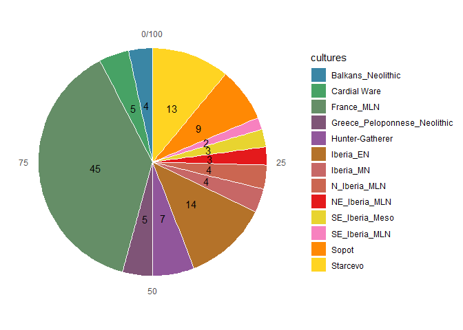
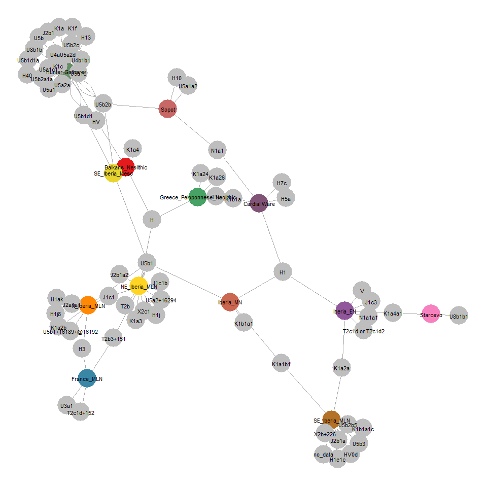
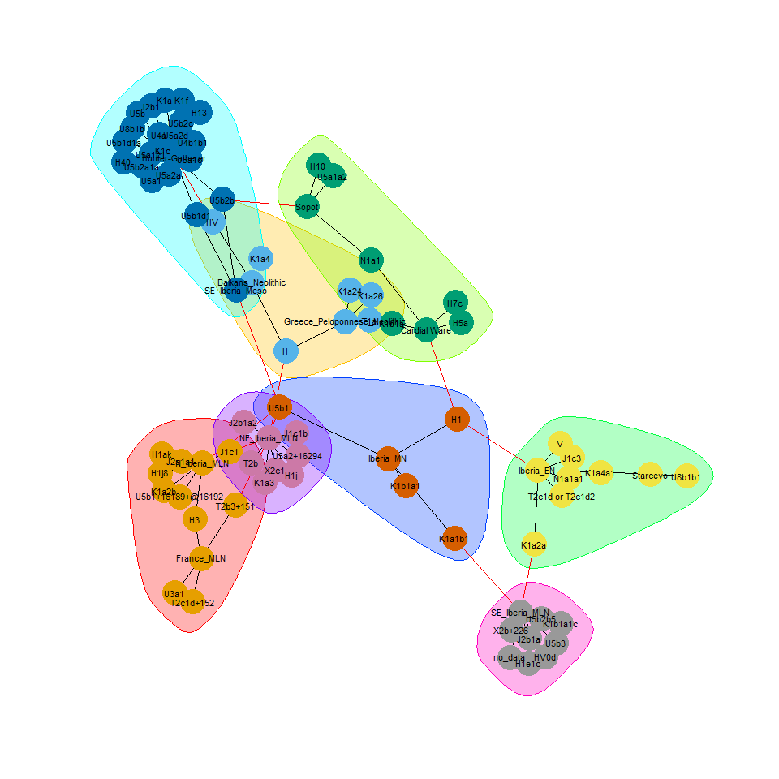
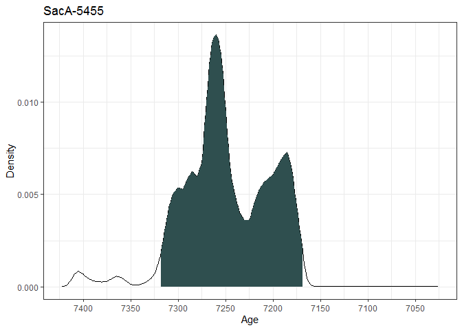

<style>
.html-widget {
    margin: auto;
}
</style>


Gene-culture coevolution (GC-coev) is one of the main challenge of evolutionnary archaeology. It requires the cross study of aDNA (['***Who ?***'](https://github.com/zoometh/thomashuet/blob/main/README.md#statements)) and the different aspects of the culture ('***What ?***'). 

Genetic analysis permit to evaluate genetic populations (dis)similarities. On the base of single-nucleotide polymorphisms (SNPs) study, the neutral hypothesis (H~0~, i.e. a population continuity with few random genetic drifts) can be rejected (H~1~ accepted) and factors like mutation, selection and migration can be supposed. At the time scale we investigate (Recent Prehistory), only the migration factor could explain observed significant changes in the genetic of populations. Differences between populations can be detected by different means but the determination of groups (e.g. indigenous, immigrants) is mostly based on the study of the SNPs or discrete haplogroup (hg) frequencies [@Bramanti09]. The R packages [ape](https://cran.r-project.org/web/packages/ape/index.html) and [pegas](https://cran.r-project.org/web/packages/pegas/index.html), among others, permit to perform analysis of Molecular Variance (AMOVA), genetic mapping (e.g. phylogenetic trees, haplotype network, median-joining network) and cluster analysis (multidimensional scaling, dendrogram, etc.)

This doc is a HTML presentation host on [GitHub](https://github.com/zoometh/aDNA), which brings together R + Leaflet coding showing how to download data from the Ancient mtDNA database (AmtDB) and we conduct and overview of GC-coev issues concerning the transition between hunter-gatherers (HG) and early farmers (EF) in the Central and West Europe.

# The AmtDB dataset

The mitochondrial DNA (mtDNA) makes it possible to trace the maternal line. It passes from the mother to her children (of both sexes). Published mitochondrial sequences coming from the ancient DNA samples (aDNA) can be download from the [Ancient mtDNA database (AmtDB)](https://amtdb.org/records/). This database gathers . The whole dataset is composed by the [data](#mt.data) and the [metadata](#mt.meta)


## data {#mt.data}

The data file [mtdb_1511.fasta](mtdb_1511.fasta) is downloaded from the AmtDB. The current metadata format is .fasta, a text-based format for representing either nucleotide sequences or peptide sequences, in which base pairs or amino acids are represented using single-letter codes. FASTA formats can be read with the [phylotools](https://github.com/helixcn/phylotools) package. A sequence in FASTA format begins with a single-line description, followed by lines of sequence data:


```r
fasta <- phylotools::read.fasta("mtdb_1511.fasta")
fasta$seq.name[1]
```

```
## [1] "RISE509"
```

```r
substr(fasta$seq.text[1], 1, 250)
```

```
## [1] "GATCACAGGTCTATCACCCTATTAACCACTCACGGGAGCTCTCCATGCATTTGGTATTTTCGTCTGGGGGGTGTGCACGCGATAGCATTGCGAGACGCTGGAGCCGGAGCACCCTATGTCGCAGTATCTGTCTTTGATTCCTGCCTCATCCTATTATTTATCGCACCTACGTTCAATATTACAGGCGAACATACTTACTAAAGTGTGTTAATTAATTAATGCTTGTAGGACATAATAATAACAATTGAAT"
```
Each of these identifiers is a unique key for a sample. The data file counts <span style='color:grey'>1511</span> different identifiers. These identifiers which allow to join the second dataset, [metadata](#mt.meta). We will use this latter for cross-analysis

## metadata {#mt.meta}

The metadata file [metadata](mtdb_metadata.csv) is downloaded from the AmtDB. The current metadata format is .csv

<table class="table" style="font-size: 11px; width: auto !important; margin-left: auto; margin-right: auto;">
<caption style="font-size: initial !important;">(\#tab:meta1)aDNA metadata sample</caption>
 <thead>
  <tr>
   <th style="text-align:left;"> identifier </th>
   <th style="text-align:left;"> alternative_identifiers </th>
   <th style="text-align:left;"> country </th>
   <th style="text-align:left;"> continent </th>
   <th style="text-align:left;"> region </th>
   <th style="text-align:left;"> culture </th>
   <th style="text-align:left;"> epoch </th>
   <th style="text-align:left;"> group </th>
   <th style="text-align:left;"> comment </th>
   <th style="text-align:right;"> latitude </th>
   <th style="text-align:right;"> longitude </th>
   <th style="text-align:left;"> sex </th>
   <th style="text-align:left;"> site </th>
   <th style="text-align:left;"> site_detail </th>
   <th style="text-align:left;"> mt_hg </th>
   <th style="text-align:left;"> ychr_hg </th>
   <th style="text-align:right;"> year_from </th>
   <th style="text-align:right;"> year_to </th>
   <th style="text-align:left;"> date_detail </th>
   <th style="text-align:left;"> bp </th>
   <th style="text-align:left;"> c14_lab_code </th>
   <th style="text-align:left;"> reference_names </th>
   <th style="text-align:left;"> reference_links </th>
   <th style="text-align:left;"> reference_data_links </th>
   <th style="text-align:right;"> c14_sample_tag </th>
   <th style="text-align:right;"> c14_layer_tag </th>
   <th style="text-align:right;"> avg_coverage </th>
   <th style="text-align:left;"> sequence_source </th>
   <th style="text-align:left;"> ychr_snps </th>
  </tr>
 </thead>
<tbody>
  <tr>
   <td style="text-align:left;"> LD1174 </td>
   <td style="text-align:left;"> 1174~/2-I.XXII - 12no 11752/m. H.c.r 25/06/9 </td>
   <td style="text-align:left;"> Portugal </td>
   <td style="text-align:left;"> Europe </td>
   <td style="text-align:left;"> Iberia </td>
   <td style="text-align:left;"> Iberia_CA </td>
   <td style="text-align:left;"> Copper Age </td>
   <td style="text-align:left;"> CAIB </td>
   <td style="text-align:left;">  </td>
   <td style="text-align:right;"> 41.88619 </td>
   <td style="text-align:right;"> -7.203677 </td>
   <td style="text-align:left;"> F </td>
   <td style="text-align:left;"> Longa de Dine </td>
   <td style="text-align:left;">  </td>
   <td style="text-align:left;"> U5b2 </td>
   <td style="text-align:left;">  </td>
   <td style="text-align:right;"> -2577 </td>
   <td style="text-align:right;"> -2456 </td>
   <td style="text-align:left;"> 4527-4406 calBP </td>
   <td style="text-align:left;"> 3980±30 </td>
   <td style="text-align:left;"> Beta-441391 </td>
   <td style="text-align:left;"> Gonzalez-Fortes et al. 2019 </td>
   <td style="text-align:left;"> https://doi.org/10.1098/rspb.2018.2288 </td>
   <td style="text-align:left;"> https://www.ncbi.nlm.nih.gov/nuccore/MK321329 </td>
   <td style="text-align:right;"> 1 </td>
   <td style="text-align:right;"> 0 </td>
   <td style="text-align:right;"> 145.600 </td>
   <td style="text-align:left;"> fasta </td>
   <td style="text-align:left;">  </td>
  </tr>
  <tr>
   <td style="text-align:left;"> I2037 </td>
   <td style="text-align:left;"> HAL39b </td>
   <td style="text-align:left;"> Germany </td>
   <td style="text-align:left;"> Europe </td>
   <td style="text-align:left;"> central Europe </td>
   <td style="text-align:left;"> Linear Pottery </td>
   <td style="text-align:left;"> Neolithic </td>
   <td style="text-align:left;"> LBK </td>
   <td style="text-align:left;">  </td>
   <td style="text-align:right;"> 51.89583 </td>
   <td style="text-align:right;"> 11.046667 </td>
   <td style="text-align:left;"> M </td>
   <td style="text-align:left;"> Halberstadt-Sonntagsfeld </td>
   <td style="text-align:left;">  </td>
   <td style="text-align:left;"> H1e </td>
   <td style="text-align:left;"> G2a2a </td>
   <td style="text-align:right;"> -5210 </td>
   <td style="text-align:right;"> -5002 </td>
   <td style="text-align:left;"> 5210-5002 calBCE (6144±32 BP, KIA-40343) </td>
   <td style="text-align:left;"> 6144±32 </td>
   <td style="text-align:left;"> KIA-40343 </td>
   <td style="text-align:left;"> Lipson et al. 2017 </td>
   <td style="text-align:left;"> https://dx.doi.org/10.1038/nature24476 </td>
   <td style="text-align:left;"> https://www.ebi.ac.uk/ena/data/view/PRJEB22629 </td>
   <td style="text-align:right;"> 1 </td>
   <td style="text-align:right;"> 0 </td>
   <td style="text-align:right;"> 0.000 </td>
   <td style="text-align:left;"> bam </td>
   <td style="text-align:left;">  </td>
  </tr>
  <tr>
   <td style="text-align:left;"> I2935 </td>
   <td style="text-align:left;"> GENSCOT73 </td>
   <td style="text-align:left;"> Great Britain </td>
   <td style="text-align:left;"> Europe </td>
   <td style="text-align:left;"> British Isles </td>
   <td style="text-align:left;"> Scotland_N </td>
   <td style="text-align:left;"> Neolithic </td>
   <td style="text-align:left;"> NEBI </td>
   <td style="text-align:left;">  </td>
   <td style="text-align:right;"> 58.74000 </td>
   <td style="text-align:right;"> -2.916000 </td>
   <td style="text-align:left;"> M </td>
   <td style="text-align:left;"> Isbister, Orkney, Scotland </td>
   <td style="text-align:left;">  </td>
   <td style="text-align:left;"> U8b1b </td>
   <td style="text-align:left;"> I2a1b1 </td>
   <td style="text-align:right;"> -3335 </td>
   <td style="text-align:right;"> -3011 </td>
   <td style="text-align:left;"> 3335-3011 calBCE (4451±29 BP, SUERC-68723) </td>
   <td style="text-align:left;"> 4451±29 </td>
   <td style="text-align:left;"> SUERC-68723 </td>
   <td style="text-align:left;"> Olalde et al. 2018 </td>
   <td style="text-align:left;"> https://dx.doi.org/10.1038/nature25738 </td>
   <td style="text-align:left;"> http://www.ebi.ac.uk/ena/data/view/PRJEB23635 </td>
   <td style="text-align:right;"> 1 </td>
   <td style="text-align:right;"> 0 </td>
   <td style="text-align:right;"> 610.263 </td>
   <td style="text-align:left;"> bam </td>
   <td style="text-align:left;">  </td>
  </tr>
</tbody>
</table>

It counts <span style='color:grey'>2426</span> samples and <span style='color:grey'>29</span> columns. 

# mtDNA *and* culture {#cross.mt.DNA.culture}

Within the AmtDB database, two (2) fields give direct insights on the cultural membership of the skeleton:

1. 'culture' counts <span style='color:grey'>252</span> distinct cultures
2. 'epoch' is more generic and counts <span style='color:grey'>14</span> distinct epoch. 

To illustrate GC-coev, we will focus on the Central and Western Mediterranean (ie, Italy to Spain) during the Mesolithic/Neolithic transition. We also avoid *unicum* in cultures (Freq > 1)


```r
df.MesoNeo <- df %>% 
  filter(epoch == 'Mesolithic' | epoch == 'Neolithic') %>%
  filter(latitude < 46 & latitude > 36) %>%
  filter(longitude > -6 & longitude < 22.5)
# unicum
df.MesoNeo <- df.MesoNeo %>%  
  group_by(culture) %>%
  filter(n() > 1)
MNcultures <- as.data.frame(table(df.MesoNeo$culture),
                            stringsAsFactors = F)
```

After processing, the new dataset counts <span style='color:grey'>118</span> samples and <span style='color:grey'>13</span> distinct cultures:



The selected sample of the dataset can be mapped. Inside their popup, the hg appears always colored in <span style="color: red;">red</span> but the culture is color is value-dependent   


<div class="figure" style="text-align: center">
<!--html_preserve--><div id="htmlwidget-9a57929ccb310a3c7a07" style="width:60%;height:400px;" class="leaflet html-widget"></div>
<script type="application/json" data-for="htmlwidget-9a57929ccb310a3c7a07">{"x":{"options":{"crs":{"crsClass":"L.CRS.EPSG3857","code":null,"proj4def":null,"projectedBounds":null,"options":{}}},"calls":[{"method":"addTiles","args":["//{s}.tile.openstreetmap.org/{z}/{x}/{y}.png",null,"OSM",{"minZoom":0,"maxZoom":18,"tileSize":256,"subdomains":"abc","errorTileUrl":"","tms":false,"noWrap":false,"zoomOffset":0,"zoomReverse":false,"opacity":1,"zIndex":1,"detectRetina":false,"attribution":"&copy; <a href=\"http://openstreetmap.org\">OpenStreetMap<\/a> contributors, <a href=\"http://creativecommons.org/licenses/by-sa/2.0/\">CC-BY-SA<\/a>"}]},{"method":"addCircleMarkers","args":[[44.9,44.9,44.9,44.82,44.82,43.59,43.59,43.59,43.457,43.457,43.34,43.457,36.64,36.64,36.64,36.64,36.64,44.6,44.6,43.26,42.91,44.53,44.6,44.6,44.53,44.53,44.55,44.55,44.53,44.53,44.53,44.53,44.53,44.53,44.53,44.53,44.64,44.64,44.64,44.64,44.53,44.6,42.97,44.53,44.6,44.6,44.6,44.6,44.53,44.64,44.6,44.6,44.6,44.6,44.64,44.55,44.53,39.682491,39.682491,44.53,44.53,44.55,41.37,42.5,42.5,42.5,42.5,42.6282,42.6282,41.25,41.25,41.25,41.25,43.085823,43.0866,43.085823,43.0866,43.0866,43.0866,43.085823,43.085823,43.085823,41.4391,41.4391,41.4391,41.4391,41.4391,41.4391,41.4391,41.4391,41.4391,41.4391,41.4391,41.4391,41.4391,37.439437,40.41819566,39.79,38.7025,38.7025,38.7025,38.7025,38.7025,38.7025,38.7025,38.7025,38.7025,38.7025,38.762271,38.762271,38.7025,38.7025,45.32,45.76,45.32,45.76,44.49,45.76],[19.75,19.75,19.75,13.64,13.64,16.65,16.65,16.65,5.863,5.863,5.06,5.863,22.38,22.38,22.38,22.38,22.38,22.01,22.01,-3.45,-5.38,22.05,22.01,22.01,22.05,22.05,22.03,22.03,22.05,22.05,22.05,22.05,22.05,22.05,22.05,22.05,22.3,22.3,22.3,22.3,22.05,22.01,16.71,22.05,22.01,22.01,22.01,22.01,22.05,22.3,22.01,22.01,22.01,22.01,22.3,22.03,22.05,21.68191,21.68191,22.05,22.05,22.03,1.89,0.5,0.5,0.5,0.5,-3.11649,-3.11649,-2.33,-2.33,-2.33,-2.33,-2.251197,-2.2154,-2.251197,-2.2154,-2.2154,-2.2154,-2.251197,-2.251197,-2.251197,1.5733,1.5733,1.5733,1.5733,1.5733,1.5733,1.5733,1.5733,1.5733,1.5733,1.5733,1.5733,1.5733,-3.437567,-0.11675,-1.033333,-0.48631,-0.48631,-0.48631,-0.48631,-0.48631,-0.48631,-0.48631,-0.48631,-0.48631,-0.48631,-0.586981,-0.586981,-0.48631,-0.48631,18.39,18.57,18.39,18.57,21.08,18.57],3,["I1131","I0634","I0633","I5071","I5072","I3948","I3947","I3433","I4303","I4305","I4308","I4304","I3920","I2937","I3708","I3709","I5427","I5239","I5240","ElMiron","I0585","I4660","I5241","I5242","I4870","I4871","I4665","I4666","I4874","I4875","I4872","I4873","I4878","I4880","I4881","I4882","I4914","I4915","I4916","I4917","I4877","I5232","I1875","I4876","I5235","I5236","I5233","I5234","I5773","I5401","I5237","I5238","I5244","I5409","I5402","I5405","I4657","Theo1","Theo5","I5771","I5772","I5407","CB13","I0413","I0409","I0410","I0412","I2199","I1972","I0407","I0406","I0405","I0408","I7605","I11301","I7604","I11248","I11300","I11249","I7603","I7602","I7606","I10284","I11306","I10282","I10280","I10285","I10286","I10283","I11303","I11304","I10287","I10277","I11305","I10278","I10899","I3209","I8130","I7598","I7595","I7597","I7642","I7594","I7601","I7645","I7646","I7643","I7644","I8567","I8568","I7647","I7600","I5078","I4167","I5077","I4168","I4918","I3498"],null,{"interactive":true,"className":"","stroke":true,"color":["#E41A1C","#E41A1C","#E41A1C","#7F5477","#7F5477","#7F5477","#7F5477","#7F5477","#3A86A5","#3A86A5","#3A86A5","#3A86A5","#47A265","#47A265","#47A265","#47A265","#47A265","#658E67","#658E67","#658E67","#658E67","#658E67","#658E67","#658E67","#658E67","#658E67","#658E67","#658E67","#658E67","#658E67","#658E67","#658E67","#658E67","#658E67","#658E67","#658E67","#658E67","#658E67","#658E67","#658E67","#658E67","#658E67","#658E67","#658E67","#658E67","#658E67","#658E67","#658E67","#658E67","#658E67","#658E67","#658E67","#658E67","#658E67","#658E67","#658E67","#658E67","#658E67","#658E67","#658E67","#658E67","#658E67","#91569B","#91569B","#91569B","#91569B","#91569B","#91569B","#91569B","#CB6651","#CB6651","#CB6651","#CB6651","#FF8904","#FF8904","#FF8904","#FF8904","#FF8904","#FF8904","#FF8904","#FF8904","#FF8904","#FFD422","#FFD422","#FFD422","#FFD422","#FFD422","#FFD422","#FFD422","#FFD422","#FFD422","#FFD422","#FFD422","#FFD422","#FFD422","#E8D430","#E8D430","#E8D430","#B47229","#B47229","#B47229","#B47229","#B47229","#B47229","#B47229","#B47229","#B47229","#B47229","#B47229","#B47229","#B47229","#B47229","#C76766","#C76766","#C76766","#C76766","#F781BF","#F781BF"],"weight":1,"opacity":0.7,"fill":true,"fillColor":["#E41A1C","#E41A1C","#E41A1C","#7F5477","#7F5477","#7F5477","#7F5477","#7F5477","#3A86A5","#3A86A5","#3A86A5","#3A86A5","#47A265","#47A265","#47A265","#47A265","#47A265","#658E67","#658E67","#658E67","#658E67","#658E67","#658E67","#658E67","#658E67","#658E67","#658E67","#658E67","#658E67","#658E67","#658E67","#658E67","#658E67","#658E67","#658E67","#658E67","#658E67","#658E67","#658E67","#658E67","#658E67","#658E67","#658E67","#658E67","#658E67","#658E67","#658E67","#658E67","#658E67","#658E67","#658E67","#658E67","#658E67","#658E67","#658E67","#658E67","#658E67","#658E67","#658E67","#658E67","#658E67","#658E67","#91569B","#91569B","#91569B","#91569B","#91569B","#91569B","#91569B","#CB6651","#CB6651","#CB6651","#CB6651","#FF8904","#FF8904","#FF8904","#FF8904","#FF8904","#FF8904","#FF8904","#FF8904","#FF8904","#FFD422","#FFD422","#FFD422","#FFD422","#FFD422","#FFD422","#FFD422","#FFD422","#FFD422","#FFD422","#FFD422","#FFD422","#FFD422","#E8D430","#E8D430","#E8D430","#B47229","#B47229","#B47229","#B47229","#B47229","#B47229","#B47229","#B47229","#B47229","#B47229","#B47229","#B47229","#B47229","#B47229","#C76766","#C76766","#C76766","#C76766","#F781BF","#F781BF"],"fillOpacity":0.7},null,null,["<b>Gomolava, Hrtkovci, Vojvodina<\/b> <span style='color:red'>H<\/span> <br>culture: <span style='color:#E41A1C;'>Balkans_Neolithic<\/span> <i>Neolithic<\/i><br>ref: <a href=\"https://dx.doi.org/10.1038/nature25778\" target=\"_blank\">Mathieson et al. 2018<\/a>","<b>Gomolava, Hrtkovci, Vojvodina<\/b> <span style='color:red'>K1a4<\/span> <br>culture: <span style='color:#E41A1C;'>Balkans_Neolithic<\/span> <i>Neolithic<\/i><br>ref: <a href=\"https://dx.doi.org/10.1038/nature25778\" target=\"_blank\">Mathieson et al. 2018<\/a>","<b>Gomolava, Hrtkovci, Vojvodina<\/b> <span style='color:red'>HV<\/span> <br>culture: <span style='color:#E41A1C;'>Balkans_Neolithic<\/span> <i>Neolithic<\/i><br>ref: <a href=\"https://dx.doi.org/10.1038/nature25778\" target=\"_blank\">Mathieson et al. 2018<\/a>","<b>Kargadur<\/b> <span style='color:red'>H5a<\/span> <br>culture: <span style='color:#7F5477;'>Cardial Ware<\/span> <i>Neolithic<\/i><br>ref: <a href=\"https://dx.doi.org/10.1038/nature25778\" target=\"_blank\">Mathieson et al. 2018<\/a>","<b>Kargadur<\/b> <span style='color:red'>H7c<\/span> <br>culture: <span style='color:#7F5477;'>Cardial Ware<\/span> <i>Neolithic<\/i><br>ref: <a href=\"https://dx.doi.org/10.1038/nature25778\" target=\"_blank\">Mathieson et al. 2018<\/a>","<b>Zemunica Cave<\/b> <span style='color:red'>N1a1<\/span> <br>culture: <span style='color:#7F5477;'>Cardial Ware<\/span> <i>Neolithic<\/i><br>ref: <a href=\"https://dx.doi.org/10.1038/nature25778\" target=\"_blank\">Mathieson et al. 2018<\/a>","<b>Zemunica Cave<\/b> <span style='color:red'>K1b1a<\/span> <br>culture: <span style='color:#7F5477;'>Cardial Ware<\/span> <i>Neolithic<\/i><br>ref: <a href=\"https://dx.doi.org/10.1038/nature25778\" target=\"_blank\">Mathieson et al. 2018<\/a>","<b>Zemunica Cave<\/b> <span style='color:red'>H1<\/span> <br>culture: <span style='color:#7F5477;'>Cardial Ware<\/span> <i>Neolithic<\/i><br>ref: <a href=\"https://dx.doi.org/10.1038/nature25778\" target=\"_blank\">Mathieson et al. 2018<\/a>","<b>Clos de Roque, Saint Maximin-la-Sainte-Baume<\/b> <span style='color:red'>H3<\/span> <br>culture: <span style='color:#3A86A5;'>France_MLN<\/span> <i>Neolithic<\/i><br>ref: <a href=\"https://dx.doi.org/10.1038/nature25738\" target=\"_blank\">Olalde et al. 2018<\/a>","<b>Clos de Roque, Saint Maximin-la-Sainte-Baume<\/b> <span style='color:red'>T2b3+151<\/span> <br>culture: <span style='color:#3A86A5;'>France_MLN<\/span> <i>Neolithic<\/i><br>ref: <a href=\"https://dx.doi.org/10.1038/nature25738\" target=\"_blank\">Olalde et al. 2018<\/a>","<b>Collet Redon, La Couronne-Martigues<\/b> <span style='color:red'>U3a1<\/span> <br>culture: <span style='color:#3A86A5;'>France_MLN<\/span> <i>Neolithic<\/i><br>ref: <a href=\"https://dx.doi.org/10.1038/nature25738\" target=\"_blank\">Olalde et al. 2018<\/a>","<b>Clos de Roque, Saint Maximin-la-Sainte-Baume<\/b> <span style='color:red'>T2c1d+152<\/span> <br>culture: <span style='color:#3A86A5;'>France_MLN<\/span> <i>Neolithic<\/i><br>ref: <a href=\"https://dx.doi.org/10.1038/nature25738\" target=\"_blank\">Olalde et al. 2018<\/a>","<b>Diros, Alepotrypa Cave<\/b> <span style='color:red'>H<\/span> <br>culture: <span style='color:#47A265;'>Greece_Peloponnese_Neolithic<\/span> <i>Neolithic<\/i><br>ref: <a href=\"https://dx.doi.org/10.1038/nature25778\" target=\"_blank\">Mathieson et al. 2018<\/a>","<b>Diros, Alepotrypa Cave<\/b> <span style='color:red'>K1a26<\/span> <br>culture: <span style='color:#47A265;'>Greece_Peloponnese_Neolithic<\/span> <i>Neolithic<\/i><br>ref: <a href=\"https://dx.doi.org/10.1038/nature23310\" target=\"_blank\">Lazaridis et al. 2017<\/a>","<b>Diros, Alepotrypa Cave<\/b> <span style='color:red'>T1a<\/span> <br>culture: <span style='color:#47A265;'>Greece_Peloponnese_Neolithic<\/span> <i>Neolithic<\/i><br>ref: <a href=\"https://dx.doi.org/10.1038/nature25778\" target=\"_blank\">Mathieson et al. 2018<\/a>","<b>Diros, Alepotrypa Cave<\/b> <span style='color:red'>K1b1a<\/span> <br>culture: <span style='color:#47A265;'>Greece_Peloponnese_Neolithic<\/span> <i>Neolithic<\/i><br>ref: <a href=\"https://dx.doi.org/10.1038/nature25778\" target=\"_blank\">Mathieson et al. 2018<\/a>","<b>Diros, Alepotrypa Cave<\/b> <span style='color:red'>K1a24<\/span> <br>culture: <span style='color:#47A265;'>Greece_Peloponnese_Neolithic<\/span> <i>Neolithic<\/i><br>ref: <a href=\"https://dx.doi.org/10.1038/nature25778\" target=\"_blank\">Mathieson et al. 2018<\/a>","<b>Padina<\/b> <span style='color:red'>U5a2d<\/span> <br>culture: <span style='color:#658E67;'>Hunter-Gatherer<\/span> <i>Mesolithic<\/i><br>ref: <a href=\"https://dx.doi.org/10.1038/nature25778\" target=\"_blank\">Mathieson et al. 2018<\/a>","<b>Padina<\/b> <span style='color:red'>U5a1c<\/span> <br>culture: <span style='color:#658E67;'>Hunter-Gatherer<\/span> <i>Mesolithic<\/i><br>ref: <a href=\"https://dx.doi.org/10.1038/nature25778\" target=\"_blank\">Mathieson et al. 2018<\/a>","<b>El Miron<\/b> <span style='color:red'>U5b<\/span> <br>culture: <span style='color:#658E67;'>Hunter-Gatherer<\/span> <i>Mesolithic<\/i><br>ref: <a href=\"https://dx.doi.org/10.1038/nature17993\" target=\"_blank\">Fu et al. 2016<\/a>","<b>La Brana-Arintero, Leon<\/b> <span style='color:red'>U5b2c<\/span> <br>culture: <span style='color:#658E67;'>Hunter-Gatherer<\/span> <i>Mesolithic<\/i><br>ref: <a href=\"https://dx.doi.org/10.1038/nature12960\" target=\"_blank\">Olalde et al. 2014<\/a>","<b>Vlasac<\/b> <span style='color:red'>U8b1b<\/span> <br>culture: <span style='color:#658E67;'>Hunter-Gatherer<\/span> <i>Mesolithic<\/i><br>ref: <a href=\"https://dx.doi.org/10.1038/nature25778\" target=\"_blank\">Mathieson et al. 2018<\/a>","<b>Padina<\/b> <span style='color:red'>U5a2a<\/span> <br>culture: <span style='color:#658E67;'>Hunter-Gatherer<\/span> <i>Mesolithic<\/i><br>ref: <a href=\"https://dx.doi.org/10.1038/nature25778\" target=\"_blank\">Mathieson et al. 2018<\/a>","<b>Padina<\/b> <span style='color:red'>U5a1<\/span> <br>culture: <span style='color:#658E67;'>Hunter-Gatherer<\/span> <i>Mesolithic<\/i><br>ref: <a href=\"https://dx.doi.org/10.1038/nature25778\" target=\"_blank\">Mathieson et al. 2018<\/a>","<b>Vlasac<\/b> <span style='color:red'>K1c<\/span> <br>culture: <span style='color:#658E67;'>Hunter-Gatherer<\/span> <i>Mesolithic<\/i><br>ref: <a href=\"https://dx.doi.org/10.1038/nature25778\" target=\"_blank\">Mathieson et al. 2018<\/a>","<b>Vlasac<\/b> <span style='color:red'>U5b2a1a<\/span> <br>culture: <span style='color:#658E67;'>Hunter-Gatherer<\/span> <i>Mesolithic<\/i><br>ref: <a href=\"https://dx.doi.org/10.1038/nature25778\" target=\"_blank\">Mathieson et al. 2018<\/a>","<b>Lepenski Vir<\/b> <span style='color:red'>J2b1<\/span> <br>culture: <span style='color:#658E67;'>Hunter-Gatherer<\/span> <i>Mesolithic<\/i><br>ref: <a href=\"https://dx.doi.org/10.1038/nature25778\" target=\"_blank\">Mathieson et al. 2018<\/a>","<b>Lepenski Vir<\/b> <span style='color:red'>H40<\/span> <br>culture: <span style='color:#658E67;'>Hunter-Gatherer<\/span> <i>Mesolithic<\/i><br>ref: <a href=\"https://dx.doi.org/10.1038/nature25778\" target=\"_blank\">Mathieson et al. 2018<\/a>","<b>Vlasac<\/b> <span style='color:red'>U5b2a1a<\/span> <br>culture: <span style='color:#658E67;'>Hunter-Gatherer<\/span> <i>Mesolithic<\/i><br>ref: <a href=\"https://dx.doi.org/10.1038/nature25778\" target=\"_blank\">Mathieson et al. 2018<\/a>","<b>Vlasac<\/b> <span style='color:red'>U5b1d1a<\/span> <br>culture: <span style='color:#658E67;'>Hunter-Gatherer<\/span> <i>Mesolithic<\/i><br>ref: <a href=\"https://dx.doi.org/10.1038/nature25778\" target=\"_blank\">Mathieson et al. 2018<\/a>","<b>Vlasac<\/b> <span style='color:red'>U5a1c<\/span> <br>culture: <span style='color:#658E67;'>Hunter-Gatherer<\/span> <i>Mesolithic<\/i><br>ref: <a href=\"https://dx.doi.org/10.1038/nature25778\" target=\"_blank\">Mathieson et al. 2018<\/a>","<b>Vlasac<\/b> <span style='color:red'>U5a2a<\/span> <br>culture: <span style='color:#658E67;'>Hunter-Gatherer<\/span> <i>Mesolithic<\/i><br>ref: <a href=\"https://dx.doi.org/10.1038/nature25778\" target=\"_blank\">Mathieson et al. 2018<\/a>","<b>Vlasac<\/b> <span style='color:red'>U4a<\/span> <br>culture: <span style='color:#658E67;'>Hunter-Gatherer<\/span> <i>Mesolithic<\/i><br>ref: <a href=\"https://dx.doi.org/10.1038/nature25778\" target=\"_blank\">Mathieson et al. 2018<\/a>","<b>Vlasac<\/b> <span style='color:red'>U4b1b1<\/span> <br>culture: <span style='color:#658E67;'>Hunter-Gatherer<\/span> <i>Mesolithic<\/i><br>ref: <a href=\"https://dx.doi.org/10.1038/nature25778\" target=\"_blank\">Mathieson et al. 2018<\/a>","<b>Vlasac<\/b> <span style='color:red'>U4b1b1<\/span> <br>culture: <span style='color:#658E67;'>Hunter-Gatherer<\/span> <i>Mesolithic<\/i><br>ref: <a href=\"https://dx.doi.org/10.1038/nature25778\" target=\"_blank\">Mathieson et al. 2018<\/a>","<b>Vlasac<\/b> <span style='color:red'>U4b1b1<\/span> <br>culture: <span style='color:#658E67;'>Hunter-Gatherer<\/span> <i>Mesolithic<\/i><br>ref: <a href=\"https://dx.doi.org/10.1038/nature25778\" target=\"_blank\">Mathieson et al. 2018<\/a>","<b>Hadučka Vodenica<\/b> <span style='color:red'>U5a1c1<\/span> <br>culture: <span style='color:#658E67;'>Hunter-Gatherer<\/span> <i>Mesolithic<\/i><br>ref: <a href=\"https://dx.doi.org/10.1038/nature25778\" target=\"_blank\">Mathieson et al. 2018<\/a>","<b>Hadučka Vodenica<\/b> <span style='color:red'>U5b2b<\/span> <br>culture: <span style='color:#658E67;'>Hunter-Gatherer<\/span> <i>Mesolithic<\/i><br>ref: <a href=\"https://dx.doi.org/10.1038/nature25778\" target=\"_blank\">Mathieson et al. 2018<\/a>","<b>Hadučka Vodenica<\/b> <span style='color:red'>U5b2b<\/span> <br>culture: <span style='color:#658E67;'>Hunter-Gatherer<\/span> <i>Mesolithic<\/i><br>ref: <a href=\"https://dx.doi.org/10.1038/nature25778\" target=\"_blank\">Mathieson et al. 2018<\/a>","<b>Hadučka Vodenica<\/b> <span style='color:red'>U5a1c<\/span> <br>culture: <span style='color:#658E67;'>Hunter-Gatherer<\/span> <i>Mesolithic<\/i><br>ref: <a href=\"https://dx.doi.org/10.1038/nature25778\" target=\"_blank\">Mathieson et al. 2018<\/a>","<b>Vlasac<\/b> <span style='color:red'>U5b1d1<\/span> <br>culture: <span style='color:#658E67;'>Hunter-Gatherer<\/span> <i>Mesolithic<\/i><br>ref: <a href=\"https://dx.doi.org/10.1038/nature25778\" target=\"_blank\">Mathieson et al. 2018<\/a>","<b>Padina<\/b> <span style='color:red'>K1a<\/span> <br>culture: <span style='color:#658E67;'>Hunter-Gatherer<\/span> <i>Mesolithic<\/i><br>ref: <a href=\"https://dx.doi.org/10.1038/nature25778\" target=\"_blank\">Mathieson et al. 2018<\/a>","<b>Vela Spila<\/b> <span style='color:red'>U5b2b<\/span> <br>culture: <span style='color:#658E67;'>Hunter-Gatherer<\/span> <i>Mesolithic<\/i><br>ref: <a href=\"https://dx.doi.org/10.1038/nature25778\" target=\"_blank\">Mathieson et al. 2018<\/a>","<b>Vlasac<\/b> <span style='color:red'>U5a2d<\/span> <br>culture: <span style='color:#658E67;'>Hunter-Gatherer<\/span> <i>Mesolithic<\/i><br>ref: <a href=\"https://dx.doi.org/10.1038/nature25778\" target=\"_blank\">Mathieson et al. 2018<\/a>","<b>Padina<\/b> <span style='color:red'>U5b2c<\/span> <br>culture: <span style='color:#658E67;'>Hunter-Gatherer<\/span> <i>Mesolithic<\/i><br>ref: <a href=\"https://dx.doi.org/10.1038/nature25778\" target=\"_blank\">Mathieson et al. 2018<\/a>","<b>Padina<\/b> <span style='color:red'>U5a2d<\/span> <br>culture: <span style='color:#658E67;'>Hunter-Gatherer<\/span> <i>Mesolithic<\/i><br>ref: <a href=\"https://dx.doi.org/10.1038/nature25778\" target=\"_blank\">Mathieson et al. 2018<\/a>","<b>Padina<\/b> <span style='color:red'>U5b1d1<\/span> <br>culture: <span style='color:#658E67;'>Hunter-Gatherer<\/span> <i>Mesolithic<\/i><br>ref: <a href=\"https://dx.doi.org/10.1038/nature25778\" target=\"_blank\">Mathieson et al. 2018<\/a>","<b>Padina<\/b> <span style='color:red'>U4a<\/span> <br>culture: <span style='color:#658E67;'>Hunter-Gatherer<\/span> <i>Mesolithic<\/i><br>ref: <a href=\"https://dx.doi.org/10.1038/nature25778\" target=\"_blank\">Mathieson et al. 2018<\/a>","<b>Vlasac<\/b> <span style='color:red'>U4a<\/span> <br>culture: <span style='color:#658E67;'>Hunter-Gatherer<\/span> <i>Mesolithic<\/i><br>ref: <a href=\"https://dx.doi.org/10.1038/nature25778\" target=\"_blank\">Mathieson et al. 2018<\/a>","<b>Hadučka Vodenica<\/b> <span style='color:red'>U5a1<\/span> <br>culture: <span style='color:#658E67;'>Hunter-Gatherer<\/span> <i>Mesolithic<\/i><br>ref: <a href=\"https://dx.doi.org/10.1038/nature25778\" target=\"_blank\">Mathieson et al. 2018<\/a>","<b>Padina<\/b> <span style='color:red'>U5a2a<\/span> <br>culture: <span style='color:#658E67;'>Hunter-Gatherer<\/span> <i>Mesolithic<\/i><br>ref: <a href=\"https://dx.doi.org/10.1038/nature25778\" target=\"_blank\">Mathieson et al. 2018<\/a>","<b>Padina<\/b> <span style='color:red'>K1c<\/span> <br>culture: <span style='color:#658E67;'>Hunter-Gatherer<\/span> <i>Mesolithic<\/i><br>ref: <a href=\"https://dx.doi.org/10.1038/nature25778\" target=\"_blank\">Mathieson et al. 2018<\/a>","<b>Padina<\/b> <span style='color:red'>K1f<\/span> <br>culture: <span style='color:#658E67;'>Hunter-Gatherer<\/span> <i>Mesolithic<\/i><br>ref: <a href=\"https://dx.doi.org/10.1038/nature25778\" target=\"_blank\">Mathieson et al. 2018<\/a>","<b>Padina<\/b> <span style='color:red'>U5a1c<\/span> <br>culture: <span style='color:#658E67;'>Hunter-Gatherer<\/span> <i>Mesolithic<\/i><br>ref: <a href=\"https://dx.doi.org/10.1038/nature25778\" target=\"_blank\">Mathieson et al. 2018<\/a>","<b>Hadučka Vodenica<\/b> <span style='color:red'>U5a1c1<\/span> <br>culture: <span style='color:#658E67;'>Hunter-Gatherer<\/span> <i>Mesolithic<\/i><br>ref: <a href=\"https://dx.doi.org/10.1038/nature25778\" target=\"_blank\">Mathieson et al. 2018<\/a>","<b>Lepenski Vir<\/b> <span style='color:red'>HV<\/span> <br>culture: <span style='color:#658E67;'>Hunter-Gatherer<\/span> <i>Mesolithic<\/i><br>ref: <a href=\"https://dx.doi.org/10.1038/nature25778\" target=\"_blank\">Mathieson et al. 2018<\/a>","<b>Vlasac<\/b> <span style='color:red'>K1c<\/span> <br>culture: <span style='color:#658E67;'>Hunter-Gatherer<\/span> <i>Mesolithic<\/i><br>ref: <a href=\"https://dx.doi.org/10.1038/nature25778\" target=\"_blank\">Mathieson et al. 2018<\/a>","<b>Theopetra<\/b> <span style='color:red'>K1c<\/span> <br>culture: <span style='color:#658E67;'>Hunter-Gatherer<\/span> <i>Mesolithic<\/i><br>ref: <a href=\"https://doi.org/10.1073/pnas.1523951113\" target=\"_blank\">Hofmanova et al. 2016<\/a>","<b>Theopetra<\/b> <span style='color:red'>K1c<\/span> <br>culture: <span style='color:#658E67;'>Hunter-Gatherer<\/span> <i>Mesolithic<\/i><br>ref: <a href=\"https://doi.org/10.1073/pnas.1523951113\" target=\"_blank\">Hofmanova et al. 2016<\/a>","<b>Vlasac<\/b> <span style='color:red'>U5a1c1<\/span> <br>culture: <span style='color:#658E67;'>Hunter-Gatherer<\/span> <i>Mesolithic<\/i><br>ref: <a href=\"https://dx.doi.org/10.1038/nature25778\" target=\"_blank\">Mathieson et al. 2018<\/a>","<b>Vlasac<\/b> <span style='color:red'>U5a2a<\/span> <br>culture: <span style='color:#658E67;'>Hunter-Gatherer<\/span> <i>Mesolithic<\/i><br>ref: <a href=\"https://dx.doi.org/10.1038/nature25778\" target=\"_blank\">Mathieson et al. 2018<\/a>","<b>Lepenski Vir<\/b> <span style='color:red'>H13<\/span> <br>culture: <span style='color:#658E67;'>Hunter-Gatherer<\/span> <i>Mesolithic<\/i><br>ref: <a href=\"https://dx.doi.org/10.1038/nature25778\" target=\"_blank\">Mathieson et al. 2018<\/a>","<b>Cova Bonica, Vallirana, Barcelona<\/b> <span style='color:red'>K1a2a<\/span> <br>culture: <span style='color:#91569B;'>Iberia_EN<\/span> <i>Neolithic<\/i><br>ref: <a href=\"https://doi.org/10.1093/molbev/msv181\" target=\"_blank\">Olalde et al. 2015<\/a>","<b>Els Trocs<\/b> <span style='color:red'>V<\/span> <br>culture: <span style='color:#91569B;'>Iberia_EN<\/span> <i>Neolithic<\/i><br>ref: <a href=\"https://dx.doi.org/10.1038/nature14317\" target=\"_blank\">Haak et al. 2015<\/a>","<b>Els Trocs<\/b> <span style='color:red'>J1c3<\/span> <br>culture: <span style='color:#91569B;'>Iberia_EN<\/span> <i>Neolithic<\/i><br>ref: <a href=\"https://dx.doi.org/10.1038/nature14317\" target=\"_blank\">Haak et al. 2015<\/a>","<b>Els Trocs<\/b> <span style='color:red'>T2c1d or T2c1d2<\/span> <br>culture: <span style='color:#91569B;'>Iberia_EN<\/span> <i>Neolithic<\/i><br>ref: <a href=\"https://dx.doi.org/10.1038/nature14317\" target=\"_blank\">Haak et al. 2015<\/a>","<b>Els Trocs<\/b> <span style='color:red'>N1a1a1<\/span> <br>culture: <span style='color:#91569B;'>Iberia_EN<\/span> <i>Neolithic<\/i><br>ref: <a href=\"https://dx.doi.org/10.1038/nature14317\" target=\"_blank\">Haak et al. 2015<\/a>","<b>El Prado de Pancorbo, Burgos<\/b> <span style='color:red'>H1<\/span> <br>culture: <span style='color:#91569B;'>Iberia_EN<\/span> <i>Neolithic<\/i><br>ref: <a href=\"https://dx.doi.org/10.1038/nature24476\" target=\"_blank\">Lipson et al. 2017<\/a>","<b>El Prado de Pancorbo, Burgos<\/b> <span style='color:red'>K1a4a1<\/span> <br>culture: <span style='color:#91569B;'>Iberia_EN<\/span> <i>Neolithic<\/i><br>ref: <a href=\"https://dx.doi.org/10.1038/nature24476\" target=\"_blank\">Lipson et al. 2017<\/a>","<b>La Mina<\/b> <span style='color:red'>K1b1a1<\/span> <br>culture: <span style='color:#CB6651;'>Iberia_MN<\/span> <i>Neolithic<\/i><br>ref: <a href=\"https://dx.doi.org/10.1038/nature14317\" target=\"_blank\">Haak et al. 2015<\/a>","<b>La Mina<\/b> <span style='color:red'>H1<\/span> <br>culture: <span style='color:#CB6651;'>Iberia_MN<\/span> <i>Neolithic<\/i><br>ref: <a href=\"https://dx.doi.org/10.1038/nature14317\" target=\"_blank\">Haak et al. 2015<\/a>","<b>La Mina<\/b> <span style='color:red'>K1a1b1<\/span> <br>culture: <span style='color:#CB6651;'>Iberia_MN<\/span> <i>Neolithic<\/i><br>ref: <a href=\"https://dx.doi.org/10.1038/nature14317\" target=\"_blank\">Haak et al. 2015<\/a>","<b>La Mina<\/b> <span style='color:red'>U5b1<\/span> <br>culture: <span style='color:#CB6651;'>Iberia_MN<\/span> <i>Neolithic<\/i><br>ref: <a href=\"https://dx.doi.org/10.1038/nature14317\" target=\"_blank\">Haak et al. 2015<\/a>","<b>Mandubi Zelaia, Ezkio-Itsaso, Gipuzkoa, Basque Country<\/b> <span style='color:red'>H3<\/span> <br>culture: <span style='color:#FF8904;'>N_Iberia_MLN<\/span> <i>Neolithic<\/i><br>ref: <a href=\"https://doi.org/10.1126/science.aav4040\" target=\"_blank\">Olalde et al. 2019<\/a>","<b>Jentillarri, Enirio-Aralar, Gipuzkoa, Basque Country<\/b> <span style='color:red'>H1j8<\/span> <br>culture: <span style='color:#FF8904;'>N_Iberia_MLN<\/span> <i>Neolithic<\/i><br>ref: <a href=\"https://doi.org/10.1126/science.aav4040\" target=\"_blank\">Olalde et al. 2019<\/a>","<b>Mandubi Zelaia, Ezkio-Itsaso, Gipuzkoa, Basque Country<\/b> <span style='color:red'>H1ak<\/span> <br>culture: <span style='color:#FF8904;'>N_Iberia_MLN<\/span> <i>Neolithic<\/i><br>ref: <a href=\"https://doi.org/10.1126/science.aav4040\" target=\"_blank\">Olalde et al. 2019<\/a>","<b>Jentillarri, Enirio-Aralar, Gipuzkoa, Basque Country<\/b> <span style='color:red'>J2a1a1<\/span> <br>culture: <span style='color:#FF8904;'>N_Iberia_MLN<\/span> <i>Neolithic<\/i><br>ref: <a href=\"https://doi.org/10.1126/science.aav4040\" target=\"_blank\">Olalde et al. 2019<\/a>","<b>Jentillarri, Enirio-Aralar, Gipuzkoa, Basque Country<\/b> <span style='color:red'>J2a1a1<\/span> <br>culture: <span style='color:#FF8904;'>N_Iberia_MLN<\/span> <i>Neolithic<\/i><br>ref: <a href=\"https://doi.org/10.1126/science.aav4040\" target=\"_blank\">Olalde et al. 2019<\/a>","<b>Jentillarri, Enirio-Aralar, Gipuzkoa, Basque Country<\/b> <span style='color:red'>U5b1<\/span> <br>culture: <span style='color:#FF8904;'>N_Iberia_MLN<\/span> <i>Neolithic<\/i><br>ref: <a href=\"https://doi.org/10.1126/science.aav4040\" target=\"_blank\">Olalde et al. 2019<\/a>","<b>Mandubi Zelaia, Ezkio-Itsaso, Gipuzkoa, Basque Country<\/b> <span style='color:red'>K1a2b<\/span> <br>culture: <span style='color:#FF8904;'>N_Iberia_MLN<\/span> <i>Neolithic<\/i><br>ref: <a href=\"https://doi.org/10.1126/science.aav4040\" target=\"_blank\">Olalde et al. 2019<\/a>","<b>Mandubi Zelaia, Ezkio-Itsaso, Gipuzkoa, Basque Country<\/b> <span style='color:red'>J1c1<\/span> <br>culture: <span style='color:#FF8904;'>N_Iberia_MLN<\/span> <i>Neolithic<\/i><br>ref: <a href=\"https://doi.org/10.1126/science.aav4040\" target=\"_blank\">Olalde et al. 2019<\/a>","<b>Mandubi Zelaia, Ezkio-Itsaso, Gipuzkoa, Basque Country<\/b> <span style='color:red'>U5b1+16189+@16192<\/span> <br>culture: <span style='color:#FF8904;'>N_Iberia_MLN<\/span> <i>Neolithic<\/i><br>ref: <a href=\"https://doi.org/10.1126/science.aav4040\" target=\"_blank\">Olalde et al. 2019<\/a>","<b>Cova de la Guineu, Font-rubí, Barcelona, Catalonia<\/b> <span style='color:red'>U5b1<\/span> <br>culture: <span style='color:#FFD422;'>NE_Iberia_MLN<\/span> <i>Neolithic<\/i><br>ref: <a href=\"https://doi.org/10.1126/science.aav4040\" target=\"_blank\">Olalde et al. 2019<\/a>","<b>Cova de la Guineu, Font-rubí, Barcelona, Catalonia<\/b> <span style='color:red'>J2b1a2<\/span> <br>culture: <span style='color:#FFD422;'>NE_Iberia_MLN<\/span> <i>Neolithic<\/i><br>ref: <a href=\"https://doi.org/10.1126/science.aav4040\" target=\"_blank\">Olalde et al. 2019<\/a>","<b>Cova de la Guineu, Font-rubí, Barcelona, Catalonia<\/b> <span style='color:red'>K1a3<\/span> <br>culture: <span style='color:#FFD422;'>NE_Iberia_MLN<\/span> <i>Neolithic<\/i><br>ref: <a href=\"https://doi.org/10.1126/science.aav4040\" target=\"_blank\">Olalde et al. 2019<\/a>","<b>Cova de la Guineu, Font-rubí, Barcelona, Catalonia<\/b> <span style='color:red'>J1c1<\/span> <br>culture: <span style='color:#FFD422;'>NE_Iberia_MLN<\/span> <i>Neolithic<\/i><br>ref: <a href=\"https://doi.org/10.1126/science.aav4040\" target=\"_blank\">Olalde et al. 2019<\/a>","<b>Cova de la Guineu, Font-rubí, Barcelona, Catalonia<\/b> <span style='color:red'>T2b<\/span> <br>culture: <span style='color:#FFD422;'>NE_Iberia_MLN<\/span> <i>Neolithic<\/i><br>ref: <a href=\"https://doi.org/10.1126/science.aav4040\" target=\"_blank\">Olalde et al. 2019<\/a>","<b>Cova de la Guineu, Font-rubí, Barcelona, Catalonia<\/b> <span style='color:red'>U5b1<\/span> <br>culture: <span style='color:#FFD422;'>NE_Iberia_MLN<\/span> <i>Neolithic<\/i><br>ref: <a href=\"https://doi.org/10.1126/science.aav4040\" target=\"_blank\">Olalde et al. 2019<\/a>","<b>Cova de la Guineu, Font-rubí, Barcelona, Catalonia<\/b> <span style='color:red'>H<\/span> <br>culture: <span style='color:#FFD422;'>NE_Iberia_MLN<\/span> <i>Neolithic<\/i><br>ref: <a href=\"https://doi.org/10.1126/science.aav4040\" target=\"_blank\">Olalde et al. 2019<\/a>","<b>Cova de la Guineu, Font-rubí, Barcelona, Catalonia<\/b> <span style='color:red'>H1j<\/span> <br>culture: <span style='color:#FFD422;'>NE_Iberia_MLN<\/span> <i>Neolithic<\/i><br>ref: <a href=\"https://doi.org/10.1126/science.aav4040\" target=\"_blank\">Olalde et al. 2019<\/a>","<b>Cova de la Guineu, Font-rubí, Barcelona, Catalonia<\/b> <span style='color:red'>U5a2+16294<\/span> <br>culture: <span style='color:#FFD422;'>NE_Iberia_MLN<\/span> <i>Neolithic<\/i><br>ref: <a href=\"https://doi.org/10.1126/science.aav4040\" target=\"_blank\">Olalde et al. 2019<\/a>","<b>Cova de la Guineu, Font-rubí, Barcelona, Catalonia<\/b> <span style='color:red'>T2b3+151<\/span> <br>culture: <span style='color:#FFD422;'>NE_Iberia_MLN<\/span> <i>Neolithic<\/i><br>ref: <a href=\"https://doi.org/10.1126/science.aav4040\" target=\"_blank\">Olalde et al. 2019<\/a>","<b>Cova de la Guineu, Font-rubí, Barcelona, Catalonia<\/b> <span style='color:red'>X2c1<\/span> <br>culture: <span style='color:#FFD422;'>NE_Iberia_MLN<\/span> <i>Neolithic<\/i><br>ref: <a href=\"https://doi.org/10.1126/science.aav4040\" target=\"_blank\">Olalde et al. 2019<\/a>","<b>Cova de la Guineu, Font-rubí, Barcelona, Catalonia<\/b> <span style='color:red'>J1c1b<\/span> <br>culture: <span style='color:#FFD422;'>NE_Iberia_MLN<\/span> <i>Neolithic<\/i><br>ref: <a href=\"https://doi.org/10.1126/science.aav4040\" target=\"_blank\">Olalde et al. 2019<\/a>","<b>Cova de la Guineu, Font-rubí, Barcelona, Catalonia<\/b> <span style='color:red'>U5b1<\/span> <br>culture: <span style='color:#FFD422;'>NE_Iberia_MLN<\/span> <i>Neolithic<\/i><br>ref: <a href=\"https://doi.org/10.1126/science.aav4040\" target=\"_blank\">Olalde et al. 2019<\/a>","<b>Cueva de la Carigüela, Piñar, Granada, Andalusia<\/b> <span style='color:red'>U5b1<\/span> <br>culture: <span style='color:#E8D430;'>SE_Iberia_Meso<\/span> <i>Mesolithic<\/i><br>ref: <a href=\"https://doi.org/10.1126/science.aav4040\" target=\"_blank\">Olalde et al. 2019<\/a>","<b>Cingle del Mas Nou, Ares del Maestre, Castelló/Castellón, Valencian Community<\/b> <span style='color:red'>U5b1d1<\/span> <br>culture: <span style='color:#E8D430;'>SE_Iberia_Meso<\/span> <i>Mesolithic<\/i><br>ref: <a href=\"https://doi.org/10.1126/science.aav4040\" target=\"_blank\">Olalde et al. 2019<\/a>","<b>Cueva de la Cocina, Dos Aguas, València/Valencia, Valencian Community<\/b> <span style='color:red'>U5b2b<\/span> <br>culture: <span style='color:#E8D430;'>SE_Iberia_Meso<\/span> <i>Mesolithic<\/i><br>ref: <a href=\"https://doi.org/10.1126/science.aav4040\" target=\"_blank\">Olalde et al. 2019<\/a>","<b>Les Llometes, Alcoi, Alacant/Alicante, Valencian Community<\/b> <span style='color:red'>U5b3<\/span> <br>culture: <span style='color:#B47229;'>SE_Iberia_MLN<\/span> <i>Neolithic<\/i><br>ref: <a href=\"https://doi.org/10.1126/science.aav4040\" target=\"_blank\">Olalde et al. 2019<\/a>","<b>Les Llometes, Alcoi, Alacant/Alicante, Valencian Community<\/b> <span style='color:red'>U5b2b5<\/span> <br>culture: <span style='color:#B47229;'>SE_Iberia_MLN<\/span> <i>Neolithic<\/i><br>ref: <a href=\"https://doi.org/10.1126/science.aav4040\" target=\"_blank\">Olalde et al. 2019<\/a>","<b>Les Llometes, Alcoi, Alacant/Alicante, Valencian Community<\/b> <span style='color:red'>J2b1a<\/span> <br>culture: <span style='color:#B47229;'>SE_Iberia_MLN<\/span> <i>Neolithic<\/i><br>ref: <a href=\"https://doi.org/10.1126/science.aav4040\" target=\"_blank\">Olalde et al. 2019<\/a>","<b>Les Llometes, Alcoi, Alacant/Alicante, Valencian Community<\/b> <span style='color:red'>J2b1a<\/span> <br>culture: <span style='color:#B47229;'>SE_Iberia_MLN<\/span> <i>Neolithic<\/i><br>ref: <a href=\"https://doi.org/10.1126/science.aav4040\" target=\"_blank\">Olalde et al. 2019<\/a>","<b>Les Llometes, Alcoi, Alacant/Alicante, Valencian Community<\/b> <span style='color:red'>U5b2b5<\/span> <br>culture: <span style='color:#B47229;'>SE_Iberia_MLN<\/span> <i>Neolithic<\/i><br>ref: <a href=\"https://doi.org/10.1126/science.aav4040\" target=\"_blank\">Olalde et al. 2019<\/a>","<b>Les Llometes, Alcoi, Alacant/Alicante, Valencian Community<\/b> <span style='color:red'>X2b+226<\/span> <br>culture: <span style='color:#B47229;'>SE_Iberia_MLN<\/span> <i>Neolithic<\/i><br>ref: <a href=\"https://doi.org/10.1126/science.aav4040\" target=\"_blank\">Olalde et al. 2019<\/a>","<b>Les Llometes, Alcoi, Alacant/Alicante, Valencian Community<\/b> <span style='color:red'>HV0d<\/span> <br>culture: <span style='color:#B47229;'>SE_Iberia_MLN<\/span> <i>Neolithic<\/i><br>ref: <a href=\"https://doi.org/10.1126/science.aav4040\" target=\"_blank\">Olalde et al. 2019<\/a>","<b>Les Llometes, Alcoi, Alacant/Alicante, Valencian Community<\/b> <span style='color:red'>H1e1c<\/span> <br>culture: <span style='color:#B47229;'>SE_Iberia_MLN<\/span> <i>Neolithic<\/i><br>ref: <a href=\"https://doi.org/10.1126/science.aav4040\" target=\"_blank\">Olalde et al. 2019<\/a>","<b>Les Llometes, Alcoi, Alacant/Alicante, Valencian Community<\/b> <span style='color:red'>K1a1b1<\/span> <br>culture: <span style='color:#B47229;'>SE_Iberia_MLN<\/span> <i>Neolithic<\/i><br>ref: <a href=\"https://doi.org/10.1126/science.aav4040\" target=\"_blank\">Olalde et al. 2019<\/a>","<b>Les Llometes, Alcoi, Alacant/Alicante, Valencian Community<\/b> <span style='color:red'>no_data<\/span> <br>culture: <span style='color:#B47229;'>SE_Iberia_MLN<\/span> <i>Neolithic<\/i><br>ref: <a href=\"https://doi.org/10.1126/science.aav4040\" target=\"_blank\">Olalde et al. 2019<\/a>","<b>La Coveta Emparetà, Bocairent, València/Valencia, Valencian Community<\/b> <span style='color:red'>X2b+226<\/span> <br>culture: <span style='color:#B47229;'>SE_Iberia_MLN<\/span> <i>Neolithic<\/i><br>ref: <a href=\"https://doi.org/10.1126/science.aav4040\" target=\"_blank\">Olalde et al. 2019<\/a>","<b>La Coveta Emparetà, Bocairent, València/Valencia, Valencian Community<\/b> <span style='color:red'>X2b+226<\/span> <br>culture: <span style='color:#B47229;'>SE_Iberia_MLN<\/span> <i>Neolithic<\/i><br>ref: <a href=\"https://doi.org/10.1126/science.aav4040\" target=\"_blank\">Olalde et al. 2019<\/a>","<b>Les Llometes, Alcoi, Alacant/Alicante, Valencian Community<\/b> <span style='color:red'>K1b1a1c<\/span> <br>culture: <span style='color:#B47229;'>SE_Iberia_MLN<\/span> <i>Neolithic<\/i><br>ref: <a href=\"https://doi.org/10.1126/science.aav4040\" target=\"_blank\">Olalde et al. 2019<\/a>","<b>Les Llometes, Alcoi, Alacant/Alicante, Valencian Community<\/b> <span style='color:red'>K1a2a<\/span> <br>culture: <span style='color:#B47229;'>SE_Iberia_MLN<\/span> <i>Neolithic<\/i><br>ref: <a href=\"https://doi.org/10.1126/science.aav4040\" target=\"_blank\">Olalde et al. 2019<\/a>","<b>Osijek<\/b> <span style='color:red'>H10<\/span> <br>culture: <span style='color:#C76766;'>Sopot<\/span> <i>Neolithic<\/i><br>ref: <a href=\"https://dx.doi.org/10.1038/nature25778\" target=\"_blank\">Mathieson et al. 2018<\/a>","<b>Beli Manastir-Popova zemlja<\/b> <span style='color:red'>U5b2b<\/span> <br>culture: <span style='color:#C76766;'>Sopot<\/span> <i>Neolithic<\/i><br>ref: <a href=\"https://dx.doi.org/10.1038/nature25778\" target=\"_blank\">Mathieson et al. 2018<\/a>","<b>Osijek<\/b> <span style='color:red'>U5a1a2<\/span> <br>culture: <span style='color:#C76766;'>Sopot<\/span> <i>Neolithic<\/i><br>ref: <a href=\"https://dx.doi.org/10.1038/nature25778\" target=\"_blank\">Mathieson et al. 2018<\/a>","<b>Beli Manastir-Popova zemlja<\/b> <span style='color:red'>N1a1<\/span> <br>culture: <span style='color:#C76766;'>Sopot<\/span> <i>Neolithic<\/i><br>ref: <a href=\"https://dx.doi.org/10.1038/nature25778\" target=\"_blank\">Mathieson et al. 2018<\/a>","<b>Saraorci-Jezava<\/b> <span style='color:red'>K1a4a1<\/span> <br>culture: <span style='color:#F781BF;'>Starcevo<\/span> <i>Neolithic<\/i><br>ref: <a href=\"https://dx.doi.org/10.1038/nature25778\" target=\"_blank\">Mathieson et al. 2018<\/a>","<b>Beli Manastir-Popova zemlja<\/b> <span style='color:red'>U8b1b1<\/span> <br>culture: <span style='color:#F781BF;'>Starcevo<\/span> <i>Neolithic<\/i><br>ref: <a href=\"https://dx.doi.org/10.1038/nature25778\" target=\"_blank\">Mathieson et al. 2018<\/a>"],null,null,{"interactive":false,"permanent":false,"direction":"auto","opacity":1,"offset":[0,0],"textsize":"10px","textOnly":false,"className":"","sticky":true},null]}],"limits":{"lat":[36.64,45.76],"lng":[-5.38,22.38]}},"evals":[],"jsHooks":[]}</script><!--/html_preserve-->
<p class="caption">(\#fig:cldd)Cleaned [Ancient mtDNA database](https://amtdb.org/records/) using RShiny and Leaflet in R</p>
</div>

A simple manner to model GC-coev is to create a co-occurences' graph of hg and cultures ('mt_hg' and 'culture' fields). The create graph will be a bipartite one (i.e, 2-mode graph, two classes of vertices). It could be created with the  [igraph](https://cran.r-project.org/web/packages/igraph/index.html) package. Graph drawing is a well-known heuristic, the default layout is a force-directed algorithm (e.g. Fruchterman-Reingold layout) allowing to bring  closer or move away vertices depending on the edges they share. It allows to manipulate easily the graphs. Here, graph vertices are either cultures or hg. There is a link between a culture and a hg  when an entity of the culture refers to a hg. 

<!-- -->

A first reading of the graph shows that:

1. U5 hg characterize the HG group [@Bramanti09]
2. N1a hg characterize the EF group [@Brandt13]
3. H hg characterize the Late Neolithic groups [@Brandt13]

The dataset variability can be reduced with agglomeration techniques like the the [community detection algorithm](#com.det)

## Community detection {#com.det}

To to detect communities of each vertex, one can uses the 'fast greedy' algorithm  ([fastgreedy.community](https://www.rdocumentation.org/packages/igraph/versions/0.4.1/topics/fastgreedy.community) from the igraph package. This algorithm is a hierarchical ranking algorithm where initially each vertex belongs to a distinct community, and the communities are merged iteratively, so that each merge is locally optimal. The algorithm stops when it is no longer possible to increase the modularity, it will be thus gives a grouping as well as a dendrogram. This algorithm is close to the agglomeration of Ward used in hierarchical clustering (HC)

<!-- -->

A first reading of the clusters show a clear separation (i.e. edge distance) between three groups:

1. Hunter-Gatherers
2. Spain Early Neolithic (Iberia_EN)
3. Spain and France Middle/Late Neolithic (NE_Iberia_MLN and France_MLN) 
 
GC-coev needs to be refined. Maybe the cultural membership of mtDNA sample can be discussed upstream specifying the cultures they belong to, or downstream, choosing a different [community detection algorithm](#com.det), etc.

# mtDNA *and* radiocarbon dates

We will use the metadata .csv file [mtdb_metadata.csv](mtdb_metadata.csv) to join the sample identifiers with the radiocarbon dates. These latter have a unique laboratory number [LabCode](https://zoometh.github.io/C14/neonet/#mf.labcode). This permit to associate the mtDNA sample with the radiocarbon date. 

The dataset needs to be cleaned keeping interesting fields and removing samples with typo errors (like longitude > - 90). For this training, the selected samples are those associated to radiocarbon dates: empty c14 values and empty LabCode are removed. The radiocarbon field 'bp' is not strictly formatted, a text edition has to be done with regular expressions (*regex*) by splitting the values from 'bp' field (split on '±') to copy them in two: columns BP and SD. Finally, the analysis will now focus on Mesolithic/Early Neolithic transition (year_from >= -6000 and year_from <= -5000 calBC) in West Europe (longitude < 22.5)


```r
selected.fields <- c("identifier", "mt_hg", "site", "culture", "epoch", "bp", "c14_lab_code", "year_from", "year_to", "longitude", "latitude", "reference_names", "reference_links")
df <- read.csv(metadata, encoding = "UTF-8")
df <- df[, selected.fields]
df <- df %>% 
  # select(selected.fields) %>%
  filter(longitude >= -90 & longitude <= 90) %>%
  filter(latitude >= -90 & latitude <= 90) %>%
  filter(bp != "" & !is.na(bp))  %>%
  filter(c14_lab_code != "" & !is.na(c14_lab_code))  %>%
  filter(str_detect(bp, "±"))  %>%
  filter(!str_detect(bp, "BP|and")) %>%
  filter(longitude < 22.5) %>%
  filter(year_from >= -6000 & year_from <= -5000)
bps <- unlist(sapply(df$bp,
                     function(x) strsplit(x, "±")),
              use.names = FALSE)
mat <- matrix(bps, ncol=2, byrow=TRUE)
df$c14bp <- as.integer(mat[, 1])
df$c14sd <- as.integer(mat[, 2])
df$bp <- NULL
```

Now the new dataset has 52 samples and 14 columns:

<table class="table" style="font-size: 11px; width: auto !important; margin-left: auto; margin-right: auto;">
<caption style="font-size: initial !important;">(\#tab:step1)aDNA metadata sample</caption>
 <thead>
  <tr>
   <th style="text-align:left;"> identifier </th>
   <th style="text-align:left;"> mt_hg </th>
   <th style="text-align:left;"> site </th>
   <th style="text-align:left;"> culture </th>
   <th style="text-align:left;"> epoch </th>
   <th style="text-align:left;"> c14_lab_code </th>
   <th style="text-align:right;"> year_from </th>
   <th style="text-align:right;"> year_to </th>
   <th style="text-align:right;"> longitude </th>
   <th style="text-align:right;"> latitude </th>
   <th style="text-align:left;"> reference_names </th>
   <th style="text-align:left;"> reference_links </th>
   <th style="text-align:right;"> c14bp </th>
   <th style="text-align:right;"> c14sd </th>
  </tr>
 </thead>
<tbody>
  <tr>
   <td style="text-align:left;"> I0585 </td>
   <td style="text-align:left;"> U5b2c </td>
   <td style="text-align:left;"> La Brana-Arintero, Leon </td>
   <td style="text-align:left;"> Hunter-Gatherer </td>
   <td style="text-align:left;"> Mesolithic </td>
   <td style="text-align:left;"> Beta-226472 </td>
   <td style="text-align:right;"> -5983 </td>
   <td style="text-align:right;"> -5747 </td>
   <td style="text-align:right;"> -5.38 </td>
   <td style="text-align:right;"> 42.91 </td>
   <td style="text-align:left;"> Olalde et al. 2014 </td>
   <td style="text-align:left;"> https://dx.doi.org/10.1038/nature12960 </td>
   <td style="text-align:right;"> 6980 </td>
   <td style="text-align:right;"> 50 </td>
  </tr>
  <tr>
   <td style="text-align:left;"> I1506 </td>
   <td style="text-align:left;"> U5b2c </td>
   <td style="text-align:left;"> Polgar Ferenci hat </td>
   <td style="text-align:left;"> Linear Pottery </td>
   <td style="text-align:left;"> Neolithic </td>
   <td style="text-align:left;"> OxA-27861 </td>
   <td style="text-align:right;"> -5306 </td>
   <td style="text-align:right;"> -5071 </td>
   <td style="text-align:right;"> 21.19 </td>
   <td style="text-align:right;"> 47.88 </td>
   <td style="text-align:left;"> Gamba et al. 2014 </td>
   <td style="text-align:left;"> https://dx.doi.org/10.1038/ncomms6257 </td>
   <td style="text-align:right;"> 6237 </td>
   <td style="text-align:right;"> 32 </td>
  </tr>
  <tr>
   <td style="text-align:left;"> I0100 </td>
   <td style="text-align:left;"> N1a1a1a </td>
   <td style="text-align:left;"> Halberstadt-Sonntagsfeld </td>
   <td style="text-align:left;"> Linear Pottery </td>
   <td style="text-align:left;"> Neolithic </td>
   <td style="text-align:left;"> KIA-40341 </td>
   <td style="text-align:right;"> -5202 </td>
   <td style="text-align:right;"> -4852 </td>
   <td style="text-align:right;"> 11.05 </td>
   <td style="text-align:right;"> 51.90 </td>
   <td style="text-align:left;"> Lipson et al. 2017 </td>
   <td style="text-align:left;"> https://dx.doi.org/10.1038/nature24476 </td>
   <td style="text-align:right;"> 6080 </td>
   <td style="text-align:right;"> 32 </td>
  </tr>
  <tr>
   <td style="text-align:left;"> I0659 </td>
   <td style="text-align:left;"> N1a1a2 </td>
   <td style="text-align:left;"> Halberstadt-Sonntagsfeld </td>
   <td style="text-align:left;"> Linear Pottery </td>
   <td style="text-align:left;"> Neolithic </td>
   <td style="text-align:left;"> KIA-40350 </td>
   <td style="text-align:right;"> -5211 </td>
   <td style="text-align:right;"> -4963 </td>
   <td style="text-align:right;"> 11.05 </td>
   <td style="text-align:right;"> 51.90 </td>
   <td style="text-align:left;"> Lipson et al. 2017 </td>
   <td style="text-align:left;"> https://dx.doi.org/10.1038/nature24476 </td>
   <td style="text-align:right;"> 6130 </td>
   <td style="text-align:right;"> 40 </td>
  </tr>
  <tr>
   <td style="text-align:left;"> I1496 </td>
   <td style="text-align:left;"> K1a3a3 </td>
   <td style="text-align:left;"> Apc-Berekalya </td>
   <td style="text-align:left;"> Linear Pottery </td>
   <td style="text-align:left;"> Neolithic </td>
   <td style="text-align:left;"> MAMS-14821 </td>
   <td style="text-align:right;"> -5211 </td>
   <td style="text-align:right;"> -4992 </td>
   <td style="text-align:right;"> 19.83 </td>
   <td style="text-align:right;"> 47.17 </td>
   <td style="text-align:left;"> Gamba et al. 2014 </td>
   <td style="text-align:left;"> https://dx.doi.org/10.1038/ncomms6257 </td>
   <td style="text-align:right;"> 6135 </td>
   <td style="text-align:right;"> 33 </td>
  </tr>
  <tr>
   <td style="text-align:left;"> I0633 </td>
   <td style="text-align:left;"> HV </td>
   <td style="text-align:left;"> Gomolava, Hrtkovci, Vojvodina </td>
   <td style="text-align:left;"> Balkans_Neolithic </td>
   <td style="text-align:left;"> Neolithic </td>
   <td style="text-align:left;"> Poz-82186 </td>
   <td style="text-align:right;"> -5604 </td>
   <td style="text-align:right;"> -5376 </td>
   <td style="text-align:right;"> 19.75 </td>
   <td style="text-align:right;"> 44.90 </td>
   <td style="text-align:left;"> Mathieson et al. 2018 </td>
   <td style="text-align:left;"> https://dx.doi.org/10.1038/nature25778 </td>
   <td style="text-align:right;"> 6520 </td>
   <td style="text-align:right;"> 40 </td>
  </tr>
</tbody>
</table>

The dataset can be spatialized. The mtDNA hg is colored in <span style="color: red;">red</span>. The LabCode is colored in <span style="color: green;">green</span>

<div class="figure" style="text-align: center">
<!--html_preserve--><div id="htmlwidget-79b4e7f4186cceb46a65" style="width:60%;height:400px;" class="leaflet html-widget"></div>
<script type="application/json" data-for="htmlwidget-79b4e7f4186cceb46a65">{"x":{"options":{"crs":{"crsClass":"L.CRS.EPSG3857","code":null,"proj4def":null,"projectedBounds":null,"options":{}}},"calls":[{"method":"addTiles","args":["//{s}.tile.openstreetmap.org/{z}/{x}/{y}.png",null,"OSM",{"minZoom":0,"maxZoom":18,"tileSize":256,"subdomains":"abc","errorTileUrl":"","tms":false,"noWrap":false,"zoomOffset":0,"zoomReverse":false,"opacity":1,"zIndex":1,"detectRetina":false,"attribution":"&copy; <a href=\"http://openstreetmap.org\">OpenStreetMap<\/a> contributors, <a href=\"http://creativecommons.org/licenses/by-sa/2.0/\">CC-BY-SA<\/a>"}]},{"method":"addCircleMarkers","args":[[49.24,41.37,55.808,55.808,58.54,58.54,58.54,58.54,58.54,58.54,51.9,51.9,51.66,51.9,51.9,46.21,46.4,42.5,42.5,42.5,42.5,42.91,44.9,51.9,41.9,51.28,51.9,47.17,47.52,48.52,47.17,47.88,47.88,47.93,47.32,51.89583333,51.89583333,51.89583333,51.89583333,42.6282,36.64,43.59,45.76,43.59,44.53,44.53,44.82,44.82,45.32,44.55,48.78,58.535],[3.54,1.89,22.422,22.422,15.05,15.05,15.05,15.05,15.05,15.05,11.05,11.05,11.53,11.05,11.05,18.7,18.74,0.5,0.5,0.5,0.5,-5.38,19.75,11.05,21.35,11.65,11.05,19.83,21.59,21.17,20.83,21.19,21.19,21.2,21.53,11.04666667,11.04666667,11.04666667,11.04666667,-3.11649,22.38,16.65,18.57,16.65,22.05,22.05,13.64,13.64,18.39,22.03,9.18,15.046],3,["BerryAuBac1","CB13","Donkalnis4","Donkalnis7","I0011","I0012","I0013","I0014","I0015","I0017","I0046","I0048","I0054","I0057","I0100","I0174","I0176","I0409","I0410","I0412","I0413","I0585","I0633","I0659","I0676","I0795","I0821","I1496","I1498","I1499","I1500","I1505","I1506","I1507","I1508","I2008","I2014","I2029","I2037","I2199","I2937","I3433","I3498","I3947","I4878","I4880","I5071","I5072","I5077","I5405","LBK380","Motala1913"],null,{"interactive":true,"className":"","stroke":true,"color":"#03F","weight":1,"opacity":0.7,"fill":true,"fillColor":"#03F","fillOpacity":0.7},null,null,["<b>Berry au bac<\/b> <span style='color:red'>U5b1a<\/span> <br>culture: Hunter-Gatherer <i>Mesolithic<\/i><br>c14: 6325 ± 35 BP [<span style='color:green'>SacA-5455<\/span>]<br> ref: <a href=\"https://dx.doi.org/10.1038/nature17993\" target=\"_blank\">Fu et al. 2016<\/a>","<b>Cova Bonica, Vallirana, Barcelona<\/b> <span style='color:red'>K1a2a<\/span> <br>culture: Iberia_EN <i>Neolithic<\/i><br>c14: 6410 ± 30 BP [<span style='color:green'>Beta-384724<\/span>]<br> ref: <a href=\"https://doi.org/10.1093/molbev/msv181\" target=\"_blank\">Olalde et al. 2015<\/a>","<b>Donkalnis, Lithuania<\/b> <span style='color:red'>U5b2c1<\/span> <br>culture: Kunda <i>Mesolithic<\/i><br>c14: 6995 ± 65 BP [<span style='color:green'>OxA-5924<\/span>]<br> ref: <a href=\"https://doi.org/10.1038/s41467-018-02825-9\" target=\"_blank\">Mittnik et al. 2018<\/a>","<b>Donkalnis, Lithuania<\/b> <span style='color:red'>U5a2d1<\/span> <br>culture: Narva <i>Mesolithic<\/i><br>c14: 6220 ± 90 BP [<span style='color:green'>Poz-61576<\/span>]<br> ref: <a href=\"https://doi.org/10.1038/s41467-018-02825-9\" target=\"_blank\">Mittnik et al. 2018<\/a>","<b>Motala, Kanaljorden<\/b> <span style='color:red'>U5a1<\/span> <br>culture: Motala_HG <i>Mesolithic<\/i><br>c14: 6701 ± 64 BP [<span style='color:green'>Ua-42116<\/span>]<br> ref: <a href=\"https://dx.doi.org/10.1038/nature14317\" target=\"_blank\">Haak et al. 2015<\/a>","<b>Motala, Kanaljorden<\/b> <span style='color:red'>U2e1<\/span> <br>culture: Motala_HG <i>Mesolithic<\/i><br>c14: 6734 ± 30 BP [<span style='color:green'>Ua-51722<\/span>]<br> ref: <a href=\"https://dx.doi.org/10.1038/nature14317\" target=\"_blank\">Haak et al. 2015<\/a>","<b>Motala, Kanaljorden<\/b> <span style='color:red'>U5a1<\/span> <br>culture: Motala_HG <i>Mesolithic<\/i><br>c14: 6877 ± 69 BP [<span style='color:green'>Ua-42117<\/span>]<br> ref: <a href=\"https://dx.doi.org/10.1038/nature14317\" target=\"_blank\">Haak et al. 2015<\/a>","<b>Motala, Kanaljorden<\/b> <span style='color:red'>U5a2d<\/span> <br>culture: Motala_HG <i>Mesolithic<\/i><br>c14: 6842 ± 68 BP [<span style='color:green'>Ua-42118<\/span>]<br> ref: <a href=\"https://dx.doi.org/10.1038/nature14317\" target=\"_blank\">Haak et al. 2015<\/a>","<b>Motala, Kanaljorden<\/b> <span style='color:red'>U5a2d<\/span> <br>culture: Motala_HG <i>Mesolithic<\/i><br>c14: 6863 ± 75 BP [<span style='color:green'>Ua-42120<\/span>]<br> ref: <a href=\"https://dx.doi.org/10.1038/nature14317\" target=\"_blank\">Haak et al. 2015<\/a>","<b>Motala, Kanaljorden<\/b> <span style='color:red'>U2e1<\/span> <br>culture: Motala_HG <i>Mesolithic<\/i><br>c14: 6773 ± 30 BP [<span style='color:green'>Ua-51723<\/span>]<br> ref: <a href=\"https://dx.doi.org/10.1038/nature14317\" target=\"_blank\">Haak et al. 2015<\/a>","<b>Halberstadt-Sonntagsfeld<\/b> <span style='color:red'>T2c<\/span> <br>culture: Linear Pottery <i>Neolithic<\/i><br>c14: 6136 ± 34 BP [<span style='color:green'>MAMS-21479<\/span>]<br> ref: <a href=\"https://dx.doi.org/10.1038/nature24476\" target=\"_blank\">Lipson et al. 2017<\/a>","<b>Halberstadt-Sonntagsfeld<\/b> <span style='color:red'>K1a26<\/span> <br>culture: Linear Pottery <i>Neolithic<\/i><br>c14: 6153 ± 33 BP [<span style='color:green'>MAMS-21482<\/span>]<br> ref: <a href=\"https://dx.doi.org/10.1038/nature24476\" target=\"_blank\">Lipson et al. 2017<\/a>","<b>Unterwiederstedt<\/b> <span style='color:red'>J1c17<\/span> <br>culture: Linear Pottery <i>Neolithic<\/i><br>c14: 6180 ± 34 BP [<span style='color:green'>MAMS-21485<\/span>]<br> ref: <a href=\"https://dx.doi.org/10.1038/nature14317\" target=\"_blank\">Haak et al. 2015<\/a>","<b>Halberstadt-Sonntagsfeld<\/b> <span style='color:red'>N1a1<\/span> <br>culture: Linear Pottery <i>Neolithic<\/i><br>c14: 6173 ± 34 BP [<span style='color:green'>MAMS-21483<\/span>]<br> ref: <a href=\"https://dx.doi.org/10.1038/nature24476\" target=\"_blank\">Lipson et al. 2017<\/a>","<b>Halberstadt-Sonntagsfeld<\/b> <span style='color:red'>N1a1a1a<\/span> <br>culture: Linear Pottery <i>Neolithic<\/i><br>c14: 6080 ± 32 BP [<span style='color:green'>KIA-40341<\/span>]<br> ref: <a href=\"https://dx.doi.org/10.1038/nature24476\" target=\"_blank\">Lipson et al. 2017<\/a>","<b>Alsonyek-Bataszek<\/b> <span style='color:red'>N1a1a1<\/span> <br>culture: Starcevo <i>Neolithic<\/i><br>c14: 6695 ± 40 BP [<span style='color:green'>MAMS-11939<\/span>]<br> ref: <a href=\"https://dx.doi.org/10.1038/nature14317\" target=\"_blank\">Haak et al. 2015<\/a>","<b>Szemely-Hegyes<\/b> <span style='color:red'>N1a1a1a3<\/span> <br>culture: LBK in Transdanubia <i>Neolithic<\/i><br>c14: 6110 ± 30 BP [<span style='color:green'>Beta-310038<\/span>]<br> ref: <a href=\"https://dx.doi.org/10.1038/nature14317\" target=\"_blank\">Haak et al. 2015<\/a>","<b>Els Trocs<\/b> <span style='color:red'>J1c3<\/span> <br>culture: Iberia_EN <i>Neolithic<\/i><br>c14: 6280 ± 25 BP [<span style='color:green'>MAMS-16159<\/span>]<br> ref: <a href=\"https://dx.doi.org/10.1038/nature14317\" target=\"_blank\">Haak et al. 2015<\/a>","<b>Els Trocs<\/b> <span style='color:red'>T2c1d or T2c1d2<\/span> <br>culture: Iberia_EN <i>Neolithic<\/i><br>c14: 6217 ± 25 BP [<span style='color:green'>MAMS-16161<\/span>]<br> ref: <a href=\"https://dx.doi.org/10.1038/nature14317\" target=\"_blank\">Haak et al. 2015<\/a>","<b>Els Trocs<\/b> <span style='color:red'>N1a1a1<\/span> <br>culture: Iberia_EN <i>Neolithic<\/i><br>c14: 6249 ± 28 BP [<span style='color:green'>MAMS-16164<\/span>]<br> ref: <a href=\"https://dx.doi.org/10.1038/nature14317\" target=\"_blank\">Haak et al. 2015<\/a>","<b>Els Trocs<\/b> <span style='color:red'>V<\/span> <br>culture: Iberia_EN <i>Neolithic<\/i><br>c14: 6234 ± 28 BP [<span style='color:green'>MAMS-16166<\/span>]<br> ref: <a href=\"https://dx.doi.org/10.1038/nature14317\" target=\"_blank\">Haak et al. 2015<\/a>","<b>La Brana-Arintero, Leon<\/b> <span style='color:red'>U5b2c<\/span> <br>culture: Hunter-Gatherer <i>Mesolithic<\/i><br>c14: 6980 ± 50 BP [<span style='color:green'>Beta-226472<\/span>]<br> ref: <a href=\"https://dx.doi.org/10.1038/nature12960\" target=\"_blank\">Olalde et al. 2014<\/a>","<b>Gomolava, Hrtkovci, Vojvodina<\/b> <span style='color:red'>HV<\/span> <br>culture: Balkans_Neolithic <i>Neolithic<\/i><br>c14: 6520 ± 40 BP [<span style='color:green'>Poz-82186<\/span>]<br> ref: <a href=\"https://dx.doi.org/10.1038/nature25778\" target=\"_blank\">Mathieson et al. 2018<\/a>","<b>Halberstadt-Sonntagsfeld<\/b> <span style='color:red'>N1a1a2<\/span> <br>culture: Linear Pottery <i>Neolithic<\/i><br>c14: 6130 ± 40 BP [<span style='color:green'>KIA-40350<\/span>]<br> ref: <a href=\"https://dx.doi.org/10.1038/nature24476\" target=\"_blank\">Lipson et al. 2017<\/a>","<b>Govrlevo, Sopi_te, Skopje<\/b> <span style='color:red'>J1c1<\/span> <br>culture: Macedonia_Neolithic <i>Neolithic<\/i><br>c14: 6960 ± 50 BP [<span style='color:green'>Poz-82188<\/span>]<br> ref: <a href=\"https://dx.doi.org/10.1038/nature25778\" target=\"_blank\">Mathieson et al. 2018<\/a>","<b>Karsdorf<\/b> <span style='color:red'>H1 or H1au1b<\/span> <br>culture: Linear Pottery <i>Neolithic<\/i><br>c14: 6174 ± 29 BP [<span style='color:green'>MAMS-22823<\/span>]<br> ref: <a href=\"https://dx.doi.org/10.1038/nature14317\" target=\"_blank\">Haak et al. 2015<\/a>","<b>Halberstadt-Sonntagsfeld<\/b> <span style='color:red'>X2d1<\/span> <br>culture: Linear Pottery <i>Neolithic<\/i><br>c14: 6076 ± 34 BP [<span style='color:green'>KIA-40348<\/span>]<br> ref: <a href=\"https://dx.doi.org/10.1038/nature24476\" target=\"_blank\">Lipson et al. 2017<\/a>","<b>Apc-Berekalya<\/b> <span style='color:red'>K1a3a3<\/span> <br>culture: Linear Pottery <i>Neolithic<\/i><br>c14: 6135 ± 33 BP [<span style='color:green'>MAMS-14821<\/span>]<br> ref: <a href=\"https://dx.doi.org/10.1038/ncomms6257\" target=\"_blank\">Gamba et al. 2014<\/a>","<b>Debrecen Tocopart Erdoalja<\/b> <span style='color:red'>H<\/span> <br>culture: Linear Pottery <i>Neolithic<\/i><br>c14: 6207 ± 30 BP [<span style='color:green'>OxA-27858<\/span>]<br> ref: <a href=\"https://dx.doi.org/10.1038/ncomms6257\" target=\"_blank\">Gamba et al. 2014<\/a>","<b>Garadna<\/b> <span style='color:red'>X2b-T226C<\/span> <br>culture: Bükk <i>Neolithic<\/i><br>c14: 6185 ± 34 BP [<span style='color:green'>OxA-27732<\/span>]<br> ref: <a href=\"https://dx.doi.org/10.1038/ncomms6257\" target=\"_blank\">Gamba et al. 2014<\/a>","<b>Kompolt-Kigyoser<\/b> <span style='color:red'>J1c1<\/span> <br>culture: Linear Pottery <i>Neolithic<\/i><br>c14: 6164 ± 64 BP [<span style='color:green'>OxA-23763<\/span>]<br> ref: <a href=\"https://dx.doi.org/10.1038/ncomms6257\" target=\"_blank\">Gamba et al. 2014<\/a>","<b>Polgar Ferenci hat<\/b> <span style='color:red'>J1c5<\/span> <br>culture: Linear Pottery <i>Neolithic<\/i><br>c14: 6153 ± 33 BP [<span style='color:green'>OxA-28020<\/span>]<br> ref: <a href=\"https://dx.doi.org/10.1038/ncomms6257\" target=\"_blank\">Gamba et al. 2014<\/a>","<b>Polgar Ferenci hat<\/b> <span style='color:red'>U5b2c<\/span> <br>culture: Linear Pottery <i>Neolithic<\/i><br>c14: 6237 ± 32 BP [<span style='color:green'>OxA-27861<\/span>]<br> ref: <a href=\"https://dx.doi.org/10.1038/ncomms6257\" target=\"_blank\">Gamba et al. 2014<\/a>","<b>Tiszaszolos-Domahaza<\/b> <span style='color:red'>R1b1<\/span> <br>culture: Körös <i>Neolithic<\/i><br>c14: 6835 ± 34 BP [<span style='color:green'>OxA-23757<\/span>]<br> ref: <a href=\"https://dx.doi.org/10.1038/ncomms6257\" target=\"_blank\">Gamba et al. 2014<\/a>","<b>Berettyóújfalu-Morotva-Liget<\/b> <span style='color:red'>K1a<\/span> <br>culture: Körös <i>Neolithic<\/i><br>c14: 6726 ± 35 BP [<span style='color:green'>OxA-28101<\/span>]<br> ref: <a href=\"https://dx.doi.org/10.1038/ncomms6257\" target=\"_blank\">Gamba et al. 2014<\/a>","<b>Halberstadt-Sonntagsfeld<\/b> <span style='color:red'>N1a1a1<\/span> <br>culture: Linear Pottery <i>Neolithic<\/i><br>c14: 6137 ± 35 BP [<span style='color:green'>KIA-40342<\/span>]<br> ref: <a href=\"https://dx.doi.org/10.1038/nature24476\" target=\"_blank\">Lipson et al. 2017<\/a>","<b>Halberstadt-Sonntagsfeld<\/b> <span style='color:red'>N1a1a1a3<\/span> <br>culture: Linear Pottery <i>Neolithic<\/i><br>c14: 6081 ± 30 BP [<span style='color:green'>KIA-40344<\/span>]<br> ref: <a href=\"https://dx.doi.org/10.1038/nature24476\" target=\"_blank\">Lipson et al. 2017<\/a>","<b>Halberstadt-Sonntagsfeld<\/b> <span style='color:red'>K1<\/span> <br>culture: Linear Pottery <i>Neolithic<\/i><br>c14: 6211 ± 32 BP [<span style='color:green'>KIA-40349<\/span>]<br> ref: <a href=\"https://dx.doi.org/10.1038/nature24476\" target=\"_blank\">Lipson et al. 2017<\/a>","<b>Halberstadt-Sonntagsfeld<\/b> <span style='color:red'>H1e<\/span> <br>culture: Linear Pottery <i>Neolithic<\/i><br>c14: 6144 ± 32 BP [<span style='color:green'>KIA-40343<\/span>]<br> ref: <a href=\"https://dx.doi.org/10.1038/nature24476\" target=\"_blank\">Lipson et al. 2017<\/a>","<b>El Prado de Pancorbo, Burgos<\/b> <span style='color:red'>H1<\/span> <br>culture: Iberia_EN <i>Neolithic<\/i><br>c14: 6170 ± 30 BP [<span style='color:green'>Beta-438208<\/span>]<br> ref: <a href=\"https://dx.doi.org/10.1038/nature24476\" target=\"_blank\">Lipson et al. 2017<\/a>","<b>Diros, Alepotrypa Cave<\/b> <span style='color:red'>K1a26<\/span> <br>culture: Greece_Peloponnese_Neolithic <i>Neolithic<\/i><br>c14: 6441 ± 38 BP [<span style='color:green'>OxA-22012<\/span>]<br> ref: <a href=\"https://dx.doi.org/10.1038/nature23310\" target=\"_blank\">Lazaridis et al. 2017<\/a>","<b>Zemunica Cave<\/b> <span style='color:red'>H1<\/span> <br>culture: Cardial Ware <i>Neolithic<\/i><br>c14: 6970 ± 35 BP [<span style='color:green'>PSUAMS-2259<\/span>]<br> ref: <a href=\"https://dx.doi.org/10.1038/nature25778\" target=\"_blank\">Mathieson et al. 2018<\/a>","<b>Beli Manastir-Popova zemlja<\/b> <span style='color:red'>U8b1b1<\/span> <br>culture: Starcevo <i>Neolithic<\/i><br>c14: 6850 ± 40 BP [<span style='color:green'>Poz-90129<\/span>]<br> ref: <a href=\"https://dx.doi.org/10.1038/nature25778\" target=\"_blank\">Mathieson et al. 2018<\/a>","<b>Zemunica Cave<\/b> <span style='color:red'>K1b1a<\/span> <br>culture: Cardial Ware <i>Neolithic<\/i><br>c14: 7000 ± 40 BP [<span style='color:green'>PSUAMS-2223<\/span>]<br> ref: <a href=\"https://dx.doi.org/10.1038/nature25778\" target=\"_blank\">Mathieson et al. 2018<\/a>","<b>Vlasac<\/b> <span style='color:red'>U4a<\/span> <br>culture: Hunter-Gatherer <i>Mesolithic<\/i><br>c14: 6955 ± 76 BP [<span style='color:green'>PSUAMS-2383,<\/span>]<br> ref: <a href=\"https://dx.doi.org/10.1038/nature25778\" target=\"_blank\">Mathieson et al. 2018<\/a>","<b>Vlasac<\/b> <span style='color:red'>U4b1b1<\/span> <br>culture: Hunter-Gatherer <i>Mesolithic<\/i><br>c14: 6979 ± 75 BP [<span style='color:green'>PSUAMS-2384,<\/span>]<br> ref: <a href=\"https://dx.doi.org/10.1038/nature25778\" target=\"_blank\">Mathieson et al. 2018<\/a>","<b>Kargadur<\/b> <span style='color:red'>H5a<\/span> <br>culture: Cardial Ware <i>Neolithic<\/i><br>c14: 6720 ± 20 BP [<span style='color:green'>UCIAMS-174934<\/span>]<br> ref: <a href=\"https://dx.doi.org/10.1038/nature25778\" target=\"_blank\">Mathieson et al. 2018<\/a>","<b>Kargadur<\/b> <span style='color:red'>H7c<\/span> <br>culture: Cardial Ware <i>Neolithic<\/i><br>c14: 6685 ± 20 BP [<span style='color:green'>UCIAMS-174935<\/span>]<br> ref: <a href=\"https://dx.doi.org/10.1038/nature25778\" target=\"_blank\">Mathieson et al. 2018<\/a>","<b>Osijek<\/b> <span style='color:red'>U5a1a2<\/span> <br>culture: Sopot <i>Neolithic<\/i><br>c14: 6110 ± 25 BP [<span style='color:green'>PSUAMS-2691<\/span>]<br> ref: <a href=\"https://dx.doi.org/10.1038/nature25778\" target=\"_blank\">Mathieson et al. 2018<\/a>","<b>Lepenski Vir<\/b> <span style='color:red'>HV<\/span> <br>culture: Hunter-Gatherer <i>Mesolithic<\/i><br>c14: 6829 ± 53 BP [<span style='color:green'>AA-58320,<\/span>]<br> ref: <a href=\"https://dx.doi.org/10.1038/nature25778\" target=\"_blank\">Mathieson et al. 2018<\/a>","<b>Viesenhaeuser Hof, Stuttgart-Muehlhausen<\/b> <span style='color:red'>T2c1b<\/span> <br>culture: Linear Pottery <i>Neolithic<\/i><br>c14: 6246 ± 30 BP [<span style='color:green'>MAMS-24635<\/span>]<br> ref: <a href=\"https://dx.doi.org/10.1038/nature13673\" target=\"_blank\">Lazaridis et al. 2014<\/a>","<b>Kanaljorden, Motala, Sweden<\/b> <span style='color:red'>U5a2d<\/span> <br>culture: Scandinavian/Mesolithic Hunter-Gatherers <i>Mesolithic<\/i><br>c14: 6735 ± 44 BP [<span style='color:green'>Ua-42645<\/span>]<br> ref: <a href=\"https://doi.org/10.1038/s41467-018-02825-9\" target=\"_blank\">Mittnik et al. 2018<\/a>"],null,null,{"interactive":false,"permanent":false,"direction":"auto","opacity":1,"offset":[0,0],"textsize":"10px","textOnly":false,"className":"","sticky":true},null]}],"limits":{"lat":[36.64,58.54],"lng":[-5.38,22.422]}},"evals":[],"jsHooks":[]}</script><!--/html_preserve-->
<p class="caption">(\#fig:map_ok)Cleaned [Ancient mtDNA database](https://amtdb.org/records/) using RShiny and Leaflet in R</p>
</div>

R offers packages to calibrate dates like [Bchron](https://cran.r-project.org/web/packages/Bchron/index.html). For example, the first date of the current dataframe can be plotted:


```r
a.date <- BchronCalibrate(ages=df[1, "c14bp"],
                          ageSds=df[1, "c14sd"],
                          calCurves='intcal13',
                          ids=df[1, "c14_lab_code"])
plot(a.date)
```

<div class="figure" style="text-align: center">

<p class="caption">(\#fig:calib)Calibration of a radiocarbon date with [Bchron](https://cran.r-project.org/web/packages/Bchron/index.html)</p>
</div>

With their unique LabCode, the  dates can be easily [calibrated](https://neolithic.shinyapps.io/AbsoluteDating/#Applications) and connected to existing [databases](https://neolithic.shinyapps.io/AbsoluteDating/#Databases).

### Comtemporaneous mtDNA samples

Here, data come from two distinct periods: Mesolithic and Neolithic. To study contemporaneous mtDNA samples a statistical test can be performed on the probability densities of their associated radiocarbon dates  


# References
